author: Kuo Lun Lo
id: end2endmigration
categories: snowflake-site:taxonomy/solution-center/certification/quickstart, snowflake-site:taxonomy/product/data-engineering, snowflake-site:taxonomy/snowflake-feature/transformation
language: en
summary: Migrate SQL Server databases and Spark pipelines to Snowflake using SnowConvert and Snowpark Migration Accelerator tools.
environments: web
status: Published 
feedback link: https://github.com/Snowflake-Labs/sfguides/issues

# End-to-End Migration to Snowflake in Action: Data and Pipelines

## Overview

Want to migrate to Snowflake in less than 90 minutes? Come to this hands-on lab. We will work through Snowflake's migration strategy and automation tools—for example, SnowConvert and Snowpark Migration Accelerator—to assess, move, and validate an entire pipeline with data into Snowflake. Our data will be in another data warehouse, a data lake, and even on prem. Can we move it into Snowflake? Our pipelines are written in Jupyter notebooks utilizing Spark. Can those fully exist in Snowflake? Can all of it happen in Snowflake? Let's find out.

### Prerequisites

- Basic knowledge of SnowConvert and SMA

### What You'll Learn

- Migrate SQL Server Adventure Works' DDLs
- Fix issues derived from SnowConvert conversion output code
- Migrate SQL Server Adventure Works' Historical Data
- Migrate Spark ETL Pipeline of Adventure Works

### What You'll Need

- [SnowConvert](/en/migrate-to-the-cloud/snowconvert-ai/) Installed
- [Snowpark Migration Accelerator (SMA)](/en/migrate-to-the-cloud/migration-accelerator/) Installed
- [VSCode](https://code.visualstudio.com/download) and [Snowflake Extension](https://marketplace.visualstudio.com/items?itemName=snowflake.snowflake-vsc) Installed
- *[Preferred, but not required]* Python and PySpark Installed

### Scenario

AdventureWorks is a retail company established 20 years ago. They have been using SQL Server since their inception. As they grew and data processing evolved, they decided to start running some pipelines using Spark to take advantage of distributed computing. They also created SQL Server data marts in Azure in an early attempt to move into the cloud.

Over time, they have decided to consider using Snowflake. They want to take one of their SQL Server datamarts and all of the pipelines that are feeding it… and move it into Snowflake. This sounds like a daunting task. How should they approach it? 

AdventureWorks has decided to do a Proof of Concept (POC) with a single database. The goal is to move everything from this database into Snowflake, as well as at least one of the pipelines bringing data into this database and at least one of the reporting notebooks they have connected to this database.

## Assessment

Assessing what you have and developing a plan is the most essential part of a migration. When done right, this will set you up for success over the remainder of the migration. Whether it’s one table, pipeline, or data warehouse, you need to have a plan that takes into account not just your data, but everything that interacts with your data. A successful migration is built at the beginning with a complete picture of what you want to migrate. With that assessment, comes a plan of attack on how to migrate.

In order to migrate across platforms, AdventureWorks needs to utilize a migration framework and strategy that will account for everything required to get the database up and running. Moving some of the data or some of the notebooks… this will not be enough. They need to move the entire system of pipelines that is connected to that data and those notebooks. 

Here’s a migration strategy espoused by Snowflake:
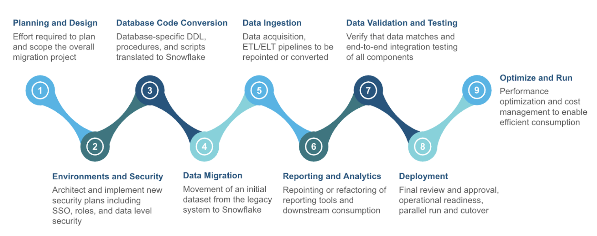

There are many phases in this migration framework, but most of them can be bucketed into three larger categories:

- **Assessment** - Understand what you have
- **Conversion** - Move it to the new platform
- **Validation** - Test that everything works

We will walk through all the nine phases shown above in this Hand-On-Lab, but note that the primary activities we are doing are the three listed above. If you get lost or you’re not su    re where to go next, remember to assess -> convert -> test. Let’s start with the assessment phase. 

> 
> Note that executing a migration requires a close eye on access and security. You will be running two platforms in parallel, and getting a whole new environment setup. For the purpose of time in this lab, we have already set up the target (Snowflake) environment for you, and we will assume you are the only user of this environment. But full RBAC management and support is something every database administrator will have to deal with.

### Planning and Design

As was mentioned previously, this migration will take a single database that the AdventureWorks company has and migrate it to Snowflake. This will include any data pipelines that are bringing data in and out of this mart. 

To better understand everything that is bringing this data in and out of the pipeline, let’s put together an architecture diagram. 

#### Source Architecture

Getting an architecture diagram is often one of the first steps in understanding what you have. If you’ve never built an architecture diagram, it can seem like a daunting task. A few suggestions would be:

- **Start simple.** Don’t try to create a complete picture in an orderly way. Identify key components, then start listing the components that interact with this data.
- **Socialize your drafts.** Data owners across any organization will know best how users are interacting with the data. The knowledge is not always consolidated with the systems or IT team.
- **Identify opportunities for improvement.** When you can visually see the connection points in your system, sometimes the opportunities for improvements in performance, price, or complexity are immediately identifiable.
- **Revisit it.** Most organizations' data landscapes change wildly in a very short period of time. These static diagrams are quickly out of date, and when the discussion of modernization occurs, the creators are not around anymore or they are simply not aware of changes that have occurred.

Snowflake won’t suggest a specific tool that will help you manage your architecture, but there are tools available. 
Here’s a simple diagram.
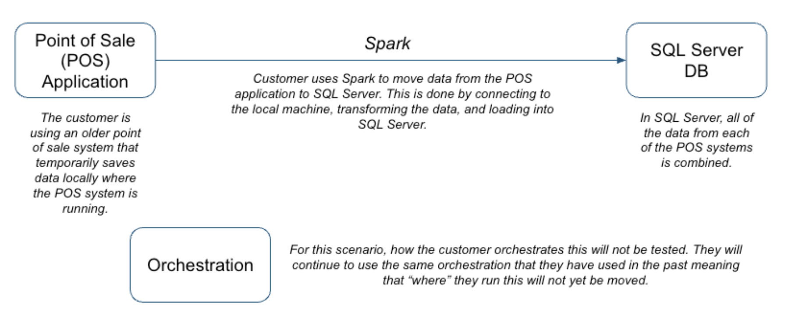

Spark is being used across this organization in a variety of ways, but for this POC, it is simply being used as ETL. It is being orchestrated by Airflow, but that is assumed to continue for the moment. 

#### Target Architecture

This is the source system that we have. Let’s consider the future state

As we migrate, this is going to be our goal. Our inventory of artifacts in the source configuration will map over to objects in the target.
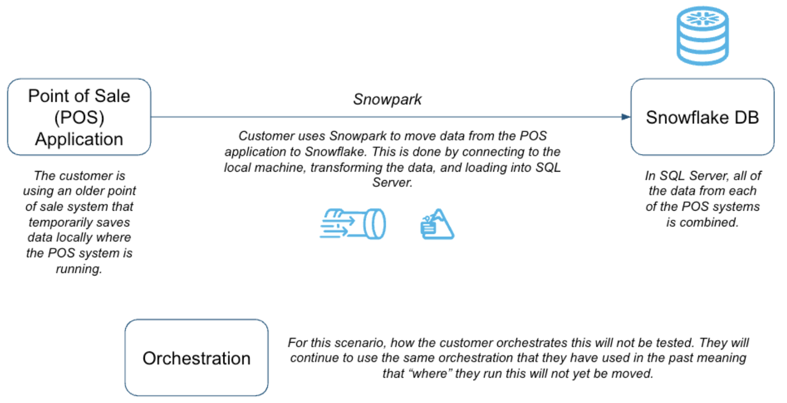

Note that this is a **lift-and-shift migration**. This means we are going to recreate exactly what is in the source in the target environment. Everything that was in our SQL Server data mart plus everything that was connected to it will be recreated as is. Once you are on the new platform, then you can optimize. 

Some may advocate for a different approach to the migration that is more of a lift-adjust-shift. While this approach may yield some optimization benefits sooner in the migration process, most projects will take longer and the testing will be considerably more challenging. Most migration projects benefit from the lift-and-shift approach, but it especially makes makes the most sense for our two goals:

- Prove the migration is possible
- And do it in 90 minutes.

As a result, we will be moving the following and testing them in Snowflake:

- SQL Server Database
- Python Notebooks with references to the Spark API

#### Inventories

In order to get started with this, we will need to build some object inventories of what we have in our existing system. We may know that we have a SQL Server data mart that we want to move with some Jupyter notebooks, but what objects are we migrating? What local files are we reading from? What dependencies exist across those objects and files?

For a smaller migration like this, this may be easy to track down manually. But for large migrations with multiple data sources, multiple different types of pipelines, and multiple different data owners, this can be nearly impossible. The challenge of understanding what you have often leads to the project never even getting off the ground. 

Luckily, Snowflake has some tools to help you understand what you have. These tools are not specific to building an object inventory, but rather are comprehensive tools for assessment and conversion of source code to Snowflake. These two tools will be with us most of the way, so let’s go ahead and introduce them now:

- **SnowConvert**: SnowConvert is a tool that scans source code, reports on what it finds in the code, and inventories that code.
- **Snowpark Migration Accelerator (SMA)**: The SMA is built on the same framework as SnowConvert, but it takes in code written in Python or Scala with references to the Spark API in them.

Each of these tools is built on the basic principle that your codebase can be scanned, and a semantic model of everything that is happening in your code can be built. From this model, various reports (like an object inventory) and the output code can be generated.
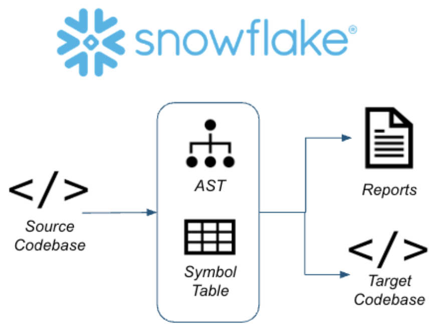
So let’s do this for real. Let’s start getting our inventory of objects together. 

For expediency in this lab, we are going to go straight from the assessment into the conversion phase. This means that we will look at the assessment data while we work through the conversion. Note that in reality, we would want to understand everything we have, before we start to move it.

Now that we have an inventory of the artifacts we’re looking to move to Snowflake, let’s go ahead and move them. 
We’ll walk through moving the following steps:

- Database Code Conversion
- Data Migration
- Data Ingestion (pipelines)
- Reporting and Analytics

While at the highest level, this phase focuses on moving or converting from the source to Snowflake, there will often be testing and additional pieces of code to assess as we move through it. Meaning that while we do this conversion, it will be iterative with the testing intermixed into the process.

## Database Code Conversion

We will start by assessing what we have. SnowConvert.

### Project Creation

We have an adventure works database in SQL Server, and we have some spark scripts that load data into the sql server. The customer wants to move all of this into Snowflake.

The SQL Server is in an Azure environment that we have in Snowflake, but can make public for a temporary amount of time?

How do we connect to it? Through SnowConvert. Let’s do that now.

Open SnowConvert. Currently, [it can be downloaded from here](/en/migrate-to-the-cloud/snowconvert-ai/). An installation package file will be created. You can then open this file and install the application on your machine.

Agree to the Terms of Use by selecting “Agree”.
> 
> Note that if you are on a Mac, you may be asked to move the application to your windows folder.

**Open SnowConvert**: When you open the application it may prompt you to update it:

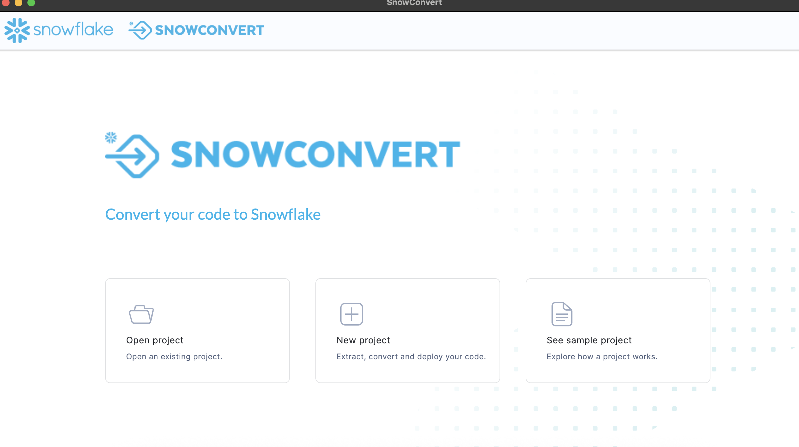

We won’t do that at this time, but when working with the application, it is generally better to keep it as up to date as possible. This is a local application. Keeping it up to date not only ensures the functionality of the application, but also ensures that you have the most up to date version of the conversion core.

**Select New Project**:


To begin using any version of SnowConvert, you will need to create a project. Think of a project as a local config file that will be saved to your machine. This will preserve any settings and will allow you to continue where you left off if you need to step away.

Let’s call our project: **SQL Server ADW Test.**

We then need to select a source. In this case, it is SQL Server.


To run any element of a project in SnowConvert, you will need to provide an access code. Unless you have used SnowConvert before, you will need an access code. Happily, you can request access in the tool by selecting “Get an access code” next to the access code drop down. 

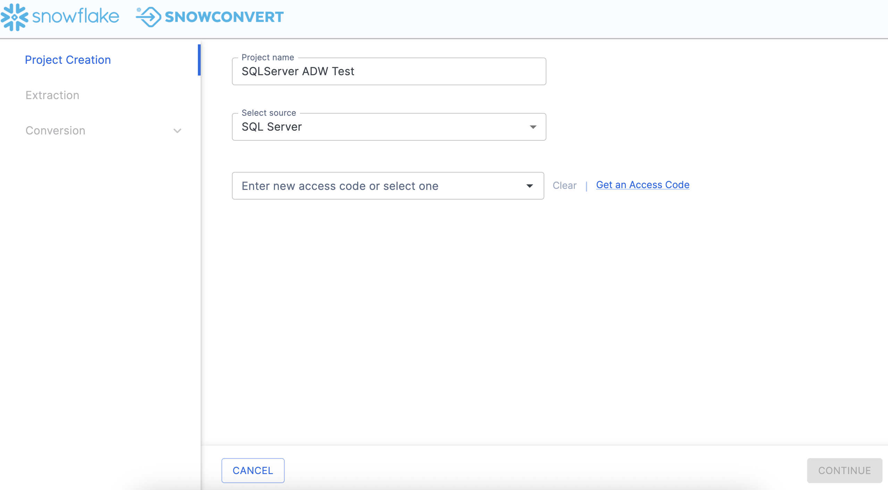

Note that if you have already activated an access code, you will see options in the dropdown menu in the license screen as shown here:


You can choose an access code from this list if you have already activated one.  

Assuming we do not yet have an access code, let’s request an access code. Choose “Get an access code” from the menu to the right side of the dropdown menu. When you do this, the access code form will pop up:


This information is needed to confirm who you are to Snowflake. It will not be used by the SnowConvert team to start sending you the latest and greatest update on what’s new in migrations. (Though if that’s something you’d be interested in… let us know.) 

Once you complete the form, you will receive an email with an access code. It will look something like this:


Paste this access code into the application where it says “Enter new access code or select one” in SnowConvert. When your access code has been accepted, you will get a small message under the dropdown menu that says **“Access code activated successfully”**.


You will need to have an active internet connection in order to activate your access code. If you are unable to activate your access code, check out the [troubleshooting section](https://docs.snowconvert.com/sc/general/frequently-asked-questions-faq#why-am-i-not-receiving-an-access-code) of the SnowConvert documentation.

Now that we’re active, let’s Extract! It’s time!

### Extract


From the Project Creation menu, select the blue **CONTINUE** button in the bottom right corner of the application. Then click on **From SQL Server** in order to extract code from source database.

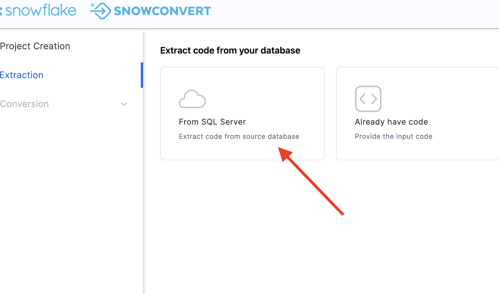

When you scroll down, you will have to enter the connection information:

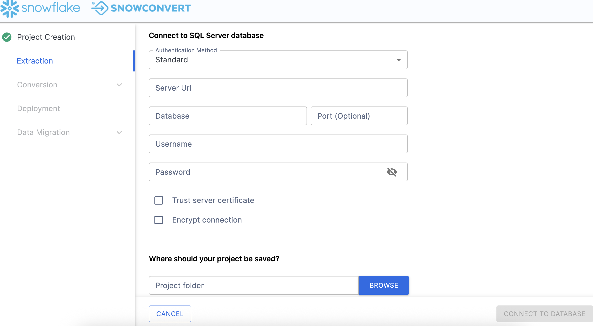

For this Hands on Lab, we will provide you with some credentials. However, if you are executing this outside of the friendly confines of this hands on lab, you will need to enter your own credentials. 

Fill the connection information to connect to Adventure Works, you can build your own Adventure Works environment [here](https://learn.microsoft.com/en-us/sql/samples/adventureworks-install-configure?view=sql-server-ver17&tabs=ssms) as well. 

- Authentication Method: Standard
- Server URL: *Adventure Works Connection URL*
- Database: *AdventureWorks*
- Port: *1433*
- Username: *Fill the user name here*
- Password: *Fill the password here*

Check both boxes for “Trust Server Certificate” and “Encrypt Connection”. 

Next, we will have to specify a local path for our project folder. Anything that we do SnowConvert will be preserved in this project path as well as anything that is created locally. Choose a path that is fully accessible to you. This is the path I chose: `/Users/userName/tmp/SQLServer_ADW_Test`

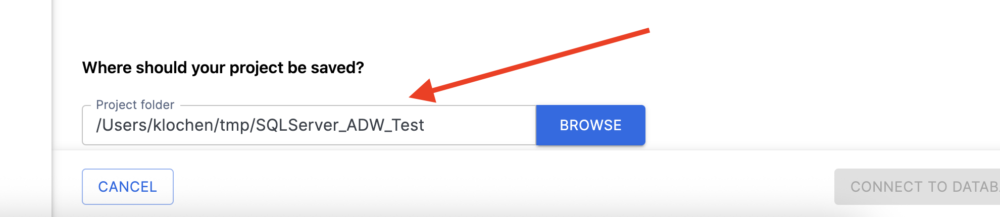

Finally, you can click `CONNECT TO DATABASE`, then you will get a pop up that says “Connect Established” when you have connected. SnowConvert will then take you to the catalog screen:

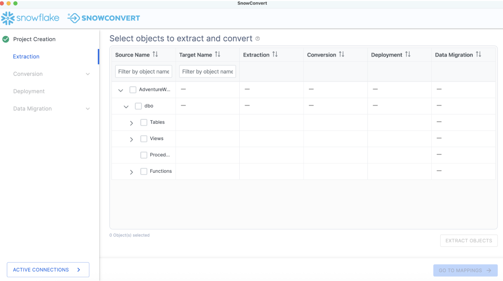

The catalog screen allows you to browse objects that were found in the database. For SQL Server, this could be tables, views, procedures, or functions. Nothing has been converted yet. This is merely an inventory of what SnowConvert found in the source. 

Using the catalog, we can select a set of objects for which we’d like to extract the DDL. Using the filter options, you can search for a specific object or set of objects. Using the checkboxes, you can select a specific subset of objects or select the highest checkbox to select everything:

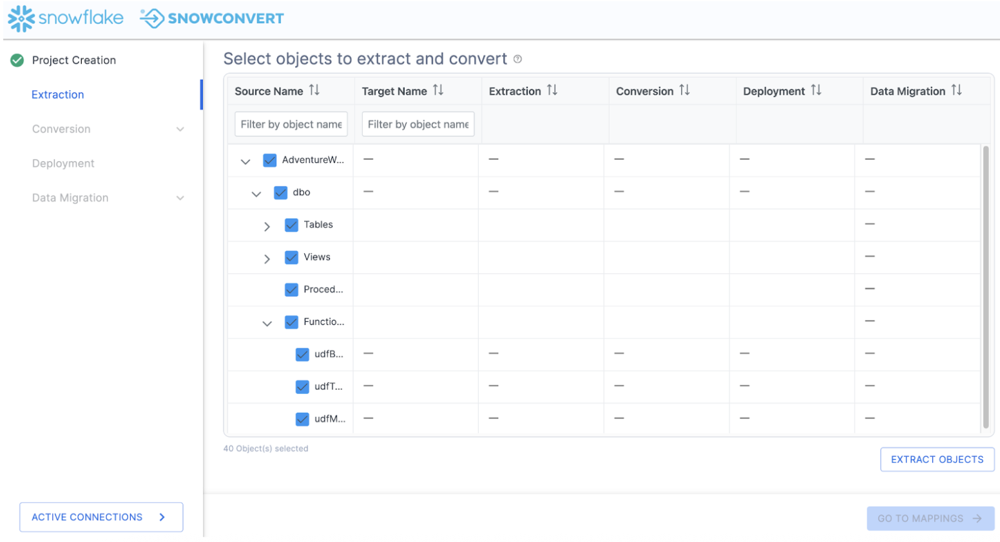

In this example, we will select the top checkbox and select everything. This will include tables, views, and functions. Then select “EXTRACT OBJECTS” to extract the DDL. 

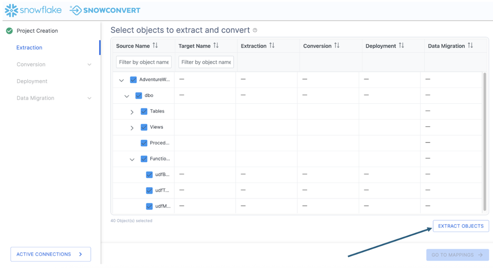

This will create a folder on the local machine preservig the structure of the objects in the database with a file for the DDL for each object.
When the extraction is complete, you will see a results screen similar to this: 

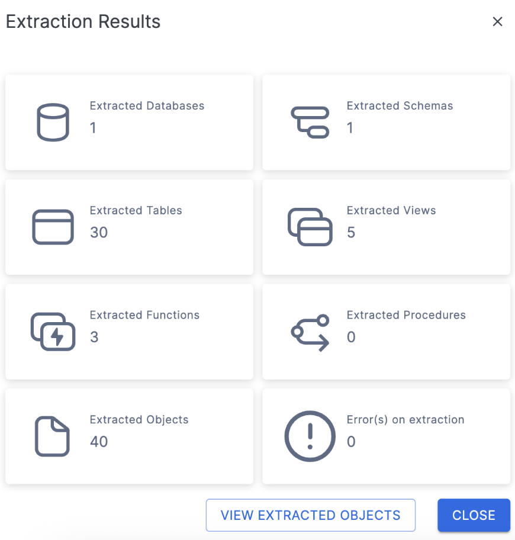

This will give you a brief overview of what was extracted. If there were errors or something was not able to be extracted, it will be reported to you here.

You can select “VIEW EXTRACTED OBJECTS” to see where SnowConvert put the extracted DDL. But since the number of objects we have extracted matches what we expected and there are no errors, we can close this dialog menu and return to the catalog.

Note that now we can see a green checkbox where the DDL was successfully extracted for the object:

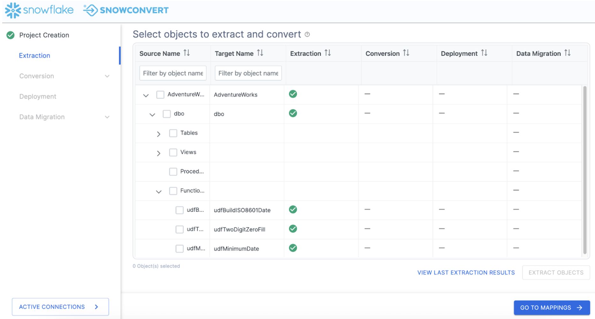

If there was an error extracting the DDL, you would see a red X and would need to resolve why that was not extracted.

### Conversion

At this point, we’ve extracted the objects in the database and we’re ready to assess the compatibility with Snowflake and begin the conversion process. There are some optional steps we can do before we get to the conversion itself. Let’s take a look at this by selecting “GO TO MAPPINGS ->” in the bottom right corner of the application.

This brings us to the mapping screen.

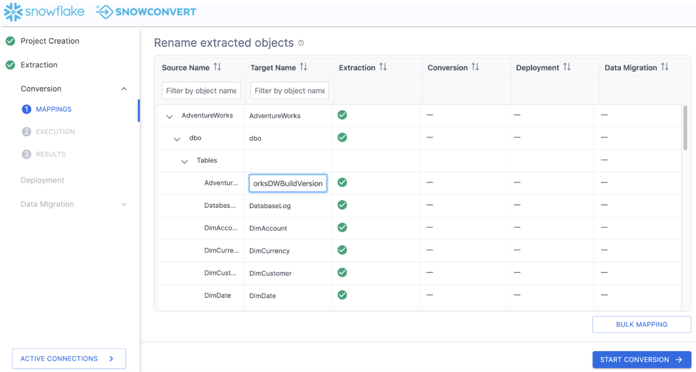

On this screen, you can choose a new name for a specific object in Snowflake (i.e. map a single object from SQL Server to Snowflake). You can also choose BULK MAPPING to apply a prefix or suffix to all of the objects or a subset of them (such as tables or view).

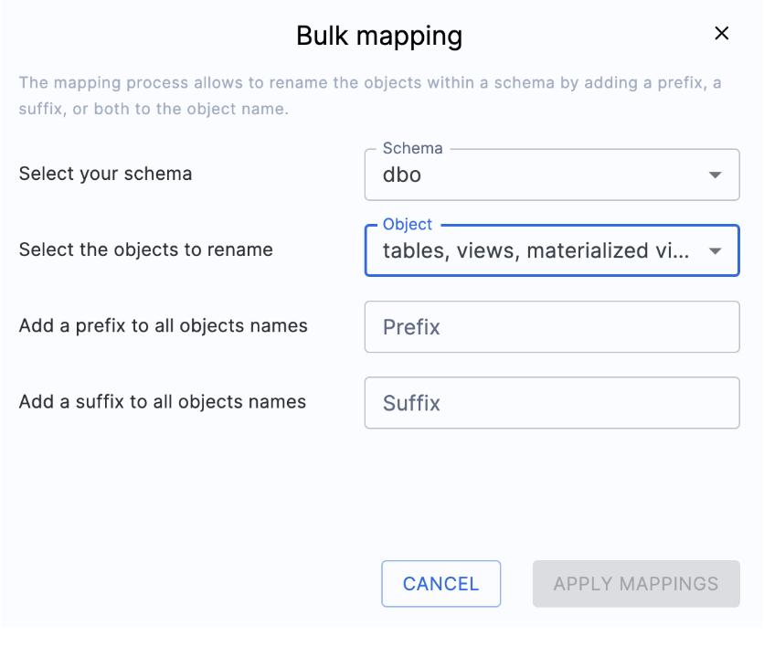

Note that this is completely optional when doing the migration. In this scenario, we will not do any custom mappings. 

Because this is a poc, we’ll apply the suffix “_poc” to all the objects that we have in our database. Because this applies the change to the object itself, any relationship to the object will be updated to reflect the new name. (For example, if the name of TABLE_A was changed to TABLE_A_poc, and TABLE_A was referenced by FUNCTION_B, the reference to TABLE_A in FUNCTION_B will be changed to TABLE_A_poc.)

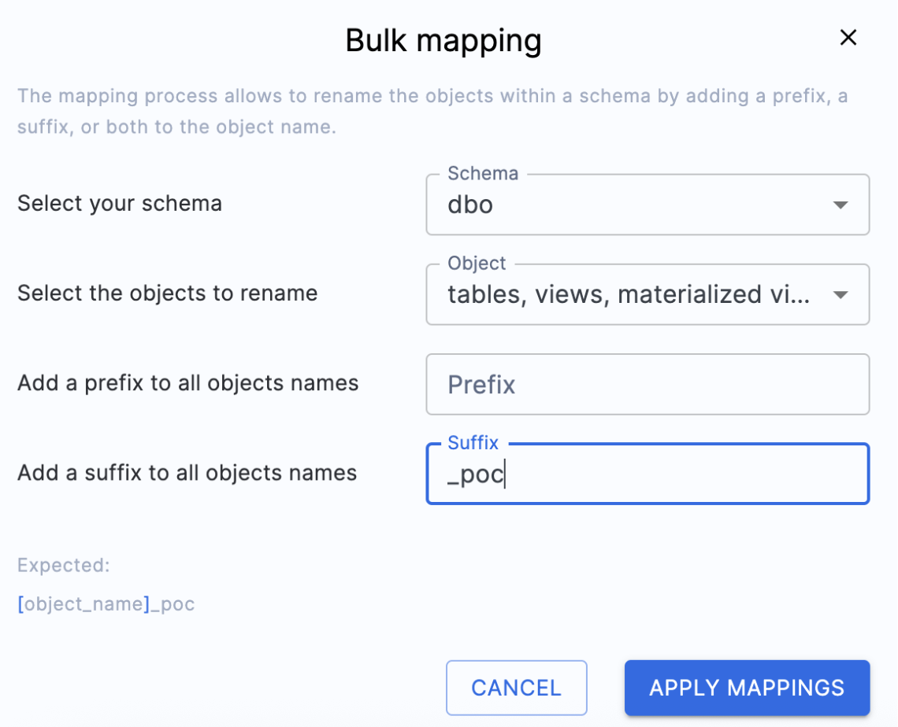

In the suffix panel, we can add the suffix we want to fix to each object name. Select “APPLY MAPPINGS” and you will see the name changes in the Target Name column of the catalog:


Note that you can still edit individual object names if so desired.

Now that we’ve mapped all of the source and target objects, we can run the conversion and view the assessment information. Select “START CONVERSION”.
Since we are leaving our object names unaffected, let’s start the conversion process. Select “START CONVERSION” in the bottom right had corner of the application.

It’s possible you will view an error message similar to this one:

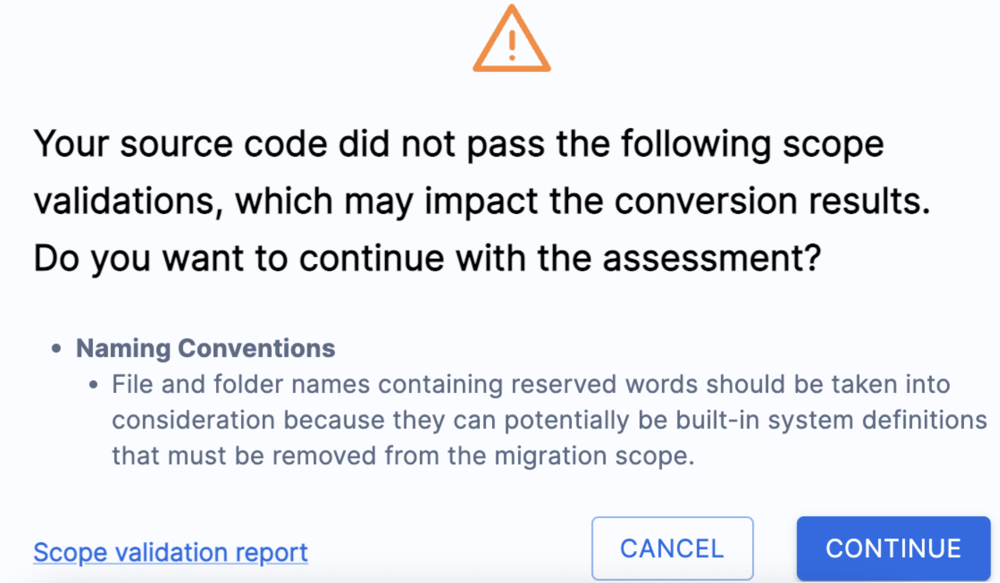

This simply means that SnowConvert has scanned the code that it extracted from the database before it runs its conversion script, and has found some things that COULD cause errors. It will tell you some things you might want to change in the source before converting. These can be found in the “Scope validation report” that you can read. In this scenario, we’ll just click “CONTINUE”.

SnowConvert will then execute its conversion engine. This is done by scanning the codebase and creating a semantic model of the source codebase. This model is then used by SnowConvert to create the output Snowflake code as well as the generated reports. 

When the conversion is finished, each step will be highlighted:


Select “VIEW RESULTS” to… well… view the results.

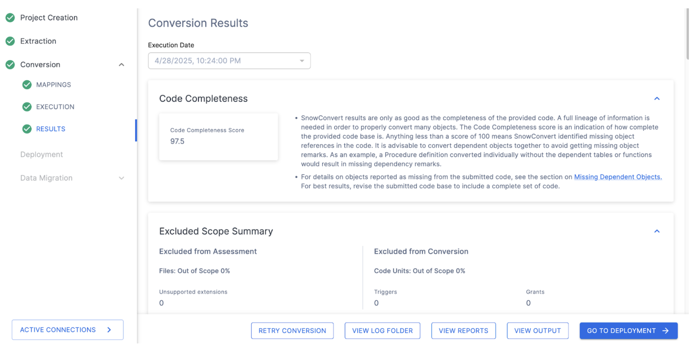

The results page will give you a code completeness score initially, but there is more information below if you scroll down. There is more information on each element of the output report in the SnowConvert documentation, but we’ll just highlight a few elements of the report for this lab, and we’ll do the followup for each of them which will explore more in depth. 

**Code Completeness**: This is a reference to any missing elements or objects that are not present in the codebase. If you have 100% code completeness, then you do not have any missing objects or references to missing elements in the codebase. 

In this scenario, we have an overall 97.5% completeness. This is broken down in the Assessed Conversion Scope Summary (scroll down in the application to find this section):

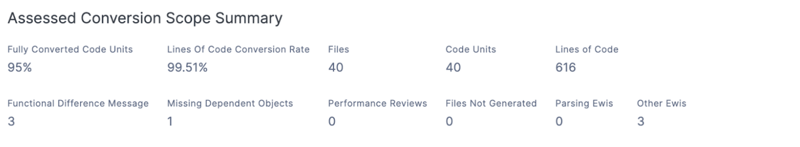

> 
> 
> We may not need to resolve any missing dependencies (it’s unlikely in this scenario because we did a direct extract from the database), but we still want to see why SnowConvert is telling us that something is missing. 

To do this, let’s visit the additional reports that are generated by SnowConvert. Select “VIEW REPORTS” from the bottom of the application:

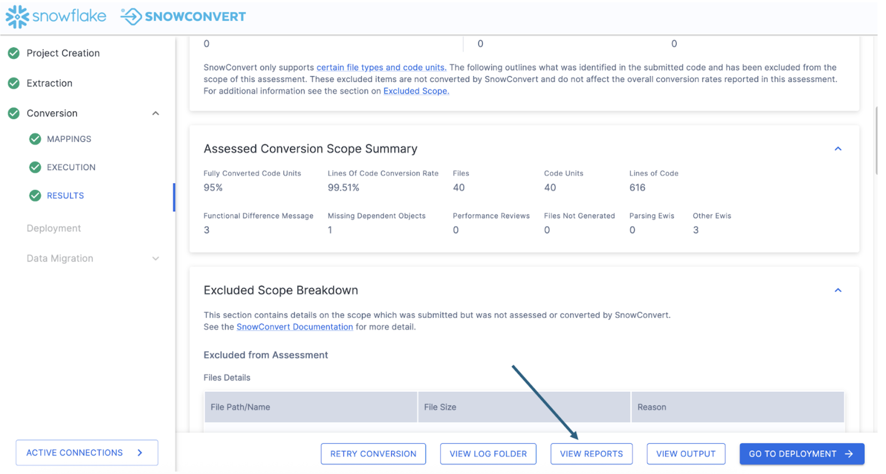

This will take you to your file explorer, specifically to the local directory where the reports generated by SnowConvert have been created. This will be within the directory that you specified in the project creation menu at the start of the project. 

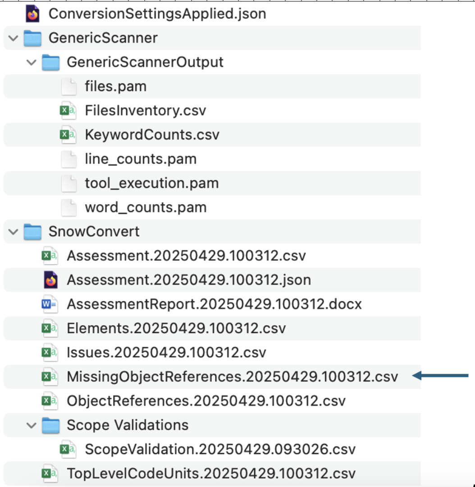

> 
>
> Note that the extracted and converted code are also in this directory structure, but we’ll get to those later.

In the SnowConvert folder, you will find many reports. We’ll view some of them later, but for now, let’s focus on the MissingObjectReferences.csv report. Open this one.
In this file, we’ll find the name of a referenced element that is not present in the DDL of the output code. 

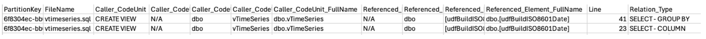

Let’s validate that this is a missing reference. There are several ways we can do this, but the first would be to simply open the object inventory and validate that this function actually does exist. The inventory of all code objects in this scan is in the **TopLevelCodeUnits.<datetime>.csv** file: 

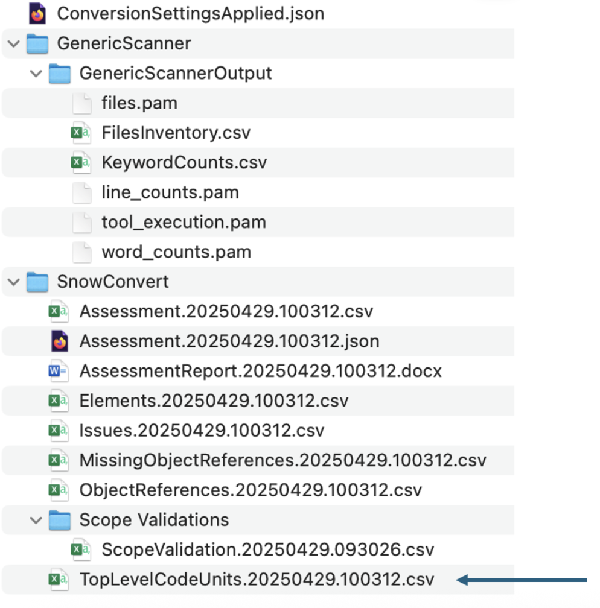

Opening this file, we can search for this reference in the CodeUnitId column:


Huzzah! I have found it here. This means that the object does exist. Why did SnowConvert identify it as a missing object? That’s a great question. It could be that it’s called in a way that SnowConvert could not resolve. It could be that there was an error with SnowConvert, and it did not resolve the function name with the function DDL. We’ll have to dive deeper into why when we work through the issues. For now, it’s enough to know that the object does exist and we do not need to figure out how essential it is to track down. This may still come out when working through the issues, but let’s find out then. 

If the result is 100% code completeness:

In this scenario, we have 100% code completeness. This makes sense given that we are exporting this directly from the source. If you do have missing objects here, the recommendation would be to open the reports folder and validate that the missing objects are either known to be missing or find the DDL for this object.

**Conversion Overview**: Now that we have seen that we have the code that we need for this, let’s see how much of our code was converted. Let’s review the Code Units Summary section here:

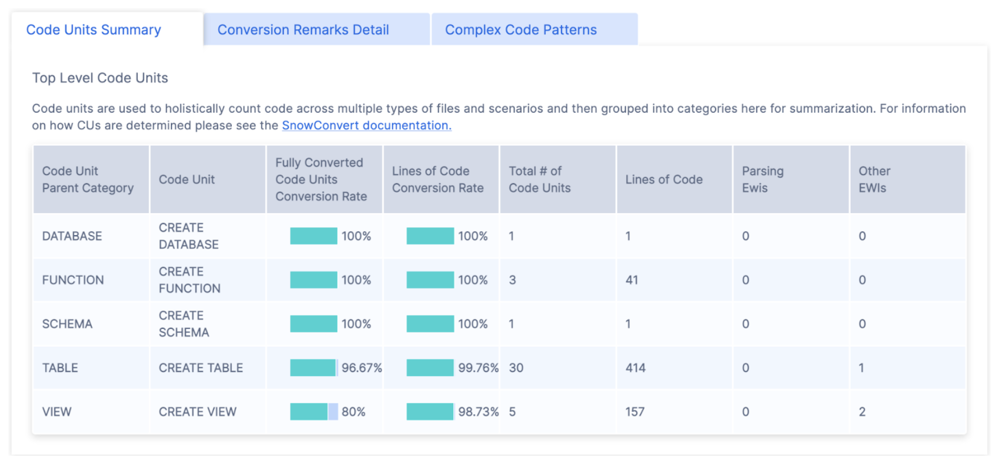

Looks like we have tables, views, and functions in this codebase, but not a lot of code in general (this looks like less than 1000 lines of code in total). There also are only three “EWI’s” (in the last column), meaning that the majority of this extracted DDL can be moved over to Snowflake just by using SnowConvert. We’ll look through the EWI’s in a moment. 

Understanding what we have is essential to successfully completing a migration. If we were pre-migration, we would likely stop here and review the object inventory. We’d also want to run the Snowpark Migration Accelerator (SMA) to validate that any pipelines we have include the objects that we are migrating here. In this scenario, we are going to go ahead and move forward to work through any issues that we have and will run the SMA later.

Since we have a good understanding of what needs to be done and it’s relatively small, let’s go ahead and attack this. Let’s resolve the issues that we have present. Before we do that, let’s take a look at the status in our object inventory. Select “GO TO DEPLOYMENT” in the application.

## Deployment and solve issues

This will take you back to the inventory screen. It should look something like this:


This is the same inventory that we have already seen, but note that now we can see a status in the conversion column. There are a few different elements that we can see here that are based on the conversion status. This lets us know which objects were fully converted (a green checkmark), which objects have a warning that you should consider (a green checkmark with a blue “i” icon), and which objects have a conversion error that must be addressed (a red “X”). These statuses are determined by the error messaging that SnowConvert has placed into the converted code. The objects with a red “X” have an error message that will produce an error if you attempt to run that SQL in Snowflake. If you resolve the errors, then you will be able to deploy the output code. SnowConvert is connected to your project directory, so as long as you keep the files in the same location that SnowConvert put them when it converted the code from the source. 

Let’s see this in action by resolving the issues.

### Resolving Issues (powered by Cortex AI)

SnowConvert will generate you an inventory of all issues that it encounters. This is in the issues.csv file. Let’s take a look at issues that we have available in this execution of SnowConvert.

To find the issues report, go to “VIEW OUTPUT” in the bottom of the SnowConvert application. 


This will take you to a directory title “Conversion-<datetime>” within the directory you originally created in the project creation screen at the start of the project. This output will have three different sub directories:

- Logs
- Output
- Reports

Let’s first visit the reports directory to see what issues SnowConvert identified with this conversion.

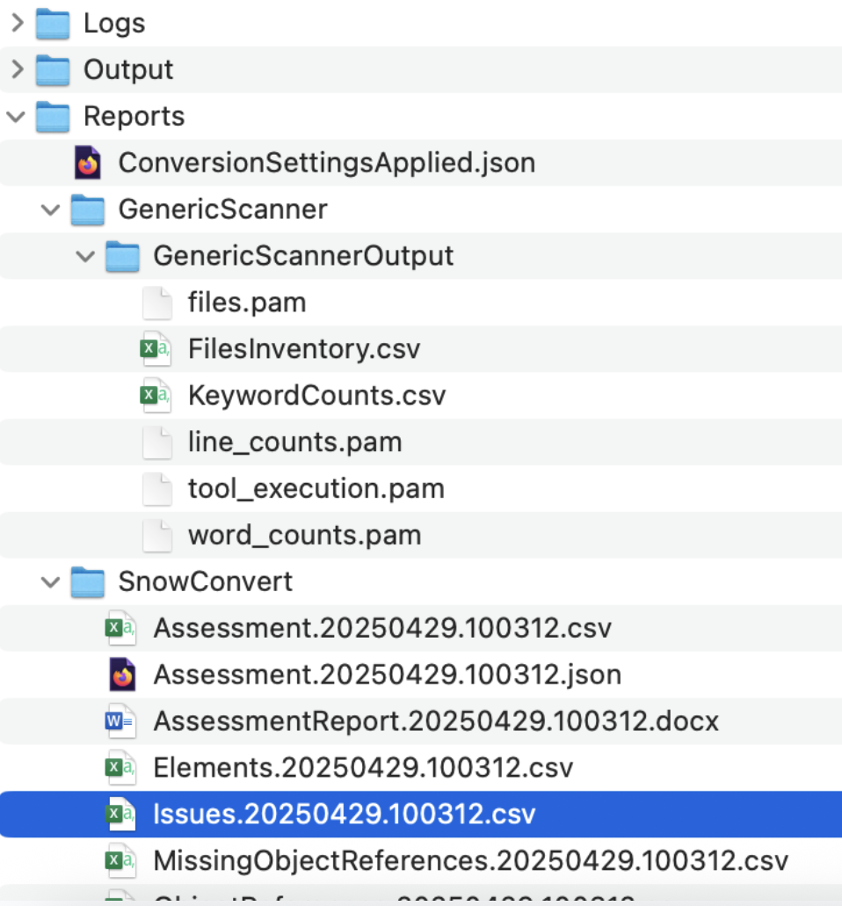

The issues.<datetime>.csv report will be available in the reports folder under the SnowConvert subfolder. In this report, you will find the type of each error as well as its location and a description of the error. There are three major types of error generated by SnowConvert:

- **Conversion Error (EWI)**: generally, this is something that the tool could not convert or hasn’t seen before
- **Functional Difference (FDM)**: this is code that has been converted, but may be functionally different in Snowflake. These errors should be treated as warnings, but paid close attention to during testing.
- **Performance Reviews (PRF)**: this is something that SnowConvert identifies that will run in Snowflake, but may be suboptimal. You should consider optimizing this once you’re up and running in Snowflake.

There’s more information on each of these [in the SnowConvert documentation](https://docs.snowconvert.com/sc/general/technical-documentation/issues-and-troubleshooting). Let’s look at what we have in this execution:

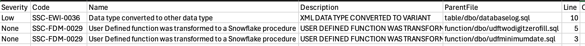

We can see that some issues share an issue code, but we can see specifically which file has the issue in it and a description of what the issue is. This is a very low number of issues. There will not be a ton of things to work through.

There are many approaches to dealing with the conversion issues generated by SnowConvert. We would recommend that you start in the same order you would want to deploy the objects: tables first, then views and functions, followed by procedures and scripts. You could pivot this table by the root folder (which will have the object name in it), then sort by severity and type. Depending on your timeline and business need, this would allow you to deal programmatically with the most critical issues in the order of deployment.

However, in this lab, there are such a small number of issues, we don’t really need to pivot this file. However, we will still start with the same approach. Where are we going to deal with these issues? Snowflake would recommend that you use the Snowflake Visual Studio Code Extension, and that is what we are going to use right now.

Throughout this lab, anytime that we are going to interact with the code, we are going to use the Snowflake extension for VS Code. We can open it now and leave it open for the duration of this lab. If you have not yet downloaded the [VS Code extension](https://docs.snowflake.com/en/user-guide/vscode-ext), you can do so from within VS Code or from the [VS Code Marketplace](https://marketplace.visualstudio.com/items?itemName=snowflake.snowflake-vsc).

When you first open VS Code, navigate to the settings for your extensions. In the settings for the Snowflake extension, you will need to enable the SnowConvert Migration Assistant:


Note that we will be using Snowpark Checkpoints later on in this lab. While you’re here, you may as well enable that part of the extension as well.

When you enable this, VS Code may prompt you to restart. Even if it doesn’t, it’s a good idea to restart the application now.

Once you’ve restarted VS Code, open the Snowflake extension and login to your Snowflake account. For this lab, Snowflake accounts have been created for you and provided via the information available for this lab. 

Now we should be ready, let’s open a new browser window, and make our root directory the same one we created in the project creation menu. This will allow us to access both the extracted source code and the output Snowflake code that has our issues in it.

You should see a folder that has the name of the project you created in the project creation screen:

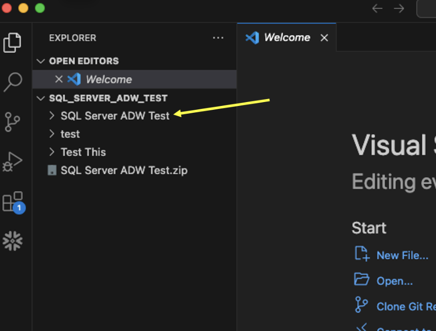

> 
> Note: if you expand that folder, you should see an input and an output directory

The extracted code is in the input directory, and the Snowflake code generated by SnowConvert is in the output folder. But we will not need to navigate this folder structure to find our issues. We can use the Snowflake extension.

Open the Snowflake extension, and you should see a section called **SNOWCONVERT ISSUES**. It should automatically load the list of issues under the VS Code's root directory.
<!-- 
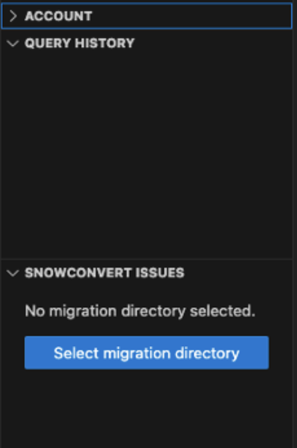

It should take you to the same folder that you already choose as your root directory. You can choose the folder that has the name of the project you created in the project creation:

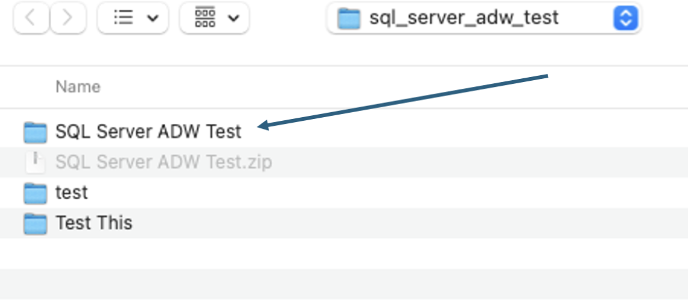

When you select this folder, it should show you a few additional folders. These are from the output directory where you generated the output code. These will be each of the files that has an issue in it:
 -->


Let’s expand this so we can see it a bit better:

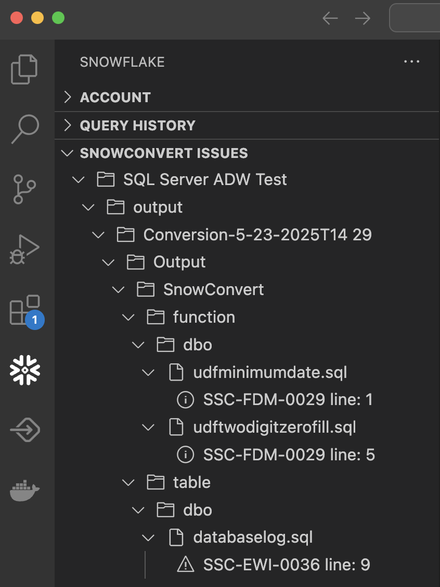

You can see each of the files that has an EWI in it and the exact location.

> 
> Note: for most migrations, this will be exceptionally large. It would be good to plan how to approach the issues using the issues.csv spreadsheet as mentioned earlier.

If you select a specific error, it will take you to the place in the code where that error can be found:

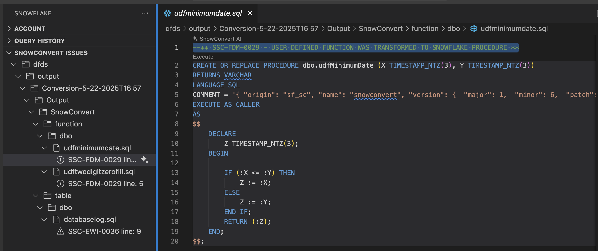

Let’s not start with the first error posted, but instead start in the order that was recommended earlier: tables, views, functions, then procedures/scripts. In this example, we have 1 table (in the file **databaselog.sql**) with an error in it. Let’s take a look:

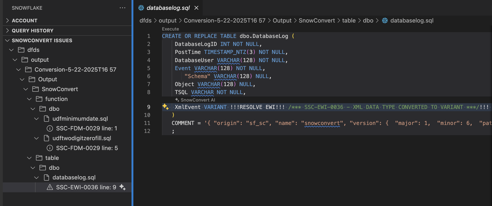

This error is an EWI saying that a datatype was converted to a different datatype in Snowflake. This doesn’t look like a problem, but more looks like SnowConvert is trying to tell us to validate that this is not a problem before we deploy. 

If we’re not sure that this datatype should be converted to VARIANT, let’s use the SnowConvert Migration Assistant to generate some more information on this error. To do this, let’s select the light bulb icon in the SNOWCONVERT ISSUES menu in the extension:


> 
> Note that a new window will pop up saying “Loading explanation and suggestion…”. This is connecting to your Snowflake account and passing the error message that SnowConvert generated to Cortex in your connected Snowflake account. It will give you an explanation after it has had a moment to think through it:


This explanation seems to validate that the conversion is correct. VARIANT is the right translation for an XML file. From this menu you can:

- Copy the replacement code that it has generated
- Chat with Cortex
- Return to the issue

Let’s say that we are not sure that this is the right conversion. We could ask Cortex if there are any other options for XML data in Snowflake.


Your results may vary, but this is what Cortex returned to me. VARIANT is still the recommendation. We’ll take a look that the data matches depending on how we are using this XML data when we test the result of this conversion.

For now, let’s replace the code with the EWI with the code that Cortex has recommended (which is essentially, to remove the EWI). Our new code looks like this:

```sql
CREATE OR REPLACE TABLE dbo.DatabaseLog (
    DatabaseLogID INT NOT NULL,
    PostTime TIMESTAMP_NTZ(3) NOT NULL,
    DatabaseUser VARCHAR(128) NOT NULL,
    Event VARCHAR(128) NOT NULL,
       "Schema" VARCHAR(128) NULL,
    Object VARCHAR(128) NULL,
    TSQL VARCHAR NOT NULL,
    XmlEvent VARIANT NOT NULL
   )
   COMMENT = '{ "origin": "sf_sc", "name": "snowconvert", "version": {  "major": 1,  "minor": 6,  "patch": "0.0" }, "attributes": {  "component": "transact",  "convertedOn": "05/22/2025",  "domain": "snowflake" }}'
   ;
```

And the EWI message is gone. Note, however, that the file and issue still appear in the SnowConvert Issues section of the Snowflake extension even after we refresh the list:

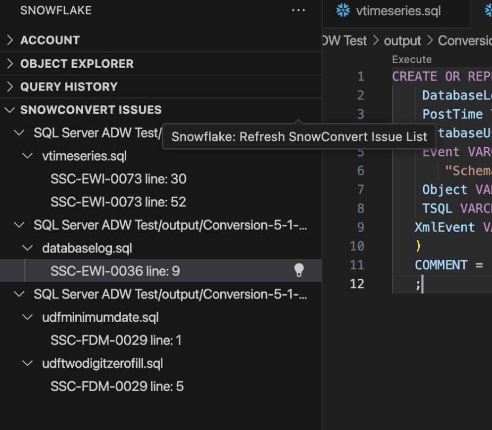

> 
> To remove this, we need to save the changes that we’ve made to the file. This will allow us to update the extension and the SnowConvert application. Let’s take a look at this.

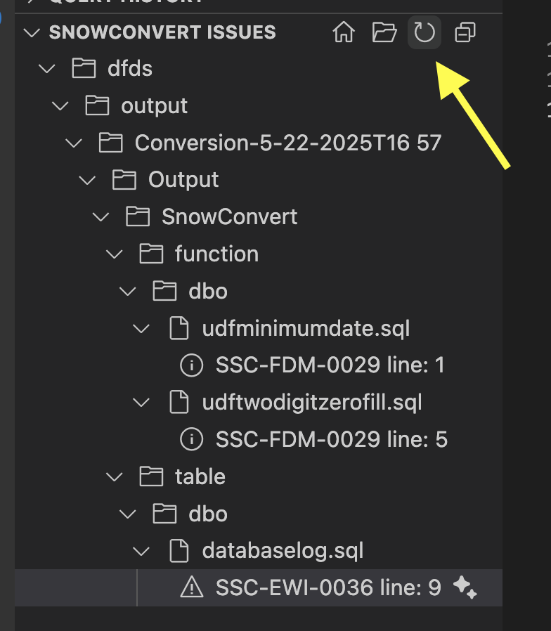

Now let’s refresh the SNOWCONVERT ISSUES list in the Snowflake extension, and the issue no longer appears. We can see this same behavior in the SnowConvert application.

If you return to the application, we should still be on the deployment screen. If you expand the “Tables” section of the deployment screen, you will see that “DatabaseLog” is marked with a red “X” indicating that it cannot be deployed.


However, now that we’ve resolved the EWIs in the DDL for that object, we can refresh this list by selecting the refresh icon in the top left of the application:


We should see that the red “X” now changes to a green checkmark.

If it does not change, then there are still errors associated with that DDL that need to be resolved. That does not appear to be the case here.

We can now continue to resolve the rest of the errors in our execution. The tables now all appear to have their issues resolved. (You can validate that they are ready to deploy by scrolling through the catalog in SnowConvert to see that all objects are marked with a green checkmark.)

If you are doing a large project, it might be a good idea to go ahead and deploy the tables. To validate that those are correct. However, views and functions should both be done before they are deployed. 

Let’s take a look at the remaining issues we have:

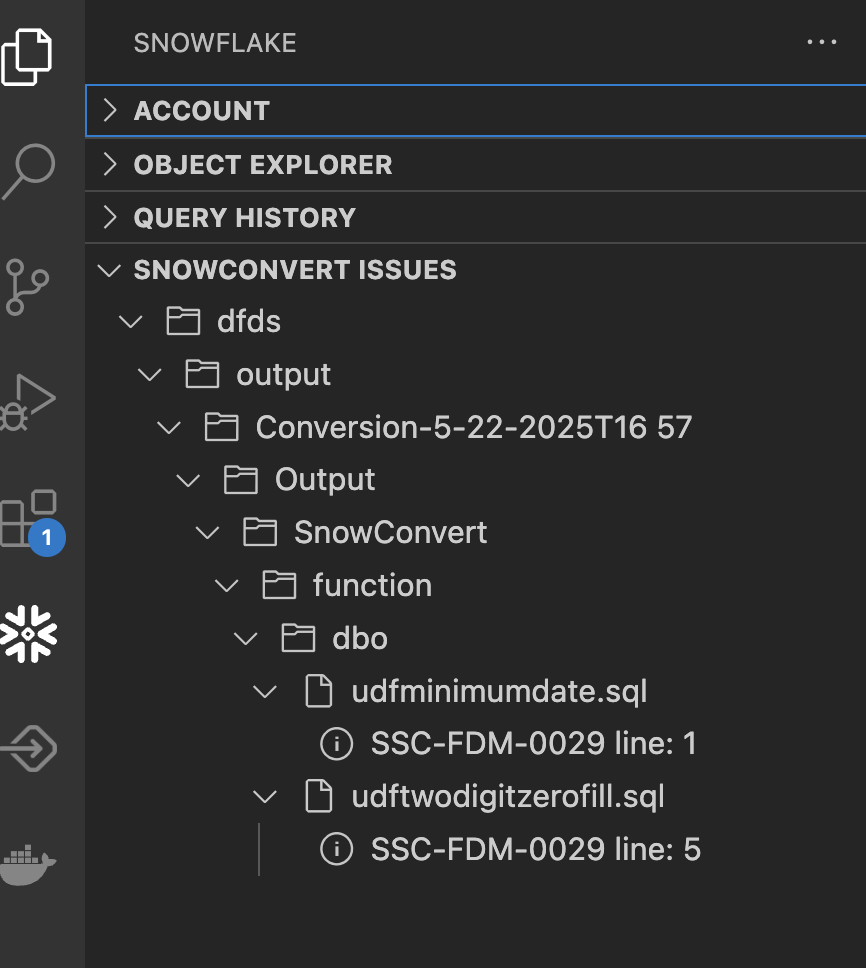

We have two remaining issues in two different functions, but they have the same error code. Note that this is also a FDM code, so there may not be a solution we need to apply here. Let’s select the first issue and call Cortex to tell us more about it. 

This is an interesting issue. SnowConvert has decided that this UDF should be turned into a stored procedure. This is an interesting decision as a stored procedure cannot be called in the same way as a function. But there are things that you can do with functions in SQL Server that you cannot do with a function in Snowflake. And if you ask Cortex what it thinks, it will disagree with SnowConvert and turn this back into a UDF:

```sql
CREATE OR REPLACE FUNCTION dbo.udfMinimumDate(X TIMESTAMP_NTZ(3), Y TIMESTAMP_NTZ(3))
RETURNS TIMESTAMP_NTZ(3)
LANGUAGE SQL
AS
$$
  IFF(X <= Y, X, Y)
$$
```

This is where you need someone familiar with how this function is used across the workload. Normally, we would inventory any reference to this function across the entire workload. Since this is a small POC, this function is not used anywhere else in this function. You can validate this in a couple of ways. The first is to simply search for the name of this object in the input directory in VS Code: 

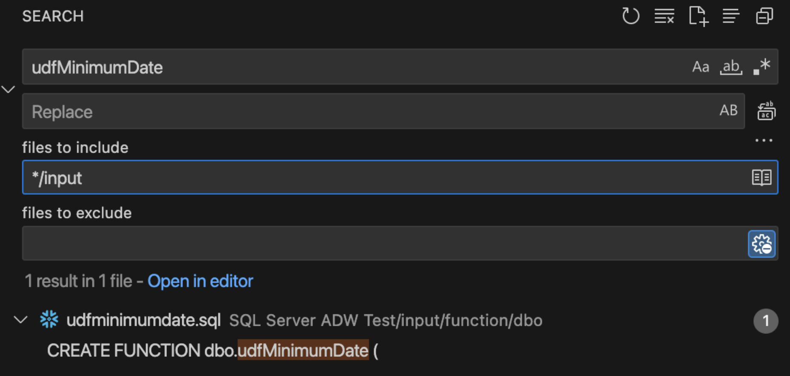

There is only reference to this function and it is in the create function statement. So it is not being used anywhere. We can also check the dependent objects inventory generated by SnowConvert. (You could do this in a file browser or in VS code directly.)

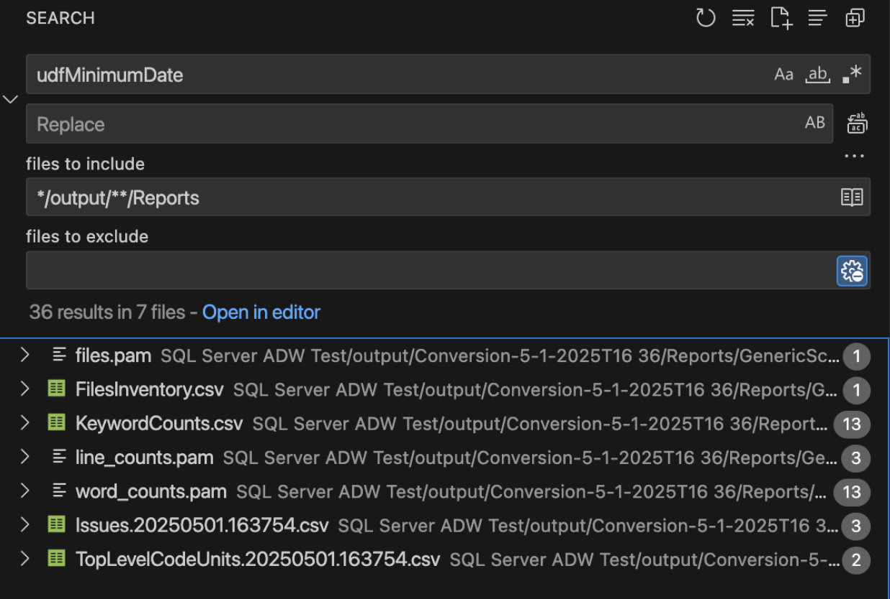

We can see that while there are many mentions of this object in the reports, there is no mention of this object in the **ObjectReferences.<datetime>.csv** report. As a result, this function is not used anywhere, so we’re not sure how this will be called.

So, should we go with what SnowConvert has generated or listen to Cortex? There are advantages and disadvantages to both, but the primary reason would be turning this function into a procedure means it WILL fail if it is called in a way that a procedure cannot be called. This means that you will be immediately alerted to this when you test this output. Leaving it as a function means that there may be functional differences that you may not immediately be aware of. 

In this situation:

- Interpreting what the function is trying to do versus the way it is written, I think this could be a UDF.
- It’s also likely that this is going to be called in a way that is not going to work for a procedure. 

So I’m going to make the choice to use the Cortex recommended code and put in the function code. However… I will add my own comment to the file that contains the code as a stored procedure. That way I can revisit it if I need to when it comes time to test these functions. That looks like this:

```sql
CREATE OR REPLACE FUNCTION dbo.udfMinimumDate(X TIMESTAMP_NTZ(3), Y TIMESTAMP_NTZ(3))
RETURNS TIMESTAMP_NTZ(3)
LANGUAGE SQL
AS
$$
  IFF(X <= Y, X, Y)
$$

-- SnowConvert turned this into a stored procedure. Leaving as a comment.
--** SSC-FDM-0029 - USER DEFINED FUNCTION WAS TRANSFORMED TO SNOWFLAKE PROCEDURE **
/* CREATE OR REPLACE PROCEDURE dbo.udfMinimumDate (X TIMESTAMP_NTZ(3), Y TIMESTAMP_NTZ(3))
RETURNS VARCHAR
LANGUAGE SQL
COMMENT = '{ "origin": "sf_sc", "name": "snowconvert", "version": {  "major": 1,  "minor": 6,  "patch": "0.0" }, "attributes": {  "component": "transact",  "convertedOn": "05/23/2025",  "domain": "snowflake" }}'
EXECUTE AS CALLER
AS
$$
    DECLARE
        Z TIMESTAMP_NTZ(3);
    BEGIN
         
        IF (:X <= :Y) THEN
            Z := :X;
        ELSE
            Z := :Y;
        END IF;
        RETURN (:Z);
    END;
$$; */
```

> 
> Note that I have left the FDM message in the code. This means that the SnowConvert catalog will still alert me that there is a warning present in this function.

I will save the file, and update the SNOWCONVERT ISSUES list in the Snowflake VS Code Extension. Note that this still leaves the FDM.

> 
> Note that this still leaves FDM in the browser because I intentionally left it in the file.

I will collapse this and take a look at the last issue. Since this issue has the same error code as the previous one, it is likely to be a similar case with a similar solution.

```sql
CREATE OR REPLACE FUNCTION dbo.udfTwoDigitZeroFill(NUMBER INT)
RETURNS VARCHAR
LANGUAGE SQL
AS
$$
  CASE 
      WHEN NUMBER > 9 THEN CAST(LEFT(NUMBER::STRING, 2) AS CHAR(2))
      ELSE CAST(LEFT('0' || NUMBER::STRING, 2) AS CHAR(2))
  END
$$
```

And… it is a similar issue. This function is doing something slightly different, but I will make the same decision here that I made before to trust that the function will give me the right result, preserve the procedure as a comment, and test this later on. 

Let’s save the file, and now… we are done! We have successfully navigated through the issues generated by SnowConvert.

Note that there are a large number of issues that SnowConvert can generate. The ones that we see here are generally something that you need to make a decision on the best solution path for your situation. 

Let’s validate this in SnowConvert. If you’ve saved each of the files, you should be able to see checkmark across all of the objects, though there will still be some blue “i” icon:


Let’s move forward in the process and deploy the code. This will run all of the DDL that we have extracted from SQL Server (and subsequently, resolved any issues with) to Snowflake. To deploy the code, select “DEPLOY” at the bottom of the application:


### Deploy objects

In order to deploy, you need to be connected to a Snowflake account. You will be prompted for your Snowflake connection information:


When you enter your login information, you may be taken to a webpage with this message.
```Your identity was confirmed and propagated to Snowflake Node.js driver. You can close this window now and go back where you started from.```
Most Snowflake accounts require authentication and this is a part of that authentication. You can return to the SnowConvert application to resume the deployment process. You should see some results from your deployment similar to this:

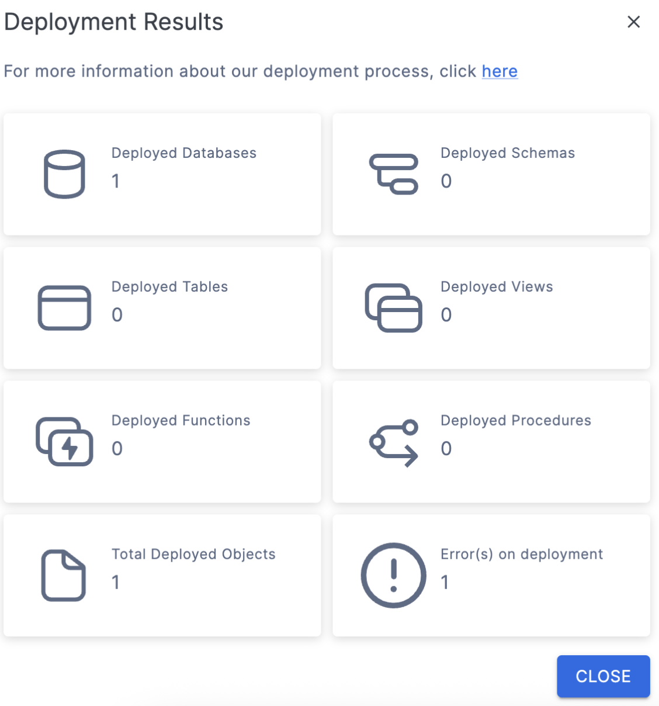

Now, we know there should be more than 1 object here. There is one error on deployment. You may also see an error message like this one:

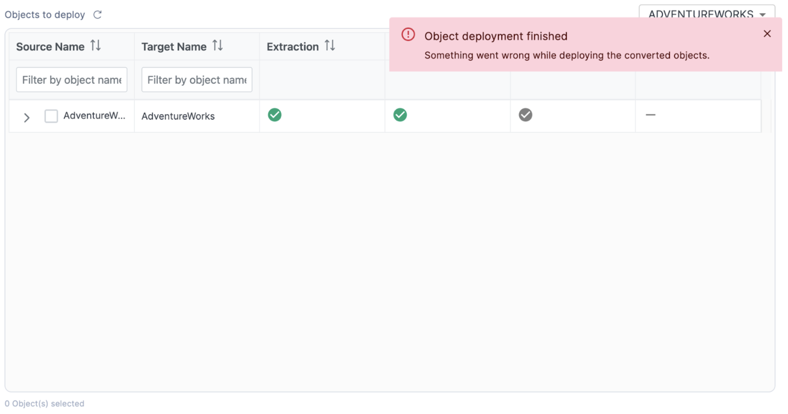

If you do see this, you can see why the error occurred in the catalog in SnowConvert by hovering your mouse over the top of the error symbol.


In this case, there is a permissions problem. Check the connection you are using. If this fails, you may want to create the DATABASE and the SCHEMA manually in the Snowflake, especially if the database you are creating already exists. You could troubleshoot this in SnowConvert, but it would be better to do so in Snowflake.

I have gone into Snowflake and created the database and schema we are using with the same credentials I am using to deploy in SnowConvert. Now I will try it again. This time, let’s just start with the tables. I will select the tables:


This time, the results will show that we were able to successfully deploy some objects.


This can be validated by querying the database in Snowflake:

```sql
describe schema adventureworks.dbo
```

I can see each of the tables that were just deployed. Now, let’s do the views and functions to complete the deployment. When we do, some of the functions and views deploy successfully, but there are still some errors.

Let’s see what is in those errors. If you return to the menu and hover over an object in the deployment column, it will tell you a bit more about why the object was not deployed:

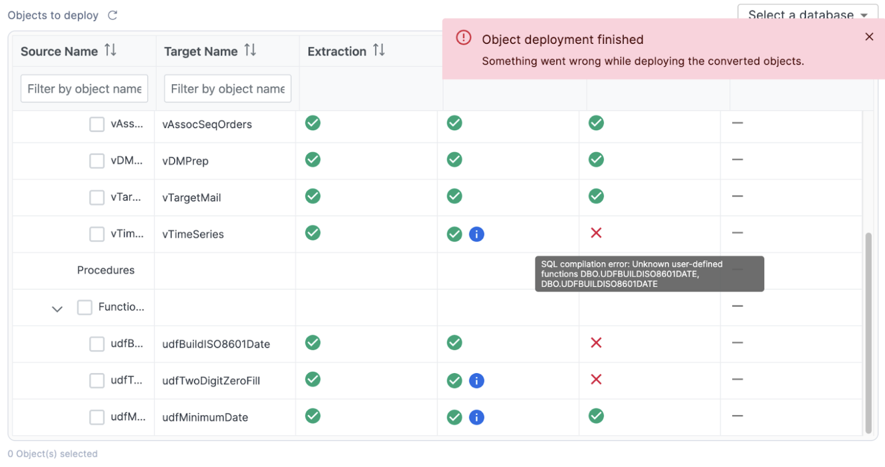

In this case, the view that we are hovering over has a dependency on a function. This function exists in this deployment, but SnowConvert is using a “brute force” method of deployment. This brute force method of deployment will lead to errors oftentimes because it is trying different combinations of deployment methods as opposed to ordering the deployment based on dependencies.

We can manually resolve this in the SnowConvert application though. Let’s start by seeing which object may have the first level of dependencies:

It looks like the view vTimeSeries is dependent on function **udfBuildISO8601Date**, and **udfBuildISO8601Date** is dependent on function **udfTwoDigitZeroFill**. 

Let’s try the last two objects in order with the function first, followed by the last view.


Another failure! Looks like the timestamp type that was moved from SQL Server to Snowflake was not compatible. So we need to change it to be compatible. If we look at a side by side comparison in VS Code of the source SQL Server code and the Snowflake code, we can see that the code in SQL Server is only returning a “datetime” value, not a TIMESTAMP_NTZ(3).

So let’s change the TIMESTAMP_NTZ(3) value to a TIMESTAMP_NTZ(9), but make a note to review this during testing.

```sql
CREATE OR REPLACE FUNCTION dbo.udfBuildISO8601Date (YEAR INT, MONTH INT, DAY INT)
RETURNS TIMESTAMP_NTZ(9)
LANGUAGE SQL
COMMENT = '{ "origin": "sf_sc", "name": "snowconvert", "version": {  "major": 1,  "minor": 6,  "patch": "0.0" }, "attributes": {  "component": "transact",  "convertedOn": "05/26/2025",  "domain": "snowflake" }}'
AS
$$
	SELECT
		TO_TIMESTAMP_NTZ(CAST(YEAR AS VARCHAR) || '-' || dbo.udfTwoDigitZeroFill(MONTH) || '-' || dbo.udfTwoDigitZeroFill(DAY) || 'T00:00:00', 'MM-DD-YYYY')
$$;
```

Save the file and refresh the SnowConvert application. Let’s try to deploy the last function again.


Success! We have all of our tables and functions deployed. There was one view that was not able to be deployed, but it was dependent on the functions being deployed. Let’s a take a look at that view right now. Let’s try to deploy the last view:

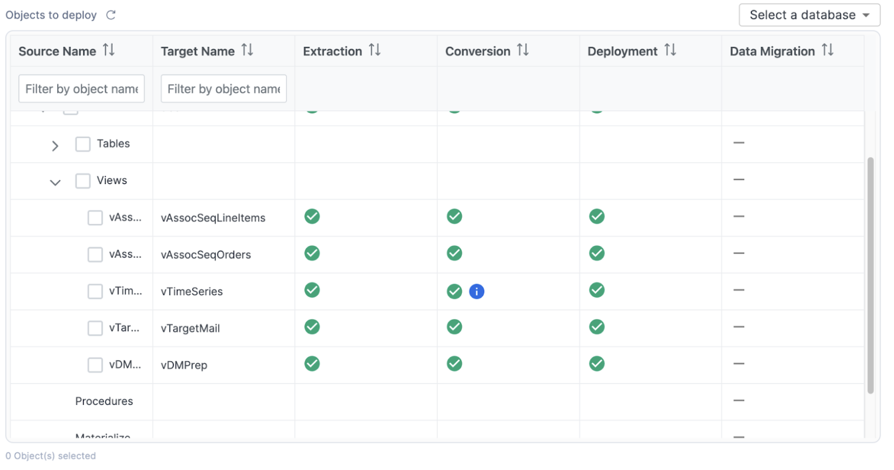

Success again! We have officially deployed all of the schema to Snowflake. There’s one more thing we can do in the SnowConvert application, and that is move the data from the original SQL Server database into Snowflake. Select “GO TO DATA MIGRATION” at the bottom right of the screen.

## Data Migration

The Data Migration page will give you the same catalog that you can see on the previous screens. For the migration of the data, note that only the data in tables will be migrated. The rest of the DDL is already present, but there is no “data” present in a view or a function, so the tables will be what is migrated. Also note that no data can be migrated to a table where the DDL wasn’t already successfully deployed. 

To migrate the data, select all of the tables (or you can choose the entire database or schema) and choose “MIGRATE DATA” at the bottom of the application:

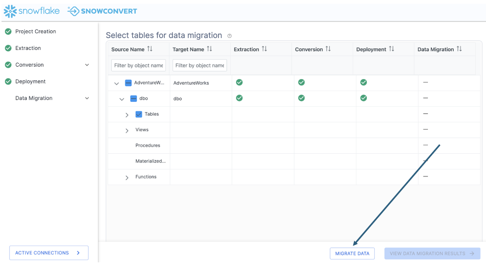

While the data is migrating, it will let you know how it’s doing:


It’s important to note that SnowConvert is migrating the data by passing it through your local machine. It is running a select statement on the data in the original object, then doing a COPY INTO to the data in the Snowflake object. This means that the speed of the data transfer will be directly affected by your connection from the local machine where you are running SnowConvert.

If you are moving a large amount of data, this will not be the most efficient way to move that data. You should consider using another data movement or ETL solution. However, in this scenario, this works just fine for us. There are only 30 tables. 

Note that if you are connected via SSO, Snowconvert may take you to a login page in your browser. If you have MFA setup on your Snowflake account, you will be taken to your authenticator to validate your connection.

Looks like we did not receive any error message for this migration. Let’s expand the object catalog to see if all the tables were migrated:

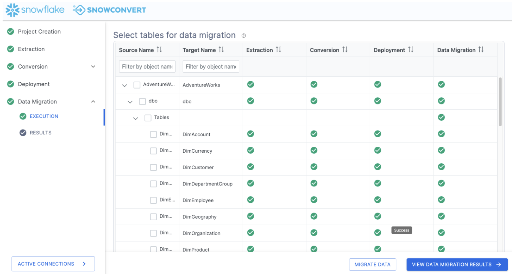

Select “VIEW DATA MIGRATION RESULTS” to see a summary of what just happened.


This will show you each table that you just migrated and the corresponding table in Snowflake. For a basic validation of what just happened, you can review the last two columns of the Data Migration Results. These are the row counts for the source table and the count of rows that were loaded into the table in Snowflake.

You can go into Snowflake and write a queries to check to see if this will work. Here is a simple “select *” on the largest table we loaded:

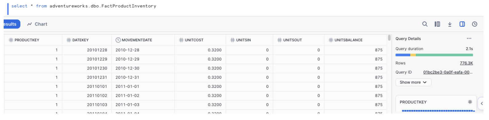

Where once there was no data, now… there is data. At this point, we would start running validation tests on the data to confirm that everything is the same. For this POC, we only have a few tests that we want to validate, but they are all related to the pipelines we are running. Let’s do our validations once we move the pipelines.

### Review

Before we get to our pipelines, let’s take a quick look back.

If we review the steps that we did, let’s see how they fit in with our migration process:

- Setup our project in SnowConvert
- Extracted the schema from the source database
- Ran SnowConvert’s assessment and conversion engine on the extracted schema
- Reviewed the output reporting to better understand what we have
- Reviewed what could not be converted in the VS Code Extension
- Generated new code in the VS Code Extension
- Deployed the code to Snowflake
- Moved the data from the source to Snowflake
- All the while, we were able to track things in our object inventory.

This is what we have just walked through. These steps will generally be recommended regardless of how you used SnowConvert. 

And you can generally see that most of these activities fit our **assess** -> **convert** -> **validate** flow:

- Setup our project in SnowConvert so we can better assess what we have
- Extracted the schema from the source database so we can see what kind of DDL we are working with
- Ran SnowConvert’s assessment and conversion engine on the extracted schema to analyze what we have for our initial assessment, and generate the output converted code
- Reviewed the output reporting to better understand what we have to build our assessment of what we have
- Reviewed what could not be converted in the VS Code Extension to assess what work needs to be done
- Generated new code in the VS Code Extension to resolve any errors in the initial conversion
- Deployed the code to Snowflake to validate that the schema works
- Moved the data from the source to Snowflake to convert our data into Snowflake data
- All the while, we were able to track things in our object inventory to better understand where we are in the migration process.

As we continue to walk through the migration process, let’s take a look at our data pipelines. 

## Pipeline Assessment

Moving the logic and data in a data warehouse is essential to getting an operational database on a new platform. But to take advantage of the new platform in a functional way, any pipelines running moving data in or out of that data platform need to be repointed or replatformed as well. This can often be challenging as there are usually a variety of pipelines being used. This section of the lab will focus on just one for which Snowflake can provide some acceleration. But note that new ETL and pipeline accelerators are constantly being developed.

Let’s talk about the pipeline and the notebook we are moving. 

- The pipeline is a Spark script that is reading an accessible file generated by an older POS system in a local directory at regular intervals. (This will be referred to as the pipeline script.)
- The notebook is a reporting notebook that reads from the existing SQL Server database and reports on a few summary metrics. (This will be referred to as the reporting notebook.)

Both of these use Spark and access the SQL Server database. So our goal is essentially to move the operations in Spark into Snowpark. Let’s see how we would do that using Snowpark Migration Accelerator (SMA). Recall that while many of the steps we will walk through are similar to what we just did with SnowConvert, we are still essentially working through the **assessment** -> **conversion** -> **validation** flow. 

**Notes on this Lab Environment**

This lab uses the Snowpark Migration Accelerator and the Snowflake VS Code Extension. But to make the most of this, you will need to run Python with a PySpark. The simplest way to start this would be to start an environment with [the anaconda distribution](https://www.anaconda.com/docs/getting-started/anaconda/main). This will have most of the packages needed to run the code in this lab.

You will still need to make available the following resources:
- Python Libraries ([PySpark](https://pypi.org/project/pyspark/), [Snowpark Python](https://pypi.org/project/snowflake-snowpark-python/), and [Snowflake](https://pypi.org/project/snowflake/))
- VS Code Extensions ([Snowflake](https://marketplace.visualstudio.com/items?itemName=snowflake.snowflake-vsc), [Python](https://marketplace.visualstudio.com/items?itemName=ms-python.python), and [Jupyter](https://marketplace.visualstudio.com/items?itemName=ms-toolsai.jupyter)) 
- Other supporting elements like the [PySpark JDBC Driver for SQL Server](https://learn.microsoft.com/en-us/sql/connect/jdbc/download-microsoft-jdbc-driver-for-sql-server?view=sql-server-ver17).

Having said all of this, you can still run this lab with just a Snowflake account, the SMA, and the Snowflake VS Code Extension. You will not be able to run everything that connects to a local machine, but you will be able to use all of the converted elements in Snowflake.

Now let’s get started by assessing what we have.

**Extraction**

For the purpose of this lab, we will assume that the notebook and script file that we are converting are already accessible as files. [Download those files from the Snowpark Migration Accelerator's docs site](https://docs.snowconvert.com/sma/use-cases/pipeline-migration-lab/pipeline-lab-assessment). 

Note that there is also a data file as well: ‘customer_update.csv’. This is a sample of the file being generated locally by the Point of Sale (POS) system that AdventureWorks is currently using. While that system is also being updated, this Proof of Concept (POC) is focused on making the existing pipeline work with Snowpark instead of Spark. 

Let’s take each of these files, and drop them into a single directory on our local machine:

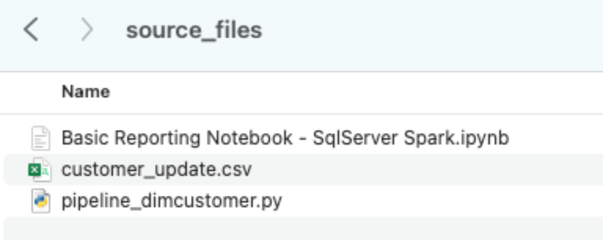

It would be recommended to create a project directory. This can be called whatever you like, but as a suggestion for this lab, let’s go with **spark_adw_lab**. This means we would create a folder with the name spark_adw_lab, then create another folder in that directory called source_files (the path being something like **/your/accessible/directory/spark_adw_lab/source_files**). This isn’t required, but will help keep things organized. The SMA will scan any set of subdirectories as well, so you could add specific pipelines in a folder and notebooks in another.

Note that in general, if you are extracting files that are being orchestrated by a specific tool, you may need to export them. If you are using notebooks in the Cloud elsewhere, you can export those as .ipynb files just as the jupyter notebook we are going to run through the SMA today. 

**Access**

Now that we have our source files in an accessible directory, it is time to run the SMA.

If you have not already downloaded it, the SMA is accessible from [the Snowflake website](/en/migrate-to-the-cloud/migration-accelerator/). It is also accessible from the Migrations page in SnowSight in your Snowflake account:

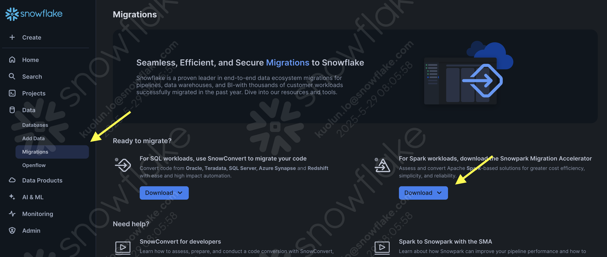

Once you download the tool, install it! There is more information on [installing the SMA](/en/migrate-to-the-cloud/migration-accelerator/) in the SMA documentation.

**Using the Snowpark Migration Accelerator**

Once you have installed the tool, open it! When you launch the SMA, it will look very similar to its partner tool, SnowConvert. Both of these tools are built on a similar concept where you input code files into the tool and it runs. We have seen that SnowConvert can take the DDL and data directly from the source and input it directly into Snowflake. The SMA does not do this. It only takes in code files as a source and outputs those files to something that is compatible with Snowflake. This is primarily because the tool does not know how a user will orchestrate their spark code. 

Once you have launched the tool, It will ask you if you would like to create a new project or open an already existing one:

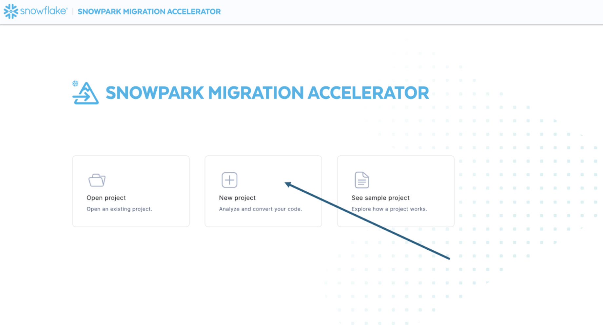

This will take you to the project creation screen:

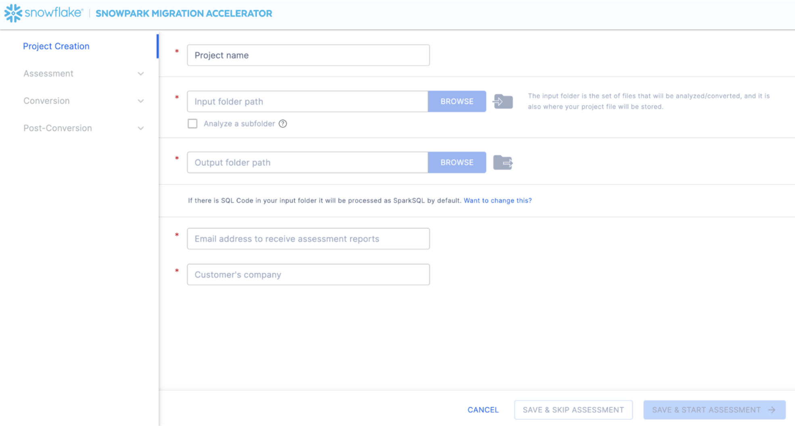

On this screen, you will enter the relevant details for your project. Note that all fields are required. For this project, you could enter something similar to:

- Project Name: **Spark ADW Lab**
- Input Folder Path: **/your/accessible/directory/spark_adw_lab/source_files**
- Output Folder Path (the SMA will auto generate a directory for the output, but you can modify this): **/your/accessible/directory/spark_adw_lab/source_files_output**
- Email Address: **your.name@your_domain.com**
- Customer’s Company: **Your Organization**

A couple of notes about this project creation screen:

- The email and company fields are to help you track projects that may be ongoing. For example, at any large SI, there may be multiple email addresses and multiple organizations on behalf of whom a single user may run the SMA. This information is stored in the project file created by the SMA.
- There is a hidden field for SQL. Note that the SMA can scan/analyze SQL, but it does not convert any SQL.It also can only identify SQL in the following circumstances:
  - SQL that is in .sql files
  - SQL that is in SQL cells in a Jupyter Notebook
  - SQL that is passed as a single string to a spark.sql statement. 
- While this SQL capability can be helpful to determine where there is incompatible SQL with Snowflake, it is not the primary use for the SMA. More support for Spark SQL and HiveQL are coming soon.

Once you’ve entered all of your project information, for this lab, we are going to **skip** the assessment phase. (What… aren’t we building an assessment?) If you do not want to convert any code, running an assessment can be helpful as it will allow you to get the full set of reports generated by the SMA. You can then navigate through those or share them with others in your organization while not creating extra copies of the converted code. However, all of these same assessment reports are also generated during a conversion. So we will skip assessment mode for now and go to conversion by selecting “SAVE & SKIP ASSESSMENT” in the bottom right corner of the application.

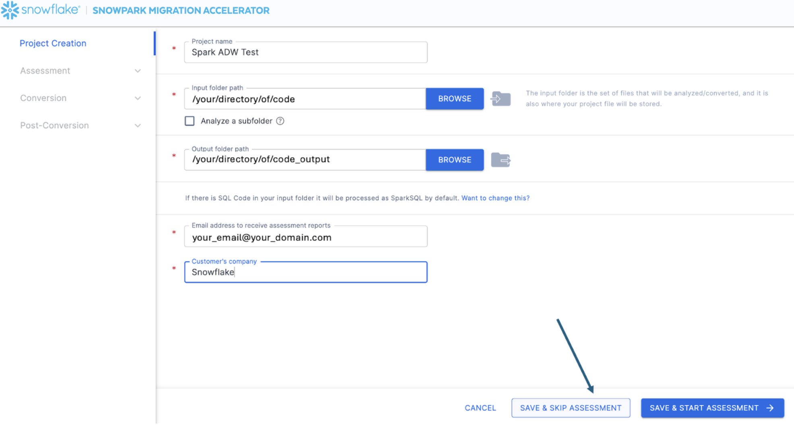

This will take you to the conversion screen. On this screen you will again see the input and output directory fields, but those will have already been populated by what you have entered in the project creation page. The only new field here will be to enter an access code. Access codes are freely available, but must still be requested an active to use the Snowpark Migration Accelerator (SMA). And while the mechanism for generating these access codes is similar to SnowConvert, the access codes for SnowConvert will not work with the SMA. You will have to get another one.

You can request an access code by selecting “Inquire about an access code” out to the side of the “Enter access code…” field: 

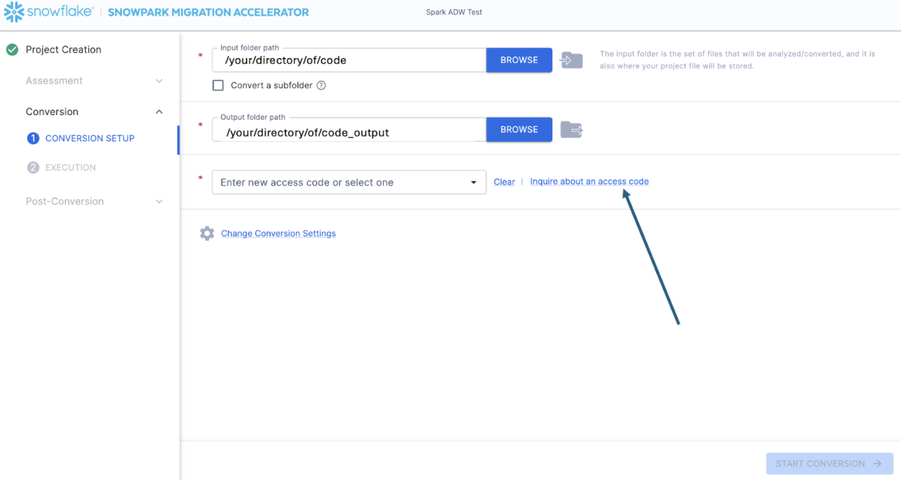

When you select this, a pop up menu will appear asking you who you are so an access code can be generated:

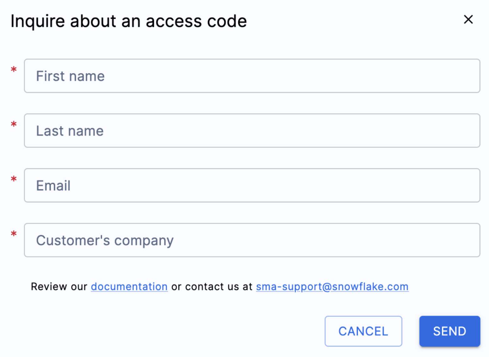

Fill out all of the fields shown above, and ensure that you enter a valid email address. In the project creation screen earlier, you entered an email address to associate with the project you were creating. However, nothing was actually sent to that email. That was only to track your project locally. This form will trigger an access code to be sent to the email you enter.

Once you submit the form, you should receive an email with an access code shortly. The email will come from sma-notifications@snowflake.com, and it will look something like this:

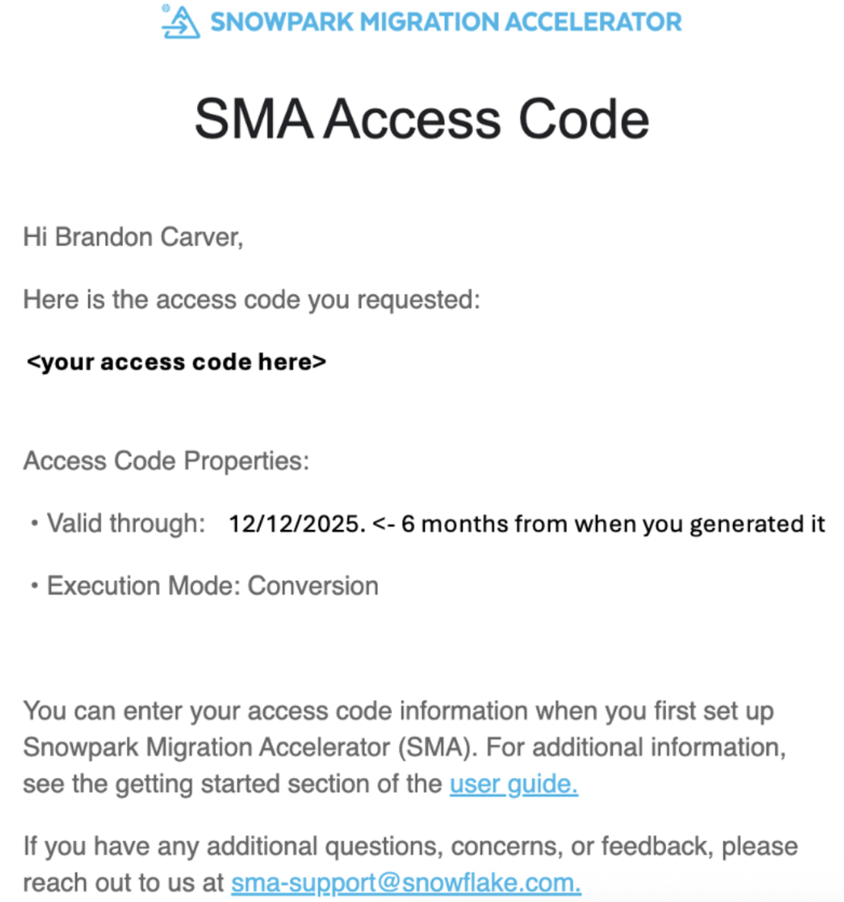

In the image above, where it says "**your access code here**", you should see a series of numbers, letters, and dashes. Copy that string, and paste it in the access code field for the SMA: 

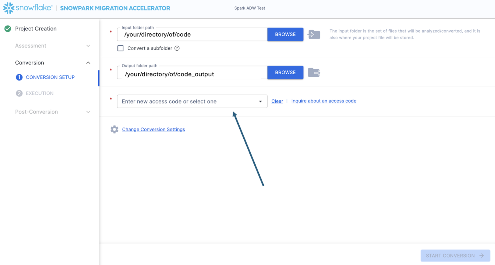

When you paste the value into the box, the SMA will validate the access code. A successful validation will show the access code details below the access code dialog box:

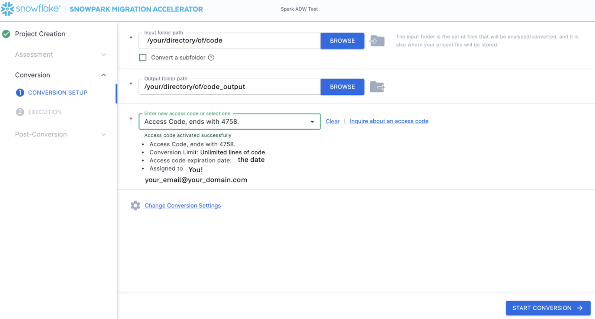

To validate the access code, the SMA will call out to the Snowflake licensing API. If you are not connected to the internet, the tool will not be able to validate the access code and you will get an error message. If you need to run the tool in a completely offline environment, please reach out to [sma-support@snowflake.com](mailto:sma-support@snowflake.com) for help validating an access code.

Now that the access code has been validated, you can take a look at the conversion settings:


There is one setting that will simplify the output of this hands on lab, which would be to **disable** the attempted conversion of pandas dataframes to the Snowpark API:

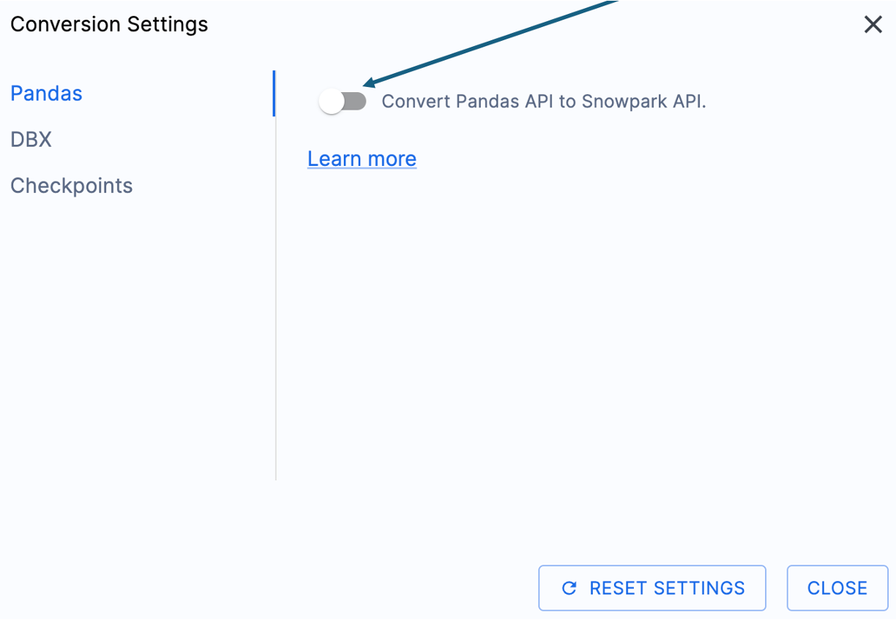

This one setting is currently being updated, so there will be a lot of additional warnings added if this option is not deselected. These can be worked though, but this will add noise to this lab. Most of the functions related to pandas dataframes can be used as part of the modin implementation of pandas, so a simple import call change should suffice for now. 

You can look at the other settings, but we will leave them as is. It’s important to note that there is a testing library that the output code is compatible with called **Snowpark Checkpoints**. There are settings related to this, but we will not alter them in this lab. Select “CLOSE” in the dialog box to save and close your settings. 

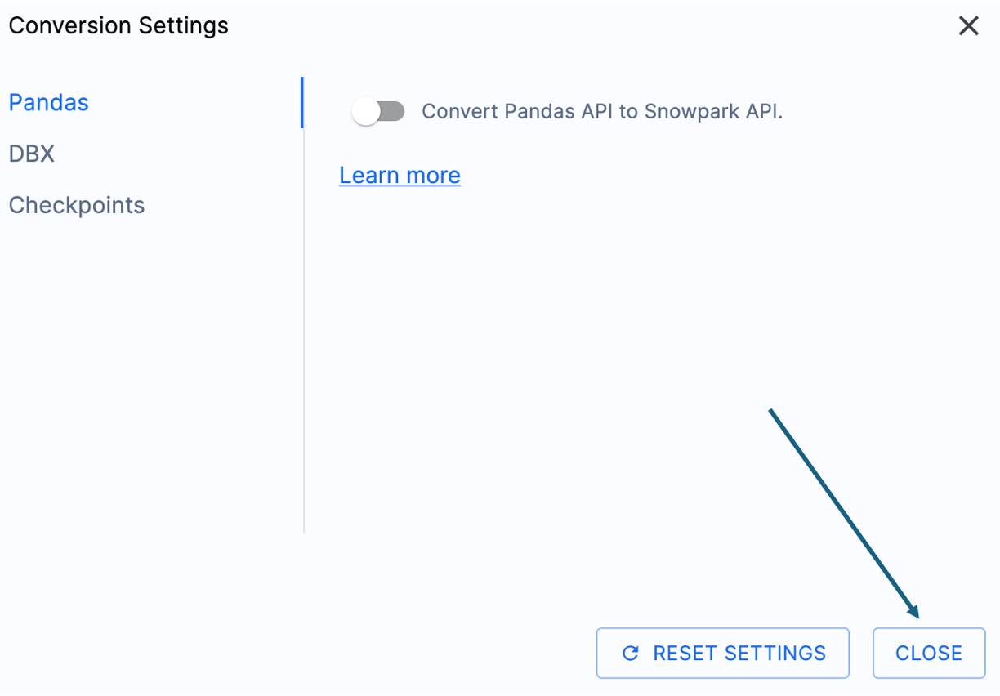

The “START CONVERSION” option will be available in the bottom right corner of the application. Let’s start the conversion by selecting this option.

The next screen will show the progress of the conversion:

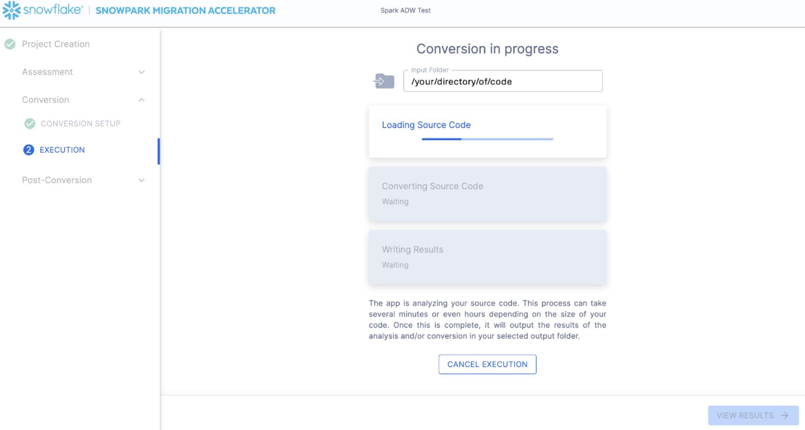

Like SnowConvert, the SMA is building a semantic model of the entire codebase in the input directory. It is building relationships between code elements, sql objects, and other referenced artifacts, and creating the closest output it can to a functional equivalent for Snowflake. This primarily means converting references from the Spark API to the Snowpark API. The SMA’s engineering team is a part of the Snowpark engineering team, so most transformations that take place have been built into the Snowpark API, so the changes may seem minor. But the wealth of assessment information that is generated by the SMA allows a migration project to really get moving forward. An in-depth look at all of the generated assessment information will have to take place elsewhere because the SMA has likely finished this conversion in the time it took to read this paragraph.

When the SMA has finished, the “VIEW RESULTS” option will be available in the bottom right corner:

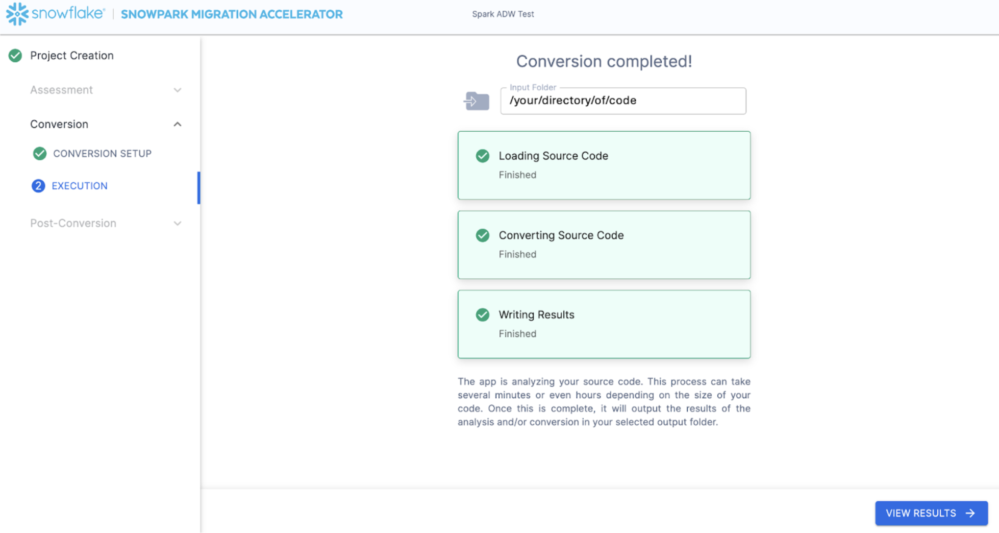

The results page, shockingly enough, will show the results.

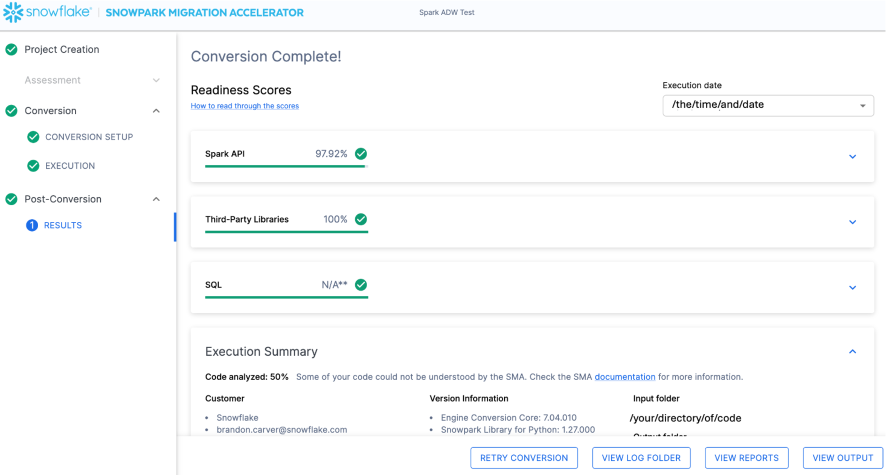

The results page has some “Readiness Scores” that are very simplified metrics on how “ready” this codebase is for Snowflake. We will review the results next, but note that running the Snowpark Migration Accelerator is the easy part. Note that this is just an “accelerator”. It is not a silver bullet or a hands-off automation tool. Pipelines that connect to one data source and output to another are not fully migrated by this tool will always need more attention than a straight SQL-to-SQL migration of DDL as is done by SnowConvert. But Snowflake is continuously working towards making this as simple as possible.

**Interpreting the Output**

The SMA, even more so than SnowConvert, generates a large amount of assessment information. It can be difficult to parse through the results. There are many different directions you could go depending on what you want to achieve. We'll try to cut through some of this given the simplicity of the scenario, but note that all of this data can be valualbe when planning a migration, particularly a large migration.

**Readiness Scores**

With that in mind, let’s take a look at the first part of the output that you will see in the application: the readiness scores. There will be multiple readiness scores and you can expand on each one of them to better understand what is captured by that readiness score. 

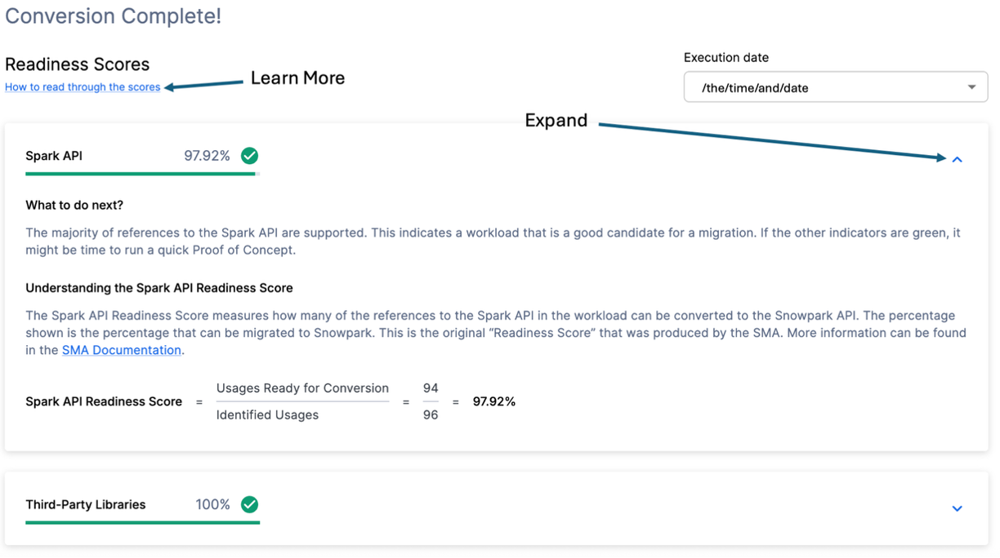

Each readiness score is a very basic calculation of the count of functions or elements in an API that are supported in Snowpark/Snowflake divided by the count of all functions or elements related to that API for this execution. The calculation showing you how the score is calculated is shown when you expand the window. You can also learn more about how to interpret the readiness scores by selecting “How to read through the scores” near the top left corner of this window. 

This execution has a Spark API Readiness Score of **97.92%**. (Please note that yours may be different! These tools are updated on a biweekly basis and there may be a change as compatibility between the two platforms is ever evolving.) This means that 97.92% of the references to the Spark API that the tool identified are supported in Snowflake. “Supported” in this case means that there could be a similar function that already exists or that the SMA has created a functionally equivalent output. The higher this score is, the more likely this code can quickly run in Snowflake. 

There are other readiness scores and you may see more than what is shown in the lab as the readiness scores do change over time. This lab won’t walk through each of them, but note that a low score will always be worth investigating.  

**Code Analyzed**

Just below each of the readiness scores, will be a small indicator that lets you know if there was any code that could not be processed:

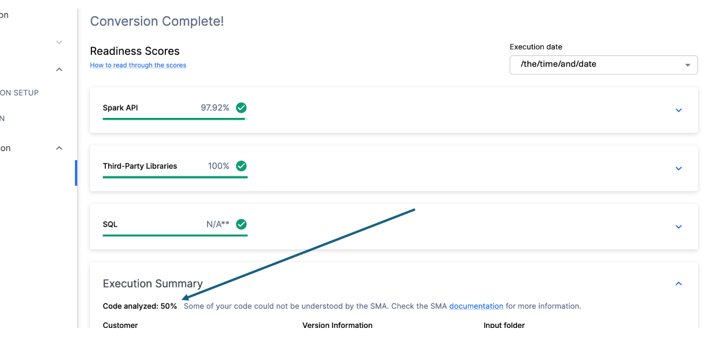

This number represents the **percentage of files** that were fully parsed. If this number is less than 100%, then there is some code that the SMA could not parse or process. This is the first place you should start looking to resolve problems. If it’s less than 100%, you should see where the parsing errors occurred by looking at the issue summary. This is the first place you should look when working through the SMA’s output because it’s the only one where it might make sense to run the tool again if a large amount of code was not able to be scanned.

In this case, we only have **50%** of our workload successfully parsed. Tragic. Now, this might seem like something we should panic about, but let’s not be too quick to judge. We only have 2 files, and we don’t yet know how many parsing errors we have.

Regardless of the result of this number, the last place we will visit on this page is the **Issue Summary**. Scroll down in the application until you see this summary:

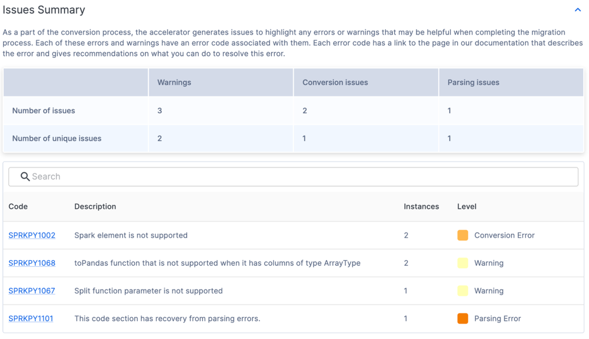

**Issue Summary**

Issues are one of the key elements of both SnowConvert and the SMA. Each tool is attempting to create a functional equivalent output based on the input that it receives, but no conversion is 100% automated. These tools know this, and mark everything that cannot be converted or even might need extra attention with an issue. These issues are summarized in a spreadsheet, but are also written as comments directly into the output code.

The issue summary in the UI highlights issues that were found in this execution of the tool. These issues are often referred to with the acronym EWI (error, warning, and issue). Similar, but not identical to SnowConvert, the SMA generates three types of issues:
- **Parsing Error** - This type of issue is considered critical and will need you deal with it immediately. Because of the way the SMA works, having code that does not parse, could mean missing information in the reports and missing conversion piece as well. 
- **Conversion Error** - This is something the SMA recognizes (or at least thinks that it recognizes), but it cannot convert for one reason or another. These errors usually have very specific issue codes and should be dealt with next.
- **Warning** - These error codes identify code that the SMA did convert or is something that has an equivalent in Snowpark/Snowflake, but there may be issues when you do testing. There may not be 100% functional equivalence. 

There is more information on issue types on [the SMA documentation page](https://docs.snowconvert.com/sma/issue-analysis/issue-code-categorization), but in the issue summary shown above, one can find the code, count, level, and description for the unique issues present. Even if there are a lot of issues present, the fewer unique issues there are, the more likely they can be dealt with programmatically. For more information on each unique issue code, you can click the code in the UI. This will take you to the SMA documentation page for that specific issue.  

Looks like we have some conversion errors, warnings, and 1 parsing error. This means there was 1 thing the tool could not read. (Note that if you get a lot of error codes that start with PND, then you may not have deselected that option in the conversion settings. Now worries, if you see those, you can ignore them.)

Regardless of how many issues you have, it is always recommended to explore the detailed issues file if you’re ready to start migrating. This is a csv file that is stored locally on the machine where you ran the SMA. You can find this file by selecting the “VIEW REPORTS” option in the bottom right of the SMA:

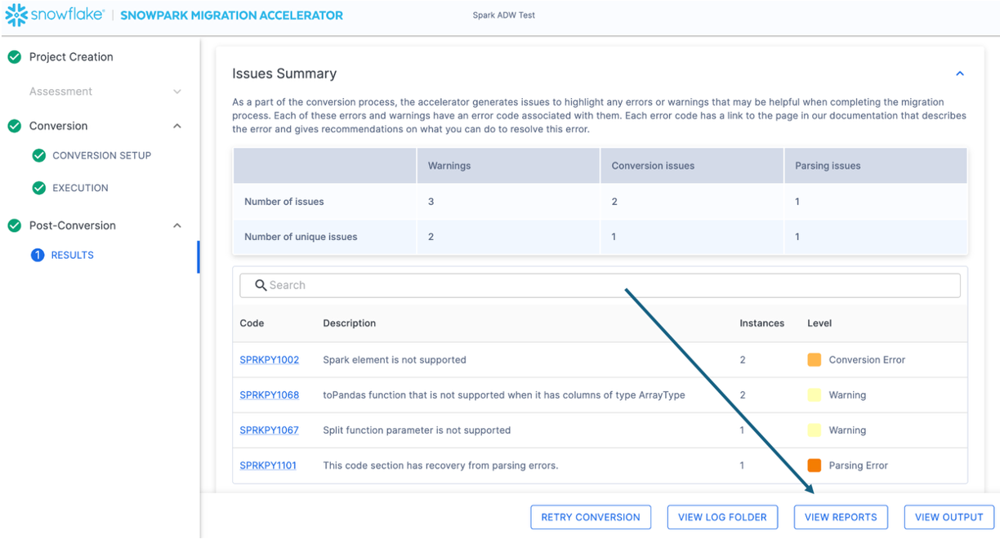

This will take you to the local directory that has all of the reports… and as of this writing, there are a lot of reports generated by the SMA:

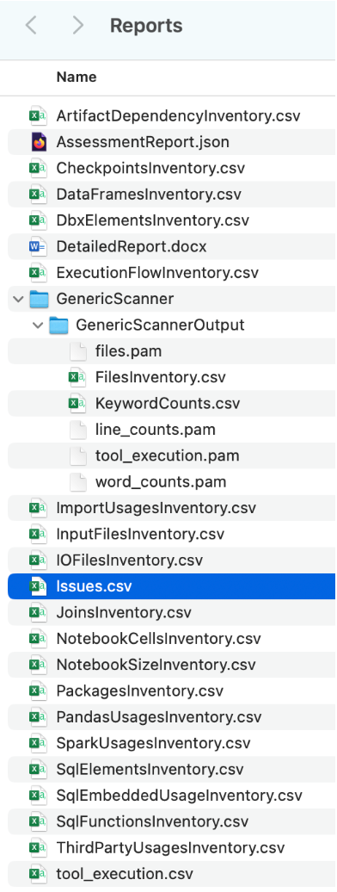

Each of these reports has some valuable information in it depending on how you are using the SMA. For now, we will only look at the issues.csv file, but note there is more information on EVERY report and inventory generated by the SMA [in the SMA documentation](https://docs.snowconvert.com/sma/user-guide/assessment/output-reports). 

When you open the issues file, it will look something like this:

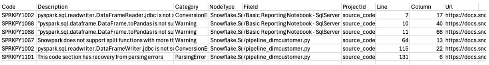

Note the schema of this report. It tells you the issue code, a description of the issue, the type of issue (category), the file each issue is in, the line number of the file each issue is in, and provides a link to the documentation page for that specific issue. All of this is helpful information when navigating through the issues. 

You can pivot this by file to see what type of issue you have by file to find where the parsing error is for this workload:

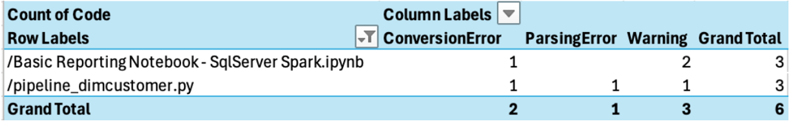

Looks like we only have a few issues, and our parsing error is in the pipeline python script. That’s where we want to start. 

Normally, we would take a look at one other report in our Reports directory, the **ArtifactDependencyInventory.csv** file. But this is such a small execution, let’s take a look at what’s actually in these output files now, and see if we can’t get it to run in (or with) Snowflake.

## Pipeline Conversion

The SMA has “converted” our scripts, but has it really? What it has actually done is converted all references from the Spark API to the Snowpark API, but what it has not done is to replace the connections that may exist in your pipelines. 

The SMA’s power is in the assessment reporting that it does as the conversion is tied to converting references from the Spark API to the Snowpark API. Note that the conversion of these references will not be enough to run any data pipeline. You will have to ensure that the pipeline’s connections are resolved manually. The SMA cannot assume to know connection parameters or other elements that are likely not available to be run through it. 

As with any conversion, dealing with the converted code can be done in a variety of ways. The following steps are how we would **recommend** that you approach the output of the conversion tool. Like SnowConvert, the SMA requires attention to be paid to the output. No conversion will ever be 100% automated. This is particularly true for the SMA. Since the SMA is converting references from the Spark API to the Snowpark API, you will always need to check how those references are being run. It does not attempt to orchestrate the successful execution of any script or notebook run through it. 

So we’ll follow these steps to work through the output of the SMA that will be slightly different than SnowConvert:
- **Resolve All Issues**: “Issues” here means the issues generated by the SMA. Take a look at the output code. Resolve parsing errors and conversion errors, and investigate warnings.
- **Resolve the session calls**: How the session call is written in the output code depends on where we are going to run the file. We will resolve this for running the code file(s) in the same location as they were originally going to be run, and then for running them in Snowflake.
- **Resolve the Input/Outputs**: Connections to different sources cannot be resolved entirely by the SMA. There are differences in the platforms, and the SMA will usually disregard this. This also is affected by where the file is going to be run. 
- **Clean up and Test**! Let’s run the code. See if it works. We will be smoke testing in this lab, but there are tools to do more extensive testing and data validation including Snowpark Python Checkpoints.

So let’s take a look at what this looks like. We’re going to do this with two approaches: the first approach is to run this in Python on the local machine (as the source script is running). The second would be to do everything in Snowflake… in Snowsight, but for a data pipeline reading from a local source, this will not be 100% possible in Snowsight. That’s ok though. We are not converting the orchestration of this script in this POC.

Let’s start with the pipeline script file, and get to the notebook in the next section.

**Resolve Issues**

Let’s open our source and our output code in a code editor. You can use any code editor of your choice, but as has been mentioned multiple times, Snowflake would recommend using **VS Code with the Snowflake Extension**. Not only does the Snowflake Extension help navigate through the issues from SnowConvert, but can also run **Snowpark Checkpoints** for Python, which would help with testing and root cause analysis (though just barely out of scope for this lab). 

Let’s open the directory that we originally created in the project creation screen (Spark ADW Lab) in VS Code:

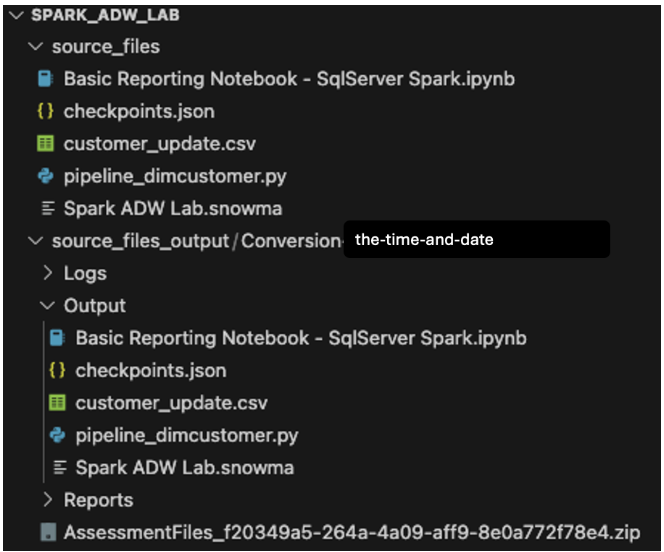

Note that the **Output** directory structure will be the same as the input directory. Even the data file will be copied over despite no conversion taking place. There will also be a couple of **checkpoints.json** files that will be created by the SMA. These are json files that contain instructions for the Snowpark Checkpoints extension. The Snowflake extension can load checkpoints into both the source and output code based on the data in those files. We will ignore them for now.

Finally, let’s compare the input python script with the converted one in the output script. 

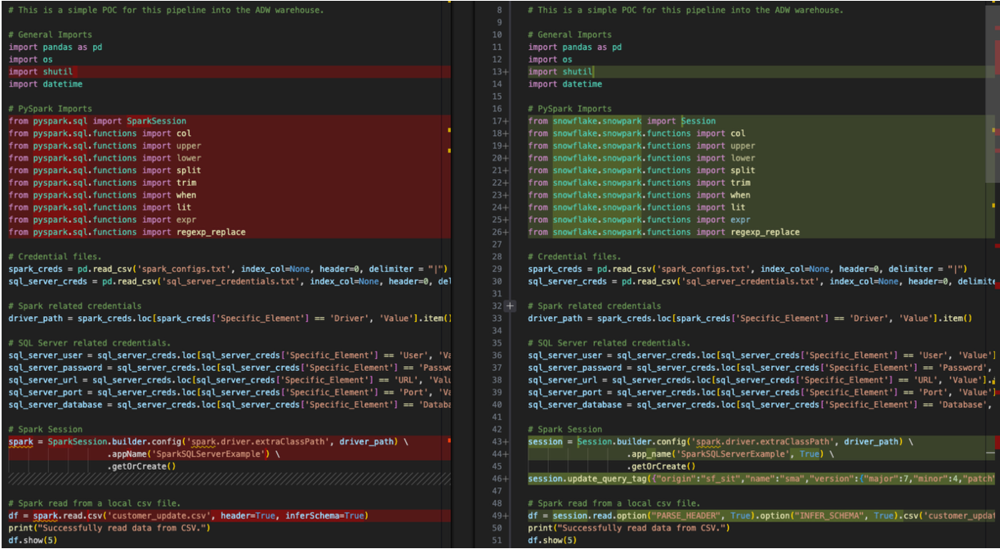

This is a very basic side-by-side comparison with the original Spark code on the left and the output Snowpark compatible code on the right. Looks like some imports were converted as well as the session call(s). We can see an EWI at the bottom of the image above, but let’s not start there. We need to find the parsing error before we do anything else. 

We can search the document for the error code for that parsing error that was shown in both the UI and the issues.csv: **SPRKPY1101**.

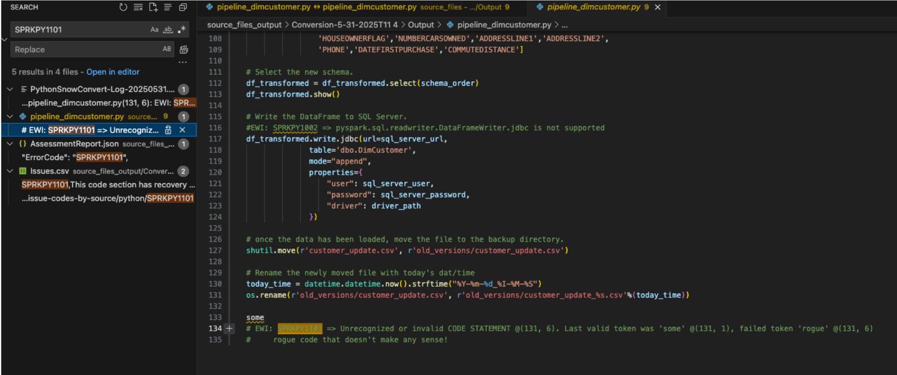

Looking for where this EWI shows up in the pipeline_dimcustomer.py, we can see that the parsing error was present in the very last line of the source code.

```python
# Conversion Input.
some rogue code that doesn't make any sense!

# Conversion Output.
some
# EWI: SPRKPY1101 => Unrecognized or invalid CODE STATEMENT @(131, 6). Last valid token was 'some' @(131, 1), failed token 'rogue' @(131, 6)
#     rogue code that doesn't make any sense!
```

Looks like this parsing error was because of… “some rogue code that doesn’t make any sense!”. This line of code is at the bottom of the pipeline file. This is not unusual to have extra characters or other elements in a code file as part of an extraction from a source. Note have the SMA detected that this was not valid Python code, and it generated the parsing error. 

You can also see how the SMA inserts both the error code and the description into the output code as a comment where the error occurred. This is how all error messages will appear in the output. 

Since this is not valid code, it is at the end of the file, and there is nothing else that was removed as a result of this error, the original code and the comment can safely be removed from the output code file.

And now we’ve resolved our first and most serious issue. Get excited. 

Let’s work through the rest of our EWIs in this file. We can search for “EWI” because we now know that text will appear in the comment every time there is an error code. (Alternatively, we could sort the issues.csv file and order the issues by severity… but that’s not really necessary here.)

The next one is actually just a warning, not an error. It’s telling us that there was a function used that isn’t always equivalent in Spark and Snowpark:

```python
#EWI: SPRKPY1067 => Snowpark does not support split functions with more than two parameters or containing regex pattern. See documentation for more info.
split_col = split(df_uppercase['NAME'], '.first:')
```

The description here though gives away that we probably don’t have to worry about this. There are only two parameters being passed. Let’s leave this EWI as a comment in the file, so we know to check for it when we are running the file later.

The last one for this file is a conversion error saying that something is not supported:

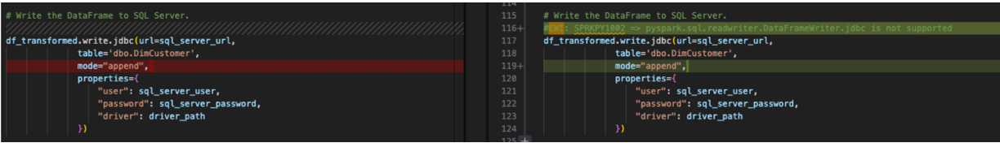

This is the write call to the spark jdbc driver to write the output dataframe into SQL Server. Since this is part of the “resolve all inputs/outputs” step that we are going to deal with after we address our issues, we’ll leave this for later. Note, however, that this error must be resolved. The previous one was just a warning and may still work with no change being made.

**Resolving the Session Calls**

The session calls are converted by the SMA, but you should pay special attention to them to make sure they are functional. In our pipeline script, this is the before and after code:

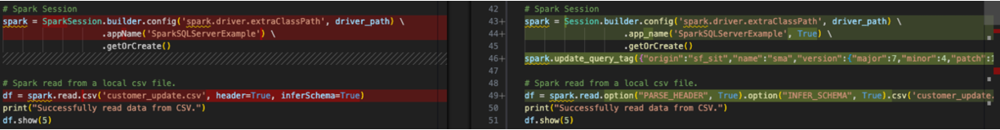

The SparkSession reference was changed to Session. You can see that reference change near the top of this file in the import statement as well:

```python
# Original PySpark Imports
from pyspark.sql import SparkSession

# New Snowpark Imports
from snowflake.snowpark import Session
```

Note in the image above, the variable assignment of the session call to “spark” is not changed. This is because this is a variable assignment. It is not necessary to change this, but if you’d like to change the “spark” decorator to “session”, that would be more in line with what Snowpark recommends. (Note that the VS Code Extension “SMA Assistant” will suggest these changes as well.) 

This is a simple exercise, but it’s worth doing. You can do a find and replace using VS Code’s own search ability to find the references to “spark” in this file and replace them with session. You can see the result of this in the image below. The references to the “spark” variable in the converted code have been replaced with “session”:

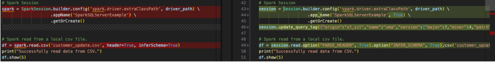

We also can remove something else from this session call. Since we are not going to be running “spark” anymore, we do not need to specify the driver path for the spark driver. So we can remove the config function entirely from the session call like this:

```python
# Old Converted output.
# Spark Session
session = Session.builder.config('spark.driver.extraClassPath', driver_path) \
                    .app_name('SparkSQLServerExample', True) \
                    .getOrCreate()

# New Converted Output
# Snowpark Session
session = Session.builder.app_name('SparkSQLServerExample', True).getOrCreate()
```

Might as well convert it to a single line. The SMA couldn’t be sure we didn’t need that driver (although that seems logical), so it did not remove it. But now that we have our session call is complete. 

(Note that the SMA also adds a “query tag” to the session. This is to help troubleshoot issues with this session or query later on, but this is completely optional to leave or remove.)

**Notes on the Session Calls**

Believe it or not that is all that we need to change in the code for the session call, but that’s not all we need to do to create the session. This refers back to the original question that a lot of this depends on where you want to run these files. These original spark session calls used a configuration that was setup elsewhere. If you look at the original Spark session call it’s looking for a config file that is being read into a pandas dataframe location at the start of this script file (this is actually true for our notebook file as well).

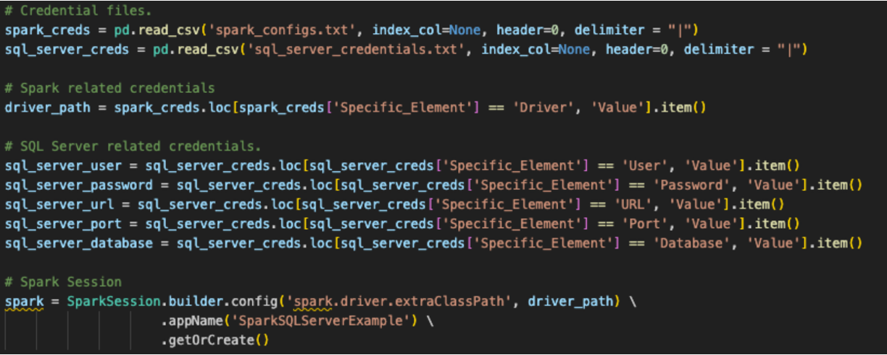

Snowpark can function the same way, and this conversion assumes that is how this user will run this code. However, for the existing session call to work, the user would have to load all of the information for their Snowflake account into the local (or at least accessible) connections.toml file on this machine, and that the account they are attempting to connect to is set as the default. [You can learn more about updating the connections.toml file in the Snowflake/Snowpark documentation](https://docs.snowflake.com/en/developer-guide/snowpark/python/creating-session#connect-by-using-the-connections-toml-file), but the idea behind it is that there is an accessible location that has the credentials. When a snowpark session is created, it is going to check this… unless the connection parameters are explicitly passed to the session call. 

The standard way to do this is to input the connection parameters directly as strings and call them with the session:

```python
# Parameters in a dictionary.
connection_parameters = {
  "account": "<your snowflake account>",
  "user": "<your snowflake user>",
  "password": "<your snowflake password>",
  "role": "<your snowflake role>",  # optional
  "warehouse": "<your snowflake warehouse>",  # optional
  "database": "<your snowflake database>",  # optional
  "schema": "<your snowflake schema>",  # optional
}

# The session call
session = Session.builder.configs(connection_parameters).app_name("AdventureWorksSummary", True).getOrCreate()
```

AdventureWorks appears to have referenced a file with these credentials and called it. Assuming there is a similar file called 'snowflake_credentials.txt' that is accessible, then the syntax that would match that could look something like:

```python
# Load into a dataframe.
snow_creds = pd.read_csv('snowflake_credentials.txt', index_col=None, header=0)

# Build the parameters.
connection_parameters = {
  "account": snow_creds.loc[snow_creds['Specific_Element'] == 'Account', 'Value'].item(),
  "user": snow_creds.loc[snow_creds['Specific_Element'] == 'Username', 'Value'].item(),
  "password": snow_creds.loc[snow_creds['Specific_Element'] == 'Password', 'Value'].item(),
  "role": "<your snowflake role>",  # optional
  "warehouse": snow_creds.loc[snow_creds['Specific_Element'] == 'Warehouse', 'Value'].item(),  # optional
  "database": snow_creds.loc[snow_creds['Specific_Element'] == 'Database', 'Value'].item(),  # optional
  "schema": snow_creds.loc[snow_creds['Specific_Element'] == 'Schema', 'Value'].item(),  # optional
}

# Then pass the parameters to the configs function of the session builder.
session = Session.builder.configs(connection_parameters).app_name("AdventureWorksSummary", True).getOrCreate()
```

For the purpose of the time limit on this lab, the first option may make more sense. [There’s more on this in the Snowpark documentation](https://docs.snowflake.com/en/developer-guide/snowpark/python/creating-session#connect-by-specifying-connection-parameters). 

Note that for our notebook file to run inside of Snowflake using Snowsight, you wouldn’t need to do any of this. You would just call the active session and run it. 

Now it's time for the most critical component of this migration, resolving any input/output references.

**Resolving the Inputs and Outputs**

So let’s resolve our inputs and outputs now. Note that this is going to diverge based on whether you’re running the files locally or Snowflake. for the python script, Let’s make sure what we gain/lose by running directly inside of Snowsight: **you cannot run the whole operation in Snowsight** (at least not currently). The local csv file is not accessible from Snowsight. You will have to load the .csv file into a stage manually. This will likely not be an ideal solution, but we can test the conversion by doing this. 

So we’ll first prep this file to be run/orchestrated locally, and then to be run in Snowflake.

To get the pipeline script’s inputs and output resolved, we need to first identify them. They are pretty simple. This script seems to:
- access a local file
- load the result into SQL Server (but now Snowflake)
- moves the file to make way for the next one

Simple enough. So we need to replace each component of the code that does those things. Let’s start with accessing the local file.

As was mentioned at the start of this, it would be strongly suggested to rearchitect the Point of Sale System and the orchestration tools used to run this python script, to put the output file into a cloud storage location. Then you could turn that location into an External Table, and voila… you are in Snowflake. However, the current architecture says that this file is not in a cloud storage location and will stay where it is, so we need to create a way for Snowflake to access this file preserving the existing logic. 

We have options to do this, but we will create an internal stage and move the file into the stage with the script. We would then need to move the file in the local file system, and also move it in the stage. This can all be done with Snowpark. Let’s break it down:
- accessing a local file: Create an internal stage (it one doesn’t exist already) -> Load the file into the stage -> Read the file into a dataframe
- loading the result into SQL Server: Load the transformed data into a table in Snowflake
- moves the file to make way for the next one: Move the local file -> Move the file in the stage.

Let’s look at code that can do each of these things. 

**Access a Locally Accessible File**

This source code in Spark looks like this:

```python
# Spark read from a local csv file.
df = spark.read.csv('customer_update.csv', header=True, inferSchema=True)
```

And the transformed snowpark code (by the SMA) looks like this:

```python
# Snowpark read from a local csv file.
df = session.read.option("PARSE_HEADER", True).option("INFER_SCHEMA", True).csv('customer_update.csv')
```

We can replace that with this with code that does the steps above:

1. Create an internal stage (if one does not exist already). We will create a stage called 'LOCAL_LOAD_STAGE' and go through a few steps to make sure that the stage is ready for our file.

```python
# Additional import needed for this. (Check to see if this is already imported.)
from snowflake.core.stage import Stage, StageEncryption, StageResource

# name the stage we're going to use.
target_stage_name = "LOCAL_LOAD_STAGE"

# Check to see if this stage already exists.
stages = session.sql("SHOW STAGES").collect()
target_stages = [stage for stage in stages if stage['name'] == target_stage_name]

# Create the stage if it does not already exist.
if(len(target_stages) < 1):
    from snowflake.core import Root
    from snowflake.core.stage import Stage, StageEncryption, StageResource
    root = Root(session)
    my_stage = Stage(name="LOCAL_LOAD_STAGE",encryption=StageEncryption(type="SNOWFLAKE_SSE"))
    root.databases["ADVENTUREWORKS"].schemas["DBO"].stages.create(my_stage)
    print('%s created.'%(target_stage_name))
else:
    print('%s already exists.'%(target_stage_name))
```

2. Load the file into the stage. 

```python
# Move the file.
put_results = session.file.put(local_file_name="customer_update.csv",
                    stage_location="ADVENTUREWORKS.DBO.LOCAL_LOAD_STAGE",
                    overwrite=False,
                    auto_compress=False)

# Read the results.
for r in put_results:
    str_output = ("File {src}: {stat}").format(src=r.source,stat=r.status)
    print(str_output) 
```

3. Read the file into a dataframe. This is the part that the SMA actually converted. We need to specify that the location of the file is now the internal stage.

```python
# Location of the file in the stage.
csv_file_path = "@LOCAL_LOAD_STAGE/customer_update.csv"

# Spark read from a local csv file.
df = session.read.option("PARSE_HEADER", True).option("INFER_SCHEMA", True).csv(csv_file_path)
```

The result of that would look like this:

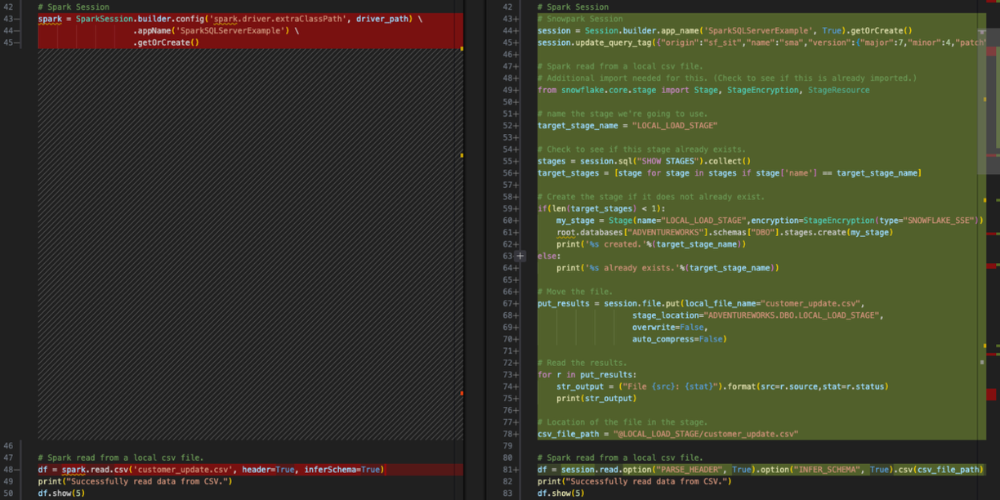

Let's move on to the next step.

**Load the result into Snowflake**

The original script wrote the dataframe into SQL Server. Now we are going to load into Snowflake. This is a much simpler conversion. The dataframe is already a Snowpark dataframe. This is one of the advantages of Snowflake. Now that the data is accessible to Snowflake, everything happens inside Snowflake.

```python
# Original output from the conversion tool.
# Write the DataFrame to SQL Server.
#EWI: SPRKPY1002 => pyspark.sql.readwriter.DataFrameWriter.jdbc is not supported
df_transformed.write.jdbc(url=sql_server_url,
              table='dbo.DimCustomer',
              mode="append",
              properties={
                  "user": sql_server_user,
                  "password": sql_server_password,
                  "driver": driver_path
              })

# Corrected Snowflake/Snowpark code.
df_transformed.write.save_as_table("ADVENTUREWORKS.DBO.DIMCUSTOMER", mode="append")
```

Note that we may want to write to a temp table to do some testing/validation, but this is the behavior in the original script.

**Move the file to make way for the next one**

This is the behavior in the orginal script. We don't really need to make this happen in Snowflake, but we can to showcase the exact same functionality in the stage. This is done with an os command in the original file system. That does not depend on Spark and will remain the same. But to emulate this behavior in snowpark, we would need to move this file in the stage to a new directory. 

This can be done simply enough with the following python code:

```python
# New filename.
original_filepath = '@LOCAL_LOAD_STAGE/customer_update.csv'
new_filepath = '@LOCAL_LOAD_STAGE/old_versions/customer_update_%s.csv'%(today_time)

copy_sql = f"COPY FILES INTO {new_filepath} FROM {original_filepath}"
session.sql(copy_sql).collect()
print(f"File copied from {original_filepath} to {new_filepath}")

remove_sql = f"REMOVE {original_filepath}"
session.sql(remove_sql).collect()
print(f"Original file {original_filepath} removed.")
```

Note that this would not replace any of the existing code. Since we already want to keep the existing motion of moving the spark code to snowpark, we will leave the os reference. The final version will look like this:

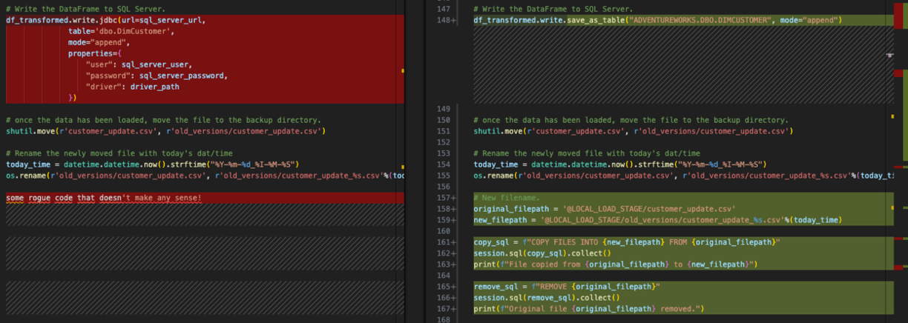

Now we have the same motion completely done. Now let's do our final cleanup, and test this script out. 

**Clean up and Test**

We never looked at our import calls and we have config files that are not necessary at all. We could leave the references to the config files and run the script. In fact, assuming those config files are still accesible, then the code will still run. But if we're taking a close look at our importt statements, we might as well remove them. These files are represented by all of the code between the import statements and the session call:

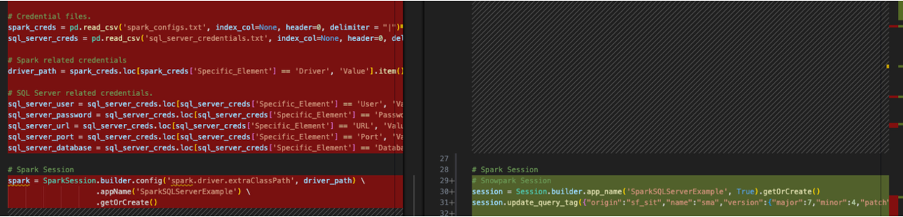

There’s a few other things we should do:
- Check that all of our imports are still necessary. We can leave them for now. If there is an erorr, we can address it.
- We also have one EWI that we left in there as a warning to check. So we want to make sure we inspect that output. 
- We need to make sure that our file system behavior mirrors that of the expected file system for the POS system. To do this, we should move the customer_update.csv file into the root folder you chose when first launching VS Code. 
- Create a directory called “old_versions” in that same directory. This should allow the os operations to run.

Finally, if you are not comfortable running the code directly into the production table, you can create a copy of that table for this test, and point the load to that copy. Replace the load statement with the one below. Since this is a lab, feel free to write to the “production” table: 

```python
# In case we want to test.
create_sql = """
                CREATE OR REPLACE TABLE ADVENTUREWORKS.DBO.DIMCUSTOMER_1
                AS select * from ADVENTUREWORKS.DBO.DIMCUSTOMER;
                """
session.sql(create_sql).collect()

# Write the DataFrame to SQL Server.
df_transformed.write.save_as_table("ADVENTUREWORKS.DBO.DIMCUSTOMER_1", mode="append")
```

Now we're finally ready to test this out. We can run this script in Python to a testing table and see if it will fail. So run it!

Tragic! The script failed with the following error:

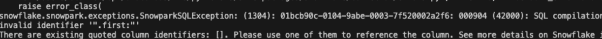

It looks like the way we are referencing an identifier is not the way that Snowpark wanted it. The code that failed is in the exact spot where the remaining EWI is:

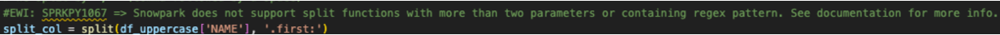

You could reference the documentation on the link provided by the error, but in the interest of time, Snowpark needs this variable to expressly be a literal. We need to make the following replacement:

```python
# Old
split_col = split(df_uppercase['NAME'], '.first:')

# New
split_col = split(df_uppercase['NAME'], lit('.first:'))
```

This should take care of this error. Note that there are always going to be some functional differences between source and a target platforms. Conversion tools like the SMA like to make these differences as obvious as possible. But note that no conversion is 100% automated. 

Let’s run it again. This time… success! 

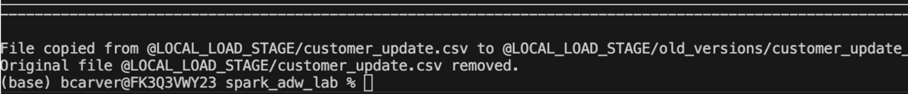

We can write some queries in python to validate this, but why don’t we just go into Snowflake (because that’s what we’re about to do anyways). 

Navigate to your snowflake account that you have been using to run these scripts. This should be the same one you used to load the database from SQL Server (and if you haven’t done that, the above scripts won’t work anyways beecause the data has not yet been migrated). 

You can quickly check this by seeing if the stage was created with the file: 

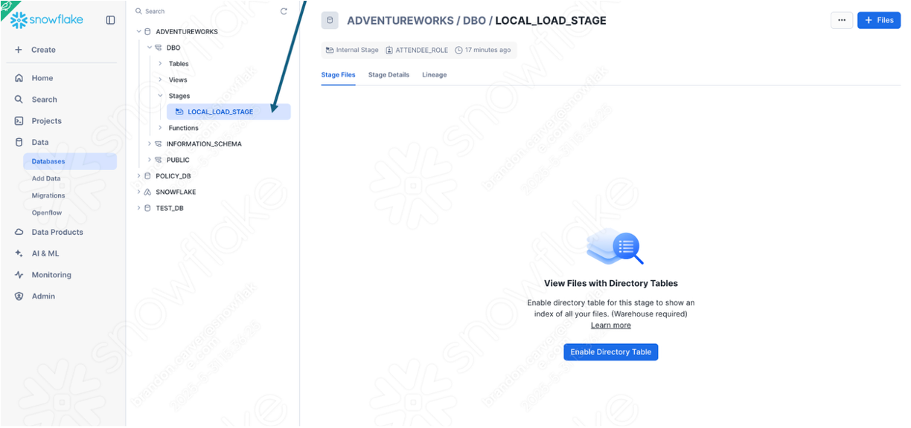

Enable the directory table view to see if the old_versions folder is in there:


And it is:

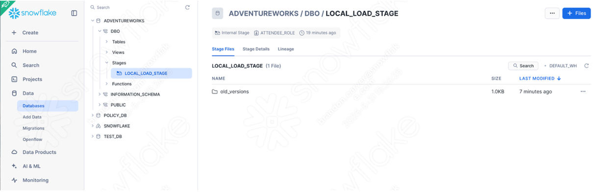

Since that was the last element of our script, it looks like we’re good!

We can also simply validate that the data was loaded by simply querying the table for the data we uploaded. You can open a new worksheet and simply write this query:

```python
select * from ADVENTUREWORKS.DBO.DIMCUSTOMER
where FIRSTNAME like '%Brandon%'
AND LASTNAME like '%Carver%'
```

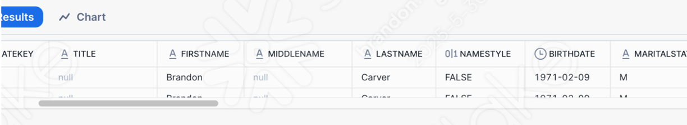

**Running the Pipeline Script in Snowsight**

Let’s take a quick look back at the flow we are attempting to convert was doing in Spark:
- accessing a local file
- loading the result into SQL Server
- moving the file to make way for the next one 

This flow is not possible to run entirely from within Snowsight. Snowsight does not have access to a local file system. The recommendation here would be to move the export from the POS to a data lake… or any number of other options that would be accessible via Snowsight. 

We can, however, take a closer look at how Snowpark handles the transformation logic by running the Python script in Snowflake. If you have already made the changes recommended above, you can run the body of the script in a Python Worksheet in Snowflake. 

To do this, first login to your Snowflake account and navigate to the worksheets section. In this worksheet, create a new Python worksheet:

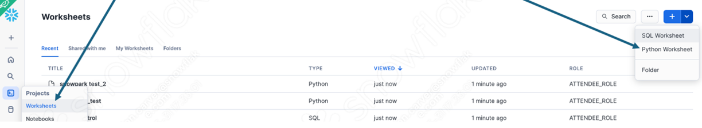

Specify the database, schema, role, and warehouse you’d like to use:

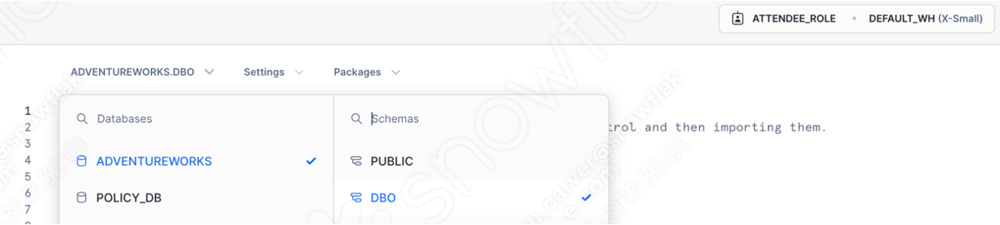

Now we do not have to deal with our session call. You will see a template generated in the worksheet window:

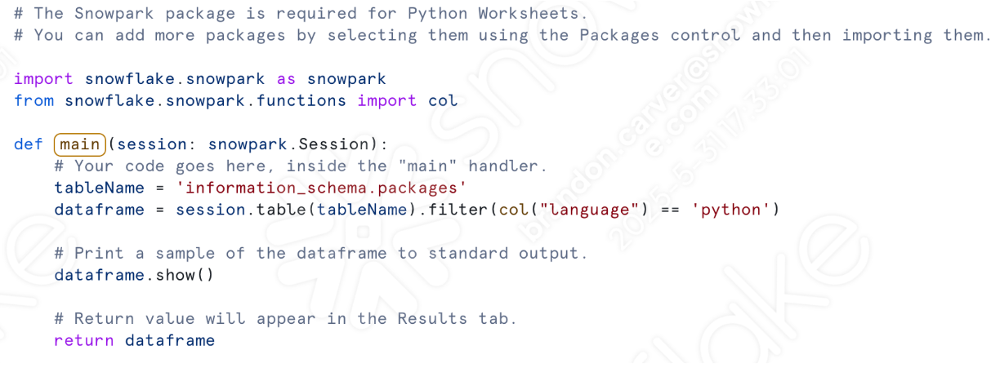

Let’s start by bringing over our import calls. After making the previous script ready to use, we should have the following set of imports:

```python
# General Imports
import pandas as pd
import os
import shutil
import datetime

# Snowpark Imports
from snowflake.snowpark import Session
from snowflake.snowpark.functions import col
from snowflake.snowpark.functions import upper
from snowflake.snowpark.functions import lower
from snowflake.snowpark.functions import split
from snowflake.snowpark.functions import trim
from snowflake.snowpark.functions import when
from snowflake.snowpark.functions import lit
from snowflake.snowpark.functions import expr
from snowflake.snowpark.functions import regexp_replace
```

We only need the snowpark imports. We will not be moving files around a file system. We could keep the datetime reference if we want to move the file in the stage. (Let’s do it.)

Paste the Snowpark imports (plus datetime) in the python worksheet below the other imports that are already present. Note that ‘col’ is already imported, so you can remove one of those:

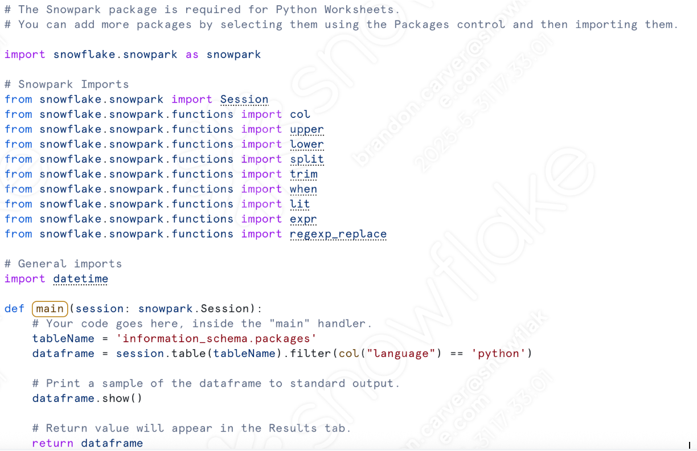

Under the “def main” call, let’s paste in all of our transformation code. This will include everything from the assignment of the csv location to the writing of the dataframe to a table. 

From here:

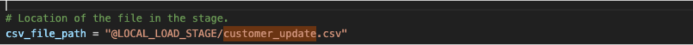

To here:

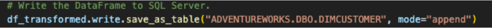

We can also add back in the code that moves the files around in the stage to preserve the same functionality for the POC. This part:

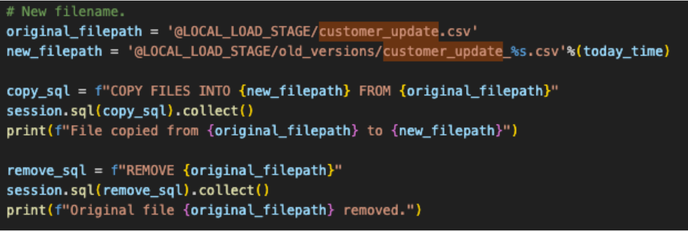

Before you can run the code though, you will have to manually create the stage and move the file into the stage. We can add the create stage statement into the script, but we would still need to manually load the file into the stage. 

So if you open another worksheet (this time… a sql worksheet), you can run a basic SQL statement that will create the stage:

```sql
CREATE STAGE LOCAL_LOAD_STAGE
  ENCRYPTION = (TYPE = 'SNOWFLAKE_SSE');
```

Make sure to select the correct database, schema, role, and warehouse in your worksheet:

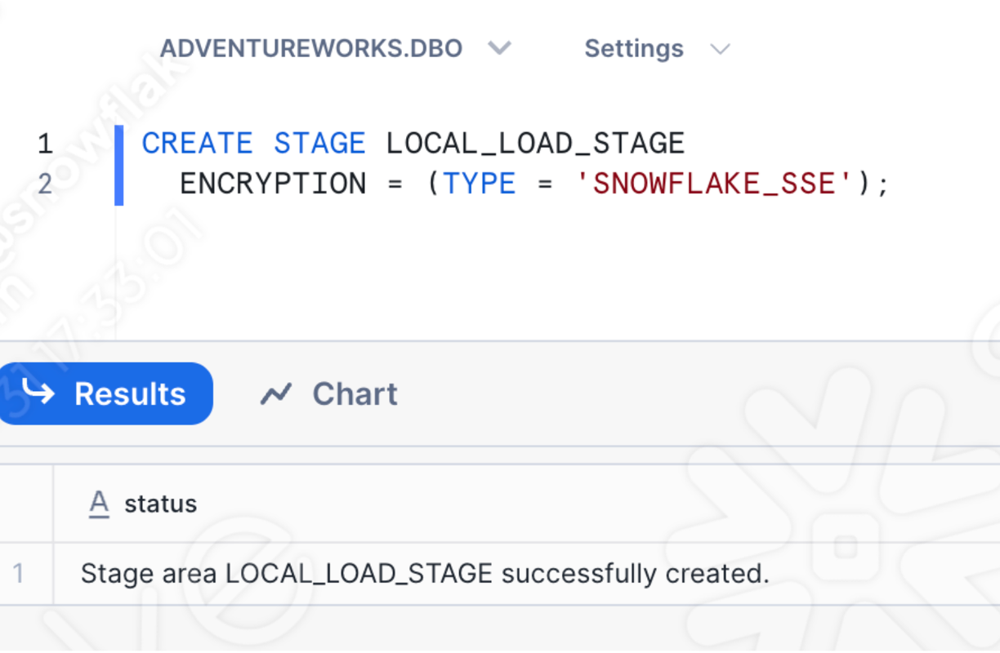

You can also [create an internal stage directly in the Snowsight UI](https://docs.snowflake.com/en/user-guide/data-load-local-file-system-create-stage#create-a-named-stage-using-snowsight). Now that the stage exists, we can manually load the file of interest into the stage. Navigate to the Databases section of the Snowsight UI, and find the stage we just created in the appropriate database.schema:

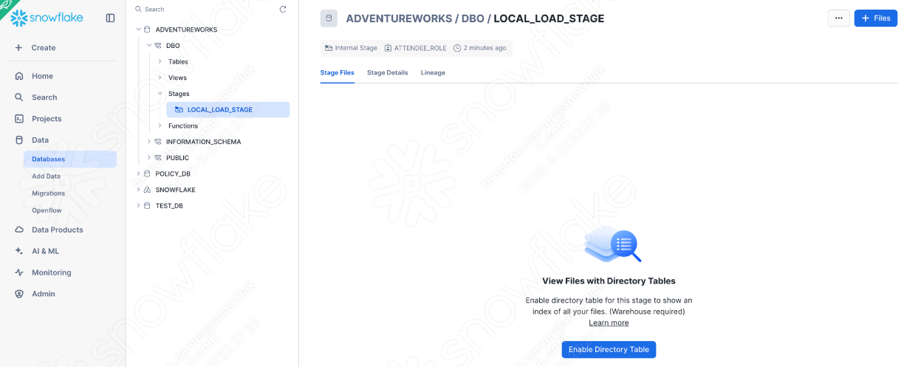

Let’s add our csv file by selecting the +Files option in the top right corner of the window. This will launch the Upload Your Files menu:

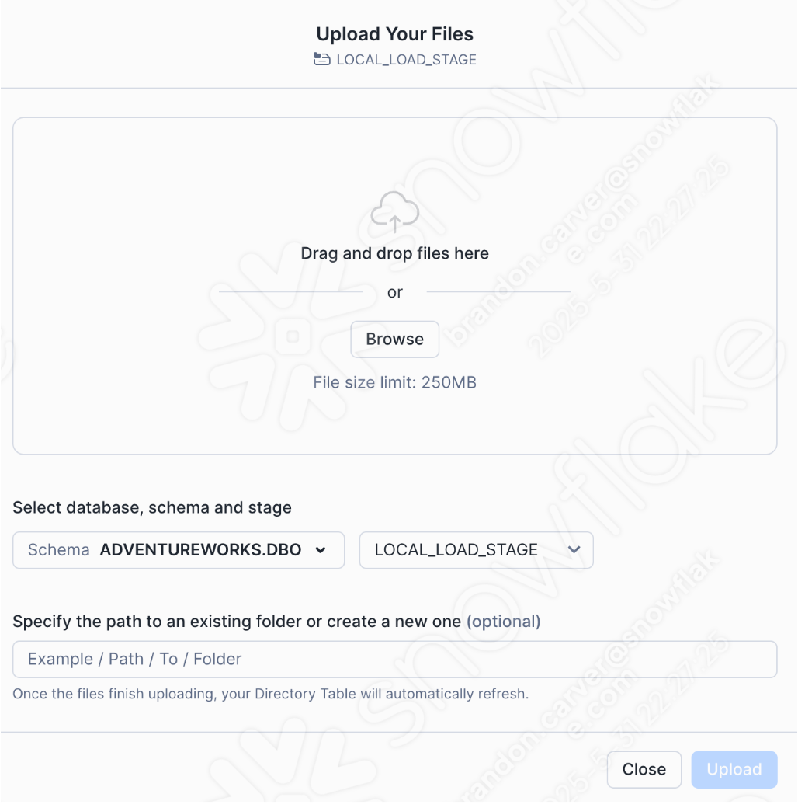

Drag and drop or browse to our project directory and load the customer_update.csv file into the stage:

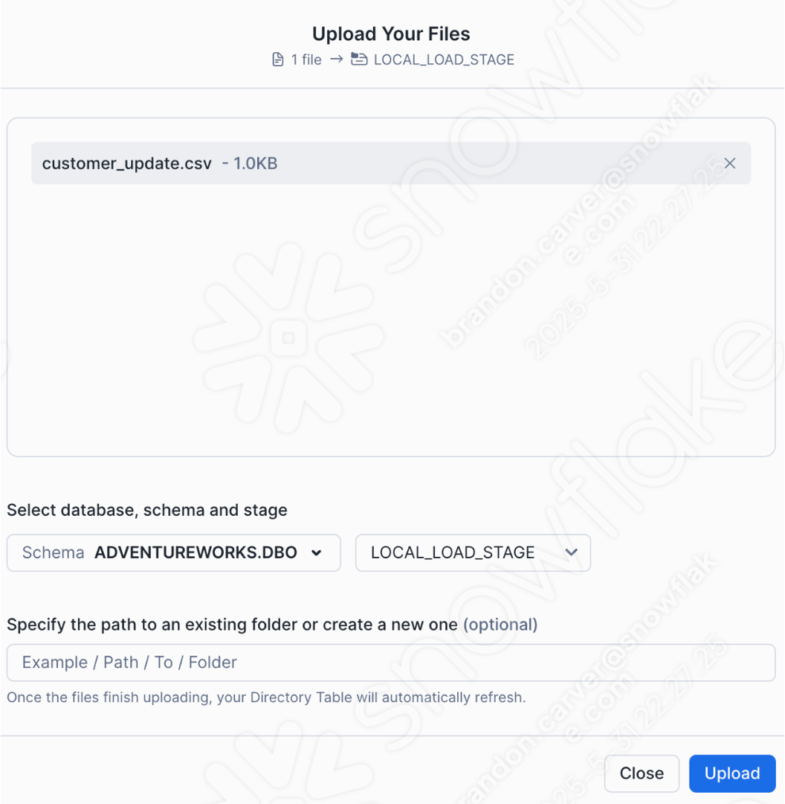

Select Upload in the bottom right corner of the screen. You will be taken back to the stage screen. To view the files, you will need to select Enable Directory Table:

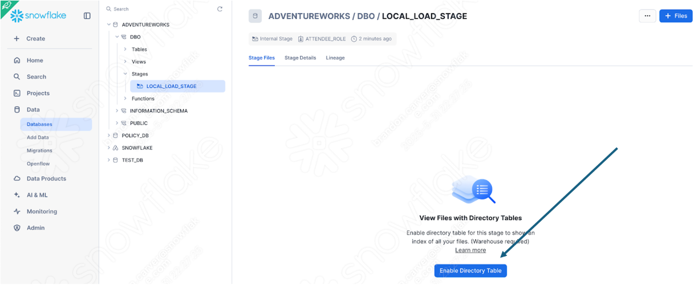

And now… our file appears in the stage:

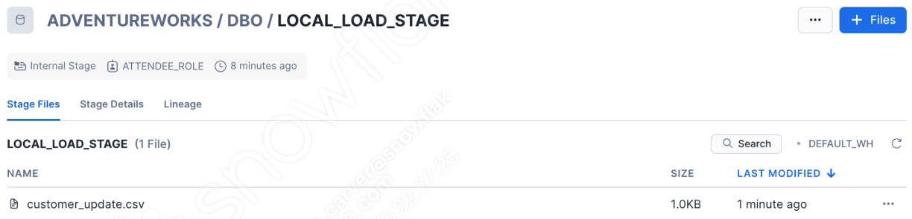

This is not really a pipeline anymore, of course. But at least we can run the login in Snowflake. Run the rest of the code that you moved into the worksheet. This user had success the first time, but that’s no guarantee of success the second time:

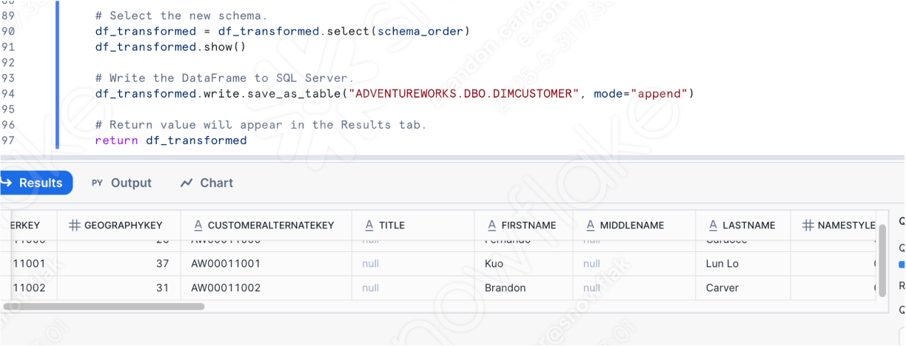

Note that once you’ve defined this function in Snowflake, you can call it in other ways. If AdventureWorks is 100% replacing their POS, then it may make sense to have the transformation logic in Snowflake, especially if orchestration and file movement will be handled somewhere else entirely. This allows Snowpark to focus on where it excels with the transformation logic.

**Conclusions**

And that's it for the script file. It's not the best example of a pipeline, bu it does hit hard on how to deal wit ht he output from the SMA:
- **Resolve All Issues**
- **Resolve the session calls**
- **Resolve the Input/Outputs**
- **Clean up and Test**!

Let's move on to the reporting notebook.

## Notebook Conversion and Validation

Let’s step over to the Reporting Notebook in our codebase: **Basic Reporting Notebook - SqlServer Spark.ipynb**. We're going to walk through a similar set of steps as we did with the pipeline script.
- **Resolve All Issues**: “Issues” here means the issues generated by the SMA. Take a look at the output code. Resolve parsing errors and conversion errors, and investigate warnings.
- **Resolve the session calls**: How the session call is written in the output code depends on where we are going to run the file. We will resolve this for running the code file(s) in the same location as they were originally going to be run, and then for running them in Snowflake.
- **Resolve the Input/Outputs**: Connections to different sources cannot be resolved entirely by the SMA. There are differences in the platforms, and the SMA will usually disregard this. This also is affected by where the file is going to be run. 
- **Clean up and Test**! Let’s run the code. See if it works. We will be smoke testing in this lab, but there are tools to do more extensive testing and data validation including Snowpark Python Checkpoints.

Let’s get started.

**Resolve All Issues**

Let’s go ahead and look at the issues present in the notebook.

(Note that you can open the notebook in VS Code, but to view it appropriately, you may want to install the Jupyter extension for VS Code. Alternatively, you could open this in Jupyter, but Snowflake still recommends VS Code with the Snowflake extension installed).

You can use the compare feature to view both of these side by side as we did with the pipeline file, though it will look more like a json if you do so:

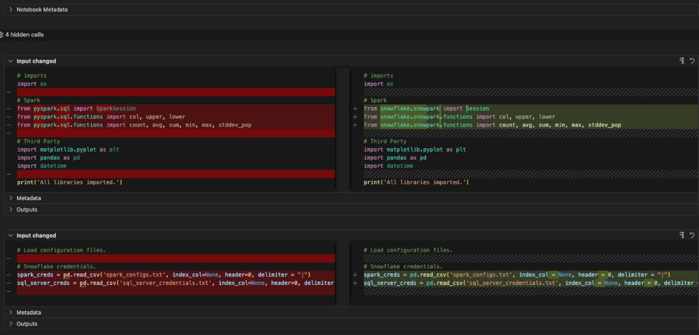

Note that there are only two unique EWI’s in this notebook. You can return to the search bar to find them, but since this is so short, you could also just… scroll down. These are the unique issues:
- **SPRKPY1002** *=> pyspark.sql.readwriter.DataFrameReader.jdbc is not supported.* This is a similar issue to the one we saw in the pipeline file, but that was a write call. This is a read call to the SQL Server database. We will resolve this in a bit.
- **SPRKPY1068** *=> "pyspark.sql.dataframe.DataFrame.toPandas is not supported if there are columns of type ArrayType, but it has a workaround. See documentation for more info.* This is another warning. If we pass an array to this function in Snowpark, it may not work. Let’s keep an eye on this when we test it.

And that’s it for the notebook… and our issues. We resolved a parsing error in the script file, but we did not have much to do in this notebook. Most of this was converted successfully, though there are a few things we will keep our eyes on. Let’s move on to the next step: resolving any session calls.

**Resolve the Session Calls**

To update the session calls in the reporting notebook, we need to locate the cell with the session call in it. That looks like this:

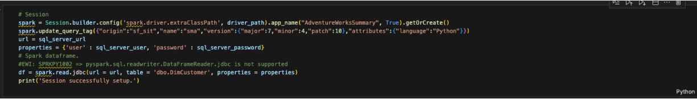

Now let’s do what we already did for our pipeline file:
- Change all references to the “spark” session variable to “session” (note that this is throughout the notebook)
- Remove the config function with the spark driver.

The before and after on this will look like this:

```python
# Old Session
spark = Session.builder.config('spark.driver.extraClassPath', driver_path).app_name("AdventureWorksSummary", True).getOrCreate()
spark.update_query_tag({"origin":"sf_sit","name":"sma","version":{"major":7,"minor":4,"patch":10},"attributes":{"language":"Python"}})

# New Session
# Session
session = Session.builder.app_name("AdventureWorksSummary", True).getOrCreate()
session.update_query_tag({"origin":"sf_sit","name":"sma","version":{"major":7,"minor":4,"patch":10},"attributes":{"language":"Python"}})
```

Note that there is other code in this cell. This code:

```python
url = sql_server_url
properties = {'user' : sql_server_user, 'password' : sql_server_password}
# Spark dataframe.
#EWI: SPRKPY1002 => pyspark.sql.readwriter.DataFrameReader.jdbc is not supported
df = session.read.jdbc(url = url, table = 'dbo.DimCustomer', properties = properties)
print('Session successfully setup.')
```

We’re almost ready to take on the read statement, but we’re not there yet. Let’s just move all of this to another cell. Create a new cell below this one, and move this code to that cell. It will look like this:

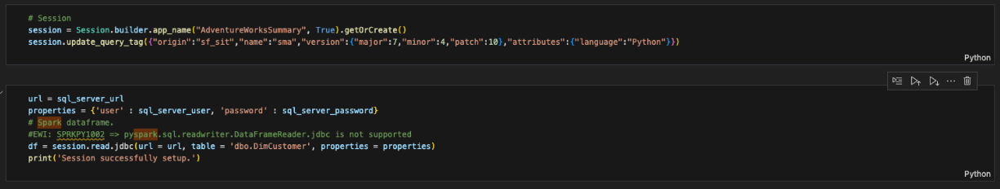

Is this all we need for the session call? No. Recall (and possibly review) the previous page under **Notes on Session Calls**. You will either need to make sure that your connection.toml file has your connection information or you will need to explicitly specify the connection parameters you intend to use in the session. 

**Resolving the Inputs/Outputs**

So let’s resolve our inputs and outputs now. Note that this is going to diverge based on whether you’re running the files locally or Snowflake, but for the notebook, everything can be run locally or in Snowflake. The code will be a bit simpler as we won’t even need to call a session. We’ll just… get the active session. As with the pipeline file, we’ll do this in two parts: to be run/orchestrated locally, and to be run in Snowflake. 

Working through the inputs and outputs in the reporting notebook will be considerably simpler than it was for the pipeline. There is no reading from a local file or moving data between files. There is simply a read from a table in SQL Server that is now a read from a table in Snowflake. Since we will not be accessing SQL Server, we can ditch any reference to the SQL Server properties. And the read statement can be replaced by a table statement in Snowflake. The before and after for this cell should look like this: 

```python
# Before
url = sql_server_url
properties = {'user' : sql_server_user, 'password' : sql_server_password}
# Spark dataframe.
#EWI: SPRKPY1002 => pyspark.sql.readwriter.DataFrameReader.jdbc is not supported
df = session.read.jdbc(url = url, table = 'dbo.DimCustomer', properties = properties)
print('Session successfully setup.')
```

```python
# After
# New table call
# Snowpark Dataframe table.
df = session.table('ADVENTUREWORKS.DBO.DIMCUSTOMER')
print('Table loaded successfully.')
df.show()
```

This leaves us with an updated session and the correct table read into a dataframe:

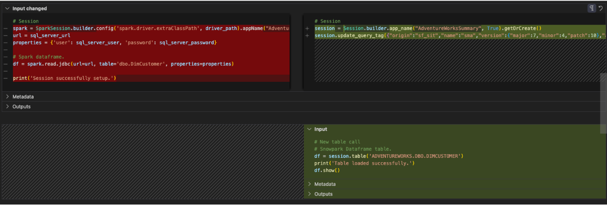

That’s actually… it. Let's move on to the Clean up and test part of the notebook file.

**Clean Up and Test**

Let’s do some clean up (like we did previously for the pipeline file). We never looked at our import calls and we have config files that are not necessary at all. Let’s start by removing the references to the config files. This will be each of the cells between the import statements and the session call. 

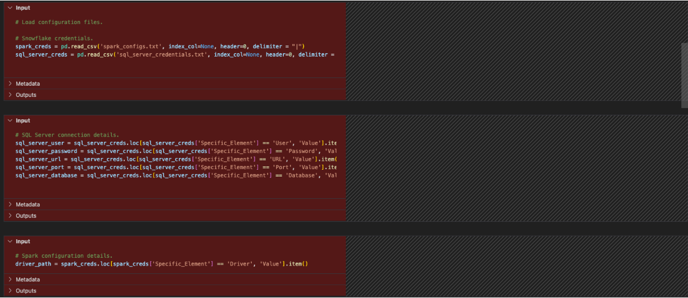

Now let’s look at our imports. The reference to the os can be deleted. (Seems like that wasn’t used in the original file either…) There is a pandas reference. There does not appear to be any usages of pandas in this notebook anymore now that the config files are referenced. There is a toPandas reference as part of the Snowpark dataframe API in the reporting section, but that’s not part of the pandas library. 

You can optionally replace all of the import calls to pandas with the modin pandas library. This library will optimize pandas dataframes to take advantage of Snowflake’s powerhouse computing. This change would look like this:

```python
# Old
import pandas as pd

# New
import modin.pandas as pd
import snowflake.snowpark.modin.plugin
```

Having said that, we can delete that one as well. Note that the SMA has replaced any spark specific import statements with those related to Snowpark. The final import cell would look like this:

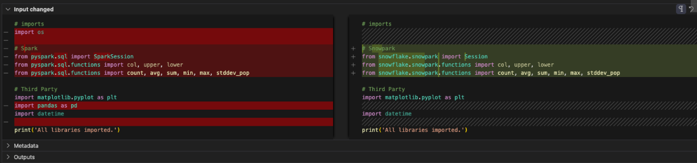

And that’s it for our cleanup. We still have a couple of EWIs in the reporting and visualization cells, but it looks like we should make it. Let’s run this one and see if we get an output.

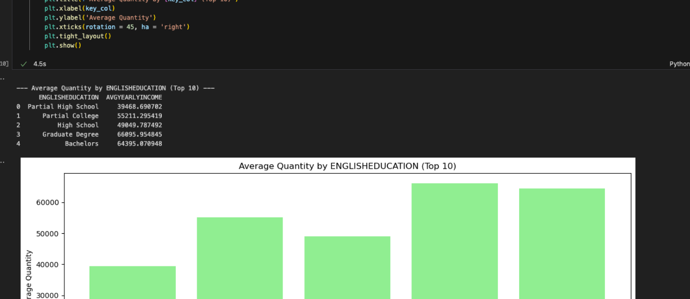

And we did. The reports seem to match what was output by the Spark Notebook. Even though the reporting cells seemed complex, Snowpark is able to work with them. The SMA let us know there could be an issue, but there doesn’t appear to be any problems. More testing would help, but our first round of smoke testing has passed.

Now let’s look at this notebook in Snowsight. Unlike the pipeline file, we can do this entirely in Snowsight.

**Running the Notebook in Snowsight**

Let’s take the version of the notebook that we have right now (having worked through the issues, the session calls, and the inputs and outputs) and load it into Snowflake. To do this, go to the notebooks section in SnowSight:

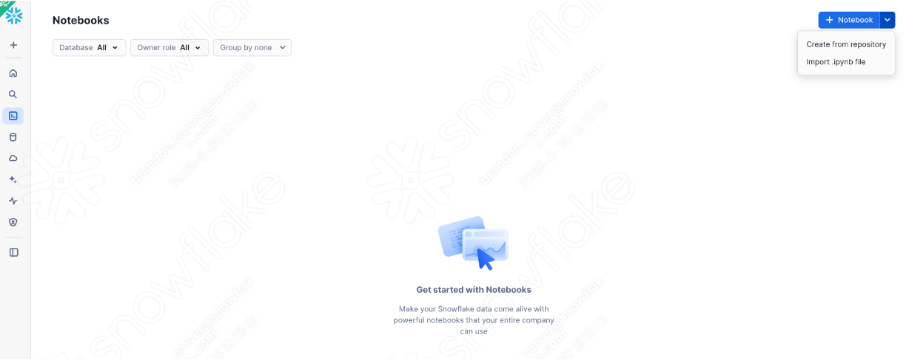

And select the down arrow next to the +Notebook button in the top right, and select “Import .ipynb file” (shown above). 

Once this has been imported, choose the notebook file that we have been working with in the output directory created by the SMA in your project folder.

There will be a create notebook dialog window that opens. For this upload, we will choose the following options:
- Notebook location: 
- Database: **ADVENTUREWORKS**
- Schema: **DBO**
- Python environment: **Run on warehouse** (This is not a large notebook with a bunch of ml. This is a basic reporting notebook. We can run this on a warehouse.) 
- Query warehouse: **DEFAULT_WH**
- Notebook warehouse: **DEFAULT_WH** (you can leave it as the system chosen warehouse (will be a streamlit warehouse)... for this notebook, it will not matter)

You can see these selections below:

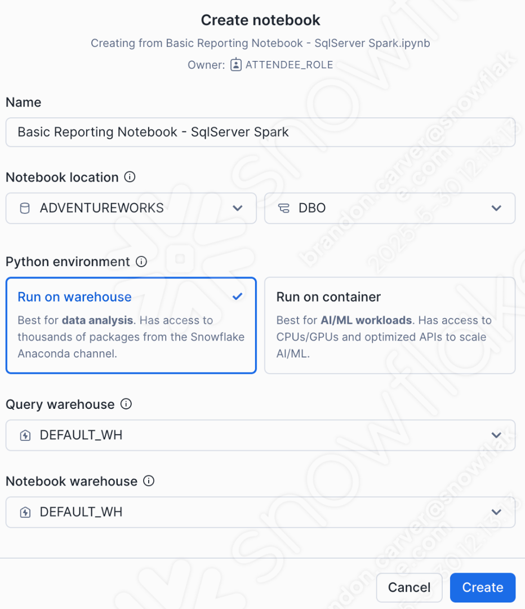

This should load your notebook into Snowflake and it will look something like this:

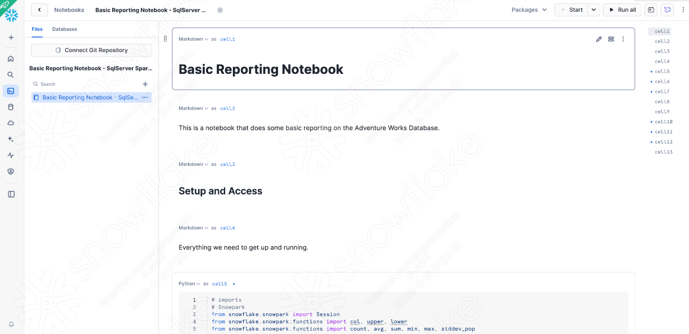

There are a couple of quick checks/changes we need to make from the version we just tested locally in order to ensure that the notebook runs in Snowsight:
- Change the session calls to retrieve the active session
- Ensure any dependent libraries we need to install are available

Let’s start with the first one. It may seem odd to alter the session call again after we spent so much time on it in the first place, but we’re running inside of Snowflake now. You can remove anything associated with reading the session call and replacing it with the “get_active_session” call that is standard at the top of most Snowflake notebooks:

```python
# Old for Jupyter
session = Session.builder.app_name("AdventureWorksSummary", True).getOrCreate()

# New for Snowsight
from snowflake.snowpark.context import get_active_session
session = get_active_session()
```

We don't need to specify connection parameters or update a .toml file because we are already connected. we are in Snowflake.

Let’s replace the old code in the cell with the new code. That will look something like this:

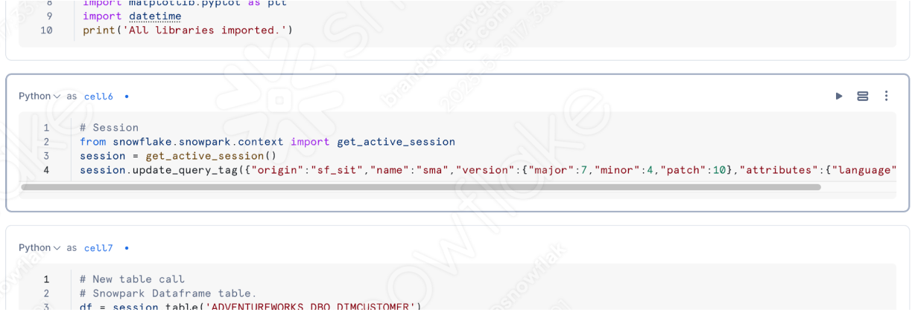

Now let’s address the available packages for this run, but instead of us figuring out what we need to add. Let’s let Snowflake. One of the better parts of using a notebook is that we can run individual cells and see what the results are. Let’s run our import library cell.

If you haven’t already, go ahead and start the session by clicking in the top right corner of the screen where it says “Start”:

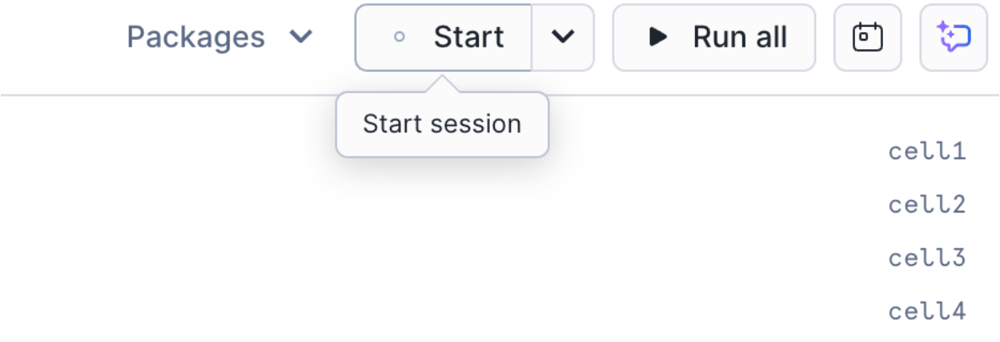

If you run the topmost cell in the notebook, and you will likely discover that matplotlib is not loaded into the session:

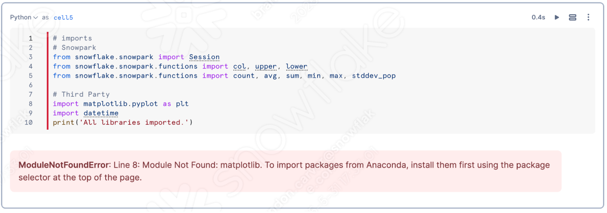

This is a pretty important one for this notebook. You can add that library to your notebook/session by using the “Packages” option in the top right of the notebook:

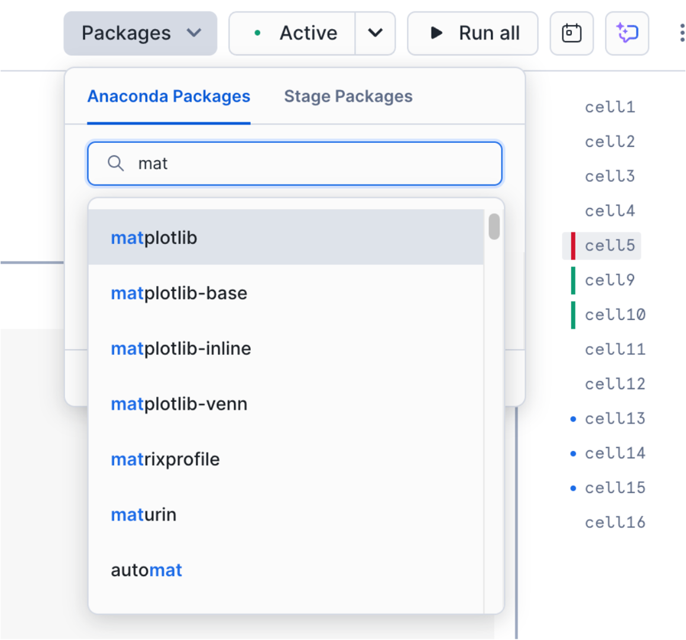

Search for matplotlib, and select it. This will make this package available in the session. 

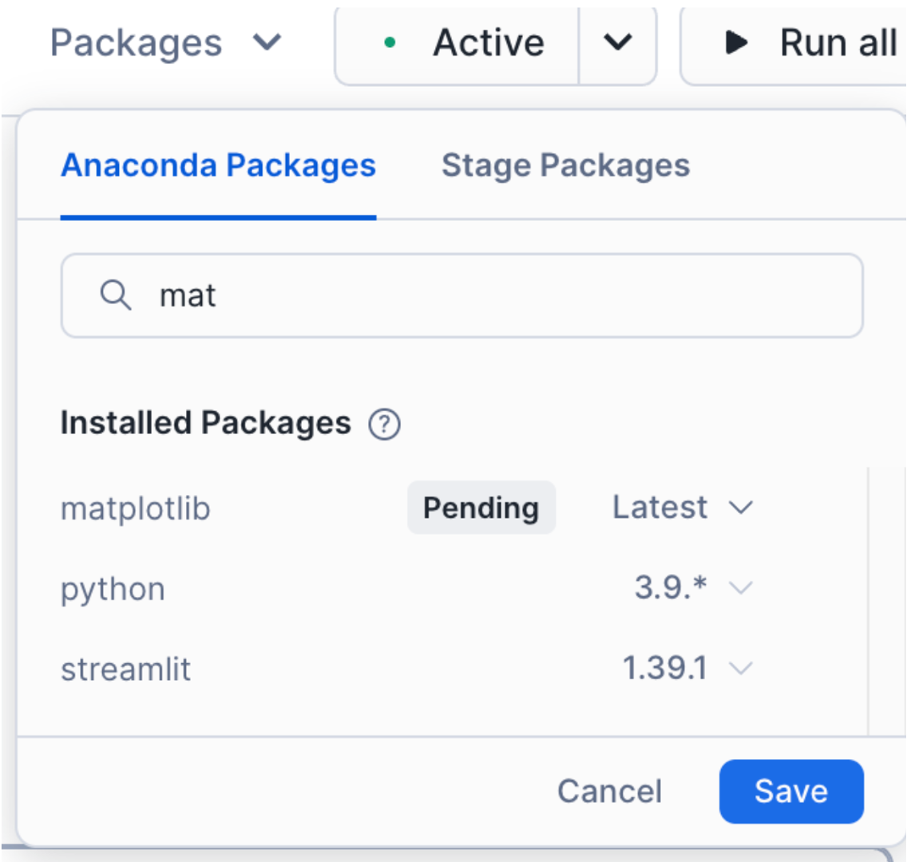

Once you load this library, you will have to restart the session. Once you have restarted the session, run that first cell again. You will likely be told that it was a success this time.


With the packages loaded, the session fixed, and the rest of the issues in the code already resolved, what can we do to check the rest of the notebook? Run it! You can run all the cells in the notebook by selecting “Run all” in the top right corner of the screen, and see if we get any errors.

It looks like there was a successful run:

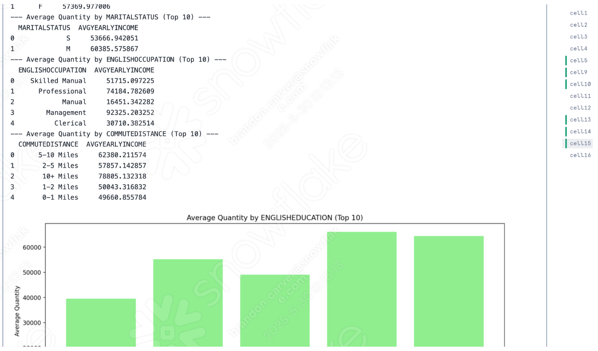

If you compare the two notebooks execution, it looks like the only difference is that the Snowflake version put all of the output datasets first followed by the images, whereas they are intermixed in the Spark Jupyter Notebook:

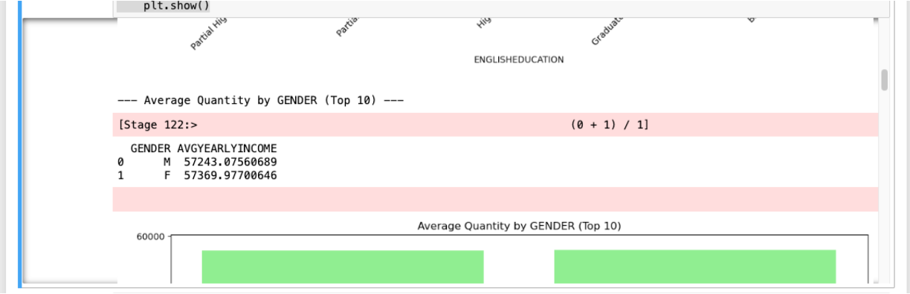

Note that this difference is not an API difference, but rather a difference in how notebooks in Snowflake orchestrate this. This is likely a difference AdventureWorks is willing to accept! 

**Conclusions**

By utilizing the SMA, we were able to accelerate the migration of both a data pipeline and a reporting notebook. The more of each that you have, the more value a tool like the SMA can provide. 

And let’s go back to the assessment -> conversion -> validation flow that we have consistently come back to. In this migration, we:
- Setup out project in the SMA
- Ran SMA’s assessment and conversion engine on the code files
- Reviewed the output reporting from the SMA to better understand what we have
- Review what could not be converted by the SMA in VS Code
- Resolve issues and errors
- Resolve session references
- Resolve input/output references
- Run the code locally
- And run the code in Snowflake
- Ran the newly migrated scripts and validated their success

Snowflake has spent a great deal of time improving its ingestion and data engineering capabilities, just as it has spent time improving migration tools like SnowConvert, the SnowConvert Migration Assistant, and the Snowpark Migration Accelerator. Each of these will continue to improve. Please feel free to reach out if you have any suggestions for migration tooling. These teams are always looking for additional feedback to improve the tools. 


## Conclusion And Resources

Congratulations! You've successfully completed an end-to-end migration from SQL Server to Snowflake, including both the database objects and the ETL pipelines that feed your data mart.

### What You Learned
- How to assess a SQL Server environment for migration to Snowflake
- Using SnowConvert to migrate database schemas and resolve conversion issues
- Transferring data from SQL Server to Snowflake
- Converting Spark ETL pipelines to Snowpark using the SMA

### Related Resources
- [SnowConvert Documentation](https://docs.snowconvert.com/)
- [Snowpark Migration Accelerator Guide](https://docs.snowflake.com/en/user-guide/migration-accelerators)
- [Snowflake SQL Server Migration Guide](https://resources.snowflake.com/migration/microsoft-sql-server-to-snowflake-migration-guide)
  - [GitHub Repository for this Lab](https://github.com/Snowflake-Labs/sfguides/tree/master/site/sfguides/src/e2e-sqlserver-migration/)
