author: Prash Medirattaa
id: end_to_end_machine_learning_with_dataiku
summary: This is a sample Snowflake Guide
categories: Getting Started
environments: web
status: Published 
feedback link: https://github.com/Snowflake-Labs/sfguides/issues
tags: Getting Started, Data Science, Data Engineering, Twitter 

# End to End Machine learning with Snowflake and Dataiku
<!-- ------------------------ -->
## Overview  

Duration: 4

This Snowflake Quickstart introduces you to the using Snowflake together with Dataiku Cloud as part of a Machine learning project, and build an end-to-end machine learning solution. This lab will showcase seamless integration of both Snowflake and Dataiku, and their powerful features. 

### Business Problem 

Will go through a **supervised machine learning** by building a binary classification model to predict if the client will **subscribe (yes/no)** a fixed term deposit (savings account) considering multiple features. 

**Supervised machine learning** is the process of taking a historical dataset with KNOWN outcomes of what we would like to predict, to train a model, that can be used to make future predictions. After building a model we will deploy back to Snowflake for scoring by using Snowpark-java udf. 

### Dataset

In addition, we’ll also take a look at Snowflake’s Data Marketplace and how 3rd party data sets from there can enrich and support your Data Science projects.  Integration of dataiku with snowflake and multiple stages in Machine learning life cycle.

[Data Set link](http://archive.ics.uci.edu/ml/datasets/Bank+Marketing)

### Prerequisites

- Familiarity with Snowflake, basic SQL knowledge and Snowflake objects
- Basic knowledge  Machine Learning
- Basic knowledge Python, Jupyter notebook for **Bonus**

### What You'll Need During the Lab

To participate in the virtual hands-on lab, attendees need the following:

- A [Snowflake free 30-day trial](https://trial.snowflake.com/) **ACCOUNTADMIN** access
- Dataiku Cloud trial version via Snowflake’s Partner Connect

### What You'll Build

Operational end-to-end ML project using joint capabilities of Snowflake and Dataiku from Data collection to deployement

- Create a Data Science project in Dataiku and perform analysis on data via Dataiku within Snowflake
- The analysis and feature engineering using Dataiku
- Create, run, and evaluate simple Machine Learning models in Dataiku,  measure their performance and interpret
- Building and deploying Pipelines
- Creating  Snowpark-Java UDF, and using it to score result on test dataset writing back to Snowflake
- Use cloning and time travel for test environment

<!-- ------------------------ -->
## Setting up Snowflake 
Duration: 2

#### Step 1 

- If you haven’t already, register for a [Snowflake free 30-day trial](https://trial.snowflake.com/) 

- **Region**  - Kindly choose which is physically closest to you

- **Snowflake edition**  - Select the **Enterprise edition** so you can leverage some advanced capabilities that are not available in the Standard Edition.

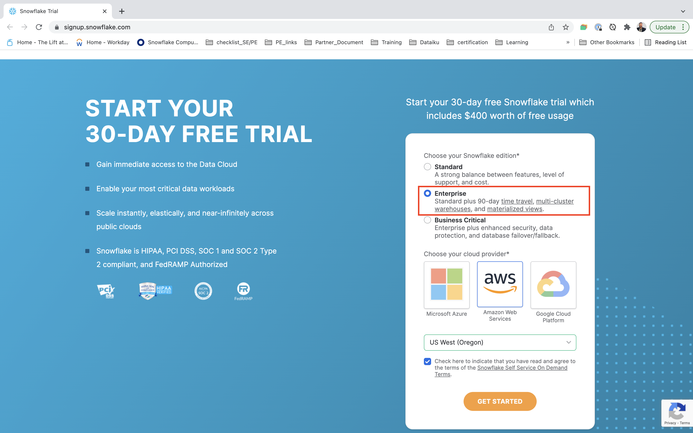

- After registering, you will receive an **email** with an **activation** link and your Snowflake account URL. Kindly activate the account.

- After activation, you will create a **user name** and **password**. Write down these credentials

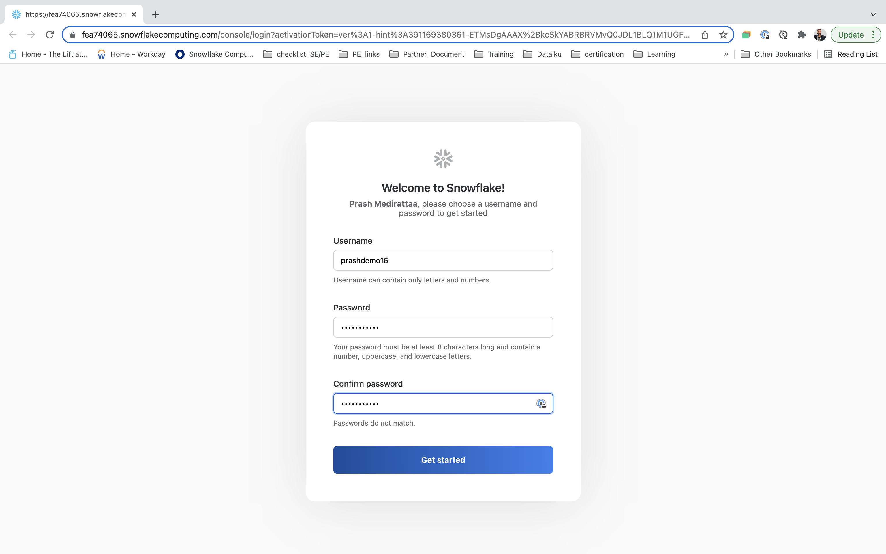

<!-- ------------------------ -->
## Load data in  Snowflake 
Duration: 2

#### Step 1

- Log in with your credentials

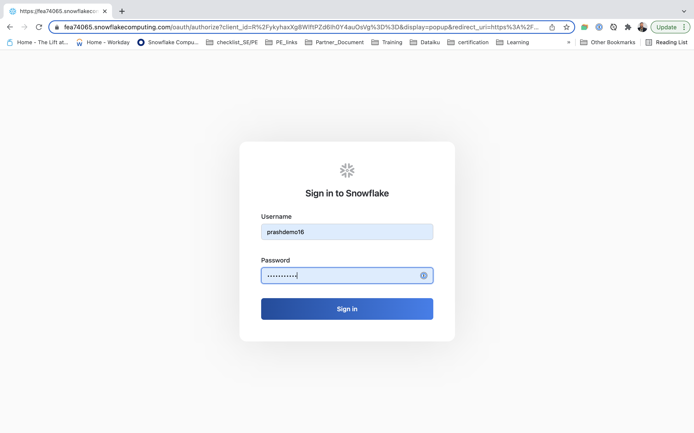

- Bookmark this URL for easy, future access

Resize your browser window, so that you can view this guide and your web browser side-by-side and follow the lab instructions. If possible, use a secondary display dedicated to the lab guide.

#### Step 2

- Log into your Snowflake account and have a clear screen to start working with. 

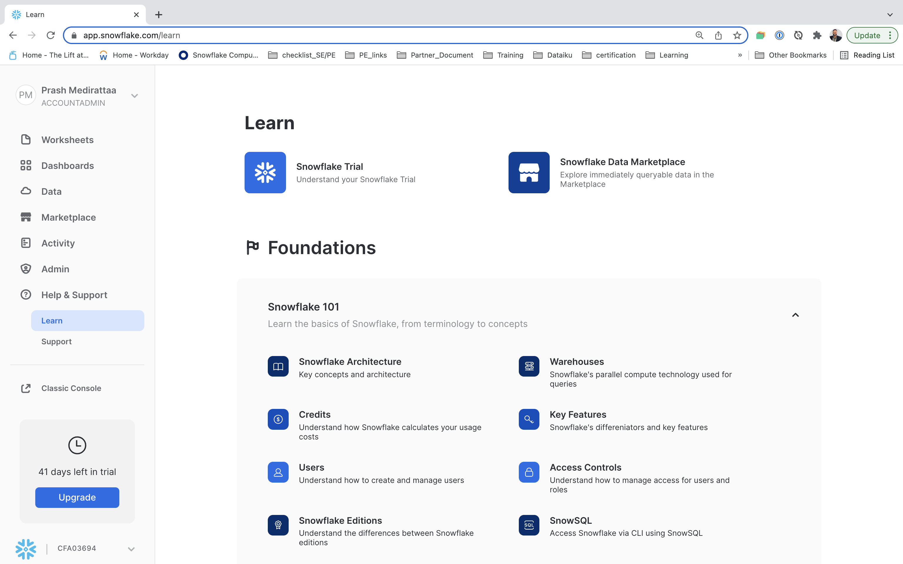

If you have just created a free trial account, feel free to minimize or close and hint boxes that are looking to help guide you. These will not be needed for this lab and most of the hints will be covered throughout the remainder of this exercise

#### Step 3

- Creating **Worksheet** 

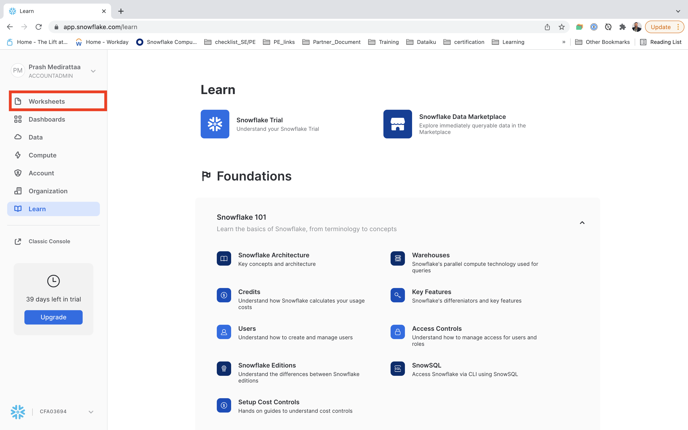

#### Step 4

- Creating **Worksheet** 

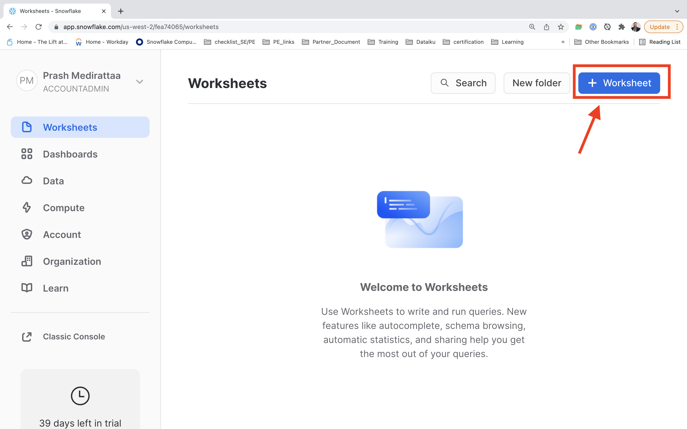

#### Step 4

- Renaming **Worksheet** 

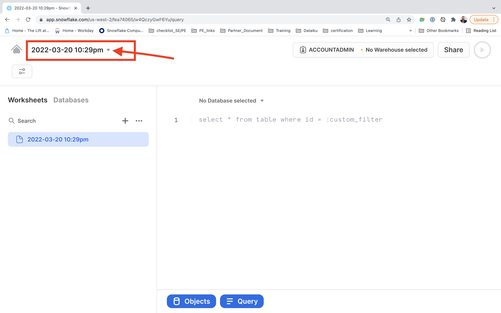

#### Step 5

- Renaming **Worksheet** to **Data Loading** 

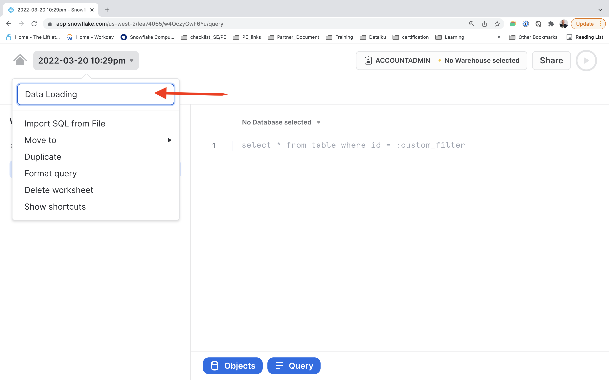

#### Step 6

Download the following .sql file that contains a series of SQL commands we will execute throughout this lab. <button>[Dataiku_Snowflake_VHOL.sql](https://snowflake-corp-se-workshop.s3-us-west-1.amazonaws.com/VHOL_Snowflake_Dataiku/Snowflake_Dataiku_VHOL.sql)</button>

Download the following .sql file that contains a series of SQL commands we will execute throughout this lab. <button>[Dataiku_Snowflake_VHOL.sql](https://prash-vhol-snowflake-dataiku.s3.us-west-1.amazonaws.com/scripts/Snowflake_Dataiku_VHOL.sql)</button>

#### Step 7

- Importing  **Sql** to **Worksheet** 

<!-- ------------------------ -->
## Snowsight - Initial Analysis 
Duration: 2

<!-- ------------------------ -->
## Connect Dataiku with Snowflake
Duration: 2

Verify that your user is operating under the Account Admin role.

To do this:

* Click your account name in the upper left-hand corner (if you are using the Classic Console this is top-right)

* Choose **Switch Role** from the drop-down list

* Click **ACCOUNTADMIN**

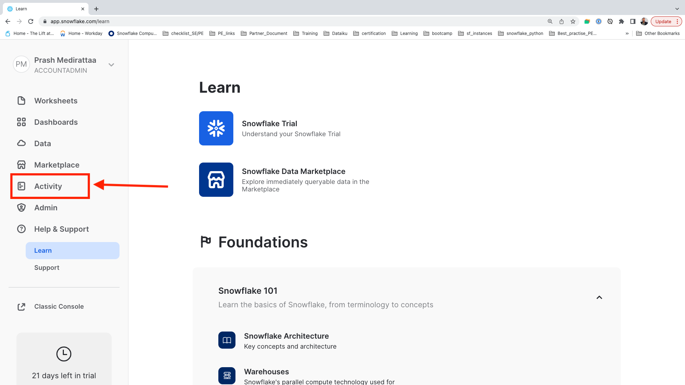

Click on the Dataiku tile. This will launch the following window, which will automatically create the connection parameters required for Dataiku to connect to Snowflake.
Snowflake will create a dedicated database, warehouse, system user, system password and system role, with the intention of those being used by the Dataiku account.

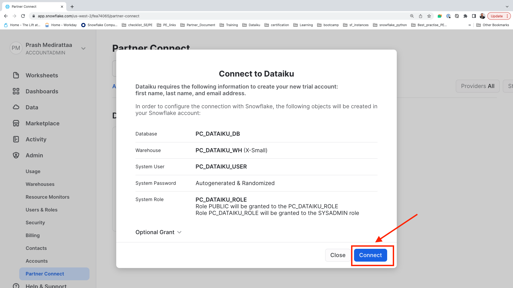

We’d like to use the **PC_DATAIKU_USER** to connect from Dataiku to Snowflake, and use the **PC_DATAIKU_WH** when performing activities within Dataiku that are pushed down into Snowflake.

This is to show that a Data Science team working on Dataiku and by extension on Snowflake can work completely independently from the Data Engineering team that works on loading data into Snowflake using different roles and warehouses.
 
Note that the user password (which is autogenerated by Snowflake and never displayed), along with all of the other Snowflake connection parameters, are passed to the Dataiku server so that they will automatically be used for the Dataiku connection.  **DO NOT CHANGE THE PC_DATAIKU_USER** password, otherwise Dataiku will not be able to connect to the Snowflake database.

Click on **Connect**. You may be asked to provide your first and last name.  If so, add them and click Connect.

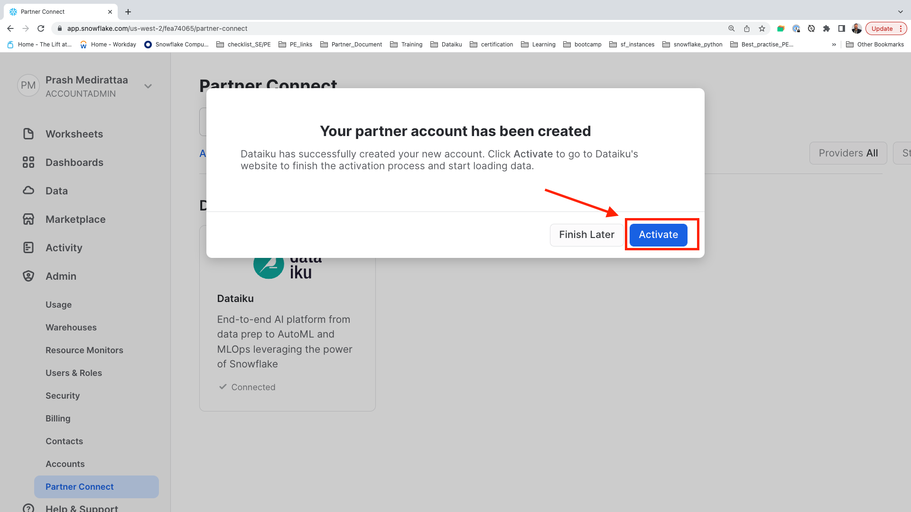

Your partner account has been created. Click on **Activate** to get it activated.

This will launch a new page that will redirect you to a launch page from Dataiku.
Here, you will have two options:
1) Login with an existing Dataiku username
2) Sign up for a new Dataiku account

We assume that you’re new to **Dataiku**, so ensure the “Sign Up” box is selected, and sign up with either GitHub, Google or your email address and your new password. 

Click sign up. <<NOTE: ADD INSTRUCTION FOR EXISTING IN ADDITION>>

When using your email address, ensure your password fits the following criteria:
1. **At least 8 characters in length**
2.  **Should contain:**
      **Lower case letters (a-z)**

      **Upper case letters (A-Z)**

      **Numbers (i.e. 0-9)**

Upon clicking on the activation link, please briefly review the Terms of Service of Dataiku Cloud. In order to do so, please scroll down to the bottom of the page. Click on **I AGREE**

Next, you’ll need to complete your sign up with the following information:
1.  First Name
2.  Last Name
3.  Job Title
4.  How would you define yourself (drop-down options for roles)
5.  Company Name
6.  Company Size (drop-down)
7.  What is your country (drop-down)
8.  What is your goal with Dataiku Cloud? (optional)
Then click on **Start**.

You will be redirected to the Dataiku Cloud Launchpad site. Click **GOT IT!** to continue.

You’ve now successfully set up your Dataiku trial account via Snowflake’s Partner Connect. We are now ready to continue with the lab. For this, move back to your Snowflake browser.

Positive
: **Important note**   Remember that the user password (which is autogenerated by Snowflake and never displayed), along with all of the other Snowflake connection parameters, are passed to the Dataiku server so that they will automatically be used for the Dataiku connection.  DO NOT CHANGE THE PC_DATAIKU_USER password, otherwise Dataiku will not be able to connect to the Snowflake database.

<!-- ------------------------ -->
## What We’re Going To Build
Duration: 2

Dataiku DSS is a collaborative, end-to-end data science and machine learning platform that unites data analysts, data scientists, data engineers, architects, and business users in a common space to bring faster business insights.

In this lab you will learn about the ways that Dataiku DSS can provide value to users of all skill sets through a simple use case: Build a credit scoring project to predict the risk of default on loans for customers and advise them on how to reduce their risk.

The project contains the input datasets from Snowflake. We’ll build a data science pipeline by applying data transformations, enriching from Marketplace employment data, building a machine learning model, and deploying it to the Flow. We will then see how you can score the model against fresh data from Snowflake and automate…?????.

We’ll explore a dataset that a data analyst team member already cleaned as well as Marketplace data. At the end of this lab you will be able to:

engineering features using code in a notebook and code recipe;

training a machine learning model and generating predictions;

Scoring the model.

At the end of the lab, the project Flow will look like this:

<<image of completed flow - needs to have the joined dataset as source and marketplace data>>

The final Flow will contain datasets, recipes, and machine learning processes.

* A **dataset** is represented by a blue square with a symbol that depicts the dataset type or connection. The initial datasets (also known as input datasets) are found on the left of the Flow. In this project, the input dataset will be the one we just created in Snowflake.

* A **recipe** in Dataiku DSS (represented by a circle icon with a symbol that depicts its function) can be either visual or code-based, and it contains the processing logic for transforming datasets.

* Finally, the **Machine learning processes** are represented by green icons.

### How We’ll Build The Project

Our goal is to build an optimized machine learning model that can be used to predict the risk of default on loans for customers and advise them on how to reduce their risk.
To do this, we’ll join the input datasets and perform feature engineering so that they are ready to use for building a binary classification model.

### Creating a Dataiku Project

Go back to your Dataiku Cloud instance. Click on **OPEN DATAIKU DSS** to get started.

Insert picture 

Once you’ve logged in, **click** on **+NEW PROJECT** and **select Blank project** to create a new project.

Insert picture 

Left this 
<!-- ------------------------ -->
## Data Preparation and Analysis 
Duration: 2

After creating our project, you’ll find the project homepage. It is a convenient high-level overview of the project’s status and recent activity.

Let’s add a new dataset to the Flow, in addition to the existing four present in the initial starting project.

Note ! 
The Flow is the visual representation of how data, recipes (steps for data transformation), and models work together to move data through an analytics pipeline.

A blue square in the Flow represents a dataset. The icon on the square represents the type of dataset, such as an uploaded file, or its underlying storage connection, such as a SQL database or cloud storage

* From the Flow click **+ Import Your First Dataset** in the centre of the Flow.

* Click Upload your files.

insert picture 

Select the **Search and import option**

click Next, and observe a preview of the settings used to read the file.

insert picture 

Select the **PC_DATAIKU_DB** connection from the dropdown then click (insert picture) and populate the database and schema as below and click on **LIST TABLES**

insert picture 

Select the Loans_Enriched and Unemployment_Data datasets and click **CREATE 2 DATASETS**

<!-- ------------------------ -->
## Feature Engineering
Duration: 2

<!-- ------------------------ -->
## Training 
Duration: 2

<!-- ------------------------ -->
## Deployment  
Duration: 2

<!-- ------------------------ -->
## Scoring and Evaluation  
Duration: 2

<!-- ------------------------ -->
## Conclusion  and Next Steps  
Duration: 2

## Bonus Material - Snowpark -Python  
Duration: 2