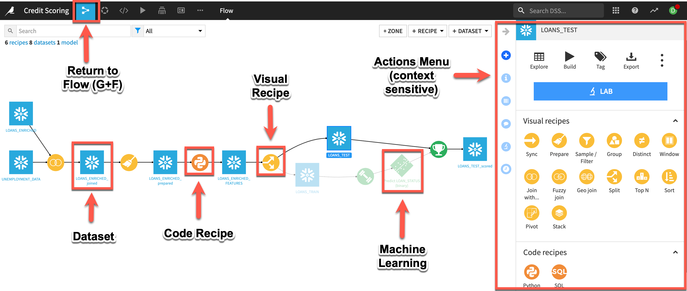
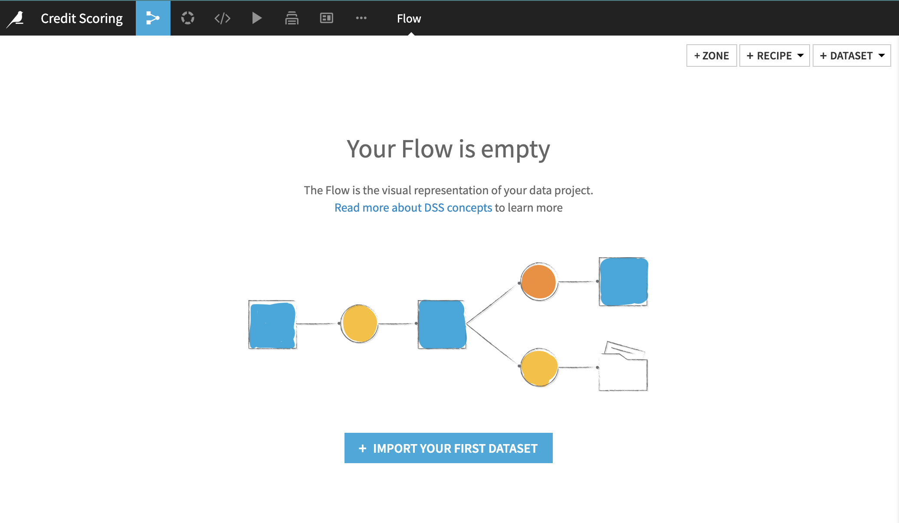
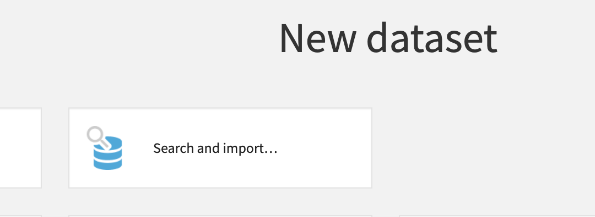
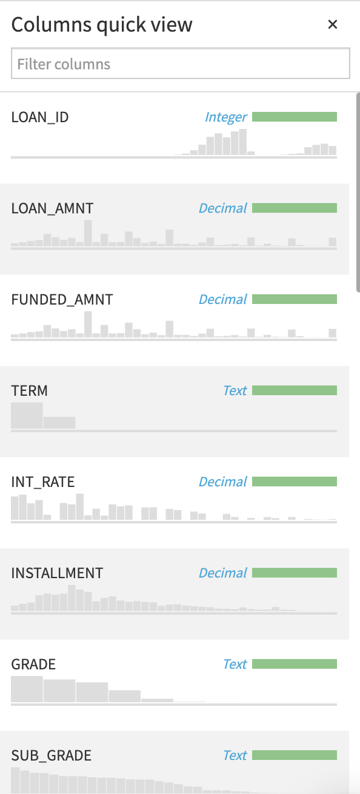
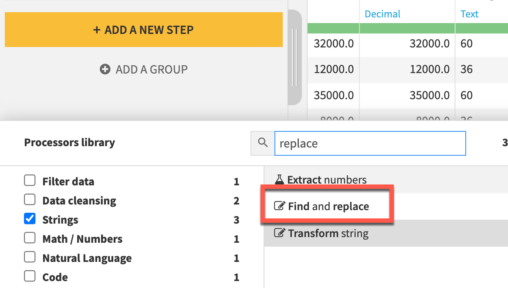
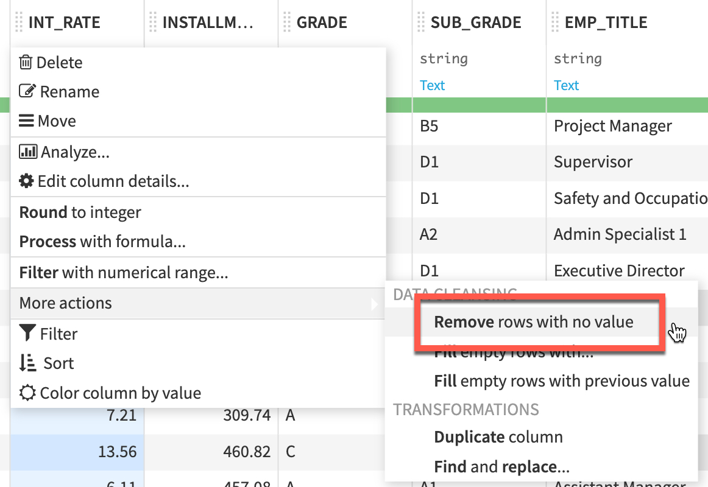

author: Prash Medirattaa
id: end_to_end_machine_learning_with_dataiku
summary: This is a sample Snowflake Guide
categories: Getting Started
environments: web
status: Published 
feedback link: https://github.com/Snowflake-Labs/sfguides/issues
tags: Getting Started, Data Science, Data Engineering, Twitter 

# End to End Machine learning with Snowflake and Dataiku
<!-- ------------------------ -->
## Overview  

Duration: 5

This Snowflake Quickstart introduces you to the using Snowflake together with Dataiku Cloud as part of a Machine learning project, and build an end-to-end machine learning solution. This lab will showcase seamless integration of both Snowflake and Dataiku at every stage of ML life cycle. We will also use Snowflake Data Marketplace to enrich the dataset. 

### Business Problem 

Will go through a **supervised machine learning** by building a binary classification model to predict if a lender will default on a loan. **LOAN_STATUS (yes/no)**  considering multiple features. 


**Supervised machine learning** is the process of taking a historical dataset with KNOWN outcomes of what we would like to predict, to train a model, that can be used to make future predictions. After building a model we will deploy back to Snowflake for scoring by using Snowpark-java udf. 
### Dataset

We will be exploring a financial service use of evaluating loan information to predict if a lender will default on a loan. The base data set was derived from loan data from the Lending Club.

In addition to base data, this will then be enriched with unemployment data from Knoema on the Snowflake Data Marketplace.


### What We’re Going To Build

We will build a project. The project contains the input datasets from Snowflake. We’ll build a data science pipeline by applying data transformations, enriching from Marketplace employment data, building a machine learning model, and deploying it to the Flow. We will then see how you can score the model against fresh data from Snowflake and automate


### Prerequisites

- Familiarity with Snowflake, basic SQL knowledge and Snowflake objects
- Basic knowledge  Machine Learning
- Basic knowledge Python, Jupyter notebook for **Bonus**

### What You'll Need During the Lab

To participate in the virtual hands-on lab, attendees need the following:

- A [Snowflake free 30-day trial](https://trial.snowflake.com/) **ACCOUNTADMIN** access
- Dataiku Cloud trial version via Snowflake’s Partner Connect


### What You'll Build

Operational end-to-end ML project using joint capabilities of Snowflake and Dataiku from Data collection to deployement

- Create a Data Science project in Dataiku and perform analysis on data via Dataiku within Snowflake
- The analysis and feature engineering using Dataiku
- Create, run, and evaluate simple Machine Learning models in Dataiku,  measure their performance and interpret
- Building and deploying Pipelines
- Creating  Snowpark-Java UDF, and using it to score result on test dataset writing back to Snowflake
- Use cloning and time travel for test environment


<!-- ------------------------ -->
## Setting up Snowflake 
Duration: 5


- If you haven’t already, register for a [Snowflake free 30-day trial](https://trial.snowflake.com/) 

- **Region**  - Kindly choose which is physically closest to you

- **Snowflake edition**  - Select the **Enterprise edition** so you can leverage some advanced capabilities that are not available in the Standard Edition.


- After registering, you will receive an **email** with an **activation** link and your Snowflake account URL. Kindly activate the account.


- After activation, you will create a **user name** and **password**. Write down these credentials


<!-- ------------------------ -->
## Logging in  Snowflake 
Duration: 2


#### Step 1

Log in with your credentials


**Bookmark this URL for easy, future access**

Resize your browser window, so that you can view this guide and your web browser side-by-side and follow the lab instructions. If possible, use a secondary display dedicated to the lab guide.


#### Step 2

Log into your Snowflake account. By default it will open up  


If you have just created a free trial account, feel free to minimize or close and hint boxes that are looking to help guide you. These will not be needed for this lab and most of the hints will be covered throughout the remainder of this exercise

#### Step 3

Create **Worksheet**  


#### Step 4

Adding a **Worksheet** 


#### Step 5

- Creating a new  **Worksheet** and **Renaming** it to **Data Loading**


After creating the worksheet we are ready to load the data. 


## Load data in  Snowflake 

Download the following .sql file that contains a series of SQL commands we will execute throughout this lab. You can either execute cell by cell commands from the sql file or copy the below code blocks and follow. 

 <button>[Snowflake_Dataiku_ML.sql](https://snowflake-corp-se-workshop.s3.us-west-1.amazonaws.com/Summit_Snowflake_Dataiku/src/Snowflake_Dataiku_ML.sql)</button>

Importing  **Sql** to **Worksheet** 
To ingest our script in the Snowflake UI, Import SQL from File.


Import the **SQL** file on the worksheet for your reference


#### Data Loading : Steps


**Imp tip : To run the complete code block highlight and  Select >  Ctrl + A - Windows or Command + A - Mac then play**


**Step 1** : Virtual warehouse that we will use to compute with the **SYSADMIN** role, and then grant all privileges to the **ML\_ROLE**.


```

USE ROLE SYSADMIN;

CREATE OR REPLACE WAREHOUSE ML_WH

  WITH WAREHOUSE_SIZE = 'XSMALL'

  AUTO_SUSPEND = 120

  AUTO_RESUME = true

  INITIALLY_SUSPENDED = TRUE;

```


**Step 2** : Create **Loan_data** table in the database

```

USE WAREHOUSE ML_WH;

CREATE DATABASE IF NOT EXISTS ML_DB;

USE DATABASE ML_DB;


CREATE OR REPLACE TABLE loan_data (
  
        LOAN_ID NUMBER(38,0),
  
        LOAN_AMNT FLOAT,

        FUNDED_AMNT FLOAT,

        TERM VARCHAR(4194304),

        INT_RATE FLOAT,

        INSTALLMENT FLOAT,

        GRADE VARCHAR(4194304),

        SUB_GRADE VARCHAR(4194304),

        EMP_TITLE VARCHAR(4194304),

        EMP_LENGTH_YEARS NUMBER(38,0),

        HOME_OWNERSHIP VARCHAR(4194304),

        ANNUAL_INC FLOAT,

        VERIFICATION_STATUS VARCHAR(4194304),

        ISSUE_DATE_PARSED TIMESTAMP_TZ(9),

        LOAN_STATUS VARCHAR(4194304),

        PYMNT_PLAN BOOLEAN,
        
        PURPOSE VARCHAR(4194304),

        TITLE VARCHAR(4194304),
    
        ZIP_CODE VARCHAR(4194304),

        ADDR_STATE VARCHAR(4194304),

        DTI FLOAT,

        DELINQ_2YRS FLOAT,

        EARLIEST_CR_LINE TIMESTAMP_TZ(9),

        INQ_LAST_6MTHS FLOAT,

        MTHS_SINCE_LAST_DELINQ FLOAT,

        MTHS_SINCE_LAST_RECORD FLOAT,

        OPEN_ACC FLOAT,

        REVOL_BAL FLOAT,

        REVOL_UTIL FLOAT,

        TOTAL_ACC FLOAT,

        TOTAL_PYMNT FLOAT,

        MTHS_SINCE_LAST_MAJOR_DEROG FLOAT,

        TOT_CUR_BAL FLOAT,

        ISSUE_MONTH NUMBER(38,0),

        ISSUE_YEAR NUMBER(38,0)
);

```

After running the cell above, we have successfully created a **loan data** table. 


**Step 3** :Creating a external stage to load the lab data into the table. This is done from a public S3 bucket to simplify the workshop. Typically an external stage will be using various secure integrations as described in this [link](https://docs.snowflake.com/en/user-guide/data-load-s3-config.html). 

```
CREATE OR REPLACE STAGE LOAN_DATA

  url='s3://snowflake-corp-se-workshop/Summit_Snowflake_Dataiku/data/';
  
 
 ---- List the files in the stage 

 list @LOAN_DATA;
```
**Screen shot again after moving to new s3 folder** 


**Step 4** :Copying the data in the database

```

alter warehouse ML_WH set warehouse_size=medium;
COPY INTO loan_data FROM @LOAN_DATA/loans_history_enriched.csv
FILE_FORMAT = (TYPE = 'CSV' field_optionally_enclosed_by='"',SKIP_HEADER = 1); 

SELECT * FROM loan_data LIMIT 100;

```


Below is the snapshot of the data and it represents aggregation from various internal systems for lender information and loans. We can have a quick look and see the various attributes in it.


We have succfully loaded the data from **external stage** to snowflake.


**Step 7** : **Time to switch to get Konema Employement Data from Snowflake Market place**

We can now look at additional data in the Snowflake Marketplace that can be helpful for improving ML models. It may be good to look at employment data in the region when analyzing loan defaults. Let’s look in the Snowflake Data Marketplace and see what external data is available from the data providers.

Lets go to home screen 


#### Steps 

1. **Click Market place tab** 

2. Make Sure **ACCOUNTADMIN** role is selected 

3. In search bar **Labor Data Atlas**


 Click on the tile with **Labor Data Atlas.**


Next click on the **Get Data** button. This will provide a pop up window in which you can create a database in your account that will provide the data from the data provider.


#### Important : Steps 

1. Change the name of the database to  **KNOEMA_LABOR_DATA_ATLAS**  

2. Select additional roles drop down **PUBLIC**

3. Click **Get Data**


When the confirmation is provided click on done and then you can close the browser tab with the Preview App.  Other advantage of using Snowflake Data Marketplace does not require any additional work and will show up as a database in your account. A further benefit is that the data will automatically update as soon as the data provider does any updates to the data on their account.After done just to confirm the datasets are properly configured.


 Click on Data tab **Database**

You should see **KNOEMA_LABOR_DATA_ATLAS**  and **ML_DB**


After confirming **Databases**.  Lets go to **Worksheets tab** and **open** the **Data Loading** worksheet 


Creating a **KNOEMA_EMPLOYMENT_DATA** marketplace data view to pivot the data for the different employment metrics to columns for easier consumption. 

```
USE DATABASE ML_DB;

CREATE OR REPLACE VIEW KNOEMA_EMPLOYMENT_DATA AS (

SELECT *

FROM (SELECT "Measure Name" MeasureName, "Date", 
      "RegionId" State, 
      AVG("Value") Value 
      FROM "KNOEMA_LABOR_DATA_ATLAS"."LABOR"."BLSLA" WHERE "RegionId" is not null 
      and "Date" >= '2018-01-01' AND "Date" < '2018-12-31' GROUP BY "RegionId", "Measure Name", "Date")
  PIVOT(AVG(Value) FOR MeasureName
  IN ('civilian noninstitutional population', 'employment', 'employment-population ratio', 
     'labor force', 'labor force participation rate', 'unemployment', 'unemployment rate')) AS 
        p (Date, State, civilian_noninstitutional_population, employment, employment_population_ratio, 
           labor_force, labor_force_participation_rate, unemployment, unemployment_rate)
);

SELECT * FROM KNOEMA_EMPLOYMENT_DATA LIMIT 100;

```


Create a new table **UNEMPLOYMENT DATA** using the geography and time periods. This will provide us with unemployment data in the region associated with the specific loan.


```

CREATE OR REPLACE TABLE UNEMPLOYMENT_DATA AS

 SELECT l.LOAN_ID, e.CIVILIAN_NONINSTITUTIONAL_POPULATION, 
        e.EMPLOYMENT, e.EMPLOYMENT_POPULATION_RATIO, e.LABOR_FORCE, 
        e.LABOR_FORCE_PARTICIPATION_RATE, e.UNEMPLOYMENT, e.UNEMPLOYMENT_RATE

  FROM LOAN_DATA l LEFT JOIN KNOEMA_EMPLOYMENT_DATA e

 on l.ADDR_STATE = right(e.state,2) and l.issue_month = month(e.date) and l.issue_year = year(e.date);

SELECT * FROM UNEMPLOYMENT_DATA LIMIT 100;

```


#### IMPORTANT: Database for Machine learning consumption will be created after connecting Snowflake with Dataiku using partner connect. 


<!-- ------------------------ -->
## Connect Dataiku with Snowflake
Duration: 8


Verify that your user is operating under the Account Admin role.

To do this:

* Click your account name in the upper left-hand corner (if you are using the Classic Console this is top-right)

* Choose **Switch Role** from the drop-down list

* Click **ACCOUNTADMIN**


* Click on the **Dataiku** tile. This will launch the following window, which will automatically create the **connection parameters** required for Dataiku to connect to Snowflake.

Snowflake will create a dedicated database, warehouse, system user, system password and system role, with the intention of those being used by the Dataiku account.


We’d like to use the **PC_DATAIKU_USER** to connect from Dataiku to Snowflake, and use the **PC_DATAIKU_WH** when performing activities within Dataiku that are pushed down into Snowflake.

Note that the user password (which is autogenerated by Snowflake and never displayed), along with all of the other Snowflake connection parameters, are passed to the Dataiku server so that they will automatically be used for the Dataiku connection.  **DO NOT CHANGE THE PC_DATAIKU_USER** password, otherwise Dataiku will not be able to connect to the Snowflake database.

Click on **Connect**. You may be asked to provide your first and last name.  If so, add them and click Connect. Your partner account has been created. Click on **Activate** to get it activated.


This will launch a new page that will redirect you to a launch page from Dataiku.
Here, you will have two options:
1) Login with an existing Dataiku username
2) Sign up for a new Dataiku account

We assume that you’re new to **Dataiku**, so ensure the “Sign Up” box is selected, and sign up with either GitHub, Google or your email address and your new password. 

Click sign up. <<NOTE: ADD INSTRUCTION FOR EXISTING IN ADDITION>>


When using your email address, ensure your password fits the following criteria:
1. **At least 8 characters in length**
2.  **Should contain:**
      **Lower case letters (a-z)**

      **Upper case letters (A-Z)**

      **Numbers (i.e. 0-9)**

Upon clicking on the activation link, please briefly review the Terms of Service of Dataiku Cloud. In order to do so, please scroll down to the bottom of the page. Click on **I AGREE**


Next, you’ll need to complete your sign up information then click on **Start**.


<!--  -->


You will be redirected to the Dataiku Cloud Launchpad site. Click **GOT IT!** to continue.


You’ve now successfully set up your Dataiku trial account via Snowflake’s Partner Connect. We are now ready to continue with the lab. For this, move back to your Snowflake browser.


#### Database for Machine Learning


After connecting  **Snowflake** to **Dataiku** via partner connect. We will clone the table created in **ML_DB** to **PC_DATAIKU_DB** for the Dataiku consumption. Snowflake provides a very unique feature called [Zero Copy Cloning](https://www.youtube.com/watch?v=yQIMmXg7Seg) that will create a new copy of the data by **only making a copy of the metadata of the objects**. This drastically speeds up creation of copies and also drastically reduces the storage space needed for data copies.


You should see three database now  **PC_DATAIKU_DB** is the system generated database created. Go back to **Worksheet** you are working and run below commands. 


#### Granting Previlages of ML_DB to PC_Dataiku_role

```
grant all privileges on database ML_DB to role PC_Dataiku_role;
grant usage on all schemas in database ML_DB to role PC_Dataiku_role;
grant select on all tables in schema ML_DB.public to role PC_Dataiku_role;

```


#### Cloning tables to DATAIKU Database before consuming it for Dataiku DSS 
```
USE ROLE PC_DATAIKU_ROLE;
USE DATABASE PC_DATAIKU_DB;
USE WAREHOUSE PC_DATAIKU_WH;
CREATE OR REPLACE TABLE LOANS_ENRICHED CLONE ML_DB.PUBLIC.LOAN_DATA;
CREATE OR REPLACE TABLE UNEMPLOYMENT_DATA CLONE ML_DB.PUBLIC.UNEMPLOYMENT_DATA;

SELECT * FROM LOANS_ENRICHED LIMIT 10;
```

After running above commands, we have created clones for the tables to be used for analysis. Kindly check **PC_DATAIKU_DB** you should have two datasets **LOANS_ENRICHED** and **UNEMPLOYMENT_DATA**


#### Now lets move to Dataiku console for feature engineering, model building, Scoring and deployment. 

<!-- ------------------------ -->
## Getting Started with a Dataiku Project
Duration: 2

Return to Dataiku Online and if you haven't already click on **OPEN DATAIKU DSS** from the Launchpad to start your instance of Dataiku DSS


At the end of the lab, the project Flow will look like this:

<!---->


* A **dataset** is represented by a blue square with a symbol that depicts the dataset type or connection. The initial datasets (also known as input datasets) are found on the left of the Flow. In this project, the input dataset will be the one we just created in Snowflake.

* A **recipe** in Dataiku DSS (represented by a circle icon with a symbol that depicts its function) can be either visual or code-based, and it contains the processing logic for transforming datasets.

* **Machine learning processes** are represented by green icons.

* The **Actions Menu** is shown on the right pane and is context sensitive.

* Whatever screen you are currently in you can always return to the main **Flow** by clicking the **Flow** symbol from the top menu (also clicking the project name will take you back to the main Project page).


**Input dataset:**
  _In the interests of time we have performed some initial steps of the data pipeline such as cleansing and transformations on the loans dataset. These steps can be created in Dataiku from the raw datasets from the Lending Club to form a complete pipeline with the data and execution happening in Snowflake_


### How We’ll Build The Project

Our goal is to build an optimized machine learning model that can be used to predict the risk of default on loans for customers and advise them on how to reduce their risk.
To do this, we’ll join the input datasets, perform transformations & feature engineering so that they are ready to use for building a binary classification model.


### Creating a Dataiku Project


Once you’ve logged in, `click` on `+NEW PROJECT` and `select Blank project` to create a new project.

<!---->


<!-- ------------------------ -->
## Data Import, Analysis & Join
Duration: 5

After creating our project let’s add our datasets from Snowflake to the Flow.


* From the Flow click `+ Import Your First Dataset` in the centre of the screen.





* Select the `Search and import option` 



* Select the `PC_DATAIKU_DB` connection from the dropdown then click the refresh icon next to the database or schema dropdowns to populate these options.
* Select the database and schema as below then click on `LIST TABLES`


* Select the `Loans_Enriched` and `Unemployment_Data` datasets and click `CREATE 2 DATASETS`


* Navigate back to the Flow from the left-most menu in the top navigation bar `(or use the keyboard shortcut G+F)`.


Now we have all of the raw data needed for this lab. Let’s explore what’s inside these datasets.

* From the Flow, double click on the `loans_enriched dataset` to open it.


* You can analyze column metrics to better understand your data: Either click on the column name and `select Analyze` or, if you wish for a quick overview of columns key statistics, `select Quick Column Stats` button on the top-right.




### Join the Data 


So far, your Flow only contains datasets. To take action on datasets, you need to apply recipes. The **LOANS_ENRICHED** and **UNEMPLOYMENT_DATA** datasets both contain a column of Loan IDs. Let’s join these two datasets together using a visual recipe.

* Select the `LOANS_ENRICHED` dataset from the Flow by `single clicking` on it.
* Choose `Join With…` from the `Visual recipes` section of the Actions sidebar near the top right of the screen (note: click the `Open Panel` arrow if it is minimized and notice there are three different types of join recipe, we want `Join With…`).
* Choose `UNEMPLOYMENT_DATA` as the second input dataset.

 


* Leave the default option of `PC_DATAIKU_DB for “Store into”` and `Create` the recipe. 
* On the Join step you can `click on Left Join` to observe the selected join type and conditions.


* On the Selected columns step you can leave the defaults
* On the Output step, note the output column names
* Before running it, `Save the recipe`
* Ensure that `In-database (SQL)` is selected as the engine. You can view this underneath the `Run button` (Bottom left). If it is set to a different engine `click on the three cogs` to change it
* Click `RUN` and `Update Schema` if prompted, then return to the Flow

Note: You can view the SQL query as well as the execution plan generated by selecting `VIEW QUERY` on the `Output` screen.

Your flow should now look like this


## Prepare the Data 
Duration: 5

Data cleaning and preparation is typically one of the most time-consuming tasks for anyone working with data. In our lab, in order to save some of that time, our main lending dataset has already been largley cleaned. In the real world this would be done by other colleagues, say, from the data analytics team collaborating on this project and you would see their work as steps in our projects flow. 

Let’s take a brief look at the `Prepare recipe`, the workhorse of the visual recipes in Dataiku, and perform some final investigations and transformations. 

* `Single click` on the output dataset of our join from the flow and `select Prepare` from the visual recipes in the `Actions Panel`. (If the automatically generated output dataset name is starting to get unwieldy feel free to change it)

In a Prepare recipe you have ~100 processors to perform all kinds of data transformation tasks. You can select these processors directly by using the `+ADD A NEW STEP` button on the left also, because Dataiku DSS infers meanings for each column, it suggests relevant actions in many cases. Let’s see how this works for a date column.


* From the `EARLIEST_CR_LINE` column header dropdown, `select Parse date`
* In `Add a custom format` set the format to `d-MMM-yyyy` and click on `USE DATE FORMAT`
* A step is generated on the left. Change the `Locale` to `en_US`


* Click on the newly created column (click outside the step to action the change) and select `Compute time difference`

* Change `Until` to `Another Date Column` and add **ISSUE_DATE_PARSED** as that column.
* Change the unit to `Years` and name the new column `since_Earliest_CR_LINE_years`


Now we have our desired feature we can remove the two date columns.

* Click on `EARLIEST_CR_LINE` and select `delete`, do the same for `EARLIEST_CR_LINE_parsed`

Your script steps should now look like this:


Optionally you can place the three date transformation script steps into their own group with comments to make it easier for a colleague to follow everything you have done
Let’s turn our attention to the `INT_RATE` column. The interest rate is likely to be a powerful predictive feature when modeling credit defaults but currently its store and as a string and seems to be missing values:

* Click on the `+ADD A NEW STEP` button at the bottom of your script steps.
* Select the `Find and Replace` processor either by looking in the `Strings` menu or using the search function.
* Select `INT_RATE` as the column then click `+ADD REPLACEMENT` and `replace % with a blank value`. Ensure the `Matching Mode` dropdown is set to `Substring`



Now lets handle those missing values. There are a number of ways Dataiku DSS can help you deal with missing data. In our case we are simply going to remove the rows. 
* Select the `Remove rows with no values` processor either by clicking the `INT_RATE` column and picking from the suggested options or through the `+ADD NEW STEP` menu.





Our `INT_RATE` column has some suspiciously high values. Let’s use the Analyze tool again and see how it can be used to take certain actions in a Prepare recipe

* From the `INT_RATE` column header dropdown, select `Analyze`.
* In the Outliers section, choose `Remove rows outside 1.5 IQR` from the menu.


As before you can optionally group and comment on these int_rate transformation steps. 
* ensure `In-database (SQL)` engine is selected and then click `RUN`


<!-- ------------------------ -->
## Feature Engineering with Code
Duration: 5

Till now we've used visual tools but lets see how users who prefer to code can collaborate alongside their low/no code colleagues

* Return to the Flow.
* `Click on the output dataset` of the prepare recipe (in this case `LOANS_ENRICHED_prepared` but you may have renamed your output)
* Once selected `click on the Python Code recipe` from the `Actions panel`
* Now `add an output dataset and click CREATE RECIPE`

Dataiku DSS generates some starter code for us, we can also use code samples our colleagues have created and tagged and, if we prefer, work from Jupyter notebooks or a range of IDE’s. For this lab we will stick with the standard code editor.

* To save some typing lets `change our dataframe name to df` on line 8
* Remove lines `11 - 15`
* Add the following lines to generate new features

```
df['DEBT_AMNT'] = [d*df.INSTALLMENT.values[idx]/100.0 for idx,d in enumerate(df.DTI.values)]


df["DEBT_AMNT_NORM"] = (df.DEBT_AMNT.values - np.mean(df.DEBT_AMNT.values))/np.std(df.DEBT_AMNT.values)

df["INSTALL_NORM"] = (df.INSTALLMENT.values - np.mean(df.INSTALLMENT.values))/np.std(df.INSTALLMENT.values)

```

* Ensure you replace the name of the dataframe in the final line (.write_with_schema(your_dataframe_name) with df and then click RUN


Dataiku DSS allows you to create an arbitrary number of `Code environments` to address managing dependencies and versions when writing code in R and Python. Code environments in Dataiku DSS are similar to the Python virtual environments. In each location where you can run Python or R code (e.g., code recipes, notebooks, and when performing visual machine learning/deep learning) in your project, you can select which code environment to use.


<!-- ------------------------ -->
## Training 
Duration: 5

Having sufficiently explored and prepared the loans and employment data, the next stage of the AI lifecycle is to experiment with machine learning models.

This experimentation stage encompasses two key phases: model building and model assessment.

`Model building`: Users have full control over the choice and design of a model — its features, algorithms, hyperparameters and more.

`Model assessment`: Tools such as visualizations and statistical summaries allow users to compare model performance.

These two phases work in tandem to realize the idea of Responsible AI. Either through a visual interface or code, building models with DSS can be transparently done in an automated fashion. At the same time, the model assessment tools provide a window into ensuring the model is not a black box.

Before building our model first we will split our output dataset from our python step.

This is how your flow should look like before splitting


* Return to the flow and select the output dataset of the python recipe and the `Split` recipe from the `Actions` menu.
* Add two datasets named `Test` and `Train` and click `CREATE RECIPE`
* Choose `Dispatch Percentiles` as the splitting strategy and have 80% go to Train and 20% to Test. 
* Choose `ISSSUE_DATE_PARSED` to sort by and then click `RUN`


* Return to the flow and select the `Train` dataset and click the `LAB` button in the Actions menu
* Select `AutoML Prediction` and set `LOAN_STATUS` as the target and leave the default template of `Quick Prototypes` then click `CREATE`


When building a visual model, users can choose a template instructing DSS to prioritize considerations like speed, performance, and interpretability. Having decided on the basic type of machine learning task, you retain full freedom to adjust the default settings chosen by DSS before training any models. These options include the metric for which to optimize, what features to include, and what algorithms should be tested.

Feel free to try some experiments of your own in the `Design` tab. Suggestions include:
* Run with the employment features off/on to see if the Marketplace enrichment data makes a difference to our models accuracy
* Try different `Algorithms` 
* In `Runtime Environment` choose Select a `container configuration` from the drop down for `Containerized execution` and run with a larger container

After having trained as many models as desired, DSS offers tools for full training management to track and compare model performance across different algorithms. DSS also makes it easy to update models as new data becomes available and to monitor performance across sessions over time.

In the `Result` pane of any machine learning task, DSS provides a single interface to compare performance in terms of sessions or models, making it easy to find the best performing model in terms of the chosen metric.

In the example below we see an improvement between session 4 and 5 when the employment data is added and then a further minor improvement when using the LightGBM algo


Clicking on any model produces a full report of tables and visualizations of performance against a range of different possible metrics.

* `Click` on your best performing model
* Step through the various graphs and interactive charts to better understand your model. 
* For example `Subpopulations Analysis` allows you to identify potential bias in your model by seeing how it performs across different sub-groups
* `Interactive Scoring` allows you to run real time `“what-if” analysis` to understand the impact of given features


Here we can see `Variable importance` 


<!-- ------------------------ -->
## Deployment  
Duration: 2

After experimenting with a range of models built on historic training data, the next stage is to deploy our chosen model to score new, unseen records. 

For many AI applications, batch scoring, where new data is collected over some period of time before being passed to the model, is the most effective scoring pattern. 
Deploying a model creates a “saved” model in the Flow, together with its lineage. A saved model is the output of a Training recipe which takes as input the original training data used while designing the model.

* Click on `DEPLOY`, accept the default model name and click `CREATE`

Your flow should now look like this:


<!-- ------------------------ -->
## Scoring and Evaluation  
Duration: 2


* Select the `LOANS_TEST` dataset and the `Score` recipe from the `actions menu`
* Select your model
* Ensure `In-Database (Snowflake native)` is selected as the engine in order to use the Java UDF capability


<!-- ------------------------ -->
## Conclusion  and Next Steps  
Duration: 2

Congratulations you have now successfully built, deployed and scored your model results back to Snowflake. Your final flow should look like this.


## Bonus Material - Snowpark -Python  
Duration: 4


