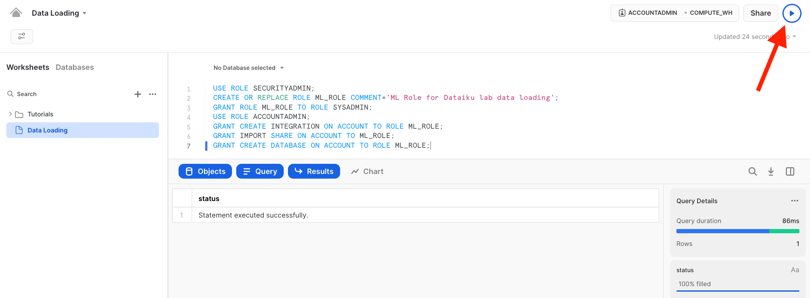
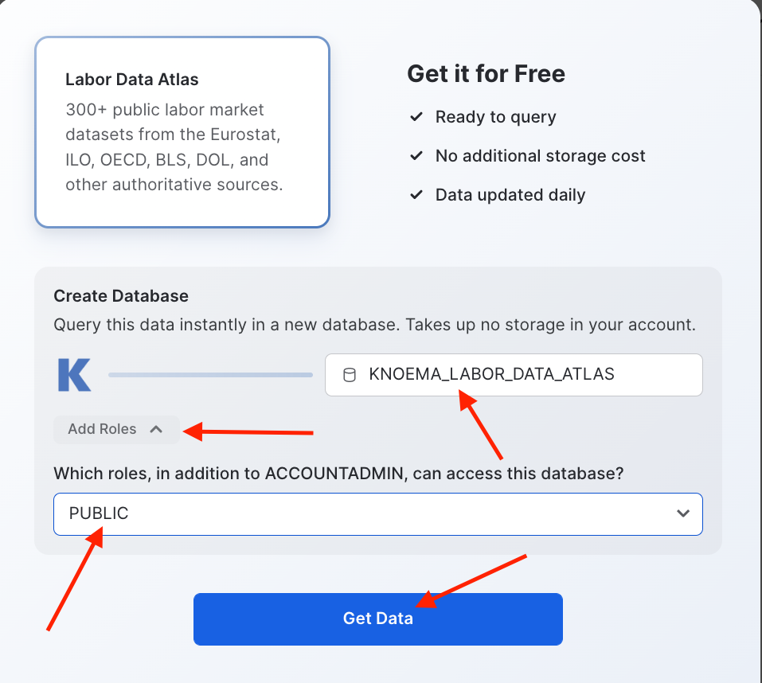
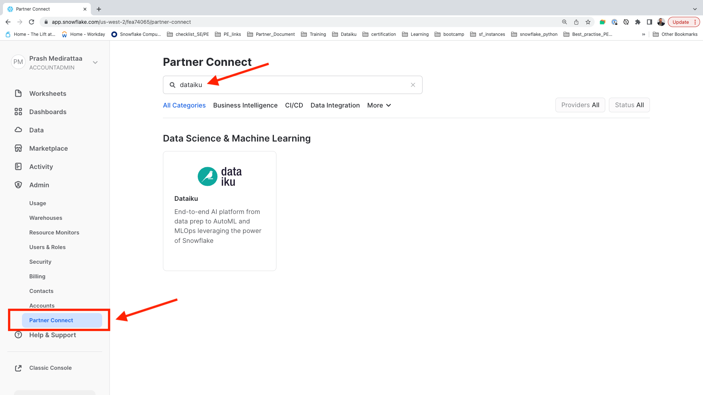
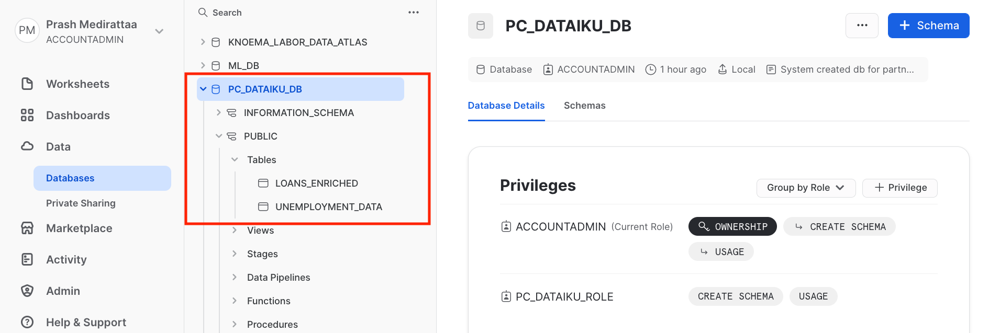

author: Prash Medirattaa
id: end_to_end_machine_learning_with_dataiku
summary: This is a sample Snowflake Guide
categories: Getting Started
environments: web
status: Published 
feedback link: https://github.com/Snowflake-Labs/sfguides/issues
tags: Getting Started, Data Science, Data Engineering, Twitter 

# End to End Machine learning with Snowflake and Dataiku
<!-- ------------------------ -->
## Overview  

Duration: 5

This Snowflake Quickstart introduces you to the using Snowflake together with Dataiku Cloud as part of a Machine learning project, and build an end-to-end machine learning solution. This lab will showcase seamless integration of both Snowflake and Dataiku at every stage of ML life cycle. We will also use Snowflake Data Marketplace to enrich the dataset. 

### Business Problem 

Will go through a **supervised machine learning** by building a binary classification model to predict if a lender will default on a loan. **LOAN_STATUS (yes/no)**  considering multiple features. 


**Supervised machine learning** is the process of taking a historical dataset with KNOWN outcomes of what we would like to predict, to train a model, that can be used to make future predictions. After building a model we will deploy back to Snowflake for scoring by using Snowpark-java udf. 
### Dataset

We will be exploring a financial service use of evaluating loan information to predict if a lender will default on a loan. The base data set was derived from loan data from the Lending Club.

In addition to base data, this will then be enriched with unemployment data from Knoema on the Snowflake Data Marketplace.


### What We’re Going To Build

We will build a project. The project contains the input datasets from Snowflake. We’ll build a data science pipeline by applying data transformations, enriching from Marketplace employment data, building a machine learning model, and deploying it to the Flow. We will then see how you can score the model against fresh data from Snowflake and automate


### Prerequisites

- Familiarity with Snowflake, basic SQL knowledge and Snowflake objects
- Basic knowledge  Machine Learning
- Basic knowledge Python, Jupyter notebook for **Bonus**

### What You'll Need During the Lab

To participate in the virtual hands-on lab, attendees need the following:

- A [Snowflake free 30-day trial](https://trial.snowflake.com/) **ACCOUNTADMIN** access
- Dataiku Cloud trial version via Snowflake’s Partner Connect


### What You'll Build

Operational end-to-end ML project using joint capabilities of Snowflake and Dataiku from Data collection to deployement

- Create a Data Science project in Dataiku and perform analysis on data via Dataiku within Snowflake
- The analysis and feature engineering using Dataiku
- Create, run, and evaluate simple Machine Learning models in Dataiku,  measure their performance and interpret
- Building and deploying Pipelines
- Creating  Snowpark-Java UDF, and using it to score result on test dataset writing back to Snowflake
- Use cloning and time travel for test environment


<!-- ------------------------ -->
## Setting up Snowflake 
Duration: 5


- If you haven’t already, register for a [Snowflake free 30-day trial](https://trial.snowflake.com/) 

- **Region**  - Kindly choose which is physically closest to you

- **Snowflake edition**  - Select the **Enterprise edition** so you can leverage some advanced capabilities that are not available in the Standard Edition.


- After registering, you will receive an **email** with an **activation** link and your Snowflake account URL. Kindly activate the account.


- After activation, you will create a **user name** and **password**. Write down these credentials


<!-- ------------------------ -->
## Logging in  Snowflake 
Duration: 2


#### Step 1

Log in with your credentials


**Bookmark this URL for easy, future access**

Resize your browser window, so that you can view this guide and your web browser side-by-side and follow the lab instructions. If possible, use a secondary display dedicated to the lab guide.


#### Step 2

Log into your Snowflake account. By default it will open up  


If you have just created a free trial account, feel free to minimize or close and hint boxes that are looking to help guide you. These will not be needed for this lab and most of the hints will be covered throughout the remainder of this exercise

#### Step 3

Create **Worksheet**  


#### Step 4

Adding a **Worksheet** 


#### Step 5

- Creating a new  **Worksheet** and **Renaming** it to **Data Loading**


After creating the worksheet we are ready to load the data. 


## Load data in  Snowflake 

Download the following .sql file that contains a series of SQL commands we will execute throughout this lab. You can either execute cell by cell commands from the sql file or copy the below code blocks and follow. 

 <button>[Snowflake_Dataiku_ML.sql](https://snowflake-corp-se-workshop.s3.us-west-1.amazonaws.com/Summit_Snowflake_Dataiku/src/Snowflake_Dataiku_ML.sql)</button>

Importing  **Sql** to **Worksheet** 
To ingest our script in the Snowflake UI, Import SQL from File.


Import the **SQL** file on the worksheet for your reference


#### Data Loading : Steps

**Step 1** -User & Role creation 

1. Configure User and role 
2. Assign all privileges

First we will switch to the SECURITYADMIN role and create a role (ML\_ROLE), that we will used in the lab.

```

USE ROLE SECURITYADMIN;

CREATE OR REPLACE ROLE ML_ROLE COMMENT='ML Role for Dataiku lab data loading';

GRANT ROLE ML_ROLE TO ROLE SYSADMIN;


USE ROLE ACCOUNTADMIN;

GRANT CREATE INTEGRATION ON ACCOUNT TO ROLE ML_ROLE;

GRANT IMPORT SHARE ON ACCOUNT TO ML_ROLE;

GRANT CREATE DATABASE ON ACCOUNT TO ROLE ML_ROLE;

```


**Imp tip : To run the complete code block highlight and  Select >  Ctrl + A - Windows or Command + A - Mac then play**




**Step 2** : Virtual warehouse that we will use to compute with the **SYSADMIN** role, and then grant all privileges to the **ML\_ROLE**.


```

USE ROLE SYSADMIN;

CREATE OR REPLACE WAREHOUSE ML_WH

  WITH WAREHOUSE_SIZE = 'XSMALL'

  AUTO_SUSPEND = 120

  AUTO_RESUME = true

  INITIALLY_SUSPENDED = TRUE;

GRANT ALL ON WAREHOUSE ML_WH TO ROLE ML_ROLE;

```


**Step 3** : Setting up environment to copy, creating the database

```

USE ROLE ML_ROLE;

USE WAREHOUSE ML_WH;

CREATE DATABASE IF NOT EXISTS ML_DB;
```

**Step 4** : Create **Loan_data** table in the database

```
CREATE OR REPLACE TABLE loan_data (
  
        LOAN_ID NUMBER(38,0),
  
        LOAN_AMNT FLOAT,

        FUNDED_AMNT FLOAT,

        TERM VARCHAR(4194304),

        INT_RATE FLOAT,

        INSTALLMENT FLOAT,

        GRADE VARCHAR(4194304),

        SUB_GRADE VARCHAR(4194304),

        EMP_TITLE VARCHAR(4194304),

        EMP_LENGTH_YEARS NUMBER(38,0),

        HOME_OWNERSHIP VARCHAR(4194304),

        ANNUAL_INC FLOAT,

        VERIFICATION_STATUS VARCHAR(4194304),

        ISSUE_DATE_PARSED TIMESTAMP_TZ(9),

        LOAN_STATUS VARCHAR(4194304),

        PYMNT_PLAN BOOLEAN,
        
        PURPOSE VARCHAR(4194304),

        TITLE VARCHAR(4194304),
    
        ZIP_CODE VARCHAR(4194304),

        ADDR_STATE VARCHAR(4194304),

        DTI FLOAT,

        DELINQ_2YRS FLOAT,

        EARLIEST_CR_LINE TIMESTAMP_TZ(9),

        INQ_LAST_6MTHS FLOAT,

        MTHS_SINCE_LAST_DELINQ FLOAT,

        MTHS_SINCE_LAST_RECORD FLOAT,

        OPEN_ACC FLOAT,

        REVOL_BAL FLOAT,

        REVOL_UTIL FLOAT,

        TOTAL_ACC FLOAT,

        TOTAL_PYMNT FLOAT,

        MTHS_SINCE_LAST_MAJOR_DEROG FLOAT,

        TOT_CUR_BAL FLOAT,

        ISSUE_MONTH NUMBER(38,0),

        ISSUE_YEAR NUMBER(38,0)
);

```

After running the cell above, we have successfully created a **loan data** table. 


**Step 5** :Creating a external stage to load the lab data into the table. This is done from a public S3 bucket to simplify the workshop. Typically an external stage will be using various secure integrations as described in this [link](https://docs.snowflake.com/en/user-guide/data-load-s3-config.html). 

```
CREATE OR REPLACE STAGE LOAN_DATA

  url='s3://snowflake-corp-se-workshop/Summit_Snowflake_Dataiku/data/';
  
 
 ---- List the files in the stage 

 list @LOAN_DATA;
```
**Screen shot again after moving to new s3 folder** 


**Step 6** :Copying the data in the database

```

alter warehouse ML_WH set warehouse_size=medium;
COPY INTO loan_data FROM @LOAN_DATA/loans_history_enriched.csv
FILE_FORMAT = (TYPE = 'CSV' field_optionally_enclosed_by='"',SKIP_HEADER = 1); 

SELECT * FROM loan_data LIMIT 100;

```


Below is the snapshot of the data and it represents aggregation from various internal systems for lender information and loans. We can have a quick look and see the various attributes in it.


We have succfully loaded the data from **external stage** to snowflake.


**Step 7** : **Time to switch to get Konema Employement Data from Snowflake Market place**

We can now look at additional data in the Snowflake Marketplace that can be helpful for improving ML models. It may be good to look at employment data in the region when analyzing loan defaults. Let’s look in the Snowflake Data Marketplace and see what external data is available from the data providers.

Lets go to home screen 


#### Steps 

1. **Click Market place tab** 

2. Make Sure **ACCOUNTADMIN** role is selected 

3. In search bar **Labor Data Atlas**


 Click on the tile with **Labor Data Atlas.**


Next click on the **Get Data** button. This will provide a pop up window in which you can create a database in your account that will provide the data from the data provider.


#### Important : Steps 

1. Change the name of the database to  **KNOEMA_LABOR_DATA_ATLAS**  

2. Select additional roles drop down **PUBLIC**

3. Click **Get Data**





When the confirmation is provided click on done and then you can close the browser tab with the Preview App.  Other advantage of using Snowflake Data Marketplace does not require any additional work and will show up as a database in your account. A further benefit is that the data will automatically update as soon as the data provider does any updates to the data on their account.After done just to confirm the datasets are properly configured.


 Click on Data tab **Database**

You should see **KNOEMA_LABOR_DATA_ATLAS**  and **ML_DB**


After confirming **Databases**.  Lets go to **Worksheets tab** and **open** the **Data Loading** worksheet 


Creating a **KNOEMA_EMPLOYMENT_DATA** marketplace data view to pivot the data for the different employment metrics to columns for easier consumption. 

```
USE DATABASE ML_DB;

CREATE OR REPLACE VIEW KNOEMA_EMPLOYMENT_DATA AS (

SELECT *

FROM (SELECT "Measure Name" MeasureName, "Date", 
      "RegionId" State, 
      AVG("Value") Value 
      FROM "KNOEMA_LABOR_DATA_ATLAS"."LABOR"."BLSLA" WHERE "RegionId" is not null 
      and "Date" >= '2018-01-01' AND "Date" < '2018-12-31' GROUP BY "RegionId", "Measure Name", "Date")
  PIVOT(AVG(Value) FOR MeasureName
  IN ('civilian noninstitutional population', 'employment', 'employment-population ratio', 
     'labor force', 'labor force participation rate', 'unemployment', 'unemployment rate')) AS 
        p (Date, State, civilian_noninstitutional_population, employment, employment_population_ratio, 
           labor_force, labor_force_participation_rate, unemployment, unemployment_rate)
);

SELECT * FROM KNOEMA_EMPLOYMENT_DATA LIMIT 100;

```


Create a new table **UNEMPLOYMENT DATA** using the geography and time periods. This will provide us with unemployment data in the region associated with the specific loan.


```

CREATE OR REPLACE TABLE UNEMPLOYMENT_DATA AS

 SELECT l.LOAN_ID, e.CIVILIAN_NONINSTITUTIONAL_POPULATION, 
        e.EMPLOYMENT, e.EMPLOYMENT_POPULATION_RATIO, e.LABOR_FORCE, 
        e.LABOR_FORCE_PARTICIPATION_RATE, e.UNEMPLOYMENT, e.UNEMPLOYMENT_RATE

  FROM LOAN_DATA l LEFT JOIN KNOEMA_EMPLOYMENT_DATA e

 on l.ADDR_STATE = right(e.state,2) and l.issue_month = month(e.date) and l.issue_year = year(e.date);

SELECT * FROM UNEMPLOYMENT_DATA LIMIT 100;

```


##### IMPORTANT: Database for Machine learning consumption will be created after connecting Snowflake with Dataiku using partner connect. 


<!-- ------------------------ -->
## Connect Dataiku with Snowflake
Duration: 8


Verify that your user is operating under the Account Admin role.

To do this:

* Click your account name in the upper left-hand corner (if you are using the Classic Console this is top-right)

* Choose **Switch Role** from the drop-down list

* Click **ACCOUNTADMIN**





Click on the **Dataiku** tile. This will launch the following window, which will automatically create the **connection parameters** required for Dataiku to connect to Snowflake.

Snowflake will create a dedicated database, warehouse, system user, system password and system role, with the intention of those being used by the Dataiku account.


We’d like to use the **PC_DATAIKU_USER** to connect from Dataiku to Snowflake, and use the **PC_DATAIKU_WH** when performing activities within Dataiku that are pushed down into Snowflake.

Note that the user password (which is autogenerated by Snowflake and never displayed), along with all of the other Snowflake connection parameters, are passed to the Dataiku server so that they will automatically be used for the Dataiku connection.  **DO NOT CHANGE THE PC_DATAIKU_USER** password, otherwise Dataiku will not be able to connect to the Snowflake database.

Click on **Connect**. You may be asked to provide your first and last name.  If so, add them and click Connect. Your partner account has been created. Click on **Activate** to get it activated.


This will launch a new page that will redirect you to a launch page from Dataiku.
Here, you will have two options:
1) Login with an existing Dataiku username
2) Sign up for a new Dataiku account

We assume that you’re new to **Dataiku**, so ensure the “Sign Up” box is selected, and sign up with either GitHub, Google or your email address and your new password. 

Click sign up. <<NOTE: ADD INSTRUCTION FOR EXISTING IN ADDITION>>


When using your email address, ensure your password fits the following criteria:
1. **At least 8 characters in length**
2.  **Should contain:**
      **Lower case letters (a-z)**

      **Upper case letters (A-Z)**

      **Numbers (i.e. 0-9)**

Upon clicking on the activation link, please briefly review the Terms of Service of Dataiku Cloud. In order to do so, please scroll down to the bottom of the page. Click on **I AGREE**


Next, you’ll need to complete your sign up with the following information:
1.  First Name
2.  Last Name
3.  Job Title
4.  How would you define yourself (drop-down options for roles)
5.  Company Name
6.  Company Size (drop-down)
7.  What is your country (drop-down)
8.  What is your goal with Dataiku Cloud? (optional)
Then click on **Start**.


You will be redirected to the Dataiku Cloud Launchpad site. Click **GOT IT!** to continue.


You’ve now successfully set up your Dataiku trial account via Snowflake’s Partner Connect. We are now ready to continue with the lab. For this, move back to your Snowflake browser.


Positive
: **Important note** <br> Remember that the user password (which is autogenerated by Snowflake and never displayed), along with all of the other Snowflake connection parameters, are passed to the Dataiku server so that they will automatically be used for the Dataiku connection.  DO NOT CHANGE THE PC_DATAIKU_USER password, otherwise Dataiku will not be able to connect to the Snowflake database.


#### Database for Machine Learning


After connecting  **Snowflake** to **Dataiku** via partner connect. We will clone the table created in **ML_DB** to **PC_DATAIKU_DB** for the Dataiku consumption. Snowflake provides a very unique feature called [Zero Copy Cloning](https://www.youtube.com/watch?v=yQIMmXg7Seg) that will create a new copy of the data by **only making a copy of the metadata of the objects**. This drastically speeds up creation of copies and also drastically reduces the storage space needed for data copies.


You should see three database now  **PC_DATAIKU_DB** is the system generated database created. Go back to **Worksheet** you are working and run below commands. 


#### Granting Previlages of ML_DB to PC_Dataiku_role

```
grant all privileges on database ML_DB to role PC_Dataiku_role;
grant usage on all schemas in database ML_DB to role PC_Dataiku_role;
grant select on all tables in schema ML_DB.public to role PC_Dataiku_role;

```


#### Cloning tables to DATAIKU Database before consuming it for Dataiku DSS 
```
USE ROLE ACCOUNTADMIN;
use warehouse PC_DATAIKU_WH;
alter warehouse PC_DATAIKU_WH set warehouse_size=medium;
use role PC_DATAIKU_ROLE;
use database PC_DATAIKU_DB;
use warehouse PC_DATAIKU_WH;
CREATE TABLE IF NOT EXISTS LOANS_ENRICHED CLONE ML_DB.PUBLIC.LOAN_DATA;
CREATE TABLE IF NOT EXISTS UNEMPLOYMENT_DATA CLONE ML_DB.PUBLIC.UNEMPLOYMENT_DATA;

SELECT * FROM LOANS_ENRICHED LIMIT 10;
```

After running above commands, we have created clones for the tables to be used for analysis. Kindly check **PC_DATAIKU_DB** you should have two datasets **LOANS_ENRICHED** and **UNEMPLOYMENT_DATA**




#### Now lets move to Dataiku console for feature engineering, model building, Scoring and deployment. 

<!-- ------------------------ -->
## What We’re Going To Build
Duration: 2

Dataiku DSS is a collaborative, end-to-end data science and machine learning platform that unites data analysts, data scientists, data engineers, architects, and business users in a common space to bring faster business insights.

In this lab you will learn about the ways that Dataiku DSS can provide value to users of all skill sets through a simple use case: Build a credit scoring project to predict the risk of default on loans for customers and advise them on how to reduce their risk.

The project contains the input datasets from Snowflake. We’ll build a data science pipeline by applying data transformations, enriching from Marketplace employment data, building a machine learning model, and deploying it to the Flow. We will then see how you can score the model against fresh data from Snowflake and automate…?????.


We’ll explore a dataset that a data analyst team member already cleaned as well as Marketplace data. At the end of this lab you will be able to:

engineering features using code in a notebook and code recipe;

training a machine learning model and generating predictions;

Scoring the model.


At the end of the lab, the project Flow will look like this:

<<image of completed flow - needs to have the joined dataset as source and marketplace data>>

The final Flow will contain datasets, recipes, and machine learning processes.

* A **dataset** is represented by a blue square with a symbol that depicts the dataset type or connection. The initial datasets (also known as input datasets) are found on the left of the Flow. In this project, the input dataset will be the one we just created in Snowflake.

* A **recipe** in Dataiku DSS (represented by a circle icon with a symbol that depicts its function) can be either visual or code-based, and it contains the processing logic for transforming datasets.

* Finally, the **Machine learning processes** are represented by green icons.


### How We’ll Build The Project

Our goal is to build an optimized machine learning model that can be used to predict the risk of default on loans for customers and advise them on how to reduce their risk.
To do this, we’ll join the input datasets and perform feature engineering so that they are ready to use for building a binary classification model.


### Creating a Dataiku Project

Go back to your Dataiku Cloud instance. Click on **OPEN DATAIKU DSS** to get started.

Insert picture 


Once you’ve logged in, **click** on **+NEW PROJECT** and **select Blank project** to create a new project.

Insert picture 


Left this 
<!-- ------------------------ -->
## Data Preparation and Analysis 
Duration: 2

After creating our project, you’ll find the project homepage. It is a convenient high-level overview of the project’s status and recent activity.

Let’s add a new dataset to the Flow, in addition to the existing four present in the initial starting project.

Note ! 
The Flow is the visual representation of how data, recipes (steps for data transformation), and models work together to move data through an analytics pipeline.

A blue square in the Flow represents a dataset. The icon on the square represents the type of dataset, such as an uploaded file, or its underlying storage connection, such as a SQL database or cloud storage


* From the Flow click **+ Import Your First Dataset** in the centre of the Flow.

* Click Upload your files.

insert picture 

Select the **Search and import option**

click Next, and observe a preview of the settings used to read the file.

insert picture 

Select the **PC_DATAIKU_DB** connection from the dropdown then click (insert picture) and populate the database and schema as below and click on **LIST TABLES**


**insert picture**

Select the Loans_Enriched and Unemployment_Data datasets and click **CREATE 2 DATASETS**

**insert picture**
**insert picture**


Navigate back to the Flow from the left-most menu in the top navigation bar (or use the keyboard shortcut G+F).

**insert picture**

! Tip
No matter what kind of dataset the blue square represents, the methods and interface in Dataiku DSS for exploring, visualizing, and analyzing it are the same.


### Explore and Join Data

Now we have all of the raw data needed for this lab. Let’s explore what’s inside these datasets.

From the Flow, double click on the loans_enriched dataset to open it.

On opening a dataset, you’ll find the Explore tab. It looks similar to a spreadsheet, but with a few key differences. For starters, you are viewing only a sample of the dataset.
Note !

By default, the Explore tab shows the first 10,000 rows of our dataset in Snowflake, but many other configurations are possible. Working with a sample makes it easy to work interactively (filtering, sorting, etc.) on even very large datasets.


Look closer at the header of the table. At the top of each column is the column name, its storage type, and its meaning.

Note !

Datasets in Dataiku DSS have a schema. The schema of a dataset is the list of columns, with their names and types.

A column in Dataiku DSS has two kinds of “types”:

The storage type indicates how the dataset backend should store the column data, such as “string”, “boolean”, or “date”.

The meaning is a rich semantic type automatically detected from the sample contents of the columns, such as URL, IP address, or sex.

Note how the storage type of the ADDR_STATE column is a string, but Dataiku DSS has inferred the meaning to be “US State”.

**insert picture**

You can analyze column metrics either by right clicking on the column name and selecting or, if you wish for a quick overview of columns key statistics then select Quick Column Stats button 
**insert picture**  on the top-right.

**insert picture** 


### Join the Data
So far, your Flow only contains datasets. To take action on datasets, you need to apply recipes.

The LOANS_ENRICHED and UNEMPLOYMENT_DATA datasets both contain a column of Loan IDs. Let’s join these two datasets together using a visual recipe.

Note !
Recipes in Dataiku DSS contain the transformation steps, or processing logic, that act upon datasets. In the Flow, they are represented by circles connecting the input and output datasets.

Visual recipes (yellow circles) accomplish the most common data transformation operations, such as cleaning, grouping, and filtering, through a point-and-click interface.

You are also free to define your own processing logic in a code recipe (orange circle), using a language such as Python, R, or SQL.

A plugin recipe allows coders to wrap custom code behind a visual interface, thereby extending the native capabilities of Dataiku DSS.

* Select the LOANS_ENRICHED dataset from the Flow by single clicking on it.

* Choose Join With… from the “Visual recipes” section of the Actions sidebar near the top right of the screen (note: click the Open Panel arrow if it is minimized and notice there are three different types of join recipe, we want Join With…).

* Choose UNEMPLOYMENT_DATA as the second input dataset.

**insert picture** 

* Leave the default option of PC_DATAIKU_DB for “Store into” and **Create** the recipe
Once the recipe is initiated, you can adjust the settings.

* On the Join step you can click on Left Join to observe the selected join type and conditions.

**insert picture** 


* On the Selected columns step you can leave the defaults
* On the Output step, note the output column names.
* Before running it, Save the recipe.
* Click RUN Update Schema, and return to the Flow.

<!-- ------------------------ -->
## Feature Engineering
Duration: 2


<!-- ------------------------ -->
## Training 
Duration: 2

<!-- ------------------------ -->
## Deployment  
Duration: 2

<!-- ------------------------ -->
## Scoring and Evaluation  
Duration: 2

<!-- ------------------------ -->
## Conclusion  and Next Steps  
Duration: 2

## Bonus Material - Snowpark -Python  
Duration: 2


<!-- ------------------------ -->
## Snowsight - Initial Analysis 
Duration: 4