author: Prash Medirattaa
id: end_to_end_machine_learning_with_dataiku
summary: This is a sample Snowflake Guide
categories: data-science-&-ml,solution-examples,partner-integrations
environments: web
status: Published 
feedback link: https://github.com/Snowflake-Labs/sfguides/issues
tags: Getting Started, Data Science, Data Engineering, Twitter 

# End to End Machine learning with Snowflake and Dataiku
<!-- ------------------------ -->
## Overview  

Duration: 5

This Snowflake Quickstart introduces you to the using Snowflake together with Dataiku Cloud as part of a Machine learning project, and build an end-to-end machine learning solution. This lab will showcase seamless integration of both Snowflake and Dataiku at every stage of ML life cycle. We will also use Snowflake Data Marketplace to enrich the dataset. 

### Business Problem 

Will go through a **supervised machine learning** by building a binary classification model to predict if a lender will default on a loan. **LOAN_STATUS (yes/no)**  considering multiple features. 


**Supervised machine learning** is the process of taking a historical dataset with KNOWN outcomes of what we would like to predict, to train a model, that can be used to make future predictions. After building a model we will deploy back to Snowflake for scoring by using Snowpark-java udf. 
### Dataset

We will be exploring a financial service use of evaluating loan information to predict if a lender will default on a loan. The base data set was derived from loan data from the Lending Club.

In addition to base data, this will then be enriched with unemployment data from Knoema on the Snowflake Data Marketplace.


### What We’re Going To Build

We will build a project. The project contains the input datasets from Snowflake. We’ll build a data science pipeline by applying data transformations, enriching from Marketplace employment data, building a machine learning model, and deploying it to the Flow. We will then see how you can score the model against fresh data from Snowflake and automate


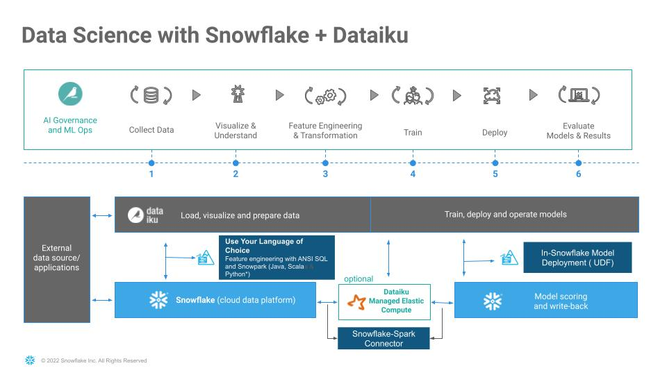


### Prerequisites

- Familiarity with Snowflake, basic SQL knowledge and Snowflake objects
- Basic knowledge  Machine Learning
- Basic knowledge Python, Jupyter notebook for ```Bonus```

### What You'll Need During the Lab

To participate in the virtual hands-on lab, attendees need the following:

- A [Snowflake free 30-day trial](https://trial.snowflake.com/) ```ACCOUNTADMIN``` access
- Dataiku Cloud trial version via Snowflake’s Partner Connect


### What You'll Build

Operational end-to-end ML project using joint capabilities of Snowflake and Dataiku from Data collection to deployment

- Create a Data Science project in Dataiku and perform analysis on data via Dataiku within Snowflake
- The analysis and feature engineering using Dataiku
- Create, run, and evaluate simple Machine Learning models in Dataiku,  measure their performance and interpret
- Building and deploying Pipelines
- Use Snowpark-Java UDF to score result on test dataset and write back to Snowflake
- Use cloning to create separate pipeline for testing 
- Bonus track using Snowpark - python 


<!-- ------------------------ -->
## Setting up Snowflake 
Duration: 5


- If you haven’t already, register for a [Snowflake free 30-day trial](https://trial.snowflake.com/) 

- **Note**: Please ensure that you use the `same email address` for both your Snowflake and Dataiku sign up

- **Region**  - Kindly choose  ```US West (Oregon)``` for this lab

- **Cloud Provider**  - Kindly choose ```AWS``` for this lab

- **Snowflake edition**  - Select the ```Enterprise edition``` so you can leverage some advanced capabilities that are not available in the Standard Edition.


> aside negative
> 
>  **Snowflake Marketplace dataset** <br> It is strongly recommended that when setting up a new account you use the Provider and Region above because to leverage the marketplace dataset in this lab. If you already have an existing Snowflake account you wish to use that uses a different Provider/Region we would recommend creating a new trial instance for this lab.


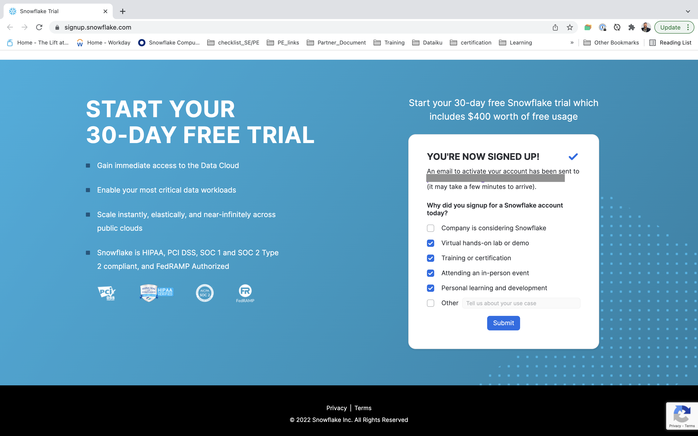

After registering, you will receive an ```email```with an ```activation``` link and your Snowflake account URL. Kindly activate the account.


After activation, you will create a ```user name```and ```password```. Write down these credentials. ```Bookmark this URL for easy, future access```.

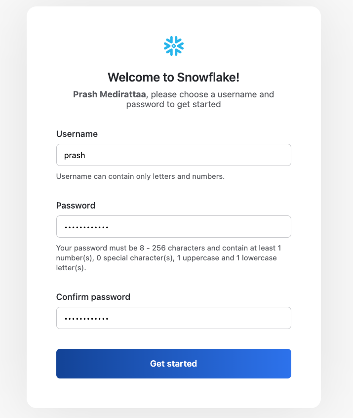

<!-- ------------------------ -->
## Logging in  Snowflake 
Duration: 5


#### Step 1

Log in with your credentials. ```Bookmark this URL for easy, future access```.


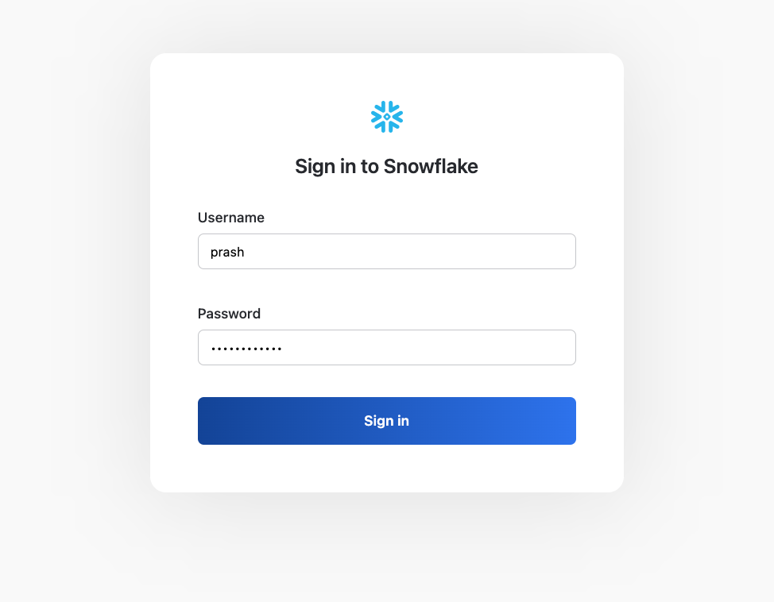

Resize your browser window, so that you can view this guide and your web browser side-by-side and follow the lab instructions. If possible, use a secondary display dedicated to the lab guide.


#### Step 2

Log into your Snowflake account. By default it will open up ```home``` page.  


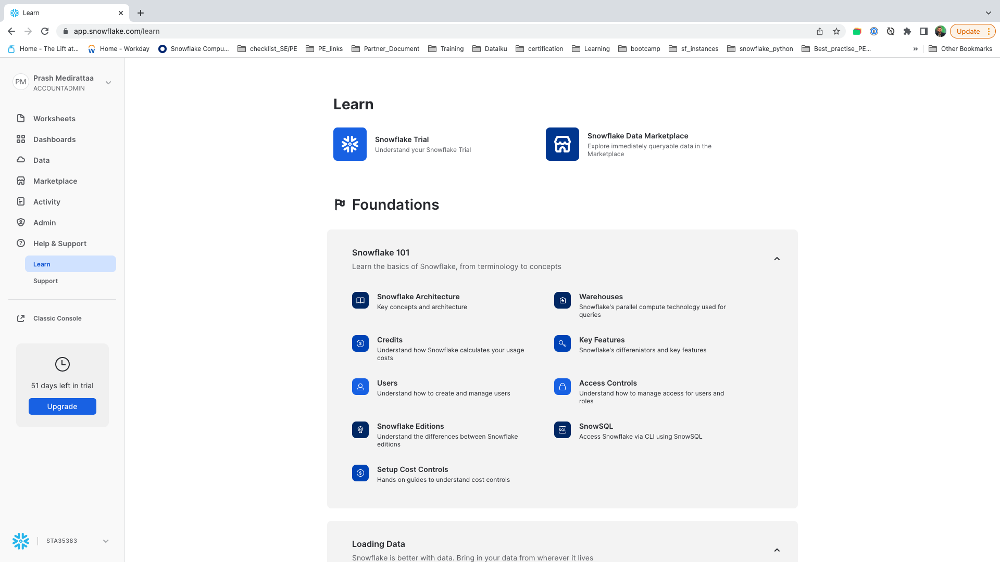


#### Step 3

To create ```Worksheet``` . Click on the ```Worksheets``` tab. A new screen will open up. 


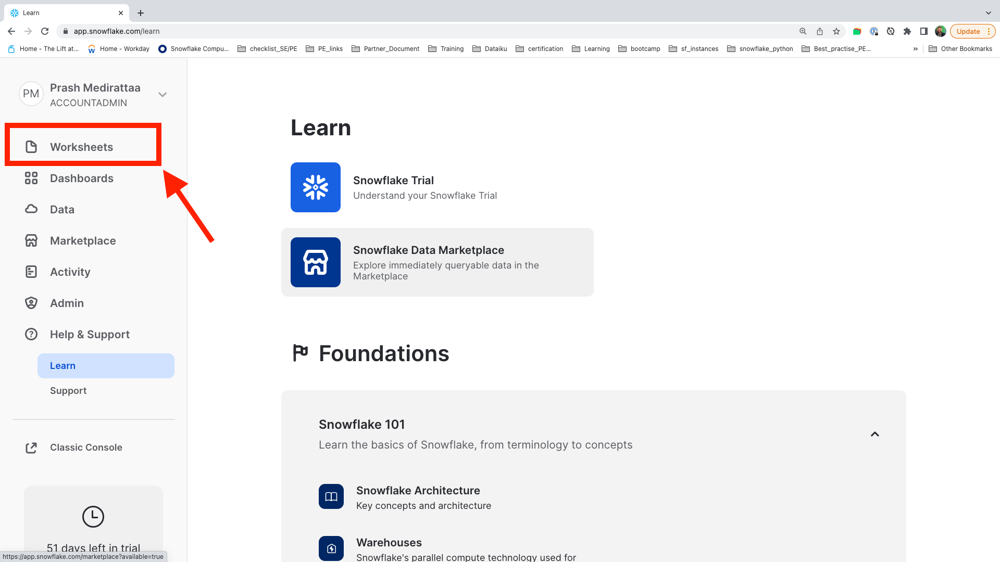

#### Step 4

Click on ```+ Worksheet``` to create your first worksheet. 

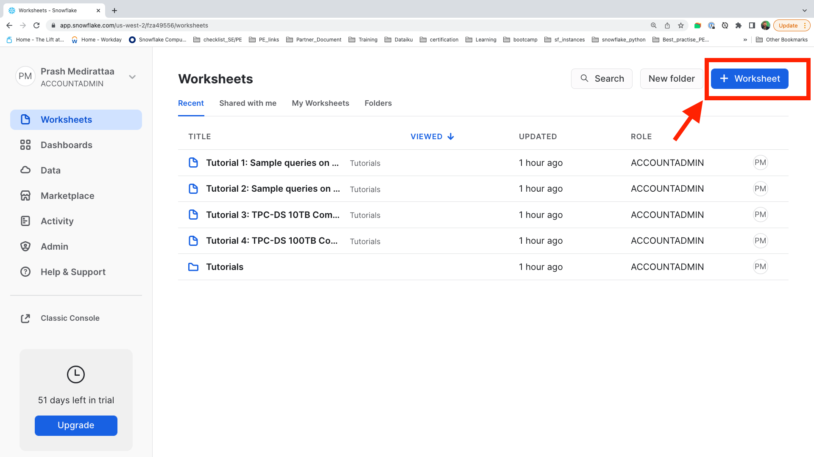

#### Step 5

New ```Worksheet``` will be created with a ```Time stamp```. Let's now rename this ```Worksheet``` by clicking on the ```Time stamp```. 


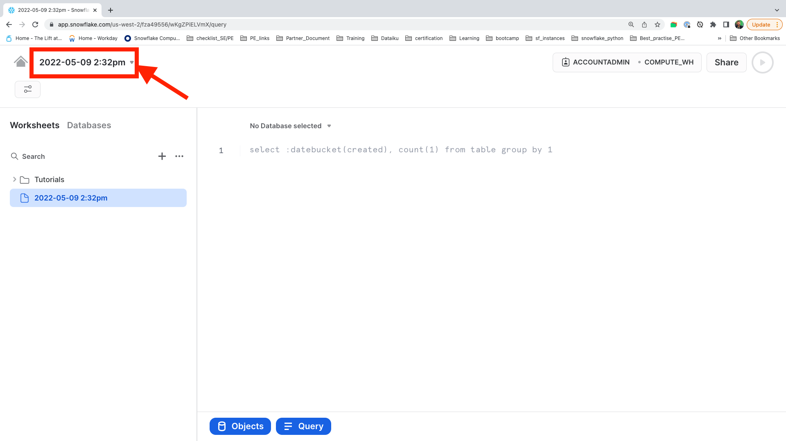


You can name anything, but for this lab we will Rename it as ```Data Loading```.


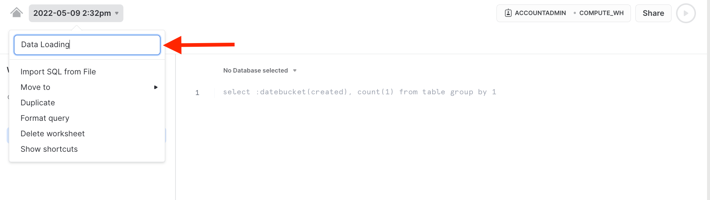


## Load data in  Snowflake 
Duration: 15


Download the following .sql file that contains a series of SQL commands we will execute throughout this lab. You can either execute cell by cell commands from the sql file or copy the below code blocks and follow. 

 <button>[Snowflake_Dataiku_ML.sql](https://snowflake-corp-se-workshop.s3.us-west-1.amazonaws.com/Summit_Snowflake_Dataiku/src/Snowflake_Dataiku_ML.sql)</button>

 **Part 1** : ```Step 1 - Step 4``` 
 
 Creating database, Warehouse, loading dataset
          

 **Part 2** : ```Step 5 - Step 8```

  Tapping Snowflake Marketplace dataset


After creating the ```worksheet``` in the last step we can import the sql file provided . 

Click on ```drop down``` button.

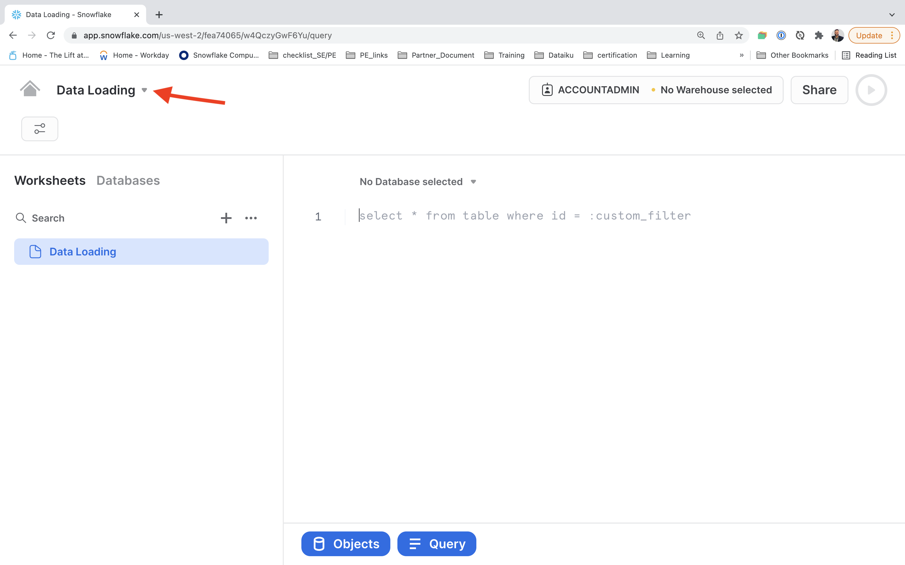


Select ``` Import SQL from File ``` option to import the SQL file just downloaded. Select it and ```Enter```.


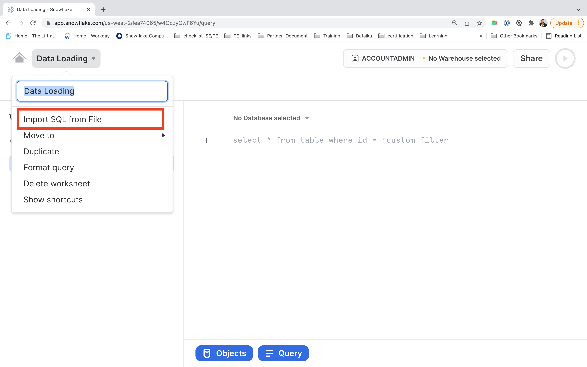


#### Data Loading : Steps


Each step throughout the guide has an associated SQL command to perform the work we are looking to execute, and so feel free to step through each action running the code line by line as we walk through the lab. 

If you wish to run the code at once 

**Part 1** : ```Step 1 - Step 4```  need to run first and then ```additional steps ``` are  then required before executing  

**Part 2** : ```Step 5 - Step 8```. 

To execute this code, all we need to do is place our cursor on the line we wish to run and then either hit the "run" button at the top left of the worksheet or press ```Cmd/Ctrl + Enter```


**Step 1** : Virtual warehouse that we will use to compute with the ```SYSADMIN``` role.


```

USE ROLE SYSADMIN;

CREATE OR REPLACE WAREHOUSE ML_WH

  WITH WAREHOUSE_SIZE = 'XSMALL'

  AUTO_SUSPEND = 120

  AUTO_RESUME = true

  INITIALLY_SUSPENDED = TRUE;

```


**Step 2** : In this step  we will first create ```ML_DB ``` and then ```create ``` a ```Loan_data``` table in that database.


```

USE WAREHOUSE ML_WH;

CREATE DATABASE IF NOT EXISTS ML_DB;

USE DATABASE ML_DB;

CREATE OR REPLACE TABLE loan_data (
  
        LOAN_ID NUMBER(38,0),
  
        LOAN_AMNT FLOAT,

        FUNDED_AMNT FLOAT,

        TERM VARCHAR(4194304),

        INT_RATE VARCHAR(4194304),

        INSTALLMENT FLOAT,

        GRADE VARCHAR(4194304),

        SUB_GRADE VARCHAR(4194304),

        EMP_TITLE VARCHAR(4194304),

        EMP_LENGTH_YEARS NUMBER(38,0),

        HOME_OWNERSHIP VARCHAR(4194304),

        ANNUAL_INC FLOAT,

        VERIFICATION_STATUS VARCHAR(4194304),

        ISSUE_DATE_PARSED TIMESTAMP_TZ(9),

        LOAN_STATUS VARCHAR(4194304),

        PYMNT_PLAN BOOLEAN,
        
        PURPOSE VARCHAR(4194304),

        TITLE VARCHAR(4194304),
    
        ZIP_CODE VARCHAR(4194304),

        ADDR_STATE VARCHAR(4194304),

        DTI FLOAT,

        DELINQ_2YRS FLOAT,

        EARLIEST_CR_LINE VARCHAR(4194304),

        INQ_LAST_6MTHS FLOAT,

        MTHS_SINCE_LAST_DELINQ FLOAT,

        MTHS_SINCE_LAST_RECORD FLOAT,

        OPEN_ACC FLOAT,

        REVOL_BAL FLOAT,

        REVOL_UTIL FLOAT,

        TOTAL_ACC FLOAT,

        TOTAL_PYMNT FLOAT,

        MTHS_SINCE_LAST_MAJOR_DEROG FLOAT,

        TOT_CUR_BAL FLOAT,

        ISSUE_MONTH NUMBER(38,0),

        ISSUE_YEAR NUMBER(38,0)
  
);


```

After running the cell above, we have successfully created a ```loan_data``` table. 


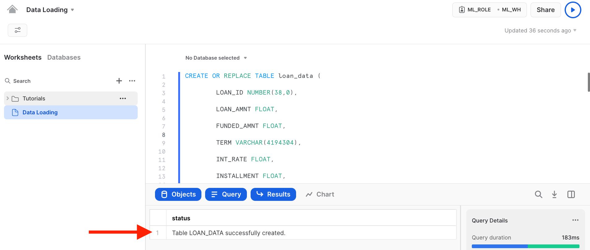


**Step 3** : In this step we will create an external stage ```LOAN_DATA``` to load the lab data. This is done from a public S3 bucket to simplified for this workshop.


Typically an external stage will be using various secure integrations as described in this [link](https://docs.snowflake.com/en/user-guide/data-load-s3-config.html). 

```
CREATE OR REPLACE STAGE LOAN_DATA

  url='s3://snowflake-corp-se-workshop/Summit_Snowflake_Dataiku/data/';
  
 
 ---- List the files in the stage 

 list @LOAN_DATA;
```

Listing the files from ```S3``` bucket


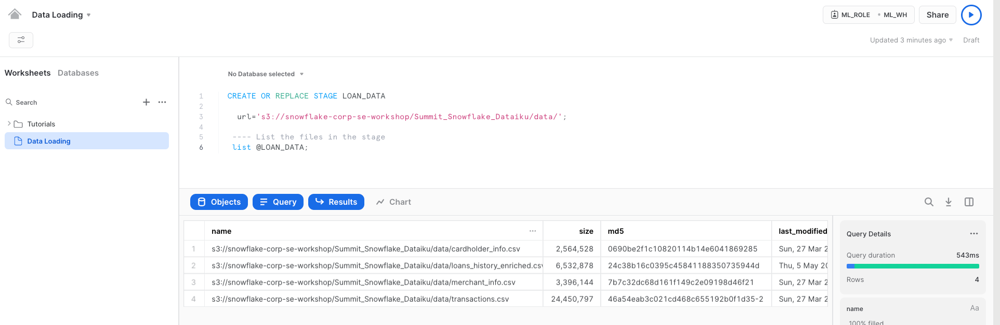


**Step 4** : In this step we will ```copy``` the ```loan_data``` csv file to the ```loan_data``` table we created. 

```

COPY INTO loan_data FROM @LOAN_DATA/loans_data.csv
FILE_FORMAT = (TYPE = 'CSV' field_optionally_enclosed_by='"',SKIP_HEADER = 1);  

SELECT * FROM loan_data LIMIT 100;

```


Below is the snapshot of the data and it represents aggregation from various internal systems for lender information and loans. We can have a quick look and see the various attributes in it.

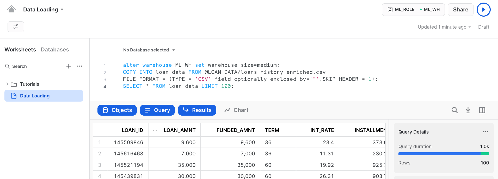


We have successfully loaded the data from ```external stage``` to snowflake.

> aside negative
> 
>  **About the screen captures, sample code, and environment** <br> Screen captures in this lab depict examples and results that may slightly vary from what you may see when you complete the exercises.


**Step 5** : Time to switch to get ```Konema Employement Data``` from Snowflake Market place

We can now look at additional data in the Snowflake Marketplace that can be helpful for improving ML models. It may be good to look at employment data in the region when analyzing loan defaults. Let’s look in the Snowflake Data Marketplace and see what external data is available from the data providers.

Lets go to ```home screen``` by clicking on ```home``` icon. 


#### Imp Note 

1. ```Click Market place tab```

2. Make Sure ```ACCOUNTADMIN``` role is selected 

3. In search bar type ```Labor Data Atlas```


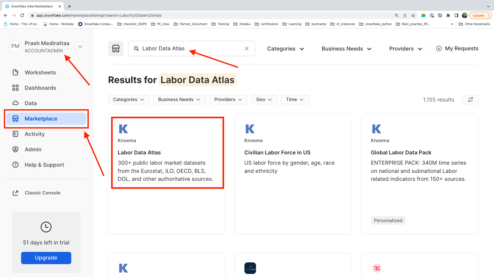


 Click on the tile with ```Labor Data Atlas```


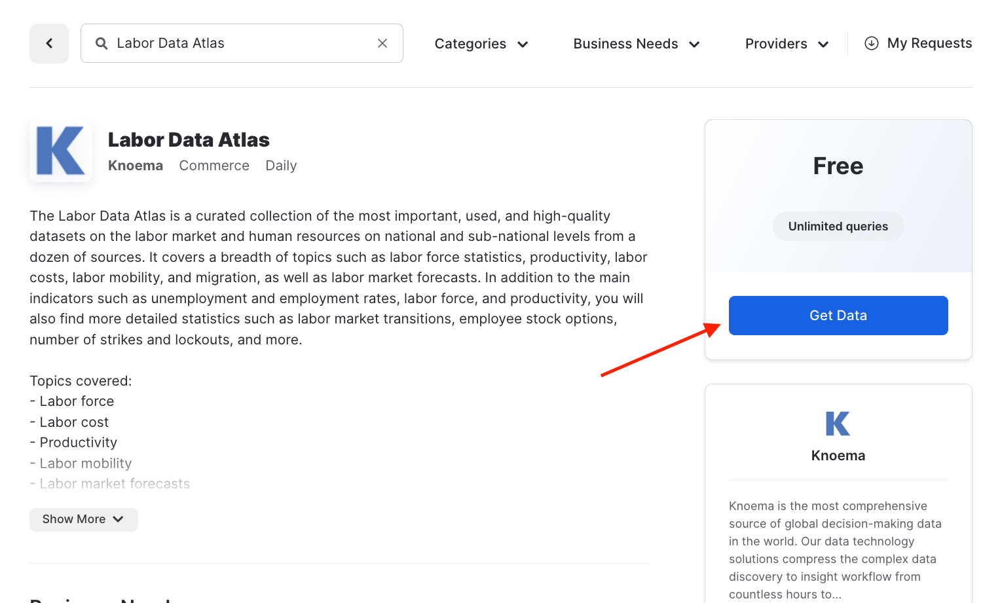


Next click on the ```Get Data``` button. This will provide a pop up window in which you can create a database in your account that will provide the data from the data provider.


#### Important : Steps 

1. Change the name of the database to  ```KNOEMA_LABOR_DATA_ATLAS```

2. Select additional roles drop down ```PUBLIC```

3. Click ```Get Data```


When the confirmation is provided click on ```done``` and then you can close the browser tab with the Preview App.


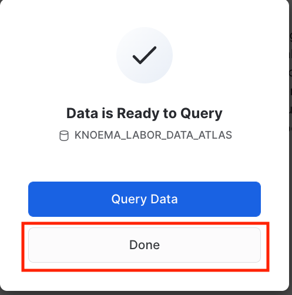


  Other advantage of using Snowflake Data Marketplace does not require any additional work and will show up as a database in your account. A further benefit is that the data will automatically update as soon as the data provider does any updates to the data on their account.
  
1. After done just to ```confirm``` the datasets are properly configured


2. Click on Data tab ```Database```


3. You should see ```KNOEMA_LABOR_DATA_ATLAS```  and ```ML_DB```

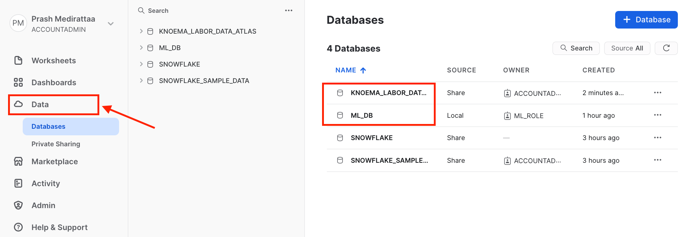


After confirming ```Databases```.  Lets go to ```Worksheets tab``` and  then ```open``` the ```Data Loading```worksheet 


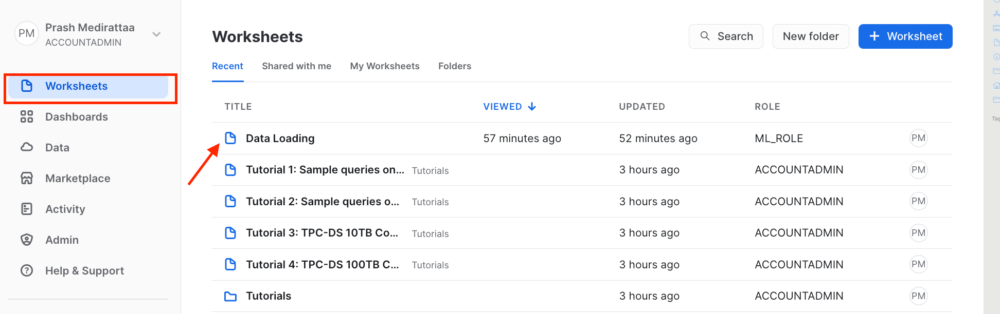


**Step 6** : Querying the ```KNOEMA_LABOR_DATA_ATLAS```for some basic analysis 


There are multiple datasets. Lets try to find unemployment dataset in US to narrow down our search. 

```
USE WAREHOUSE ML_WH;

USE DATABASE KNOEMA_LABOR_DATA_ATLAS;

SELECT * 
FROM "LABOR"."DATASETS"
WHERE "DatasetName" ILIKE '%unemployment%' 
AND "DatasetName" ILIKE '%U.S%';

```


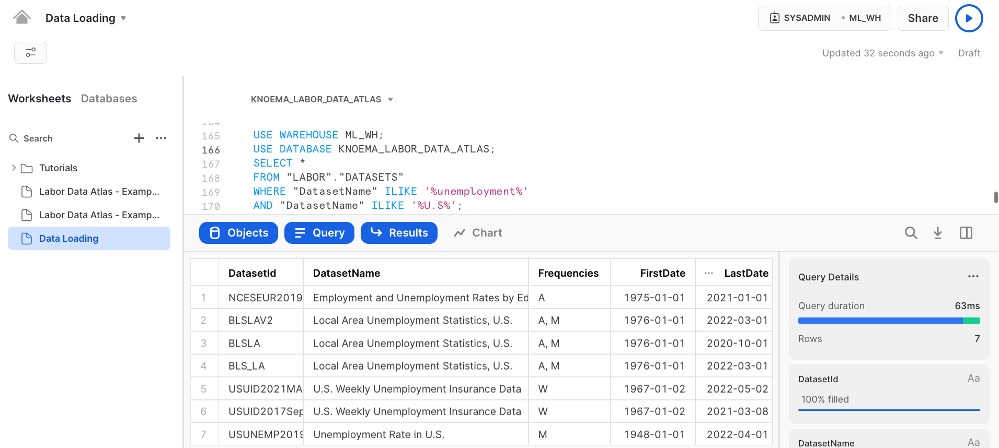


Amazing! We have successfully tapped into live data collection of the most important, used, and high-quality datasets on the labor market and human resources on national and sub-national levels from a dozen of sources.


We can find answers such as what is the number of initial claims for unemployment insurance in the US over time?

```
SELECT * FROM "LABOR"."USUID2017Sep" WHERE "Region Name" = 'United States' AND 
      "Indicator Name" = 'Initial Claims' AND "Measure Name" = 'Value' AND 
       "Seasonal Adjustment Name" = 'Seasonally Adjusted' ORDER BY "Date";

```


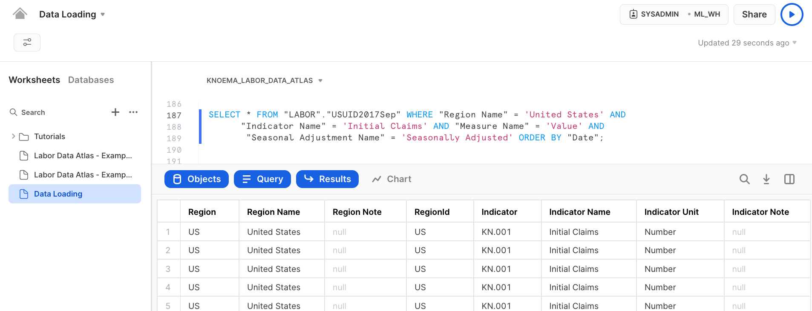


 Now for this exercise we are going to ```Enrich``` the ```Loan dataset``` we created earlier using the ```BLSLA``` dataset


**Step 7** : Creating a ```KNOEMA_EMPLOYMENT_DATA``` marketplace data ```view```. We will ```pivot``` the data for the different employment metrics so it can be used easily for analysis. 

```
USE DATABASE ML_DB;

CREATE OR REPLACE VIEW KNOEMA_EMPLOYMENT_DATA AS (

SELECT *

FROM (SELECT "Measure Name" MeasureName, "Date", 
      "RegionId" State, 
      AVG("Value") Value 
      FROM "KNOEMA_LABOR_DATA_ATLAS"."LABOR"."BLSLA" WHERE "RegionId" is not null 
      and "Date" >= '2018-01-01' AND "Date" < '2018-12-31' GROUP BY "RegionId", "Measure Name", "Date")
  PIVOT(AVG(Value) FOR MeasureName
  IN ('civilian noninstitutional population', 'employment', 'employment-population ratio', 
     'labor force', 'labor force participation rate', 'unemployment', 'unemployment rate')) AS 
        p (Date, State, civilian_noninstitutional_population, employment, employment_population_ratio, 
           labor_force, labor_force_participation_rate, unemployment, unemployment_rate)
);

SELECT * FROM KNOEMA_EMPLOYMENT_DATA LIMIT 100;

```

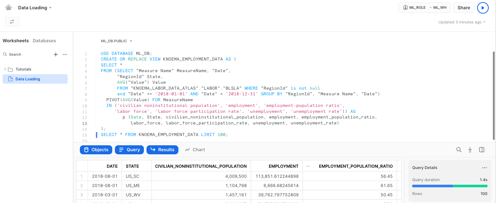
 
We have successfully created the view. 

**Step 8** : Now in this step we will ```Create``` a new table  called ```UNEMPLOYMENT DATA``` using the geography and time periods by joining ```LOAN_DATA``` table created from ```S3``` and ```KNOEMA_EMPLOYMENT_DATA VIEW``` created in last step.

This will provide us with unemployment data in the region associated with the specific loan.


```

CREATE OR REPLACE TABLE UNEMPLOYMENT_DATA AS

 SELECT l.LOAN_ID, e.CIVILIAN_NONINSTITUTIONAL_POPULATION, 
        e.EMPLOYMENT, e.EMPLOYMENT_POPULATION_RATIO, e.LABOR_FORCE, 
        e.LABOR_FORCE_PARTICIPATION_RATE, e.UNEMPLOYMENT, e.UNEMPLOYMENT_RATE

  FROM LOAN_DATA l LEFT JOIN KNOEMA_EMPLOYMENT_DATA e

 on l.ADDR_STATE = right(e.state,2) and l.issue_month = month(e.date) and l.issue_year = year(e.date);

SELECT * FROM UNEMPLOYMENT_DATA LIMIT 100;

```
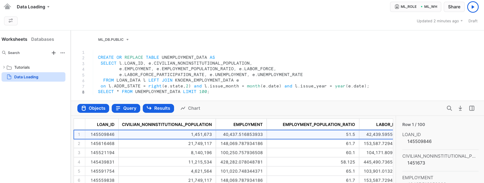


> aside negative
> 
>  **Database for Machine learning consumption** <br>  This will be created after connecting Snowflake with Dataiku using partner connect...

<!-- ------------------------ -->
## Connect Dataiku with Snowflake
Duration: 8


Go to ```home screen``` clicking on home button. 

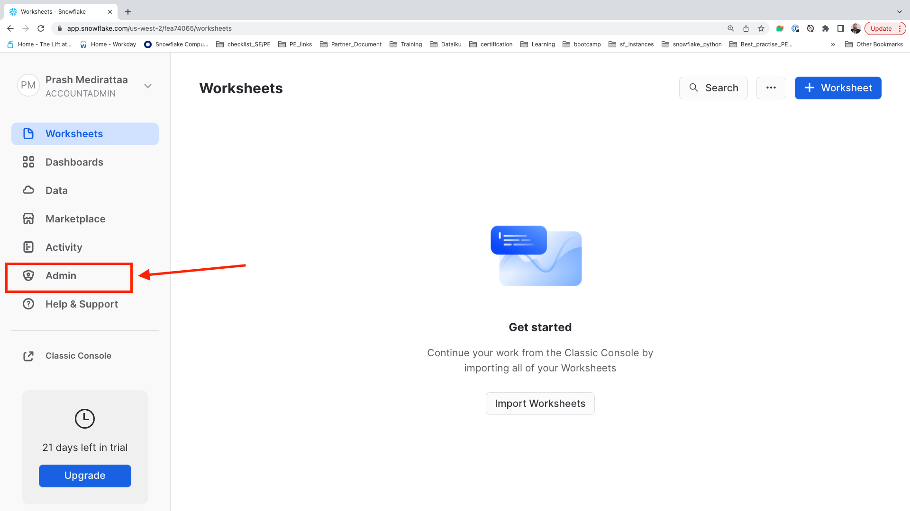


`Select` the `Admin` from the list.


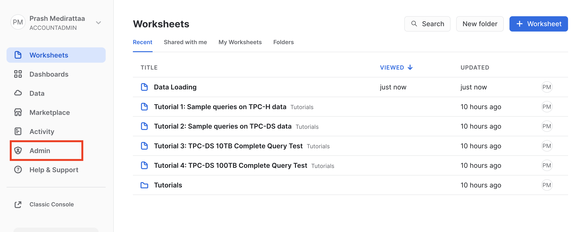


For the ```next steps```


1. ```Click``` the ```Partner Connect```

2. From ```drop down```  switch role and make sure  ```ACCOUNTADMIN``` is selected 

3. Search title type ```Dataiku```

4. Click on the ```Dataiku``` tile.  

Your screen should like below ```Screen Shot ```

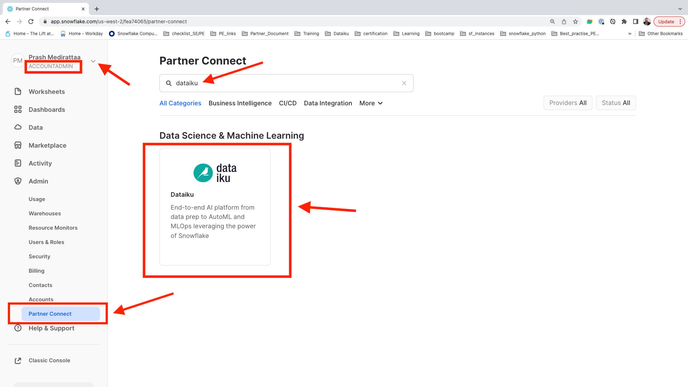


After you have clicked on ```Dataiku```.  This will launch the following window, which will automatically create the ```connection parameters``` required for Dataiku to connect to Snowflake.

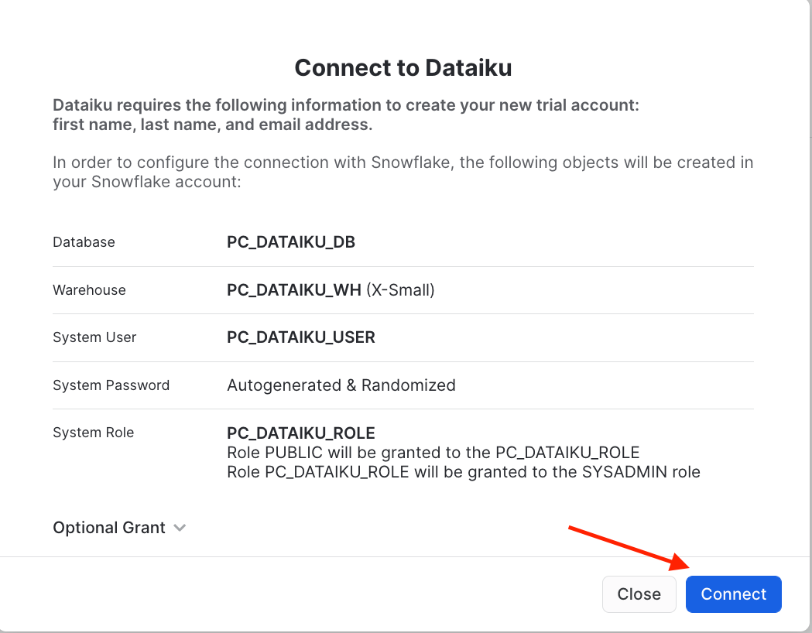


Snowflake will create a dedicated database, warehouse, system user, system password and system role, with the intention of those being used by the Dataiku account.


We’d like to use the ```PC_DATAIKU_USER``` to connect from Dataiku to Snowflake, and use the ```PC_DATAIKU_WH```when performing activities within Dataiku that are pushed down into Snowflake.

Note that the user password (which is autogenerated by Snowflake and never displayed), along with all of the other Snowflake connection parameters, are passed to the Dataiku server so that they will automatically be used for the Dataiku connection.  ```DO NOT CHANGE THE PC_DATAIKU_USER``` password, otherwise Dataiku will not be able to connect to the Snowflake database.


Click on ```Connect```. You may be asked to provide your first and last name.  If so, add them and click Connect. Your partner account has been created. Click on ```Activate``` to get it activated.


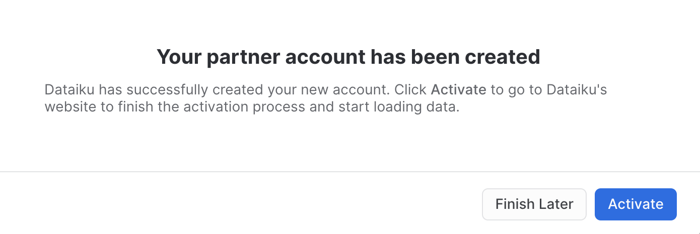


This will launch a new page that will redirect you to a launch page from Dataiku.

For the lab ae assume that you’re new to ```Dataiku```, so ensure the “Sign Up” box is selected, and sign up using the email address **(Note: This should be the same email address that you used to set up your Snowflake account)** and a new password of your choosing. 


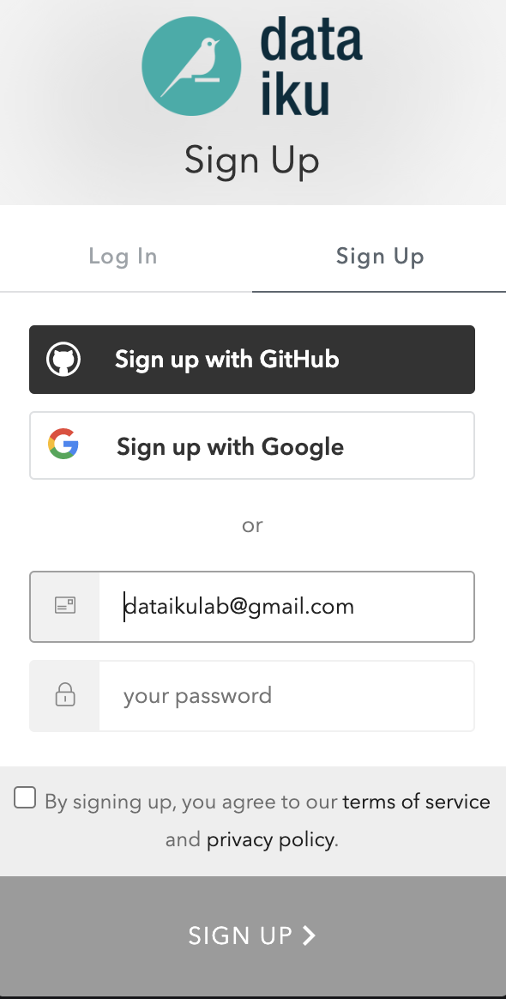


When using your email address, ensure your password fits the following criteria:
1. **At least 8 characters in length**
2.  **Should contain:**
      **Lower case letters (a-z)**

      **Upper case letters (A-Z)**

      **Numbers (i.e. 0-9)**

Upon clicking on the activation link, please briefly review the Terms of Service of Dataiku Cloud. In order to do so, please scroll down to the bottom of the page. Click on ```I AGREE```

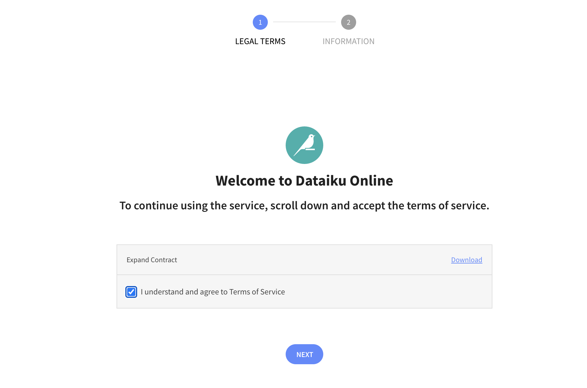


Next, you’ll need to complete your sign up information then click on ```Start```.


<!-- 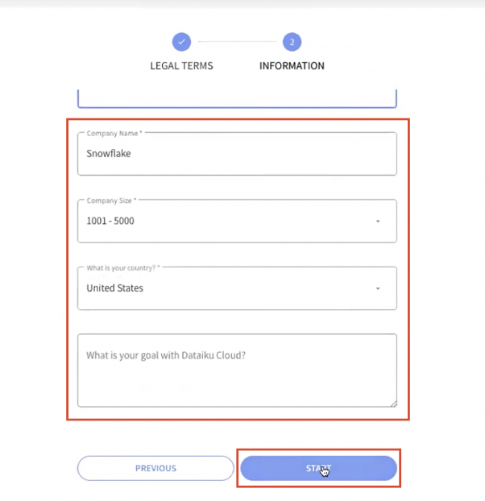 -->


You will be redirected to the Dataiku Cloud Launchpad site. Click ```GOT IT!``` to continue.


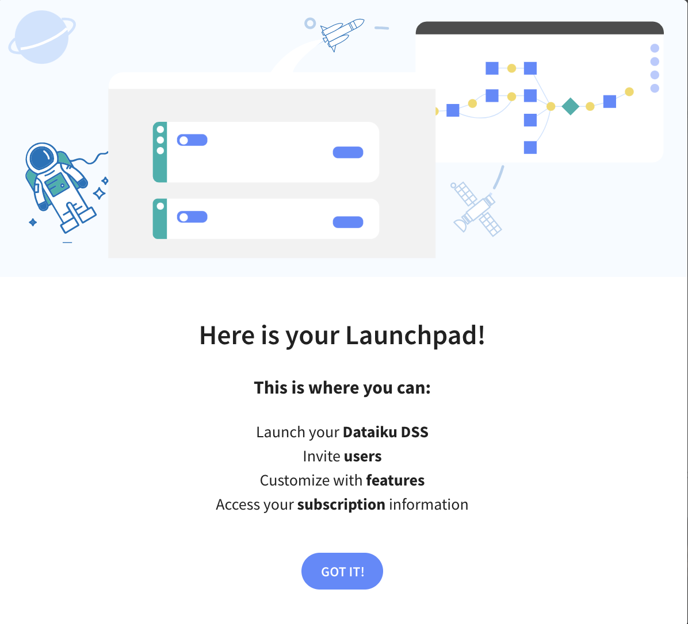


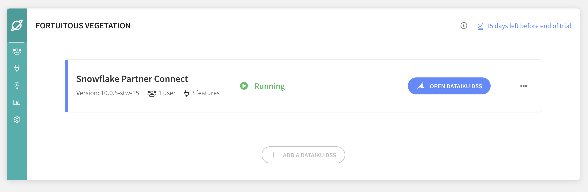


You’ve now successfully set up your Dataiku trial account via Snowflake’s Partner Connect. We are now ready to continue with the lab. For this, move back to your ```Snowflake browser```.


## Database for Machine Learning
Duration: 5

After connecting  ```Snowflake``` to ```Dataiku``` via partner connect. We will clone the table created in ```ML_DB``` to ```PC_DATAIKU_DB``` for the Dataiku consumption. 

Snowflake provides a very unique feature called [Zero Copy Cloning](https://www.youtube.com/watch?v=yQIMmXg7Seg) that will create a new copy of the data by ```only making a copy of the metadata of the objects```. This drastically speeds up creation of copies and also drastically reduces the storage space needed for data copies.


You should see three database now  ```PC_DATAIKU_DB``` is the system generated database created. 


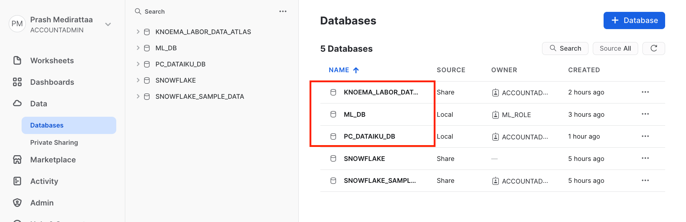


You should see  ```PC_DATAIKU_USER``` is the system generated database created. 


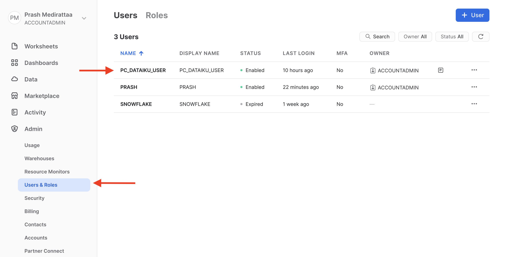


Go back to ```Data_Loading Worksheet``` you are working and run below commands. 


#### Granting Privileges of ML_DB to PC_Dataiku_role

```

grant all privileges on database ML_DB to role PC_Dataiku_role;
grant usage on all schemas in database ML_DB to role PC_Dataiku_role;
grant select on all tables in schema ML_DB.public to role PC_Dataiku_role;
grant select on all views in schema ML_DB.public to role PC_Dataiku_role;

```

There are two options after this. You can either create a `New Worksheet` or continue in `same worksheet `. We will continue with `same Worksheet`. We just have to `refresh` your browser after the `next step`

```

USE ROLE PC_DATAIKU_ROLE;

```

#### Imp:  Refresh the web page 

After running above command you might see the prompt below. Kindly `refresh `the browser. 

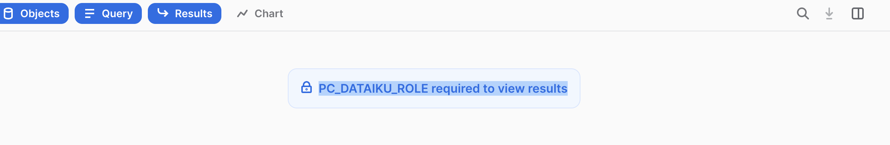


#### Cloning tables to DATAIKU Database before consuming it for Dataiku DSS 
```
USE DATABASE PC_DATAIKU_DB;
USE WAREHOUSE PC_DATAIKU_WH;

--- cloning 

CREATE OR REPLACE TABLE LOANS_ENRICHED CLONE ML_DB.PUBLIC.LOAN_DATA;
CREATE OR REPLACE TABLE UNEMPLOYMENT_DATA CLONE ML_DB.PUBLIC.UNEMPLOYMENT_DATA;


SELECT * FROM LOANS_ENRICHED LIMIT 10;
```

After running above commands, we have created clones for the tables to be used for analysis. Kindly check ```PC_DATAIKU_DB``` 

you should have two datasets ```LOANS_ENRICHED``` and ```UNEMPLOYMENT_DATA```

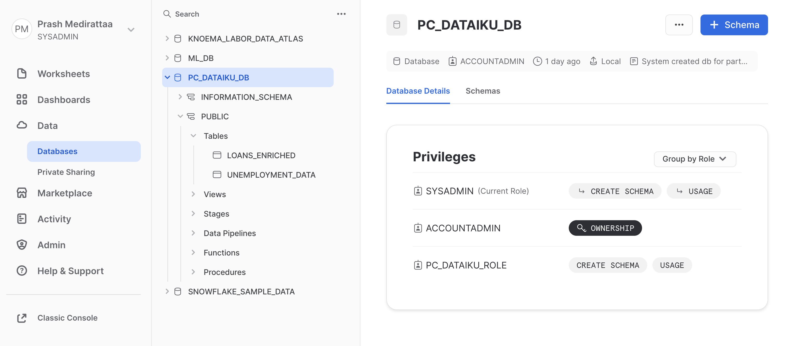


> aside negative
> 
>  **Move to Dataiku console** <br> For feature engineering, model building, Scoring and deployment. 


<!-- ------------------------ -->
## Getting Started with a Dataiku Project
Duration: 4

Return to Dataiku Online and if you haven't already click on **OPEN DATAIKU DSS** from the Launchpad to start your instance of Dataiku DSS


Here is the project we are going to build along with some annotations to help you understand some key concepts in Dataiku DSS: 

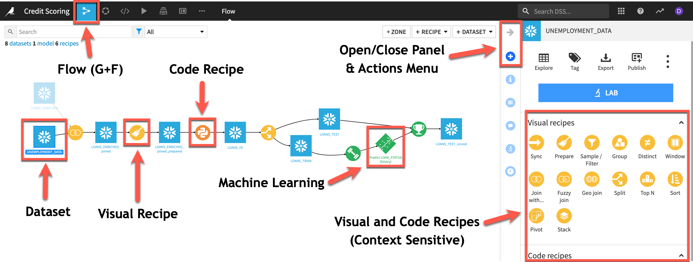


* A **dataset** is represented by a blue square with a symbol that depicts the dataset type or connection. The initial datasets (also known as input datasets) are found on the left of the Flow. In this project, the input datasets will be the ones we created in the first part of the lab.

* A **recipe** in Dataiku DSS (represented by a circle icon with a symbol that depicts its function) can be either visual or code-based, and it contains the processing logic for transforming datasets.

* **Machine learning processes** are represented by green icons.

* The **Actions Menu** is shown on the right pane and is context sensitive.

* Whatever screen you are currently in you can always return to the main **Flow** by clicking the **Flow** symbol from the top menu (also clicking the project name will take you back to the main Project page).


**Input dataset:**
  _The dataset is based on the Loans Dataset from LendingClub which is a peer-to-peer lending company that matches borrowers and investors._

  _In the interests of time we have performed some initial steps of the data pipeline such as cleansing and transformations on the loans dataset. These steps can be created in Dataiku from the raw datasets from the Lending Club to form a complete pipeline with the data and execution happening in Snowflake._


### Reminder of our goal

Our goal is to build an optimized machine learning model that can be used to predict the risk of default on loans for customers and advise them on how to reduce their risk.
To do this, we’ll join the input datasets, perform transformations & feature engineering so that they are ready to use for building a binary classification model.


### Creating a Dataiku Project


Once you’ve logged in, `click` on `+ NEW PROJECT` and select `+ Blank project` to create a new project.

Name the project as ``Credit Scoring``

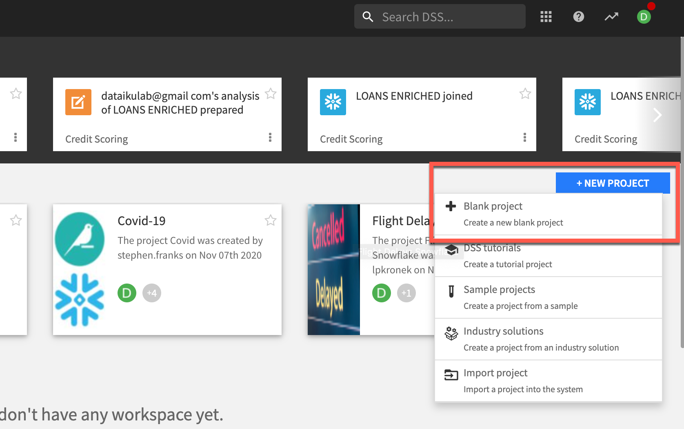


<!-- ------------------------ -->
## Data Import, Analysis & Join
Duration: 10

The project home acts as the command center from which you can see the overall status of a project, view recent activity, and collaborate through comments, tags, and a project to-do list. Let’s add our datasets from Snowflake.


* From the Flow click `+ Import Your First Dataset` in the centre of the screen.


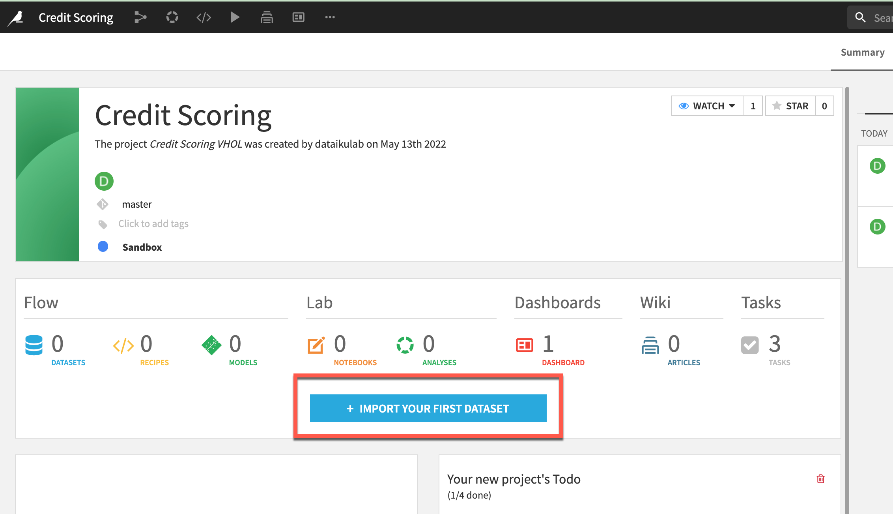


* Select the `Search and import option` 

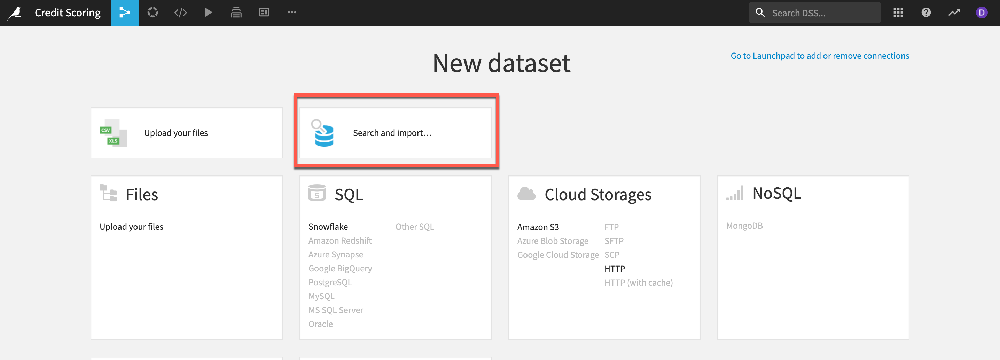

* Select the `PC_DATAIKU_DB` connection from the dropdown then `click the refresh icon` next to the database or schema dropdowns to populate these options.
* Select the database and schema as below then click on `LIST TABLES`


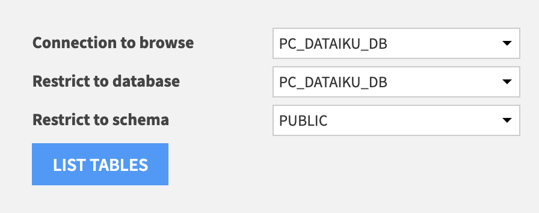


* Select the `Loans_Enriched` and `Unemployment_Data` datasets and click `CREATE 2 DATASETS` followed by `OK`


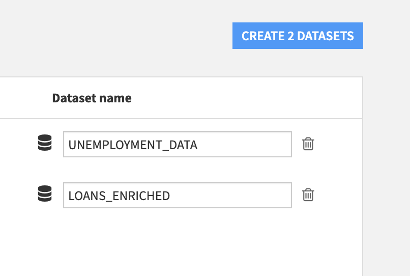


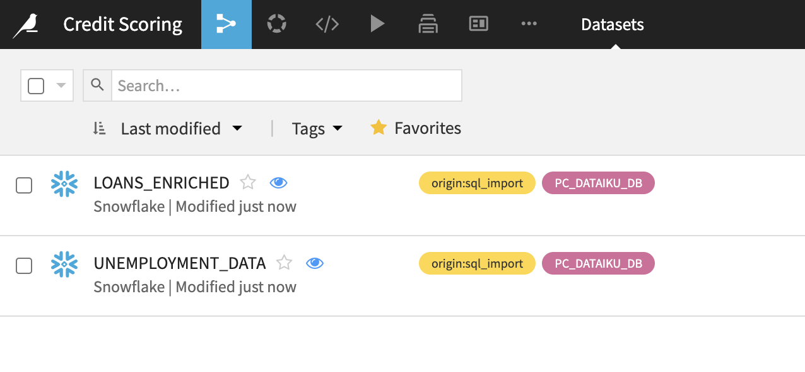

* Navigate to the Flow from the left-most menu in the top navigation bar `(or use the keyboard shortcut G+F)`.

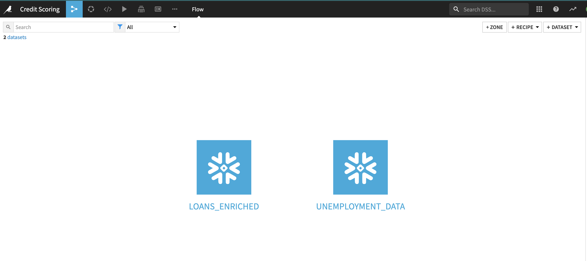

In DSS, the datasets and the recipes together make up the `flow`. We have created a visual grammar for data science, so users can quickly understand a data pipeline through the flow.

Using the flow, DSS knows the lineage of every dataset in the flow. DSS, therefore, is able to dynamically rebuild datasets whenever one of their parent datasets or recipes has been modified. This is where we will work from in this lab.

Now we have all of the raw data needed for this lab. Let’s explore what’s inside these datasets.

* From the Flow (keyboard shortcut G+F), double click on the `LOANS_ENRICHED` dataset to open it.

One column to note is the **LOAN_STATUS** column. This will be our target variable to predict against later in the lab. 

* You can analyze column metrics to better understand your data: Either click on the column name and `select Analyze` or, if you wish for a quick overview of columns key statistics, `select Quick Column Stats` button on the top-right.


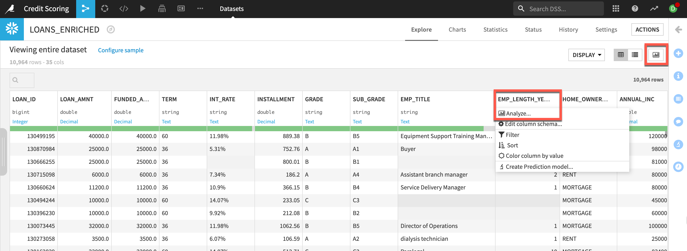

### Join the Data 


So far, your Flow only contains datasets. To take action on datasets, you need to apply recipes. The **LOANS_ENRICHED** and **UNEMPLOYMENT_DATA** datasets both contain a column of Loan IDs. Let’s join these two datasets together using a visual recipe.

* Return to the Flow either by clicking the menu option in the top left or with the keyboard shortcut G+F
* Select the `LOANS_ENRICHED` dataset from the Flow by `single clicking` on it.
* Choose `Join With…` from the `Visual recipes` section of the Actions sidebar near the top right of the screen (note: click the `Open Panel` arrow if it is minimized and notice there are three different types of join recipe, we want `Join With…`).
* Choose `UNEMPLOYMENT_DATA` as the second input dataset.

 
* Leave the defaults for `Name` and `PC_DATAIKU_DB for “Store into”` and `Create` the recipe. 

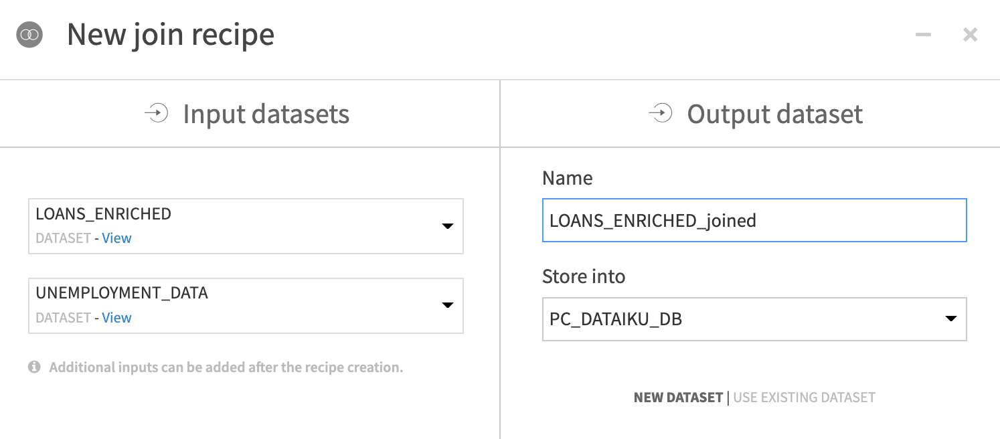


* Leave the defaults for the `Join` and `Selected columns` steps.

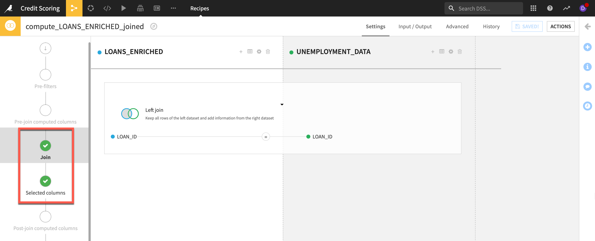

* Select the `Output step`
* Note: You can view the SQL query as well as the execution plan generated by selecting `VIEW QUERY`
* Ensure that `In-database (SQL)` is selected as the engine. You can view this underneath the `Run button`(Bottom left). If it is set to a different engine `click on the three cogs` to change it 
* Before running, `Save` the recipe
* Click the `RUN` button
* If prompted agree to `Update Schema` then return to the `flow (G+F)`

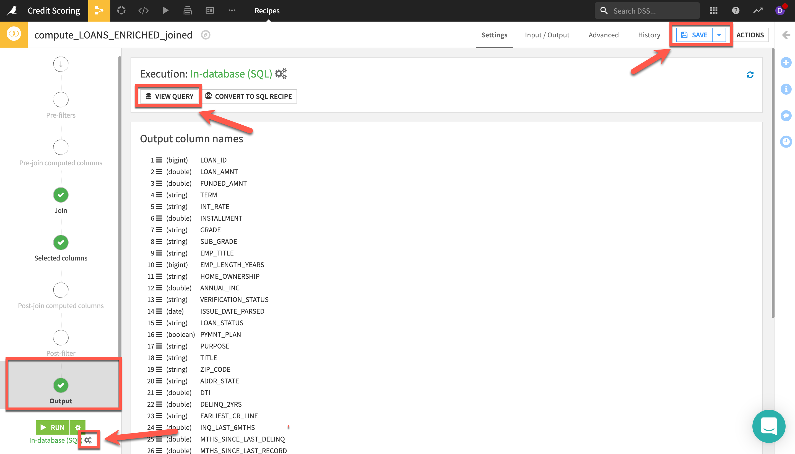

Your flow should now look like this


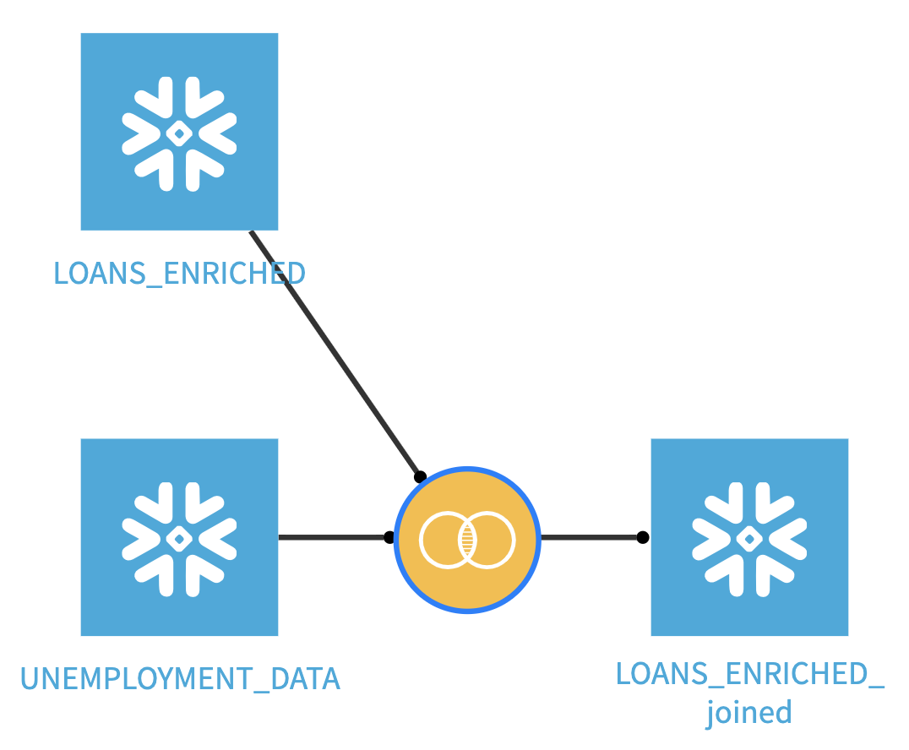

## Prepare the Data 
Duration: 12

Data cleaning and preparation is typically one of the most time-consuming tasks for anyone working with data. In our lab, in order to save some of that time, our main lending dataset already had a number of cleaning steps applied. In the real world this would be done by other colleagues, say, from the data analytics team collaborating on this project and you would see their work as steps in our projects flow. 

Let’s take a brief look at the `Prepare recipe`, the workhorse of the visual recipes in Dataiku, and perform some final investigations and transformations. 

* From the flow `Single click` on the **LOANS_ENRICHED_joined** dataset that was the output of our Join recipe and `select Prepare` from the visual recipes in the `Actions Panel`. 
* Leave the `Name` and `Store into` options as the defaults and click `CREATE RECIPE`

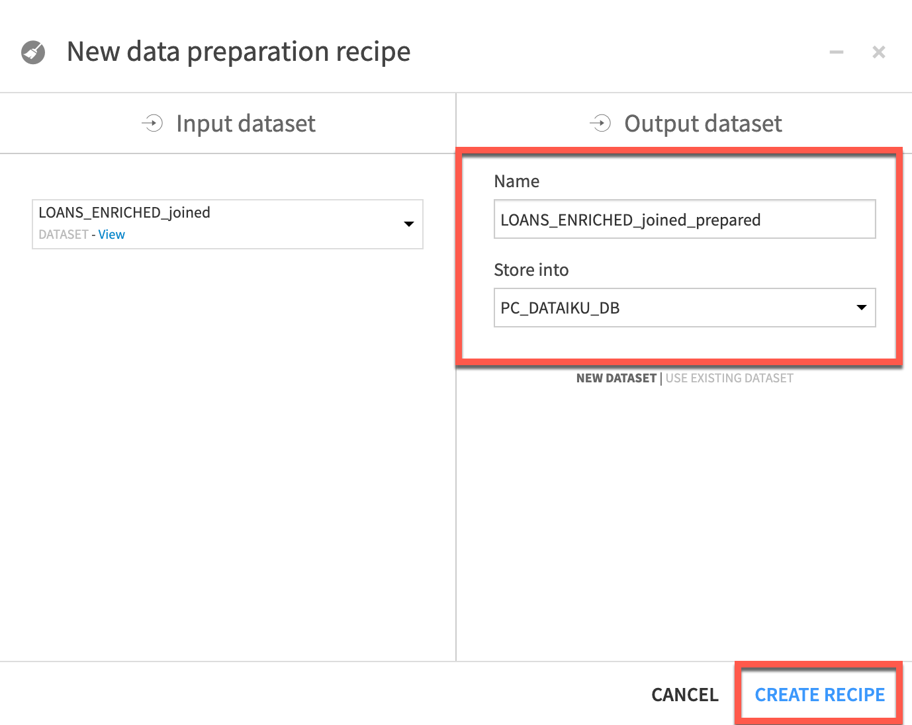

In a Prepare recipe you assemble a series of steps to transform your data from a library of ~100 processors. There are a couple of ways you can select these processors to build your script. Firstly you can select these processors directly by using the `+ADD A NEW STEP` button on the left.
Secondly because Dataiku DSS infers meanings for each column, it suggests relevant actions in many cases. In the example below although the column is stored in Snowflake as a String Dataiku DSS recognizes it as a date format so infers a `Date(unparsed)` meaning and suggests the `Parse Date` processor, by selecting the `More actions` menu item further suggestions are made.

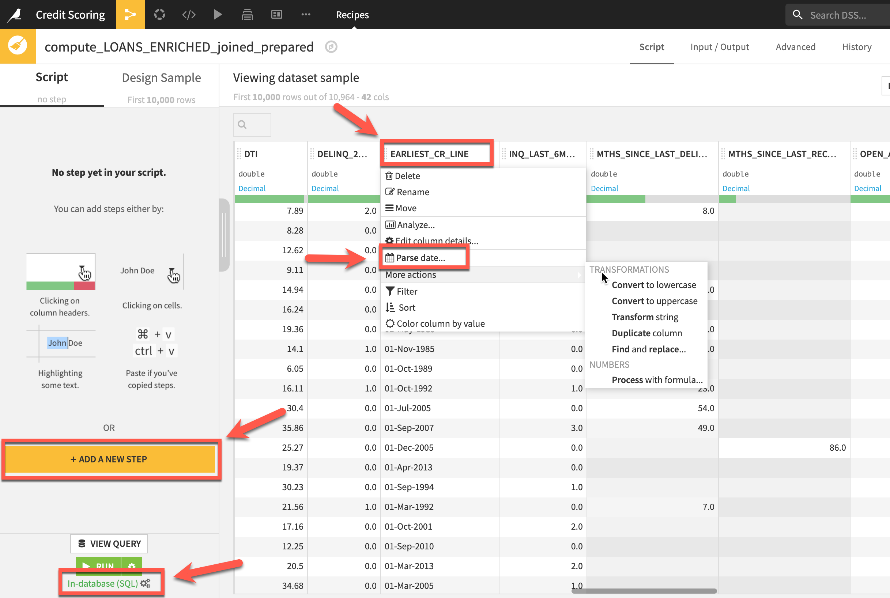


> aside negative
> 
>  **Note about shortcuts** <br> When navigating Dataiku DSS, there are many keyboard short-cuts, one of the most useful when working with the explore tab is the `scroll to column`, simply  click `c ` on your keyboard. 


Let's try using processors with both methods, firstly via the suggested actions:
* Click on the `EARLIEST_CR_LINE` column header and from the dropdown, `select Parse date`

* In `Add a custom format` set the format to `d-MMM-yyyy` and click on `USE DATE FORMAT`

* A step is generated on the left. Change the `Locale` to `en_US`


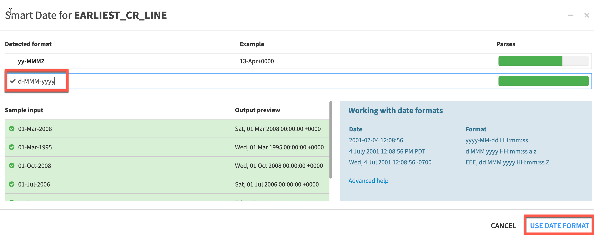


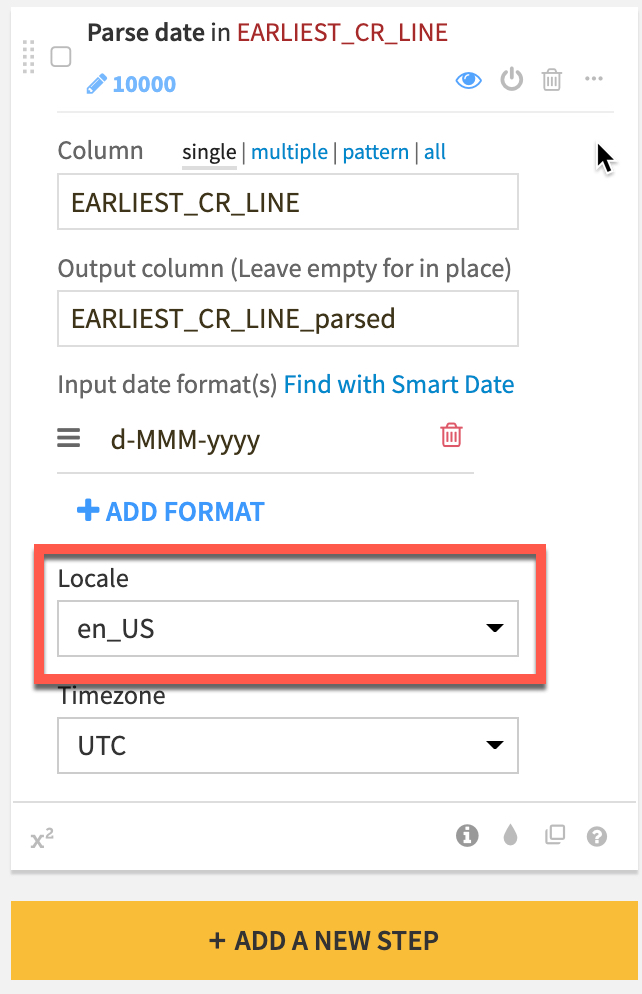


* Click on the newly created column (click outside the step to action the change) and select `Compute time since`

* Change `Until` to `Another Date Column` and add **ISSUE_DATE_PARSED** as that column.

* Change the unit to `Years` and name the new column `since_Earliest_CR_LINE_years`


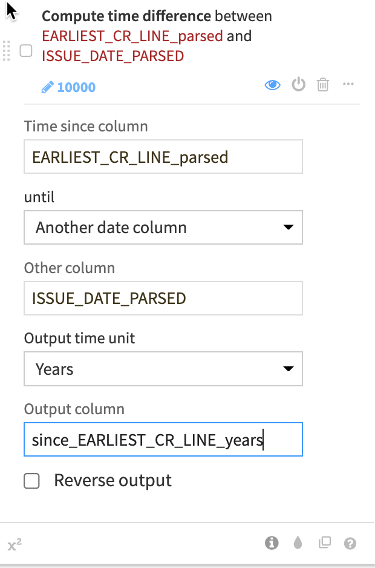

Now we have our desired feature we can remove the two date columns.

* Click on `EARLIEST_CR_LINE` and select `delete`, do the same for `EARLIEST_CR_LINE_parsed` and `ISSUE_DATE_PARSED`.

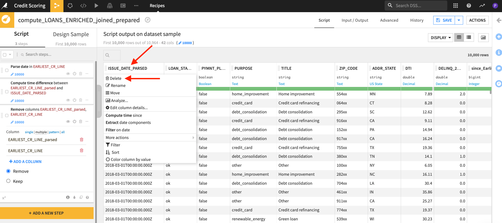


Your script steps should now look like this:


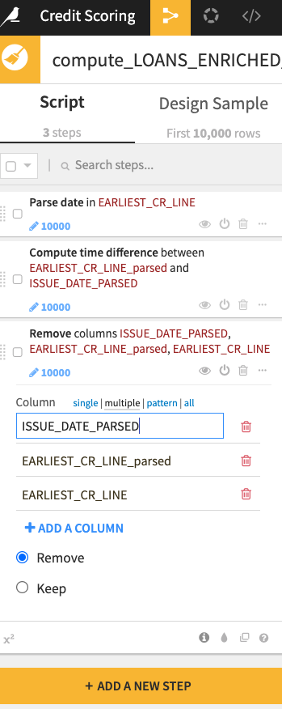


Optionally you can place the three date transformation script steps into their own group with comments to make it simple for a colleague to follow everything you have done. 
Let’s turn our attention to the `INT_RATE` column. The interest rate is likely to be a powerful predictive feature when modeling credit defaults but currently its stored as a string:

* Click on the `+ADD A NEW STEP` button at the bottom of your script steps.
* Select the `Find and Replace` processor either by looking in the `Strings` menu or using the search function.

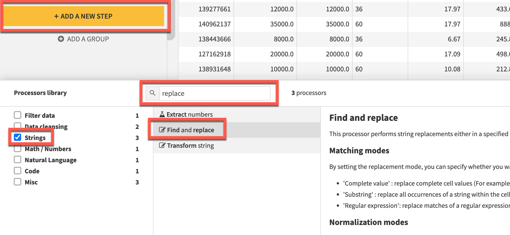

* Select `INT_RATE` as the column then click `+ADD REPLACEMENT` and `replace % with a blank value`. Ensure the `Matching Mode` dropdown is set to `Substring`

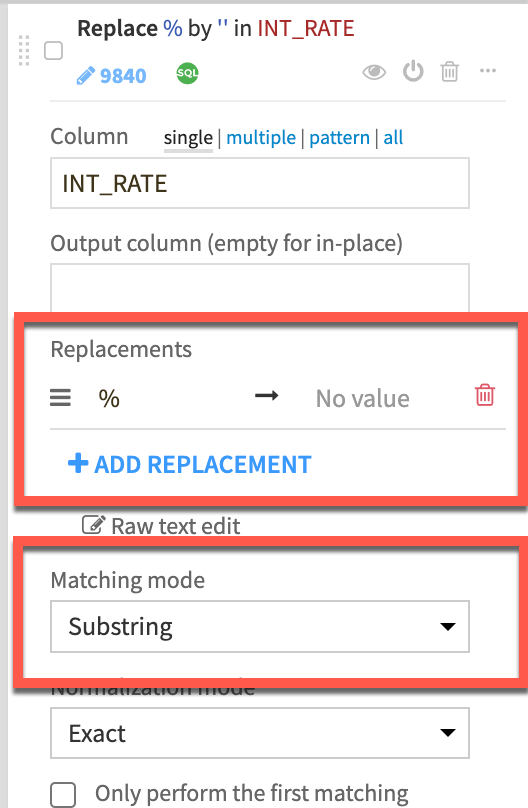


Our `INT_RATE` column has some suspiciously high values. Let’s use the Analyze tool again and see how it can be used to take certain actions in a Prepare recipe

* Click on the `INT_RATE` column header dropdown, select `Analyze`.
* In the Outliers section, choose `Remove rows outside 1.5 IQR` from the menu then close the `Analyze` window.

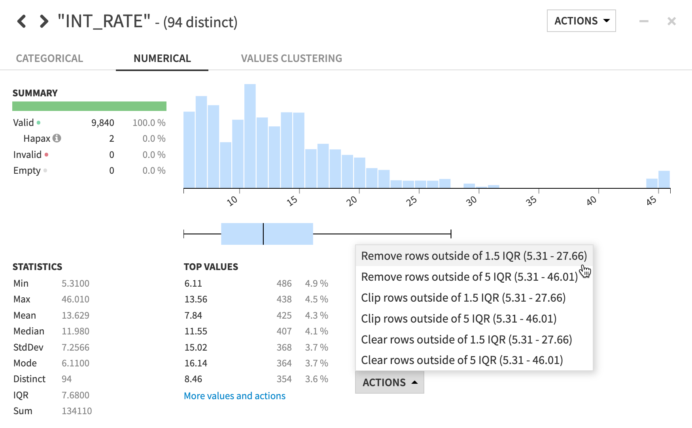

Finally lets take a look at our `DTI` column which is a ratio of the borrower’s total monthly debt payments on the total debt obligations divided by the borrower’s self-reported monthly income. 

* Click on the `DTI` column header and select `Analyze`


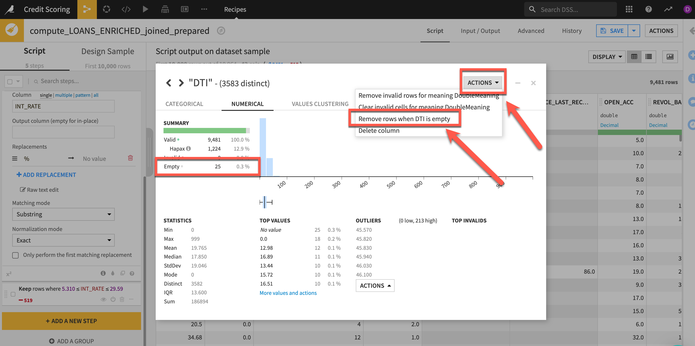

We can see that there are a very small number of missing rows. We're going to perform some calculations using this column in our next lab section so lets fix that now.

* Select the `top` actions menu and select `Remove rows where DTI is empty`
* Close your `Analyze` window 

Your final series of steps should look like this

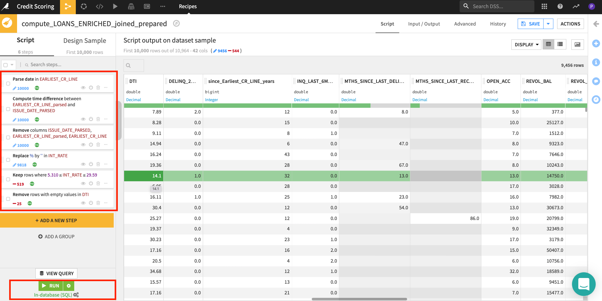


As before you can optionally group and comment your transformation steps. 
* `SAVE` your recipe, ensure `In-database (SQL)` engine is selected and then click `RUN`


<!-- ------------------------ -->
## Feature Engineering with Code Recipes & Snowpark
Duration: 10


Dataiku DSS integrates with `Snowpark for Python` allowing coders to take advantage all the benefits of Snowflake whilst collaborating alongside their no/low-code colleagues on projects to accelerate time to value in DSS, their end-to-end, governed AI lifecycle platform.

When using Dataiku's SaaS option from Partner Connect the setup is done for us automatically. Let's check that.

Return to your browser tab with `Dataiku Launchpad` open (if you have shut this just go to [Launchpad](https://launchpad-dku.app.dataiku.io/).


`Select` the `Features` menu
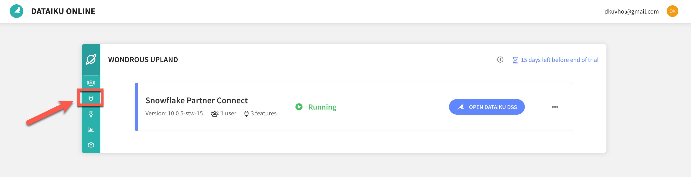


Your Snowpark extension is now ready to use.
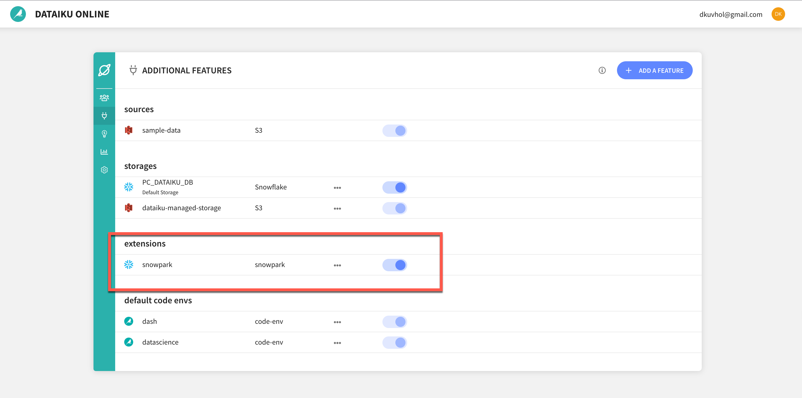


**A Note on Code Environments:**  Dataiku uses the concept of code environments to address the problem of managing dependencies and versions when writing code in R and Python. Code environments provide a number of benefits such as **Isolation and Reproducibility** of results

When using Snowpark for Python from Dataiku DSS you will use a code environment that includes the Snowpark library as well as other packages you wish to use. In our lab, to make things easy, we are using a default Snowpark code environment which just contains just the minimum required libraries but once you have completed the lab and wish to explore further you can create your own code environments.


In addition to selecting an appropriate code environment there are just a couple of extra lines of code to add to your DSS recipe to start using Snowpark for Python.

Lets take a look at a simple example.

Firstly you need to add the following line to your imports:


```
from dataiku.snowpark import DkuSnowpark
```

Then read the inputs, instantiate Snowpark, get the dataframe, write your code then write your output.


```
# Read recipe inputs
input_dataset = dataiku.Dataset("my_input_dataset")

# get input dataset as snowpark dataframe
dku_snowpark = DkuSnowpark()
snowdf = dku_snowpark.get_dataframe(input_dataset)

# ALL YOUR CODE HERE

# get output dataset
OUTPUT_DATASET = dataiku.Dataset("my_output_dataset")

# write input dataframe to output dataset
dku_snowpark.write_with_schema(OUTPUT_DATASET,snowdf)
```


We have an example Jupyter notebook to help you get started. Download the notebook from the S3 bucket to a local drive then we will upload to DSS (Note: You would typically use the Git integrations in DSS for managing team notebooks developed outside of DSS).


 <button>[Snowpark_Jupyter_notebook.ipynb](https://snowflake-corp-se-workshop.s3.us-west-1.amazonaws.com/Summit_Snowflake_Dataiku/src/Loans_FE_Snowpark.ipynb)</button>

Either `select notebooks` from the menu or use the `G+N` keyboard shortcut. Select to `upload` your notebook, `choose the file` and `click upload`.


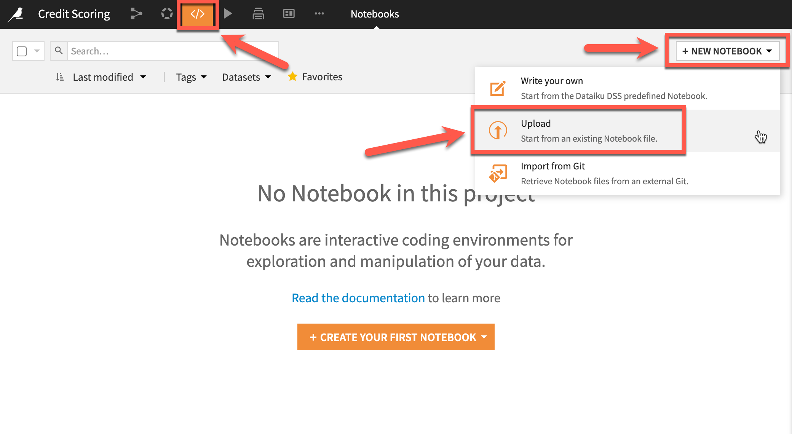


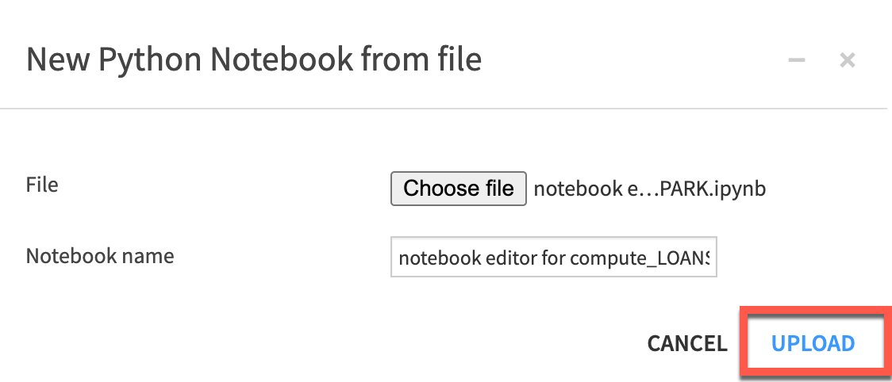


Here is the notebook we imported, click `create recipe`


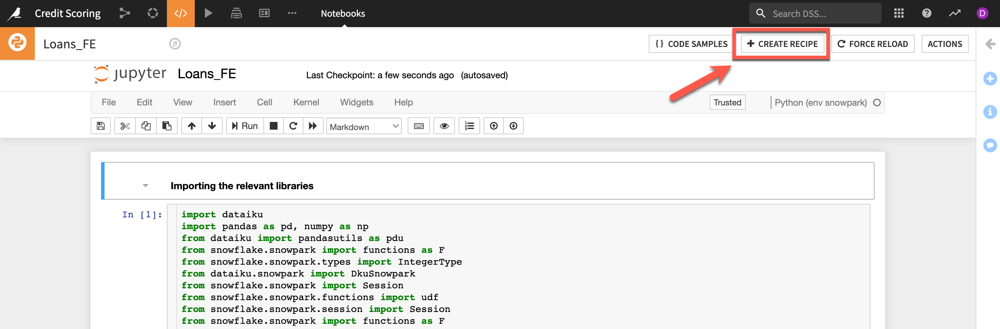

select `Python recipe` and click `ok ` 

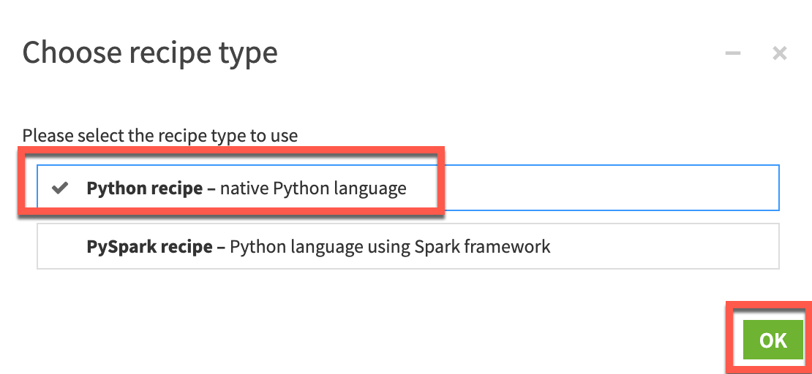


For the input dataset we will select `LOANS_ENRICHED_joined_prepared` and for the output dataset type `LOANS_FE` and then click `Create recipe`

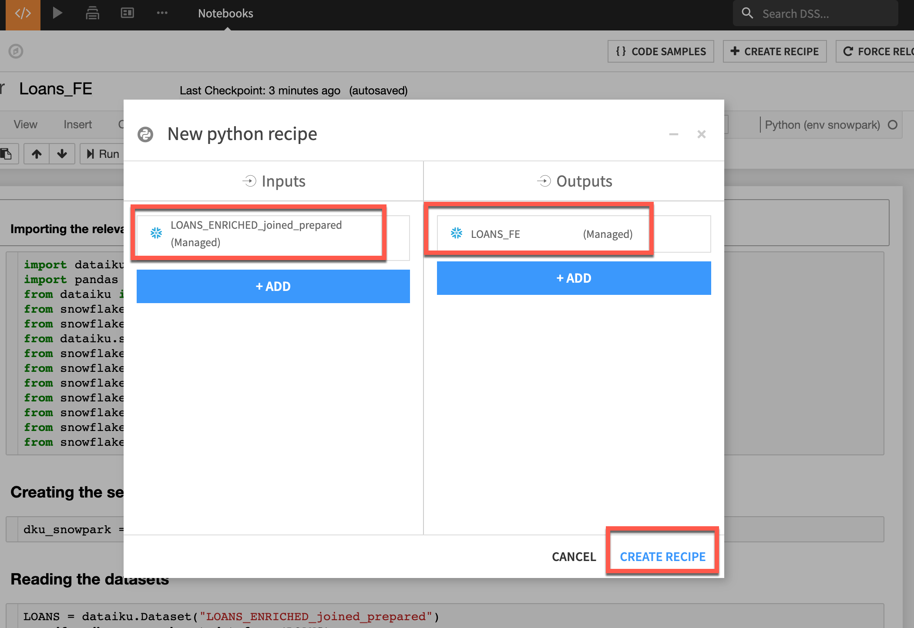

You now have the notebook set up with correct input and output datasets in our flow. You can either use the default code editor or jupyter notebook. We will work on jupyter notebook. `Click edit in notebook`


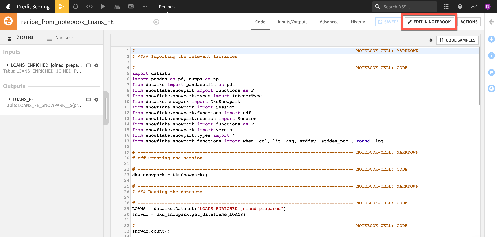

Ensure your Jupyter notebook is using the `snowpark` kernel, if not change it from the `Change Kernel` menu


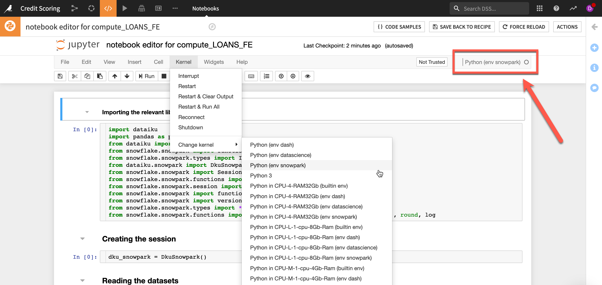


Test running your cells (note the code assumes the dataset names specified above. If you have changed any input or output dataset names be sure and make those updates in the code).

Feel free to add you own code and experiment, when you are done click `SAVE BACK TO RECIPE`.

From the default Code Editor lets check apply the correct code environment. Click on `Advanced` and then select a Snowpark code environment from the dropdown (Note: Your available code environments may differ from the screenshot)

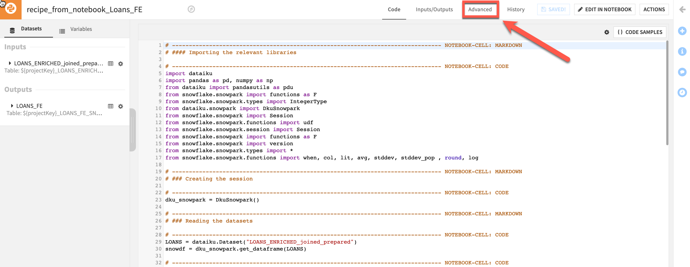

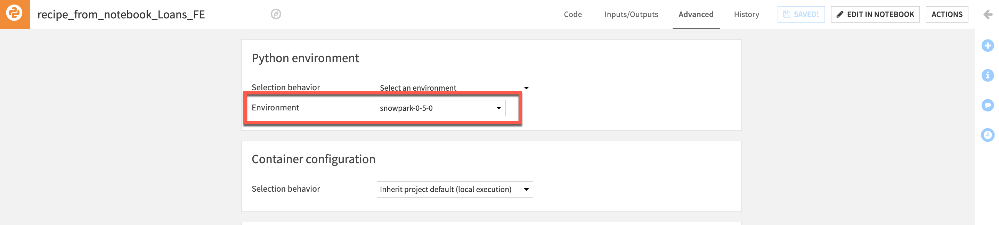


 Return to the `Code` screen and click the `Run` button to execute the recipe using Snowpark and to generate the output dataset in the flow.


<!-- ------------------------ -->
## Training 
Duration: 15

Having sufficiently explored and prepared the loans and employment data, the next stage of the AI lifecycle is to experiment with machine learning models.

This experimentation stage encompasses two key phases: model building and model assessment.

`Model building`: Users have full control over the choice and design of a model — its features, algorithms, hyperparameters and more.

`Model assessment`: Tools such as visualizations and statistical summaries allow users to compare model performance.

These two phases work in tandem to realize the idea of Responsible AI. Either through a visual interface or code, building models with DSS can be transparently done in an automated fashion. At the same time, the model assessment tools provide a window into ensuring the model is not a black box.

Before building our model first we will split our output dataset from our python step.

This is how your flow should look like before splitting
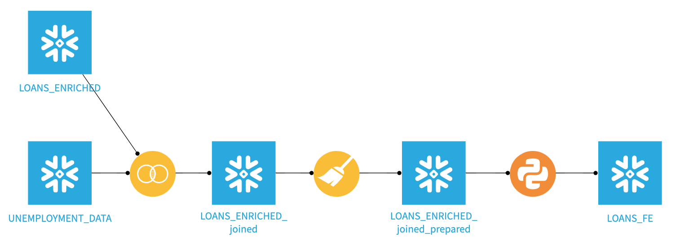


* Return to the flow and select the output dataset ```LOANS_FE``` of the python recipe and then select  the `Split` recipe from the `Actions` menu.

* Add two datasets named `LOANS_TRAIN` and `LOANS_TEST` (leave `Store into` as the default for both) and click `CREATE RECIPE`


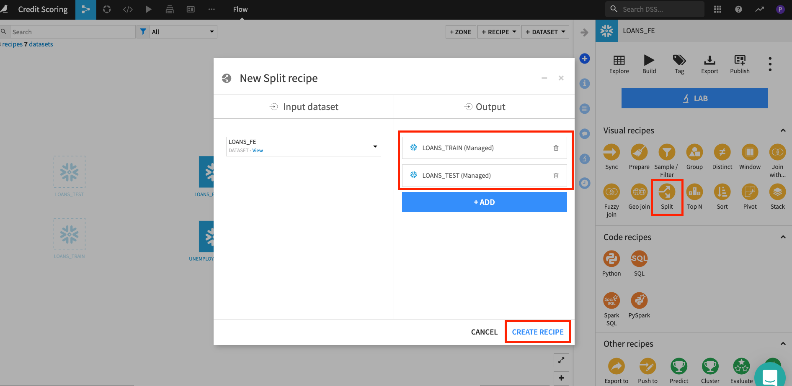


* Choose `Dispatch percentiles of sorted data` as the splitting strategy 


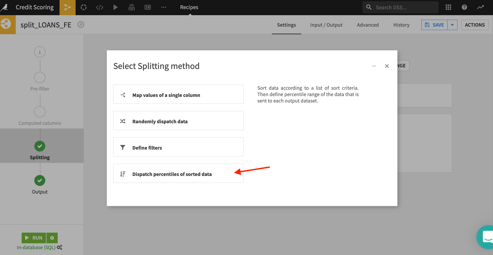

* `LOAN_ID` as the column to split on, `70 & 30 ` split for Train and Test data. `Click run`

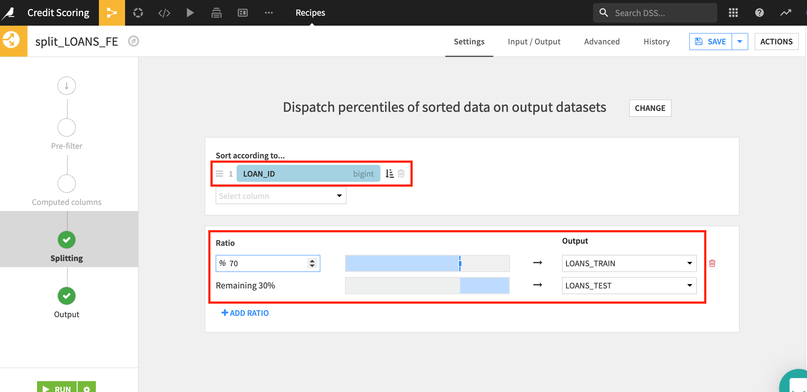


* Return to the flow and select the `LOANS_TRAIN` dataset and click the `LAB` button in the Actions menu

* Select `AutoML Prediction` (aka supervised machine learning) and set `LOAN_STATUS` as the target and leave the default template of `Quick Prototypes` then click `CREATE`

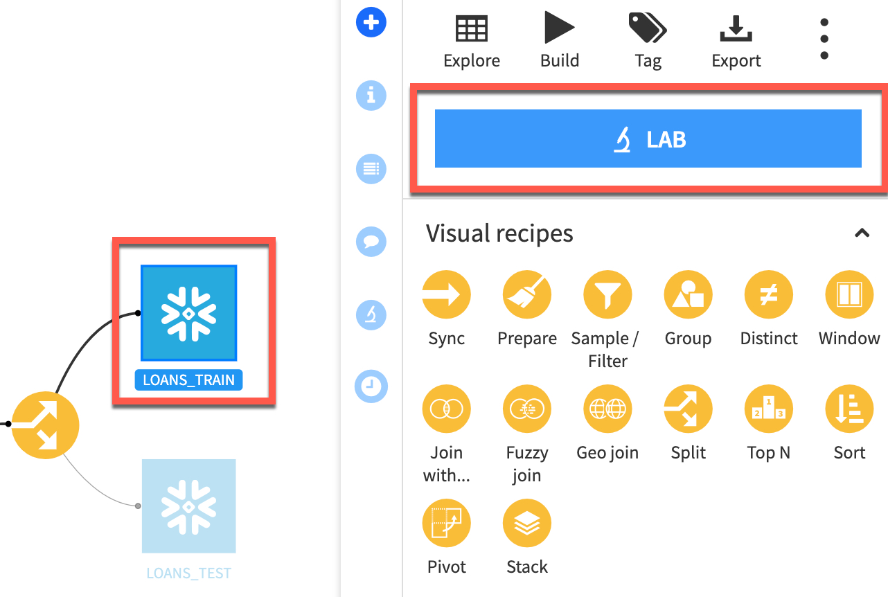


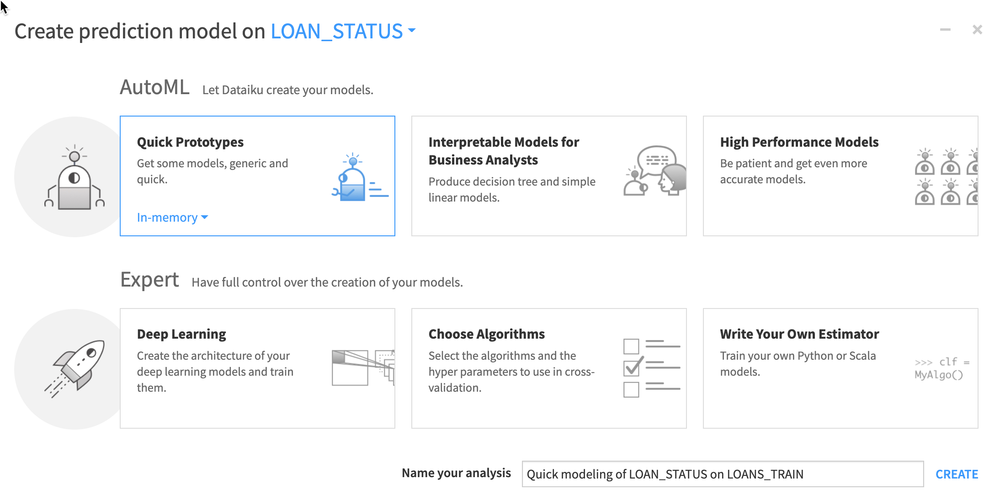


When building a visual model, users can choose a template instructing DSS to prioritize considerations like speed, performance, and interpretability. Having decided on the basic type of machine learning task, you retain full freedom to adjust the default settings chosen by DSS before training any models. These options include the metric for which to optimize, what features to include, and what algorithms should be tested etc.

Lets take a look at the settings from the template.

* Click on `DESIGN` at the top of the page.

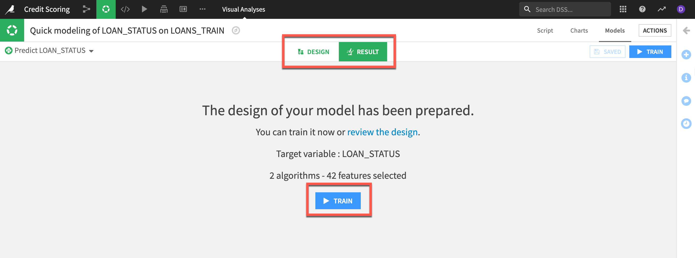

On the left side we can view/adjust the various settings for our current experiment. We don't have time in todays lab to cover all the options but here is a brief outline of a few we will use in the lab:

**TRAIN/TEST SET** - When training a model, it is important to test the performance of the model on a “test set”. During the training phase, DSS “holds out” on the test set, and the model is only trained on the train set. In this section you can adjust the strategy.

**DEBUGGING** - ML Diagnostics are designed to identify and help troubleshoot potential problems and suggest possible improvements at different stages of training and building machine learning models.

**FEATURES HANDLING** - We can allow Dataiku DSS to automatically choose the features included in our model, or we can manually select which features we want to include when our model is trained and how we handle the feature types. 

**ALGORITHMS** - DSS natively supports algorithms that can be used to train predictive models depending on the machine learning task: Clustering or Prediction (Classification or Regression). We can also choose to use our own machine learning algorithm, by adding a custom Python model. In our case we are using the algorithms based on the Scikit-Learn, LightGBM and XGBoost ML libraries.


Let's use the defaults the template has set.

* Click on the `TRAIN` button to start the experiment.

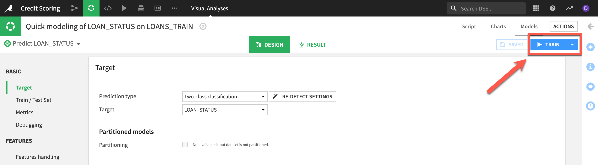

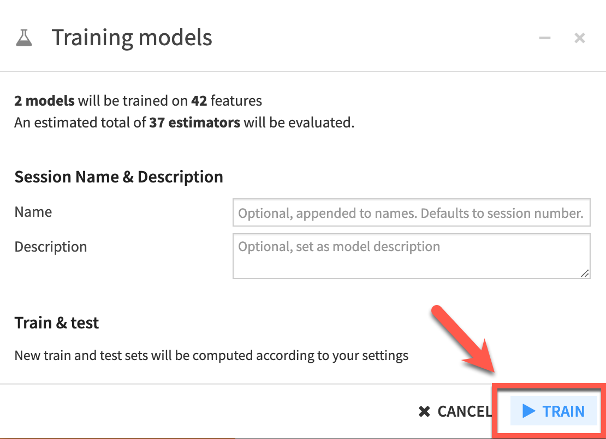

The `RESULTS` pane in DSS provides a single interface to compare performance in terms of sessions or models, making it easy to find the best performing model for the chosen metric.

In the `RESULTS` screen we can see the output of our first experiment. DSS displays a graph of the evolution of the best cross-validation scores found so far. Hovering over one of the points, we can see the evolution of the hyperparameter values that yielded an improvement. In the right part of the charts, we can see final test scores.


We can also see that some `Diagnostics` checks have been flagged.

* `Hover over` the `Diagnostics` to see what the guardrails have found.

**Imp Note : Your results may vary from the screen shots below.**

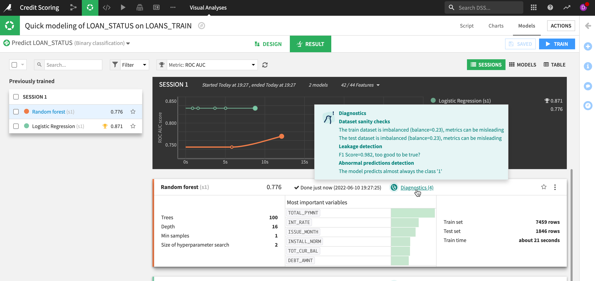

Here we can see there a number of potential issues DSS has identified for us. It seems we have an imbalanced dataset which is leading to the model almost always predicting class 1 (that there will be no default on the loan).

We can see this in our distribution.

* Go back to the `DESIGN` menu and choose `Features handling` and our target variable `LOAN_STATUS`

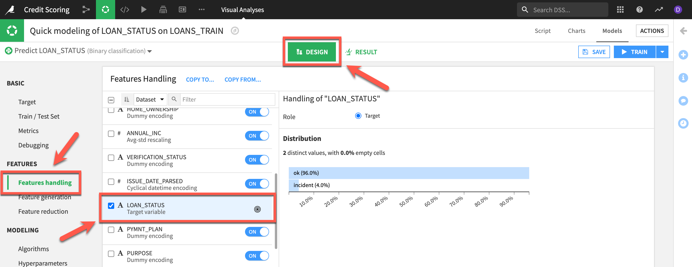

Here we can see that our loan defaults only make 4% of the dataset. So even if our model erroneously predicted that no loan would ever default it would still be correct 96% of the time for this imbalanced dataset! This is a common issue in certain types of classification problems such as credit card fraud, identifying rare diseases or, as in our case, loan defaults.

Although this a common problem in machine learning it is not one that is always easy to solve. Fortunately DSS has a number of ways to help such as weighting strategies, class rebalance sampling, Algorithm selection and more. Let's look at a couple of these techniques.

Firstly we can a look at class rebalance.

* Go to the `Train/Test Set` and from the `Sampling method` dropdown select `Class rebalance (approx. ratio)`
* Set the percentage to 20% and the Column as our target **LOAN_STATUS**

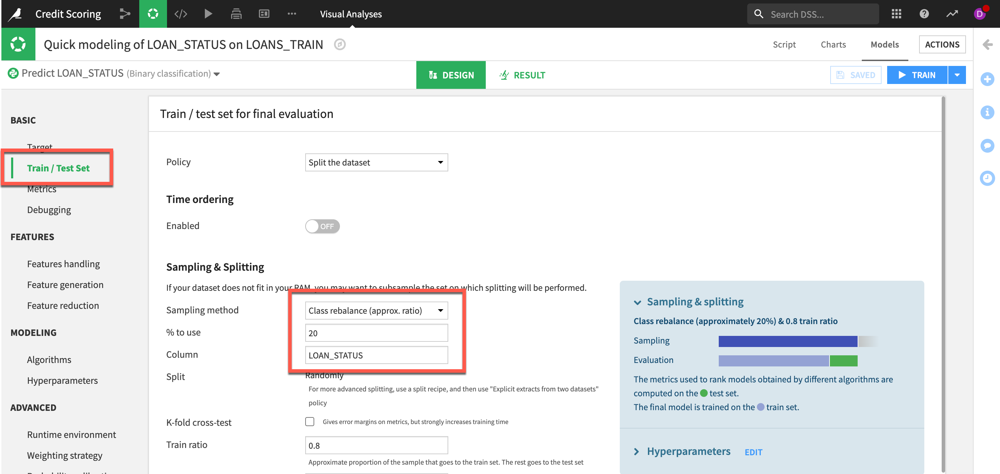

Lets also change the algorithms we are using as logistic regression and tree-based algos tend not to perform as well with imbalanced datasets. Let's look at some of our boosting algos.

* Go to `Algorithms` and deselect `Logistic Regression` and `Random Forest` and then select `XGBoost` and `LightGBM` (Note: you can select many more algo's but be aware it may take longer depending on your runtime setup)

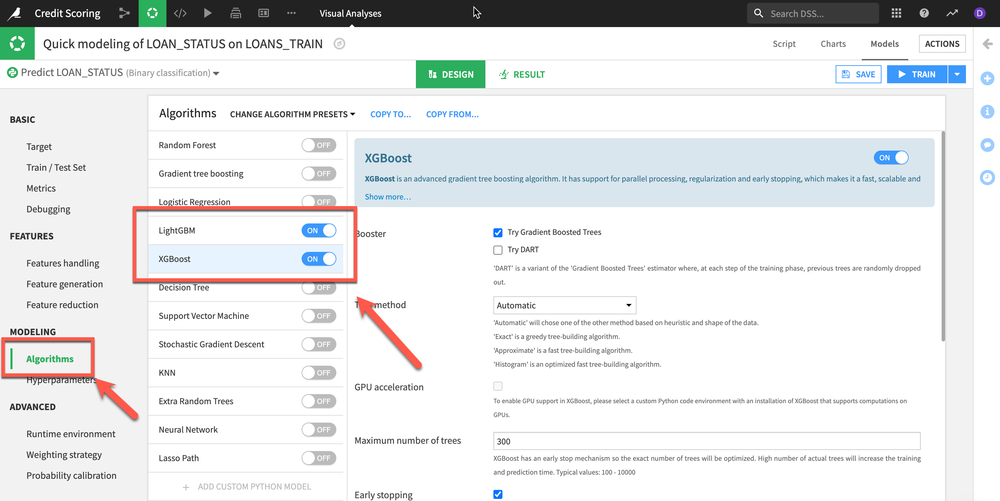


* `Save` your settings and then click `TRAIN`

As you can see on our results page we saw an improvement in our score and addressed our imbalance issue. The diagnostics warn us the test set might be too small now but we have a much larger dataset available to us from the LendingClub if we want to use it.

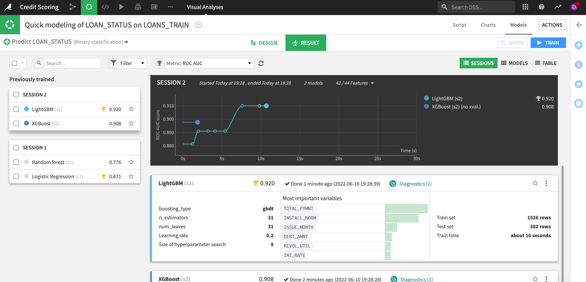


## Evaluate a Model 
Duration: 10

After having trained as many models as desired, DSS offers tools for full training management to track and compare model performance across different algorithms. DSS also makes it easy to update models as new data becomes available and to monitor performance across sessions over time.

* We can directly compare models from different experiments by selecting them via the `checkbox` and then selecting `Compare` from the `ACTIONS` menu.

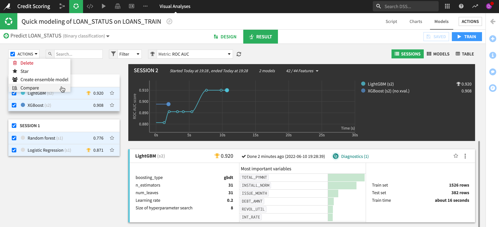

* Make sure `Create a new comparison` and then click `compare`

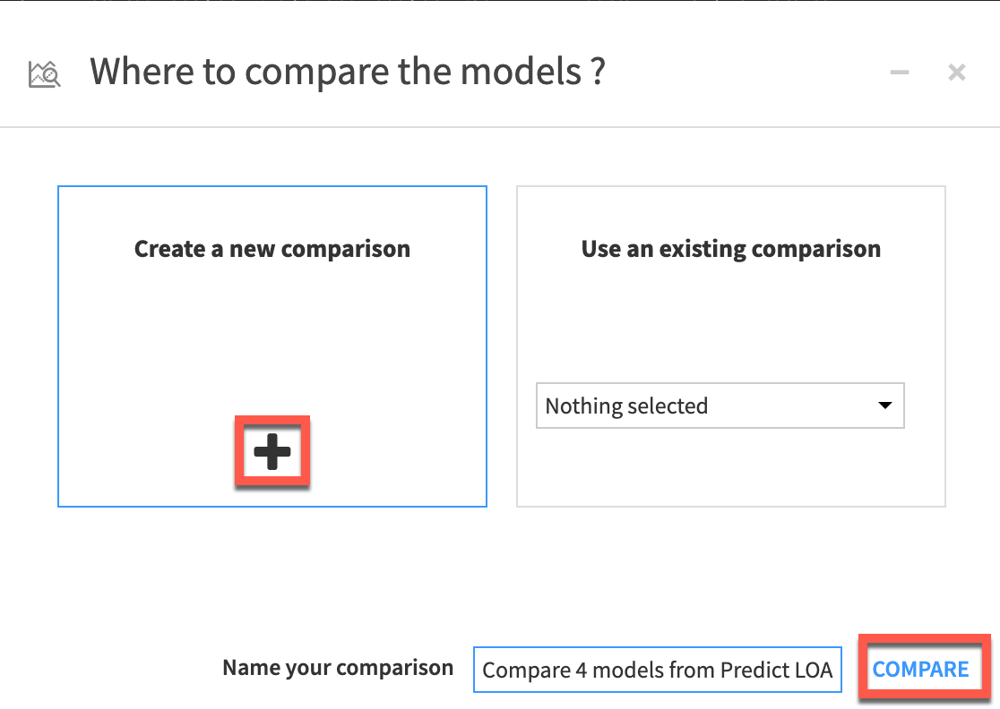

We can compare across our experiments, saved models and evaluations from a DSS evaluation store (not part of this lab). You can set a champion and compare to challengers.

* Explore some of the options. When you are done `click` on the `model name` of your best performing model from the `Summary` menu.

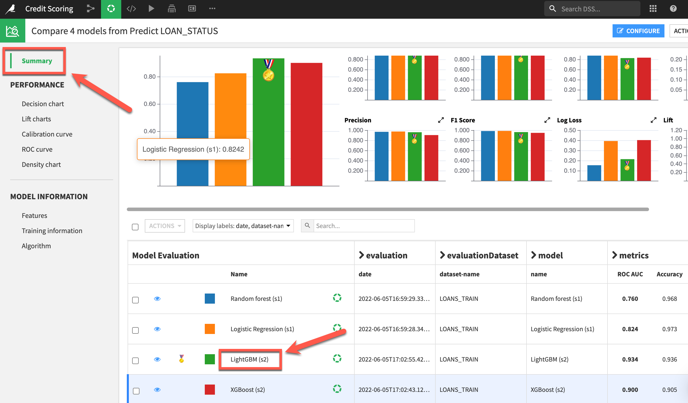

Clicking on any model produces a full report of tables and visualizations of performance against a range of different possible metrics.

* Step through the various graphs and interactive charts to better understand your model. 
* For example `Subpopulations Analysis` allows you to identify potential bias in your model by seeing how it performs across different sub-groups
* `Interactive Scoring` allows you to run real time `“what-if” analysis` to understand the impact of given features

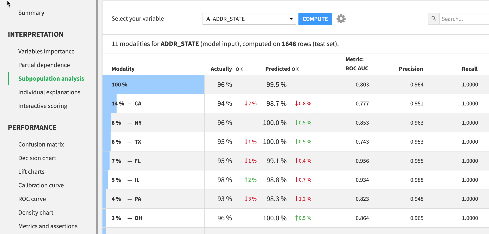


Here we can see `Variable importance` 


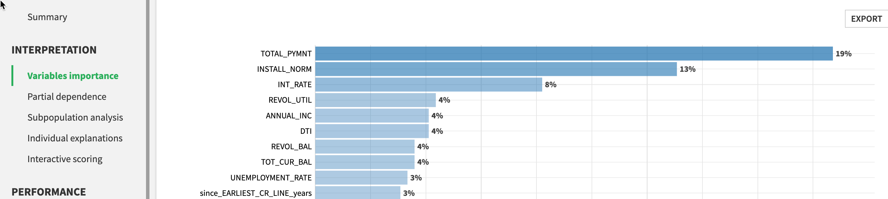


<!-- ------------------------ -->
## Deployment  
Duration: 3

After experimenting with a range of models built on historic training data, the next stage is to deploy our chosen model to score new, unseen records. 

For many AI applications, batch scoring, where new data is collected over some period of time before being passed to the model, is the most effective scoring pattern. 
Deploying a model creates a “saved” model in the Flow, together with its lineage. A saved model is the output of a Training recipe which takes as input the original training data used while designing the model.

* Click on `DEPLOY`, accept the default model name and click `CREATE`

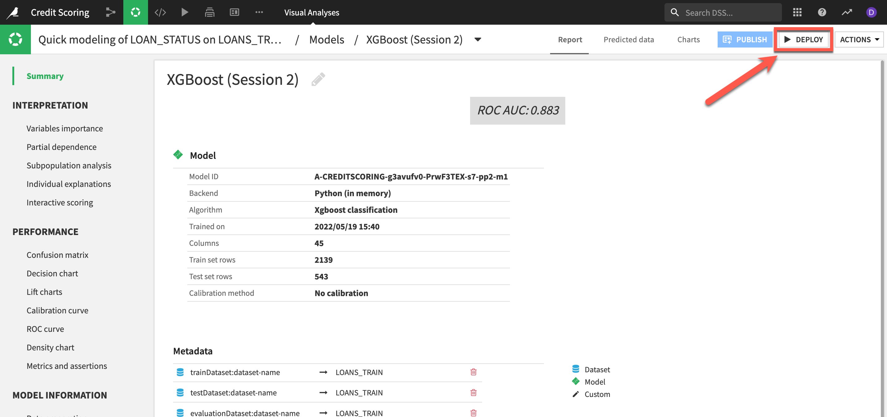

Your flow should now look like this:

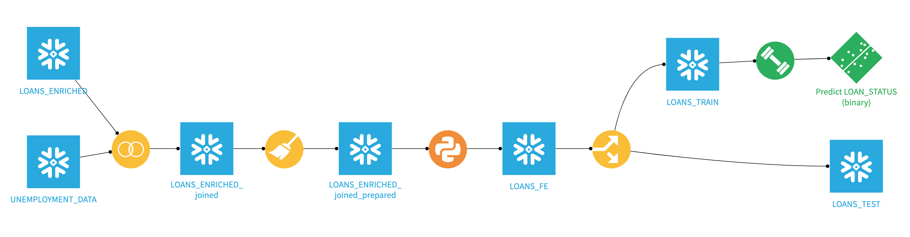


<!-- ------------------------ -->
## Scoring  
Duration: 8


* From your `Flow` select the `newly deployed model` (Green diamond) and the `Score` recipe from the `actions menu`

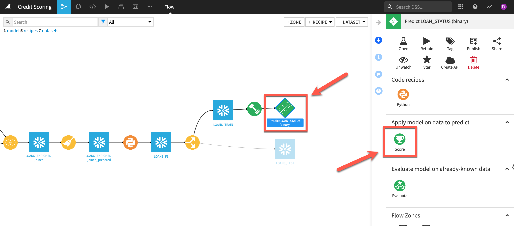

* Select your `LOANS_TEST` from the `Input dataset dropdown`. Leave the `Name` and `Store into` for the output as the defaults and click `CREATE RECIPE`


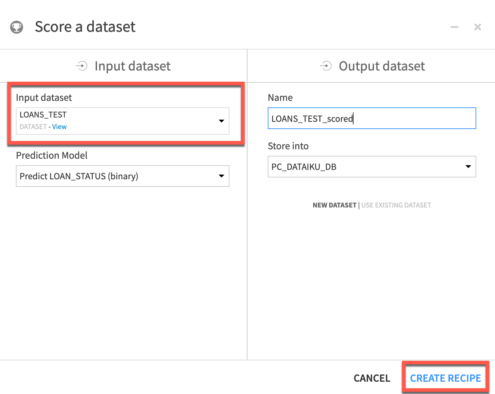

* Ensure `In-Database (Snowflake native)` is selected as the engine in order to use the Java UDF capability then click `RUN'


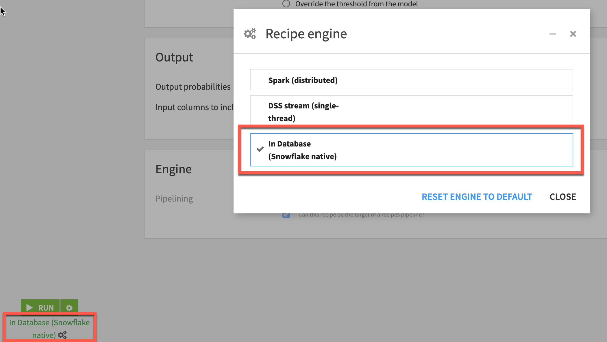

Your final project flow should now look like this.

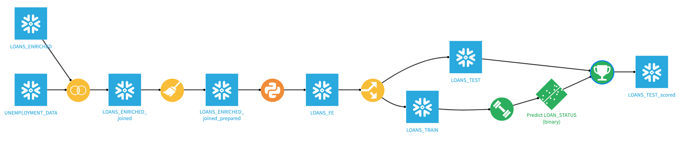

We can now We can see the results back on the Snowflake tab. If you hit the refresh icon near the top left of our screen by your databases, you should see the `CREDIT_SCORING_LOANS_TEST_SCORED` table that was created once we kicked off our prediction job. 

`Preview Data` will give you glimpse of additional column added to the list.

```

USE ROLE SYSADMIN;
USE DATABASE PC_DATAIKU_DB;
USE WAREHOUSE PC_DATAIKU_WH;
SELECT * 
FROM LOANS_TEST_SCORED_CREDITSCORING_1 
LIMIT 10;

```


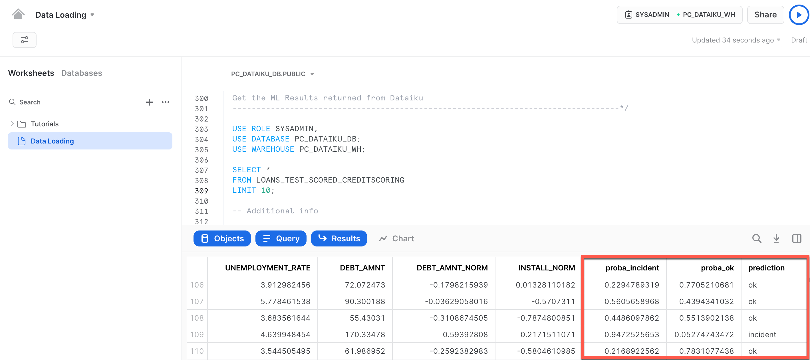

Additional info 

```
SELECT 
	EMP_TITLE ,
	SUM(CASE WHEN "prediction" = 'ok' THEN 1 ELSE 0 END) AS prediction_yes,
	SUM(CASE WHEN "prediction" = 'incident' THEN 1 ELSE 0 END) AS prediction_no
	FROM LOANS_TEST_SCORED_CREDITSCORING_1 
GROUP BY 
	EMP_TITLE 
order by prediction_yes DESC;

```


<!-- ------------------------ -->
## Conclusion and Next Steps  
Duration: 1

Congratulations  you have now successfully built,  deployed and scored your model results back to Snowflake. Your final flow should look like this.

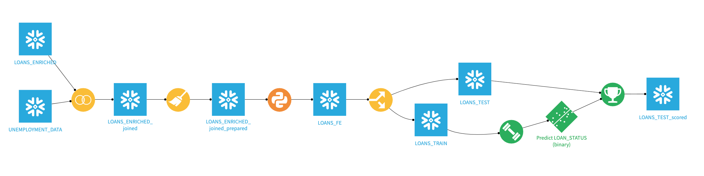

**What we have covered**

- Worked in Explored Snowflake interface

- Investigated Snowflake Marketplace

- Explored and transformed the data in Dataiku using visual tools understanding how to leverage Snowflake for both storage and compute

- Transformed the data using Python code (optionally using Snowpark)

- Built and refined an ML model

- Scored back results using Java UDF to Snowflake for further analysis

**Related Resources**

[SnowFlake University](http://https://community.snowflake.com/s/snowflake-university)

[Dataiku Academy](https://academy.dataiku.com/)


<!-- ------------------------ -->
## Appendix  


**To enable the anaconda libraries on snowflake account**

1.Create a new trial account on https://signup.snowflake.com

2.Login

3.Switch to ORGADMIN role

4.Go into Admin » Billing

5.Click on Terms & Billing, and enable Anaconda terms.

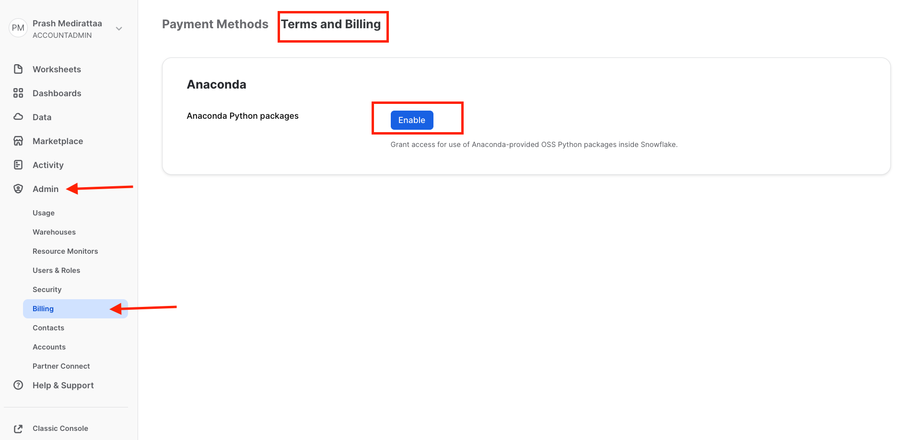
