author: sfc-gh-imehaddi
id: end_to_end_nlp_and_ml_using_snowpark_python_and_streamlit:_sentiments_analysis
summary: This is a sample Snowflake Guide
categories: Getting-Started
environments: web
status: Published 
feedback link: https://github.com/Snowflake-Labs/sfguides/issues
tags: Getting Started, Data Science, Data Engineering, Twitter 

NLP and ML with Snowpark Python and Streamlit for Sentiment Analysis
<!-- ------------------------ -->
## Overview 
Duration: 5

This Quickstart will demonstrate how you can perform Natural Language Processing (NLP) and ML within Snowflake using Snowpark Python and Streamlit. We'll use these tools to perform sentiment analysis with Snowpark (feature engineering, training, and prediction).

### Prerequisites
- Working knowledge of Python
- Familiarity with Snowflake

### What You’ll Learn 
- Do NLP and ML on Snowflake using Snowpark
- Load data into Snowflake
- Transform your data using Snowpark DataFrame API
- Train a scikit-learn model using Store Procedure inside Snowflake
- Deploy a model using UDF Function
- Inference with UDF Function
- Use Streamlit with Snowpark

### What You’ll Need 
- A Snowflake Account with ACCOUNTADMIN role. If you don't have one, you can register for a [free trial account](https://signup.snowflake.com/)
- [Git](https://git-scm.com/book/en/v2/Getting-Started-Installing-Git) installed 
- [Python 3.8](https://www.python.org/downloads/) installed 
- [Conda](https://docs.conda.io/projects/continuumio-conda/en/latest/user-guide/install/macos.html) Installed
- [GitHub](https://github.com/) Account
- [VSCode](https://code.visualstudio.com/download) Installed

### What You’ll Build
You will build an end-to-end Data Science workflow leveraging Snowpark for Python and Streamlit around the Sentiment Analysis use case.

<!-- ------------------------ -->
## Python Environment Setup

Duration: 8

This section covers cloning of the GitHub repository and creating a Python 3.8 environment.

### Clone GitHub repository
First, clone the source code for this repo to your local environment:

```shell
git clone https://github.com/Snowflake-Labs/snowpark-python-demos.git
cd snowpark_nlp_ml_demo/
```

### Setup Python Environment:
Create a conda environment. Let's name the environment nlp_ml_sentiment_analysis.

```shell
conda update conda
conda update python
conda env create -f ./snowpark-env/conda-env_nlp_ml_sentiment_analysis.yml  --force
```

### Snowflake Credentials
Update the Snowflake connection file: connection.json

```shell
{
    "account": "",
    "user": "",
    "password": "",
    "role": "ACCOUNTADMIN",
    "database": "IMDB",
    "schema": "PUBLIC",
    "warehouse": "DEMO_WH"
 }
```

### Activate Python environment using conda :
```shell
conda activate nlp_ml_sentiment_analysis
```

### Run Streamlit App :
```shell
cd streamlit
streamlit run Sentiment_Analysis_APP.py
```

The full code of the use case is also available in this Notebook **[Sentiment_Analysis_NLP_with_Snowpark_ML](https://github.com/Snowflake-Labs/snowpark-python-demos/blob/main/snowpark_nlp_ml_demo/notebook/Sentiment_Analysis_NLP_with_Snowpark_ML.ipynb)** 

```shell
cd notebook
jupyter notebook
```

<!-- ------------------------ -->
## Snowflake Environment Setup
Duration: 2

### Option 1 - Automatically : with Streamlit App
Use the Streamlit App to setup Snowflake Objects

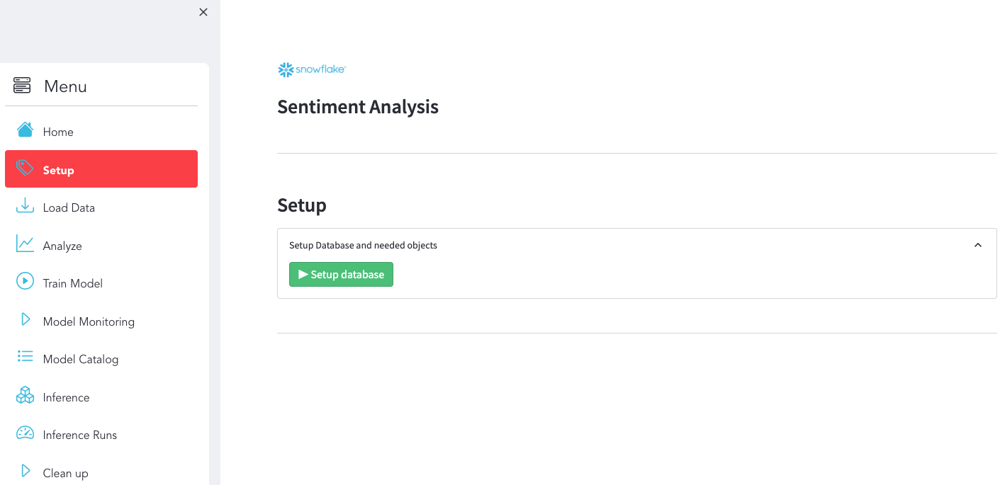

Make sure you have this result :

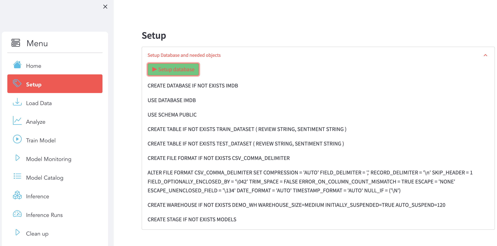

You can check directly with Snowsight that the data are available in Snowflake.

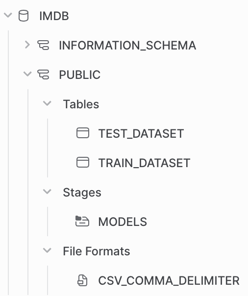

### Option 2 - Manually : with Snowsight
First, log into your Snowflake Account (Snowsight Web UI) using your credentials.

Then, run the following SQL commands to create the DATABASE :

```sql
USE ROLE ACCOUNTADMIN;

CREATE DATABASE if not EXISTS IMDB;
```

Run the following SQL commands to create the TABLES :
```sql
USE DATABASE IMDB;
USE SCHEMA PUBLIC;

CREATE TABLE if not EXISTS TRAIN_DATASET (
	REVIEW STRING,
	SENTIMENT STRING
);

CREATE TABLE if not EXISTS TEST_DATASET (
	REVIEW STRING,
	SENTIMENT STRING
);
```

Run the following SQL commands to create the WAREHOUSE :
```sql
CREATE WAREHOUSE if not EXISTS DEMO_WH WAREHOUSE_SIZE=MEDIUM INITIALLY_SUSPENDED=TRUE AUTO_SUSPEND=120;
```

Run the following SQL commands to create the STAGE :
```sql
CREATE STAGE if not EXISTS MODELS;

USE IMDB.PUBLIC;
```


<!-- ------------------------ -->
## Load Data
Duration: 5

We used Python code to load the data into Snowflake. In order to simplify code execution you can click on the right button to start loading the data.

### What You'll Do :

Use use the section **Load Data** :

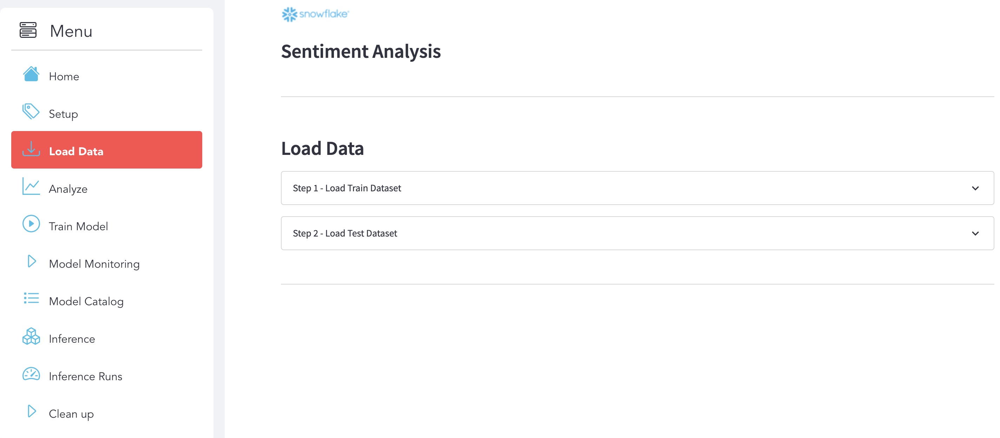

#### Step 1 : Load Train Dataset

Here is the display that we expect after the execution.

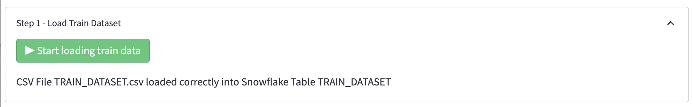

#### Step 2 : Load Test Dataset

Here is the display that we expect after the execution.

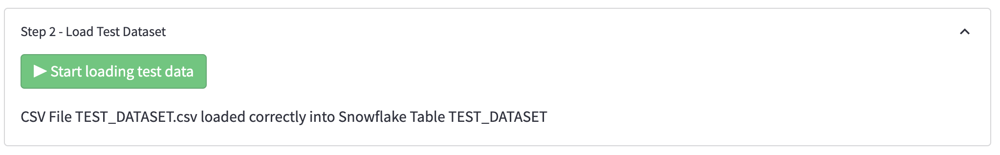

### What You'll Learn :

#### Load Data into Snowflake with Snowpark

```shell
with z.open("TRAIN_DATASET.csv") as f:
    pandas_df = pd.read_csv(f)
    session.write_pandas(pandas_df, "TRAIN_DATASET", auto_create_table=False, overwrite=True)
```

<!-- ------------------------ -->
## Analyze Data
Duration: 2

### What You'll Do :

Use the section **Analyze** to explore and analyze the datasets and see some metrics.

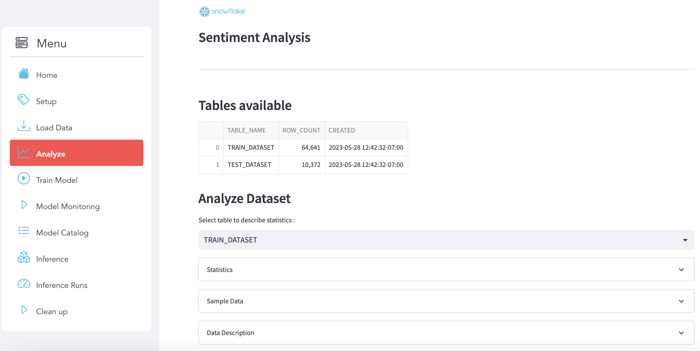

#### Select your data
Choose the dataset that you want to analyze:

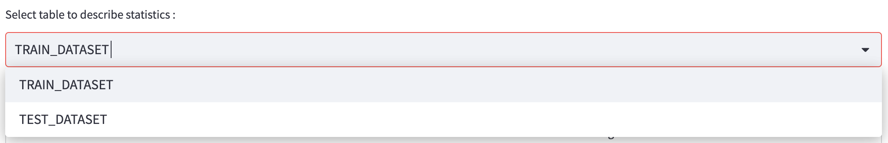

#### Stats
Here is some statistics related to the dataset :

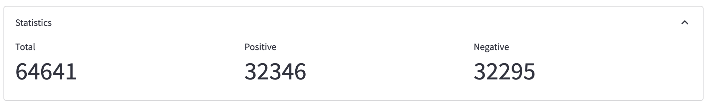

#### Sample Data
You can see a sample of data :

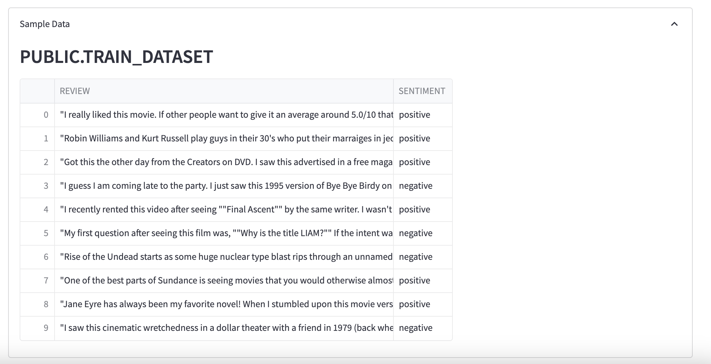

#### Data Description
Here a description of your dataset :

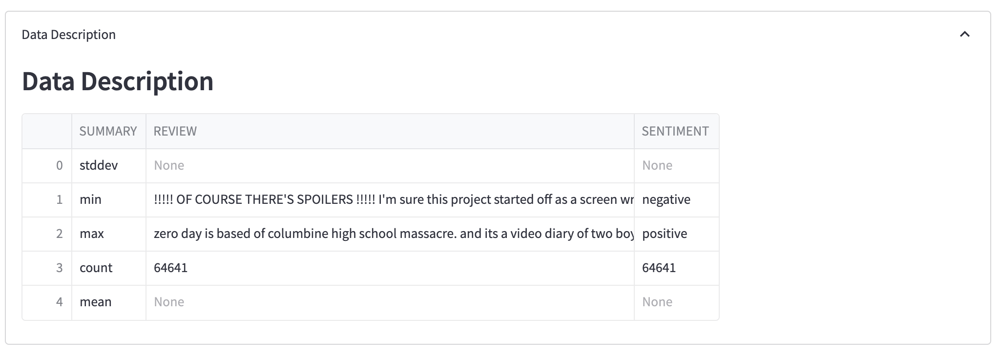

### What You'll Learn :

#### Analyze your dataset with Snowpark

```shell
table_to_print = "TRAIN_DATASET"

df_table = session.table(table_to_print)
df_table.count()

pd_table = df_table.limit(10).to_pandas()

pd_describe = df_table.describe().to_pandas()
```

---


<!-- ------------------------ -->
## Data Prep & Train Model
Duration: 5

### What You'll Do :

Use use the section **Train Model** :

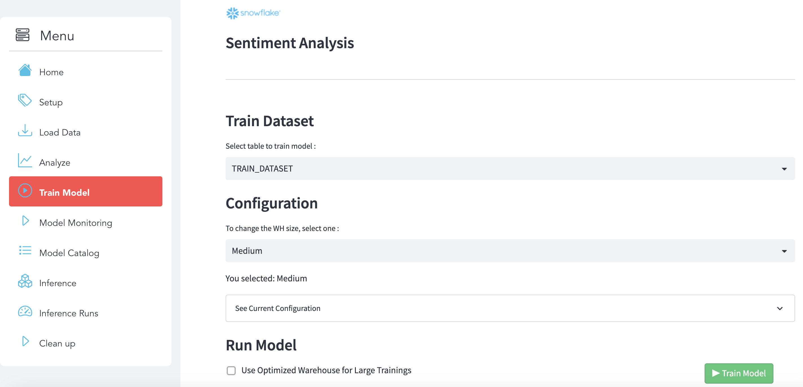

#### Step 1 : Select the dataset
Choose the training dataset to build the model :

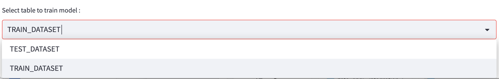

#### Step 2 : Select a Virtual Warehouse
Select a Virtual Warehouse :

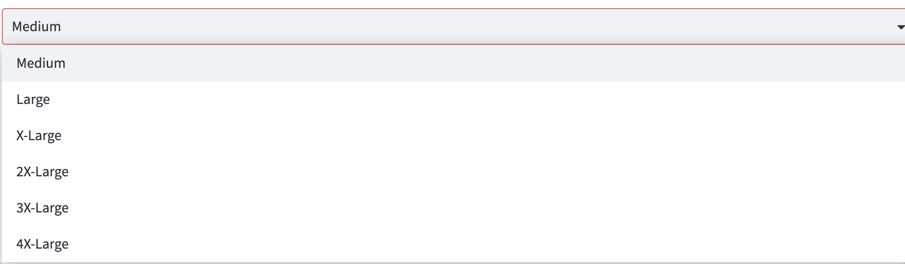

#### Step 3 : Check the configuration
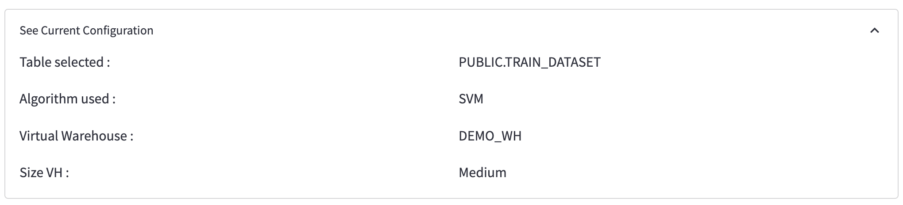

#### Step 4 : Run model

To run the model training, click on the button below:

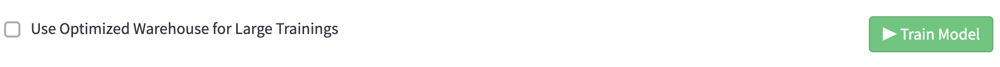


### What You'll Learn :

#### Create the training function

We created a function called train_model_review_pipline() :

```shell
def train_model_review_pipline(session : Session, train_dataset_name: str) -> Variant:
    ...
```

that will do the following steps :
- **Data Preperation**: using Snowpark DataFrame API, we will trasnform the data to make it ready for the training
- **Text Representation**: create the Matrix by leveraging Python libraries
- **Fit the Model**: Fit the model 
- **Save the Model**: Use stages and tables to ingest and organize raw data from S3 into Snowflake

#### Register the function as a Store Procedure

Then we registered the function as a Store Procedure :

```shell
session.sproc.register(func=train_model_review_pipline, name="train_model_review_pipline", replace=True)
```

#### Call the Stored Procedure

And use this code to call the SP that wil be execute the training into Snowflake with aSnowflake Virtual Warehouse :

```shell
session.call("train_model_review_pipline", "TRAIN_DATASET")
```

#### Deploy the model using an UDF Function
```shell
@udf(name='predict_review', session=session, is_permanent = False, stage_location = '@MODELS', replace=True)
    def predict_review(args: list) -> float:
        
        import sys
        import pandas as pd
        from joblib import load

        model = load_file("model_review.joblib")
        vec = load_file("vect_review.joblib")
            
        features = list(["REVIEW", "SENTIMENT_FLAG"])
        
        row = pd.DataFrame([args], columns=features)
        bowTest = vec.transform(row.REVIEW.values)
        
        return model.predict(bowTest)
```

---
<!-- ------------------------ -->
## Monitoring & Model Catalog
Duration: 2

### Monitore your execution using QUERY_HISTORY :

Use use the section **Model Monitoring**. You can use **Snowsight (Snowflake UI)** as well to get more details and see the **Query Details** and **Query Profile**.

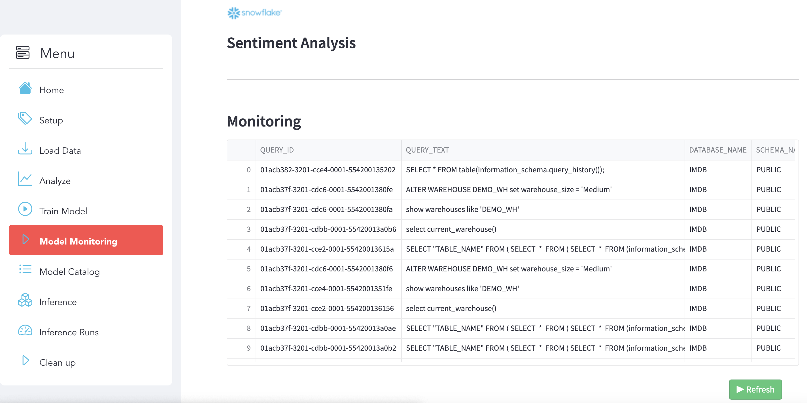

### Model Catalog :

Use use the section **Model Catalog**. Here you can see your models that you deployed and saved on Snowflake (Stage) :

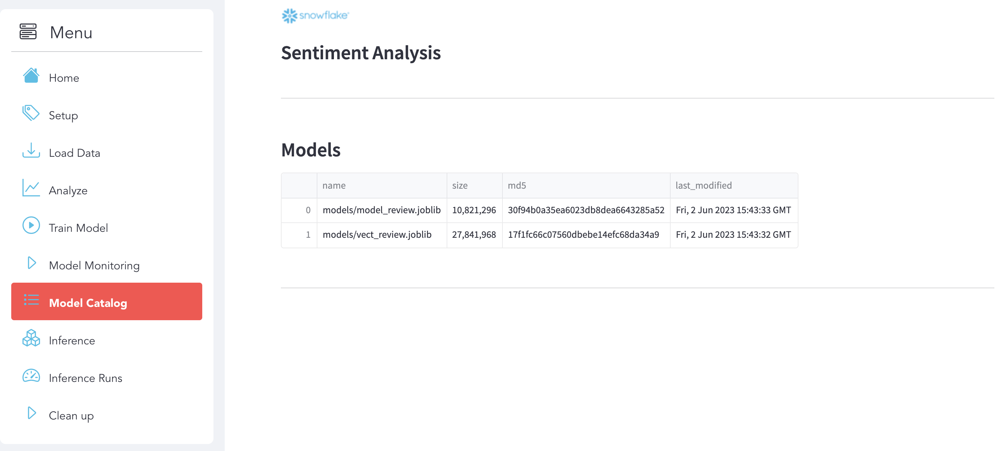


---
<!-- ------------------------ -->
## Inference & Prediction :
Duration: 6

### Inference :

Use use the section **Inference** to analyze the Test Dataset and see the Accuracy of your Model after the Inference.

**Analyze Test Dataset**
Click on the Test Dataset sub-section to explore the dataset.

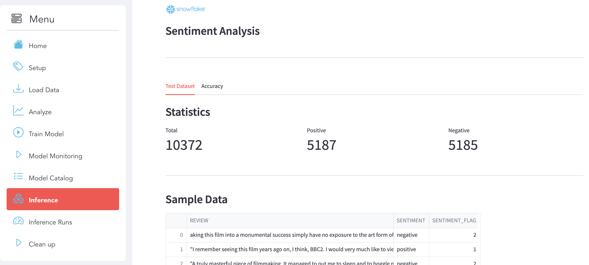

**Accuracy**
Click on the Accuracy sub-section to see the details.

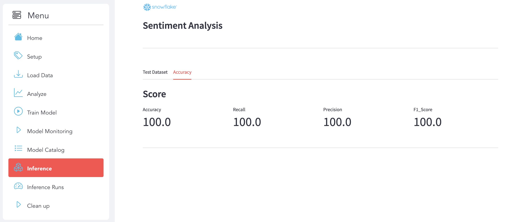

### Inference Runs :

Select the new dataset that you want to predict and the Inference will run automatically.

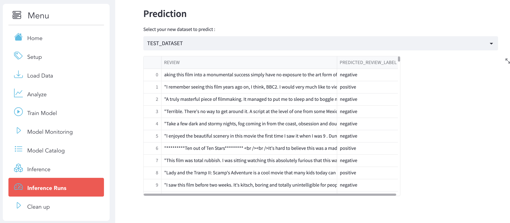


<!-- ------------------------ -->
## Cleanup
Duration: 1

Use the section to clean Up to remove all the Snowflake Objects and the Data that you already load :

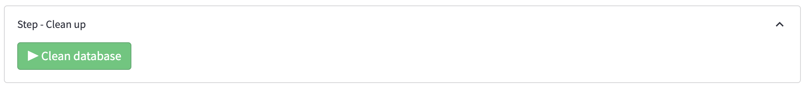


---
<!-- ------------------------ -->
## Conclusion & Resources
Duration: 3

Congratulations! You've successfully performed the Sentiment Analysis use case and built an end-to-end Data Science workflow leveraging Snowpark for Python and Streamlit.

In this quickstart we demonstrated how Snowpark Python enables rapid, end-to-end machine learning workload development, deployment, and orchestration. We were also able to experience how Snowpark for Python enables you to use familiar syntax and constructs to process data where it lives with Snowflake's elastic, scalable and secure engine, accelerating the path to production for data pipelines and ML workflows.

### What we've covered :
- Do NLP and ML on Snowflake using Snowpark
- Load data into Snowflake
- Transform your data using Snowpark DataFrame API
- Train a scikit-learn model using Store Procedure inside Snowflake
- Deploy a model using UDF Function
- Inference with UDF Function
- Use Streamlit with Snowpark

### More resources :
- [NLP and ML within Snowpark Python ans Streamlit - Blog](https://medium.com/snowflake/natural-language-processing-nlp-and-ml-within-100-snowflake-using-snowpark-python-43e654111319) 
- [PySpark vs Snowpark for ML in terms of Mindset and Approach - Blog](https://medium.com/snowflake/pyspark-versus-snowpark-for-ml-in-terms-of-mindset-and-approach-8be4bdafa547)
- [Snowpark Python Developer Guide](https://docs.snowflake.com/en/developer-guide/snowpark/python/index)
- [Snowpark Guide for Data Engineers'](https://www.snowflake.com/resource/the-data-engineers-guide-to-python-for-snowflake/)
