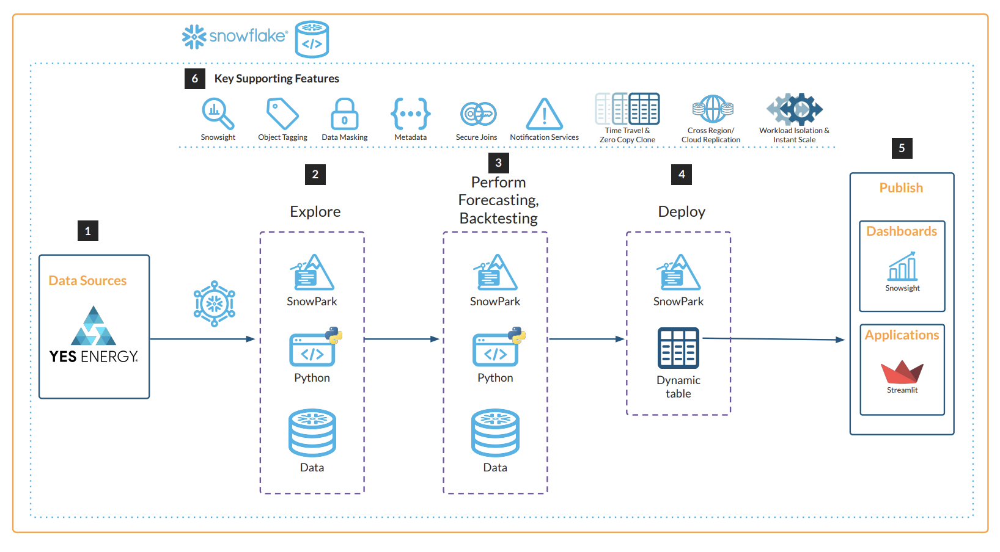

author: Naveen Alan
id: energy-price-forecasting-using-snowflake-native-app-and-snowpark-ml
summary: This solution architecture shows how to forecast wholesale energy prices with YesEnergy data from Snowflake Marketplace using Snowpark ML.
categories: snowflake-site:taxonomy/solution-center/certification/community-solution
environments: web
language: en
status: Published
feedback link: https://github.com/Snowflake-Labs/sfguides/issues
fork repo link: https://github.com/Snowflake-Labs/sf-samples/tree/main/samples/energy-price-forecasting-native-app

# Energy Price Forecasting using Snowflake Native App and Snowpark ML
<!-- ------------------------ -->
## Overview

This solution architecture shows how to forecast wholesale energy prices with YesEnergy data from Snowflake Marketplace using Snowpark ML.

* Get YesEnergy data from Snowflake Marketplace
* Use Snowpark for pre-processing, feature selection, and model training
* Build a Native application that deploys the XGBoost model for price prediction
* Build a Streamlit App for the User Interface

<!-- ------------------------ -->
## Solution Architecture: Forecasting Wholesale Energy Prices using Snowpark ML

* In this use-case, we develop accurate price forecasting models and develop new forecasts from these models (i.e. run inference) on an hourly schedule
* First, Snowflake environment is set up with access to YesEnergy data from Snowflake Marketplace
* Then we select the date range to be used for Training and Backtesting
* Perform price and spike forecasting and view the performance results
* Deploy the selected model, schedule the inference intervals and training

<!-- ------------------------ -->
## Get Started

- [view quickstart](https://medium.com/snowflake/nativeapp-and-snowflake-series-how-to-build-an-xgboost-forecasting-app-86a6860b8318)
- [fork repo](https://github.com/Snowflake-Labs/sf-samples/tree/main/samples/energy-price-forecasting-native-app)
- [Download reference architecture](https://www.snowflake.com/content/dam/snowflake-site/developers/2024/01/Wholesale-Energy-Price-Forecasting.pdf)
