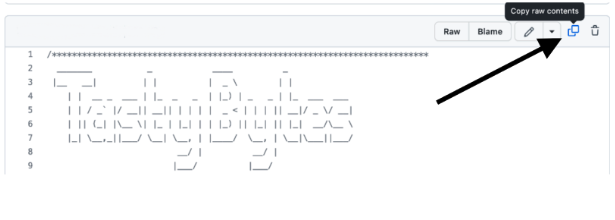

author: Kala Govindarajan
id: enhancing-customer-experiences-using-cortex-finetuning
categories: snowflake-site:taxonomy/solution-center/certification/quickstart, snowflake-site:taxonomy/product/ai, snowflake-site:taxonomy/snowflake-feature/ingestion/conversational-assistants
language: en
summary: Fine-tune LLMs with Snowflake Cortex for personalized customer experiences, domain-specific responses, and improved AI interactions.
environments: web
status: Published 
feedback link: https://github.com/Snowflake-Labs/sfguides/issues

# Enhancing Customer Experiences using Cortex Fine Tuning
<!-- ------------------------ -->

## Overview


### Overview

Tasty Bytes is a fictional global food truck enterprise that has established its presence in 30 cities spanning across 15 countries, boasting a network of 450 trucks offering 15 diverse menu types under various brands. Our mission at Tasty Bytes is committed to improve the Customer Experiences by leveraging the power of AI with Snowflake Cortex.

In this tutorial, we will build a customer support agent that showcases the power of Cortex Fine-Tuning and helps the Tasty Bytes team to respond with a highly accurate automated email to customer tickets, all with minimal resources and time. Fine-tuning has significantly advanced the Tasty Bytes team’s ability to meet the key objective which is nothing but enhancing customer experiences.

With Cortex Fine-Tuning, Snowflake users can harness the power of parameter-efficient fine-tuning (PEFT) to develop custom adaptors for specialized tasks using pre-trained models. This approach avoids the high cost of training a large model from scratch while achieving improved latency and performance compared to prompt engineering or retrieval-augmented generation (RAG) methods.

### Prerequisites
- Privileges necessary to create a user, database, and warehouse in Snowflake
- Access to run SQL in Snowflake
- Ability to install and run software on your computer
- Basic experience using git
- Intermediate knowledge of SQL

### What You Will Learn
- How to build an AI customer support Agent that delivers tailored, automated and natural responses to emails with both complete as well as partial information.
- How to use your unique data and create supervised dataset for fine tuning a model
- How to fine-tune a large language model (LLM) using Snowflake Cortex AI

### What You'll Need
- Snowflake Notebooks or Snowsight SQL Worksheet or any IDE of your choice
- A GitHub Account

### What You'll Build
- Fine tuned LLM to adapt for a domain specific business use case
- An automated AI agent for responding to customer emails in natural language with highest accuracy and efficiency.


## Creating a Worksheet and Copying the SQL
<!-- ------------------------ -->

We will be using the Tasty Bytes customer support emails data for the purpose of this tutorial. When customers reach out to the Tasty Bytes support team over email, it is often found that there was partially missing information in the emails. The first interaction coming from the customer support agent in these cases will be a clarification question to get the missing information from the customer to provide a more tailored support. In order to increase the efficiency and reduce the operational overhead, automation can be achieved to respond based on the completeness of the email. 

For example if there are required labels with missing values in the email, then an automated response can be sent to the customer asking for that information. In the case of the Tasty Bytes emails, city, truck or the menu item are values that an agent requires to process next steps for such cases. 

Within this Quickstart we will follow the above Tasty Bytes Customer Support center story via a Snowsight SQL Worksheet and this page will serve as a side by side guide with additional commentary, images and documentation links.
This section will walk you through logging into Snowflake, Creating a New Worksheet, Renaming the Worksheet, Copying SQL from GitHub, and Pasting the SQL we will be leveraging within this Quickstart.

**Step 1**. - Accessing Snowflake via URL

Open a browser window and enter the URL of your Snowflake Account

**Step 2**. - Logging into Snowflake

Log into your Snowflake account.

**Step 3**. - Navigating to Worksheets

Click on the Projects Tab in the left-hand navigation bar and click Worksheets.

**Step 4**. - Creating a SQL Worksheet

Within Worksheets, click the "+" button in the top-right corner of Snowsight.

**Step 5**. - Renaming a Worksheet

Rename the Worksheet by clicking on the auto-generated Timestamp name and inputting "Tasty Bytes - Cortex Fine Tuning"

**Step 6**. - Accessing Quickstart SQL from the  GitHub repo 

Click the button below which will direct you to our Tasty Bytes SQL file that is hosted on GitHub.

[Source Code](https://github.com/Snowflake-Labs/sfguide-enhancing-customer-experiences-using-cortex-finetuning/blob/main/scripts/setup.sql)

**Step 7**. - Copying Setup SQL from GitHub.

Within GitHub navigate to the right side and click "Copy raw contents". This will copy all of the required SQL into your clipboard. 




## Setup and Prepare Data
### NOTE : DO NOT CLICK RUN ALL OR HIGHLIGHT ALL THE CODE AND ATTEMPT RUNNING AT ONCE. The model creation job takes 5-10 minutes and the subsequent statements are dependent on the Job completion.

### Step 1 : Setup Database, Schema, role, warehouse,stage and tables.
To begin, let's execute all the DDL statements and setup various database objects. We will be creating a separate role and implementing access control for ensuring privacy and security.  Set the context.

- Set the Role context to CFT_ROLE
- Set the Warehouse context to CFT_WH
- Set the Database context to CFT_DB
- Set the schema CFT_SCHEMA

Once data has been added to a stage, let’s create a table called SUPPORT_EMAILS for storing the raw emails from the customers. This dataset will be used in the next phase of data preparation.

### Step 2 : Data Preparation- Build Train and Validation Dataset
The support emails contain a number of fields and we are more interested in required labels like truck and location, whether they are present or missing. If missing then the task for the LLM is to construct an email response that asks for clarification for the missing value. 
The goal of the data preparation step is to create a dataset that will be used to train the model and help it learn from the prompt/completion pairs and thus tune the LLM to make the automation agent parse and respond for future emails with right sense for missing and available annotations. The FINETUNE function expects the training data to come from a Snowflake table or view and the query result must contain columns named prompt and completion.
After loading the data into the SUPPORT_EMAILS table using the copy command with raw data with customer email and annotations.
Next step would be to build a function to construct the “completion” which will be a JSON response on the raw data. The BUILD_EXAMPLE function will help for the above task.
Now that the prompt and completion pairs are created, construct a training and a validation dataset from the base dataset. Using a Mod function on the Id field the Train and Test split can be built that will give a reproducible sample.
Cortex Fine Tuning job needs only a small number of samples and by some experiments, it was already evaluated that a sample size of 128 was a good one.

### Step 3: Create a fine-tuning job
The following code calls the FINETUNE function and uses the SELECT ... AS syntax to set two of the columns in the query result to prompt and completion. 

### Pasting Setup SQL from GitHub into your Snowflake Worksheet
Path back to Snowsight and your newly created Worksheet and Paste (CMD + V for Mac or CTRL + V for Windows) which we just copied from GitHub. 

```
SELECT SNOWFLAKE.CORTEX.FINETUNE(
    'CREATE', 
    -- Custom model name
    'SUPPORT_MISTRAL_7B',
    -- Base model name
    'mistral-7b',
    -- Training data query
    'SELECT BODY AS PROMPT, GOLDEN_JSON AS COMPLETION FROM FINE_TUNING_TRAINING',
    -- Validation data query 
    'SELECT BODY AS PROMPT, GOLDEN_JSON AS COMPLETION FROM FINE_TUNING_VALIDATION' 
);
```

To describe the properties of a fine-tuning job. If the job completes successfully, additional details about the job are returned, including the final model name. Wait for about 5-10 minutes for the state to move to Completed.
```
Select SNOWFLAKE.CORTEX.FINETUNE(
  'DESCRIBE',
  '<>' -- replace the placeholder with the output from the previous statement
);

#### The model creation job takes 5-10 minutes and the subsequent statements are dependent on the Job completion. Wait until the Output moves to "SUCCESS" status indicating successful creation of the fine tuned model. 

Sample Output of the Job Status showing successful Job Completion:
{"base_model":"mistral-7b","created_on":1718917728596,"finished_on":1718917883007,"id":"CortexFineTuningWorkflow_6dad71ea-1233-4193-1233424535","model":"SUPPORT_MISTRAL_7B\","progress":1.0,"status":"SUCCESS","training_data":"SELECT BODY AS PROMPT, GOLDEN_JSON AS COMPLETION FROM TRAINING","trained_tokens":112855,"training_result":{"validation_loss":0.8271147012710571,"training_loss":0.8407678074306912},"validation_data":""}
```

Once the Status turns to "SUCCESS" we will create a function to compute the accuracy of the returned outputs by the Fine Tuned model.

```
CREATE OR REPLACE FUNCTION ACCURACY(candidate STRING, reference STRING)
RETURNS number
LANGUAGE SQL
AS
$$
DIV0(SUM(IFF(
    EQUAL_NULL(
        reference, 
        candidate
    ),
    -- THEN
    1,
    -- ELSE
    0
)), COUNT(*))
$$
;
```

Click Next –>

## Evaluate the Output

```

CREATE OR REPLACE TABLE FINE_TUNING_VALIDATION_FINETUNED AS (
    SELECT
        -- Carry over fields from source for convenience.
        ID, BODY, LABELED_TRUCK, LABELED_LOCATION,
        -- Run the custom fine-tuned LLM.
        SNOWFLAKE.CORTEX.COMPLETE(
            -- Custom model
            'SUPPORT_MISTRAL_7B', 
            body 
        ) AS RESPONSE
    FROM FINE_TUNING_VALIDATION
);

```
The FINE_TUNING_VALIDATION_FINETUNED table contains the output by leveraging the Fine Tuned Model on the response body of the email. Further using the ACCURACY() function the accuracy score using the Fine Tuned Model with the Cortex COMPLETE Function is determined.


### Cleanup
Navigate to Snowsight Worksheets, click "+" in the top-right corner to create a new Worksheet, and choose "SQL Worksheet". Paste and run the following SQL in the worksheet to drop Snowflake objects created in the Quickstart.

```
USE ROLE SYSADMIN;
DROP DATABASE CFT_DB;
DROP WAREHOUSE CFT_WH;

USE ROLE securityadmin;
DROP ROLE CFT_ROLE;
```

Snowflake Cortex Fine-Tuning function incurs compute cost based on the number of tokens used in training. To get an estimate of the cost for the Fine Tuning job, refer to the consumption table for each cost in credits per million tokens. Also there are normal storage and warehouse costs applicable for storing the output customized adaptors, as well as for running any SQL commands.

## Conclusion and Resources

### Conclusion
You did it! You have successfully completed the Tasty Bytes Enhancing Customer Experiences using Cortex Fine Tuning - Quickstart.
By doing so you have learned how to:
- Fine tune LLM to adapt for a domain specific business use case
- Build an automated AI agent for responding to customer emails in natural language with highest accuracy and efficiency.

### Resources

- #### [Customer Reviews Analytics using Snowflake Cortex](/en/developers/guides/customer-reviews-analytics-using-snowflake-cortex/)

- #### [Tasty Bytes - Customer Support Streamlit Application Powered by Cortex](/en/developers/guides/tasty-bytes-customer-support-email-app/)

- #### [Tasty Bytes - Enhance Customer Experience Streamlit App](/en/developers/guides/tasty-bytes-customer-experience-app/)

- #### [Build Rag Based Equipment Maintenance App Using Snowflake Cortex](/en/developers/guides/build-rag-based-equipment-maintenance-app-using-snowflake-cortex/)
