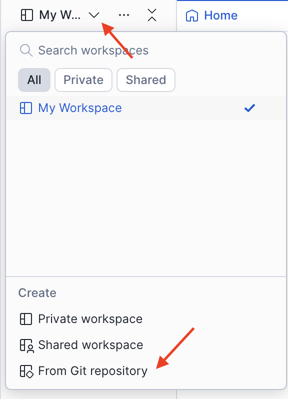
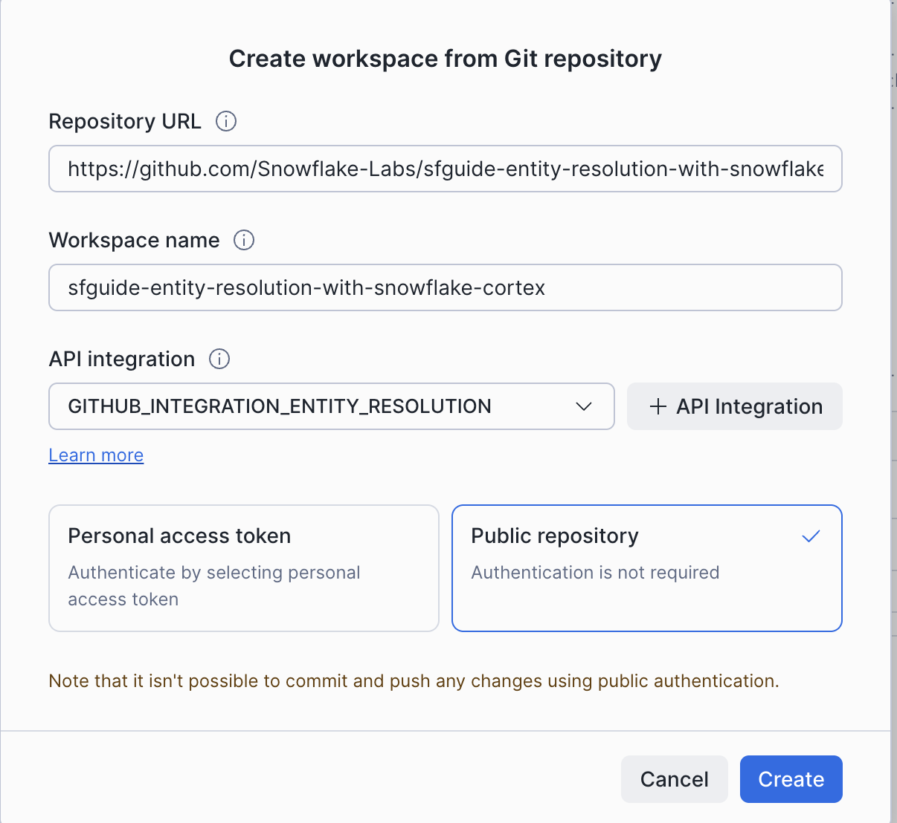
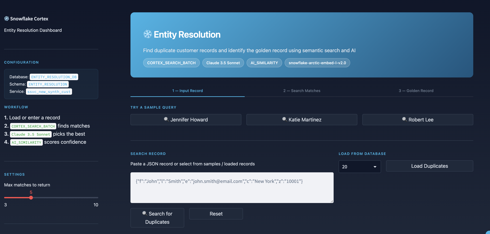
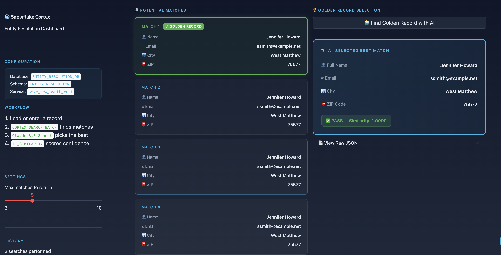

author: Luke Ambrosetti, Dureti Shemsi
language: en
id: entity-resolution-with-snowflake-cortex
summary: Build an AI-powered entity resolution system using Snowflake Cortex Search and AI Complete to deduplicate customer records and identify golden records.
categories: snowflake-site:taxonomy/product/ai, snowflake-site:taxonomy/snowflake-feature/cortex-search, snowflake-site:taxonomy/snowflake-feature/cortex-llm-functions, snowflake-site:taxonomy/snowflake-feature/applied-analytics, snowflake-site:taxonomy/snowflake-feature/snowpark, snowflake-site:taxonomy/solution-center/certification/quickstart, snowflake-site:taxonomy/solution-center/certification/certified-solution
environments: web
status: Published
feedback_link: https://github.com/Snowflake-Labs/sfguides/issues
fork_repo_link: https://github.com/Snowflake-Labs/sfguide-entity-resolution-with-snowflake-cortex


# Entity Resolution with Snowflake Cortex


## Overview

Organizations accumulate customer data from e-commerce sites, point-of-sale systems, marketing campaigns, support tickets, and partner integrations. Each source introduces duplicate records, data entry errors, format inconsistencies, and incomplete fields. The result: inflated customer counts, wasted marketing spend on duplicate outreach, inaccurate lifetime value calculations, and compliance risks with data privacy regulations.

Traditional rule-based fuzzy matching is rigid, misses nuanced similarities, requires constant threshold tuning, and breaks with new corruption patterns. This guide demonstrates a modern approach using Snowflake Cortex AI to resolve entities intelligently, with no manual rules to maintain.

You will build an end-to-end entity resolution system that uses Cortex Search for semantic duplicate detection and AI Complete (Claude 3.5 Sonnet) for AI-powered golden record selection, all within Snowflake.

### Prerequisites
- A [Snowflake trial account](https://signup.snowflake.com/) or existing account with ACCOUNTADMIN role
- Snowflake Cortex AI features enabled
- Basic knowledge of SQL

### What You'll Learn
- How to generate realistic synthetic duplicate data with controlled corruption patterns
- How to create a Cortex Search Service with Arctic embeddings for semantic similarity
- How to use CORTEX_SEARCH_BATCH for scalable batch entity resolution
- How to use AI Complete (Claude 3.5 Sonnet) to select golden records from duplicate candidates
- How to validate results with AI_SIMILARITY scoring

### What You'll Build
- A synthetic dataset of ~87,500 customer records from 20,000 unique individuals with realistic duplicates
- A Cortex Search Service for AI-powered duplicate detection
- A batch entity resolution pipeline using CORTEX_SEARCH_BATCH
- An LLM-powered golden record selector with quality scoring
- An interactive Streamlit application for testing and visualization


## Setup and Data

This section provisions the infrastructure, generates synthetic data, and creates the Cortex Search Service.

### Run the Setup Script

1. Open Snowflake and navigate to **Projects > Worksheets**
2. Click **+ Worksheet** to create a new SQL worksheet
3. Copy and paste the setup script from the [GitHub repository](https://github.com/Snowflake-Labs/sfguide-entity-resolution-with-snowflake-cortex/blob/main/scripts/setup.sql)
4. Run the entire script as **ACCOUNTADMIN**

> **Note on Privileges:** This guide uses ACCOUNTADMIN for simplicity in demo and learning environments. For production deployments, follow the principle of least privilege by creating a dedicated role with only the specific grants required.

The setup script creates the following:

| Component | Details |
|---|---|
| Role | ENTITY_RESOLUTION_ROLE with Cortex AI permissions |
| Warehouse | ENTITY_RESOLUTION_WH (Medium) |
| Database | ENTITY_RESOLUTION_DB with ENTITY_RESOLUTION schema |
| Compute Pool | ENTITY_RESOLUTION_COMPUTE_POOL (CPU_X64_S) for notebook container runtime |
| UDTF | GENERATE_DUPLICATE_CUSTOMER_RECORDS (Python, Faker) |
| Tables | CUSTOMER_DUPLICATES (~87,500 rows), CUST_ARR (JSON-formatted for search) |
| Search Service | SSVC_NEW_SYNTH_CUST using snowflake-arctic-embed-l-v2.0 |
| Streamlit App | ENTITY_RESOLUTION_APP deployed from Git |

### Understanding the Synthetic Data

The UDTF generates records for 20,000 unique individuals distributed across 5 source lists:

| Segment | Count | Behavior |
|---|---|---|
| Perfect matches | 10,000 people (50%) | Identical records across all 5 lists |
| Imperfect, all lists | 5,000 people (25%) | 1 golden record + 4 corrupted versions across all 5 lists |
| Imperfect, some lists | 5,000 people (25%) | 1 golden record + 0-3 corrupted versions in 1-4 lists |

Corruption patterns include a 30% field corruption rate on name, email, and phone fields, a 20% chance of complete address replacement, and realistic errors such as typos, formatting changes, truncations, and character substitutions.


## Explore the Data

Open the notebook to begin the interactive walkthrough.

### Create a Workspace

1. In Snowsight, navigate to **Projects > Workspaces**
2. Click the dropdown arrow next to your workspace name, then under **Create**, select **From Git repository**



3. Configure the workspace:
   - Repository URL: `https://github.com/Snowflake-Labs/sfguide-entity-resolution-with-snowflake-cortex`
   - API Integration: Select `GITHUB_INTEGRATION_ENTITY_RESOLUTION`
   - Repository type: Select **Public**



4. Click **Create**

### Open and Connect the Notebook

1. In your workspace, open `notebooks/0_start_here.ipynb`
2. Click **Connect** and configure:
   - Compute pool: ENTITY_RESOLUTION_COMPUTE_POOL
   - Idle timeout: 1 hour
3. Set the notebook context:
   - Role: ENTITY_RESOLUTION_ROLE
   - Database: ENTITY_RESOLUTION_DB
   - Schema: ENTITY_RESOLUTION
   - Warehouse: ENTITY_RESOLUTION_WH

### Explore the Dataset

Run the first few cells to understand the data. Sample records show the variety of corruption patterns:

```sql
SELECT * FROM customer_duplicates ORDER BY RANDOM() LIMIT 10;
```

Each record includes LIST_ID (source), PERSON_ID (true identity), PERSON_TYPE (perfect/imperfect), and the customer fields (name, email, phone, city, state, zip). The PERSON_TYPE column reveals how each record was generated, making it possible to evaluate resolution accuracy.


## Cortex Search Service

The Cortex Search Service powers the semantic duplicate detection. It was created by the setup script, but understanding how it works is essential.

### How It Works

Customer records are transformed into compact JSON for optimal embedding:

```json
{"f":"John","l":"Smith","e":"john.smith@email.com","c":"New York","z":"10001"}
```

The search service indexes these JSON strings using the snowflake-arctic-embed-l-v2.0 embedding model, which captures semantic meaning rather than exact text matches. This means a search for "Jon Smth" will still find "John Smith" because the embeddings are semantically similar.

```sql
CREATE OR REPLACE CORTEX SEARCH SERVICE SSVC_NEW_SYNTH_CUST
  ON full_string
  WAREHOUSE = ENTITY_RESOLUTION_WH
  TARGET_LAG = '1 day'
  EMBEDDING_MODEL = 'snowflake-arctic-embed-l-v2.0'
  AS (
    SELECT full_string, list_id, last_updated_date
    FROM CUST_ARR
  );
```

Key parameters:
- `ON full_string` — the column to index and search against
- `TARGET_LAG` — incremental refresh cadence (similar to dynamic tables)
- `EMBEDDING_MODEL` — Arctic embeddings optimized for semantic similarity with large context windows


## Batch Entity Resolution

This is the core of the scalable deduplication pipeline. Instead of searching one record at a time, CORTEX_SEARCH_BATCH processes multiple records in a single query using lateral joins.

### Run Batch Search

In the notebook, run the batch search cell to process 20 sample records and find the top 5 matches for each:

```sql
CREATE OR REPLACE TABLE new_synth_results AS
WITH query_table AS (
    SELECT full_string AS query
    FROM cust_arr
    LIMIT 20
)
SELECT q.query, s.*
FROM query_table AS q,
LATERAL CORTEX_SEARCH_BATCH(
    service_name => 'ENTITY_RESOLUTION_DB.ENTITY_RESOLUTION.ssvc_new_synth_cust',
    query        => q.query,
    limit        => 5
) AS s;
```

This produces a result set with each query record paired with its top 5 semantic matches. The lateral join pattern scales to millions of records.

### Reshape for LLM Analysis

Next, pivot the results so each row contains one query and its 5 match candidates:

```sql
CREATE OR REPLACE TABLE batch_search_group AS
WITH batch_group AS (
    SELECT query AS init_query, ARRAY_AGG(full_string) arr
    FROM new_synth_results
    GROUP BY 1
)
SELECT
    init_query,
    arr[0]::VARCHAR AS match_1,
    arr[1]::VARCHAR AS match_2,
    arr[2]::VARCHAR AS match_3,
    arr[3]::VARCHAR AS match_4,
    arr[4]::VARCHAR AS match_5
FROM batch_group;
```


## Golden Record Selection

With candidates identified, AI Complete (Claude 3.5 Sonnet) evaluates each set of matches and selects the single best golden record.

### How the LLM Evaluates Candidates

The prompt instructs Claude to:

1. Analyze the initial query record
2. Evaluate each candidate for similarity to the query, correctness of city/ZIP data, and completeness of fields
3. Return only the best matching JSON record with no explanation

The LLM reasoning handles nuances that rule-based systems miss: a candidate with a correctly spelled city and valid ZIP code is preferred over one that matches the query exactly but contains errors.

### Run Golden Record Selection with Quality Scoring

The final notebook cell chains AI Complete with AI_SIMILARITY for end-to-end resolution and validation:

```sql
WITH find_best_record AS (
    SELECT
        init_query,
        SNOWFLAKE.CORTEX.COMPLETE('claude-3-5-sonnet', [
            {'role': 'system', 'content': '<system prompt>'},
            {'role': 'user', 'content': '**Initial Record:**' || init_query ||
             '\n\n**Potential Matches:** [' || match_1 || ',' || match_2 ||
             ',' || match_3 || ',' || match_4 || ',' || match_5 || ']'}
        ], {'max_tokens': 300}) AS correct_record,
        TRY_PARSE_JSON(correct_record:"choices"[0]:"messages") AS final_json_record
    FROM batch_search_group
),
similarity_check AS (
    SELECT
        init_query,
        final_json_record,
        AI_SIMILARITY(init_query::VARCHAR, final_json_record::VARCHAR) AS cosine_similarity
    FROM find_best_record
)
SELECT
    init_query,
    final_json_record,
    cosine_similarity,
    CASE
        WHEN cosine_similarity >= 0.85 THEN 'PASS'
        WHEN cosine_similarity >= 0.70 THEN 'REVIEW'
        ELSE 'FAIL'
    END AS quality_flag
FROM similarity_check
ORDER BY cosine_similarity ASC;
```

### Understanding the Quality Flags

| Flag | Similarity | Interpretation |
|---|---|---|
| PASS | >= 0.85 | High confidence match |
| REVIEW | 0.70 - 0.84 | Medium confidence, may need manual review |
| FAIL | < 0.70 | Low confidence, likely not the same entity |

AI_SIMILARITY uses the same snowflake-arctic-embed-l-v2 model as the search service, ensuring consistent semantic scoring across the pipeline.


## Streamlit Application

The setup script deploys a Streamlit application for interactive testing and demonstration.

### Launch the App

Navigate to **Snowsight > Streamlit** and open ENTITY_RESOLUTION_APP, or confirm it exists:

```sql
SHOW STREAMLITS IN SCHEMA ENTITY_RESOLUTION_DB.ENTITY_RESOLUTION;
```

### Features

The app provides a visual interface for the entire entity resolution workflow:

1. Load Duplicates — fetch sample records directly from the database (10, 20, 50, or 100 records) and click any record to search for its duplicates.

2. Manual Search — enter a customer record in JSON format and search for semantic matches. Choose from sample queries or paste your own record.



3. View Matches — results are ranked by semantic similarity, with each match showing name, email, city, and ZIP.

4. AI Golden Record — click "Find Golden Record with AI" to let Claude 3.5 Sonnet analyze all matches and select the best record, considering similarity, data correctness, and completeness.




## Cleanup

To remove all resources created by this guide, copy and paste the [teardown script](https://github.com/Snowflake-Labs/sfguide-entity-resolution-with-snowflake-cortex/blob/main/scripts/teardown.sql) into a SQL worksheet and run it as **ACCOUNTADMIN**.


## Conclusion and Resources

You have built a complete entity resolution system using Snowflake Cortex AI capabilities.

### What You Learned
- Cortex Search with Arctic embeddings provides semantic duplicate detection that handles typos, format variations, and incomplete data without manual rules
- CORTEX_SEARCH_BATCH with lateral joins scales entity resolution to process millions of records efficiently
- AI Complete (Claude 3.5 Sonnet) selects golden records by reasoning about similarity, data correctness, and completeness
- AI_SIMILARITY provides a consistent quality score for validating resolution results

### Resource Links
- [Batch Cortex Search Documentation](https://docs.snowflake.com/en/user-guide/snowflake-cortex/cortex-search/batch-cortex-search)
- [Cortex Search Documentation](https://docs.snowflake.com/en/user-guide/snowflake-cortex/cortex-search/cortex-search-overview)
- [AI Complete Documentation](https://docs.snowflake.com/en/sql-reference/functions/complete-snowflake-cortex)
- [AI_SIMILARITY Documentation](https://docs.snowflake.com/en/sql-reference/functions/ai_similarity)
- [Cross-Region Cortex Inference](https://docs.snowflake.com/en/user-guide/snowflake-cortex/cross-region-inference)
- [Streamlit in Snowflake Documentation](https://docs.snowflake.com/en/developer-guide/streamlit/about-streamlit)
