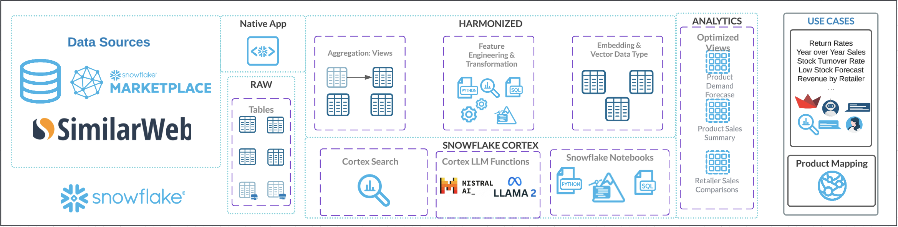
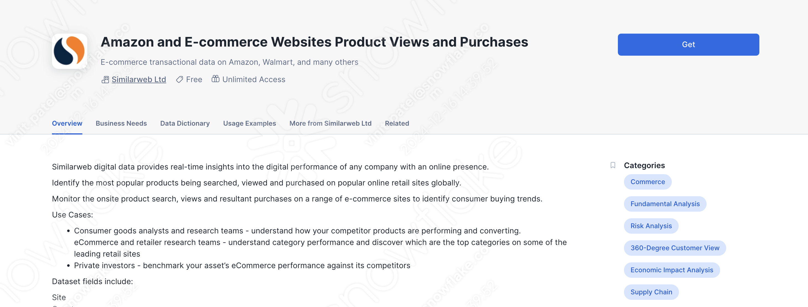
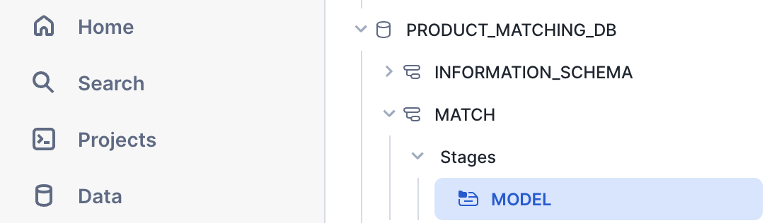
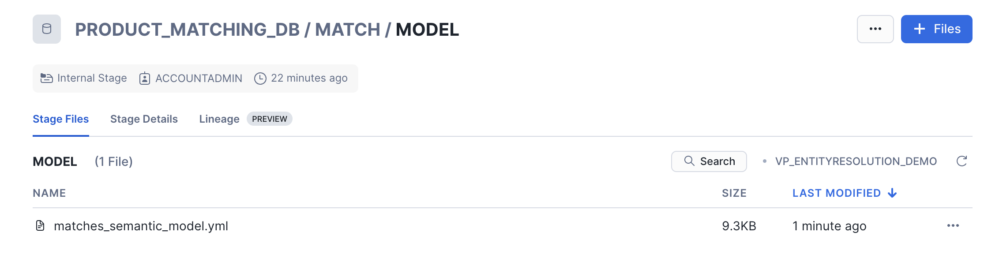

author: Vinit Patel
id: getting-started-with-entity-resolution-retail-product-classification-for-aggregated-insights
summary: This application provides a centralized, AI-driven approach to match products across retailer and e-commerce catalogs to aggregate data, with the potential to enable competitve price tracking, enhanced supply chain management and much, much more.
categories: Getting-Started, Cortex
environments: web
status: Published 
feedback link: https://github.com/Snowflake-Labs/sfguides/issues
tags: GenAI, Data Engineering, Snowpark, Snowflake Cortex
# Getting Started with Entity Resolution: Retail Product Classification for Aggregated Insights
<!-- --------------------------->
## Overview


**Duration: 3 minutes**
Retailers and e-commerce platforms often face challenges in aggregating data about their products, which limits them in various aspects such as supply chain management, competitive pricing, demand forecasting, inventory optimization and much, much more. The root of this issue can be attributed to the lack of standardized UPCs or product descriptions across these various retailers and e-commerce platforms, resulting in a complex system that creates a need for companies to spend hundreds of thousands on DBT jobs or various other approaches to harmonizing their product data. 

Addressing these challenges with a centralized, AI-driven approach can empower these retailers to gain actionable insights off their product perforamnce based on the data available.

Built using Snowflake Cortex, this guide demonstrates the process of entity resolution to achieve product matches with Snowflake Cortex, and developing a Streamlit chatbot assistant to query and analyze the provided product data without the direct need for SQL.


This guide covers:
- **Data Harmonization**: Addressing inconsistencies in product descriptions, codes, and categories between retailers to create a unified dataset.
- **Product Matching**: Generating embeddings off of cleaned product descriptions, and identifying likely matches using cosine similarity.
- **Validation with AI**: Leveraging Snowflake’s LLM integration to validate matches and provide justification on rejected matches.
- **Interactive Insights**: Building a chatbot to easily obtain actionable insights on performance metrics, such as purchases and views.

### What You Will Learn
- How to use [Snowflake Notebooks](https://docs.snowflake.com/en/user-guide/ui-snowsight/notebooks) and [Snowpark Python](https://docs.snowflake.com/en/developer-guide/snowpark/python/index) for data processing

- How to use [Cortex LLM functions](https://docs.snowflake.com/en/user-guide/snowflake-cortex/llm-functions) (Cortex Complete) for access to industry-leading large language models (LLMs)

- How to build a chatbot application using [Streamlit](https://docs.streamlit.io/) in Snowflake

### Prerequisites
- A [GitHub](https://github.com/) Account

- A Snowflake account with a role that has the ability to create database, schema, tables, stages, user-defined functions, and stored procedures. If not, you will need to register for a [free trial](https://signup.snowflake.com/?_fsi=OuImfiWC&_fsi=OuImfiWC&_fsi=05dxBvxS&_fsi=05dxBvxS) or use a different role.

### What You Will Build

- A Notebook to process and harmonize product data

- A Streamlit application to interact with the aggregated data and extract actionable insights

<!-- --------------------------->
## Architecture
**Duration: 3 minutes**

The architecture of the Entity Resolution solution is designed to generate and validate product matches. 

Here's a detailed walkthrough of how we use Snowflake's AI/ML features to complete this workflow:



**Preprocessing Data**: This begins with the ingestion of data into Snowflake. Data sources include product UPCs, descriptions, and performance on company websites, measured by estimated view and purchase data from various retailers and e-commerce platforms. Organized tables are created to provide two product catalogs to match between. The descriptions of the products are cleaned, having special characters removed so they do not influence feature extraction.

**Extracting Features**: Snowflake Notebooks are leveraged to provide an integrated development environment where SQL and Python are used to query, manipulate, and prepare the data. This automates the extraction of relevant features, ensuring that data from various sources is consolidated and ready for subsequent steps. In our case, the cleaned product descriptions from the last step are used to create vector embeddings via Snowflake's `EMBED_TEXT_768` function. 

**Embedding-Based Matching**: After extracting feature-rich embeddings for product descriptions, the next step involves leveraging these dense vector representations to measure similarity between items. Vector similarity metrics such as cosine similarity are calculated to identify matching items; this approach enables precise product matching even when descriptions vary in format or content. Pairs of products that have a similarity score over a 0.9 are listed as proposed product matches for further review. Embedding-based matching plays a critical role in resolving entities and linking products effectively, ensuring a robust matching framework in diverse datasets.

**Reviewing Product Matches via Cortex Complete**: To enhance the accuracy and contextual understanding of product matches, proposed matches are fed into a large language model (LLM) through Snowflake's Cortex Complete functionality. This advanced step provides an additional layer of review, where the LLM determines whether a proposed match should be approved or rejected. Each product pair is fed to the LLM along with relevant metadata, which evaluates these inputs and approves matches where the descriptions, brands, and other attributes align. For rejected matches, the LLM identifies and generates a detailed list of differences, providing clarity on the mismatched attributes such as size, model, or additional features. Upon approval, the LLM generates a unified product title that consolidates the key features of both items in the pair. Additionally, it outputs a unified product category and a harmonized brand name, ensuring consistency across downstream systems. This structured output facilitates seamless integration into reporting, cataloging, and supply chain processes. By leveraging the natural language understanding capabilities of an LLM, this approach not only automates the validation of matches but also provides insightful outputs to improve the product-matching pipeline. Snowflake's Cortex Complete ensures secure and scalable integration of the LLM into the workflow, enabling high-quality reviews at scale. The end result of this step is a table of processed product matches, which we can then split into tables of approved and rejected matches.

**Interacting with Data via Streamlit**: With the processed matches now stored in tables, our matched products are ready! Our original data had information about product performance on the websites of retailers and e-commerce platforms in the form of estimated views and purchases. This data is now available for the same product at two different retailers in our table. But, to make these insights accessible, we are leveraging Streamlit to build an interactive chatbot using Snowflake's Cortex Analyst. Streamlit provides a user-friendly interface where business users can explore the finalized dataset using natural language, converted to SQL queries by Analyst, and returned in natural language for easy interpretation. This demo involves various teams and personas across retail and e-commerce, not all of which may know how to interact with the data using code. This Streamlit application removes the need to do so, allowing professionals in supply chain, competitive intelligence, and so on to have access to aggregated product data and insights!

This architecture integrates various Snowflake features to create a robust end-to-end AI solution. From data ingestion and preprocessing to LLM functions and an interactive chatbot, each component plays a crucial role in ensuring the efficiency, scalability, and consistency of the workflow. By leveraging Snowflake, this demo empowers team with insights from aggregated product data and accesible insights!

<!-- --------------------------->
## Data from Marketplace
**Duration: 5 minutes**
The first step of this quickstart is to get the data we'll be using from Snowflake Marketplace: 
- On the left hand side of Snowsight, navigate to Data Products, then Marketplace. 
- Search for Similarweb Ltd, and click on their provider page.
- Find the `Amazon and E-commerce Websites Product Views and Purchases` dataset.
- Click Get on the top right, then Options
    - Don't edit the name of the database
    - Give access to the database to PUBLIC
    - Click Get



A SQL worksheet will be added to your account; feel free to explore the data we'll be working with! There is also more information on the page of the dataset, including a brief summary of the business needs it can address, as well as a data dictionary to give a precursor to the sorts of values it contains.

<!-- --------------------------->
## Snowflake Setup

**Duration: 10 minutes**
To get started using Snowflake Notebooks, first login to Snowsight. In the top-left corner, click "+ Create" to create a new Worksheet, and choose "SQL Worksheet".

<br></br>

Paste and run the [setup SQL](https://github.com/Snowflake-Labs/sfguide-entity-resolution-for-product-classification/tree/main/scripts) **line by line** in the worksheet to create Snowflake objects (warehouse, database, schema, stage).

```sql
USE ROLE SYSADMIN;
CREATE OR REPLACE WAREHOUSE PRODUCT_MATCHING_DS_WH; --by default, this creates an XS Standard Warehouse
CREATE OR REPLACE DATABASE PRODUCT_MATCHING_DB;
CREATE OR REPLACE SCHEMA MATCH;
USE WAREHOUSE PRODUCT_MATCHING_DS_WH;
USE DATABASE PRODUCT_MATCHING_DB;
USE SCHEMA MATCH;
CREATE OR REPLACE STAGE MODEL DIRECTORY=(ENABLE=true); --to store semantic model for the chatbot
CREATE OR REPLACE STAGE STREAMLIT DIRECTORY=(ENABLE=true); --to store streamlit script
```

Now on the left hand side, navigate to Data > Databases and find the `PRODUCT_MATCHING_DB` database we just defined.

**Upload required files** to the correct stages within the `MATCH` schema of the database.


Click '+ Files' in the top right of the stage. Upload all files that you downloaded from GitHub into the stage. The contents should match the app directory. **Make sure your the files in your stages match the following**:

- *Semantic Model:* Upload the semantic_model.yaml file to the `MODEL` stage from [model](https://github.com/Snowflake-Labs/sfguide-entity-resolution-for-product-classification/tree/main/scripts/streamlit/model)


- *Streamlit Files:* Upload the streamlit files (including environment.yml) to the `STREAMLIT` stage from [streamlit](https://github.com/Snowflake-Labs/sfguide-entity-resolution-for-product-classification/tree/main/scripts/streamlit)


Please also download the .ipynb [notebook](https://github.com/Snowflake-Labs/sfguide-entity-resolution-for-product-classification/tree/main/notebooks) file, we will upload it directly on Snowsight in the next step.
<br></br>

But first, paste and run the following in the SQL worksheet to create the streamlit application.

```sql
-- Create Streamlit App
use role SYSADMIN;
CREATE OR REPLACE STREAMLIT PRODUCT_MATCHING_DB.match.PRODUCT_MATCHING_chatbot
ROOT_LOCATION = '@PRODUCT_MATCHING_DB.match.streamlit'
MAIN_FILE = 'streamlit_app.py'
QUERY_WAREHOUSE = 'PRODUCT_MATCHING_DS_WH'
COMMENT = '{"origin":"sf_sit", "name":"product_matching", "version":{"major":1, "minor":0}, "attributes":{"is_quickstart":0, "source":"streamlit"}}';
```
Note that the Streamlit application is built on a table that our notebook will generate, and so it won't work for the time being.

<!-- --------------------------->
## Access Notebook


**Duration: 10 minutes**

Please make sure you downloaded the [notebook](https://github.com/Snowflake-Labs/sfguide-entity-resolution-for-product-classification/tree/main/notebooks) from the repo.

For the Notebook, please follow these steps:
- Navigate to Projects > Notebooks in Snowsight
- Click Import .ipynb from the + Notebook dropdown, and upload the .ipynb
- Configure the notebook settings as follows:
    - Notebook database: PRODUCT_MATCHING_DB 
    - Notebook scehma: MATCH
    - Warehouse: PRODUCT_MATCHING_DS_WH
    - Make sure "Run on warehouse" is selected!
- Create Notebook
- Click Packages in the top right, add the latest version of `snowflake`
- Run the cells in the notebook!

Please note the notebook will take about 10 minutes to run!


<!-- --------------------------->
## Run Streamlit Application
**Duration: 20 minutes**

Our Streamlit in Snowflake chatbot application has already been deployed as part of the setup process. To access it, navigate to Snowsight, click on Projects, and then the Streamlit tab. Open the newly created Streamlit chatbot application and explore!

In the **Chatbot**, you can interact with product data using an intuitive Q&A interface powered by Snowflake Cortex. Ask questions about listings, comparative sales and views data, and general brand performance comparisons. Search for specific details, and receive concise answers along with the queries generated by **Cortex Analyst**.


Here are some example questions you can ask the chatbot:
1. What Logitech mouse models are sold in both retailers?
2. How is the Sony Xperia XA2 cell phone selling at Staples vs Office Depot?
3. Which Apple products perform better in sales at Staples?
4. Find me the 5 products with the greatest disparity in purchases at these retailers. <br>

Once you ask a question, the assistant begins processing it, translating your natural language prompt into a SQL query it then runs against the table we generated from running the Notebook! Once the process completes, the assistant provides a concise answer to your question in the chat window. Below the answer, you’ll see sections titled 'SQL Query' and 'Results'. Click on these to see the query the Analyst ran to determine the answer to your question, and the returned data it based it's answer on.


<!-- --------------------------->
## Conclusion And Resources
**Duration: 1 minute**
In this guide, you learned how to use Snowflake's Notebooks and Cortex AI to harmonize retailer data, finding shared product offerings and aggregating their performane data. You also learned how to use Streamlit to create an intuitive application for interacting with the analyzed data.
### What You Learned
- How to use Snowflake Notebooks and Snowpark Python for data processing
- How to leverage Snowflake AI/ML functions to create and compare embeddings
- How to use Cortex LLM functions (Cortex Complete) for access to industry-leading large language models (LLMs)
- How to prototype a UI using Streamlit
### Related Resources
- [Snowflake Cortex Documentation](https://docs.snowflake.com/en/user-guide/snowflake-cortex.html)
- [Streamlit Documentation](https://docs.streamlit.io/)