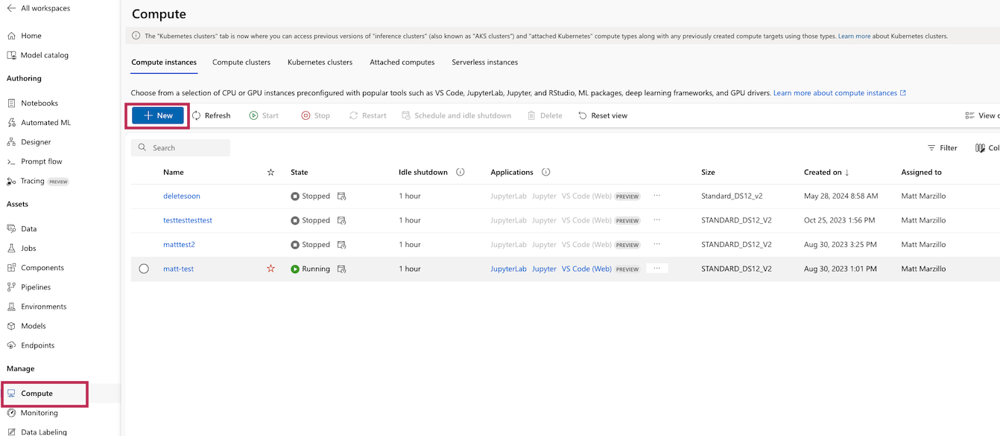
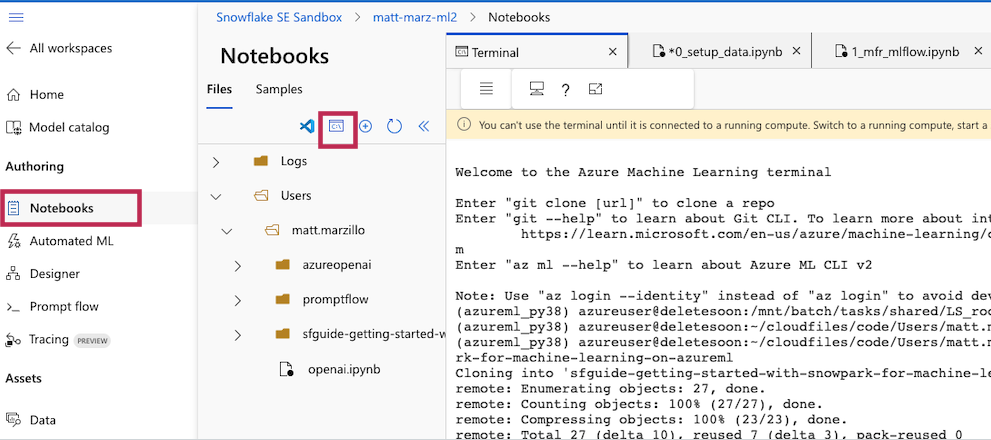
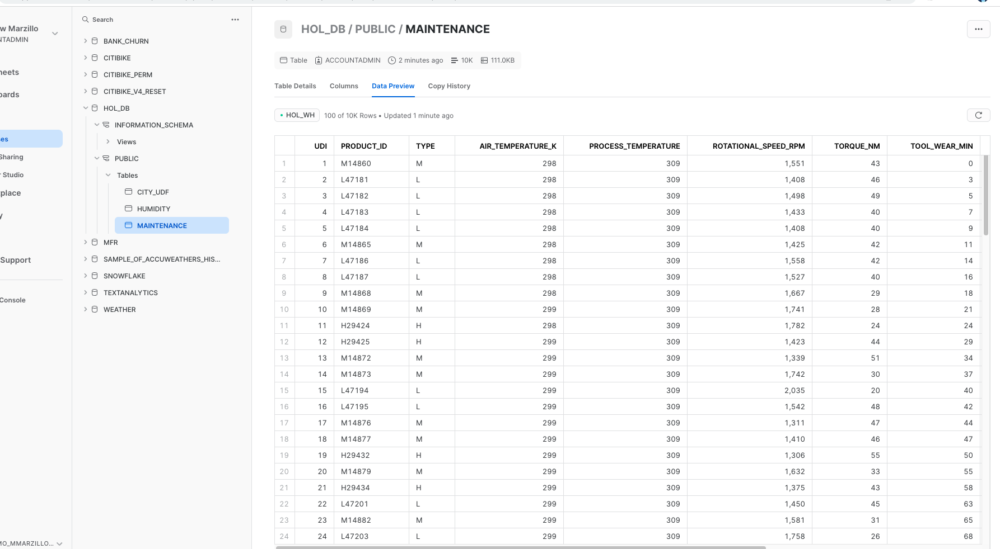
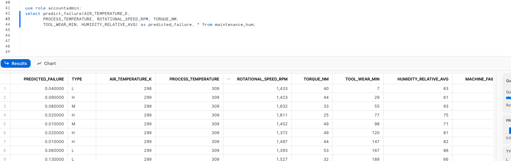
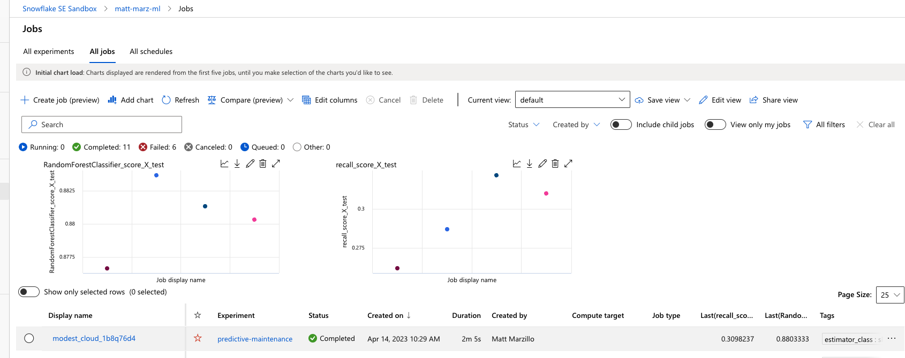
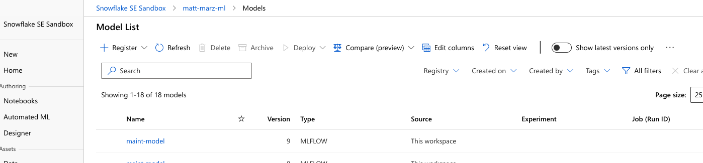
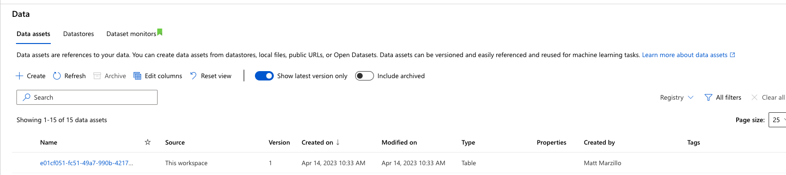

author: marzillo-snow
id: example-matt-marzillo
categories: snowflake-site:taxonomy/solution-center/certification/quickstart, snowflake-site:taxonomy/solution-center/certification/partner-solution, snowflake-site:taxonomy/solution-center/includes/architecture, snowflake-site:taxonomy/product/ai, snowflake-site:taxonomy/product/applications-and-collaboration
language: en
summary: Run experiments on Azure Machine Learning with Snowpark ML for cloud-based model training, hyperparameter tuning, and deployment.
environments: web
status: Published 
feedback link: https://github.com/Snowflake-Labs/sfguides/issues


# Getting Started with Snowpark for Machine Learning on AzureML
<!-- ------------------------ -->
## Overview 

Python is the language of choice for Data Science and Machine Learning workloads. Snowflake has long supported Python via the Python Connector, allowing data scientists to interact with data stored in Snowflake from their preferred Python environment. This did, however, require data scientists to write verbose SQL queries. To provide a more friendly, expressive, and extensible interface to Snowflake, we built Snowpark Python, a native Python experience with a pandas and PySpark-like API for data manipulation. This includes a client-side API to allow users to write Python code in a Spark-like API without the need to write verbose SQL. Python UDF and Stored Procedure support also provides more general additional capabilities for compute pushdown.

Snowpark includes client-side APIs and server-side runtimes that extends Snowflake to popular programming languages including Scala, Java, and Python. Ultimately, this offering provides a richer set of tools for Snowflake users (e.g. Python's extensibility and expressiveness) while still leveraging all of Snowflake's core features, and the underlying power of SQL, and provides a clear path to production for machine learning products and workflows.

A key component of Snowpark for Python is that you can "Bring Your Own IDE"- anywhere that you can run a Python kernel, you can run client-side Snowpark Python. You can use it in your code development the exact same way as any other Python library or module. In this quickstart, we will be using Jupyter Notebooks, but you could easily replace Jupyter with any IDE of your choosing.

AzureML is a fully managed machine learning service. With AzureML, data scientists and developers can quickly and easily build and train machine learning models, and then directly deploy them into a production-ready hosted environment. It provides an integrated Jupyter authoring notebook instance for easy access to your data sources for exploration and analysis, so you don't have to manage servers. It also provides common machine learning algorithms that are optimized to run efficiently against extremely large data in a distributed environment. With native support for bring-your-own-algorithms and frameworks, AzureML offers flexible distributed training options that adjust to your specific workflows.

MLflow is an open-source platform for managing the end-to-end machine learning lifecycle. It allows data scientists and developers to track experiments, package and share code, and deploy models. MLflow provides a centralized location for tracking experiments, reproducibility, and collaboration across teams. It also supports multiple languages and frameworks, making it a versatile tool for managing machine learning projects. Conveniently, AzureML tracking is built on top of MLFlow.

This quickstart is designed to service as an introduction to using AzureML with Snowpark for model development and deployment to Snowflake. The idea is that users can build off this quickstart or integrate components into their existing Azureml workloads.

[GitHub](https://github.com/Snowflake-Labs/sfguide-getting-started-with-snowpark-for-machine-learning-on-azureml)

### Prerequisites
- Familiarity with [Snowflake](/en/developers/guides/getting-started-with-snowflake/) and a Snowflake account
- Familiarity with AzureML, an Azure account with an AzureML workspace
- Familiarity with [Python](https://www.udemy.com/course/draft/579706/)

### You'll Learn
- Using AzureML with Snowpark
- Loading and transforming data via Snowpark
- MLFlow
- Defining User Defined Functions for distributed scoring of machine learning models

### What You’ll Need 
- A free [Snowflake Account](https://signup.snowflake.com/?utm_source=snowflake-devrel&utm_medium=developer-guides&utm_cta=developer-guides)
- [Azure Account](https://azure.microsoft.com/en-us/free/search/?ef_id=_k_2ba2be3ad9791e57964fda0c62ccd55c_k_&OCID=AIDcmm5edswduu_SEM_k_2ba2be3ad9791e57964fda0c62ccd55c_k_&msclkid=2ba2be3ad9791e57964fda0c62ccd55c)


### What You’ll Build 
You will build an end-to-end data science workflow leveraging Snowpark for Python
- to load, clean and prepare data
- to train a machine learning model using Python in AzureML with ML Flow
- to deploy the trained models in Snowflake using Python User Defined Functions (UDFs)

The end-to-end workflow will look like this:


<!-- ------------------------ -->
## Use Case

In this use case you will build a binary model based on the 'Machine Predictive Maintenance Classification' dataset from [Kaggle](https://www.kaggle.com/datasets/shivamb/machine-predictive-maintenance-classification). We supplement this dataset with data from the Snowflake [data marketplace](/en/data-cloud/marketplace/).

The use case uses information related to machine diagnostics (torque, rotational speed) and environmental features (air temperature, humidity) to predict the likelihood of a failure.

<!-- ------------------------ -->
## Set Up Snowflake Environment

The first thing we will do is create a database and warehouse in your Snowflake environment. Run the below code in a Snowflake worksheet.
```sql
use role accountadmin;

CREATE OR REPLACE WAREHOUSE HOL_WH WITH WAREHOUSE_SIZE='X-SMALL';

CREATE OR REPLACE DATABASE HOL_DB;
```
<!-- ------------------------ -->
## Set Up AzureML Environment

If you haven't used AzureML before, for first time setup you will need to create an AzureML workspace. You can do so by following this [Link](https://learn.microsoft.com/en-us/azure/machine-learning/quickstart-create-resources?view=azureml-api-2) 

Create a Compute Instance by heading to the Compute tab in AzureML and selecting "New" under the compute instances tab as shown below. 



Give the compute any unique name you would like and leave the default settings and create the new compute

<!-- ------------------------ -->
## Clone Github Repo

Click on the "Notebooks" blade and open a terminal as shown below.



In the terminal window you will copy the public repo that contains the data and scripts needed for this quickstart.

```bash
git clone https://github.com/Snowflake-Labs/sfguide-getting-started-with-snowpark-for-machine-learning-on-azureml
```
> Note: The versions at the time of writing this -- snowflake-snowpark-python 1.0.0


<!-- ------------------------ -->
## Load data into Snowflake

You should now be able to navigate back to the 'File Browser' tab on the left and see your cloned repo. Open the setup.ipynb notebook (ensure that you select the correct environment), [0_setup_data.ipynb](https://github.com/Snowflake-Labs/sfguide-getting-started-with-snowpark-for-machine-learning-on-azureml/blob/main/0_setup_data.ipynb) and work through the set up script here to load the data. Your chosen role will need to have permissions to create these objects - if you are in a fresh lab account, the `ACCOUNTADMIN` role will work, but note that this wouldn't be used in a production setting.

> Note: Make sure that you are using an AzureML kernel that uses Python 3.10, uncomment the pip install line in the first block of the set up script to install the necessary packages for this lab.

You will need to enter your user and account credentials, and it is important that your `account` is in the correct format as outlined in the [Snowflake documentation](https://docs.snowflake.com/en/user-guide/admin-account-identifier#non-vps-account-locator-formats-by-cloud-platform-and-region). Your `host` will be your `account` ID followed by `.snowflakecomputing.com`, for example:
```python
connection_parameters = {
    "account": "sn00111",
    "host": "sn00111.central-us.azure.snowflakecomputing.com",
    "user": <your_user>, 
    "password": <your_password>,
    "role": <your_role>, # using "ACCOUNTADMIN" may simplify things in an isolated lab environment
    }
```

> Note: for simplicity in this lab you will need to enter your account and user credentials directly in your notebook. For a production setup, this would be a security risk so Azure Key Vault or a similar tool would be appropriate.

Once complete with the script, check back to your Snowflake environment to make sure that your data has loaded. Review the steps as you go: you just used a little bit of Snowpark to get that data loaded via the `session.write_pandas` function!


### Troubleshooting `pyarrow` related issues

- If you have `pyarrow` library already installed, uninstall it before installing Snowpark.
- If you do not have `pyarrow` installed, you do not need to install it yourself; installing Snowpark automatically installs the appropriate version.
- Do not reinstall a different version of `pyarrow` after installing Snowpark.

<!-- ------------------------ -->
## Build and Deploy Model

Now open and work through the `1_mfr_mlflow.ipynb` workbook to join together the datasets, bring in the training data then build and deploy the model. Once again, make sure to select the correct python environment.

[1_mfr_mlflow.ipynb](hhttps://github.com/Snowflake-Labs/sfguide-getting-started-with-snowpark-for-machine-learning-on-azureml/1_mfr_mlflow.ipynb)

Once that notebook is complete you will have a udf that you can use to generate predictions in your Snowflake environment! you can do this via Snowpark Python code or Snowflake SQL. Let's generate predictions with this udf with Snowflake SQL. Copy and paste the code below into your snowflake environment to generate inference.

```sql
use role accountadmin;
select TO_DECIMAL(GET(aml_model!predict_proba(AIR_TEMPERATURE_K,
      PROCESS_TEMPERATURE, ROTATIONAL_SPEED_RPM, TORQUE_NM,
      TOOL_WEAR_MIN, HUMIDITY_RELATIVE_AVG), 'output_feature_1'), 38, 4) as predicted_failure, * from maintenance_hum;
```



Head back to AzureML and notice how the training job, data and model are now all captured in your AzureML environment. This highlights how MLFlow is integrated with AzureML!
AzureML Jobs:



AzureML Model:



AzureML Data Registry:


<!-- ------------------------ -->
## Conclusion and Additional Considerations

This quickstart is just that, a quick way to get you started with using AzureML with Snowflake and Snowpark. For enterprise uses, data scientists and developers will want to consider additional details. 


Specifically, you may want to consider the additional details:
1. Using Github and Github actions to automate testing, execution and deployment of the code.
2. You may know that the Snowpark sandbox on Snowflake includes Anaconda supported packages which inludes the scikitlearn package that was used to build the logistic regression model. If you use other packages to build your models that are not supported by Anaconda you will have to install [third party packages in the Snowpark sandbox](https://docs.snowflake.com/en/developer-guide/udf/python/udf-python-packages.html).

### What We covered
- Using a AzureML with Snowpark
- Loading and transforming data via Snowpark with pushdown compute
- Deploying models to Snowflake via a User Defined Function
- Using MLFlow with AzureML

### Additional Considerations
- There are some great blogs on Medium regarding Snowpark, AzureML and using Snowflake with Azure.

- [Full demo on Snowflake Demo Hub](https://developers.snowflake.com/demos/predictive-maintenance-manufacturing/)

- [Snowpark for python with AzureML](https://medium.com/@michaelgorkow/mlops-with-snowflake-and-mlflow-on-azure-machine-learning-a21a9def693)

- [Operationalizing Snowpark](https://medium.com/snowflake/operationalizing-snowpark-python-part-one-892fcb3abba1)

- [Fork Repo on GitHub](https://github.com/Snowflake-Labs/sfguide-getting-started-with-snowpark-for-machine-learning-on-azureml)
- [Download Reference Architecture](/content/dam/snowflake-site/developers/2024/03/Snowflake_Snowpark-and-Azure-with-MLFlow-.pdf)
- [Read the Blog](https://medium.com/snowflake/using-azureml-with-snowflake-snowpark-for-machine-learning-9f254cdc30bf)
- [Watch the Demo](https://youtu.be/p8QUMiND7Ig?list=TLGG0JJck_UYXMoyNDA5MjAyNQ)

If you have any questions, reach out to your Snowflake account team!
