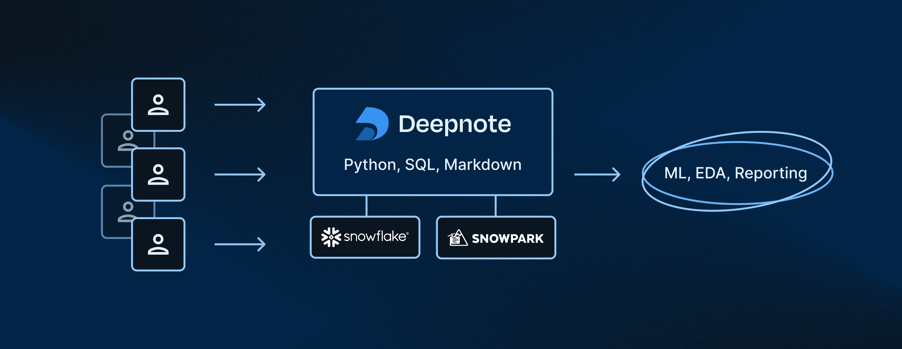
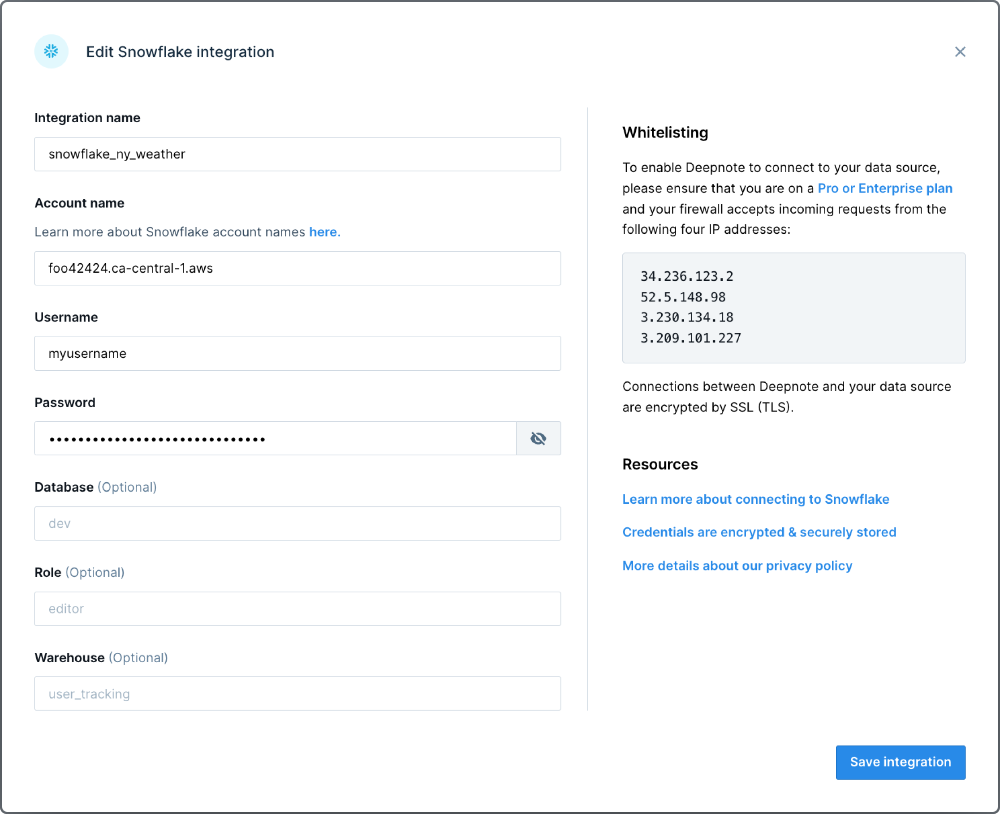
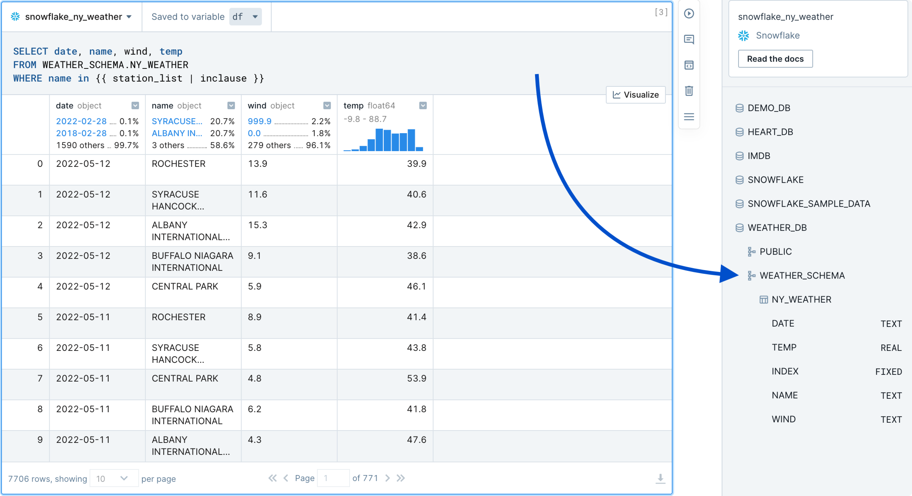
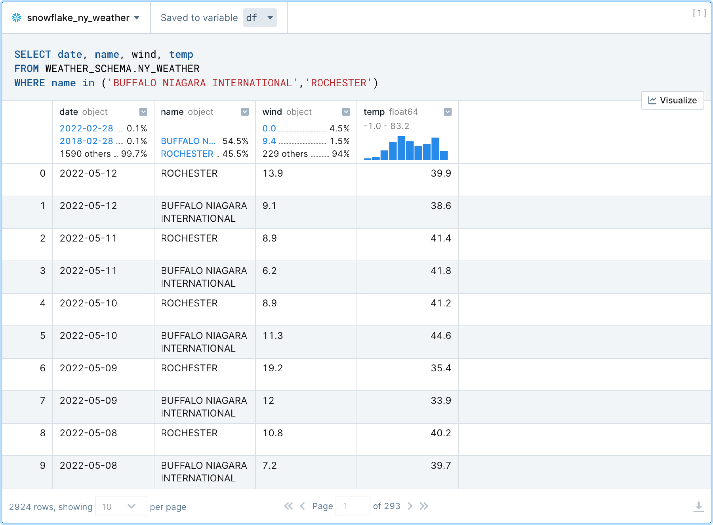
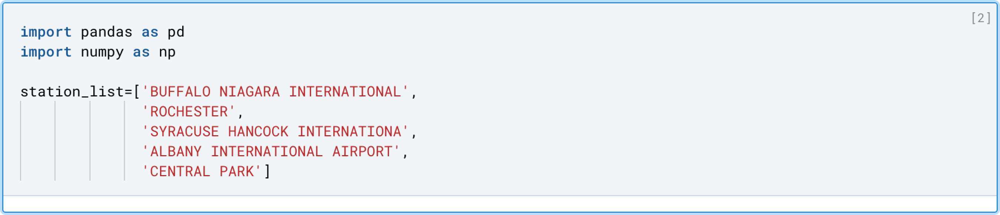
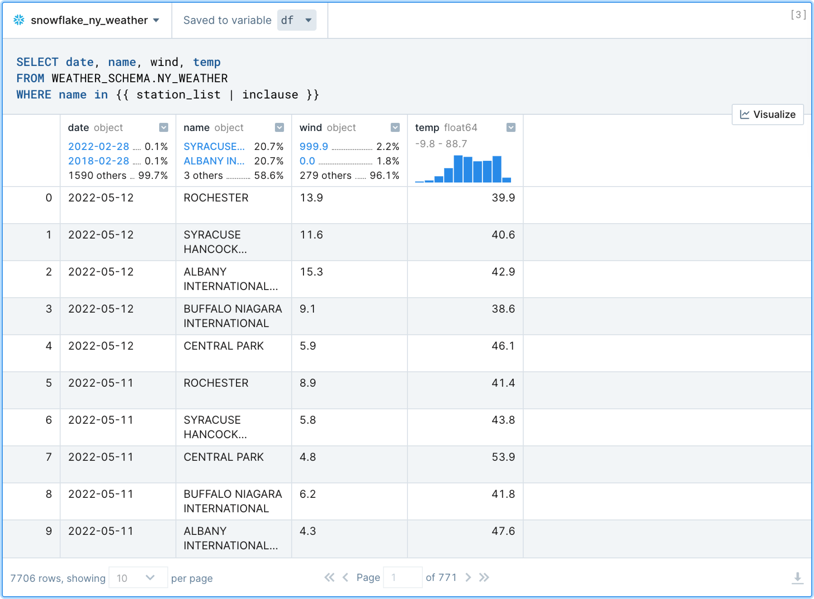
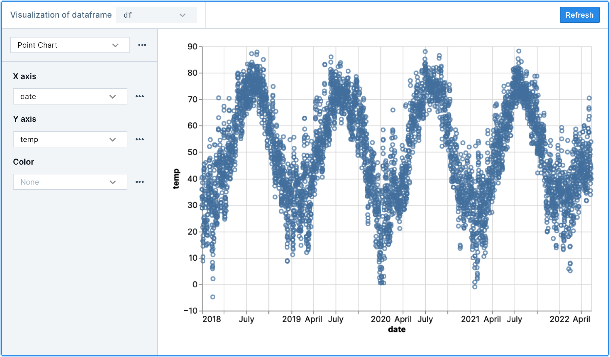
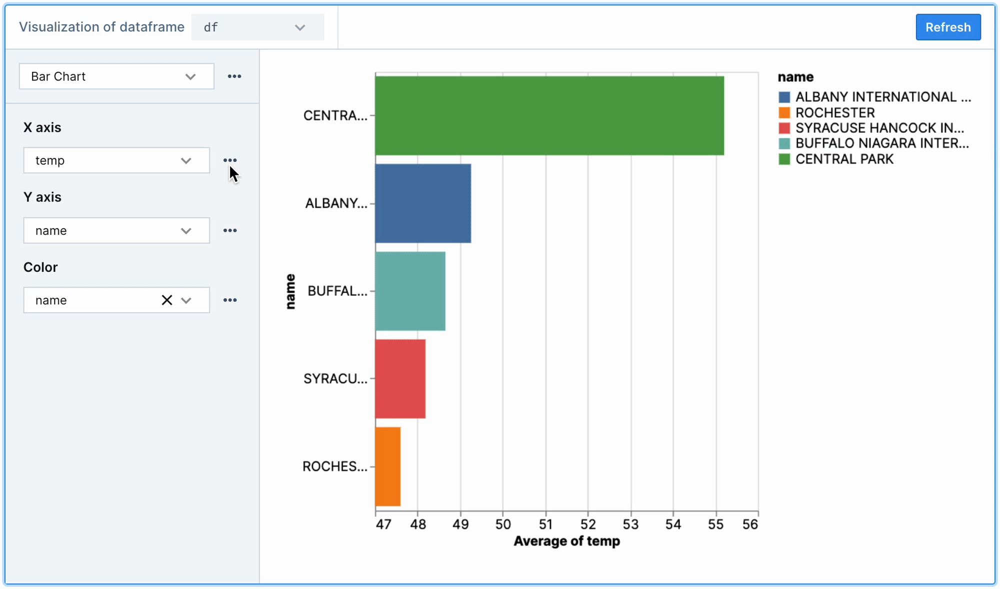
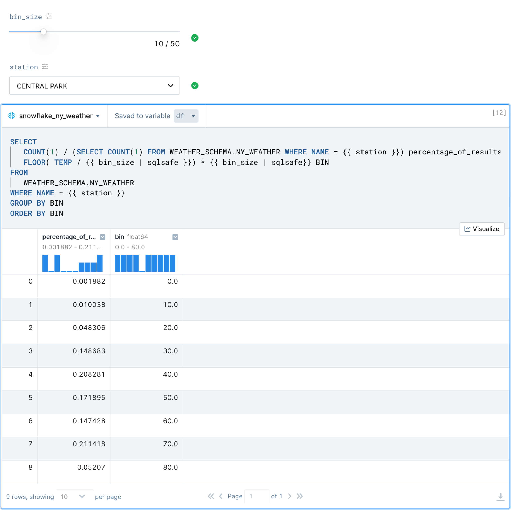
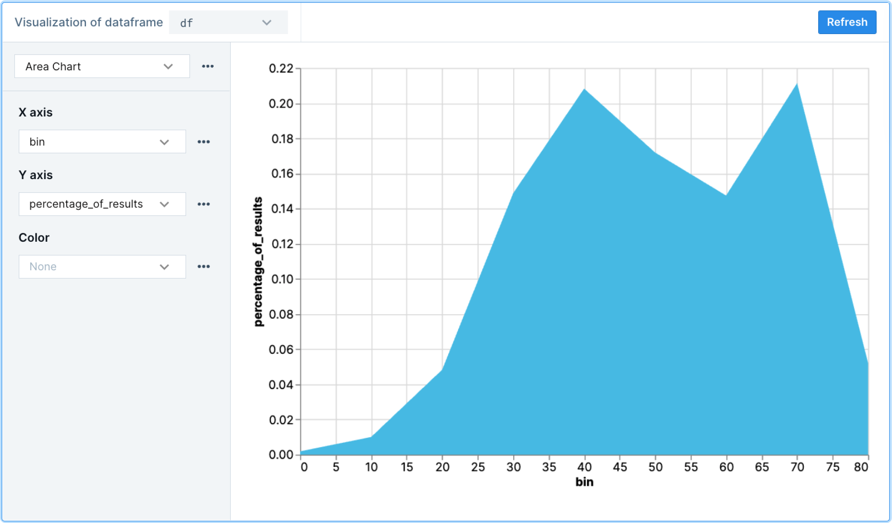

author: Allan Campopiano
id: exploratory_data_analysis_with_snowflake_and_deepnote
summary: Deepnote's SQL + Python notebook, along with their suite of low-code tools, allow for rapid data exploration of the Snowflake warehouse.
categories: data-science
environments: web
status: Draft
feedback link: [https://github.com/Snowflake-Labs/sfguides/issues](https://github.com/Snowflake-Labs/sfguides/issues)
tags: Data Science, Notebooks, Snowflake, Deepnote, Python, Jupyter, EDA

# Exploratory Data Analysis with Snowflake and Deepnote

<!-- ------------------------ -->

## Overview

Duration: 2

Deepnote brings Python and SQL into a collaborative data science notebook, along with a suite 
of low-code tools and tight integration with Snowflake. Altogether, Deepnote 
and Snowflake reduce the “time to insight” for teams as they explore their data.

In this quick-start guide, we will build an accelerated EDA workflow with Deepnote and 
Snowflake. Specifically, we look at various methods for effectively cleaning 
and visualizing weather readings; however, the techniques used can be applied 
more generally to any dataset used within Deepnote.

### Prerequisites

- Familiarity with basic Python and SQL
- Familiarity with data science notebooks

### What You’ll Learn

This guide will walk you through a generalizable workflow for 
exploratory data analysis (EDA) using Deepnote and Snowflake. 
You will learn how to combine Python, SQL, and low-code solutions to 
complete common EDA tasks—including data wrangling and 
interactive data visualization.

### What You’ll Need

- A free [Deepnote account](https://deepnote.com/home)
- A [Snowflake account](https://signup.snowflake.com/) with admin access
- The [weather dataset](https://drive.google.com/file/d/127iMXdC3ZYdfrlqAFLm2pPORZ6tGj_wM/view?usp=sharing) uploaded to your Snowflake database (uploading instructions [here](https://docs.snowflake.com/en/user-guide/script-data-load-transform-parquet.html))

### What You’ll Build

You will use the EDA tools in Deepnote to explore weather patterns in New York city. 
By the end of the guide, you will have created a notebook that contains generalizable 
techniques—and one that demonstrates how Snowflake and Deepnote work together
to solve the hardest data analysis problems.

<!-- ------------------------ -->

## Setup a Snowflake integration inside Deepnote

Duration: 1

To connect a Snowflake database to a Deepnote project, open the 
Snowflake integration modal and supply the associated Snowflake 
credentials (i.e., account, username, password). Note that the 
connection parameters to Snowflake are stored in the notebook as Python environment 
variables but can only be viewed by the workspace Admin. 

Once you are connected, you will be able to browse your 
schema directly from Deepnote and query your 
tables with SQL blocks (described below).

<!-- ------------------------ -->

## Query Snowflake with Deepnote's SQL blocks

Duration: 3

Similar to Python code cells used in Jupyter notebooks, Deepnote also includes 
native SQL cells which include syntax highlighting and autocomplete 
based on the Snowflake schema. Hover your mouse on the 
border of block, click the ➕ sign, and select your Snowflake SQL 
block from the list. Now you can write SQL as you would in a 
standard SQL editor as shown below.

Notice that in the example below we can already start 
exploring the weather data via the rich DataFrame display. 
This includes being able to use filters, sorting, pagination, 
as well as examining histograms, ratios of values, and data types. 
Importantly, the results set is saved to a Pandas DataFrame 
(in this case `df`)—meaning that you can continue using Pandas or any 
other tool in the Python library ecosystem to further explore the data.

<!-- ------------------------ -->

## Mix-and-match Python and SQL

Duration: 3

SQL queries in Deepnote also support the JinjaSQL templating language. 
This allows users to pass Python variables **directly into SQL queries** as well as 
use jinja-style control structures (conditionals and loops) for supplementing standard SQL.

In the example below, weather stations are filtered in the `WHERE` 
clause by passing in the python list called `station_list` 
rather than having to list them all out manually.

This is just one way to parameterize your SQL queries; we will 
see later how you can build a UI around your SQL blocks, 
allowing for interactive data exploration without having to 
repeat similar blocks of code, over and over again.

<!-- ------------------------ -->

## Visualize the results of a query 

Duration: 4

Deepnote provides no-code data visualization tools for streamlining EDA. 
Given the results of the query above, let’s build a data visualization to 
quickly explore the expected weather patterns (again, click the ➕ sign to 
choose a chart block type). We should expect temperature to get warmer in 
the summer months and colder in the winter months.

Let’s choose `df` as the DataFrame to visualize by selecting it from 
the dropdown at the top of the Chart block. Select “point chart” and 
specify how you would like to map columns of your data to the X/Y 
coordinates on the chart. Since we want to see temperature as a 
function of time, let’s select `date` for the X axis and `temp` 
for the Y axis (example below).

Sure enough, we can verify the seasonality in the weather 
patterns—and all without a single line of code.

While the chart above confirms the expected seasonality, we can’t see 
the data broken down by station (i.e., the location/city of the weather sensor). 
Since the `name` column contains this information, we can again use 
no-code charts to look at the average `temp` by `name` to get a 
sense of how locations/cities differ in terms of temperature. 

As shown below, aggregations and other options can be selected by 
clicking the ellipsis next to the encoding channels (X, Y, and Color). 
Here, we can visualize average temperature by station name by 
selecting `Average` from the aggregation options on the X axis 
(which is set to `temp`), and setting the Y and Color channels to `name`.

Many chart types and encoding combinations can used to create helpful 
data visualizations. This can be helpful not only in terms of developer 
speed but also for non-technical team members who may not be as 
familiar with plotting via code. For more complex needs, nothing is 
stopping us from using Altair, Plotly, or any other Python visualization library in Deepnote.

<!-- ------------------------ -->

## Build a UI around the SQL query

Duration: 4

Data exploration is iterative. Put another way—data exploration is repetitive. 
While analysts strive to follow the DRY principle (do not repeat yourself), 
EDA code and behaviour is often at odds with that principle (in practice). 
For example, an SQL query that neatly displays one aspect of the data is 
likely going to be copied and pasted, then slightly changed, in order to 
display another aspect of the data.

Deepnote understands this tendency and provides a set of rich, interactive widgets 
(called Input blocks) that can be used to parameterize your SQL queries (or Python code). 
That is, instead of copying and pasting around similar queries, quickly wire 
up a slider bar (or some other UI element) to scroll through dimensions of your data. 
This approach is great for readability, reproducibility, and ease of use 
(especially for those non-technical users). As usual, click the ➕ button above 
to choose from the available input blocks.

The SQL query below constructs binned temperature readings (i.e., similar to a histogram) 
so that we can examine a distribution of results. As you can see, the `bin_size` 
slider bar and `name` dropdown selector provide a small UI for controlling the 
variables passed into the SQL query. This way, we can look at binned results 
for any station we’d like (including tweaking the bin size) without having to 
write additional code.

As a bit of a bonus, and to bring things full circle, remember that the 
output of this SQL query is still a Pandas DataFrame; therefore, 
we can again use a chart block to visualize it further
(and we should get an actual histogram). Perfect.

<!-- ------------------------ -->

## Conclusion

Duration: 1

With Deepnote and Snowflake you get the best in class for secure data 
governance and rapid exploratory programming, together in the same place. 
Snowflake provides a single unified view of data and ability execute 
diverse analytics workloads—with near-unlimited scale, concurrency, and 
performance. Snowflake dovetails perfectly with Deepnote’s collaborative 
data science notebook and suite of tools built for exploratory data analysis. 

If you want to learn more about Deepnote’s data science notebook 
platform, visit [deepnote.com](http://deepnote.com).

### What we've covered

We have built a generalizable workflow for exploratory data analysis. 
Deepnote's Python, SQL, and low-code solutions make analyzing data in Snowflake 
straightforward and time efficient—even for team members without 
advanced technical knowledge. Apply these approaches to your own datasets 
to make exploratory data analysis more productive.