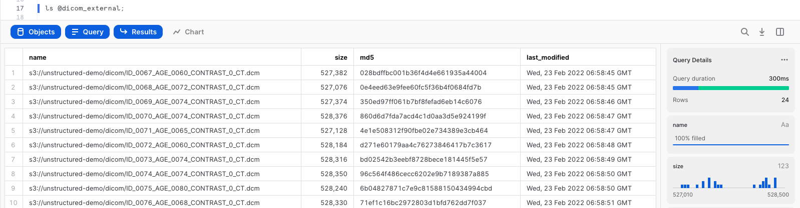
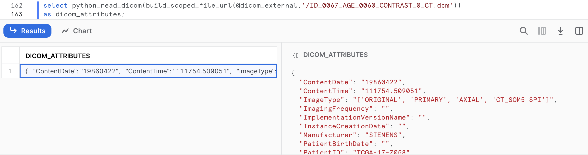
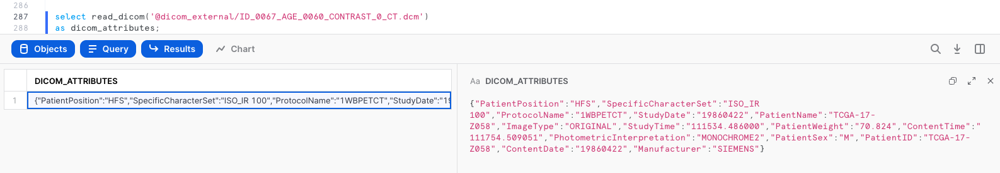
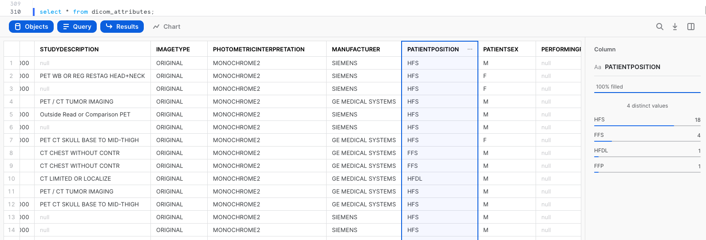

author: Scott Teal, Saurin Shah, Mauricio Rojas Fernandez
id: extract_attributes_dicom_files_java_udf
summary: This is a guide to get familiar with Snowflake's support for unstructured data
categories: data-engineering,app-development,architecture-patterns,solution-examples
environments: web
status: Published
feedback link: https://github.com/Snowflake-Labs/sfguides/issues
tags: Data Science, Data Engineering, Unstructured Data

# Extract Attributes from DICOM Files using a Java UDF
<!-- ------------------------ -->
## Overview 
Duration: 1

This Quickstart is designed to help you understand the capabilities included in Snowflake’s support for unstructured data and Snowpark. Although this guide is specific to processing DICOM files, you can apply this pattern of processing natively in Snowflake to many types of unstructured data. All source code for this guide can be found on [Github](https://github.com/Snowflake-Labs/sfquickstarts).

### Prerequisites
- Completion of [Getting Started with Unstructured Data](http://quickstarts.snowflake.com/guide/getting_started_with_unstructured_data/index.html?index=..%2F..index)

### What You'll Need
- Snowflake account
- [SnowSQL](https://docs.snowflake.com/en/user-guide/snowsql.html) installed

### What You’ll Learn 
- How to access DICOM files in cloud storage from Snowflake
- How to extract attributes from DICOM files natively using Python and Java User-Defined Functions (UDFs)

### What You'll Build
- An external stage to access files in S3 from Snowflake
- A user-defined function using Snowflake's engine to process files

<!-- ------------------------ -->
## Prepare Your Environment
Duration: 2

If you haven't already, register for a [Snowflake free 30-day trial](https://trial.snowflake.com/).
The Snowflake edition (Standard, Enterprise, Business Critical, e.g.), cloud provider (AWS, Azure, e.g.), and Region (US East, EU, e.g.) do not matter for this lab. We suggest you select the region which is physically closest to you and the Enterprise Edition, our most popular offering. After registering, you will receive an email with an activation link and your Snowflake account URL.

### Navigating to Snowsight
For this lab, you will use the latest Snowflake web interface, Snowsight.
1. Log into your Snowflake trial account
2. Click on __Snowsight__ Worksheets tab. The new web interface opens in a separate tab or window.
3. Click __Worksheets__ in the left-hand navigation bar. The __Ready to Start Using Worksheets and Dashboards__ dialog opens.
4. Click the __Enable Worksheets and Dashboards button__.


<!-- ------------------------ -->
## Access the Data
Duration: 6

Let’s start by accessing DICOM files from Snowflake. Snowflake supports two types of stages for storing data files used for loading and unloading:
- [Internal](https://docs.snowflake.com/en/user-guide/data-load-overview.html#internal-stages) stages store the files internally within Snowflake.
- [External](https://docs.snowflake.com/en/user-guide/data-load-overview.html#external-stages) stages store the files in an external location (i.e. S3 bucket) that is referenced by the stage. An external stage specifies location and credential information, if required, for the bucket.

For this quickstart, we will use an external stage, but processing and analysis workflows demonstrated in this quickstart can also be done using an internal stage.

### Create a Database, Warehouse, and Stage
Let's create a database, warehouse, and stage that will be used for processing the files. We will use the UI within the Worksheets tab to run the DDL that creates the database and schema. Copy the commands below into your trial environment, and execute each individually.

```sql
use role sysadmin;

create or replace database dicom;
create or replace warehouse quickstart;

use database dicom;
use schema public;
use warehouse quickstart;

create or replace stage dicom_external
url="s3://sfquickstarts/Extract DICOM Attributes/DICOM/"
directory = (enable = TRUE);
```

Verify if the DICOM files are accessible in your external stage by entering the following command on your Snowflake worksheet.

```sql
ls @dicom_external;
```

You should now see an identical list of files from the S3 bucket. Make sure you see 24 files.



<!-- ------------------------ -->
## Extract Attributes from DICOM Files
Duration: 10

In this section, we want to extract attributes from the DICOM files. The entities extracted are going to be fields like manufacturer, patient position, and study date. The goal is to have these fields to enrich the file-level metadata for analytics.

Using Snowpark runtimes and libraries, you can securely deploy and process Python, Java and Scala code to build pipelines, ML models, and applications in Snowflake. You can process unstructured files in Java (generally available), Python (public preview), and Scala (public preview) natively in Snowflake using Snowpark. In the following sections, you'll see how entity extraction can be done with Snowpark for both Java and Python.

### Python
The Python code to parse DICOM files requires the [pydicom](https://pydicom.github.io/pydicom/stable/index.html) package, which isn't currently included in the [Anaconda Snowflake channel](https://repo.anaconda.com/pkgs/snowflake/). While you could download the package and upload to an internal stage via [Snowsight](https://docs.snowflake.com/en/user-guide/data-load-web-ui) or SnowSQL CLI, we've added the `whl` to an external stage for convenience.

#### Creating a Python UDF
First, create the external stage to import the pydicom package file and the helper script to unzip the file and import into the UDF. Then, create the function.

```sql
-- Create external stage to import pydicom package from S3
create or replace stage python_imports
 url = "s3://Extract Dicom Attributes/Files/"
 directory = (enable = true auto_refresh = false);

-- Create a Python UDF to parse DICOM files
create or replace function python_read_dicom(file string)
    returns variant
    language python
    runtime_version=3.8
    imports = ('@python_imports/wheel_loader.py','@python_imports/pydicom-2.4.1-py3-none-any.whl')
    packages = ('snowflake-snowpark-python')
    handler = 'get_dicom_attributes'
AS
$$
import json
from snowflake.snowpark.files import SnowflakeFile
import sys
import os
import wheel_loader

def get_dicom_attributes(file_path):
    wheel_loader.load('pydicom-2.4.1-py3-none-any.whl')
    
    from pydicom import dcmread,errors

    attributes = {}
    
    with SnowflakeFile.open(file_path, 'rb') as f:        
        try:
            ds = dcmread(f)
        except errors.InvalidDicomError:
            ds = dcmread(f, force=True)

        attributes["PerformingPhysicianName"] = str(ds.get("PerformingPhysicianName", ""))
        attributes["PatientName"] = str(ds.get("PatientName", ""))
        attributes["PatientBirthDate"] = str(ds.get("PatientBirthDate", ""))
        attributes["Manufacturer"] = str(ds.get("Manufacturer", ""))
        attributes["PatientID"] = str(ds.get("PatientID", ""))
        attributes["PatientSex"] = str(ds.get("PatientSex", ""))
        attributes["PatientWeight"] = str(ds.get("PatientWeight", ""))
        attributes["PatientPosition"] = str(ds.get("PatientPosition", ""))
        attributes["StudyID"] = str(ds.get("StudyID", ""))
        attributes["PhotometricInterpretation"] = str(ds.get("PhotometricInterpretation", ""))
        attributes["RequestedProcedureID"] = str(ds.get("RequestedProcedureID", ""))
        attributes["ProtocolName"] = str(ds.get("ProtocolName", ""))
        attributes["ImagingFrequency"] = str(ds.get("ImagingFrequency", ""))
        attributes["StudyDate"] = str(ds.get("StudyDate", ""))
        attributes["StudyTime"] = str(ds.get("StudyTime", ""))
        attributes["ContentDate"] = str(ds.get("ContentDate", ""))
        attributes["ContentTime"] = str(ds.get("ContentTime", ""))
        attributes["InstanceCreationDate"] = str(ds.get("InstanceCreationDate", ""))
        attributes["SpecificCharacterSet"] = str(ds.get("SpecificCharacterSet", ""))
        attributes["StudyDescription"] = str(ds.get("StudyDescription", ""))
        attributes["ReferringPhysicianName"] = str(ds.get("ReferringPhysicianName", ""))
        attributes["ImageType"] = str(ds.get("ImageType", ""))
        attributes["ImplementationVersionName"] = str(ds.get("ImplementationVersionName", ""))
        attributes["TransferSyntaxUID"] = str(ds.get("TransferSyntaxUID", ""))
        
    return attributes
$$;
```

#### Invoking the Python UDF
The UDF can be invoked on any DICOM file with a simple SQL statement. First, make sure to refresh the directory table metadata for your external stage.

```
alter stage dicom_external refresh;

select python_read_dicom(build_scoped_file_url(@dicom_external,'/ID_0067_AGE_0060_CONTRAST_0_CT.dcm')) 
as dicom_attributes;
```



The output is key-value pairs extracted from `ID_0067_AGE_0060_CONTRAST_0_CT.dcm`.

```json
{
  "ContentDate": "19860422",
  "ContentTime": "111754.509051",
  "ImageType": "['ORIGINAL', 'PRIMARY', 'AXIAL', 'CT_SOM5 SPI']",
  "ImagingFrequency": "",
  "ImplementationVersionName": "",
  "InstanceCreationDate": "",
  "Manufacturer": "SIEMENS",
  "PatientBirthDate": "",
  "PatientID": "TCGA-17-Z058",
  "PatientName": "TCGA-17-Z058",
  "PatientPosition": "HFS",
  "PatientSex": "M",
  "PatientWeight": "70.824",
  "PerformingPhysicianName": "",
  "PhotometricInterpretation": "MONOCHROME2",
  "ProtocolName": "1WBPETCT",
  "ReferringPhysicianName": "",
  "RequestedProcedureID": "",
  "SpecificCharacterSet": "ISO_IR 100",
  "StudyDate": "19860422",
  "StudyDescription": "",
  "StudyID": "",
  "StudyTime": "111534.486000",
  "TransferSyntaxUID": ""
}
```

UDFs are account-level objects. So if a Python developer creates a UDF, an analyst in the same account with proper permissions can invoke the UDF in their queries.

### Java
Alternatively, the same attribute extraction can be accomplished with Java running directly in Snowflake.

#### Creating a Java UDF
The Java code to parse DICOM files requires some dependencies. Instead of downloading those jar files and uploading to an internal stage, you can create an external stage and reference them when creating a UDF inline.

```sql
-- Create external stage to import jars from S3
create or replace stage jars_stage
 url = "s3://sfquickstarts/Common JARs/"
 directory = (enable = true auto_refresh = false);

-- Create a java function to parse DICOM files
create or replace function read_dicom(file string)
returns String
language java
imports = ('@jars_stage/dcm4che-core-5.24.2.jar', '@jars_stage/log4j-1.2.17.jar', 
           '@jars_stage/slf4j-api-1.7.30.jar', '@jars_stage/slf4j-log4j12-1.7.30.jar',
           '@jars_stage/gson-2.8.7.jar')
HANDLER = 'DicomParser.Parse'
as
$$
import org.dcm4che3.data.Attributes;
import org.dcm4che3.data.Tag;
import org.dcm4che3.io.DicomInputStream;
import org.xml.sax.SAXException;

import java.io.*;
import java.util.HashMap;
import java.util.Map;

import com.google.gson.Gson;

import com.snowflake.snowpark_java.types.SnowflakeFile;

public class DicomParser {
    public static String Parse(String file_url) throws IOException {
     SnowflakeFile file = SnowflakeFile.newInstance(file_url);   
String jsonStr = null;

        try {
            DicomInputStream dis = new DicomInputStream(file.getInputStream());
            DicomInputStream.IncludeBulkData includeBulkData = DicomInputStream.IncludeBulkData.URI;
            dis.setIncludeBulkData(includeBulkData);
            Attributes attrs = dis.readDataset(-1, -1);

            Map<String, String> attributes = new HashMap<String, String>();
            attributes.put("PerformingPhysicianName",  attrs.getString(Tag.PerformingPhysicianName));
            attributes.put("PatientName",  attrs.getString(Tag.PatientName));
            attributes.put("PatientBirthDate",  attrs.getString(Tag.PatientBirthDate));
            attributes.put("Manufacturer",  attrs.getString(Tag.Manufacturer));
            attributes.put("PatientID",  attrs.getString(Tag.PatientID));
            attributes.put("PatientSex",  attrs.getString(Tag.PatientSex));
            attributes.put("PatientWeight",  attrs.getString(Tag.PatientWeight));
            attributes.put("PatientPosition",  attrs.getString(Tag.PatientPosition));
            attributes.put("StudyID",  attrs.getString(Tag.StudyID));
            attributes.put("PhotometricInterpretation",  attrs.getString(Tag.PhotometricInterpretation));
            attributes.put("RequestedProcedureID",  attrs.getString(Tag.RequestedProcedureID));
            attributes.put("ProtocolName",  attrs.getString(Tag.ProtocolName));
            attributes.put("ImagingFrequency",  attrs.getString(Tag.ImagingFrequency));
            attributes.put("StudyDate",  attrs.getString(Tag.StudyDate));
            attributes.put("StudyTime",  attrs.getString(Tag.StudyTime));
            attributes.put("ContentDate",  attrs.getString(Tag.ContentDate));
            attributes.put("ContentTime",  attrs.getString(Tag.ContentTime));
            attributes.put("InstanceCreationDate",  attrs.getString(Tag.InstanceCreationDate));
            attributes.put("SpecificCharacterSet",  attrs.getString(Tag.SpecificCharacterSet));
            attributes.put("StudyDescription",  attrs.getString(Tag.StudyDescription));
            attributes.put("ReferringPhysicianName",  attrs.getString(Tag.ReferringPhysicianName));
            attributes.put("ImageType",  attrs.getString(Tag.ImageType));
            attributes.put("ImplementationVersionName",  attrs.getString(Tag.ImplementationVersionName));
            attributes.put("TransferSyntaxUID",  attrs.getString(Tag.TransferSyntaxUID));

            Gson gsonObj = new Gson();
            jsonStr = gsonObj.toJson(attributes);
        }
        catch (Exception exception) {
            System.out.println("Exception thrown :" + exception.toString());
            throw exception;
        }

        return jsonStr;
    }
}
$$;
```

#### Invoking the Java UDF
The UDF can be invoked on any DICOM file with a simple SQL statement. First, make sure to refresh the directory table metadata for your external stage.

```
alter stage dicom_external refresh;

select read_dicom(build_scoped_file_url('@dicom_external','/ID_0067_AGE_0060_CONTRAST_0_CT.dcm')) 
as dicom_attributes;
```



The output is key-value pairs extracted from `ID_0067_AGE_0060_CONTRAST_0_CT.dcm`.

```json
{
  "PatientPosition": "HFS",
  "SpecificCharacterSet": "ISO_IR 100",
  "ProtocolName": "1WBPETCT",
  "StudyDate": "19860422",
  "PatientName": "TCGA-17-Z058",
  "ImageType": "ORIGINAL",
  "StudyTime": "111534.486000",
  "PatientWeight": "70.824",
  "ContentTime": "111754.509051",
  "PhotometricInterpretation": "MONOCHROME2",
  "PatientSex": "M",
  "PatientID": "TCGA-17-Z058",
  "ContentDate": "19860422",
  "Manufacturer": "SIEMENS"
}
```

UDFs are account-level objects. So if a developer familiar with Java creates a UDF, an analyst in the same account with proper permissions can invoke the UDF in their queries.

### Extracting and Storing Attributes
We want to store the extracted attributes as columns in a table for analysts to be able to query, analyze, and retrieve files. This can be done easily with Snowflake's native support for semi-structured data. We could use either the Python or Java UDF for this task, but for the purpose of this Quickstart Guide, we'll use the Java UDF.

```sql
create or replace table dicom_attributes as
select 
    relative_path,
    file_url,
    parse_json(read_dicom(build_scoped_file_url('@dicom_external/', relative_path))) as data,
    data:PatientName::string as PatientName,
    data:PatientID::string as PatientID,
    to_date(data:StudyDate::string,'yyyymmdd') as StudyDate,
    data:StudyTime::string as StudyTime,
    data:StudyDescription::string as StudyDescription,
    data:ImageType::string as ImageType,
    data:PhotometricInterpretation::string as PhotometricInterpretation,
    data:Manufacturer::string as Manufacturer,
    data:PatientPosition::string as PatientPosition,
    data:PatientSex::string as PatientSex,
    data:PerformingPhysicianName::string as PerformingPhysicianName,
    data:ImagingFrequency::string as ImagingFrequency,
    data:ProtocolName::string as ProtocolName
from directory(@dicom_external);
```

If you collapse and expand the `DICOM` database in the Objects pane on the left, you should now see a table named `DICOM_ATTRIBUTES`. Click on that table, and below you should see a preview of the fields you have created along with icons to indicate the data type. You can also see a preview of the view by clicking on the button that looks like a magnifier glass.


One of the many new things you can do with Snowsight is quickly see summary statistics and distributions of field values in query results. For example, select the entire table `EXTRACTED_DICOM_ATTRIBUTES`. Then in the query results, click on the columns such as `MANUFACTURER`, `PATIENTPOSITION`, and `PATIENTSEX` to see the distribution of values in each column.

```sql
select * from dicom_attributes;
```



<!-- ------------------------ -->
## Conclusion
Duration: 1

Congratulations! You used Snowflake to extract attributes from DICOM files.

### What we’ve covered
- Accessing unstructured data with an __external stage__
- Processing unstructured data with a __Java UDF__

### Related Resources
- [Quickstart: Analyze PDF Invoices using Java UDF and Snowsight](https://quickstarts.snowflake.com/guide/analyze_pdf_invoices_java_udf_snowsight/index.html?index=..%2F..index#0)
- [Unstructured Data Docs](https://docs.snowflake.com/en/user-guide/unstructured.html)
- [Java UDF Docs](https://docs.snowflake.com/en/developer-guide/udf/java/udf-java.html)
- [Snowpark Docs](https://docs.snowflake.com/en/developer-guide/snowpark/index.html)
