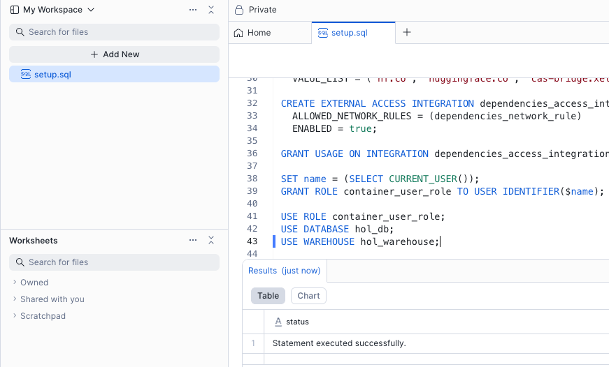

author: Yavor Georgiev, Seth Mason
id: extracting-insights-from-video-with-multimodal-ai-analysis
summary: Extract images, transcribe audio, and analyze key moments from videos using Cortex AI and Snowpark Container Services—all within Snowflake.
categories: Getting-Started
environments: web
status: Hidden
feedback link: https://github.com/Snowflake-Labs/sfguides/issues
tags: Getting Started, Data Science, SPCS, LLM, AI, Cortex, Snowpark Container Services

# Extracting Insights from Video with Multimodal AI Analysis
<!-- ------------------------ -->

## Overview

Duration: 10

Troves of enterprise data exists as video and audio, but its utility has been limited due to the difficulty of processing it to extract insights. That barrier to entry has rapidly crumbled in the last few years, with the advances of AI models that enable cheap and fast Optical Character Recognition (OCR) and Automatic Speech Recognition (ASR), as well as powerful Vision Language Models (VLMs), able to extract meaning and grounding data from video. 

In this Quickstart, we will employ all three techniques to analyze meeting video to extract insights. We are using the [AMI Corpus](https://groups.inf.ed.ac.uk/ami/corpus/), which is a **multi-modal dataset of 100s of hours of simulated scenario meetings in which particpants play different roles in a design team, taking a design project from kick-off to completion over the course of a day**. The same technques shown here are broadly applicable to other meeting video, especially when valuable information is displayed on-screen, such as presentation slides or demos. 

### Preqrequisites

* Basic understanding of Snowflake and containers.
* A [Snowflake Account](https://signup.snowflake.com/?utm_cta=quickstarts_)
* Installation of [Snowflake CLI](https://docs.snowflake.com/en/developer-guide/snowflake-cli/index)
* [Git](https://git-scm.com/book/en/v2/Getting-Started-Installing-Git)
* [Docker Desktop](https://www.docker.com/get-started/)
* [Hugging Face](https://huggingface.co) account and [Access Token](https://huggingface.co/docs/hub/en/security-tokens) for downloading models

### What You Will Build

You will build a multi-step pipeline that uses [Snowflake Cortex AI](https://www.snowflake.com/en/product/features/cortex/) for OCR and ASR, and VLM deployed on [Snowpark Container Services](https://docs.snowflake.com/en/developer-guide/snowpark-container-services/) to extract structured data from meeting video. You’ll store the output from all three models into structured Snowflake tables and build a simple chatbot allowing you to use language to generate rich analytical queries. You will be able to assess meeting effectiveness, identify decision points, and extract action items—directly within the AI Data Cloud. 

### What You Will Learn

You will gain hands-on experience with:
* **Cortex `AI_TRANSCRIBE`** for ASR
* **Cortex `PARSE_DOCUMENT`** for OCR
* **Snowpark Container Services (SPCS)** for loading the [Qwen2.5-VL](https://github.com/QwenLM/Qwen2.5-VL) large vision model from Hugging Face and running online inference

## Component Overview

Duration: 3

Snowpark Container Services and Snowflake Cortex AI are two of the major components that are utilized within this Quickstart. Below is an overview of them.

### Overview of Snowpark Container Services

[Snowpark Container Services](https://docs.snowflake.com/en/developer-guide/snowpark-container-services/overview) is a fully managed container offering designed to facilitate the deployment, management, and scaling of containerized applications within the Snowflake ecosystem. This service enables users to run containerized workloads directly within Snowflake, ensuring that data doesn’t need to be moved out of the Snowflake environment for processing. Unlike traditional container orchestration platforms like Docker or Kubernetes, Snowpark Container Services offers an OCI runtime execution environment specifically optimized for Snowflake. This integration allows for the seamless execution of OCI images, leveraging Snowflake’s robust data platform.

### Overview of Cortex AI

[Snowflake Cortex AI](https://www.snowflake.com/en/product/features/cortex/) enables you to quickly analyze unstructured data and build generative AI applications using fully managed LLMs, RAG and text-to-SQL services. Enable multiple users to use AI services with no-code, SQL and REST API interfaces.

<!-- ------------------------ -->
## Prepare Your Lab Environment

Duration: 15

### Create Snowflake Account

Log in using your unique credentials if you have a Snowflake account. If you don’t have a Snowflake account, visit [https://signup.snowflake.com/](https://signup.snowflake.com/) and sign up for a free 30-day trial environment.

For this guide, you will only need Snowflake's **Standard Edition** on AWS. You may want to select **Enterprise** to try out advanced features such as Time Travel, materialized views, or Failover.

Choose **US West (Oregon)** for the AWS Region and log in.

### Set up SQL Environment

1. Git clone the Quickstart's [repo](https://github.com/Snowflake-Labs/sfguide-extracting-insights-from-video-with-multimodal-ai-analysis) to your local machine. 
2. To prepare your Snowflake environment, in Snowsight, create a SQL file by clicking on **+ Create**, then **SQL File**.
3. Name the file `run.sql` and copy the contents [run.sql](https://github.com/Snowflake-Labs/sfguide-extracting-insights-from-video-with-multimodal-ai-analysis/blob/main/run.sql) from the cloned repository

<!-- TODO needs updated due to filename change-->

<!-- TODO feels like we should hold off this until they install CLI
4. To run the Common Setup, click at the beginning of a SQL line and click the blue Run button above your `run.sql` file. 

The output of the SQL command will appear in the results box.

--> 

### Install Snowflake CLI
Install the [Snowflake CLI](https://docs.snowflake.com/en/developer-guide/snowflake-cli/index). Snowflake CLI can be used to upload the video and audio files to a Stage, check resources, and push container images to the Image Registrykk. 

Use Snowsight's **Connect a Tool** to [configure Snowflake CLI](https://docs.snowflake.com/user-guide/gen-conn-config#using-sf-web-interface-to-get-connection-settings) to access your Snowflake account.  Viewing **Account Details** and then **Config File** will provide you with the .toml file necessary to configure Snowflake CLI to connect to your account. Add the following modified for your account to your snow CLI config file (e.g. `~/.snowflake.config.toml`):

~~~TOML
default_connection_name = "hol"    -- sets the below connection to be implicitly used
[connections.hol]
account = "SFSEHOL-SUMMIT25_UNSTR_DATA_PROCESSTEST_BCHXEI" -- from Connection Tool
user = "<username>"    -- update username
password = "<password>"  -- update password
role = "container_user_role"  -- update from Quickstart
warehouse = "hol_warehouse"
database = "hol_db"
schema = "public"
~~~

Copy the above contents into `config.toml` in the [Snowflake CLI configuration directory](https://docs.snowflake.com/en/developer-guide/snowflake-cli/connecting/configure-cli#location-of-the-toml-configuration-file) (e.g. `~/.snowflake/config.toml`)

Verify SnowCLI is correctly configured by running:
1. `snow connection list`
2. `snow connection test --connection hol`
3. `snow connection test`  to verify the default value

~~~
+-----------------------------------------------------------------------------------------+
| key             | value                                                                 |
|-----------------+-----------------------------------------------------------------------|
| Connection name | hol                                                                   |
| Status          | OK                                                                    |
| Host            | SFSEHOL-SUMMIT25_UNSTR_DATA_PROCESSTEST_BCHXEI.snowflakecomputing.com |
| Account         | SFSEHOL-SUMMIT25_UNSTR_DATA_PROCESSTEST_BCHXEI                        |
| User            | USER                                                                  |
| Role            | CONTAINER_USER_ROLE                                                   |
| Database        | HOL_DB                                                                |
| Warehouse       | HOL_WAREHOUSE                                                         |
+-----------------------------------------------------------------------------------------+
~~~

### Run Common Setup 
Execute the first section of the `run.sql` file labeled with the comment `COMMON SETUP`: 
1. Create the `hol_user_role` Role, `hol_db` Database, and `hol_warehouse` Warehouse which we will use to run subsequent steps.
2. To use Snowpark Container Services, we'll create the `hol_compute_pool` Compute Pool, which provides computing resources to run our containerized Service. 
3. We'll also need to enable our Service to reach external sites such as Hugging Face and PyPI, so we create the `dependencies_access_integration` External Access Integration. Snowflake accounts are secure by default and do not allow external access.  
4. We create the `hol_db.public.repo` Image Repository for storing container images
5. Finally, we create Stages `@video` and `@model` for storing files used in later stages

### Upload Files to Stage

Our application will process video and audio files that are stored on a Snowflake Stage. We'll need to first upload the video and audio files from the Github repo to our Snowflake account.

Using the Snow CLI, list the Stage you previously created
~~~bash
$ snow stage list
+---------------------------------------------------------------------------------------------------------------------------------------------------------+
|        |        |        |        |     |         |        |         |        |        |         |       | notifi |         |        |         |        |
|        |        | databa |        |     | has_cre | has_en |         |        |        |         |       | cation | storage |        | owner_r | direct |
| create |        | se_nam | schema |     | dential | crypti |         | commen |        |         |       | _chann | _integr | endpoi | ole_typ | ory_en |
| d_on   | name   | e      | _name  | url | s       | on_key | owner   | t      | region | type    | cloud | el     | ation   | nt     | e       | abled  |
|--------+--------+--------+--------+-----+---------+--------+---------+--------+--------+---------+-------+--------+---------+--------+---------+--------|
| 2025-0 | VIDEOS | HOL_DB | PUBLIC |     | N       | N      | ACCOUNT |        | None   | INTERNA | None  | None   | None    | None   | ROLE    | Y      |
| 5-29   |        |        |        |     |         |        | ADMIN   |        |        | L NO    |       |        |         |        |         |        |
| 15:21: |        |        |        |     |         |        |         |        |        | CSE     |       |        |         |        |         |        |
| 23.957 |        |        |        |     |         |        |         |        |        |         |       |        |         |        |         |        |
| 000-07 |        |        |        |     |         |        |         |        |        |         |       |        |         |        |         |        |
| :00    |        |        |        |     |         |        |         |        |        |         |       |        |         |        |         |        |
+---------------------------------------------------------------------------------------------------------------------------------------------------------+
~~~

Upload the video files directory [`videos`](https://github.com/Snowflake-Labs/sfguide-extracting-insights-from-video-with-multimodal-ai-analysis/tree/main/videos) from cloned repo the Stage 
~~~bash
$ snow stage copy --recursive ./videos @hol_db.public.videos
~~~

List the contents of the Stage
~~~bash
$ snow stage list-files @hol_db.public.videos
+-------------------------------------------------------------------------------------------------------------------------------------------+
| name                                                        | size     | md5                              | last_modified                 |
|-------------------------------------------------------------+----------+----------------------------------+-------------------------------|
| videos/amicorpus/IS1004/audio/IS1004a.Mix-Lapel.mp3         | 12748652 | f9ee1bfce574d6ec1de89717465ebf3b | Fri, 30 May 2025 22:33:00 GMT |
| videos/amicorpus/IS1004/audio/IS1004c.Mix-Lapel.mp3         | 36222956 | 6c25066bfdecf7db3a302c7a43f6173b | Fri, 30 May 2025 22:32:57 GMT |
...
+-------------------------------------------------------------------------------------------------------------------------------------------+
~~~

### Meeting Source Setup
Execute the two lines in `run.sql` that set the `meeting_id` and `meeting_part` variables. This will determine which video, audio, and image files you just uploaded will be used by subsequent analysis steps. This should match files that you uploaded to the 

<!-- ------------------------ -->
## Video Analysis

Duration: 30

### Build Docker Container

In the [repo](https://github.com/Snowflake-Labs/sfguide-extracting-insights-from-video-with-multimodal-ai-analysis/tree/main/videos), navigate to the `video_analysis` directory.

Using the Snow CLI, list your Image Registry:

~~~bash
$ snow spcs image-repository list
+---------------------------------------------------------------------------------------------------------------------------------------------------------+
| created_on                 | name | database_name | schema_name | repository_url             | owner        | owner_role_type | comment | encryption    |
|----------------------------+------+---------------+-------------+----------------------------+--------------+-----------------+---------+---------------|
| 2025-05-29                 | REPO | HOL_DB        | PUBLIC      | sfsehol-summit25-unstr-dat | ACCOUNTADMIN | ROLE            |         | SNOWFLAKE_SSE |
| 15:21:19.834000-07:00      |      |               |             | a-processtest-bchxei.regis |              |                 |         |               |
|                            |      |               |             | try.snowflakecomputing.com |              |                 |         |               |
|                            |      |               |             | /hol_db/public/repo        |              |                 |         |               |
+---------------------------------------------------------------------------------------------------------------------------------------------------------+
~~~

Get the Image Registry URL
~~~bash
$ snow spcs image-repository url repo
sfsehol-summit25-unstr-data-processtest-bchxei.registry.snowflakecomputing.com/hol_db/public/repo 
~~~

Build the Docker Container
The syntax of this command is `docker build --rm --platform linux/amd64 -t <repository_url>/<image_name> .` where `repository_url` is from the previous command and `image_name` is `process_video:latest`

~~~bash
$ docker build --rm --platform linux/amd64 -t sfsehol-summit25-unstr-data-processtest-bchxei.registry.snowflakecomputing.com/hol_db/public/repo/process_video:latest .

<...build output...>

$ docker images
REPOSITORY                                                                                                        TAG       IMAGE ID       CREATED             SIZE
sfsehol-summit25-unstr-data-processtest-bchxei.registry.snowflakecomputing.com/hol_db/public/repo/process_video   latest    8a051200cd1d   About an hour ago   16.5GB
~~~

Login to your Repository with Docker using Snow CLI
~~~bash
$ snow spcs image-registry login
Login Succeeded
~~~

Push the image to the registry
~~~bash
$ docker push sfsehol-summit25-unstr-data-processtest-bchxei.registry.snowflakecomputing.com/hol_db/public/repo/process_video:latest
~~~

List the Image in the repository:
~~~bash
$ snow spcs image-repository list-images repo
+---------------------------------------------------------------------------------------------------------------------------------------------------------+
| created_on                | image_name    | tags   | digest                                                   | image_path                              |
|---------------------------+---------------+--------+----------------------------------------------------------+-----------------------------------------|
| 2025-05-30 15:11:34-07:00 | process_video | latest | sha256:077c6883533f7d384b0e6594038895995de6f5470892cb15e | hol_db/public/repo/process_video:latest |
|                           |               |        | 51e4afcea611a35                                          |                                         |
+---------------------------------------------------------------------------------------------------------------------------------------------------------+
~~~
 
### Execute Containerized Job
The image you built and pushed to SPCS contains the [vLLM](https://docs.vllm.ai/en/latest/) runtime which provides scalable hosting for large AI models with support for multiple GPU instances. It is pre-configured to load the [Qwen2.5-VL-7B-Instruct](https://huggingface.co/Qwen/Qwen2.5-VL-7B-Instruct) VLM from Hugging Face. This model excels at:
- Visual understanding: object recognition, but also analyzing slides, charts, and graphics
- Understanding long videos and capturing events: for videos of over 1 hour, complete with the ability to capture events and pinpoint relevant video segments
- Generating structured outputs: returning results in structured formats to be used for Snowflake analytical processing

We will use [SPCS Jobs](https://docs.snowflake.com/en/developer-guide/snowpark-container-services/working-with-services#execute-a-job-service) to run the model against meeting videos with the following prompt:
> "Provide a detailed description of this meeting video, dividing it in to sections with a one sentence description, and capture the most important text that's displayed on screen. Identify the start and end of each section with a timestamp in the 'hh:mm:ss' format. Return the results as JSON"

The resulting JSON will be parsed into a structured table called `video_analysis`.

Follow these steps in the `VIDEO ANALYSIS` section of `run.sql`:
1. (Optional) Dun the `DROP SERVICE IF EXISTS` command if you are executing the Job repeatedly to clean up previous runs
2. Run the `EXECUTE JOB SERVICE` command to run the Job
  - Replace the `<image>:<version>` section with the image path from the previous step
  - Replace `<your_hf_token>` with you Hugging Face token to download the model
  - The exact meeting the model will analyze have already been preset when you set the `$meeting_id` and `$meeting_part` SQL variables earlier
  - The command is configured to run asynchronously, so it should complete within a few seconds, however the underlying Job may take 10+ minutes to complete.
    - To monitor the Job status and progress, use the **Jobs** tab of the  **Services & jobs** area in Snowsight 
    - Select the `PROCESS_VIDEO` Job to see the status of the containerized workload. You can also use the **Logs** tab to see the log lines being emitted by the model
3. Run the `SELECT` statement in the `video_analysis` table when the Job completes to see the model's anslysis of the meeting. The output should look similar to the below:

~~~bash
+------------+--------------+----------------------------------------------+------------+----------+--------------------------------------------------------------------------------------------------------------------------------------------------------------------------------------------------------------------------------------------------------------------------------------------------------------------------+
| MEETING_ID | MEETING_PART | VIDEO_PATH                                   | START_TIME | END_TIME | DESCRIPTION                                                                                                                                                                                                                                                                                                              |
+------------+--------------+----------------------------------------------+------------+----------+--------------------------------------------------------------------------------------------------------------------------------------------------------------------------------------------------------------------------------------------------------------------------------------------------------------------------+
| IS1004     | IS1004c      | /videos/amicorpus/IS1004/video/IS1004c.C.mp4 | 00:00:00   | 00:00:21 | The video opens with a group of four individuals entering a room equipped with a large screen displaying a presentation titled "Conceptual Design Meeting." The room is set up for a collaborative discussion, with a table covered in papers and a laptop. The individuals sit down and begin engaging in conversation. |
| IS1004     | IS1004c      | /videos/amicorpus/IS1004/video/IS1004c.C.mp4 | 00:00:21   | 00:01:45 | The group continues their discussion, focusing on the content displayed on the screen. The screen shows a slide titled "Method" with bullet points about user preferences and constraints. The individuals take notes and discuss the information presented.                                                             |
| IS1004     | IS1004c      | /videos/amicorpus/IS1004/video/IS1004c.C.mp4 | 00:01:45   | 00:03:09 | The screen transitions to a slide titled "Findings," listing various aspects such as user preferences, device requirements, and design constraints. The group discusses these findings, taking notes and sharing insights related to the design process.                                                                 |
| IS1004     | IS1004c      | /videos/amicorpus/IS1004/video/IS1004c.C.mp4 | 00:03:09   | 00:04:58 | The screen changes to a slide titled "Interface Concept," which includes a diagram and text discussing the design model and technology. The group engages in a detailed discussion about the interface concept, with one individual standing and pointing at the screen while others take notes.                         |
| IS1004     | IS1004c      | /videos/amicorpus/IS1004/video/IS1004c.C.mp4 | 00:04:58   | 00:06:57 | The screen displays a slide titled "Method" again, listing steps for the next phase of the project. The group continues their discussion, focusing on the outlined steps and making decisions based on the information presented.                                                                                        |
+------------+--------------+----------------------------------------------+------------+----------+--------------------------------------------------------------------------------------------------------------------------------------------------------------------------------------------------------------------------------------------------------------------------------------------------------------------------+

~~~

## Speech Recognition
<!-- ------------------------ -->

speech recognition section goes here

<!-- ------------------------ -->
## Clean up

Cleaning up....

<!-- ------------------------ -->
## Conclusion And Resources
Duration: 1

### Overview

### What You Learned

- Creating a Snowpark Container Service based application that hosts an AI model.
- Calling Snowflake Cortex AI functions.
- Processing video with multi-modal models to extract events.

### Resources

- Github repo [Snowflake-Labs/sfguide-extracting-insights-from-video-with-multimodal-ai-analysis](https://github.com/Snowflake-Labs/sfguide-extracting-insights-from-video-with-multimodal-ai-analysis)
- Snowpark Container Services [Documentation](https://docs.snowflake.com/en/developer-guide/snowpark-container-services/overview)
- Snowflake Cortex AI [documentation](https://docs.snowflake.com/en/user-guide/snowflake-cortex/llm-functions)

