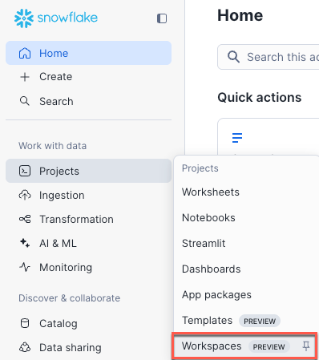

author: Yavor Georgiev, Seth Mason
id: extracting-insights-from-video-with-multimodal-ai-analysis
summary: This is a sample Snowflake Guide
categories: Getting-Started
environments: web
status: Hidden 
feedback link: https://github.com/Snowflake-Labs/sfguides/issues
tags: Getting Started, Data Science, Data Engineering, Twitter 

# Extracting Insights from Video with Multimodal AI Analysis
<!-- ------------------------ -->

## Overview

Duration: 1

In this guide, we’ll take text-rich videos (instructional content, meetings) and extract still images and audio. In order to perform OCR and speech recognitino using Whisper, we’ll process the images through [Snowflake Cortex AI](https://www.snowflake.com/en/product/features/cortex/) using `PARSE_DOCUMENT` and `AI_TRANSCRIBE`. To extract key moments and semantic events we will then process through Qwen2.5-VL on [Snowpark Container Services](https://docs.snowflake.com/en/developer-guide/snowpark-container-services/overview) (SPCS). Lastly, we will store the analysis from all three models into tables, and allow analytical queries around meeting productivity to be run on the data.

### Preqrequisites

* Basic understanding of Snowflake and containers.
* A [Snowflake Account](https://signup.snowflake.com/?utm_cta=quickstarts_)

### What You Will Build

* A containerized service that processes video to extract key moments for analysis.

### What You Will Learn

1. How to create an application on Snowpark Container Services.
2. How to extend Snowflake Cortex AI with models hosted on Snowpark Container Services.

<!-- ------------------------ -->

### Overview of Snowpark Container Services

Snowpark Container Services is a fully managed container offering designed to facilitate the deployment, management, and scaling of containerized applications within the Snowflake ecosystem. This service enables users to run containerized workloads directly within Snowflake, ensuring that data doesn’t need to be moved out of the Snowflake environment for processing. Unlike traditional container orchestration platforms like Docker or Kubernetes, Snowpark Container Services offers an OCI runtime execution environment specifically optimized for Snowflake. This integration allows for the seamless execution of OCI images, leveraging Snowflake’s robust data platform.

### Overview of Cortex AI

Snowflake Cortex AI enables you to quickly analyze unstructured data and build generative AI applications using fully managed LLMs, RAG and text-to-SQL services. Enable multiple users to use AI services with no-code, SQL and REST API interfaces.

<!-- ------------------------ -->

## Prepare Your Lab Environment

### Set up Snowflake

Duration: 6

Login using your unique credentials if you have a Snowflake account. If you don’t have a Snowflake account, visit [https://signup.snowflake.com/](https://signup.snowflake.com/) and sign up for a free 30-day trial environment.

For this guide, you will only need Snowflake's **Standard Edition** on AWS. You may want to select Enterprise to try out advanced features such as Time Travel, materialized views, or Failover.

Choose **US West (Oregon)** for the AWS Region.

Once you have logged in, create a new Workspace.

To prepare your Snowflake environment, Create a SQL File by selecting `+ Add New` and and selecting `SQL File`. Name the file `setup.sql`.

Copy the contents of [setup.sql](https://github.com/Snowflake-Labs/sfguide-extracting-insights-from-video-with-multimodal-ai-analysis/blob/main/setup.sql) into your newly created setup.sql workspace file.

To setup up your environment click the blue run button above your `setup.sql` file.

## Conclusion And Resources
Duration: 1

### Overview

### What You Learned

- Creating a Snowpark Container Service based application that hosts an AI model.
- Calling Snowflake Cortex AI functions.
- Processing video with multi-modal models to extract events.

### Resources

- Github repo [Snowflake-Labs/sfguide-extracting-insights-from-video-with-multimodal-ai-analysis](https://github.com/Snowflake-Labs/sfguide-extracting-insights-from-video-with-multimodal-ai-analysis)
- Snowpark Container Services [Documentation](https://docs.snowflake.com/en/developer-guide/snowpark-container-services/overview)
- Snowflake Cortex AI [documentation](https://docs.snowflake.com/en/user-guide/snowflake-cortex/llm-functions)

