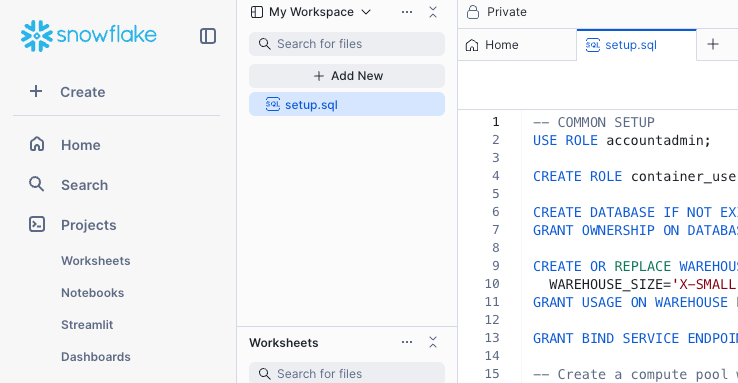

author: Yavor Georgiev, Seth Mason
id: extracting-insights-from-video-with-multimodal-ai-analysis
summary: Extract images, transcribe audio, and analyze key moments from videos using Cortex AI and Snowpark Container Services—all within Snowflake.
categories: Getting-Started
environments: web
status: Published
feedback link: https://github.com/Snowflake-Labs/sfguides/issues
tags: Getting Started, Data Science, SPCS, LLM, AI, Cortex, Snowpark Container Services

# Extracting Insights from Video with Multimodal AI Analysis
<!-- ------------------------ -->

## Overview

Duration: 1

In this Quickstart, you’ll learn how to extract and analyze insights from text-rich videos such as instructional content and recorded meetings. We’ll walk through a multi-step pipeline that includes:
* **Frame and audio extraction** from the source video
* **Optical Character Recognition (OCR)** using `PARSE_DOCUMENT` and speech-to-text transcription using `AI_TRANSCRIBE`, both powered by [Snowflake Cortex AI](https://www.snowflake.com/en/product/features/cortex/)
* **Key moment and semantic event detection** using the Qwen2.5-VL model deployed on [Snowpark Container Services](https://docs.snowflake.com/en/developer-guide/snowpark-container-services/)

Finally, you’ll store the output from all three models into structured Snowflake tables to enable rich analytical queries—such as measuring meeting effectiveness, identifying decision points, or extracting action items—directly within the Data Cloud.

### Preqrequisites

* Basic understanding of Snowflake and containers.
* A [Snowflake Account](https://signup.snowflake.com/?utm_cta=quickstarts_)
* Installation of [Snowflake CLI](https://docs.snowflake.com/en/developer-guide/snowflake-cli/index)
* Git
* Docker to build Containers

### What You Will Build

* A containerized service that processes video to extract key moments for analysis.

### What You Will Learn

1. How to create an application on Snowpark Container Services.
2. How to extend Snowflake Cortex AI with models hosted on Snowpark Container Services.

## Component Overview

Duration: 1

Snowpark Container Services and Snowflake Cortex AI are two of the major components that are utilized within this Quickstart. Below is an overview of them.

### Overview of Snowpark Container Services

[Snowpark Container Services](https://docs.snowflake.com/en/developer-guide/snowpark-container-services/overview) is a fully managed container offering designed to facilitate the deployment, management, and scaling of containerized applications within the Snowflake ecosystem. This service enables users to run containerized workloads directly within Snowflake, ensuring that data doesn’t need to be moved out of the Snowflake environment for processing. Unlike traditional container orchestration platforms like Docker or Kubernetes, Snowpark Container Services offers an OCI runtime execution environment specifically optimized for Snowflake. This integration allows for the seamless execution of OCI images, leveraging Snowflake’s robust data platform.

### Overview of Cortex AI

[Snowflake Cortex AI](https://www.snowflake.com/en/product/features/cortex/) enables you to quickly analyze unstructured data and build generative AI applications using fully managed LLMs, RAG and text-to-SQL services. Enable multiple users to use AI services with no-code, SQL and REST API interfaces.

<!-- ------------------------ -->
## Prepare Your Lab Environment

### Create Snowflake Account

Duration: 6

Login using your unique credentials if you have a Snowflake account. If you don’t have a Snowflake account, visit [https://signup.snowflake.com/](https://signup.snowflake.com/) and sign up for a free 30-day trial environment.

For this guide, you will only need Snowflake's **Standard Edition** on AWS. You may want to select **Enterprise** to try out advanced features such as Time Travel, materialized views, or Failover.

Choose **US West (Oregon)** for the AWS Region and log in.

### Setup Environment

We first need to set up our Snowflake account, we'll be creating Roles, Databases and a Warehouse.  Within Snowpark Container Services, we'll create a Compute Pool which provides computing resources to run our Containerized Service. We'll also need to enable our Service to reach external sites such as Huggingface and Pypi.  Snowflake accounts are secure by default and do not allow external access.  Lastly, we'll create an Image Registry for storing container images, and a Stage for storing our video and audio files will be created. All of these steps will be done within Snowsight.

Git clone the Quickstart's [repo](https://github.com/Snowflake-Labs/sfguide-extracting-insights-from-video-with-multimodal-ai-analysis) to your local machine. 

To prepare your Snowflake environment, in Snowsight, create a SQL file by clicking on **+ Create**, then **SQL File**.

Rename the empty SQL file to `setup.sql`.

Copy the "Common Setup" section of [setup.sql](https://github.com/Snowflake-Labs/sfguide-extracting-insights-from-video-with-multimodal-ai-analysis/blob/main/setup.sql) into your newly created setup.sql SQL file. 

To run the Common Setup, click at the beginning of a SQL line and click the blue Run button above your `setup.sql` file. 

The output of the SQL command will appear in the results box.

### Upload Files to Stage

Our application will process video and audio files that are stored on a Snowflake Stage. We'll need to first upload the video and audio files from the Github repo to our Snowflake account.

Using the Snow CLI, list the Stage you previously created
~~~bash
$ snow stage list
+---------------------------------------------------------------------------------------------------------------------------------------------------------+
|        |        |        |        |     |         |        |         |        |        |         |       | notifi |         |        |         |        |
|        |        | databa |        |     | has_cre | has_en |         |        |        |         |       | cation | storage |        | owner_r | direct |
| create |        | se_nam | schema |     | dential | crypti |         | commen |        |         |       | _chann | _integr | endpoi | ole_typ | ory_en |
| d_on   | name   | e      | _name  | url | s       | on_key | owner   | t      | region | type    | cloud | el     | ation   | nt     | e       | abled  |
|--------+--------+--------+--------+-----+---------+--------+---------+--------+--------+---------+-------+--------+---------+--------+---------+--------|
| 2025-0 | VIDEOS | HOL_DB | PUBLIC |     | N       | N      | ACCOUNT |        | None   | INTERNA | None  | None   | None    | None   | ROLE    | Y      |
| 5-29   |        |        |        |     |         |        | ADMIN   |        |        | L NO    |       |        |         |        |         |        |
| 15:21: |        |        |        |     |         |        |         |        |        | CSE     |       |        |         |        |         |        |
| 23.957 |        |        |        |     |         |        |         |        |        |         |       |        |         |        |         |        |
| 000-07 |        |        |        |     |         |        |         |        |        |         |       |        |         |        |         |        |
| :00    |        |        |        |     |         |        |         |        |        |         |       |        |         |        |         |        |
+---------------------------------------------------------------------------------------------------------------------------------------------------------+
~~~

Upload the video files diretory (`videos`) and its' contents to the Stage from the root of the cloned repo directory (`sfguide-extracting-insights-from-video-with-multimodal-ai-analysis`)
~~~bash
$ snow stage copy --recursive ./videos @hol_db.public.videos
~~~

List the contents of the Stage
~~~bash
$ snow stage list-files @hol_db.public.videos
+-------------------------------------------------------------------------------------------------------------------------------------------+
| name                                                        | size     | md5                              | last_modified                 |
|-------------------------------------------------------------+----------+----------------------------------+-------------------------------|
| videos/amicorpus/IS1004/audio/IS1004a.Mix-Lapel.mp3         | 12748652 | f9ee1bfce574d6ec1de89717465ebf3b | Fri, 30 May 2025 22:33:00 GMT |
| videos/amicorpus/IS1004/audio/IS1004c.Mix-Lapel.mp3         | 36222956 | 6c25066bfdecf7db3a302c7a43f6173b | Fri, 30 May 2025 22:32:57 GMT |
...
+-------------------------------------------------------------------------------------------------------------------------------------------+
~~~

### Install Snowflake CLI
Install the [Snowflake CLI](https://docs.snowflake.com/en/developer-guide/snowflake-cli/index). Snowflake CLI can be used to upload the video and audio files to a Stage, check resources, and push container images to the Image Registrykk. 

Use Snowsight's **Connect a Tool** to [configure Snowflake CLI](https://docs.snowflake.com/user-guide/gen-conn-config#using-sf-web-interface-to-get-connection-settings) to access your Snowflake account.  Viewing **Account Details** and then **Config File** will provide you with the .toml file necessary to configure Snowflake CLI to connect to your account. Add the following modified for your account to your snow CLI config file (e.g. `~/.snowflake.config.toml`):

~~~TOML
default_connection_name = "hol"    -- sets the below connection to be implicitly used
[connections.hol]
account = "SFSEHOL-SUMMIT25_UNSTR_DATA_PROCESSTEST_BCHXEI" -- from Connection Tool
user = "<username>"    -- update username
password = "<password>"  -- update password
role = "container_user_role"  -- update from Quickstart
warehouse = "hol_warehouse"
database = "hol_db"
schema = "public"
~~~

Copy the above contents into `config.toml` in the [Snowflake CLI configuration directory](https://docs.snowflake.com/en/developer-guide/snowflake-cli/connecting/configure-cli#location-of-the-toml-configuration-file) (e.g. `~/.snowflake/config.toml`)

Verify SnowCLI is correctly configured by running:
1. `snow connection list`
2. `snow connection test --connection hol`
3. `snow connection test`  to verify the default value

~~~
+-----------------------------------------------------------------------------------------+
| key             | value                                                                 |
|-----------------+-----------------------------------------------------------------------|
| Connection name | hol                                                                   |
| Status          | OK                                                                    |
| Host            | SFSEHOL-SUMMIT25_UNSTR_DATA_PROCESSTEST_BCHXEI.snowflakecomputing.com |
| Account         | SFSEHOL-SUMMIT25_UNSTR_DATA_PROCESSTEST_BCHXEI                        |
| User            | USER                                                                  |
| Role            | CONTAINER_USER_ROLE                                                   |
| Database        | HOL_DB                                                                |
| Warehouse       | HOL_WAREHOUSE                                                         |
+-----------------------------------------------------------------------------------------+
~~~

<!-- ------------------------ -->
## Video Analysis

In your `setup.sql` file copy the `meeting_id` and `meeting_part` SQL commands and run them.

### Build Docker Container

In the [repo](https://github.com/Snowflake-Labs/sfguide-extracting-insights-from-video-with-multimodal-ai-analysis/tree/main/videos), navigate to the `video_analysis` directory.

Using the Snow CLI, list your Image Registry:

~~~bash
$ snow spcs image-repository list
+---------------------------------------------------------------------------------------------------------------------------------------------------------+
| created_on                 | name | database_name | schema_name | repository_url             | owner        | owner_role_type | comment | encryption    |
|----------------------------+------+---------------+-------------+----------------------------+--------------+-----------------+---------+---------------|
| 2025-05-29                 | REPO | HOL_DB        | PUBLIC      | sfsehol-summit25-unstr-dat | ACCOUNTADMIN | ROLE            |         | SNOWFLAKE_SSE |
| 15:21:19.834000-07:00      |      |               |             | a-processtest-bchxei.regis |              |                 |         |               |
|                            |      |               |             | try.snowflakecomputing.com |              |                 |         |               |
|                            |      |               |             | /hol_db/public/repo        |              |                 |         |               |
+---------------------------------------------------------------------------------------------------------------------------------------------------------+
~~~

Get the Image Registry URL
~~~bash
$ snow spcs image-repository url repo
sfsehol-summit25-unstr-data-processtest-bchxei.registry.snowflakecomputing.com/hol_db/public/repo 
~~~

Build the Docker Container
The syntax of this command is `docker build --rm --platform linux/amd64 -t <repository_url>/<image_name> .` where `repository_url` is from the previous command and `image_name` is `process_video:latest`

~~~bash
$ docker build --rm --platform linux/amd64 -t sfsehol-summit25-unstr-data-processtest-bchxei.registry.snowflakecomputing.com/hol_db/public/repo/process_video:latest .

<...build output...>

$ docker images
REPOSITORY                                                                                                        TAG       IMAGE ID       CREATED             SIZE
sfsehol-summit25-unstr-data-processtest-bchxei.registry.snowflakecomputing.com/hol_db/public/repo/process_video   latest    8a051200cd1d   About an hour ago   16.5GB
~~~

Login to your Repository with Docker using Snow CLI
~~~bash
$ snow spcs image-registry login
Login Succeeded
~~~

Push the image to the registry
~~~bash
$ docker push sfsehol-summit25-unstr-data-processtest-bchxei.registry.snowflakecomputing.com/hol_db/public/repo/process_video:latest
~~~

List the Image in the repository:
~~~bash
$ snow spcs image-repository list-images repo
+---------------------------------------------------------------------------------------------------------------------------------------------------------+
| created_on                | image_name    | tags   | digest                                                   | image_path                              |
|---------------------------+---------------+--------+----------------------------------------------------------+-----------------------------------------|
| 2025-05-30 15:11:34-07:00 | process_video | latest | sha256:077c6883533f7d384b0e6594038895995de6f5470892cb15e | hol_db/public/repo/process_video:latest |
|                           |               |        | 51e4afcea611a35                                          |                                         |
+---------------------------------------------------------------------------------------------------------------------------------------------------------+
~~~

## Speech Recognition
<!-- ------------------------ -->

speech recognition section goes here

<!-- ------------------------ -->
## Clean up

Cleaning up....

<!-- ------------------------ -->
## Conclusion And Resources
Duration: 1

### Overview

### What You Learned

- Creating a Snowpark Container Service based application that hosts an AI model.
- Calling Snowflake Cortex AI functions.
- Processing video with multi-modal models to extract events.

### Resources

- Github repo [Snowflake-Labs/sfguide-extracting-insights-from-video-with-multimodal-ai-analysis](https://github.com/Snowflake-Labs/sfguide-extracting-insights-from-video-with-multimodal-ai-analysis)
- Snowpark Container Services [Documentation](https://docs.snowflake.com/en/developer-guide/snowpark-container-services/overview)
- Snowflake Cortex AI [documentation](https://docs.snowflake.com/en/user-guide/snowflake-cortex/llm-functions)

