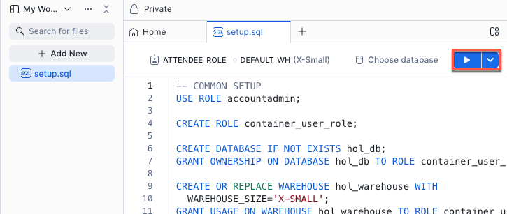

author: Yavor Georgiev, Seth Mason
id: extracting-insights-from-video-with-multimodal-ai-analysis
summary: Deriving key moments and semantic events from text-rich videos using Snowpark Container Services and Cortex AI.
categories: Getting-Started
environments: web
status: Published
feedback link: https://github.com/Snowflake-Labs/sfguides/issues
tags: Getting Started, Data Science, SPCS, LLM, AI, Cortex, Snowpark Container Services

# Extracting Insights from Video with Multimodal AI Analysis
<!-- ------------------------ -->

## Overview

Duration: 1

In this guide, we’ll take text-rich videos (instructional content, meetings) and extract still images and audio. In order to perform OCR and speech recognitino using Whisper, we’ll process the images through [Snowflake Cortex AI](https://www.snowflake.com/en/product/features/cortex/) using `PARSE_DOCUMENT` and `AI_TRANSCRIBE`. To extract key moments and semantic events we will then process through Qwen2.5-VL on [Snowpark Container Services](https://docs.snowflake.com/en/developer-guide/snowpark-container-services/overview) (SPCS). Lastly, we will store the analysis from all three models into tables, and allow analytical queries around meeting productivity to be run on the data.

### Preqrequisites

* Basic understanding of Snowflake and containers.
* A [Snowflake Account](https://signup.snowflake.com/?utm_cta=quickstarts_)
* Installation of [Snowflake CLI](https://docs.snowflake.com/en/developer-guide/snowflake-cli/index)
* Git

### What You Will Build

* A containerized service that processes video to extract key moments for analysis.

### What You Will Learn

1. How to create an application on Snowpark Container Services.
2. How to extend Snowflake Cortex AI with models hosted on Snowpark Container Services.

## Component Overview

Duration: 1

Snowpark Container Services and Snowflake Cortex AI are two of the major components that are utilized within this Quickstart. Below is an overview of them.

### Overview of Snowpark Container Services

[Snowpark Container Services](https://docs.snowflake.com/en/developer-guide/snowpark-container-services/overview) is a fully managed container offering designed to facilitate the deployment, management, and scaling of containerized applications within the Snowflake ecosystem. This service enables users to run containerized workloads directly within Snowflake, ensuring that data doesn’t need to be moved out of the Snowflake environment for processing. Unlike traditional container orchestration platforms like Docker or Kubernetes, Snowpark Container Services offers an OCI runtime execution environment specifically optimized for Snowflake. This integration allows for the seamless execution of OCI images, leveraging Snowflake’s robust data platform.

### Overview of Cortex AI

[Snowflake Cortex AI](https://www.snowflake.com/en/product/features/cortex/) enables you to quickly analyze unstructured data and build generative AI applications using fully managed LLMs, RAG and text-to-SQL services. Enable multiple users to use AI services with no-code, SQL and REST API interfaces.

<!-- ------------------------ -->
## Prepare Your Lab Environment

### Create Snowflake Account

Duration: 6

Login using your unique credentials if you have a Snowflake account. If you don’t have a Snowflake account, visit [https://signup.snowflake.com/](https://signup.snowflake.com/) and sign up for a free 30-day trial environment.

For this guide, you will only need Snowflake's **Standard Edition** on AWS. You may want to select **Enterprise** to try out advanced features such as Time Travel, materialized views, or Failover.

Choose **US West (Oregon)** for the AWS Region and log in.

### Setup Environment

To prepare your Snowflake environment, in Snowsight, create a SQL file by clicking on **+ Create**, then **SQL File**.

Rename the empty SQL file to `setup.sql`.

Copy the "Common Setup" section of [setup.sql](https://github.com/Snowflake-Labs/sfguide-extracting-insights-from-video-with-multimodal-ai-analysis/blob/main/setup.sql) into your newly created setup.sql SQL file:

To run the Common Setup, click the blue Run button above your `setup.sql` file.

### Upload Files to Stage

The Application will download the files from a Snowflake Stage to be processed.  

First, download the files from the Quickstart's [repo](https://github.com/Snowflake-Labs/sfguide-extracting-insights-from-video-with-multimodal-ai-analysis/tree/main/videos) to your local machine.

Using Snowsight, upload the files to your previously created Stage, "videos". In Snowsight, go to **Data**, then **Add Data**, then select **Load Files into a Stage**

### Install Snowflake CLI (Optional)
Install the [Snowflake CLI](https://docs.snowflake.com/en/developer-guide/snowflake-cli/index). Snowflake CLI can be used to upload the video and audio files to a Stage, and check resources. It is not required for this Quickstart.

Use Snowsight's **Connect a Tool** to [configure Snowflake CLI](https://docs.snowflake.com/user-guide/gen-conn-config#using-sf-web-interface-to-get-connection-settings) to access your Snowflake account.  Viewing **Account Details** and then **Config File** will provide you with the .toml file necessary to configure Snowflake CLI to connect to your account. It will look similar to this:

~~~TOML
[connections.hol]
account = "SFSEHOL-SUMMIT25_UNSTR_DATA_PROCESSTEST_BCHXEI"
user = "USER"
authenticator = "externalbrowser"
role = "ATTENDEE_ROLE"
warehouse = "hol_warehouse"
database = "hol_db"
schema = "hol_schema"
~~~

Copy the above contents into `config.toml` in the [Snowflake CLI configuration directory](https://docs.snowflake.com/en/developer-guide/snowflake-cli/connecting/configure-cli#location-of-the-toml-configuration-file) (e.g. `~/.snowflake/config.toml`)

Verify SnowCLI is correctly configured by running:
1. `snow connection list`
2. `snow connection test --connection hol`

~~~
+------------------------------------------------------------------+
| key             | value                                          |
|-----------------+------------------------------------------------|
| Connection name | hol                                            |
| Status          | OK                                             |
| Account         | SFSEHOL-SUMMIT25_UNSTR_DATA_PROCESSTEST_BCHXEI |
| User            | USER                                           |
| Role            | ATTENDEE_ROLE                                  |
| Database        | hol_db                                         |
| Warehouse       | hol_warehouse                                  |
+------------------------------------------------------------------+
~~~

<!-- ------------------------ -->
## Video Analysis

video analysis section goes here

## Speech Recognition
<!-- ------------------------ -->

speech recognition section goes here

<!-- ------------------------ -->
## Clean up

Cleaning up....

<!-- ------------------------ -->
## Conclusion And Resources
Duration: 1

### Overview

### What You Learned

- Creating a Snowpark Container Service based application that hosts an AI model.
- Calling Snowflake Cortex AI functions.
- Processing video with multi-modal models to extract events.

### Resources

- Github repo [Snowflake-Labs/sfguide-extracting-insights-from-video-with-multimodal-ai-analysis](https://github.com/Snowflake-Labs/sfguide-extracting-insights-from-video-with-multimodal-ai-analysis)
- Snowpark Container Services [Documentation](https://docs.snowflake.com/en/developer-guide/snowpark-container-services/overview)
- Snowflake Cortex AI [documentation](https://docs.snowflake.com/en/user-guide/snowflake-cortex/llm-functions)

