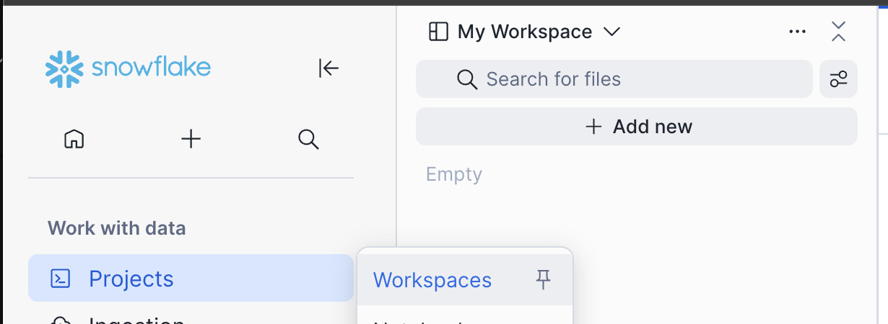
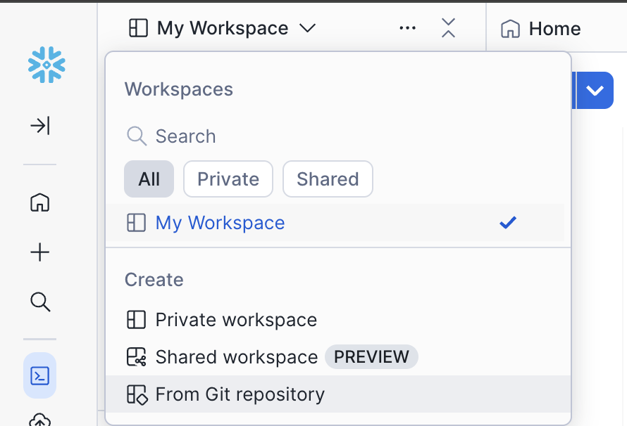
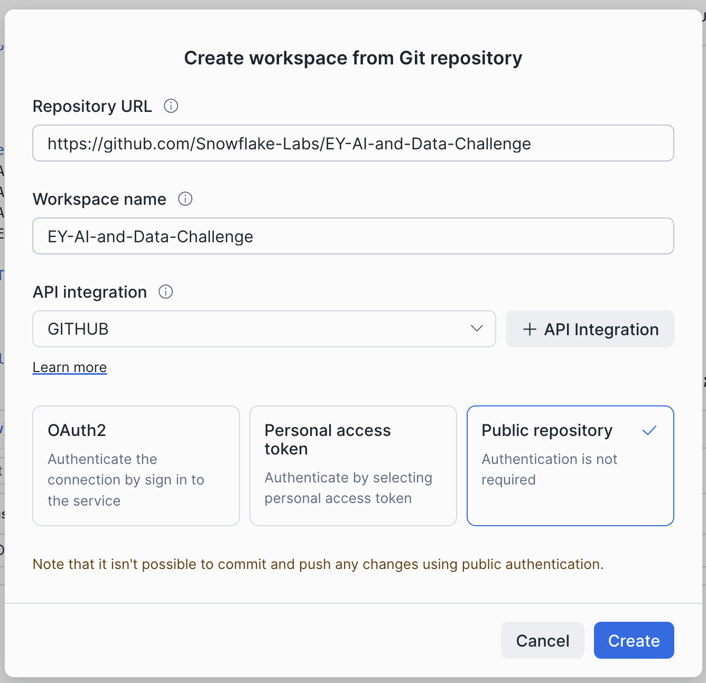
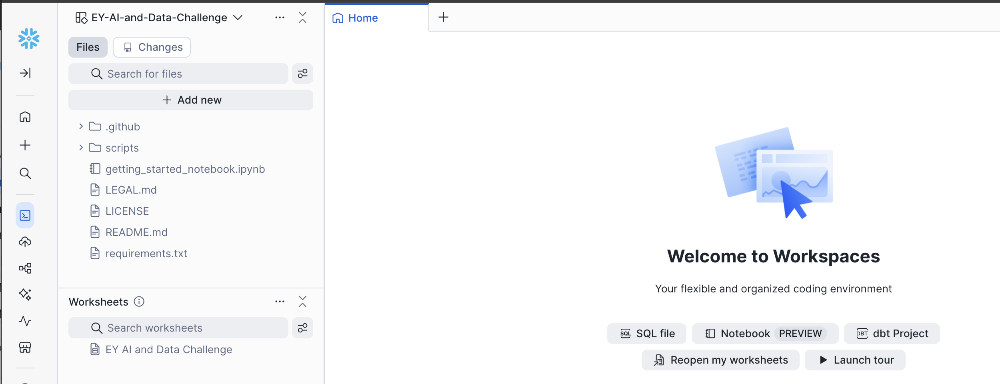
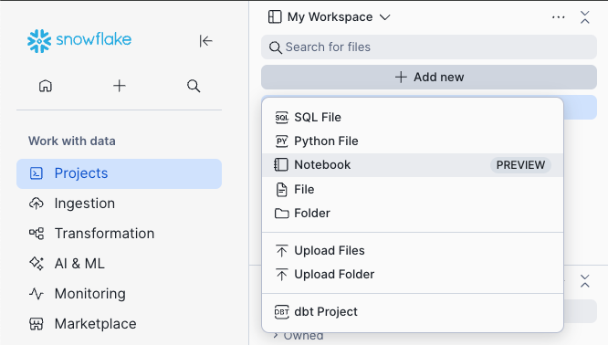
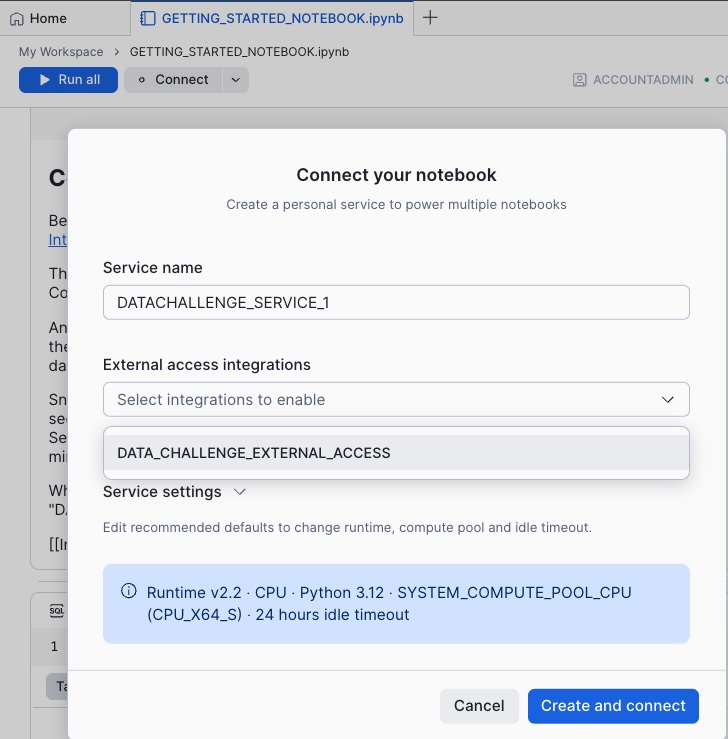
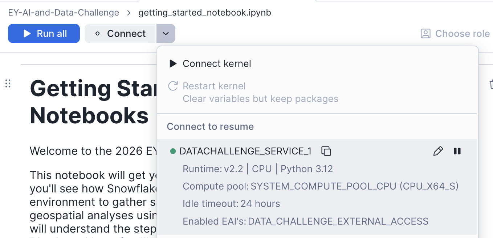
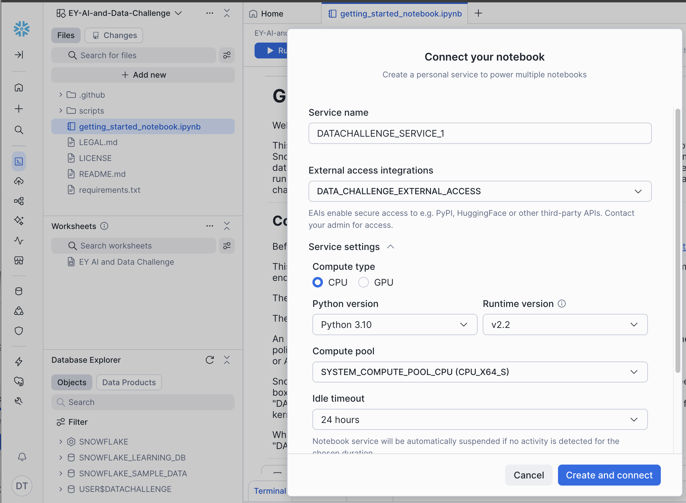
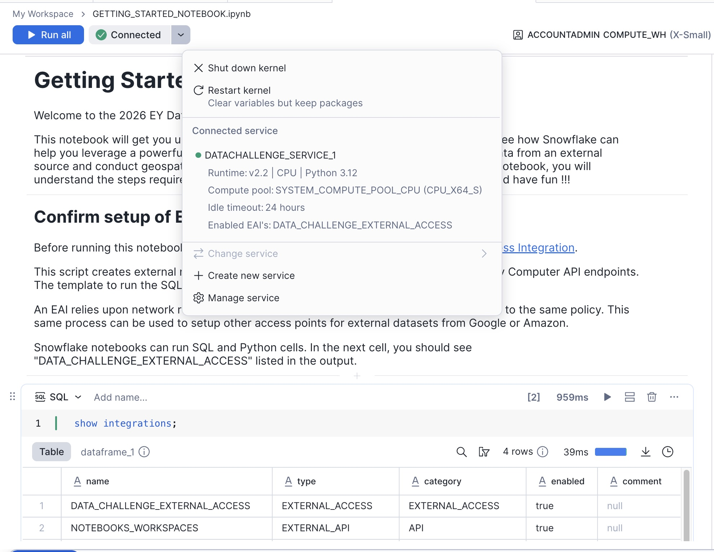

author: Mike Johnson
id: ey-ai-and-data-challenge
language: en
summary: Getting Started with Snowflake Notebooks and Workspaces for the EY AI & Data Challenge
categories: snowflake-site:taxonomy/solution-center/certification/quickstart, snowflake-site:taxonomy/product/ai, snowflake-site:taxonomy/product/analytics, snowflake-site:taxonomy/snowflake-feature/applied-analytics, snowflake-site:taxonomy/snowflake-feature/model-development 
environments: web
status: Published
feedback link: https://github.com/Snowflake-Labs/sfguides/issues
fork repo link: https://github.com/Snowflake-Labs/sfquickstarts/tree/master/site/sfguides/src/ey-ai-and-data-challenge
open in snowflake link: https://app.snowflake.com/templates?template=setup_account_data_challenge_template

# Getting Started with Snowflake Notebooks for the EY AI & Data Challenge
<!-- ------------------------ -->
## 2026 Challenge: Optimizing Clean Water Supply

One of the largest data challenges in the world with over 45,000 participants across 146 countries, the [EY AI & Data Challenge](https://challenge.ey.com/?utm_medium=institutions&utm_source=snowflake&utm_campaign=quickstart) gives innovators the opportunity to build skills while developing forward-thinking solutions to mitigate global sustainability issues. This year, the global competition invites university students, early career professionals and EY employees to use AI and data to tackle one of humanity's most pressing needs: access to clean, safe water.

## Challenge Overview
The objective of this challenge is to build a robust **machine learning model** capable of predicting water quality across various river locations in South Africa. In addition to accurate predictions, the model should also identify and emphasize the key factors that significantly influence water quality.

Participants will be provided with a dataset containing three water quality parameters — **Total Alkalinity**, **Electrical Conductance**, and **Dissolved Reactive Phosphorus** — collected between 2011 and 2015 from approximately 200 river locations across South Africa. Each data point includes the geographic coordinates (latitude and longitude) of the sampling site, the date of collection, and the corresponding water quality measurements.

Using this dataset, participants are expected to build a machine learning model to predict water quality parameters for a separate validation dataset, which includes locations from different regions not present in the training data. The challenge also encourages participants to explore feature importance and provide insights into the factors most strongly associated with variations in water quality.

This challenge is designed for participants with varying levels of experience in data science, remote sensing, and environmental analytics. It offers a valuable opportunity to apply machine learning techniques to real-world environmental data and contribute to advancing water quality monitoring using artificial intelligence.


### What will participants do?
EY and Snowflake have joined forces to empower the next generation of changemakers to turn data into real-world impact.

Using Snowflake's AI Data Cloud and EY's platform, along with a combination of datasets, participants will develop cutting-edge machine learning models that forecast water quality in inland bodies - creating actionable insights that can transform public health policy and community outcomes.

### Prerequisites
- Experience with Python and Jupyter notebooks
- Passion for using your technical skills for global impact

### What You’ll Learn 
- How to run Python and SQL code in a Snowflake environment
- How to access and analyze geospatial data from Microsoft Planetary Computer
- How to incorporate other data sources to build your own Machine Learning model

### What You’ll Need 
- Register for the [EY AI & Data Challenge](https://challenge.ey.com/?utm_medium=institutions&utm_source=snowflake&utm_campaign=quickstart) 
- Create a Snowlake Trial Account with the custom link provided on the EY AI & Data Challenge Portal - this link will enable special features that are required for the Data Challenge
- Download the Jupyter Notebook files and training data from the EY AI & Data Challenge Portal

### What You’ll Build 
Once you complete this guide, you should be able to setup your own Snowflake Account, configure it to access the Microsoft Planetary Computer API, and run the "Getting Started Notebook" to conduct your own geospatial analysis of water sources and water quality.

## Snowflake Notebooks and Workspaces
[Snowflake Notebooks](https://docs.snowflake.com/en/user-guide/ui-snowsight/notebooks-in-workspaces/notebooks-in-workspaces-overview) offer an interactive, cell-based programming environment for Python and SQL. With a Snowflake Notebook, you can perform exploratory data analysis, experiment with feature engineering for machine learning, and perform other data science tasks within Snowflake.

You can write and execute code, visualize results, and tell the story of your analysis all in one place.

* Explore and experiment with data already in Snowflake, or upload new data to Snowflake from local files, external cloud storage, or datasets from the Snowflake Marketplace.
* Write SQL or Python code and quickly compare results with cell-by-cell development and execution.
* Interactively visualize your data using embedded Streamlit visualizations and other libraries like Altair, Matplotlib, or seaborn.

Snowflake Notebooks have been available in Snowflake for a few years, so you might notice some differences in the original user experience (https://docs.snowflake.com/user-guide/ui-snowsight/notebooks) and the Workspaces environment. 

This guide will focus on the Workspaces environment, which is most similar to the experience you might have running Jupyter Notebooks on your local environment. It has enhanced features for CPU/GPU container compute resources, and enhanced collaboration capabilities with [Integrated Workspaces](https://docs.snowflake.com/en/user-guide/ui-snowsight/workspaces-git) and [Shared Workspaces](https://docs.snowflake.com/en/user-guide/ui-snowsight/workspaces-shared). 

## Setup Snowflake Account
Standard Snowflake Trial accounts last only 30 days, so you will want to get the custom Snowflake Trial link from the EY Challenge website for a trial that lasts 120 days. 

It takes just a few minutes to signup, and you will receive an email link to your new Snowflake Account. 

When you sign in to your account for the first time, you will need to run a setup script in SQL. 

This script creates external network access to install PyPI packages and access Planetary Computer API endpoints. 

If you have already created your Snowflake account, this template should load the first time you login to your account.

If it does not, the setup script template can be accessed directly within Snowflake using this [deeplink](https://app.snowflake.com/templates?template=setup_account_data_challenge_template).

If the template deeplink does not work, you can find the script in the Snowflake-Labs repo on [Github](https://github.com/Snowflake-Labs/EY-AI-and-Data-Challenge/scripts/snowflake_setup.sql).


## Create New Workspace from git repo
After running the setup script in SQL, you can load all of the files into your Snowflake Account by creating a new Workspace from a Git repository. 

1. Navigate to Workspaces with this [deeplink](https://app.snowflake.com/_deeplink/workspaces) or by clicking the "Projects" icon, then selecting "Workspaces" in the left sidebar navigation.

    

2. Click "My Workspace" menu in the Workspaces pane, and select "From Git repository"

    

3. Paste the repository URL:
```markdown
https://github.com/Snowflake-Labs/EY-AI-and-Data-Challenge
```

4. The Workspace name will auto-populate, but you can choose something simpler.

    

5. Click "Public repository" and click "Create". 
There's no need to authenticate when you access a public github repo. 

6. In a few seconds, your workspace will be created, and you will see a home page that says:
"Welcome to Workspaces", with the name of your workspace in the top left pane, and the notebook "getting_started_notebook.ipynb" in the file list. 

    

7. In the future, when your team creates your own private repo on Github.com, you can sync your repo files with your Snowflake Workspace with just a few clicks by following [these instructions.](https://docs.snowflake.com/en/developer-guide/git/git-setting-up#configure-for-authenticating-with-oauth)


## Upload Notebooks to your Workspace
If you have any trouble with the git integration, don't worry! 

The notebook is located in the [Snowflake-Labs repo on Github](https://github.com/Snowflake-Labs/EY-AI-and-Data-Challenge/blob/main/getting_started_notebook.ipynb)

You can download it from Github, and then upload the notebook into "My Workspace" by clicking the "Add New" button and choosing "Upload Files"

#### Upload Files or Upload Folder



## Start running the Notebook

1. Click Connect and choose the External Access Integration "DATA_CHALLENGE_EXTERNAL_ACCESS"

    

    Note: Most of the demo notebooks will run on the default version of Python 3.12, but if you run into issues, you can click the pencil icon to edit the service, then expand the "Service Settings" section, and change the version of Python to 3.10.

    

    

2. In just a few moment, you will see the icon turn green to indicate that the container is running and the kernel is connected.

        

3. If you were successful with the git integration, the requirements.txt file is already in your environment. If not, then just run the first few cells in the notebook to create the requirements.txt file, then refresh the browser tab to see it in your file list in your Workspace environment. 

4. Run the "pip install" to load all the required python packages

5. After you install the python packages, restart the kernel. 

Each notebook has its own kernel, so each time you run a pip install in a notebook, you have to restart the kernel. For more information, check out this [diagram](https://docs.snowflake.com/en/user-guide/ui-snowsight/notebooks-in-workspaces/notebooks-in-workspaces-compute-setup#setting-up-compute). 

6. Run the remaining cells to call the Planetary Computer API, download satellite imagery data, and analyze it directly in your Notebook!

## Next Steps

Explore the Landsat and Terraclimate notebooks in your Workspace or download them from the EY AI & Data Challenge portal to gain a deeper understanding of these tools. 

Run the Benchmark Model notebook to review the training and data submission workflow. 

Participating teams are able to submit to the portal multiple times per day and see their team climb to the top of the leaderboard! 


## Resources
There are a variety of resources to help you enrich your knowledge about Snowflake's AI/ML features, integrations with Github, and collaboration features. 

Review the resources below and explore all of the things you can do with Snowflake Notebooks and AI/ML tools!

- [EY AI & Data Challenge Registration Site](https://challenge.ey.com/?utm_medium=institutions&utm_source=snowflake&utm_campaign=quickstart)
- [Workspaces Environment](https://docs.snowflake.com/en/user-guide/ui-snowsight/workspaces) - a cloud computing environment that integrates with Github for team collaboration
- [Notebooks in Workspaces](https://docs.snowflake.com/en/user-guide/ui-snowsight/notebooks-in-workspaces/notebooks-in-workspaces-overview) - Jupyter Notebook functionality backed by powerful cloud computing resources
- [Integrating Workspaces with a Git repository](https://docs.snowflake.com/en/user-guide/ui-snowsight/workspaces-git)
- [ML Modeling](https://docs.snowflake.com/en/developer-guide/snowflake-ml/modeling)
- [Model Registry](https://docs.snowflake.com/en/developer-guide/snowflake-ml/model-registry/overview)
- [Snowflake ML Examples and Tutorials](https://docs.snowflake.com/en/developer-guide/snowflake-ml/model-registry/examples-and-quickstarts)

