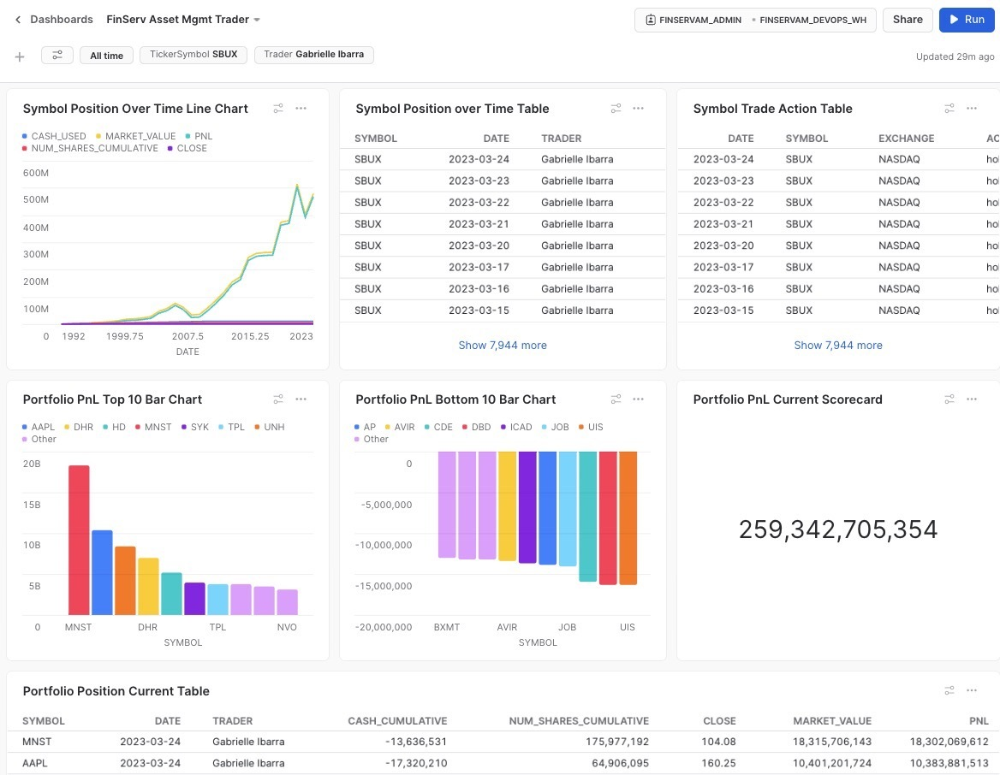

author: Allen Wong
id: financial-services-asset-management-snowflake
summary: Financial Services Asset Management Demo
categories: Getting-Started
environments: web
status: Published 
feedback link: https://github.com/Snowflake-Labs/sfguides/issues
tags: Getting Started, Data Science, Data Engineering, Twitter 

# Financial Services Asset Management
<!-- ------------------------ -->
## Overview 
Duration: 1

**Summary**
- What would a Single Version of the Truth (SVOT) for Asset Managers on Snowflake look like?

**Youtube Demo and Build this Quickstart from scratch**
<video id="pirYEnJWbnM"></video>

**Github**
- The code is [open-sourced on github](https://github.com/Snowflake-Labs/sfguide-financial-asset-management).

**Problem Statement:**
- Asset managers (big banks, insurance companies, and hedge funds) have spent hundreds of millions of dollars on systems to quickly and accurately give a SVOT in real-time.   These systems are critical especially in times of market stress like the Great Financial Crisis or any unexpected market change. 

**Why Snowflake**
- SnowSight allows you to create and share dashboards for executives, portfolio managers, risk managers, and traders.
- Significantly high performance and less cost of maintaining one SVOT    
- Near-Unlimited Compute and Concurrency enable quick data-driven decisions


**What we will see**
- Use Data Marketplace to instantly get free stock price history from the Zepl data share
- Query trade, cash, positions, and PnL (Profit and Loss) on Snowflake
- Use Window Functions to automate cash, position, and PnL reporting


### Prerequisites
- Snowflake Account or [Trial Account](https://signup.snowflake.com/) with accountadmin privileges.  

### You'll learn how to
- Query free stock market history data instantly with zero learning curve and time
- Run a Python faker function to create 100 synthetic traders
- Size up compute to create 3 billion synthetic trades
- Insert those trades ordered by trader, symbol, and date so any queries on that data are signficantly faster
- Create a cluster key to future proof that trade table from any data that has been inserted without being sorted
- Create a window function to calcluate real time trades, cash, and Profit and Loss (PnL)
- Query 3 billion rows with only small compute and 3 second run-time
- See Snowflake's 3 caches
- Zero Copy Clone for DevOps and instant sandboxes
- Time Travel to see and roll back up to 90 days of data
- Drop and Undrop Tables


<!-- ------------------------ -->
## Metadata Configuration
Duration: 2

- **summary**: Financial Services Asset Management
  - Query 3 billion rows with small compute in 3 seconds
- **id**: financial-services-asset-management-snowflake 
- **categories**: Solution-Examples 
- **environments**: web 
- **status**: Published
- **feedback link**: https://github.com/Snowflake-Labs/sfguides/issues
- **tags**: Getting Started, Financial Services, Asset Management, SnowSight
- **authors**: Allen Wong


<!-- ------------------------ -->
## Script "10 Setup"
Duration: 2

We setup
- Role Based Access Control RBAC
- Virtual Warehouses (compute)
- Database
- Objects

Run the <button>[finserv demo 10 setup](https://github.com/Snowflake-Labs/sfguide-financial-asset-management/blob/master/setup/finserv%20demo%2010%20setup.sql)</button> script.

You can watch a [Youtube of running script 10](https://youtu.be/pirYEnJWbnM?t=2262).

Each script is **idempotent** meaning that you can rerun it without issues.

<!-- ------------------------ -->
## Script "20 Marketplace"
Duration: 3

We:
- "mount" and verify the Knoema economy_data_atlas share
- ensure data quality, ie no duplicates and positive share prices
- Python Faker function (credit to [James Weakley's Flaker 2.0 - Fake Snowflake data the easy way](https://medium.com/snowflake/flaker-2-0-fake-snowflake-data-the-easy-way-dc5e65225a13))

### Knoema Economy Data Atlas

You can watch a [Youtube of running script 20 and mounting the share](https://youtu.be/pirYEnJWbnM?t=2455)

Run the <button>[finserv demo 20 Marketplace](https://github.com/Snowflake-Labs/sfguide-financial-asset-management/blob/master/setup/finserv%20demo%2020%20Marketplace.sql)</button> script.

"Mount" the free <button>[[Knoema Economy Data Atlas](https://app.snowflake.com/marketplace/listing/GZSTZ491VXQ/knoema-economy-data-atlas)</button> share.  Click "Get" then name the database **economy_data_atlas** and grant access to the **public** role.

```markdown
## Verify Data Marketplace Share
    select top 1 *
    from economy_data_atlas.economy.usindssp2020;
```


<!-- ------------------------ -->
## Script "30 DDL"
Duration: 6

We:
- Size up compute to create 3 billion synthetic trades
- Insert those trades ordered by trader, symbol, and date so any queries on that data are signficantly faster
- Create a cluster key to future proof that trade table from any data that has been inserted without being sorted
- Create a window function to calculate real time trades, cash, and Profit and Loss (PnL)

You can watch a [Youtube of running script 30](https://youtu.be/pirYEnJWbnM?t=2908)

Run the <button>[finserv demo 30 DDL](https://github.com/Snowflake-Labs/sfguide-financial-asset-management/blob/master/setup/finserv%20demo%2030%20DDL.sql)</button> script.

<!-- ------------------------ -->
## Script "40 Queries"
Duration: 3

We:
- Query 3 billion rows with only small compute and 3 second run-time
- See Snowflake's 3 caches
- Zero Copy Clone for DevOps and instant sandboxes
- Time Travel to see and roll back up to 90 days of data
- Drop and Undrop Tables

You can watch a [Youtube of running script 40](https://youtu.be/pirYEnJWbnM?t=3449)

Run the <button>[finserv demo 40 queries](https://github.com/Snowflake-Labs/sfguide-financial-asset-management/blob/master/setup/finserv%20demo%2040%20queries.sql)</button> script.

<!-- ------------------------ -->
## Script "60 Filter SnowSight"
Duration: 2

We setup
- Three Snowsight filters: Trader, TradeDate, and Snowsight

These filters give us reusable drop-downs throughout our Snowsight dashboards.  We set them to refresh once a day.

Build the <button>[finserv demo 60 filter Snowsight](https://github.com/Snowflake-Labs/sfguide-financial-asset-management/blob/master/snowsight/finserv%20demo%2060%20filter%20SnowSight.sql)</button> script.

You can watch a [Youtube of building the three Snowsight filters](https://youtu.be/pirYEnJWbnM?t=3589).

<!-- ------------------------ -->
## Script "70 Snowsight" Dashboard
Duration: 2

We setup
- a Snowsight dashboard with charts (line, bar, and scorecard)

Build un the <button>[finserv demo 70 SnowSight](https://github.com/Snowflake-Labs/sfguide-financial-asset-management/blob/master/snowsight/finserv%20demo%2070%20SnowSight.sql)</button>.

You can watch a [Youtube of building the dashboard](https://youtu.be/pirYEnJWbnM?t=4223).



<!-- ------------------------ -->
## Script "90 Optional Reset"
Duration: 2

Optional Script to reset / remove all objects created during this demo

Run the <button>[finserv demo 90 reset](https://github.com/Snowflake-Labs/sfguide-financial-asset-management/blob/master/optional/finserv%20demo%2090%20reset.sql)</button> script.

<!-- ------------------------ -->
## Conclusion
Duration: 2

### Recap
You can watch a [Youtube Recap of what we covered](https://youtu.be/pirYEnJWbnM?t=5894)

### What we've covered
- Query free stock market history data instantly with zero learning curve and time
- Run a Python faker function to create 100 synthetic traders
- Size up compute to create 3 billion synthetic trades
- Insert those trades ordered by trader, symbol, and date so any queries on that data are signficantly faster
- Create a cluster key to future proof that trade table from any data that has been inserted without being sorted
- Create a window function to calcluate real time trades, cash, and Profit and Loss (PnL)
- Query 3 billion rows with only small compute and 3 second run-time
- See Snowflake's 3 caches
- Zero Copy Clone for DevOps and instant sandboxes
- Time Travel to see and roll back up to 90 days of data
- Drop and Undrop Tables

### To see similar videos
[Modernizing Risk Analytics with Sigma on Snowflake](https://www.sigmacomputing.com/resources/modernizing-risk-analytics-with-sigma-on-snowflake).

[Allen Wong's Youtube Channel](https://www.youtube.com/@AllenWongTech).
