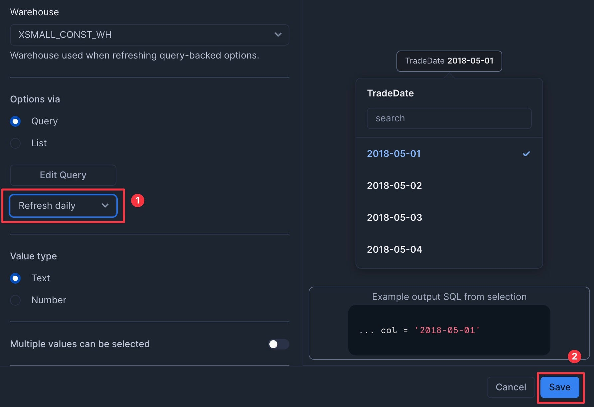
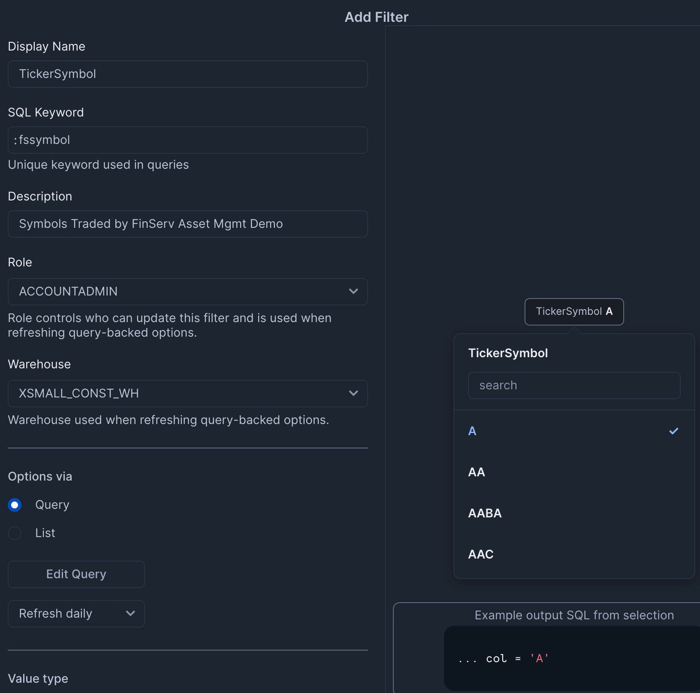
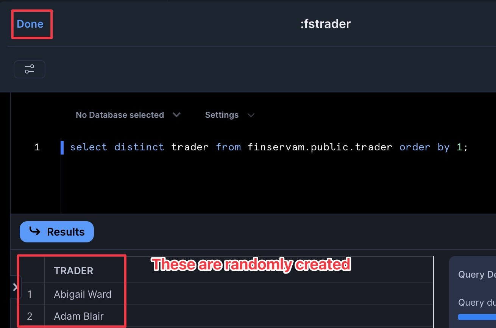

author: Allen Wong
id: financial-services-asset-management
categories: snowflake-site:taxonomy/solution-center/certification/quickstart, snowflake-site:taxonomy/industry/financial-services, snowflake-site:taxonomy/product/data-engineering, snowflake-site:taxonomy/snowflake-feature/build
language: en
summary: Build asset management real-time analytics on Snowflake for portfolio tracking, risk analysis, regulatory reporting, and investment insights.
environments: web
status: Archived
feedback link: https://github.com/Snowflake-Labs/sfguides/issues


# Build a Financial Services Asset Management P&L Dashboard

<!-- ------------------------ -->
## Overview

Data silos have been a significant problem in the Financial Services industry. During the Global Financial Crisis of 2008, firms without a Single Version of the Truth (SVOT) made multi-million dollar trading decisions without visibility into their risk, exposure, and the cascading impact of their positions. These data silos led to multi-billion dollar losses and bankruptcies.

In this guide, you'll build a Financial Services Asset Management demo in Snowflake that scales to handle 3 billion synthetic trades while providing real-time cash and profit/loss calculations. You'll learn how to leverage Snowflake's unique architecture to scale compute resources up and down as needed, create a dashboard for monitoring positions, and implement DevOps practices like zero-copy cloning and time travel.

### What You'll Learn
- How to query free stock market history data instantly without copying or moving data
- Creating synthetic traders and billions of trades using Python and SQL
- Scaling compute resources up and down to optimize performance and cost
- Implementing cluster keys and auto-clustering for performance optimization
- Creating interactive dashboards with filters for business users
- Using DevOps features like zero-copy cloning and time travel

### What You'll Build
A complete Financial Services Asset Management demo with:
- A database of 3 billion synthetic trades
- Real-time position, cash, and profit/loss calculations
- An interactive dashboard for monitoring trading positions
- DevOps capabilities for testing and rollback


This is powered by four SQL Worksheets and a Python Function:


### What You'll Need
- Access to a [Snowflake account](https://signup.snowflake.com/?utm_source=snowflake-devrel&utm_medium=developer-guides&utm_cta=developer-guides) (a free trial on Standard Edition will suffice)

<!-- ------------------------ -->
## Setup

### Mount a Free Data Share

First, we need to mount a free data share containing financial market data:

1. Log into your Snowflake account
2. Navigate to the Marketplace
3. Search for "Snowflake Public Data (Free)"
4. Click "Get" to mount this free share as a database named "Snow_Finance_Share"
5. Grant the PUBLIC role access to the database


### Create the Setup Worksheet

Now we'll create our first SQL worksheet to set up the environment:

1. Navigate to Worksheets Mode
2. Click the Plus Symbol (+), then SQL Worksheet


3. Click the Ellipsis and rename the script to "Finserv 10 Setup"


4. Copy and paste the following SQL:

```sql
-- Create role
use role accountadmin;
create role if not exists finservam_admin comment = 'Ownership of finservam database and demo';

-- Create compute
create warehouse if not exists finservam_devops_wh
with warehouse_size = 'xsmall' auto_suspend = 120 initially_suspended = true comment = 'Financial Services DevOps Compute';
create warehouse if not exists xsmall_const_wh
with warehouse_size = 'xsmall' auto_suspend = 60 initially_suspended = true comment = 'Constant so should always be XS and not resized';

-- Permissions are granular to meet your requirements
create database if not exists finservam comment = 'Financial Service Asset Management';
grant ownership on database finservam to role finservam_admin;
grant ownership on schema finservam.public to role finservam_admin;
grant ownership on warehouse finservam_devops_wh to role finservam_admin;
grant ownership on warehouse xsmall_const_wh to role sysadmin;
grant monitor, operate, usage on warehouse xsmall_const_wh to role finservam_admin;
grant role finservam_admin to role sysadmin;

use schema finservam.public;
create schema if not exists transform comment = 'for silver layer transformations in a medallion architecture. generally not meant for end user visibility';
grant ownership on schema transform to role finservam_admin;

use schema finservam.public;
use warehouse finservam_devops_wh;
```

5. Click the Inverted Chevron to **Run All**


<!-- ------------------------ -->
## Data Quality and Preparation

### Create the “Finserv 20 Data Quality” Worksheet

1. Create a new SQL Worksheet named "Finserv 20 Data Quality"


2. Copy and paste the following SQL:

```sql
-- setup
use role finservam_admin;
use warehouse finservam_devops_wh;
use schema finservam.public;

-- Verify Data Marketplace Share
select *
from Snow_Finance_Share.PUBLIC_DATA_FREE.stock_price_timeseries
where ticker = 'SNOW' and variable = 'post-market_close' order by date;

-- transform.exclude_symbol
create or replace table transform.exclude_symbol
comment = 'Exclude Symbols that have ever had a price less than 1 cent or greater than $4500'
as
select distinct ticker symbol
from Snow_Finance_Share.PUBLIC_DATA_FREE.stock_price_timeseries
where
variable = 'post-market_close'
and primary_exchange_name in ('NASDAQ CAPITAL MARKET', 'NEW YORK STOCK EXCHANGE')
and (value < .01 or value > 4500)
order by 1;

-- stock_history
create or replace transient table finservam.public.stock_history
comment = 'Daily closing prices for NASDAQ & NYSE'
as
select
ticker symbol,
date,
value close,
primary_exchange_code exchange,
asset_class
from Snow_Finance_Share.PUBLIC_DATA_FREE.stock_price_timeseries k
left outer join transform.exclude_symbol e on e.symbol = k.ticker
where
variable = 'post-market_close'
and primary_exchange_name in ('NASDAQ CAPITAL MARKET', 'NEW YORK STOCK EXCHANGE')
order by symbol, date;

--add comment on column
comment on column stock_history.close is 'security price at the end of the financial market business day';
```

### Create Python Faker Function

Next, we'll create a Python function to generate synthetic trader data:

```sql
-- Python fake function used to generate synthetic traders
create or replace function fake_py(locale varchar,provider varchar,parameters variant)
returns variant
language python
volatile
runtime_version = '3.9'
packages = ('faker','simplejson')
handler = 'fake'
as
$$
import simplejson as json
from faker import Faker
def fake(locale,provider,parameters):
  if type(parameters).__name__=='sqlNullWrapper':
    parameters = {}
  fake = Faker(locale=locale)
  return json.loads(json.dumps(fake.format(formatter=provider,**parameters), default=str))
$$;

-- Verify English & Chinese fake names
select fake_py('en_US','name',null)::varchar as FAKE_NAME from table(generator(rowcount => 10));
select fake_py('zh_CN','name',null)::varchar as FAKE_NAME from table(generator(rowcount => 10));
```

Run the entire worksheet to create the necessary tables and functions.

<!-- ------------------------ -->
## Generate Dataset

### Create the Trades Worksheet

1. Create a new SQL Worksheet named "Finserv 30 Billions of Trades"
2. Copy and paste the following SQL to set variables and create synthetic portfolio managers:

```sql
-- Set Variables (which we can use to scale up and down) and fake Portfolio Managers (PM)
-- Set context
use role finservam_admin; use warehouse finservam_devops_wh; use schema finservam.public;

-- Set Variables
set limit_trader = 300; //on xxlarge will create ~3B trades
set limit_pm = $limit_trader / 10; //Every Portfolio Manager (PM) will have about 10 traders reporting to her.

-- Portfolio Manager (PM)
-- Unique number generator
create or replace sequence pm_id;
create or replace transient table pm
comment = 'PM is the Portfolio Manager who manages the traders' as
select
fake_py('en_UK','name',null)::varchar as PM,
pm_id.nextval id
from table(generator(rowcount => $limit_pm));
```

### Create Synthetic Traders

Next, add the code to create synthetic traders:

```sql
-- Create Synthetic Traders
-- We don't need a transaction but we demo it
begin transaction;
    create or replace transient table trader
    comment = 'Trader with their Portfolio Manager (PM) and trader authorized buying power' as
    with cte as
    (
        select
        fake_py('en_US','name',null)::varchar as trader,
        uniform(1, $limit_pm, random()) PM_id, //random function to assign a PM to a trader
        uniform(500, 3500, random())::number buying_power //how much a trader can buy per day
        from table(generator(rowcount => $limit_trader))
    )
    select
        t.trader,
        pm.pm,
        t.buying_power
    from cte t
    inner join pm on t.pm_id = pm.id
    order by 2,1;
    
    comment on column public.trader.PM is 'Portfolio Manager (PM) manages traders';
    comment on column public.trader.buying_power is 'Trader is authorized this buying power in each transaction';
commit;
```

### Generate Billions of Trades

Now, we'll scale up our compute resources and generate billions of trades:

```sql
-- create billions of trades where action = buy
drop table if exists trade;

-- size up to save time since we are generating billions of trades
alter warehouse finservam_devops_wh set warehouse_size = 'xxlarge' wait_for_completion = TRUE enable_query_acceleration = true;

-- create billions of trades where action = buy
create or replace transient table trade
comment = 'trades made and cash used; unique_key: symbol, exchange, date'
as
select
    c.*,
    round(buying_power/close,0) num_shares,
    close * round(buying_power/close,0) * -1 cash,
    t.trader, t.PM
from
(
    select
    date, h.symbol, h.exchange, 'buy'::varchar(25) action, close
    from stock_history h
    where year(date) < 2021
) c
full outer join public.trader t
order by 8,2,1; -- Trader, symbol, date

-- create billions of trades where action = hold
insert into trade
select
    c.*,
    0 num_shares,
    0 cash,
    t.trader, t.PM
from
(
    select
    date, h.symbol, h.exchange, 'hold'::varchar(25) action, close
    from stock_history h
    where year(date) >= 2021
) c
full outer join public.trader t
order by 8,2,1; -- Trader, symbol, date

-- Size down to immediately save credits
alter warehouse finservam_devops_wh suspend;
alter warehouse finservam_devops_wh set warehouse_size = 'xsmall';
```

### Create Cluster Key and Position View

Finally, we'll optimize our table with a cluster key and create a view for position calculations:

```sql
-- Create clustered key based on what we sorted
alter table trade cluster by (trader, symbol, date);

-- Cluster_by column
show tables like 'trade';

-- Common-Table Expressions (CTEs) and window functions for real-time number of stock shares, cash used, and Profit and Loss
create or replace view public.position
(
    symbol, exchange, date, trader, pm, num_shares_cumulative, cash_cumulative, close, market_value,
    PnL comment 'Profit and Loss: Demonstrate comment on view column'
)
comment = 'what assets owned; demo Window Function running sum'
as
with cte as
(
select
    t.symbol, t.exchange, t.date, trader, pm,
    Sum(num_shares) OVER(partition BY t.symbol, t.exchange, trader ORDER BY t.date rows UNBOUNDED PRECEDING ) num_shares_cumulative,
    Sum(cash) OVER(partition BY t.symbol, t.exchange, trader ORDER BY t.date rows UNBOUNDED PRECEDING ) cash_cumulative,
    s.close
from public.trade t
inner join public.stock_history s on t.symbol = s.symbol and s.date = t.date
)
select
    *,
    num_shares_cumulative * close as market_value,
    (num_shares_cumulative * close) + cash_cumulative as PnL
from cte;

-- Business_date function to get current date used by the business
CREATE or replace FUNCTION business_date()
RETURNS date
MEMOIZABLE
AS
$$
    select max(date) dt from public.trade
$$;
```

Run the entire worksheet. Note that generating 3 billion trades will take approximately 5 minutes with an XXLarge warehouse.

<!-- ------------------------ -->
## DevOps in Production

### Create the DevOps Worksheet

1. Create a new SQL Worksheet named "Finserv 40 DevOps in Prod"
2. Copy and paste the following SQL to demonstrate ANSI-SQL compliance and instant row counts:

```sql
-- Context
use role finservam_admin; use warehouse finservam_devops_wh; use schema finservam.public;
alter warehouse finservam_devops_wh set warehouse_size = 'xsmall';

-- ANSI-Compliant, ie information_schema for data dictionary
select table_type object_type, table_name object_name, comment /* JSON */
  from information_schema.tables
  where table_schema = 'PUBLIC' and comment is not null
union all
select 'COLUMN' object_type, table_name || '.' || column_name object_type, comment
  from information_schema.columns
  where table_schema = 'PUBLIC' and comment is not null
 order by 1,2;

-- Instant rowcount and metadata
show tables like 'trade';

-- Let's format that rowcount
set q = last_query_id();
select "rows", TO_VARCHAR("rows", '999,999,999,999') "pretty_rowcount" from table(result_scan($q));
```

### Test Queries and Caching

Add the following SQL to test queries against a random trader and demonstrate Snowflake's caching capabilities:

```sql
-- Test against a random trader
set trader = (select top 1 trader from trader sample(1) where trader is not null);

-- Trade - date and quantity of buy, sell, or hold action on assets
select *
from trade
where trader = $trader and symbol = 'CMG'
order by date;

-- Notice the Solid State Drive (SSD cache) by running this query and - before the Virtual Warehouse suspends - rerun the query but change the date to something after your original date filter. [Because that data is already in the Compute layer's memory, it doesnt need to pull it from the micro-partitions again].
select *
from trade
where trader = $trader and symbol = 'SNOW' and action = 'buy' and date >= '2020-10-01'
order by date;

-- Window functions so we only pay storage for trade table while getting real-time calculations
select get_ddl('view','position');

-- Time-series: what are my real-time trades, cash, and PnL?
-- Notice query results cache on 2nd execution
select symbol, date, trader, cash_cumulative, num_shares_cumulative, close, market_value, PnL
from position where symbol = 'COST' and trader = $trader
order by date;

-- Metadata cache for count, min, max, etc
select count(*) from trade;

-- Python Faker: ie verify English & Chinese Synthetic names
select fake_py('en_US','name',null)::varchar as FAKE_NAME from table(generator(rowcount => 10));
select fake_py('zh_CN','name',null)::varchar as FAKE_NAME from table(generator(rowcount => 10));

-- Cross-Database Joins
select *
from Snow_Finance_Share.PUBLIC_DATA_FREE.stock_price_timeseries s
inner join finservam.public.stock_history h on s.ticker = h.symbol and h.date = s.date
where s.ticker = 'SNOW' and s.variable = 'post-market_close' and s.date = business_date();
```

### DevOps Features

Finally, add the following SQL to demonstrate DevOps features like zero-copy cloning, time travel, and undrop:

```sql
-- Zero Copy Clone for instant dev,qa,uat sandboxes and backups
use role sysadmin;
drop database if exists finservam_dev;

create database finservam_dev clone finservam;
grant ownership on database finservam_dev to role finservam_admin;
use role finservam_admin;

-- Clones are zero additional storage cost; storage cost is only on deltas;
-- ie if you have 10 TB in prod but change only 1 TB in your clone, you only pay for 11 automatically compressed TBs
select *
from finservam.public.trade
where trader = $trader and symbol = 'COST';

-- We can change clones without impacting production
select *
from finservam_dev.public.trade
where trader = $trader and symbol = 'COST';

update finservam_dev.public.trade
set symbol = 'CMG'
where trader = $trader and symbol = 'COST';

-- We use Time Travel for DevOps & Rollbacks [configurable from 0–90 days]
set queryID = last_query_id();

-- Currently Costco doesn't exist
select *
from finservam_dev.public.trade
where trader = $trader and symbol = 'COST';

-- But we can Time Travel to see before the (DML) delete
select *
from finservam_dev.public.trade
before (statement => $queryid)
where trader = $trader and symbol = 'COST';

-- Roll back our our change
insert into finservam_dev.public.trade
select *
from finservam_dev.public.trade
before (statement => $queryid)
where trader = $trader and symbol = 'COST';

-- Undrop is also up to 90 days of Time Travel; DBAs and Release Managers sleep much better than backup & restore
drop table finservam_dev.public.trade;

-- Uncomment this and watch it fail
-- select count(*) from finservam_dev.public.trade;

-- But we can undrop for the time travel that we have set
undrop table finservam_dev.public.trade;

-- We can also undrop databases
drop database if exists finservam_dev;
show databases like 'finserv%';

-- Notice temporary escalation of privileges in RBAC model
use role accountadmin;
undrop database finservam_dev;

use role finservam_admin;
show databases like 'finserv%';

-- Let's not wait for auto-suspend
alter warehouse finservam_devops_wh suspend;
use schema finservam.public;
```

Run the entire worksheet to demonstrate these features.

<!-- ------------------------ -->
## Creating Dashboard Filters

Now we'll create filters for our dashboard:

1. Navigate to Dashboards from the left sidebar (Home | Projects | Dashboards)


2. Click the Ellipsis in the top right and select "Manage Filters"


### Add the TradeDate Filter

1. Add a filter named "TradeDate" with the following settings:
   - Type: Date Range


   - SQL Query: `select distinct date from finservam.public.trade order by 1;`
   - Set to refresh daily to save credits. Then click **Save**.



### Add the TickerSymbol Filter

1. Add a filter named "TickerSymbol" with the following settings:
   - Type: Multi-select



   - SQL Query: `select distinct symbol from finservam.public.trade order by 1;`
   - Set to refresh daily


### Add the Trader Filter

1. Add a filter named "Trader" with the following settings:
   - Type: Multi-select


   - SQL Query: `select distinct trader from finservam.public.trader order by 1;`
   - Set to refresh daily



When complete, you should have three custom filters plus the two Snowsight system filters.


<!-- ------------------------ -->
## Building the Dashboard

Now we'll create the dashboard with multiple tiles:

1. Click the plus icon and select "Dashboard"


2. Name it "Finserv Asset Mgmt Dashboard"


3. Set the Role to "finservam_admin" and the Virtual Warehouse to "finservam_devops_wh"


### Add the Symbol Position Over Time Tile

1. Click "Add Tile" | "From SQL Worksheet"


2. Rename the tile to "Symbol Position Over Time"


3. Add the following SQL:

```sql
select
symbol, date, trader, round(cash_cumulative) * -1 cash_used, num_shares_cumulative, round(close,2) close,
round(market_value) market_value, round(PnL) PnL
from finservam.public.position where date = :daterange and symbol = :fssymbol and trader = :fstrader
order by date;
```

You’ll get an expected error. This is good as it now exposes the filters — that we created in the prior step — for us:


4. Set the DateRange, TickerSymbol, and Trader filters


5. Click "Chart" and add "Date" as the X-Axis with bucketing set to "Quarter"


6. Add the five other columns (cash_used, num_shares_cumulative, close, market_value, PnL) with "Use As" set to "Line" and "Aggregation" set to "Sum"


7. Click "Run"


Congrats you have added your first Chart Tile:


### Add the Portfolio PnL Top 10 Tile

1. Click "Plus" | "New Tile" | "From SQL Worksheet"


2. Rename the tile to "Portfolio PnL Top 10"
3. Add the following SQL:

```sql
select top 10 symbol, round(PnL) PnL
from finservam.public.position
where trader = :fstrader and date = finservam.public.business_date()
order by PnL desc;
```

4. Click "Chart" and ensure it's a "Bar" chart with "Vertical" appearance


5. Add "Symbol" as both the "Series" and "X-Axis"
6. Set "Grouping" to "Stacked" and leave "Stretching" as "No Stretching"
7. Click "Label X-Axis" to add "SYMBOL"
8. Click "Run"


9. Click "Return" to go back to the dashboard


Congrats, you have 2 of the 4 tiles complete!

### Add the Portfolio Current PnL Tile

1. Add a "New Tile" and name it "Portfolio Current PnL"
2. Add the following SQL:

```sql
select round(sum(PnL)) PnL
from finservam.public.position
where trader = :fstrader and date = finservam.public.business_date();
```

3. Set the Chart type as "Scorecard"
4. Click "Return" to go back to the dashboard


Congrats! You’ve created your dashboard!
For extra credit: You can now drag and drop the tiles to arrange them as desired.


<!-- ------------------------ -->
## Cleanup

If you want to clean up all the objects created in this guide, you can create a new worksheet named "Finserv 90 reset" with the following SQL:

```sql
-- Optional Script to remove all objects created during this demo
-- You can name this worksheet: "Finserv 90 reset"

use role finservam_admin;
drop database if exists finservam;
drop database if exists finservam_dev;
drop warehouse if exists finservam_devops_wh;

use role accountadmin;
drop role if exists finservam_admin;
-- optional
-- drop database if exists Snow_Finance_Share;
-- drop warehouse if exists xsmall_const_wh;


-- Note: You can also drop the Dashboard and the Dashboard Filters
```

<!-- ------------------------ -->
## Conclusion And Resources

Congratulations! You've successfully built a Financial Services Asset Management demo in Snowflake that handles 3 billion synthetic trades while providing real-time cash and profit/loss calculations. You've learned how to scale compute resources up and down as needed, create interactive dashboards, and implement DevOps practices like zero-copy cloning and time travel.

### What You Learned
- Queried free stock market history data without copying or moving data
- Created synthetic traders and billions of trades using Python and SQL
- Scaled compute resources up and down to optimize performance and cost
- Implemented cluster keys and auto-clustering for performance optimization
- Created interactive dashboards with filters for business users
- Used DevOps features like zero-copy cloning and time travel

### Related Resources

Articles:
- [Flaker 2.0: Fake Snowflake Data the Easy Way](https://medium.com/snowflake/flaker-2-0-fake-snowflake-data-the-easy-way-dc5e65225a13)
- [Snowflake Caching Mechanisms](https://docs.snowflake.com/en/user-guide/performance-concepts#caching)
- [Time Travel in Snowflake](https://docs.snowflake.com/en/user-guide/data-time-travel)

Documentation:
- [Snowflake Documentation](https://docs.snowflake.com/)
- [Snowflake Editions and Features](https://docs.snowflake.com/en/user-guide/intro-editions)
- [Snowsight Filters](https://docs.snowflake.com/en/user-guide/ui-snowsight-filters)

Additional Reading:
- [Snowflake for Asset Management](/en/solutions/industries/financial-services/asset-management/)
- [Asset Management With Snowflake: Real-Time Cash & PnL On 3 Billion Trades](https://youtu.be/HkrRXMHDd-E?si=nf0lAupIKK8HVMuM)
