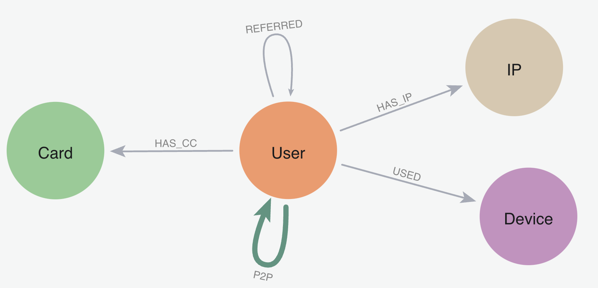

author: corydon_baylor
id: finding_fraudulent_communities_with_neo4j
summary: How to find communities affected by fraud using louvain in Neo4j Graph Analytics for Snowflake
categories: getting-started,partner-integrations
environments: web
status: Published 
feedback link: https://github.com/Snowflake-Labs/sfguides/issues
tags: Getting Started, Data Science, Data Engineering, Twitter 

# Finding Fraudulent Communities with Neo4j

<!-- ------------------------ -->

## Overview

Duration: 2

### What is Neo4j Graph Analytics for Snowflake?

**Neo4j Graph Analytics for Snowflake** brings the power of graph directly to Snowflake, allowing users to run 65+ ready-to-use algorithms on their data, all without leaving Snowflake!

Neo4j is the global leader in Graph Database & Analytics. As the world's most deployed graph technology, we help organizations uncover hidden patterns and relationships across billions of data connections deeply, easily, and quickly. 

### Discovering Communities in Peer-to-Peer (P2P) Fraud

P2P Fraud Losses are Skyrocketing. 8% of banking customers reported being victims of P2P Scams in the past year, and the average loss to these scams was $176.

Finding different communities within P2P transactions is the first step towards identifying and ultimately ending P2P fraud.

### Prerequisites

- The Native App Neo4j Graph Analytics for Snowflake

### What You Will Need

- Active Snowflake account with appropriate access to databases and schemas
- Basic knowledge of using a Snowflake SQL Worksheet
- Neo4j Graph Analytics application installed from the Snowflake marketplace. Access the marketplace via the menu bar on the left hand side of your screen, as seen below:

### What You Will Learn

- How to prepare and project your data for graph analytics
- How to use community detection to identify fraud
- How to read and write directly from and to your snowflake tables

### What You Will Build

- A method to identify communities that are at high risk of fraud in P2P networks

<!-- ------------------------ -->

## Loading the Data

Duration: 5

Dataset overview : This dataset is modelled to design and analyze a peer to peer transaction network to identify fraudulent activity using graph analytics.



Let's name our database `P2P_DEMO`. Using the CSVs found [here](https://drive.google.com/drive/u/1/folders/1BnAnRSEfuwDvc4eQH8IRvy3tUkwOeaNf), We are going to add two new tables:

- One called `P2P_TRANSACTIONS` based on the p2p_transactions.csv
- One called `P2P_USERS` based on p2p_users.csv

Follow the steps found [here](https://docs.snowflake.com/en/user-guide/data-load-web-ui) to load in your data.

<!-- ------------------------ -->

## Setting Up

Before we run our algorithms, we need to set the proper permissions. But before we get started granting different roles, we need to ensure that you are using `accountadmin` to grant and create roles. Lets do that now:

```sql
-- you must be accountadmin to create role and grant permissions
use role accountadmin;
```

Next let's set up the necessary roles, permissions, and resource access to enable Graph Analytics to operate on data within the `P2P_DEMO.PUBLIC schema`. It creates a consumer role (gds_role) for users and administrators, grants the GDS application access to read from and write to tables and views, and ensures that future tables are accessible.

It also provides the application with access to the required compute pool and warehouse resources needed to run graph algorithms at scale.

```sql
USE SCHEMA P2P_DEMO.PUBLIC;

-- Create a consumer role for users of the GDS application
CREATE ROLE IF NOT EXISTS gds_role;
GRANT APPLICATION ROLE neo4j_graph_analytics.app_user TO ROLE gds_role;
-- Create a consumer role for administrators of the GDS application
CREATE ROLE IF NOT EXISTS gds_role;
GRANT APPLICATION ROLE neo4j_graph_analytics.app_admin TO ROLE gds_role;


-- Grant access to consumer data
-- The application reads consumer data to build a graph object, and it also writes results into new tables.
-- We therefore need to grant the right permissions to give the application access.
GRANT USAGE ON DATABASE p2p_demo TO APPLICATION neo4j_graph_analytics;
GRANT USAGE ON SCHEMA P2P_DEMO.PUBLIC TO APPLICATION neo4j_graph_analytics;

-- required to read tabular data into a graph
GRANT SELECT ON ALL TABLES IN SCHEMA P2P_DEMO.PUBLIC TO APPLICATION neo4j_graph_analytics;
-- required to write computation results into a table
GRANT CREATE TABLE ON SCHEMA P2P_DEMO.PUBLIC TO APPLICATION neo4j_graph_analytics;
-- optional, ensuring the consumer role has access to tables created by the application
GRANT ALL PRIVILEGES ON FUTURE TABLES IN SCHEMA P2P_DEMO.PUBLIC TO ROLE gds_role;

-- required to write computation results into a table
GRANT CREATE VIEW ON SCHEMA P2P_DEMO.PUBLIC TO APPLICATION neo4j_graph_analytics;
GRANT SELECT ON ALL VIEWS IN SCHEMA P2P_DEMO.PUBLIC TO APPLICATION neo4j_graph_analytics;
```

Now we will switch to the role we just created:

```sql
use role gds_role;
```

<!-- ------------------------ -->

## Cleaning Our Data

Duration: 5

We need our data to be in a particular format in order to work with Graph Analytics. In general it should be like so:

### For the table representing nodes:

The first column should be called `nodeId`, which represents the ids for the each node in our graph.

### For the table representing relationships:

We need to have columns called `sourceNodeId` and `targetNodeId`. These will tell Graph Analytics the direction of the transaction, which in this case means:

- Who sent the money (sourceNodeId) and
- Who received it (targetNodeId)
- We also include a total_amount column that acts as the weights in the relationship

We are going to use aggregated transactions for our relationships. Let's create that table now:

```sql
CREATE OR REPLACE TABLE P2P_DEMO.PUBLIC.P2P_AGG_TRANSACTIONS (
    SOURCENODEID NUMBER(38,0),
    TARGETNODEID NUMBER(38,0),
    TOTAL_AMOUNT FLOAT
) AS
SELECT sourceNodeId, targetNodeId, SUM(transaction_amount) AS total_amount
FROM P2P_DEMO.PUBLIC.P2P_TRANSACTIONS
GROUP BY sourceNodeId, targetNodeId;
SELECT * FROM P2P_DEMO.PUBLIC.P2P_AGG_TRANSACTIONS;
```

| SOURCENODEID | TARGETNODEID | TOTAL_AMOUNT |
| ------------ | ------------ | ------------ |
| 12220936     | 14468841     | 166.5        |
| 12221039     | 14859796     | 10           |
| 12221065     | 13631049     | 1000         |

We are also going to create a view that just has the unique `nodeId`s from the `p2p_demo` table and use that as the nodes when we project the graph in the next step:


```sql
CREATE OR REPLACE VIEW p2p_users_vw (nodeId) AS
    SELECT DISTINCT P2P_DEMO.PUBLIC.p2p_users.NODEID as nodeid
    FROM p2p_users;
```

<!-- ------------------------ -->

## Running your Algorithms

Duration: 10

Now we are finally at the step where we create a projection, run our algorithms, and write back to snowflake. We will run louvain to determine communities within our data. Louvain identifies communities by grouping together nodes that have more connections to each other than to nodes outside the group.

You can find more information about writing this function in our [documentation](https://neo4j.com/docs/snowflake-graph-analytics/preview/algorithms/louvain/).

You can use this code block as an outline of what you need to fill in:

```
CALL neo4j_graph_analytics.graph.wcc('COMPUTE_POOL', {
    'project': {
        'nodeTables': ['EXAMPLE_DB.DATA_SCHEMA.NODES'],
        'relationshipTables': {
            'EXAMPLE_DB.DATA_SCHEMA.RELATIONSHIPS': {
                'sourceTable': 'EXAMPLE_DB.DATA_SCHEMA.NODES',
                'targetTable': 'EXAMPLE_DB.DATA_SCHEMA.NODES',
                'orientation': 'NATURAL'
            }
        }
    },
        'compute': { 'consecutiveIds': true },
    'write': [{
        'nodeLabel': 'NODES',
        'outputTable': 'EXAMPLE_DB.DATA_SCHEMA.NODES_COMPONENTS'
    }]
});
```

But broadly, you will need a few things:

| Name                                      | Description                                        | Our Value                              |
| ----------------------------------------- | -------------------------------------------------- | -------------------------------------- |
| `EXAMPLE_DB.DATA_SCHEMA.NODES`            | A table for nodes                                  | `P2P_DEMO.PUBLIC.p2p_users_vw`         |
| `EXAMPLE_DB.DATA_SCHEMA.RELATIONSHIPS`    | A table for relationships                          | `P2P_DEMO.PUBLIC.P2P_AGG_TRANSACTIONS` |
| `COMPUTE_POOL`                            | The size of the compute pool you would like to use | `CPU_X64_XS`                           |
| `EXAMPLE_DB.DATA_SCHEMA.NODES_COMPONENTS` | A table to output results                          | `P2P_DEMO.PUBLIC.p2p_users_vw_lou`     |
| `NODES`                                   | A node label for our nodes                         | `p2p_users_vw`                         |


```sql
CALL neo4j_graph_analytics.graph.louvain('CPU_X64_XS', {
    'project': {
        'nodeTables': ['P2P_DEMO.PUBLIC.p2p_users_vw'],
        'relationshipTables': {
            'P2P_DEMO.PUBLIC.P2P_AGG_TRANSACTIONS': {
                'sourceTable': 'P2P_DEMO.PUBLIC.p2p_users_vw',
                'targetTable': 'P2P_DEMO.PUBLIC.p2p_users_vw',
                'orientation': 'NATURAL'
            }
        }
    },
    'compute': { 'consecutiveIds': true },
    'write': [{
        'nodeLabel': 'p2p_users_vw',
        'outputTable': 'P2P_DEMO.PUBLIC.p2p_users_vw_lou'
    }]
});
```

Our resulting table assigns a community id to each node based on their connections to other nodes in the graph.

```sql
SELECT community,   COUNT(*) AS community_size,
FROM P2P_DEMO.PUBLIC.p2p_users_vw_lou
GROUP BY community
ORDER BY community_size DESC;
```

| community | community_size |
| --------- | -------------- |
| 40        | 716            |
| 26        | 529            |

We can then use then add in the `fraud_transfer_flag` (which was provided by the vendor) to our communities to see if users in that community are at greater risk for fraud:

```sql
SELECT
  l.community,
  COUNT(*) AS community_size,
  SUM(n.fraud_transfer_flag) AS fraud_count
FROM
  p2p_users_vw_lou l
JOIN
  p2p_users n
ON
  l.nodeId = n.nodeId
GROUP BY
  l.community
ORDER BY
  community_size DESC, fraud_count DESC;
```

| community | community_size | fraud_count |
| --------- | -------------- | ----------- |
| 40        | 716            | 3           |
| 26        | 529            | 2           |
| 4         | 489            | 0           |

## Conclusions and Resources

Duration: 1

In this quickstart, you learned how to bring the power of graph insights into Snowflake using Neo4j Graph Analytics.

### What you learned

By working with a P2P transaction dataset, you were able to:

1. Set up the Neo4j Graph Analytics application within Snowflake.
2. Prepare and project your data into a graph model (users as nodes, transactions as relationships).
3. Ran Louvain community detection to identify clusters of users with high internal interaction.

### Resources

- [Neo4j Graph Analytics Documentation](https://neo4j.com/docs/snowflake-graph-analytics/preview/)
- [Installing Neo4j Graph Analytics on SPCS](https://neo4j.com/docs/snowflake-graph-analytics/preview/installation/)

If you have any questions, reach out to your Neo4j account manager or Snowflake account team!