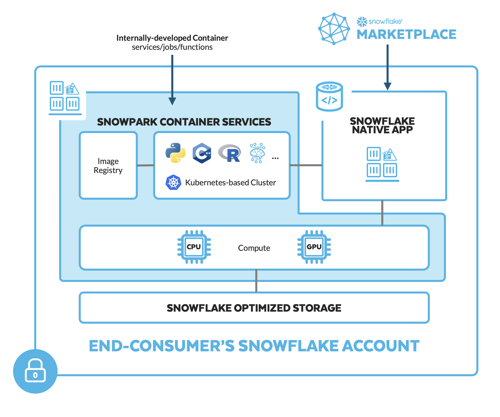
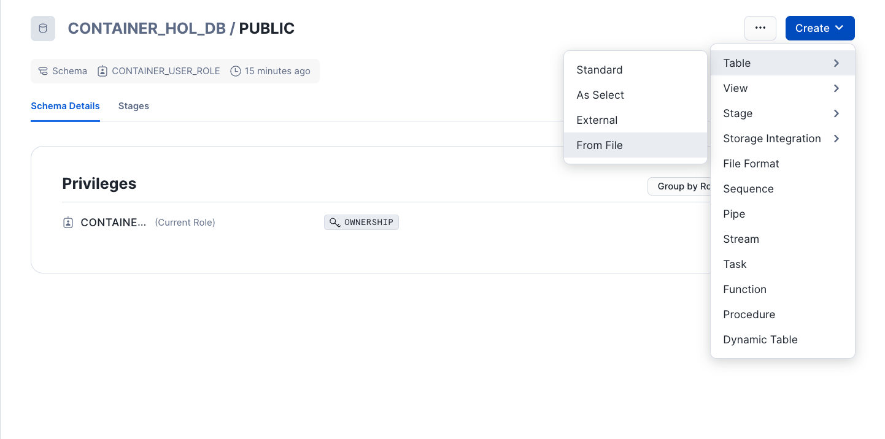
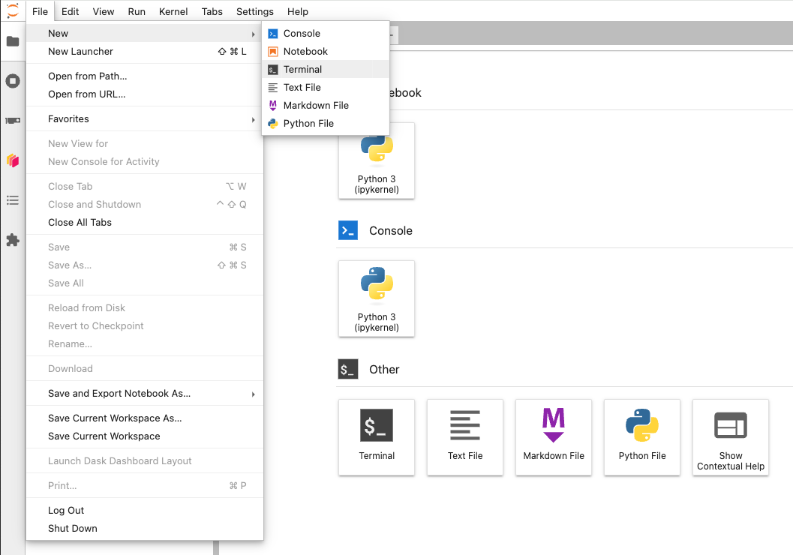
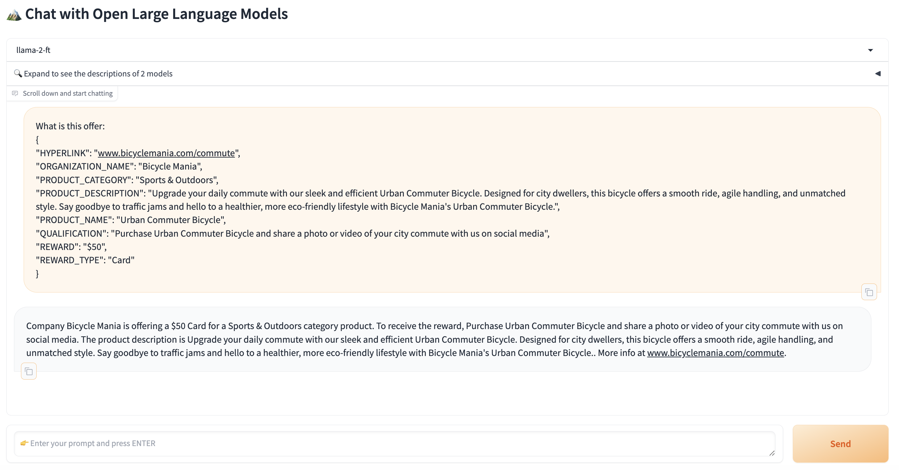

author: Jason Summer
id: fine-tune-an-llm-in-snowpark-container-services-with-autotrain
summary: Fine-Tuning an LLM in Snowpark Container Services with AutoTrain
categories: Getting-Started
environments: web
status: Published 
feedback link: https://github.com/Snowflake-Labs/sfguides/issues
tags: Data Science, LLM, AI 

# Fine-Tuning an LLM in Snowpark Container Services with AutoTrain
<!-- ------------------------ -->
## Overview 
Duration: 5

By completing this guide, you will fine-tune an open-source Large Language Model (LLM) in Snowpark Container Services using HuggingFace's AutoTrain-Advanced module. The result will be an LLM further trained to understand and describe raw product metadata in a specific format.

Here is a summary of what you will be able to learn in each step by following this quickstart:

- **Environment Setup**: Establish Snowflake objects, roles, and grants for Snowpark Container Services
- **Training Data**: Format and load training data into Snowflake stage
- **Service Image & Spec**: Construct, build, and push a docker image and specification file to Snowflake
- **Container Service**: Start a Snowpark Container Service and monitor its status
- **LLM Prompting**: Start a web application in Snowpark Container Service to chat with the fine-tuned (and base) LLM(s)

In case you are new to some of the technologies mentioned above, here’s an overview with links to documentation.

Through this quickstart guide, you will use [Snowpark Container Services](https://docs.snowflake.com/en/developer-guide/snowpark-container-services/overview), which are now in Public Preview on AWS and Private Preview on Azure and Google Cloud. **Please note: this quickstart assumes some existing knowledge and familiarity with containerization (e.g. Docker) and basic familiarity with container orchestration.**

### What is Snowpark Container Services?



[Snowpark Container Services](https://docs.snowflake.com/en/developer-guide/snowpark-container-services/overview) is a fully managed container offering that allows you to easily deploy, manage, and scale containerized services, jobs, and functions, all within the security and governance boundaries of Snowflake, and requiring zero data movement. As a fully managed service, SPCS comes with Snowflake’s native security, RBAC support, and built-in configuration and operational best-practices.

Snowpark Container Services are fully integrated with both Snowflake features and third-party tools, such as Snowflake Virtual Warehouses and Docker, allowing teams to focus on building data applications, and not building or managing infrastructure. Just like all things Snowflake, this managed service allows you to run and scale your container workloads across regions and clouds without the additional complexity of managing a control plane, worker nodes, and also while having quick and easy access to your Snowflake data.

The introduction of Snowpark Container Services on Snowflake includes the incorporation of new object types and constructs to the Snowflake platform, namely: images, image registry, image repositories, compute pools, specification files, services, and jobs.

For more information on these objects, check out [this article](https://medium.com/snowflake/snowpark-container-services-a-tech-primer-99ff2ca8e741) along with the Snowpark Container Services [documentation](https://docs.snowflake.com/en/developer-guide/snowpark-container-services/overview).

Note that while in this quickstart, we will predominantly use the direct SQL commands to interact with Snowpark Container Services and their associated objects, there is also [Python API support](https://docs.snowflake.com/developer-guide/snowflake-python-api/snowflake-python-overview) in Public Preview that you can also use. Refer to the [documentation](https://docs.snowflake.com/developer-guide/snowflake-python-api/snowflake-python-overview) for more info.

### What is Fine-Tuning?

Out of the box, LLMs can comprehend natural language but tend to fall short in use cases that require additional context, formatting, behavior, or style. While context or specific instructions can be dynamically passed to the LLM, the amount of context, knowledge, or instruction may exceed the context window (or memory) of a given LLM. In such cases, fine-tuning, or training a model on input-output pairs can be considered. As a simplified example, we will be fine-tuning an LLM to describe product metadata from its raw form.

### What is AutoTrain-Advanced?


Fine-tuning can be a rather complex process. To alleviate much of this complexity, we will be running HuggingFace's AutoTrain-Advanced Python package in the containerized service to securely fine-tune an LLM using Snowflake compute. AutoTrain-Advanced will use pairs of inputs and outputs to fine-tune an open-source LLM to make its outputs better align to our use case's expectations. Refer to the [documentation](https://huggingface.co/docs/autotrain/index) for more info.

### What you will learn 
- The basic mechanics of how Snowpark Container Services works
- How to deploy a long-running service with a UI and use volume mounts to persist LLMs in the file system
- How to fine-tune an LLM with HuggingFace's AutoTrain-Advanced module
- How to deploy an LLM chat-interface with FastChat (optional)

### Prerequisites

- Download the git repo [here](https://github.com/Snowflake-Labs/sfguide-fine-tuning-llms-with-spcs-huggingface-autotrain/tree/main). You can simply download the repo as a .zip if you don't have Git installed locally.
- [Docker Desktop](https://www.docker.com/products/docker-desktop/) installed
- [HuggingFace Token](https://huggingface.co/docs/hub/en/security-tokens)
- A non-trial Snowflake account in a supported [AWS region](https://docs.snowflake.com/en/developer-guide/snowpark-container-services/overview#available-regions).
- A Snowflake account login with a role that has the `ACCOUNTADMIN` role. If not, you will need to work with your `ACCOUNTADMIN` to perform the initial account setup (e.g. creating the `CONTAINER_USER_ROLE` and granting required privileges, as well as creating the OAuth Security Integration).
- (Optional) [VSCode](https://code.visualstudio.com/) (recommended) with the [Docker](https://marketplace.visualstudio.com/items?itemName=ms-azuretools.vscode-docker) and [Snowflake](https://marketplace.visualstudio.com/items?itemName=snowflake.snowflake-vsc) extensions installed.
- (Optional) [SnowSQL](https://docs.snowflake.com/en/user-guide/snowsql-install-config) or [SnowCLI](https://github.com/snowflakedb/snowflake-cli) installed and configured for Snowflake account.


<!-- ------------------------ -->
## Setup Environment
Duration: 10

> aside positive
> IMPORTANT: The Snowflake environment setup that follows is similar to the setup in [Quickstart: Intro to Snowpark Container Services](https://quickstarts.snowflake.com/guide/intro_to_snowpark_container_services/index.html#1). However, here we have added an additional statement at the end to create a GPU-powered compute pool. You only need to complete the Setup Environment section.

Run the following SQL commands in [`00_snowflake_setup.sql`](https://github.com/Snowflake-Labs/sfguide-fine-tuning-llms-with-spcs-huggingface-autotrain/blob/main/00_snowflake_setup.sql) using the Snowflake VSCode Extension OR in a SQL worksheet to create the role, database, warehouse, and stages that we need to get started:
```SQL
// Create an CONTAINER_USER_ROLE with required privileges
USE ROLE ACCOUNTADMIN;
CREATE ROLE CONTAINER_USER_ROLE;
GRANT CREATE DATABASE ON ACCOUNT TO ROLE CONTAINER_USER_ROLE;
GRANT CREATE WAREHOUSE ON ACCOUNT TO ROLE CONTAINER_USER_ROLE;
GRANT CREATE COMPUTE POOL ON ACCOUNT TO ROLE CONTAINER_USER_ROLE;
GRANT CREATE INTEGRATION ON ACCOUNT TO ROLE CONTAINER_USER_ROLE;
GRANT MONITOR USAGE ON ACCOUNT TO  ROLE  CONTAINER_USER_ROLE;
GRANT BIND SERVICE ENDPOINT ON ACCOUNT TO ROLE CONTAINER_USER_ROLE;
GRANT IMPORTED PRIVILEGES ON DATABASE snowflake TO ROLE CONTAINER_USER_ROLE;

// Grant CONTAINER_USER_ROLE to ACCOUNTADMIN
grant role CONTAINER_USER_ROLE to role ACCOUNTADMIN;

// Create Database, Warehouse, and Image spec stage
USE ROLE CONTAINER_USER_ROLE;
CREATE OR REPLACE DATABASE CONTAINER_HOL_DB;

CREATE OR REPLACE WAREHOUSE CONTAINER_HOL_WH
  WAREHOUSE_SIZE = XSMALL
  AUTO_SUSPEND = 120
  AUTO_RESUME = TRUE;
  
CREATE STAGE IF NOT EXISTS specs
ENCRYPTION = (TYPE='SNOWFLAKE_SSE');

CREATE STAGE IF NOT EXISTS volumes
ENCRYPTION = (TYPE='SNOWFLAKE_SSE')
DIRECTORY = (ENABLE = TRUE);
```

Run the following SQL commands in [`01_snowpark_container_services_setup.sql`](https://github.com/Snowflake-Labs/sfguide-fine-tuning-llms-with-spcs-huggingface-autotrain/blob/main/01_snowpark_container_services_setup.sql) using the Snowflake VSCode Extension OR in a SQL worksheet to create the [OAuth Security Integration](https://docs.snowflake.com/en/user-guide/oauth-custom#create-a-snowflake-oauth-integration), [External Access Integration](https://docs.snowflake.com/developer-guide/snowpark-container-services/additional-considerations-services-jobs#network-egress), [compute pool](https://docs.snowflake.com/en/developer-guide/snowpark-container-services/working-with-compute-pool), and our [image repository](https://docs.snowflake.com/en/developer-guide/snowpark-container-services/working-with-registry-repository).
```SQL
USE ROLE ACCOUNTADMIN;
CREATE SECURITY INTEGRATION IF NOT EXISTS snowservices_ingress_oauth
  TYPE=oauth
  OAUTH_CLIENT=snowservices_ingress
  ENABLED=true;

CREATE OR REPLACE NETWORK RULE ALLOW_ALL_RULE
  TYPE = 'HOST_PORT'
  MODE = 'EGRESS'
  VALUE_LIST= ('0.0.0.0:443', '0.0.0.0:80');

CREATE EXTERNAL ACCESS INTEGRATION ALLOW_ALL_EAI
  ALLOWED_NETWORK_RULES = (ALLOW_ALL_RULE)
  ENABLED = true;

GRANT USAGE ON INTEGRATION ALLOW_ALL_EAI TO ROLE CONTAINER_USER_ROLE;

USE ROLE CONTAINER_USER_ROLE;
USE DATABASE CONTAINER_HOL_DB;

CREATE IMAGE REPOSITORY CONTAINER_HOL_DB.PUBLIC.IMAGE_REPO;

CREATE COMPUTE POOL IF NOT EXISTS CONTAINER_HOL_POOL_GPU_NV_M
MIN_NODES = 1
MAX_NODES = 1
INSTANCE_FAMILY = GPU_NV_M
AUTO_RESUME = true;
```
- The [OAuth security integration](https://docs.snowflake.com/en/user-guide/oauth-custom#create-a-snowflake-oauth-integration) will allow us to login to our UI-based services using our web browser and Snowflake credentials
- The [External Access Integration](https://docs.snowflake.com/developer-guide/snowpark-container-services/additional-considerations-services-jobs#network-egress) will allow our services to reach outside of Snowflake to the public internet
- The [compute pool](https://docs.snowflake.com/en/developer-guide/snowpark-container-services/working-with-compute-pool) is the set of compute resources on which our services will run
- The [image repository](https://docs.snowflake.com/en/developer-guide/snowpark-container-services/working-with-registry-repository) is the location in Snowflake where we will push our Docker images so that our services can use them

> aside positive
> IMPORTANT: If you use different names for objects created in this section, be sure to update scripts and code in the following sections accordingly.

<!-- ------------------------ -->
## Training Data
Duration: 5

LLM fine-tuning (specifically, [Supervised Fine-Tuning / Generic Trainer](https://huggingface.co/docs/autotrain/llm_finetuning)) with AutoTrain-Advanced requires a csv file named `train.csv` containing a single column named `text`. 
The format of the `text` column contents is flexible but should align with the intended purpose and API used to engage with the LLM. Furthermore, it may be necessary to manually align the content to the original format used in training the LLM. The below setup will create records that mirror the original format used in training Meta's Llama model series. 

Follow these steps to create the training data:
  1. Download `product_offers.csv` from the `data` folder (if you have not already done so).
  2. Upload `product_offers.csv` as a table in `CONTAINER_HOL_DB.PUBLIC` in Snowsight:
  
      - Select Database `CONTAINER_HOL_DB` and `PUBLIC` schema
      - Click "Create Table From File"
      - Select or drag `product_offers.csv` to upload and name the table `PRODUCT_OFFERS`. Click Next.
      - Expand "View options" and set Header to `First line contains header` (if not selected). Click "Load".
  > aside negative
> NOTE: If you receive an `Error Parsing Columns` file upload error, change your default warehouse to `CONTAINER_HOL_WH` or one available to the current role.
  3. Run the following SQL commands in [`02_training_data.sql`](https://github.com/Snowflake-Labs/sfguide-fine-tuning-llms-with-spcs-huggingface-autotrain/blob/main/02_training_data.sql)
  ```SQL
  USE ROLE CONTAINER_USER_ROLE;
  
  // Create table of training data
  CREATE OR REPLACE TABLE CONTAINER_HOL_DB.PUBLIC.TRAINING_TABLE AS
  SELECT 
      CONCAT('<s>[INST] <<SYS>>', INSTRUCTION,'<</SYS>>', METADATA,'[/INST]', DESCRIPTION, '</s>') AS "text"
  FROM (
  SELECT
    'You are a customer service assistant with knowledge of product rewards available to customers. Describe this reward offering given reward metadata.' as INSTRUCTION
    ,TO_VARCHAR(OBJECT_CONSTRUCT(*)) AS METADATA
    ,CONCAT
    (
      'Company '
      ,ORGANIZATION_NAME
      ,' is offering a '
      ,REWARD
      ,' '
      ,REWARD_TYPE
      ,' for a '
      ,PRODUCT_CATEGORY
      ,' category product. To receive the reward, '
      ,QUALIFICATION
      ,'. The product description is '
      ,PRODUCT_DESCRIPTION
      ,' More info at '
      ,HYPERLINK
      ,'.'
  ) as DESCRIPTION
  FROM CONTAINER_HOL_DB.PUBLIC.PRODUCT_OFFERS);

  // Create training file in stage
  COPY INTO @CONTAINER_HOL_DB.PUBLIC.VOLUMES/train.csv
  FROM CONTAINER_HOL_DB.PUBLIC.TRAINING_TABLE
  FILE_FORMAT = (
          TYPE = CSV
          FIELD_OPTIONALLY_ENCLOSED_BY = '"'
          ESCAPE_UNENCLOSED_FIELD = NONE
          COMPRESSION = None
      )
    OVERWRITE = TRUE
    SINGLE=TRUE
    HEADER=TRUE;
  ```


<!-- ------------------------ -->
## Service Image & Specification
Duration: 20

Next, we will craft the below ingredients for the Snowpark Container Service. If unfamiliar with defining Snowpark Container Services, see the [Intro to Snowpark Container Service Quickstart](https://quickstarts.snowflake.com/guide/intro_to_snowpark_container_services/index.html?index=..%2F..index#0) or [Snowpark Container Services tutorials](https://docs.snowflake.com/en/developer-guide/snowpark-container-services/overview-tutorials).

- **Dockerfile**: Normal Dockerfile document containing all the necessary setup, installations, and commands to execute the solution as a containerized service.
- **entrypoint.sh**: Script of commands to execute when the containerized service runs.
- [**specification.yaml**](https://docs.snowflake.com/en/developer-guide/snowpark-container-services/specification-reference): Specification file providing the necessary information to configure and run the containerized service.

### Build and Push Image

Navigate to `src/autotrain.Dockerfile` in the project directory or paste the below into a text file and save as `autotrain.Dockerfile`. The Dockerfile will create an image with GPU support via CUDA API, install several packages including `autotrain-advanced`, and lastly execute the `entrypoint.sh` script at start.
  ```Dockerfile
  FROM nvcr.io/nvidia/rapidsai/rapidsai:23.06-cuda11.8-runtime-ubuntu22.04-py3.10

  # Set the working directory
  WORKDIR /workspace/

  RUN mkdir /workspace/.local /workspace/.cache && chmod 777 -R /workspace
  COPY --chmod=777 ./ ./

  # Install the dependencies
  RUN apt-get update && apt-get install git-lfs && git lfs install
  RUN pip install --no-cache-dir --upgrade pip && pip install autotrain-advanced==0.6.79 --force-reinstall && pip install requests botocore torch torchvision torchaudio
  RUN apt-get install -y ffmpeg libsm6 libxext6
  RUN autotrain setup

  # Run Jupyter Notebook on container startup
  ENTRYPOINT ["./entrypoint.sh"]
  ```

If you have not cloned/downloaded the project repository, create and save an `entrypoint.sh` file with the below content. This is not necessary if you've cloned or downloaded the project repository as you will already have this file.

At startup, the container will execute these commands which will start a JupyterLab Notebook, download an LLM and begin fine-tuning, and remain running (until suspended/dropped).

  ```bash
  #!/bin/bash
  nohup jupyter lab --ip=0.0.0.0 --port=8888 --no-browser --allow-root --NotebookApp.token='' --NotebookApp.password='' > jupyter.out 2>jupyter.err &
  echo "Fine-funing starting..."
  nohup autotrain llm --train --project-name $PROJECT_NAME --model $MODEL_CARD --data-path stage/ --text_column text --use-peft --quantization int4 --lr 1e-4 --train-batch-size 4 --epochs 3 --trainer sft --token $HF_TOKEN --merge_adapter > autotrain.out 2>autotrain.err &
  ( tail -f -n0 autotrain.err & ) | grep -q "Saving target model..."
  echo "Fine-funing complete. Merged model saved to stage."
  tail -f /dev/null # Keeps container running
  ```

From the terminal, navigate to the `autotrain.Dockerfile` file. Update <`REPOSITORY_URL`> in the below command and run it to build the image locally. For convenience, we tag the image with the Snowflake <`REPOSITORY_URL`>. You can find your <`REPOSITORY_URL`> by running one of the below:
  - `SHOW IMAGE REPOSITORIES;` with Snowsight or SnowSQL
  - `snow spec image-registry url` with [SnowCLI](https://docs.snowflake.com/en/developer-guide/snowflake-cli-v2/command-reference/spcs-commands/image-repository-commands/url)

```bash
cd src
docker build --rm --platform linux/amd64 -f autotrain.Dockerfile -t <REPOSITORY_URL>/autotrain .
```

Building the image locally will take some time. In a separate terminal or once the image building completes, we will login to the Snowflake registry so we may push the image once built. Your <`SNOWFLAKE_REGISTRY_HOSTNAME`> is the beginning portion of your <`REPOSITORY_URL`> following the format `org-account.registry.snowflakecomputing.com`. Enter your Snowflake password once prompted.

```bash
docker login <SNOWFLAKE_REGISTRY_HOSTNAME> -u <user_name>
```

Once the image is successfully built, run the below to push the image to the Snowflake image registry. Again, this may take some time.

```bash
docker push <REPOSITORY_URL>/autotrain
```

### Create Secret for HuggingFace Token

In a Snowsight SQL Worksheet or SnowSQL, run the below SQL commands to create a SECRET for your HuggingFace Token. Be sure to update <`YOUR_HF_TOKEN`> with your personal token before running. The token will be passed as an environment variable in the containerized service to download the desired LLM model from HuggingFace. 

```SQL
 USE ROLE CONTAINER_USER_ROLE;
 CREATE SECRET CONTAINER_HOL_DB.PUBLIC.HF_TOKEN
  TYPE = generic_string
  SECRET_STRING='<YOUR_HF_TOKEN>';
```

> aside positive
> 
>  IMPORTANT: Some models, such as llama2, require prior authorization to access. See HuggingFace's corresponding model card to verify.

### Configure and Upload Specification
Navigate to `src/autotrain.yaml` in the project directory or paste the below into a yaml file. Be sure to update <`REPOSITORY_URL`> with your corresponding <`REPOSITORY_URL`> from the prior section. 
  ```yaml
  spec:
  containers:
  - name: autotrain
    image: <REPOSITORY_URL>/autotrain
    secrets:
    - snowflakeSecret: CONTAINER_HOL_DB.PUBLIC.HF_TOKEN
      secretKeyRef: secret_string
      envVarName: HF_TOKEN
    env:
      SNOWFLAKE_MOUNTED_STAGE_PATH: stage
      MODEL_CARD: meta-llama/Llama-2-7b-hf # Hugging Face model card
      PROJECT_NAME: stage/llama-2-ft # Should be in stage/. Name must mirror model card for prompting
    resources:
      requests:
        nvidia.com/gpu: 2 # <2 for base vs. fine-tuned model, otherwise 1>
      limits:
        nvidia.com/gpu: 2 # <2 for base vs. fine-tuned model, otherwise 1>
    volumeMounts:
    - name: stage
      mountPath: /workspace/stage
  endpoints:
  - name: jupyter # View fine-tuning logs in jupyter terminal
    port: 8888
    public: true
  - name: app # Quick gradio chat app to confirm fine-tuning
    port: 8000
    public: true
  volumes:
  - name: stage
    source: '@VOLUMES'
    uid: 1000
    gid: 1000
  ```

The above specification file has `meta-llama/Llama-2-7b-hf` as the selected model to fine-tune. The fine-tuned model will be placed in Snowflake stage `VOLUMES` under directory `llama-2-ft`.

Two endpoints are included in the specification file: `jupyter` and `app`. JupyterLab (via the former endpoint) will be used to check the fine-tuning status while the other endpoint will serve a quick chat-based test of the fine-tuned model. Lastly, two GPUs are requested to enable running both a fine-tuned and non-fine-tuned `meta-llama/Llama-2-7b-hf` on separate GPUs in the chat test.

Lastly, save the file and push to Snowflake stage `SPECS` using one of the below:
  - `PUT file://autotrain.yaml @CONTAINER_HOL_DB.PUBLIC.SPECS AUTO_COMPRESS=FALSE OVERWRITE=TRUE;` with SnowSQL
  - `snow object stage copy ./autotrain.yaml @specs --overwrite` with [SnowCLI](https://docs.snowflake.com/en/developer-guide/snowflake-cli-v2/command-reference/object-commands/stage/copy)
  - Upload to stage `CONTAINER_HOL_DB.PUBLIC.SPECS` using Snowsight GUI.

<!-- ------------------------ -->
## Container Service
Duration: 3

Finally, we will start the Snowpark Container Service. Run the following SQL commands in [`03_start_service.sql`](https://github.com/Snowflake-Labs/sfguide-fine-tuning-llms-with-spcs-huggingface-autotrain/blob/main/03_start_service.sql) using the Snowflake VSCode Extension OR in a SQL worksheet. 

> aside positive
> 
>  NOTE: The below SERVICE is tagged with a comment. This comment helps Snowflake capture usage trends that could lead to code improvements (performance, cost optimization, or functionality). As part of our continual improvement of all of our frameworks and accelerators, we review who and how our customers are leveraging these tools.  While our tagging of objects and sessions is meant to provide improvements back to our customers, we also understand that not all of our customers will maintain this tagging. 

```SQL
USE ROLE CONTAINER_USER_ROLE;
USE DATABASE CONTAINER_HOL_DB;
USE SCHEMA PUBLIC;
CREATE SERVICE AUTOTRAIN
  IN COMPUTE POOL CONTAINER_HOL_POOL_GPU_NV_M
  FROM @SPECS
  SPECIFICATION_FILE = autotrain.yaml
  MIN_INSTANCES = 1
  MAX_INSTANCES = 1
  EXTERNAL_ACCESS_INTEGRATIONS = (ALLOW_ALL_EAI)
  COMMENT = '{"origin": "sf_sit",
             "name": "hf_autotrain",
             "version": {"major": 1, "minor": 1},
             "attributes":{"solution_family":"spcs"}}';

-- Check status and wait for RUNNING
CALL SYSTEM$GET_SERVICE_STATUS('AUTOTRAIN');

-- Obtain endpoint URLs including jupyter
SHOW ENDPOINTS IN SERVICE AUTOTRAIN;

-- Returns "Fine-tuning complete. Merged model saved to stage." once fine-tuning complete
CALL SYSTEM$GET_SERVICE_LOGS('AUTOTRAIN', '0', 'autotrain');
```

Once the container is up and running, command `SYSTEM$GET_SERVICE_STATUS` will return `RUNNING`. Fine-tuning will start once the container is running and will take some time. Training Llama-2-7b-hf on these 1,000 required roughly 30 minutes. 

Progress can be monitored by visiting the `jupyter` URL returned by command: `SHOW ENDPOINTS IN SERVICE AUTOTRAIN;`. 

After logging in, visit `workspace/autotrain.err` in Jupyter to see progress. Note that you will need to re-open the file for continued monitoring. Once the fine-tuning is complete, a confirmation message will be written to the container logs, accessible via system function `SYSTEM$GET_SERVICE_LOGS`. At this point, the fine-tuning is done and the merged (base + adapter) fine-tuned model resides in Snowflake stage `VOLUMES`. Below we will run a quick test before suspending the service.

<!-- ------------------------ -->
## LLM Prompting
Duration: 3

A Gradio chat interface can be served from the container service using JupyterLab. Within the Gradio interface, we can prompt the fine-tuned model (and the base foundational model) for quick validation. To access JupyterLab, execute `SHOW ENDPOINTS IN SERVICE AUTOTRAIN;` in a Snowsight SQL Worksheet or SnowSQL. Visit the URL listed with the `jupyter` endpoint. 

Within JupyterLab, open a new terminal. 



From the Jupyter terminal, run the below pip installation(s):
```bash
pip3 install "fschat[model_worker,webui]"
```
If you would like to also include the non-fine-tuned foundational model in the Gradio chat interface, run the below commands in the terminal as well. 
```bash
pip install huggingface_hub
huggingface-cli login --token $HF_TOKEN
```

Consecutive commands in the following section will require previous commands to complete before running. Within the Jupyter terminal, run the below command.
```bash
python3 -m fastchat.serve.controller
```
When the above command returns `Uvicorn running on ...`, run the below command in a **NEW** Jupyter terminal.
```bash
CUDA_VISIBLE_DEVICES=0 python3 -m fastchat.serve.model_worker --model-path $PROJECT_NAME --controller http://localhost:21001 --port 31000 --worker http://localhost:31000
```
When the above command returns `Uvicorn running on ...`, run the below command in a **NEW** Jupyter terminal if you'd like to also include the non-fine-tuned foundational model in the Gradio chat interface.
```bash
CUDA_VISIBLE_DEVICES=1 python3 -m fastchat.serve.model_worker --model-path $MODEL_CARD --controller http://localhost:21001 --port 31001 --worker http://localhost:31001
```

When the above command returns `Uvicorn running on ...`, run the below command in a **NEW** Jupyter terminal.
```bash
python3 -m fastchat.serve.gradio_web_server --port 8000
```

The above statement should return `Running on local URL:  http://0.0.0.0:8000`. 

Finally, execute `SHOW ENDPOINTS IN SERVICE AUTOTRAIN;` in Snowsight and visit the URL listed with the `app` endpoint. This is the URL from which the Gradio chat interface is accessible. You will be prompted to enter your Snowflake username and password.



The dropdown will allow selecting a model to prompt. The selection matching the `PROJECT_NAME` in the `src/autotrain.yaml` specification file corresponds to the fine-tuned model, e.g. `llama-2-ft`. If opted to include, the model matching the `MODEL_CARD` in the `src/autotrain.yaml` specification file is the non-fine-tuned model, e.g. `Llama-2-7b-hf`. Below is a sample prompt of a novel offer you can use to prompt the LLM(s). Copy and paste into the Gradio app and click Send. The fine-tuned model's response should follow the format of our training data and provide a clean description of the novel offer.

```
What is this offer: 
{
"HYPERLINK": "www.bicyclemania.com/commute",
"ORGANIZATION_NAME": "Bicycle Mania",
"PRODUCT_CATEGORY": "Sports & Outdoors",
"PRODUCT_DESCRIPTION": "Upgrade your daily commute with our sleek and efficient Urban Commuter Bicycle. Designed for city dwellers, this bicycle offers a smooth ride, agile handling, and unmatched style. Say goodbye to traffic jams and hello to a healthier, more eco-friendly lifestyle with Bicycle Mania's Urban Commuter Bicycle.",
"PRODUCT_NAME": "Urban Commuter Bicycle",
"QUALIFICATION": "Purchase Urban Commuter Bicycle and share a photo or video of your city commute with us on social media",
"REWARD": "$50",
"REWARD_TYPE": "Card"
}
```


<!-- ------------------------ -->
## Cleanup
Duration: 2

If you no longer need the service and compute pool up and running, we can stop the service and suspend the compute pool so that we don't incur any cost. Snowpark Container Services bill credits/second based on the compute pool's uptime, similar to Virtual Warehouse billing.

```SQL
USE ROLE CONTAINER_USER_ROLE;
ALTER COMPUTE POOL CONTAINER_HOL_POOL_GPU_NV_M STOP ALL;
ALTER COMPUTE POOL CONTAINER_HOL_POOL_GPU_NV_M SUSPEND;
```

If you want to clean up and remove ALL of the objects you created during this Quickstart, run the following from [`04_cleanup.sql`](https://github.com/Snowflake-Labs/sfguide-fine-tuning-llms-with-spcs-huggingface-autotrain/blob/main/04_cleanup.sql)

```SQL
USE ROLE CONTAINER_USER_ROLE;
ALTER COMPUTE POOL CONTAINER_HOL_POOL_GPU_NV_M STOP ALL;
ALTER COMPUTE POOL CONTAINER_HOL_POOL_GPU_NV_M SUSPEND;

DROP SERVICE CONTAINER_HOL_DB.PUBLIC.AUTOTRAIN;
DROP COMPUTE POOL CONTAINER_HOL_POOL_GPU_NV_M;
DROP SECRET HF_TOKEN;

DROP DATABASE CONTAINER_HOL_DB;
DROP WAREHOUSE CONTAINER_HOL_WH;

USE ROLE ACCOUNTADMIN;
DROP ROLE CONTAINER_USER_ROLE;
```

<!-- ------------------------ -->
## Conclusion and Resources
Duration: 2

Congratulations! You've successfully fine-tuned a Large Language Model to describe product offer metadata using Snowpark Container Services and HuggingFace's AutoTrain-Advanced module. And then you created a Gradio chat interface to evaluate the effectiveness of the fine-tuning.

### What You Learned

- How to develop and start a Snowpark Container Service
- How to use secret environment variables for Snowpark Container Services
- How to run LLM fine-tuning with HuggingFace's AutoTrain-Advanced in Snowpark Container Services
- How to format training data for HuggingFace's AutoTrain-Advanced fine-tuning
- How to start a Gradio web server and chat application for LLM prompting comparison

### Related Resources

- [Source Code on GitHub](https://github.com/Snowflake-Labs/sfguide-fine-tuning-llms-with-spcs-huggingface-autotrain)
- [Intro to Snowpark Container Services](https://quickstarts.snowflake.com/guide/intro_to_snowpark_container_services/index.html?index=..%2F..index#0)
- [Build a Data App and run it on Snowpark Container Services](https://quickstarts.snowflake.com/guide/build_a_data_app_and_run_it_on_Snowpark_container_services/index.html?index=..%2F..index#0)
- [Snowflake Cortex Functions for LLMs](https://docs.snowflake.com/en/user-guide/snowflake-cortex/llm-functions)