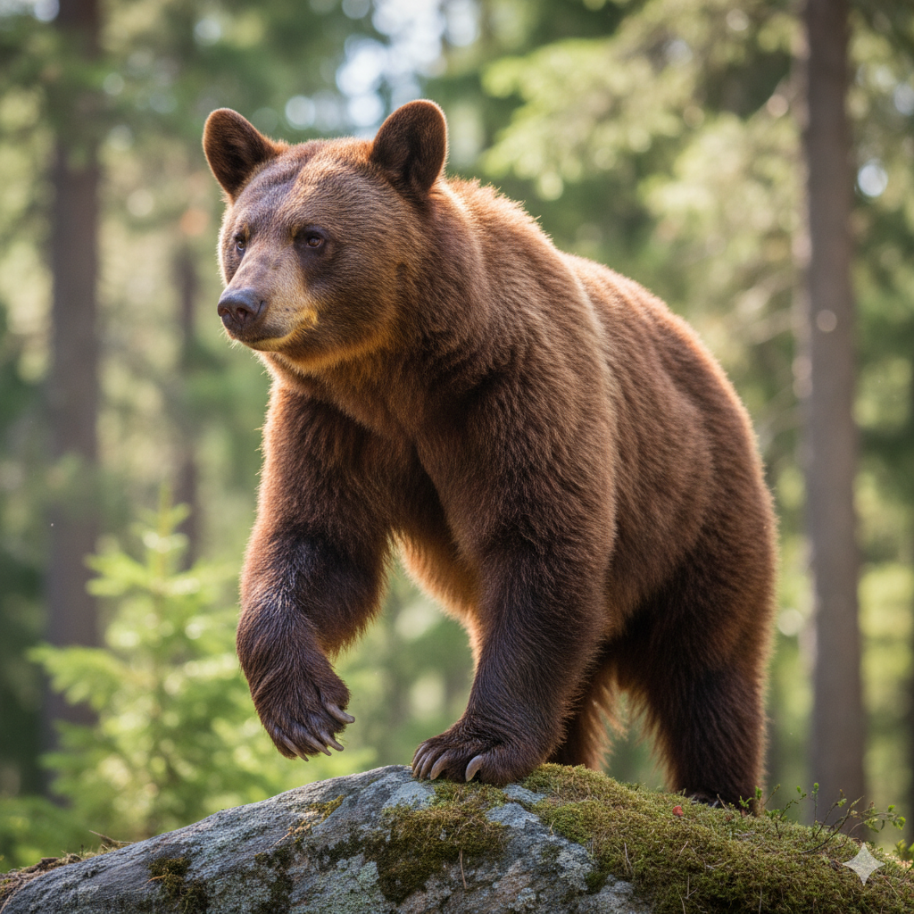
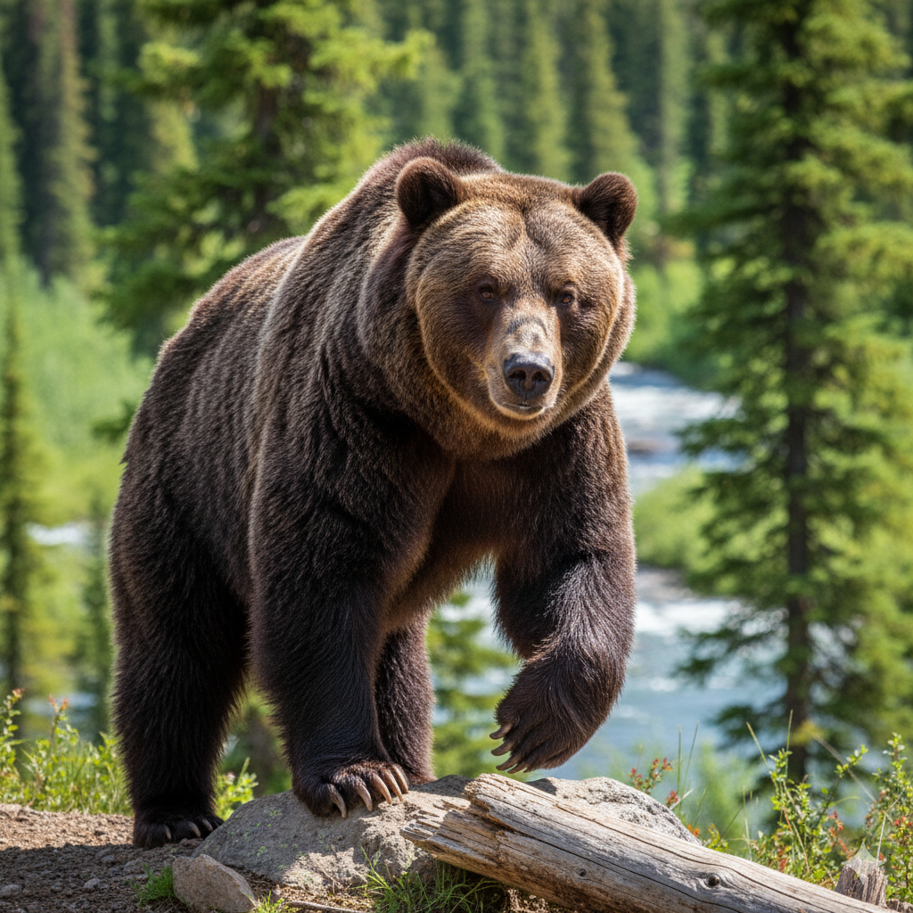
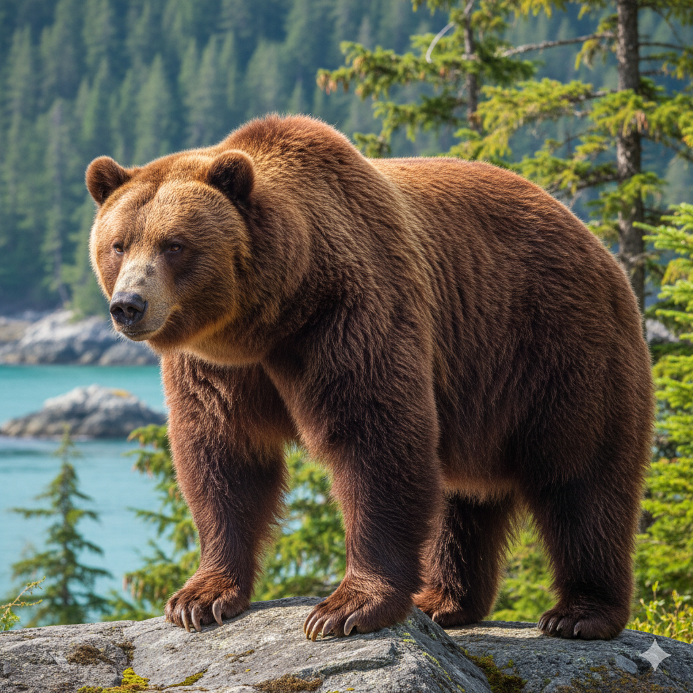

author: Chanin Nantasenamat
id: first-machine-learning-project
summary: Build your first ML project in Snowflake and Streamlit from data preparation through model training, evaluation, and deployment.
categories: snowflake-site:taxonomy/solution-center/certification/quickstart, snowflake-site:taxonomy/product/ai, snowflake-site:taxonomy/snowflake-feature/model-development, snowflake-site:taxonomy/snowflake-feature/ml-functions, snowflake-site:taxonomy/snowflake-feature/unstructured-data-analysis, snowflake-site:taxonomy/product/applications-and-collaboration
language: en
environments: web
status: Published

# Build Your First Machine Learning Project

## Overview

This project demonstrates how to build a complete machine learning project for classifying bear species using physical characteristics and image analysis. The project is structured as a 5-part learning journey that covers the entire ML lifecycle from data ingestion to model deployment.

This guide provides a high-level overview of the 5-part series, which is available as a set of Snowflake Notebooks and Python files.

### What You'll Learn
- **Data Engineering**: Working with Snowpark and Modin for large-scale data processing.
- **Data Analysis**: Exploratory data analysis with statistical summaries and visualizations.
- **Machine Learning**: Training and comparing multiple ML algorithms (Logistic Regression, Random Forest, SVM) using `scikit-learn`.
- **Model Optimization**: Hyperparameter tuning and experiment tracking using Snowflake ML `ExperimentTracking`.
- **AI Integration**: Using Snowflake Cortex AI for image analysis and feature extraction.
- **Data Visualization**: Creating interactive charts with Altair and Streamlit.
- **ML Operations**: Registering models in Snowflake Model Registry and deploying as services.

### What You'll Build
You will build a comprehensive end-to-end machine learning project for bear species classification, broken into five parts:
- **Data Operations**: Ingest data, perform data wrangling, and use Cortex AI for feature extraction.
- **Exploratory Data Analysis (EDA)**: Explore data, summary statistics, and data visualization.
- **Machine Learning (ML)**: Prepare data and features to build models using different ML algorithms.
- **Experiment Tracking**: Initiate experiment tracking when building and trying out different hyperparameters.
- **Data App**: Build a shareable Streamlit application for model deployment.

### Prerequisites
- **Snowflake Account**: Access to a Snowflake account. Sign up for a [30-day free trial account](https://signup.snowflake.com/?utm_source=snowflake-devrel&utm_medium=developer-guides&utm_cta=developer-guides)
- **Snowflake Notebooks**: Access to Snowflake's notebook environment.
- **Database Permissions**: Ability to create tables, stages, and models.
- **Compute Resources**: CPU compute pool access for model training.
- **External Access**: Policy allowing access to external data sources (GitHub).
- **Python Knowledge**: Basic understanding of Python programming.

## Setup

### What You'll Need
To follow this tutorial, you will use the files from the following GitHub repositories:
-   **Project Files**: The full set of Snowflake Notebooks (`.ipynb`) and the Streamlit app (`.py`) are available at:
    -   [https://github.com/Snowflake-Labs/snowflake-demo-notebooks/tree/main/First_Machine_Learning_Project](https://github.com/Snowflake-Labs/snowflake-demo-notebooks/tree/main/First_Machine_Learning_Project)
-   **Dataset**: The bear dataset (CSV and images) is available at:
    -   [https://github.com/dataprofessor/bear-dataset/](https://github.com/dataprofessor/bear-dataset/)

### Notebook Configuration
Before running the notebooks, ensure you configure your Snowflake Notebook environment:
- **Compute Pool**: In "Notebook settings," under "Run on container," select a CPU compute pool.
- **External Access**: In the "External access" tab, select a policy that allows the notebook to access external data from GitHub.
- **Packages**: Add the following packages via the "Packages" dropdown: `modin`, `scikit-learn`, and `snowflake-ml-python`.

## The Bear Data Set

### About the Data Set
The bear dataset is composed of two main parts:

- Tabular Data (`bear_raw_data.csv`): The first portion of the data contains physical measurements for each bear as expressed by the columns as follows:

| Column                      | Description                                                  |
| --------------------------- | ------------------------------------------------------------ |
| `id`                        | A unique identifier for each bear instance.                  |
| `species`                   | The species of the bear.                                     |
| `body_mass_kg`              | The body mass of the bear, measured in kilograms (kg).         |
| `shoulder_hump_height_cm`   | The height of the bear's shoulder hump, measured in centimeters (cm). |
| `claw_length_cm`            | The length of the bear's claws, measured in centimeters (cm).  |
| `snout_length_cm`           | The length of the bear's snout, measured in centimeters (cm).  |
| `forearm_circumference_cm`  | The circumference of the bear's forearm, measured in centimeters (cm). |
| `ear_length_cm`             | The length of the bear's ears, measured in centimeters (cm).   |

- Image Data (`images/` folder): The second portion is a collection of images, where each image corresponds to a unique ID from the tabular data (*e.g.* `ABB_01`, `EUR_01`, `GRZ_01` and `KDK_01`). This allows for visual analysis and the extraction of image-based features.

  **American Black Bear**    **Eurasian Brown Bear**    **Grizzly Bear**    **Kodiak Bear** 

### Identifying Bear Species

These physical measurements are key differentiators between bear species. For example, the presence of a prominent shoulder hump (`shoulder_hump_height_cm`) and a "concave" or "dished" facial profile are characteristic of brown bears (Grizzly, Kodiak, Eurasian). 

In contrast, the absence of a shoulder hump and a straight "Roman nose" facial profile are key features of the American Black Bear. Additionally, features related to paw structure, like the shorter, more curved claws (`claw_length_cm`) of an American Black Bear, are adapted for climbing, distinguishing them from the long, straighter claws of brown bears, which are built for digging.

These and other defining features can also be deduced from machine learning efforts through exploratory data analysis (EDA) and feature analysis.

## Part 1: Data Operations and Feature Extraction

This part of the project focuses on data ingestion, wrangling, and feature extraction using Snowflake's native capabilities.

**High-Level Steps:**
-   **Load Tabular Data**: The notebook starts by loading the `bear_raw_data.csv` file from GitHub directly into a `modin.pandas` DataFrame.
-   **Create Stage**: You will create a Snowflake stage (`@bear`) to store the corresponding bear images.
-   **Cortex AI Feature Extraction**: The core of this notebook is using the `AI_COMPLETE` SQL function (from Snowflake Cortex AI) to perform image analysis. You will write Python code to iteratively loop through all images in the stage and extract three new features: **Fur Color**, **Facial Profile**, and **Paw Pad Texture**.
-   **Combine and Save**: Finally, you will merge the original tabular data with these new AI-extracted features and save the complete, enriched dataset to a new Snowflake table named `BEAR`.

> **Get the Code:**
> - [**View Part 1 Notebook**](https://github.com/Snowflake-Labs/snowflake-demo-notebooks/blob/main/First_Machine_Learning_Project/CHANINN_BEAR_FIRST_ML_PROJECT_PART_1_DATA.ipynb)

## Part 2: Exploratory Data Analysis (EDA)

With a clean dataset in Snowflake, the next step is to explore it. This notebook demonstrates how to perform rich, interactive EDA directly within a Snowflake Notebook.

**High-Level Steps:**
-   **Load Data**: Connect to your Snowflake account and load the `BEAR` table (created in Part 1) using `pd.read_snowflake`.
-   **Interactive Visualizations**: This notebook heavily features `Streamlit` and `Altair` to build interactive charts inside the notebook cell output.
-   **Analyze Features**: You will build several plots to understand the data:
    -   **Feature Distributions**: An interactive histogram to see the distribution of numeric features (e.g., `Body_Mass_kg`) across the different bear species.
    -   **Correlation Heatmap**: A heatmap to quickly visualize the correlation between all numeric features.
    -   **Feature Relationships**: Interactive scatter plots to explore the relationship between any two selected features (e.g., `Claw_Length_cm` vs. `Snout_Length_cm`).
    -   **Categorical Analysis**: Bar and pie charts to see the distribution of categorical features, including the target variable `species`.

> **Get the Code:**
> - [**View Part 2 Notebook**](https://github.com/Snowflake-Labs/snowflake-demo-notebooks/blob/main/First_Machine_Learning_Project/CHANINN_BEAR_FIRST_ML_PROJECT_PART_2_EDA.ipynb)

## Part 3: Machine Learning Model Training

This notebook walks you through the classical machine learning workflow: data preparation, model training, and performance comparison.

**High-Level Steps:**
-   **Data Preparation**: Load the `BEAR` dataset and split it into features (`X`) and the target variable (`y`).
-   **Data Splitting**: Use `scikit-learn` to split the data into 80% training and 20% testing sets.
-   **Feature Scaling**: Apply preprocessing to the data. Numerical features are scaled using `StandardScaler`, and categorical features (like 'Fur Color') are transformed using `OneHotEncoder`.
-   **Train Models**: Train three different classification algorithms on the prepared data:
    1.  **Logistic Regression**
    2.  **Random Forest**
    3.  **Support Vector Machine (SVM)**
-   **Benchmark Models**: Compare the models by examining their performance metrics (Accuracy, MCC) on both the training and testing sets to assess for overfitting.
-   **Interpretability**: Analyze the feature importance from the Random Forest model to understand which features contribute most to the predictions.

> **Get the Code:**
> - [**View Part 3 Notebook**](https://github.com/Snowflake-Labs/snowflake-demo-notebooks/blob/main/First_Machine_Learning_Project/CHANINN_BEAR_FIRST_ML_PROJECT_PART_3_ML.ipynb)

## Part 4: Experiment Tracking and Model Registry

This notebook introduces the MLOps capabilities of Snowflake, demonstrating how to track experiments and version models.

**High-Level Steps:**
-   **Setup Experiment**: After preparing the data (as in Part 3), you will initialize the `ExperimentTracking` client from the `snowflake-ml-python` library to create a new experiment named "Bear_Classification_Experiment".
-   **Log Baseline Model**: Train a single baseline Random Forest model and log its hyperparameters and performance metrics to the experiment tracker.
-   **Hyperparameter Tuning**: Perform a grid search by training multiple Random Forest models with different combinations of hyperparameters (`n_estimators`, `max_depth`, etc.). Each run, with its parameters and resulting metrics (accuracy, precision, recall), is logged as a separate run within the experiment.
-   **Analyze Results**: You will analyze the logged results in the experiment to identify the best-performing model configuration.
-   **Register Model**: After training the final model with the best parameters, you will register it in the Snowflake Model Registry, giving it a name and version. This makes the model available for deployment and inference.

> **Get the Code:**
> - [**View Part 4 Notebook**](https://github.com/Snowflake-Labs/snowflake-demo-notebooks/blob/main/First_Machine_Learning_Project/CHANINN_BEAR_FIRST_ML_PROJECT_PART_4_EXPERIMENT_TRACKING.ipynb)

## Part 5: Building a Streamlit Data App

The final step is to create a user-facing application that uses the model you just trained and registered.

**High-Level Steps:**
-   **Streamlit Application**: This file (`CHANINN_BEAR_PREDICTION_APP.py`) is a standalone Streamlit application, not a notebook. It's designed to be run as a Streamlit in Snowflake (SiS) app.
-   **Load Model**: The application loads the `BEAR_SPECIES_CLASSIFIER` model directly from the Snowflake Model Registry.
-   **User Interface**: It builds a simple UI with sliders and dropdowns that allow a user to input the physical measurements (body mass, claw length, etc.) and categorical features (fur color, etc.) for a bear.
-   **Make Predictions**: When the user submits the features, the app sends this data to the registered model and displays the returned prediction for the bear species.

> **Get the Code:**
> - [**View Part 5 App File**](https://github.com/Snowflake-Labs/snowflake-demo-notebooks/blob/main/First_Machine_Learning_Project/CHANINN_BEAR_PREDICTION_APP.py)

## Conclusion And Resources

Congratulations! You've successfully built a complete end-to-end machine learning pipeline in Snowflake. You've ingested and wrangled data using Modin, performed image analysis with Cortex AI, explored data with Streamlit, trained multiple models using `scikit-learn`, and tracked your experiments using Snowflake ML.

### What You Learned
- How to ingest and process data using the Snowpark pandas API (Modin).
- How to use Snowflake Cortex AI (`AI_COMPLETE`) for powerful feature extraction from images.
- How to build interactive Exploratory Data Analysis (EDA) apps directly in a Snowflake Notebook using Streamlit and Altair.
- How to pre-process data and train multiple `scikit-learn` models (Logistic Regression, Random Forest, SVM) for classification.
- How to use Snowflake ML Experiment Tracking to log, compare, and manage hyperparameter tuning experiments.
- How to register the best-performing model into the Snowflake Model Registry.

### Related Resources
-   **Snowpark Documentation**: [https://docs.snowflake.com/en/developer-guide/snowpark/python/index.html](https://docs.snowflake.com/en/developer-guide/snowpark/python/index.html)
-   **Snowflake ML Documentation**: [https://docs.snowflake.com/en/developer-guide/snowflake-ml/overview](https://docs.snowflake.com/en/user-guide/snowflake-ml/overview)
-   **scikit-learn User Guide**: [https://scikit-learn.org/stable/user_guide.html](https://scikit-learn.org/stable/user_guide.html)
-   **Altair Documentation**: [https://altair-viz.github.io/user_guide/api.html](https://altair-viz.github.io/user_guide/api.html)
-   **Streamlit Documentation**: [https://docs.streamlit.io/](https://docs.streamlit.io/)
-   **YouTube Playlist on Snowflake Notebooks**: [https://www.youtube.com/watch?v=YB1B6vcMaGE&list=PLavJpcg8cl1Efw8x_fBKmfA2AMwjUaeBI](https://www.youtube.com/watch?v=YB1B6vcMaGE&list=PLavJpcg8cl1Efw8x_fBKmfA2AMwjUaeBI)
