author: David Hrncir
id: fivetran-vineyard-assistant-chatbot
categories: snowflake-site:taxonomy/solution-center/certification/quickstart, snowflake-site:taxonomy/solution-center/certification/partner-solution, snowflake-site:taxonomy/solution-center/includes/architecture, snowflake-site:taxonomy/product/ai
language: en
summary: Build a vineyard assistant chatbot with Fivetran, Streamlit and Snowflake Cortex AI for wine industry analytics.
environments: web
status: Published 
feedback link: https://github.com/Snowflake-Labs/sfguides/issues


# Build a RAG-based, GenAI chatbot using Structured Data with Snowflake and Fivetran
<!-- ------------------------ -->
## Overview

GenAI can be used to solve an unlimited number of problems, but this technology can be daunting.  Defining the problem, acquiring data related to that problem, preparing the data, assigning the appropriate models and protocols, training the data, parameter tuning, etc.  Thankfully, there are numerous LLMs available that are ready for use and can be utilized for many use cases out of the box.  So why RAG?  RAG gives you the ability to utilize your custom dataset along with the LLM thereby expanding the LLMs reach on building customized responses using your valuable data.

First, where is your valuable data?  Typically, your valuable data is in places like SaaS applications, ERPs, and databases; these are structured and semi-structured data sources.  Second, we have to get that data into a data cloud.  Third, we have to build a structure that LLMs can use.  And fourth, we need to be able to build a simple application to allow us to ask questions on that data.  Sounds hard, but it's not...thanks to Fivetran and Snowflake!

And if we are going to build a GenAI app, why not make it a fun one? Today you are going to build a RAG-based, GenAI application that will serve as a wine assistant to help guide you through 700+ real wineries in the California wine region.  You will be able to build a wine region trip for different California wine regions, compare wineries and their attributes...you name it.  And don't worry, we'll give you some example prompts to try.

Fivetran can replicate all of your data from over [600+ data sources](https://www.fivetran.com/connectors) directly into Snowflake, or an Iceberg data lake.  Fivetran does this in a fast, secure, SaaS-based, automated, no-code manner where most connectors take less than 5 minutes to set up allowing you to perform all your Snowflake data workloads, in this case GenAI, just as if you were connected to all your source systems.  The sky is the limit!

Snowflake Cortex will be used to handle all of the GenAI needs with ease making this daunting task seem simple.  Most GenAI applications utilize unstructured data.  We are going to be using structured data from a PostgreSQL database.  That's right...no stagnant PDFs or HTML files...database data.  So let’s get started!

### Prerequisites
- Existing Snowflake account, or a [new Snowflake trial account](https://signup.snowflake.com/?utm_source=snowflake-devrel&utm_medium=developer-guides&utm_cta=developer-guides), with 'AccountAdmin' role.  If 'AccountAdmin' is not available, you will need to get a user with AccountAdmin privileges to grant access to Cortex features described below.  
- Or, if setting up a new trial account, ensure to select the "Enterprise" edition when prompted to gain access to more Snowflake features.  If you use a new trial, you will automatically have admin access.
- With either way, the role being used for the lab must be granted the SNOWFLAKE.CORTEX_USER database role which allows you to use the Cortex functions.


### What you'll learn in the lab
- How to leverage Snowflake Partner Connect to create a Fivetran account
- How to create/configure a Fivetran Postgres database connector
- How to utilize Snowflake Cortex functions to prepare the data
- How to create the chatbot via Snowflake Streamlit

### What you'll need
- All you’ll need is a modern browser like Chrome.  Fivetran provides you the data, SQL, and Python.

### What you'll build 
- A GenAI, RAG-based wine assistant chatbot in Snowflake for over 700+ real wineries in California!

All in less than 30 minutes!


## Accounts - Snowflake and Fivetran

The outcome of this step is to:
- Have a Snowflake account with all the objects needed for Fivetran to ingest data (account, user, role, warehouse, database)
- Have a Fivetran account with a Snowflake destination setup ready to receive data

The easiest option to get started with Fivetran and Snowflake is to use Snowflake Partner Connect.  Partner connect allows you to quickly create a Fivetran trial account and configures the default Snowflake destination within Fivetran in one easy step.

### Partner Connect Option
Ensure you are in the Snowflake UI as an `ACCOUNTADMIN`.  Expand `Data Products`, click `Partner Connect`, enter 'fivetran' in the search box, and click the Fivetran tile.

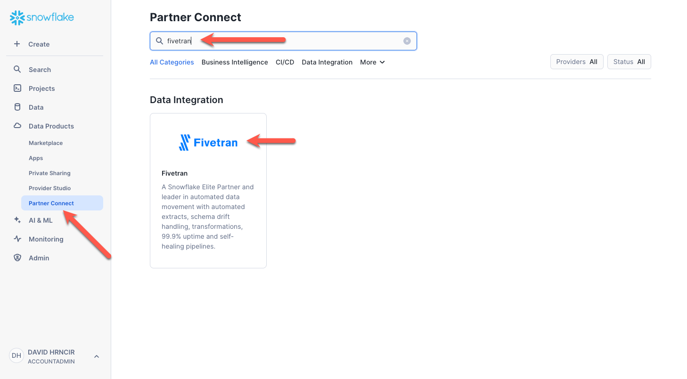


Once the tile is clicked you will be presented with the Fivetran account creation screen as shown below.  Click the `Connect` button.

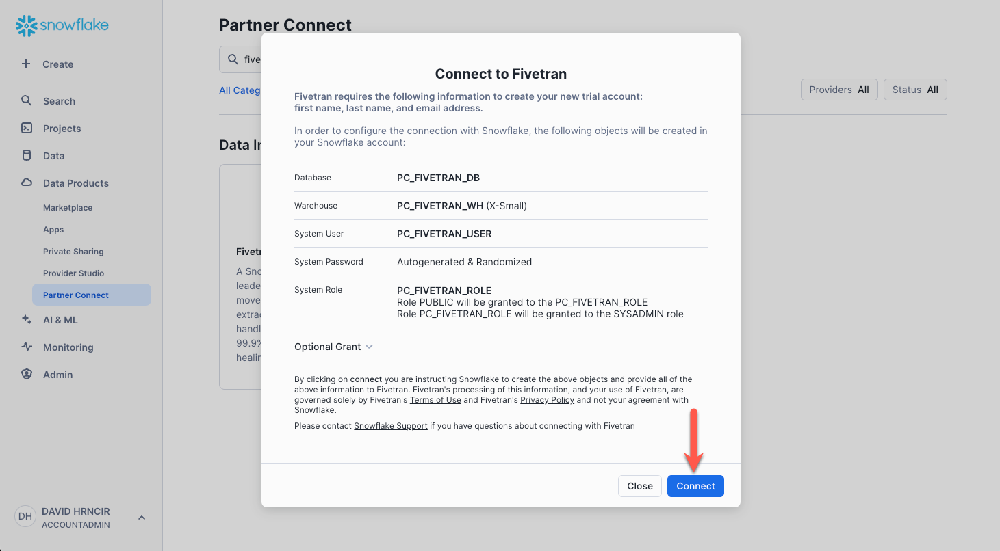

 Click `Activate`.  You will be prompted to enter a Fivetran password.  Record this password.  This will be your password into the Fivetran UI.  That's it!  This process will will create the free 14 day Fivetran trial account, automatically build your default Snowflake destination within Fivetran, and configure the Snowflake objects/environment needed to ingest data via Fivetran.  

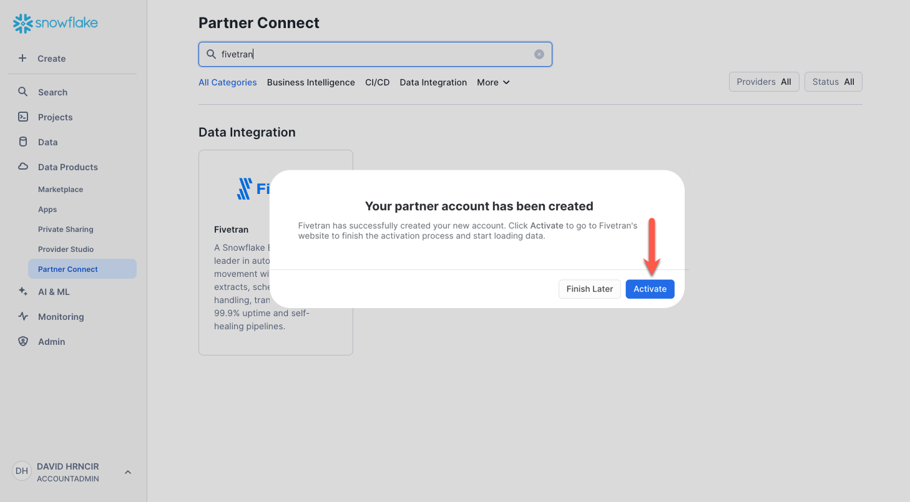

### Non-Partner Connect Option
If you do not have a Fivetran account and you are unable to use `Partner Connect` (possibly because this process was done before), please go to the [Fivetran trial account sign up](https://fivetran.com/signup), and sign up for a free 14 day trial.  Post Fivetran account creation, you simply follow [these instructions](https://fivetran.com/docs/destinations/snowflake/setup-guide) to setup your Snowflake destination in Fivetran.

In the case where you have Snowflake and Fivetran accounts already, you may use a current Snowflake destination in Fivetran or simply follow the [Snowflake destination setup guide](https://fivetran.com/docs/destinations/snowflake/setup-guide) to create a new Snowflake destination in Fivetran.

## Option 1 PostgreSQL Source

Ok, let's replicate our structured data from a PostgreSQL database into Snowflake via the quickest, easiest, and most reliable method available in the world today...Fivetran!  Ensure you are logged into your Fivetran account.

> 
> Note: If for some reason you are unable to connect to the database, you may use <a href="#3" target="_self">Option 2 Amazon S3 Source</a>.
>

**Step 1.** With the `Connectors` item selected in the nav panel, click `Add connector` in the upper right corner.

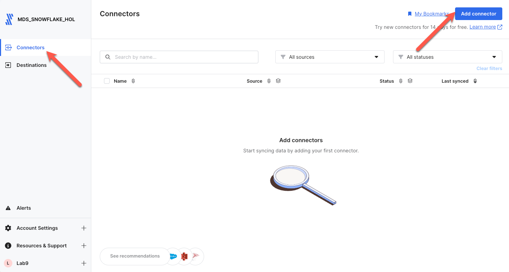

**Step 2.** Enter `postgres` in the search box.  Ensure you scroll down to the postgres connector shown (Note: You must use the one shown.), highlight the item with your mouse, and click `Set up`.

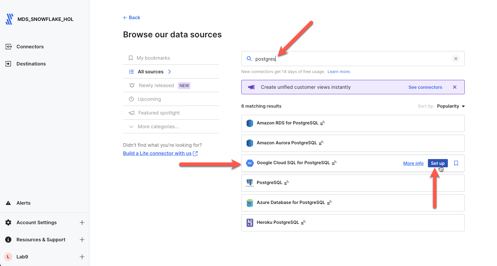

**Step 3.** Next on the connector configuration screen, ensure you enter your last name + `_genai` as the Destination Schema Prefix.  Next enter the credentials given below into their respective fields.  Note that the Destination Schema Prefix must be unique to the database.  Fivetran will prepend this name to all schemas copied from the postgres database into Snowflake.
- Destination Schema Prefix: yourlastname_genai
- Host:  34.94.122.157
- Port:  5432
- User:  fivetran
- Password:  2PcnxqFrHh64WKbfsYDU
- Database:  industry

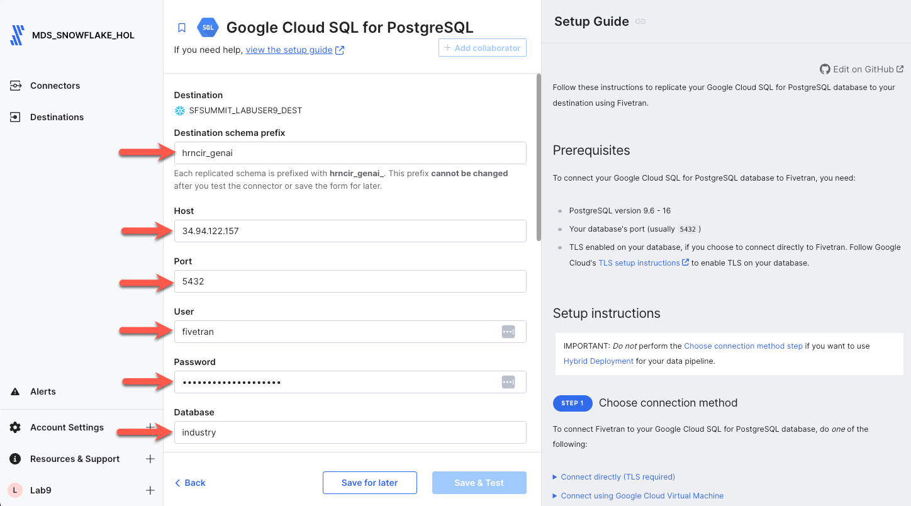

Scroll down and you will see the remainder of the configuration fields.  Set the parameters to the values shown below, and click `Save & Test`.
- Connection Method:  Connect directly
- Update Method:  Detect Changes Via Fivetran Teleport Sync

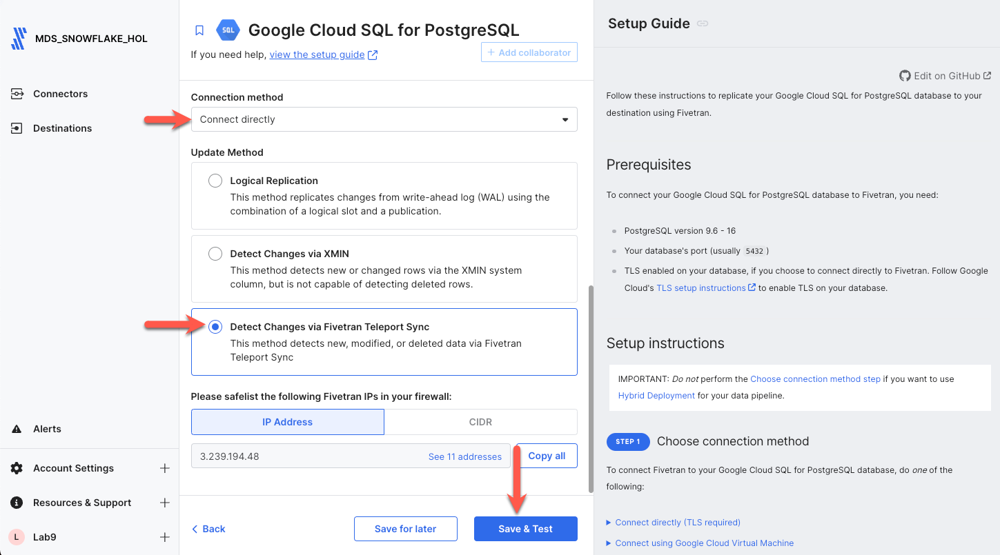

**Step 4.** Since we are connecting directly over the internet, Fivetran requires TLS.  Click the radio button next to the certificate, and click `Confirm`.  Once all connector tests complete, click `Continue`.

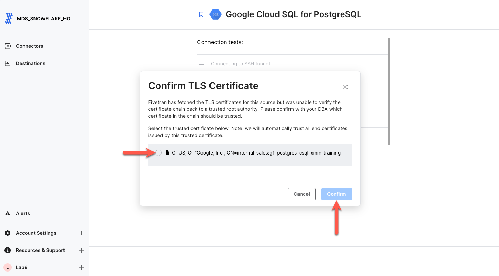

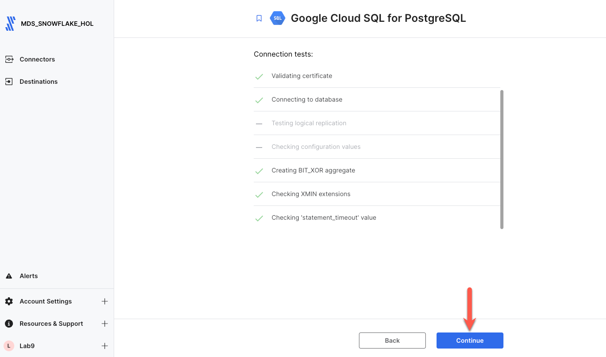

**Step 5.** Next you will select the schemas and tables to replicate.  Since we only need one schema, let's first disable all schemas by unchecking the box next to the schema number shown.  Then click the `collapse all` button on the right to get a better view of all the schemas for which we have access.

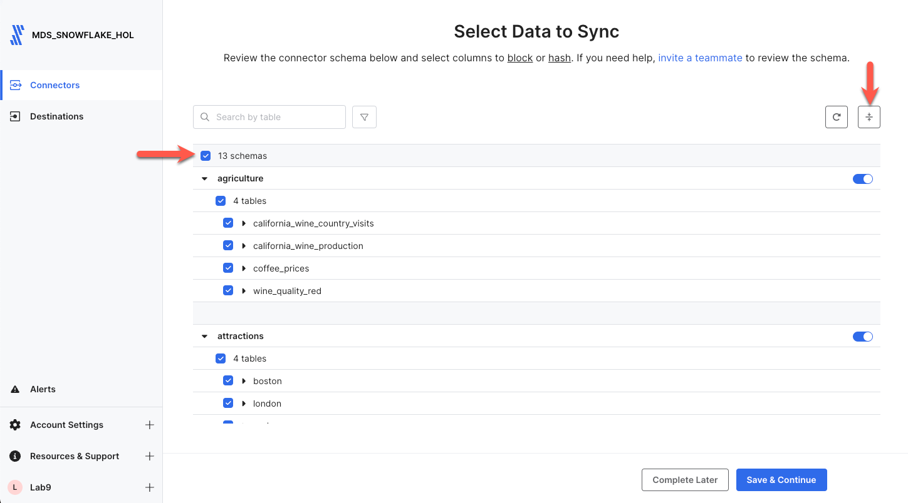

Find the `Agriculture` schema in the list, click on the toggle on the right side to enable the schema, expand the schema by clicking the black arrow next to the schema, and check the box next to the number of tables to select all tables in the schema.  Then click `Save & Continue`.

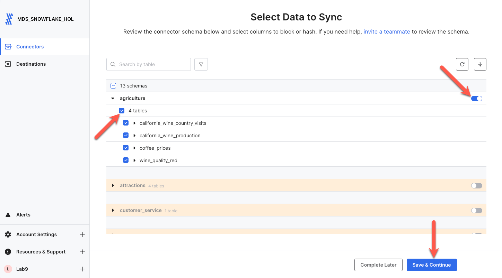

**Step 6.** By default, Fivetran will automatically replicate all schema changes to Snowflake so that any change in the source schema automatically appears in Snowflake.  Leave `Allow all` selected, and click `Continue`.

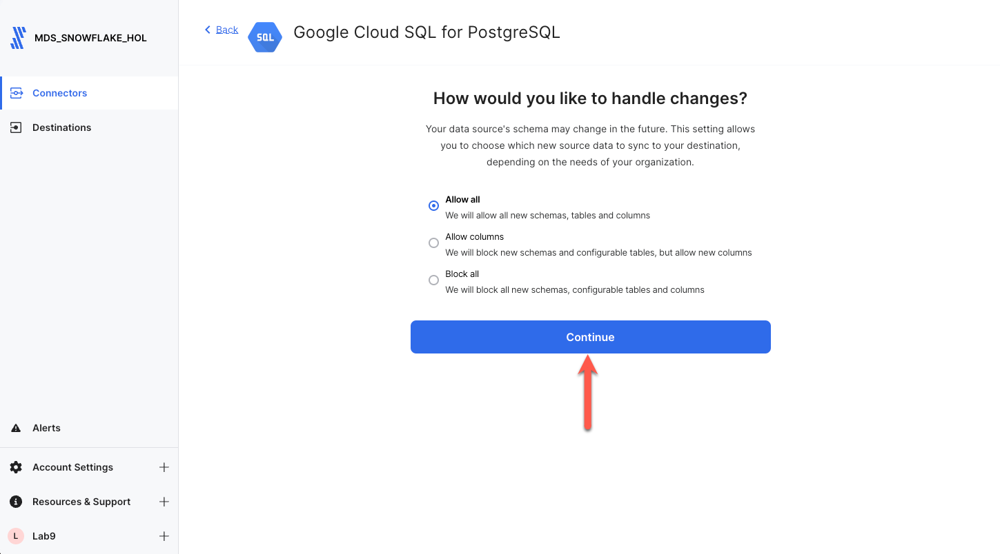

**Step 7.** With that, we are ready to go!  Let's sync data.  Click `Start Initial Sync`, and let Fivetran seamlessly replicate our database data into Snowflake.  This should only take a minute or two at most.  This process will perform an initial sync of all of the data in the schema and tables selected, and automatically schedule itself to run again in 6 hours.  The sync frequency can be adjusted, but for this lab, there is no CDC occurring behind the scenes; so we will leave it at 6 hours.  If this data was changing, Fivetran would only replicate the changes/delta from the previous run into Snowflake ensuring your Snowflake data is always up to date with your source!

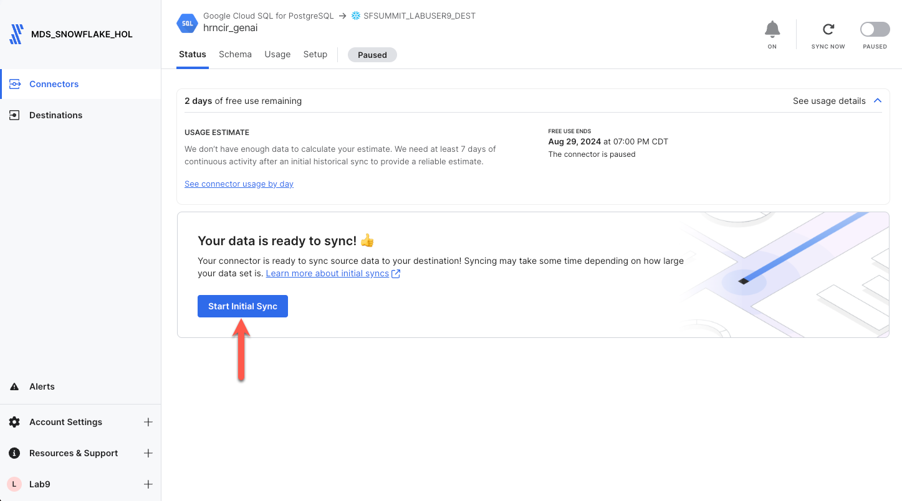

> 
> This is the power of Fivetran.  No allocating resources.  No development.  No code.  No column mapping.  No pre-building schemas or tables in the destination.  A fully automated, production data pipeline in a few steps!
>

Continue to <a href="#4" target="_self">Transform the Wine Structured Dataset</a>.

## Option 2 Amazon S3 Source

If by some chance the PostgreSQL database is unavailable or inaccessible, you may use the below dataset that was copied from the PostgreSQL database to JSON residing in Amazon S3.

**Step 1.** With the `Connectors` item selected in the nav panel, click `Add connector` in the upper right corner.

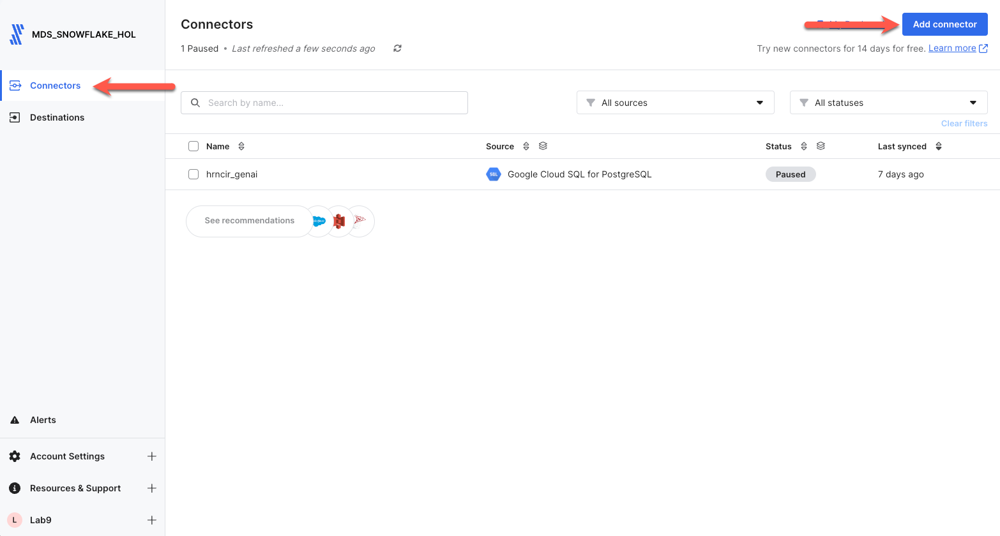

**Step 2.** Enter `s3` in the search box.  Scroll down to the S3 connector, highlight the item with your mouse, and click `Set up`.

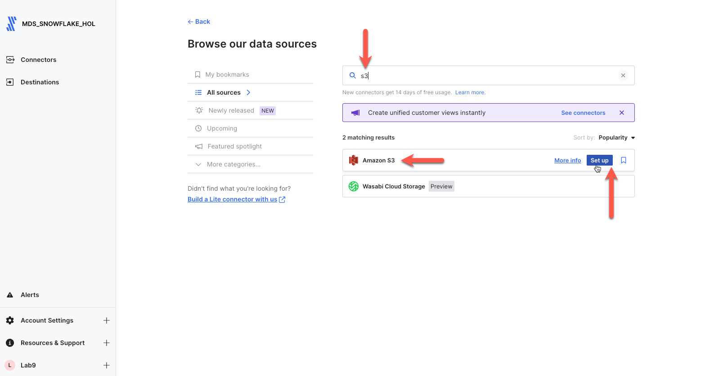

**Step 3.** Next on the connector configuration screen, enter `yourlastname_genai` as the Destination Schema Prefix.  Next copy and paste the parameters given below into their respective fields.  Note that the Destination Schema Prefix must be unique to the database.  Fivetran will prepend this name to all schemas copied from the postgres database into Snowflake.  **Do not alter any other fields except the ones listed.**
- Destination table:  california_wine_country_visits
- Bucket:  ft-s3-lab-bkt
- Access approach:  Public

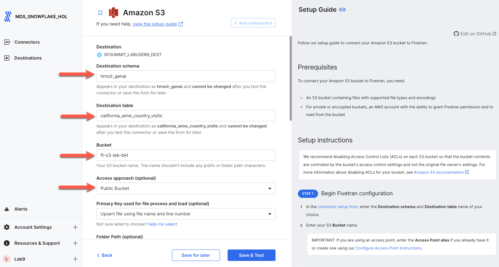

Scroll down and you will see the remainder of the configuration fields.  Set the parameters to the values shown below, and click `Save & Test`.
- Folder Path:  winedata
- File Type:  json
- JSON Delivery Mode:  Unpacked

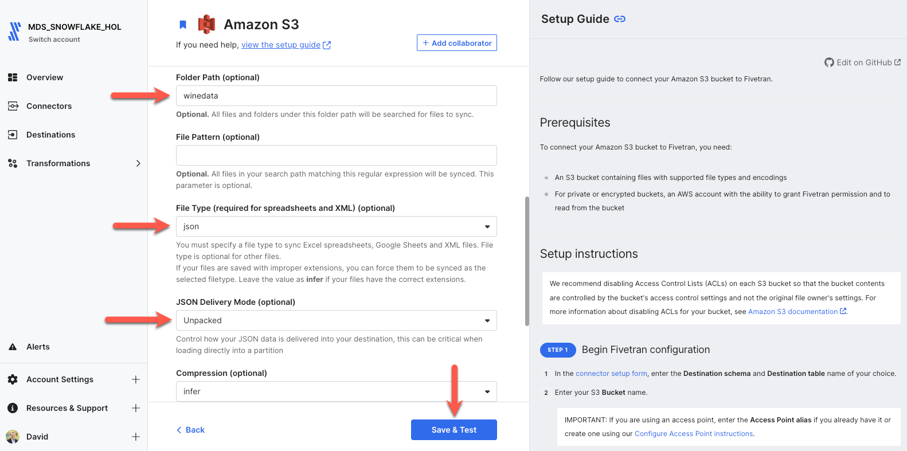

**Step 4.** Fivetran will perform connection tests to the bucket as well as verify the files in the folder.  Once all connector tests complete, click `Continue`.

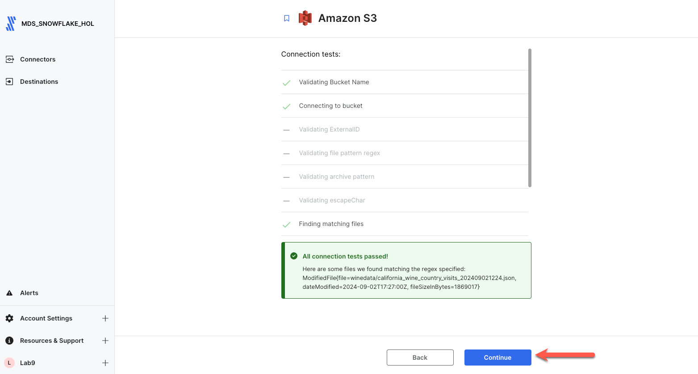

**Step 5.**  With that, we are ready to go!  Let's sync data.  Click `Start Initial Sync`, and let Fivetran seamlessly replicate our S3 file data into Snowflake.  This should only take a minute or two at most.  This process will perform an initial sync of all of the data files in the bucket/folder, and automatically schedule itself to run again in 6 hours.  The sync frequency can be adjusted, but for this lab, there is no CDC occurring behind the scenes; so we will leave it at 6 hours.  If this data was changing, Fivetran would only replicate the changes/delta from the previous run into Snowflake ensuring your Snowflake data is always up to date with your source!

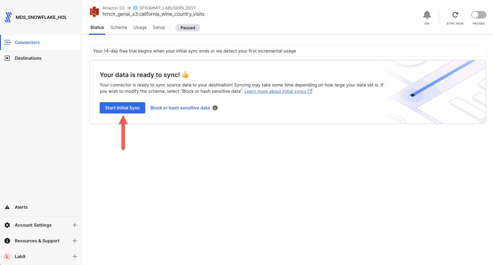

## Transform the Wine Structured Dataset

Now that Fivetran landed the structured dataset into tables in Snowflake, it's time to convert that data into a format a LLM can read.  Since LLMs do not like columnar data, we have to first transform the data into a human readable chunk.  Then secondly, we are going to transform that chunk into vectors.  We could use Snowflake's vector search service, but we are doing this manually in this lab so you can understand all the aspects.  So we will be working in the Snowflake Snowsight UI for the rest of the lab.

**Security Note:  The role you are using will need to be granted the SNOWFLAKE.CORTEX_USER database role.  This role provides access to the Cortex functions we are going to use today.**

**Step 1.** Let's review our data in Snowflake.  Select `Data/Databases` and then select your database, schema, and finally the `CALIFORNIA_WINE_COUNTRY_VISITS` table.  We will transform this table to be used as RAG context for our chatbot.  Select the various tabs such as `Columns` and `Data Preview` to review the table.

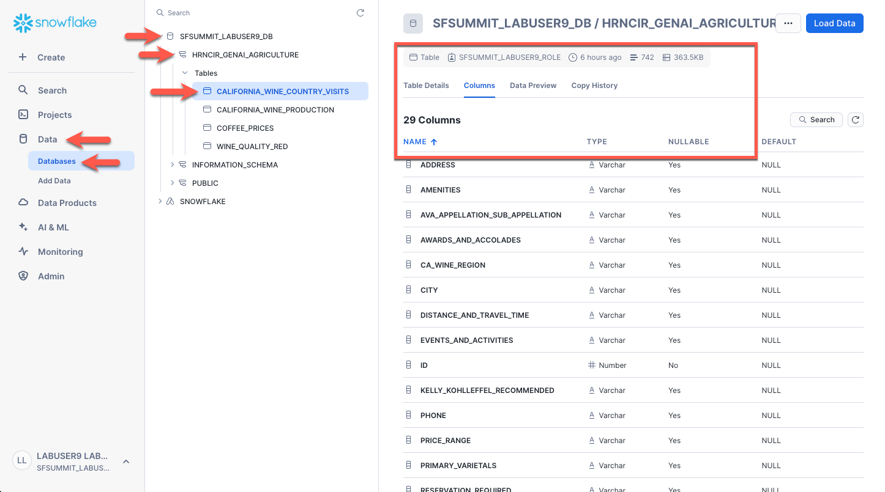

**Step 2.** Next we will create a new worksheet to run our transform SQL.  Select `Projects/Worksheets` and then click the plus sign in the upper right corner.  Ensure the worksheet type is `SQL`.

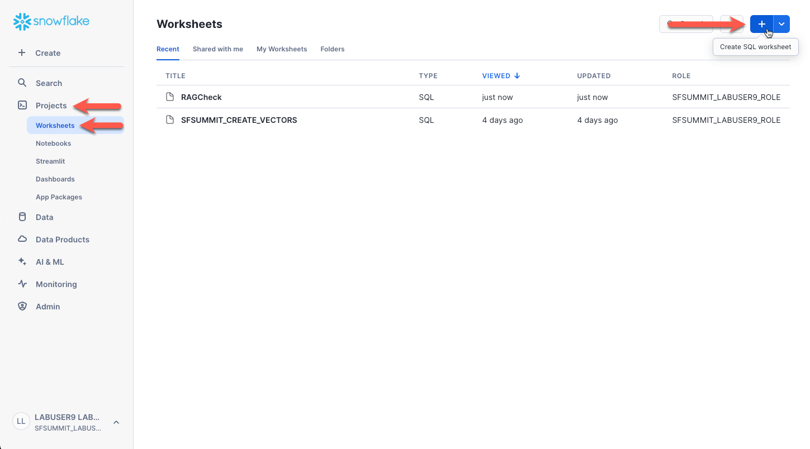

**Step 3.** In the new worksheet, expand your database and schema in the left nav panel.  Click the ellipses next to the schema Fivetran created and select `Set worksheet context`.  This will default the database and schema context for our new worksheet (shown in the box below) so that all SQL will run under your database and schema.  This saves us from having to fully qualify each SQL statement.

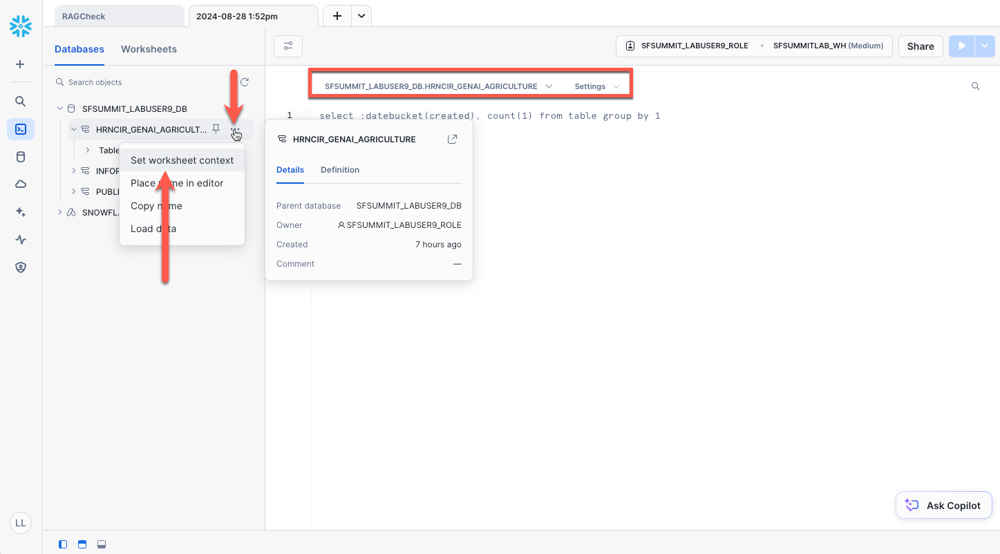

**Step 4.** Copy and paste the below SQL into the worksheet.

``` SQL
/** Create each winery and vineyard review as a single field vs multiple fields **/
    CREATE or REPLACE TABLE vineyard_data_single_string AS 
        SELECT WINERY_OR_VINEYARD, CONCAT(' The winery name is ', IFNULL(WINERY_OR_VINEYARD, ' Name is not known')
        , ' and resides in the California wine region of ', IFNULL(CA_WINE_REGION, 'unknown'), '.'
        , ' The AVA Appellation is the ', IFNULL(AVA_APPELLATION_SUB_APPELLATION, 'unknown'), '.'
        , ' The website associated with the winery is ', IFNULL(WEBSITE, 'unknown'), '.'
        , ' The price range is ', IFNULL(PRICE_RANGE, 'unknown'), '.'
        , ' Tasting Room Hours: ', IFNULL(TASTING_ROOM_HOURS, 'unknown'), '.'
        , ' The reservation requirement is: ', IFNULL(RESERVATION_REQUIRED, 'unknown'), '.'
        , ' The Winery Description is: ', IFNULL(WINERY_DESCRIPTION, 'unknown'), ''
        , ' The Primary Varietals this winery offers is ', IFNULL(PRIMARY_VARIETALS, 'unknown'), '.'
        , ' Thoughts on the Tasting Room Experience: ', IFNULL(TASTING_ROOM_EXPERIENCE, 'unknown'), '.'
        , ' Amenities: ', IFNULL(AMENITIES, 'unknown'), '.'
        , ' Awards and Accolades: ', IFNULL(AWARDS_AND_ACCOLADES, 'unknown'), '.'
        , ' Distance Travel Time considerations: ', IFNULL(DISTANCE_AND_TRAVEL_TIME, 'unknown'), '.'
        , ' User Rating: ', IFNULL(USER_RATING, 'unknown'), '.'
        , ' The Secondary Varietals for this winery: ', IFNULL(SECONDARY_VARIETALS, 'unknown'), '.'
        , ' Wine Styles: ', IFNULL(WINE_STYLES, 'unknown'), '.'
        , ' Events and Activities: ', IFNULL(EVENTS_AND_ACTIVITIES, 'unknown'), '.'
        , ' Sustainability Practices: ', IFNULL(SUSTAINABILITY_PRACTICES, 'unknown'), '.'
        , ' Social Media Channels: ', IFNULL(SOCIAL_MEDIA, 'unknown'), ''
        , ' The address is ', IFNULL(ADDRESS, 'unknown'), ', '
        , IFNULL(CITY, 'unknown'), ', '
        , IFNULL(STATE, 'unknown'), ', '
        , IFNULL(cast(ZIP as varchar(10)), 'unknown'), '.'
        , ' The Phone Number is ', IFNULL(PHONE, 'unknown'), '.'
        , ' The Winemaker is ', IFNULL(WINEMAKER, 'unknown'), '.'
        , ' Did Kelly Kohlleffel recommend this winery?: ', IFNULL(KELLY_KOHLLEFFEL_RECOMMENDED, 'unknown'), ''
    ) AS winery_information FROM california_wine_country_visits;

    /** Create the vector table from the wine review single field table **/
      CREATE or REPLACE TABLE vineyard_data_vectors AS 
            SELECT winery_or_vineyard, winery_information, 
            snowflake.cortex.EMBED_TEXT_1024('snowflake-arctic-embed-l-v2.0', winery_information) as WINERY_EMBEDDING 
            FROM vineyard_data_single_string;


```

Highlight all of the SQL and click the run button in the upper right corner.

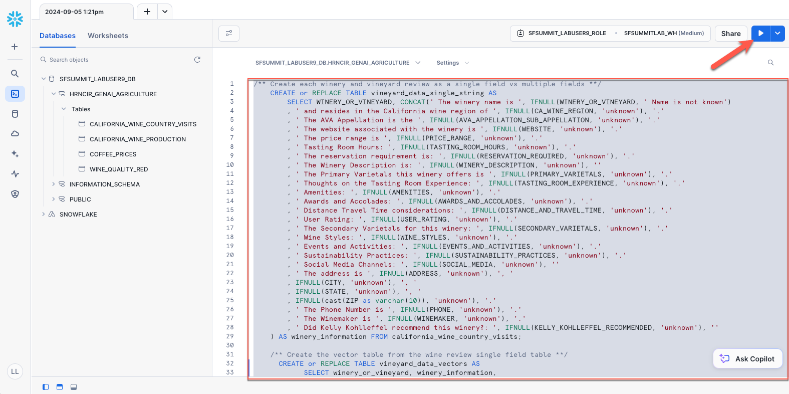

You may then preview the data by refreshing the left nav panel (click the `refresh` icon).  You will see that two new tables were created.  You may select the tables and click the preview icon if you wish to view the transformations.

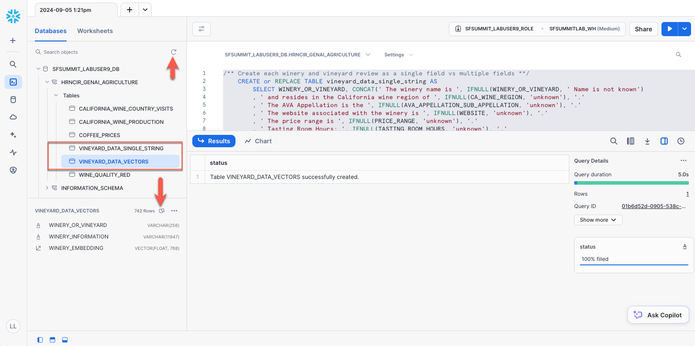

That's it for transforming the data...now we are ready to build our Streamlit app!

## Build the Chatbot as a Streamlit Application
We are now ready to build our Streamlit application.  Snowflake's Streamlit feature makes creating and sharing applications easy.

**Step 1.** Click the Projects icon in the left menu and select `Streamlit`.

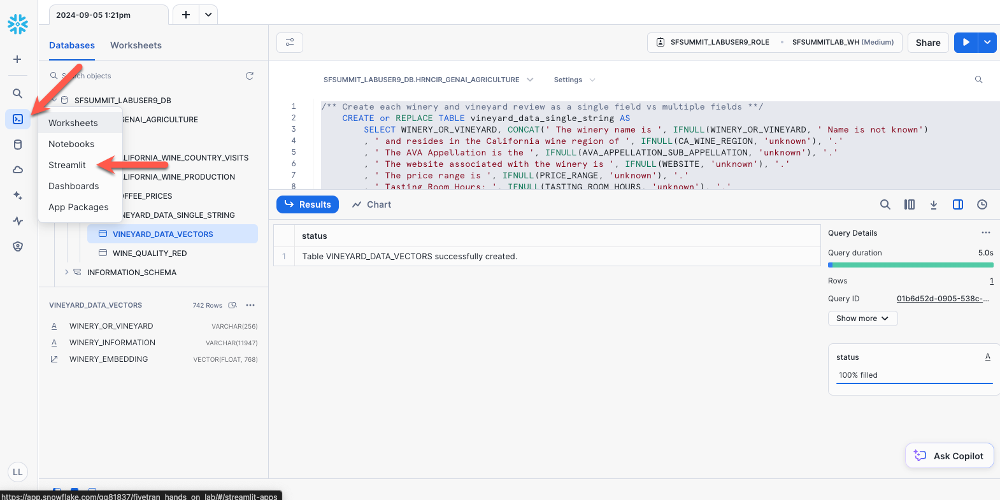

**Step 2.** Click the `+Streamlit App` in the upper right corner of the screen.

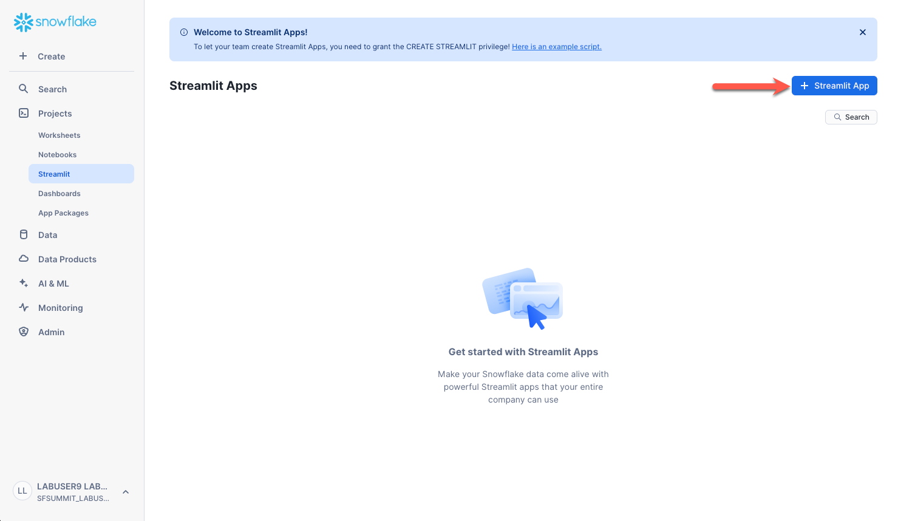

Type a name for your chat app.  **VERY IMPORTANT: Ensure you choose the database and schema containing your data.**  Once the fields are set, click `Create`.

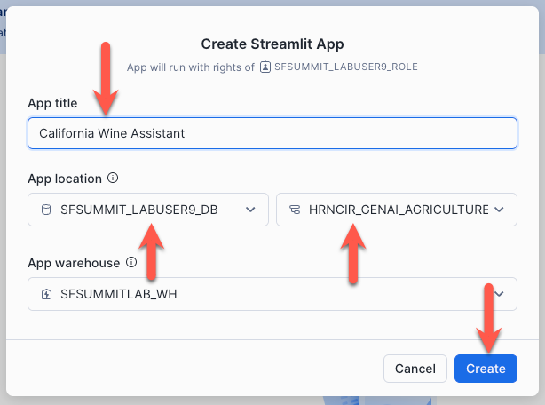

**Step 3.** Get used to the interface and remove the default Streamlit code.

Let's first understand how this screen operates. 

The top right contains application controls.  To change the application settings, click the vertical three dots (ex. changing warehouse).  The two main features of this area are the `Run` button and the `Edit` button.  You will notice below that the `Edit` button is not shown.  That is because we are in edit mode.  The next time you go to the Streamlit section and select your application, it will be in "Run" mode, and `Edit` will appear to allow you to edit your application later.

The second portion of the screen is the bottom left panel controls.  There are three that can be toggled on and off.  The first expands/collapses the left nav panel (which you really do not need for this lab).  The second expands/collapses the code panel.  The third expands/collapses the running application panel.  Get to know how these three buttons work by turning them off and on.  When developing/editing, it seems to be easier having the left nav panel and the right application panel off allowing the code panel to have the full screen.

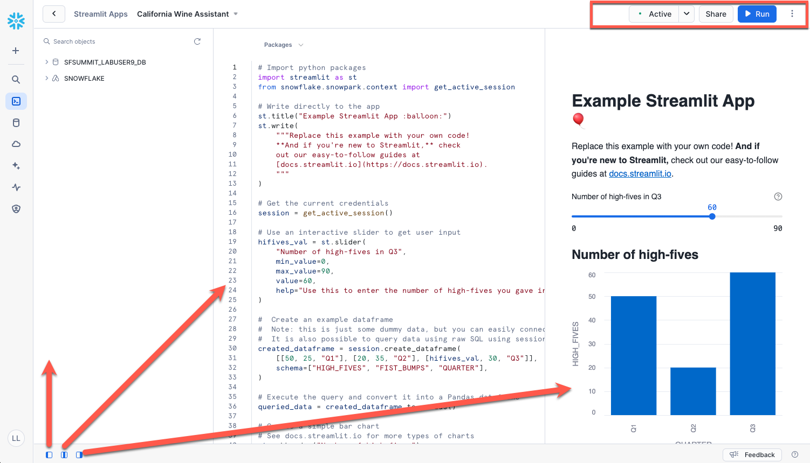

Once you are comfortable with the screen navigation, make the code panel enabled and place your cursor in the code, **highlight all the code and delete it**.  This is simply the default code for a new application.

**Step 4.** Add the wine assistant chatbot code below to the empty code editor.

``` python
#
# Fivetran Snowflake Cortex Lab
# Build a California Wine Assistant Chatbot
#

import streamlit as st
from snowflake.snowpark.context import get_active_session
import pandas as pd
import time

# Change this list as needed to add/remove model capabilities.
MODELS = [
    "llama3.2-3b",
    "claude-3-5-sonnet",
    "mistral-large2",
    "llama3.1-8b",
    "llama3.1-405b",
    "llama3.1-70b",
    "mistral-7b",
    "jamba-1.5-large",
    "mixtral-8x7b",
    "reka-flash",
    "gemma-7b"
]

# Change this value to control the number of tokens you allow the user to change to control RAG context. In
# this context for the data used, 1 chunk would be approximately 200-400 tokens.  So a limit is placed here
# so that the LLM does not abort if the context is too large.
CHUNK_NUMBER = [4,6,8,10,12,14,16]

def build_layout():
    #
    # Builds the layout for the app side and main panels and return the question from the dynamic text_input control.
    #

    # Setup the state variables.
    # Resets text input ID to enable it to be cleared since currently there is no native clear.
    if 'reset_key' not in st.session_state: 
        st.session_state.reset_key = 0
    # Holds the list of responses so the user can see changes while selecting other models and settings.
    if 'conversation_state' not in st.session_state:
        st.session_state.conversation_state = []

    # Build the layout.
    #
    # Note:  Do not alter the manner in which the objects are laid out.  Streamlit requires this order because of references.
    #
    st.set_page_config(layout="wide")
    st.title(":wine_glass: California Wine Country Visit Assistant :wine_glass:")
    st.write("""I'm an interactive California Wine Country Visit Assistant. A bit about me...I'm a RAG-based, Gen AI app **built 
      with and powered by Fivetran, Snowflake, Streamlit, and Cortex** and I use a custom, structured dataset!""")
    st.caption("""Let me help plan your trip to California wine country. Using the dataset you just moved into the Snowflake Data 
      Cloud with Fivetran, I'll assist you with winery and vineyard information and provide visit recommendations from numerous 
      models available in Snowflake Cortex (including Claude 3.5 Sonnet). You can even pick the model you want to use or try out 
      all the models. The dataset includes over **700 wineries and vineyards** across all CA wine-producing regions including the 
      North Coast, Central Coast, Central Valley, South Coast and various AVAs sub-AVAs. Let's get started!""")
    user_question_placeholder = "Message your personal CA Wine Country Visit Assistant..."
    st.sidebar.selectbox("Select a Snowflake Cortex model:", MODELS, key="model_name", index=3)
    st.sidebar.checkbox('Use your Fivetran dataset as context?', key="dataset_context", help="""This turns on RAG where the 
    data replicated by Fivetran and curated in Snowflake will be used to add to the context of the LLM prompt.""")
    if st.button('Reset conversation', key='reset_conversation_button'):
        st.session_state.conversation_state = []
        st.session_state.reset_key += 1
        st.rerun()
    processing_placeholder = st.empty()
    question = st.text_input("", placeholder=user_question_placeholder, key=f"text_input_{st.session_state.reset_key}", 
                             label_visibility="collapsed")
    if st.session_state.dataset_context:
        st.caption("""Please note that :green[**_I am_**] using your Fivetran dataset as context. All models are very 
          creative and can make mistakes. Consider checking important information before heading out to wine country.""")
    else:
        st.caption("""Please note that :red[**_I am NOT_**] using your Fivetran dataset as context. All models are very 
          creative and can make mistakes. Consider checking important information before heading out to wine country.""")
    with st.sidebar.expander("Advanced Options"):
        st.selectbox("Select number of context chunks:", CHUNK_NUMBER, key="num_retrieved_chunks", help="""Adjust based on the 
        expected number of records/chunks of your data to be sent with the prompt before Cortext calls the LLM.""", index=1)
    st.sidebar.caption("""I use **Snowflake Cortex** which provides instant access to industry-leading large language models (LLMs), 
      including Claude, Llama, and Snowflake Arctic that have been trained by researchers at companies like Anthropic, Meta, Mistral, Google, Reka, and Snowflake.\n\nCortex 
      also offers models that Snowflake has fine-tuned for specific use cases. Since these LLMs are fully hosted and managed by 
      Snowflake, using them requires no setup. My data stays within Snowflake, giving me the performance, scalability, and governance 
      you expect.""")
    for _ in range(6):
        st.sidebar.write("")
    url = 'https://i.imgur.com/9lS8Y34.png'
    col1, col2, col3 = st.sidebar.columns([1,2,1])
    with col2:
        st.image(url, width=150)
    caption_col1, caption_col2, caption_col3 = st.sidebar.columns([0.22,2,0.005])
    with caption_col2:
        st.caption("Fivetran, Snowflake, Streamlit, & Cortex")

    return question

def build_prompt (question):
    #
    # Format the prompt based on if the user chooses to use the RAG option or not.
    #

    # Build the RAG prompt if the user chooses.  Defaulting the similarity to 0 -> 1 for better matching.
    chunks_used = []
    if st.session_state.dataset_context:
        # Get the RAG records.
        context_cmd = f"""
          with context_cte as
          (select winery_or_vineyard, winery_information as winery_chunk, vector_cosine_similarity(winery_embedding,
                snowflake.cortex.embed_text_1024('snowflake-arctic-embed-l-v2.0', ?)) as v_sim
          from vineyard_data_vectors
          having v_sim > 0
          order by v_sim desc
          limit ?)
          select winery_or_vineyard, winery_chunk from context_cte 
          """
        chunk_limit = st.session_state.num_retrieved_chunks
        context_df = session.sql(context_cmd, params=[question, chunk_limit]).to_pandas()
        context_len = len(context_df) -1
        # Add the vineyard names to a list to be displayed later.
        chunks_used = context_df['WINERY_OR_VINEYARD'].tolist()
        # Build the additional prompt context using the wine dataset.
        rag_context = ""
        for i in range (0, context_len):
            rag_context += context_df.loc[i, 'WINERY_CHUNK']
        rag_context = rag_context.replace("'", "''")
        # Construct the prompt.
        new_prompt = f"""
          Act as a California winery visit expert for visitors to California wine country who want an incredible visit and 
          tasting experience. You are a personal visit assistant named Snowflake CA Wine Country Visit Assistant. Provide 
          the most accurate information on California wineries based only on the context provided. Only provide information 
          if there is an exact match below.  Do not go outside the context provided.  
          Context: {rag_context}
          Question: {question} 
          Answer: 
          """
    else:
        # Construct the generic version of the prompt without RAG to only go against what the LLM was trained.
        new_prompt = f"""
          Act as a California winery visit expert for visitors to California wine country who want an incredible visit and 
          tasting experience. You are a personal visit assistant named Snowflake CA Wine Country Visit Assistant. Provide 
          the most accurate information on California wineries.
          Question: {question} 
          Answer: 
          """

    return new_prompt, chunks_used

def get_model_token_count(prompt_or_response) -> int:
    #
    # Calculate and return the token count for the model and prompt or response.
    #
    token_count = 0
    try:
        token_cmd = f"""select SNOWFLAKE.CORTEX.COUNT_TOKENS(?, ?) as token_count;"""
        tc_data = session.sql(token_cmd, params=[st.session_state.model_name, prompt_or_response]).collect()
        token_count = tc_data[0][0]
    except Exception:
        # Negative value just denoting that tokens could not be counted for some reason.
        token_count = -9999

    return token_count

def calc_times(start_time, first_token_time, end_time, token_count):
    #
    # Calculate the times for the execution steps.
    #

    # Calculate the correct durations
    time_to_first_token = first_token_time - start_time  # Time to the first token
    total_duration = end_time - start_time  # Total time to generate all tokens
    time_for_remaining_tokens = total_duration - time_to_first_token  # Time for the remaining tokens
    
    # Calculate tokens per second rate
    tokens_per_second = token_count / total_duration if total_duration > 0 else 1
    
    # Ensure that time to first token is realistically non-zero
    if time_to_first_token < 0.01:  # Adjust the threshold as needed
        time_to_first_token = total_duration / 2  # A rough estimate if it's too small

    return time_to_first_token, time_for_remaining_tokens, tokens_per_second

def run_prompt(question):
    #
    # Run the prompt against Cortex.
    #
    formatted_prompt, chunks_used = build_prompt (question)
    token_count = get_model_token_count(formatted_prompt)
    start_time = time.time()
    cortex_cmd = f"""
             select SNOWFLAKE.CORTEX.COMPLETE(?,?) as response
           """    
    sql_resp = session.sql(cortex_cmd, params=[st.session_state.model_name, formatted_prompt])
    first_token_time = time.time() 
    answer_df = sql_resp.collect()
    end_time = time.time()
    time_to_first_token, time_for_remaining_tokens, tokens_per_second = calc_times(start_time, first_token_time, end_time, token_count)

    return answer_df, time_to_first_token, time_for_remaining_tokens, tokens_per_second, int(token_count), chunks_used

def main():
    #
    # Controls the flow of the app.
    #
    question = build_layout()
    if question:
        with st.spinner("Thinking..."):
            try:
                # Run the prompt.
                token_count = 0
                data, time_to_first_token, time_for_remaining_tokens, tokens_per_second, token_count, chunks_used = run_prompt(question)
                response = data[0][0]
                # Add the response token count to the token total so we get a better prediction of the costs.
                if response:
                    token_count += get_model_token_count(response)
                    # Conditionally append the token count line based on the checkbox
                    rag_delim = ", "
                    st.session_state.conversation_state.append(
                        (f":information_source: RAG Chunks/Records Used:",
                         f"""<span style='color:#808080;'> {(rag_delim.join([str(ele) for ele in chunks_used])) if chunks_used else 'none'} 
                         </span><br/><br/>""")
                    )
                    st.session_state.conversation_state.append(
                        (f":1234: Token Count for '{st.session_state.model_name}':", 
                         f"""<span style='color:#808080;'>{token_count} tokens • {tokens_per_second:.2f} tokens/s • 
                         {time_to_first_token:.2f}s to first token + {time_for_remaining_tokens:.2f}s.</span>""")
                    )
                    # Append the new results.
                    st.session_state.conversation_state.append((f"CA Wine Country Visit Assistant ({st.session_state.model_name}):", response))
                    st.session_state.conversation_state.append(("You:", question))
            except Exception as e:
                st.warning(f"An error occurred while processing your question: {e}")
        
        # Display the results in a stacked format.
        if st.session_state.conversation_state:
            for i in reversed(range(len(st.session_state.conversation_state))):
                label, message = st.session_state.conversation_state[i]
                if 'Token Count' in label or 'RAG Chunks' in label:
                    # Display the token count in a specific format
                    st.markdown(f"**{label}** {message}", unsafe_allow_html=True)
                elif i % 2 == 0:
                    st.write(f":wine_glass:**{label}** {message}")
                else:
                    st.write(f":question:**{label}** {message}")

if __name__ == "__main__":
    #
    # App startup method.
    #
    session = get_active_session()
    
    main()

```

**Step 5.** Let's break down the code before we run the application just so we understand how it all comes together.

> 
> Note: There are no additional packages needed to run the lab.  So we do not need to use the `packages` import functionality at the top of the code editor.
>

The Streamlit application is, of course, Python utilizing packages and services hosted in Snowflake.  So the very top of the code block imports all packages and references needed to execute the application.  The `MODELS` and `CHUNK_NUMBER` lists load the drop down lists that appear in the left nav panel of the application and are at the top of the code for easy access in the case you would like to alter the list.  The models listed are the ones that are available in Snowflake at the time of the creation of this lab.  This list will probably be updated very soon with different models as they become available.  So change these as needed based on the [LLMs available](https://docs.snowflake.com/en/user-guide/snowflake-cortex/llm-functions#availability).  The chunk list values are a part of the RAG (retrieval-augmented generation) process.  The chunk number represents how many items/chunks that will automatically be inserted into the context/prompt that is sent to the LLM so that the LLM can answer questions about your data as well as data the LLM was trained.  You will notice that some prompts may only need a small number of chunks when you only ask about a few items in your data.  Other, more complex prompts, will require more chunks.  You will know this when you start to see hallucinations or data that you know is in your dataset comes back with "unknowns".  See the [token limitations](https://docs.snowflake.com/en/user-guide/snowflake-cortex/llm-functions#model-restrictions) to better understand how much data can be sent to these LLMs.  In the sample prompts at the end of this guide, we will give hints on the number of chunks to use.

Now we can breakdown the Python functions in the code relatively easy.  The first (starting from the top) is `build_layout`.  This function builds the content in the main panel where you type your prompt and the left nav panel where you adjust your application settings such as choosing a different model.  The order is like HTML where the objects are rendered based on how they are defined top-to-bottom.  This function also acquires the `question` (question being your prompt) from the text input.

The `build_prompt` function builds much of the "persona" for you as well as builds the RAG or non-RAG prompt depending if you check the box to use your data.  It is suggested that you try both to see the differences in responses.  The rest of the prompt structure such as content, task, format, and possibly example are added by you...where truly, those are not needed to get results.  But, a better prompt structure typically means better results, and each model will render those results based on the model's training.  We give some pretty fun examples in the following sections, but you can see that they do not conform to any single format.

The `get_model_token_count` function calculates what Snowflake will use to run the prompt against the LLM.  This calculation helps understand the cost implications of using Cortex.  See the [Cost Considerations](https://docs.snowflake.com/en/user-guide/snowflake-cortex/llm-functions#cost-considerations) in the docs.  By default, the lab will generate the token count for the prompt, plus the RAG data is used, as well as the response from the LLM chosen.

The `calc_times` function performs some additional insight into how fast various Cortex calls take to help benchmark LLM efficiency.

The `run_prompt` is the controller function that formats the prompt, calls Cortex, and handles the timing calls.

Last, the `main` function, like any other Python application, is the entry point to the entire process, calls all other processes, and displays the results in reverse order so that your most recent prompt results are at the top of the history.

## Run the Chatbot

Ok, you are close to the end.  Click the Run button in the upper right corner to run the application.

Let's quickly run through the interface controls.

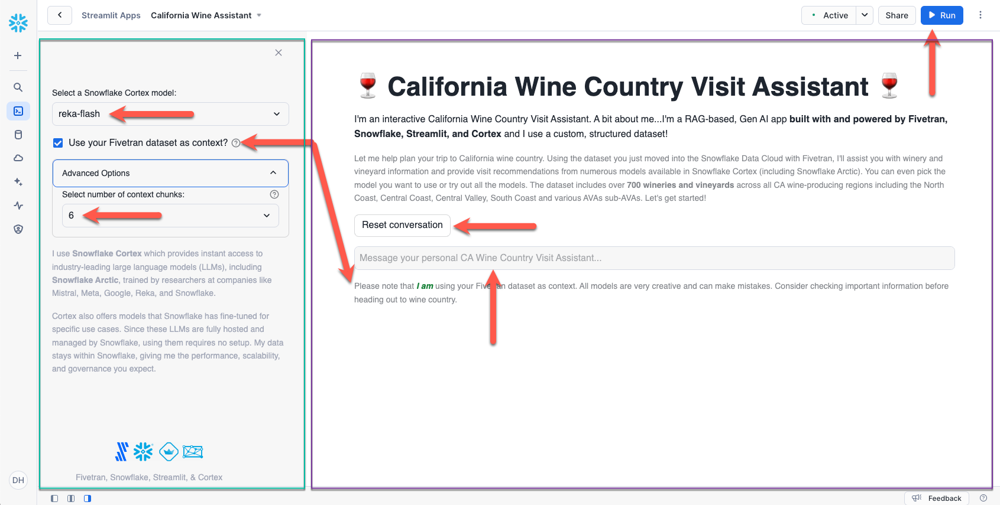

**Content Area:** The content area (purple box) has two controls.
- Prompt input textbox.  Type in your prompt, click enter/return and the prompt executes.  
- The `reset` button clears the prompt and response history, but leaves the side panel settings alone allowing you to start a new prompt to test with the same settings.
- Also note that next to the `run` button you will see the status drop down list.  You will notice that the status will start spinning when a prompt is running.  If you wonder if your prompt is executing, just see if the status is spinning.

**Side Panel:** The side panel (green box) contains features that alter the functionality of the chatbot.  Refresh occurs automatically meaning if you change any setting in the side panel, the current prompt automatically runs allowing you to compare results from different feature settings.
- The `models` drop down list contains the list of models defined at the top of the application code block.  Try different models to see how each responds to the prompts, and see which one may fit your use case better.
- Next is the `use your dataset` checkbox which enables RAG.  When this checkbox is checked or unchecked, you will see the message below the prompt change alerting you of what to expect in your results.  Try a prompt with the checkbox checked and then uncheck to see the response change and see why RAG enables your chatbot to provide insight on "your" data (use at least one control record so that you know RAG is being performed since the control records/wineries/vineyards do not exist in reality).
- Under `advanced options`, the `number of chunks` list sets the limit on the number of records/chunks to add to the current context for the LLM.  This is the core of RAG functionality.  As noted before, there are limits to the number of chunks (translated into tokens) for each model.  So keep that in mind.  The current list of numbers in the chunks drop down list should not cause any harm in running in any current LLM in the list.

> 
> One main item to note is the chatbot does not use previous responses to further refine results.  This feature could be added, but for this iteration, every prompt will be a new prompt for the LLM possibly using a new set of RAG context.
>

> 
> If you edit the code, adding a new model to the list for example, ensure you click the `run` button in the upper right.  This tells Streamlit to use the updated code.
>

**The Response:** Review the response for each prompt.  Remember, the newest response will bubble to the top; so you may need to scroll up to see it.

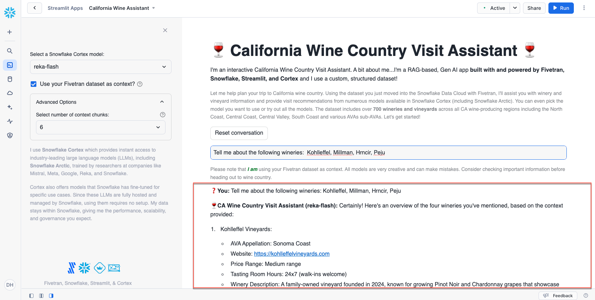

There are two additional pieces of information added to the bottom of each response.
- The first is the token count for the prompt and response along with some timings.  This helps you understand the efficiency and costs of the model run.
- The second is the RAG data, in this case the vineyard/winery names from your table, that was added to the context sent to the LLM.  If no RAG items are sent to the model, you will see a 'none' for the RAG data.  Just the names are displayed here where the entire unstructured record (winery_information column) was added to the actual LLM call.

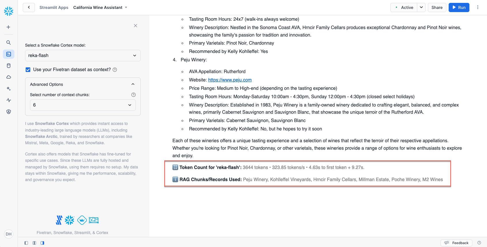

## Chatbot Tests

### Testing Notes
Now that you know your way around the key features, it’s time to put the California Wine Country Visit Assistant to work.

The assistant is designed to:
- Tell you about wineries and vineyards in California
- Create a trip/travel itinerary for a California Wine Country Visit

As a reminder, if you “Use your Fivetran dataset as context” then the assistant will be sure to use the dataset that you moved into Snowflake. The dataset is 700+ wineries and vineyards across California with the following information for each one:
- Winery name
- CA wine region
- AVA, Appellation, Sub-Appellation
- Website
- Price range
- Tasting room hours
- Are reservations required
- Winery description
- Primary varietals offered
- Thoughts on the tasting room experience
- Amenities
- Awards and accolades
- Distance travel time considerations
- User rating
- Secondary varietals
- Wine styles
- Events and activities
- Sustainability practices
- Social media channels
- Address
- City
- State
- Zip
- Phone
- Winemaker
- Did Kelly Kohlleffel recommend this winery

There are control records (phantom wineries) in the Fivetran dataset that are guaranteed to not exist in any of the models’ original training datasets:
- Millman Estate
- Tony Kelly Pamont Vineyards
- Hrncir Family Cellars
- Kai Lee Family Cellars
- Kohlleffel Vineyards
- Picchetti Winery

These records can be used to ensure the RAG functionality is working where you will see the vineyard name in the RAG data used section.  If you uncheck RAG and use these records and data shows up, then the LLM hallucinated.  Hopefully you will get something like "...could not find the vineyard...".

Additionally, there are unique aspects in various vineyard descriptions that are guaranteed to not be a part of the models’ original training datasets - here are some examples:
- Continuum Estate: The owners also have an energetic vizsla dog that runs around the property.
- Hirsch Vineyards: Kelly Kohlleffel recommends this winery for its location on the extreme Sonoma Coast. You will need your mapping app to navigate here, but you'll find terrific views and world-class pinot noir and chardonnay.
- Alpha Omega Winery: This winery is highly recommended by Kelly Kohlleffel based on enjoying an afternoon glass of wine on the patio facing the fountains. Also, the AO Era is a must try as well.

> 
> Remember the chunks!  The more vineyards/wineries you ask for, the more chunks you will need to pass to the LLM or the LLM will try to figure it out on its own!
>

### Simple Prompt Format (4-6 chunks)
For simple prompts, try things like (if you want additional winery names, check the california_wine_visits table):
- Tell me about the following wineries:  Kohlleffel, Millman, Hrncir, Caymus
- Tell me about the difference in wine styles between Hrncir Family Cellars and Peju.

### More Complex Prompt Format (6-8 chunks)
For a more complex prompt, try:
- Plan a trip to visit 3 wineries during a 1 day trip that are all based in the Sonoma coast. Be sure to include Kohlleffel Vineyards as one of the three wineries.
- Plan me a 2 day trip covering 4 wineries in Yountville and Sonoma and include local eateries.  Be sure to include Chandon Estates on day 1 and Tony Kelly on day 2.

### Very Complex Prompts (10-16 chunks)
- Provide a winery visit itinerary to visit six wineries during a two day trip. I’d like to visit the Sonoma coast on day 1 and Yountville on day 2. Be sure to include Kohlleffel Vineyards as one of the six wineries on day 1. Provide driving times as well. Organize this into a two day trip. Provide a hotel recommendation for the evening of day one. Also let me know about other activities that you recommend on the Sonoma Coast and in Yountville such as hiking trails. Also provide a catchy name for this trip of no more than seven words. Take all of the information and organize it with the trip name at the top and all the information in a good printable format. Lastly, what else would you suggest to make this trip even better?

- Provide a winery visit itinerary to visit nine wineries during a three day trip. I’d like to visit the Sonoma coast on day one and Yountville on day two and St. Helena on day three. Be sure to include Kohlleffel Vineyards and Millman Estate as two of the wineries on day one.  Ensure that Hrncir Family Cellars is included on day two. Provide driving times as well. Organize this into a three day trip. Provide a hotel recommendation for the evening of day one and a different hotel for the evening of day two. Also let me know about other activities that you recommend on the Sonoma Coast and in Yountville and in St. Helena such as hiking trails. Also provide a catchy name for this trip of no more than seven words. Take all of the information and organize it with the trip name at the top and all the information in a good printable format. Lastly, what else would you suggest to make this trip even better?

- Provide a winery visit itinerary to visit 9 wineries during a 3 day trip. I’d like to visit the Sonoma coast on day 1 and Yountville on day 2 and St. Helena on day 3. Be sure to include Kohlleffel Vineyards and Millman Estate as 2 of the wineries on day 1. Provide driving times as well to get to the first winery and driving times between wineries and other venues. Organize this into a 3 day trip. Provide a hotel recommendation for the evening of day 1 and a different hotel for the evening of day 2. Also let me know about other activities that you recommend on the Sonoma Coast and in Yountville and in St. Helena such as hiking trails. Also provide a catchy name for this trip of no more than seven words. Provide your estimate for what this trip will cost and show me the detail on how you estimated the cost. Take all of the information and organize it with the trip name at the top and all the information in a good printable format. What else would you suggest to make this trip even better?

- Provide a winery visit itinerary to visit 9 wineries during a 3 day trip. I’d like to visit the Sonoma Coast on day 1 and Yountville on day 2 and Howell Mountain on day 3. Be sure to include Kohlleffel Vineyards and Millman Estate as 2 of the wineries on day 1. Del Dotto as one of the wineries on Day 2. and Sumit Lake Vineyards as one of the wineries on Day 3. Provide addresses of the wineries.  Provide driving times as well to get to the first winery and driving times between wineries and other venues. Organize this into a 3 day trip. Provide a hotel recommendation for the evening of day 1 and a different hotel for the evening of day 2. Also let me know about other activities that you recommend on the Sonoma Coast and in Yountville and in St. Helena such as hiking trails. Also provide a catchy name for this trip of no more than seven words. Provide your estimate for what this trip will cost and show me the detail on how you estimated the cost. Take all of the information and organize it with the trip name at the top and all the information in a good printable format. What else would you suggest to make this trip even better? What types of clothing should I bring if I am planning my trip for early June?

### Cortex Search Service Note
This lab is RAG-based meaning you are using a pre-trained LLM and adding your data as context in the prompt to get very rich responses.  This is just one example of performing RAG for a particular use case.  Snowflake also has the [Cortex Search](https://docs.snowflake.com/en/user-guide/snowflake-cortex/cortex-search/cortex-search-overview#overview) feature which may help simplify this process.  Review this feature to get an understanding of other RAG implementation possibilities as well utilizing Cortex Search on your data only (without invoking a call to a LLM).

### Chunking Note
You may have noticed that you did not need to build a chunking function to split our concatenated, unstructured string data records into appropriately sized chunks.  The dataset is a controlled dataset where the string records created do not exceed 2000 tokens.  Had there been very large records, a chunking function (text splitting) would have been implemented.

## Conclusion and Resources

### Conclusion
This lab demonstrates the ease at which you can utilize "structured datasets" for GenAI provided by Fivetran's fully automated data integration pipelines allowing you to build value-add applications in Snowflake and ask questions about "your" data without having to worry about data freshness!

### What You Learned
- Created a production-ready data pipeline from PostgreSQL to Snowflake via Fivetran in a few clicks!
- Utilized Cortex to take a structured dataset and convert it into an unstructured vector dataset!
- Created a Streamlit chatbot application!
- Had fun creating wine trips through the California countryside including places only found in your data!
- All in less than an hour!

### Resources
See what other customers are [doing with Snowflake](/en/customers/) and how customers are using [Snowflake Cortex](/en/data-cloud/cortex/) to solve complex business problems!

See why [Fivetran](https://fivetran.com) is the ultimate automated data movement platform for any [data source](https://www.fivetran.com/connectors) and how Fivetran is transforming how [orgainzations operate](https://www.fivetran.com/blog)!

Fivetran's mission is to "Make data as accessible and reliable as electricity!"  [Let us show you how we do it!](https://go.fivetran.com/demo)

- [Fork Repo on GitHub](https://github.com/Snowflake-Labs/sfguide-rag-chatbot-using-snowflake-and-fivetran/)
- [Download Reference Architecture](/content/dam/snowflake-site/developers/2024/10/RAG-based-Chatbot-using-Structured-Data-with-Fivetran-and-Snowflake.pdf)
- [Read the Blog](https://medium.com/snowflake/rethinking-the-use-of-structured-data-in-rag-an-example-with-fivetran-and-snowflake-d524f939d6ba)
- [Watch the Demo](https://youtu.be/yLfawom_zsE?list=TLGG-QwCMfGF7NsyNDA5MjAyNQ)
