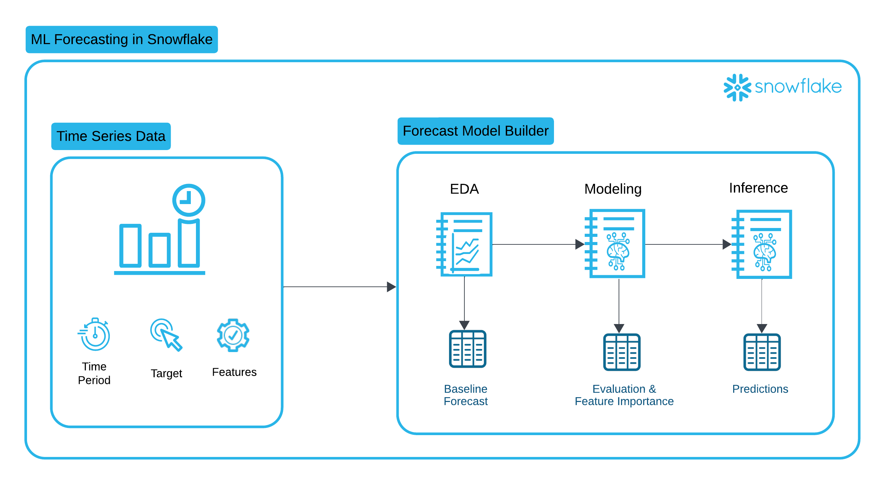

author: Rachel Blum
id: forecast_model_builder
summary: Automatically Build, Register and Run Inferencing on Paritioned Forecasting Models in Snowflake.
categories: data-science, getting-started
environments: web
status: Draft
feedback link: https://github.com/Snowflake-Labs/sfguides/issues
tags: Data Science, Getting Started, Data Engineering, Machine Learning, Snowpark

# Snowflake Guide Template
<!-- ------------------------ -->
## Overview 
Duration: 1

Forecasting is a business process that predicts future events over time based on historical time-series data, and has cross-industry applicability and utility in nearly every organization. Multiple business units can benefit from this modelling technique to more accurately predict performance, demand, or or any activity that can lead to improved business reactivity and optimization.

The Forecast Model Builder accelerates time to value by offering modeling flexibility, a low code environment, and automated model deployment through Snowflake Model Registry. With this solution, customers can quickly realize business value in weeks, not years. 

### Prerequisites
- Access to the [Emerging Solutions Toolbox Gitlab Repository for Forecast Model Builder](https://snow.gitlab-dedicated.com/snowflakecorp/SE/sit/sln.emerging-solutions-toolbox/-/tree/master/framework-evalanche?ref_type=heads).

### What You’ll Learn 
How to automatically:
- Perform Exploratory Data Analysis on your Time Series Data
- Execute Feature Engineering, Advanced Modeling and Model Registration for your single or multi-series partitioned data
- Run inferencing against the models stored in the Registry

### What You’ll Need 
- A [GitLab](https://gitlab.com/) Account 
- A Snowflake account

### What You’ll Build 
- An end-to-end Snowflake Notebook based forecasting solution for your time series data.

<!-- ------------------------ -->
## Solution Setup
Duration: 2


<!-- ------------------------ -->
## Exploratory Data Analysis
Duration: 2

A single sfguide consists of multiple steps. 

<!-- ------------------------ -->
## Feature Engineering and Advanced Modeling
Duration: 2


<!-- ------------------------ -->
## Inferencing
Duration: 2


### Python
```python
df = session.sql(query).to_pandas()
```

### Tables
<table>
    <thead>
        <tr>
            <th colspan="2"> **The table header** </th>
        </tr>
    </thead>
    <tbody>
        <tr>
            <td>The table body</td>
            <td>with two columns</td>
        </tr>
    </tbody>
</table>


### Images


### Videos
Videos from youtube can be directly embedded:
<video id="KmeiFXrZucE"></video>

<!-- ------------------------ -->
## Conclusion And Resources
Duration: 1

At the end of your Snowflake Guide, always have a clear call to action (CTA). This CTA could be a link to the docs pages, links to videos on youtube, a GitHub repo link, etc. 

If you want to learn more about Snowflake Guide formatting, checkout the official documentation here: [Formatting Guide](https://github.com/googlecodelabs/tools/blob/master/FORMAT-GUIDE.md)

### What You Learned
- creating steps and setting duration
- adding code snippets
- embedding images, videos, and surveys
- importing other markdown files

### Related Resources
- [A Getting Started Guide with Snowflake Notebooks](https://quickstarts.snowflake.com/guide/getting_started_with_snowflake_notebooks/index.html#0)
- [Getting Started with Snowflake Notebook Container Runtime](https://quickstarts.snowflake.com/guide/notebook-container-runtime/index.html#0)
- [Train an XGBoost Model with GPUs using Snowflake Notebooks](https://quickstarts.snowflake.com/guide/train-an-xgboost-model-with-gpus-using-snowflake-notebooks/index.html#0)