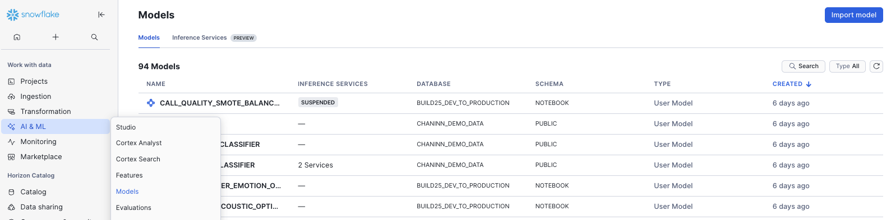
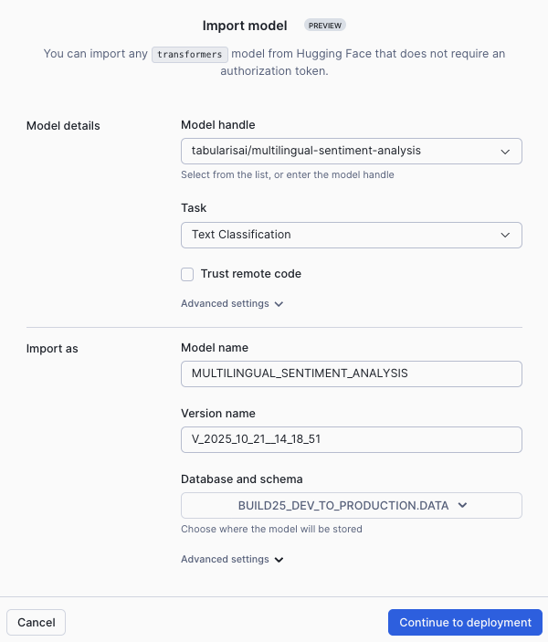

id: from-dev-to-production-why-ml-teams-are-migrating-to-snowflake
summary: Migrate ML workflows to Snowflake for unified development, deployment, experiment tracking, and production model management.
categories: snowflake-site:taxonomy/solution-center/certification/quickstart, snowflake-site:taxonomy/product/ai, snowflake-site:taxonomy/snowflake-feature/build, snowflake-site:taxonomy/snowflake-feature/ml-functions
language: en
environments: web
status: Published
feedback link: https://github.com/Snowflake-Labs/sfguides/issues
authors: James Cha-Earley

# From Dev to Production: Why ML teams are migrating to Snowflake

## Overview

In this quickstart, you'll learn how to build a complete machine learning lifecycle in Snowflake, from model development to  deployment. You'll deploy HuggingFace models, train custom ML models, track experiments, deploy for inference, and enable real-time feature serving.

### What You'll Learn
- Using HuggingFace models for feature generation
- Extracting acoustic features from audio using Whisper and transformers
- Building and training XGBoost models for call quality prediction
- Tracking ML experiments with Snowflake ML
- Deploying models as services for inference
- Setting up model monitoring
- Enabling online feature stores for real-time predictions

### What You'll Build
A production-ready ML system that:
- Analyzes call center audio to extract acoustic, emotion, and content features
- Predicts call quality using trained models
- Provides real-time coaching suggestions for agents
- Monitors model performance in production
- Serves features with low latency for live applications

### Prerequisites
- Snowflake account in a [supported region for Cortex functions](https://docs.snowflake.com/en/user-guide/snowflake-cortex/llm-functions#availability)
- [Snowflake Notebooks](https://docs.snowflake.com/en/user-guide/ui-snowsight/notebooks) enabled
- [Anaconda Packages](https://docs.snowflake.com/en/developer-guide/udf/python/udf-python-packages#using-third-party-packages-from-anaconda) enabled
- [Cortex LLM Functions](https://docs.snowflake.com/en/user-guide/snowflake-cortex/llm-functions) enabled

## Setup Environment and Import Model

### Run Setup Script

1. Download the [setup.sql](https://github.com/Snowflake-Labs/sfguide-from-dev-to-production-why-ml-teams-are-migrating-to-snowflake/blob/main/setup.sql) file from the source repository
2. Open a new worksheet in Snowflake
3. Click the **Open file** button (or use File > Open from the menu)
4. Select the `setup.sql` file you downloaded
5. Run all statements in the script to create:
   * Database: `BUILD25_DEV_TO_PRODUCTION`
   * Schema: `DATA`
   * Stage: `audio_files` (with directory enabled)

The setup script will create all the necessary infrastructure for this quickstart.

> NOTE: The setup script includes proper permissions and configurations needed for the entire ML workflow.

### Import Sentiment Analysis Model from HuggingFace

Before extracting features, you need to import the sentiment analysis model into the Model Registry:

1. In your Snowflake account, click on **AI & ML** in the left navigation menu
2. Click on **Models**

3. In the top right corner, click **Import Model**

4. In the Import Model dialog:
   * For **Model Handle**, enter: `tabularisai/multilingual-sentiment-analysis`
   * For **Task**, select: **Text Classification**
   * The **Model Name** will auto-populate as `MULTILINGUAL_SENTIMENT_ANALYSIS`
   * For **Database**, select: **BUILD25_DEV_TO_PRODUCTION**
   * For **Schema**, select: **DATA**

5. Click **Import**

The model will be imported into your Model Registry and will be available for use in the notebook.

> NOTE: The Model Registry enables you to manage model versions, track lineage, and ensure consistent model usage across your ML workflows.

### Verify Model Import

After import completes, you should see the model `MULTILINGUAL_SENTIMENT_ANALYSIS` listed in your Models under BUILD25_DEV_TO_PRODUCTION.DATA schema.

## Open Notebook and Extract Features

### Import the Notebook

1. Download the [Notebook](https://github.com/Snowflake-Labs/sfguide-from-dev-to-production-why-ml-teams-are-migrating-to-snowflake/blob/main/BUILD25_FROM_DEV_PRODUCTION.ipynb) from GitHub (NOTE: Do NOT right-click to download.)
2. In your Snowflake account:
   * On the left hand navigation menu, click on **Projects** → **Notebooks**
   * On the top right, click on **Notebook** down arrow and select **Import .ipynb file** from the dropdown menu
   * Select the file you downloaded in step 1 above
3. In the Create Notebook popup:
   * For Notebook location, select **BUILD25_DEV_TO_PRODUCTION** for your database and **DATA** as your schema
   * For **Runtime**, select **Container Runtime**
   * Click on **Create** button
4. On the top right open **Notebook Settings**
   * Click **External Access**
   * Enable **PyPi**
   * Click **Save** 

The notebook will run on container runtime, which provides the necessary environment for running ML workloads with GPU support. The notebook will guide you through installing required packages including PyTorch, Transformers, Librosa, Whisper, and other ML libraries needed for audio processing and model training.

> NOTE: Container runtime is required for this notebook as it provides GPU support and the necessary ML libraries for feature extraction and model training.

### Prepare Audio Files

In the notebook, you'll create a table that catalogs all audio files in the stage. This table includes:
- File name and path
- File size in bytes
- Last modified timestamp

The notebook includes commands to verify the file count and display a sample of available files.

### Understanding Feature Extraction

The notebook includes a comprehensive `HuggingFaceAcousticExtractor` class that extracts multiple types of features from call audio:

**Acoustic Features (17 features):**
- Speaking rate and variability
- Pause patterns and duration
- Pitch characteristics (mean, variance, range)
- Energy levels and dynamics
- Spectral properties
- Voice quality indicators (jitter, shimmer, harmonics-to-noise ratio)
- Zero crossing rate
- Silence and speech ratios

**Interaction Features (4 features):**
- Interruption count
- Agent talk ratio
- Turn-taking rate
- Average turn duration

**Emotion Features (4 features):**
- Average emotion scores
- Emotion volatility
- Stress indicators
- Dominant emotion detection

**Content Features (7 features):**
- Word count from transcription
- Named entities (persons, organizations, locations)
- Entity count
- Sentiment label and score

### Run Feature Extraction

For each audio file, the system:
1. Downloads the file from the Snowflake stage
2. Uses Whisper to transcribe the audio
3. Extracts acoustic features using librosa
4. Analyzes emotions using wav2vec2 models
5. Performs Named Entity Recognition on transcripts
6. Analyzes sentiment using the model from the Model Registry
7. Stores all 32+ features in a structured table

This process leverages multiple state-of-the-art models to create a comprehensive feature set for training.

After extraction completes, you can review the results in the `call_acoustic_features` table. The notebook includes queries to examine transcripts, emotions, stress levels, and other extracted features.

> TROUBLESHOOTING: The container runtime provides the necessary compute resources for processing. If feature extraction is slow, the notebook cells may need additional time to complete due to the complexity of the ML operations.

## Generate Labels and Train Models

### AI-Powered Label Generation

Since manually labeling call quality is time-consuming, you'll use Snowflake Cortex to automatically analyze calls and generate quality labels. The system uses Claude Sonnet 4.5 to:

1. Read the full transcript
2. Consider acoustic context (emotion, stress, interruptions)
3. Determine if the call was resolved
4. Rate customer satisfaction (1-5 scale)
5. Assess resolution confidence
6. Provide reasoning for the assessment

The generated outcomes table includes:
- **call_resolved**: Binary indicator (0 or 1)
- **customer_satisfaction_score**: Rating from 1-5
- **resolution_confidence**: Float from 0.0 to 1.0
- **reasoning**: Text explanation of the assessment

The notebook includes queries to check the quality distribution and verify the labeled dataset.

### Setup Experiment Tracking

The notebook uses Snowflake ML's experiment tracking to systematically compare different modeling approaches. All experiments are logged under the `call_quality_prediction_with_ner` experiment name.

A "high quality call" is defined as one where the issue was resolved and customer satisfaction was 4 or higher.

### Data Splitting Strategy

The data is split into three sets:
- **Holdout set**: 5 calls reserved for final validation (never used in training/testing)
- **Training set**: 80% of remaining data for model training
- **Test set**: 20% of remaining data for evaluation

### Train Multiple Experiments

The notebook trains four different models for comparison:

**Experiment 1: Optimized XGBoost with All Features**
- Uses all 32+ features with optimized hyperparameters
- Automatically finds optimal prediction threshold to maximize F1 score

**Experiment 2: Acoustic Features Only**
- Tests if acoustic signals alone can predict call quality
- Uses only acoustic and interaction features

**Experiment 3: NER + Emotion Features**
- Focuses on content and emotional indicators
- Tests whether "what was said" matters more than "how it was said"

**Experiment 4: SMOTE Balanced Data**
- Applies SMOTE oversampling to create balanced training data
- Addresses class imbalance issues

All experiments log model parameters, performance metrics (accuracy, precision, recall, F1, AUC), optimal prediction threshold, and trained model artifacts. You can compare experiments in Snowflake to determine which approach works best.

## Deploy Model and Setup Monitoring

### Load and Deploy Best Model

Using the Model Registry, you'll load the best-performing model version. The registry provides model versioning, lineage, metadata, and metrics.

Deploy your model as a service using Snowflake's built-in compute pool. This creates:
- A scalable inference endpoint
- Automatic request handling
- Built-in load balancing

The notebook will use the available GPU compute pool for model deployment.

### Make Predictions

Test the deployed service using your holdout calls. The notebook demonstrates:
1. Loading the holdout call IDs
2. Retrieving their features
3. Calling the prediction service
4. Comparing predictions to actual outcomes

All predictions are saved to a monitoring table with metadata including timestamp, model name/version, prediction threshold, service name, and actual outcome.

### Setup Model Monitoring

Configure the model task type as binary classification so monitoring can calculate appropriate metrics like accuracy, precision, recall, and AUC.

Create a baseline using recent predictions (last 100 calls) to represent "normal" model performance. This baseline will be used to detect:
- Performance degradation
- Prediction drift
- Data quality issues

Set up automated monitoring that:
- Refreshes every hour
- Aggregates metrics daily
- Compares current performance to baseline
- Tracks feature distributions
- Alerts on drift or degradation

> BEST PRACTICE: Set up monitoring alerts to notify your team when model performance drops below acceptable thresholds.

## Enable Feature Store and Build Dashboard

### Understanding Feature Stores

Feature stores solve the challenge of serving features consistently between training (batch) and inference (real-time). They provide:
- Feature versioning and lineage
- Point-in-time correctness
- Low-latency serving for production
- Feature reuse across projects

### Create Feature Store

Initialize a feature store in your database and register the call entity with its join key (call_id).

### Create Feature Views with Online Serving

Create three feature views, each with online serving enabled:

**Acoustic Features View:**
- Speaking rate, pitch, energy, pauses
- Refresh every minute
- Target lag under 30 seconds

**Emotion & Sentiment Features View:**
- Emotion scores, stress, sentiment
- Real-time emotional state tracking
- Updated continuously

**NER & Content Features View:**
- Word counts, entities
- Content-based indicators
- Low-latency retrieval

Each feature view is backed by a dynamic table that automatically refreshes and an online table for fast point lookups.

### Test Online Retrieval

Verify that online serving works by getting a sample call ID, retrieving specific features using the online store, and confirming sub-30-second latency.

### Run the Streamlit Dashboard

The notebook includes a built-in Streamlit cell that creates an interactive real-time dashboard. Simply run the Streamlit cell in the notebook to launch the application.

The dashboard will open directly within your notebook environment, allowing you to monitor calls without leaving your workspace.

### Dashboard Features

The real-time dashboard provides supervisors with instant visibility into call quality:

**Live Monitoring Display:**
- Overall call quality prediction (HIGH/LOW)
- Real-time stress level meter
- Sentiment score tracking
- Interruption counter

**Priority-Based Coaching Suggestions:**
- 🔴 **High Priority**: Stress alerts, very negative sentiment, immediate escalation needs
- ⚠️ **Medium Priority**: Speaking pace issues, excessive interruptions, talk ratio imbalance
- ✅ **Good Performance**: Positive reinforcement for effective calls

**Detailed Call Metrics:**
- Speaking rate in words per minute
- Agent talk ratio percentage
- Average pause duration
- Word and entity counts
- Dominant emotion

**Interactive Controls:**
- Auto-refresh toggle (5-second intervals)
- Call selection dropdown
- Manual refresh button
- Expandable detailed feature view

The dashboard uses the online feature store for low-latency retrieval (under 30 seconds) and provides supervisors with actionable insights for coaching agents in real-time.

> TIP: The dashboard auto-refreshes every 5 seconds when enabled, perfect for monitoring live calls. You can also manually refresh or select specific calls to examine in detail.

## Conclusion and Resources

Congratulations! You've successfully built a complete ML lifecycle in Snowflake that transforms call center audio into actionable insights. You imported a HuggingFace model into the Model Registry, extracted comprehensive features, trained multiple ML models with experiment tracking, deployed models as services, set up monitoring, and enabled real-time feature serving with a Streamlit dashboard - all within Snowflake's unified platform.

### What You Learned
* How to import HuggingFace models into the Model Registry
* How to extract acoustic, emotion, and content features from audio using Whisper, librosa, and transformers
* How to use Snowflake Cortex for generating labels with AI
* How to build and train XGBoost models with Snowflake ML
* How to track ML experiments and compare model performance
* How to handle imbalanced datasets using SMOTE and threshold optimization
* How to deploy models as services for inference
* How to setup model monitoring for production ML systems
* How to create and manage online feature stores for real-time serving
* How to build interactive Streamlit dashboards within notebooks for live monitoring

### Related Resources

**Documentation:**
- [Snowflake ML Overview](https://docs.snowflake.com/en/developer-guide/snowflake-ml/overview)
- [Model Registry](https://docs.snowflake.com/en/developer-guide/snowflake-ml/model-registry/overview)
- [Feature Store](https://docs.snowflake.com/en/developer-guide/snowflake-ml/feature-store/overview)
- [Experiment Tracking](https://docs.snowflake.com/en/developer-guide/snowflake-ml/modeling)
- [Model Monitoring](https://docs.snowflake.com/en/developer-guide/snowflake-ml/model-registry/model-observability)
