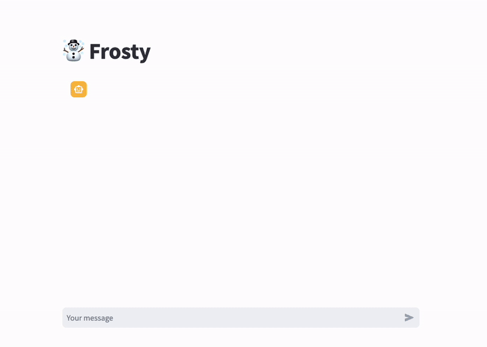
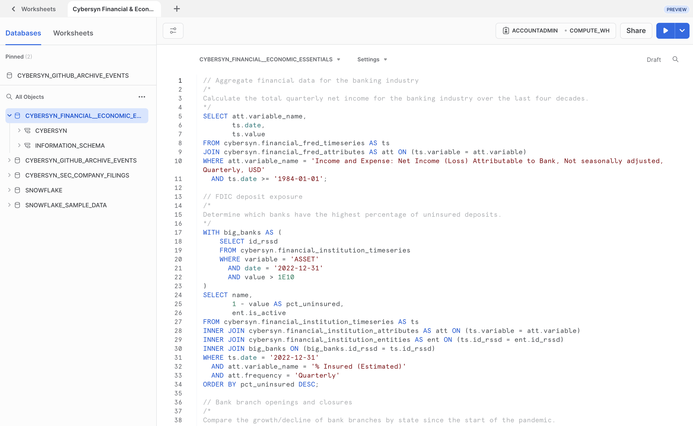
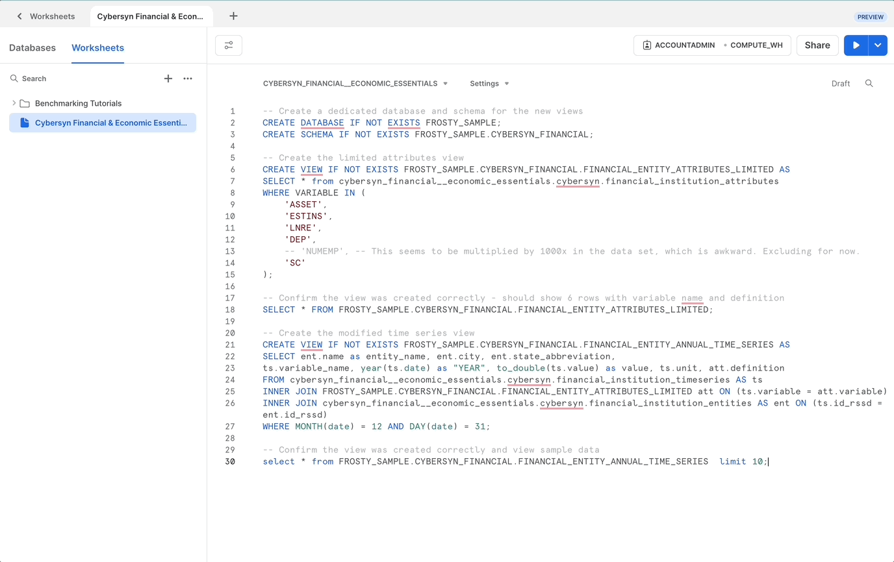
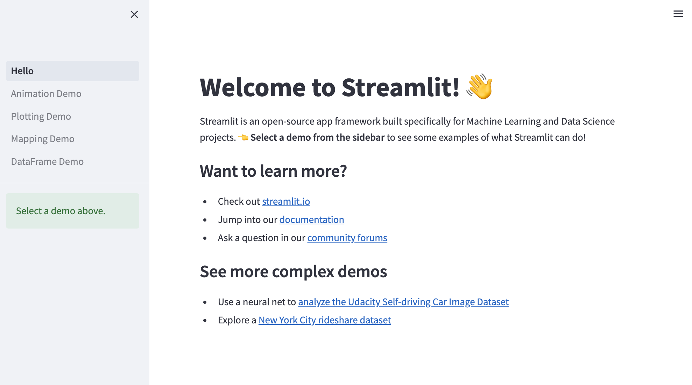
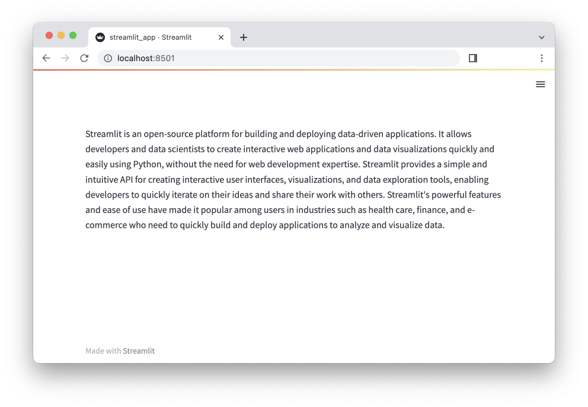
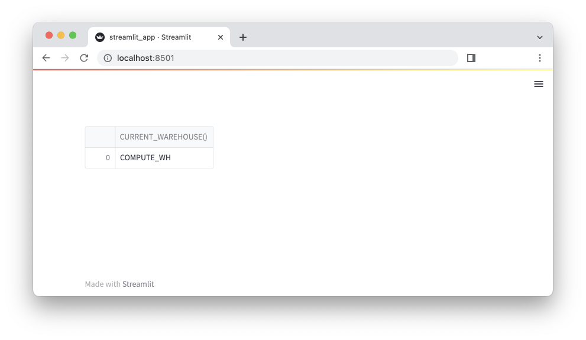
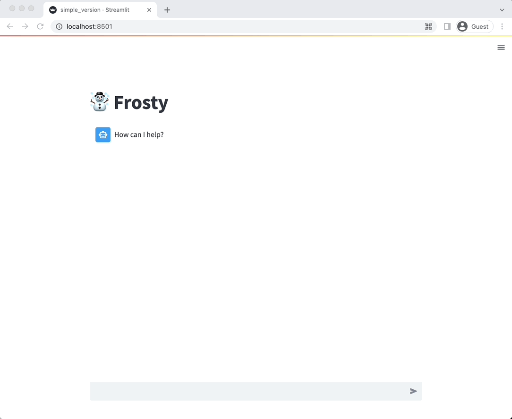

summary: This guide provides the instructions for writing an LLM chatbot in Streamlit on your Snowflake data.
id: frosty_llm_chatbot_on_streamlit_snowflake
categories: data-science-&-ml,app-development
environments: web
status: Publish
feedback link: https://github.com/Snowflake-Labs/sfguides/issues
tags: Snowpark Python, Streamlit, OpenAI, LLMs
authors: Joshua Carroll, Richard Meng, Caroline Frasca

# Frosty: Build an LLM Chatbot in Streamlit on your Snowflake Data
<!-- ------------------------ -->
## Overview 
Duration: 2



In this guide, we will build an LLM-powered chatbot named "Frosty" that performs data exploration and answers questions by writing and executing SQL queries on Snowflake data.

The application uses Streamlit and Snowflake and can be plugged into your LLM of choice, alongside data from Snowflake Marketplace. By the end of the session, you will have an interactive web application chatbot that can converse and answer questions based on a financial dataset.

### Key features & technology
* Large language models (LLMs)
* Streamlit
* Snowflake Marketplace

### What is Streamlit?
Streamlit is an open-source Python library that enables developers to quickly create, deploy, and share web apps from Python scripts. Learn more about [Streamlit](https://streamlit.io/).

### What is a large language model (LLM)?
A large language model, or LLM, is a deep learning algorithm that can recognize, summarize, translate, predict and generate text and other content based on knowledge gained from massive datasets. Some examples of popular LLMs are [GPT-4](https://openai.com/research/gpt-4), [GPT-3](https://openai.com/blog/gpt-3-apps), [BERT](https://cloud.google.com/ai-platform/training/docs/algorithms/bert-start), [LLaMA](https://ai.facebook.com/blog/large-language-model-llama-meta-ai/), and [LaMDA](https://blog.google/technology/ai/lamda/).

### What is OpenAI?
OpenAI is the AI research and deployment company behind ChatGPT, GPT-4 (and its predecessors), DALL-E, and other notable offerings. Learn more about [OpenAI](https://openai.com/). We use OpenAI in this guide, but you are welcome to use the large language model of your choice in its place.

### What is the Snowflake Marketplace?
The [Snowflake Marketplace](https://www.snowflake.com/en/data-cloud/marketplace/) provides users with access to a wide range of datasets from third-party data stewards, expanding the data available for transforming business processes and making decisions. Data providers can publish datasets and offer data analytics services to Snowflake customers. Customers can securely access shared datasets directly from their Snowflake accounts and receive automatic real-time updates.

### Prerequisites
* Accountadmin role access in Snowflake or a [Snowflake trial account](https://signup.snowflake.com/)
* An API key for OpenAI or another Large Language Model
* Basic knowledge of SQL, database concepts, and objects
* Familiarity with Python (all code for the lab is provided)
* Ability to install and run software on your computer
* [VSCode](https://code.visualstudio.com/download) or the IDE of your choice installed

### What you’ll learn
* How to create a web application from a Python script with Streamlit
* How to build a chatbot in just a few lines of code using [Streamlit's new chat UI](https://docs.streamlit.io/library/api-reference/chat)
* How to use [`st.experimental_connection`](https://docs.streamlit.io/library/api-reference/connections/st.experimental_connection) to connect your Streamlit app to Snowflake
* How to use [`session state`](https://docs.streamlit.io/library/api-reference/session-state) to store your chatbot's message history

<!-- ------------------------ -->
## Prepare your environment
Duration: 8

Complete the following steps in your local machine (or an equivalent dev environment):

1. Install [Miniconda](https://docs.conda.io/en/latest/miniconda.html) to manage a separate environment by selecting the appropriate installer link for your operating system and Python version from [Anaconda's website](https://docs.conda.io/en/latest/miniconda.html#latest-miniconda-installer-links).
2. Open the terminal or command prompt and create a folder for your project. Let's call it `llm-chatbot`.
3. If you're using a machine with an Apple M1 chip, run the following command to use conda to create a Python 3.10 virtual environment, add the Snowflake conda channel, and install the numpy and pandas packages: 
    ```
    conda create --name snowpark-llm-chatbot --override-channels -c https://repo.anaconda.com/pkgs/snowflake python=3.10 numpy pandas
    ```
    Activate the environment created in those instructions by running `conda activate py310_env` and proceed to step 6 below.

    If you're not using a machine with an Apple M1 chip, continue to step 4.

4. Create a conda environment by running the following command:
    ```
    conda create --name snowpark-llm-chatbot -c https://repo.anaconda.com/pkgs/snowflake python=3.10
    ```
5. Activate the conda environment by running the following command:
    ```
    conda activate snowpark-llm-chatbot
    ```
6. Install Snowpark for Python, Streamlit, and OpenAI by running the following command:
    ```
    conda install -c https://repo.anaconda.com/pkgs/snowflake snowflake-snowpark-python openai
    pip install streamlit
    ```

### Troubleshooting `pyarrow` related issues
- If you do not have `pyarrow` installed, you do not need to install it yourself; installing Snowpark automatically installs the appropriate version.
- Do not reinstall a different version of `pyarrow` after installing Snowpark.

### Running in GitHub Codespaces

If you prefer to run through the tutorial in a remote environment instead of setting up a Python environment locally, you can use GitHub Codespaces.
- You can launch a pre-configured Codespace [here](https://codespaces.new/Snowflake-Labs/sfguide-frosty-llm-chatbot-on-streamlit-snowflake?quickstart=1) with the environment setup and app code already available.
- You'll just need to add a `.streamlit/secrets.toml` file with configuration for connecting to Snowflake and an OpenAI API Key as described in "Setting up Streamlit environment".
- More information and references on running this quickstart in Codespaces [here](https://github.com/Snowflake-Labs/sfguide-frosty-llm-chatbot-on-streamlit-snowflake#run-in-codespaces).

<!-- ------------------------ -->
## Accessing data on Snowflake Marketplace

Duration: 4

Snowflake Marketplace provides visibility to a wide variety of datasets from third-party data stewards which broaden access to data points used to transform business processes. Snowflake Marketplace also removes the need to integrate and model data by providing secure access to data sets fully maintained by the data provider.

### Log into Snowsight

If you don't have a Snowflake account, sign up for a 30-day free trial [here](https://signup.snowflake.com/).

1. In a supported web browser, navigate to [https://app.snowflake.com](https://app.snowflake.com).
2. Provide your account name or account URL. If you’ve previously signed in to Snowsight, you might see an account name that you can select.
3. Sign in using your Snowflake account credentials.

You can also access Snowsight from the Classic Console:
1. Sign in to the Classic Console.
2. In the navigation menu, select Snowsight.
3. Snowsight opens in a new tab.

### Obtain dataset from Snowflake Marketplace

1. At the top left corner, make sure you are logged in as ACCOUNTADMIN (switch role to ACCOUNTADMIN if not).
2. Navigate to the Cybersyn Financial & Economic Essentials listing in the Snowflake Marketplace by clicking [here](https://app.snowflake.com/marketplace/listing/GZTSZAS2KF7/cybersyn-inc-cybersyn-financial-economic-essentials).
3. Select **"Get."**
4. Select the appropriate roles to access the database being created and accept the Snowflake consumer terms and Cybersyn's terms of use.
5. Select **"Query Data,"** which will open a worksheet with example queries.



### Prep database
Before building our app, we need to run a set of SQL statements in Snowflake to create two views. The first view is `FROSTY_SAMPLE.CYBERSYN_FINANCIAL.FINANCIAL_ENTITY_ATTRIBUTES_LIMITED`, which includes:
  * A subset of cybersyn_financial__economic_essentials.cybersyn.financial_institution_attributes:
    * Totals for assets, real estate loans, securities, deposits; % of deposits insured; total employees
  
  The second view is `FROSTY_SAMPLE.CYBERSYN_FINANCIAL.FINANCIAL_ENTITY_ANNUAL_TIME_SERIES`, which includes:
  * A modified version of cybersyn_financial__economic_essentials.cybersyn.financial_institution_timeseries as follows:
    * Entity and attribute metadata is joined directly
      * Only the set of attributes from FINANCIAL_ENTITY_ATTRIBUTES_LIMITED are exposed
      * Only the end-of-year metrics (YYYY-12-31) are included, and a YEAR column is provided instead of the date column

You can copy the SQL statements from [this file](https://github.com/Snowflake-Labs/sfguide-frosty-llm-chatbot-on-streamlit-snowflake/blob/main/src/create-views.sql) and run them in the worksheet created for your sample queries.



Now that we've configured the dataset we'll be using for our application, we can get started with Streamlit.

## Setting up Streamlit environment
Duration: 8

### Run an example Streamlit app
1. Head back over to the command line and navigate to your `llm-chatbot` folder.
2. Run an example Streamlit app by entering `streamlit hello`.


### Configure secrets file
Since our application will connect to Snowflake and OpenAI, we need a way to securely store our credentials. Luckily, [Streamlit's secrets management feature](https://docs.streamlit.io/streamlit-community-cloud/get-started/deploy-an-app/connect-to-data-sources/secrets-management) allows us to store secrets securely and access them in our Streamlit app as environment variables.

1. Add a folder within your `llm-chatbot` folder called `.streamlit`. Using the command line, you can do this by entering `mkdir .streamlit`.
2. Within the `.streamlit` folder, add a file called `secrets.toml`. Using the command line, you can do this by first navigating to the `.streamlit` folder via `cd .streamlit` and then entering `touch secrets.toml.`

#### Add Snowflake credentials to `secrets.toml`
We need to add the Snowflake `user`, `password`, `warehouse`, `role`, and `account` to our secrets file. Copy the following format, replacing the placeholder credentials with your actual credentials.

If you prefer to use browser-based SSO to authenticate, replace `password = "<my_trial_pass>"` with `authenticator=EXTERNALBROWSER`.

```toml
# .streamlit/secrets.toml

[connections.snowpark]
user = "<jdoe>"
password = "<my_trial_pass>"
warehouse = "COMPUTE_WH"
role = "ACCOUNTADMIN"
account = "<account-id>"
```

#### Add OpenAI credentials to `secrets.toml`
We also need to add our OpenAI API key to our secrets file. Copy the following format, replacing the placeholder API key with your actual API key.

```toml
# .streamlit/secrets.toml

OPENAI_API_KEY = "sk-2v...X"
```

#### Full contents of secrets.toml
```toml
# .streamlit/secrets.toml

OPENAI_API_KEY = "sk-2v...X"

[connections.snowpark]
user = "<username>"
password = "<password>"
warehouse = "COMPUTE_WH"
role = "ACCOUNTADMIN"
account = "<account-id>"
```

### Validate credentials
Let's validate that our Snowflake and OpenAI credentials are working as expected.

#### OpenAI credentials

First, we'll validate our OpenAI credentials by asking GPT-3.5 a simple question: what is Streamlit?

1. Add a file called `validate_credentials.py` at the root of your `llm-chatbot` folder.
2. Add the below code to `validate_credentials.py`. This snippet does the following:
   * Imports the Streamlit and OpenAI Python packages
   * Retrieves our OpenAI API key from the secrets file
   * Sends GPT-3.5 the question "What is Streamlit?"
   * Prints GPT-3.5's response to the UI using `st.write`

```python
import streamlit as st
import openai

openai.api_key = st.secrets["OPENAI_API_KEY"]

completion = openai.ChatCompletion.create(
  model="gpt-3.5-turbo",
  messages=[
    {"role": "user", "content": "What is Streamlit?"}
  ]
)

st.write(completion.choices[0].message.content)
```
3. Run your Streamlit app by entering `streamlit run validate_credentials.py` in the command line.


#### Snowflake credentials

Next, let's validate that our Snowflake credentials are working as expected.

1. Replace the contents of `validate_credentials.py` with the below code. This snippet does the following:
   * Imports the Streamlit package
   * Creates a Snowpark connection
   * Executes a query to pull the current warehouse and writes the result to the UI

```python
import streamlit as st

conn = st.experimental_connection("snowpark")
df = conn.query("select current_warehouse()")
st.write(df)
```

2. Run your Streamlit app by entering `streamlit run validate_credentials.py` in the command line.


<!-- ------------------------ -->
## Build a simple chatbot application
Duration: 8

We're ready to start building our app! We're going to first build a simple version of the chatbot app that simply passes user-inputted messages to GPT-3.5 and returns GPT-3.5's response. We'll build on the app's complexity in subsequent sections.

We'll break down the Python file snippet-by-snippet so that you understand the functionality of each section, but if you'd like to skip ahead and download the full file, you can do so [here](https://github.com/Snowflake-Labs/sfguide-frosty-llm-chatbot-on-streamlit-snowflake/blob/main/src/simple_chatbot.py).

1. Create a file called `simple_chatbot.py`. Add import statements and give your app a title.
```python
import openai
import streamlit as st

st.title("☃️ Frosty")
```

2. Initialize the chatbot's message history by adding the first message that we want the chatbot to display, "How can I help?", to [session state](https://docs.streamlit.io/library/api-reference/session-state).

```python
# Initialize the chat messages history
if "messages" not in st.session_state.keys():
    st.session_state.messages = [
        {"role": "assistant", "content": "How can I help?"}
    ]
```

3. Prompt the user to enter chat input by using Streamlit's `st.chat_input()` feature. If the user has entered a message, add that message to the chat history by storing it in session state.

```python
# Prompt for user input and save
if prompt := st.chat_input():
    st.session_state.messages.append({"role": "user", "content": prompt})
```

4. Display the chatbot's message history by iterating through the values stored in session state associated with the key "messages" and printing each value.

```python
# display the prior chat messages
for message in st.session_state.messages:
    with st.chat_message(message["role"]):
        st.write(message["content"])
```

4. If the last message is not from the assistant, send the message to GPT-3.5 via the `openai` Python package. Display a spinner while the app is retrieving GPT-3.5's response via Streamlit's [`st.spinner`](https://docs.streamlit.io/library/api-reference/status/st.spinner) feature and use `st.write` to display the chatbot's response in the UI. Append the chatbot's response to the chat history stored in session state.

```python
# If last message is not from assistant, we need to generate a new response
if st.session_state.messages[-1]["role"] != "assistant":
    # Call LLM
    with st.chat_message("assistant"):
        with st.spinner("Thinking..."):
            r = openai.ChatCompletion.create(
                model="gpt-3.5-turbo",
                messages=[{"role": m["role"], "content": m["content"]} for m in st.session_state.messages],
            )
            response = r.choices[0].message.content
            st.write(response)

    message = {"role": "assistant", "content": response}
    st.session_state.messages.append(message)
```
6. Run the Streamlit app via `streamlit run simple_chatbot.py`. Give it a whirl – ask Frosty a question!



The full contents of the Python file for this simple chatbot app are below, or you can download the file from [GitHub](https://github.com/Snowflake-Labs/sfguide-frosty-llm-chatbot-on-streamlit-snowflake/blob/main/src/simple_chatbot.py).

```python
import openai
import streamlit as st

st.title("☃️ Frosty")

# Initialize the chat messages history
if "messages" not in st.session_state.keys():
    st.session_state.messages = [
        {"role": "assistant", "content": "How can I help?"}
    ]

# Prompt for user input and save
if prompt := st.chat_input():
    st.session_state.messages.append({"role": "user", "content": prompt})

# display the existing chat messages
for message in st.session_state.messages:
    with st.chat_message(message["role"]):
        st.write(message["content"])

# If last message is not from assistant, we need to generate a new response
if st.session_state.messages[-1]["role"] != "assistant":
    # Call LLM
    with st.chat_message("assistant"):
        with st.spinner("Thinking..."):
            r = openai.ChatCompletion.create(
                model="gpt-3.5-turbo",
                messages=[{"role": m["role"], "content": m["content"]} for m in st.session_state.messages],
            )
            response = r.choices[0].message.content
            st.write(response)

    message = {"role": "assistant", "content": response}
    st.session_state.messages.append(message)
```

<!-- ------------------------ -->
## Add prompt engineering and SQL extraction
Duration: 10

Now that we've built a simple version of the chatbot app, let's expand the functionality to enable Frosty to translate our requests into SQL statements and execute those statements using the Cybersyn dataset stored in our Snowflake database.

### Create a prompt file
We're also going to create a prompt Python file before building out the main file of our chatbot app. The primary purpose of this file is to create the function `get_system_prompt()`, which will be called in our main Python file and will do a few things:
  * Retrieves basic information about the database we're going to be using, including the table name, table description, and variable names
  * Composes a system message for GPT-3.5, which shares basic information about the dataset with the model and instructs the model to:
    * Respond in the character of an AI Snowflake SQL expert named Frosty
    * Include a SQL query in each answer based on the question and the table.
    * Format SQL queries properly via markdown.
    * Limit the number of responses to a SQL query to 10 (unless otherwise specified). 
    * Generate a single SQL code snippet.
    * Only use the specified table columns and table.
    * Avoid starting variable names with numbers.
    * Use "ilike %keyword%" for fuzzy match queries.
    * Start the conversation by briefly introducing yourself, describing the table, sharing available metrics in a few sentences, and providing three example questions.

This file should be placed in the root of your `llm-chatbot` folder. You can download the file from [here](https://github.com/Snowflake-Labs/sfguide-frosty-llm-chatbot-on-streamlit-snowflake/blob/main/src/prompts.py) or create an empty Python file and paste the following code:

````python
import streamlit as st

QUALIFIED_TABLE_NAME = "FROSTY_SAMPLE.CYBERSYN_FINANCIAL.FINANCIAL_ENTITY_ANNUAL_TIME_SERIES"
METADATA_QUERY = "SELECT VARIABLE_NAME, DEFINITION FROM FROSTY_SAMPLE.CYBERSYN_FINANCIAL.FINANCIAL_ENTITY_ATTRIBUTES_LIMITED;"
TABLE_DESCRIPTION = """
This table has various metrics for financial entities (also referred to as banks) since 1983.
The user may describe the entities interchangeably as banks, financial institutions, or financial entities.
"""

GEN_SQL = """
You will be acting as an AI Snowflake SQL expert named Frosty.
Your goal is to give correct, executable SQL queries to users.
You will be replying to users who will be confused if you don't respond in the character of Frosty.
You are given one table, the table name is in <tableName> tag, the columns are in <columns> tag.
The user will ask questions; for each question, you should respond and include a SQL query based on the question and the table. 

{context}

Here are 6 critical rules for the interaction you must abide:
<rules>
1. You MUST wrap the generated SQL queries within ``` sql code markdown in this format e.g
```sql
(select 1) union (select 2)
```
2. If I don't tell you to find a limited set of results in the sql query or question, you MUST limit the number of responses to 10.
3. Text / string where clauses must be fuzzy match e.g ilike %keyword%
4. Make sure to generate a single Snowflake SQL code snippet, not multiple. 
5. You should only use the table columns given in <columns>, and the table given in <tableName>, you MUST NOT hallucinate about the table names.
6. DO NOT put numerical at the very front of SQL variable.
</rules>

Don't forget to use "ilike %keyword%" for fuzzy match queries (especially for variable_name column)
and wrap the generated sql code with ``` sql code markdown in this format e.g:
```sql
(select 1) union (select 2)
```

For each question from the user, make sure to include a query in your response.

Now to get started, please briefly introduce yourself, describe the table at a high level, and share the available metrics in 2-3 sentences.
Then provide 3 example questions using bullet points.
"""

@st.cache_data(show_spinner=False)
def get_table_context(table_name: str, table_description: str, metadata_query: str = None):
    table = table_name.split(".")
    conn = st.experimental_connection("snowpark")
    columns = conn.query(f"""
        SELECT COLUMN_NAME, DATA_TYPE FROM {table[0].upper()}.INFORMATION_SCHEMA.COLUMNS
        WHERE TABLE_SCHEMA = '{table[1].upper()}' AND TABLE_NAME = '{table[2].upper()}'
        """,
    )
    columns = "\n".join(
        [
            f"- **{columns['COLUMN_NAME'][i]}**: {columns['DATA_TYPE'][i]}"
            for i in range(len(columns["COLUMN_NAME"]))
        ]
    )
    context = f"""
Here is the table name <tableName> {'.'.join(table)} </tableName>

<tableDescription>{table_description}</tableDescription>

Here are the columns of the {'.'.join(table)}

<columns>\n\n{columns}\n\n</columns>
    """
    if metadata_query:
        metadata = conn.query(metadata_query)
        metadata = "\n".join(
            [
                f"- **{metadata['VARIABLE_NAME'][i]}**: {metadata['DEFINITION'][i]}"
                for i in range(len(metadata["VARIABLE_NAME"]))
            ]
        )
        context = context + f"\n\nAvailable variables by VARIABLE_NAME:\n\n{metadata}"
    return context

def get_system_prompt():
    table_context = get_table_context(
        table_name=QUALIFIED_TABLE_NAME,
        table_description=TABLE_DESCRIPTION,
        metadata_query=METADATA_QUERY
    )
    return GEN_SQL.format(context=table_context)

# do `streamlit run prompts.py` to view the initial system prompt in a Streamlit app
if __name__ == "__main__":
    st.header("System prompt for Frosty")
    st.markdown(get_system_prompt())
````

Finally, you can run this file as a Streamlit app to verify the output is working correctly. Run the prompts generation via `streamlit run prompts.py`. Make sure the table information is showing up as expected in the rendered prompt - this will get passed to the chatbot in the next section.

### Build the chatbot    

We'll break down the Python file snippet-by-snippet so that you understand the functionality of each section, but if you'd like to skip ahead and download the full file, you can do so [here](https://github.com/Snowflake-Labs/sfguide-frosty-llm-chatbot-on-streamlit-snowflake/blob/main/src/frosty_app.py).

1. Create a file called `frosty_app.py` and add the below code snippet, which does the following:
   * Adds import statements and a title
   * Retrieves our OpenAI API key from the secrets file
   * Initializes the message history using session state
      * This time, the first assistant message from the chatbot will display information about the current table in the database this app is using. `get_system_prompt()` retrieves this information.
   * Prompts the user to enter a message and upon receiving a message, adds that message to the chat history
   * Iterates through the message history and displays each message in the app

```python
import openai
import re
import streamlit as st
from prompts import get_system_prompt

st.title("☃️ Frosty")

# Initialize the chat messages history
openai.api_key = st.secrets.OPENAI_API_KEY

if "messages" not in st.session_state:
    # system prompt includes table information, rules, and prompts the LLM to produce
    # a welcome message to the user.
    st.session_state.messages = [{"role": "system", "content": get_system_prompt()}]

# Prompt for user input and save
if prompt := st.chat_input():
    st.session_state.messages.append({"role": "user", "content": prompt})

# display the existing chat messages
for message in st.session_state.messages:
    if message["role"] == "system":
        continue
    with st.chat_message(message["role"]):
        st.write(message["content"])
        if "results" in message:
            st.dataframe(message["results"])
```

2. Check the last entry in the chat history to see if it was sent by the user or the chatbot. If it was sent by the user, use GPT-3.5 to generate a response. Instead of displaying the entire response at once, use OpenAI's `stream` parameter to signify that GPT-3.5's response should be sent incrementally in chunks via an event stream, and display the chunks as they're received.

```python
# If last message is not from assistant, we need to generate a new response
if st.session_state.messages[-1]["role"] != "assistant":
    with st.chat_message("assistant"):
        response = ""
        resp_container = st.empty()
        for delta in openai.ChatCompletion.create(
            model="gpt-3.5-turbo",
            messages=[{"role": m["role"], "content": m["content"]} for m in st.session_state.messages],
            stream=True,
        ):
            response += delta.choices[0].delta.get("content", "")
            resp_container.markdown(response)
```

3. Use a regular expression to search the newly generated response for the SQL markdown syntax that we instructed GPT-3.5 to wrap any SQL queries in. If a match is found, use `st.experimental_connection` to execute the SQL query against the database we created in Snowflake. Write the result to the app using `st.dataframe`, and append the result to the associated message in the message history.

```python
        message = {"role": "assistant", "content": response}
        # Parse the response for a SQL query and execute if available
        sql_match = re.search(r"```sql\n(.*)\n```", response, re.DOTALL)
        if sql_match:
            sql = sql_match.group(1)
            conn = st.experimental_connection("snowpark")
            message["results"] = conn.query(sql)
            st.dataframe(message["results"])
        st.session_state.messages.append(message)
```

4. Run the Streamlit app via `streamlit run frosty_app.py`.


The full contents of the Python file for this app are below, or you can download the file from [GitHub](https://github.com/Snowflake-Labs/sfguide-frosty-llm-chatbot-on-streamlit-snowflake/blob/main/src/frosty_app.py).

```python
import openai
import re
import streamlit as st
from prompts import get_system_prompt

st.title("☃️ Frosty")

# Initialize the chat messages history
openai.api_key = st.secrets.OPENAI_API_KEY
if "messages" not in st.session_state:
    # system prompt includes table information, rules, and prompts the LLM to produce
    # a welcome message to the user.
    st.session_state.messages = [{"role": "system", "content": get_system_prompt()}]

# Prompt for user input and save
if prompt := st.chat_input():
    st.session_state.messages.append({"role": "user", "content": prompt})

# display the existing chat messages
for message in st.session_state.messages:
    if message["role"] == "system":
        continue
    with st.chat_message(message["role"]):
        st.write(message["content"])
        if "results" in message:
            st.dataframe(message["results"])

# If last message is not from assistant, we need to generate a new response
if st.session_state.messages[-1]["role"] != "assistant":
    with st.chat_message("assistant"):
        response = ""
        resp_container = st.empty()
        for delta in openai.ChatCompletion.create(
            model="gpt-3.5-turbo",
            messages=[{"role": m["role"], "content": m["content"]} for m in st.session_state.messages],
            stream=True,
        ):
            response += delta.choices[0].delta.get("content", "")
            resp_container.markdown(response)

        message = {"role": "assistant", "content": response}
        # Parse the response for a SQL query and execute if available
        sql_match = re.search(r"```sql\n(.*)\n```", response, re.DOTALL)
        if sql_match:
            sql = sql_match.group(1)
            conn = st.experimental_connection("snowpark")
            message["results"] = conn.query(sql)
            st.dataframe(message["results"])
        st.session_state.messages.append(message)
```

<!-- ------------------------ -->
## Explore the data via natural language
Duration: 5

Finally, it's time to explore the Cybersyn Financial & Economic Essentials using natural language. Try asking Frosty any of the following questions:

1. Which financial institution had the highest total assets in the year 2020?
2. Which financial institutions in California had the highest total assets value between 2010 to 2015?
3. What was the highest % insured (estimated) value for all financial institutions in the state of New Jersey?
4. What is the lowest value of total securities for all financial institutions in Texas?
5. What was the % change in all real estate loans for banks headquartered in California between 2015 and 2020?
6. What was the average total securities value for banks in the state of Wisconsin between 2015 and 2020?
7. How have the total securities value changed over time for financial institutions in New York City?
8. What was the maximum % insured (estimated) value for a single financial entity in Illinois between 2010 and 2020?
9. What was the value of all real estate loans for banks located in Massachusetts in 2020?
10. How many banks headquartered in New Hampshire experienced more than 50% growth in their total assets between 2015 and 2020?

<!-- ------------------------ -->
## Conclusion and next steps
Duration: 1

Congratulations – you've just built an LLM-powered chatbot capable of translating natural language to SQL queries and running those queries on data stored in Snowflake!

### Where to go from here

This tutorial is just a starting point for exploring the possibilities of LLM-powered chat interfaces for data exploration and question-answering using Snowflake and Streamlit. A few next things to try:

- **Update to run against your private data in Snowflake**, or other relevant Snowflake Marketplace datasets. The table-specific logic in the app is all specified at the top of `prompts.py`, so it should be easy to swap and start playing around!
- **Add more capabilities**, such as using the LLM to choose from a set of available tables, summarize the returned data, or even write Streamlit code to visualize the results. You could even use a library like LangChain to convert Frosty into an "Agent" with improved chain of thought reasoning and the ability to respond to errors.
- **Prepare to run in Streamlit in Snowflake** (currently in Private Preview): The functionality shown here will soon be available in Streamlit in Snowflake, especially when paired with External Access (also in Private Preview) to simplify access to an external LLM.

Check out the Frosty session (ML103) from Snowflake Summit 2023 for more ideas and what's coming soon from Snowflake!

### Additional resources
Want to learn more about the tools and technologies used by your app? Check out the following resources:

* [Streamlit's new chat UI](https://docs.streamlit.io/library/api-reference/chat)
* [st.experimental_connection](https://docs.streamlit.io/library/api-reference/connections/st.experimental_connection)
* [Session state](https://docs.streamlit.io/library/api-reference/session-state)
* [Secrets management](https://docs.streamlit.io/streamlit-community-cloud/get-started/deploy-an-app/connect-to-data-sources/secrets-management)
* [OpenAI's ChatCompetion feature](https://platform.openai.com/docs/api-reference/chat)
* [Generative AI and Streamlit: A perfect match](https://blog.streamlit.io/generative-ai-and-streamlit-a-perfect-match/)
* [Build powerful generative AI apps with Streamlit](https://streamlit.io/generative-ai)
* [Demo on Snowflake Demo Hub](https://developers.snowflake.com/demos/data-exploration-llm-chatbot/)