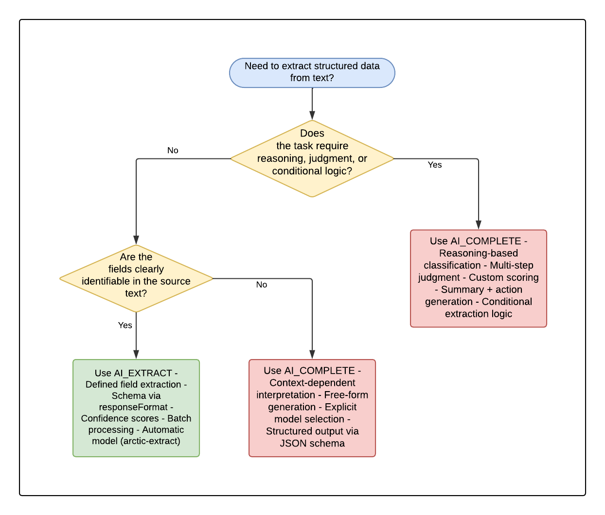

author: James Cha-Earley, Sho Tanaka, Anh Kieu
id: gain-insights-from-unstructured-data
categories: snowflake-site:taxonomy/solution-center/certification/quickstart, snowflake-site:taxonomy/product/ai, snowflake-site:taxonomy/snowflake-feature/cortex-llm-functions, snowflake-site:taxonomy/snowflake-feature/unstructured-data-analysis
language: en
summary: Build a batch data extraction pipeline across text, images, video, and audio using Cortex AI Functions, then create, evaluate, and optimize a custom AI function with AI Function Studio.
environments: web
status: Published 
feedback link: https://github.com/Snowflake-Labs/sfguides/issues


# Batch Data Extraction at Scale with Cortex AI Functions
<!-- ------------------------ -->
## Overview 

The fictitious food truck company, Tasty Bytes, receives thousands of customer reviews, food photos, social media video clips, and voicemail complaints across multiple channels. To improve operations, the company needs to extract structured, queryable data from all of this unstructured content at scale — turning free-text reviews into categorized issues, food truck photos into menu item inventories, video clips into brand mentions, and voicemails into actionable tickets.

This guide shows you how to build a batch data extraction pipeline entirely within Snowflake using [Cortex AI Functions](https://docs.snowflake.com/en/user-guide/snowflake-cortex/aisql). You will use AI_EXTRACT for structured field extraction from text and images, AI_COMPLETE with video support (public preview) for multimodal analysis, and AI_TRANSCRIBE for audio processing. Finally, you will use [Cortex AI Function Studio](https://docs.snowflake.com/en/LIMITEDACCESS/snowflake-cortex/cortex-ai-function-studio) to create a reusable custom AI function, evaluate its accuracy, and optimize it for production use.

### Prerequisites
* Familiarity with SQL
* Familiarity with Snowflake
* Familiarity with Snowflake Notebooks

### What You'll Need

* A Snowflake account in a cloud region where Cortex AI Functions are [supported](https://docs.snowflake.com/user-guide/snowflake-cortex/llm-functions#availability). If you do not have a Snowflake account, you can register for a [free trial account](https://signup.snowflake.com/?utm_cta=quickstarts_&_fsi=yYZEVo4S&_fsi=yYZEVo4S).
  * Cortex AI Functions: AI_EXTRACT, AI_COMPLETE, AI_TRANSCRIBE
  * Models: gemini-3.1-pro (video/audio), claude-sonnet-4-6 (text/images), arctic-extract (AI_EXTRACT)
* Snowflake Notebooks enabled in your Snowflake account.

### What You'll Learn 

* How to extract structured fields from free-text reviews using AI_EXTRACT
* How to extract information from images using AI_EXTRACT with file input
* How to analyze video content and extract metadata using AI_COMPLETE with structured output
* How to transcribe audio and extract structured data from transcriptions
* How to build a unified batch extraction pipeline across all modalities
* How to create, evaluate, and optimize a custom AI function using AI Function Studio

### What You'll Build 
* A batch data extraction pipeline that processes Tasty Bytes' multimodal customer feedback using **Snowflake Cortex AI Functions** within a **Snowflake Notebook**:
  * Extract structured fields from text reviews with **AI_EXTRACT**
  * Extract menu items and branding from food truck photos with **AI_EXTRACT**
  * Extract metadata from social media video clips with **AI_COMPLETE** (gemini-3.1-pro)
  * Transcribe voicemails and extract issue details with **AI_TRANSCRIBE** + **AI_COMPLETE**
  * A custom AI function created, evaluated, and optimized with **AI Function Studio**

<!-- ------------------------ -->
## Setup Data

This phase focuses on initializing your Snowflake environment. You will use [Snowsight](https://docs.snowflake.com/en/user-guide/ui-snowsight.html#), the Snowflake web interface, to:
* Create Snowflake objects (warehouse, database, schema, raw tables)
* Ingest review data from S3
* Create stages for images, audio, and video files
* Upload media files

### Creating Objects and Loading Data

We will use the setup.sql file to automate the creation of the required infrastructure and load the sample text data.

1. Download the [setup.sql](https://github.com/Snowflake-Labs/sfquickstarts/blob/master/site/sfguides/src/gain-insights-from-unstructured-data/setup.sql) file from the [GitHub repository](https://github.com/Snowflake-Labs/sfquickstarts/tree/master/site/sfguides/src/gain-insights-from-unstructured-data)
2. Open up a <a href="https://app.snowflake.com/_deeplink/#/workspaces?utm_source=snowflake-devrel&utm_medium=developer-guides&utm_content=batch-data-extraction&utm_cta=developer-guides-deeplink" class="_deeplink">Workspaces</a> in Snowflake
3. Copy and paste the contents of setup.sql or upload and run the file
4. The script will:
   - Create Snowflake objects (warehouse, database, schema, raw tables)
   - Ingest shift and review data from S3
   - Create the review view
   - Create stages for images, audio, and video files
   - Create tables for evaluation data (used in the AI Function Studio section)

### Upload Media Files to Stages

Now upload the media files into the dedicated stages created by setup.sql:

1. Download [data.zip](https://github.com/Snowflake-Labs/sfquickstarts/blob/master/site/sfguides/src/gain-insights-from-unstructured-data/data.zip) and extract its contents
2. Navigate to **Catalog** >> **Database Explorer**
3. Upload Image Files:
   * Select your database: **TB_VOC** >> **MEDIA** >> **Stages** >> **IMAGES**
   * Click **+ Files** on the top right hand corner
   * Click **Browse** and upload the files in the `images/` folder
4. Upload Audio Files:
   * Select your database: **TB_VOC** >> **MEDIA** >> **Stages** >> **AUDIO**
   * Click **+ Files** on the top right hand corner
   * Click **Browse** and upload the files in the `audio/` folder
5. Upload Video Files:
   * Select your database: **TB_VOC** >> **MEDIA** >> **Stages** >> **VIDEO**
   * Click **+ Files** on the top right hand corner
   * Click **Browse** and upload the files in the `video/` folder

6. Run Post-Upload SQL:
   * After uploading all files, open a new SQL worksheet in [Snowsight](https://docs.snowflake.com/en/user-guide/ui-snowsight.html#)
   * Load and execute the **`setup-post-upload.sql`** file to register the uploaded files into the corresponding tables
   * This step is required to make the uploaded audio, video, and image files available for processing in subsequent steps

Your Snowflake environment now contains the complete set of data across all modalities.


<!-- ------------------------ -->
## Setup Notebook

This phase prepares your execution environment by importing the primary code into a Snowflake Notebook.

* Download the notebook **[batch_data_extraction.ipynb](https://github.com/Snowflake-Labs/sfquickstarts/blob/master/site/sfguides/src/gain-insights-from-unstructured-data/batch_data_extraction.ipynb)** from the GitHub repository
* Select **Projects** >> **Notebooks** in [Snowsight](https://docs.snowflake.com/en/user-guide/ui-snowsight.html#)
* Click the **+ Notebook** drop-down and select **Import .ipynb file**
* Select the batch_data_extraction.ipynb file
* Provide a name for the notebook and select appropriate **database** `TB_VOC` and **schema** `ANALYTICS` for Notebook location
* For **Runtime** select `Run on container`
* Now you are ready to run the notebook by clicking the "Run all" button on the top right or running each cell individually

<!-- ------------------------ -->
## Text Extraction with AI_EXTRACT

In this phase, you will use [AI_EXTRACT](https://docs.snowflake.com/en/sql-reference/functions/ai_extract) to pull structured fields from free-text customer reviews. AI_EXTRACT is purpose-built for structured data extraction — you define the fields you want, and it returns a clean JSON object.

Tasty Bytes receives thousands of reviews in unstructured text. Rather than reading each one manually, AI_EXTRACT lets you define a schema and extract specific fields at scale across the entire review dataset.

### Entity Extraction from Reviews

The following query extracts the truck name, dish mentioned, issue type, and recommendation intent from each review:

```sql
SELECT 
    REVIEW,
    AI_EXTRACT(
        text => REVIEW,
        responseFormat => {
            'truck_name': 'What food truck or brand is mentioned?',
            'dish': 'What specific dish or menu item is mentioned?',
            'issue_type': 'What type of issue did the customer experience (food quality, service, wait time, cleanliness, none)?',
            'would_recommend': 'Would the customer recommend this food truck (yes, no, unclear)?'
        }
    ) AS extracted_fields
FROM
    TB_VOC.ANALYTICS.TRUCK_REVIEWS_V_SAMPLE
LIMIT 10;
```

### Extraction with Scores

AI_EXTRACT supports confidence scores (preview) that indicate the model's certainty about each extracted value. Use scores to flag low-confidence extractions for human review:

```sql
SELECT 
    REVIEW,
    AI_EXTRACT(
        text => REVIEW,
        responseFormat => {
            'truck_name': 'What food truck or brand is mentioned?',
            'dish': 'What specific dish or menu item is mentioned?',
            'issue_type': 'What type of issue did the customer experience?'
        },
        scores => TRUE
    ) AS extraction_with_scores
FROM
    TB_VOC.ANALYTICS.TRUCK_REVIEWS_V_SAMPLE
LIMIT 5;
```

The result includes both the extracted values and a `scoring` object with confidence scores between 0 and 1 for each field. You can use these scores to build deterministic processing logic — for example, routing low-score extractions to a human review queue.

### Batch Extraction at Scale

To run extraction across the entire dataset and flatten results into queryable columns:

```sql
CREATE OR REPLACE TABLE TB_VOC.ANALYTICS.EXTRACTED_REVIEWS AS
(
    SELECT
        TRUCK_BRAND_NAME,
        REVIEW,
        AI_EXTRACT(
            text => REVIEW,
            responseFormat => {
                'truck_name': 'What food truck or brand is mentioned?',
                'dish': 'What specific dish or menu item is mentioned?',
                'issue_type': 'What type of issue did the customer experience (food quality, service, wait time, cleanliness, none)?',
                'would_recommend': 'Would the customer recommend this food truck (yes, no, unclear)?'
            }
        ):response AS extracted
    FROM
        TB_VOC.ANALYTICS.TRUCK_REVIEWS_V_SAMPLE
);

-- Query the flattened results
SELECT 
    TRUCK_BRAND_NAME,
    extracted:truck_name::VARCHAR AS truck_name,
    extracted:dish::VARCHAR AS dish,
    extracted:issue_type::VARCHAR AS issue_type,
    extracted:would_recommend::VARCHAR AS would_recommend
FROM
    TB_VOC.ANALYTICS.EXTRACTED_REVIEWS
WHERE
    extracted:issue_type::VARCHAR != 'none'
LIMIT 20
;
```

### When to Use AI_COMPLETE Instead

AI_EXTRACT is optimized for structured field extraction — it handles schema definition, output parsing, and confidence scoring automatically. However, some text extraction tasks require **reasoning**, **multi-step logic**, or **contextual interpretation** that go beyond direct field extraction. In these cases, [AI_COMPLETE](https://docs.snowflake.com/en/sql-reference/functions/ai_complete) gives you full control over the prompt and model behavior.

**AI_COMPLETE enables:**
- **Reasoning over context** — e.g., inferring root cause from multiple complaint signals
- **Conditional logic** — e.g., "If the issue is food-related AND the customer mentions illness, escalate to urgent"
- **Summarization with judgment** — e.g., generating a one-sentence action item for each review
- **Custom output formats** — e.g., generating a severity score (1–5) with justification text

```sql
-- Example: AI_COMPLETE for reasoning-based extraction
SELECT
    REVIEW,
    AI_COMPLETE(
        'claude-sonnet-4-6',
        CONCAT(
            'Analyze this food truck review and determine:\n',
            '1. The root cause of any dissatisfaction\n',
            '2. A priority score (1-5) based on severity and business impact\n',
            '3. A recommended next action for the operations team\n\n',
            'Review: ', REVIEW
        ),
        {},
        {
            'type': 'json',
            'schema': {
                'type': 'object',
                'properties': {
                    'root_cause': {'type': 'string'},
                    'priority_score': {'type': 'integer'},
                    'recommended_action': {'type': 'string'},
                    'reasoning': {'type': 'string'}
                },
                'required': ['root_cause', 'priority_score', 'recommended_action', 'reasoning']
            }
        }
    ) AS analysis
FROM
    TB_VOC.ANALYTICS.TRUCK_REVIEWS_V_SAMPLE
LIMIT 5;
```

### Decision Flowchart: AI_EXTRACT vs AI_COMPLETE

Use the following flowchart to determine which function to use for your text extraction task:



| Aspect | AI_EXTRACT | AI_COMPLETE |
|--------|-----------|-------------|
| Purpose | Extract predefined fields | Reasoning, generation, complex extraction |
| Input definition | Schema via `responseFormat` | Free-form prompt instructions |
| Output format | Automatically structured JSON | JSON via `structured_output` option |
| Confidence scores | Available with `scores => TRUE` | Not built-in (can be prompted manually) |
| Model selection | Automatic (arctic-extract) | Explicitly specified |
| Best use cases | Names, dates, categories — clear values | Judgment, reasoning, summarization, action generation |

<!-- ------------------------ -->
## Image Extraction with AI_EXTRACT

In this phase, you will use [AI_EXTRACT](https://docs.snowflake.com/en/sql-reference/functions/ai_extract) with file input to extract structured data from food truck photos. AI_EXTRACT supports images directly via the FILE data type, allowing you to extract menu items, prices, and branding from photos stored in a stage.

Tasty Bytes collects photos from their food truck locations — menu boards, signage, and truck exteriors. Extracting structured data from these images enables inventory tracking and brand compliance monitoring.

### Extract Menu Information from Images

```sql
SELECT
    IMAGE_PATH,
    AI_EXTRACT(
        file => TO_FILE('@TB_VOC.MEDIA.IMAGES', IMAGE_PATH),
        responseFormat => {
            'brand_name': 'What is the food truck or restaurant brand name visible?',
            'menu_items': 'What menu items or dishes are visible?',
            'prices': 'What prices are shown?',
            'location_clues': 'What location indicators are visible (street signs, landmarks)?'
        }
    ) AS extracted_data
FROM
    TB_VOC.MEDIA.IMAGE_TABLE
LIMIT 5;
```

### Batch Image Extraction Using Directory Table

Process all images in a stage using the directory table pattern:

```sql
SELECT
    RELATIVE_PATH,
    AI_EXTRACT(
        file => TO_FILE('@TB_VOC.MEDIA.IMAGES', RELATIVE_PATH),
        responseFormat => {
            'brand_name': 'What is the food truck or restaurant brand name visible?',
            'menu_items': 'What menu items or dishes are visible?',
            'prices': 'What prices are shown?'
        }
    ) AS extracted_data
FROM
    DIRECTORY(@TB_VOC.MEDIA.IMAGES);
```

<!-- ------------------------ -->
## Video Analysis with AI_COMPLETE

In this phase, you will use [AI_COMPLETE](https://docs.snowflake.com/en/sql-reference/functions/ai_complete) with video file input to extract structured metadata from social media clips. Video processing with AI_COMPLETE is in public preview and uses the `gemini-3.1-pro` model, which supports up to 10 video files per prompt with a combined payload of up to 100 MB.

Tasty Bytes monitors social media for clips mentioning their food trucks. By analyzing video content, they can track brand mentions, assess sentiment, and identify which products are being featured organically.

### Extract Metadata from Video Clips

```sql
SELECT
    VIDEO_PATH,
    AI_COMPLETE(
        'gemini-3.1-pro',
        'Analyze this food truck social media video. Extract structured metadata.',
        TO_FILE('@TB_VOC.MEDIA.VIDEO', VIDEO_PATH),
        {},
        {
            'type': 'json',
            'schema': {
                'type': 'object',
                'properties': {
                    'sentiment': {'type': 'string'},
                    'summary': {'type': 'string'},
                    'brands_mentioned': {'type': 'array', 'items': {'type': 'string'}},
                    'dishes_shown': {'type': 'array', 'items': {'type': 'string'}},
                    'setting': {'type': 'string'},
                    'audience_type': {'type': 'string'}
                },
                'required': ['sentiment', 'summary', 'brands_mentioned', 'dishes_shown', 'setting', 'audience_type']
            }
        }
    ) AS video_metadata
FROM
    TB_VOC.MEDIA.VIDEO_TABLE
LIMIT 3;
```

### Structured Video Extraction at Scale

Create a materialized table of video insights for downstream analytics:

```sql
CREATE OR REPLACE TABLE TB_VOC.ANALYTICS.VIDEO_INSIGHTS AS
SELECT
    VIDEO_PATH,
    AI_COMPLETE(
        'gemini-3.1-pro',
        'Analyze this food truck social media video clip. Identify the brand, products shown, overall sentiment, and a brief summary of what is happening.',
        TO_FILE('@TB_VOC.MEDIA.VIDEO', VIDEO_PATH),
        {},
        {
            'type': 'json',
            'schema': {
                'type': 'object',
                'properties': {
                    'sentiment': {'type': 'string'},
                    'summary': {'type': 'string'},
                    'brands_mentioned': {'type': 'array', 'items': {'type': 'string'}},
                    'dishes_shown': {'type': 'array', 'items': {'type': 'string'}},
                    'setting': {'type': 'string'},
                    'audience_type': {'type': 'string'}
                },
                'required': ['sentiment', 'summary', 'brands_mentioned', 'dishes_shown', 'setting', 'audience_type']
            }
        }
    ) AS video_metadata
FROM
    TB_VOC.MEDIA.VIDEO_TABLE;
```

<!-- ------------------------ -->
## Audio Extraction

In this phase, you will use [AI_TRANSCRIBE](https://docs.snowflake.com/en/sql-reference/functions/ai_transcribe) to convert voicemail recordings to text, and then use [AI_COMPLETE](https://docs.snowflake.com/en/sql-reference/functions/ai_complete) to extract structured fields from the transcriptions.

Tasty Bytes receives voicemail complaints from customers. By transcribing and extracting structured data from these recordings, they can automatically route issues to the right team and prioritize by urgency.

### Transcribe Audio Files

```sql
SELECT
    AUDIO_PATH,
    AI_TRANSCRIBE(
        TO_FILE('@TB_VOC.MEDIA.AUDIO', AUDIO_PATH)
    ) AS transcription_result
FROM
    TB_VOC.MEDIA.AUDIO_TABLE
LIMIT 3;
```

### Extract Structured Fields from Transcriptions

```sql
SELECT
    AUDIO_PATH,
    AI_COMPLETE(
        'claude-sonnet-4-6',
        CONCAT(
            'Extract structured information from this customer voicemail transcription. ',
            'Return a JSON object with: caller_issue, truck_name, urgency (low/medium/high), and action_required. ',
            'Transcription: ',
            AI_TRANSCRIBE(TO_FILE('@TB_VOC.MEDIA.AUDIO', AUDIO_PATH)):text::VARCHAR
        ),
        {},
        {
            'type': 'json',
            'schema': {
                'type': 'object',
                'properties': {
                    'caller_issue': {'type': 'string'},
                    'truck_name': {'type': 'string'},
                    'urgency': {'type': 'string'},
                    'action_required': {'type': 'string'}
                },
                'required': ['caller_issue', 'truck_name', 'urgency', 'action_required']
            }
        }
    ) AS extracted_issue
FROM
    TB_VOC.MEDIA.AUDIO_TABLE
LIMIT 3;
```

<!-- ------------------------ -->
## Unified Batch Pipeline

In this phase, you will combine all modalities into a single extraction pipeline. The FILE data type in Snowflake allows you to consolidate text, images, video, and audio into one table and process them uniformly.

### Create a Unified Extraction Table

```sql
CREATE OR REPLACE TABLE TB_VOC.ANALYTICS.UNIFIED_EXTRACTIONS AS
-- Text reviews
SELECT
    'text' AS modality,
    REVIEW AS source_content,
    NULL AS file_path,
    AI_EXTRACT(
        REVIEW,
        {'truck_name': 'What food truck is mentioned?', 'issue_type': 'What issue did the customer experience?', 'dish': 'What dish is mentioned?'}
    ):response AS extracted_data
FROM
    TB_VOC.ANALYTICS.TRUCK_REVIEWS_V_SAMPLE

UNION ALL

-- Images
SELECT
    'image' AS modality,
    NULL AS source_content,
    RELATIVE_PATH AS file_path,
    AI_EXTRACT(
        TO_FILE('@TB_VOC.MEDIA.IMAGES', RELATIVE_PATH),
        {'brand_name': 'What is the food truck brand name?', 'menu_items': 'What menu items are visible?', 'prices': 'What prices are shown?'}
    ):response AS extracted_data
FROM
    DIRECTORY(@TB_VOC.MEDIA.IMAGES)

UNION ALL

-- Video
SELECT
    'video' AS modality,
    NULL AS source_content,
    VIDEO_PATH AS file_path,
    PARSE_JSON(
        REGEXP_REPLACE(
            AI_COMPLETE(
                'gemini-3.1-pro',
                'Extract brand names and dishes shown from this food truck video. Return JSON with keys: brand_name, dishes_shown, sentiment. Return ONLY raw JSON, no markdown.',
                TO_FILE('@TB_VOC.MEDIA.VIDEO', VIDEO_PATH)
            ),
            '```(json)?\\n?|```',
            ''
        )
    ) AS extracted_data
FROM
    TB_VOC.MEDIA.VIDEO_TABLE

UNION ALL

-- Audio
SELECT
    'audio' AS modality,
    NULL AS source_content,
    AUDIO_PATH AS file_path,
    PARSE_JSON(
        REGEXP_REPLACE(
            AI_COMPLETE(
                'claude-sonnet-4-6',
                CONCAT(
                    'Extract: caller_issue, truck_name, urgency from this voicemail. Return ONLY raw JSON, no markdown: ',
                    AI_TRANSCRIBE(TO_FILE('@TB_VOC.MEDIA.AUDIO', AUDIO_PATH)):text::VARCHAR
                )
            ),
            '```(json)?\\n?|```',
            ''
        )
    ) AS extracted_data
FROM
    TB_VOC.MEDIA.AUDIO_TABLE;
```

### Query Unified Results

```sql
-- Find all high-urgency issues across modalities
SELECT
    modality,
    file_path,
    extracted_data:truck_name::VARCHAR AS truck_name,
    extracted_data:issue_type::VARCHAR AS issue_type,
    extracted_data:urgency::VARCHAR AS urgency
FROM
    TB_VOC.ANALYTICS.UNIFIED_EXTRACTIONS
WHERE
    extracted_data:urgency::VARCHAR = 'high'
    OR extracted_data:issue_type::VARCHAR NOT IN ('none', 'null')
;
```

<!-- ------------------------ -->
## AI Function Studio: Create

In this phase, you will use [Cortex AI Function Studio](https://docs.snowflake.com/en/user-guide/snowflake-cortex/ai-function-studio), Public Preview, to create a reusable custom AI function that encapsulates the text extraction logic from earlier. This allows you to call extraction as a simple SQL function across any table without rewriting prompts.

AI Function Studio provides a managed workflow to create, evaluate, and optimize custom AI functions. The function you create here uses AI_COMPLETE under the hood but is deployed as a standard SQL UDF that can be called from any query.

### Create the Extraction Function

The easiest way to create a custom AI function is through [Cortex Code](https://docs.snowflake.com/en/user-guide/cortex-code/cortex-code), Snowflake Coding Agent. Cortex Code includes a built-in AI Function Studio skill that lets you describe what you want in natural language and handles the function creation automatically.

In Cortex Code Snowsight's chat panel, type the following prompt:

```
/cortex-ai-function-studio Create a function that taks in the review from tb_voc.analytics.truc_review_v_samples and extract review into the following fields: truck_name, dish, issue_type, would_recommend (yes/no/unclear) by sysadmin role
```

Cortex Code will:
1. **Detect your intent** — It recognizes this as a CREATE workflow for a custom AI function
2. **Check prerequisites** — It verifies your Snowflake connection, role privileges, and target schema
3. **Inspect the source table** — It reads the schema of `TB_VOC.ANALYTICS.TRUCK_REVIEWS_V_SAMPLE` to understand the input column
4. **Configure the function** — It determines the appropriate model, prompt template, input/output schema, and deploys the function using `SNOWFLAKE.CORTEX.CREATE_AI_FUNCTION`

Once complete, Cortex Code will confirm the function was created and show you a sample query to test it.

Cortex Code uses an LLM under the hood, so its output is non-deterministic and may vary depending on your environment. Ideally, the function created should look like the following:

Example
```sql
CALL SNOWFLAKE.CORTEX.CREATE_AI_FUNCTION(
  'TB_VOC.ANALYTICS.EXTRACT_REVIEW',
  'claude-sonnet-4-6',
  'You are a review extraction assistant. Extract structured information from food truck reviews. Be concise and accurate. If information is not clearly stated, use "unknown" for text fields and "unclear" for would_recommend.',
  'Extract the following from this review:\n- truck_name: the name of the food truck\n- dish: the specific dish mentioned (if multiple, pick the primary one discussed)\n- issue_type: the type of complaint or issue (use "none" if no issue)\n- would_recommend: whether the reviewer would recommend (yes/no/unclear)\n\nReview: {REVIEW}',
  [{'name': 'REVIEW', 'type': 'VARCHAR'}],
  [{'name': 'truck_name', 'type': 'VARCHAR'}, {'name': 'dish', 'type': 'VARCHAR'}, {'name': 'issue_type', 'type': 'VARCHAR'}, {'name': 'would_recommend', 'type': 'VARCHAR'}],
  NULL,
  NULL,
  NULL
);
```

Example output from the AI Function Studio CREATE workflow in Cortex Code:


### Test the Function

```sql
USE ROLE SYSADMIN;
USE TB_VOC.ANALYTICS;

SELECT
    REVIEW,
    TB_VOC.ANALYTICS.EXTRACT_REVIEW(REVIEW) AS extracted
FROM
    TB_VOC.ANALYTICS.TRUCK_REVIEWS_V_SAMPLE
LIMIT 5;
```

<!-- ------------------------ -->
## AI Function Studio: Evaluate

Now that you have a working extraction function, evaluate its accuracy against a labeled dataset. The evaluation measures how well your function's outputs match expected ground-truth values.

### Prepare Labeled Test Data

The setup.sql script created a labeled evaluation table `TB_VOC.ANALYTICS.EXTRACTION_EVAL_DATA` with manually verified extractions. This table has columns: `REVIEW_TEXT` (input) and `EXPECTED_OUTPUT` (VARIANT with the correct extraction).


Preview the evaluation data:

```sql
SELECT
    *
FROM
    TB_VOC.ANALYTICS.EXTRACTION_EVAL_DATA
LIMIT 5;
```

### Run the Evaluation

In Cortex Code's chat panel, type the following prompt:

```
/cortex-ai-faunction-studio Evaluate TB_VOC.ANALYTICS.EXTRACT_REVIEW against test table TB_VOC.ANALYTICS.EXTRACTION_EVAL_DATA with input column REVIEW_TEXT and label column EXPECTED_OUTPUT with llm-judge by sysadmin role
```

Cortex Code will:
1. **Detect your intent** — It recognizes this as an EVALUATE workflow
2. **Configure the evaluation** — It identifies the function, test table, input/label columns, and selects the appropriate metric
3. **Run the evaluation** — It calls `SNOWFLAKE.CORTEX.EVALUATE_AI_FUNCTION` and returns the accuracy score

Cortex Code uses an LLM under the hood, so its output is non-deterministic and may vary depending on your environment. Ideally, the evaluation call should look like the following:

```sql
USE TB_VOC.ANALYTICS;


CALL SNOWFLAKE.CORTEX.EVALUATE_AI_FUNCTION(
    'TB_VOC.ANALYTICS.EXTRACT_REVIEW',
    'TB_VOC.ANALYTICS.EXTRACTION_EVAL_DATA',
    ARRAY_CONSTRUCT('REVIEW_TEXT'),
    'EXPECTED_OUTPUT',
    'llm_judge',
    'claude-sonnet-4-6',
    NULL,
    NULL,
    PARSE_JSON('{"task_description": "Extract structured fields (truck_name, dish, issue_type, would_recommend) from food truck reviews"}'),
    500,
    NULL,
    NULL
);
```

Example output from the AI Function Studio EVALUATE workflow in Cortex Code:


The evaluation returns an overall score between 0.0 and 1.0. A score above 0.8 indicates good extraction quality. If the score is lower, the optimize step can help improve it.

<!-- ------------------------ -->
## AI Function Studio: Optimize

In this final phase, you will optimize your extraction function to improve accuracy. The optimizer iteratively modifies the function body — including prompts, model references, and SQL pre/post-processing — to find the best-performing variant.

### Run Optimization

After running the evaluation prompt in the previous step, Cortex Code may automatically ask whether you'd like to proceed with optimization. If it does, go ahead and run it — select the models you want to compare and let the optimizer execute.

If you're starting a fresh optimization session (or Cortex Code did not offer the follow-up), type the following prompt in Cortex Code's chat panel:

```
/cortex-ai-function-studio　Optimize TB_VOC.ANALYTICS.EXTRACT_REVIEW against test table TB_VOC.ANALYTICS.EXTRACTION_EVAL_DATA 
with input column REVIEW_TEXT and label column EXPECTED_OUTPUT by sysadmin role
```

Cortex Code uses an LLM under the hood, so its output is non-deterministic and may vary depending on your environment. Ideally, the optimization call should look like the following:

```sql
USE TB_VOC.ANALYTICS;

CALL SNOWFLAKE.CORTEX.OPTIMIZE_AI_FUNCTION(
    'TB_VOC.ANALYTICS.EXTRACT_REVIEW',
    'TB_VOC.ANALYTICS.EXTRACTION_EVAL_DATA',
    'EXPECTED_OUTPUT',
    ARRAY_CONSTRUCT('REVIEW_TEXT'),
    'llm_judge',
    ARRAY_CONSTRUCT('openai-gpt-5-mini'),
    'claude-sonnet-4-6',
    NULL,
    'demo',
    0.3,
    0.0,
    8192,
    NULL,
    NULL,
    NULL,
    NULL,
    'body',
    'ai_func_opt_EXTRACT_REVIEW_demo'
);
```

The optimizer will:
1. Score the current function body against training examples
2. Generate variations of the function body (modified prompts, SQL logic)
3. Keep Pareto-optimal performers (best quality/cost tradeoffs)
4. Return the best-performing function body

### View Optimization Results

After optimization completes, check the experiment for results:

```sql
SHOW RUN METRICS IN EXPERIMENT TB_VOC.ANALYTICS.AI_FUNC_OPT_EXTRACT_REVIEW_DEMO;
```

Example output from the optimization in Cortex Code:


### Test the Optimized Function

The optimization automatically updates your function with the best-performing body. Test it again to see improved results:

```sql
SELECT
    REVIEW,
    EXTRACT_REVIEW_FIELDS(REVIEW):truck_name::VARCHAR AS truck_name,
    EXTRACT_REVIEW_FIELDS(REVIEW):dish_mentioned::VARCHAR AS dish,
    EXTRACT_REVIEW_FIELDS(REVIEW):issue_type::VARCHAR AS issue_type,
    EXTRACT_REVIEW_FIELDS(REVIEW):would_recommend::VARCHAR AS recommendation
FROM
    TB_VOC.ANALYTICS.TRUCK_REVIEWS_V_SAMPLE
LIMIT 10;
```

<!-- ------------------------ -->
## Conclusion and Resources

Congratulations! You've built a complete batch data extraction pipeline using Snowflake Cortex AI Functions, processing text reviews, images, video clips, and audio recordings — all within Snowflake's secure environment. You then used AI Function Studio to create a production-ready custom AI function, evaluated its accuracy, and optimized it for better performance.

### What You Learned
With the completion of this quickstart, you have now: 
  * Used AI_EXTRACT to pull structured fields from text and image data at scale
  * Used AI_COMPLETE with gemini-3.1-pro to analyze video content and return structured JSON
  * Used AI_TRANSCRIBE combined with AI_COMPLETE to extract actionable data from audio
  * Built a unified batch pipeline across all four modalities using the FILE data type
  * Created, evaluated, and optimized a custom AI function using AI Function Studio

### Appendix 1: Multi-Model Cost Optimization

The optimization in the previous section used a single model (`openai-gpt-5-mini`). In production, you may want to compare your current model against additional cheaper alternatives to find the best cost/quality tradeoff. AI Function Studio supports passing multiple models in a single optimization call — it evaluates them concurrently and returns the Pareto-optimal result.

To extend the optimization you already ran, type the following prompt in Cortex Code's chat panel:

```
Optimize my function for more models, current model claude-sonnet-4-6 and a cheaper model
```

Cortex Code will add candidate models to the optimization, run them concurrently against your evaluation data, and present a comparison showing quality scores and cost for each model. You can then choose whether to deploy the cheaper variant or keep the original.

Example output from the multi-model optimization workflow in Cortex Code:


### Resources

Want to learn more about the tools and technologies used in this quickstart? Check out the following resources:

* [Cortex AI Functions Documentation](https://docs.snowflake.com/user-guide/snowflake-cortex/aisql)
* [AI_EXTRACT Reference](https://docs.snowflake.com/en/sql-reference/functions/ai_extract)
* [Cortex AI Functions: Multimodal](https://docs.snowflake.com/en/user-guide/snowflake-cortex/ai-audio)
* [AI Function Studio](https://docs.snowflake.com/en/LIMITEDACCESS/snowflake-cortex/cortex-ai-function-studio)
* [GitHub Repository](https://github.com/Snowflake-Labs/sfquickstarts/tree/master/site/sfguides/src/gain-insights-from-unstructured-data)
