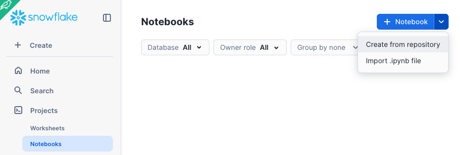

author: Kim Njeru
id: gen2-warehouse-performance-comparison
summary: Compare Snowflake Gen1 and Gen2 warehouse performance using TPC-H benchmarks with comprehensive Python testing framework
categories: performance,warehouses,benchmarking,python
environments: web
status: Published
feedback link: https://github.com/Snowflake-Labs/sfquickstarts/issues
tags: Performance, Warehouses, Gen2, TPC-H, Benchmarking, Snowpark, Python

# Gen2 Warehouse Performance Comparison with TPC-H Benchmarks

<!-- ------------------------ -->
## Overview
Duration: 3

This comprehensive quickstart will guide you through setting up and executing a rigorous performance comparison between Snowflake's Gen1 and Gen2 warehouses using TPC-H benchmark queries with a robust Python testing framework.

### What You'll Learn
- How to obtain and set up TPC-H sample data from Snowflake Marketplace
- How to create Gen1 and Gen2 warehouses with proper configurations
- Critical procedures for cache invalidation to ensure fair performance testing
- How to deploy and use a comprehensive Python-based TPC-H benchmark framework
- How to execute single, light, medium, and heavy load tests
- How to run both threaded and async load tests with configurable concurrency
- How to analyze and interpret performance results using SQL queries
- How to make data-driven decisions about warehouse optimization

### What You'll Need
- A Snowflake account with ACCOUNTADMIN or sufficient privileges to create warehouses
- Access to Snowflake Marketplace to obtain sample data
- A Snowflake Notebook environment OR Python environment with Snowpark
- Basic understanding of SQL and Python

### What You'll Build
- Three test warehouses (Gen1 Small, Gen2 Small, Gen2 XSmall)
- A comprehensive Python-based TPC-H benchmark testing framework
- Automated load testing capabilities with configurable concurrency levels
- Performance comparison dashboards and analysis queries
- Cache invalidation and session management utilities

## Prerequisites and Setup
Duration: 10

Before starting the performance comparison, ensure you have the necessary permissions and access.

### Required Permissions
You'll need the following privileges:
- `ACCOUNTADMIN` role or sufficient privileges to:
  - Create warehouses (`CREATE WAREHOUSE` privilege)
  - Import data from Snowflake Marketplace
  - Access and query sample datasets
  - Manage session parameters

### Technical Requirements
- Snowflake account (trial accounts work fine)
- Snowflake Notebook environment (recommended) OR
- External Python environment with Snowpark installed

### Get TPC-H Sample Data from Marketplace

The TPC-H sample dataset is essential for this benchmark. Here's how to obtain it:

#### Method 1: Using Snowsight Web Interface (Recommended)

1. **Navigate to Marketplace**:
   - Log into your Snowflake account via Snowsight
   - Click on "Data" in the left navigation panel
   - Select "Marketplace" from the dropdown

2. **Search for Sample Data**:
   - In the marketplace search bar, type "Sample Data"
   - Look for "Sample Data" provided by Snowflake Inc.
   - Click on the "Sample Data" listing

3. **Get the Dataset**:
   - Click the "Get" button
   - Review and accept the terms and conditions
   - The data will be automatically available as `SNOWFLAKE_SAMPLE_DATA` database

#### Method 2: Verify Existing Access

```sql
-- Check if sample data is already available in your account
SHOW DATABASES LIKE 'SNOWFLAKE_SAMPLE_DATA';

-- If available, verify access to TPC-H schema
USE DATABASE SNOWFLAKE_SAMPLE_DATA;
SHOW SCHEMAS LIKE 'TPCH%';
```

#### Create Test Warehouses
Duration: 5

Create three warehouses for comprehensive performance comparison: one Gen1 warehouse and two Gen2 warehouses of different sizes.

#### Understanding Warehouse Generations
- Gen1 (STANDARD_GEN_1): Original Snowflake warehouse architecture
- Gen2 (STANDARD_GEN_2): Enhanced architecture with improved performance and resource utilization

#### Create the Test Warehouses
Execute these SQL commands to create your test warehouses:

```sql
-- Gen1 Small Warehouse for baseline comparison
CREATE OR REPLACE WAREHOUSE POC_GEN1_S
WAREHOUSE_SIZE = SMALL
AUTO_RESUME = TRUE 
AUTO_SUSPEND = 60
INITIALLY_SUSPENDED = TRUE
RESOURCE_CONSTRAINT = STANDARD_GEN_1 
COMMENT = 'Gen1 Small POC Warehouse for Performance Testing';

-- Gen2 Small Warehouse for direct size comparison
CREATE OR REPLACE WAREHOUSE POC_GEN2_S
WAREHOUSE_SIZE = SMALL
AUTO_RESUME = TRUE 
AUTO_SUSPEND = 60
INITIALLY_SUSPENDED = TRUE 
RESOURCE_CONSTRAINT = STANDARD_GEN_2 
COMMENT = 'Gen2 Small POC Warehouse for Performance Testing';

-- Gen2 XSmall Warehouse for cost-efficiency comparison
CREATE OR REPLACE WAREHOUSE POC_GEN2_XS 
WAREHOUSE_SIZE = XSMALL
AUTO_RESUME = TRUE 
AUTO_SUSPEND = 60 
INITIALLY_SUSPENDED = TRUE 
RESOURCE_CONSTRAINT = STANDARD_GEN_2 
COMMENT = 'Gen2 XSmall POC Warehouse for Cost-Efficiency Testing';

```
#### Verify Warehouse Creation
```sql
-- Confirm all warehouses were created successfully
SHOW WAREHOUSES LIKE 'POC_%';

-- Check warehouse specifications
SELECT
    "name",
    "size",
    "resource_constraint",
    "auto_suspend",
    "auto_resume",
    "state",
    "comment"
FROM TABLE(RESULT_SCAN(LAST_QUERY_ID()));
```

You should see three warehouses with the following configurations:
- POC_GEN1_S: Small, Gen1, Auto-suspend 60s
- POC_GEN2_S: Small, Gen2, Auto-suspend 60s
- POC_GEN2_XS: XSmall, Gen2, Auto-suspend 60s


#### Understanding Cache Invalidation
Duration: 8

#### Critical Concept: For accurate performance comparisons, both warehouse cache and result cache must be invalidated before each test run. This section explains why and how.

#### Types of Caching in Snowflake

1. Warehouse Cache (Local SSD Cache)
    - What: Recently accessed data stored on the warehouse's local SSD
    - Purpose: Speeds up repeated queries on the same data
    - Impact on Testing: Can make subsequent runs artificially faster
    - Invalidation: Suspend and resume the warehouse

2. Result Cache
    - What: Previously computed query results stored globally
    - Purpose: Returns cached results for identical queries
    - Impact on Testing: Can return cached results instead of executing queries
    - Invalidation: Disable at session level with USE_CACHED_RESULT = FALSE

#### Why Cache Invalidation Matters
Without proper cache invalidation:

- Inconsistent Results: First run slow, subsequent runs artificially fast
- Unfair Comparisons: Different warehouses may benefit differently from cached data
- Misleading Metrics: Performance improvements may be due to caching, not warehouse efficiency

#### Cache Invalidation Procedures
#### Warehouse Cache Invalidation
```sql
-- Suspend the warehouse to clear local SSD cache
ALTER WAREHOUSE <warehouse_name> SUSPEND;

-- Resume the warehouse with clean cache
ALTER WAREHOUSE <warehouse_name> RESUME;

-- Brief pause to ensure warehouse is ready
SELECT SYSTEM$WAIT(3);
```

#### Result Cache Invalidation
```sql 
-- Disable result cache for the current session
ALTER SESSION SET USE_CACHED_RESULT = FALSE;

-- Verify the setting
SHOW PARAMETERS LIKE 'USE_CACHED_RESULT' IN SESSION;
```
#### Query Tagging for Analysis
```sql
-- Set a query tag to identify test queries in query history
ALTER SESSION SET QUERY_TAG = 'POC_GEN2_PERFORMANCE_TEST';

-- Verify the tag is set
SHOW PARAMETERS LIKE 'QUERY_TAG' IN SESSION;
```

## Deploy the Python Testing Framework
Duration: 15

Now we'll deploy the comprehensive Python framework for TPC-H benchmarking. This framework includes cache management, load testing, and results analysis.

### Framework Components
The testing framework includes:

- TPC-H Query Suite: Industry-standard benchmark queries (Q1, Q3, Q6, Q10)
- Cache Management: Automated warehouse and result cache invalidation
- Load Testing Engine: Threaded execution with configurable concurrency
- Results Analysis: Comprehensive performance metrics and reporting
- Session Management: Proper query tagging and session configuration

### Environment Setup
Create a new Snowflake Notebook.  In this case, we will import a pre-created one that has codified all the steps described here.


1. Click on [this](https://github.com/sfc-gh-knjeru/snowflake-demo-notebooks/blob/kn-nb-branch/Gen2%20Warehouse%20Performance%20Comparison/Gen2WH_POC_Notebook.ipynb). Download the file by clicking on the `Download raw file` from the top right.

2. Go to the Snowflake web interface, [Snowsight](https://app.snowflake.com), on your browser.

3. Navigate to `Project` > `Notebooks` from the left menu bar. 

4. Import the .ipynb file you've download into your Snowflake Notebook by using the `Import from .ipynb` button located on the top right of the Notebooks page.



5. Select the file from your local directory and press `Open`.

6. A `Create Notebook` dialog will show up. Select a database, schema, and warehouse for the Notebook and click `Create`.

## Run the Tests in the Notebook
Duration: 15

Now run the load tests as described in the Notebook and compare results.