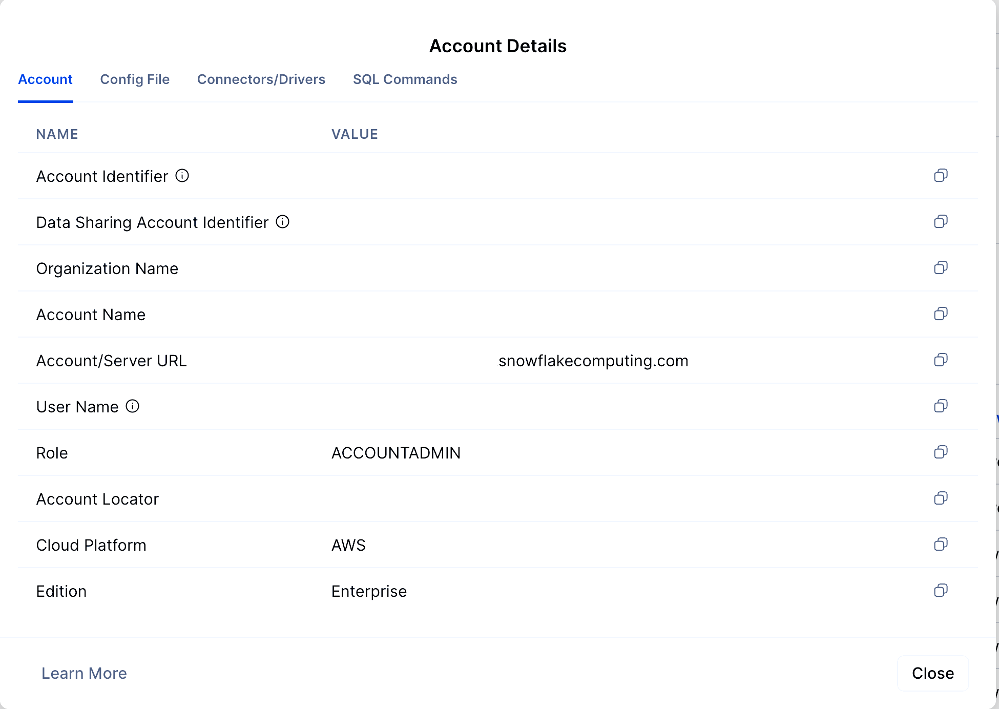
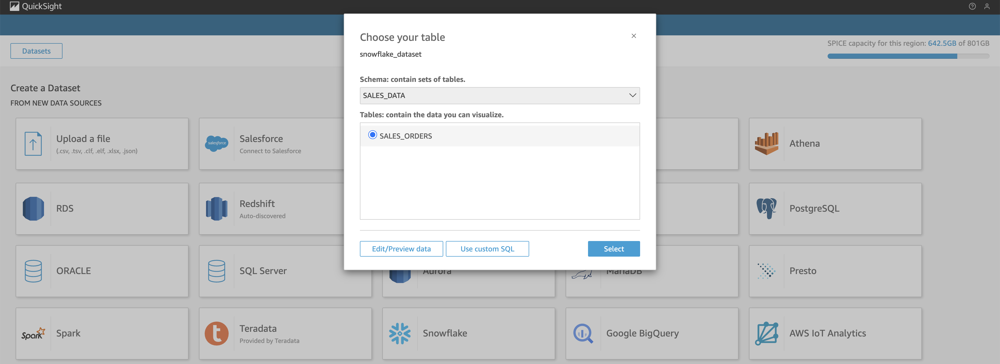
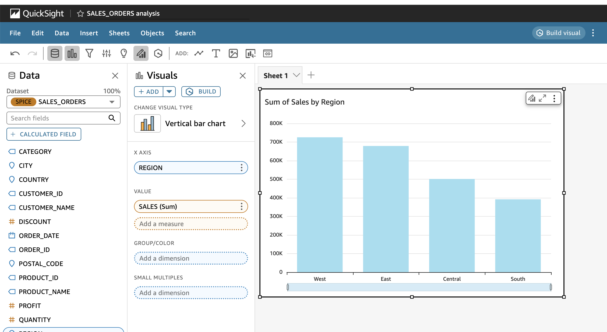
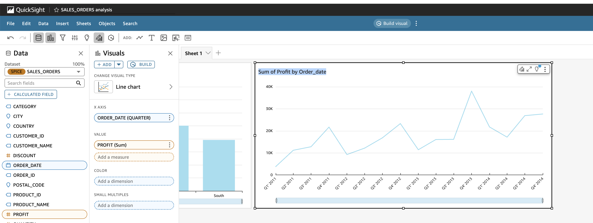
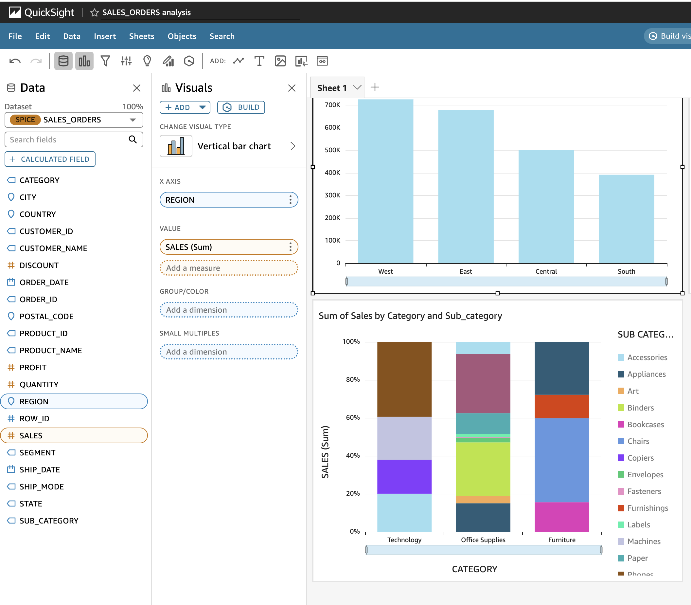
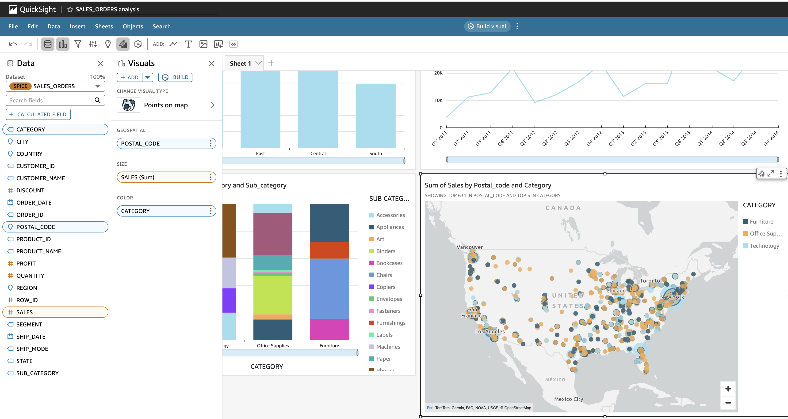
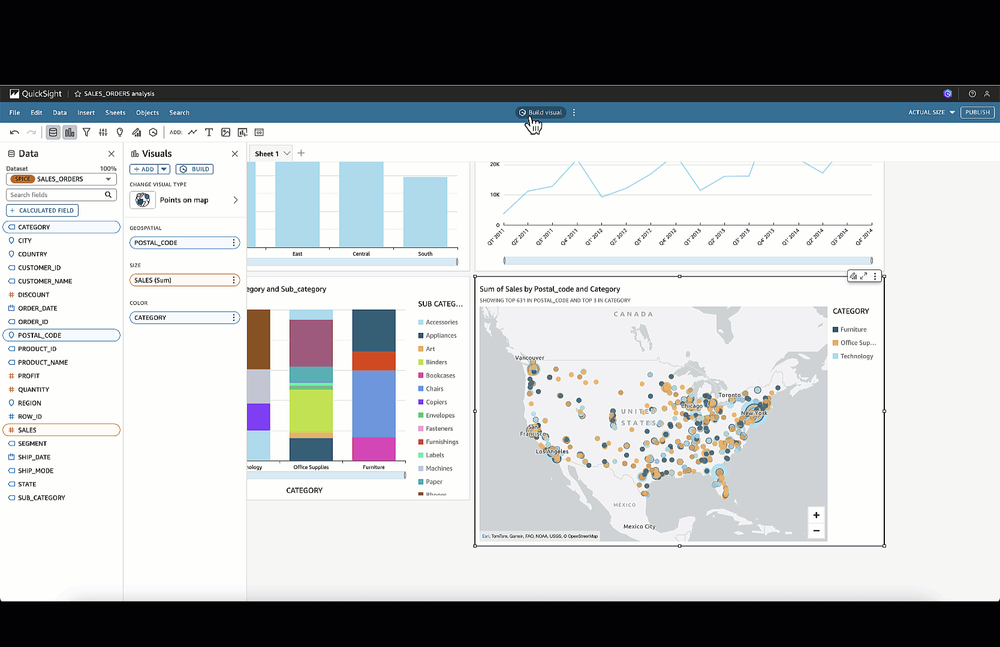
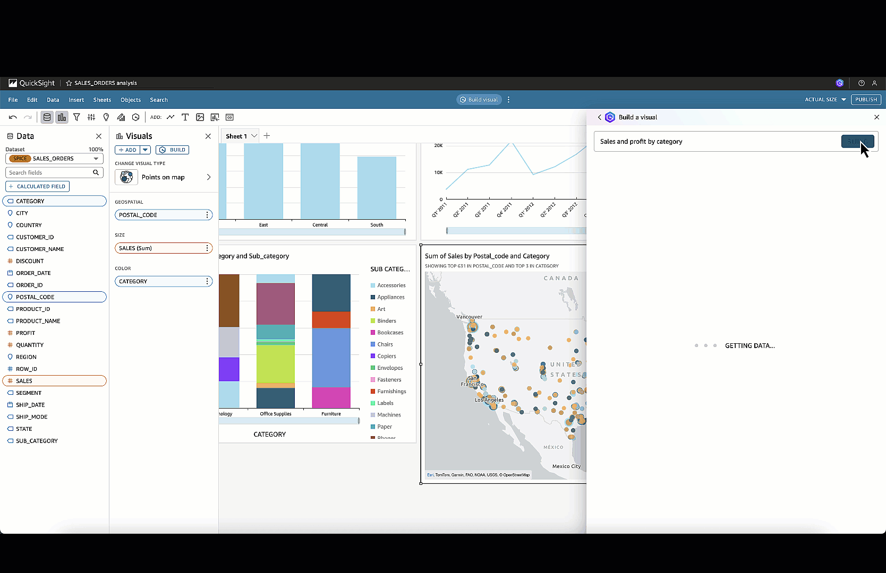

author: Bharath Suresh
id: QUICKSTART-GENERATIVE-BI-QUICKSIGHT
summary: Build a Generative BI Dashboard using Amazon QuickSight and Amazon Q.
categories: Getting-Started
environments: web
status: Published 
ffeedback link: https://github.com/Snowflake-Labs/sfguides/issues
tags: Generative BI, Amazon QuickSight, Amazon Q, Natural Language Q&A, Dashboarding

# Build a Generative BI Dashboard with Amazon QuickSight and Amazon Q

## Overview
In this guide, We will build an end-to-end Generative BI dashboard using [Amazon Q in QuickSight](https://aws.amazon.com/quicksight/q/), with [Snowflake AI & Data Cloud](https://www.snowflake.com/en/) as the data source. We will use the  Sales dataset to explore sales trends, regional performance, and customer insights with the power of Natural Language Q&A and Executive Summaries.

This guide walks through:

- Preparing and loading data into Snowflake
- Connecting QuickSight to Snowflake
- Enabling Generative BI features with Amazon Q
- Building 15+ smart insights interactively

This guide applies to any business domain where structured data and conversational analytics intersect.

### Prerequisites
- Basic familiarity with Amazon QuickSight and Snowflake
- AWS account with QuickSight Enterprise enabled
- Snowflake account with access to a database, schema, and compute warehouse

### What You’ll Learn 
- How to load and clean real-world datasets into Snowflake
- How to connect Amazon QuickSight to Snowflake
- How to build smart visuals using Generative BI
- How to use Amazon Q for Natural Language Q&A

### What You’ll Need 
- A Snowflake Account
- AWS QuickSight Enterprise enabled
- Kaggle Dataset
- Python 3.x with pandas (optional)

### What You’ll Build 

- A Generative BI dashboard powered by Amazon Q and backed by Snowflake

<!-- ------------------------ -->
##  Data Loading

### Download the Dataset
- Download the  Sales Data from Kaggle: Go to the [Kaggle Dataset](https://www.kaggle.com/datasets/ishanshrivastava28/superstore-sales) page and download the CSV file.

### Create the Target Database Objects
- Before you create the table, make sure to configure environment with the right role, warehouse, database, and schema. We can do this step-by-step as follows:

```sql
-- Step 1: Use the ACCOUNTADMIN role (or any role with required privileges)
USE ROLE ACCOUNTADMIN;

-- Step 2: Create a virtual warehouse if not already created
CREATE OR REPLACE WAREHOUSE demo_wh
  WITH WAREHOUSE_SIZE = 'XSMALL'
  AUTO_SUSPEND = 60
  AUTO_RESUME = TRUE;

-- Step 3: Create a database to store your dataset
CREATE OR REPLACE DATABASE demo_db;

-- Step 4: Create a schema for organization (optional)
CREATE OR REPLACE SCHEMA demo_db.sales_data;

-- Step 5: Set your context
USE WAREHOUSE demo_wh;
USE DATABASE demo_db;
USE SCHEMA sales_data;
```

- Once your context is set, create the table to hold the cleaned data:
```sql
CREATE OR REPLACE TABLE sales_orders (
    row_id INT,
    order_id STRING,
    order_date DATE,
    ship_date DATE,
    ship_mode STRING,
    customer_id STRING,
    customer_name STRING,
    segment STRING,
    country STRING,
    city STRING,
    state STRING,
    postal_code STRING,
    region STRING,
    product_id STRING,
    category STRING,
    sub_category STRING,
    product_name STRING,
    sales FLOAT,
    quantity INT,
    discount FLOAT,
    profit FLOAT
);
```

### Create a Named File Format (Optional)
- You can explicitly define a CSV file format for reuse:

```sql
CREATE OR REPLACE FILE FORMAT csv_format
  TYPE = 'CSV'
  FIELD_OPTIONALLY_ENCLOSED_BY = '"'
  SKIP_HEADER = 1;
```

### Create a Snowflake Stage
- Stages allow you to load data into Snowflake from cloud storage (e.g., S3). For example:

```sql
CREATE OR REPLACE STAGE demo_stage
  URL = 's3://your-bucket-name/path-to-folder/'
  STORAGE_INTEGRATION = your_integration_name;
```

- If using internal stage, you can upload the file via Snowsight UI:
- Go to Data > Stages
- Select your stage and click Upload File
- Upload superstore_sales.csv to the stage

```sql
COPY INTO sales_orders
FROM @demo_stage/sales_orders.csv
FILE_FORMAT = (TYPE = 'CSV' FIELD_OPTIONALLY_ENCLOSED_BY='"' SKIP_HEADER=1);
```

## Connect QuickSight to Snowflake

- In this step, you'll configure Amazon QuickSight and connect it to your Snowflake instance to build live or SPICE-imported dashboards.

### Collect Snowflake Connection Info

Gather the following connection details from your Snowflake admin or Snowsight:
- Account Identifier: (e.g., xy12345.us-east-1)
- Database: demo_db
- Schema: sales_data
- Warehouse: demo_wh
- Table: sales_orders
- Username & Password: Snowflake login credentials with USAGE and SELECT privileges

### Sign in to the AWS Console
Navigate to the AWS Console
Search for QuickSight in the service search bar
Choose Amazon QuickSight and click Sign in
If you're using QuickSight for the first time:
- Choose your region (must match your Snowflake region if using SPICE)

### Create a Snowflake Data Source in QuickSight

From the QuickSight homepage, go to Manage data in the left panel
Click New dataset > Select Snowflake as the source
Fill in the Snowflake connection form:

- Data source name: SnowflakeSalesOrders
- Account name: Enter your Snowflake account locator (e.g., xy12345.us-east-1)
- User name / Password: Use Snowflake credentials with SELECT access
- Warehouse: demo_wh
- Database: demo_db
- Schema: sales_data
Click Validate connection and then Create data source

### Select and Import the Table

Select the sales_orders table from the schema browser
Choose a data access mode:
- Direct Query: Fetches live data from Snowflake with each interaction

- Import to SPICE: Recommended for performance, especially for static datasets

- Click Visualize to begin building your dashboards
- Optional: QuickSight connects to Snowflake securely using JDBC. Use Secrets Manager or SSO for enhanced credential management.. You can enable SSO or use AWS Secrets Manager for managing credentials.
- QuickSight uses a secure JDBC connection with optional IAM-based credentials.

## Visualization

###  Build Core Visuals

Now that your Snowflake data is available in QuickSight, it's time to create a set of foundational visualizations. These visuals will help users analyze sales performance, regional trends, customer behavior, and product-level profitability.

### Step 1: Open the Analysis Editor

- From the QuickSight home screen, go to Analyses
- Click New analysis
- Select your previously connected dataset (from Snowflake)

### Step 2: Create the Following Visuals

#### 1. Sales by Region (Bar Chart)

- Click Add → Add visual
- Select Vertical bar chart
- Drag region to X-axis
- Drag sales to Value
- Sort by descending sales

#### 2. Monthly Profit Trend (Line Chart)

- Click Add visual
- Select Line chart
- Drag order_date to X-axis and change the aggregation to Month
- Drag profit to Value
- Filter by recent year or region if desired


#### 3. Category vs. Sub-Category Sales (Stacked Column Chart)

- Click Add visual
- Select Stacked column chart
- Drag category to X-axis
- Drag sales to Value
- Drag sub_category to Group by


#### 4. Sales by State (Map Visual)

- Click Add visual → Select Map
- Drag state to Geospatial field
- Drag sales to Value


### Step 3: Customize Appearance

- Format currency fields (sales, profit) to show in appropriate currency format
- Adjust color palettes to align with your brand or data themes
- Rename visuals to user-friendly titles (e.g., "Top Performing States")
- Once these base visuals are in place, you're ready to enrich them with AI-powered enhancements using Amazon Q.

## Enable Generative BI with Amazon Q

### Create Visualization with Q 

Select Q build visual icon


Ask questions in natural english like:
- "Show total profit in California"
- "Top 5 products by sales"
- "Monthly orders by region"


### Add Smart Widgets

Use Amazon Q to create these visuals:
- "Sales and profit by category"
- "Products with negative profit"
- "Profit margin by customer segment"
- "Monthly order volume"
- "Most discounted items by category"

Each NLP prompt results in an auto-generated visual you can refine and add to your dashboard.

### Generate Executive Summary

- Click Publish Dashboard

Amazon Q generates narrative insights for:
- Key trends
- Regional anomalies
- Top/worst performers

## Conclusion and Resources

You’ve now built a powerful, AI-enabled dashboard that:
- Uses Snowflake for enterprise-grade data platform and querying
- Uses Amazon QuickSight for visual exploration
- Uses Amazon Q for Generative AI supported insights

### What You Learned
- How to ingest and query data in Snowflake
- How to visualize live Snowflake data in QuickSight
- How to build dashboards using AI-generated content

### Related Resources

- Snowflake Documentation
- QuickSight Documentation
- Amazon Q in QuickSight
- Kaggle Superstore Dataset

## Clean Up

### Snowflake Clean Up

If this was a test/demo environment:

- Drop demo tables:

```sql
DROP TABLE IF EXISTS sales_orders;
```

- Drop stages or file formats:

```sql
DROP STAGE IF EXISTS demo_stage;
DROP FILE FORMAT IF EXISTS csv_format;
```

- Drop schema and database (if not used elsewhere):

```sql
DROP SCHEMA IF EXISTS demo_db.sales_data;
DROP DATABASE IF EXISTS demo_db;
```

### 2. AWS Clean Up Steps

- Disable dashboards not in use

- Remove unused datasets from Manage Data

- Manage SPICE capacity under Manage QuickSight > SPICE capacity

### 3. Versioning & Collaboration

- Export the dashboard and share with teams

- Document data definitions and synonyms used in Q Topics

- Assign dataset permissions to relevant users or groups