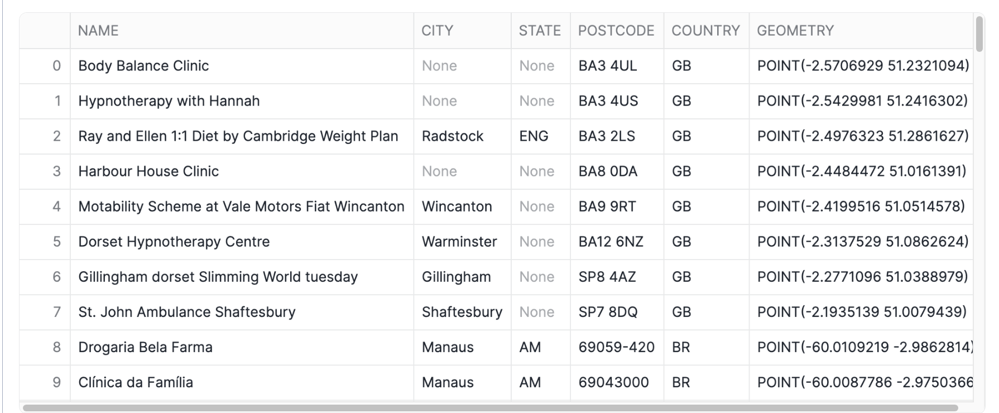
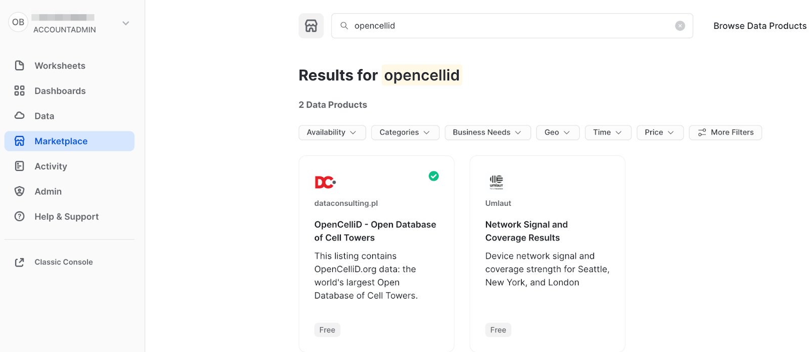
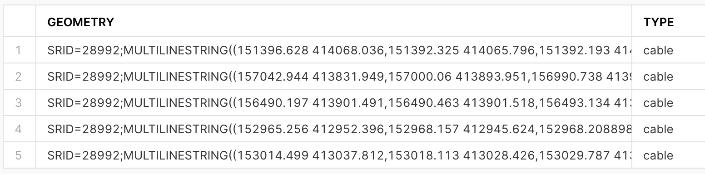
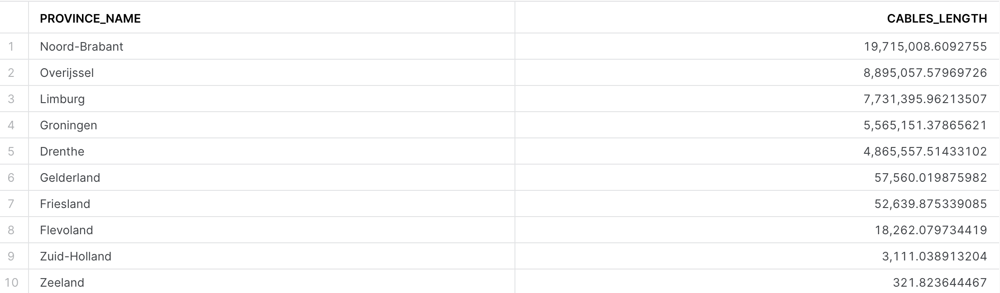
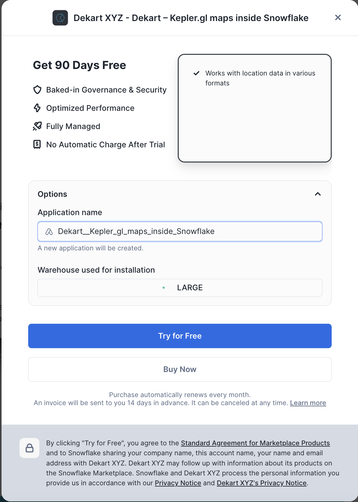
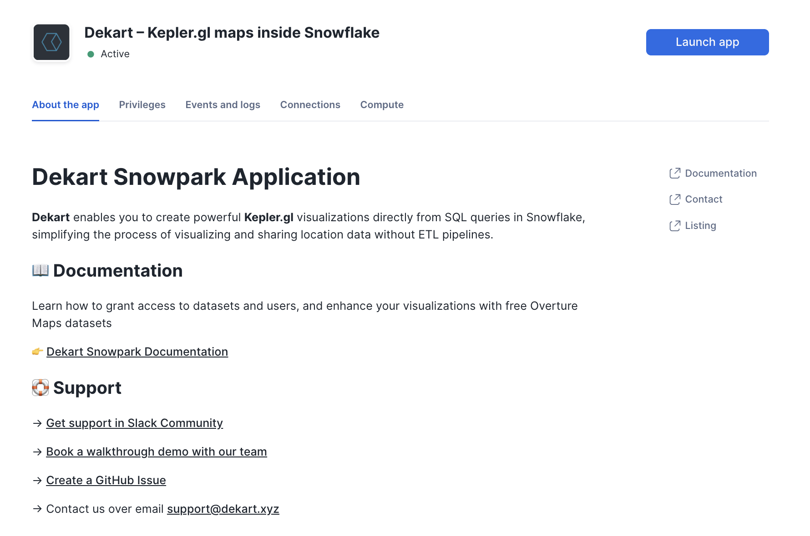
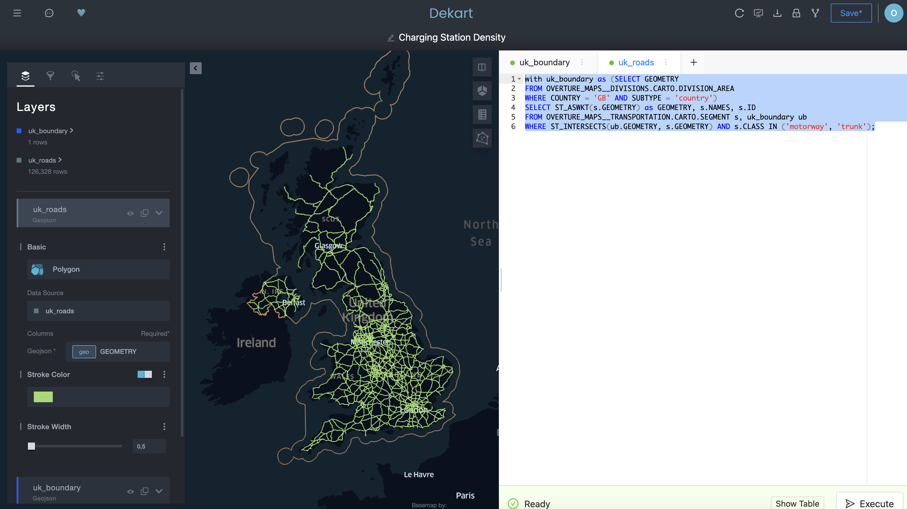

author: Oleksii Bielov
id: geo-for-machine-learning
categories: snowflake-site:taxonomy/solution-center/certification/quickstart, snowflake-site:taxonomy/product/analytics, snowflake-site:taxonomy/snowflake-feature/unstructured-data-analysis
language: en
summary: Apply geospatial features to ML models with Streamlit and Snowflake for location-aware predictions, proximity analysis, and spatial clustering.
environments: web
status: Published 
feedback link: https://github.com/Snowflake-Labs/sfguides/issues


# Geospatial Analytics, AI and ML using Snowflake
<!-- ----------------------------------------- -->
## Overview 


Snowflake offers a rich toolkit for predictive analytics with a geospatial component. It includes two data types and specialized functions for transformation, prediction, and visualization. This guide is divided into multiple labs, each covering a separate use case that showcases different features for a real-world scenario.

### Prerequisites
* Understanding of [Discrete Global Grid H3](/blog/getting-started-with-h3-hexagonal-grid/)
* Recommend: Understanding of [Geospatial Data Types](https://docs.snowflake.com/en/sql-reference/data-types-geospatial) and [Geospatial Functions](https://docs.snowflake.com/en/sql-reference/functions-geospatial) in Snowflake
* Recommended: Complete [Geospatial Analysis using Geometry and Geography Data Types](/en/developers/guides/geo-analysis-geometry/) quickstart
* Recommended: Complete [Performance Optimization Techniques for Geospatial queries](/en/developers/guides/geo-performance/) quickstart

### What You’ll Learn
In this quickstart, you will use H3, Time Series, Cortex ML and Streamlit for ML use cases. The quickstart is broken up into separate labs:
* Lab 1: Geospatial 101
* Lab 2: Energy grids analysis using GEOMETRY
* Lab 3: Geocoding and Reverse Geocoding
* Lab 4: Forecasting time series on a map
* Lab 5: Sentiment analysis of customer reviews
* Lab 6: Processing unstructured geospatial data
* Lab 7: Creating Interactive Maps with Kepler.gl

When you complete this quickstart, you will have gained practical experience in several areas:
* Acquiring data from the Snowflake Marketplace
* Loading data from external storage
* Transforming data using H3 and Time Series functions
* Training models and predicting results with Cortex ML
* Using LLM for analysing textual data
* Visualizing data with Streamlit
* Processing unstructured geospaial data (GeoTIFF, Shapefiles)
* Using geo visualisation apps available in Marketplace
* Processing unstructured geospaial data (GeoTIFF, Shapefiles)
* Using geo visualisation apps available in Marketplace

### What You’ll Need
* A supported Snowflake [Browser](https://docs.snowflake.com/en/user-guide/setup.html)
* Sign-up for a [Snowflake Trial](https://signup.snowflake.com/?utm_source=snowflake-devrel&utm_medium=developer-guides&utm_cta=developer-guides) OR have access to an existing Snowflake account with the `ACCOUNTADMIN` role or the `IMPORT SHARE `privilege. Select the Enterprise edition, AWS as a cloud provider and US East (Northern Virginia) or EU (Frankfurt) as a region.

<!-- ----------------------------------------- -->

## Setup your Account


If this is the first time you are logging into the Snowflake UI, you will be prompted to enter your account name or account URL that you were given when you acquired a trial. The account URL contains your [account name](https://docs.snowflake.com/en/user-guide/connecting.html#your-snowflake-account-name) and potentially the region. You can find your account URL in the email that was sent to you after you signed up for the trial.

Click `Sign-in` and you will be prompted for your username and password.


>  If this is not the first time you are logging into the Snowflake UI, you should see a "Select an account to sign into" prompt and a button for your account name listed below it. Click the account you wish to access and you will be prompted for your user name and password (or another authentication mechanism).

### Increase Your Account Permission
The Snowflake web interface has a lot to offer, but for now, switch your current role from the default `SYSADMIN` to `ACCOUNTADMIN`. This increase in permissions will allow you to create shared databases from Snowflake Marketplace listings.


>  If you don't have the `ACCOUNTADMIN` role, switch to a role with `IMPORT SHARE` privileges instead.


### Create a Virtual Warehouse

You will need to create a Virtual Warehouse to run queries.

* Navigate to the `Admin > Warehouses` screen using the menu on the left side of the window
* Click the big blue `+ Warehouse` button in the upper right of the window
* Create a LARGE Warehouse as shown in the screen below


Be sure to change the `Suspend After (min)` field to 5 min to avoid wasting compute credits.

Navigate to the query editor by clicking on `Worksheets` on the top left navigation bar and choose your warehouse.

- Click the + Worksheet button in the upper right of your browser window. This will open a new window.
- In the new Window, make sure `ACCOUNTADMIN` and `MY_WH` (or whatever your warehouse is named) are selected in the upper right of your browser window.


Create a new database and schema where you will store datasets in the `GEOGRAPHY` data type. Copy & paste the SQL below into your worksheet editor, put your cursor somewhere in the text of the query you want to run (usually the beginning or end), and either click the blue "Play" button in the upper right of your browser window, or press `CTRL+Enter` or `CMD+Enter` (Windows or Mac) to run the query.

```
CREATE DATABASE IF NOT EXISTS advanced_analytics;
// Set the working database schema
USE ADVANCED_ANALYTICS.PUBLIC;
USE WAREHOUSE my_wh;
ALTER SESSION SET GEOGRAPHY_OUTPUT_FORMAT='WKT';
```

## Geospatial 101


> 
>  Before starting with this lab, complete the preparation steps from `Setup your account` page.

> 
>  This lab is [available](https://github.com/Snowflake-Labs/sf-guide-geospatial-analytics-ai-ml) as Snowflake Notebook.

### 1. Overview
Geospatial query capabilities in Snowflake are built upon a combination of data types and specialized query functions that can be used to parse, construct, and perform calculations on geospatial objects. Additionally, geospatial data can be visualized in Snowflake using Streamlit. This guide provides an entry-level introduction to geospatial analytics and visualization in Snowflake. In this lab, you will explore a sample use case of identifying the closest healthcare facilities near a geographic point, and you will learn:
- How to view the GEOGRAPHY data type with supported formats
- How to construct a geospatial object from latitude and longitude values
- How to extract latitude and longitude from a geography column
- How to perform geospatial calculations and filtering
- How to visualize geospatial data using Streamlit in Snowflake


### 2. Acquire Data
For this lab oyu will use [Overture Maps - Places](https://app.snowflake.com/marketplace/listing/GZT0Z4CM1E9KR/carto-overture-maps-places) dataset from Marketplace. Now you can acquire sample geospatial data from the Snowflake Marketplace.

* Navigate to the Marketplace screen using the menu on the left side of the window
* Search for `Overture Maps` in the search bar
* Find and click the `Overture Maps - Places` tile

On the Get Data screen, keep the default database name OVERTURE_MAPS__PLACES, as all of the future instructions will assume this name for the database.

> 
>  On the `Get` screen, you may be prompted to complete your `user profile` if you have not done so before. Click the link as shown in the screenshot below. Enter your name and email address into the profile screen and click the blue `Save` button. You will be returned to the `Get` screen.


Congratulations! You have just created a shared database from a listing on the Snowflake Marketplace.

As one additional preparation step you need to complete is to import libraries that you will use in this Lab, navigate to the `Packages` drop-down  in the upper right of the Notebook and search for `pydeck`. Click on `pydeck` to add it to the Python packages.

### 3. Understanding Snowflake Geospatial Formats
Snowflake supports GeoJSON, Well-Known Text (WKT) and Well-Known Binary (WKB) formats for loading and unloading geospatial data. You can use session or account parameters to control which of these format types is used to display geospatial data in your query results.

Run the query below to explicitly set your geography output format to JSON.

```
ALTER SESSION SET GEOGRAPHY_OUTPUT_FORMAT = 'GEOJSON';
```

In the following two queries you will familiarize yourself with `Overture Maps - Points of Interest` data. First, check the size of the table:

```
SELECT COUNT(*) FROM OVERTURE_MAPS__PLACES.CARTO.PLACE;
```

In the following query, you will examine a geography column containing data on health and medical facilities. 

```
SELECT 
     NAMES['primary']::STRING AS NAME,
     ADDRESS.value:element:locality::STRING AS CITY,
     ADDRESS.value:element:region::STRING AS STATE,
     ADDRESS.value:element:postcode::STRING AS POSTCODE,
     ADDRESS.value:element:country::STRING AS COUNTRY,
     GEOMETRY
FROM OVERTURE_MAPS__PLACES.CARTO.PLACE,
LATERAL FLATTEN(INPUT => ADDRESSES:list) AS ADDRESS
WHERE CATEGORIES['primary'] ='health_and_medical'
LIMIT 100;
```


Note that while the column is named `GEOMETRY` in this data source, it is stored in a `GEOGRAPHY` column in Snowflake, using the coordinate system [ESPG:4326](https://epsg.io/4326), also known as [WGS 84](https://en.wikipedia.org/wiki/World_Geodetic_System#WGS84). This coordinate system uses latitude and longitude as coordinates and is the most widely used coordinate system worldwide. If you are storing geospatial data using latitude and longitude, then the `GEOGRAPHY` data type is the most suitable for storing your data.


The contents of the `GEOMETRY` column in the output above, formatted as GeoJSON. 

Run the code below to update your session geography output format to [Well-Known Text (WKT)](https://en.wikipedia.org/wiki/Well-known_text_representation_of_geometry), which is arguably more readable.

```
ALTER SESSION SET GEOGRAPHY_OUTPUT_FORMAT = 'WKT';
```

Now rerun the Overture maps query. Notice how the contents of the `GEOMETRY` column are displayed.

```
SELECT 
     NAMES['primary']::STRING AS NAME,
     ADDRESS.value:element:locality::STRING AS CITY,
     ADDRESS.value:element:region::STRING AS STATE,
     ADDRESS.value:element:postcode::STRING AS POSTCODE,
     ADDRESS.value:element:country::STRING AS COUNTRY,
     geometry
FROM OVERTURE_MAPS__PLACES.CARTO.PLACE,
LATERAL FLATTEN(INPUT => ADDRESSES:list) AS ADDRESS
WHERE CATEGORIES['primary'] ='health_and_medical'
LIMIT 100;
```


### Constructing geospatial objects
You can use constructor functions such as [ST_MAKEPOINT](https://docs.snowflake.com/en/sql-reference/functions/st_makepoint), [ST_MAKELINE](https://docs.snowflake.com/en/sql-reference/functions/st_makeline) and [ST_POLYGON](https://docs.snowflake.com/en/sql-reference/functions/st_makepolygon) to create geospatial objects. Run the code below to create a geo point from latitude and longitude.

```
SELECT ST_MAKEPOINT(-74.0266511, 40.6346599) GEO_POINT
```


Alternatively, you can use the TO_GEOGRAPHY constructor function to create geospatial values. [TO_GEOGRAPHY](https://docs.snowflake.com/en/sql-reference/functions/to_geography) is a general purpose constructor where [ST_MAKEPOINT](https://docs.snowflake.com/en/sql-reference/functions/st_makepoint) specifically makes a POINT object. Run the code below:

```
SELECT TO_GEOGRAPHY('POINT(-74.0266511 40.6346599)') GEO_POINT
```


### 4. Visualizing spatial data in Streamlit
Using Streamlit, you can visualize your data using tools like `st.map` or popular python packages like `pydeck`. 

Add a new Python cell and run the code below to see how you can use `st.map` to show a point on a map.

```
import streamlit as st
import pandas as pd

# Define the coordinates for the point
latitude = 40.755702
longitude = -73.986226

# Create a DataFrame with the point
data = pd.DataFrame({
    'lat': [latitude],
    'lon': [longitude]
})

# Display the map with the point
st.title("Display a Points with st.map")
st.map(data)
```


### Accessing coordinates of a geospatial object
Sometimes you need to do the opposite - access individual coordinates in a geospatial object. You can do that with accessor functions [ST_X](https://docs.snowflake.com/en/sql-reference/functions/st_x) and [ST_Y](https://docs.snowflake.com/en/sql-reference/functions/st_y) to access longitude and latitude accordingly. Run the code below:

```
SELECT 
     NAMES['primary']::STRING AS NAME,
     ST_X(GEOMETRY) AS LONGITUDE,
     ST_Y(GEOMETRY) AS LATITUDE,
FROM OVERTURE_MAPS__PLACES.CARTO.PLACE,
LATERAL FLATTEN(INPUT => ADDRESSES:list) AS ADDRESS
WHERE CATEGORIES['primary'] ='health_and_medical'
LIMIT 100;
```


### Finding the nearest points and calculating distances
You can use relationship and measurement functions to perform spatial joins and other analytical operations. For example, you can use [ST_DWITHIN](https://docs.snowflake.com/en/sql-reference/functions/st_dwithin) to find health facilities that are within a mile from you, and you can use [ST_DISTANCE](https://docs.snowflake.com/en/sql-reference/functions/st_distance) to measure the actual distance between points.

Run the code below to obtain the ten nearest health facilities that are no more than approximately a mile (1,600 meters) away from a given point. The records are sorted by distance.

```
SELECT 
     NAMES['primary']::STRING AS NAME,
     ST_X(GEOMETRY) AS LONGITUDE,
     ST_Y(GEOMETRY) AS LATITUDE,
     GEOMETRY,
     ST_DISTANCE(GEOMETRY,TO_GEOGRAPHY('POINT(-73.986226 40.755702)'))::NUMBER(6,2) 
        AS DISTANCE_METERS 
FROM OVERTURE_MAPS__PLACES.CARTO.PLACE
WHERE CATEGORIES['primary'] ='health_and_medical' AND
ST_DWITHIN(GEOMETRY,ST_MAKEPOINT(-73.986226, 40.755702),1600) = TRUE 
ORDER BY 5 LIMIT 10;
```


Notice that this query runs on a table with over 53M rows. Snowflake's geospatial data types are very efficient!

# Creating multi-layered maps in Streamlit
Using Streamlit and Pydeck, you can create a multi-layered visualization. 

Take note of the name of your previous cell and run the command below in a python cell to convert the results of the previous query into a pandas dataframe. We will reference this dataframe in the visualization.

```
df = query_9.to_pandas()
```

Now you will visualize the top 10 health facilities relative to the reference point. Pydeck supports multi-layered maps that can be customized with tooltips and other features.

```
import streamlit as st
import pandas as pd
import pydeck as pdk

# Define the coordinates for your specific location
latitude = 40.755702
longitude = -73.986226

# Create a DataFrame for your location
my_location_df = pd.DataFrame({
    'lat': [latitude],
    'lon': [longitude]
})

# Create a PyDeck Layer for visualizing points with larger size and a tooltip for NAME
data_layer = pdk.Layer(
    "ScatterplotLayer",
    df,
    get_position='[LONGITUDE, LATITUDE]',
    get_radius=50,  # Adjust this value for larger points
    get_fill_color='[255, 0, 0, 160]',  # Red color with transparency
    pickable=True,
    get_tooltip=['NAME'],  # Add NAME as a tooltip
)

# Create a PyDeck Layer for your location with a different color and size
my_location_layer = pdk.Layer(
    "ScatterplotLayer",
    my_location_df,
    get_position='[lon, lat]',
    get_radius=100,  # Larger radius to highlight your location
    get_fill_color='[0, 0, 255, 200]',  # Blue color with transparency
    pickable=True,
)

# Set the view on the map
view_state = pdk.ViewState(
    latitude=df['LATITUDE'].mean(),
    longitude=df['LONGITUDE'].mean(),
    zoom=13.5,  # Adjust zoom if needed
    pitch=0,
)

# Define the tooltip
tooltip = {
    "html": "<b>Facility Name:</b> {NAME}",
    "style": {"color": "white"}
}

# Render the map with both layers and tooltip
r = pdk.Deck(
    layers=[data_layer, my_location_layer],
    initial_view_state=view_state,
    map_style='mapbox://styles/mapbox/light-v10',
    tooltip=tooltip
)

st.write('10 Nearest Health Facilities')
st.pydeck_chart(r, use_container_width=True)
```


### Conclusion

Congratulations! You have completed this introductory quickstart. You learn basic operations to construct, process and visualise geospatial data.

## Energy grids analysis using GEOMETRY

> 
>  Before starting with this lab, complete the preparation steps from `Setup your account` page.

> 
>  This lab is [available](https://github.com/Snowflake-Labs/sf-guide-geospatial-analytics-ai-ml) as Snowflake Notebook.

#### Overview
Geospatial query capabilities in Snowflake are built upon a combination of data types and specialized query functions that can be used to parse, construct, and run calculations over geospatial objects. This guide will introduce you to the `GEOMETRY` data type, help you understand geospatial formats supported by Snowflake and walk you through the use of a variety of functions on sample geospatial data sets. 

#### What You’ll Learn
* How to acquire geospatial data from the Snowflake Marketplace
* How to load geospatial data from a Stage
* How to interpret the `GEOMETRY` data type and how it differs from the `GEOGRAPHY`
* How to understand the different formats that `GEOMETRY` can be expressed in
* How to do spatial analysis using the `GEOMETRY` and `GEOGRAPHY` data types
* How to use Python UDFs for reading Shapefiles and creating custom functions
* How to visualise geospatial data using Streamlit

#### What You’ll Build
A sample use case that involves energy grids and LTE cell towers in the Netherlands You will answer the following questions:
* What is the length of all energy grids in each municipality in the Netherlands?
* What cell towers lack electricity cables nearby?

### Acquire Marketplace Data and Analytics Toolbox

The first step in the guide is to acquire geospatial data sets that you can freely use to explore the basics of Snowflake's geospatial functionality.  The best place to acquire this data is the Snowflake Marketplace!  
* Navigate to the `Marketplace` screen using the menu on the left side of the window
* Search for `OpenCelliD` in the search bar
* Find and click the` OpenCelliD - Open Database of Cell Towers` tile or just use [this](https://app.snowflake.com/marketplace/listing/GZSVZ8ON6J/dataconsulting-pl-opencellid-open-database-of-cell-towers) link



* Once in the listing, click the big blue `Get` button


* On the `Get Data` screen, change the name of the database from the default to `OPENCELLID`, as this name is shorter, and all future instructions will assume this name for the database.


Similarly to the above dataset, acquire [SedonaSnow](https://app.snowflake.com/marketplace/listing/GZTYZF0RTY3/wherobots-sedonasnow) application which extends Snowflake core geo features with more than 100 spatial functions. Navigate to the `Marketplace` screen using the menu on the left side of the window and find the `SedonaSnow`. Keep the the database name `SEDONASNOW` and optionally add more roles that can access the database.


Congratulations! You have just acquired all the listings you need for this lab.

### Setup your Account

Create a new database and schema where you will store datasets in the `GEOMETRY` data type. Run th following SQL:

```
CREATE DATABASE IF NOT EXISTS GEOLAB;
CREATE SCHEMA IF NOT EXISTS GEOLAB.GEOMETRY;
USE SCHEMA GEOLAB.GEOMETRY;
```

### Load Data from External Storage

You already understand how to get data from Marketplace, let's try another way of getting data, namely, getting it from the external S3 storage. While you loading data you will learn formats supported by geospatial data types.

For this quickstart we have prepared a dataset with energy grid infrastructure (cable lines) in the Netherlands. It is stored in the CSV format in the public S3 bucket. To import this data, create an external stage using the following SQL command:

```
CREATE OR REPLACE STAGE geolab.geometry.geostage
URL = 's3://sfquickstarts/vhol_spatial_analysis_geometry_geography/';
```

Now you will create a new table using the file from that stage. Run the following queries to create a new file format and a new table using the dataset stored in the Stage:

```
// Create file format
CREATE OR REPLACE FILE FORMAT geocsv TYPE = CSV SKIP_HEADER = 1 FIELD_OPTIONALLY_ENCLOSED_BY = '"';

CREATE OR REPLACE TABLE geolab.geometry.nl_cables_stations AS 
SELECT to_geometry($1) AS geometry, 
       $2 AS id, 
       $3 AS type 
FROM @geostage/nl_stations_cables.csv (file_format => 'geocsv');
```

Look at the description of the table you just created by running the following queries: 

```
DESC TABLE geolab.geometry.nl_cables_stations;
```

The [desc or describe](https://docs.snowflake.com/en/sql-reference/sql/desc.html) command shows you the definition of the view, including the columns, their data type, and other relevant details. Notice the `geometry` column is defined as `GEOMETRY` type. 

Snowflake supports 3 primary geospatial formats and 2 additional variations on those formats. They are:

* **GeoJSON**: a JSON-based standard for representing geospatial data
* **WKT & EWKT**: a "Well Known Text" string format for representing geospatial data and the "Extended" variation of that format
* **WKB & EWKB:** a "Well Known Binary" format for representing geospatial data in binary and the "Extended" variation of that format

These formats are supported for ingestion (files containing those formats can be loaded into a `GEOMETRY` typed column), query result display, and data unloading to new files. You don't need to worry about how Snowflake stores the data under the covers but rather how the data is displayed to you or unloaded to files through the value of session variables called `GEOMETRY_OUTPUT_FORMAT`.

Run the query below to make sure the current format is GeoJSON:

```
ALTER SESSION SET geometry_output_format = 'GEOJSON';
```

The [alter session](https://docs.snowflake.com/en/sql-reference/sql/alter-session.html) command lets you set a parameter for your current user session, which in this case is  `GEOMETRY_OUTPUT_FORMAT`. The default value for those parameters is `'GEOJSON'`, so normally you wouldn't have to run this command if you want that format, but this guide wants to be certain the next queries are run with the `'GEOJSON'` output.

Now run the following query against the `nl_cables_stations` table to see energy grids in the Netherlands.

```
SELECT geometry
FROM nl_cables_stations
LIMIT 5;
```
In the result set, notice the `GEOMETRY` column and how it displays a JSON representation of spatial objects. It should look similar to this:

```
{"coordinates": [[[1.852040750000000e+05, 3.410349640000000e+05], 
[1.852044840000000e+05,3.410359860000000e+05]], 
[[1.852390240000000e+05,3.411219340000000e+05], 
... ,
[1.852800600000000e+05,3.412219960000000e+05]]   ], 
"type": "MultiLineString" }
```

Unlike `GEOGRAPHY`, which treats all points as longitude and latitude on a spherical earth, `GEOMETRY` considers the Earth as a flat surface. More information about Snowflake's specification can be found [here](https://docs.snowflake.com/en/sql-reference/data-types-geospatial.html).
In this example it uses scientific notation and the numbers are much larger than latitude and longitude boundaries [-180; 180].


Now look at the same query but in a different format. Run the following query:

```
ALTER SESSION SET geometry_output_format = 'EWKT';
```

Run the previous `SELECT` query again and when done, examine the output in the `GEOMETRY` column.

```
SELECT geometry
FROM nl_cables_stations
LIMIT 5;
```

EWKT looks different from GeoJSON, and is arguably more readable. Here you can more clearly see the [geospatial object types](https://docs.snowflake.com/en/sql-reference/data-types-geospatial.html#geospatial-object-types), which are represented below in the example output:

```
SRID=28992;MULTILINESTRING((185204.075 341034.964,185204.484 341035.986), ... ,(185276.402 341212.688,185279.319 341220.196,185280.06 341221.996))
```

EWKT also shows the spatial reference identifier and in our example, you have a dataset in [Amersfoort / RD New](https://epsg.io/28992) spatial reference system, that is why the displayed SRID is 28992.

Lastly, look at the WKB output. Run the following query:

```
ALTER SESSION SET geometry_output_format = 'WKB';
```

Run the query again:
```
SELECT geometry
FROM nl_cables_stations
LIMIT 5;
```

Now that you have a basic understanding of how the `GEOMETRY` data type works and what a geospatial representation of data looks like in various output formats, it's time to walk through a scenario that requires you to use constructors to load data.  You will do it while trying one more way of getting data, namely, from the Shapefile file stored in the external stage. 

One of the files in the external stage contains the polygons of administrative boundaries in the Netherlands. The data is stored in [Shapefile format](https://en.wikipedia.org/wiki/Shapefile) which is not yet supported by Snowflake. But you can load this file using Python UDF and [Dynamic File Access feature](https://docs.snowflake.com/developer-guide/udf/python/udf-python-examples#label-udf-python-read-files). You will also use some packages available in the Snowflake Anaconda channel.

Run the following query that creates a UDF to read shapfiles:

```
CREATE OR REPLACE FUNCTION geolab.geometry.py_load_geodata(PATH_TO_FILE string, filename string)
RETURNS TABLE (wkt varchar, properties object)
LANGUAGE PYTHON
RUNTIME_VERSION = 3.8
PACKAGES = ('fiona', 'shapely', 'snowflake-snowpark-python')
HANDLER = 'GeoFileReader'
AS $$
from shapely.geometry import shape
from snowflake.snowpark.files import SnowflakeFile
from fiona.io import ZipMemoryFile
class GeoFileReader:        
    def process(self, PATH_TO_FILE: str, filename: str):
    	with SnowflakeFile.open(PATH_TO_FILE, 'rb') as f:
    		with ZipMemoryFile(f) as zip:
    			with zip.open(filename) as collection:
    				for record in collection:
    					yield (shape(record['geometry']).wkt, dict(record['properties']))
$$;
```

This UDF reads a Shapefile and returns its content as a table. Under the hood it uses geospatial libraries `fiona` and `shapely`.
Run the following query to see the content of the uploaded shapefile.

```
ALTER SESSION SET geometry_output_format = 'EWKT';

SELECT to_geometry(wkt) AS geometry,
       properties:NAME_1::string AS province_name,
       properties:NAME_2::string AS municipality_name
FROM table(py_load_geodata(build_scoped_file_url(@geolab.geometry.geostage, 'nl_areas.zip'), 'nl_areas.shp'));
```

This query fails with the error *NotebookSqlException: 100383: Geometry validation failed: Geometry has invalid self-intersections. A self-intersection point was found at (559963, 5.71069e+06)*.
The constructor function determines if the shape is valid according to the [Open Geospatial Consortium’s Simple Feature Access / Common Architecture](https://www.ogc.org/standards/sfa) standard. If the shape is invalid, the function reports an error and does not create the GEOMETRY object. That is what happened in our example.

To fix this you can allow the ingestion of invalid shapes by setting the corresponding parameter to True. Let's run the SELECT statement again, but update the query to see how many shapes are invalid. Run the following query:

```
SELECT to_geometry(s => wkt, allowInvalid => True) AS geometry,
       st_isvalid(geometry) AS is_valid,
       properties:NAME_1::string AS province_name,
       properties:NAME_2::string AS municipality_name
FROM table(py_load_geodata(build_scoped_file_url(@geolab.geometry.geostage, 'nl_areas.zip'), 'nl_areas.shp'))
ORDER BY is_valid ASC;
```


This query completed without error and now you see that the shape of the province Zeeland is invalid. Let's repair it by applying the [ST_MakeValid](https://sedona.apache.org/1.5.1/api/snowflake/vector-data/Function/#st_makevalid) function from SedonaSnow Native app:

```
SELECT SEDONASNOW.SEDONA.st_MakeValid(to_geometry(s => wkt, allowInvalid => True)) AS geometry,
       st_isvalid(geometry) AS is_valid,
       (CASE WHEN properties:TYPE_1::string IS NULL THEN 'Municipality' ELSE 'Province' END) AS type,
       properties:NAME_1::string AS province_name,
       properties:NAME_2::string AS municipality_name
FROM table(py_load_geodata(build_scoped_file_url(@geolab.geometry.geostage, 'nl_areas.zip'), 'nl_areas.shp'))
ORDER BY is_valid ASC;
```


Now all shapes are valid and the data is ready to be ingested. One additional thing you should do is to set SRID, since otherwise it will be set to 0. This dataset is in the reference system [WGS 72 / UTM zone 31N](https://epsg.io/32231), so it makes sense to add the SRID=32231 to the constructor function.

Run the following query:

```
CREATE OR REPLACE TABLE geolab.geometry.nl_administrative_areas AS
SELECT ST_SETSRID(SEDONASNOW.SEDONA.ST_MakeValid(to_geometry(s => wkt, srid => 32231, allowInvalid => True)), 32231) AS geometry,
       st_isvalid(geometry) AS is_valid,
       (CASE WHEN properties:TYPE_1::string IS NULL THEN 'Municipality' ELSE 'Province' END) AS type,
       properties:NAME_1::string AS province_name,
       properties:NAME_2::string AS municipality_name
FROM table(py_load_geodata(build_scoped_file_url(@geolab.geometry.geostage, 'nl_areas.zip'), 'nl_areas.shp'))
ORDER BY is_valid ASC;
```

Excellent! Now that all the datasets are successfully loaded, let's proceed to the next exciting step: the analysis.

### Energy grids Analysis

To showcase the capabilities of the GEOMETRY data type, you will explore several use cases. In these scenarios, you'll assume you are an analyst working for an energy utilities company responsible for maintaining electrical grids.

#### What is the length of the electricity cables?
In the first use case you will calculate the length of electrical cables your organization is responsible for in each administrative area within the Netherlands. You'll be utilizing two datasets: with power infrastructure of the Netherlands and the borders of Dutch administrative areas. First, let's check the sample of each dataset.

Run the following query to see the content of `nl_cables_stations` table:

```
SELECT geometry, type
FROM geolab.geometry.nl_cables_stations
LIMIT 5;
```



The spatial data is stored using the `GEOMETRY` data type and employs the Dutch mapping system, `Amersfoort / RD New` (SRID = 28992). 

To view the contents of the table containing the boundaries of the administrative areas in the Netherlands, execute the following query:

```
SELECT *
FROM geolab.geometry.nl_administrative_areas
LIMIT 5;
```


In order to compute the length of all cables per administrative area, it's essential that both datasets adhere to the same mapping system. You have two options: either project `nl_administrative_areas` to SRID 28992, or project `nl_cables_stations` to SRID 32231. For this exercise, let's choose the first option. Run the following query:

```
SELECT t1.province_name,
       sum(st_length(t2.geometry)) AS cables_length
FROM geolab.geometry.nl_administrative_areas AS t1,
     geolab.geometry.nl_cables_stations AS t2
WHERE st_intersects(st_transform(t1.geometry, 28992), t2.geometry)
  AND t1.type = 'Province'
GROUP BY 1
ORDER BY 2 DESC;
```


You have five areas densely covered by electricity cables, those are the ones that your company is responsible for. For your first analysis, you will focus on these areas.

#### What cell towers lack electricity cables nearby?

In many areas, especially rural or remote ones, cell towers might be located far from electricity grids. This can pose a challenge in providing a reliable power supply to these towers. They often rely on diesel generators, which can be expensive to operate and maintain and have environmental implications. Furthermore, power outages can lead to disruptions in mobile connectivity, impacting individuals, businesses, and emergency services.

Our analysis aims to identify mobile cell towers that are not near an existing electricity grid. This information could be used to prioritize areas for grid expansion, to improve the efficiency of renewable energy source installations (like solar panels or wind turbines), or to consider alternative energy solutions.

For this and the next examples let's use `GEOGRAPHY` data type as it can be easily visualized using CARTO. As a first step, let's create `GEOGRAPHY` equivalents for the energy grids and boundaries tables. For that you need to project the `geometry` column in each of the tables into the mapping system WGS 84 (SRID=4326) and then convert to `GEOGRAPHY` data type. Run the following queries that create new tables and enable search optimization for each of them in order to increase the performance of spatial operations. 

```
// Creating a table with GEOGRAPHY for nl_administrative_areas
CREATE SCHEMA IF NOT EXISTS GEOLAB.GEOGRAPHY;

CREATE OR REPLACE TABLE geolab.geography.nl_administrative_areas AS
SELECT to_geography(st_transform(geometry, 4326)) AS geom,
       type,
       province_name,
       municipality_name
FROM geolab.geometry.nl_administrative_areas
ORDER BY st_geohash(geom);

// Creating a table with GEOGRAPHY for nl_cables_stations
CREATE OR REPLACE TABLE geolab.geography.nl_cables_stations AS
SELECT to_geography(st_transform(geometry, 4326)) AS geom,
       id,
       type
FROM geolab.geometry.nl_cables_stations
ORDER BY st_geohash(geom);
```

Now you will create a table with locations of cell towers stored as GEOGRAPHY, just like for the previous two tables. Run the following query:

```
CREATE OR REPLACE TABLE geolab.geography.nl_lte AS
SELECT DISTINCT st_point(lon, lat) AS geom,
                cell_range
FROM OPENCELLID.PUBLIC.RAW_CELL_TOWERS t1
WHERE mcc = '204' -- 204 is the mobile country code in the Netherlands
AND radio='LTE'
```

Finally, you will find all cell towers that don't have an energy line within a 2-kilometer radius. For each cell tower you'll calculate the distance to the nearest electricity cable. You will use Streamlit library `pydeck` to visualise municipalities and locations of cell towers. 

You can create visualisation either in Notebooks or as a Strealit app. As a preparation step you need to import pydeck library that you will use in this Lab. Navigate to the `Packages` drop-down  in the upper right of the Notebook (upper left of the Streamlit app) and search for `pydeck`. Click on `pydeck` to add it to the Python packages. Then run the following Python code:

```
import streamlit as st
import pandas as pd
import pydeck as pdk
import json
from snowflake.snowpark.context import get_active_session

session = get_active_session()

def get_celltowers() -> pd.DataFrame:
    return session.sql(f"""
    SELECT province_name,
    cells.geom
    FROM geolab.geography.nl_lte cells
    LEFT JOIN geolab.geography.nl_cables_stations cables
    ON st_dwithin(cells.geom, cables.geom, 2000)
    JOIN geolab.geography.nl_administrative_areas areas 
    ON st_contains(areas.geom, cells.geom)
    WHERE areas.type = 'Municipality'
    AND areas.province_name in ('Noord-Brabant', 'Overijssel', 'Limburg', 'Groningen', 'Drenthe')
    AND cables.geom IS NULL; """).to_pandas()

def get_boundaries() -> pd.DataFrame:
    return session.sql(f"""
        SELECT st_simplify(GEOM, 10) as geom, municipality_name
        FROM geolab.geography.nl_administrative_areas
        WHERE type = 'Municipality';
    """).to_pandas()


boundaries = get_boundaries()
boundaries["coordinates"] = boundaries["GEOM"].apply(lambda row: json.loads(row)["coordinates"][0])

celltowers = get_celltowers()
celltowers["lon"] = celltowers["GEOM"].apply(lambda row: json.loads(row)["coordinates"][0])
celltowers["lat"] = celltowers["GEOM"].apply(lambda row: json.loads(row)["coordinates"][1])

layer_celltowers = pdk.Layer(
            "ScatterplotLayer",
            celltowers,
            get_position=["lon", "lat"],
            id="celltowers",
            stroked=True,
            filled=True,
            extruded=False,
            wireframe=True,
            get_fill_color=[233, 43, 65],
            get_line_color=[233, 43, 65],
            get_radius=300,
            auto_highlight=True,
            pickable=False,
        )

layer_boundaries = pdk.Layer(
    "PolygonLayer",
    data=boundaries,
    id="province-layer",
    get_polygon="coordinates",
    extruded=False,
    opacity=0.9,
    wireframe=True,
    pickable=True,
    stroked=True,
    filled=True,
    line_width_min_pixels=1,
    get_line_color=[17, 86, 127],       # Red color for the border
    get_fill_color=[43, 181, 233, 30],  # Blue fill with transparency
    coverage=1
)


st.pydeck_chart(pdk.Deck(
    map_style=None,
    initial_view_state=pdk.ViewState(
        latitude=51.97954426323304,
        longitude=5.626041932127842, 
        # pitch=45, 
        zoom=8),
    tooltip={
            'html': '<b>Province name:</b> {MUNICIPALITY_NAME}',
             'style': {
                 'color': 'white'
                 }
            },
    layers=[layer_boundaries, layer_celltowers],
))
```


Another way to visualise geospatial data is using open-source geo analytics tool QGIS. Do the following steps:
* Install the latest [Long Term Version of QGIS](https://qgis.org/download/)
* Install Snowflake conector. Go to `Plugins` > `All`, search for `Snowflake Connector for QGIS` and click `Install Plugin`.
* Go to `Layer` > `Data Source Manager` and create a new connection to Snowflake. Call it `SNOWFLAKE` (all letters capital). [Check](https://github.com/snowflakedb/qgis-snowflake-connector?tab=readme-ov-file#getting-started) the documentation to learn mor on how to create new coonection
* [Download](https://sfquickstarts.s3.us-west-1.amazonaws.com/vhol_spatial_analysis_geometry_geography/energy_grids_nl.qgz) a QGIS project that we created for you and open it in QGIS.
* If previous steps done correctly, you should be able to see the following layers in QGIS
    * `ENERGY_GRIDS` (LINESTRING and MULTILINESTRING) - energy frids for Noord-Brabant, Overijssel, Limburg, Groningen, and Drenthe.
    * `CELL_TOWERS_WITHOUT_CABLES` - cell towers in the regions above that don't have energy grids within radius of 2km.
    * `Municipalities` (POLYGON and MULTIPOLYGON) - Boundaries of Dutch municipalities.


### Conclusion

In this guide, you acquired geospatial data from the Snowflake Marketplace, explored how the `GEOMETRY` data type works and how it differs from `GEOGRAPHY`. You converted one data type into another and queried geospatial data using parser, constructor, transformation, and used geospatial joins. You then saw how geospatial objects could be visualized using CARTO.

You are now ready to explore the larger world of Snowflake geospatial support and geospatial functions.

### What we've covered
* How to acquire a shared database from the Snowflake Marketplace and from External and internal storages.
* The GEOMETRY data type, its formats GeoJSON, WKT, EWKT, WKB, and EWKB, and how to switch between them.
* How to use constructors like TO_GEOMETRY, ST_MAKELINE.
* How to reproject between SRIDs using ST_TRANSFORM.
* How to perform relational calculations like ST_DWITHIN and ST_INTERSECTS.
* How to perform measurement calculations like ST_LENGTH.
* How to use Python UDFs for reading Shapefiles and creating custom functions.
* How to visualise geospatial data using Streamlit and QGIS

## Geocoding and Reverse Geocoding


> 
>  Before starting with this lab, complete the preparation steps from `Setup your account` page.

> 
>  This lab is [available](https://github.com/Snowflake-Labs/sf-guide-geospatial-analytics-ai-ml) as Snowflake Notebook.

In this lab, we will demonstrate how to perform geocoding and reverse geocoding using datasets and applications from the Marketplace. You will learn how to:
- Perform address cleansing
- Convert an address into a location (geocoding)
- Convert a location into an address (reverse geocoding)

For the most precise and reliable geocoding results, we recommend using specialized services like [Mapbox](https://app.snowflake.com/marketplace/listing/GZT0ZIFQPEA/mapbox-mapbox-geocoding-analysis-tools) or [TravelTime](https://app.snowflake.com/marketplace/listing/GZ2FSZKSSH1/traveltime-technologies-ltd-traveltime). While the methods described in this Lab can be useful, they may not always achieve the highest accuracy, especially in areas with sparse data or complex geographic features. If your application demands extremely precise geocoding, consider investing in a proven solution with guaranteed accuracy and robust support.

However, many companies seek cost-effective solutions for geocoding large datasets. In such cases, supplementing specialized services with free datasets can be a viable approach. Datasets provided by the [Overture Maps Foundation](https://overturemaps.org/) or [OpenAddresses](https://openaddresses.io/) can be valuable resources for building solutions that are "good enough", especially when some accuracy can be compromised in favor of cost-efficiency. It's essential to evaluate your specific needs and constraints before selecting a geocoding approach.

### Step 1. Data acquisition

For this project you will use a dataset with locations of restaurants and cafes in Berlin from the [CARTO Academy](https://app.snowflake.com/marketplace/listing/GZT0Z4CM1E9J2/carto-carto-academy-data-for-tutorials) Marketplace listing.
* Navigate to the `Marketplace` screen using the menu on the left side of the window
* Search for `CARTO Academy` in the search bar
* Find and click the `CARTO Academy - Data for tutorials` tile
* Once in the listing, click the big blue `Get` button

> 
>  On the `Get` screen, you may be prompted to complete your `user profile` if you have not done so before. Click the link as shown in the screenshot below. Enter your name and email address into the profile screen and click the blue `Save` button. You will be returned to the `Get` screen.


Another dataset that you will use in this Lab is [Worldwide Address Data](https://app.snowflake.com/marketplace/listing/GZSNZ7F5UT/starschema-worldwide-address-data) and you can also get it from the Snowflake Marketplace. It's a free dataset from the OpenAddresses project that allows Snowflake customers to map lat/long information to address details. 
- Search for `Worldwide Address Data` in the search bar
- Find and click on the corresponding dataset from Starschema


- On the `Get Data` screen, don't change the name of the database from `WORLDWIDE_ADDRESS_DATA`.
 


Nice! You have just got two listings that you will need for this project.

### Step 2. Data Preparation
To showcase geocoding techniques in this lab, and to evaluate the quality of our approach you will use a table `CARTO_ACADEMY__DATA_FOR_TUTORIALS.CARTO.DATAAPPEAL_RESTAURANTS_AND_CAFES_BERLIN_CPG` with locations of restaurants and cafes in Berlin. If you look into that table you will notice that some records don't have full or correct information in the `STREET_ADDRESS` column. To be able to calculate the correct quality metrics in this lab lets do a simple cleanup of the low quality datapoint. Run the following query to create a table that has only records that have 5-digits postcode and those records are in Berlin.

```
CREATE OR REPLACE TABLE ADVANCED_ANALYTICS.PUBLIC.GEOCODING_ADDRESSES AS
SELECT * 
FROM CARTO_ACADEMY__DATA_FOR_TUTORIALS.CARTO.DATAAPPEAL_RESTAURANTS_AND_CAFES_BERLIN_CPG
WHERE REGEXP_SUBSTR(street_address, '(\\d{5})') is not null
AND city ILIKE 'berlin';
```
If you check the size of `ADVANCED_ANALYTICS.PUBLIC.GEOCODING_ADDRESSES` table you'll see that it has about 10K rows.

The Worldwide Address Data dataset contains more than 500M addresses around the world and we will use it for geocoding and reverse geocoding. However some addresses in that dataset contain addresses with coordinates outside of the allowed boundaries for latitude and longitude. Run the following query to create a new table that filters out those "invalid" records and includes a new column, `LOCATION`, which stores the locations in the `GEOGRAPHY` type:

```
CREATE OR REPLACE TABLE ADVANCED_ANALYTICS.PUBLIC.OPENADDRESS AS
SELECT ST_POINT(lon, lat) as location, *
FROM WORLDWIDE_ADDRESS_DATA.ADDRESS.OPENADDRESS
WHERE lon between -180 and 180
AND lat between -90 and 90;
```

Now when all your data is ready and clean, you can proceed to the actual use cases.


### Step 2. Data Cleansing
Customer-provided address data is often incomplete or contains spelling mistakes. If you plan to perform geocoding on that data, it would be a good idea to include address cleansing as a preparation step.

In this step, you will prepare a prompt to run the data cleansing. For this task, you will use the [CORTEX.COMPLETE()](https://docs.snowflake.com/en/sql-reference/functions/complete-snowflake-cortex) function because it is purpose-built for data processing and data generation tasks. First, let's create a Cortex role. In the query below, replace AA with the username you used to log in to Snowflake.

```
CREATE ROLE IF NOT EXISTS cortex_user_role;
GRANT DATABASE ROLE SNOWFLAKE.CORTEX_USER TO ROLE cortex_user_role;

GRANT ROLE cortex_user_role TO USER AA;
```
You are now ready to provide the CORTEX.COMPLETE() function with instructions on how to perform address cleansing. Specifically, using a table of Berlin restaurants, you'll create a new table with an additional column `parsed_address`, which is the result of the `CORTEX.COMPLETE()` function. For complex processing like this, you will use [mistral-8x7b](https://docs.snowflake.com/en/user-guide/snowflake-cortex/llm-functions#availability), a very capable open-source LLM created by Mistral AI. Essentially, we want to parse the address stored as a single string into a JSON object that contains each component of the address as a separate key.

As a general rule when writing a prompt, the instructions should be simple, clear, and complete. For example, you should clearly define the task as parsing an address into a JSON object. It's important to define the constraints of the desired output; otherwise, the LLM may produce unexpected results. Below, you specifically instruct the LLM to parse the address stored as text and explicitly tell it to respond in JSON format.

```
CREATE OR REPLACE TABLE ADVANCED_ANALYTICS.PUBLIC.GEOCODING_CLEANSED_ADDRESSES as
SELECT geom, geoid, street_address, name,
    snowflake.cortex.complete('mixtral-8x7b', 
    concat('Task: Your job is to return a JSON formatted response that normalizes, standardizes, and enriches the following address,
            filling in any missing information when needed: ', street_address, 
            'Requirements: Return only in valid JSON format (starting with { and ending with }).
            The JSON response should include the following fields:
            "number": <<house_number>>,
            "street": <<street_name>>,
            "city": <<city_name>>,
            "postcode": <<postcode_value>>,
            "country": <<ISO_3166-1_alpha-2_country_code>>.
            Values inside <<>> must be replaced with the corresponding details from the address provided.
            - If a value cannot be determined, use "Null".
            - No additional fields or classifications should be included beyond the five categories listed.
            - Country code must follow the ISO 3166-1 alpha-2 standard.
            - Do not add comments or any other non-JSON text.
            - Use Latin characters for street names and cities, avoiding Unicode alternatives.
            Examples:
            Input: "123 Mn Stret, San Franscico, CA"
            Output: {"number": "123", "street": "Main Street", "city": "San Francisco", "postcode": "94105", "country": "US"}
            Input: "45d Park Avnue, New Yrok, NY 10016"
            Output: {"number": "45d", "street": "Park Avenue", "city": "New York", "postcode": "10016", "country": "US"}
            Input: "10 Downig Stret, Londn, SW1A 2AA, United Knidom"
            Output: {"number": "10", "street": "Downing Street", "city": "London", "postcode": "SW1A 2AA", "country": "UK"}
            Input: "4 Avneu des Champs Elyses, Paris, France"
            Output: {"number": "4", "street": "Avenue des Champs-Élysées", "city": "Paris", "postcode": "75008", "country": "FR"}
            Input: "1600 Amiphiteatro Parkway, Montain View, CA 94043, USA"
            Output: {"number": "1600", "street": "Amphitheatre Parkway", "city": "Mountain View", "postcode": "94043", "country": "US"}
            Input: "Plaza de Espana, 28c, Madird, Spain"
            Output: {"number": "28c", "street": "Plaza de España", "city": "Madrid", "postcode": "28008", "country": "ES"}
            Input: "1d Prinzessinenstrase, Berlín, 10969, Germany"
            Output: {"number": "1d", "street": "Prinzessinnenstraße", "city": "Berlin", "postcode": "10969", "country": "DE"} ')) as parsed_address 
        FROM ADVANCED_ANALYTICS.PUBLIC.GEOCODING_ADDRESSES;
```

On a `LARGE` warehouse, which we used in this quickstart, the query completed in about 13 minutes. However, on a smaller warehouse, the completion time is roughly the same. We don't recommend using a warehouse larger than `MEDIUM` for CORTEX LLM functions, as it won't significantly reduce execution time. If you plan to execute complex processing with LLM on a large dataset, it's better to split the dataset into chunks up to 100K rows each and run multiple jobs in parallel using an `X-Small` warehouse. A rule of thumb is that on an `X-Small`, data cleansing of 1,000 rows can be done within 90 seconds, which costs about 5 cents.

Now, you will convert the parsed address into JSON type:

```
CREATE OR REPLACE TABLE ADVANCED_ANALYTICS.PUBLIC.GEOCODING_CLEANSED_ADDRESSES AS
SELECT geoid, geom, street_address, name,
TRY_PARSE_JSON(parsed_address) AS parsed_address,
FROM ADVANCED_ANALYTICS.PUBLIC.GEOCODING_CLEANSED_ADDRESSES;
```

Run the following query to check what the result of cleansing looks like in the `PARSED_ADDRESS` column and compare it with the actual address in the `STREET_ADDRESS` column.

```
ALTER SESSION SET GEOGRAPHY_OUTPUT_FORMAT='WKT';

SELECT TOP 10 * FROM ADVANCED_ANALYTICS.PUBLIC.GEOCODING_CLEANSED_ADDRESSES;
```

You also can notice that 23 addresses were not correctly parsed, but if you look into the `STREET_ADDRESS` column of those records using the following query, you can understand why they were not parsed: in most cases there are some address elements missing in the initial address.

```
SELECT * FROM ADVANCED_ANALYTICS.PUBLIC.GEOCODING_CLEANSED_ADDRESSES
WHERE parsed_address IS NULL;
```

### Step3. Geocoding

In this step, you will use the Worldwide Address Data to perform geocoding. You will join this dataset with your cleansed address data using country, city, postal code, street, and building number as keys. For street name comparison, you will use [Jaro-Winkler distance](https://en.wikipedia.org/wiki/Jaro%E2%80%93Winkler_distance) to measure similarity between the two strings. You should use a sufficiently high similarity threshold but not 100%, which would imply exact matches. Approximate similarity is necessary to account for potential variations in street names, such as "Street" versus "Straße".

To the initial table with actual location and address, you will add columns with geocoded and parsed values for country, city, postcode, street, and building number. Run the following query:

```
CREATE OR REPLACE TABLE ADVANCED_ANALYTICS.PUBLIC.GEOCODED AS
SELECT 
    t1.name,
    t1.geom AS actual_location,
    t2.location AS geocoded_location, 
    t1.street_address as actual_address,
    t2.street as geocoded_street, 
    t2.postcode as geocoded_postcode, 
    t2.number as geocoded_number, 
    t2.city as geocoded_city
FROM ADVANCED_ANALYTICS.PUBLIC.GEOCODING_CLEANSED_ADDRESSES t1
LEFT JOIN ADVANCED_ANALYTICS.PUBLIC.OPENADDRESS t2
ON t1.parsed_address:postcode::string = t2.postcode
AND t1.parsed_address:number::string = t2.number
AND LOWER(t1.parsed_address:country::string) = LOWER(t2.country)
AND LOWER(t1.parsed_address:city::string) = LOWER(t2.city)
AND JAROWINKLER_SIMILARITY(LOWER(t1.parsed_address:street::string), LOWER(t2.street)) > 95;
```

Now let's analyze the results of geocoding and compare the locations we obtained after geocoding with the original addresses. First, let's see how many addresses we were not able to geocode using this approach.

```
SELECT count(*) FROM ADVANCED_ANALYTICS.PUBLIC.GEOCODED
WHERE geocoded_location IS NULL;
```

It turned out that 2,081 addresses were not geocoded, which is around 21% of the whole dataset. Let's see how many geocoded addresses deviate from the original location by more than 200 meters.

```
SELECT COUNT(*) FROM ADVANCED_ANALYTICS.PUBLIC.GEOCODED
WHERE ST_DISTANCE(actual_location, geocoded_location) > 200;
```

It seems there are 174 addresses. Let's examine random records from these 174 addresses individually by running the query below. You can visualize coordinates from the table with results using [this](https://clydedacruz.github.io/openstreetmap-wkt-playground/) service (copy-paste `GEOCODED_LOCATION` and `ACTUAL_LOCATION` values). 

```
SELECT * FROM ADVANCED_ANALYTICS.PUBLIC.GEOCODED
WHERE ST_DISTANCE(actual_location, geocoded_location) > 200;
```

You can see that in many cases, our geocoding provided the correct location for the given address, while the original location point actually corresponds to a different address. Therefore, our approach returned more accurate locations than those in the original dataset. Sometimes, the "ground truth" data contains incorrect data points.

In this exercise, you successfully geocoded more than 78% of the entire dataset. To geocode the remaining addresses that were not geocoded using this approach, you can use paid services such as [Mapbox](https://app.snowflake.com/marketplace/listing/GZT0ZIFQPEA/mapbox-mapbox-geocoding-analysis-tools) or [TravelTime](https://app.snowflake.com/marketplace/listing/GZ2FSZKSSH1/traveltime-technologies-ltd-traveltime). However, you managed to reduce the geocoding cost by more than four times compared to what it would have been if you had used those services for the entire dataset.

### Step 4. Reverse Geocoding

In the next step, we will do the opposite - for a given location, we will get the address. Often, companies have location information and need to convert it into the actual address. Similar to the previous example, the best way to do reverse geocoding is to use specialized services, such as Mapbox or TravelTime. However, there are cases where you're ready to trade off between accuracy and cost. For example, if you don't need an exact address but a zip code would be good enough. In this case, you can use free datasets to perform reverse geocoding.

To complete this exercise, we will use the nearest neighbor approach. For locations in our test dataset (`ADVANCED_ANALYTICS.PUBLIC.GEOCODING_ADDRESSES` table), you will find the closest locations from the Worldwide Address Data. Let's first create a procedure that, for each row in the given table with addresses, finds the closest address from the Worldwide Address Data table within the radius of 5km. To speed up the function we will apply an iterative approach to the neighbor search - start from 10 meters and increase the search radius until a match is found or the maximum radius is reached. Run the following query:

```
CREATE OR REPLACE PROCEDURE GEOCODING_EXACT(
    NAME_FOR_RESULT_TABLE TEXT,
    LOCATIONS_TABLE_NAME TEXT,
    LOCATIONS_ID_COLUMN_NAME TEXT,
    LOCATIONS_COLUMN_NAME TEXT,
    WWAD_TABLE_NAME TEXT,
    WWAD_COLUMN_NAME TEXT
)
RETURNS TEXT
LANGUAGE SQL
AS $$
DECLARE
    -- Initialize the search radius to 10 meters.
    RADIUS REAL DEFAULT 10.0;
BEGIN
    -- **********************************************************************
    -- Procedure: GEOCODING_EXACT
    -- Description: This procedure finds the closest point from the Worldwide 
    --              Address Data table for each location in the LOCATIONS_TABLE. 
    --              It iteratively increases the search radius until a match is 
    --              found or the maximum radius is reached.
    -- **********************************************************************

    -- Create or replace the result table with the required schema but no data.
    EXECUTE IMMEDIATE '
        CREATE OR REPLACE TABLE ' || NAME_FOR_RESULT_TABLE || ' AS
        SELECT
            ' || LOCATIONS_ID_COLUMN_NAME || ',
            ' || LOCATIONS_COLUMN_NAME || ' AS LOCATION_POINT,
            ' || WWAD_COLUMN_NAME || ' AS CLOSEST_LOCATION_POINT,
            t2.NUMBER,
            t2.STREET,
            t2.UNIT,
            t2.CITY,
            t2.DISTRICT,
            t2.REGION,
            t2.POSTCODE,
            t2.COUNTRY,
            0.0::REAL AS DISTANCE
        FROM
            ' || LOCATIONS_TABLE_NAME || ' t1,
            ' || WWAD_TABLE_NAME || ' t2
        LIMIT 0';

-- Define a sub-query to select locations not yet processed.
    LET REMAINING_QUERY := '
        SELECT
            ' || LOCATIONS_ID_COLUMN_NAME || ',
            ' || LOCATIONS_COLUMN_NAME || '
        FROM
            ' || LOCATIONS_TABLE_NAME || '
        WHERE
            NOT EXISTS (
                SELECT 1
                FROM ' || NAME_FOR_RESULT_TABLE || ' tmp
                WHERE ' || LOCATIONS_TABLE_NAME || '.' || LOCATIONS_ID_COLUMN_NAME || ' = tmp.' || LOCATIONS_ID_COLUMN_NAME || '
            )';

-- Iteratively search for the closest point within increasing radius.
    FOR I IN 1 TO 10 DO
-- Insert closest points into the result table for 
-- locations within the current radius.
        EXECUTE IMMEDIATE '
            INSERT INTO ' || NAME_FOR_RESULT_TABLE || '
            WITH REMAINING AS (' || :REMAINING_QUERY || ')
            SELECT
                ' || LOCATIONS_ID_COLUMN_NAME || ',
                ' || LOCATIONS_COLUMN_NAME || ' AS LOCATION_POINT,
                points.' || WWAD_COLUMN_NAME || ' AS CLOSEST_LOCATION_POINT,
                points.NUMBER,
                points.STREET,
                points.UNIT,
                points.CITY,
                points.DISTRICT,
                points.REGION,
                points.POSTCODE,
                points.COUNTRY,
                ST_DISTANCE(' || LOCATIONS_COLUMN_NAME || ', points.' || WWAD_COLUMN_NAME || ') AS DISTANCE
            FROM
                REMAINING
            JOIN
                ' || WWAD_TABLE_NAME || ' points
            ON
                ST_DWITHIN(
                    REMAINING.' || LOCATIONS_COLUMN_NAME || ',
                    points.' || WWAD_COLUMN_NAME || ',
                    ' || RADIUS || '
                )
            QUALIFY
                ROW_NUMBER() OVER (
                    PARTITION BY ' || LOCATIONS_ID_COLUMN_NAME || '
                    ORDER BY DISTANCE
                ) <= 1';

        -- Double the radius for the next iteration.
        RADIUS := RADIUS * 2;
    END FOR;
END
$$;
```
Run the next query to call that procedure and store results of reverse geocoding to `ADVANCED_ANALYTICS.PUBLIC.REVERSE_GEOCODED` table:

```
CALL GEOCODING_EXACT('ADVANCED_ANALYTICS.PUBLIC.REVERSE_GEOCODED', 'ADVANCED_ANALYTICS.PUBLIC.GEOCODING_ADDRESSES', 'GEOID', 'GEOM', 'ADVANCED_ANALYTICS.PUBLIC.OPENADDRESS', 'LOCATION');
```
This query completed in 5.5 minutes on `LARGE` warehouse, which corresponds to about 2 USD. Let's now compare the address we get after the reverse geocoding (`ADVANCED_ANALYTICS.PUBLIC.REVERSE_GEOCODED` table) with the table that has the original address.

```
SELECT t1.geoid, 
    t2.street_address AS actual_address,
    t1.street || ' ' || t1.number || ', ' || t1.postcode || ' ' || t1.city  || ', ' || t1.country AS geocoded_address
FROM ADVANCED_ANALYTICS.PUBLIC.REVERSE_GEOCODED t1
INNER JOIN ADVANCED_ANALYTICS.PUBLIC.GEOCODING_CLEANSED_ADDRESSES t2
    ON t1.geoid = t2.geoid
WHERE t1.distance < 100;
```

For 9830 records, the closest addresses we found are within 100 meters from the original address. This corresponds to 98.7% of cases. As we mentioned earlier, often for analysis you might not need the full address, and knowing a postcode is already good enough. Run the following query to see for how many records the geocoded postcode is the same as the original postcode:

```
SELECT count(*)
FROM ADVANCED_ANALYTICS.PUBLIC.REVERSE_GEOCODED t1
INNER JOIN ADVANCED_ANALYTICS.PUBLIC.GEOCODING_CLEANSED_ADDRESSES t2
    ON t1.geoid = t2.geoid
WHERE t2.parsed_address:postcode::string = t1.postcode::string;
```

This query returned 9564 records,  about 96% of the dataset, which is quite a good result.

Out of curiosity, let's see, for how many addresses the geocoded and initial address is the same up until the street name. Run the following query:

```
SELECT count(*)
FROM ADVANCED_ANALYTICS.PUBLIC.REVERSE_GEOCODED t1
INNER JOIN ADVANCED_ANALYTICS.PUBLIC.GEOCODING_CLEANSED_ADDRESSES t2
    ON t1.geoid = t2.geoid
WHERE t2.parsed_address:postcode::string = t1.postcode
AND LOWER(t2.parsed_address:country::string) = LOWER(t1.country)
AND LOWER(t2.parsed_address:city::string) = LOWER(t1.city)
AND JAROWINKLER_SIMILARITY(LOWER(t2.parsed_address:street::string), LOWER(t1.street)) > 95;
```

82% of addresses correctly geocoded up to the street name. And to have a full picture, let's see how many records have the fully identical original and geocoded address:

```
SELECT count(*)
FROM ADVANCED_ANALYTICS.PUBLIC.REVERSE_GEOCODED t1
INNER JOIN ADVANCED_ANALYTICS.PUBLIC.GEOCODING_CLEANSED_ADDRESSES t2
    ON t1.geoid = t2.geoid
WHERE t2.parsed_address:postcode::string = t1.postcode
AND t2.parsed_address:number::string = t1.number
AND LOWER(t2.parsed_address:country::string) = LOWER(t1.country)
AND LOWER(t2.parsed_address:city::string) = LOWER(t1.city)
AND JAROWINKLER_SIMILARITY(LOWER(t2.parsed_address:street::string), LOWER(t1.street)) > 95;
```

For 61% of addresses we were able to do reverse geocoding that matches reference dataset up to the rooftop.

### Conclusion

In this lab, you have learned how to perform geocoding and reverse geocoding using free datasets and open-source tools. While this approach may not provide the highest possible accuracy, it offers a cost-effective solution for processing large datasets where some degree of inaccuracy is acceptable. It's important to mention that Worldwide Address Data that has more than 500M addresses  for the whole world is one of many free datasets that you can get from Snowflake Marketplace and use for geocoding use cases. There are others, which you might consider for your use cases, here are just some examples:
- [Overture Maps - Addresses](https://app.snowflake.com/marketplace/listing/GZT0Z4CM1E9NQ/carto-overture-maps-addresses) - if you mainly need to geocode addresses in North America, another good option would be to use this dataset that has more than 200M addresses.
- [Snowflake Public Data](https://app.snowflake.com/marketplace/listing/GZTSZ290BV255) - includes a Global Government, Demographics & Geospatial database, with US addresses and POIs.
- [French National Addresses](https://app.snowflake.com/marketplace/listing/GZT1ZQXT8U/atos-french-national-addresses) - contains about 26M addresses in France.
- [Dutch Addresses & Buildings Registration (BAG)](https://app.snowflake.com/marketplace/listing/GZ1M7Z62O2A/tensing-dutch-addresses-buildings-registration-bag) - includes Dutch Addresses.

There is a high chance that datasets focused on particular counties have richer and more accurate data for those countries. And by amending queries from this lab you can find the best option for your needs. 


## Forecasting time series on a map


> 
>  Before starting with this lab, complete preparation steps from `Setup your account` page.

In this lab, we aim to show you how to predict the number of trips in the coming hours in each area of New York. To accomplish this, you will ingest the raw data and then aggregate it by hour and region. For simplicity, you will use [Discrete Global Grid H3](https://www.uber.com/en-DE/blog/h3/). The result will be an hourly time series, each representing the count of trips originating from distinct areas. Before running prediction and visualizing results, you will enrich data with third-party signals, such as information about holidays and offline sports events.

In this lab you will learn how to:
* Work with geospatial data
* Enrich data with new features
* Predict time-series of complex structure

This approach is not unique to trip forecasting but is equally applicable in various scenarios where predictive analysis is required. Examples include forecasting scooter or bike pickups, food delivery orders, sales across multiple retail outlets, or predicting the volume of cash withdrawals across an ATM network. Such models are invaluable for planning and optimization across various industries and services.

### Step 1. Data acquisition

The New York Taxi and Limousine Commission (TLC) has provided detailed, anonymized customer travel data since 2009. Painted yellow cars can pick up passengers in any of the city's five boroughs. Raw data on yellow taxi rides can be found on the [TLC website](https://www.nyc.gov/site/tlc/about/tlc-trip-record-data.page). This data is divided into files by month. Each file contains detailed trip information, you can read about it [here](https://www.nyc.gov/assets/tlc/downloads/pdf/data_dictionary_trip_records_yellow.pdf). For our project, you will use an NY Taxi dataset for the 2014-2015 years from the [CARTO Academy](https://app.snowflake.com/marketplace/listing/GZT0Z4CM1E9J2/carto-carto-academy-data-for-tutorials) Marketplace listing.
* Navigate to the `Marketplace` screen using the menu on the left side of the window
* Search for `CARTO Academy` in the search bar
* Find and click the `CARTO Academy - Data for tutorials` tile
* Once in the listing, click the big blue `Get` button

> 
>  On the `Get` screen, you may be prompted to complete your `user profile` if you have not done so before. Click the link as shown in the screenshot below. Enter your name and email address into the profile screen and click the blue `Save` button. You will be returned to the `Get` screen.


Another dataset you will use is events data and you can also get it from the Snowflake Marketplace. It is provided by PredictHQ and called [PredictHQ Quickstart Demo](https://app.snowflake.com/marketplace/listing/GZSTZ3TGTNLQM/predicthq-quickstart-demo).
* Search for` PredictHQ Quickstart Demo` in the search bar
* Find and click the `Quickstart Demo` tile


* On the `Get Data` screen click `Get`.


Congratulations! You have just created a shared database from a listing on the Snowflake Marketplace. 

### Step 2. Data transformation

In this step, you'll divide New York into uniformly sized regions and assign each taxi pick-up location to one of these regions. We aim to get a table with the number of taxi trips per hour for each region.

To achieve this division, you will use the Discrete Global Grid H3. H3 organizes the world into a grid of equal-sized hexagonal cells, with each cell identified by a unique code (either a string or an integer). This hierarchical grid system allows cells to be combined into larger cells or subdivided into smaller ones, facilitating efficient geospatial data processing.

H3 offers 16 different resolutions for dividing areas into hexagons, ranging from resolution 0, where the world is segmented into 122 large hexagons, to resolution 15. At this resolution, each hexagon is less than a square meter, covering the world with approximately 600 trillion hexagons. You can read more about resolutions [here](https://h3geo.org/docs/core-library/restable/). For our task, we will use resolution 8, where the size of each hexagon is about 0.7 sq. km (0.3 sq. miles).

As a source of the trips data you will use `TLC_YELLOW_TRIPS_2014` and `TLC_YELLOW_TRIPS_2015` tables from the CARTO Academy listing. We are interested in the following fields:
* Pickup Time
* Dropoff Time
* Pickup Latitude
* Pickup Longitude
* Dropoff Latitude
* Dropoff Longitude

First, specify the default Database, Schema and the Warehouse:
```
USE ADVANCED_ANALYTICS.PUBLIC;
USE WAREHOUSE my_wh;
```

Since CARTO's tables contain raw data you might want to clean it before storing. In the following query you will do a few data cleaning steps:
* Remove rows that are outside of latitude/longitude allowed values
* Keep only trips with a duration longer than one minute and distances more than 10 meters.

And since you are interested in trip data for 2014 and 2015 you need to union `TLC_YELLOW_TRIPS_2014` and `TLC_YELLOW_TRIPS_2015` tables. On average, the execution time on the LARGE warehouse is under 4 minutes.

```
CREATE OR REPLACE TABLE ADVANCED_ANALYTICS.PUBLIC.ny_taxi_rides AS
SELECT CONVERT_TIMEZONE('UTC', 'America/New_York', to_timestamp(PICKUP_DATETIME::varchar)) PICKUP_TIME,
       CONVERT_TIMEZONE('UTC', 'America/New_York', to_timestamp(DROPOFF_DATETIME::varchar)) DROPOFF_TIME,
       st_point(PICKUP_LONGITUDE, PICKUP_LATITUDE) AS PICKUP_LOCATION,
       st_point(DROPOFF_LONGITUDE, DROPOFF_LATITUDE) AS DROPOFF_LOCATION,
FROM CARTO_ACADEMY__DATA_FOR_TUTORIALS.CARTO.TLC_YELLOW_TRIPS_2014
WHERE pickup_latitude BETWEEN -90 AND 90
  AND dropoff_latitude BETWEEN -90 AND 90
  AND pickup_longitude BETWEEN -180 AND 180
  AND dropoff_longitude BETWEEN -180 AND 180
  AND st_distance(st_point(PICKUP_LONGITUDE, PICKUP_LATITUDE), st_point(DROPOFF_LONGITUDE, DROPOFF_LATITUDE)) > 10
  AND TIMEDIFF(MINUTE, PICKUP_TIME, DROPOFF_TIME) > 1
UNION ALL
SELECT CONVERT_TIMEZONE('UTC', 'America/New_York', to_timestamp(PICKUP_DATETIME::varchar)) PICKUP_TIME,
       CONVERT_TIMEZONE('UTC', 'America/New_York', to_timestamp(DROPOFF_DATETIME::varchar)) DROPOFF_TIME,
       st_point(PICKUP_LONGITUDE, PICKUP_LATITUDE) AS PICKUP_LOCATION,
       st_point(DROPOFF_LONGITUDE, DROPOFF_LATITUDE) AS DROPOFF_LOCATION,
FROM CARTO_ACADEMY__DATA_FOR_TUTORIALS.CARTO.TLC_YELLOW_TRIPS_2015
WHERE pickup_latitude BETWEEN -90 AND 90
  AND dropoff_latitude BETWEEN -90 AND 90
  AND pickup_longitude BETWEEN -180 AND 180
  AND dropoff_longitude BETWEEN -180 AND 180
  AND st_distance(PICKUP_LOCATION, DROPOFF_LOCATION) > 10
  AND TIMEDIFF(MINUTE, PICKUP_TIME, DROPOFF_TIME) > 1;
```

Now you will create a table where, for each pair of timestamp/H3, we calculate the number of trips. You will strip off minutes and seconds and keep only hours.

```
CREATE OR REPLACE TABLE ADVANCED_ANALYTICS.PUBLIC.NY_TAXI_RIDES_H3 AS
SELECT TIME_SLICE(pickup_time, 60, 'minute', 'START') AS pickup_time,
       H3_POINT_TO_CELL_string(pickup_location, 8) AS h3,
       count(*) AS pickups
FROM ADVANCED_ANALYTICS.PUBLIC.ny_taxi_rides
GROUP BY 1, 2;
```

Since on resolution 8, you might have more than 1000 hexagons for New York, to speed up the training process, you will keep only hexagons that had more than 1M pickups in 2014.  This is shown in the following code block. 

```
CREATE OR REPLACE TABLE ADVANCED_ANALYTICS.PUBLIC.NY_TAXI_RIDES_H3 
AS WITH all_hexagons AS
  (SELECT h3,
          SUM(pickups) AS total_pickups
   FROM ADVANCED_ANALYTICS.PUBLIC.NY_TAXI_RIDES_H3
   WHERE year(pickup_time) = 2014
   GROUP BY 1)
SELECT t1.*
FROM ADVANCED_ANALYTICS.PUBLIC.NY_TAXI_RIDES_H3 t1
INNER JOIN all_hexagons t2 ON t1.h3 = t2.h3
WHERE total_pickups >= 1000000;
```

It's important to remember that if the raw data lacks records for a specific hour and area combination, the aggregated data for that period should be marked as 0. This step is crucial for accurate time series prediction. Run the following query to add records indicating that there were zero trips for any H3 location and timestamp pair without recorded trips.

```
CREATE OR REPLACE TABLE ADVANCED_ANALYTICS.PUBLIC.NY_TAXI_RIDES_H3 AS
WITH all_dates_hexagons AS (
    SELECT DATEADD(HOUR, VALUE::int, '2014-01-01'::timestamp) AS pickup_time, h3
    FROM TABLE(FLATTEN(ARRAY_GENERATE_RANGE(0, DATEDIFF('hour', '2014-01-01', '2015-12-31 23:59:00') + 1)))
    CROSS JOIN (SELECT DISTINCT h3 FROM ADVANCED_ANALYTICS.PUBLIC.NY_TAXI_RIDES_H3)
)
SELECT t1.pickup_time, 
t1.h3, IFF(t2.pickups IS NOT NULL, t2.pickups, 0) AS pickups
FROM all_dates_hexagons t1
LEFT JOIN ADVANCED_ANALYTICS.PUBLIC.NY_TAXI_RIDES_H3 t2 
ON t1.pickup_time = t2.pickup_time AND t1.h3 = t2.h3;
```

### Step 4. Data Enrichment

In this step, you will enhance our dataset with extra features that could improve the accuracy of our predictions. Cortex model for time series automatically encodes days of the week as a separate feature, but it makes sense to consider that public or school holidays could affect the demand for taxi services. Likewise, areas hosting sporting events might experience a surge in taxi pickups. To incorporate this insight, you will use data from [PredictHQ - Quickstart Demo](https://app.snowflake.com/marketplace/listing/GZSTZ3TGTNLQM/predicthq-quickstart-demo) listing, which provides information on events in New York for the years 2014-2015.

Run the following query to enrich the data with holiday, and event information. For sports events, you will include only those with a high rank.

```
CREATE OR REPLACE TABLE ADVANCED_ANALYTICS.PUBLIC.NY_TAXI_RIDES_H3 AS
SELECT t1.*,
       IFF(t2.category = 'school-holidays', 'school-holidays', 'None') AS school_holiday,
       IFF(t3.category = 'public-holidays', ARRAY_TO_STRING(t3.labels, ', '), 'None') AS public_holiday,
       IFF(t4.category = 'sports', t4.labels[0]::string, 'None') AS sport_event
FROM ADVANCED_ANALYTICS.PUBLIC.NY_TAXI_RIDES_H3 t1
LEFT JOIN (SELECT distinct title, category, event_start, event_end, labels 
           FROM QUICKSTART_DEMO.PREDICTHQ.PREDICTHQ_EVENTS_SNOWFLAKE_SUMMIT_2024 
           WHERE category = 'school-holidays' and title ilike 'New York%') t2 
    ON DATE(t1.pickup_time) between t2.event_start AND t2.event_end
LEFT JOIN (SELECT distinct title, category, event_start, event_end, labels 
           FROM QUICKSTART_DEMO.PREDICTHQ.PREDICTHQ_EVENTS_SNOWFLAKE_SUMMIT_2024 
           WHERE array_contains('holiday-national'::variant, labels)) t3 
    ON DATE(t1.pickup_time) between t3.event_start AND t3.event_end
LEFT JOIN (SELECT * from QUICKSTART_DEMO.PREDICTHQ.PREDICTHQ_EVENTS_SNOWFLAKE_SUMMIT_2024 
           WHERE phq_rank > 70 and category = 'sports') t4 
    ON t1.pickup_time = date_trunc('hour', t4.event_start) 
    AND t1.h3 = h3_point_to_cell_string(t4.geo, 8);
```

### Step 5. Training and Prediction

In this step, you'll divide our dataset into two parts: the Training set and the Prediction set. The Training set will be used to train our machine learning model. It will include data from the entirety of 2014 and part of 2015, going up to June 5th, 2015. Run the following query to create the Training set:

```
CREATE OR REPLACE TABLE ADVANCED_ANALYTICS.PUBLIC.NY_TAXI_RIDES_H3_TRAIN AS
SELECT *
FROM ADVANCED_ANALYTICS.PUBLIC.NY_TAXI_RIDES_H3
WHERE date(pickup_time) < date('2015-06-05 12:00:00');
```

The prediction set, on the other hand, will contain data for one week starting June 5th, 2015. This setup allows us to make predictions on data that wasn't used during training.

```
CREATE OR REPLACE TABLE ADVANCED_ANALYTICS.PUBLIC.NY_TAXI_RIDES_H3_PREDICT AS
SELECT h3,
       pickup_time,
       SCHOOL_HOLIDAY,
       PUBLIC_HOLIDAY,
       SPORT_EVENT
FROM ADVANCED_ANALYTICS.PUBLIC.NY_TAXI_RIDES_H3
WHERE date(pickup_time) >= date('2015-06-05')
AND date(pickup_time) < date('2015-06-12');
```

Now that you have the Training and Prediction sets, you can run your model training step. In this step, you will use Snowflake’s Cortex ML Forecasting function to train your `ny_taxi_rides_model`. You’re telling the function it should train on `ny_taxi_rides_h3_train` – and that this table contains data for multiple distinct time series (`series_colname => ‘h3’`),  one for each h3 in the table. The function will now automatically train one machine learning model for each h3. Note that you are also telling the model which column in our table to use as a timestamp and which column to treat as our “target” (i.e., the column you want to forecast). On average the query below completes in about 7 minutes on the LARGE warehouse.

```
CREATE OR REPLACE snowflake.ml.forecast ny_taxi_rides_model(
  input_data => system$reference('table', 'ADVANCED_ANALYTICS.PUBLIC.NY_TAXI_RIDES_H3_TRAIN'), 
  series_colname => 'h3', 
  timestamp_colname => 'pickup_time', 
  target_colname => 'pickups');
```

Now you will predict the "future" demand for one week of test data. Run the following command to forecast demand for each H3 cell ID  and store your results in the "forecasts" table.

Similar to what you did in the training step, you specify the data the model should use to generate its forecasts (`ny_taxi_rides_h3_predict`) and indicate which columns to use for identifying unique H3 and for timestamps. 

```
BEGIN
    CALL ny_taxi_rides_model!FORECAST(
        INPUT_DATA => SYSTEM$REFERENCE('TABLE', 'ADVANCED_ANALYTICS.PUBLIC.NY_TAXI_RIDES_H3_PREDICT'),
        SERIES_COLNAME => 'h3',
        TIMESTAMP_COLNAME => 'pickup_time',
        CONFIG_OBJECT => {'prediction_interval': 0.95}
    );
    -- These steps store your predictions to a table.
    LET x := SQLID;
    CREATE OR REPLACE TABLE ADVANCED_ANALYTICS.PUBLIC.ny_taxi_rides_model_forecast AS 
    SELECT series::string as h3,
    ts AS pickup_time,
    -- If any forecasts or prediction intervals are negative you need to convert them to zero. 
    CASE WHEN forecast < 0 THEN 0 ELSE forecast END AS forecast,
    CASE WHEN lower_bound < 0 THEN 0 ELSE lower_bound END AS lower_bound,
    CASE WHEN upper_bound < 0 THEN 0 ELSE upper_bound END AS upper_bound
    FROM TABLE(RESULT_SCAN(:x));
END;
```
Create a table with predicted and actual results:
```
CREATE OR REPLACE TABLE ADVANCED_ANALYTICS.PUBLIC.ny_taxi_rides_compare AS
SELECT t1.h3, 
       t1.pickup_time, 
       t2.pickups, 
       round(t1.forecast, 0) as forecast
FROM ADVANCED_ANALYTICS.PUBLIC.ny_taxi_rides_model_forecast t1
INNER JOIN ADVANCED_ANALYTICS.PUBLIC.NY_TAXI_RIDES_H3 t2
ON t1.h3 = t2.h3
AND t1.pickup_time = t2.pickup_time;
```

Now you will generate evaluation metrics and store them in the `ny_taxi_rides_metrics` table:

```
BEGIN
    CALL ny_taxi_rides_model!show_evaluation_metrics();
    LET x := SQLID;
    CREATE OR REPLACE TABLE ADVANCED_ANALYTICS.PUBLIC.ny_taxi_rides_metrics AS 
    SELECT series::string as h3,
           metric_value,
           error_metric
    FROM TABLE(RESULT_SCAN(:x));
END;
```

The table `ny_taxi_rides_metrics` contains various metrics; please review what is available in the table. You should select a metric that allows uniform comparisons across all hexagons to understand the model's performance in each hexagon. Since trip volumes may vary among hexagons, the chosen metric should not be sensitive to absolute values. The Symmetric Mean Absolute Percentage Error ([SMAPE](https://en.wikipedia.org/wiki/Symmetric_mean_absolute_percentage_error)) would be a suitable choice. Create a table with the list of hexagons and the SMAPE value for each:

```
CREATE OR REPLACE TABLE ADVANCED_ANALYTICS.PUBLIC.ny_taxi_rides_metrics AS
SELECT h3, metric_value AS smape 
FROM ADVANCED_ANALYTICS.PUBLIC.ny_taxi_rides_metrics
WHERE error_metric::string = 'SMAPE'
order by 2 asc;
```

### Step 6. Visualization and analysis

In this step, you will visualize the actual and predicted results and think on how you can improve our model. Open `Projects > Streamlit > + Streamlit App`. Give the new app a name, for example `Demand Prediction - model analysis`, and pick `ADVANCED_ANALYTICS.PUBLIC` as an app location.


Click on the packages tab and add `pydeck`, `branca` and `plotly` to the list of packages as our app will be using them. 


Then copy-paste the following code to the editor and click `Run`:

```
import branca.colormap as cm
import datetime
import pandas as pd
import plotly.express as px
import pydeck as pdk
import streamlit as st
from snowflake.snowpark.context import get_active_session

@st.cache_data
def get_dataframe_from_raw_sql(query: str) -> pd.DataFrame:
    session = get_active_session()
    pandas_df = session.sql(query).to_pandas()
    return pandas_df

def pydeck_chart_creation(
    chart_df: pd.DataFrame,
    coordinates: tuple = (40.742, -73.984),
    elevation_3d: bool = False,
):
    highest_count_df = 0 if chart_df is None else chart_df["COUNT"].max()
    st.image('https://sfquickstarts.s3.us-west-1.amazonaws.com/hol_geo_spatial_ml_using_snowflake_cortex/gradient.png')
    st.pydeck_chart(
        pdk.Deck(
            map_style=None,
            initial_view_state=pdk.ViewState(
                latitude=coordinates[0],
                longitude=coordinates[1],
                pitch=45,
                zoom=10,
            ),
            tooltip={"html": "<b>{H3}:</b> {COUNT}", "style": {"color": "white"}},
            layers=[
                pdk.Layer(
                    "H3HexagonLayer",
                    chart_df,
                    get_hexagon="H3",
                    get_fill_color="COLOR",
                    get_line_color="COLOR",
                    get_elevation=f"COUNT/{highest_count_df}",
                    auto_highlight=True,
                    elevation_scale=10000 if elevation_3d else 0,
                    pickable=True,
                    elevation_range=[0, 300],
                    extruded=True,
                    coverage=1,
                    opacity=0.3,
                )
            ],
        )
    )

def generate_linear_color_map(colors: list, quantiles):
    return cm.LinearColormap(
        colors,
        vmin=quantiles.min(),
        vmax=quantiles.max(),
        index=quantiles,
    )

def render_plotly_line_chart(chart_df: pd.DataFrame):
    fig = px.line(
        chart_df,
        x="PICKUP_TIME",
        y=["PICKUPS", "FORECAST"],
        color_discrete_sequence=["#D966FF", "#126481"],
        markers=True,
    )

    fig.update_layout(yaxis_title="Pickups", xaxis_title="")
    st.plotly_chart(fig, theme="streamlit", use_container_width=True)

st.set_page_config(layout="wide", initial_sidebar_state="expanded")
st.title("NY Pickup Location App :balloon:")
st.write("""An app that visualizes geo-temporal data from NY taxi pickups using H3 and time series. 
			It can be useful to visualize marketplace signals that are distributed spatially and temporally.""")

AVGLATITUDELONGITUDE = """SELECT
AVG(ST_Y(H3_CELL_TO_POINT(h3))) AS lat,
AVG(ST_X(h3_cell_to_point(h3))) AS lon,
FROM ADVANCED_ANALYTICS.PUBLIC.ny_taxi_rides_compare"""

SQLQUERYTIMESERIES = """SELECT pickup_time, h3, forecast, pickups
FROM ADVANCED_ANALYTICS.PUBLIC.ny_taxi_rides_compare"""

SQLQUERYMETRICS = """SELECT * FROM ADVANCED_ANALYTICS.PUBLIC.ny_taxi_rides_metrics"""

df_avg_lat_long = get_dataframe_from_raw_sql(AVGLATITUDELONGITUDE)
avg_coordinate = (df_avg_lat_long.iloc[0, 0], df_avg_lat_long.iloc[0, 1])
df_metrics = get_dataframe_from_raw_sql(SQLQUERYMETRICS)

with st.sidebar:
    initial_start_date = datetime.date(2015, 6, 6)
    selected_date_range = st.date_input(
        "Date Range:",
        (initial_start_date, initial_start_date + datetime.timedelta(days=7)),
        format="MM.DD.YYYY",)

    tr_col_l, tr_col_r = st.columns(2)
    with tr_col_l:
        selected_start_time_range = st.time_input(
            "Start Time Range",
            datetime.time(0, 0),
            key="selected_start_time_range",
            step=3600,)
    with tr_col_r:
        selected_end_time_range = st.time_input(
            "End Time Range:",
            datetime.time(23, 00),
            key="selected_end_time_range",
            step=3600,)
    h3_options = st.selectbox(
        "H3 cells to display", (["All"] + df_metrics["H3"].to_list()))

    with st.expander(":orange[Expand to see SMAPE metric]"):
        df_metrics_filtered = df_metrics
        if h3_options != "All":
            df_metrics_filtered = df_metrics[df_metrics["H3"] == h3_options]

        st.dataframe(df_metrics_filtered, hide_index=True, width=300)
    chckbox_3d_value = st.checkbox(
        "3D", key="chkbx_forecast", help="Renders H3 Hexagons in 3D")

DF_PICKUPS = None
DF_FORECAST = None

start_end_date_selected = len(selected_date_range) == 2

if start_end_date_selected:
    sql_query_pickups = f"""SELECT h3,
    SUM(pickups) AS COUNT
    FROM ADVANCED_ANALYTICS.PUBLIC.ny_taxi_rides_compare
    WHERE pickup_time BETWEEN DATE('{selected_date_range[0]}') AND DATE('{selected_date_range[1]}')
    AND TIME(pickup_time) BETWEEN '{selected_start_time_range}' AND '{selected_end_time_range}'
    GROUP BY 1"""

    sql_query_forecast = f"""SELECT h3,
    sum(forecast) AS COUNT
    FROM ADVANCED_ANALYTICS.PUBLIC.ny_taxi_rides_compare
    WHERE pickup_time BETWEEN DATE('{selected_date_range[0]}') AND DATE('{selected_date_range[1]}')
    AND TIME(pickup_time) BETWEEN '{selected_start_time_range}' AND '{selected_end_time_range}'
    GROUP BY 1"""

    colors_list = ["gray", "blue", "green", "yellow", "orange", "red"]
    DF_PICKUPS = get_dataframe_from_raw_sql(sql_query_pickups)
    quantiles_pickups = DF_PICKUPS["COUNT"].quantile([0, 0.25, 0.5, 0.75, 1])
    color_map_pickups = generate_linear_color_map(colors_list, quantiles_pickups)
    DF_PICKUPS["COLOR"] = DF_PICKUPS["COUNT"].apply(color_map_pickups.rgb_bytes_tuple)

    DF_FORECAST = get_dataframe_from_raw_sql(sql_query_forecast)
    quantiles_forecast = DF_FORECAST["COUNT"].quantile([0, 0.25, 0.5, 0.75, 1])
    color_map_forecast = generate_linear_color_map(colors_list, quantiles_forecast)
    DF_FORECAST["COLOR"] = DF_FORECAST["COUNT"].apply(
        color_map_forecast.rgb_bytes_tuple)

    if h3_options != "All":
        DF_PICKUPS = DF_PICKUPS[DF_PICKUPS["H3"] == h3_options]
        DF_FORECAST = DF_FORECAST[DF_FORECAST["H3"] == h3_options]

col1, col2 = st.columns(2)
with col1:
    st.write("**Actual Demand**")
    pydeck_chart_creation(DF_PICKUPS, avg_coordinate, chckbox_3d_value)
with col2:
    st.write("**Forecasted Demand**")
    pydeck_chart_creation(DF_FORECAST, avg_coordinate, chckbox_3d_value)

df_time_series = get_dataframe_from_raw_sql(SQLQUERYTIMESERIES)
if DF_FORECAST is None or len(DF_FORECAST) == 0:
    st.stop()

comparision_df_filter = (
    (pd.to_datetime(df_time_series["PICKUP_TIME"]).dt.date >= selected_date_range[0])
    & (pd.to_datetime(df_time_series["PICKUP_TIME"]).dt.date <= selected_date_range[1])
    & (pd.to_datetime(df_time_series["PICKUP_TIME"]).dt.time >= selected_start_time_range)
    & (pd.to_datetime(df_time_series["PICKUP_TIME"]).dt.time <= selected_end_time_range))

if h3_options == "All":
    st.markdown("### Comparison for All Hexagons")
    df_time_series_filtered = (
        df_time_series[comparision_df_filter]
        .groupby(["PICKUP_TIME"], as_index=False)
        .sum()
    )
    df_time_series_filtered = df_time_series_filtered[
        ["PICKUP_TIME", "FORECAST", "PICKUPS"]
    ]
    with st.expander("Raw Data"):
        st.dataframe(df_time_series_filtered, use_container_width=True)
else:
    st.markdown(f"### Comparison for Hexagon ID {h3_options}")
    df_time_series_filtered = (
        df_time_series[(df_time_series["H3"] == h3_options) & comparision_df_filter]
        .groupby(["PICKUP_TIME"], as_index=False)
        .sum()
    )
    with st.expander("Raw Data"):
        st.dataframe(df_time_series_filtered, use_container_width=True)

render_plotly_line_chart(df_time_series_filtered)
```

After clicking `Run` button you will see the following UI:


Click `Expand to see SMAPE metric` in the sidebar and find hexagons with good/bad MAPE values. Find them on the map using `H3 cells to display` dropdown.

As you can see, overall, the model is quite good, with SMAPE below 0.3 for most of the hexagons. Even with its current quality, the model can already be used to predict future demand. However, let's still consider how you can improve it.

The worst predictions are for hexagons corresponding to LaGuardia Airport (`882a100e25fffff`, `882a100f57fffff`, `882a100f53fffff`). To address this, you might consider adding information about flight arrivals and departures, which could improve the model's quality. It is a bit surprising to see poor quality at the hexagon `882a100897fffff`, which is close to Central Park. However, it seems that June 7th is the main driver of the poor prediction, as model significantly underpredicted during both day and night hours.


You have information about public and school holidays and sports events among our features. Perhaps adding information about other local events, such as festivals, could improve the overall quality of the model.

> 
>  The code from this quickstart can be reused for other industries, such as food delivery, micro-mobility, retail, finance, etc. You might need to use different time intervals, third-party datasets, or quality metrics, but the idea and toolkit stay the same.

## Customer Reviews Sentiment Analysis


> 
>  Before starting with this lab, complete the preparation steps from `Setup your account` page.

> 
>  This lab is [available](https://github.com/Snowflake-Labs/sf-guide-geospatial-analytics-ai-ml) as Snowflake Notebook.

This lab will show you how to inject AI into your spatial analysis using Cortex Large Language Model (LLM) Functions to help you take your product and marketing strategy to the next level. Specifically, you’re going to build a data application that gives food delivery companies the ability to explore the sentiments of customers in the Greater Bay Area. To do this, you use the Cortex LLM Complete Function to classify customer sentiment and extract the underlying reasons for that sentiment from a customer review. Then you use the Discrete [Global Grid H3](https://www.uber.com/en-DE/blog/h3/) for visualizing and exploring spatial data. 

### Step 1. Data acquisition

To complete the project you will use a synthetic dataset with delivery orders with the feedback for each order. We will simplify the task of data acquisition by putting the dataset in an S3 bucket, which you will connect as an external stage.

First specify the default Database, Schema and the Warehouse and create a file format that corresponds to the format of the trip and holiday data we stored in S3. Run the following queries:
```
USE ADVANCED_ANALYTICS.PUBLIC;
USE WAREHOUSE my_wh;
CREATE OR REPLACE FILE FORMAT csv_format_nocompression TYPE = csv
FIELD_OPTIONALLY_ENCLOSED_BY = '"' FIELD_DELIMITER = ',' skip_header = 1;
```
Now you will create an external stage using S3 with test data:
```
CREATE OR REPLACE STAGE @ADVANCED_ANALYTICS.PUBLIC.AA_STAGE URL = 's3://sfquickstarts/hol_geo_spatial_ml_using_snowflake_cortex/';
```
Then create a table where you will store the customer feedback dataset:
```
CREATE OR REPLACE TABLE ADVANCED_ANALYTICS.PUBLIC.ORDERS_REVIEWS AS
SELECT  $1::NUMBER as order_id,
        $2::VARCHAR as customer_id,
        TO_GEOGRAPHY($3) as delivery_location,
        $4::NUMBER as delivery_postcode,
        $5::FLOAT as delivery_distance_miles,
        $6::VARCHAR as restaurant_food_type,
        TO_GEOGRAPHY($7) as restaurant_location,
        $8::NUMBER as restaurant_postcode,
        $9::VARCHAR as restaurant_id,
        $10::VARCHAR as review
FROM @ADVANCED_ANALYTICS.PUBLIC.AA_STAGE/food_delivery_reviews.csv (file_format => 'csv_format_nocompression');
```

Congratulations!  Now you have `orders_reviews` table containing 100K orders with reviews.

### Step 2. Preparing and running the prompt

In this step, you will prepare the prompt to run the analysis. For the task at hand, you will use the CORTEX.COMPLETE ( ) function because it is purpose-built to power data processing and data generation tasks. First, let's create a cortex role. In the query below change the username AA to the username you used to login to Snowflake.

```
CREATE OR REPLACE ROLE cortex_user_role;
GRANT DATABASE ROLE SNOWFLAKE.CORTEX_USER TO ROLE cortex_user_role;

GRANT ROLE cortex_user_role TO USER AA;
```

You are now ready to provide CORTEX.COMPLETE ( ) functions with the instructions on the analysis that you want to produce. Specifically, using a raw table with reviews you'll create a new table with two additional columns: Overall Sentiment and Sentiment Categories which are composed of two different CORTEX.COMPLETE ( ) prompts. For complex aspect-based sentiment analysis like this, you are going to pick the mixtral-8x7b, a very capable open-source LLM created by Mistral AI. 
* **Overall Sentiment** assigns an overall rating of the delivery: Very Positive, Positive, Neutral, Mixed, Negative, Very Negative, or other. 
* **Sentiment Categories** give us richer insights into why the overall rating is based on Food Cost, Quality, and Delivery Time. 

As a general rule when writing a prompt, the instructions have to be simple, clear, and complete. For example, you will notice that you clearly define the task as classifying customer reviews into specific categories. It’s important to define constraints of the desired output, otherwise the LLM will produce unexpected output. Below, you specifically tell the LLM to categorize anything it is not sure of as Other, and explicitly tell it to respond in JSON format. 


```
CREATE OR REPLACE TABLE ADVANCED_ANALYTICS.PUBLIC.ORDERS_REVIEWS_SENTIMENT_TEST as
SELECT TOP 10
    order_id
    , customer_id
    , delivery_location
    , delivery_postcode
    , delivery_distance_miles
    , restaurant_food_type
    , restaurant_location
    , restaurant_postcode
    , restaurant_id
    , review
    , snowflake.cortex.complete('mixtral-8x7b'
        , concat('You are a helpful data assistant and your job is to return a JSON formatted response that classifies a customer review (represented in the <review> section) as one of the following seven sentiment categories (represented in the <categories> section). Return your classification exclusively in the JSON format: {classification: <<value>>}, where <<value>> is one of the 7 classification categories in the section <categories>. 
        
        <categories>
        Very Positive
        Positive
        Neutral
        Mixed 
        Negative 
        Very Negative
        Other
        </categories>
        
        "Other" should be used for the classification if you are unsure of what to put. No other classifications apart from these seven in the <categories> section should be used.
        
        Here are some examples: 
            1. If review is: "This place is awesome! The food tastes great, delivery was super fast, and the cost was cheap. Amazing!", then the output should only be {"Classification": "Very Positive"}
            2. If review is: "Tried this new place and it was a good experience. Good food delivered fast.", then the output should only be {"Classification": "Positive"}
            3. If review is: "Got food from this new joint. It was OK. Nothing special but nothing to complain about either", then the output should only be {"Classification": "Neural"}
            4. If review is: "The pizza place we ordered from had the food delivered real quick and it tasted good. It just was pretty expensive for what we got.", then the output should only be {"Classification": "Mixed"}
            5. If review is: "The hamburgers we ordered took a very long time and when they arrived they were just OK.", then the output should only be {"Classification": "Negative"}
            6. If review is: "This food delivery experience was super bad. Overpriced, super slow, and the food was not that great. Disappointed.", then the output should only be {"Classification": "Very Negative"}
            7. If review is: "An experience like none other", then the output should be "{"Classification": Other"}
        
         It is very important that you do not return anything but the JSON formatted response. 
            
        <review>', review, '</review>
        JSON formatted Classification Response: '
                )
    ) as sentiment_assessment   
    , snowflake.cortex.complete(
        'mixtral-8x7b'
        , concat('You are a helpful data assistant. Your job is to classify customer input <review>. If you are unsure, return null. For a given category classify the sentiment for that category as: Very Positive, Positive, Mixed, Neutral, Negative, Very Negative. Respond exclusively in JSON format.

        {
        food_cost:
        food_quality:
        food_delivery_time:
    
        }
      '  
, review 
, 'Return results'
        )) as sentiment_categories
FROM 
    ADVANCED_ANALYTICS.PUBLIC.ORDERS_REVIEWS;
```

  If you look inside of `ADVANCED_ANALYTICS.PUBLIC.ORDERS_REVIEWS_SENTIMENT_TEST` you'll notice two new columns: `sentiment_assesment` and `sentiment_categories`. `sentiment_assesment` contains overall assessment of the sentiment based on the review and `sentiment_categories` has an evaluation of each of three components individually: cost, quality and delivery time.

  

  Now when you see that the results stick to the expected format, you can run the query above without the `top 10` limit. This query might take some time to complete, so to save time for this quickstart we've ran it for you in advance and stored results which you can import into new table by running following two queries:


```
CREATE OR REPLACE TABLE ADVANCED_ANALYTICS.PUBLIC.ORDERS_REVIEWS_SENTIMENT (
	ORDER_ID NUMBER(38,0),
	CUSTOMER_ID VARCHAR(16777216),
	DELIVERY_LOCATION GEOGRAPHY,
	DELIVERY_POSTCODE NUMBER(38,0),
	DELIVERY_DISTANCE_MILES FLOAT,
	RESTAURANT_FOOD_TYPE VARCHAR(16777216),
	RESTAURANT_LOCATION GEOGRAPHY,
	RESTAURANT_POSTCODE NUMBER(38,0),
	RESTAURANT_ID VARCHAR(16777216),
	REVIEW VARCHAR(16777216),
	SENTIMENT_ASSESSMENT VARCHAR(16777216),
	SENTIMENT_CATEGORIES VARCHAR(16777216)
);

COPY INTO ADVANCED_ANALYTICS.PUBLIC.ORDERS_REVIEWS_SENTIMENT
FROM @ADVANCED_ANALYTICS.PUBLIC.AA_STAGE/food_delivery_reviews.csv
FILE_FORMAT = (FORMAT_NAME = csv_format_nocompression);
```

### Step 3. Data transformation

Now when you have a table with sentiment, you need to parse JSONs to store each component of the score into a separate column and convert the scoring provided by the LLM into numeric format, so you can easily visualize it. Run the following query:

```
CREATE OR REPLACE TABLE ADVANCED_ANALYTICS.PUBLIC.ORDERS_REVIEWS_SENTIMENT_ANALYSIS AS
SELECT * exclude (food_cost, food_quality, food_delivery_time, sentiment) ,
         CASE
             WHEN sentiment = 'very positive' THEN 5
             WHEN sentiment = 'positive' THEN 4
             WHEN sentiment = 'neutral'
                  OR sentiment = 'mixed' THEN 3
             WHEN sentiment = 'negative' THEN 2
             WHEN sentiment = 'very negative' THEN 1
             ELSE NULL
         END sentiment_score ,
         CASE
             WHEN food_cost = 'very positive' THEN 5
             WHEN food_cost = 'positive' THEN 4
             WHEN food_cost = 'neutral'
                  OR food_cost = 'mixed' THEN 3
             WHEN food_cost = 'negative' THEN 2
             WHEN food_cost = 'very negative' THEN 1
             ELSE NULL
         END cost_score ,
         CASE
             WHEN food_quality = 'very positive' THEN 5
             WHEN food_quality = 'positive' THEN 4
             WHEN food_quality = 'neutral'
                  OR food_quality = 'mixed' THEN 3
             WHEN food_quality = 'negative' THEN 2
             WHEN food_quality = 'very negative' THEN 1
             ELSE NULL
         END food_quality_score ,
         CASE
             WHEN food_delivery_time = 'very positive' THEN 5
             WHEN food_delivery_time = 'positive' THEN 4
             WHEN food_delivery_time = 'neutral'
                  OR food_delivery_time = 'mixed' THEN 3
             WHEN food_delivery_time = 'negative' THEN 2
             WHEN food_delivery_time = 'very negative' THEN 1
             ELSE NULL
         END delivery_time_score
FROM
  (SELECT order_id ,
          customer_id ,
          delivery_location ,
          delivery_postcode ,
          delivery_distance_miles ,
          restaurant_food_type ,
          restaurant_location ,
          restaurant_postcode ,
          restaurant_id ,
          review ,
          try_parse_json(lower(sentiment_assessment)):classification::varchar AS sentiment ,
          try_parse_json(lower(sentiment_categories)):food_cost::varchar AS food_cost ,
          try_parse_json(lower(sentiment_categories)):food_quality::varchar AS food_quality ,
          try_parse_json(lower(sentiment_categories)):food_delivery_time::varchar AS food_delivery_time
   FROM ADVANCED_ANALYTICS.PUBLIC.ORDERS_REVIEWS_SENTIMENT);
```

### Step 4. Data visualization

In this step, you will visualize the scoring results on the map. Open `Projects > Streamlit > + Streamlit App`. Give the new app a name, for example `Sentiment analysis - results`, and pick `ADVANCED_ANALYTICS.PUBLIC` as an app location.


Click on the packages tab and add `pydeck` and `branca` to the list of packages as our app will be using them. 


Then copy-paste the following code to the editor and click `Run`:

```
from snowflake.snowpark.context import get_active_session
from typing import Tuple
import branca.colormap as cm
import pandas as pd
import pydeck as pdk
import streamlit as st

@st.cache_data
def get_dataframe_from_raw_sql(query: str) -> pd.DataFrame:
    session = get_active_session()
    pandas_df = session.sql(query).to_pandas()
    return pandas_df

def get_h3_df_orders_quantiles(resolution: float, type_of_location: str) -> pd.DataFrame:
    df = get_dataframe_from_raw_sql(
        f"""SELECT
        H3_POINT_TO_CELL_STRING(to_geography({ type_of_location }), { resolution }) AS h3,
        round(count(*),2) as count
        FROM ADVANCED_ANALYTICS.PUBLIC.ORDERS_REVIEWS_SENTIMENT_ANALYSIS
        GROUP BY 1""")

    quantiles = get_quantile_in_column(df, "COUNT")
    return df, quantiles

def get_h3_df_sentiment_quantiles(
    resolution: float, type_of_sentiment: str, type_of_location: str
) -> Tuple[pd.DataFrame, pd.core.series.Series]:
    df = get_dataframe_from_raw_sql(
        f""" SELECT 
        H3_POINT_TO_CELL_STRING(TO_GEOGRAPHY({ type_of_location }),{ resolution }) AS h3,
        round(AVG({ type_of_sentiment }),2) AS count
        FROM ADVANCED_ANALYTICS.PUBLIC.ORDERS_REVIEWS_SENTIMENT_ANALYSIS
        WHERE { type_of_sentiment } IS NOT NULL 
        GROUP BY 1""")

    quantiles = get_quantile_in_column(df, "COUNT")
    df = df[(df["COUNT"] >= values[0]) & (df["COUNT"] <= values[1])]
    return df, quantiles

def get_h3_layer(layer_dataframe: pd.DataFrame, elevation_3d: bool = False,) -> pdk.Layer:
    highest_count_df = 0 if layer_dataframe is None else layer_dataframe["COUNT"].max()
    return pdk.Layer(
        "H3HexagonLayer",
        layer_dataframe,
        get_hexagon="H3",
        get_fill_color="COLOR",
        get_line_color="COLOR",
        auto_highlight=True,
        get_elevation=f"COUNT/{highest_count_df}",
        elevation_scale=10000 if elevation_3d else 0,
        elevation_range=[0, 300],
        pickable=True,
        opacity=0.5,
        extruded=True)

def get_quantile_in_column(
    quantile_dataframe: pd.DataFrame, column_name: str
) -> pd.core.series.Series:
    return quantile_dataframe[column_name].quantile([0, 0.25, 0.5, 0.75, 1])

def render_pydeck_chart(
    chart_quantiles: pd.core.series.Series, 
    chart_dataframe: pd.DataFrame, 
    elevation_3d: bool = False):
    colors = ["gray", "blue", "green", "yellow", "orange", "red"]
    color_map = cm.LinearColormap(
        colors,
        vmin=chart_quantiles.min(),
        vmax=chart_quantiles.max(),
        index=chart_quantiles)
    chart_dataframe["COLOR"] = chart_dataframe["COUNT"].apply(color_map.rgb_bytes_tuple)
    st.pydeck_chart(
        pdk.Deck(
            map_provider="mapbox",
            map_style="light",
            initial_view_state=pdk.ViewState(
                latitude=37.633,
                longitude=-122.284,
                zoom=7,
                pitch=50 if elevation_3d else 0,
                height=430),
            tooltip={"html": "<b>Value:</b> {COUNT}",
            "style": {"color": "white"}},
            layers=get_h3_layer(chart_dataframe, elevation_3d)))

st.set_page_config(layout="centered", initial_sidebar_state="expanded")
st.title("Reviews of Food Delivery Orders")

with st.sidebar:
    h3_resolution = st.slider("H3 resolution", min_value=6, max_value=9, value=7)
    type_of_locations = st.selectbox("Dimensions", ("DELIVERY_LOCATION", "RESTAURANT_LOCATION"), index=0)
    type_of_data = st.selectbox(
        "Measures",("ORDERS","SENTIMENT_SCORE","COST_SCORE","FOOD_QUALITY_SCORE","DELIVERY_TIME_SCORE"), index=0)
    if type_of_data != "ORDERS":
        values = st.slider("Select a range for score values", 0.0, 5.0, (0.0, 5.0))
        chckbox_3d_value = False
    else:
        chckbox_3d_value = st.checkbox("3D", key="chkbx_forecast", help="Renders H3 Hexagons in 3D")

if type_of_data != "ORDERS":
    df, quantiles = get_h3_df_sentiment_quantiles(h3_resolution, type_of_data, type_of_locations)

if type_of_data == "ORDERS":
    df, quantiles = get_h3_df_orders_quantiles(h3_resolution, type_of_locations)

st.image("https://sfquickstarts.s3.us-west-1.amazonaws.com/hol_geo_spatial_ml_using_snowflake_cortex/gradient.png")

render_pydeck_chart(quantiles, df, chckbox_3d_value)
```

After clicking `Run` button you will see the following UI:


You can start with the overall analysis of the order density. When you select "DELIVERY_LOCATION" as a Dimension and "ORDERS" as a Measure you'll see what areas correspond to the high number of orders. You can use scale 7 and zoom in to identify clear clusters of where the most deliveries are occurring. In this case you see most deliveries are in Santa Clara, San Jose, and the San Francisco Bay. In particular, the area on the San Francisco peninsula looks to be an area of interest. Zooming in further you can see a dense area of delivery orders. 


Using a finer H3 resolution, 8 shows how the delivery densities are distributed more finely. From this resolution, you can see the orders are concentrated in Daly City and proceed down to San Bruno. Additionally, in the North, the majority of the orders are coming from the stretch of the Sunset District to the Mission District.


Now that you know where the majority of orders are coming from, let's analyze whether there are interesting differences in customer satisfaction depending on where they are located. Select DELIVERY LOCATION as a dimension and SENTIMENT_SCORE as a Measure to see the overall sentiment score that the Cortex LLM Complete Function generated. You can notice that the customers are mostly satisfied in the areas of Daly City down to San Jose, in the Santa Rosa area, and around Dublin. You also see that the area between these is mostly showing unhappy customers.


In order to understand why customers in this area are unhappy, you analyze the aspect based sentiment results of the Cortex LLM Complete Function generated  for the categories of interest: food cost, delivery time, and the food quality. If you focus purely on the customers that were unhappy, you see that the primary reasons are food quality and food cost getting poor scores. Essentially, the food is not worth the cost and delivery time being fast does not make up for this. Check visualizations using the following combinations of parameters:


If you look at all H3 cells where food quality was high, the average sentiment score is also generally high. Again, you can see there are no cells where customers felt the food quality was above average in the greater Berkeley area. This could indicate either that high quality delivery food is uncommon or that the customers in these areas have higher expectations for delivery food.

You can also analyze what areas are getting higher scores for each of the categories and how it correlates with the overall sentiment scores for restaurants in each area.

> 
>  The code from this quickstart can be reused for other industries, such as urban mobility, retail, finance, etc. Basically, any industry that involves providing a service with geo components and customer reviews.

## Processing unstructured geospatial data


> 
>  Before starting with this lab, complete the preparation steps from `Setup your account` page.

> 
>  This lab is [available](https://github.com/Snowflake-Labs/sf-guide-geospatial-analytics-ai-ml) as Snowflake Notebook.

In this quickstart guide, we will show you how to read geospatial data from unstructured sources such as GeoTiffs and Shapefiles to prepare features for a machine learning model using Snowflake and popular Python geospatial libraries.

You will learn how to join data from different sources to help predict the presence of groundwater. Although the prediction step itself is out of scope for this lab, you will learn how to ingest data from raster files and shapefiles and combine them using nearest neighbour approach.

In this lab, we will use the following sources:
- Elevation map from [United States Geological Survey](https://www.usgs.gov/).
- Average precipitation and average temperature data from [WorldClim](https://www.worldclim.org/data/worldclim21.html).

The result of this lab will be a single dataset containing information derived from the above sources.

Since we will be running relatively complex computations using Snowpark, you will need a `LARGE` Snowpark-optimized warehouse. Run the following query to create one:

```
CREATE WAREHOUSE IF NOT EXISTS snowpark_opt_wh_l WITH warehouse_size = 'LARGE' warehouse_type = 'SNOWPARK-OPTIMIZED';
```

Now you can go to notebook settings and set the newly created warehouse as the `SQL warehouse`. Additionally, go to the Packages dropdown and import `branca`, `pydeck` and `rasterio`, which you will use in this lab.

### Step 1. Data Acquisition
As a first step, you will attach an external stage with raster and shapefiles. Run the following queries:

```
CREATE DATABASE IF NOT EXISTS ADVANCED_ANALYTICS;
CREATE SCHEMA IF NOT EXISTS ADVANCED_ANALYTICS.RASTER;
USE SCHEMA ADVANCED_ANALYTICS.RASTER;

CREATE OR REPLACE STAGE ADVANCED_ANALYTICS.RASTER.FILES URL = 's3://sfquickstarts/hol_geo_spatial_ml_using_snowflake_cortex/unstructured/';
```

For this lab, you will also use a native application called [SedonaSnow](https://app.snowflake.com/marketplace/listing/GZTYZF0RTY3/wherobots-sedonasnow), which contains more than a hundred geospatial functions.

* Navigate to the `Marketplace` screen using the menu on the left side of the window.
* Search for `SedonaSnow` in the search bar.
* Once in the listing, click the big blue `Get` button.

> 
>  On the `Get` screen, you may be prompted to complete your user profile if you have not done so before. Click the link as shown in the screenshot below. Enter your name and email address into the profile screen and click the blue Save button. You will be returned to the `Get` screen.


Congratulations, you have now acquired all the data sources that you need for this lab.

### Step 2. Loading Raster Data
In this step, you will load data from raster files stored in an external stage and store it as a Snowflake table.

You will start with elevation data. Let's first create a function that uses the Python library `rasterio`, available in the [Snowflake Conda Channel](https://repo.anaconda.com/pkgs/snowflake/), which reads metadata from a `GeoTiff` file stored in a stage. Run the following query:

```
CREATE OR REPLACE FUNCTION ADVANCED_ANALYTICS.RASTER.PY_EXTRACT_GEOTIFF_METADATA(PATH_TO_FILE STRING)
RETURNS TABLE (
    status BOOLEAN,
    error STRING,
    band_count INT,
    crs STRING,
    bounds STRING,
    metadata STRING
)
LANGUAGE PYTHON
RUNTIME_VERSION = '3.8'
PACKAGES = ('rasterio', 'snowflake-snowpark-python')
HANDLER = 'GeoTiffMetadataExtractor'
AS $$
import rasterio
import json
from snowflake.snowpark.files import SnowflakeFile

class GeoTiffMetadataExtractor:
    def process(self, PATH_TO_FILE: str):
        try:
            # Initialize the result variables
            status = False
            error = ''
            band_count = None
            crs = None
            bounds_json = None
            metadata_json = None

            # Read the GeoTIFF file from the specified stage path into memory
            with SnowflakeFile.open(PATH_TO_FILE, 'rb', require_scoped_url=False) as input_file:
                tif_bytes = input_file.read()

            # Use rasterio's MemoryFile to read the TIFF data from memory
            with rasterio.MemoryFile(tif_bytes) as memfile:
                with memfile.open() as dataset:
                    # Extract metadata from the dataset
                    band_count = dataset.count
                    crs = str(dataset.crs)  # Convert CRS to string for serialization
                    bounds = dataset.bounds._asdict()  # Convert bounds to a dictionary

                    # Ensure that metadata is serializable
                    metadata = dataset.meta.copy()
                    # Convert 'transform' to a tuple
                    if 'transform' in metadata:
                        metadata['transform'] = metadata['transform'].to_gdal()
                    # Convert 'crs' to string
                    if 'crs' in metadata:
                        metadata['crs'] = str(metadata['crs'])

                    # Convert bounds and metadata to JSON strings
                    bounds_json = json.dumps(bounds)
                    metadata_json = json.dumps(metadata)

                    # Parsing successful
                    status = True

        except Exception as e:
            # Handle exceptions, such as corrupted files
            error = str(e)
            status = False

        # Yield the result as a single row
        yield (
            status,
            error,
            band_count,
            crs,
            bounds_json,
            metadata_json
        )
$$;
```

Additionally, you will create a function to check the distribution of bands. Sometimes, bands of certain values prevail over others, and stripping them off during loading of data from raster files can significantly reduce the size of the table.

```
CREATE OR REPLACE FUNCTION ADVANCED_ANALYTICS.RASTER.PY_RASTER_BAND_VALUE_STATS(PATH_TO_FILE STRING)
RETURNS TABLE (
    band_value FLOAT,
    count BIGINT,
    percentage FLOAT
)
LANGUAGE PYTHON
RUNTIME_VERSION = '3.8'
PACKAGES = ('numpy', 'rasterio', 'snowflake-snowpark-python')
HANDLER = 'RasterBandValueStats'
AS $$
import numpy as np
import rasterio
from snowflake.snowpark.files import SnowflakeFile

class RasterBandValueStats:
    def process(self, PATH_TO_FILE: str):
        try:
            # Read the GeoTIFF file from the specified stage path
            with SnowflakeFile.open(PATH_TO_FILE, 'rb', require_scoped_url=False) as input_file:
                tif_bytes = input_file.read()  # Read the entire file into bytes

            # Use rasterio's MemoryFile to read the TIFF data from memory
            with rasterio.MemoryFile(tif_bytes) as memfile:
                with memfile.open() as dataset:
                    # Read all bands into a NumPy array
                    data = dataset.read()  # Shape: (band_count, rows, cols)

                    # Flatten the data across all bands
                    data_flat = data.flatten()  # 1D array of all pixel values across all bands

                    # Count unique values
                    unique_values, counts = np.unique(data_flat, return_counts=True)

                    # Calculate total number of values
                    total_count = data_flat.size

                    # Calculate percentage for each unique value
                    percentages = (counts / total_count) * 100

                    # Yield results
                    for value, count, percentage in zip(unique_values, counts, percentages):
                        yield (
                            float(value),
                            int(count),
                            round(float(percentage),1)
                        )
        except Exception as e:
            raise Exception(f"Error during data extraction: {e}")
$$;
```

Next, you will create a function that reads data from a `GeoTIFF` file and outputs it as a table. The UDF you will create processes each pixel in the `GeoTIFF` file by calculating the spatial coordinates (X and Y) of the centroid of the pixel. It then associates these coordinates with the pixel's corresponding band values.

This approach transforms the raster image into a collection of spatial points enriched with attribute data (band values), making it suitable for vector-based analyses and database operations. Run the following query:

```
CREATE OR REPLACE FUNCTION ADVANCED_ANALYTICS.RASTER.PY_LOAD_GEOTIFF(
    PATH_TO_FILE STRING,
    SKIP_VALUES ARRAY DEFAULT NULL  -- Make SKIP_VALUES optional with default NULL
)
RETURNS TABLE (
    x FLOAT,
    y FLOAT,
    band_values ARRAY,
    band_count INT
)
LANGUAGE PYTHON
RUNTIME_VERSION = '3.8'
PACKAGES = ('numpy', 'rasterio', 'snowflake-snowpark-python')
HANDLER = 'GeoTiffExtractor'
AS $$
import numpy as np
import rasterio
from snowflake.snowpark.files import SnowflakeFile

class GeoTiffExtractor:
    def process(self, PATH_TO_FILE: str, SKIP_VALUES=None):
        try:
            # Read the GeoTIFF file from the specified stage path
            with SnowflakeFile.open(PATH_TO_FILE, 'rb', require_scoped_url=False) as input_file:
                tif_bytes = input_file.read()  # Read the entire file into bytes

            # Use rasterio's MemoryFile to read the TIFF data from memory
            with rasterio.MemoryFile(tif_bytes) as memfile:
                with memfile.open() as dataset:
                    # Read all bands into a NumPy array
                    data = dataset.read()  # Shape: (band_count, rows, cols)

                    # Get the number of bands
                    band_count = data.shape[0]

                    # Get the coordinates
                    rows, cols = np.indices((dataset.height, dataset.width))
                    xs, ys = rasterio.transform.xy(
                        dataset.transform, rows, cols, offset='center'
                    )

                    # Flatten the arrays
                    xs = np.array(xs).flatten()
                    ys = np.array(ys).flatten()
                    pixel_values = data.reshape((band_count, -1)).T  # Shape: (num_pixels, band_count)

                    # Handle SKIP_VALUES
                    if SKIP_VALUES:
                        # Convert SKIP_VALUES to a NumPy array for efficient comparison
                        skip_values = np.array(SKIP_VALUES)

                        # Create a mask for pixels to skip
                        skip_mask = np.isin(pixel_values, skip_values).any(axis=1)
                        # Invert the skip_mask to get the mask of pixels to keep
                        mask = ~skip_mask

                        # Apply the mask to xs, ys, and pixel_values
                        xs_filtered = xs[mask]
                        ys_filtered = ys[mask]
                        pixel_values_filtered = pixel_values[mask]
                    else:
                        # If SKIP_VALUES not provided, use all data
                        xs_filtered = xs
                        ys_filtered = ys
                        pixel_values_filtered = pixel_values

                    # For each pixel, yield a row with x, y, and band values
                    for i in range(len(xs_filtered)):
                        # Get the pixel values for all bands
                        band_vals = pixel_values_filtered[i].tolist()
                        yield (
                            xs_filtered[i],
                            ys_filtered[i],
                            band_vals,
                            band_count
                        )
        except Exception as e:
            raise Exception(f"Error during data extraction: {e}")
$$;
```

Now you will check the metadata of the elevation file. Run the following query:

```
SELECT *
FROM table(PY_EXTRACT_GEOTIFF_METADATA(build_scoped_file_url(@FILES,'ASTGTMV003_N07E033_dem.tif')));
```

As you can see, the GeoTiff uses reference system `EPSG:4326` which means you can store it as `GEOGRAPHY` type. Run the following query to check how bands are distributed inside of the raster.

```
SELECT *
FROM table(ADVANCED_ANALYTICS.RASTER.PY_RASTER_BAND_VALUE_STATS(build_scoped_file_url(@ADVANCED_ANALYTICS.RASTER.FILES, 'ASTGTMV003_N07E033_dem.tif')));
```

There are no obvious outliers among band values—those that correspond to most of the raster points. In this case, let's load data from the whole `ASTGTMV003_N07E033_dem.tif` into the table `POC.RASTER.AFRICA_ELEVATION`:

```
CREATE OR REPLACE TABLE ADVANCED_ANALYTICS.RASTER.AFRICA_ELEVATION AS
SELECT st_makepoint(x, y) as geog,
band_values[0]::float as band
FROM table(ADVANCED_ANALYTICS.RASTER.PY_LOAD_GEOTIFF(build_scoped_file_url(@ADVANCED_ANALYTICS.RASTER.FILES, 'ASTGTMV003_N07E033_dem.tif')));
```

Let's check the size of the newly created table. Run the following query:

```
SELECT count(*) FROM ADVANCED_ANALYTICS.RASTER.AFRICA_ELEVATION
```

12,967,201 rows. The number of rows is a product of width and height in pixels. In the case of the elevation file, it's 3601×3601. Some raster files might be quite large, and to process them, it might be a good idea to use Snowpark-optimized warehouses to avoid memory exhaustion issues. Another technique that you could apply is to load not all points from the raster file but only those that contain useful information. Alternatively, you can resample large files to reduce their resolution. We will show you an example of how to do this at the end of this lab.

But 13M rows is also a rather large table, and visualizing its results using Python libraries might be challenging without reducing the number of rows. H3 functions can help with that. In the code below, you will do the following:

- Map each point from `POC.RASTER.AFRICA_ELEVATION` to an H3 cell with resolution 8.
- Group by H3 Cell ID and calculate the average value of the band for each H3 cell.
- Visualize the H3 cells, using the band as the source for color coding.

```
import streamlit as st
import pandas as pd
import pydeck as pdk
from typing import List
import branca.colormap as cm
from snowflake.snowpark.context import get_active_session

session = get_active_session()

# Execute the updated SQL query
df = session.sql('''select h3_point_to_cell_string(geog, 8) as h3_cell,
                    st_x(h3_cell_to_point(h3_cell)) as lon,
                    st_y(h3_cell_to_point(h3_cell)) as lat,
                    avg(band) as band 
                    from ADVANCED_ANALYTICS.RASTER.AFRICA_ELEVATION
                    group by all;''').to_pandas()

df["BAND"] = df["BAND"].apply(lambda row: float(row))
center_latitude = df['LAT'].mean()
center_longitude = df['LON'].mean()

def get_quantiles(df_column: pd.Series, quantiles: List) -> pd.Series:
    return df_column.quantile(quantiles)

def get_color(df_column: pd.Series, colors: List, vmin: int, vmax: int, index: pd.Series) -> pd.Series:
    color_map = cm.LinearColormap(colors, vmin=vmin, vmax=vmax, index=index)
    return df_column.apply(color_map.rgb_bytes_tuple)
    
quantiles = get_quantiles(df["BAND"], [0, 0.2, 0.4, 0.6, 0.8, 1])
colors = ['gray','blue','green','yellow','orange','red']

df['BAND'] = get_color(df['BAND'], colors, quantiles.min(), quantiles.max(), quantiles)

st.pydeck_chart(pdk.Deck(
    map_style=None,
    initial_view_state=pdk.ViewState(
        latitude=center_latitude,
        longitude=center_longitude, 
        zoom=8.7, 
        bearing=0, 
        pitch=0),
    layers=[
        pdk.Layer(
            "H3HexagonLayer",
            df,
            opacity=0.9,
            stroked=False,
            get_hexagon="H3_CELL",
            get_fill_color='BAND',
            extruded=False,
            wireframe=True,
            line_width_min_pixels=0,
            auto_highlight=True,
            pickable=False,
            filled=True
        )
    ],
))
```


### Step 3. Load Shapefile

In this step you will load precipitation and average temperature data from a Shapefile. First, you will create a UDF that uses [Dynamic file Access](https://docs.snowflake.com/en/developer-guide/udf/python/udf-python-examples#reading-a-dynamically-specified-file-with-snowflakefile) and `fiona` library to read metadata from Shapefile. Run the following code:

```
CREATE OR REPLACE FUNCTION ADVANCED_ANALYTICS.RASTER.PY_LOAD_GEOFILE_METADATA(PATH_TO_FILE string, filename string)
RETURNS TABLE (metadata variant)
LANGUAGE python
RUNTIME_VERSION = 3.8
PACKAGES = ('fiona', 'snowflake-snowpark-python')
HANDLER = 'GeoFileReader'
AS $$
# Import necessary modules for file handling and geospatial data processing
from snowflake.snowpark.files import SnowflakeFile
from fiona.io import ZipMemoryFile
import fiona

# Helper function to make objects JSON-serializable
def make_serializable(obj):
    if isinstance(obj, dict):
        # Recursively process dictionary items
        return {k: make_serializable(v) for k, v in obj.items()}
    elif isinstance(obj, (list, tuple)):
        # Recursively process lists and tuples
        return [make_serializable(v) for v in obj]
    elif isinstance(obj, (int, float, str, bool, type(None))):
        # Base case: object is already serializable
        return obj
    else:
        # Convert non-serializable objects to strings
        return str(obj)

# Define the handler class for the UDF
class GeoFileReader:
    def process(self, PATH_TO_FILE: str, filename: str):
        # Enable support for KML drivers in Fiona
        fiona.drvsupport.supported_drivers['libkml'] = 'rw'
        fiona.drvsupport.supported_drivers['LIBKML'] = 'rw'

        # Open the file from the Snowflake stage in binary read mode
        with SnowflakeFile.open(PATH_TO_FILE, 'rb') as f:
            # Read the zip file into memory using Fiona's ZipMemoryFile
            with ZipMemoryFile(f) as zip:
                # Open the specified file within the zip archive
                with zip.open(filename) as collection:
                    # Extract metadata from the collection
                    metadata = {
                        'driver': collection.driver,  # File format driver (e.g., 'ESRI Shapefile')
                        'crs': collection.crs.to_string() if collection.crs else None,  
                        'schema': collection.schema,  # Schema of the data (fields and types)
                        'bounds': collection.bounds,  # Spatial bounds of the dataset
                        'meta': collection.meta,      # Additional metadata
                        'name': collection.name,      # Name of the collection
                        'encoding': collection.encoding,  # Character encoding of the file
                        'length': len(collection),    # Number of features in the dataset
                    }
                    # Ensure the metadata is serializable to JSON
                    serializable_metadata = make_serializable(metadata)
                    # Yield the metadata as a tuple (required for UDFs returning TABLE)
                    yield (serializable_metadata,)
$$;
```

The UDF above can be used not only to read metadata from Shapefiles but also from other types of geo files, such as KML. You will need another UDF for reading data from geo formats, including Shapefiles. To create one, run the following query:

```
CREATE OR REPLACE FUNCTION ADVANCED_ANALYTICS.RASTER.PY_LOAD_GEOFILE(PATH_TO_FILE string, filename string)
RETURNS TABLE (wkt string, properties object)
LANGUAGE python
RUNTIME_VERSION = 3.8
PACKAGES = ('fiona', 'shapely', 'snowflake-snowpark-python')
HANDLER = 'GeoFileReader'
AS $$
# Import necessary modules for geometry handling and file operations
from shapely.geometry import shape
from snowflake.snowpark.files import SnowflakeFile
from fiona.io import ZipMemoryFile
import fiona

# Define the handler class for the UDF
class GeoFileReader:
    def process(self, PATH_TO_FILE: str, filename: str):
        # Enable support for KML drivers in Fiona
        fiona.drvsupport.supported_drivers['libkml'] = 'rw'
        fiona.drvsupport.supported_drivers['LIBKML'] = 'rw'

        # Open the file from the Snowflake stage in binary read mode
        with SnowflakeFile.open(PATH_TO_FILE, 'rb') as f:
            # Read the zip file into memory using Fiona's ZipMemoryFile
            with ZipMemoryFile(f) as zip:
                # Open the specified geospatial file within the zip archive
                with zip.open(filename) as collection:
                    # Iterate over each feature (record) in the collection
                    for record in collection:
                        # Check if the geometry is not None
                        if record['geometry'] is not None:
                            # Convert the geometry to Well-Known Text (WKT) format
                            wkt = shape(record['geometry']).wkt
                            # Convert the properties to a dictionary
                            properties = dict(record['properties'])
                            # Yield the WKT and properties as a tuple
                            yield (wkt, properties)
$$;
```

Now you can look into the metadata of `WorldClim.shp` stored in `WorldClim.zip` package:

```
SELECT parse_json(metadata):crs as metadata
FROM table(ADVANCED_ANALYTICS.RASTER.PY_LOAD_GEOFILE_METADATA(build_scoped_file_url(@ADVANCED_ANALYTICS.RASTER.FILES, 'WorldClim.zip'), 'WorldClim.shp'));
```

It stores spatial objects using the Spatial Reference System `EPSG:4326`. You can examine the Shapefile to check its structure:

```
SELECT top 10 *
FROM table(PY_LOAD_GEOFILE(build_scoped_file_url(@ADVANCED_ANALYTICS.RASTER.FILES, 'WorldClim.zip'), 'WorldClim.shp'));
```


It stores geo objects in the `WKT` column and precipitation (`PREC`) and average temperature (`TAVG`) as properties in a JSON-like object. Knowing this information, it's easy to create a query that reads data from a Shapefile and stores it in a table. This is what you will do in the following query:

```
CREATE OR REPLACE TABLE ADVANCED_ANALYTICS.RASTER.WORLDWIDE_WEATHER AS
SELECT to_geography(wkt) as geog, 
properties:"PREC"::float as prec, 
properties:"TAVG"::float as tavg
FROM table(PY_LOAD_GEOFILE(build_scoped_file_url(@ADVANCED_ANALYTICS.RASTER.FILES, 'WorldClim.zip'), 'WorldClim.shp'));
```

Now that you have a table with average temperature and precipitation, you can visualize it using `pydeck`. Since the newly created table `ADVANCED_ANALYTICS.RASTER.WORLDWIDE_WEATHER` contains more than 800K rows, you may want to reduce its size. In the Python code below, you will do the following:
- Read data from the weather table, group it using H3 cells of resolution 3, and calculate the average temperature value for each cell.
- Get the GeoJSON of H3 cell centroids and pass it to a Pandas DataFrame.
- Extract the longitude and latitude coordinates from the GeoJSON data to prepare it for visualization.
- Define a color map and assign a color to each data point based on where its value falls within the quantiles.
- Finally, create a `pydeck` scatterplot layer using the processed data.
Of course, you could also visualize data using H3 cells as you've done before, but to demonstrate different visualization approaches, you will use points with a radius of 50 km. You can replace `avg(tavg)` with `avg(prec)` to visualize precipitation instead of average temperature.

```
import streamlit as st
import pandas as pd
import numpy as np
import pydeck as pdk
import json
from typing import List
import branca.colormap as cm
from snowflake.snowpark.context import get_active_session

session = get_active_session()
df = session.sql('''select st_asgeojson(h3_cell_to_point(h3_point_to_cell(geog, 3))) as geog, 
                    avg(tavg) as value from ADVANCED_ANALYTICS.RASTER.WORLDWIDE_WEATHER
                    group by all;''').to_pandas()

df["lon"] = df["GEOG"].apply(lambda row: json.loads(row)["coordinates"][0])
df["lat"] = df["GEOG"].apply(lambda row: json.loads(row)["coordinates"][1])


df["VALUE"] = df["VALUE"].apply(lambda row: float(row))
center_latitude = df['lat'].mean()
center_longitude = df['lon'].mean()

def get_quantiles(df_column: pd.Series, quantiles: List) -> pd.Series:
    return df_column.quantile(quantiles)

def get_color(df_column: pd.Series, colors: List, vmin: int, vmax: int, index: pd.Series) -> pd.Series:
    color_map = cm.LinearColormap(colors, vmin=vmin, vmax=vmax, index=index)
    return df_column.apply(color_map.rgb_bytes_tuple)

quantiles = get_quantiles(df["VALUE"], [0, 0.2, 0.4, 0.6, 0.8, 1])
colors = ['gray','blue','green','yellow','orange','red']

df['COLOR'] = get_color(df['VALUE'], colors, quantiles.min(), quantiles.max(), quantiles)

st.pydeck_chart(pdk.Deck(
    map_style=None,
    initial_view_state=pdk.ViewState(
        latitude=center_latitude,
        longitude=center_longitude, pitch=0, zoom=0
    ),
    layers=[
        pdk.Layer(
            "ScatterplotLayer",
            data=df,
            get_position=["lon", "lat"],
            opacity=0.9,
            stroked=True,
            filled=True,
            extruded=True,
            wireframe=True,
            get_color='COLOR',
            get_fill_color='COLOR',
            get_radius="50000",
            auto_highlight=True,
            pickable=False,
        )
    ],
))
```


Now that you have all the data from GeoTiff and Shapefile stored in Snowflake tables, you can join them.

### Step 4. Joining Data from Different Sources
In this step, you will join data from two datasets. Let's start by joining the `Elevation` and `Weather` datasets. We observed in the visualizations above that the Elevation dataset covers a relatively small area in Africa, whereas the Weather dataset covers the whole world. To speed up joining these datasets, we can remove from the Weather dataset all points that are outside our area of interest, which corresponds to the coverage area of the Elevation dataset.

In the query below, you will do the following:

- Use native `ST_` functions to get the minimum and maximum boundaries of the Elevation dataset and create a polygon that corresponds to its outer boundaries.
- Use the SedonaSnow [ST_Buffer](https://sedona.apache.org/1.5.1/api/snowflake/vector-data/Function/#st_buffer) function to extend that boundary by 0.5 degrees in all directions.
- Filter out from the Weather dataset all points that are outside the boundaries created in the previous step.
- Create the `ADVANCED_ANALYTICS.RASTER.WORLDWIDE_WEATHER` table with the new results.

```
CREATE OR REPLACE TABLE ADVANCED_ANALYTICS.RASTER.AFRICA_WEATHER AS
with boundary as (SELECT min(st_xmin(geog)) as xmin, 
max(st_xmax(geog)) as xmax,
min(st_ymin(geog)) as ymin,
max(st_ymax(geog)) as ymax,
sedonasnow.sedona.st_buffer(to_geography('POLYGON ((' || xmin || ' ' || ymin || ', ' ||
       			       xmin || ' ' || ymax || ', ' ||
       			       xmax || ' ' || ymax || ', ' ||
       			       xmax || ' ' || ymin || ', ' ||
       			       xmin || ' ' || ymin ||'))'), 0.5) as external_boundary
FROM ADVANCED_ANALYTICS.RASTER.AFRICA_ELEVATION)
SELECT *
FROM ADVANCED_ANALYTICS.RASTER.WORLDWIDE_WEATHER,
boundary
WHERE ST_INTERSECTS(external_boundary, geog)
```

Now chech how many points contains the new dataset:

```
SELECT COUNT(*) FROM ADVANCED_ANALYTICS.RASTER.AFRICA_WEATHER
```

One hundred forty. As a next step, you need to join the `AFRICA_ELEVATION` table with `AFRICA_WEATHER`. Our goal is to find, for each point in the elevation dataset, the closest point from the weather dataset to get weather information. We can do this using different approaches. One approach would be to calculate nearest neighbours using an `ST_DWITHIN`-based join. In the query below, you join two datasets using points that are within 200 km of each other, then partition by objects in `AFRICA_ELEVATION` and, in each partition, sort by distance and keep only the first element:

```
CREATE OR REPLACE TABLE ADVANCED_ANALYTICS.RASTER.ELEVATION_WEATHER_NN AS
SELECT t1.geog,
       t1.band,
       t2.prec,
       t2.tavg
FROM ADVANCED_ANALYTICS.RASTER.AFRICA_ELEVATION t1,
     ADVANCED_ANALYTICS.RASTER.AFRICA_WEATHER t2,
WHERE ST_DWITHIN(t1.geog, t2.geog, 200000) QUALIFY ROW_NUMBER() OVER 
(PARTITION BY st_aswkb(t1.geog) ORDER BY ST_DISTANCE(t1.geog, t2.geog)) <= 1;
```

It took more than 5 minutes on a `LARGE` warehouse. The problem with the query above is that, as a result of the join, it creates an internal table with 1.8 billion rows (12,967,201 × 140), which makes it quite a complex join.

Let's try another approach, which will include two steps:

- For the `AFRICA_WEATHER` table, create a table with Voronoi polygons.
- Join `AFRICA_ELEVATION` and `AFRICA_WEATHER` using Voronoi polygons and `ST_WITHIN` instead of `ST_DWITHIN`.

A Voronoi polygon is essentially a region consisting of all points closer to a specific seed point than to any other seed point, effectively partitioning space into cells around each seed. So when you join `AFRICA_ELEVATION` with `AFRICA_WEATHER` using points from the elevation table and Voronoi polygons from the weather table, you can be sure that for each elevation point, you are associating it with its nearest weather data.

To build Voronoi polygons, you will use the [ST_VORONOIPOLYGONS](https://sedona.apache.org/1.5.1/api/snowflake/vector-data/Function/#st_voronoipolygons) function from the [SedonaSnow](https://app.snowflake.com/marketplace/listing/GZTYZF0RTY3/wherobots-ai-sedonasnow) native app. It takes a multi-object as input—in our case, a Multipoint—and returns Voronoi polygons for that object. Since it returns all polygons also as one object, we need a function that converts a multipolygon into multiple separate polygons. Run the following query to create such a UDF:

```
CREATE OR REPLACE FUNCTION ADVANCED_ANALYTICS.RASTER.ST_GETPOLYGONS(G OBJECT)
RETURNS TABLE (POLYGON OBJECT)
LANGUAGE JAVASCRIPT
AS '
{
processRow: function split_multipolygon(row, rowWriter, context){
    let geojson = row.G;
    let polygons = [];
    
    function extractPolygons(geometry) {
        if (geometry.type === "Polygon") {
            polygons.push(geometry.coordinates);
        } else if (geometry.type === "MultiPolygon") {
            for (let i = 0; i < geometry.coordinates.length; i++) {
                polygons.push(geometry.coordinates[i]);
            }
        } else if (geometry.type === "GeometryCollection") {
            for (let i = 0; i < geometry.geometries.length; i++) {
                extractPolygons(geometry.geometries[i]);
            }
        }
        // Ignore other geometry types (e.g., Point, LineString)
    }
    
    extractPolygons(geojson);
    
    for (let i = 0; i < polygons.length; i++) {
        rowWriter.writeRow({POLYGON: {
                "type" : "Polygon",
                "coordinates": polygons[i]
            }
        });
    }
}
}
';
```

In the next query, you build Voronoi polygons for the weather table and enrich the `AFRICA_WEATHER` table with those polygons:

```
CREATE OR REPLACE TABLE ADVANCED_ANALYTICS.RASTER.AFRICA_WEATHER AS
-- voronoi_grid CTE that stores all points from AFRICA_WEATHER table 
-- into one object and creates Voronoi Polygons
with voronoi_grid as (SELECT sedonasnow.sedona.ST_VoronoiPolygons(st_union_agg(geog)) as polygons
from ADVANCED_ANALYTICS.RASTER.AFRICA_WEATHER),
-- CTE that flattens results of voronoi_grid CTE
voronoi_grid_flattened as (select to_geography(polygon) as polygon
from voronoi_grid,
table(ADVANCED_ANALYTICS.RASTER.ST_GETPOLYGONS(st_asgeojson(polygons))))
-- Below you join table with voronoi polygons and table with weather information
SELECT *
FROM ADVANCED_ANALYTICS.RASTER.AFRICA_WEATHER
INNER JOIN voronoi_grid_flattened
ON ST_WITHIN(geog, polygon);
```

Now when you have voronoi polygons in `AFRICA_WEATHER` table, you can join `AFRICA_ELEVATION` and `AFRICA_WEATHER`. Run the following query:

```
CREATE OR REPLACE TABLE ADVANCED_ANALYTICS.RASTER.ELEVATION_WEATHER_VORONOI AS
select t1.geog, band, prec, tavg
from ADVANCED_ANALYTICS.RASTER.AFRICA_ELEVATION t1
INNER JOIN ADVANCED_ANALYTICS.RASTER.AFRICA_WEATHER t2
ON ST_INTERSECTS(t1.geog, t2.polygon)
```

Let's look inside of the newly created table:

```
SELECT TOP 5 * FROM ADVANCED_ANALYTICS.RASTER.ELEVATION_WEATHER_VORONOI
```


Now you have data from two unstructured sources stored in a single table. You can use this table to feed into an ML model or enrich it further with some additional features.

### Advanced Raster Use Case
Sometimes raster files can be really large, but as we mentioned earlier, often most of the points contain no data or some default values. As an example, let's look at the raster file from [Forrest Data Lab](https://skogsdatalabbet.se/services/) (`Skogsdatalabbets filserver vid SLU` › `SLU_Forest_Map` › `Tradslag`). `Bok_andel.tif` is 149 MB in size and has a resolution of 52,600×123,200, which results in about 6.5 billion points. Loading all those points would be quite an expensive step, but let's check how band values are distributed inside of that file. Run the following query:

```
SELECT *
FROM table(ADVANCED_ANALYTICS.RASTER.PY_RASTER_BAND_VALUE_STATS(build_scoped_file_url(@ADVANCED_ANALYTICS.RASTER.FILES, 'Bok_andel.tif')));
```

You see that the most frequent band value is 0, which corresponds to 99% of the points. If we load data without those points, we probably won't lose any useful information, but we can have a good saving on compute. Additionally, you can resample the raster to reduce its size. Create a UDF that does both - it resamples to reduce the initial file to the given number of points (50M by default) and ignores given band values:

```
CREATE OR REPLACE FUNCTION ADVANCED_ANALYTICS.RASTER.PY_LOAD_GEOTIFF_RESAMPLE_SKIP(
    PATH_TO_FILE STRING,
    SKIP_VALUES ARRAY DEFAULT NULL,   -- Optional SKIP_VALUES parameter
    MAX_PIXELS INT DEFAULT 50000000   -- New optional MAX_PIXELS parameter with default value
)
RETURNS TABLE (
    x FLOAT,
    y FLOAT,
    band_values ARRAY,
    band_count INT
)
LANGUAGE PYTHON
RUNTIME_VERSION = '3.8'
PACKAGES = ('numpy', 'rasterio', 'snowflake-snowpark-python')
HANDLER = 'GeoTiffExtractor'
AS $$
import numpy as np
import rasterio
from rasterio.enums import Resampling
from snowflake.snowpark.files import SnowflakeFile
import math

class GeoTiffExtractor:
    def process(self, PATH_TO_FILE: str, SKIP_VALUES=None, MAX_PIXELS=500000000):
        try:
            # Read the GeoTIFF file from the specified stage path
            with SnowflakeFile.open(PATH_TO_FILE, 'rb', require_scoped_url=False) as input_file:
                tif_bytes = input_file.read()  # Read the entire file into bytes

            # Use rasterio's MemoryFile to read the TIFF data from memory
            with rasterio.MemoryFile(tif_bytes) as memfile:
                with memfile.open() as dataset:
                    # Get the original dimensions
                    height = dataset.height
                    width = dataset.width

                    total_pixels = height * width

                    if total_pixels > MAX_PIXELS:
                        # Calculate scaling factor
                        scaling_factor = math.sqrt(MAX_PIXELS / total_pixels)
                        new_height = int(height * scaling_factor)
                        new_width = int(width * scaling_factor)

                        # Read the data with the new dimensions
                        data = dataset.read(
                            out_shape=(
                                dataset.count,
                                new_height,
                                new_width
                            ),
                            resampling=Resampling.average
                        )

                        # Update the transform for the new dimensions
                        transform = dataset.transform * dataset.transform.scale(
                            (width / new_width),
                            (height / new_height)
                        )
                    else:
                        # Read all bands into a NumPy array
                        data = dataset.read()  # Shape: (band_count, rows, cols)
                        transform = dataset.transform
                        new_height = height
                        new_width = width

                    # Get the number of bands
                    band_count = data.shape[0]

                    # Get the coordinates
                    rows, cols = np.indices((new_height, new_width))
                    xs, ys = rasterio.transform.xy(
                        transform, rows, cols, offset='center'
                    )

                    # Flatten the arrays
                    xs = np.array(xs).flatten()
                    ys = np.array(ys).flatten()
                    pixel_values = data.reshape((band_count, -1)).T  # Shape: (num_pixels, band_count)

                    # Handle SKIP_VALUES
                    if SKIP_VALUES:
                        # Convert SKIP_VALUES to a NumPy array for efficient comparison
                        skip_values = np.array(SKIP_VALUES)

                        # Create a mask for pixels to skip
                        skip_mask = np.isin(pixel_values, skip_values).any(axis=1)
                        # Invert the skip_mask to get the mask of pixels to keep
                        mask = ~skip_mask

                        # Apply the mask to xs, ys, and pixel_values
                        xs_filtered = xs[mask]
                        ys_filtered = ys[mask]
                        pixel_values_filtered = pixel_values[mask]
                    else:
                        # If SKIP_VALUES not provided, use all data
                        xs_filtered = xs
                        ys_filtered = ys
                        pixel_values_filtered = pixel_values

                    # For each pixel, yield a row with x, y, and band values
                    for i in range(len(xs_filtered)):
                        # Get the pixel values for all bands
                        band_vals = pixel_values_filtered[i].tolist()
                        yield (
                            xs_filtered[i],
                            ys_filtered[i],
                            band_vals,
                            band_count
                        )
        except Exception as e:
            raise Exception(f"Error during data extraction: {e}")
$$;
```

Now you can load data from `Bok_andel.tif`. Run the query below to reduce the size of the initial file to 500 million points and ignore points where the band value equals zero.

```
CREATE OR REPLACE TABLE ADVANCED_ANALYTICS.RASTER.BOK_ANDEL AS
SELECT x, y,
band_values[0]::float as band
FROM table(ADVANCED_ANALYTICS.RASTER.PY_LOAD_GEOTIFF_RESAMPLE_SKIP(build_scoped_file_url(@ADVANCED_ANALYTICS.RASTER.FILES, 'Bok_andel.tif'), [0], 500000000));
```

In the prevous query you stored `x` and `y` as raw coordinates and the size of the newly created table has 7,028,074 rows. In the following query you check the metadata of the initial file to see what SRID it uses:

```
SELECT *
FROM table(ADVANCED_ANALYTICS.RASTER.PY_EXTRACT_GEOTIFF_METADATA(build_scoped_file_url(@ADVANCED_ANALYTICS.RASTER.FILES, 'Bok_andel.tif')));
```

The SRID is `EPSG:25833`. To store data as `GEOGRAPHY` type for further visualisation you need to convert it into `EPSG:4326`. Run the following query:

```
CREATE OR REPLACE TABLE ADVANCED_ANALYTICS.RASTER.BOK_ANDEL AS
SELECT TO_GEOGRAPHY(ST_TRANSFORM(ST_MAKEGEOMPOINT(x, y), 25833, 4326)) as geom, band
FROM ADVANCED_ANALYTICS.RASTER.BOK_ANDEL
```

As a final step you visualize the results using H3 cells:

```
import streamlit as st
import pandas as pd
import pydeck as pdk
from typing import List
import branca.colormap as cm
from snowflake.snowpark.context import get_active_session

session = get_active_session()

# Execute the updated SQL query
df = session.sql('''select h3_point_to_cell_string(geom, 7) as h3_cell,
                    st_x(h3_cell_to_point(h3_cell)) as lon,
                    st_y(h3_cell_to_point(h3_cell)) as lat,
                    avg(band) as band 
                    FROM ADVANCED_ANALYTICS.RASTER.BOK_ANDEL
                    group by all;''').to_pandas()

df["BAND"] = df["BAND"].apply(lambda row: float(row))
center_latitude = df['LAT'].mean()
center_longitude = df['LON'].mean()

def get_quantiles(df_column: pd.Series, quantiles: List) -> pd.Series:
    return df_column.quantile(quantiles)

def get_color(df_column: pd.Series, colors: List, vmin: int, vmax: int, index: pd.Series) -> pd.Series:
    color_map = cm.LinearColormap(colors, vmin=vmin, vmax=vmax, index=index)
    return df_column.apply(color_map.rgb_bytes_tuple)
    
quantiles = get_quantiles(df["BAND"], [0, 0.2, 0.4, 0.6, 0.8, 1])
colors = ['palegreen', 'lightgreen', 'mediumseagreen', 'forestgreen', 'seagreen', 'darkgreen']

df['BAND'] = get_color(df['BAND'], colors, quantiles.min(), quantiles.max(), quantiles)

st.pydeck_chart(pdk.Deck(
    map_style=None,
    initial_view_state=pdk.ViewState(
        latitude=center_latitude,
        longitude=center_longitude, 
        zoom=5.2, 
        bearing=0, 
        pitch=0),
    layers=[
        pdk.Layer(
            "H3HexagonLayer",
            df,
            opacity=0.9,
            stroked=False,
            get_hexagon="H3_CELL",
            get_fill_color='BAND',
            extruded=False,
            wireframe=True,
            line_width_min_pixels=0,
            auto_highlight=True,
            pickable=False,
            filled=True
        )
    ],
))
```


### Conclusion

In this lab, you have learned how to load geospatial data from unstructured formats, such as GeoTiff and Shapefiles and what techniques you can apply when you need to join data using nearest neighbout approach. You can use these or similar UDFs to load data from other formats.

## Creating Interactive Maps with Kepler.gl


In this Lab you will learn how to create interactive maps directly within Snowflake using [Kepler.gl](https://kepler.gl), powered by [Dekart.xyz](https://dekart.xyz/docs/snowflake-snowpark/about/). You will use Dekart.XYZ app and use public datasets from Marketplace to visualize UK highways with color-coded density of nearby EV charging stations. 

Yor final result will be a map similar to this one:


### Data aquisition 
For this project you will use an Overture Maps [Divisions](https://app.snowflake.com/marketplace/listing/GZT0Z4CM1E9M9/carto-overture-maps-divisions), [Places](https://app.snowflake.com/marketplace/listing/GZT0Z4CM1E9KR/carto-overture-maps-places), and [Transportation](https://app.snowflake.com/marketplace/listing/GZT0Z4CM1E9KJ/carto-overture-maps-transportation) datasets offered by CARTO as free Marketplace listins.

- Navigate to the Marketplace screen using the menu on the left side of the window
- Search for `Overture Maps - Divisions` in the search bar
- Once in the listing, click the big blue `Get` button

> 
>  On the `Get` screen, you may be prompted to complete your `user profile` if you have not done so before. Click the link as shown in the screenshot below. Enter your name and email address into the profile screen and click the blue `Save` button. You will be returned to the `Get` screen.


Similarly you need to find and install [Overture Maps - Places](https://app.snowflake.com/marketplace/listing/GZT0Z4CM1E9KR/carto-overture-maps-places), and [Overture Maps - Transportation](https://app.snowflake.com/marketplace/listing/GZT0Z4CM1E9KJ/carto-overture-maps-transportation) datasets.

> 
>  These datasets include information on administrative divisions, transportation routes, and points of interest. The [Overture Maps Schema Reference](https://docs.overturemaps.org/schema/reference/) is an excellent resource to understand the structure and details of each dataset.

### Installing Dekart.xyz

In this step you will install [Dekart – Kepler.gl maps inside Snowflake](https://app.snowflake.com/marketplace/listing/GZSYZJNO4W/dekart-xyz-dekart-%E2%80%93-kepler-gl-maps-inside-snowflake) application and run it inside of Snowpark Container Services. 


As a first step you will install the Marketplace listing:
- Navigate to the Marketplace screen using the menu on the left side of the window
- Search for `Dekart – Kepler.gl maps inside Snowflake` in the search bar
- Once in the listing, click the big blue `Get` button
- In the "Warehouse used for installation" field select the warehouse which will be used for installation process.
- Click the `Try for Free` button



> 
>  Note: When trial end you won't be automatically swithched to Subscription-based usage. If you decide to continue using Dekart, you would need to manually enable subscription.

Follow the installation instructions as displayed in the Snowsight interface.


Grant Account Privileges to Dekart and allow connections to the Mapbox API. Dekart uses Mapbox for rendering maps. No user data is sent to Mapbox. Dekart creates a single node `CPU_X64_XS` compute pool and `XSMALL` warehouse.


Click `Activate`. Activation process might take up to 10 minutes.


While it's activating you can go to Worksheets and grant access to Overture Maps datasets. This ensures that Dekart can read and visualize the data within Snowflake. Note, tht since you run Dekart withon Snowflake Container Services, your data stays in Snowflake and won't be transfered externally. Execute the following SQL commands in Snowflake (make sure you have the `ACCOUNTADMIN` role for these operations):

```
GRANT IMPORTED PRIVILEGES ON DATABASE OVERTURE_MAPS__TRANSPORTATION TO application DEKART__KEPLER_GL_MAPS_INSIDE_SNOWFLAKE;
GRANT IMPORTED PRIVILEGES ON DATABASE OVERTURE_MAPS__DIVISIONS TO application DEKART__KEPLER_GL_MAPS_INSIDE_SNOWFLAKE;
GRANT IMPORTED PRIVILEGES ON DATABASE OVERTURE_MAPS__PLACES TO application DEKART__KEPLER_GL_MAPS_INSIDE_SNOWFLAKE;
```
When Activation is done, do the following steps:
- Open the Dekart App within Snowsight by going to `Data Products` > `Apps`. Selecting Dekart app and click `Launch App`.
- Authorize the Dekart App with your Snowflake account.
- In the Dekart interface, click `Create Report` to start building your map.



Congratulations! You have now Dekart app running in your Snowflake environment and now you're ready to start creating maps!

### Build maps with SQL in Dekart
Dekart allows you to visualize data directly from SQL queries, which means you can write custom queries to shape the data as you like.

In the new report screen you see three main components: the `SQL` panel on the right, the `Layers` panel on the left and the map in the center. Rename the report, set the name to `Charging Station Density`. Rename the first SQL tab to `uk_boundary` and run the following query:

```
SELECT ST_ASWKT(GEOMETRY) as GEOMETRY
FROM OVERTURE_MAPS__DIVISIONS.CARTO.DIVISION_AREA
WHERE COUNTRY = 'GB' AND SUBTYPE = 'country';
```

In this query you use Overture Maps - Divisions dataset to get the shape of the UK boundary. As soon as query is completed, you will see a new layer in the `Layers` panel. You can expand it, to customise if needed, for example to make it transparent you can turn off `Fill color` toggle.


As a next step, add a road network for the UK. Create a new tab in `SQL` panel and name it `uk_roads`. Run the following query that joins road data from `Overture Maps - Transportation` dataset and filters it so it shows only motoways and trunk roads for the UK area:

```
with uk_boundary as (SELECT GEOMETRY
FROM OVERTURE_MAPS__DIVISIONS.CARTO.DIVISION_AREA
WHERE COUNTRY = 'GB' AND SUBTYPE = 'country')
SELECT ST_ASWKT(s.GEOMETRY) as GEOMETRY, s.NAMES, s.ID
FROM OVERTURE_MAPS__TRANSPORTATION.CARTO.SEGMENT s, uk_boundary ub
WHERE ST_INTERSECTS(ub.GEOMETRY, s.GEOMETRY) AND s.CLASS IN ('motorway', 'trunk');
```

When the query is complete, you'll see the new layer in the Layers panel with the name `uk_roads` and it contains about 126K road segments that are viualised on the map. You can change the colour of the linestrings using `Stroke Color` field in the corresponding Layer.



In the next step you will add locations of Electric Vehicles charging sttions as a new layer. Create a new SQL tab, name it `EV_stations` and run the following query:

```
WITH uk_boundary AS (SELECT GEOMETRY
FROM OVERTURE_MAPS__DIVISIONS.CARTO.DIVISION_AREA
WHERE COUNTRY = 'GB' AND SUBTYPE = 'country')
SELECT ST_ASWKT(p.GEOMETRY) as GEOMETRY
FROM OVERTURE_MAPS__PLACES.CARTO.PLACE p, uk_boundary ub
WHERE ST_CONTAINS(ub.GEOMETRY, p.GEOMETRY) AND p.CATEGORIES::TEXT ILIKE '%charging%';
```

In the newly created layer `EV_stations` play with `Stroke Color` and `Radius` to adjust the size of points that correspond to chargins stations locations.


As a last step, create a new SQL tab, name it `EV_stations_density` and run the following query that for each road segment calculates number of charging stations within 50km radius:

```
WITH uk_boundary as (SELECT GEOMETRY
FROM OVERTURE_MAPS__DIVISIONS.CARTO.DIVISION_AREA
WHERE COUNTRY = 'GB' AND SUBTYPE = 'country'),
road_segments as (SELECT s.GEOMETRY, s.NAMES, s.ID
FROM OVERTURE_MAPS__TRANSPORTATION.CARTO.SEGMENT s, uk_boundary ub
WHERE ST_INTERSECTS(ub.GEOMETRY, s.GEOMETRY) AND s.CLASS IN ('motorway', 'trunk')),
charging_stations as (SELECT p.GEOMETRY
FROM OVERTURE_MAPS__PLACES.CARTO.PLACE p, uk_boundary ub
WHERE ST_CONTAINS(ub.GEOMETRY, p.GEOMETRY) AND p.CATEGORIES::TEXT ILIKE '%charging%'),
charging_count AS (
   SELECT r.ID AS road_id, r.NAMES AS road_name, COUNT(cs.GEOMETRY) AS num_charging_stations
   FROM road_segments r
   LEFT JOIN charging_stations cs ON ST_DISTANCE(r.GEOMETRY, cs.GEOMETRY) <= 50000
   GROUP BY r.ID, r.NAMES
)
SELECT r.ID, r.NAMES, ST_ASWKT(r.GEOMETRY) as GEOMETRY, cc.num_charging_stations
FROM road_segments r
JOIN charging_count cc ON r.ID = cc.road_id;
```

This is our final visualization. Before editing its look and feel, you can hide other layers by clicking on the 'eye' icon. Then, select `EV_stations_density`, click on the three dots next to the `Stroke Color` field, and choose `NUM_CHARGING_STATIONS` as the source for the stroke color. You can also change the color map and select a color scheme of your choice.


You can now use top right menu to save the newly created map and to share it within your organization.

### Conclusion

In this Lab, you created an interactive, real-time map within Snowflake, using Dekart and the Overture Maps datasets. You explored UK highway infrastructure with a focus on EV charging station density.


#### What You Learned
- Creating interactive maps directly within Snowflake using Kepler.gl and Dekart.
- Accessing and using public Overture Maps data to create meaningful geospatial visualizations.
- Writing SQL queries for filtering, calculating, and mapping geospatial data.

#### Resources
- [Snowflake Kepler.gl Maps Examples](https://dekart.xyz/docs/about/snowflake-kepler-gl-examples/): Explore more examples and use cases for Kepler.gl in Snowflake.
- [Dekart Snowpark Application Documentation](https://dekart.xyz/docs/snowflake-snowpark/about/): Learn more about Dekart and its capabilities.
- [Overture Maps Schema Reference](https://docs.overturemaps.org/schema/reference/): For more details on available tables and fields.

## Conclusion And Resources


Congratulations! You've successfully performed data analytics, data engineering and data science tasks for various use cases.
Congratulations! You've successfully performed data analytics, data engineering and data science tasks for various use cases.

### What You Learned

* How to acquire data from the Snowflake Marketplace
* How to load data from external storage
* How to transform geospatial data using H3 and Time Series functions
* How to train models and predict results with Cortex ML
* How to use LLM for analysing textual data
* How to visualize data with Streamlit

### Related Resources
- [Geospatial Analytics for Retail with Snowflake and CARTO](/en/developers/guides/geospatial-analytics-with-snowflake-and-carto-ny/)
- [Geospatial Analysis using Geometry and Geography Data Types quickstart](/en/developers/guides/geo-analysis-geometry/) 
- [Performance Optimization Techniques for Geospatial queries](/en/developers/guides/geo-performance/)

We would love your feedback on this QuickStart Guide! Please submit your feedback using this [Feedback Form](https://forms.gle/tGDzTpu41huWFDXi9).


We would love your feedback on this QuickStart Guide! Please submit your feedback using this [Feedback Form](https://forms.gle/tGDzTpu41huWFDXi9).

