author: Oleksii Bielov
id: geo_analysis_geometry
summary: This is a sample Snowflake Guide
categories: Getting-Started
environments: web
status: Published 
feedback link: https://github.com/Snowflake-Labs/sfguides/issues
tags: Getting Started, Data Science, Data Engineering, Twitter 

# Geospatial Analysis using Geometry Data Type
<!-- ----------------------------------------- -->
## Overview 

Duration: 10

Geospatial query capabilities in Snowflake are built upon a combination of data types and specialized query functions that can be used to parse, construct, and run calculations over geospatial objects. This guide will introduce you to the `GEOMETRY` data type, help you understand geospatial formats supported by Snowflake and walk you through the use of a variety of functions on sample geospatial data sets. 

### Prerequisites
* Quick Video [Introduction to Snowflake](https://www.youtube.com/watch?v=fEtoYweBNQ4&ab_channel=SnowflakeInc.)
* Snowflake [Data Loading Basics](https://www.youtube.com/watch?v=us6MChC8T9Y&ab_channel=SnowflakeInc.) Video

### What You’ll Learn
* How to acquire geospatial data from the Snowflake Marketplace
* How to load geospatial data
* How to interpret the `GEOMETRY` data type
* How to understand the different formats that `GEOMETRY` can be expressed in
* How to do spatial analysis using Power and Utilities use case

### What You’ll Need
* A supported Snowflake [Browser](https://docs.snowflake.com/en/user-guide/setup.html)
* Sign-up for a [Snowflake Trial](https://signup.snowflake.com/)  OR have access to an existing Snowflake account with the `ACCOUNTADMIN` role or the `IMPORT SHARE `privilege. Select the Enterprise edition, AWS as a cloud provider and US East (Northern Virginia) or EU (Frankfurt) as a region.

### What You’ll Build
A sample use case that involves energy grids and LTE cell towers in Netherlands You will answer the following questions:
* What the length of all energy grids in each municipality in Netherlands

<!-- ----------------------------------------- -->
## Setup your Account

Duration: 5

[app.snowflake.com](https://app.snowflake.com/)

If this is the first time you are logging into the Snowflake UI, you will be prompted to enter your account name or account URL that you were given when you acquired a trial. The account URL contains your [account name](https://docs.snowflake.com/en/user-guide/connecting.html#your-snowflake-account-name) and potentially the region. You can find your account URL in the email that was sent to you after you signed up for the trial.

Click `Sign-in` and you will be prompted for your user name and password.

> aside positive
>  If this is not the first time you are logging into the Snowflake UI, you should see a "Select an account to sign into" prompt and a button for your account name listed below it. Click the account you wish to access and you will be prompted for your user name and password (or another authentication mechanism).

### Increase Your Account Permission
The Snowflake web interface has a lot to offer, but for now, switch your current role from the default `SYSADMIN` to `ACCOUNTADMIN`. This increase in permissions will allow you to create shared databases from Snowflake Marketplace listings.

> aside positive
>  If you don't have the `ACCOUNTADMIN` role, switch to a role with `IMPORT SHARE` privileges instead.


### Create a Virtual Warehouse

You will need to create a Virtual Warehouse to run queries.

- Navigate to the `Admin > Warehouses` screen using the menu on the left side of the window
- Click the big blue `+ Warehouse` button in the upper right of the window
- Create an Large Warehouse as shown in the screen below

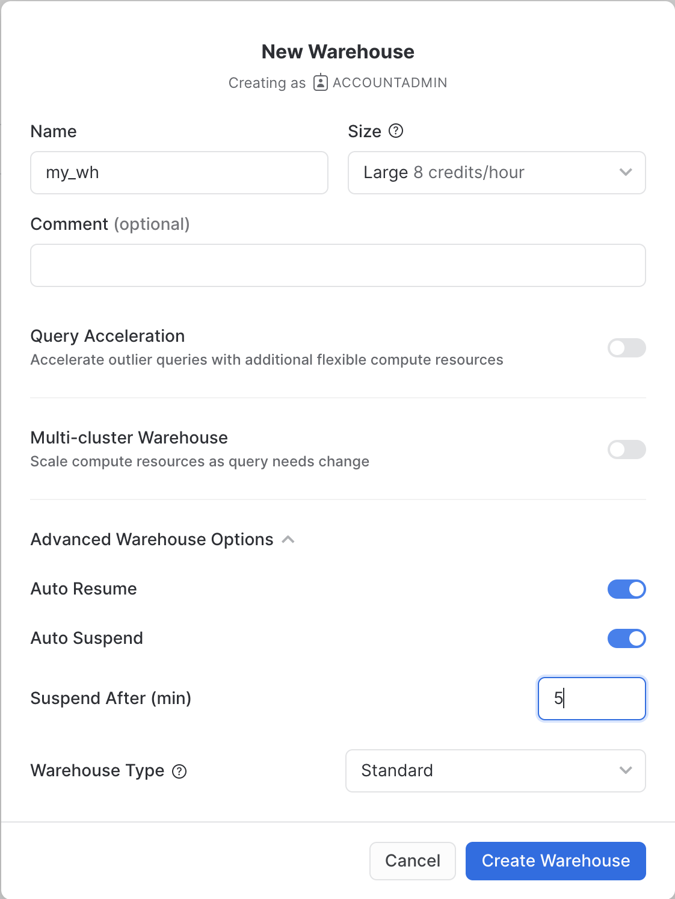

Be sure to change the `Suspend After (min)` field to 5 min to avoid wasting compute credits.

### Acknowledge the Snowflake Third Party Terms

In order to use the packages provided by Anaconda inside Snowflake, you must acknowledge the Snowflake Third Party Terms.

* Select Admin » Billing & Terms.
* In the Anaconda section, select Enable.
* In the Anaconda Packages dialog, click the link to review the Snowflake Third Party Terms page.
* If you agree to the terms, select `Acknowledge & Continue`.

## Acquire Marketplace Data

Duration: 5

The first step in the guide is to acquire geospatial data sets that you can freely use to explore the basics of Snowflake's geospatial functionality.  The best place to acquire this data is the Snowflake Marketplace!  
* Navigate to the `Marketplace` screen using the menu on the left side of the window
* Search for` OpenCelliD` in the search bar
* Find and click the` OpenCelliD - Open Database of Cell Towers` tile


* Once in the listing, click the big blue `Get` button

> aside negative
>  On the `Get` screen, you may be prompted to complete your `user profile` if you have not done so before. Click the link as shown in the screenshot below. Enter your name and email address into the profile screen and click the blue `Save` button. You will be returned to the `Get` screen.


* On the `Get Data` screen, change the name of the database from the default to `OPENCELLID`, as this name is shorter, and all future instructions will assume this name for the database.


Congratulations! You have just created a shared database from a listing on the Snowflake Marketplace. 

## Load Data from External Storage

Duration: 5

Now that you understand how to get data from Marketplace, let's try another way of getting data, namely, getting it from the external S3 storage. While we loadinging data we will learn formats supported by geospatial data types, use Python UDFs constructors.

In this step, we're going to use Snowflake's [Create an External Stage Using Snowsight](https://docs.snowflake.com/en/user-guide/data-load-s3-create-stage#create-an-external-stage-using-snowsight) feature to create a table using a dataset with energy grids stored in the external Stage.

Navigate to the query editor by clicking on  `Worksheets`  on the top left navigation bar and choose your warehouse.
* Click the + Worksheet button in the upper right of your browser window. This will open a new window.
* In the new Window, make sure `ACCOUNTADMIN` and `MY_WH` (or whatever your warehouse is named) are selected in the upper right of your browser window.

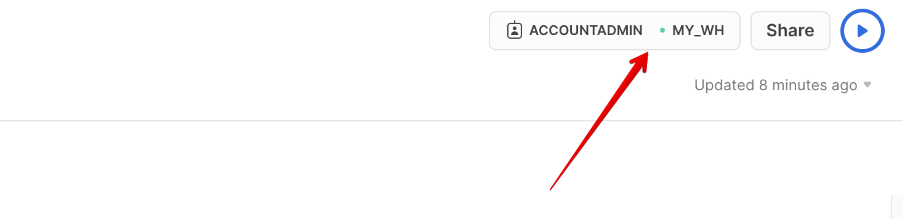

Create a new database and schema where we will store datasets in the Geography data type. Copy & paste the SQL below into your worksheet editor, put your cursor somewhere in the text of the query you want to run (usually the beginning or end), and either click the blue "Play" button in the upper right of your browser window, or press `CTRL+Enter` or `CMD+Enter` (Windows or Mac) to run the query.

```
CREATE OR REPLACE DATABASE GEOLAB;
CREATE OR REPLACE schema GEOLAB.GEOMETRY;
// Set the working database schema
USE SCHEMA GEOLAB.GEOMETRY;
```

Now, you will create a stage using an external S3 bucket. In the navigation menu, select Data > Databases. Select `GEOLAB.GEOMETRY`, and click Create > Stage > Amazon S3.

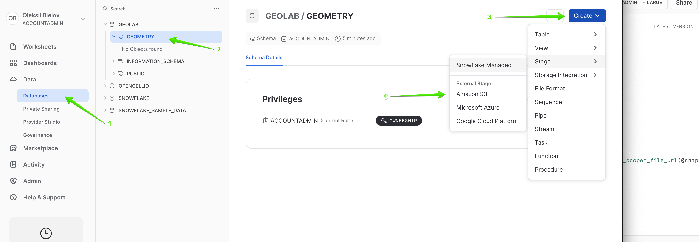

In the new Window, use the name geostage, and put the following link to the external stage in the URL field: *s3://sfquickstarts/vhol_spatial_analysis_geometry_geography/.* Then click Create button.

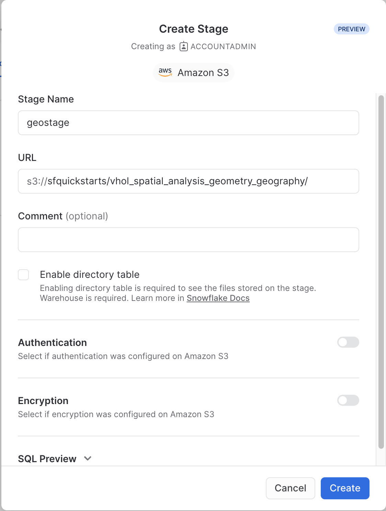

Now you will create a new table using the file from that stage. Run the following queries to create a new file format and a new table using the dataset stored in the Stage:

```
// Set the working database schema
CREATE OR REPLACE FILE format mycsv TYPE = CSV SKIP_HEADER = 1 FIELD_OPTIONALLY_ENCLOSED_BY = '"';
CREATE OR REPLACE TABLE GEOLAB.GEOMETRY.nl_cables_stations AS SELECT to_geometry($1) as geometry, $2 as id, $3 as type FROM @geostage/nl_stations_cables.csv (file_format => 'mycsv');
```

Look at the description of the table you just created by running the following queries: 

```
// Set the working database schema
USE SCHEMA geolab.geometry;
DESC TABLE nl_cables_stations;
```

The [use schema](https://docs.snowflake.com/en/sql-reference/sql/use-schema.html) command sets the active database.schema for your future queries so you do not have to fully qualify your objects.
The [desc or describe](https://docs.snowflake.com/en/sql-reference/sql/desc.html) command shows you the definition of the view, including the columns, their data type, and other relevant details. Notice the `geometry` column is defined as `GEOMETRY` type. 

Snowflake supports 3 primary geospatial formats and 2 additional variations on those formats. They are:

* **GeoJSON**: a JSON-based standard for representing geospatial data
* **WKT & EWKT**: a "Well Known Text" string format for representing geospatial data and the "Extended" variation of that format
* **WKB & EWKB:** a "Well Known Binary" format for representing geospatial data in binary and the "Extended" variation of that format

These formats are supported for ingestion (files containing those formats can be loaded into a `GEOMETRY` typed column), query result display, and data unloading to new files. You don't need to worry about how Snowflake stores the data under the covers but rather how the data is displayed to you or unloaded to files through the value of session variables called `GEOMETRY_OUTPUT_FORMAT`.

Run the queries below to make sure the current format is GeoJSON.

```
// Set the output format to GeoJSON
alter session set geometry_output_format = 'GEOJSON';
```

The [alter session](https://docs.snowflake.com/en/sql-reference/sql/alter-session.html) command lets you set a parameter for your current user session, which in this case is  `GEOMETRY_OUTPUT_FORMAT`. The default value for those parameters is `'GEOJSON'`, so normally you wouldn't have to run this command if you want that format, but this guide wants to be certain the next queries are run with the `'GEOJSON'` output.

Now run the following query against the `nl_cables_stations` table to see energy grids in Netherlands.

```
select geometry from nl_cables_stations limit 10;
```

In the result set, notice the `geometry` column and how it displays a JSON representation of spatial objects. It should look similar to this:

```
{"coordinates": [[[1.852040750000000e+05, 3.410349640000000e+05], [1.852044840000000e+05,3.410359860000000e+05]], [[1.852390240000000e+05,3.411219340000000e+05], ... ,[1.852800600000000e+05,3.412219960000000e+05]]   ], "type": "MultiLineString" }
```

Unlike `GEOGRAPHY`, which treats all points as longitude and latitude on a spherical earth, `GEOMETRY` considers the Earth as a flat surface. That is why in `GEOMETRY` we use the planar coordinate system, where coordinates are similar to X and Y coordinates that you used in the geometry course in your school. More information about Snowflake's specification can be found [here](https://docs.snowflake.com/en/sql-reference/data-types-geospatial.html).
In this example it uses the scientific notation and the numbers are much larger than latitude and longitude boundaries [-180; 180].

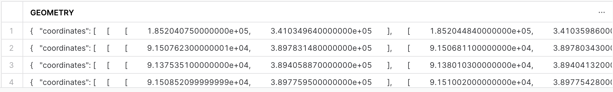

Now look at the same query but in a different format. Run the following query:

```
// Set the output format to EWKT
alter session set geometry_output_format = 'EWKT';
```

Run the previous `SELECT` query again and when done, examine the output in the `geometry` column.

```
select geometry from nl_cables_stations limit 10;
```

EWKT looks different than GeoJSON, and is arguably more readable. Here you can more clearly see the [geospatial object types](https://docs.snowflake.com/en/sql-reference/data-types-geospatial.html#geospatial-object-types), which are represented below in the example output:

```
SRID=28992;MULTILINESTRING((185204.075 341034.964,185204.484 341035.986), ... ,(185276.402 341212.688,185279.319 341220.196,185280.06 341221.996))
```

EWKT also shows spatial reference identifier and in our example, we have a dataset in [Amersfoort / RD New](https://epsg.io/28992) spatial reference system, that is why displayed SRID is 28992.

Lastly, look at the WKB output. Run the following query:

```
// Set the output format to WKB
alter session set geometry_output_format = 'WKB';
```

Run the query again, and click on a cell in the `geometry` column.

```
select geometry from nl_cables_stations limit 10;
```

Notice how WKB is incomprehensible to a human reader. However, this format is handy in data loading/unloading, as it can be more compact than WKB or GeoJSON.

## Load Data from Internal Storage

Duration: 10

Now that you have a basic understanding of how the `GEOMETRY` data type works and what a geospatial representation of data looks like in various output formats, it's time to walkthrough a scenario that requires you to use constructors to load data.  We will do it while trying one more way of getting data, namely, from the Shapefile file stored in the internal stage. 

First download [this](https://drive.google.com/file/d/19OtHBq70O1GW8TSqOvfMnpSjNUbZmlGG/view?usp=sharing) Shapefile which contains boundaries of administrative areas in Netherlands. 
Then in the navigation menu, select Data > Databases, choose `GEOLAB.GEOMETRY`, and click Create > Stage > Snowflake Managed.

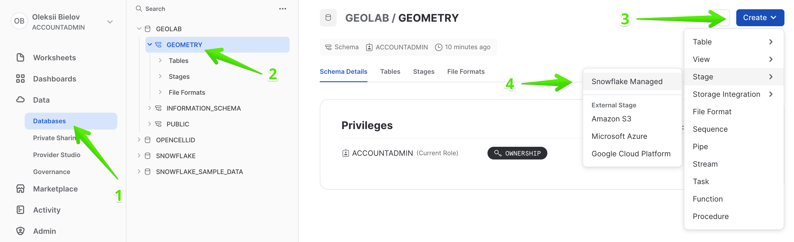

In the new Window, use the name stageshp and click `Create`.

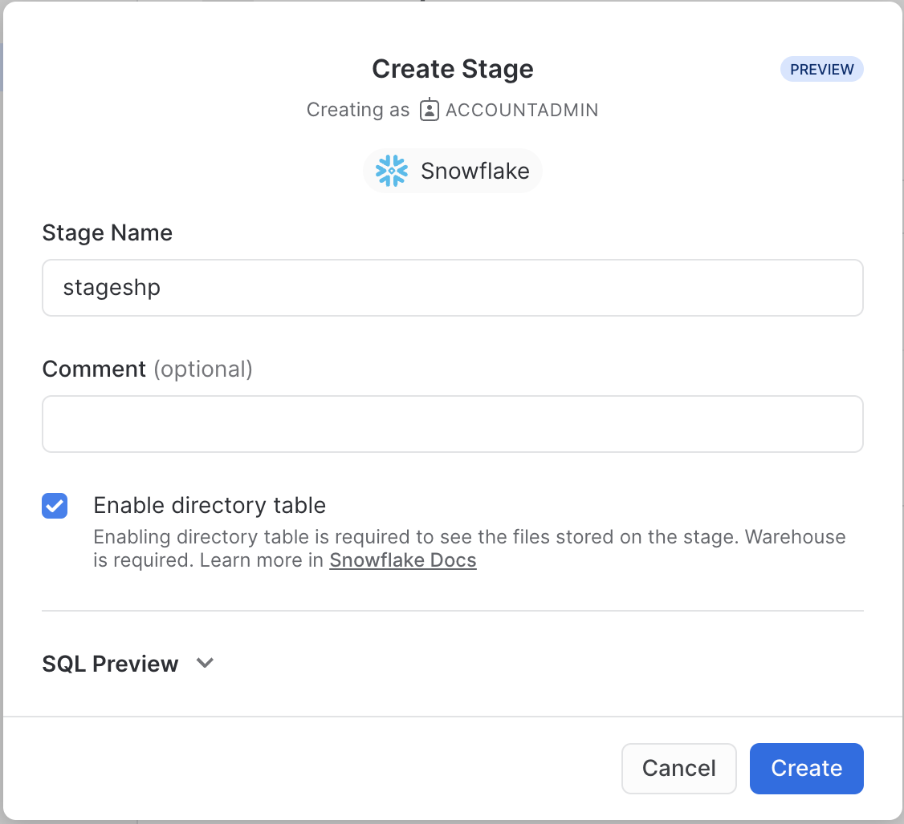

Then select newly created Stage and click `+ Files` to upload a new file.

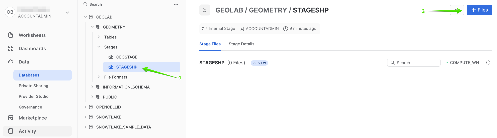

Browse the file you just downloaded and click  `Upload`.

To load that data we will use Python UDF that reads data from Shapefile .

Run the following query that creates a UDF:

```
CREATE OR REPLACE FUNCTION PY_LOAD_GEODATA(PATH_TO_FILE string, filename string)
returns table (wkt varchar, properties object)
language python
runtime_version = 3.8
packages = ('fiona', 'shapely', 'snowflake-snowpark-python')
handler = 'GeoFileReader'
AS $$
from shapely.geometry import shape
from snowflake.snowpark.files import SnowflakeFile
from fiona.io import ZipMemoryFile
class GeoFileReader:        
    def process(self, PATH_TO_FILE: str, filename: str):
    	with SnowflakeFile.open(PATH_TO_FILE, 'rb') as f:
    		with ZipMemoryFile(f) as zip:
    			with zip.open(filename) as collection:
    				for record in collection:
    					yield (shape(record['geometry']).wkt, dict(record['properties']))
$$;
```

This UDF reads a shapefile and returns its content as a table. Under the hood it uses geospatial libraries `fiona` and `shapely`.
Run the following query to see the content of the uploaded shapefile.

```
// Setting EWKT as an output format
ALTER SESSION SET geometry_output_format = 'EWKT';

SELECT to_geometry(wkt) AS geometry,
       (case when properties:TYPE_1::string is null then 'Municipality' else 'Province' end) as type,
       properties:NAME_1::string as province_name,
       properties:NAME_2::string as municipality_name
FROM table(PY_LOAD_GEODATA(build_scoped_file_url(@stageshp, 'nl_areas.zip'), 'nl_areas.shp'));
```
This query fails with the the error: *Geometry validation failed: Geometry has invalid self-intersections. A self-intersection point was found at (559963, 5.71069e+06)*. 

> aside negative
>  The constructor function determines if the shape is valid according to the [Open Geospatial Consortium’s Simple Feature Access / Common Architecture](https://www.ogc.org/standards/sfa) standard. If the shape is invalid, the function reports an error and does not create the GEOMETRY object. That is what happened in our example.

To fix this we can allow ingestion of invalid shape by setting the corresponding parameter to True. Let's run the SELECT statement again, but update the query to see how many shapes are invalid. Run the following query:

```
SELECT to_geometry(wkt, True) AS geometry,
       st_isvalid(geometry) as is_valid,
       (case when properties:TYPE_1::string is null then 'Municipality' else 'Province' end) as type,
       properties:NAME_1::string as province_name,
       properties:NAME_2::string as municipality_name
FROM table(PY_LOAD_GEODATA(build_scoped_file_url(@stageshp, 'nl_areas.zip'), 'nl_areas.shp'))
order by is_valid asc;
```

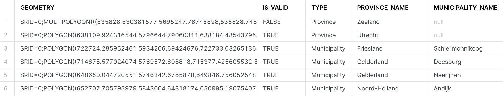

This query completed without error and now you see that the shape of the province Zeeland is invalid. Let's try to repair it by applying [ST_BUFFER](https://docs.snowflake.com/en/sql-reference/functions/st_buffer) function with a small value of the distance.

```
SELECT st_buffer(to_geometry(wkt, True), -1) AS geometry,
       st_isvalid(geometry) as is_valid,
       (case when properties:TYPE_1::string is null then 'Municipality' else 'Province' end) as type,
       properties:NAME_1::string as province_name,
       properties:NAME_2::string as municipality_name
FROM table(PY_LOAD_GEODATA(build_scoped_file_url(@stageshp, 'nl_areas.zip'), 'nl_areas.shp'))
order by is_valid asc;
```

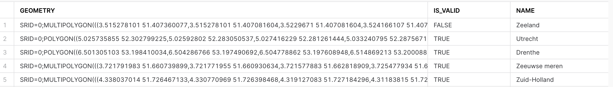

> aside negative
>  The ST_BUFFER with some small positive or negative value for the distance *sometimes* can help to fix invalid shapes. However, you should remember that the unit of measurement for the distance parameter in the ST_BUFFER will be the same as your data. Therefore, if your data utilizes lon/lat values, the distance's units will also be degrees.

Now all shapes are valid and the data ready to be ingested. One additional thing we should do is to set SRID, since othervise it will be set to 0. This dataset is in the reference system [WGS 72 / UTM zone 31N](https://epsg.io/32231), so it makes sense to add the SRID=32231 to the constructor function.

Run the following query:

```
CREATE OR REPLACE TABLE geolab.geometry.nl_administrative_areas AS
SELECT st_buffer(to_geometry(wkt, 32231, True), 0) AS geometry,
       (case when properties:TYPE_1::string is null then 'Municipality' else 'Province' end) as type,
       properties:NAME_1::string as province_name,
       properties:NAME_2::string as municipality_name
FROM table(PY_LOAD_GEODATA(build_scoped_file_url(@stageshp, 'nl_areas.zip'), 'nl_areas.shp'))
```

Excellent! Now that all the datasets are successfully loaded, let's proceed to the next exciting step: the analysis.


<!-- ----------------------------------------- -->
## Spatial analysis

Duration: 5

To showcase the capabilities of the GEOMETRY data type, we will explore several use cases. In these scenarios, we'll assume we are analysts working for an energy utilities company responsible for maintaining electrical grids.

### What is the length of the electricity cables?
In the first use case we will calculate the length of electrical cables our organization is responsible for in each administrative area within the Netherlands. We'll be utilizing two datasets: with power infrastructure of the Netherlands and the borders of Dutch administrative areas. First, let's check the sample of each dataset.

Run the following query to see the content of NL_CABLES_STATIONS table:

```
SELECT geometry,
       TYPE
FROM GEOLAB.GEOMETRY.NL_CABLES_STATIONS
LIMIT 5;
```
The results look similar to this:

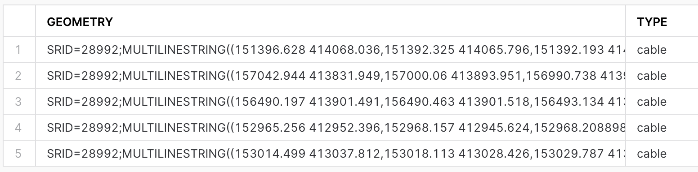

The spatial data is stored using the `GEOMETRY` data type and employs the Dutch mapping system, `Amersfoort / RD New` (SRID = 28992). To view the contents of the table containing the boundaries of the administrative areas in the Netherlands, execute the following query:

```
SELECT *
FROM geolab.geometry.nl_administrative_areas
LIMIT 5;
```


In order to compute the length of all cables per administrative area, it's essential that both datasets adhere to the same mapping system. We have two options: either re-project `nl_administrative_areas` to SRID 28992, or reproject `nl_cables_stations` to SRID 32231. For this exercise, let's choose the first option.

Run the following query:
```
SELECT t1.province_name,
    sum(st_length(t2.geometry)) AS cables_length
FROM geolab.geometry.nl_administrative_areas t1,
     geolab.geometry.nl_cables_stations t2
WHERE st_intersects(st_transform(t1.geometry, 28992), t2.geometry)
AND t1.type = 'Province'
GROUP BY 1
ORDER BY 2 DESC;
```

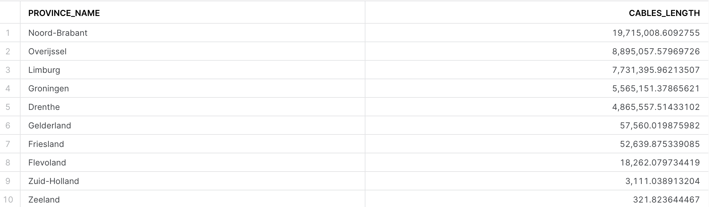

We have five areas densely covered by electicity cables, those are the ones that our company is responsible for. For our first analysis, we will focus on these areas.

### What cell towers lacking electricity cables nearby

In many areas, especially rural or remote ones, cell towers might be located far from electricity grids. This can pose a challenge in providing a reliable power supply to these towers. They often rely on diesel generators, which can be expensive to operate and maintain and have environmental implications. Furthermore, power outages can lead to disruptions in mobile connectivity, impacting individuals, businesses, and emergency services.

Our analysis aims to identify mobile cell towers that are not near an existing electricity grid. This information could be used to prioritize areas for grid expansion, to improve the efficiency of renewable energy source installations (like solar panels or wind turbines), or to consider alternative energy solutions.

For this example let's use GEOGRAPHY data type. As a first step, you will create a table with locations of cell towers stored as GEOGRAPHY.

```
// Creating a new schema for GEOGRAPHY
CREATE OR REPLACE SCHEMA GEOLAB.GEOGRAPHY;
CREATE OR REPLACE TABLE geolab.geography.nl_celltowers AS
SELECT DISTINCT to_geography('POINT(' || lon || ' ' || lat || ')', 4326) AS cell_location,
                radio,
                cell_range
FROM OPENCELLID.PUBLIC.RAW_CELL_TOWERS t1
WHERE mcc = '204';
```

Now for energy grids and boundaries table let's create GEOGRAPHY equivalents. For that we need to reproject GEOMETRY column in each of the tables into mapping system WGS 84 (SRID=4326) and then convert to GEOGRAPHY data type. Run following two tables:

```
// Creating a table with GEOGRAPHY for nl_administrative_areas
CREATE OR REPLACE TABLE geolab.geography.nl_administrative_areas AS
SELECT to_geography(st_asgeojson(st_transform(geometry, 4326))) as geometry,
       type,
       province_name,
       municipality_name
FROM geolab.geometry.nl_administrative_areas;

// Creating a table with GEOGRAPHY for nl_cables_stations
CREATE OR REPLACE TABLE geolab.geography.nl_cables_stations AS
SELECT to_geography(st_asgeojson(st_transform(geometry, 4326))) as geometry,
       id,
       type
FROM geolab.geometry.nl_cables_stations;
```

