author: Peter Popov, Oleksii Bielov
id: geo_analysis_geometry
summary: This is a sample Snowflake Guide
categories: Getting-Started
environments: web
status: Published 
feedback link: https://github.com/Snowflake-Labs/sfguides/issues
tags: Getting Started, Geospatial, Python UDFs

# Geospatial Analysis using Geometry Data Type
<!-- ----------------------------------------- -->
## Overview 

Duration: 10

Geospatial query capabilities in Snowflake are built upon a combination of data types and specialized query functions that can be used to parse, construct, and run calculations over geospatial objects. This guide will introduce you to the `GEOMETRY` data type, help you understand geospatial formats supported by Snowflake and walk you through the use of a variety of functions on sample geospatial data sets. 

### Prerequisites
* Quick Video [Introduction to Snowflake](https://www.youtube.com/watch?v=fEtoYweBNQ4&ab_channel=SnowflakeInc.)
* Snowflake [Data Loading Basics](https://www.youtube.com/watch?v=us6MChC8T9Y&ab_channel=SnowflakeInc.) Video
* [CARTO in a nutshell ](https://docs.carto.com/getting-started/carto-in-a-nutshell)web guide
* [CARTO Spatial Extension for Snowflake](https://www.youtube.com/watch?v=9W_Attbs-fY) video 

### What You’ll Learn
* How to acquire geospatial data from the Snowflake Marketplace
* How to load geospatial data from a Stage
* How to interpret the `GEOMETRY` data type and how it differs from the `GEOGRAPHY`
* How to understand the different formats that `GEOMETRY` can be expressed in
* How to do spatial analysis using the `GEOMETRY` and `GEOGRAPHY` data types
* How to use Python UDFs for reading Shapefiles and creating custom functions
* How to use Global Discrete Grid and H3 functions
* How to use Search Optimization to speed up geospatial queries

### What You’ll Need
* A supported Snowflake [Browser](https://docs.snowflake.com/en/user-guide/setup.html)
* Sign-up for a [Snowflake Trial](https://signup.snowflake.com/)  OR have access to an existing Snowflake account with the `ACCOUNTADMIN` role or the `IMPORT SHARE `privilege. Select the Enterprise edition, AWS as a cloud provider and US East (Northern Virginia) or EU (Frankfurt) as a region.
* Sign-up for a  [CARTO Trial](http://app.carto.com/signup) (OR  have access to an existing CARTO account). Select the same region (continent) as for the Snowflake account.

### What You’ll Build
A sample use case that involves energy grids and LTE cell towers in the Netherlands You will answer the following questions:
* What is the length of all energy grids in each municipality in the Netherlands?
* What cell towers lack electricity cables nearby?
* What municipalities in the Netherlands have good/poor LTE coverage?
* What percent of the Dutch highways have LTE coverage?
* What is the estimated quality of LTE signal on Dutch highways?

<!-- ----------------------------------------- -->
## Setup your Account

Duration: 5

If this is the first time you are logging into the Snowflake UI, you will be prompted to enter your account name or account URL that you were given when you acquired a trial. The account URL contains your [account name](https://docs.snowflake.com/en/user-guide/connecting.html#your-snowflake-account-name) and potentially the region. You can find your account URL in the email that was sent to you after you signed up for the trial.

Click `Sign-in` and you will be prompted for your username and password.

> aside positive
>  If this is not the first time you are logging into the Snowflake UI, you should see a "Select an account to sign into" prompt and a button for your account name listed below it. Click the account you wish to access and you will be prompted for your username and password (or another authentication mechanism).

### Increase Your Account Permission
The Snowflake web interface has a lot to offer, but for now, switch your current role from the default `SYSADMIN` to `ACCOUNTADMIN`. This increase in permissions will allow you to create shared databases from Snowflake Marketplace listings.

> aside positive
>  If you don't have the `ACCOUNTADMIN` role, switch to a role with `IMPORT SHARE` privileges instead.


### Create a Virtual Warehouse

You will need to create a Virtual Warehouse to run queries.

- Navigate to the `Admin > Warehouses` screen using the menu on the left side of the window
- Click the big blue `+ Warehouse` button in the upper right of the window
- Create a Large Warehouse as shown in the screen below


Be sure to change the `Suspend After (min)` field to 5 min to avoid wasting compute credits.

### Acknowledge the Snowflake Third Party Terms

To use the packages provided by Anaconda inside Snowflake, you must acknowledge the Snowflake Third Party Terms.

* Select Admin » Billing & Terms.
* In the Anaconda section, select Enable.
* In the Anaconda Packages dialog, click the link to review the Snowflake Third Party Terms page.
* If you agree to the terms, select `Acknowledge & Continue`.

### Create a Database and Schema

Navigate to the query editor by clicking on  `Worksheets`  on the top left navigation bar and choose your warehouse.
* Click the + Worksheet button in the upper right of your browser window. This will open a new window.
* In the new Window, make sure `ACCOUNTADMIN` and `MY_WH` (or whatever your warehouse is named) are selected in the upper right of your browser window.


Create a new database and schema where you will store datasets in the `GEOMETRY` data type. Copy & paste the SQL below into your worksheet editor, put your cursor somewhere in the text of the query you want to run (usually the beginning or end), and either click the blue "Play" button in the upper right of your browser window, or press `CTRL+Enter` or `CMD+Enter` (Windows or Mac) to run the query.

```
CREATE OR REPLACE DATABASE GEOLAB;
CREATE OR REPLACE schema GEOLAB.GEOMETRY;
// Set the working database schema
USE SCHEMA GEOLAB.GEOMETRY;
```

### Connect Snowflake and Carto

Let's connect your Snowflake to CARTO so you can run and visualize the queries in the following exercises of this workshop.

Access the CARTO Workspace: [app.carto.com](http://app.carto.com/)

Go to the Connections section in the Workspace, where you can find the list of all your current connections.

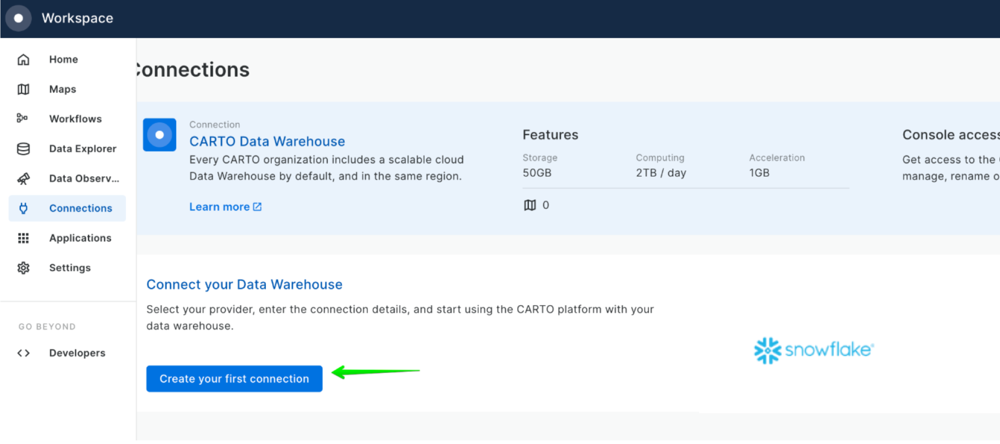

To add a new connection, click on `New connection` and follow these steps:

1. Select Snowflake.
2. Click the `Setup connection` button.
3. Enter the connection parameters and credentials.

These are the parameters you need to provide:

- **Name** for your connection: You can register different connections with the Snowflake connector. You can use the name to identify the connections.
- **Username**: Name of the user account.
- **Password**: Password for the user account.
- **Account**: Hostname for your account. One way to get it is to check the Snowflake activation email, which contains the account_name within the URL ( <account_name>.snowflakecomputing.com ). Just enter what's on the account_name, i.e ok36557.us-east-2.aws
- **Warehouse (optional)**: Default warehouse that will run your queries. Use MY_WH.

> aside negative
>  Use MY_WH or the name of the data warehouse you created in the previous step otherwise some queries will fail because CARTO won't know which warehouse to run them against.

- **Database (optional)**. Default database to run your queries. Use GEOLAB.
- **Role (optional)**. Default Role to run your queries. Use ACCOUNTADMIN.

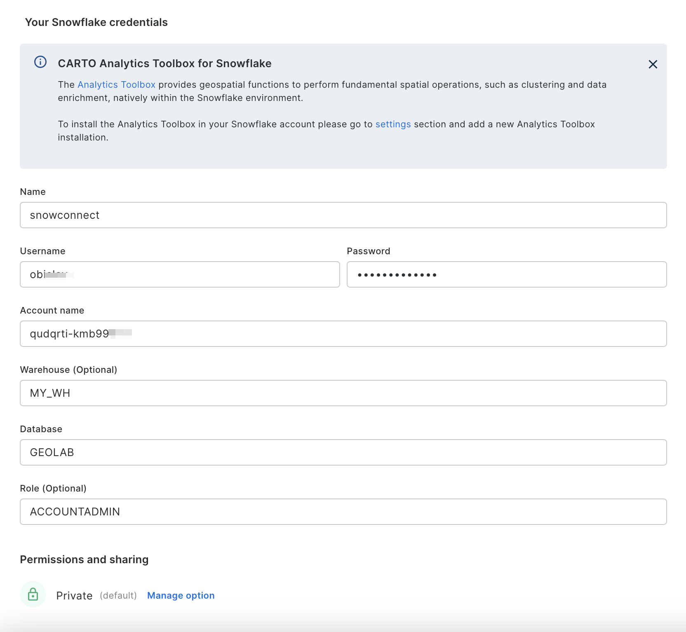

Once you have entered the parameters, you can click the Connect button. CARTO will try to connect to your Snowflake account. If everything is OK, your new connection will be registered.

## Acquire Marketplace Data and Analytics Toolbox

Duration: 5

The first step in the guide is to acquire geospatial data sets that you can freely use to explore the basics of Snowflake's geospatial functionality.  The best place to acquire this data is the Snowflake Marketplace!  
* Navigate to the `Marketplace` screen using the menu on the left side of the window
* Search for` OpenCelliD` in the search bar
* Find and click the` OpenCelliD - Open Database of Cell Towers` tile


* Once in the listing, click the big blue `Get` button

> aside negative
>  On the `Get` screen, you may be prompted to complete your `user profile` if you have not done so before. Click the link as shown in the screenshot below. Enter your name and email address into the profile screen and click the blue `Save` button. You will be returned to the `Get` screen.


* On the `Get Data` screen, change the name of the database from the default to `OPENCELLID`, as this name is shorter, and all future instructions will assume this name for the database.


Congratulations! You have just created a shared database from a listing on the Snowflake Marketplace. 

Similarly to the above dataset, search and get the `Netherlands Open Map Data - Sonra` dataset from the Marketplace and rename it to `osm_nl`.

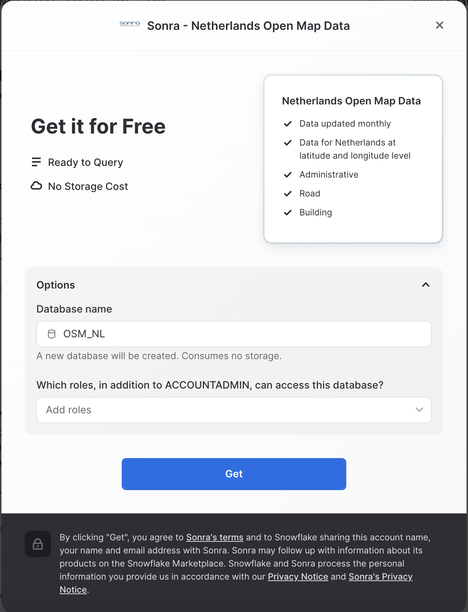

> aside negative
>  After clicking "Get" you may see a message saying "Getting Data Ready. This will take at least 10 minutes.". In this case simply continue this quickstart and come back to this step when you start using this dataset.

### Install CARTO Analytics Toolbox from the Snowflake Marketplace

Now you can acquire CARTO’s Analytics Toolbox from the Snowflake Marketplace. This will share UDFs (User defined functions) to your account which will allow you to perform even more geospatial analytics. 

* Similar to how you did with the data in the previous steps, navigate to the `Marketplace` screen using the menu on the left side of the window
* Search for` CARTO` in the search bar

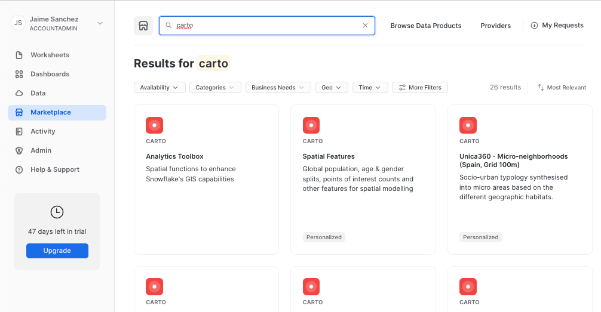

* Find and click the` Analytics Toolbox`  tile 

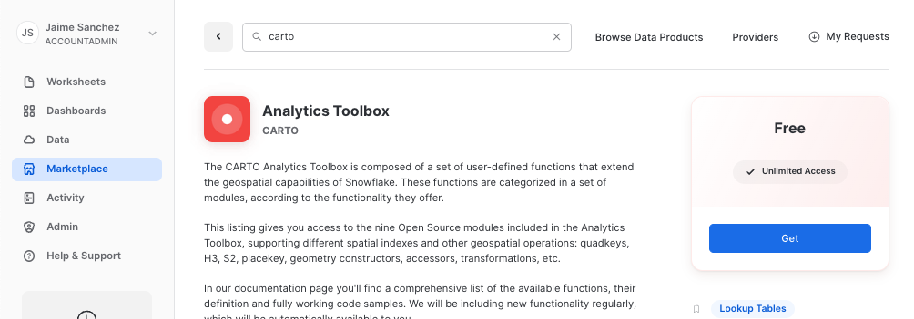

* Click on big blue` Get`  button 
* In the options, name the database `CARTO` and optionally add more roles that can access the database 


* Click on `Get` and then `Done`. 

Congratulations! Now you have data and the analytics toolbox! 

## Load Data from External Storage

Duration: 5

Now that you understand how to get data from Marketplace, let's try another way of getting data, namely, getting it from the external S3 storage. While you loading data you will learn formats supported by geospatial data types.

For this quickstart we have prepared a dataset with energy grid infrastructure (cable lines) in the Netherlands. It is stored in the CSV format in the public S3 bucket. To import this data, create an external stage using the following SQL command:

```
CREATE OR REPLACE STAGE geolab.geometry.geostage
  URL = 's3://sfquickstarts/vhol_spatial_analysis_geometry_geography/';
```

Now you will create a new table using the file from that stage. Run the following queries to create a new file format and a new table using the dataset stored in the Stage:

```
// Create file format
CREATE OR REPLACE FILE FORMAT geocsv TYPE = CSV SKIP_HEADER = 1 FIELD_OPTIONALLY_ENCLOSED_BY = '"';

CREATE OR REPLACE TABLE geolab.geometry.nl_cables_stations AS 
SELECT to_geometry($1) AS geometry, 
       $2 AS id, 
       $3 AS type 
FROM @geostage/nl_stations_cables.csv (file_format => 'geocsv');
```

Look at the description of the table you just created by running the following queries: 

```
DESC TABLE geolab.geometry.nl_cables_stations;
```

The [desc or describe](https://docs.snowflake.com/en/sql-reference/sql/desc.html) command shows you the definition of the view, including the columns, their data type, and other relevant details. Notice the `geometry` column is defined as `GEOMETRY` type. 

Snowflake supports 3 primary geospatial formats and 2 additional variations on those formats. They are:

* **GeoJSON**: a JSON-based standard for representing geospatial data
* **WKT & EWKT**: a "Well Known Text" string format for representing geospatial data and the "Extended" variation of that format
* **WKB & EWKB:** a "Well Known Binary" format for representing geospatial data in binary and the "Extended" variation of that format

These formats are supported for ingestion (files containing those formats can be loaded into a `GEOMETRY` typed column), query result display, and data unloading to new files. You don't need to worry about how Snowflake stores the data under the covers but rather how the data is displayed to you or unloaded to files through the value of session variables called `GEOMETRY_OUTPUT_FORMAT`.

Run the queries below to make sure the current format is GeoJSON.

```
// Set the output format to GeoJSON
ALTER SESSION SET geometry_output_format = 'GEOJSON';
```

The [alter session](https://docs.snowflake.com/en/sql-reference/sql/alter-session.html) command lets you set a parameter for your current user session, which in this case is  `GEOMETRY_OUTPUT_FORMAT`. The default value for those parameters is `'GEOJSON'`, so normally you wouldn't have to run this command if you want that format, but this guide wants to be certain the next queries are run with the `'GEOJSON'` output.

Now run the following query against the `nl_cables_stations` table to see energy grids in the Netherlands.

```
SELECT geometry
FROM nl_cables_stations
LIMIT 10;
```

In the result set, notice the `geometry` column and how it displays a JSON representation of spatial objects. It should look similar to this:

```
{"coordinates": [[[1.852040750000000e+05, 3.410349640000000e+05], [1.852044840000000e+05,3.410359860000000e+05]], [[1.852390240000000e+05,3.411219340000000e+05], ... ,[1.852800600000000e+05,3.412219960000000e+05]]   ], "type": "MultiLineString" }
```

Unlike `GEOGRAPHY`, which treats all points as longitude and latitude on a spherical earth, `GEOMETRY` considers the Earth as a flat surface. More information about Snowflake's specification can be found [here](https://docs.snowflake.com/en/sql-reference/data-types-geospatial.html).
In this example it uses scientific notation and the numbers are much larger than latitude and longitude boundaries [-180; 180].


Now look at the same query but in a different format. Run the following query:

```
// Set the output format to EWKT
ALTER SESSION SET geometry_output_format = 'EWKT';
```

Run the previous `SELECT` query again and when done, examine the output in the `geometry` column.

```
SELECT geometry
FROM nl_cables_stations
LIMIT 10;
```

EWKT looks different from GeoJSON, and is arguably more readable. Here you can more clearly see the [geospatial object types](https://docs.snowflake.com/en/sql-reference/data-types-geospatial.html#geospatial-object-types), which are represented below in the example output:

```
SRID=28992;MULTILINESTRING((185204.075 341034.964,185204.484 341035.986), ... ,(185276.402 341212.688,185279.319 341220.196,185280.06 341221.996))
```

EWKT also shows the spatial reference identifier and in our example, you have a dataset in [Amersfoort / RD New](https://epsg.io/28992) spatial reference system, that is why the displayed SRID is 28992.

Lastly, look at the WKB output. Run the following query:

```
// Set the output format to WKB
ALTER SESSION SET geometry_output_format = 'WKB';
```

Run the query again, and click on a cell in the `geometry` column.

```
SELECT geometry 
FROM nl_cables_stations 
LIMIT 10;
```

Notice how WKB is incomprehensible to a human reader. However, this format is handy in data loading/unloading, as it can be more compact than WKT or GeoJSON.

## Load Data from Internal Storage

Duration: 10

Now that you have a basic understanding of how the `GEOMETRY` data type works and what a geospatial representation of data looks like in various output formats, it's time to walk through a scenario that requires you to use constructors to load data.  You will do it while trying one more way of getting data, namely, from the Shapefile file stored in the internal stage. 

First download [this](https://sfquickstarts.s3.us-west-1.amazonaws.com/vhol_spatial_analysis_geometry_geography/nl_areas.zip) Shapefile which contains the boundaries of administrative areas in the Netherlands. 
Then in the navigation menu, select Data > Databases, choose `GEOLAB.GEOMETRY`, and click Create > Stage > Snowflake Managed.


In the new Window, use the name stageshp and click `Create`.


Then select the newly created Stage and click `+ Files` to upload a new file.


Browse the file you just downloaded and click  `Upload`.

The file you just uploaded contains the polygons of administrative boundaries in the Netherlands. The data is stored in [Shapefile format](https://en.wikipedia.org/wiki/Shapefile) which is not yet supported by Snowflake. But you can load this file using Python UDF and [Dynamic File Access feature](https://docs.snowflake.com/developer-guide/udf/python/udf-python-examples#label-udf-python-read-files). You will also use some packages available in the Snowflake Anaconda channel.

Run the following query that creates a UDF:

```
CREATE OR REPLACE FUNCTION py_load_geodata(PATH_TO_FILE string, filename string)
RETURNS TABLE (wkt varchar, properties object)
LANGUAGE PYTHON
RUNTIME_VERSION = 3.8
PACKAGES = ('fiona', 'shapely', 'snowflake-snowpark-python')
HANDLER = 'GeoFileReader'
AS $$
from shapely.geometry import shape
from snowflake.snowpark.files import SnowflakeFile
from fiona.io import ZipMemoryFile
class GeoFileReader:        
    def process(self, PATH_TO_FILE: str, filename: str):
    	with SnowflakeFile.open(PATH_TO_FILE, 'rb') as f:
    		with ZipMemoryFile(f) as zip:
    			with zip.open(filename) as collection:
    				for record in collection:
    					yield (shape(record['geometry']).wkt, dict(record['properties']))
$$;
```

This UDF reads a Shapefile and returns its content as a table. Under the hood it uses geospatial libraries `fiona` and `shapely`.
Run the following query to see the content of the uploaded shapefile.

```
// Setting EWKT as an output format
ALTER SESSION SET geometry_output_format = 'EWKT';

SELECT to_geometry(wkt) AS geometry,
       properties:NAME_1::string AS province_name,
       properties:NAME_2::string AS municipality_name
FROM table(py_load_geodata(build_scoped_file_url(@stageshp, 'nl_areas.zip'), 'nl_areas.shp'));
```
This query fails with the error: *Geometry validation failed: Geometry has invalid self-intersections. A self-intersection point was found at (559963, 5.71069e+06)*. 

> aside negative
>  The constructor function determines if the shape is valid according to the [Open Geospatial Consortium’s Simple Feature Access / Common Architecture](https://www.ogc.org/standards/sfa) standard. If the shape is invalid, the function reports an error and does not create the GEOMETRY object. That is what happened in our example.

To fix this you can allow the ingestion of invalid shapes by setting the corresponding parameter to True. Let's run the SELECT statement again, but update the query to see how many shapes are invalid. Run the following query:

```
SELECT to_geometry(s => wkt, allowInvalid => True) AS geometry,
       st_isvalid(geometry) AS is_valid,
       properties:NAME_1::string AS province_name,
       properties:NAME_2::string AS municipality_name
FROM table(py_load_geodata(build_scoped_file_url(@stageshp, 'nl_areas.zip'), 'nl_areas.shp'))
ORDER BY is_valid ASC;
```


This query completed without error and now you see that the shape of the province Zeeland is invalid. Let's try to repair it by applying the [ST_BUFFER](https://docs.snowflake.com/en/sql-reference/functions/st_buffer) function with a small value for the buffer distance.

```
SELECT st_buffer(to_geometry(s => wkt, allowInvalid => True), -1) AS geometry,
       st_isvalid(geometry) AS is_valid,
       properties:NAME_1::string AS province_name,
       properties:NAME_2::string AS municipality_name
FROM table(py_load_geodata(build_scoped_file_url(@stageshp, 'nl_areas.zip'), 'nl_areas.shp'))
ORDER BY is_valid ASC;
```


> aside negative
>  Using ST_BUFFER with some small positive or negative value for the distance *sometimes* can help to fix invalid shapes. However, you should remember that the unit of measurement for the distance parameter in the ST_BUFFER will be the same as your data. Therefore, if your data utilizes lon/lat values, the distance's units will also be degrees.

Now all shapes are valid and the data is ready to be ingested. One additional thing you should do is to set SRID, since otherwise it will be set to 0. This dataset is in the reference system [WGS 72 / UTM zone 31N](https://epsg.io/32231), so it makes sense to add the SRID=32231 to the constructor function.

Run the following query:

```
CREATE OR REPLACE TABLE geolab.geometry.nl_administrative_areas AS
SELECT st_buffer(to_geometry(s => wkt, srid => 32231, allowinvalid => true), -1) AS geometry,
       (CASE WHEN properties:TYPE_1::string IS NULL THEN 'Municipality' ELSE 'Province' END) AS type,
       properties:NAME_1::string AS province_name,
       properties:NAME_2::string AS municipality_name
FROM TABLE(py_load_geodata(build_scoped_file_url(@stageshp, 'nl_areas.zip'), 'nl_areas.shp'));
```

Excellent! Now that all the datasets are successfully loaded, let's proceed to the next exciting step: the analysis.


<!-- ----------------------------------------- -->
## Spatial analysis

Duration: 25

To showcase the capabilities of the GEOMETRY data type, you will explore several use cases. In these scenarios, you'll assume you are an analyst working for an energy utilities company responsible for maintaining electrical grids.

### What is the length of the electricity cables?
In the first use case you will calculate the length of electrical cables your organization is responsible for in each administrative area within the Netherlands. You'll be utilizing two datasets: with power infrastructure of the Netherlands and the borders of Dutch administrative areas. First, let's check the sample of each dataset.

Run the following query to see the content of `nl_cables_stations` table:

```
SELECT geometry, type
FROM geolab.geometry.nl_cables_stations
LIMIT 5;
```
The results look similar to this:


The spatial data is stored using the `GEOMETRY` data type and employs the Dutch mapping system, `Amersfoort / RD New` (SRID = 28992). To view the contents of the table containing the boundaries of the administrative areas in the Netherlands, execute the following query:

```
SELECT *
FROM geolab.geometry.nl_administrative_areas
LIMIT 5;
```


In order to compute the length of all cables per administrative area, it's essential that both datasets adhere to the same mapping system. You have two options: either project `nl_administrative_areas` to SRID 28992, or project `nl_cables_stations` to SRID 32231. For this exercise, let's choose the first option.

Run the following query:
```
SELECT t1.province_name,
       sum(st_length(t2.geometry)) AS cables_length
FROM geolab.geometry.nl_administrative_areas AS t1,
     geolab.geometry.nl_cables_stations AS t2
WHERE st_intersects(st_transform(t1.geometry, 28992), t2.geometry)
  AND t1.type = 'Province'
GROUP BY 1
ORDER BY 2 DESC;
```


You have five areas densely covered by electricity cables, those are the ones that your company is responsible for. For your first analysis, you will focus on these areas.

### What cell towers lack electricity cables nearby

In many areas, especially rural or remote ones, cell towers might be located far from electricity grids. This can pose a challenge in providing a reliable power supply to these towers. They often rely on diesel generators, which can be expensive to operate and maintain and have environmental implications. Furthermore, power outages can lead to disruptions in mobile connectivity, impacting individuals, businesses, and emergency services.

Our analysis aims to identify mobile cell towers that are not near an existing electricity grid. This information could be used to prioritize areas for grid expansion, to improve the efficiency of renewable energy source installations (like solar panels or wind turbines), or to consider alternative energy solutions.

For this and the next examples let's use `GEOGRAPHY` data type as it can be easily visualized using CARTO. As a first step, let's create `GEOGRAPHY` equivalents for the energy grids and boundaries tables. For that you need to project the `geometry` column in each of the tables into the mapping system WGS 84 (SRID=4326) and then convert to `GEOGRAPHY` data type. Run the following queries that create new tables and enable search optimization for each of them in order to increase the performance of spatial operations. 

```
// Creating a table with GEOGRAPHY for nl_administrative_areas
CREATE OR REPLACE SCHEMA GEOLAB.GEOGRAPHY;

CREATE OR REPLACE TABLE geolab.geography.nl_administrative_areas AS
SELECT to_geography(st_asgeojson(st_transform(geometry, 4326))) AS geom,
       type,
       province_name,
       municipality_name
FROM geolab.geometry.nl_administrative_areas
ORDER BY st_geohash(geom);

ALTER TABLE geolab.geography.nl_administrative_areas ADD SEARCH OPTIMIZATION ON GEO(geom);

// Creating a table with GEOGRAPHY for nl_cables_stations
CREATE OR REPLACE TABLE geolab.geography.nl_cables_stations AS
SELECT to_geography(st_asgeojson(st_transform(geometry, 4326))) AS geom,
       id,
       type
FROM geolab.geometry.nl_cables_stations
ORDER BY st_geohash(geom);

ALTER TABLE geolab.geography.nl_cables_stations ADD SEARCH OPTIMIZATION ON GEO(geom);
```

You can now go to the CARTO account and visualize administrative areas and cable information in CARTO Builder.
* Create a new map. Use the navigation menu on the left to get to Maps and then click on (+) New Map.

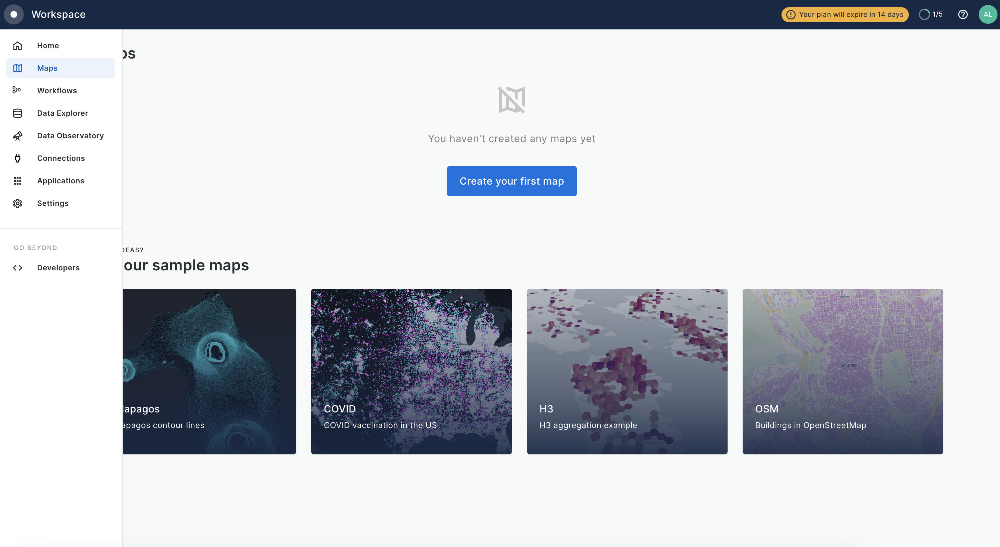

* Click on the `Add Source From` → `Data Explorer`

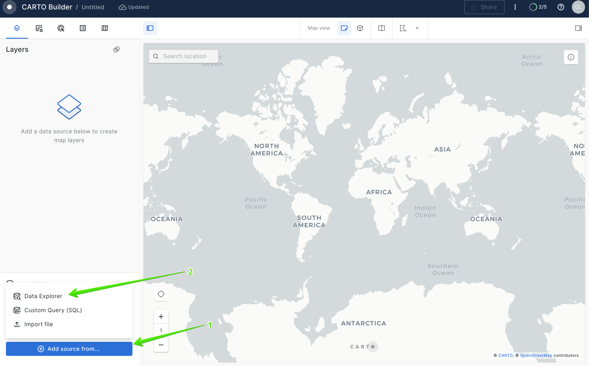

* In the pop-up select your connection and the `GEOLAB.GEOGRAPHY.NL_ADMINISTRATIVE_AREAS` table.

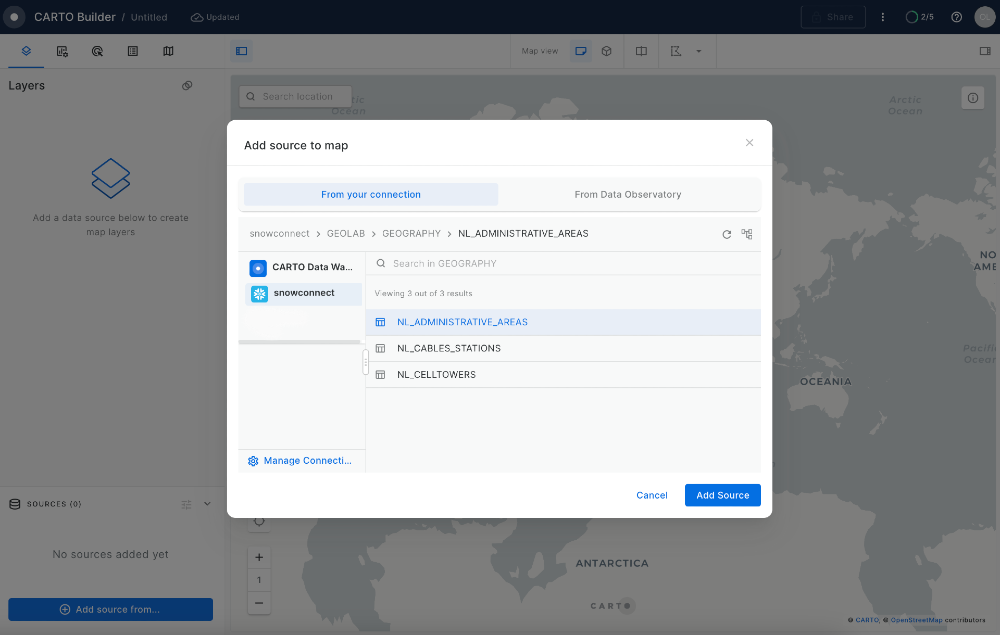

Click on the newly created layer and unselect "Fill Color" toggle to see the boundaries of the areas on the map.

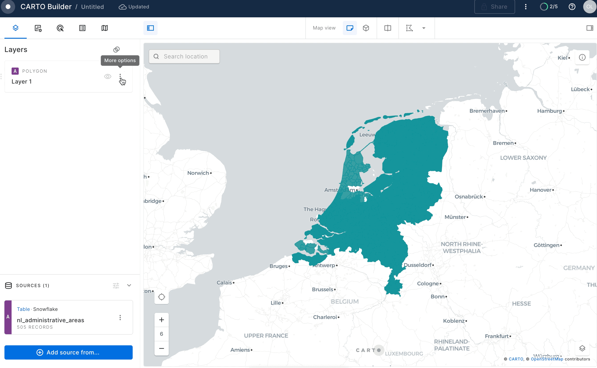

Similarly you can visualize the `GEOLAB.GEOGRAPHY.NL_CABLES_STATIONS` table.


Now you will create a table with locations of cell towers stored as GEOGRAPHY and enable search optimization, just like for the previous two tables. Run the following query in your Snowflake's worksheet:

```
CREATE OR REPLACE TABLE geolab.geography.nl_lte AS
SELECT DISTINCT st_point(lon, lat) AS geom,
                cell_range
FROM OPENCELLID.PUBLIC.RAW_CELL_TOWERS t1
WHERE mcc = '204' -- 204 is the mobile country code in the Netherlands
  AND radio='LTE'
ORDER BY st_geohash(geom);

ALTER TABLE geolab.geography.nl_lte ADD SEARCH OPTIMIZATION ON GEO(geom); 
```

Finally, you will find all cell towers that don't have an energy line within a 2-kilometer radius. For each cell tower you'll calculate the distance to the nearest electricity cable. In CARTO Builder click on the Add `Source From` → `Custom Query (SQL)` and make sure you have selected the Snowflake Connection that you have created in previous steps.

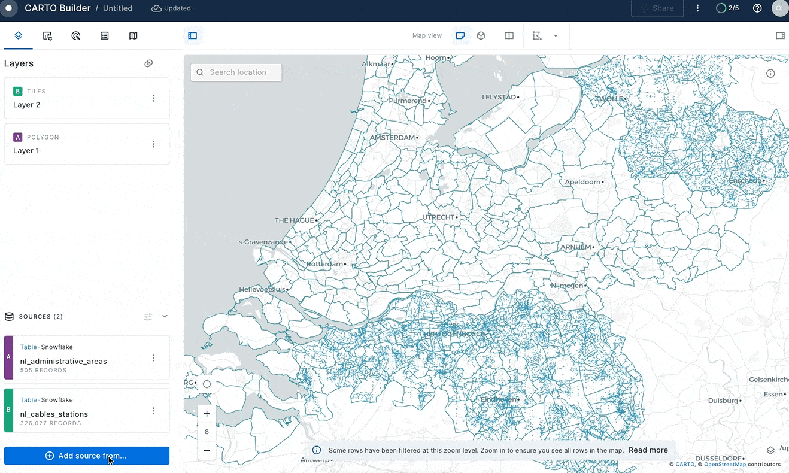

Then paste the following query and click on the green `Run` button.

```
SELECT province_name,
       cells.geom
FROM geolab.geography.nl_lte cells
LEFT JOIN geolab.geography.nl_cables_stations cables 
  ON st_dwithin(cells.geom, cables.geom, 2000)
JOIN geolab.geography.nl_administrative_areas areas 
  ON st_contains(areas.geom, cells.geom)
WHERE areas.type = 'Province'
  AND areas.province_name in ('Noord-Brabant', 'Overijssel', 'Limburg', 'Groningen', 'Drenthe')
  AND cables.geom IS NULL;
```

You can modify the colors of cell towers in the output and expand their radius in order to enhance their visibility.


<!-- ------------------------ -->
## Advanced Analysis using Spatial Joins and H3

Duration: 20

In the previous section you've found cell towers that don't have electricity cables nearby. But what about answering more sophisticated questions, like what areas in the Netherlands have very good and bad coverage by LTE (4G) network? You can use geospatial functions combined with spatial join and H3 functions from the Carto toolbox to find out.

### What municipalities in the Netherlands have good/poor LTE coverage?

You have been using `nl_lte` table, which stores the locations of cell towers. To find municipalities in the Netherlands with good and bad coverage by LTE network, you will undertake a two-step process as follows:

* For every LTE cell tower, you will calculate the coverage area.
* For every Dutch municipality, calculate the area covered by the LTE network.

`ST_BUFFER` from the Carto toolbox can be used to calculate the coverage area for each LTE cell tower. In the `nl_lte` table, there is a field `cell_range` which can be used as a value of radius in `ST_BUFFER`. For the sake of this example you will assume that a good signal can be received no further than 2000 meters away from the LTE cell.

Run the following two queries in your Snowflake's worksheet: 

```
CREATE OR REPLACE TABLE geolab.geography.nl_lte_with_coverage AS
SELECT geom,
       cell_range,
       carto.carto.st_buffer(geom, least(cell_range, 2000), 5) AS coverage
FROM geolab.geography.nl_lte
ORDER BY st_geohash(geom);

ALTER TABLE geolab.geography.nl_lte_with_coverage ADD SEARCH OPTIMIZATION ON GEO(geom); 
```

Now there is a new column named `coverage` that contains a polygon representing the area covered by each cell tower's signal. Let's create a new map in the CARTO Builder and run the following query to visualize the coverage for one of the municipalities:

```
SELECT c.coverage AS geom
FROM geolab.geography.nl_lte_with_coverage c
JOIN geolab.geography.nl_administrative_areas b 
  ON st_intersects(b.geom, c.geom)
WHERE TYPE = 'Municipality'
  AND municipality_name = 'Angerlo';
```

The result of this query is a number of overlapping circles:

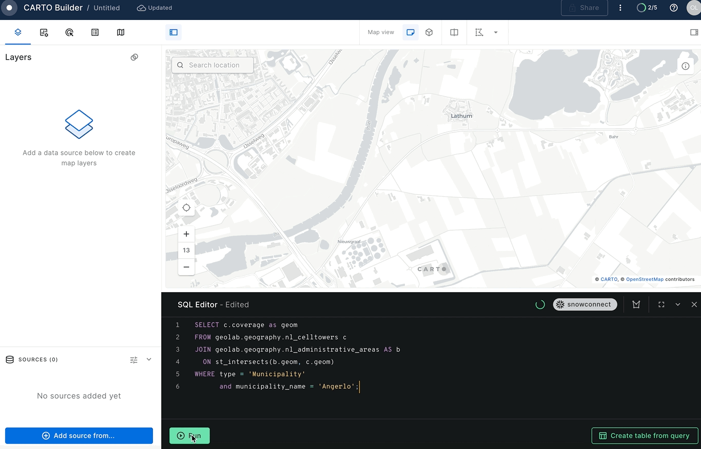

To calculate the coverage of each district by LTE network, you can create a user-defined Python function that calculates an aggregated union and uses the Shapely library under the hood. Run the following query from Snowflake Worksheets:

```
CREATE OR REPLACE FUNCTION geolab.geography.py_union_agg(g1 array)
RETURNS GEOGRAPHY
LANGUAGE PYTHON
RUNTIME_VERSION = 3.8
PACKAGES = ('shapely')
HANDLER = 'udf'
AS $$
from shapely.ops import unary_union
from shapely.geometry import shape, mapping
def udf(g1):
    shape_union = unary_union([shape(i) for i in g1])
    shape_union = shape_union.simplify(0.000001)
    return mapping(shape_union)
$$;
```

The function above gets an array of spatial objects and returns a single large shape which is a union of all initial shapes. Now run the following query from the CARTO Builder:

```
SELECT geolab.geography.py_union_agg(array_agg(st_asgeojson(c.coverage))) AS geom
FROM geolab.geography.nl_lte_with_coverage c
JOIN geolab.geography.nl_administrative_areas b 
  ON st_intersects(b.geom, c.geom)
WHERE type = 'Municipality'
AND municipality_name = 'Angerlo';
```
      
Note how the result of this function returns a single polygon covering the same area without overlaps.

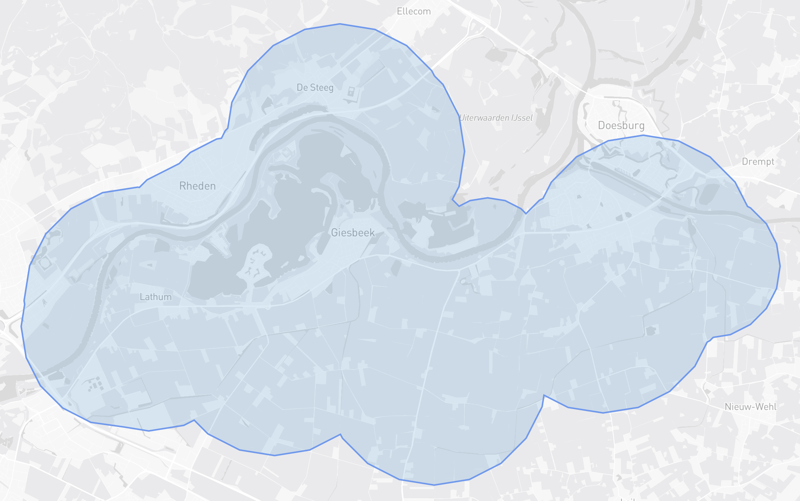

Let's now for every municipality compute the following:

* The area that is covered by the LTE network
* The numerical value of coverage ratio by the LTE network

Use the table `nl_lte_with_coverage`, and first join it with `nl_administrative_areas` using `ST_INTERSECTS` predicate to match cell towers to the municipalities they cover. Then you use `PY_UNION_AGG` to get a combined coverage polygon. Then use `ST_INTERSECTION` to find a portion of the municipality that is covered by the LTE signal. Then you compute the covered area in square meters. The result will be saved in the new table. To speed up queries against that newly created table, you will enable the search optimization feature.

Run the following two queries:

```
CREATE OR REPLACE TABLE geolab.geography.nl_municipalities_coverage AS
SELECT municipality_name,
       any_value(geom) AS municipality_geom,
       st_intersection(municipality_geom, 
                       geolab.geography.py_union_agg(array_agg(st_asgeojson(coverage)))) AS coverage_geom,
       round(st_area(coverage_geom)/st_area(municipality_geom), 2) AS coverage_ratio
FROM
  (SELECT c.coverage AS coverage,
          b.municipality_name AS municipality_name,
          b.geom
   FROM geolab.geography.nl_lte_with_coverage c
   INNER JOIN geolab.geography.nl_administrative_areas b 
      ON st_intersects(b.geom, c.coverage)
   WHERE TYPE = 'Municipality')
GROUP BY municipality_name
ORDER BY st_geohash(municipality_geom);

ALTER TABLE geolab.geography.nl_municipalities_coverage ADD SEARCH OPTIMIZATION ON GEO(municipality_geom);
```

Nice! Now you have a `nl_municipalities_coverage` table that contains the name of the municipality, the boundaries of that municipality, and the boundaries of the LTE coverage area. Let's visualize this in Carto. Paste the following query into the SQL editor and use the `coverage_ratio` column to color code the coverage areas.

```
SELECT coverage_geom AS geom,
       coverage_ratio
FROM geolab.geography.nl_municipalities_coverage;
```

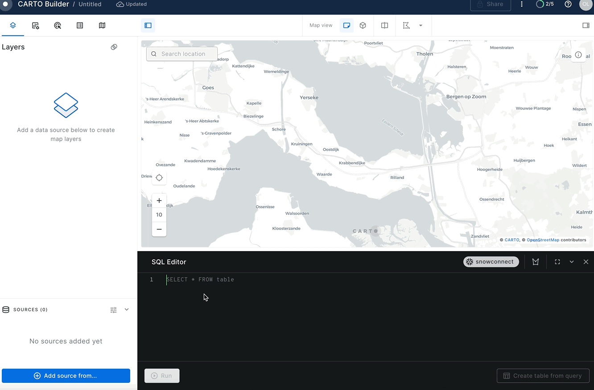

### What percent of the Dutch highways have LTE coverage?

Now imagine you want to calculate what percentage of highways in the Netherlands are covered by the LTE network. To get the number, you can employ the `Netherlands Open Map Data` dataset that has NL motorways.

> aside negative
>  At this point you need to use Open Street Map data for the Netherlands. If you had to skip importing this table because the data was not ready please go back to that step. The data should be available by now.

Run the following query in your Snowflake worksheet:

```
SELECT sum(st_length(st_intersection(coverage.coverage_geom, roads.geo_cordinates))) AS covered_length,
       sum(st_length(st_intersection(coverage.municipality_geom, roads.geo_cordinates))) AS total_length,
       round(100 * covered_length / total_length, 2) AS "Coverage, %"
FROM osm_nl.netherlands.v_road roads,
     geolab.geography.nl_municipalities_coverage coverage
WHERE st_intersects(coverage.municipality_geom, roads.geo_cordinates)
  AND roads.class in ('primary', 'motorway');
```

It seems your LTE network covers almost 100% of the highways. A good number to call out in a marketing campaign.

### Estimating the quality of LTE signal on Dutch highways

In the previous section you found that almost all highways in the Netherlands are within a range of LTE towers. But the LTE signal may have a different quality depending on how close the tower is or how many towers are in reach. The next question you may ask as an analysis is what motorways in the NL have poor signal quality. 

For this you need to build a signal decay model. You will use H3 to represent signal distribution around the cell towers. H3 functions from `CARTO’s Analytics Toolbox` will help us with that.

In the query below, the first CTE uses the `H3_FROMGEOGPOINT` function to compute the H3 cell id for each cell tower. It also estimates the distance in H3 cells around the tower based on the cell's range. The distance is calculated by dividing the `cell_range` by 400 meters, which represents the spacing between H3 cells at resolution 9.

Now that you know the H3 cell for each LTE tower you can find its neighboring H3 cells and estimate signal strength in them. First, you will apply the `H3_KRING` function to compute all neighboring H3 cells within a certain distance from a given H3 cell. Since `H3_KRING` yields an array, you must use the lateral join to flatten these arrays. Then you will create a decay function based on the H3 distance, so you need to determine the maximum H3 distance for each antenna. You can then group the data by H3 cell and choose the highest signal strength within that cell. Multiple towers can cover the same H3 cell multiple times; thus, you will select the one with the strongest signal.

The signal will range from 0 (poor) to 100 (strongest). The model multiplies the "starting signal strength" of 100 by the distance between the antenna and the H3 cell, and it adds more noise as the H3 cell is further away. 

Clustering by H3 will enable CARTO to execute queries faster, which is beneficial for visualization purposes.

Run the following query:

```
CREATE OR REPLACE TABLE geolab.geography.nl_lte_coverage_h3 AS
// First estimate compute H3 cells and estimate number of H3 cells within range
WITH nl_lte_h3 AS (
    SELECT row_number() OVER(ORDER BY NULL) AS id,
           cell_range,
           carto.carto.h3_fromgeogpoint(geom, 9) AS h3,
           round(least(cell_range, 2000) / 400)::int AS h3_cell_range
    FROM geolab.geography.nl_lte
),
// Find all neighboring cells and calculate signal strength in them
h3_neighbors AS (
  SELECT id,
         p.value::string AS h3,
         carto.carto.h3_distance(h3, p.value)::int AS h3_distance,
         // decay model for signal strength:
         100 * pow(1 - h3_distance / (h3_cell_range + 1), 2) AS signal_strength
  FROM nl_lte_h3,
       table(flatten(INPUT => CARTO.CARTO.H3_KRING(h3, h3_cell_range))) p)
SELECT h3, 
       // maximum signal strength with noise:
       max(signal_strength) * uniform(0.8, 1::float, random()) AS signal_strength
FROM h3_neighbors
GROUP BY h3
ORDER BY h3;
```

Now that you have created your signal decay model, let’s visualize it in CARTO. For that, you can just run the following query from the query console into a new map.

```
SELECT h3,
       signal_strength
FROM geolab.geography.nl_lte_coverage_h3;
```

> aside positive
>  Note that you don’t have a `GEOGRAPHY` on this query. This is because CARTO has native support of H3 and can show the H3 geography representation on the browser without the need to store and move the geography from the database to the browser. 

As you create an H3 layer you will need to configure the layer type from the query console:

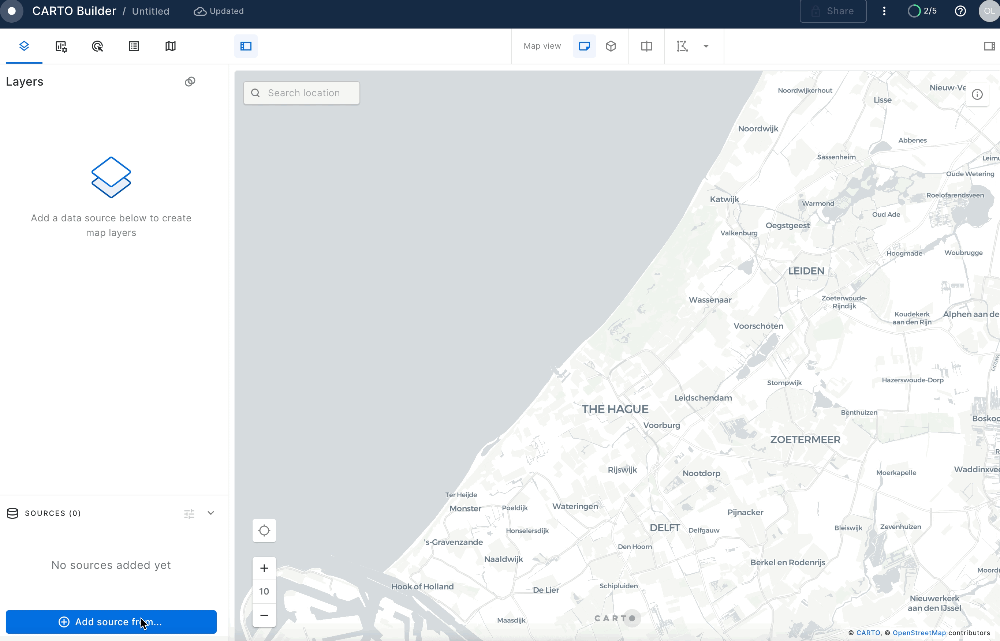

H3 layers allow us to show aggregated information at different resolutions for different zoom levels. Because of this, when you style the layer, you need to decide on an aggregation method for the attribute to show, in this example you will use `signal_strength`.

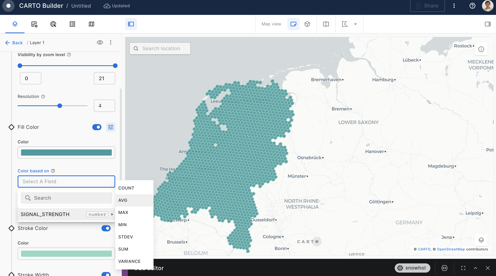

Remember to select a color palette of your liking and the color scale (the default is custom but you want to *Quantize* bins for this use case).
You can also change the relation between the zoom level and the resolution. The higher the resolution configuration, the more granularity you will see on the map but it will also take longer to load. Select resolution 5.

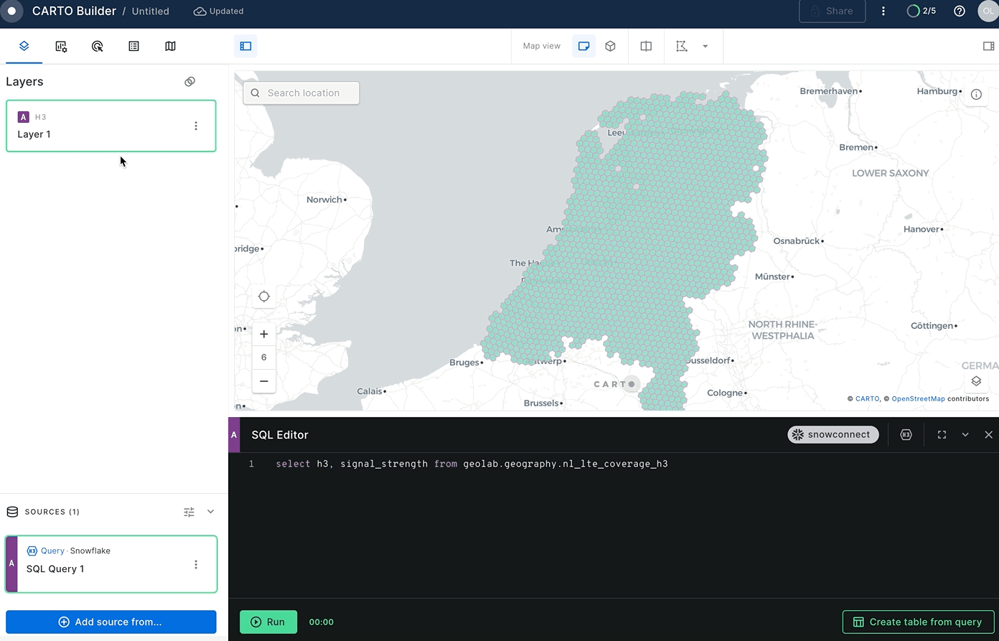

Let’s now use the road network from `NL Open Map Data` to see which road segments have good coverage and which do not.
To intersect the road layer with the H3 signal strength layer you need to find H3 cells covering all motorways in the NL.

The query below demonstrates one way of doing this. First, you split the road geometries into simple segments and compute the H3 index for in the middle of each segment. Then you aggregate all segments back. Run the following query:

```
CREATE OR REPLACE table geolab.geography.nl_roads_h3 AS 
// import roads from OSM:
WITH roads AS (
  SELECT row_number() over(ORDER BY NULL) AS road_id,
        geo_cordinates AS geom
  FROM OSM_NL.NETHERLANDS.V_ROAD roads
  WHERE class IN ('primary', 'motorway')
    AND st_dimension(geo_cordinates) = 1
),
// In order to compute H3 cells corresponding to each road you need to first
// split roads into the line segments. You do it using the ST_POINTN function
segments AS (
  SELECT road_id,
          value::integer AS segment_id,
          st_makeline(st_pointn(geom, segment_id), st_pointn(geom, segment_id + 1)) AS SEGMENT,
          geom,
          carto.carto.h3_fromgeogpoint(st_centroid(SEGMENT), 9) AS h3_center
  FROM roads,
       LATERAL flatten(array_generate_range(1, st_npoints(geom)))) 
// Next table build the H3 cells covering the roads
// For each line segment you find a corresponding H3 cell and then aggregate by road id and H3
// At this point you switched from segments to H3 cells covering the roads.
SELECT road_id,
       h3_center AS h3,
       any_value(geom) AS road_geometry
FROM segments
GROUP BY 1, 2
ORDER BY h3;
```

If you visualize table `GEOLAB.GEOGRAPHY.NL_ROADS_H3` in CARTO Builder (`Add Source From` → `Data Explorer`) you will see tessellated roads.

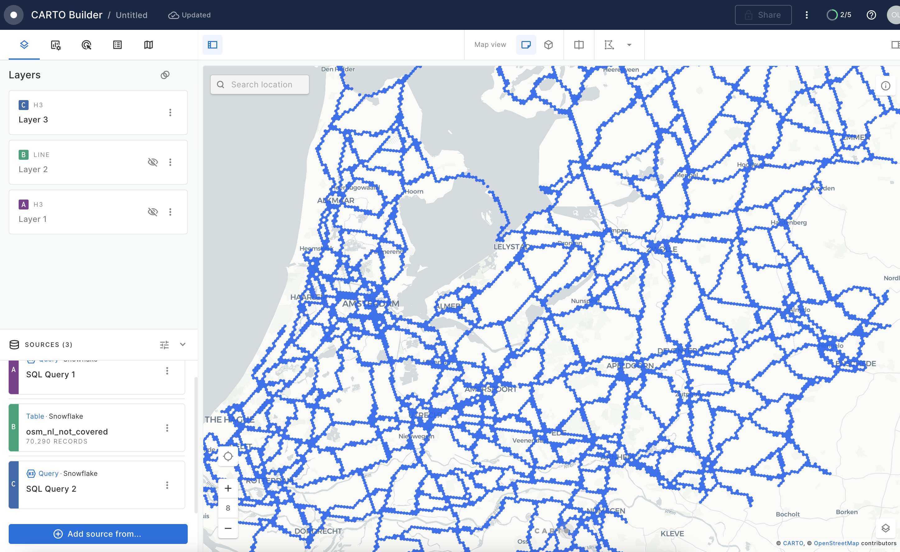

Now you use the signal decay model that you built previously to estimate the average signal along each highway. For this you need to join two tables (tessellated highways and the signal strength) using H3 cell id and aggregate the result by road id.

Run the following two queries.

```
CREATE OR REPLACE TABLE geolab.geography.osm_nl_not_covered AS
SELECT road_id,
       any_value(road_geometry) AS geom,
       avg(ifnull(signal_strength, 0.0)) AS avg_signal_strength,
       iff(avg_signal_strength >= 50, 'OK Signal', 'No Signal') AS signal_category
FROM geolab.geography.nl_roads_h3 roads_h3
LEFT JOIN geolab.geography.nl_lte_coverage_h3 cells ON roads_h3.h3 = cells.h3
GROUP BY road_id
ORDER BY st_geohash(geom);

ALTER TABLE geolab.geography.osm_nl_not_covered ADD SEARCH OPTIMIZATION ON GEO(geom);
```

Now that you have classified road segments by signal and no signal, you can run the following simple query to get the length of each geography in meters:

```
SELECT signal_category,
       SUM(ST_LENGTH(geom)/1000)::int AS total_km
FROM geolab.geography.osm_nl_not_covered
GROUP BY signal_category;
```

You now know that you have 13,938 km with good coverage and 2,331 with poor/no coverage. Interestingly, that is about 15 % of the NL roads!

Lastly, with this layer, you can add it to your CARTO map and visualize the road segment according to the `SIGNAL_CATEGORY` feature you created.

For this, you can add the layer via `Add source from` → `Data Explorer`. Then select your connection and the `GEOLAB.GEOGRAPHY.OSM_NL_NOT_COVERED` table.

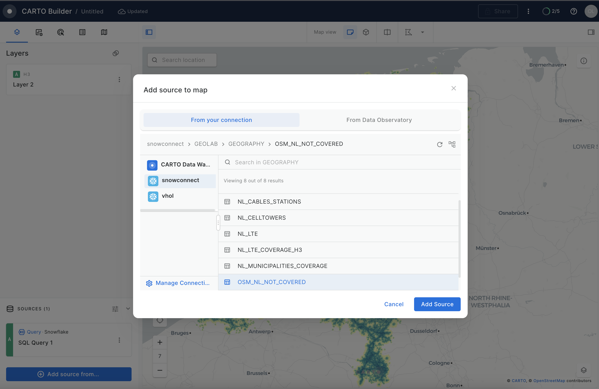

Once you have your second layer on the map, you can click on it to style it and show the stroke color based on your `SIGNAL_CATEGORY` column. To do that, create a “Custom palette” with just two colors: gray for roads with good signal and red for roads with no/poor signal.


> aside positive
>  You may feel that these last several queries were a bit long and repetitive, but remember that the intention of this guide was to walk you through the progression of building these longer, more complicated queries by illustrating to you what happens at each step through the progression. By understanding how functions can be combined, it helps you to understand how you can do more advanced things with Snowflake geospatial features!

## Conclusion

In this guide, you acquired geospatial data from the Snowflake Marketplace, explored how the GEOMETRY data type works and how it differs from the GEOGRAPHY. You converted one data type into another and queried geospatial data using parser, constructor, transformation, calculation and H3 functions on single tables and multiple tables with joins. You then saw how geospatial objects could be visualized using CARTO.

You are now ready to explore the larger world of Snowflake geospatial support and geospatial functions.

### What we've covered
* How to acquire a shared database from the Snowflake Marketplace and from External and internal storages.
* The GEOMETRY data type, its formats GeoJSON, WKT, EWKT, WKB, and EWKB, and how to switch between them.
* How to use constructors like TO_GEOMETRY, ST_MAKELINE.
* How to reproject between SRIDs using ST_TRANSFORM.
* How to perform relational calculations like ST_DWITHIN and ST_INTERSECTS.
* How to perform measurement calculations like ST_LENGTH.
* How to use set operations like ST_INTERSECTION.
* How to use Python UDFs for reading Shapefiles and creating custom functions.
* How to use Spatial grid and H3 functions like H3_FROMGEOGPOINT, H3_KRING, H3_POLYFILL.
* How to use Search Optimization to speed up geospatial queries.

### Related Resources
* [Geospatial Analytics for Retail with Snowflake and CARTO](https://quickstarts.snowflake.com/guide/geospatial_analytics_with_snowflake_and_carto_ny/index.html)
* [Geospatial Analytics for Telecom with Snowflake and CARTO](https://quickstarts.snowflake.com/guide/geo_analysis_telecom/index.html)