author: Oleksii Bielov
id: geo_analysis_telecom
summary: Geospatial Analysis for Telecom with Snowflake and Carto
categories: Getting-Started
environments: web
status: Published 
feedback link: https://github.com/Snowflake-Labs/sfguides/issues
tags: Getting Started, Data Science, Data Engineering, Twitter 

# Geospatial Analytics for Telecom with Snowflake and Carto
<!-- ------------------------ -->
## Overview 

Duration: 10

Geospatial query capabilities in Snowflake are built upon a combination of data types and specialized query functions that can be used to parse, construct, and run calculations over geospatial objects. This guide will introduce you to the `GEOGRAPHY` data type, help you understand geospatial formats supported by Snowflake, walk you through the use of a variety of functions on a sample geospatial data set from the Snowflake Marketplace, and show you how to analyze and visualize your Snowflake data using CARTO’s Analytics Toolbox. 


### Prerequisites
* Quick Video [Introduction to Snowflake](https://www.youtube.com/watch?v=fEtoYweBNQ4&ab_channel=SnowflakeInc.)
* Snowflake [Data Loading Basics](https://www.youtube.com/watch?v=us6MChC8T9Y&ab_channel=SnowflakeInc.) Video
* [CARTO in a nutshell ](https://docs.carto.com/getting-started/carto-in-a-nutshell)web guide
* [CARTO Spatial Extension for Snowflake](https://www.youtube.com/watch?v=9W_Attbs-fY) video 

### What You’ll Learn
* How to acquire geospatial data from the Snowflake Marketplace
* How to connect Snowflake and Carto 
* How to load geospatial data
* How to interpret the `GEOGRAPHY` data type
* How to understand the different formats that `GEOGRAPHY` can be expressed in
* How to do spatial analysis to understand the mobile coverage in the UK

### What You’ll Need
* A supported Snowflake [Browser](https://docs.snowflake.com/en/user-guide/setup.html)
* Sign-up for a [Snowflake Trial](https://signup.snowflake.com/)  OR have access to an existing Snowflake account with the `ACCOUNTADMIN` role or the `IMPORT SHARE `privilege. Pick the Enterprise edition, AWS as a cloud provider and US East (Northern Virginia) or EU (Frankfurt) as a region.
* Sign-up for a  [CARTO Trial](http://app.carto.com/signup) (OR  have access to an existing CARTO account). Pick the same region (continent) as for the Snowflake account.

### What You’ll Build
A sample use case that involves LTE cell towers in the United Kingdom. You will answer the following questions:
* What districts in the UK have good/poor LTE coverage?
* How the strenght of the LTE signal is distributed.
* What UK motorways are poorly or not covered by LTE network.


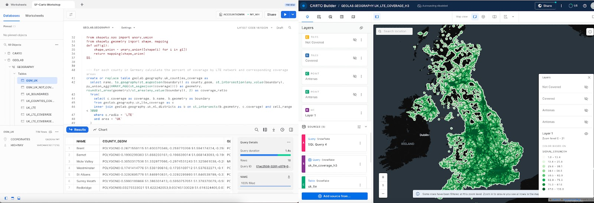

<!-- ------------------------ -->
## Setup your Account

[app.snowflake.com](https://app.snowflake.com/)

If this is the first time you are logging into the Snowflake UI, you will be prompted to enter your account name or account URL that you were given when you acquired a trial. The account URL contains your [account name](https://docs.snowflake.com/en/user-guide/connecting.html#your-snowflake-account-name) and potentially the region. You can find your account URL in the email that was sent to you after you signed up for the trial.

Click `Sign-in` and you will be prompted for your user name and password.

> aside positive
>  If this is not the first time you are logging into the Snowflake UI, you should see a "Select an account to sign into" prompt and a button for your account name listed below it. Click the account you wish to access and you will be prompted for your user name and password (or another authentication mechanism).

### Increase Your Account Permission
The Snowflake web interface has a lot to offer, but for now, switch your current role from the default `SYSADMIN` to `ACCOUNTADMIN`. This increase in permissions will allow you to create shared databases from Snowflake Marketplace listings.

> aside positive
>  If you don't have the `ACCOUNTADMIN` role, switch to a role with `IMPORT SHARE` privileges instead.


### Create a Virtual Warehouse

You will need to create a Virtual Warehouse to run queries.

- Navigate to the `Admin > Warehouses` screen using the menu on the left side of the window
- Click the big blue `+ Warehouse` button in the upper right of the window
- Create an Large Warehouse as shown in the screen below

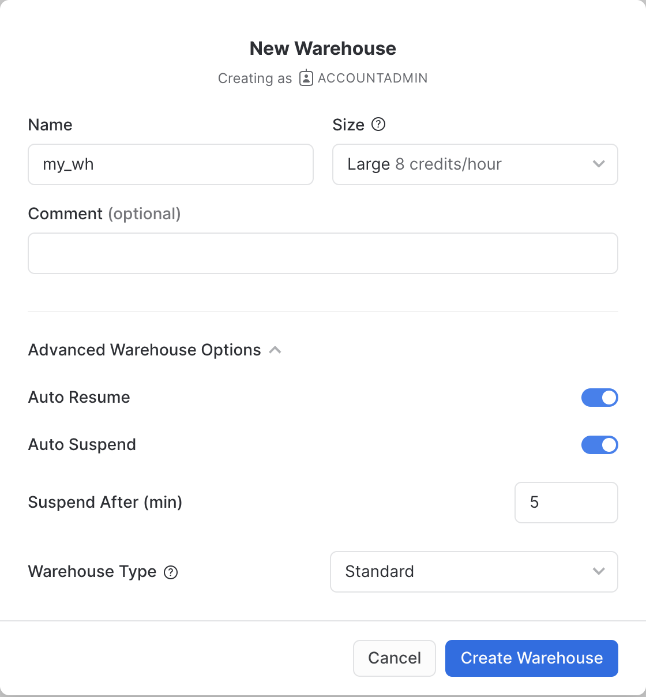

Be sure to change the `Suspend After (min)` field to 5 min to avoid wasting compute credits.

### Acknowledge the Snowflake Third Party Terms

In order to use the packages provided by Anaconda inside Snowflake, you must acknowledge the Snowflake Third Party Terms.

* Select Admin » Billing & Terms.
* In the Anaconda section, select Enable.
* In the Anaconda Packages dialog, click the link to review the Snowflake Third Party Terms page.
* If you agree to the terms, select `Acknowledge & Continue`.

### Connection Snowflake and Carto

Let's connect your Snowflake to CARTO so you can run and visualize the queries in the following exercises of this workshop.

Access the CARTO Workspace: [app.carto.com](http://app.carto.com/)

Go to the Connections section in the Workspace, where you can find the list of all your current connections.

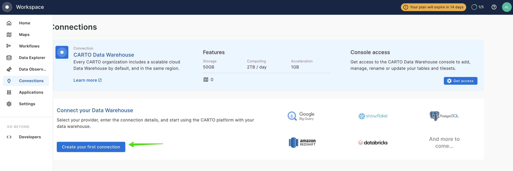

To add a new connection, click on `New connection` and follow these steps:

1. Select Snowflake.
2. Click the `Setup connection` button.
3. Enter the connection parameters and credentials.

These are the parameters you need to provide:

- **Name** for your connection: You can register different connections with the Snowflake connector. You can use the name to identify the connections.
- **Username**: Name of the user account.
- **Password**: Password for the user account.
- **Account**: Hostname for your account . One way to get it is to check the Snowflake activation email which contains the account_name within the URL ( <account_name>.snowflakecomputing.com ). Just enter what's on the account_name, i.e ok36557.us-east-2.aws
- **Warehouse (optional)**: Default warehouse that will run your queries. Use MY_WH.

> aside negative
>  Use MY_WH or the name of the data warehouse you created in the previous step otherwise some queries will fail because CARTO won't know which warehouse to run them against.

- **Database (optional)**. Default database to run your queries. Use GEOLAB.
- **Role (optional)**. Default Role to run your queries. Use ACCOUNTADMIN.


Once you have entered the parameters, you can click the Connect button. CARTO will try to connect to your Snowflake account. If everything is OK, your new connection will be registered.

## Get Data and Analytics Toolbox

Duration: 20

The first step in the guide is to acquire geospatial data sets that you can freely use to explore the basics of Snowflake's geospatial functionality.  The best place to acquire this data is the Snowflake Marketplace!  

To try various ways to load spatial data, we will also be accessing another two datasets that are hosted on a public S3 bucket. 

And we will also be accessing another asset from the Snowflake Marketplace: The CARTO Analytics Toolbox - a composed set of user-defined functions that extend the geospatial capabilities of Snowflake. The listing gives you access to Open Source modules supporting different spatial indexes and other operations: quadkeys, H3, S2, placekey, geometry constructors, accessors, transformations, etc.

### Acquire Data from the Snowflake Marketplace
Now you can acquire sample geospatial data from the Snowflake Marketplace.
* Navigate to the `Marketplace` screen using the menu on the left side of the window
* Search for` OpenCelliD` in the search bar
* Find and click the` OpenCelliD - Open Database of Cell Towers` tile

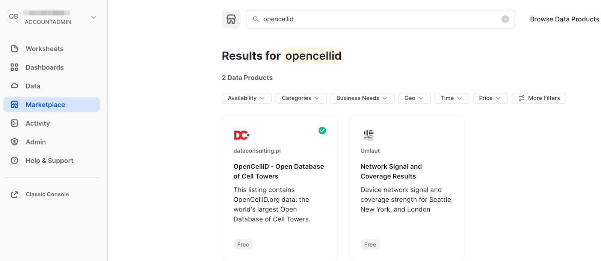

* Once in the listing, click the big blue `Get` button

> aside negative
>  On the `Get` screen, you may be prompted to complete your `user profile` if you have not done so before. Click the link as shown in the screenshot below. Enter your name and email address into the profile screen and click the blue `Save` button. You will be returned to the `Get` screen.

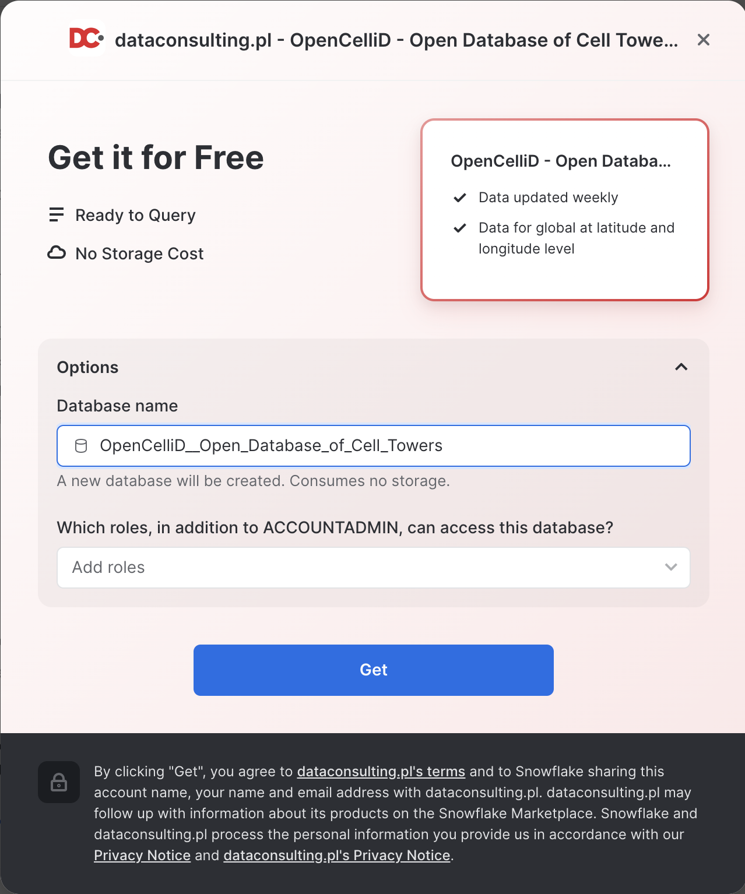

* On the `Get Data` screen, change the name of the database from the default to `OPENCELLID`, as this name is shorter, and all future instructions will assume this name for the database.


Congratulations! You have just created a shared database from a listing on the Snowflake Marketplace. 

Similarly to the above dataset, search and get the `UK Open Map Data - Sonra` dataset from the Marketplace and rename it to `osm_uk`.

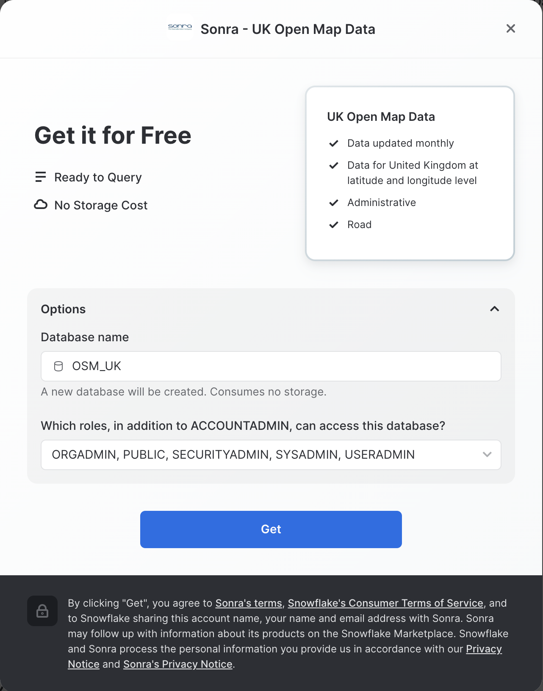

### Install CARTO Analytics Toolbox from the Snowflake Marketplace

Now you can acquire CARTO’s Analytics Toolbox from the Snowflake Marketplace. This will share UDFs (User defined functions) to your account that will allow you to perform even more geospatial analytics. 

* Similar to how you did with the data in the previous steps, navigate to the `Marketplace` screen using the menu on the left side of the window
* Search for` CARTO` in the search bar


* Find and click the` Analytics Toolbox`  tile 


* Click on big blue` Get`  button 
* In the options, name the database `CARTO` and optionally add more roles that can access the database 

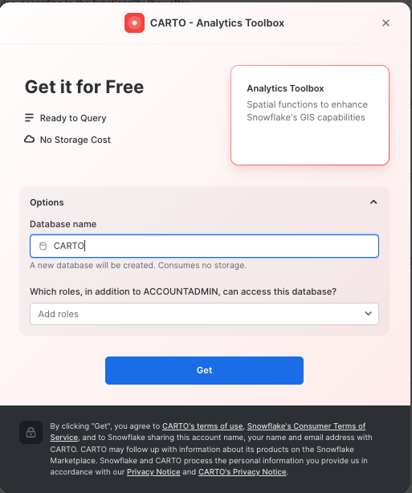

* Click on `Get` and then `Done`. 

Congratulations! Now you have data and the analytics toolbox! 


### Load Datasets from a local file

Now that you understand how to get data from Marketplace, let's try another way of getting data, namely, getting it from the external S3 storage. 

In this step, we're going to load data into the table from the local file. In this Quickstart, we will use a dataset with the districts' boundaries of the United Kingdom and the Netherlands, you can download the file using [this URL](https://sfquickstarts.s3.us-west-1.amazonaws.com/vhol_spatial_analysis_geometry_geography/uk_nl_districts.csv).

First, create a new database and schema where we will store datasets in the Geography data type.


```
create or replace DATABASE GEOLAB;
CREATE OR REPLACE schema GEOLAB.GEOGRAPHY;

```

As a second step, you will create an empty table where we will store boundary data.

```
create or replace TABLE GEOLAB.GEOGRAPHY.UK_NL_DISTRICTS (
	AREA VARCHAR(16777216),
	NAME VARCHAR(16777216),
	GEOMETRY GEOGRAPHY);
```

Then click `Refresh` in the sidebar, navigate to the newly created table, right-click on it, and select "Load data".

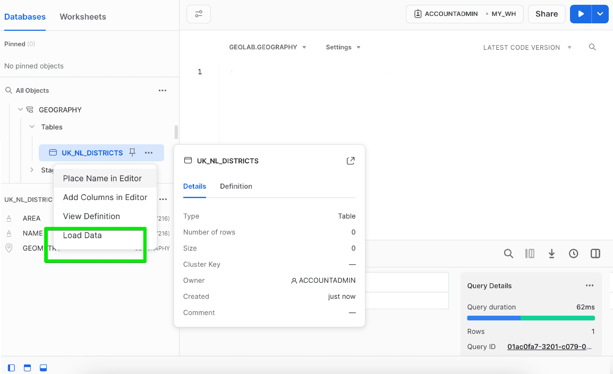


In the pop-up, choose the file you want to upload and click the Next button. When it suggests selecting the file format and some other parameters, pick the values as shown below and click the Next button one more time:

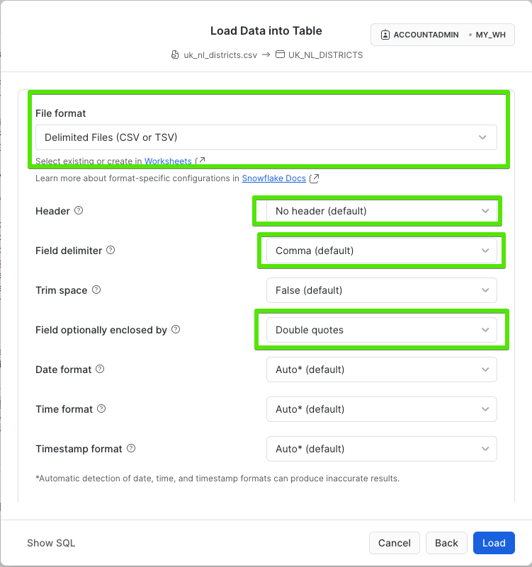

Voila! Now you have a table with the boundaries of districts in the UK and the Netherlands.

<!-- ------------------------ -->
## Understand Geospatial Types and Formats

Duration: 20

Now we will run different queries to understand how the `GEOGRAPHY` data type works in Snowflake. Navigate to the query editor by clicking on  `Worksheets`  on the top left navigation bar. 


### Open a New Worksheet and Choose Your Warehouse

* Click the + Worksheet button in the upper right of your browser window. This will open a new window.
* In the new Window, make sure `ACCOUNTADMIN` and `MY_WH` (or whatever your warehouse is named) are selected in the upper right of your browser window.


Now you are ready to discover the data types.

### The GEOGRAPHY data type

Snowflake's `GEOGRAPHY` data type is similar to the `GEOGRAPHY` data type in other geospatial databases in that it treats all points as longitude and latitude on a spherical earth instead of a flat plane. This is an important distinction from other geospatial types (such as `GEOMETRY`). More information about Snowflake's specification can be found [here](https://docs.snowflake.com/en/sql-reference/data-types-geospatial.html).

Look at one of the tables in the shared database which has a `GEOGRAPHY` column by running the following queries. Copy & paste the SQL below into your worksheet editor, put your cursor somewhere in the text of the query you want to run (usually the beginning or end), and either click the blue "Play" button in the upper right of your browser window, or press `CTRL+Enter` or `CMD+Enter` (Windows or Mac) to run the query.


```
// Set the working database schema
use schema geolab.geography;
```

The [use schema](https://docs.snowflake.com/en/sql-reference/sql/use-schema.html) command sets the active database.schema for your future queries so you do not have to fully qualify your objects.


```
// Describe the uk_nl_districts table
desc view uk_nl_districts;
```

The [desc or describe](https://docs.snowflake.com/en/sql-reference/sql/desc.html) command shows you the definition of the view, including the columns, their data type, and other relevant details. Notice the `geometry` column is defined as `GEOGRAPHY` type. 


### View GEOGRAPHY Output Formats

Snowflake supports 3 primary geospatial formats and 2 additional variations on those formats. They are:

* **GeoJSON**: a JSON-based standard for representing geospatial data
* **WKT & EWKT**: a "Well Known Text" string format for representing geospatial data and the "Extended" variation of that format
* **WKB & EWKB:** a "Well Known Binary" format for representing geospatial data in binary and the "Extended" variation of that format

These formats are supported for ingestion (files containing those formats can be loaded into a `GEOGRAPHY` typed column), query result display, and data unloading to new files. You don't need to worry about how Snowflake stores the data under the covers but rather how the data is displayed to you or unloaded to files through the value of session variables called `GEOGRAPHY_OUTPUT_FORMAT`.

Run the queries below to make sure the current format is GeoJSON.


```
// Set the output format to GeoJSON
alter session set geography_output_format = 'GEOJSON';
```

The [alter session](https://docs.snowflake.com/en/sql-reference/sql/alter-session.html) command lets you set a parameter for your current user session, which in this case is  `GEOGRAPHY_OUTPUT_FORMAT`. The default value for those parameters is `'GEOJSON'`, so normally you wouldn't have to run this command if you want that format, but this guide wants to be certain the next queries are run with the `'GEOJSON'` output.

Now run the following query against the `UK_NL_DISTRICTS` table.


```
// Query the uk_nl_districts table for districts areas of the UK
select name, geometry from geolab.geography.uk_nl_districts where area = 'UK' limit 25;
```

In the result set, notice the `geometry` column and how it displays a JSON representation of spatial objects. It should look similar to this:

```
{"coordinates": [[[-0.171180, 51.92825], [-0.167960, 51.92795], .. [-0.171180, 51.92825]]],  "type": "Polygon"}
```

Notice that in the result set coordinates represented as pairs of longitude and latitude:

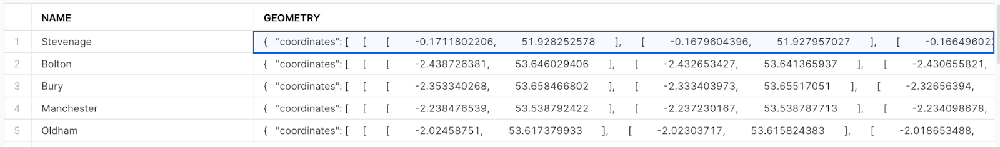

Now look at the same query but in a different format. Run the following query:


```
// Set the output format to EWKT
alter session set geography_output_format = 'EWKT';

```

Run the previous queries again and when done, examine the output in the `geometry` column.

```
select name, geometry from geolab.geography.uk_nl_districts where area = 'UK' limit 25;
```


EWKT looks different than GeoJSON, and is arguably more readable. Here you can more clearly see the [geospatial object types](https://docs.snowflake.com/en/sql-reference/data-types-geospatial.html#geospatial-object-types), which are represented below in the example output:


```
SRID=4326;POLYGON((-0.1711802206 51.928252578,-0.1679604396 51.927957027,..., -0.1711802206 51.928252578))
```


EWKT also shows spatial reference identifier and since in GEOGRAPHY [we use SRID 4326](https://docs.snowflake.com/en/sql-reference/data-types-geospatial#geography-data-type), you would always see this SRID.

Lastly, look at the WKB output. Run the following query:


```
// Set the output format to WKB
alter session set geography_output_format = 'WKB';
```

And run the query again, and click on a cell in the `geometry` column.

```
select name, geometry from geolab.geography.uk_nl_districts where area = 'UK' limit 25;
```

Notice how WKB is incomprehensible to a human reader. However, this format is handy in data loading/unloading, as it can be more compact than WKB or GeoJSON.

## Spatial Analysis

Duration: 20

Now that you have a basic understanding of how the `GEOGRAPHY` data type works and what a geospatial representation of data looks like in various output formats, it's time to walkthrough a scenario that requires you to run and visualize geospatial queries to answer some questions.


### Find My Location

Pretend you are an analyst working for a telecommunication company, and you need to do an analysis around coverage of the United Kingdom by your mobile network. You will start with simple data discovery and then try to answer more complex analytical questions.

Start with running a query that represents your current location. This location has been preselected for the guide and represents the location of the Royal Geographical Society in London. Run this query in the Snowlake editor:


```
select to_geography('POINT(-0.175121 51.50136)');
```


Notice there is no `from` clause in this query, which allows you to construct a `GEOGRAPHY` object in a simple `select` statement.


> aside negative
>  POINT(-0.175121 51.50136) is already a geography object in WKT format, so there was no real need to convert it again, but it was important to show the most basic way to use TO_GEOGRAPHY to construct a simple geography object.

Now let’s do the query in CARTO Builder to see where the point is.


* Create a new map. Use the navigation menu on the left to get to Maps and then click on (+) New Map.

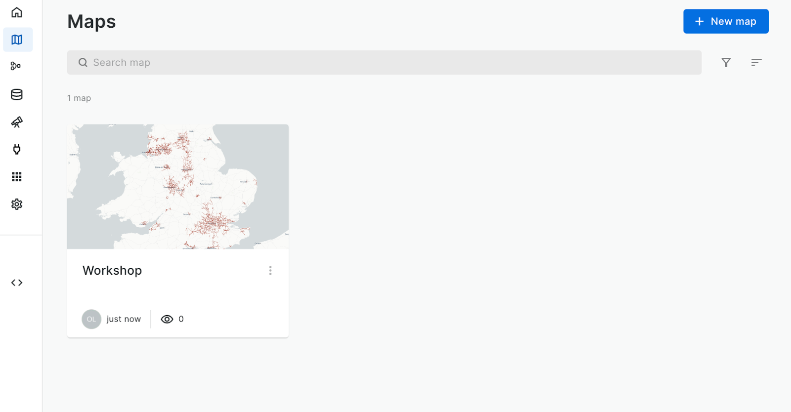

* Click on the “Add Source From”

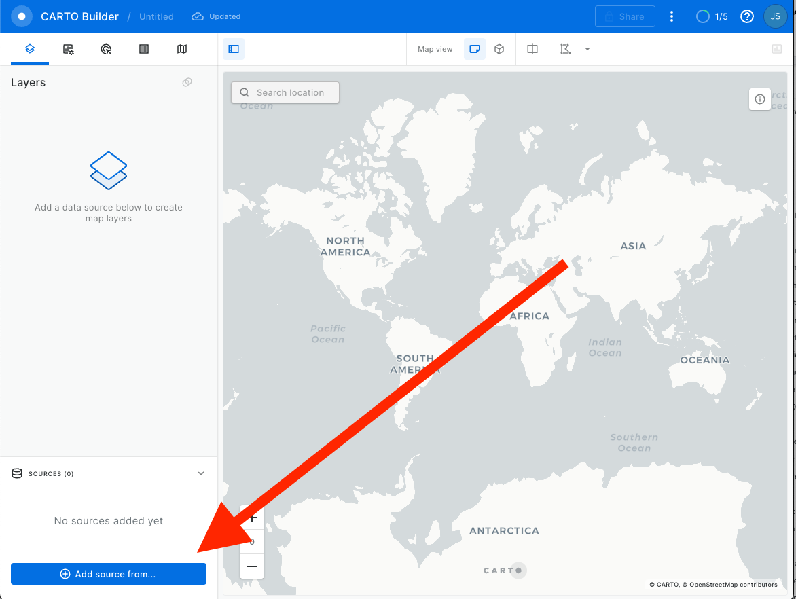

* Then click on `Custom Query` and make sure you have selected Snowflake Connection that  you have created in previous steps. 

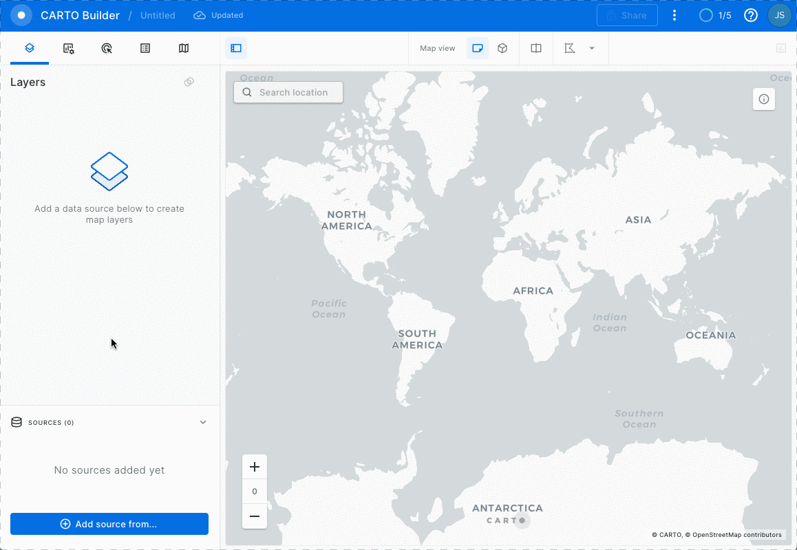


* Now paste the query and click on the green `Run` button. 

```
select to_geography('POINT(-0.175121 51.50136)') as geom;
```

> aside negative
>  CARTO requires that the column containing geospatial data be named geom so that is why we add it as geom in the query. If you don't do this it will fail. 

* Use the map zoom controls (+/- buttons) and click the zoom in (+) button until you can see the point better. You should see something like the screenshot below, though you may see more depending on your browser window size. 

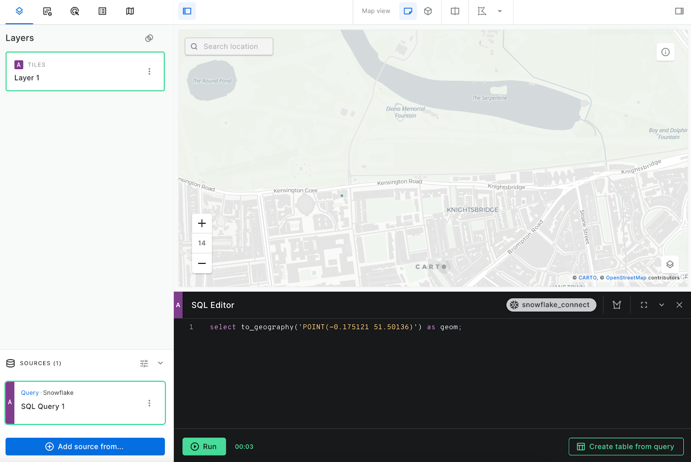


> aside positive
>  Feel free to use this as your SQL Editor for the next steps, you can delete and re-run the queries from the workshop here. 

The green dot represents the `POINT` object location. Now you know where you are!

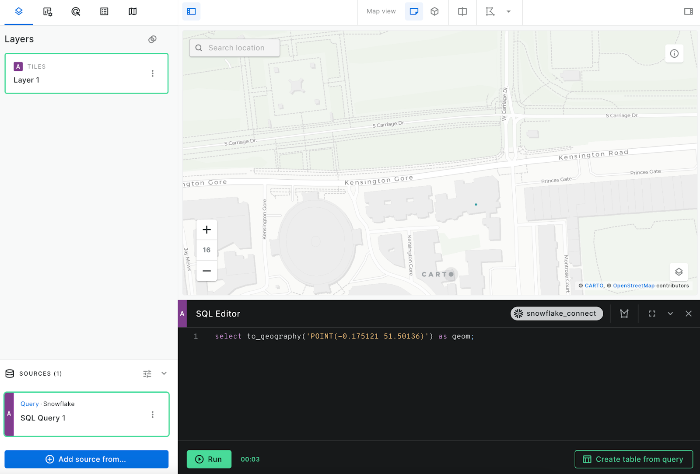


### Find the Nearest Cell Towers

In the next step, you are going to use the Marketplace listing with the location of cell towers across the world and will run a query to find the ten closest LTE cell towers to your current location from above. This query will do several things:

* It will use the `ST_DWITHIN` function in the `where` clause to filter out cell towers that aren't within the stated distance. The function takes two points and a distance to determine whether those two points are less than or equal to the stated distance from each other, returning `true` if they are and `false` if they are not. In this function, you will use the `lat` and `lon` columns from OPENCELLID.PUBLIC.RAW_CELL_TOWERS table to construct GEOGRAPHY objects and compare them to your current location `POINT`, which you will construct using the previously used `TO_GEOGRAPHY`. You will then use 500 meters for the distance value.
    * Note that in the query below, the syntax `ST_DWITHIN(...) = true` is used for readability, but the `= true` is not required for the filter to work. It is required if you were to need an `= false` condition.
* It will also use the `ST_DISTANCE` function, which actually gives you a value in meters representing the distance between the two points. When combined with `order by` and `limit` clauses, this will help you return only a certain number of rows with the smallest distance or closest.
    * Also note in this query we use two types of constructors: `TO_GEOGRAPHY` which is is a general-purpose constructor and `ST_POINT` constructor, which specifically makes a `POINT` object. Sometimes there is more than one valid approach to construct a geospatial object.

Run the following query: 


```
// calculate the distance between your location and closest cell towers 
SELECT DISTINCT ST_POINT(lon, lat) AS geom, 
// Use st_distance TO calculate the distance between your locatoin and closest cell towers 
st_distance(geom, to_geography('POINT(-0.175121 51.50136)'))::number(6, 2) AS distance_meters
FROM OPENCELLID.PUBLIC.RAW_CELL_TOWERS 
// Filter for cell towers that have the UK country code
WHERE mcc in ('234', '235')
// Filter for LTE towers
and radio = 'LTE'
// Filter for cell towers that are within 500 meters
and st_dwithin(geom, TO_GEOGRAPHY('POINT(-0.175121 51.50136)'), 500) = TRUE 
// ORDER the results BY the calculated distance and only return the ten lowest
ORDER BY 2 ASC
LIMIT 10;
```

The query returns `POINT` objects, which you can visualize using CARTO.

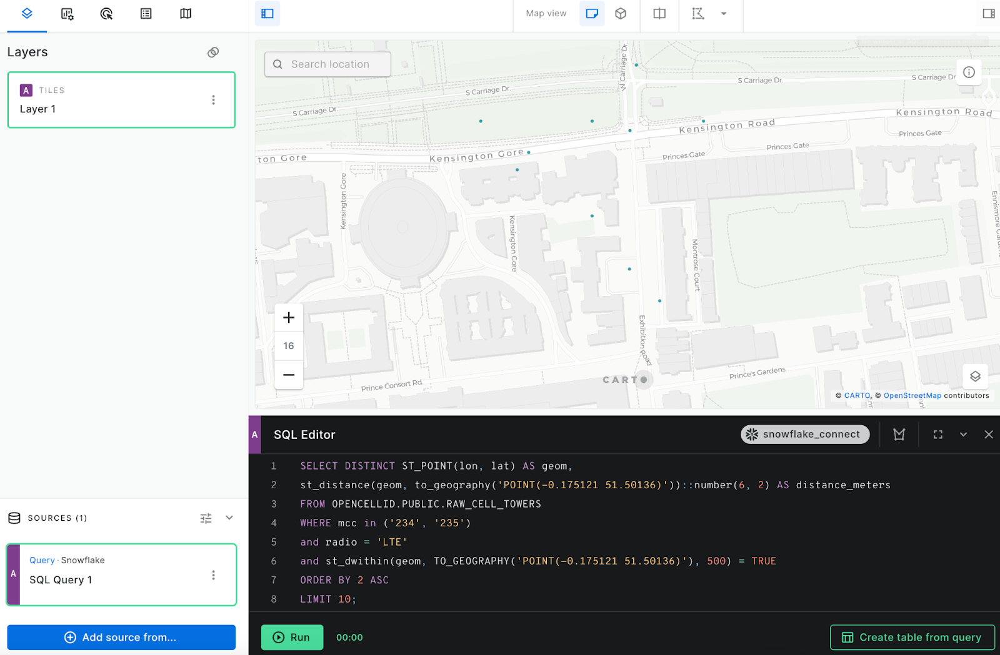

In the previous section you've found the closest cell towers to your location. But what about answering more sophisticated questions, like what areas in the UK have very good and bad coverage by LTE network? You can use geospatial functions combined with spatial join to find out.

### What districts in the UK have good/poor LTE coverage?

You have been using one table in your queries so far: `RAW_CELL_TOWERS`, which stores the locations of cell towers. To find UK districts with good and bad coverage by LTE network, we will undertake a two-step process as follows:

* For every LTE cell tower, we will calculate the coverage area.
* For every UK district, calculate the area covered by LTE network.

`ST_BUFFER` from the Carto toolbox can be used to calculate the coverage area for each LTE cell tower. In `RAW_CELL_TOWERS` table, there is a field _cell_range_ which can be used as a value of radius in ST_BUFFER. Since the maximum coverage area of the LTE tower is about 6km, we will cap the coverage area with this value.

Run the following query in your Snowflake's worksheet: 

```
CREATE OR REPLACE TABLE geolab.geography.uk_lte_coverage AS
SELECT radio, cell_range,
       carto.carto.st_buffer(st_makepoint(lon, lat), least(cell_range, 6000), 5) AS coverage
FROM OPENCELLID.PUBLIC.RAW_CELL_TOWERS 
where mcc in ('234', '235')
and radio = 'LTE';
```


Now there is a table `UK_LTE_COVERAGE` with areas that correspond to the coverage areas of the cell towers. 

To calculate the coverage of each district by LTE network, you can create a user-defined Python function that calculates an aggregated union and uses the Shapely library under the hood. 

Run the following query:


```
CREATE OR REPLACE FUNCTION PY_UNION_AGG(g1 array)
returns geography
language python
runtime_version = 3.8
packages = ('shapely')
handler = 'udf'
AS $$
from shapely.ops import unary_union
from shapely.geometry import shape, mapping
def udf(g1):
    shape_union = unary_union([shape(i) for i in g1])
    return mapping(shape_union)
$$;
```

The function above gets an array of spatial objects and "dissolves" them in one large shape which is a union of all initial shapes.

Let's now for every district compute the following:

* The area that is covered by the LTE network
* The numerical value of coverage ratio by the LTE network

Use the previously created table `UK_LTE_COVERAGE`, and first join it with `UK_NL_DISTRICTS` using `ST_CONTAINS` predicate. Then use `ST_INTERSECTION` to find an intersection of each district with the coverage area in that district. The result will be saved in the new table. To speed up queries against that newly created table, you will enable the search optimization feature.

Run the following two queries:

```
CREATE OR REPLACE TABLE geolab.geography.uk_districts_coverage AS
SELECT name,
       to_geography(st_asgeojson(boundary)) AS county_geom,
       st_intersection(any_value(boundary), py_union_agg(ARRAY_AGG(st_asgeojson(coverage)))) AS geometry,
       round(st_area(geometry)/st_area(any_value(boundary)), 2) AS coverage_ratio
FROM
  (SELECT c.coverage AS coverage,
          b.name,
          b.geometry AS boundary
   FROM geolab.geography.uk_lte_coverage AS c
   INNER JOIN geolab.geography.uk_nl_districts AS b ON st_intersects(b.geometry, c.coverage)
   AND cell_range < 3000
   WHERE c.radio = 'LTE'
     AND area = 'UK' )
GROUP BY name,
         st_asgeojson(boundary)
ORDER BY st_geohash(geometry);

ALTER TABLE geolab.geography.uk_districts_coverage ADD SEARCH OPTIMIZATION ON GEO(geometry);
```

Nice! Now you have a `UK_DISTRICTS_COVERAGE` table that contains the name of the area, the boundaries of that area, and the boundaries of the LTE coverage area. Let's vizualize it in Carto. Paste the following query into the SQL editor and use `COVERAGE_RATIO` column to color code the coverage areas.

```
SELECT geometry AS geom,
       coverage_ratio
FROM geolab.geography.uk_districts_coverage;
```

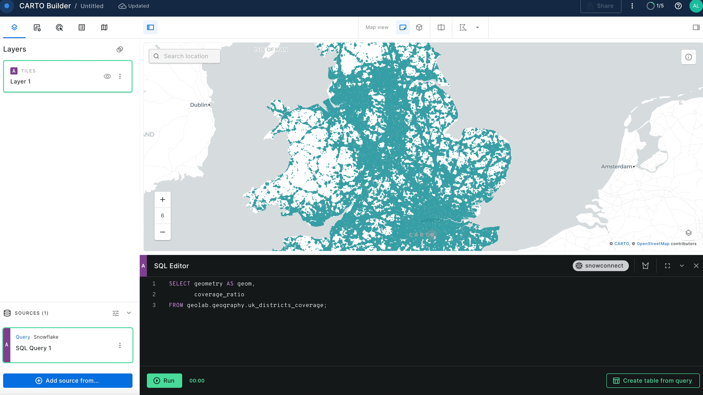

### What percent of the UK roads have LTE coverage?

Now imagine you want to calculate what percentage of motorways in the UK have coverage by our network. To get the number, you can employ the dataset with Open StreetMaps data in the UK.

Run the foillowing query in your Snowflake worksheet:


```
SELECT round(100*sum(st_length(st_intersection(coverage.geometry, roads.geo_cordinates)))/
               (SELECT sum(st_length(geo_cordinates))
                FROM OSM_UK.UNITED_KINGDOM.V_ROAD  roads where class = 'motorway'), 2) AS "Coverage, %"
FROM OSM_UK.UNITED_KINGDOM.V_ROAD roads,
     geolab.geography.uk_districts_coverage coverage
WHERE st_intersects(coverage.geometry, roads.geo_cordinates)
and class = 'motorway';
```

It seems our LTE network covers more than 90% of the roads. A good number to call out in a marketing campaign.

<!-- ------------------------ -->
## Advanced Analysis using H3

Duration: 20

In this section we will cover more advanced use case where we will leverage H3 functions from Carto toolbox.

### How many kilometers of UK roads have poor or no LTE coverage?

As an analyst, you might want to find out how many kilometers of motorways in the UK do not have good coverage by our network. Let's use the `UK Open Map Data` dataset and build a decay model of our signal using H3 functions from `CARTO’s Analytics Toolbox`.

Let's first create our signal decay model for our antennas. In the following query, we will create a table with the locations of antennas and the cell range, which we will use to compute the h3 neighbors:

```
CREATE OR REPLACE TABLE geolab.geography.uk_lte AS
SELECT
    row_number() over(order by null) as id
    , cell_range
    , st_makepoint(lon, lat) as geom
FROM OPENCELLID.PUBLIC.RAW_CELL_TOWERS 
where mcc in ('234', '235')
and radio = 'LTE'
ORDER BY ST_GEOHASH(geom)
ALTER TABLE geolab.geography.uk_lte ADD search optimization ON GEO(geom);

```

Now that we have our antenna geometries, we can compute the H3 cells and it's neighbors for the cell_range accordingly.
First, we will apply the `H3_KRING` function to compute all neighboring H3 cells within a certain distance (up to K distances) from a given H3 cell. The distance is calculated by dividing the cell range by 580 meters, which represents the spacing between H3 cells at resolution 9. To get the H3 cell id, we will use the `H3_FROMGEOGPOINT` function. Since `H3_KRING` yields an array, we must use the lateral flatten feature to cross the original rows with the array.

Then we will create a decay function based on the H3 distance, so we need to determine the maximum H3 distance for each antenna. We can then group the data by H3 cell and choose the highest signal strength within that cell. As we have computed H3 neighbors for each antenna, antennas in close proximity will have generated the same H3 cell multiple times; thus, we will select the one with the strongest signal.

The model multiplies the "starting signal strength" of 100 by the distance between the antenna and the H3 cell, and it adds more noise as the H3 cell is further away. The signal will range from 0 (poor) to 100 (strongest).

Clustering by H3 will enable CARTO to execute queries faster, which is beneficial for visualization purposes.

Run the following query.

```
create or replace table geolab.geography.uk_lte_coverage_h3 as  
with h3_neighbors as (
    select 
        id
        , cast(p.value as string) as h3
        , carto.carto.h3_distance(carto.carto.h3_fromgeogpoint(geom, 9), p.value) as h3_distance
    from geolab.geography.uk_lte,
    lateral flatten(input => carto.carto.h3_kring(
        carto.carto.h3_fromgeogpoint(geom, 9), ceil(least(cell_range, 6000) / 586)::int
        )) p
)
, max_distance_per_antena as (
    select id, max(h3_distance) as h3_max_distance
    from h3_neighbors 
    group by id
)
select 
    h3, 
    max((100 * pow(1 - h3_distance / (h3_max_distance + 1), 2)) -- decay
    ) * uniform(0.8, 1::float, random() -- noise
    ) as signal_strength
from h3_neighbors join max_distance_per_antena using(id)
group by h3;
ALTER TABLE geolab.geography.uk_lte_coverage_h3 CLUSTER BY (h3);
```

Now that we have created our signal decay model, let’s visualize it on CARTO. For that, we can just run the following query from the query console into a new map.

```
select h3, signal_strength from geolab.geography.uk_lte_coverage_h3
```

> aside positive
>  Note that we don’t have a `GEOGRAPHY` on this query. This is because CARTO has native support of H3 and can show the H3 geography representation on the browser without the need to store and move the geography from the database to the browser. 

As we create an H3 layer we will need to configure the layer type from the query console:

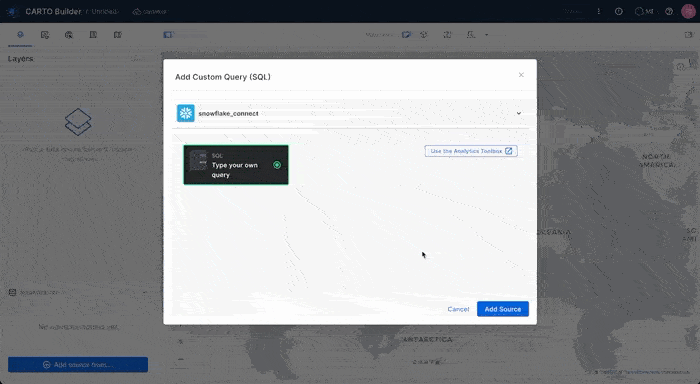

H3 layers allow us to show aggregated information at different resolutions for different zoom levels. Because of this, when we style the layer, we need to decide an aggregation method for the attribute to show, in this example, the signal_strength.

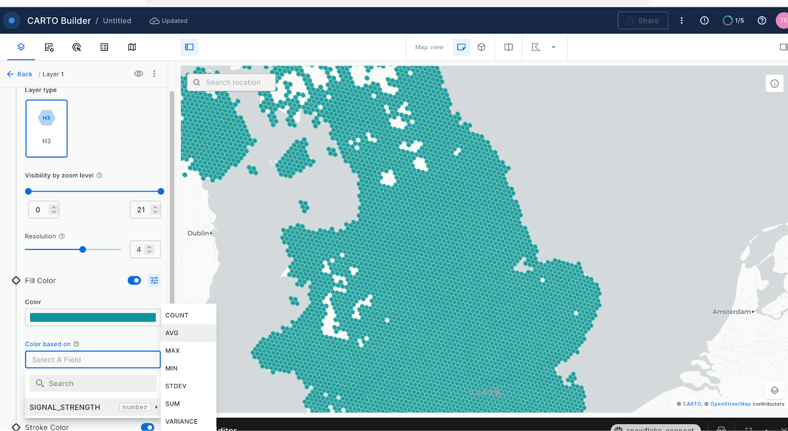

Remember to select a color palette of your liking and the color scale (the default is custom but we want to quantize bins for this use case).
We can also change the relation between the zoom level and the resolution. The higher the resolution configuration, the more granularity we will see on the map but it will also take longer to load.

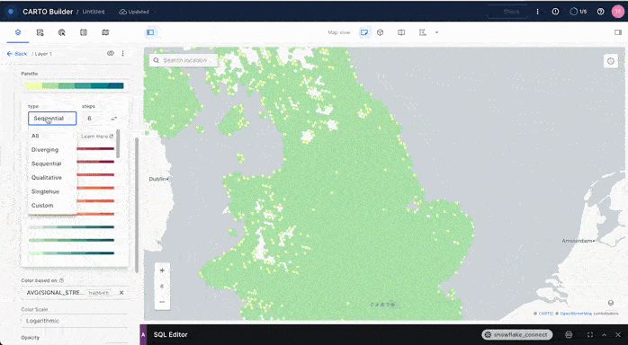

Let’s now use the road network from `UK Open Map Data` to see which road segments have good coverage and which do not.
To intersect the road layer with the H3 signal strength layer, we will split the road geometries onto its minimal road segments and compute the H3 index for the centroid of each segment. We will then join on the H3 index and keep as 'No signal' all of the road segments with no coverage or coverage of under "30". 

Then when each original road segment has an ID from 1 to n (total points in Linestring) we can create the Linestring from each point to the following point with the lead function.

Finally, we use the same `H3_FROMGEOGPOINT` for the selected resolution and we use the Linestring centroid for the point geography.

Run the following query.

```
create or replace table GEOLAB.GEOGRAPHY.OSM_UK_NOT_COVERED AS
with roads as (
    select 
        row_number() over(order by null) as geoid -- creating an ID for each original road segment
        , geo_cordinates as geom
    from OSM_UK.UNITED_KINGDOM.V_ROAD roads
    where class = 'motorway'
    and st_dimension(geo_cordinates) = 1 -- only for the linestring or multilinestring
)
, segment_ids as (
    select 
        Geoid, -- ID for each minimal road segment
        row_number() over(partition by(geoid) order by geoid) as segment_id 
        , geom
    from roads, 
    lateral split_to_table(repeat(',', (st_npoints(geom) - 1)::int), ',')
)
, segments as (select 
               geoid, 
               segment_id,
               st_makeline(
               st_pointn(geom, segment_id), 
               st_pointn(geom, lead(segment_id) over(partition by geoid ORDER BY segment_id))) as segment
    from segment_ids
    order by geoid, segment_id)
select 
    geoid
    , case -- No signal if no coverage, or under 30
        when (h3 is null or signal_strength <= 30) then 'No Signal'
        else 'OK Signal'
    end as signal
    , case -- This parameter we will use for visualization purposes
        when (h3 is null or signal_strength <= 30) then 2
        else 1
    end as road_width
    , st_collect(segment) as geom -- This is creating the original road segments by collecting them.
from segments 
left join GEOLAB.GEOGRAPHY.UK_LTE_COVERAGE_H3
on carto.carto.h3_fromgeogpoint(st_centroid(segment), 9) = h3
where segment is not null
group by 1, 2, 3
order by st_geohash(geom);

ALTER TABLE GEOLAB.GEOGRAPHY.OSM_UK_NOT_COVERED ADD search optimization ON GEO(geom);
```

Now that we have classified road segments by signal and no signal, we can run the following simple query to get the length of each geography in meters:

```
select signal, sum(st_length(geom)/1000)::int as total_km
from GEOLAB.GEOGRAPHY.OSM_UK_NOT_COVERED
group by signal;
```

We now know that we have 56,810 km with good coverage and 10,182 with poor/no coverage. Interestingly, that is about 15 % of the UK roads!

Lastly, with this layer, we can add it to our CARTO map and visualize the road segment according to the signal feature we created.

For this, we can add the layer from either:
* Add source from → Custom Query (SQL) 
* Add source from → Data Explorer

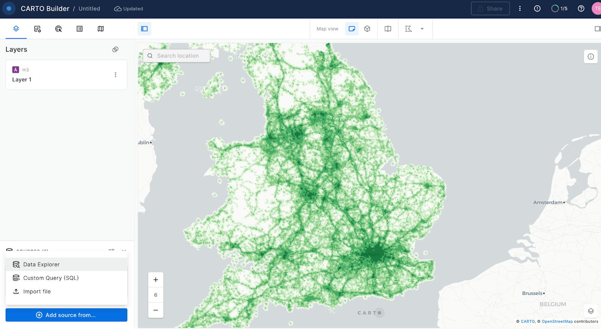

Then select your connection and the `GEOLAB.GEOGRAPHY.OSM_UK_NOT_COVERED` table.

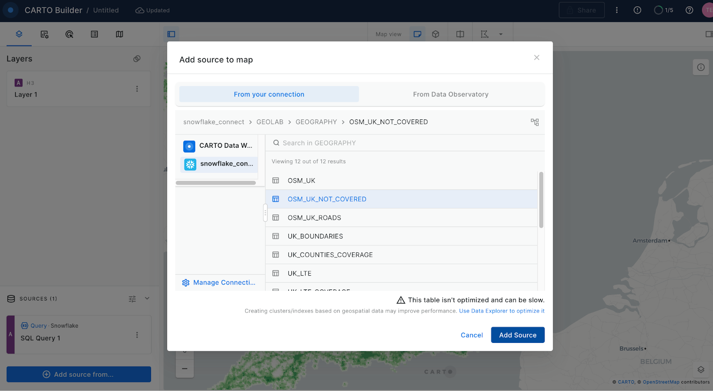

Once we have our second layer on the map, we can click on it to style it and show the stroke color based on our “signal” column. For that, I will create a “Custom palette” with just the 2 colors we want: gray for roads with good signal and red for roads with no/poor signal.

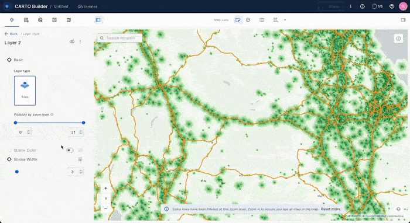

> aside positive
>  You may feel that these last several queries were a bit long and repetitive, but remember that the intention of this guide was to walk you through the progression of building these longer, more complicated queries by illustrating to you what happens at each step through the progression. By understanding how functions can be combined, it helps you to understand how you can do more advanced things with Snowflake geospatial features!

## Conclusion

In this guide, you acquired geospatial data from the Snowflake Marketplace, explored how the GEOGRAPHY data type and its associated formats work, created data files with geospatial data in it, loaded those files into new tables with GEOGRAPHY typed columns, and queried geospatial data using parser, constructor, transformation, calculation and H3 functions on single tables and multiple tables with joins. You then saw how newly constructed geospatial objects could be visualized using CARTO.

You are now ready to explore the larger world of Snowflake geospatial support and geospatial functions.

### What we've covered
* How to acquire a shared database from the Snowflake Marketplace
* The GEOGRAPHY data type, its formats GeoJSON, WKT, EWKT, WKB, and EWKB, and how to switch between them.
* How to load data files with geospatial data.
* How to use constructors like TO_GEOGRAPHY, ST_MAKEPOINT, ST_MAKELINE.
* How to use a transformation like ST_COLLECT.
* How to perform measurement calculations like ST_DISTANCE and ST_LENGTH.
* How to perform relational calculations like ST_DWITHIN and ST_WITHIN.
* How to use Spatial grid and H3 functions like H3_FROMGEOGPOINT, H3_KRING, H3_POLYFILL.
* How to use Search Optimization to speed up geospatial queries.