author: Oleksii Bielov
id: geo_performance
summary: Performance optimization techniques for Geo
categories: Getting-Started
environments: web
status: Published 
feedback link: https://github.com/Snowflake-Labs/sfguides/issues
tags: Geospatial, Performance, H3, Search Optimization

# Performance Optimization Techniques for Geospatial queries

## Overview 

Duration: 10

This Quickstart guide contains key tips for optimal performance when using Snowflake Geospatial Feature. The guide is broken up into multiple labs, each covering a separate technique that can improve performance and/or efficiency while running geo workloads in Snowflake.

### Prerequisites
* Understanding of [Geospatial Data Types](https://docs.snowflake.com/en/sql-reference/data-types-geospatial) in Snowflake
* Understanding of [Geospatial Functions](https://docs.snowflake.com/en/sql-reference/functions-geospatial)
* Recommended: Complete [Geospatial Analysis using Geometry Data Type](https://quickstarts.snowflake.com/guide/geo_analysis_geometry/index.html?index=..%2F..index#0) quickstart


### What You’ll Learn
In this quickstart, you will learn how to improve performance of queries when using Geospatial data types and functions in Snowflake. These choices will be compared with others to show performance improvements. Each concept is broken up into a separate lab:
* Lab 1: Benefits of storing spatial data as geospatial data types
* Lab 2: Improving geospatial joins
* Lab 3: Search optimization for lookup queries
* Lab 4: H3 for approximate calculations
* Lab 5: H3 for speeding up queries with joins

### What You’ll Need
* Sign-up for a [Snowflake Trial](https://signup.snowflake.com/)  OR have access to an existing Snowflake account with the `ACCOUNTADMIN` role or the `IMPORT SHARE `privilege. Select the Enterprise edition, AWS as a cloud provider and US East (Northern Virginia) or EU (Frankfurt) as a region.

## Setup your Account

Duration: 10

If this is the first time you are logging into the Snowflake UI, you will be prompted to enter your account name or account URL that you were given when you acquired a trial. The account URL contains your [account name](https://docs.snowflake.com/en/user-guide/connecting.html#your-snowflake-account-name) and potentially the region. You can find your account URL in the email that was sent to you after you signed up for the trial.

Click `Sign-in` and you will be prompted for your user name and password.

> aside positive
>  If this is not the first time you are logging into the Snowflake UI, you should see a "Select an account to sign into" prompt and a button for your account name listed below it. Click the account you wish to access and you will be prompted for your user name and password (or another authentication mechanism).

### Increase Your Account Permission
The Snowflake web interface has a lot to offer, but for now, switch your current role from the default `SYSADMIN` to `ACCOUNTADMIN`. This increase in permissions will allow you to create shared databases from Snowflake Marketplace listings.

> aside positive
>  If you don't have the `ACCOUNTADMIN` role, switch to a role with `IMPORT SHARE` privileges instead.

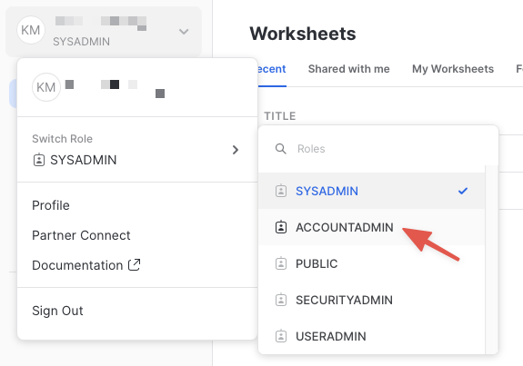

### Create a Virtual Warehouse

You will need to create a Virtual Warehouse to run queries.

* Navigate to the `Admin > Warehouses` screen using the menu on the left side of the window
* Click the big blue `+ Warehouse` button in the upper right of the window
* Create an Large Warehouse as shown in the screen below


Be sure to change the `Suspend After (min)` field to 5 min to avoid wasting compute credits.

### Create a Virtual Warehouse

Navigate to the query editor by clicking on `Worksheets` on the top left navigation bar and choose your warehouse.

- Click the + Worksheet button in the upper right of your browser window. This will open a new window.
- In the new Window, make sure `ACCOUNTADMIN` and `MY_WH` (or whatever your warehouse is named) are selected in the upper right of your browser window.


Create a new database and schema where you will store datasets in the `GEOMETRY` data type. Copy & paste the SQL below into your worksheet editor, put your cursor somewhere in the text of the query you want to run (usually the beginning or end), and either click the blue "Play" button in the upper right of your browser window, or press `CTRL+Enter` or `CMD+Enter` (Windows or Mac) to run the query.

```
CREATE DATABASE geolab;
// Set the working database schema
CREATE OR REPLACE SCHEMA geolab.performance;
USE geolab.performance;
USE WAREHOUSE my_wh;
ALTER SESSION SET GEOGRAPHY_OUTPUT_FORMAT='WKT';
ALTER SESSION SET USE_CACHED_RESULT = FALSE;

```

## Acquire Data 

Duration: 10

The first step in the guide is to acquire geospatial data sets that you can freely use to explore the basics of Snowflake's geospatial functionality. 

### Get data from Marketplace

The best place to acquire this data is the Snowflake Marketplace!

* Navigate to the `Marketplace` screen using the menu on the left side of the window
* Search for `OpenCelliD` in the search bar
* Find and click the `OpenCelliD - Open Database of Cell Towers` tile

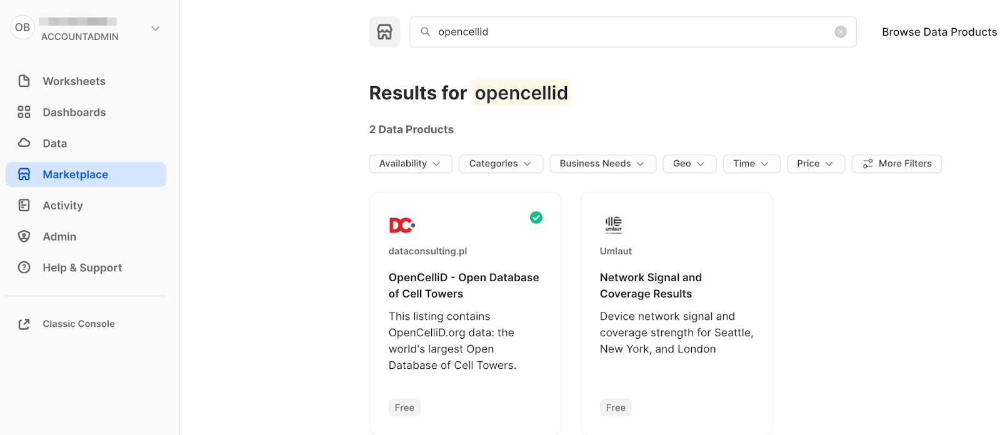

* Once in the listing, click the big blue `Get` button

> aside negative
>  On the `Get` screen, you may be prompted to complete your `user profile` if you have not done so before. Click the link as shown in the screenshot below. Enter your name and email address into the profile screen and click the blue `Save` button. You will be returned to the `Get` screen.


* On the `Get Data` screen, change the name of the database from the default to `OPENCELLID`, as this name is shorter, and all future instructions will assume this name for the database.


Congratulations! You have just created a shared database from a listing on the Snowflake Marketplace. 

### Get data from an external source

Another way to acquire data is to use an external S3 storage. Let's use the NYC Taxi dataset and download the road segments. It is stored in the CSV format in the public S3 bucket. To import this data, create an external stage using the following SQL command:

```
CREATE OR REPLACE STAGE geolab.performance.geostage
  URL = 's3://sfquickstarts/geospatial_performance/';

```

Now you will create a new table using the file from that stage. Run the following queries to create a new file format and a new table using the dataset stored in the Stage:

```
// Create file format
CREATE OR REPLACE FILE FORMAT geocsv TYPE = csv PARSE_HEADER=True
FIELD_OPTIONALLY_ENCLOSED_BY = '"' FIELD_DELIMITER = ';' compression='gzip';

CREATE OR REPLACE TABLE geolab.performance.ny_taxi_rides (pickup_location GEOGRAPHY, dropoff_location GEOGRAPHY);
COPY INTO geolab.performance.ny_taxi_rides
FROM @geostage/ny_rides/
FILE_FORMAT = (FORMAT_NAME = geocsv)
match_by_column_name = case_insensitive;

```

Two other datasets that you will use contain boundaries of dissemination areas in Canada and dataset with trips information. Run the following queries to create corresponding tables:

```
CREATE OR REPLACE TABLE geolab.performance.canada_dissemination_areas (dauid integer, geog GEOGRAPHY);
COPY INTO geolab.performance.canada_dissemination_areas
from @geostage/canada_areas/
FILE_FORMAT = (FORMAT_NAME = geocsv)
MATCH_BY_COLUMN_NAME = case_insensitive;

CREATE OR REPLACE TABLE geolab.performance.canada_trips (trip_id integer, gps_points array);
COPY INTO geolab.performance.canada_trips
from @geostage/canada_trips/
FILE_FORMAT = (FORMAT_NAME = geocsv)
MATCH_BY_COLUMN_NAME = case_insensitive;

```

## Lab 1: Storing geospatial data types

Duration: 5

Geospatial types are designed for fast and efficient spatial operations. Whenever you store objects that are based on Lat and Lon or X and Y coordinates, and you plan to run spatial calculations, we recommend storing those objects as GEOGRAPHY or GEOMETRY type accordingly. 

Let's explore the OpenCellID dataset, which contains the locations of over 40 million cell towers. The image below illustrates the locations of these towers.

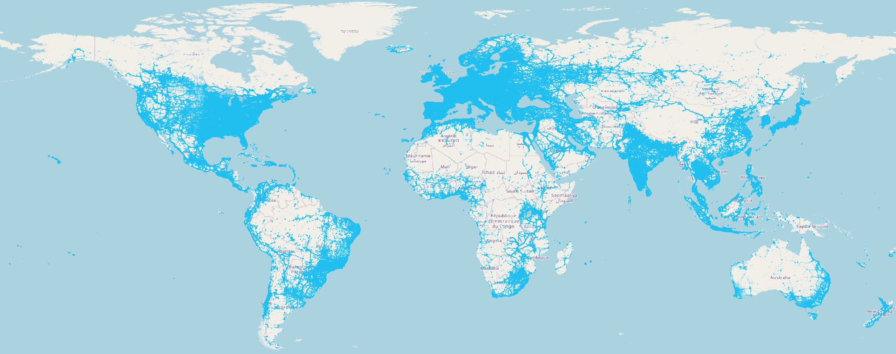

Now you will look inside of the table. Run the following query:

```
SELECT radio, mcc, cell, lon::float, lat::float, cell_range 
FROM opencellid.public.raw_cell_towers limit 10;

```

It contains latitude and longitude as separate fields. Let's create a new table that extends the existing one with an additional column that stores the locations of cell towers as GEOGRAPHY type.

```
CREATE OR REPLACE TABLE geolab.performance.raw_cell_towers AS
SELECT *, st_point(lon, lat) AS geog
FROM opencellid.public.raw_cell_towers;

```

Now, you will count cell towers within 5 km from Royal Observatory Greenwich, which is closely linked to the history of longitude measurement. First, let's count them using latitude and longitude as separate fields

```
SELECT COUNT(1) 
FROM geolab.performance.raw_cell_towers
WHERE ST_DWITHIN(st_point(lon, lat), ST_POINT(0, 51.47684),  5000);

```

There are 18 074 cell towers, and the query is completed in 9 seconds.

Let's do the same calculation, but this time, you will use GEOGRAPHY type:

```
SELECT COUNT(1) 
FROM geolab.performance.raw_cell_towers
WHERE st_dwithin(geog, ST_POINT(0, 51.47684),  5000);

```

This query was completed in 2.5 seconds, which is more than three times faster than before. This is a simple example; the more complex your query, the greater the performance gains you can achieve by using the GEOGRAPHY type.

## Lab 2: Geospatial Joins

Duration: 10

Another advantage of using materialized geospatial types is that you can use fast and efficient geospatial joins. Whenever you join two datasets using geo predicate, such as [ST_CONTAINS](https://docs.snowflake.com/en/sql-reference/functions/st_contains), [ST_WITHIN](https://docs.snowflake.com/en/sql-reference/functions/st_within), etc., Snowflake under the hood builds a spatial grid for both datasets and then compares the content of cells. If both objects are within some cell, then the actual geo predicate executes. Snowflake decides on the size of the cells in the grid based on the size of the objects that take part in a join. 

Imagine that you are working for a telecommunication company and are interested in the density of cell towers per statistical population unit. To model this example, we will use the previously created OpenCellID table and calculate the number of cell towers per [Dissemination Areas](https://www150.statcan.gc.ca/n1/pub/92-195-x/2011001/geo/da-ad/def-eng.htm) in Canada. A dissemination area is a small geographic unit used in Canada for disseminating census data, typically containing 400 to 700 persons. The analogy to Canada's dissemination area in the US would be a Census Block Group, or Statistical Area in Europe.  Run the following query:

```
SELECT t1.dauid, count(t2.lat) AS count_towers 
FROM geolab.performance.canada_dissemination_areas t1
INNER JOIN geolab.performance.raw_cell_towers t2 ON st_within(t2.geog, t1.geog)
GROUP BY 1;

```

It is completed in about 40 seconds on a LARGE warehouse. Let's look inside of the dataset with shapes of dissemination areas and bucket its records based on the size of the area. If you visualize the `canada_dissemination_areas` table, you'll see that there is several extremely large polygons that correspond to areas with low population density.

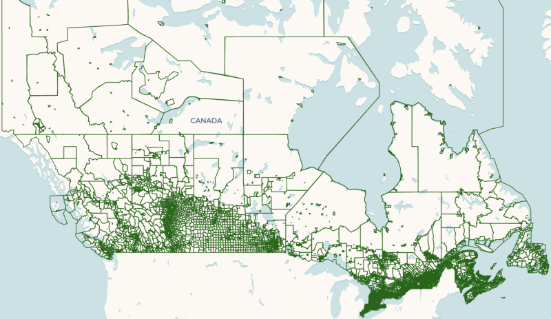

Let's bucket dissemination areas based on their size. Run the following query:

```
SELECT CASE
       WHEN st_area(geog) < 1e+8 THEN '0 - 100M'
       WHEN st_area(geog) >= 1e+8 AND ST_AREA(geog) < 1e+9 THEN '100M-1B'
       WHEN st_area(geog) >= 1e+9 AND ST_AREA(geog) < 1e+10 THEN '1B - 10B'
       WHEN st_area(geog) >= 1e+10 THEN '10B and more'
       END AS area_bucket,
       count(*) AS COUNT
FROM geolab.performance.canada_dissemination_areas
GROUP BY 1
ORDER BY 2 DESC;

```

You can see that most of the boundaries are below 10 billion sq.m in size. Only 98 areas are larger than that threshold.

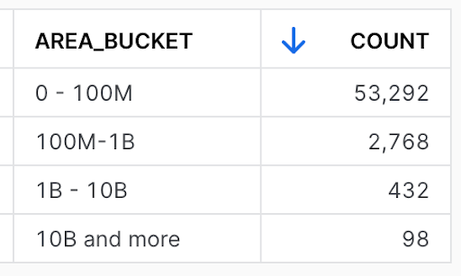

For some use cases, those large, not inhabitant areas don't bring much value. However, they slow down calculations since they skew a dataset. Let's run the same query with join you ran earlier, but this time, you exclude shapes larger than 10B sq.m:

```
SELECT t1.dauid, count(t2.lat) AS count_towers 
FROM geolab.performance.canada_dissemination_areas t1
INNER JOIN geolab.performance.raw_cell_towers t2 ON ST_WITHIN(t2.geog, t1.geog)
WHERE ST_AREA(t1.geog) < 1e+10
GROUP BY 1;

```

The query is completed in about 12 sec. By cleaning 0.17% of the boundaries dataset you improved performance by more than 3x.

## Lab 3: Search Optimization for lookup queries

Duration: 20

In this lab, you'll step into the role of an analyst working with a dataset containing New York taxi trips. Your task is to identify all trips that occurred within a specific location. You will see how you can improve the execution time of lookup queries even on extra small warehouse when you enable Search Optimization (SO) for the geography column.

For this, we will use a publicly available dataset: [New York Taxi Trip Record Data](https://www.nyc.gov/site/tlc/about/tlc-trip-record-data.page). To give you a sense of data, below is a visualization that shows the density of taxi pickups.

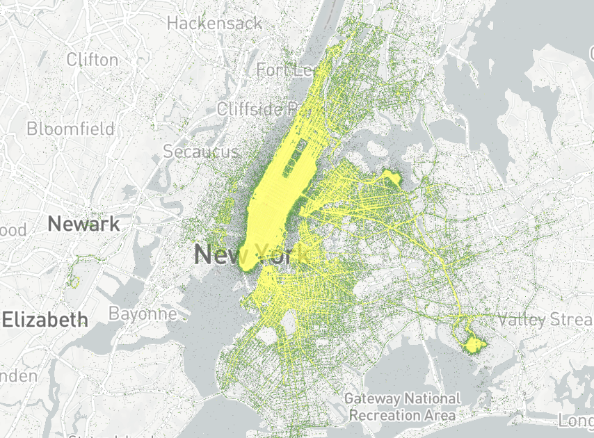

You'll be working with a table named `GEOLAB.PERFORMANCE.NY_TAXI_RIDES`, which contains the raw dataset. Let's look into this dataset:

```
SELECT *
FROM GEOLAB.PERFORMANCE.NY_TAXI_RIDES
LIMIT 10; 

```

It contains pickup and drop-off locations. Let's count the number of rows:

```
SELECT count(*)
FROM GEOLAB.PERFORMANCE.NY_TAXI_RIDES; 

```

The dataset contains around 143.5M rows. And it doesn't have Search Optimization activated. To compare query execution time with and without Search Optimization, you will create a new table with a copy of this dataset and activate Search Optimization (SO) for it. To unleash all the power of Search Optimization, in the copied table, you will create one additional column containing the H3 Index of the `pickup_location` column.

```
CREATE OR REPLACE TABLE GEOLAB.PERFORMANCE.NY_TAXI_RIDES_SO
AS SELECT *, H3_POINT_TO_CELL(pickup_location,9) AS pickup_location_h3
FROM GEOLAB.PERFORMANCE.NY_TAXI_RIDES; 

```

To activate SO, first, you need to enable clustering on the `pickup_location_h3` column. Because the Search Optimization service is designed for highly selective predicates, clustering geospatial objects in the table by proximity can result in better performance. And as a second step, you will enable the SO feature.

```
ALTER TABLE GEOLAB.PERFORMANCE.NY_TAXI_RIDES_SO CLUSTER BY (pickup_location_h3);
ALTER TABLE GEOLAB.PERFORMANCE.NY_TAXI_RIDES_SO ADD SEARCH optimization ON GEO(pickup_location); 

```

To ensure that the SO is active, run the following query.

```
DESCRIBE SEARCH optimization ON GEOLAB.PERFORMANCE.NY_TAXI_RIDES_SO; 

```

To make sure that both tables, the one with SO and another one without SO, contain the same number of rows, let's look into their details (see rows, `search_optimization`, and `search_optimization_progress` columns):

```
SHOW TABLES LIKE '%TAXI_RIDES%';

```

When the `search_optimization_progress` for `NY_TAXI_RIDES_SO` reaches 100, it indicates that all the internal processes required to enable Search Optimization have been completed. This process may take up to 15 minutes, but it's an important step that should be completed before you can move forward with this lab. Once you see this status, it means you're ready to proceed to the next step.

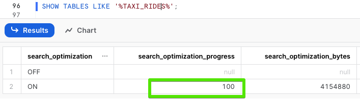

For the next steps you'll change the size of warehouse to XSMALL. Run the following query:
```
ALTER WAREHOUSE my_wh SET warehouse_size=XSMALL;

```

Let's locate all taxi pick-ups that occurred near the Perth Amboy Public Library in New York. You will design a highly selective request and run it first on the table without SO.

```
SELECT pickup_location AS GEOG
FROM GEOLAB.PERFORMANCE.NY_TAXI_RIDES
WHERE st_contains(to_geography('POLYGON((-74.14497384801507 40.596100847757526, -74.15168289095162 40.595924932475924,
    -74.15453407913445 40.599875150092316,-74.15462896227835 40.605661948898984,
    -74.15380787104367 40.60691785709875,-74.14553124457596 40.603458198056444,
    -74.14273772388695 40.60332952170779,-74.14259104058145 40.60021664953396,
    -74.14462951943278 40.60010247716039,-74.14497384801507 40.596100847757526))'), pickup_location);

```

This query finished in about 40 seconds.

> aside positive
>  Note: if you want, you can use [this tool](https://clydedacruz.github.io/openstreetmap-wkt-playground/) to visualize the search area. You can put the search polygon from the query above and click Plot Shape.

Now you'll do the same search using the query with SO enabled:
```
SELECT pickup_location AS GEOG
FROM GEOLAB.PERFORMANCE.NY_TAXI_RIDES_SO
WHERE st_contains(to_geography('POLYGON((-74.14497384801507 40.596100847757526, -74.15168289095162 40.595924932475924,
    -74.15453407913445 40.599875150092316,-74.15462896227835 40.605661948898984,
    -74.15380787104367 40.60691785709875,-74.14553124457596 40.603458198056444,
    -74.14273772388695 40.60332952170779,-74.14259104058145 40.60021664953396,
    -74.14462951943278 40.60010247716039,-74.14497384801507 40.596100847757526))'), pickup_location);

```

This query was finished in just 2 seconds, which is about 20 times faster compared to running it without Search Optimization (SO). 

## Lab 4: H3 for approximate calculations

Duration: 10

In certain situations, users need to determine the distance between objects. For example, consider a logistics company that keeps track of where their trucks are. They do this by recording the GPS location of each truck every two minutes. To check if this location data is accurate, they might measure the distance between the most recent location they recorded and the one before that. If this distance is too large – say, more than three miles – it could indicate that the latest GPS reading was wrong. Below is a visualization displaying correct GPS records (in green) and two incorrect records (in red).

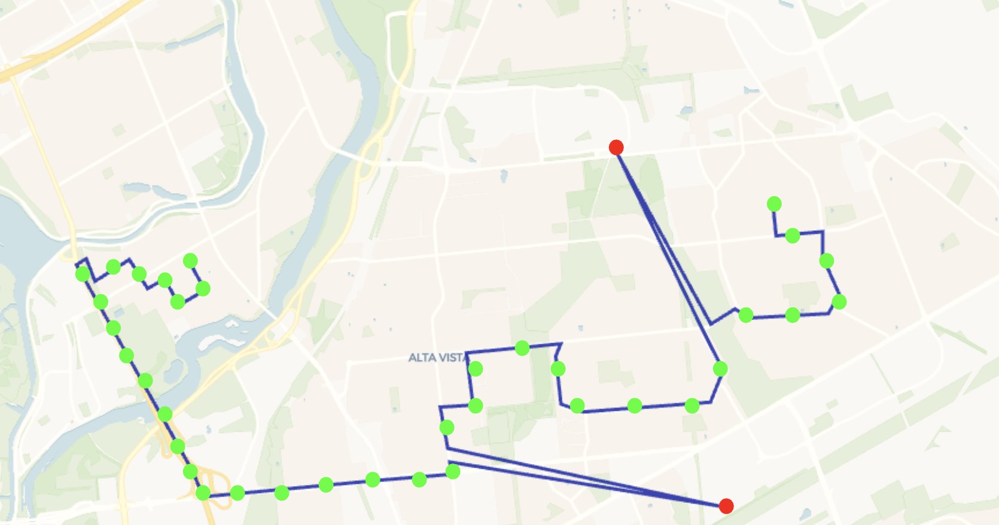

In this situation, they don't need to know the exact distance, but just want to make sure it's not too far, within a certain acceptable limit. For this purpose, estimating the distance using H3 cells of a certain size is good enough. This method is not only simpler but also faster to compute.

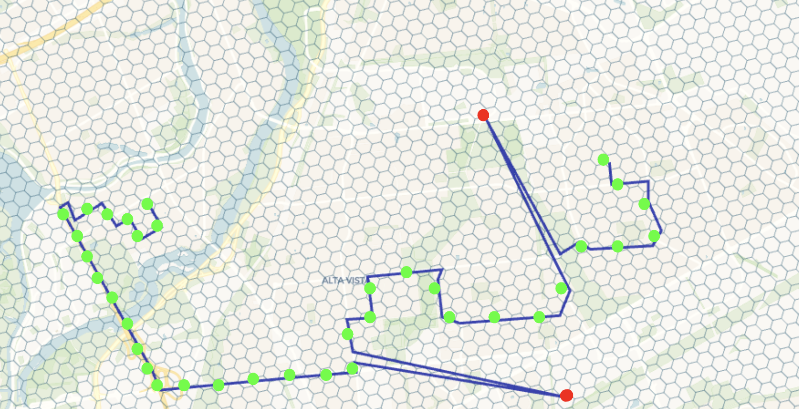


Let's continue being analysts who work with the New York taxi dataset. Our job often involves preparing data for training models or analysis. An important part of this is making sure the data is of good quality. This means you need to get rid of any records where the GPS coordinates don't seem right. In this project, you're particularly focused on removing records where the taxi trips are longer than about 100 kilometers. These long trips are usually either mistakes in the data or very unusual cases that could skew our analysis or predictions.

In the query below you will use the previously created table `GEOLAB.PERFORMANCE.NY_TAXI_RIDES` and extend it with two additional columns that contain indexes of H3 cells of pickup and dropoff locations:

```
CREATE OR REPLACE TABLE geolab.performance.ny_taxi_rides
AS SELECT *, H3_POINT_TO_CELL(pickup_location, 7) as pickup_h3, 
H3_POINT_TO_CELL(dropoff_location, 7) as dropoff_h3
FROM geolab.performance.ny_taxi_rides;

```

Let's check how many trips have geodesic lengths of more than 100km:

```
SELECT CASE
WHEN ST_DISTANCE(pickup_location, dropoff_location) < 100000 then 'under 100'
WHEN ST_DISTANCE(pickup_location, dropoff_location) >= 100000 then 'above 100'
END AS geodesic_distance_bucket,
COUNT(*) as number_of_trips
FROM geolab.performance.ny_taxi_rides
GROUP BY 1;

```

This query was completed in more than 30 seconds, and you found 493 trips with geodesic distance above 100km. 

Let's use H3 columns to do a similar exercise. We know that the distance between centers of adjacent cells at resolution 7 is 2.4km. If you divide 100 by 2.4, you get ~41. Run the following query to find out how many trips have the distance between pickup and dropoff locations of more than 41 cells.

```
SELECT CASE
WHEN H3_GRID_DISTANCE(pickup_h3, dropoff_h3) <= 41 THEN 'under 100'
WHEN H3_GRID_DISTANCE(pickup_h3, dropoff_h3) > 41 THEN 'above 100'
END as distance_h3,
COUNT(*) as number_of_trips
FROM geolab.performance.ny_taxi_rides
GROUP BY 1;

```

This query returned 605 trips with the H3 distance above 41 cells, and it was completed in about 4 seconds. By improving the performance of the query by more than 7x, you got an acceptable number of false positives (compared to the size of the dataset).

Similarly, you can speed up lookup queries. Below, you will find all the trips that started within 10 km of Perth Amboy Public Library in New York. First, let's use lookup with [ST_DWITHIN](https://docs.snowflake.com/en/sql-reference/functions/st_dwithin) function: 

```
SELECT pickup_location
FROM geolab.performance.ny_taxi_rides
WHERE ST_DWITHIN(ST_POINT(-74.2704837, 40.5103654), pickup_location, 10000);

```

It's completed in about 30 seconds and found 1091 trips. Now you will run the similar search, but with the help of the H3 function [H3_GRID_DISK](https://docs.snowflake.com/en/sql-reference/functions/h3_grid_disk) which you'll use to get a K-Ring with the "radius" of four hexahons:

```
WITH kring AS
  (SELECT value::integer as h3 
   FROM TABLE (flatten(H3_GRID_DISK(H3_LATLNG_TO_CELL(40.5103654, -74.2704837, 7), 4))))
SELECT t2.pickup_location
FROM kring t1
JOIN geolab.performance.ny_taxi_rides t2 ON t1.h3 = t2.pickup_h3;

```

It was completed in less than a second and returned 1103 records. Nice performance improvement for such a small price you paid for precision.

Note that in the query above, you cast `value` as an integer since `H3_GRID_DISK` returned the array of variants. After applying flattening, you need to cast values from an array to the expected type, which, in this case, is an integer.

## Lab 5: H3 for speeding up queries with joins

Duration: 15

For this Lab you need to change the warehouse size back to LARGE as you will be running quite complex queries:
```
ALTER WAREHOUSE my_wh SET warehouse_size=LARGE;

```

When you need to join two large tables, it can be computationally expensive and time-consuming. Tessellation is a technique that can be really useful when you need to calculate statistics like averages. It allows to reduce the number of rows in a table by grouping them in chunks based on spatial criteria such as geographic location or proximity. 

In this lab, you will wear the hat of an analyst in a logistics company and you'll calculate the average speed of company's vehicles for each dissemination area in Canada. You will use a synthetic dataset `geolab.performance.canada_trips`, which contains 100K rows, where every row is a separate trip. Each trip is a large array of dictionaries stored in the `GPS_POINTS` column. These dictionaries store location of vehicles and other relevant data, like the vehicle's speed at that location. To help you understand what this data looks like, here's an example of what you might find in a typical `GPS_POINT` column entry:

```
[
  {
    "direction": 1.688377678460125,
    "distance_from_last_location": 0.0489760678928559,
    "id": 1,
    "latitude": 45.37363271860237,
    "longitude": -77.36850375868114,
    "speed": 77
  },
... hundreds or thousands of dictionary elements
  {
    "direction": 2.1026333439524705,
    "distance_from_last_location": 0.010691575462406473,
    "id": 2,
    "latitude": 45.37363416335536,
    "longitude": -77.36850391041858,
    "speed": 65
  },
]

```

You need to join this data with a dataset of Dissemination Area boundaries in Canada to calculate the average speed per dissemination area. 

One approach is to join all the GPS points from every trip with the borders of dissemination areas. The images below helps illustrate this concept. In the first image, each linestring represents a trip, and each point is a GPS location where the truck's speed was captured (in reality each trip could include up to several thousand points). The black shapes in the second image are the dissemination areas.

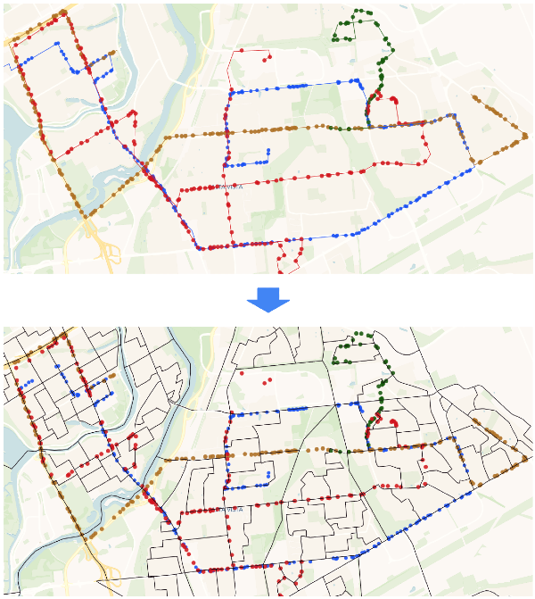

As a first step you will "unpack" arrays with trips information into a table that contains all GPS points. Then you'll join GPS points and boundaries by matching each GPS point to the specific dissemination area it falls within. And finally you'll group these points based on the unique ID of each dissemination area and calculate the average speed for each area. Run the following query:

```
SELECT dauid, AVG(value['speed']) AS avg_speed_per_da
FROM geolab.performance.canada_dissemination_areas
INNER JOIN
    (SELECT t1.trip_id, t2.value::object as value
     FROM geolab.performance.canada_trips t1
     JOIN TABLE (flatten(GPS_POINTS)) t2
    )
ON ST_WITHIN(st_makepoint(value['longitude'], value['latitude']), geog)
GROUP BY 1;

```

It's completed in around 6 minutes and returned 9970 rows. As one of the intermediate steps in the query above, you flattened the column with trip information, which resulted in exploding the trips dataset.

Now, instead of joining the full dataset with trips, which could contain billions of points after flattening, you will aggregate trip data into H3 buckets based on the GPS location. Then, you'll calculate the average speed per H3 cell, reducing the size of the trips table before joining it with the dissemination areas. In this scenario you join much smaller table with centroids of H3 cells with dissemination area boundaries. This makes the join operation much faster. The images below illustrate this approach.

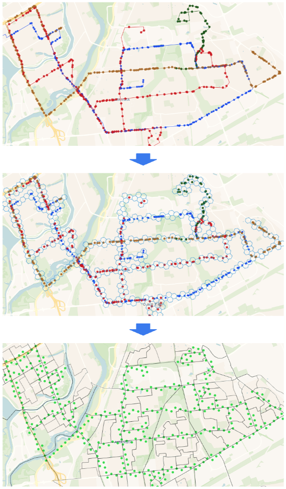

Run the following query:

```
WITH speed_info AS
  (SELECT H3_LATLNG_TO_CELL(value['latitude'], value['longitude'], 12)::int AS h3,
          AVG(value['speed']) AS avg_speed_per_h3
   FROM geolab.performance.canada_trips,
        TABLE (FLATTEN(GPS_POINTS))
   GROUP BY 1)
SELECT dauid,
       AVG(avg_speed_per_h3) AS AVG_SPEED_IN_DB
FROM geolab.performance.canada_dissemination_areas
INNER JOIN speed_info ON ST_INTERSECTS(H3_CELL_TO_POINT(h3), geog)
GROUP BY 1;

```

This query completed in 40 seconds and returned 9985 rows. A different number of rows in the results of the first and second queries was caused by the fact that you did an H3-based aggregation to reduce the dataset size with trips. You can find the best balance of precision/performance for your particular use case by leveraging the size of aggregation cells. For instance, if you change the H3 resolution in the last query to 15, you will get results much closer to the first query. However, execution time will also increase.
> aside negative
>  Note: If you're interested, you can also experiment by running the above queries using an XSMALL warehouse. In this case, the first query would take around 35 minutes to complete, while the second one would finish in less than 3 minutes.

## Conclusion

Duration: 5

In this guide, you acquired geospatial data from different sources and explored various techniques for improving the performance of geospatial queries. You can now apply those techniques to your data and use cases.

### What we've covered
* How to get better performance by using native geo data types
* How to improve the performance of spatial join by fixing skewed datasets
* How to leverage search optimization for speeding up lookup queries
* How to use H3 for fast spatial calculations
* How to use H3 to speed up aggregated statistics calculation

### Related Resources
* [Geospatial Analytics for Retail with Snowflake and CARTO](https://quickstarts.snowflake.com/guide/geospatial_analytics_with_snowflake_and_carto_ny/index.html)
* [Geospatial Analytics using Geometry Data Type](https://quickstarts.snowflake.com/guide/geo_analysis_geometry/index.html#0)

