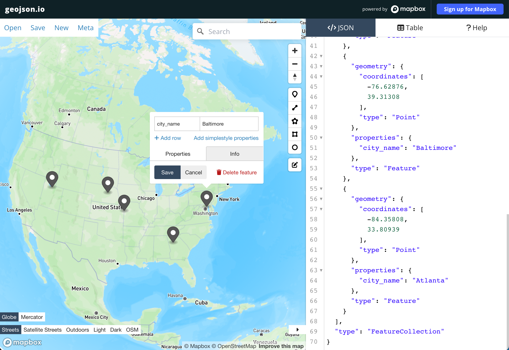
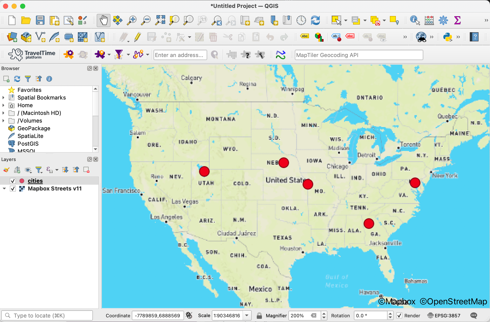

author: chriswhong
id: geocoding_address_data_with_mapbox
summary: Forward and Reverse Geocoding with the Mapbox App
categories: featured,getting-started,data-engineering,partner-integrations
environments: 
status: Published
feedback link: https://github.com/chriswhong/sfquickstarts
tags: Getting Started, API, Geo, Spatial, Geospatial, Geocoding

# Geocoding Address Data with Mapbox

<!-- ------------------------ -->

## Overview
Duration: 1

This Quickstart will help you get started with the __Mapbox Snowflake Native App__, which adds new user-defined functions (UDFs) for geocoding that you can use in your SQL queries.  Geocoding converts your address data (e.g. "1600 Pennsylvania Ave, Washington, DC, 20500") into geographic coordinates which can be used for mapping and spatial analysis.

Geocoding is used by companies for a variety of purposes, including asset tracking, supply chain and retail strategy, and analysis of demographic trends, elections, and real estate.

The Mapbox Snowflake Native App is powered by the [Mapbox Geocoding API](https://docs.mapbox.com/api/search/geocoding/) and the boundaries lookup is powered by [Mapbox Boundaries](https://www.mapbox.com/boundaries).


### Prerequisites

- Familiarity with SQL and Snowflake
- Basic understanding of spatial concepts and geocoding (turning addresses into latitude and longitude coordinates)

### What You’ll Learn

- How to use the Mapbox app's functions to perform bulk geocoding on a snowflake table.
- How to export your new spatial data for use in third-party tools

### What You’ll Need

- Access to the snowflake GUI.
- The Mapbox Snowflake Native App installed in your snowflake environment.

### What You’ll Build

- SQL queries to geocode address data from a single column
- SQL queries to geocode address data from multiple columns (structured data)
- SQL queries to export geojson data from a table with latitude and longitude data
- SQL queries to reverse geocode coordinates and perform boundary lookups


© 2023 Mapbox, Inc

## Installing the Mapbox App
Duration: 3

**IMPORTANT** - The commands and examples below assume the name of the Mapbox native application is `mapbox`. When you install the Mapbox native application you have the option to name the application differently. If you name the application something besides `mapbox` then be sure to change `mapbox` in the commands and examples below to match the name you used for the application.

### Step 1

Create an API integration pointed at Mapbox's API. Note that only the ACCOUNTADMIN role has the CREATE INTEGRATION privilege by default. The privilege can be granted to additional roles as needed.

```
CREATE API INTEGRATION mapbox_api_integration
  API_PROVIDER = aws_api_gateway
  API_AWS_ROLE_ARN = 'arn:aws:iam::234858372212:role/snowflake-mapbox-app-producti-EndpointFunctionRole-8FK34K9GGZTB'
  API_ALLOWED_PREFIXES = ('https://tib1ddi7l4.execute-api.us-east-1.amazonaws.com/v1/endpoint')
  ENABLED = true;
```

After running the command above, run the below command to allow the Mapbox application to use the API integration you just created:

```
GRANT USAGE ON INTEGRATION mapbox_api_integration to application mapbox;
```

### Step 2

Install the user-defined functions (UDF's) provided by the application:

```
CALL mapbox.core.setup('mapbox_api_integration');
```

### Step 3

You will need to do this step any time you want the Mapbox application to be able to access certain databases, schemas, and tables within your Snowflake account, specifying the names of those specific resources in your Snowflake account. The below is an example.

Grant access to allow the application to access databases, schemas, and tables within your Snowflake account. The below assumes you have a database called "mydatabase" with a schema called "testing", and a table called "sample_addresses".

```
GRANT USAGE ON DATABASE mydatabase to application mapbox;
GRANT USAGE ON SCHEMA mydatabase.testing to application mapbox;
GRANT SELECT ON TABLE mydatabase.testing.sample_addresses to application mapbox;
```

## Preparing your data
Duration: 2

    Geocoding requires either a column of fully-formed addresses or address data in multiple columns. 

    Results will depend on the quality and consistency of your data.  Address data spread across multiple columns can improve results as the geocoder knows exactly which state, zip, country, etc to search for.

    Before geocoding with the Mapbox App you may want to clean up your address data, ensuring a consistent format and/or filling in missing values. However, one of the primary benefits of the Mapbox’s Geocoding API is its ability to correct misspellings and other errors (e.g., an address with the wrong zip code). 

### Fully-formed addresses in a single column

This example table shows a fully formed address string in a single column:

| __ADDRESS__ |  
| ----------- | 
| 200 West 47th Street, New York, New York 10036, United States |
| 402 World Way, Los Angeles, California 90045, United States |
| Van Wyck Expressway, Queens, New York 11430, United States |
| Macombs Dam Bridge, Bronx, New York 10451, United States |
| 77 East 42nd Street, New York, New York 10017, United States |

### Address data spread across multiple columns

This example table shows "structured" address data spread across four columns:

| __ADDRESS__ | __CITY__ |	__STATE__ |	__ZIP__ |
| --- | --- |	--- |	--- |
| 200 K St NE |	Washington DC	 |	DC |		20002 |	
| 500 L'enfant Plaza SW |	Washington DC |		DC	 |	20024 |	
| 2197 Plumleigh Dr |	Fremont	 |	CA	 |	94539 |	
| 5034 Curtiss St |	Fremont	 |	CA	 |	94538 |	
| 51 S Washington St |	Sonora	 |	CA	 |	95370 |	

When geocoding with structured data, each column should correspond to one of the address parts in the table below.  Not all parts are required, but providing more parts can increase the accuracy of your results.  For more details, see the [documentation for the Mapbox Geocoding API](https://docs.mapbox.com/api/search/geocoding-v6/#structured-input).

Your columns can be named however you like, but you have to specify which column to use for each address part when using the Mapbox App.

| __Address Part__ | __Type__ | __Description__   
| ------------------- | ------ | --------------------------------------------------------------------------------------------------------------------------------------------------------------------------------------------------------------------------------------------------------------------------------- |
| `address_line1`     | string | A string including address_number and street. These values can alternatively be provided as separate parameters.                                                                                                                                                                  |
| `address_number`    | string | The number associated with the house.                                                                                                                                                                                                                                             |
| `street`            | string | The name of the street in the address                                                                                                                                                                                                                                             |
| `block`             | string | In some countries like Japan, the block is a component in the address                                                                                                                                                                                                             |
| `place`             | string | Typically these are cities, villages, municipalities, etc. They’re usually features used in postal addressing, and are suitable for display in ambient end-user applications where current-location context is needed (for example, in weather displays).                         |
| `region`            | string | Top-level sub-national administrative features, such as states in the United States or provinces in Canada or China.                                                                                                                                                              |
| `postcode`          | string | Postal codes used in country-specific national addressing systems.                                                                                                                                                                                                                |
| `locality`          | string | Official sub-city features present in countries where such an additional administrative layer is used in postal addressing, or where such features are commonly referred to in local parlance. Examples include city districts in Brazil and Chile and arrondissements in France. |
| `neighborhood`      | string | Colloquial sub-city features often referred to in local parlance. Unlike locality features, these typically lack official status and may lack universally agreed-upon boundaries. Not available for reverse geocoding requests.                                                   |
| `country`           | string | Generally recognized countries or, in some cases like Hong Kong, an area of quasi-national administrative status that has been given a designated country code under [ISO 3166-1](https://www.iso.org/iso-3166-country-codes.html). 

© 2023 Mapbox, Inc

## Geocode addresses from a single column
Duration: 3

When your addresses live in a single column as fully-formed address strings, use the `geocode_forward()` function.

Forward geocoding is powered by the [Mapbox Geocoding API](https://docs.mapbox.com/api/search/geocoding-v6/), which includes global address coverage, supported by continuously-updated high-quality Mapbox location data.  You can try out individual address queries and inspect the results using our [Geocoding API Playground](https://docs.mapbox.com/playground/geocoding-v6).

### Trying out the geocode_forward() function

To get more familiar with the function syntax and results, you can call `geocode_forward()` without specifying a table. Just provide a hard coded address in your query:

```
SELECT 
    mapbox.core.geocode_forward(
        '1600 Pennsylvania Ave NW Washington, DC'
    ) AS geocoder_response;
``` 

| __GEOCODER_RESPONSE__ |
| --- |
|{"accuracy":"rooftop", "confidence":"high", "context":{"country":{"country_code":"US", "country_code_alpha_3":"USA", "mapbox_id":"dXJuOm1ieHBsYzpJdXc", "name":"United States", "wikidata_id":"Q30"}, "neighborhood":{"alternate":{"mapbox_id":"dXJuOm1ieHBsYzpEY1ZNN0E", "name":"Franklin Mcpherson Square"}, "mapbox_id":"dXJuOm1ieHBsYzpHYUVzN0E", "name":"National Mall"}, "place":{"mapbox_id":"dXJuOm1ieHBsYzpGSmlvN0E", "name":"Washington", "wikidata_id":"Q61"}, "postcode":{"mapbox_id":"dXJuOm1ieHBsYzpBOEZPN0E", "name":"20500"}, "region":{"mapbox_id":"dXJuOm1ieHBsYzpCUVRz", "name":"District of Columbia", "region_code":"DC", "region_code_full":"US-DC", "wikidata_id":"Q3551781"}}, "feature_type":"address", "latitude":38.89768, "longitude":-77.03655, "mapbox_id":"dXJuOm1ieGFkcjo2YzdhYjM4Yi05YzM4LTQ3ZDItODFkMS1jYzZlYjg5YzliMWM", "name":"1600 Pennsylvania Avenue Northwest", "place_formatted":"Washington, District of Columbia 20500, United States"}|

The resulting column includes a nested JSON object with full details about how the geocoder processed the address. You can see `accuracy`, `confidence`, and additional context.  The `latitude` and `longitude` are also included in this response.  For more details on the response JSON, see the [documentation for the Mapbox Geocoding API](https://docs.mapbox.com/api/search/geocoding-v6/#structured-input).

While you may want to keep the full response for future reference, a more likely workflow is to extract the most useful information from the response.

### Parsing values from the JSON response

The full response from the geocoder includes a lot of information you may not need.  You can extract the values you care most about from this response with a bit more SQL and a `WITH` clause.

Geocode an address string, and select the `accuracy`, `confidence`, `lng`, and `lat` from the response:

```
WITH raw_geocoder_response AS (
    SELECT 
        mapbox.core.geocode_forward(
          '1600 Pennsylvania Ave NW Washington, DC'
        ) AS geocoder_response
) 

SELECT
    '1600 Pennsylvania Ave NW Washington, DC' AS input_string,
    geocoder_response:accuracy AS accuracy,
    geocoder_response:confidence AS confidence,
    geocoder_response:longitude AS lng,
    geocoder_response:latitude AS lat
FROM raw_geocoder_response;
```
In this result set we can easily see the input address along with the accuracy, confidence and coordinates that came from the geocoder.

| __INPUT_STRING__ | __ACCURACY__ | __CONFIDENCE__ | __LNG__ | __LAT__ |
| --- | --- | --- | --- | --- |
| 1600 Pennsylvania Ave NW Washington, DC | "rooftop" |	"high" | -77.03655 | 38.89768 |

### Geocoding with addresses in a single column

Now that you're familiar with the `geocode_forward()` function, you can try it out with a real table.  Use your own table, or use the `sample_addresses` table that comes included with the Mapbox App.

__Note:__ While you're experimenting with the Mapbox App's functions, you may want to add a `LIMIT` to your queries to avoid sending a large amount of data to the geocoder.

Geocode the `address` column in the `sample_addresses` table:

```
WITH geocoder_results AS (
    SELECT 
        address AS input_string,
        mapbox.core.geocode_forward(
          address
        ) AS response_json
    FROM mapbox.sample_data.sample_addresses
    LIMIT 5
) 

SELECT
    input_string,
    response_json:accuracy AS accuracy,
    response_json:confidence AS confidence,
    response_json:longitude AS lng,
    response_json:latitude AS lat
FROM geocoder_results;
```

| __INPUT_STRING__ |	__ACCURACY__ |	__CONFIDENCE__ |	__LNG__	| __LAT__ |
| --- | --- | --- | --- | --- |
| 200 West 47th Street, New York, New York 10036, United States | "rooftop" | 	"exact" | 	-73.98487 | 40.75919 | 
| 402 World Way, Los Angeles, California 90045, United States | "rooftop" | 	"exact" | 	-118.40796	 | 33.94218 | 
| Van Wyck Expressway, Queens, New York 11430, United States | 	 null | null	 | 	-73.810305	 | 40.69017 | 
| Macombs Dam Bridge, Bronx, New York 10451, United States	 | 	null | null  | 	-73.9311270691973	 | 40.8283336337234 | 
| 77 East 42nd Street, New York, New York 10017, United States | 	"rooftop"	 | "exact"	 | -73.97728	 | 40.75264 | 

### Geocoding options

In the examples above, we called `geocode_forward()` passing in a single string value.  Additional optional values can be passed in to control the respose, using the following signature: 

```
geocode_forward (
  query STRING,
  bbox STRING, -- Limit results to only those contained within the supplied bounding box
  country STRING, -- Limit results to one or more countries.
  format STRING, -- Specify the desired response format of results
  language STRING, -- Set the language of the text supplied in responses
  proximity STRING, -- Bias the response to favor results that are closer to this location.
  types STRING, -- Filter results to include only a subset (one or more) of the available feature types.
  worldview STRING -- Returns features that are defined differently by audiences that belong to various regional, cultural, or political groups.
)
```

This example query shows example values for each of the optional `geocode_forward()` paramters.  `null` is passed in to use the default for some parameters:
```
WITH geocoder_results AS (
    SELECT 
        address AS input_string,
        mapbox.core.geocode_forward(
          address,
          '-76.19834, 39.97303, -71.36046, 41.77418',    -- BBox parameter
          'us,ca,mx',                                    -- Country parameter
          'geojson',                                     -- Format parameter
          'ko',                                          -- Language parameter
          '-73.99487, 40.73840',                         -- Proximity point parameter
          'address',                                     -- Types parameter
          null                                           -- Worldview parameter
        ) AS response_json
    FROM mapbox.sample_data.sample_addresses
    LIMIT 5
) 

SELECT
    input_string,
    response_json:name AS name,
    response_json:place_formatted AS place_formatted,
    response_json:longitude AS lng,
    response_json:latitude AS lat
FROM geocoder_results;
```

In the results set we can see that only `address` results in the New York City Area (the area specified in the bounding box) have been geocoded, and the `place_formatted` field is shown in Korean:

| __INPUT_STRING__                                                  | __NAME__                   | __PLACE_FORMATTED__            | __LNG__       | __LAT__      |
|---------------------------------------------------------------|------------------------|----------------------------|-----------|----------|
| 200 West 47th Street, New York, New York 10036, United States | "200 West 47th Street" | "뉴욕, 뉴욕주 10036, 미국" | -73.98487 | 40.75919 |
| 402 World Way, Los Angeles, California 90045, United States   |                        |                            |           |          |
| Van Wyck Expressway, Queens, New York 11430, United States    |                        |                            |           |          |
| Macombs Dam Bridge, Bronx, New York 10451, United States      |                        |                            |           |          |
| 77 East 42nd Street, New York, New York 10017, United States  | "77 East 42nd Street"  | "뉴욕, 뉴욕주 10017, 미국" | -73.97728 | 40.75264 |

For help finding center point and bounding box coordinates, use Mapbox's [Location Helper](https://labs.mapbox.com/location-helper/) tool.

For more details on valid values for these options, see the [documentation for the Mapbox Geocoding API](https://docs.mapbox.com/api/search/geocoding-v6/).

© 2023 Mapbox, Inc

## Geocoding address data from multiple columns
Duration: 3

When your data lives in multiple columns, use the Mapbox App's `geocode_structured()` function to get results.

### Trying out the geocode_structured() function

`geocode_structured()` has the following signature:

```
geocode_structured(
  address_line1 STRING,
  address_number STRING,
  street STRING,
  block STRING,
  place STRING,
  region STRING,
  postcode STRING,
  locality STRING,
  neighborhood STRING,
  country STRING
)
```
You must always call `geocode_structured()` with all parameters.  Use `null` if you don't have a value to pass in. For more details on valid values for these parameters, see the [documentation for the Mapbox Geocoding API](https://docs.mapbox.com/api/search/geocoding-v6/#structured-input).

As we did above, start with a simple query that contains hard-coded values.  This query is for the street address of the Empire State Building in New York City.


```
    SELECT mapbox.core.geocode_structured(
        null,               --address_line1
        '2',                --address_number
        'West 34th Street', --street
        null,               --block
        'New York',         --place
        'NY',               --region
        '10118',            --postcode
        null,               --locality
        null,               --neighborhood
        'United States'     --country
    ) as response_json;
```

| __RESPONSE_JSON__ ||
| --- |
| {"context":{"country":{"country_code":"US", "country_code_alpha_3":"USA", "mapbox_id":"dXJuOm1ieHBsYzpJdXc", "name":"United States", "wikidata_id":"Q30"}, "district":{"mapbox_id":"dXJuOm1ieHBsYzpBUU5tN0E", "name":"New York County", "wikidata_id":"Q500416"}, "locality":{"mapbox_id":"dXJuOm1ieHBsYzpGREtLN0E", "name":"Manhattan", "wikidata_id":"Q11299"}, "place":{"mapbox_id":"dXJuOm1ieHBsYzpEZTVJN0E", "name":"New York", "wikidata_id":"Q60"}, "postcode":{"mapbox_id":"dXJuOm1ieHBsYzpBWUFPN0E", "name":"10118"}, "region":{"mapbox_id":"dXJuOm1ieHBsYzpBYVRz", "name":"New York", "region_code":"NY", "region_code_full":"US-NY", "wikidata_id":"Q1384"}}, "feature_type":"postcode", "latitude":40.748451, "longitude":-73.985649, "mapbox_id":"dXJuOm1ieHBsYzpBWUFPN0E", "name":"10118", "place_formatted":"New York, New York, United States"} |


Note that when using `geocode_structured()`, the response does not include the same properties as `geocode_forward()`. For more details on the response JSON, see the [documentation for the Mapbox Geocoding API](https://docs.mapbox.com/api/search/geocoding-v6/#structured-input).

 Next, pull out the `latitude` and `longitude` properties from the response JSON for a tidier result set. 

```
WITH geocoder_results AS (
    SELECT mapbox.core.geocode_structured(
        null,               --address_line1
        '2',                --address_number
        'West 34th Street', --street
        null,               --block
        'New York',         --place
        'NY',               --region
        '10118',            --postcode
        null,               --locality
        null,               --neighborhood
        'United States'     --country
    ) as response_json
)

SELECT
    response_json:longitude AS lng,
    response_json:latitude AS lat
FROM geocoder_results;
```

| __LNG__ |	__LAT__ |
| --- | --- |
| -73.985649 | 40.748451 |


Now that you're familiar with `geocode_structured()`, you can try it on a table.

Create a temporary table called `address_data` with some address data in multiple columns:

```
CREATE TEMPORARY TABLE address_data (
    address VARCHAR(25) NOT NULL,
    city VARCHAR(25) NOT NULL,
    state VARCHAR(2) NOT NULL,
    zip VARCHAR(5) NOT NULL
);

INSERT INTO address_data VALUES('200 K St NE', 'Washington DC',	'DC',	'20002');
INSERT INTO address_data VALUES('500 L\'enfant Plaza SW', 'Washington DC',	'DC',	'20024');
INSERT INTO address_data VALUES('2197 Plumleigh Dr', 'Fremont', 'CA',	'94539');
INSERT INTO address_data VALUES('5034 Curtiss St', 'Fremont',	'CA',	'94538');
INSERT INTO address_data VALUES('51 S Washington St', 'Sonora',	'CA',	'95370');

SELECT * FROM address_data;
```

| __ADDRESS__ | __CITY__ |	__STATE__ |	__ZIP__ |
| --- | --- |	--- |	--- |
| 200 K St NE |	Washington DC	 |	DC |		20002 |	
| 500 L'enfant Plaza SW |	Washington DC |		DC	 |	20024 |	
| 2197 Plumleigh Dr |	Fremont	 |	CA	 |	94539 |	
| 5034 Curtiss St |	Fremont	 |	CA	 |	94538 |	
| 51 S Washington St |	Sonora	 |	CA	 |	95370 |	


Use `geocode_structured()` to geocode these 5 rows.  In this example query we are including all four original columns in the initial `SELECT` so we can display them along with the `lng` and `lat` in the result set.

```
WITH geocoder_results AS (
    SELECT 
        address,
        city,
        state,
        zip,
        mapbox.core.geocode_structured(
            address,        --address_line1
            null,           --address_number
            null,           --street
            null,           --block
            city,           --place
            state,          --region
            zip,            --postcode
            null,           --locality
            null,           --neighborhood
            'United States' --country
        ) AS response_json
    FROM address_data
) 

SELECT
    address,
    city,
    state,
    zip,
    response_json:longitude AS lng,
    response_json:latitude AS lat
FROM geocoder_results;
```

| __ADDRESS__ | __CITY__ | __STATE__ | __ZIP__ | __LNG__ | __LAT__
| --- | --- | --- | --- | --- | --- |
| 200 K St NE | Washington DC | DC | 20002 | -77.00821 | 38.898064
| 500 L'enfant Plaza SW | Washington DC | DC | 20024 | -77.01744 | 38.87282
| 2197 Plumleigh Dr | Fremont | CA | 94539 | -121.94887 | 37.53976
| 5034 Curtiss St | Fremont | CA | 94538 | -121.97764 | 37.52355
| 51 S Washington St | Sonora | CA | 95370 | -120.38366 | 37.98597

© 2023 Mapbox, Inc

## Export and preview your geocoded data
Duration: 3

Working with spatial data often requires rendering the geometries on a map to validate that things are working as expected. There are several ways to get your spatial data onto a map, but they require either a live connection to your data warehouse, or exporting the data as a CSV file to be opened in another tool.

With a bit of SQL, it's possible to build a GeoJSON string from your spatial data.  GeoJSON is a widely used spatial data format that may be easier for some tools to parse than a CSV with longitude and latitude columns.  The following example query will generate a GeoJSON featurecollection, which can be copied or downloaded for use in other spatial tools.

Learn more about the geojson format at [geojson.org](https://geojson.org/).


Given a table `us_cities` with `longitude`, `latitude`, and `city_name` columns:

```
CREATE TEMPORARY TABLE us_cities (
    longitude FLOAT NOT NULL,
    latitude FLOAT NOT NULL,
    city_name VARCHAR(50) NOT NULL
);

INSERT INTO us_cities VALUES(-98.59796, 41.84907,	'Los Angeles');
INSERT INTO us_cities VALUES(-111.8867	, 40.75977,	'Salt Lake City');
INSERT INTO us_cities VALUES(-94.5702	, 39.09613	, 'Kansas City');
INSERT INTO us_cities VALUES(-76.62876	, 39.31308,	'Baltimore');
INSERT INTO us_cities VALUES(-84.35808	, 33.80939,	'Atlanta');
```

| __LONGITUDE__ | __LATITUDE__ | __CITY_NAME__      |
|-----------|----------|----------------|
| -98.59796 | 41.84907 | Los Angeles    |
| -111.8867 | 40.75977 | Salt Lake City |
| -94.5702  | 39.09613 | Kansas City    |
| -76.62876 | 39.31308 | Baltimore      |
| -84.35808 | 33.80939 | Atlanta        |

You can create a GeoJSON FeatureCollection with the following SQL query.  Each feature will have a `Point` geometry with the coordinates from the original table, and a `properties` object including the value from the `city_name` column.  

```
SELECT
    TO_JSON(
        OBJECT_CONSTRUCT(
            'type', 'FeatureCollection',
            'features', ARRAY_AGG(
                OBJECT_CONSTRUCT(
                    'type', 'Feature',
                    'geometry', ST_ASGEOJSON(
                        ST_POINT(
                            longitude,
                            latitude
                        )
                    ),
                   'properties', OBJECT_CONSTRUCT(
                        'city_name', city_name
                    ) 
                )
            )
        )
    ) AS featurecollection
FROM us_cities;
```
| __FEATURECOLLECTION__ | 
|---|
| {"features":[{"geometry":{"coordinates":[-9.859796000000000e+01,4.184907000000000e+01],"type":"Point"},"properties":{"city_name":"Los Angeles"},"type":"Feature"},{"geometry":{"coordinates":[-1.118867000000000e+02,4.075977000000000e+01],"type":"Point"},"properties":{"city_name":"Salt Lake City"},"type":"Feature"},{"geometry":{"coordinates":[-9.457020000000000e+01,3.909613000000000e+01],"type":"Point"},"properties":{"city_name":"Kansas City"},"type":"Feature"},{"geometry":{"coordinates":[-7.662876000000000e+01,3.931308000000000e+01],"type":"Point"},"properties":{"city_name":"Baltimore"},"type":"Feature"},{"geometry":{"coordinates":[-8.435808000000000e+01,3.380939000000000e+01],"type":"Point"},"properties":{"city_name":"Atlanta"},"type":"Feature"}],"type":"FeatureCollection"} |

The geojson string can be easily copied from the snowflake UI. Click on the cell that contains the GeoJSON string and it will be displayed in the sidebar along with a copy button.  (Note that copying may not be feasible if your result set is too large):


### Visualizing your data in Geojson.io

[Geojson.io](https://geojson.io) is a free website for previewing and editing geojson data.  You can paste in your copied GeoJSON FeatureCollection or drag in your downloaded file, and your points will appear on the map as markers.

You can click each marker to reveal the associated properties.



### Visualizing your data in QGIS

Your geojson file can be opened in desktop GIS software like [QGIS](https://qgis.org/).  Paste your copied GeoJSON into a file and save it with the `.geojson` extension.  The file can be opened in QGIS, where you can choose a symbology for the points and preview it over a basemap.



© 2023 Mapbox, Inc

## Reverse Geocoding and Boundaries Lookup
Duration: 5

The Mapbox App includes two other useful functions for reverse geocoding (converting point coordinates to addresses) and boundary lookup (e.g. determining which zip code each point lies in).

### Reverse Geocoding

Reverse geocoding is the process of converting point coordinates to addresses.  For example, the coordinates `-73.9857, 40.7484` would be reverse geocoded to `2 W 34th Street, New York, NY`

Reverse geocoding is powered by the [Mapbox Geocoding API](https://docs.mapbox.com/api/search/geocoding-v6/), which includes global address coverage, supported by continously updated high-quality Mapbox location data.  You can try out individual reverse geocoding queries and inspect the results using our [Geocoding API Playground](https://docs.mapbox.com/playground/geocoding-v6).

To perform reverse geocoding on your snowflake data, use the `geocode_reverse()` function.

Example reverse geocoding query with hard-coded coordinates:

```
WITH reverse_geocode_results AS (
    SELECT
        mapbox.core.geocode_reverse(
            -77.0366, -- longitude
            38.8976,  -- latitude
        ) AS response_json
)

SELECT
    response_json:name AS name,
    response_json:place_formatted AS place_formatted
FROM reverse_geocode_results;
```
| __NAME__ | __PLACE_FORMATTED__ |
| --- | --- |
| "1600 Pennsylvania Avenue Northwest" | "Washington, District of Columbia 20500, United States" |

Optional parameters `country`, `language`, `types`, and `worldview` are available with the following signature:

```
geocode_reverse (
  longitude STRING,
  latitude STRING,
  country STRING,
  language STRING,
  types STRING,
  worldview STRING
)
```

For more details about reverse geocoding parameters, see the [documentation for the Mapbox Geocoding API](https://docs.mapbox.com/api/search/geocoding-v6/#reverse-geocoding).

### Boundaries Lookup

Unlike the geocoding functions covered in this quickstart, `mapbox_boundaries_reverse_enrich()` is a _stored procedure_. Stored procedures aren't used in SQL queries, rather they are called on their own and will update a specific table with new data.

`mapbox_boundaries_reverse_enrich()` will take longitude and latitude values from columns you specify, and populate another column with the corresponding administrative boundary identifier.  For example, if you wanted to know which U.S. State the coordinates `-98.59796, 41.84907` fall within, `mapbox_boundaries_reverse_enrich()` would return 'Nebraska'.

The `mapbox_boundaries_reverse_enrich()` stored procedure has the following signature:

```
CALL mapbox.core.mapbox_boundaries_reverse_enrich(
  DB_NAME STRING,
  SCHEMA_NAME STRING,
  TABLE_NAME STRING,
  DESTINATION_COLUMN_NAME STRING,
  INCREMENTAL BOOLEAN,
  SOURCE_LONGITUDE_COLUMN_NAME VARCHAR,
  SOURCE_LATITUDE_COLUMN_NAME VARCHAR,
  PARAM_LAYER_NAME VARCHAR,
  PARAM_WORLDVIEW VARCHAR
)
```

* __DB_NAME__ - the name of the database to operate on
* __SCHEMA_NAME__ - the name of the schema to operate on
* __TABLE_NAME__ - the name of the table to operate on
* __DESTINATION_COLUMN_NAME__ - the name of the column in which to write the result of the layer lookup
* __INCREMENTAL BOOLEAN__ - if true, the procedure will only update rows that have a null value in the specified destination column
* __SOURCE_LONGITUDE_COLUMN_NAME__ - the column name that contains the longitude values used for the lookup
* __SOURCE_LATITUDE_COLUMN_NAME__ - the column name that contains the latitude values used for the loopup
* __PARAM_LAYER_NAME__ - the boundaries layer to lookup
* __PARAM_WORLDVIEW__ - the worldview to use. For now, only 'US' is supported

Example `mapbox_boundaries_reverse_enrich()` call:
```
CREATE TABLE boundary_lookup (
    longitude DOUBLE NOT NULL,
    latitude DOUBLE NOT NULL,
    state OBJECT
);

INSERT INTO boundary_lookup VALUES(-118.24172, 34.06271, null); -- Los Angeles
INSERT INTO boundary_lookup VALUES(-111.88670, 40.75977, null);-- Salt Lake City
INSERT INTO boundary_lookup VALUES(-94.57020, 39.09613, null); -- Kansas City
INSERT INTO boundary_lookup VALUES(-76.62876, 39.31308, null); -- Baltimore
INSERT INTO boundary_lookup VALUES(-84.35808, 33.80939, null); -- Atlanta

-- grant privileges on the table
GRANT ALL ON TABLE {database}.{schema}.boundary_lookup to application mapbox;

CALL mapbox.core.mapbox_boundaries_reverse_enrich(
  {your_database},
  {your_schema},
  'boundary_lookup',
  'state',
  TRUE,
  'longitude',
  'latitude',
  'adm1',
  'US'
);

SELECT 
    longitude,
    latitude,
    state:name AS state_name,
    state:join_attributes:iso_3166_2 AS iso_3166_2_code
FROM boundary_lookup;
```

| __LONGITUDE__ | __LATITUDE__ | __STATE_NAME__ | __ISO_3166_2_CODE__ |
| --- | --- | --- | --- |
| -98.59796 | 41.84907 | "California" | "US-CA" |
| -111.8867 | 40.75977 | "Utah" | "US-UT" |
| -94.5702 | 39.09613 | "Missouri" | "US-MO" |
| -76.62876 | 39.31308 | "Maryland" | "US-MD" |
| -84.35808 | 33.80939 | "Georgia" | "US-GA" |

© 2023 Mapbox, Inc

