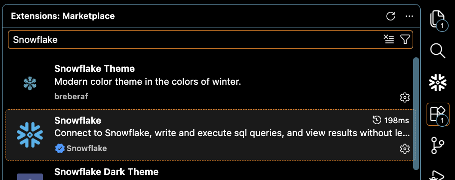
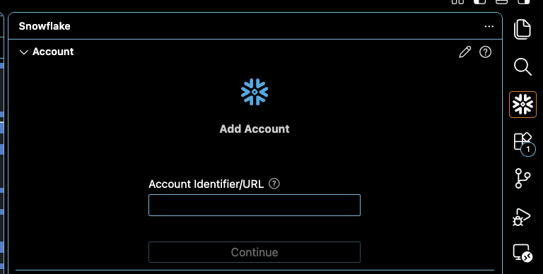
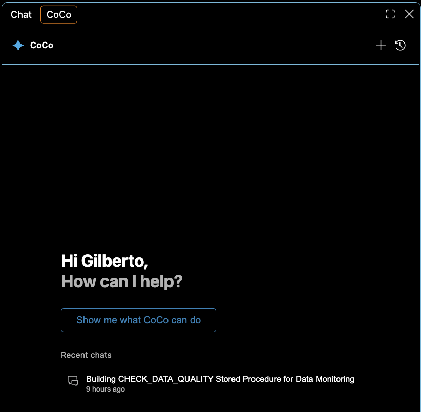
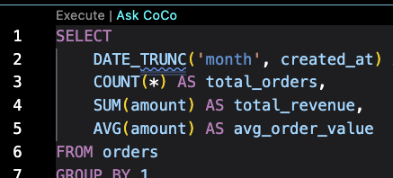
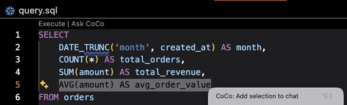
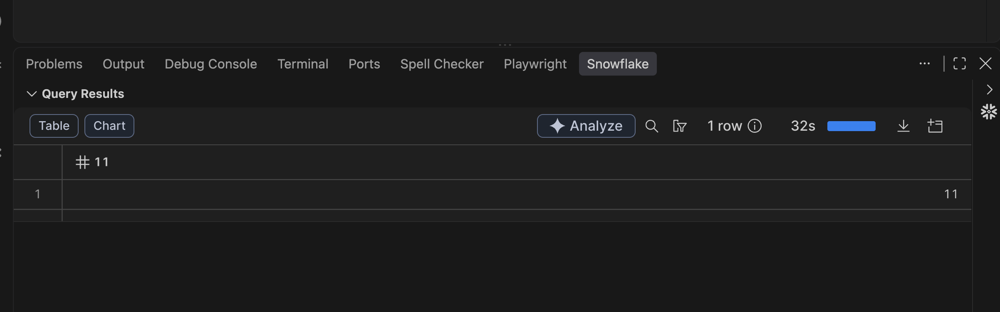
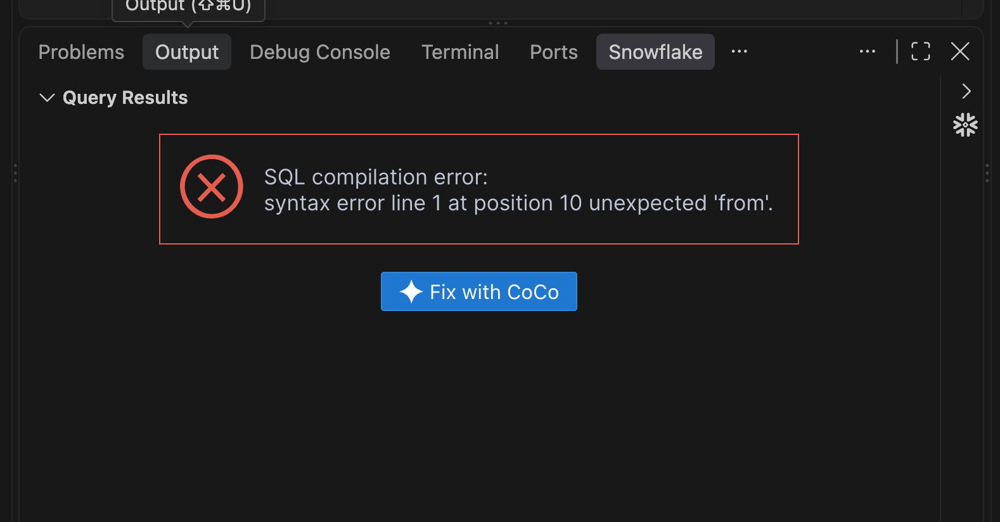

author: Gilberto Hernandez, Snowflake CoCo
id: get-started-coco-vscode-extension
summary: Use Snowflake's coding agent, CoCo (Cortex Code) directly within the VS Code Snowflake extension.
categories: snowflake-site:taxonomy/solution-center/certification/quickstart, snowflake-site:taxonomy/product/cortex-ai
language: en
environments: web
status: Published
feedback link: https://github.com/Snowflake-Labs/sfguides/issues

# Getting Started with CoCo in the Snowflake VS Code Extension
<!-- ------------------------ -->
## Overview

Snowflake CoCo (Cortex Code) is an AI-powered coding agent with deep Snowflake expertise. It can execute SQL, edit files, search your codebase, and run multi-step workflows against your Snowflake account. CoCo in the Snowflake VS Code extension puts that agentic experience directly in the same window where you're already writing code, right alongside the extension's SQL editor, object explorer, and other tools.

In this guide, you'll install the Snowflake extension, open CoCo, and work through a series of interactions to get a feel for CoCo in VS Code. By the end, you'll have built a reusable data quality monitoring procedure entirely through natural-language conversation with CoCo. We'll also cover some options for configuring CoCo in VS Code.

> **Note:** CoCo in the VS Code extension also works in Cursor. Simply install the Snowflake extension from the Cursor marketplace the same way you would in VS Code. Everything in this guide applies to both editors.

### What You'll Learn

- How to install the Snowflake VS Code extension and open CoCo
- How to attach files and workspace context to CoCo using `@` references
- How to execute SQL through CoCo and iterate on queries conversationally
- How to have CoCo generate, propose, and deploy a stored procedure
- How to use skills in the VS Code extension
- How to configure several parameters for CoCo within VS Code

### What You'll Need

- A [Snowflake account](https://signup.snowflake.com/?utm_source=snowflake-devrel&utm_medium=developer-guides&utm_cta=developer-guides) (trial or existing)
- Visual Studio Code installed (or Cursor)
- A Snowflake role with access to at least one database, schema, and warehouse

### What You'll Build

- A stored procedure that monitors a table for data quality issues (null values, duplicates, stale data) – generated entirely through conversation with CoCo within the Snowflake VS Code Extension

<!-- ------------------------ -->
## Install the Snowflake VS Code Extension

Let's start by installing the Snowflake extension and signing in to your account.

### Install from the Marketplace

1. Open VS Code and select **Code** > **Settings** > **Extensions**
2. In the search field, type **Snowflake**.
3. Look for the extension with the Snowflake badge (a check mark in a blue circle) and select **Install**.

After installation completes, you'll see the Snowflake icon in the **Activity Bar** of VS Code.



<!-- ------------------------ -->
## Sign in to Snowflake

Next, sign in to Snowflake using the extension:

1. Select the Snowflake icon in the **Activity Bar**.
2. Enter your **Account Identifier** (or the URL you use to connect to Snowflake) and select **Continue**.
3. Choose your authentication method:
   - **Single sign-on** – uses your SSO credentials
   - **Username/password** – your Snowflake username and password
   - **Key Pair** – uses key-pair authentication
4. Enter your credentials and select **Sign in**.

After a successful sign in, the sidebar displays your account information, your default role, the **Object Explorer** with your databases, and your **Query History**.



<!-- ------------------------ -->
## Open CoCo and Run Your First Prompt

Now that you're signed in, let's open CoCo and have your first conversation.

### Open the CoCo agent chat panel

Start by opening CoCo in the VS Code agent chat panel:

1. In the menu bar, click on **View**, then click **Chat**

2. A chat panel will appear. Click on **CoCo** at the top of the chat panel to select the CoCo agent chat panel.

Alternatively, you can open CoCo from within files in your VS Code workspace. At the top of a file, look for the CoCo icon. Click on the icon to open CoCo in the agent chat panel.

You can also open CoCo from the command palette (`CoCo: Open` or `CoCo: Focus on Chat view`), or with the keyboard shortcut **Shift**+**Cmd**+**L** on macOS (**Shift**+**Ctrl**+**L** on Windows/Linux).

That's it! You now have CoCo ready to go in VS Code. You'll see a chat interface with a text input at the bottom. This is where you'll interact with CoCo. A new chat session starts automatically, scoped to your current VS Code workspace directory.



### Ask your first question

Type the following prompt and press Enter:

```text
What databases do I have access to? Show me the top 5 by size.
```

CoCo will propose running a SQL query against your account. You'll see a permission prompt asking you to approve the action. Select **Allow once** (or **Allow for session** if you'd like to skip future approvals for this session).

After approval, CoCo executes the query and displays the results directly in the chat panel. You should see a table listing your databases with their sizes.

Note that you can specify what mode CoCo should run in directly from the chat panel: 

* **Agent** (the default; CoCo can propose actions and asks you to approve tool calls)

* **Plan** (CoCo produces a plan for you to review before it touches anything)

* **Bypass** (CoCo executes without per-action approval; use with care). 

This guide uses the default Agent mode throughout.

Great – you've now run the core building loop with CoCo in VS Code: you ask, CoCo proposes, you approve, results appear. All within VS Code, against your connected Snowflake account.

<!-- ------------------------ -->
## Use Editor Context with CoCo

There are a few ways to point CoCo at what you want it to read. Let's cover a few approaches.

### Ask CoCo from the editor

When you have a file open, you'll see an **Ask CoCo** button directly above blocks of code. Click it to send the code block to CoCo as a prompt. This is the fastest way to get CoCo's input on code blocks you're looking at – one click, no typing required.



### Add a selection via right-click

If you want to send specific lines of code to CoCo, select the lines in your editor, right-click, and choose **CoCo: Add selection to chat**. The selected text appears in the chat input as attached context, ready for you to type a follow-up question.



### Attach context with @

You can attach context from your workspace into the CoCo chat panel by using the `@` character. You can use it in a variety of ways:

* You can attach a single file by typing `@` and then selecting the specific file

* You can attach more than one file by using `@` multiple times in the same prompt

* You can attach entire directories if you want CoCo to consider a broader project context – for example, a **dbt_project.yml** alongside your SQL models, or a **README.md** that describes your pipeline architecture.

* `@` also searches your Snowflake account – you can attach databases, schemas, tables, and other objects as context, not just workspace files.

Let's try the first approach out.

1. Create a new file in your workspace called **sample_query.sql** and paste the following:

```sql
SELECT
    DATE_TRUNC('month', created_at) AS month,
    COUNT(*) AS total_orders,
    SUM(amount) AS total_revenue,
    AVG(amount) AS avg_order_value
FROM orders
GROUP BY 1
ORDER BY 1 DESC
LIMIT 12;
```

2. Switch to the CoCo panel. In the chat input, type `@` and then start typing **sample_query.sql** – CoCo will suggest the file. Select it to attach it as context.

3. Now type your question:

```text
Can you explain what this query does and suggest improvements?
```

CoCo reads the attached file and responds with a detailed breakdown. Here's an example of what you'll get back:

- **What it does:** A monthly order summary for the last 12 months, calculating `total_orders`, `total_revenue`, and `avg_order_value` per month.
- **`LIMIT 12` doesn't guarantee "last 12 months"** – it returns the 12 most recent months with data, which could span more than a year if some months have no orders. CoCo suggests an explicit date filter with `DATEADD`.
- **NULLs silently skew results** – `COUNT(*)` counts rows with NULL `amount`, but `SUM` and `AVG` ignore them. CoCo flags this mismatch.
- **Missing rounding** – CoCo suggests `ROUND(SUM(amount), 2)` and `ROUND(AVG(amount), 2)`.
- **No order status filter** – if the table has a `status` column, cancelled or refunded orders may be inflating counts.
- **Add a median** – `AVG` is sensitive to outliers. CoCo suggests `MEDIAN(amount)` since Snowflake supports it natively.
- **Fully qualify the table** – `FROM orders` relies on the session's default database/schema. CoCo recommends a full path.

This is a good example of what CoCo brings to the table: it doesn't just explain the SQL, it identifies subtle correctness issues that are easy to miss during development.


<!-- ------------------------ -->
## Execute SQL Through CoCo

So far you've asked CoCo questions and let it read local files. CoCo can also run queries against your Snowflake account and iterate on results conversationally.

### Explore a table

Ask CoCo to help you understand a table in your account:

```text
Describe the SNOWFLAKE_SAMPLE_DATA.TPCH_SF1.ORDERS table. What columns does it have and how many rows?
```

CoCo will run `DESCRIBE TABLE` and `SELECT COUNT(*)` (with your approval), then present the results with an explanation of each column.

### Iterate on a query

Now let's build a query conversationally:

```text
Write me a query that shows the top 10 customers by total order amount from that orders table, including their order count and average order value.
```

CoCo generates the SQL and offers to run it. After you approve, results appear in a grid within the chat panel. You can copy values or download the results from that grid.

If you want to refine the results, just continue the conversation:

```text
Add a filter so we only see customers who placed at least 5 orders.
```

CoCo modifies the query and runs the updated version. You're building queries through dialogue, and each iteration takes a single follow-up message.

### Analyze query results

CoCo can also read the result grid from queries you've already run, including queries you executed directly in the extension's SQL editor. The query results panel gives you two one-click handoffs to CoCo:

- **Analyze** – appears on a successful result set. Click it to send the results to CoCo for interpretation, summarization, or follow-up questions.



- **Fix with CoCo** – appears when a query returns a SQL compilation or execution error. Click it to hand the failing query and error message to CoCo so it can diagnose and propose a fix.



This turns the result grid into another form of context – you don't have to copy rows or errors into the chat.

<!-- ------------------------ -->
## Build a Data Quality Monitor

With the basics covered, let's build something a little more real. We'll ask CoCo to generate a stored procedure that checks a table for common data quality issues – null values, duplicate keys, and stale data. This demonstrates the full loop: natural language to code generation to diff review to deployment.

### Set up the context

First, let's create a table to monitor. Ask CoCo:

```text
Create a database called COCO_VS_CODE_QUICKSTART_DB with a schema called MONITORING. 
Then create a sample table called CUSTOMER_EVENTS with columns: 
event_id (VARCHAR), customer_id (VARCHAR), event_type (VARCHAR), 
event_timestamp (TIMESTAMP_NTZ), amount (NUMBER(10,2)). 
Insert 100 sample rows with some intentional quality issues – 
a few null customer_ids, some duplicate event_ids, and a few rows 
with event_timestamp from over 30 days ago.
```

CoCo will propose the SQL statements, ask for approval, and execute them. You should see confirmation messages as each object is created and the data is inserted.

### Generate the data quality procedure

Now ask CoCo to build the monitoring procedure:

```text
Create a stored procedure called CHECK_DATA_QUALITY in COCO_VS_CODE_QUICKSTART_DB.MONITORING 
that accepts a table name as input and checks for:

1. Null values in each column (report count and percentage)
2. Duplicate values in the first column (assumed to be the primary key)
3. Data freshness - flag if the most recent timestamp column value is older than 24 hours

The procedure should return a structured result with all findings.
Write it as a SQL file in my workspace.
```

Here's what the procedure will check:

- Null values in every column, with a count and percentage for each
- Duplicate values in the primary key column (the first column)
- Data freshness – whether the most recent timestamp is older than 24 hours

CoCo will generate a stored procedure and propose creating a file in your workspace. You'll see a summarized diff showing the new file contents. Here's what the interaction looks like:

- CoCo proposes the file with a diff view
- You can **Accept** all changes, **Revert** them, or review at a finer granularity
- If you accept, the file is written to your workspace

### Review and deploy

After accepting the file, you'll have a new SQL file in your workspace (something like **check_data_quality.sql**). Open it in the editor to review the procedure.

Now ask CoCo to deploy it:

```text
Execute this stored procedure to create it in Snowflake, then call it 
against COCO_VS_CODE_QUICKSTART_DB.MONITORING.CUSTOMER_EVENTS so I can see the results.
```

CoCo reads the active file (the procedure you just accepted), executes the `CREATE OR REPLACE PROCEDURE` statement, then calls the procedure. You should see a result showing:

- Which columns have null values (and the count/percentage)
- Any duplicate primary key values found
- Whether the data is fresh or stale

Great job! You've just built and deployed a reusable data quality monitor entirely through conversation. The procedure lives in your Snowflake account and can be scheduled as a task or called on-demand.

<!-- ------------------------ -->
## Use Skills

Skills are packaged capabilities that CoCo can invoke – they work identically across all CoCo surfaces, whether you're in the VS Code extension, the CLI, Desktop, or Snowsight. Let's see how to use them.

### Browse available skills

In the CoCo chat input, type `/` to open the skills menu. You'll see a list of available skills that CoCo can invoke. Scroll through to see what's available – skills for SQL authoring, dynamic tables, Snowpark, Streamlit development, and more.

### Invoke a skill

Select a skill from the menu (or type its name after the `/`). For example:

```text
/sql-author
```

Skills inject specialized knowledge and procedures into the conversation. When you invoke a skill, CoCo gains domain-specific guidance for that topic – more targeted recommendations, better code generation, and awareness of best practices specific to that feature area.

> **Note:** The same skills you've installed for the CoCo CLI work here too. If you've built custom skills (`.cortex/skills/` in your workspace), CoCo picks them up in the VS Code extension.

<!-- ------------------------ -->
## Clean Up

Let's clean up the objects we created during this guide. Ask CoCo:

```text
Drop the database COCO_VS_CODE_QUICKSTART_DB and all objects in it.
```

Or execute the following SQL directly:

```sql
DROP DATABASE IF EXISTS COCO_VS_CODE_QUICKSTART_DB;
```

You can also delete the **sample_query.sql** and **check_data_quality.sql** files from your workspace.

<!-- ------------------------ -->
## Conclusion and Resources

Congratulations! You've gone from installing the extension to building and deploying a real stored procedure, all through conversation with CoCo in your editor.

### What You Learned

- How to install the Snowflake VS Code extension and access CoCo from the Activity Bar
- How to attach files and workspace context to CoCo using `@` references
- How to iterate on queries conversationally and view results in the chat panel
- How to have CoCo generate files, review diffs, and deploy stored procedures
- How skills work in the VS Code extension (identically to the CLI)

### Related Resources

- [CoCo in the Snowflake VS Code Extension (docs)](https://docs.snowflake.com/en/user-guide/vscode-ext#coco-in-the-snowflake-extension-for-visual-studio-code)
- [Cortex Code in your code editor](https://docs.snowflake.com/en/user-guide/cortex-code/cortex-code-in-your-editor)
- [Cortex Code managed settings](https://docs.snowflake.com/en/user-guide/cortex-code/managed-settings)
- [CoCo CLI](https://docs.snowflake.com/en/user-guide/cortex-code/cortex-code-cli)
- [VS Code enterprise policies](https://code.visualstudio.com/docs/enterprise/policies)
