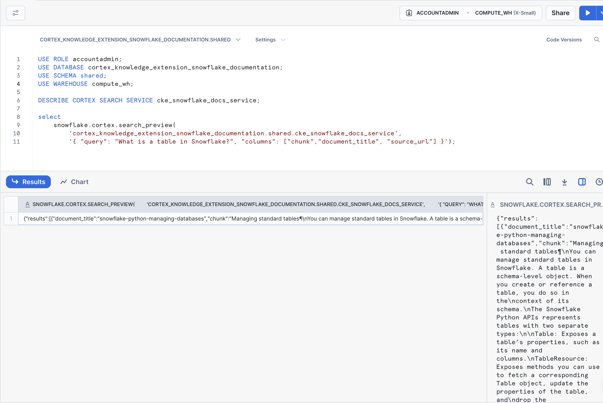
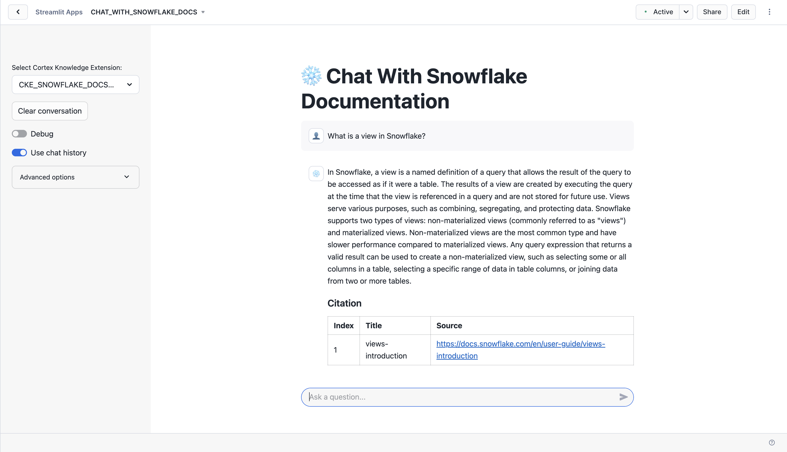

author: Gilberto Hernandez, Chris Cardillo
id: get-started-snowflake-cortex-knowledge-extensions
categories: snowflake-site:taxonomy/solution-center/certification/quickstart, snowflake-site:taxonomy/product/ai, snowflake-site:taxonomy/snowflake-feature/ingestion/conversational-assistants, snowflake-site:taxonomy/snowflake-feature/cortex-llm-functions, snowflake-site:taxonomy/snowflake-feature/marketplace-and-integrations
language: en
summary: Configure Cortex Knowledge Extensions to enhance AI capabilities with custom enterprise knowledge bases and domain expertise.
environments: web
status: Published
feedback link: https://github.com/Snowflake-Labs/sfguides/issues


# Getting Started with Cortex Knowledge Extensions on Snowflake Marketplace
## Overview 

### Overview

In this Quickstart, you'll build a chatbot that allows you to chat with the data shared in a Snowflake Cortex Knowledge Extension.

Snowflake Cortex Knowledge Extensions allow teams to integrate up-to-date, licensed third-party information, such as news, research, and specialized publications, directly into their AI systems. This integration respects publishers' intellectual property while enabling access to relevant and current knowledge.

We'll build the chatbot using a few key Snowflake features:

* Snowflake Marketplace

* Snowflake Cortex Knowledge Extensions

* Snowflake Cortex AI

* Streamlit in Snowflake

Here's how we'll use each feature:

**Snowflake Marketplace**

We'll obtain the Cortex Knowledge Extension from Snowflake Marketplace and load it into a Snowflake account.

**Snowflake Cortex Knowledge Extension**

We'll load the Snowflake Cortex Knowledge Extension into our account after locating it in the Snowflake Marketplace. This extension will have the relevant data that can be used with our chatbot.

**Snowflake Cortex AI**

We'll use Snowflake Cortex AI's **COMPLETE** to generate and return responses in the chatbot. We'll use it in combination with a prompt we provide, and an LLM hosted natively in Snowflake.

**Streamlit in Snowflake**

We'll build the application's front-end using Streamlit in Snowflake.


### Prerequisites
- Some basic familiarity with SQL
- Some basic familiarity with Retrieval Augmented Generation ("RAG")

### What You'll Learn 
- Using Snowflake Marketplace for agentic products, like Cortex Knowledge Extensions
- How to understand and use a Cortex Knowledge Extension
- How to use **COMPLETE** in Snowflake Cortex AI
- How to build an application using Streamlit in Snowflake

### What You'll Need 
- A free Snowflake trial account
- The companion GitHub repo that contains the code to complete this lab: [sfguide-get-started-snowflake-cortex-knowledge-extensions](https://github.com/Snowflake-Labs/sfguide-get-started-snowflake-cortex-knowledge-extensions/)

### What You'll Build 
- A chatbot that uses a Cortex Knowledge Extension


<!-- ------------------------ -->
## Cortex Knowledge Extensions

Cortex Knowledge Extensions (CKEs) allow publishers to bring their documents (e.g. news articles, market research reports, books, articles, etc.) to customers in their generative AI applications (e.g. chat interfaces, agentic platforms, etc.).

CKEs are shared Cortex Search Services on the Snowflake Marketplace that integrate with Cortex generative AI applications following the [retrieval augmented generation (RAG) pattern](/en/developers/guides/ask-questions-to-your-own-documents-with-snowflake-cortex-search/). 

Here is how it works:

- A **Provider** uploads their text documents into a Table in the Provider account and indexes that data with a Cortex Search Service. This Cortex Search Service is then shared onto the Snowflake Marketplace and is known as a Cortex Knowledge Extension (CKE). 

- A **Consumer** builds a generative AI application such as a chatbot using Cortex LLM functions or the Cortex Agent API with the Cortex Knowledge Extension, which all work together leveraging retrieval augmented generation (RAG). 


<!-- ------------------------ -->
## Open a Snowflake Trial Account

To complete this lab, you'll need a Snowflake account. A free Snowflake trial account will work just fine. To open one:

1. Navigate to [https://signup.snowflake.com/](https://signup.snowflake.com/?utm_source=snowflake-devrel&utm_medium=developer-guides&trial=student&cloud=aws&region=us-west-2&utm_campaign=introtosnowflake&utm_cta=developer-guides)

2. Start the account creation by completing the first page of the form on the page.

3. On the next section of the form,  set the Snowflake edition to "Enterprise (Most popular").

4. Select "AWS - Amazon Web Services" as the cloud provider.

5. Select "US West (Oregon)" as the region.

6. Complete the rest of the form and click "Get started".

If you choose a different cloud provider, or select a different region within AWS, you will not be able to complete the Quickstart.


<!-- ------------------------ -->
## Chatbot Architecture

In a Cortex Knowledge Extension, a provider securely shares chunked data, along with other important data attributes - like the source of the data, as an example - which can be used in RAG chatbots. Although a consumer can use the data in the extension, the data is fully secure and remains proprietary to the publisher.

Here's how the chatbot will function:

* The chatbot will use Retrieval Augmented Generation ("RAG") to generate and return responses in the app

* The chatbot will retrieve relevant knowledge from the chunked data in the Cortex Knowledge Extensions

* This retrieved knowledge will be used with Snowflake Cortex AI **COMPLETE**, where a prompt and an LLM will generate an intelligible, user-facing response, which will be returned within the app

We're going to build a chatbot that allows you to ask questions of the official Snowflake documentation in natural language. This is possible because Snowflake has published an official Cortex Knowledge Extension that includes chunked data (technical documentation) which is usable in a RAG chatbot. The extension is available on Snowflake Marketplace, so let's start by loading it into our account.

Let's dive in!
<!-- ------------------------ -->
## Cortex Knowledge Extension From Snowflake Marketplace

Let's start by "loading" the relevant Cortex Knowledge Extension into our account. It turns out that "loading" is really the wrong word here. 

We're using Snowflake's unique agentic product sharing capability in Snowflake Marketplace. Because of this, we don't actually need to copy any data to our Snowflake account with any logic. Instead, we can directly access the extension shared by a trusted provider in Snowflake Marketplace. Let's start.

1. Log into your Snowflake account.

2. Click on "Data Products".

3. Click on "Marketplace".

4. In the search bar, search for "cortex knowledge extension snowflake documentation".

5. The first result should be "Cortex Knowledge Extension: Snowflake Documentation" by Snowflake. Click on the listing. You'll notice it's Free.

6. On the right, click "Get".

7. In the ensuing modal, click "Get" once more. Do **NOT** rename the extension.


<!-- ------------------------ -->
## Explore the extension


Let's explore the extension to understand how it works.

1. Start by setting your context in a new SQL worksheet. Run the following in a worksheet:

```sql
USE ROLE accountadmin;
USE SCHEMA shared;
USE WAREHOUSE compute_wh;
```

2. Next, let's show the Cortex Search Services in the account. Run:

```sql
DESCRIBE CORTEX SEARCH SERVICE cke_snowflake_docs_service;
```
You should see some metadata on the **CKE_SNOWFLAKE_DOCS_SERVICE** service in the account. Important to note is the search column, named `CHUNK`, and the additional attribute columns `DOCUMENT_TITLE`, `SOURCE_URL`. 

The `CHUNK` column represents the chunked knowledge that can be used in our RAG chatbot, and the attribute columns allow us to build references to the source knowledge. For example, we can use them to cite the docs page that the end-user can use to confirm the correctness of the answer.

3. Query the service using SQL. Run the next line:

```sql
select 
    snowflake.cortex.search_preview(
        '.shared.cke_snowflake_docs_service', 
        '{ "query": "What is a table in Snowflake?", "columns": ["chunk","document_title", "source_url"] }');
```

 In the console, you'll see a JSON object returned with relevant data corresponding to the attribute columns, and the relevant chunk of data containing the knowledge that can answer the question posed to the extension. Great job! Now let's build the app.




<!-- ------------------------ -->
## Create the Streamlit in Snowflake app

Let's now build the chatbot using Streamlit in Snowflake.

1. Let's start by creating a database and schema to store the app. In a SQL worksheet, run the following:

```sql
USE ROLE accountadmin;
USE WAREHOUSE compute_wh;

CREATE OR REPLACE DATABASE chatbot_db;
CREATE OR REPLACE SCHEMA chatbot_schema;
```

2. Navigate to "Streamlit", in the "Projects" section of your account.

3. Create a new Streamlit app. Name the app "CHAT_WITH_SNOWFLAKE_DOCS". For the app location, select "CHATBOT_DB" and "CHATBOT_SCHEMA". Use "COMPUTE_WH" as the app warehouse. Click "Create".

4. Let the app start up. Once it's ready, click "Edit" to expand the code editor (if not already expanded). Delete all of the code in the editor.

5. [Copy the code in this file and paste it into the editor.](https://github.com/Snowflake-Labs/get-started-snowflake-cortex-knowledge-extensions/blob/main/snowflake_docs_cke.py) 

6. Using the "Packages" picker above the code editor, type in "snowflake". Click on it to add it to the app environment.

7. Click "Run" at the top to run the code.

The application should run and be ready for you to enter a question. Try it out by asking the following questions:

* **What is a view in Snowflake?** - You should receive a response with a link to a relevant page in the docs.

* **What is MongoDB?** - The app should show you that it is unable to answer this question because the source knowledge has no content on this topic.



On the left, you can configure more options for the app, like:

* LLM to use when augmenting the response

* Number of context chunks

* Number of messages to use in chat history

<!-- ------------------------ -->
## Conclusion And Resources

### Conclusion

Congratulations! You've built a RAG chatbot that uses a Cortex Knowledge Extension. 

### What You Learned

You built a RAG chatbot that allows you to chat with the Snowflake Documentation in natural language. You were able to do this by using a Cortex Knowledge Extension, which contained the relevant knowledge (data) to be able to answer questions about the Snowflake docs. You also used Snowflake Cortex AI's **COMPLETE** function and Streamlit in Snowflake.


### Resources

For more resources, check out the following:

**Additional Cortex Knowledge Extensions**

- [Packt](https://app.snowflake.com/marketplace/listing/GZTDZL3G6G/packt-publishing-limited-codesolver?originTab=provider&providerName=Packt%20Publishing%20Limited&profileGlobalName=GZTDZL3G6C)

- [Snowflake Developer Hub](https://developers.snowflake.com)

- [Documentation on Cortex Search Services](https://docs.snowflake.com/en/user-guide/snowflake-cortex/cortex-search/cortex-search-overview)
