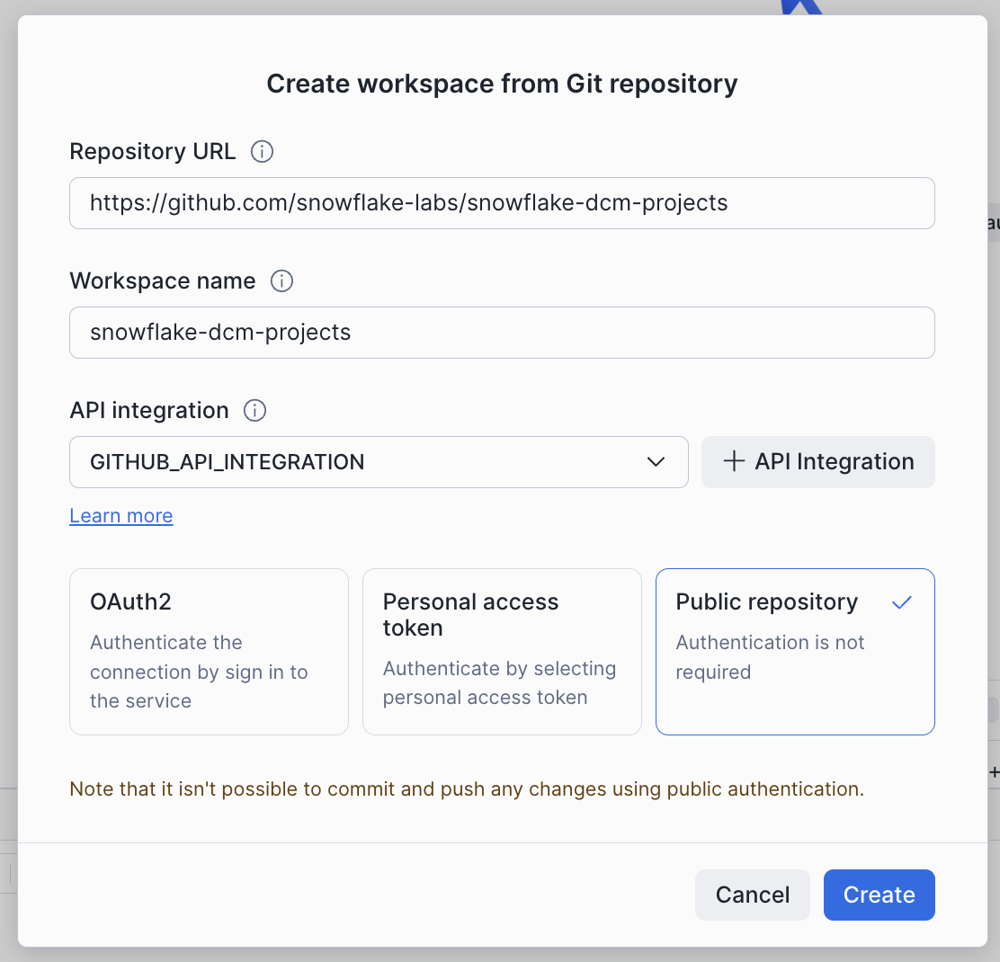
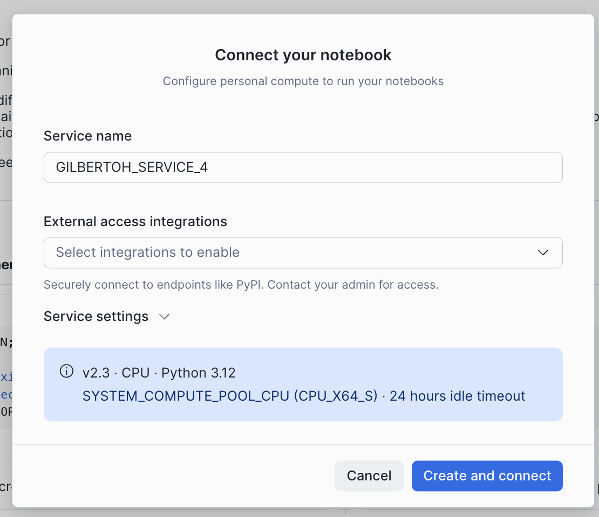
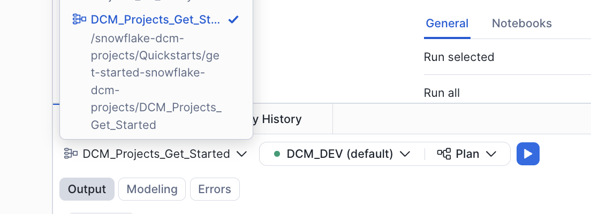
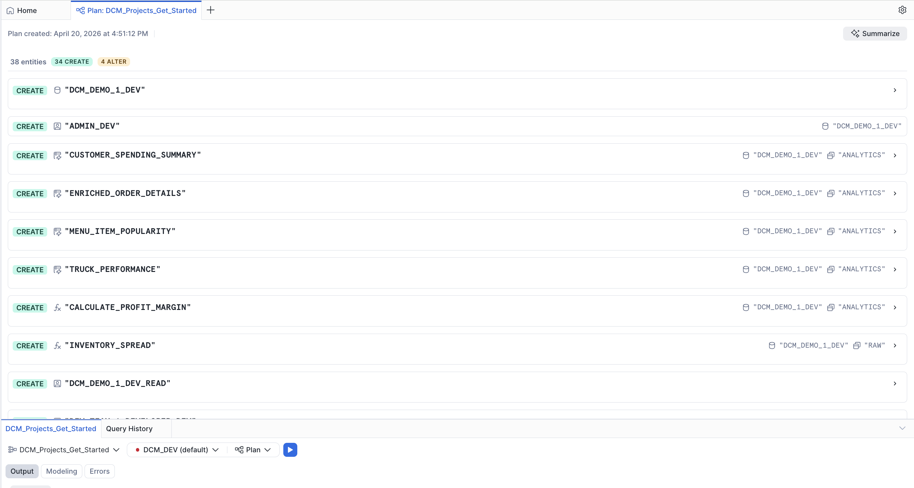
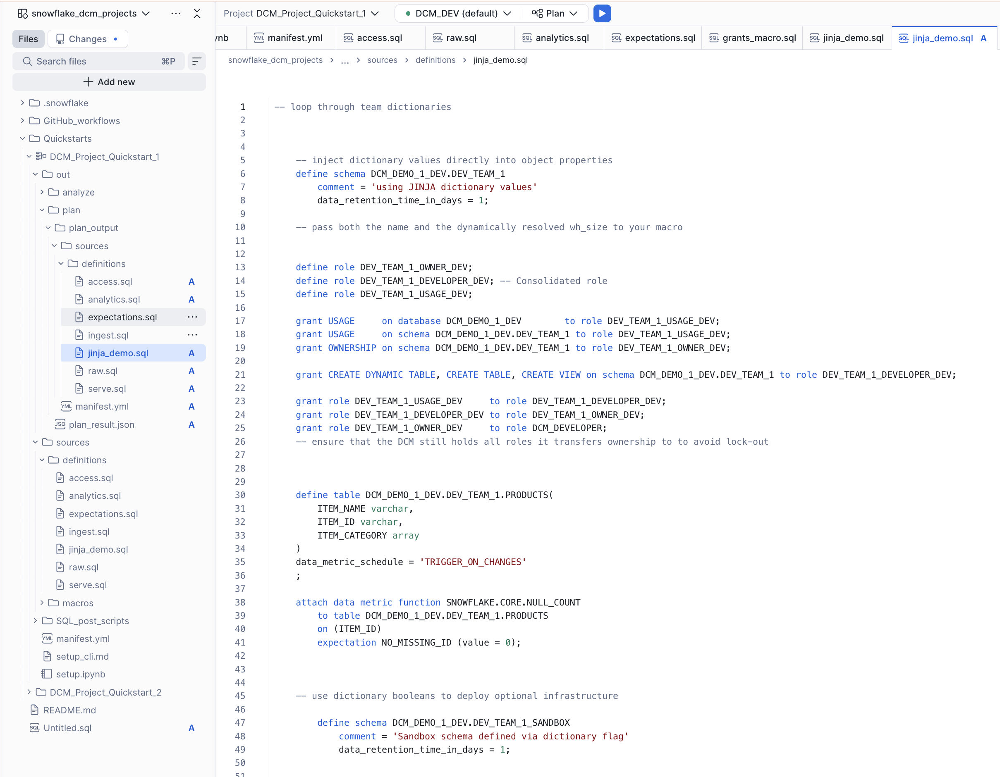
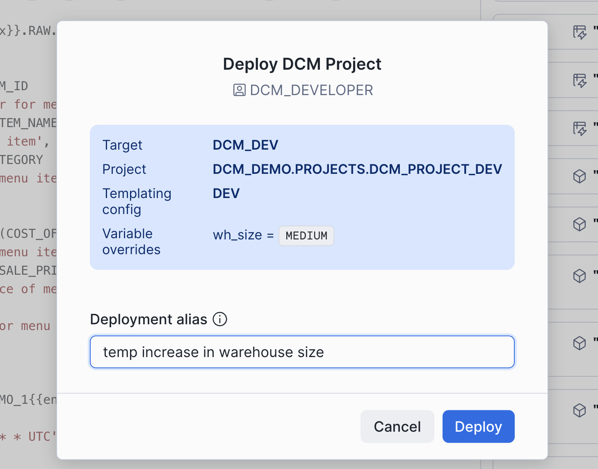
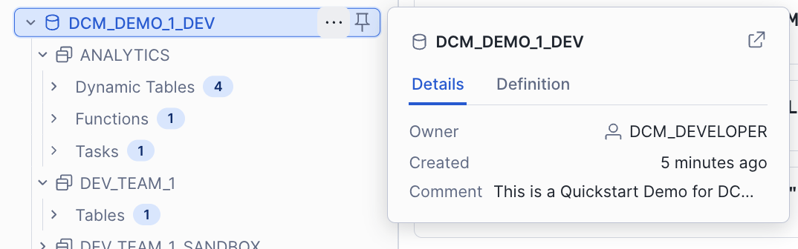

author: Jan Sommerfeld, Gilberto Hernandez
id: get-started-snowflake-dcm-projects
summary: Learn how to define and deploy Snowflake infrastructure as code using DCM Projects.
categories: snowflake-site:taxonomy/solution-center/certification/quickstart, snowflake-site:taxonomy/product/platform
environments: web
status: Published
language: en
feedback link: https://github.com/Snowflake-Labs/sfguides/issues
fork repo link: https://github.com/Snowflake-Labs/snowflake_dcm_projects

# Get Started with Snowflake DCM Projects
<!-- ------------------------ -->
## Overview

Snowflake DCM (Database Change Management) Projects let you define your Snowflake infrastructure as code using SQL-based definition files. Databases, schemas, tables, dynamic tables, views, warehouses, roles, grants, and more can all be defined declaratively, then planned and deployed across multiple environments using Jinja templating.

In this guide, you'll work with a sample DCM Project that defines a food truck analytics pipeline. You'll explore the project files, plan a deployment, deploy the infrastructure to your account, and insert sample data — all from Snowsight Workspaces.

> **Note:** DCM Projects is currently in Public Preview. See the [DCM Projects documentation](https://docs.snowflake.com/en/user-guide/dcm-projects/dcm-projects-overview) for the latest details.

### Prerequisites
- Basic knowledge of Snowflake concepts (databases, schemas, tables, roles)
- Familiarity with SQL

### What You'll Learn
- How DCM Projects define Snowflake infrastructure as code
- How to structure a DCM Project with a manifest and definition files
- How to use Jinja templating to parameterize definitions across environments
- How to plan (dry-run) and deploy changes using the Snowsight Workspaces UI
- How to attach data quality expectations to objects using Data Metric Functions

### What You'll Need
- A [Snowflake account](https://signup.snowflake.com/?utm_source=snowflake-devrel&utm_medium=developer-guides&utm_cta=developer-guides) with ACCOUNTADMIN access (or a role with sufficient privileges)
- Your account must have DCM Projects enabled

### What You'll Build
- A fully deployed food truck analytics pipeline consisting of databases, schemas, tables, dynamic tables, views, roles, grants, and data quality expectations — all defined as code in a DCM Project

<!-- ------------------------ -->
## Set Up Roles and Permissions

In this step, you'll create a dedicated role for managing DCM Projects and grant it the necessary privileges.

### Create a DCM Developer Role

Run the following SQL in a Snowsight worksheet:

```sql
USE ROLE ACCOUNTADMIN;

CREATE ROLE IF NOT EXISTS dcm_developer;
SET user_name = (SELECT CURRENT_USER());
GRANT ROLE dcm_developer TO USER IDENTIFIER($user_name);
```

### Grant Infrastructure Privileges

The DCM_DEVELOPER role needs privileges to create infrastructure objects through DCM deployments:

```sql
GRANT CREATE WAREHOUSE ON ACCOUNT TO ROLE dcm_developer;
GRANT CREATE ROLE ON ACCOUNT TO ROLE dcm_developer;
GRANT CREATE DATABASE ON ACCOUNT TO ROLE dcm_developer;
GRANT EXECUTE MANAGED TASK ON ACCOUNT TO ROLE dcm_developer;
GRANT EXECUTE TASK ON ACCOUNT TO ROLE dcm_developer;

GRANT MANAGE GRANTS ON ACCOUNT TO ROLE dcm_developer;
```

### Grant Data Quality Privileges

To define and test data quality expectations, grant the following:

```sql
GRANT APPLICATION ROLE SNOWFLAKE.DATA_QUALITY_MONITORING_VIEWER TO ROLE dcm_developer;
GRANT APPLICATION ROLE SNOWFLAKE.DATA_QUALITY_MONITORING_ADMIN TO ROLE dcm_developer;
GRANT DATABASE ROLE SNOWFLAKE.DATA_METRIC_USER TO ROLE dcm_developer;
GRANT EXECUTE DATA METRIC FUNCTION ON ACCOUNT TO ROLE dcm_developer;
```

### Create a Warehouse (Optional)

If you don't have a warehouse available, create one. DCM commands are mostly metadata changes, so an X-Small warehouse is sufficient:

```sql
CREATE WAREHOUSE IF NOT EXISTS dcm_wh
WITH
    WAREHOUSE_SIZE = 'XSMALL'
    AUTO_SUSPEND = 300
    COMMENT = 'For Quickstart Demo of DCM Projects';
```

<!-- ------------------------ -->
## Create a Workspace from Git

In this step, you'll create a Snowsight Workspace linked to the sample DCM Project repository on GitHub.

1. Navigate to your Snowsight Workspace.
2. Click **Create** and select **From Git repository**.
3. Enter the repository URL: `https://github.com/snowflake-labs/snowflake_dcm_projects`
4. Select an API Integration for GitHub (create one if needed).
5. Select **Public repository**.



Once the workspace is created, you'll see the repository files in the file explorer. Navigate to **Quickstarts/DCM_Project_Quickstart_1** to find the project files you'll be working with.

Open the `setup.ipynb` notebook file and connect it to a compute pool so you can run the setup commands step by step.



**Tip:** Use the split-screen feature in Workspaces to keep the manifest and definition files on one side and the setup notebook on the other.

<!-- ------------------------ -->
## Explore the Project Files

Before deploying anything, take a moment to explore the DCM Project structure. A DCM Project consists of a **manifest file** and one or more **definition files** organized in a `sources/` directory.

### Manifest

Open `manifest.yml` in the file explorer. The manifest is the configuration file for your DCM Project. It defines:

- **Targets** — Named deployment environments (e.g., DEV, STAGE, PROD), each pointing to a specific Snowflake account and DCM Project object
- **Templating configurations** — Variable values that change per environment (e.g., database suffixes, warehouse sizes, team lists)

Here's the manifest for this project:

```yaml
manifest_version: 2
type: DCM_PROJECT

default_target: DCM_DEV

targets:
  DCM_DEV:
    account_identifier: MYORG-MY_DEV_ACCOUNT
    project_name: DCM_DEMO.PROJECTS.DCM_PROJECT_DEV
    project_owner: DCM_DEVELOPER
    templating_config: DEV

  DCM_STAGE:
    account_identifier: MYORG-MY_STAGE_ACCOUNT
    project_name: DCM_DEMO.PROJECTS.DCM_PROJECT_STG
    project_owner: DCM_STAGE_DEPLOYER
    templating_config: STAGE

  DCM_PROD_US:
    account_identifier: MYORG-MY_ACCOUNT_US
    project_name: DCM_DEMO.PROJECTS.DCM_PROJECT_PROD
    project_owner: DCM_PROD_DEPLOYER
    templating_config: PROD

templating:
  defaults:
    user: "GITHUB_ACTIONS_SERVICE_USER"
    wh_size: "X-SMALL"

  configurations:
    DEV:
      env_suffix: "_DEV"
      user: "INSERT_YOUR_USER"
      project_owner_role: "DCM_DEVELOPER"
      teams:
        - name: "DEV_TEAM_1"
          data_retention_days: 1
          needs_sandbox_schema: true

    PROD:
      env_suffix: ""
      wh_size: "LARGE"
      project_owner_role: "DCM_PROD_DEPLOYER"
      teams:
        - name: "Marketing"
          data_retention_days: 1
          needs_sandbox_schema: true
        - name: "Finance"
          data_retention_days: 30
          needs_sandbox_schema: false
        - name: "HR"
          data_retention_days: 7
          needs_sandbox_schema: false
        - name: "IT"
          data_retention_days: 14
          needs_sandbox_schema: true
        - name: "Sales"
          data_retention_days: 1
          needs_sandbox_schema: false
        - name: "Research"
          data_retention_days: 7
          needs_sandbox_schema: true
```

Notice how the `DEV` configuration uses `env_suffix: "_DEV"` while `PROD` uses `env_suffix: ""`. This allows the same definition files to create `DCM_DEMO_1_DEV` in development and `DCM_DEMO_1` in production. The `teams` list is also different per environment — DEV has a single team, while PROD has six.

### Definition Files

The `sources/definitions/` directory contains SQL files that define your Snowflake infrastructure. Each file uses `DEFINE` statements and Jinja templating variables (like `{{env_suffix}}`):

| File | What It Defines |
|:-----|:----------------|
| `raw.sql` | Database, schemas, and raw landing tables (TRUCK, MENU, CUSTOMER, etc.) |
| `access.sql` | Warehouse, database roles, account roles, and grants |
| `analytics.sql` | Dynamic tables for transformations and a UDF for profit margin calculation |
| `serve.sql` | Views for dashboards and reporting |
| `ingest.sql` | A stage and a Task for loading data from CSV files |
| `expectations.sql` | Data quality expectations using Data Metric Functions |
| `jinja_demo.sql` | Examples of Jinja loops, conditionals, and macros |

For example, here's how `raw.sql` defines the database and a table:

```sql
DEFINE DATABASE dcm_demo_1{{env_suffix}}
    COMMENT = 'This is a Quickstart Demo for DCM Projects';

DEFINE SCHEMA dcm_demo_1{{env_suffix}}.raw;

DEFINE TABLE dcm_demo_1{{env_suffix}}.raw.menu (
    menu_item_id NUMBER,
    menu_item_name VARCHAR,
    item_category VARCHAR,
    cost_of_goods_usd NUMBER(10, 2),
    sale_price_usd NUMBER(10, 2)
)
CHANGE_TRACKING = TRUE;
```

The `{{env_suffix}}` variable is replaced at deployment time based on the target configuration — `_DEV` for development, empty string for production.

And here's how `analytics.sql` defines a dynamic table that joins across several raw tables to create enriched order details:

```sql
DEFINE DYNAMIC TABLE dcm_demo_1{{env_suffix}}.analytics.enriched_order_details
WAREHOUSE = dcm_demo_1_wh{{env_suffix}}
TARGET_LAG = 'DOWNSTREAM'
INITIALIZE = 'ON_SCHEDULE'
DATA_METRIC_SCHEDULE = 'TRIGGER_ON_CHANGES'
AS
SELECT
    oh.order_id,
    oh.order_ts,
    od.quantity,
    m.menu_item_name,
    m.item_category,
    m.sale_price_usd,
    (od.quantity * m.sale_price_usd) AS line_item_revenue,
    (od.quantity * (m.sale_price_usd - m.cost_of_goods_usd)) AS line_item_profit,
    c.customer_id,
    c.first_name,
    c.last_name,
    INITCAP(c.city) AS customer_city,
    t.truck_id,
    t.truck_brand_name
FROM dcm_demo_1{{env_suffix}}.raw.order_header oh
JOIN dcm_demo_1{{env_suffix}}.raw.order_detail od ON oh.order_id = od.order_id
JOIN dcm_demo_1{{env_suffix}}.raw.menu m ON od.menu_item_id = m.menu_item_id
JOIN dcm_demo_1{{env_suffix}}.raw.customer c ON oh.customer_id = c.customer_id
JOIN dcm_demo_1{{env_suffix}}.raw.truck t ON oh.truck_id = t.truck_id;
```

### Macros

The `sources/macros/` directory contains reusable Jinja macros. Open `grants_macro.sql` to see a macro that creates a standard set of roles for each team:

```sql


    DEFINE ROLE {{team}}_OWNER{{env_suffix}};
    DEFINE ROLE {{team}}_DEVELOPER{{env_suffix}};
    DEFINE ROLE {{team}}_USAGE{{env_suffix}};

    GRANT USAGE ON DATABASE dcm_demo_1{{env_suffix}}
        TO ROLE {{team}}_USAGE{{env_suffix}};
    GRANT OWNERSHIP ON SCHEMA dcm_demo_1{{env_suffix}}.{{team}}
        TO ROLE {{team}}_OWNER{{env_suffix}};

    GRANT CREATE DYNAMIC TABLE, CREATE TABLE, CREATE VIEW
        ON SCHEMA dcm_demo_1{{env_suffix}}.{{team}}
        TO ROLE {{team}}_DEVELOPER{{env_suffix}};

    GRANT ROLE {{team}}_USAGE{{env_suffix}} TO ROLE {{team}}_DEVELOPER{{env_suffix}};
    GRANT ROLE {{team}}_DEVELOPER{{env_suffix}} TO ROLE {{team}}_OWNER{{env_suffix}};
    GRANT ROLE {{team}}_OWNER{{env_suffix}} TO ROLE {{project_owner_role}};


```

This macro is called in `jinja_demo.sql` inside a `` loop that iterates over the `teams` list from the manifest configuration. For each team, it creates a schema, a set of roles, a products table, and optionally a sandbox schema — all driven by the manifest's templating values:

```sql

    

    DEFINE SCHEMA dcm_demo_1{{env_suffix}}.{{team_name}}
        COMMENT = 'using JINJA dictionary values'
        DATA_RETENTION_TIME_IN_DAYS = {{ team.data_retention_days }};

    {{ create_team_roles(team_name) }}

    
        DEFINE SCHEMA dcm_demo_1{{env_suffix}}.{{team_name}}_SANDBOX
            COMMENT = 'Sandbox schema defined via dictionary flag'
            DATA_RETENTION_TIME_IN_DAYS = 1;
    


```

When deployed to DEV, this loop runs once (for `DEV_TEAM_1`). When deployed to PROD, it runs six times — once for each team — creating a unique set of schemas and roles for Marketing, Finance, HR, IT, Sales, and Research.

<!-- ------------------------ -->
## Create the DCM Project Object

Now that you've explored the project files, create the DCM Project object in Snowflake. This is the object that executes deployments and stores their history.

Run the following in the setup notebook or in a Snowsight worksheet:

```sql
USE ROLE dcm_developer;

CREATE DATABASE IF NOT EXISTS dcm_demo;
CREATE SCHEMA IF NOT EXISTS dcm_demo.projects;

CREATE OR REPLACE DCM PROJECT dcm_demo.projects.dcm_project_dev
    COMMENT = 'for testing DCM Projects Quickstarts';
```

The DCM Project object `dcm_project_dev` is now created in `dcm_demo.projects`. This is the object referenced in the manifest's `DCM_DEV` target.

<!-- ------------------------ -->
## Plan a Deployment

Before deploying changes, always run a **Plan** first. A Plan is a dry-run that shows you exactly what changes DCM will make without actually executing them.

### Select the Project

1. In the DCM control panel above the workspace tabs, select the project **DCM_Project_Quickstart_1**.
2. The `DCM_DEV` target should already be selected (it's the default in the manifest).
3. Click on the target profile to verify it uses `DCM_PROJECT_DEV` and the `DEV` templating configuration.
4. Override the templating value for `user` with your own Snowflake username.



### Execute the Plan

Click the play button to the right of **Plan** and wait for the definitions to render, compile, and dry-run.

Since none of the defined objects exist yet, the plan will show only **CREATE** statements. You should see planned operations for:

- 1 database (`DCM_DEMO_1_DEV`)
- Multiple schemas (`RAW`, `ANALYTICS`, `SERVE`, plus team schemas from the Jinja demo)
- Tables with change tracking enabled
- Dynamic tables with various target lags
- Views and secure views
- A warehouse, roles, and grants
- A stage and a task for data ingestion
- Data quality expectations (Data Metric Functions attached to columns)



### Review the Plan Output

In the file explorer, notice that a new `out` folder was created above `sources`. This contains the **rendered Jinja output** for all definition files.

Open the `jinja_demo.sql` file from the plan output side-by-side with the original `jinja_demo.sql` in `sources/definitions/` to see how the Jinja templating was resolved — loops expanded, conditionals evaluated, and variables replaced with their DEV configuration values.



<!-- ------------------------ -->
## Deploy the Project

If the plan result looks correct and all planned changes match your expectations, you can deploy.

1. In the top-right corner of the Plan results tab, click **Deploy**.
2. Optionally, add a **Deployment alias** — think of it as a commit message that appears in the deployment history of your project.
3. DCM will create all objects and attach grants and expectations using the owner role of the project object.



Once the deployment completes successfully, refresh the Database Explorer on the left side of Snowsight. You should see the `DCM_DEMO_1_DEV` database and all of the created objects inside it.



<!-- ------------------------ -->
## Insert Sample Data

The deployment created the table structures, but they're empty. In this step, you'll insert sample data to populate the raw tables and bring the dynamic tables and views to life.

Run the following SQL to insert sample data:

```sql
INSERT INTO dcm_demo_1_dev.raw.truck
VALUES
    (103, 'Taco Titan', 'Mexican Street Food'),
    (104, 'The Rolling Dough', 'Artisan Pizza'),
    (105, 'Wok n Roll', 'Asian Fusion'),
    (106, 'Curry in a Hurry', 'Indian Express'),
    (107, 'Seoul Food', 'Korean BBQ'),
    (108, 'The Pita Pit Stop', 'Mediterranean'),
    (109, 'BBQ Barn', 'Slow-cooked Brisket'),
    (110, 'Sweet Retreat', 'Desserts & Shakes');

INSERT INTO dcm_demo_1_dev.raw.menu
VALUES
    (7, 'Beef Birria Tacos', 'Tacos', 3.00, 11.50),
    (8, 'Margherita Pizza', 'Pizza', 4.50, 12.00),
    (9, 'Pad Thai', 'Noodles', 3.50, 10.00),
    (10, 'Chicken Tikka Masala', 'Curry', 4.00, 13.50),
    (11, 'Bulgogi Bowl', 'Bowls', 4.25, 12.50),
    (12, 'Lamb Gyro', 'Wraps', 4.00, 10.00),
    (13, 'Pulled Pork Slider', 'Burgers', 2.50, 8.00),
    (14, 'Chocolate Lava Cake', 'Desserts', 1.50, 6.00),
    (15, 'Iced Matcha Latte', 'Drinks', 1.20, 5.00),
    (16, 'Garlic Parmesan Wings', 'Sides', 3.00, 9.00),
    (17, 'Vegan Poke Bowl', 'Bowls', 4.00, 13.00),
    (18, 'Kimchi Fries', 'Sides', 2.50, 7.50),
    (19, 'Mango Lassi', 'Drinks', 1.00, 4.50),
    (20, 'Double Pepperoni Pizza', 'Pizza', 5.00, 14.00);

INSERT INTO dcm_demo_1_dev.raw.customer
VALUES
    (4, 'David', 'Miller', 'London'),
    (5, 'Eve', 'Davis', 'New York'),
    (6, 'Frank', 'Wilson', 'Chicago'),
    (7, 'Grace', 'Lee', 'San Francisco'),
    (8, 'Hank', 'Moore', 'Austin'),
    (9, 'Ivy', 'Taylor', 'London'),
    (10, 'Jack', 'Anderson', 'New York'),
    (11, 'Karen', 'Thomas', 'Chicago'),
    (12, 'Leo', 'White', 'Austin'),
    (13, 'Mia', 'Harris', 'San Francisco'),
    (14, 'Noah', 'Martin', 'London'),
    (15, 'Olivia', 'Thompson', 'New York'),
    (16, 'Paul', 'Garcia', 'Austin'),
    (17, 'Quinn', 'Martinez', 'Chicago'),
    (18, 'Rose', 'Robinson', 'London'),
    (19, 'Sam', 'Clark', 'San Francisco'),
    (20, 'Tina', 'Rodriguez', 'New York');

INSERT INTO dcm_demo_1_dev.raw.inventory
VALUES
    (7, 103, 50, '2023-10-27 09:00:00'), (8, 104, 40, '2023-10-27 09:00:00'),
    (9, 105, 30, '2023-10-27 09:00:00'), (10, 106, 45, '2023-10-27 09:00:00'),
    (11, 107, 35, '2023-10-27 09:00:00'), (12, 108, 60, '2023-10-27 09:00:00'),
    (13, 109, 55, '2023-10-27 09:00:00'), (14, 110, 25, '2023-10-27 09:00:00'),
    (7, 103, 42, '2023-10-28 20:00:00'), (8, 104, 35, '2023-10-28 20:00:00'),
    (9, 105, 22, '2023-10-28 20:00:00'), (10, 106, 38, '2023-10-28 20:00:00'),
    (11, 107, 28, '2023-10-28 20:00:00'), (12, 108, 45, '2023-10-28 20:00:00'),
    (15, 103, 100, '2023-10-27 08:00:00'), (16, 104, 80, '2023-10-27 08:00:00'),
    (17, 105, 40, '2023-10-27 08:00:00'), (18, 107, 90, '2023-10-27 08:00:00'),
    (19, 106, 60, '2023-10-27 08:00:00'), (20, 104, 30, '2023-10-27 08:00:00');

INSERT INTO dcm_demo_1_dev.raw.order_header
VALUES
    (1006, 4, 103, '2023-10-28 14:00:00'), (1007, 5, 104, '2023-10-28 14:15:00'),
    (1008, 6, 105, '2023-10-28 15:30:00'), (1009, 7, 106, '2023-10-28 16:45:00'),
    (1010, 8, 107, '2023-10-28 17:00:00'), (1011, 9, 108, '2023-10-29 11:30:00'),
    (1012, 10, 109, '2023-10-29 12:00:00'), (1013, 11, 110, '2023-10-29 12:15:00'),
    (1014, 12, 101, '2023-10-29 13:00:00'), (1015, 13, 102, '2023-10-29 13:30:00'),
    (1016, 14, 103, '2023-10-29 14:00:00'), (1017, 15, 104, '2023-10-29 14:20:00'),
    (1018, 16, 105, '2023-10-29 15:00:00'), (1019, 17, 106, '2023-10-29 15:45:00'),
    (1020, 18, 107, '2023-10-29 16:10:00'), (1021, 19, 108, '2023-10-29 17:00:00'),
    (1022, 20, 109, '2023-10-30 11:00:00'), (1023, 1, 110, '2023-10-30 11:30:00'),
    (1024, 2, 103, '2023-10-30 12:15:00'), (1025, 3, 104, '2023-10-30 13:00:00');

INSERT INTO dcm_demo_1_dev.raw.order_detail
VALUES
    (1006, 7, 3), (1006, 15, 2),
    (1007, 8, 1), (1007, 16, 1),
    (1008, 9, 1), (1008, 18, 1),
    (1009, 10, 2), (1009, 19, 2),
    (1010, 11, 1), (1010, 18, 1),
    (1011, 12, 2), (1011, 3, 1),
    (1012, 13, 3), (1012, 5, 3),
    (1013, 14, 2), (1013, 15, 2),
    (1014, 1, 1), (1014, 6, 1),
    (1015, 2, 2), (1015, 3, 2);
```

Manually refresh the dynamic tables to initialize them:

```sql
ALTER DYNAMIC TABLE DCM_DEMO_1_DEV.ANALYTICS.ENRICHED_ORDER_DETAILS REFRESH;
ALTER DYNAMIC TABLE DCM_DEMO_1_DEV.ANALYTICS.MENU_ITEM_POPULARITY REFRESH;
ALTER DYNAMIC TABLE DCM_DEMO_1_DEV.ANALYTICS.CUSTOMER_SPENDING_SUMMARY REFRESH;
```

Beyond this, the dynamic tables defined in `analytics.sql` will automatically refresh based on their target lag settings, and the views in `serve.sql` will reflect the new data.

Verify by querying one of the serving views:

```sql
SELECT * FROM dcm_demo_1_dev.serve.v_dashboard_daily_sales;
```

You can also check the dynamic tables directly:

```sql
SELECT * FROM dcm_demo_1_dev.analytics.enriched_order_details;
SELECT * FROM dcm_demo_1_dev.analytics.menu_item_popularity;
SELECT * FROM dcm_demo_1_dev.analytics.customer_spending_summary;
```

<!-- ------------------------ -->
## Cleanup

To clean up the objects created in this guide, run the following:

```sql
USE ROLE dcm_developer;

-- Drop the deployed infrastructure
DROP DATABASE IF EXISTS dcm_demo_1_dev;
DROP WAREHOUSE IF EXISTS dcm_demo_1_wh_dev;

-- Drop roles created by the deployment
DROP ROLE IF EXISTS dcm_demo_1_dev_read;
DROP ROLE IF EXISTS dev_team_1_owner_dev;
DROP ROLE IF EXISTS dev_team_1_developer_dev;
DROP ROLE IF EXISTS dev_team_1_usage_dev;

-- Drop the DCM Project object
USE ROLE ACCOUNTADMIN;
DROP DCM PROJECT IF EXISTS dcm_demo.projects.dcm_project_dev;
DROP SCHEMA IF EXISTS dcm_demo.projects;
DROP DATABASE IF EXISTS dcm_demo;

-- Drop the DCM Developer role and warehouse (optional)
DROP ROLE IF EXISTS dcm_developer;
DROP WAREHOUSE IF EXISTS dcm_wh;
```

<!-- ------------------------ -->
## Conclusion and Resources

In this guide, you learned how to:

- **Define Snowflake infrastructure as code** using DCM Project definition files with `DEFINE` statements
- **Structure a DCM Project** with a manifest file, definition files, and reusable Jinja macros
- **Use Jinja templating** to parameterize definitions across environments (DEV, STAGE, PROD) from a single set of source files
- **Plan a deployment** to dry-run and preview all changes before applying them
- **Deploy a project** to create databases, schemas, tables, dynamic tables, views, roles, grants, and data quality expectations in one operation
- **Attach data quality expectations** using Data Metric Functions to monitor data quality declaratively

### Related Resources
- [DCM Projects Documentation](https://docs.snowflake.com/en/user-guide/dcm-projects/dcm-projects-overview)
- [Sample DCM Projects Repository](https://github.com/Snowflake-Labs/snowflake_dcm_projects)
