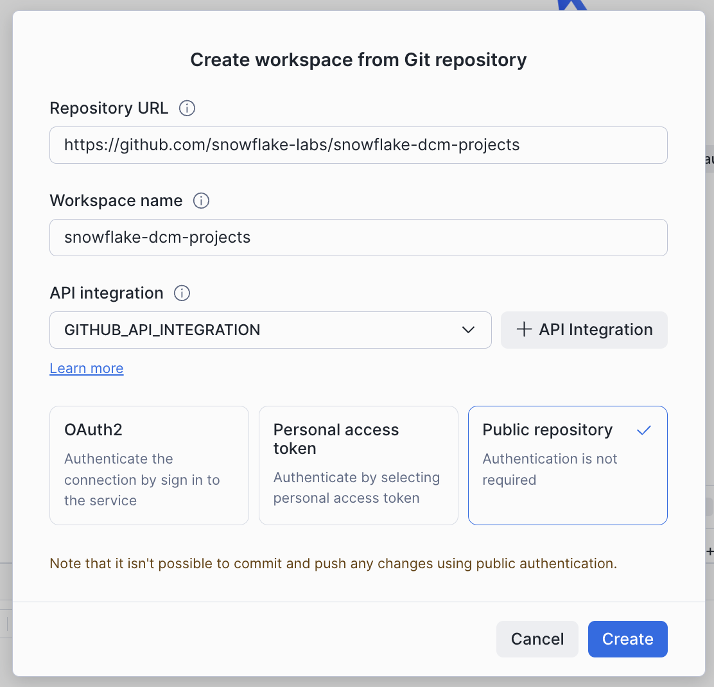
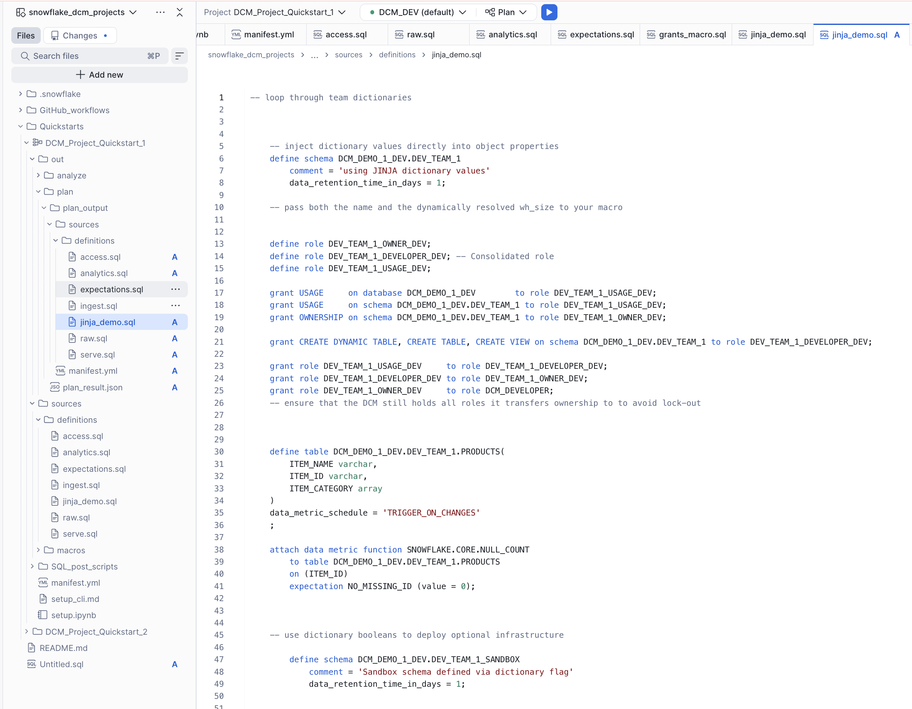
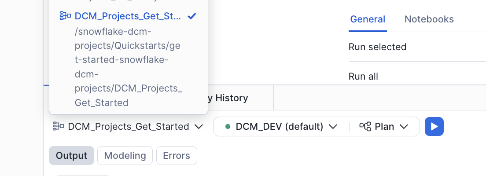
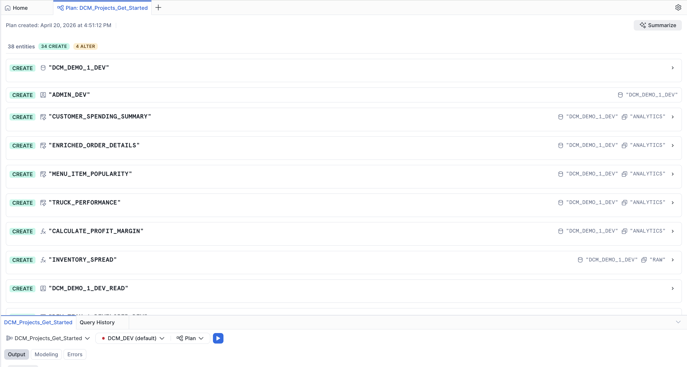
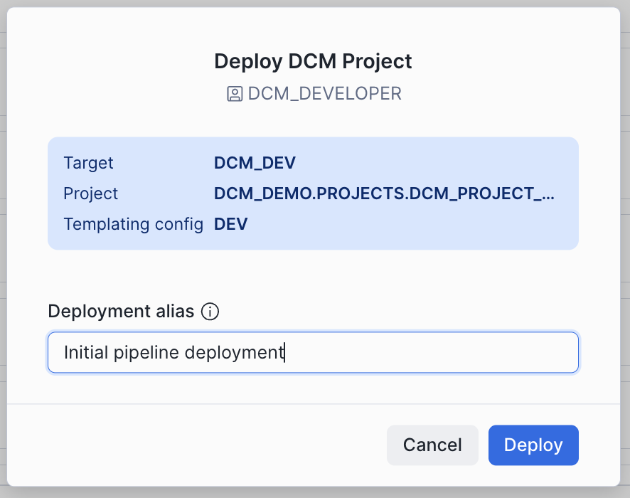
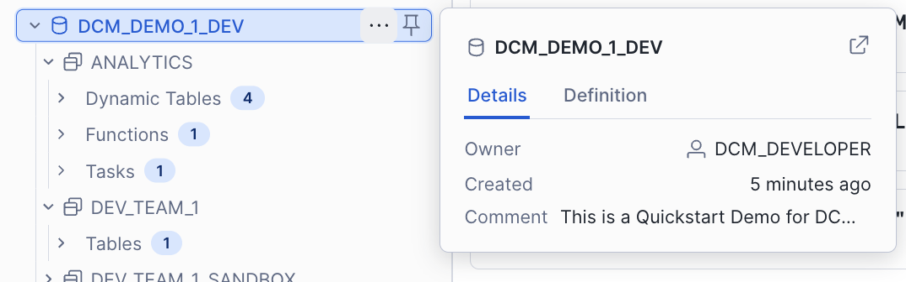

author: Jan Sommerfeld, Gilberto Hernandez, Yoav Ostrinsky
id: get-started-snowflake-dcm-projects
summary: Learn how to declare Snowflake objects as code and run the plan, deploy and converge loop with DCM Projects.
categories: snowflake-site:taxonomy/solution-center/certification/quickstart, snowflake-site:taxonomy/product/platform, snowflake-site:taxonomy/product/data-engineering, snowflake-site:taxonomy/snowflake-feature/dynamic-tables
environments: web
status: Published
language: en
feedback link: https://github.com/Snowflake-Labs/sfguides/issues
fork repo link: https://github.com/Snowflake-Labs/snowflake-dcm-projects

# Get Started with Snowflake DCM Projects
<!-- ------------------------ -->
## Overview

Snowflake DCM (Database Change Management) Projects let you declare the Snowflake objects you want in SQL files, then let Snowflake work out how to get there.

That is the whole idea, and it is worth being precise about what it replaces. A script is imperative: it says `CREATE TABLE`, and running it twice either fails or destroys what you had. A migration framework is imperative with bookkeeping: it says "apply change 7, then change 8", and it needs a ledger of which changes already ran so it never applies one twice. Both encode a *path*.

A DCM Project encodes a *destination*. Each `DEFINE` statement states the object you want and the properties it should have. When you deploy, DCM inspects what exists, compares it to what you declared, and issues only the differences. There is no migration ledger to keep, because there is nothing to replay — the files are always the current desired state, and the account converges on them. Run a deploy twice and the second one does nothing.

You get two things from that. The first is a **plan**: a dry run that tells you exactly which objects would be created, altered and dropped before anything happens. The second is **convergence**: `DEFINE` executes as `CREATE OR ALTER`, so redeploying reconciles an object in place rather than recreating it.

DCM Projects is generally available. Some of the features this guide touches are in public preview and are called out where they appear.

### How you drive a project

DCM Projects can be managed using Snowsight, the Snowflake CLI, SQL, or Cortex Code. You can author, debug and deploy a project by hand in Snowflake Workspaces or your local IDE, use Cortex Code to do it via natural-language prompts, or automate deployments through CI/CD pipelines. Cortex Code also ships a skill that automates the workflow of migrating existing Snowflake objects into a DCM Project, so you do not have to hand-write `DEFINE` statements for objects that already exist.

This guide shows two of those interfaces side by side. Every plan and deploy step below gives you the Snowsight Workspaces path and the equivalent `snow` CLI command, so you can follow whichever fits how you work.

### Prerequisites
- Basic knowledge of Snowflake concepts (databases, schemas, tables, roles)
- Familiarity with SQL

### What You'll Learn
- What a DCM Project declares, and how a manifest maps one codebase onto several environments
- How to read a plan changeset and deploy it with an alias
- How editing a definition and redeploying converges instead of recreating
- How Jinja templating parameterizes definitions, so one codebase serves DEV, STAGE and PROD
- How project assets let a project deploy a Streamlit app alongside the pipeline it reads
- How to inspect what a project manages, and how to tear it down safely

### What You'll Need
- A [Snowflake account](https://signup.snowflake.com/?utm_source=snowflake-devrel&utm_medium=developer-guides&utm_cta=developer-guides) with ACCOUNTADMIN access
- [Snowflake CLI](https://docs.snowflake.com/en/developer-guide/snowflake-cli/installation/installation) if you want to follow the CLI path
- Familiarity with SQL

### What You'll Build
A small but real pipeline — three landing tables, one dynamic table, a semantic view you can query in business terms, and a Streamlit dashboard that reads it — declared entirely as code, deployed, changed, redeployed, and cleaned up.

<!-- ------------------------ -->
## Create a Workspace from Git

If you want to work in Snowsight rather than locally, create a Snowsight Workspace linked to the sample repository on GitHub.

1. Navigate to **Projects > Workspaces** in Snowsight.
2. Click **Create** (+) and select **Git repository**.
3. Enter the repository URL: `https://github.com/snowflake-labs/snowflake-dcm-projects`
4. Select an API Integration for GitHub ([create one if needed](https://docs.snowflake.com/en/user-guide/ui-snowsight/workspaces-git#label-create-a-git-workspace)).
5. Select **Public repository**.



Once the workspace is created you will see the repository files in the file explorer. Navigate to **Quickstarts/get-started-snowflake-dcm-projects** to find two directories.

`DCM_Projects_Get_Started/` is the DCM Project itself. It holds `manifest.yml`, five definition files under `sources/definitions/` — `raw.sql`, `analytics.sql`, `serve.sql`, `access.sql` and `jinja_demo.sql` — and one macro file, `sources/macros/grants_macro.sql`. This is all that plan and deploy read.

`scripts/` holds three numbered SQL files that you run in Snowsight worksheets at different stages of this guide. They live outside the project directory, so nothing in them is ever picked up by a plan.

| File | When to run |
|:-----|:------------|
| `scripts/01_pre_deploy.sql` | Once, before the first plan |
| `scripts/02_post_deploy.sql` | After the first successful deploy |
| `scripts/03_cleanup.sql` | When you are finished |

Open `scripts/01_pre_deploy.sql` in a Snowsight worksheet — you will use it in the next step.

If you prefer to work locally, skip the workspace and clone the repository as shown in the next section. The project files are identical either way.

<!-- ------------------------ -->
## Prerequisites and Setup

Clone the companion repository and move into this guide's directory:

```bash
git clone https://github.com/Snowflake-Labs/snowflake-dcm-projects
cd snowflake-dcm-projects/Quickstarts/get-started-snowflake-dcm-projects
```

You'll find two directories. `DCM_Projects_Get_Started/` is the project itself — the manifest, the definition files and a macro. This is all that plan and deploy read. `scripts/` holds three numbered SQL files that run outside the project, so nothing in them is ever picked up by a plan.

| File | When to run |
|:-----|:------------|
| `scripts/01_pre_deploy.sql` | Once, before the first plan |
| `scripts/02_post_deploy.sql` | After the first successful deploy |
| `scripts/03_cleanup.sql` | When you are finished |

Run the first script. **In Snowsight:** open `scripts/01_pre_deploy.sql` in a worksheet and run each section in order. **With the Snowflake CLI:**

```bash
snow sql -f scripts/01_pre_deploy.sql
```

It does four things. It creates the `DCM_DEVELOPER` role and grants it to you. It enables inherited grants at the account level. It grants `DCM_DEVELOPER` a superset of account-level privileges — every guide in this series shares this role, and each grant carries a comment saying what capability it buys. Account-level privileges cannot be granted by a project on itself, which is why they all happen here, before the first plan.

> **Inherited grants (public preview).** An `INHERITED` grant covers current *and* future objects of a type inside a container. `GRANT ON ALL` snapshots what exists right now; `GRANT ON FUTURE` covers only what comes later. An inherited grant covers both, as one grant rather than one per object, which is why it is the recommended pattern in DCM Projects. It requires an account-level opt-in and cannot be combined with `WITH GRANT OPTION`, `CASCADE` or `RESTRICT`.

```sql
ALTER ACCOUNT SET FEATURE_RBAC_INHERITED_GRANTS = 'ENABLED';
```

Finally the script creates the DCM Project object itself — the account-side object that tracks state — and prints your account identifier and username:

```sql
CREATE OR REPLACE DCM PROJECT dcm_demo.projects.dcm_project_dev
    COMMENT = 'for testing DCM Projects Quickstarts';
```

Copy the two values from that last query into `DCM_Projects_Get_Started/manifest.yml`: set `account_identifier` and `user` under the `DCM_DEV` target. A mismatched `account_identifier` is only a warning, not an error, but fixing it keeps the warning out of your output.

If you are working in Snowsight, refresh your browser after running this script so Snowsight picks up the newly created DCM Project object. It will not appear in the Workspaces project selector until you do.

<!-- ------------------------ -->
## Anatomy of a DCM Project

A project is a **manifest** plus one or more **definition files** under `sources/`. The manifest is the control surface; the definitions are the desired state.



### The manifest

Open `DCM_Projects_Get_Started/manifest.yml`. It has two halves. The first declares **targets**:

```yaml
manifest_version: 2
type: DCM_PROJECT
default_target: DCM_DEV

targets:
  DCM_DEV:
    account_identifier: MYORG-MY_DEV_ACCOUNT
    project_name: DCM_DEMO.PROJECTS.DCM_PROJECT_DEV
    project_owner: DCM_DEVELOPER
    templating_config: DEV

  DCM_PROD_US:
    account_identifier: MYORG-MY_ACCOUNT_US
    project_name: DCM_DEMO.PROJECTS.DCM_PROJECT_PROD
    project_owner: DCM_PROD_DEPLOYER
    templating_config: PROD
```

A target is a deployment destination: which account to deploy into, which DCM Project object holds the state there, which role owns that project, and — the important line — which `templating_config` to render the definitions with. `default_target` is what you get when you omit `--target`. The file ships with a `DCM_STAGE` target too; only `DCM_DEV` is used here.

The second half declares those templating configurations:

```yaml
templating:
  defaults:
    wh_size: "X-SMALL"     # inherited unless a configuration overrides it

  configurations:
    DEV:
      env_suffix: "_DEV"
      user: "INSERT_YOUR_USER"
      project_owner_role: "DCM_DEVELOPER"
      teams:
        - name: "DEV_TEAM_1"
          data_retention_days: 1

    PROD:
      env_suffix: ""
      wh_size: "LARGE"
      teams:
        - name: "Marketing"
          data_retention_days: 1
        - name: "Finance"
          data_retention_days: 30
```

Values in `defaults` apply everywhere unless a configuration overrides them: `wh_size` is `X-SMALL` in DEV because DEV does not set it, and `LARGE` in PROD because PROD does. `env_suffix` is what lets a single definition file produce `DCM_DEMO_1_DEV` in development and `DCM_DEMO_1` in production. The `teams` list differs per environment too — one team in DEV, two in PROD.

This is the point of the manifest: **one set of definition files, several environments, and the differences confined to YAML.** Nothing in `sources/` mentions DEV or PROD.

### One definition file

Definition files use `DEFINE` in place of `CREATE`, and Jinja expressions for anything the manifest controls. Here is the modelled layer, `sources/definitions/analytics.sql`:

```sql
DEFINE SCHEMA DCM_DEMO_1{{env_suffix}}.ANALYTICS
    COMMENT = 'Modelled layer, built and kept fresh by a dynamic table';

DEFINE DYNAMIC TABLE DCM_DEMO_1{{env_suffix}}.ANALYTICS.ENRICHED_ORDER_DETAILS
WAREHOUSE = DCM_DEMO_1_WH{{env_suffix}}
TARGET_LAG = '1 hour'
INITIALIZE = 'ON_SCHEDULE'
COMMENT = 'Order lines enriched with menu attributes, revenue and profit'
AS
SELECT
    oh.ORDER_ID,
    oh.ORDER_TS,
    od.QUANTITY,
    m.MENU_ITEM_NAME,
    m.ITEM_CATEGORY,
    m.SALE_PRICE_USD,
    m.COST_OF_GOODS_USD,
    (od.QUANTITY * m.SALE_PRICE_USD) AS LINE_ITEM_REVENUE,
    (od.QUANTITY * (m.SALE_PRICE_USD - m.COST_OF_GOODS_USD)) AS LINE_ITEM_PROFIT
FROM DCM_DEMO_1{{env_suffix}}.RAW.ORDER_HEADER oh
JOIN DCM_DEMO_1{{env_suffix}}.RAW.ORDER_DETAIL od ON oh.ORDER_ID = od.ORDER_ID
JOIN DCM_DEMO_1{{env_suffix}}.RAW.MENU m ON od.MENU_ITEM_ID = m.MENU_ITEM_ID
QUALIFY ROW_NUMBER() OVER (
    PARTITION BY oh.ORDER_ID, m.MENU_ITEM_NAME
    ORDER BY oh.ORDER_TS DESC
    ) = 1;
```

The `QUALIFY` clause dedupes: one row per order line per menu item, keeping the most recent by `ORDER_TS`. The file on disk also carries the commented-out `TARGET_LAG` alternative you will use in "Change It and Redeploy"; it is omitted here so the definition reads cleanly.

`INITIALIZE = 'ON_SCHEDULE'` is worth noting. The default, `ON_CREATE`, runs a full synchronous refresh inside the `CREATE` statement, so a project creating several dynamic tables at once waits for all of them. `ON_SCHEDULE` lets the deploy finish and the table populate afterwards.

The other four files follow the same pattern: `raw.sql` declares the database and the three landing tables, `access.sql` the warehouse, a read role, its grants and a tag, `serve.sql` a semantic view over the dynamic table, and `jinja_demo.sql` the templated team objects covered in "Templating and Per-Environment Config".

<!-- ------------------------ -->
## First Plan and Deploy

Always plan first. A plan renders the templates, compiles the SQL, compares the result against the account, and reports what it *would* do.

**Jinja renders before DCM sees any of the SQL.** The template engine runs first and produces plain SQL; only then does DCM parse it. That ordering has consequences you will meet in "Templating and Per-Environment Config", and it means the SQL DCM actually evaluated is a real artifact you can read — the plan writes it out, and looking at it is the fastest way to understand what a template did.

**In Snowsight:** the DCM control panel is the first tab in the bottom panel of your workspace. Select the project **get-started-snowflake-dcm-projects/DCM_Projects_Get_Started**. The `DCM_DEV` target is already selected because it is the manifest default; click the target profile to confirm it points at `DCM_PROJECT_DEV` with the `DEV` templating configuration. Then click the play button to the right of **Plan**.



**With the Snowflake CLI:**

```bash
snow dcm plan --target DCM_DEV --save-output
```

On a clean account this reports:

```text
18 entities (17 create, 1 alter, 0 drop)
```



`--save-output` writes the rendered definitions and a `plan_result.json` under `out/`. The JSON carries a per-entity `changes[]` array, which is where you look when a summary count surprises you. In Snowsight the same rendered output appears in a new `out` folder above `sources` in the file explorer — open the rendered `jinja_demo.sql` side by side with the original to see how the templating resolved.

### Reading the changeset

Two things in that summary deserve an explanation.

**Why one alter, on a first deploy?** The altered entity is `ROLE DCM_DEVELOPER`, acquiring `OWNERSHIP` on each newly created object. The project-owner role has to exist *before* the project can be created — it is what owns the project — so it is never something DCM creates. A first deploy of any DCM Project therefore shows exactly this one alter. It is not drift, and there is nothing to fix.

**Why 18 entities from 13 `DEFINE` statements?** The arithmetic is worth following, because it shows what DCM is actually tracking:

| Source | Entities |
|:-------|:---------|
| `DEFINE` statements in the non-template files: 1 database, 3 schemas, 3 tables, 1 dynamic table, 1 semantic view, 1 Streamlit app, 1 warehouse, 1 role, 1 tag | 13 |
| The `PUBLIC` schema, which DCM plans automatically with every database | 1 |
| The Jinja macro expanding `DEV_TEAM_1` — 1 schema and 2 roles | 3 |
| `ROLE DCM_DEVELOPER` gaining ownership | 1 |
| **Total** | **18** |

An entity is not a line of SQL. It is an object DCM will own and reconcile on every future deploy.

### Deploy

When the changeset matches what you expected, deploy it.

**In Snowsight:** in the DCM control panel, set the operation to **Deploy** instead of **Plan**, add a deployment alias such as `initial-deployment`, and run it.



**With the Snowflake CLI:**

```bash
snow dcm deploy --target DCM_DEV --alias initial-deployment
```

```text
18 (17 created, 1 altered, 0 dropped)
```

The `--alias` is a label on this deployment, the way a commit message labels a commit. It appears in the project's deployment history, so six weeks later you can tell which deploy introduced a change without diffing object definitions.

Refresh the Database Explorer on the left of Snowsight and you will see `DCM_DEMO_1_DEV` with all of the created objects inside it.



<!-- ------------------------ -->
## Change It and Redeploy

This is the loop that matters. The sources ship with three edits already written out and commented, marked `CHANGE STEP 1 of 3` through `3 of 3`. Make all three.

**Step 1 — in `sources/definitions/analytics.sql`**, comment out the current `TARGET_LAG` and uncomment the replacement:

```sql
-- TARGET_LAG = '1 hour'
TARGET_LAG = '30 minutes'
```

**Step 2 — in `manifest.yml`**, under the `DEV` configuration, uncomment the warehouse size so DEV stops inheriting `X-SMALL` from `defaults`:

```yaml
      wh_size: "SMALL"
```

**Step 3 — in `manifest.yml`**, add a second team to the DEV `teams` list:

```yaml
        - name: "DEV_TEAM_2"
          data_retention_days: 3
```

Two of the three are manifest edits. That is the point: the manifest is the control surface, and a two-line YAML change is about to produce a set of new objects.

### See only what changed

The CLI has a delta mode for fast iteration:

```bash
snow dcm plan --target DCM_DEV --delta
```

`--delta` reports the changes rather than the whole desired state, so it is what you run while iterating.

### Then the full plan

**In Snowsight:** run **Plan** again from the DCM control panel.

**With the Snowflake CLI:**

```bash
snow dcm plan --target DCM_DEV --save-output
```

```text
6 entities (3 create, 3 alter, 0 drop)
```

Exactly six, and every one is accounted for. The three creates are `DEV_TEAM_2`'s objects: a schema and two roles, produced by the Jinja loop and macro from those two lines of YAML. The three alters are the dynamic table's target lag, the warehouse's size, and `DCM_DEVELOPER` taking ownership of the three new objects.

Open `out/plan_result.json` and find the dynamic table. Its entire change is one nested attribute:

```text
target_lag.seconds  3600 -> 1800
```

No refresh mode change, no body change, no re-initialization. This is the cheap case, and it is worth knowing which cases are cheap: **`WAREHOUSE` and `TARGET_LAG` are the only dynamic-table attributes that alter in place.** Any change to a dynamic table's *body* — including appending a column at the end — forces a re-initialization or a full refresh. Neither is wrong to do; the point is that a plan tells you the blast radius before you pay for it.

Adding a team creates objects. Removing an entry from the `teams` list would produce `DROP`s of that team's real objects, with their data. Don't try it here — but know that it is what a plan would show you, which is precisely why you run one.

### Deploy, then deploy again

**In Snowsight:** set the operation to **Deploy**, give it the alias `lag-wh-and-team2`, and run it.

**With the Snowflake CLI:**

```bash
snow dcm deploy --target DCM_DEV --alias lag-wh-and-team2
```

```text
6 (3 created, 3 altered, 0 dropped)
```

Now deploy a second time with no edits in between, under a new alias — `no-op-proof` — from either interface:

```bash
snow dcm deploy --target DCM_DEV --alias no-op-proof
```

```text
No changes detected.
```

Nothing happened, and nothing needed to. This is the difference between declaring state and running a script. `DEFINE` executes as **`CREATE OR ALTER`**, not `CREATE OR REPLACE`: the second deploy compared the declared state to the account, found them identical, and stopped. The dynamic table was not rebuilt. The tables were not recreated and their data was not lost. There is no ledger recording that the change already ran — the account simply already matches the files.

That is why the same project can be deployed on every merge to main without a migration ledger, and why a deploy is safe to retry after a network failure.

<!-- ------------------------ -->
## Inspect What the Project Manages

A deployed project is a live inventory of the objects it owns. Ask it:

```sql
SHOW ENTITIES IN DCM PROJECT dcm_demo.projects.dcm_project_dev;
```

Every entity from the plan appears here, with its type and name. This is the boundary of the project's authority: an object in this list is reconciled on every deploy, and an object that is not is invisible to DCM even if it sits in the same database.

That distinction is what makes the next command matter, because it tells you how the inventory got to its current shape:

```sql
SHOW DEPLOYMENTS IN DCM PROJECT dcm_demo.projects.dcm_project_dev;
```

You should see three deployments — `initial-deployment`, `lag-wh-and-team2`, and `no-op-proof` — which is where the aliases pay off. The third one changed nothing, and the history records that too.

Together these two commands are the answer to "what is in this environment, and who put it there", without reading a single definition file. On a shared account they are also how you tell your own project's objects apart from a sibling project's, which matters when it is time to clean up.

<!-- ------------------------ -->
## Templating and Per-Environment Config

The "Anatomy of a DCM Project" section showed the manifest supplying values. This section shows the definitions consuming them, and then what to do about values you cannot put in the manifest at all.

### Three Jinja ideas

`sources/definitions/jinja_demo.sql` is the whole templating lesson in ten lines:

```sql

    

    DEFINE SCHEMA DCM_DEMO_1{{env_suffix}}.{{team_name}}
        COMMENT = 'Team schema generated by the Jinja loop'
        DATA_RETENTION_TIME_IN_DAYS = {{ team.data_retention_days }};

    {{ create_team_roles(team_name) }}


```

There are exactly three ideas here. A **loop** over the manifest's `teams` list. A **dictionary value** injected into a real object property — `data_retention_days` from the YAML becomes the schema's actual `DATA_RETENTION_TIME_IN_DAYS`, which is why `DEV_TEAM_2` was planned with a retention of 3. And a **macro call**, which is where the roles come from:

```sql

    DEFINE ROLE {{team}}_OWNER{{env_suffix}};
    DEFINE ROLE {{team}}_USAGE{{env_suffix}};
    GRANT USAGE     on schema DCM_DEMO_1{{env_suffix}}.{{team}} to role {{team}}_USAGE{{env_suffix}};
    GRANT OWNERSHIP on schema DCM_DEMO_1{{env_suffix}}.{{team}} to role {{team}}_OWNER{{env_suffix}};
    GRANT ROLE {{team}}_USAGE{{env_suffix}} to role {{team}}_OWNER{{env_suffix}};
    -- ensure the project owner still holds every role it transfers ownership to,
    -- to avoid locking itself out
    GRANT ROLE {{team}}_OWNER{{env_suffix}} to role {{project_owner_role}};

```

Note the last grant and its comment. When a project hands `OWNERSHIP` to a role, it must keep hold of that role or it loses the ability to manage what it just gave away.

Deployed to DEV this loop runs twice. Deployed to PROD it runs for Marketing and Finance instead, from the same file. Read the rendered copy of this file under `out/` after a plan to see the SQL DCM actually evaluated — loops expanded, macro inlined, values substituted.

### The render-order gotcha, worked

Jinja renders *before* Snowflake parses the SQL. The consequence catches everyone at least once: **a `{{ ... }}` expression inside a `--` comment is still evaluated.** Commenting a line out hides it from Snowflake. It does not hide it from the template engine, which has already finished by then.

`sources/definitions/raw.sql` carries a deliberate demonstration. This line is inert SQL but live Jinja:

```sql
--   this database is DCM_DEMO_1{{env_suffix}}
```

Run a plan with `--save-output` and read the same line back in `out/rendered/sources/definitions/raw.sql`. The suffix has been substituted *inside the comment*:

```text
--   this database is DCM_DEMO_1_DEV
```

Harmless here, because `env_suffix` always has a value. It stops being harmless the moment a commented-out line references something that does not resolve — the plan fails on a line you believed was disabled. The same applies to prose: never write Jinja delimiters as literal text in a comment you intend as explanation, because the engine reads them as code and not as English.

So: the "comment out the alternative" pattern is safe in plain SQL and a trap in templated SQL. And `out/rendered/` is the first place to look whenever a template surprises you — it is the exact SQL DCM evaluated.

<!-- ------------------------ -->
## Governance Touch

Two governance statements sit in `sources/definitions/access.sql`, and both are public preview.

The first is a tag, declared and then attached:

```sql
DEFINE TAG DCM_DEMO_1{{env_suffix}}.RAW.DATA_SENSITIVITY
    ALLOWED_VALUES 'PUBLIC', 'INTERNAL', 'RESTRICTED'
    COMMENT = 'Sensitivity classification for governed objects';

ATTACH TAG DCM_DEMO_1{{env_suffix}}.RAW.DATA_SENSITIVITY = 'INTERNAL'
    TO TABLE DCM_DEMO_1{{env_suffix}}.RAW.ORDER_HEADER;
```

`ATTACH TAG` is a standalone statement rather than part of a `DEFINE`, and that is exactly why it can set a tag at all: `CREATE OR ALTER` cannot set tags or policies. It applies to whole objects — tables and dynamic tables are valid targets; views, semantic views and individual columns are not.

The second is the inherited grant from "Prerequisites and Setup", now in use:

```sql
GRANT INHERITED SELECT on all tables in database DCM_DEMO_1{{env_suffix}}
    to role DCM_DEMO_1{{env_suffix}}_READ;
```

One statement, covering every table in the database — including tables added by a future deploy.

<!-- ------------------------ -->
## Seed Data and Query

The deploy created empty structures. Seed them. **In Snowsight:** open `scripts/02_post_deploy.sql` in a worksheet and run each section in order. **With the Snowflake CLI:**

```bash
snow sql -f scripts/02_post_deploy.sql
```

The script seeds the menu and ten orders, refreshes the dynamic table, and queries the result. It is safe to re-run: the menu insert skips rows that already exist, and the order inserts compute an offset from the current maximum `ORDER_ID`, so each run appends ten fresh orders instead of colliding with previous ones. It uses a session variable rather than a `BEGIN...END` block, because `snow sql -f` splits a script at semicolons and would break the block apart.

The dynamic table builds **20 enriched rows**. Then the semantic view answers in business terms — you name dimensions and metrics, and it resolves the aggregation:

```sql
SELECT * FROM SEMANTIC_VIEW(
    dcm_demo_1_dev.serve.order_analytics
    DIMENSIONS order_lines.ITEM_CATEGORY
    METRICS order_lines.TOTAL_REVENUE, order_lines.TOTAL_PROFIT, order_lines.ORDER_COUNT
)
ORDER BY TOTAL_REVENUE DESC;
```

Ten category rows come back, `Pizza | 106.00 | 67.50 | 3` at the top. `DEFINE SEMANTIC VIEW` means the vocabulary your BI tools and AI agents depend on is versioned and reviewed in the same plan diff as the pipeline producing the numbers.

<!-- ------------------------ -->
## The App That Reads It

Everything so far has been SQL that a `DEFINE` statement can express in full. A Streamlit app cannot be: it is Python files, and DCM needs a way to carry them. That is what **project assets** are for.

An asset is a named set of source files, declared at the top level of `manifest.yml` — a sibling of `targets` and `templating`, not nested inside either:

```yaml
assets:
  dashboard:
    path: 'streamlit/dashboard/**/*'
```

The path is relative to the manifest and must live **outside `sources/`**, which is reserved for definitions, macros and tests. Use `path` for a single entry or `paths` for a list; each one can be a glob, a directory, or a single file. Globs support only `*` and `**` — no `?`, no brace expansion — and paths cannot contain Jinja. A pattern matching no files fails the run rather than deploying something empty.

Then `DEFINE STREAMLIT` refers to the asset by name. While the feature is in public preview the `asset://` URI is the *only* accepted form — it will not take a folder path directly — and that indirection is what assets exist to provide:

```sql
DEFINE STREAMLIT DCM_DEMO_1{{env_suffix}}.SERVE.ORDERS_DASHBOARD
    FROM 'asset://dashboard/'
    MAIN_FILE = 'streamlit_app.py'
    QUERY_WAREHOUSE = DCM_DEMO_1_WH{{env_suffix}}
    TITLE = 'Orders Dashboard'
    COMMENT = 'Reads the ORDER_ANALYTICS semantic view; deployed from the dashboard asset';
```

`MAIN_FILE` is relative to the imported asset root, not to the definition file. Note what is *absent*: no compute pool, no `environment.yml`, no dependency list. Snowflake supplies a container runtime and a default package set that already includes `streamlit` and `snowflake-snowpark-python`, so the minimal form above is genuinely all a working app needs here.

The app reads the semantic view rather than the dynamic table, so the numbers on screen are the same metric definitions an agent would resolve. One detail matters for portability — **asset files are not Jinja-rendered**, so the app cannot use `{{env_suffix}}` to find its own database. It resolves that at runtime instead, which is why the identical file serves every environment:

```python
session = get_active_session()
database = session.sql("SELECT CURRENT_DATABASE()").collect()[0][0]
```

Now the useful part. Change nothing but the Python — add a chart, rename a heading — and plan again:

```console
ALTER    STREAMLIT            DCM_DEMO_1_DEV.SERVE.ORDERS_DASHBOARD
Planned 1 entity (0 to create, 1 to alter, 0 to drop).
```

The plan tracks the **contents of the asset**, not just the `DEFINE` statement, and a deploy publishes a new version of the app. So the dashboard is versioned and promoted on exactly the same path as the tables it reads — one plan, one deploy, one changeset covering the pipeline and its front end. Redeploy again without touching anything and you get `No changes detected`, the same convergence you saw earlier.

`DEFINE CODE BUNDLE` uses assets the same way, for packaging Python jobs rather than apps.

<!-- ------------------------ -->
## Detach and Clean Up

**In Snowsight:** open `scripts/03_cleanup.sql` in a worksheet and run it. **With the Snowflake CLI:**

```bash
snow sql -f scripts/03_cleanup.sql
```

The script does two things and refuses to do a third.

It purges everything the project manages, then drops the now-empty project object:

```sql
EXECUTE DCM PROJECT dcm_demo.projects.dcm_project_dev PURGE;

DROP DCM PROJECT IF EXISTS dcm_demo.projects.dcm_project_dev;
```

`PURGE` drops every object the project created — database, schemas, tables, dynamic table, semantic view, warehouse, roles, and all their data. It is irreversible, and it leaves the project object behind, which is why the `DROP` follows.

What it does **not** do is the important part. Three objects are shared across every guide in this series, and the script leaves them in place, commented out with the reason:

```sql
-- DROP SCHEMA IF EXISTS dcm_demo.projects;
-- DROP DATABASE IF EXISTS dcm_demo;
-- USE ROLE ACCOUNTADMIN;
-- DROP ROLE IF EXISTS dcm_developer;
```

The `USE ROLE ACCOUNTADMIN` is part of that commented block, not decoration: `dcm_developer` cannot drop itself, so uncommenting the role drop without the role switch fails.

`dcm_demo` is the **registry database**. It holds the DCM Project object of every DCM guide you have ever run — not just this one. Dropping it destroys those projects too, and a project object is the only record of which objects a project owns; lose it and the objects are orphaned with no way to reconcile or purge them. `dcm_demo.projects` is the same problem one level narrower. And `dcm_developer` is a shared role that may own objects you created outside these guides — dropping a role that owns objects orphans them.

This is the single most important safety point in the guide: **a cleanup script that drops the shared registry destroys other projects, not just its own.** Run the check the script offers before you uncomment anything, and if it returns projects you recognise, leave them alone:

```sql
SHOW DCM PROJECTS IN SCHEMA dcm_demo.projects;
```

The script closes by verifying what went and what remains, and if `PURGE` ever fails it tells you to suspend the project's scheduled objects first so nothing keeps consuming credits while you investigate.

<!-- ------------------------ -->
## Conclusion and Resources

You declared a pipeline as code, planned it, deployed it, changed it, redeployed it, and watched the second deploy do nothing.

That last part is the lesson. You now know that:

- A DCM Project declares a **destination**, not a path — no migration ledger, no replay
- `plan` shows the blast radius before you pay for it, and the changeset is readable per entity
- `DEFINE` executes as **`CREATE OR ALTER`**, so redeploying converges instead of recreating
- The manifest is the control surface: one codebase, many environments, differences confined to YAML
- Jinja renders **before** DCM parses the SQL — including inside comments
- **Project assets** carry the files a `DEFINE` statement cannot express, so an app ships with its pipeline

### What's Next
- **[Build Data Pipelines with Snowflake DCM Projects](https://www.snowflake.com/en/developers/guides/build-data-pipelines-with-snowflake-dcm-projects/)** — split platform infrastructure from transformation pipelines and build a medallion architecture
- **[DCM Projects for Dynamic Tables](https://www.snowflake.com/en/developers/guides/dcm-projects-for-dynamic-tables/)** — the pipeline layer in depth

### Related Resources
- [DCM Projects Documentation](https://docs.snowflake.com/en/user-guide/dcm-projects/dcm-projects-overview)
- [Managing DCM Projects using Snowflake CLI](https://docs.snowflake.com/developer-guide/snowflake-cli/data-pipelines/dcm-projects)
- [Sample DCM Projects Repository](https://github.com/Snowflake-Labs/snowflake-dcm-projects)
