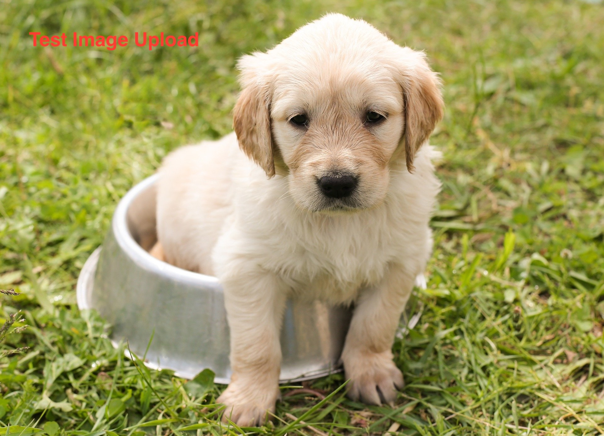

summary: This guide outlines the updates and changes to Snowflake Guides creation process and formatting updates.  
id: get-started-with-guides
categories: snowflake-site:taxonomy/solution-center/certification/quickstart
language: en
environments: web
status: Hidden
author:  Snowflake DevRel Team

# Snowflake Guide Basics

## Components of a Guide

### Overview 

Please use [this markdown file](https://github.com/Snowflake-Labs/sfquickstarts/blob/master/site/sfguides/src/_template/markdown.template) as a template for writing your own Snowflake Guides. This example guide has elements that you will use when writing your own guides, including: code snippet highlighting, downloading files, inserting photos, and more. 

It is important to include on the first page of your guide the following sections: Prerequisites, What you'll learn, What you'll need, and What you'll build. Remember, part of the purpose of a Snowflake Guide is that the reader will have **built** something by the end of the tutorial; this means that actual code needs to be included (not just pseudo-code or concepts).

Previously, we had Quickstarts and Solutions which are now combined into a single page for "Guides" at [www.snowflake.com/en/developers/guides](https://www.snowflake.com/en/developers/guides/) page.  Going forward, we encourage users to think along creating **logged out experiences**  or **topic pages.** A few examples of these pages are:

* **Logged Out experience with one click into product:** [Understanding Customer Reviews using Snowflake Cortex](https://www.snowflake.com/en/developers/guides/understanding-customer-reviews-using-snowflake-cortex/)
* **Topic pages with multiple use cases below the Overview:** [Data Connectivity with Snowflake Openflow](https://www.snowflake.com/en/developers/guides/data-connectivity-with-snowflake-openflow/)


### Prerequisites
- Familiarity with Markdown syntax

### What You’ll Learn 
- Components of a Guide
- Metadata configuration
- Formatting considerations (including headers, subheaders, code, buttons, links, images and videos)
- Tags to include (Language and category)
- Converting content to markdown 
- Submitting your guide for approval

### What You’ll Need 
- A [GitHub](https://github.com/) Account 
- [VSCode](https://code.visualstudio.com/download) installed
- [Submit a Repository Request](https://docs.google.com/forms/d/1AQ0SOMi0-kAHHluEx9HJDDUctwisHqrSVWo-wvfDMwU/edit#responses) to obtain a repo  in Snowflake Labs GitHub.


### What You’ll Build 
- Once you complete this guide, you should be able to create your "Snowflake Guide" and submit it using the updated process.


### Conclusion & Next Steps

The Conclusion and Next Steps section is one of the most important parts of a guide. This last section helps to sum up all the information the reader has gone through, and in many ways should read like a [TLDR summary](https://www.howtogeek.com/435266/what-does-tldr-mean-and-how-do-you-use-it/#post-435266:~:text=How%20Do%20You%20Use%20TLDR%3F,you%E2%80%99re%20the%20author%20or%20commenter.%20Using). 

There are three main sub-headers in a Conclusion step:

1. a general conclusion paragraph 
2. "What We've Covered" section with a bulleted list of things
3. "Related Resources" with links to various other resources, other guides, docs, videos, GitHub source code, etc.

It's also important to remember that by the time a reader has completed a Guide, the goal is that they have actually built something! Guides teach through hands-on examples -- not just explaining concepts.

### What We've Covered
- creating steps and setting duration
- adding code snippets
- embedding images and videos
- importing other markdown files

### Related Resources
- [SFGuides on GitHub](https://github.com/Snowflake-Labs/sfguides)
- [Learn the GitHub Flow](https://guides.github.com/introduction/flow/)
- [Learn How to Fork a project on GitHub](https://guides.github.com/activities/forking/)


<!-- ------------------------ -->
## Metadata Configuration

It is important to set the correct metadata for your Snowflake Guide. The metadata contains all the information required for listing and publishing your guide and includes the following:

```diff
- REQUIRED
```

- **id**: sample-separated-by-hyphens-not-underscores 
  - make sure to match the id here with the name of the file, all one word.
- **language**: pick from list 
  - pick the appropriate language from the lsit provided.  
- **categories**: Pick from the list
  - select from the complete list of categories 1, 2 and 3 prrovided.  Please DO NOT create new categories.
- **status**: (`Published`, `Archived`, `Hidden`)<br>
  `Published` - implies the guide is active<br>
  `Hidden` - implies the sfguide is for restricted use, should be available only by direct URL, and should not appear on the main landing page.<br>
  `Archived` - imlplies the sfguide is out of date and deprecated and no longer available.
- **authors**: Author Full Name (+ author GitHub account)
  - Indicate the author(s) of this specific sfguide.  Including the GitHub Account login helps us notify you of any changes requested in the future.

```diff
- OPTIONAL
```
  - **summary**: This is a sample Snowflake Guide 
  - This should be a short, 1 sentence description of your guide. This will be visible on the main landing page. 
  - **environments**: web 
  - `web` is default. If this will be published for a specific event or  conference, include it here.
  - **feedback link**: https://github.com/Snowflake-Labs/sfguides/issues
---

You can see the source metadata for this guide you are reading now, on [the github repo](https://github.com/Snowflake-Labs/sfquickstarts/blob/master/site/sfguides/src/_template/markdown.template).


<!-- ------------------------ -->
## Formatting Considerations

A single sfguide consists of multiple steps. 
These steps are defined in Markdown using Header 2 tag `##`. 
Sub-steps will use a Header 3 tag `###` and so forth.

```markdown
## Step 1 Title

All the content for the step goes here.

## Step 2 Title

All the content for the step goes here.

### Subheading for Step 2

  **This text will be bold.**
  __This text will also be bold.__


> NOTE:  Please add images in Markdown format - not HTML.
```


### Markdown Basics 

This section covers the basic markdown formatting options that you will need for your QuickStart. 

Look at the [markdown source for this sfguide](https://github.com/Snowflake-Labs/sfquickstarts/blob/master/site/sfguides/src/_template/markdown.template) to see how to use markdown to generate code snippets, info boxes, and download buttons. 

#### Things to Keep in Mind
Sticking to these guidelines ensures that all Guides have a similar look and feel.  Keeping the document clean helps create a good end-user experience.

- Remember to include the header info in  your markdown 
- Keep the Headings short: 3-4 words
- Have an Overview section <br>(this includes the Prerequisites, What You'll Learn, What You'll Build and What You'll Need subsections)
- Have a Conclusion and Resources section <br>
 (this includes the What We've Covered and Related Resources links)


#### Adding Colors

Basic colors can be  added to callouts using "diff" in a code block in between "```".  

```diff
- text in red
+ text in green
# text in white
``` 


```
```diff
- text in red
+ text in green
# text in white
```


Multiple colors can also be added for emphasis at times:

$${\color{red}Adding \space \color{lightblue}Different \space \color{orange}Colors}$$
```
$${\color{red}Adding \space \color{lightblue}Different \space \color{orange}Colors}$$  


```


#### JavaScript
```javascript
{ 
  key1: "string", 
  key2: integer,
  key3: "string"
}
```

#### Java
```java
for (statement 1; statement 2; statement 3) {
  // code block to be executed
}
```

#### Info Boxes

> [!NOTE]
> This is an informational aside.

> [!TIP]
> A positive or helpful note.

> [!IMPORTANT]
> Something you shouldn’t overlook.

> [!WARNING]
> A cautionary message.

> [!CAUTION]
> A serious negative or danger message.

```
CODE:
> Adding an Info Box:
> Pick the messages above and use this code.  This will appear as an info box.
```


#### Buttons

<button>[Youtube - Halsey Playlists](https://www.youtube.com/user/iamhalsey/playlists)</button>

```
CODE:
<button>[Youtube - Halsey Playlists](https://www.youtube.com/user/iamhalsey/playlists)</button>
```

### Tables
| Column 1 | Column 2 | Column 3 |
|-----------|-----------|-----------|
| Row 1     | Data      | More data |
| Row 2     | More      | Still more |

```
CODE:
| Column 1 | Column 2 | Column 3 |
|-----------|-----------|-----------|
| Row 1     | Data      | More data |
| Row 2     | More      | Still more |
```

#### Hyperlinking
[Youtube - Halsey Playlists](https://www.youtube.com/user/iamhalsey/playlists)
```
CODE:
[Youtube - Halsey Playlists](https://www.youtube.com/user/iamhalsey/playlists)
```


#### Images


Please DO NOT use HTML code for adding images.  
Use this markdown format for images: 
```
CODE:

```

**Images should:**
- have lower case and underscores
- cannot have $ signs or special characters
- should have the same correct image file name in the .md file (this is case sensitive)
- All images should be in the "Assets" folder.  Please DO NOT create subfolders inside this folder. 
- Be sized appropriately (no full res images), and optimized for web (recommend tinypng)
- Sizes should be 150kb max file size, gifs are an exception but they should also be optimized - large images will slow down the page load


#### Videos
Videos from youtube can be linked to the text like a normal link like [this video](https://www.youtube.com/watch?v=KmeiFXrZucE).
```
CODE:
[this video](https://www.youtube.com/watch?v=KmeiFXrZucE)>

```

```diff 
- DO NOT -
use HTML tags in the markdown file since that will cause errors! 
```


<p>


<!-- ------------------------ -->
## Language and Category tags

>NOTE:
>**Please pick tags from the 3 categories below.** <br>
```diff
- DO NOT -
create new tags if you don't see them in the list. 
 ``` 


<table style="width:83%;">
<colgroup>
<col style="width: 22%" />
<col style="width: 61%" />
</colgroup>
<thead>
<tr>
<th colspan="2" style="text-align: center; color: yellow" ><strong>Language Tags</strong></th>
</tr>
<tr>
<th>en</th>
<th>english</th>
</tr>
<tr>
<th>es</th>
<th>Spanish</th>
</tr>
<tr>
<th>it</th>
<th>Italian</th>
</tr>
<tr>
<th>fr</th>
<th>French</th>
</tr>
<tr>
<th>ja</th>
<th>Japanese</th>
</tr>
<tr>
<th>ko</th>
<th>Korean</th>
</tr>
<tr>
<th>pt_br</th>
<th>Portuguese/Brazil</th>
</tr>
</thead>
<tbody>
</tbody>
</table>


<p> 

## Please pick tags from the 3 categories below.  
```diff
- DO NOT -
create new tags if you don't see them in the list. 
 ```
 <p>

<table style="width:83%;">
<colgroup>
<col style="width: 22%" />
<col style="width: 61%" />
</colgroup>
<thead>
<tr>
<th colspan="2" style="text-align: center; color: yellow" ><strong>Category 1: Product
Category</strong></th>
</tr>
<tr>
<th>AI</th>
<th>snowflake-site:taxonomy/product/ai</th>
</tr>
<tr>
<th>Analytics</th>
<th>snowflake-site:taxonomy/product/analytics</th>
</tr>
<tr>
<th>Applications &amp; Collaboration</th>
<th>snowflake-site:taxonomy/product/applications-and-collaboration</th>
</tr>
<tr>
<th>Data Engineering</th>
<th>snowflake-site:taxonomy/product/data-engineering</th>
</tr>
<tr>
<th>Platform</th>
<th>snowflake-site:taxonomy/product/platform</th>
</tr>
</thead>
<tbody>
</tbody>
</table>
 <p></p> | <p></p> |
<table style="width:83%;">
<colgroup>
<col style="width: 22%" />
<col style="width: 61%" />
</colgroup>
<thead>
<tr>
<p> </p>

<th colspan="2" style="text-align: center; color: orange"><strong>Category 2:
Technical Use-Case</strong></th>
</tr>
<tr>
<th>Ingestion</th>
<th>snowflake-site:taxonomy/snowflake-feature/ingestion</th>
</tr>
<tr>
<th>Transformation</th>
<th>snowflake-site:taxonomy/snowflake-feature/transformation</th>
</tr>
<tr>
<th>Interoperable Storage</th>
<th>snowflake-site:taxonomy/snowflake-feature/interoperable-storage</th>
</tr>
<tr>
<th>Business Intelligence</th>
<th>snowflake-site:taxonomy/snowflake-feature/business-intelligence</th>
</tr>
<tr>
<th>Lakehouse Analytics</th>
<th>snowflake-site:taxonomy/snowflake-feature/lakehouse-analytics</th>
</tr>
<tr>
<th>Interactive Analytics</th>
<th>snowflake-site:taxonomy/snowflake-feature/interactive-analytics</th>
</tr>
<tr>
<th>Applied Analytics</th>
<th>snowflake-site:taxonomy/snowflake-feature/applied-analytics</th>
</tr>
<tr>
<th>Migrations</th>
<th>snowflake-site:taxonomy/snowflake-feature/migrations</th>
</tr>
<tr>
<th>Conversational Assistants</th>
<th>snowflake-site:taxonomy/snowflake-feature/ingestion/conversational-assistants</th>
</tr>
<tr>
<th>Unstructured Data Insights</th>
<th>snowflake-site:taxonomy/snowflake-feature/unstructured-data-analysis</th>
</tr>
<tr>
<th>Model Development</th>
<th>snowflake-site:taxonomy/snowflake-feature/model-development</th>
</tr>
<tr>
<th>Internal Collaboration</th>
<th>snowflake-site:taxonomy/snowflake-feature/internal-collaboration</th>
</tr>
<tr>
<th>External Collaboration</th>
<th>snowflake-site:taxonomy/snowflake-feature/external-collaboration</th>
</tr>
<tr>
<th>Build</th>
<th>snowflake-site:taxonomy/snowflake-feature/build</th>
</tr>
<tr>
<th>Commercialize</th>
<th>snowflake-site:taxonomy/snowflake-feature/commercialize</th>
</tr>
<tr>
<th>Compliance, Security, Discovery &amp; Governance</th>
<th>snowflake-site:taxonomy/snowflake-feature/compliance-security-discovery-governance</th>
</tr>
<tr>
<th>Financial Operations</th>
<th>snowflake-site:taxonomy/snowflake-feature/financial-operations</th>
</tr>
<tr>
<th>Observability</th>
<th>snowflake-site:taxonomy/snowflake-feature/observability</th>
</tr>
<tr>
<th>Storage</th>
<th>snowflake-site:taxonomy/snowflake-feature/storage</th>
</tr>
</thead>
<tbody>
</tbody>
</table>
 <p></p> | <p></p> |
<table style="width:83%;">
<colgroup>
<col style="width: 22%" />
<col style="width: 61%" />
</colgroup>
<thead>
<tr>
<th colspan="2" style="text-align: center; color: lime"><strong>Category 3:
Prioritized Features</strong></th>
</tr>
<tr>
<th>Account Replication</th>
<th>snowflake-site:taxonomy/snowflake-feature/account-replication</th>
</tr>
<tr>
<th>Diagnostics</th>
<th>snowflake-site:taxonomy/snowflake-feature/diagnostics</th>
</tr>
<tr>
<th>Monitoring</th>
<th>snowflake-site:taxonomy/snowflake-feature/monitoring</th>
</tr>
<tr>
<th>Geospatial</th>
<th>snowflake-site:taxonomy/snowflake-feature/geospatial</th>
</tr>
<tr>
<th>Time Series Functions</th>
<th>snowflake-site:taxonomy/snowflake-feature/time-series-functions</th>
</tr>
<tr>
<th>Cortex Analyst</th>
<th>snowflake-site:taxonomy/snowflake-feature/cortex-analyst</th>
</tr>
<tr>
<th>Cortex LLM Functions</th>
<th>snowflake-site:taxonomy/snowflake-feature/cortex-llm-functions</th>
</tr>
<tr>
<th>Cortex Search</th>
<th>snowflake-site:taxonomy/snowflake-feature/cortex-search</th>
</tr>
<tr>
<th>Document AI</th>
<th>snowflake-site:taxonomy/snowflake-feature/document-ai</th>
</tr>
<tr>
<th>ML Functions</th>
<th>snowflake-site:taxonomy/snowflake-feature/ml-functions</th>
</tr>
<tr>
<th>Snowflake ML Functions</th>
<th>snowflake-site:taxonomy/snowflake-feature/snowflake-ml-functions</th>
</tr>
<tr>
<th>Snowpark Container Services</th>
<th>snowflake-site:taxonomy/snowflake-feature/snowpark-container-services</th>
</tr>
<tr>
<th>Data Clean Rooms</th>
<th>snowflake-site:taxonomy/snowflake-feature/data-clean-rooms</th>
</tr>
<tr>
<th>Marketplace and Integrations</th>
<th>snowflake-site:taxonomy/snowflake-feature/marketplace-and-integrations</th>
</tr>
<tr>
<th>Native Apps</th>
<th>snowflake-site:taxonomy/snowflake-feature/native-apps</th>
</tr>
<tr>
<th>Unistore</th>
<th>snowflake-site:taxonomy/snowflake-feature/unistore</th>
</tr>
<tr>
<th>Internal Marketplace</th>
<th>snowflake-site:taxonomy/snowflake-feature/internal-marketplace</th>
</tr>
<tr>
<th>Prescriptive Selling</th>
<th>snowflake-site:taxonomy/snowflake-feature/prescriptive-selling</th>
</tr>
<tr>
<th>Salesforce Zero Copy Integration</th>
<th>snowflake-site:taxonomy/snowflake-feature/salesforce-zero-copy-integration</th>
</tr>
<tr>
<th>Spark Attack</th>
<th>snowflake-site:taxonomy/snowflake-feature/spark-attack</th>
</tr>
<tr>
<th>Connectors</th>
<th>snowflake-site:taxonomy/snowflake-feature/connectors</th>
</tr>
<tr>
<th>Dynamic Tables</th>
<th>snowflake-site:taxonomy/snowflake-feature/dynamic-tables</th>
</tr>
<tr>
<th>Apache Iceberg</th>
<th>snowflake-site:taxonomy/snowflake-feature/apache-iceberg</th>
</tr>
<tr>
<th>Openflow</th>
<th>snowflake-site:taxonomy/snowflake-feature/openflow</th>
</tr>
<tr>
<th>Serverless Tasks</th>
<th>snowflake-site:taxonomy/snowflake-feature/serverless-tasks</th>
</tr>
<tr>
<th>Snowpark</th>
<th>snowflake-site:taxonomy/snowflake-feature/snowpark</th>
</tr>
<tr>
<th>Snowpipe Streaming</th>
<th>snowflake-site:taxonomy/snowflake-feature/snowpipe-streaming</th>
</tr>
</thead>
<tbody>
</tbody>
</table>


<!-- ------------------------ -->
## Converting to Markdown


If you have an existing word document that needs to be converted to markdown format, you can do that using Pandoc.  You will use the **GitHub Flavored Markdown (GFM)**.

To convert a Word document (.docx) to Markdown using Pandoc:

```
brew install pandoc
pandoc -f docx -t markdown -o output.md input.docx
```

Once the document is converted, please review the markdown file to ensure it uses the appropriate formatting mentioned in this guide.  


<!-- ------------------------ -->
## Submitting Your Guide

The process to submit your Guide has been simplified. 

- Create a Fork for the main repo and begin writing and formatting your guide.

- Once you are done with the content creation process for your guide, create a Pull Request in GitHub and submit.

- The pull request goes through a validation process to ensure the appropriate formatting and tags are used.  If any errors are detected, you will be notified of them **before** submitting the PR.

- Please correct any errors and try submitting the PR again.  If all looks ok, the PR comes to DevRel team for approval.  
 At this point, a staging URL is generated in GitHub that can be reviewed.

- The DevRel team will approve the PR to publish it to www.snowflake.com/en/developers/guides page.

> NOTE: Any updates or edits after submission must be made in GitHub and a new PR needs to be generated and will go through this same process of approval(s).


<!-- ------------------------ -->
## Conclusion and Resources

Congratulations!  You should now be able to create, format and submit a guide. 

### What We've Covered
- The basic components of a Guide
- Metadata configuration to include 
- Various formatting options available (including headers, subheaders, code, buttons, links, images and videos)
- List of language and category tags for reference.
- How to convert content to markdown 
- The new easier process to submit your guide for approval

### Related Resources
- [SFGuides on GitHub](https://github.com/Snowflake-Labs/sfguides)
- [Learn the GitHub Flow](https://guides.github.com/introduction/flow/)
- [Learn How to Fork a project on GitHub](https://guides.github.com/activities/forking/)
- [Markdown template that can be used](https://github.com/Snowflake-Labs/sfquickstarts/blob/master/site/sfguides/src/_template/markdown.template).
- [Submit a Repository Request](https://docs.google.com/forms/d/1AQ0SOMi0-kAHHluEx9HJDDUctwisHqrSVWo-wvfDMwU/edit#responses) to obtain a repo  in Snowflake Labs GitHub.

### EXAMPLES:
* **Logged Out experience with one click into product:** [Understanding Customer Reviews using Snowflake Cortex](https://www.snowflake.com/en/developers/guides/understanding-customer-reviews-using-snowflake-cortex/)
* **Topic pages with multiple use cases below the Overview:** [Data Connectivity with Snowflake Openflow](https://www.snowflake.com/en/developers/guides/data-connectivity-with-snowflake-openflow/)


