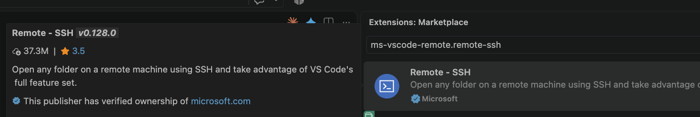
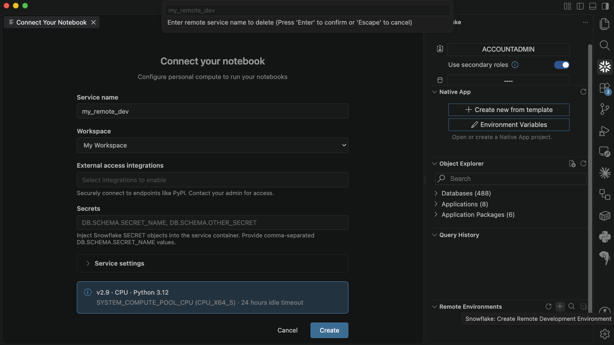
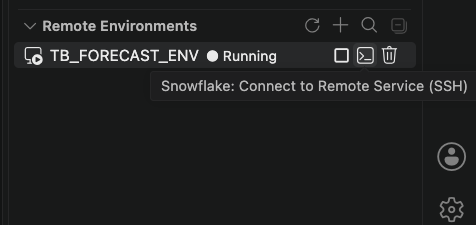
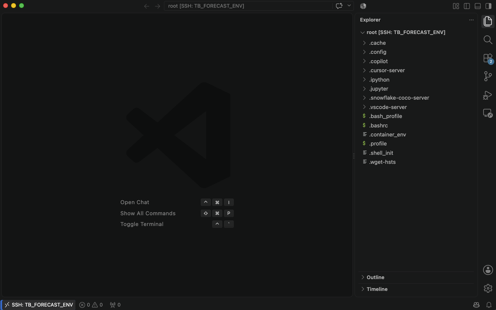
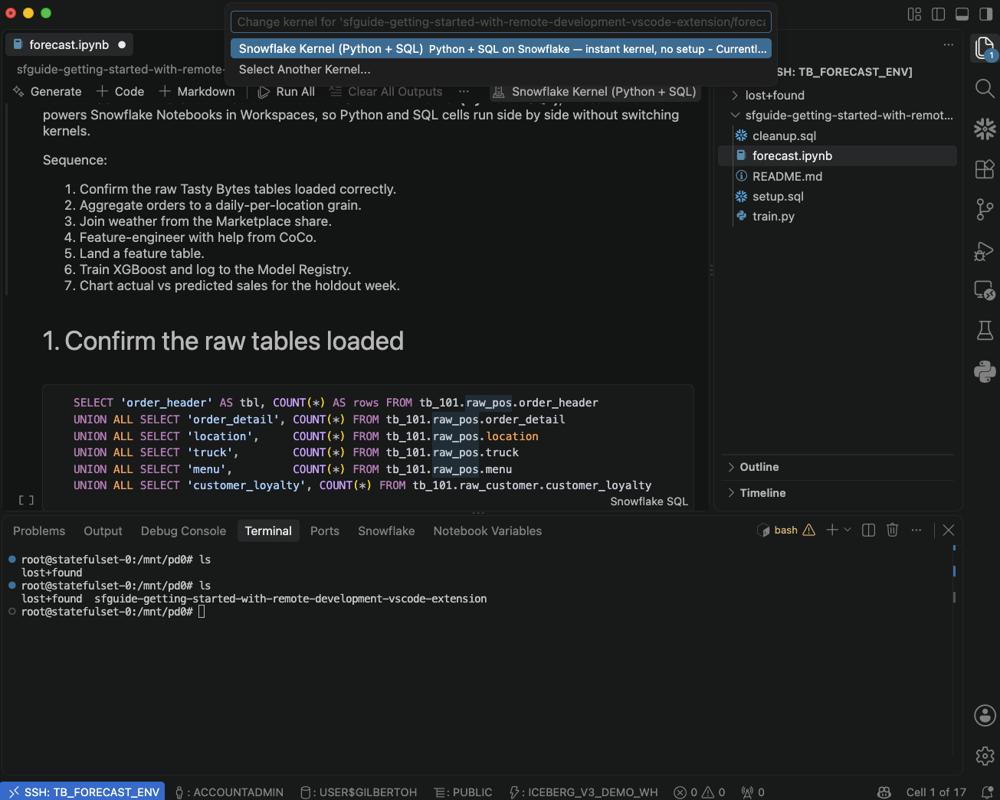
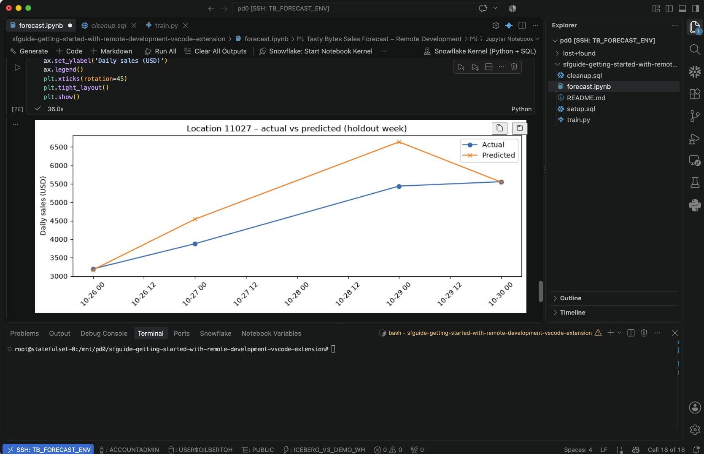

author: Gilberto Hernandez, Snowflake CoCo
id: get-started-with-remote-development-snowflake-vscode-extension
categories: snowflake-site:taxonomy/solution-center/certification/quickstart, snowflake-site:taxonomy/product/snowflake-ml, snowflake-site:taxonomy/product/platform
language: en
summary: Connect VS Code or Cursor to a Snowflake-managed dev environment over Remote-SSH, ingest ~1B rows of Tasty Bytes data, enrich with Marketplace weather, and train + log an XGBoost sales-forecasting model – all on Snowflake compute, from your local editor.
environments: web
status: Published
feedback link: https://github.com/Snowflake-Labs/sfguides/issues
fork repo link: https://github.com/Snowflake-Labs/sfguide-getting-started-with-remote-development-vscode-extension

# Getting Started with Remote Development in the Snowflake VS Code Extension

<!-- ------------------------ -->
## Overview

Duration: 3

Remote Development in the Snowflake Extension for VS Code provides you with a Snowflake-backed development environment you connect to over Remote-SSH, straight from VS Code or Cursor. There are no SSH keys to manage, no VMs to provision, and no local dependencies to maintain. The environment is a Snowflake Notebook service running on Snowpark Container Services, preloaded with Python, Jupyter, XGBoost, scikit-learn, and the Snowflake libraries, reachable from your editor as if it were localhost.

In this Quickstart, we'll build an end-to-end ML workflow against Snowflake compute, entirely from a local editor. The scenario is the following: you're an ML engineer on the Tasty Bytes team. Tasty Bytes runs food trucks in cities across the globe, and you've been asked to forecast daily sales per truck location. Weather clearly moves food-truck sales – so we'll enrich internal orders with a Marketplace weather share, feature-engineer with help from CoCo, train an XGBoost regressor, and log it to the Snowflake Model Registry, all from VS Code.

Let's get started!

### What You'll Learn

- How to create a Snowflake-backed remote development environment and connect to it over Remote-SSH from VS Code or Cursor
- How to run a Jupyter notebook that mixes Python and SQL cells using the Snowflake Kernel (Python + SQL) – the same kernel that powers Notebooks in Workspaces
- How to use Cortex Code (CoCo) inside the remote SSH session to accelerate feature engineering and analysis
- How to run a plain Python script (.py file) against the remote environment, beyond notebook cells
- How to train an XGBoost sales-forecasting model and log it to the Snowflake Model Registry
 - How to clone and work with a private GitHub repo from the remote environment – using your editor's GitHub sign-in, or a Snowflake secret for editor-independent auth
- How to suspend and resume the remote environment while preserving cloned repos, installed packages, and trained artifacts

### What You'll Need

- A Snowflake account with a role that can create and run notebook services (`USAGE` on a compute pool that allows the `NOTEBOOK` workload type; permission to use external access integrations and secrets). If you don't have one, [sign up for a free 30-day trial](https://signup.snowflake.com/?utm_source=snowflake-devrel&utm_medium=developer-guides&utm_cta=developer-guides). Select Enterprise edition.
- The account parameter `ENABLE_NOTEBOOK_SERVICE_REMOTE_VS_CODE_ACCESS` set to `TRUE`. It's on by default; an account admin can confirm.
- Access to the Snowflake Marketplace so you can acquire the free Pelmorex Weather Source: Frostbyte share (**setup.sql** acquires it programmatically – you need Marketplace access enabled on your account).
- VS Code or Cursor installed locally.
- The Microsoft Remote - SSH extension: [`ms-vscode-remote.remote-ssh`](https://marketplace.visualstudio.com/items?itemName=ms-vscode-remote.remote-ssh).
- The Snowflake Extension for Visual Studio Code, version 1.39 or later (persistent storage and Git require v1.39+): [Marketplace listing](https://marketplace.visualstudio.com/items?itemName=snowflake.snowflake-vsc).
- Snowflake CLI (`snow`) installed with a configured connection. See [Installing Snowflake CLI](https://docs.snowflake.com/en/developer-guide/snowflake-cli/installation/installation) and [Configuring Snowflake CLI connections](https://docs.snowflake.com/en/developer-guide/snowflake-cli/connecting/configure-connections).
- Local `nc` (netcat) on your `PATH`. Preinstalled on macOS and most Linux distributions. On Windows you'll need to install a `netcat`-compatible executable and add it to `PATH`.
- A GitHub account. You'll create a small private repo in step 8.
- Comfort with Python, Jupyter notebooks, Git, and basic SQL. Familiarity with a gradient-boosted tree model (XGBoost or similar) is helpful for step 7.

### What You'll Build

By the end of this guide, you'll have:

- A running Snowflake remote development environment, reachable from VS Code or Cursor over Remote-SSH.
- ~1B rows of Tasty Bytes orders and their supporting dimensions ingested into a Snowflake database.
- A Marketplace weather share acquired and joined into a daily-per-location feature table.
- A trained XGBoost sales-forecasting model logged to the Snowflake Model Registry.
- A private Git repo cloned into **/mnt/pd0** (persistent storage), authenticated via your editor's GitHub sign-in or a Snowflake secret.
- An actual vs. predicted sales chart for a held-out week, rendered inline in the remote notebook.

<!-- ------------------------ -->
## Set up your Snowflake account

Duration: 6

Let's set up everything you'll need on the Snowflake side: a warehouse for the bulk load, the Tasty Bytes database and schemas, an external stage against the public S3 bucket, all the raw tables, a compute pool for the notebook service, an external access integration for outbound GitHub and PyPI, and a Snowflake Workspace to mount into the remote environment.

We'll do it all with one SQL script, run from your terminal via the Snowflake CLI.

### Step 2a – Run the setup script

Clone the companion repo locally and run **setup.sql** with the Snowflake CLI:

```bash
git clone https://github.com/Snowflake-Labs/sfguide-getting-started-with-remote-development-vscode-extension.git
cd sfguide-getting-started-with-remote-development-vscode-extension
snow sql -f setup.sql
```

This executes the whole script against your default `snow` connection.

Here's what the script does:

- Creates a Large warehouse (`tb_de_wh`). Large lets the `COPY INTO` finish in ~1-2 minutes across all raw tables. It gets sized back down to XSmall at the end.
- Creates the `tb_101` database plus the `raw_pos`, `raw_customer`, `harmonized`, `analytics`, and `ml` schemas.
- Creates a CSV file format and an external stage against **s3://sfquickstarts/frostbyte_tastybytes/** – the canonical public Tasty Bytes bucket.
- Creates all eight raw tables: `country`, `franchise`, `location`, `menu`, `truck`, `order_header`, `order_detail`, and `customer_loyalty`.
- Creates the `harmonized.orders_v` and `analytics.orders_v` views that stitch orders, trucks, menus, franchises, locations, and customers into one queryable surface.
- Runs `COPY INTO` for every raw table. When this completes you'll have close to a billion rows across the fact tables.
- Creates a compute pool (`tb_remote_dev_pool`, `CPU_X64_S`) for the notebook service. The `NOTEBOOK` workload type is allowed on all pools by default.
- Creates a network rule (`egress_github_pypi`) and an external access integration (`tb_remote_dev_eai`) so the remote notebook service can reach `github.com` and `pypi.org` for cloning and `pip install`.
- Acquires the Pelmorex Weather Source: Frostbyte Marketplace listing programmatically – requests it, accepts the legal terms, and installs it as the `frostbyte_weathersource` database.
- Creates a Snowflake Workspace (`tb_forecast_ws`) – we'll mount this into the remote environment in step 4.
- Confirms `ENABLE_NOTEBOOK_SERVICE_REMOTE_VS_CODE_ACCESS` is on.

You should see a final `note` row that reads: `Setup complete.`.

> **Note:** the Tasty Bytes S3 bucket is public, so it does NOT need to be in the external access integration. `COPY INTO` runs on Snowflake compute against the stage – the EAI governs outbound traffic from the notebook container, not stage access.

### Step 2b – Verify the weather share

Weather is one of the strongest predictors of food-truck sales, so **setup.sql** already acquired the free Pelmorex Weather Source: Frostbyte share from the Snowflake Marketplace and installed it as the `frostbyte_weathersource` database. Confirm it's ready with one command:

```bash
snow sql -q "SELECT date_valid_std, city_name, avg_temperature_air_2m_f, tot_precipitation_in FROM frostbyte_weathersource.onpoint_id.history_day WHERE date_valid_std BETWEEN '2024-01-01' AND '2024-01-07' AND country = 'US' LIMIT 10;" --database frostbyte_weathersource --schema onpoint_id
```

You should see weather observations for a US city across the first week of January 2024. That's the data we'll join to daily orders in step 6.

Great job – the Snowflake side is ready. Now let's get your editor set up.

<!-- ------------------------ -->
## Install the extension and sign in

Duration: 3

Now we'll install the Snowflake Extension for VS Code (or Cursor) plus the companion Remote - SSH extension, and sign in to your Snowflake account.

### VS Code

1. Open VS Code.
2. In the Extensions view, search for Snowflake and install the extension published by Snowflake Inc. – make sure the version is 1.39.0 or later.
3. In the Extensions view again, search for `ms-vscode-remote.remote-ssh`. The top results, called Remote - SSH, is the extension to install. Install it.
4. Open the Snowflake extension from the Activity Bar. Sign in to your Snowflake account.

Cursor is built on the same VS Code extension model. Follow the same instructions above for installing the Remote - SSH extension in Cursor.

> **Note:** if you had an older Snowflake extension installed, reload your editor after upgrading. The **Remote Environments** panel that we'll use next only appears in v1.38+.



<!-- ------------------------ -->
## Create your remote environment

Duration: 5

We're ready to spin up the remote environment. From the Snowflake extension in your local editor, we'll create a notebook service running on the compute pool we provisioned earlier, and enable persistent storage so cloned Git repos and installed packages survive suspend/resume.

1. In the Snowflake extension sidebar, expand the **Remote Environments** panel.
2. Click the **+** sign - hovering over it should read: **Snowflake: Create Remote Development Environment**.
3. Fill in the form:
   - **Service name:** `tb_forecast_env` (or any Snowflake identifier; avoid collisions with existing SSH aliases in your **~/.ssh/config**).
   - **Workspaces:** select `tb_forecast_ws`.
   - **External access integrations:** select `tb_remote_dev_eai`.
   - **Secrets:** leave this empty. (Only needed for the optional Snowflake-secret auth path in step 8, which recreates the service with a secret attached.)
   - **Compute pool:** select `tb_remote_dev_pool`.
   - Expand the **Service settings** section:
     - **Compute type:** CPU
     - **Runtime version:** accept the default (includes XGBoost, scikit-learn, and the Snowflake ML libraries this guide uses).
     - **Enable persistent storage:** check this box.
4. Click **Create**.

> **Important:** **Enable persistent storage** can only be set at create time – you cannot add it to an existing service. If you skip it now, you'll have to delete this service and create a new one. Persistent storage mounts SPCS block storage at **/mnt/pd0** in the remote container. Cloned repos and pip installs live there across suspend and resume.

The service enters PENDING status while Snowflake provisions the container. This takes a few minutes. The panel refreshes every 30 seconds; you can also refresh manually. When the status flips to RUNNING, you're ready to connect.



<!-- ------------------------ -->
## Connect over SSH and open a notebook

Duration: 8

Let's connect over SSH.

1. In the **Remote Environments** panel, find your `tb_forecast_env` service.
2. Click **Connect to Remove Service: SSH**.
3. When prompted, select the `tb_forecast_ws` workspace to mount into the remote environment. Press Enter.
4. A new editor window opens, connected over SSH to the remote container at **/root**.





Behind the scenes, the extension started a local proxy on `127.0.0.1` that forwards SSH traffic to Snowflake over a secure WebSocket, wrote a `Host <service-name>` entry to your **~/.ssh/config**, installed the required extensions on the remote host, and opened the folder. You didn't have to do any of this manually.

> **Note:** The very first connection installs the Python, Jupyter, and Snowflake extensions on the remote host. This can take a couple of minutes. If the Snowflake Kernel option doesn't appear when you try to run a cell, wait for the installs to finish and reload the remote window (**Developer: Reload Window** from the Command Palette).

> **Important:** The remote window opens at **/root**, which is ephemeral – anything you write there is wiped when the service suspends. Do all of your work under **/mnt/pd0** (the persistent drive you enabled at create time). The next step clones the companion repo into **/mnt/pd0** for exactly this reason.

### Clone the companion repo into persistent storage

Let's pull the notebook and helper Python modules we'll be using. In the remote window, open a terminal (from the **Terminal** menu, choose **New Terminal**) and clone the repo into **/mnt/pd0**:

```bash
cd /mnt/pd0
git clone https://github.com/Snowflake-Labs/sfguide-getting-started-with-remote-development-vscode-extension.git
cd sfguide-getting-started-with-remote-development-vscode-extension
```

Add the folder to your workspace: from the **File** menu, choose **Add Folder to Workspace...** and pick **/mnt/pd0/sfguide-getting-started-with-remote-development-vscode-extension**. You should see **README.md**, **setup.sql**, **cleanup.sql**, **forecast.ipynb**, and **train.py** in the Explorer.

### Open the notebook

Open **forecast.ipynb**. In the search bar, type **Snowflake: Start Notebook Kernel**, then select **Snowflake Kernel (Python + SQL)** from the kernel picker above the notebook.

> **Note:** Run **Snowflake: Start Notebook Kernel** from the remote window (the editor window connected over SSH), not your local window – the kernel lives on the remote host. If the action doesn't appear, the remote extensions are still installing: wait for Snowflake, Python, and Jupyter to finish, then run **Developer: Reload Window** and reopen the notebook.

This is the same kernel that powers Snowflake Notebooks in Snowsight Workspaces. Python and SQL cells run side by side without switching kernels – Python cells run in the container's Python interpreter, and SQL cells run against your Snowflake account.

Run the first SQL cell to confirm the raw tables loaded:

```sql
SELECT 'order_header' AS tbl, COUNT(*) AS row_count FROM tb_101.raw_pos.order_header
UNION ALL SELECT 'order_detail', COUNT(*) FROM tb_101.raw_pos.order_detail
UNION ALL SELECT 'location',     COUNT(*) FROM tb_101.raw_pos.location
UNION ALL SELECT 'truck',        COUNT(*) FROM tb_101.raw_pos.truck
UNION ALL SELECT 'menu',         COUNT(*) FROM tb_101.raw_pos.menu
UNION ALL SELECT 'customer_loyalty', COUNT(*) FROM tb_101.raw_customer.customer_loyalty
ORDER BY 2 DESC;
```

You should see `order_detail` at the top with the largest row count – hundreds of millions of line items. Together with `order_header` this is close to a billion rows. You're querying that volume from your local editor, and the query runs on Snowflake compute.

The remote environment isn't limited to notebooks – you can open and run plain Python files against the same remote interpreter. We'll do this in a later step.

Great job. You're now running Snowflake-backed compute from your local editor. Let's put it to work.




<!-- ------------------------ -->
## Enrich with Marketplace weather and feature-engineer with CoCo

Duration: 8

We have 1B rows of raw orders on one side and a weather share on the other. Let's turn them into a modeling-ready feature table.

### Aggregate orders to daily-per-location grain

Run the next cell in the notebook:

```sql
CREATE OR REPLACE TABLE tb_101.ml.daily_sales AS
SELECT
    DATE(order_ts)             AS date,
    location_id,
    ANY_VALUE(location_city)   AS city,
    ANY_VALUE(location_region) AS region,
    ANY_VALUE(country)         AS country,
    SUM(price)                 AS daily_sales,
    COUNT(DISTINCT order_id)   AS order_count
FROM tb_101.harmonized.orders_v
GROUP BY 1, 2;

SELECT COUNT(*) AS rows_in_daily_sales FROM tb_101.ml.daily_sales;
```

Here's what the code does:

- Reads from `harmonized.orders_v`, the view that joins orders, line items, trucks, menus, and locations.
- Groups by `(date, location_id)` to get one row per truck location per day.
- Materializes the result to `tb_101.ml.daily_sales` – this is now a small table (tens of thousands of rows) that we can work with in memory.

### Join the Marketplace weather

Now let's bring in weather. The weather view is keyed at postal-code + date grain, so joining directly on city fans every city out to all of its postal codes (Denver alone has ~74) and explodes the row count. We first pre-aggregate weather to one row per city per date, then join. We also programmatically bump the warehouse to MEDIUM for this step and size it back down right after. Run the next cell (note that it may take about 3 minutes to complete):

```sql
ALTER WAREHOUSE tb_de_wh SET WAREHOUSE_SIZE = 'MEDIUM';

CREATE OR REPLACE TABLE tb_101.ml.daily_sales_weather AS
WITH weather_by_city AS (
    SELECT
        date_valid_std,
        UPPER(city_name)              AS city_upper,
        AVG(avg_temperature_air_2m_f) AS avg_temperature_air_2m_f,
        AVG(tot_precipitation_in)     AS tot_precipitation_in,
        AVG(avg_wind_speed_100m_mph)  AS avg_wind_speed_100m_mph
    FROM frostbyte_weathersource.onpoint_id.history_day
    WHERE date_valid_std BETWEEN (SELECT MIN(date) FROM tb_101.ml.daily_sales)
                             AND (SELECT MAX(date) FROM tb_101.ml.daily_sales)
      AND UPPER(city_name) IN (SELECT DISTINCT UPPER(city) FROM tb_101.ml.daily_sales)
    GROUP BY date_valid_std, UPPER(city_name)
)
SELECT
    ds.date,
    ds.location_id,
    ds.city,
    ds.daily_sales,
    ds.order_count,
    w.avg_temperature_air_2m_f                     AS temp_f,
    (w.avg_temperature_air_2m_f - 32.0) * 5.0/9.0  AS temp_c,
    w.tot_precipitation_in * 25.4                  AS precip_mm,
    w.avg_wind_speed_100m_mph * 1.60934            AS wind_kph
FROM tb_101.ml.daily_sales ds
JOIN weather_by_city w
  ON w.date_valid_std = ds.date
 AND w.city_upper = UPPER(ds.city)
WHERE ds.daily_sales IS NOT NULL;

ALTER WAREHOUSE tb_de_wh SET WAREHOUSE_SIZE = 'XSMALL';

SELECT COUNT(*) AS joined_rows FROM tb_101.ml.daily_sales_weather;
```

Here's what the code does:

- Bumps `tb_de_wh` to MEDIUM for the weather scan, then back to XSMALL when done.
- Pre-aggregates the weather view to one row per (`date`, `city`) in `weather_by_city`, averaging across the postal codes in each city. This is what avoids the postal-code fan-out that would otherwise multiply every sales row.
- Filters the weather scan to the date range and cities present in `daily_sales`.
- Joins the pre-aggregated weather to `daily_sales` on `date` + `city`, converts imperial units to metric, and drops rows where the join failed or sales are null.
- Materializes `tb_101.ml.daily_sales_weather` – the base for feature engineering.

### Feature-engineer with CoCo

Now the fun part. We need calendar, lag, and rolling features on the joined data – the standard patterns for time-series forecasting. We'll let CoCo generate them.

Open the CoCo panel in the remote window from the Activity Bar and try prompts like:

- "Add day-of-week, month, and is_weekend features to a daily sales DataFrame."
- "Add lag-1 and lag-7 daily-sales features per location_id."
- "Add a 7-day rolling mean of precip_mm per location_id."

CoCo runs inside the remote SSH session with full access to Snowflake compute and data. By default it shows the generated code in its panel for you to read or copy – it won't change the notebook on its own. If you attach the notebook as context with `@`, CoCo will instead try to apply its code as edits to the file.

Either way, **you don't need to accept any edits**: the two cells below are already in the notebook – one defines the transforms, one applies them. Run them as-is to continue, and use CoCo alongside to see how you'd generate them yourself.

The first cell defines three small pandas transforms:

```python
import pandas as pd

def add_calendar_features(df, date_col='date'):
    df = df.copy()
    df[date_col] = pd.to_datetime(df[date_col])
    df['day_of_week'] = df[date_col].dt.dayofweek
    df['month'] = df[date_col].dt.month
    df['is_weekend'] = df['day_of_week'].isin([5, 6]).astype(int)
    return df

def add_lag_features(df, group_cols, target_col='daily_sales', lags=(1, 7)):
    df = df.copy().sort_values(group_cols + ['date'])
    for lag in lags:
        df[f'{target_col}_lag_{lag}'] = df.groupby(group_cols)[target_col].shift(lag)
    return df

def add_rolling_precip(df, group_cols, precip_col='precip_mm', window=7):
    df = df.copy().sort_values(group_cols + ['date'])
    df[f'{precip_col}_roll_{window}'] = (
        df.groupby(group_cols)[precip_col]
        .rolling(window=window, min_periods=1)
        .mean()
        .reset_index(level=list(range(len(group_cols))), drop=True)
    )
    return df
```

The second cell loads the joined table and chains the transforms via `.pipe()`:

```python
from snowflake.snowpark.context import get_active_session

session = get_active_session()
raw = session.table('tb_101.ml.daily_sales_weather').to_pandas()
raw.columns = [c.lower() for c in raw.columns]

features_df = (
    raw
    .pipe(add_calendar_features)
    .pipe(add_rolling_precip, group_cols=['location_id'])
    .pipe(add_lag_features, group_cols=['location_id'])
    .dropna()
    .reset_index(drop=True)
)
features_df.head()
```

Here's what the code does:

- Gets the active Snowflake session; the remote container is already authenticated.
- Materializes the joined table to a pandas DataFrame in the container.
- Chains the three transforms with `.pipe()`: calendar features first, then a 7-day rolling precipitation feature, then lag-1 and lag-7 sales features.
- Drops the initial rows containing NaN lag values.

### Land the feature table back in Snowflake

Push the DataFrame back to Snowflake so **train.py** can consume it:

```python
session.write_pandas(
    features_df,
    table_name='FEATURE_TABLE',
    database='TB_101',
    schema='ML',
    auto_create_table=True,
    overwrite=True,
)
session.table('tb_101.ml.feature_table').count()
```

Now the feature table lives in Snowflake, ready for training.

<!-- ------------------------ -->
## Train an XGBoost model and log it to the Model Registry

Duration: 6

This is the step where we ship a model beyond a notebook. We'll train an XGBoost regressor on the feature table, evaluate it on the last week of data, chart actual vs predicted, and log the model to the Snowflake Model Registry – where it becomes discoverable by other teammates and downstream jobs.

### Train from a .py file

**train.py** in the repo is a plain Python script – no notebook required. Let's run it against the remote environment. In the notebook, execute this cell (use the full path so it runs regardless of the notebook's working directory):

```python
!python /mnt/pd0/sfguide-getting-started-with-remote-development-vscode-extension/train.py \
    --source-table tb_101.ml.feature_table \
    --database tb_101 \
    --schema ml \
    --model-name tb_sales_forecaster \
    --version v1
```

You can also run it directly in the remote terminal (`python /mnt/pd0/sfguide-getting-started-with-remote-development-vscode-extension/train.py --source-table ...`). Either way it executes on the Snowflake-hosted container. Because a script run this way is a separate process from the notebook kernel, **train.py** builds its own Snowflake session from the container's credentials (falling back from the kernel's active session), so no extra auth setup is needed.

Here's what **train.py** does:

- Builds a Snowflake session – reusing the notebook's active session in-kernel, or creating one from the container's OAuth token when run standalone.
- Loads the feature table into a pandas DataFrame using `session.table(...).to_pandas()`.
- Does a time-based train/test split – the last 7 days are held out. Never a random split for forecasting.
- Fits an `XGBRegressor` with sensible defaults (400 trees, depth 6, learning rate 0.05).
- Evaluates on the holdout: MAPE and RMSE.
- Logs the fitted model to the Snowflake Model Registry via `Registry.log_model()`, along with a sample input, the version, and a comment carrying the holdout metrics. It logs for both `WAREHOUSE` and `SNOWPARK_CONTAINER_SERVICES` so you can run inference either way – without this, a Container Runtime model defaults to SPCS-only and `model_ref.run()` on a pandas frame fails.

You should see output ending in something like (your exact metrics will vary):

```text
Loading features from tb_101.ml.feature_table ...
  327,515 rows across 9968 locations
  Train: 322,766 rows | Test: 4,749 rows
Holdout MAPE: 0.40  |  RMSE: 8,621.66
Logging model to registry: tb_101.ml.tb_sales_forecaster (v1) ...
Done. The model is now discoverable from the Model Registry.
```

> **Note:** A couple of `Failed to get kernel ID for per-kernel logging` lines may print at the top. They are benign and won't impact any of the work we're doing.

Your model is now live in the Model Registry. You can list it from any session:

```sql
SHOW MODELS IN SCHEMA tb_101.ml;
```

Great job – you shipped a model. From here, other teammates can retrieve it, run predictions, or promote it to a downstream inference job – all without ever seeing your notebook.

### Chart actual vs predicted

Let's visualize the holdout. Run the final cell of the notebook:

```python
import pandas as pd
import matplotlib.pyplot as plt
from snowflake.ml.registry import Registry

registry = Registry(session=session, database_name='TB_101', schema_name='ML')
model_ref = registry.get_model('tb_sales_forecaster').version('v1')

holdout = features_df[features_df['date'] > features_df['date'].max() - pd.Timedelta(days=7)].copy()
one_loc = holdout[holdout['location_id'] == holdout['location_id'].value_counts().idxmax()].copy()

FEATURE_COLS = [
    'day_of_week', 'month', 'is_weekend',
    'temp_c', 'precip_mm', 'wind_kph',
    'precip_mm_roll_7', 'daily_sales_lag_1', 'daily_sales_lag_7',
]
# model_ref.run returns a DataFrame; the prediction is the last column.
one_loc['predicted'] = model_ref.run(one_loc[FEATURE_COLS]).iloc[:, -1].to_numpy()

fig, ax = plt.subplots(figsize=(10, 4))
ax.plot(one_loc['date'], one_loc['daily_sales'], marker='o', label='Actual')
ax.plot(one_loc['date'], one_loc['predicted'], marker='x', label='Predicted')
ax.set_title(f"Location {int(one_loc['location_id'].iloc[0])} – actual vs predicted (holdout week)")
ax.set_ylabel('Daily sales (USD)')
ax.legend()
plt.xticks(rotation=45)
plt.tight_layout()
plt.show()
```

Here's what the code does:

- Retrieves the model from the registry – we don't reload the Python object, we ask Snowflake for it.
- Picks the single location with the most rows in the holdout.
- Runs inference through the registered model via `model_ref.run(...)`.
- Charts actual vs predicted sales for that location across the holdout week.

You should see the two lines tracking each other reasonably closely. The fit has room to tune, and you've built a working forecaster end to end in a fraction of an hour.



<!-- ------------------------ -->
## Working with a private git repo

Duration: 5

Data science and machine learning work often involves the use of source control and git repositories. The suggested path for working with repos using remote development is to clone them into the the **/mnt/pd0** directory. This is the persisted storage directory, and cloning into it will ensure that the repo will be available to you in subsequent SSH sessions.

Git authentication is typically handled by your editor's GitHub sign-in – no secret or credential helper needed. If your remote VS Code (or Cursor) session is signed into GitHub, many git operations will work with little to no configuration. 

To quickly check if you are logged into GitHub, do the following:

1. Click on the **Accounts** icon in VS Code (or Cursor) **in the remote window**. 

2. If you see something like "your-username (GitHub)", then you're signed into GitHub. 

If you're signed in, then the typical `git clone` workflow applies and automatically works for repos that you own or have been added to as a collaborator:

```bash
cd /mnt/pd0
git clone https://github.com/<your_github_username>/<repo-name>.git # Path to repo
cd <repo-name>>
```

If you are running git under a service identity instead of your own, store an access token in a **Snowflake secret**, mount it into the service, and point git at it with a credential helper. This is the common pattern for team and production environments. For details, see [Remote Development with the Snowflake Extension for Visual Studio Code](https://docs.snowflake.com/en/user-guide/vscode-ext-remote-development).

### Set your git identity at the local level to persist it

Before your first commit in this repo, git needs an author identity. Set it at the local repo level using `--local` to persist your git identity from session to session. Using `--global` will write the config to **/root**, which is wiped on session suspend. Local config lives in the repo on **/mnt/pd0** and persists:

```bash
cd /mnt/pd0/tb-forecast-private
git config --local user.name "Your Name"
git config --local user.email "you@example.com"
```

> **Important:** If you commit before setting this, git raises `Author identity unknown` and suggests `git config --global user.email ...`. Don't follow that suggestion here – `--global` writes to **/root/.gitconfig**, which is wiped on suspend, so your identity vanishes on the next resume. Use `--local` (as above) so it persists with the repo on **/mnt/pd0**.


<!-- ------------------------ -->
## Suspend, resume, and confirm state persists

Duration: 2

Let's confirm your work survives a suspend.

1. Save any unsaved files. In the Remote Environments panel, stop the `tb_forecast_env` environment and close the remote window. The environment status will flip to SUSPENDED.

2. Resume the service and pick the same workspace when connecting.

3. In the terminal on the remote, confirm your files are intact:

```bash
ls /mnt/pd0/<name-of-repo-you-cloned>
ls /root
```

Everything under **/mnt/pd0** – the repo, your pip installs – is exactly as you left it. **/root** is empty: it's the ephemeral filesystem, wiped on suspend. The registered model persists in Snowflake regardless (run `SHOW MODELS IN SCHEMA tb_101.ml;` for example).

<!-- ------------------------ -->
## Clean up

Duration: 2

When you're done, tear everything down. Do it in this order, because the cleanup script drops the compute pool the remote service runs on – so the service has to go first.

1. Delete the remote service. In VS Code, in the Remote Environments panel: stop the remote environment and then delete it.

2. Drop the Snowflake objects. From the companion repo, run **cleanup.sql** with the Snowflake CLI (or paste its contents into a Snowsight worksheet):

```bash
snow sql -f cleanup.sql
```

That script:

- Drops the `tb_101` database, which cascades to everything under it – tables, views, feature tables, model registry entries, and the Snowflake Workspace.
- Drops the compute pool and external access integration.
- Drops the Large warehouse.
- Drops the `frostbyte_weathersource` database acquired from the Marketplace.

<!-- ------------------------ -->
## Conclusion and Resources

Duration: 1

Congratulations! You built and shipped an end-to-end ML workflow – data ingest, feature engineering, model training, and registry logging – entirely against Snowflake compute, from your local editor, without provisioning a VM, managing an SSH key, or moving a single row down to your laptop.

The same remote environment that ran this notebook can host your team's other ML projects. The same Model Registry entry can be picked up by inference services, scheduled tasks, or downstream teammates. And the same editor you already work in – VS Code or Cursor – is now a first-class interface to Snowflake's compute plane.

### What You Learned

- How to create a Snowflake-backed remote development environment and connect over Remote-SSH from VS Code or Cursor.
- How to ingest ~1B rows of Tasty Bytes data from a public S3 stage into Snowflake in a couple of minutes on a Large warehouse.
- How to enrich internal data with a Marketplace weather share – internal facts + external reference data, the way real DS/ML work looks.
- How to use the Snowflake Kernel (Python + SQL) in a Jupyter notebook, with Python and SQL cells side by side.
- How to work with CoCo inside the remote SSH session to accelerate feature engineering.
- How to run plain .py files against the remote environment.
- How to train an XGBoost model and log it to the Snowflake Model Registry.
- How to clone and work with a private Git repo in the remote environment – via your editor's GitHub sign-in, or a Snowflake secret for editor-independent auth.
- How persistent storage at **/mnt/pd0** survives suspend and resume, while **/root** doesn't.

### Related Resources

- [Remote Development with the Snowflake Extension for Visual Studio Code](https://docs.snowflake.com/en/user-guide/vscode-ext-remote-development)
- [Snowflake Extension for Visual Studio Code](https://docs.snowflake.com/en/user-guide/vscode-ext)
- [Snowflake Notebooks (Container Runtime)](https://docs.snowflake.com/en/user-guide/ui-snowsight/notebooks-on-container-runtime)
- [Snowflake ML – Model Registry](https://docs.snowflake.com/en/developer-guide/snowflake-ml/model-registry/overview)
- [Cortex Code (CoCo) in your code editor](https://docs.snowflake.com/en/user-guide/cortex-code)
- [Companion repo: sfguide-getting-started-with-remote-development-vscode-extension](https://github.com/Snowflake-Labs/sfguide-getting-started-with-remote-development-vscode-extension)
- [Pelmorex Weather Source: Frostbyte – Snowflake Marketplace](https://app.snowflake.com/marketplace/listing/GZSOZ1LLEL)
- Related Quickstart: [Getting Started with CoCo in the Snowflake VS Code Extension](https://quickstarts.snowflake.com/guide/get-started-coco-vscode-extension/)

<!--
AUTHOR NOTES (remove before publish):

Validated end-to-end on a live account (setup, weather join, features, train.py, Model Registry, chart, private-repo clone via editor GitHub auth). The service-identity / Snowflake-secret path is now a short pointer to the official docs; it was validated earlier, but it's out of scope for a getting-started guide – the interactive reader is signed into GitHub in their editor.

Still open before publish:
- Publish the companion repo to github.com/Snowflake-Labs so the `git clone` step works (currently manual file upload).
- Optionally pin a specific Container Runtime version in step 4 (guide currently accepts the default).
- Capture screenshots for assets/: (1) Remote Environments panel with a running service, (2) Setup SSH, (3) Snowflake Kernel (Python + SQL) picker, (4) row-count cell result, (5) CoCo panel in remote window, (6) Model Registry entry in Snowsight, (7) actual-vs-predicted chart, (8) /secrets/ ls output.
-->
