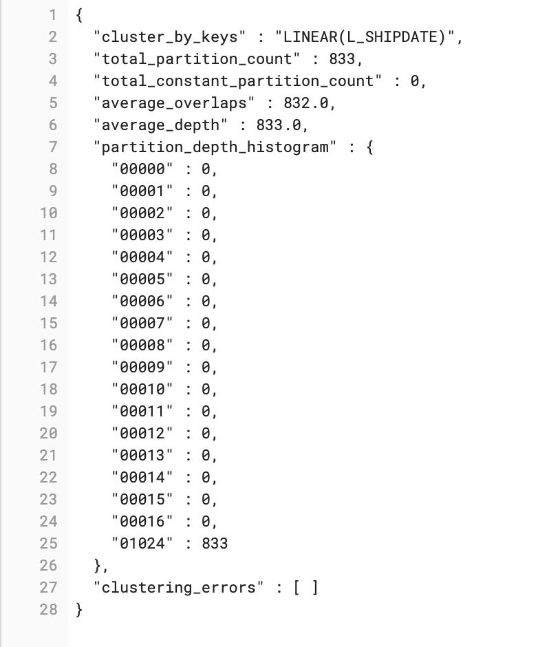
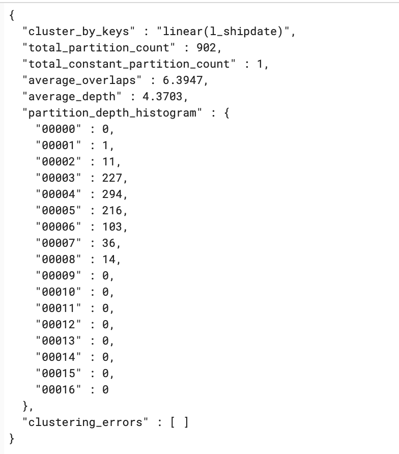
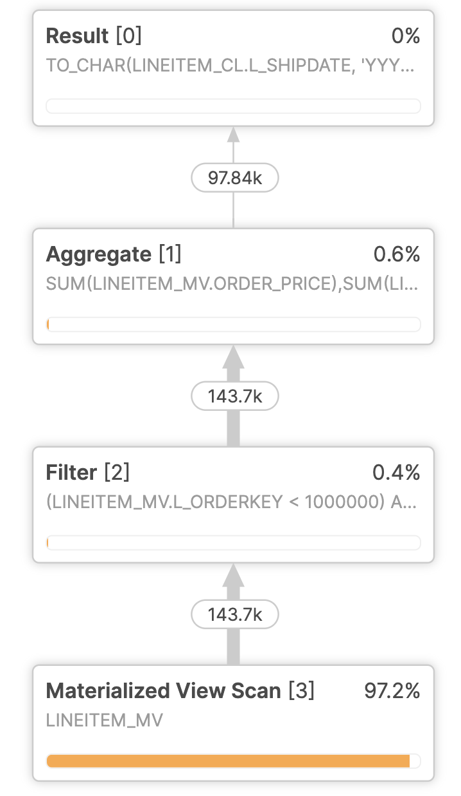
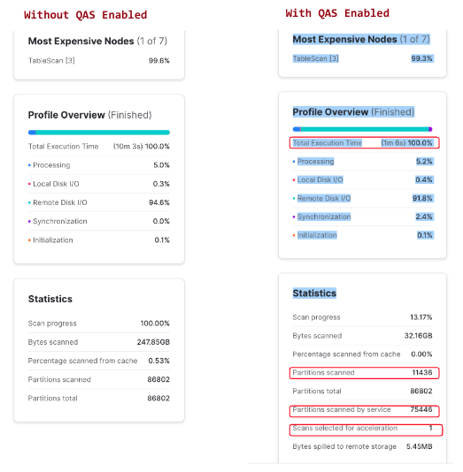
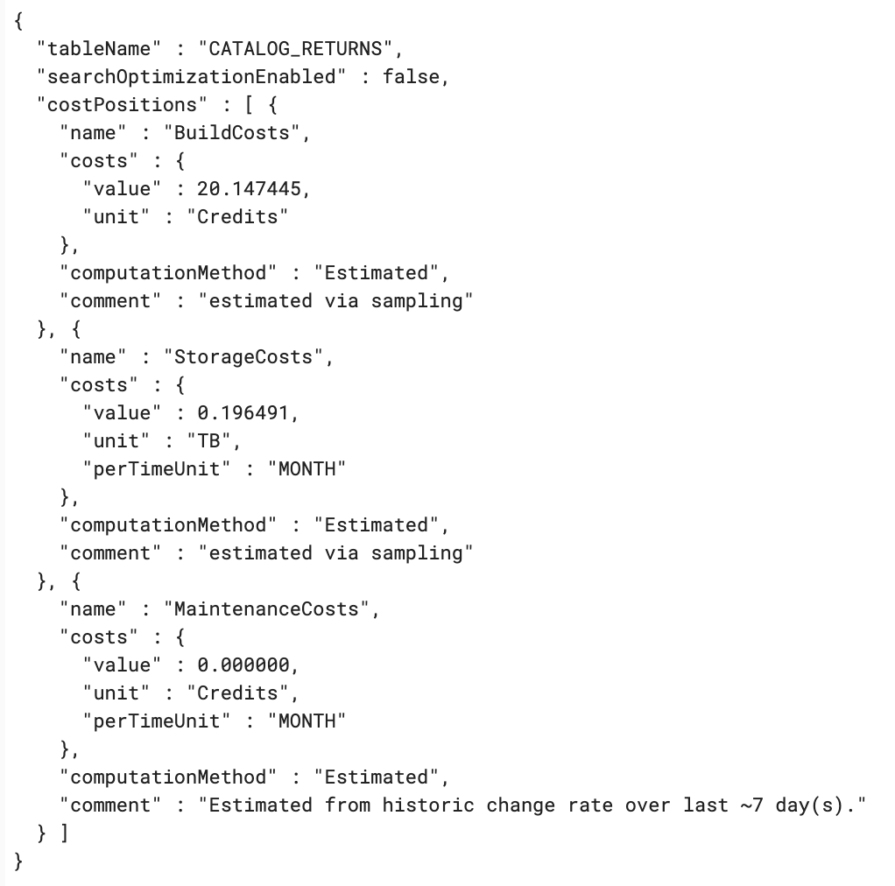

author: Praveen Purushothaman
id: getting-started-cost-performance-optimization
categories: snowflake-site:taxonomy/solution-center/certification/quickstart, snowflake-site:taxonomy/product/platform
language: en
summary: Optimize Snowflake costs and performance with warehouse sizing, caching strategies, resource monitors, and query tuning.
environments: web
status: Published
feedback link: https://github.com/Snowflake-Labs/sfguides/issues


# Getting Started with Cost and Performance Optimization
<!-- ------------------------ -->
## **Overview** 

By completing this guide, you will be able to understand and implement various optimization features on Snowflake. 

- **Setup Environment**: Use correct roles and sample datasets to use the optimization features
- **Account Usage**: Understand purpose of Account Usage schema and use it to uncover savings opportunities
- **Warehouse Controls**: Leverage settings on a virtual warehouse to optimize usage
- **Storage**: Determine cost savings with high-churn and short-lived tables 
- **Optimization Features**: Utilize Snowflake optimization features to achieve cost or performance savings

### **Prerequisites**
- Familiarity with [Snowflake platform](https://docs.snowflake.com/en/user-guide/intro-key-concepts)
- Basic understanding of [micro-partitions](https://docs.snowflake.com/en/user-guide/tables-clustering-micropartitions)
- [Accountadmin](https://docs.snowflake.com/en/user-guide/security-access-control-considerations#using-the-accountadmin-role) access on a Snowflake account
- If you do not have access to a Snowflake account, you can sign up for a [free trial](https://signup.snowflake.com/?utm_source=snowflake-devrel&utm_medium=developer-guides&utm_cta=developer-guides)

### **What You’ll Learn**
- How to identify optimization patterns in your Snowflake account 
- How to implement performance improvements in your Snowflake environment

<!-- ------------------------ -->
## **Setup** 

This section contains the code that needs to be executed in your Snowflake account to enable understanding of content in this guide.

```sql
-- WAREHOUSE CREATION --
USE ROLE ACCOUNTADMIN;

create warehouse if not exists hol_compute_wh
with warehouse_size='SMALL'
     warehouse_type='STANDARD'
     initially_suspended=TRUE
     auto_resume=FALSE   
;

use warehouse hol_compute_wh;

-- DATABASE SCHEMA CREATION --
create database if not exists OPT_HOL;
use database OPT_HOL;
create schema if not exists DEMO;

use schema OPT_HOL.DEMO;

create or replace table lineitem as select * from snowflake_sample_data.tpch_sf100.lineitem order by L_PARTKEY;
create or replace table orders as select * from snowflake_sample_data.tpch_sf100.orders;
create or replace table part as select * from snowflake_sample_data.tpch_sf100.part;

create or replace table lineitem_cl as select * from lineitem;
alter table lineitem_cl cluster by linear(l_shipdate);

create or replace materialized view lineitem_mv as
select  
        to_char(l_shipdate,'YYYYMM') as ship_month
        ,l_orderkey
        ,sum(l_quantity*l_extendedprice) as order_price
        ,sum(l_quantity*l_discount) as order_discount
        ,order_price-order_discount as net_selling_price
from    
        lineitem_cl
group by
        to_char(l_shipdate,'YYYYMM')
        ,l_orderkey
;

create or replace table DATE_DIM
as
select * from SNOWFLAKE_SAMPLE_DATA.TPCDS_SF100TCL.DATE_DIM
;

create or replace table CATALOG_RETURNS
as
select 
        cr.*
from 
        SNOWFLAKE_SAMPLE_DATA.TPCDS_SF100TCL.catalog_RETURNS cr
        JOIN SNOWFLAKE_SAMPLE_DATA.TPCDS_SF100TCL.DATE_DIM d
          ON cr.cr_returned_date_sk=d.d_date_sk
where   
        d.d_year in (2001,2002)
;
```

<!-- ------------------------ -->
## **Warehouse Controls**

This section covers the code for controls that can be enforced on virtual warehouses.

#### SQL
```sql
-- SETTING CONTEXT FOR THE SESSION --
USE ROLE ACCOUNTADMIN;

-- Check what parameters or settings are being used in a warehouse 
show parameters for warehouse hol_compute_wh;

-- Setting Auto suspend for a warehouse, value in seconds
alter warehouse hol_compute_wh set auto_suspend=60;

-- Setting Auto Resume for a warehouse
alter warehouse hol_compute_wh set auto_resume=TRUE;

-- Changing Statement Timeout at account level
alter account set statement_timeout_in_seconds=7200;

-- Changing Statement Timeout at warehouse level
alter warehouse hol_compute_wh set statement_timeout_in_seconds=3600;

-- Create a resource monitor
CREATE OR REPLACE RESOURCE MONITOR Credits_Quota_Monitoring
  WITH CREDIT_QUOTA = 5000
       NOTIFY_USERS = (JDOE, "Jane Smith", "John Doe")
  TRIGGERS ON 75 PERCENT DO NOTIFY
           ON 100 PERCENT DO SUSPEND
           ON 110 PERCENT DO SUSPEND_IMMEDIATE;

-- Activating a resource monitor
alter warehouse hol_compute_wh set resource_monitor=Credits_Quota_Monitoring;
```

<!-- ------------------------ -->
## **Account Usage Queries**

- [Account Usage](https://docs.snowflake.com/en/sql-reference/account-usage) is a powerful tool in an administrator's toolbox to identify optimization opportunites. Apart from metadata about objects in the Snowflake account, it  contains usage metrics related to all services consumed in the account - Credits, Storage, Data Transfer. 
- In addition, [Query History](https://docs.snowflake.com/en/sql-reference/account-usage/query_history) contains all information related to a query - metrics for each operation in a query, rows scanned, warehouse used, query text etc. The below queries are examples for viewing results of different views in Account Usage schema.

#### SQL
```sql
-- SETTING CONTEXT FOR THE SESSION --
USE ROLE ACCOUNTADMIN;
USE SCHEMA SNOWFLAKE.ACCOUNT_USAGE;

use warehouse hol_compute_wh;

-- SAMPLE ACCOUNT USAGE QUERIES
-- Warehouse Usage Metrics
select * from snowflake.account_usage.warehouse_metering_history limit 10;

-- Access History for objects used in queries
select * from snowflake.account_usage.access_history limit 10;

-- Snowpipe Usage Metrics
select * from snowflake.account_usage.pipe_usage_history limit 10;

-- Storage Metrics
select * from snowflake.account_usage.storage_usage limit 10;

-- Table Storage Detailed Metrics
select * from snowflake.account_usage.table_storage_metrics limit 10;
```

<!-- ------------------------ -->
## **Storage Usage Monitoring**

This section covers the code to identify high churn tables - significant DML, short lived tables - tables truncated and reloaded everyday and tables not active in the past 90 days.

#### SQL
```sql
-- SETTING CONTEXT FOR THE SESSION ----
USE ROLE ACCOUNTADMIN;
USE WAREHOUSE hol_compute_wh;

-- Identify high churn tables or short lived tables
SELECT
        t.table_catalog||'.'||t.table_schema||'.'||t.table_name as fq_table_name
        ,t.active_bytes/power(1024,3) as active_size_gb
        ,t.time_travel_bytes/power(1024,3) as time_travel_gb
        ,t.failsafe_bytes/power(1024,3) as failsafe_gb
        ,t.retained_for_clone_bytes/power(1024,3) as clone_retain_gb
        ,active_size_gb+time_travel_gb+failsafe_gb+clone_retain_gb as total_size_gb
        ,(t.time_travel_bytes + t.failsafe_bytes + t.retained_for_clone_bytes)/power(1024,3) as non_active_size_gb
       ,div0(non_active_size_gb,active_size_gb)*100 as churn_pct
        ,t.deleted
        ,timediff('hour',t.table_created,t.table_dropped) as table_life_duration_hours
        ,t1.is_transient
        ,t1.table_type
        ,t1.retention_time
        ,t1.auto_clustering_on
        ,t1.clustering_key
        ,t1.last_altered
        ,t1.last_ddl
FROM
        snowflake.account_usage.table_storage_metrics t
        JOIN snowflake.account_usage.tables t1
          ON t.id=t1.table_id
WHERE
        1=1
        --AND t1.table_catalog in ('','') -- use this to filter on specific databases
        AND 
            (
             churn_pct>=40
             OR
             table_life_duration_hours<=24  -- short lived tables
            )
ORDER BY total_size_gb desc;

-- Unused tables
-- Identify Table sizes and Last DDL/DML Timestamps
SELECT TABLE_CATALOG || '.' || TABLE_SCHEMA || '.' || TABLE_NAME AS TABLE_PATH
       ,TABLE_NAME
       ,TABLE_SCHEMA AS SCHEMA
       ,TABLE_CATALOG AS DATABASE
       ,BYTES
       ,TO_NUMBER(BYTES / POWER(1024,3),10,2) AS GB
       ,LAST_ALTERED AS LAST_USE
       ,DATEDIFF('Day',LAST_USE,CURRENT_DATE) AS DAYS_SINCE_LAST_USE
FROM INFORMATION_SCHEMA.TABLES
WHERE DAYS_SINCE_LAST_USE > 90 --Use your Days Threshold
ORDER BY BYTES DESC;
 
-- Tables not used in any query in the last 90 days
WITH access_history as
(   
SELECT  
        distinct
        split(base.value:objectName, '.')[0]::string as DATABASE_NAME
        ,split(base.value:objectName, '.')[1]::string as SCHEMA_NAME
        ,split(base.value:objectName, '.')[2]::string as TABLE_NAME
FROM snowflake.account_usage.access_history 
     ,lateral flatten (base_objects_accessed) base
where query_start_time between current_date()-90 and current_date()
)
SELECT  tbl.table_catalog||'.'||tbl.table_schema||'.'||tbl.table_name as FQ_table_name
FROM    snowflake.account_usage.tables tbl
        LEFT JOIN access_history ah
          ON tbl.table_name=ah.table_name
         AND tbl.table_schema=ah.schema_name
         AND tbl.table_catalog=ah.database_name
WHERE   ah.table_name is NULL
        AND tbl.deleted is null
;
```

#### Actions from query results
- Decide on time travel setting for high churn tables
- Consider using transient table type for high churn tables and short lived tables
- Investigate the business value of tables that haven't been used in the last 90 days

<!-- ------------------------ -->
## **Automatic Clustering**

This section covers [Automatic Clustering](https://docs.snowflake.com/en/user-guide/tables-auto-reclustering). Automatic Clustering is a Snowflake managed service that manages reclustering (as needed) of clustered tables. Reclustering is the process of reordering data in tables to colocate rows that have same cluster key values, which reduces the number of micro-partitions that need to be scanned during execution of a query thereby reducing execution times and help with efficient query execution on smaller sized warehouses. 

#### SQL
```sql
---- SETTING CONTEXT FOR THE SESSION ----
USE ROLE ACCOUNTADMIN;
USE WAREHOUSE hol_compute_wh;
USE SCHEMA OPT_HOL.DEMO;

-- Query to show Clustering information on a non-clustered table
SELECT SYSTEM$CLUSTERING_INFORMATION('LINEITEM','LINEAR(L_SHIPDATE)');

-- Executing a query on an non-clustered table
-- Ensuring that we are not using cached results
alter session set USE_CACHED_RESULT=false;

SELECT  *
FROM    lineitem
WHERE   l_shipdate BETWEEN '1995-01-01' AND '1995-03-01'
;

-- uery to show Clustering information on a clustered table
SELECT SYSTEM$CLUSTERING_INFORMATION('LINEITEM_CL');

-- Executing a query on an clustered table
SELECT  *
FROM    lineitem_cl 
WHERE   l_shipdate BETWEEN '1995-01-01' AND '1995-03-01'
;


```
#### Results Screenshot
- Unclustered table


- Clustered table


#### Outcome
- Automatic clustering improves query performance by scanning less data (less micropartitions). Refer to [Clustering Considerations](https://docs.snowflake.com/en/user-guide/tables-clustering-keys#considerations-for-choosing-clustering-for-a-table) for clustering considerations and choosing the right clustering key for a table.

<!-- ------------------------ -->
## **Materialized Views**

This section covers use of [Materialized Views](https://docs.snowflake.com/en/user-guide/views-materialized) as an option to optimize Snowflake workloads. A materialized view is a pre-computed data set derived from a query specification and stored for later use. Because the data is pre-computed, querying a materialized view is faster than executing a query against the base table of the view. This performance difference can be significant when a query is run frequently or is sufficiently complex. As a result, materialized views can speed up expensive aggregation, projection, and selection operations, especially those that run frequently and that run on large data sets.

#### SQL
```sql
---- SETTING CONTEXT FOR THE SESSION ----
USE ROLE ACCOUNTADMIN;
USE WAREHOUSE hol_compute_wh;
USE SCHEMA OPT_HOL.DEMO;

-- Let's say a user ran this query without knowing a Materialized View exists
-- After execution of the query, check the query profile 
SELECT  
        to_char(l_shipdate,'YYYYMM') as ship_month
        ,l_orderkey
        ,sum(l_quantity*l_extendedprice) as order_price
        ,sum(l_quantity*l_discount) as order_discount
FROM    
        lineitem_cl
WHERE
        l_orderkey between 1000000 and 2000000
GROUP BY 
        ALL;

```
#### Screenshot
- The image below shows the use of a materialized view even if a user query does not contain the materialized view. 


#### Outcome
- Refer to [Materialized Views Best Practices](https://docs.snowflake.com/en/user-guide/views-materialized#best-practices-for-materialized-views) for considerations on choosing materialized views.

<!-- ------------------------ -->
## **Query Acceleration**

This section covers use of [Query Acceleration Service](https://docs.snowflake.com/en/user-guide/query-acceleration-service) which can accelerate parts of a query workload in a warehouse. When it is enabled for a warehouse, it can improve overall warehouse performance by reducing the impact of outlier queries, which are queries that use more resources than the typical query. The query acceleration service does this by offloading portions of the query processing work to shared compute resources that are provided by the service.

Examples of the types of workloads that might benefit from the query acceleration service include:
- Ad hoc analytics.
- Workloads with unpredictable data volume per query.
- Queries with large scans and selective filters.

The query acceleration service can handle these types of workloads more efficiently by performing more work in parallel and reducing the wall-clock time spent in scanning and filtering.

#### SQL
```sql
-- SETTING CONTEXT FOR THE SESSION --
USE ROLE ACCOUNTADMIN;
USE WAREHOUSE hol_compute_wh;
USE SCHEMA OPT_HOL.DEMO;

-- After execution of the query, check the query profile 
-- before and after enabling Query Acceleration on the warehouse
SELECT 
        i_brand
        ,sum(ss_quantity)
        ,sum(ss_wholesale_cost)
        ,sum(ss_sales_price)
        ,sum(ss_list_price) 
FROM 
        snowflake_sample_data.tpcds_sf10tcl.store_sales ss 
        JOIN  snowflake_sample_data.tpcds_sf10tcl.Item i
          ON  i.i_item_sk=ss.ss_item_sk
WHERE 
        ss_store_sk=946
GROUP BY
        i_brand
;

alter warehouse hol_compute_wh 
set enable_query_acceleration=true 
    query_acceleration_max_scale_factor = 4;

-- Find Queries that could be accelerated (for cost consistency, best to find an application workload with consistent query "templates").
-- "Trusted" user warehouses are also excellent use cases for QAS (but will accelerate poorly written queries)
SELECT 
        LEFT(qh.QUERY_TEXT,25) as QueryCat
        ,qh.USER_NAME
        ,qae.WAREHOUSE_NAME
        ,COUNT(*) as QueryCount
        ,AVG(qae.UPPER_LIMIT_SCALE_FACTOR) as AvgScaleFactor
        ,AVG(ELIGIBLE_QUERY_ACCELERATION_TIME) as AvgTimeSavings
        ,MAX(UPPER_LIMIT_SCALE_FACTOR) as MaxScaleFactor
        ,MIN(UPPER_LIMIT_SCALE_FACTOR) as MinScaleFactor
        ,SUM(ELIGIBLE_QUERY_ACCELERATION_TIME) as TotalAccelerationTime
FROM    
        SNOWFLAKE.ACCOUNT_USAGE.QUERY_ACCELERATION_ELIGIBLE qae
        JOIN SNOWFLAKE.ACCOUNT_USAGE.QUERY_HISTORY qh 
          ON qh.query_id = qae.query_id
WHERE 
        qae.WAREHOUSE_NAME IN ('')
        AND USER_NAME = ''
        AND ELIGIBLE_QUERY_ACCELERATION_TIME > 120
        AND qae.START_TIME >= CURRENT_DATE() - 7
GROUP BY 
        ALL
ORDER BY 
        TotalAccelerationTime DESC
LIMIT 1000;

-- Isolate the application queries that can be pulled together into a single warehouse
SELECT  
        qae.*
        ,qh.USER_NAME
        ,qh.ROLE_NAME
FROM 
        SNOWFLAKE.ACCOUNT_USAGE.QUERY_ACCELERATION_ELIGIBLE qae
        JOIN SNOWFLAKE.ACCOUNT_USAGE.QUERY_HISTORY qh 
          ON qh.query_id = qae.query_id
WHERE 
        qae.WAREHOUSE_NAME IN ('')
        AND USER_NAME = ''
        AND ELIGIBLE_QUERY_ACCELERATION_TIME > 120
        AND qae.START_TIME >= CURRENT_DATE() - 7
LIMIT 1000;

SELECT SYSTEM$ESTIMATE_QUERY_ACCELERATION('');

```
#### Results Screenshot


#### Outcome
- Refer to [Evaluating Cost and Performance](https://docs.snowflake.com/en/user-guide/query-acceleration-service#viewing-query-performance) to understand impact of Query Acceleration on workloads in your account.

<!-- ------------------------ -->
## **Search Optimization**

This section covers use of [Search Optimization](https://docs.snowflake.com/en/user-guide/search-optimization-service) which can significantly improve the performance of certain types of lookup and analytical queries. The search optimization service aims to significantly improve the performance of certain types of queries on tables, such as:
- Selective point lookup queries on tables
- Substring and regular expression searches
- Queries on fields in VARIANT, OBJECT, and ARRAY (semi-structured) columns that use the following types of predicates: EQUALITY, IN, ARRAY_CONTAINS, ARRAYS_OVERLAP etc. 
- Queries that use selected geospatial functions with GEOGRAPHY values

The search optimization service is generally transparent to users. Queries work the same as they do without search optimization; some are just faster. To improve performance of search queries, the search optimization service creates and maintains a persistent data structure called a search access path. The search access path keeps track of which values of the table’s columns might be found in each of its micro-partitions, allowing some micro-partitions to be skipped when scanning the table.

A maintenance service is responsible for creating and maintaining the search access path.

#### SQL
```sql
-- SETTING CONTEXT FOR THE SESSION --
USE ROLE ACCOUNTADMIN;
USE WAREHOUSE hol_compute_wh;
USE SCHEMA OPT_HOL.DEMO;

SELECT SYSTEM$ESTIMATE_SEARCH_OPTIMIZATION_COSTS('OPT_HOL.DEMO.CATALOG_RETURNS')
  AS estimate_for_table_without_search_optimization;

SELECT SYSTEM$ESTIMATE_SEARCH_OPTIMIZATION_COSTS('OPT_HOL.DEMO.CATALOG_RETURNS', 'EQUALITY(CR_ITEM_SK)')
  AS estimate_for_columns_without_search_optimization;

SELECT SYSTEM$ESTIMATE_SEARCH_OPTIMIZATION_COSTS('OPT_HOL.DEMO.CATALOG_RETURNS', 'EQUALITY(CR_ITEM_SK,CR_RETURNED_DATE_SK)')
  AS estimate_for_columns_without_search_optimization;

SELECT SYSTEM$ESTIMATE_SEARCH_OPTIMIZATION_COSTS('OPT_HOL.DEMO.LINEITEM', 'SUBSTRING(L_SHIPMODE)')
  AS estimate_for_columns_without_search_optimization;

```
#### Results Screenshot


#### Outcome
- Refer to [Search Optimization Cost Estimation and Management](https://docs.snowflake.com/en/user-guide/search-optimization/cost-estimation) for Search Optimization cost management considerations.

<!-- ------------------------ -->
## Conclusion And Resources

Congratulations! You have learned about optimization features and tools to assist in your quest to optimize workloads on your Snowflake account. Apart from the features and options discussed in this guide, the below mentioned resources are worth taking a look to get guidance to optimize workloads on Snowflake.

### What You Learned

- How to set up warehouse controls to optimize warehouse usage
- How to identify savings opportunities for table storage
- How to implement automatic clustering, materialized views, query acceleration or search optimization service to improve performance of Snowflake workloads

#### Call to Action
- [Definitive Guide to managing spend in Snowflake](/wp-content/uploads/2023/10/Definitive-Guide-to-Managing-Spend-in-Snowflake.pdf).
- [Snowflake Education](https://learn.snowflake.com/en/) 
- [Professional Services](/snowflake-professional-services/)
