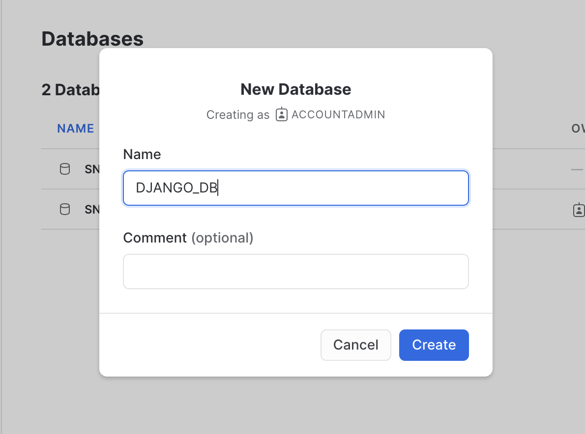
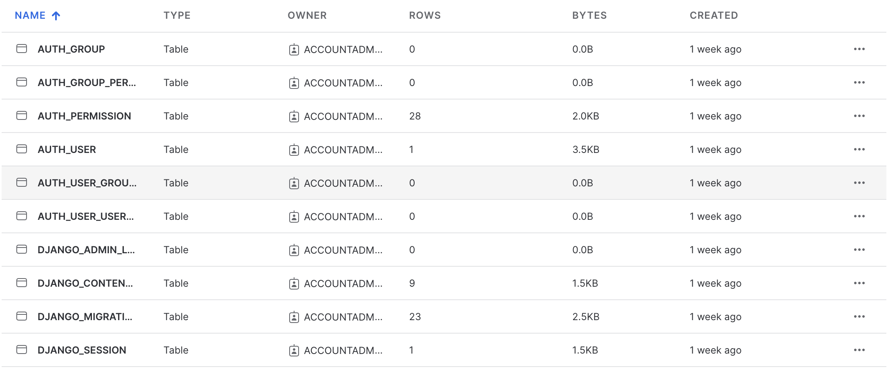
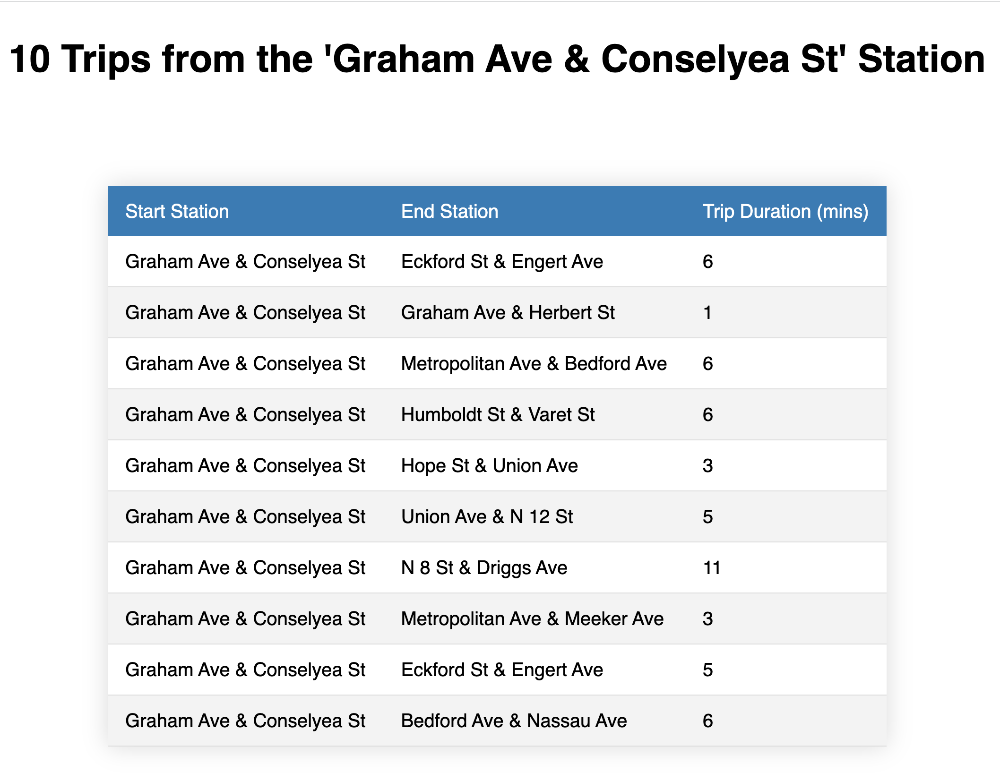
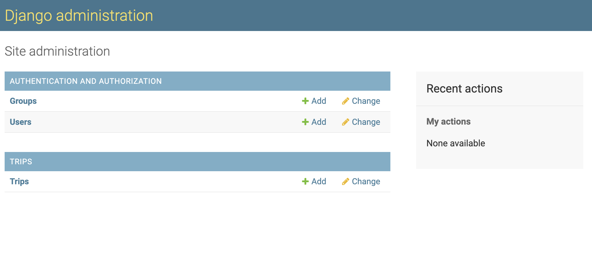

author: Gilberto Hernandez
id: getting-started-django-snowflake
summary: How to get started with Snowflake as a backend for Django.
categories: Getting-Started
environments: web
status: Draft 
feedback link: https://github.com/Snowflake-Labs/sfguides/issues
tags: Getting Started, Data Science, Data Engineering, Twitter, Django, Snowflake, django-snowflake

# Getting Started with Snowflake as a backend for Django
<!-- ------------------------ -->
## Overview 
Duration: 0

Django is a popular Python open-source web framework that allows developers to build web applications quickly and easily. Django provides a lot of features and tools for web development, such as an Object-Relational Mapping (ORM) system for interacting with databases, an admin interface for managing application data, and much more.

In this Quickstart, we'll demonstrate how to use Snowflake as a backend for your Django application using the **django-snowflake** Python package. You'll build a sample Django app that connects to Snowflake and displays Snowflake data on the frontend. 

Let's get started!

### Prerequisites
- Python version >= 3.8

### What You’ll Do

- Create a database in Snowflake and load data into it
- Connect a Django application to Snowflake using the **django-snowflake** backend
- Create models in the Django app to represent the Snowflake data
- Browse the Snowflake data using Django's admin interface
- View the Snowflake data as an end user of the app

### What You’ll Need 

- A code editor
- A terminal
- git
- A Snowflake account ([trial](https://signup.snowflake.com/developers), or otherwise)

### What You’ll Build 

- A sample Django app that connects to Snowflake and displays Snowflake data on the frontend

<!-- ------------------------ -->
## Clone the django-snowflake-quickstart repo
Duration: 1

First, clone Snowflake's **[django-snowflake-quickstart](https://github.com/Snowflake-Labs/django-snowflake-quickstart)** repo and navigate into the cloned repo.

```bash
git clone https://github.com/Snowflake-Labs/django-snowflake-quickstart.git && cd django-snowflake-quickstart/
```

<!-- ------------------------ -->
## Install Django and run the app
Duration: 3

This repo contains a Django project called **quickstart**, which contains an app called **trips** representing Citibike trip data. To run the project, you'll need to install Django. If you don't have Django installed, you can install it using pip.

```py
pip install django
```

Next, confirm that the app successfully runs. Change into the **quickstart/** folder and run the following command:

```py
python manage.py runserver
```

Navigate to [localhost:8000/trips](http://localhost:8000/trips) in your browser. If you see a success message ("Hello there! Welcome to the django-snowflake Quickstart!"), then you've successfully run the app. Ignore warnings about unapplied migrations – we'll address that in a later step of this Quickstart.

If you don't see the success message, you can troubleshoot using Django's documentation.
<!-- ------------------------ -->
## Create a database in Snowflake
Duration: 2

If you don't already have a Snowflake account, now's a good time to create one by registering for a [free Snowflake 30-day trial](https://signup.snowflake.com/developers). 

Next, create a database in Snowflake. Later we'll connect this database to the Django application.

In Snowflake, navigate to the "Databases" subsection within the "Data" section of the sidebar. At the top right, click the button to create a new database. Name the database "DJANGO_DB".



<!-- ------------------------ -->
## Install **django-snowflake**
Duration: 1

To connect the Django app to the Snowflake database you created, you'll need the **django-snowflake** package. You should install the version of **django-snowflake** that corresponds to your version of Django. To check the version of Django you have installed, run the following command:

```bash
python -m django --version
```

For example, if you have version 4.1.x of Django installed, you should install the corresponding version of **django-snowflake**:

```bash
pip install django-snowflake==4.1.*
```

Note that the minor release number of Django doesn't correspond to the minor release number of **django-snowflake**. Use the latest minor release of each.
<!-- ------------------------ -->
## Connect the Django app to Snowflake
Duration: 2

To use Snowflake as a backend, we'll need to configure the project's settings. Change into the **quickstart/** folder (within the parent **quickstart/** folder, i.e., **quickstart/quickstart/**) and take a look at what's inside. You'll notice several files  associated with the project. Using your preferred code editor, open the **settings.py** file. This file contains the database settings that we'll configure.

Scroll down to the `DATABASES` dictionary defined on line 77. It should look something like this:

```python
DATABASES = {
    'default': {
        'ENGINE': 'django.db.backends.sqlite3',
        'NAME': BASE_DIR / 'db.sqlite3',
    }
}
```

The `DATABASES` dictionary is a collection of named databases that are configured for the project. By default, Django projects are configured to use SQLite as a backend (note the `default` database entry in the `DATABASES` dictionary, which uses a SQLite engine and points to the **db.sqlite3** file in the root of the project). 

Let's use Snowflake as the default backend instead, and configure Django to connect to the Snowflake database that you created earlier.

```python
DATABASES = {
    'default': {
        'ENGINE': 'django_snowflake',
        'NAME': 'DJANGO_DB',
        'SCHEMA': 'PUBLIC',
        'WAREHOUSE': 'COMPUTE_WH',
        'USER': 'YOUR-USERNAME',
        'PASSWORD': 'YOUR-PASSWORD',
        'ACCOUNT': 'YOUR-ACCOUNT-IDENTIFIER',
        # Include 'OPTIONS' if you need to specify any other
        # snowflake.connector.connect() parameters.
        # https://docs.snowflake.com/en/user-guide/python-connector-api.html#connect
        'OPTIONS': {},
    }
}
```

This configuration allows us to connect to Snowflake using `django-snowflake`. We're specifically connecting to the **DJANGO_DB** database, using the **PUBLIC** schema, and using the **COMPUTE_WH** warehouse. Be sure to replace the `YOUR-USERNAME`, `YOUR-PASSWORD`, and `YOUR-ACCOUNT-IDENTIFIER` with the correct, corresponding values. If you need help locating your account identifier, see [Account Identifiers](https://docs.snowflake.com/en/user-guide/admin-account-identifier).

That's it! You don't have to run any additional commands to connect to Snowflake. If you've successfully connected, your terminal will display a message like "System check identified no issues (0 silenced).". If the connection was unsuccessful, your terminal will output the associated errors, which you can then troubleshoot.


> aside negative
> 
> **Important**
>
> The purpose of this Quickstart is to demonstrate how to use Snowflake as a Django backend. Note, however, that this backend would be inappropriate for use in web app use cases where multiple clients could be creating objects within Snowflake at the same time. As such, this Quickstart is for demonstration purposes only.
>
> A more common approach would be to configure multiple databases for your Django application, with Snowflake acting as the backend for data warehouse use cases (rather than writing web apps). For more information, refer to the Django documentation on [Multiple databases](https://docs.djangoproject.com/en/4.1/topics/db/multi-db/).
<!-- ------------------------ -->
## Run the Django migrations
Duration: 1

You've probably seen that pesky warning about unapplied migrations several times in your terminal by now. Let's address them.

Navigate up one level to the **quickstart/** folder (i.e., the one that contains the **manage.py** file). Run the migrations with the following command:

```bash
python manage.py migrate
```

This command will run the default Django migrations, and write several Django-specific tables to your **DJANGO_DB** in Snowflake. Navigate to the **DJANGO_DB** database in Snowflake and expand the tables section (under the **PUBLIC** schema). You should see all of the tables that Django wrote to your database. If you don't see them, click the "..." at near the top and click "Refresh".

These tables contain Django-specific information required to run your application properly. Without these tables, your app might behave in unexpected ways.


<!-- ------------------------ -->
## Load data into your database
Duration: 7

By this point, you've run the default Django migrations that wrote Django-specific tables to your **DJANGO_DB** database. That's great, but where's the fun data that we can display in the Django app? Let's load some data into your database.

We're going to load data into your **DJANGO_DB** by doing the following:

1. Creating a stage in Snowflake for the data that we'll load. The data is hosted on AWS S3.
2. In a worksheet, defining the target table and file format for ingesting data into the database.
3. Copying the data from the stage and into the target table.

Let's load.

#### Create a stage

Within Snowflake, navigate to your **DJANGO_DB** database and expand it. Click on the **PUBLIC** schema. Click the "Create" button in the top right of the screen, and, in the drop down, select "Stage > Amazon S3".  A "Create Securable Object" modal will appear. In the editor within the modal, replace the entire template with the following:

```
create stage citibike_trips
    url = 's3://snowflake-workshop-lab/citibike-trips-csv/';
```

The `credentials` field in the stage template is not needed since the data is publicly accessible.

Click "Create Stage". If successful, you'll see a "CITIBIKE_TRIPS" stage created under the **PUBLIC** schema.

#### Define the target table and file format for data ingestion

Next, let's define the table and file format that we'll use for the data we'll load.

Navigate to "Worksheets" in the left panel of the Snowflake UI. Start a new worksheet using the "+ Worksheet" button in the top right. Ensure you have the correct database (**DJANGO_DB**), schema (**PUBLIC**), and warehouse (**COMPUTE_WH**) set for your worksheet. Add the following code and run it all:

```sql
create or replace table trips
(trip_id integer autoincrement start 1 increment 1,
tripduration timestamp,
starttime timestamp,
stoptime timestamp,
start_station_id integer,
start_station_name string,
start_station_latitude float,
start_station_longitude float,
end_station_id integer,
end_station_name string,
end_station_latitude float,
end_station_longitude float,
bikeid integer,
membership_type string,
usertype string,
birth_year integer,
gender integer);

create or replace file format csv type='csv'
  compression = 'auto' field_delimiter = ',' record_delimiter = '\n'
  skip_header = 0 field_optionally_enclosed_by = '\042' trim_space = false
  error_on_column_count_mismatch = false escape = 'none' escape_unenclosed_field = '\134'
  date_format = 'auto' timestamp_format = 'auto' null_if = ('')
  comment = 'file format for ingesting data into snowflake';
```

These commands will create the target table and define the file format to help ingest data. If you'd like to see the table created, navigate to the **TRIPS** table in your **DJANGO_DB** database. You'll note that it is empty. We're going to populate it next.

#### Copy data into the target table

In the same worksheet, add the following command to the bottom of the file and run it:

```sql
copy into trips (tripduration, starttime, stoptime, start_station_id, start_station_name, start_station_latitude, start_station_longitude, end_station_id, end_station_name, end_station_latitude, end_station_longitude, bikeid, membership_type, usertype, birth_year, gender) from @citibike_trips file_format=csv PATTERN = '.*csv.*';
```

The command will process the data files from the stage and copy them into the **TRIPS** table created earlier. If you navigate to the "Data Preview" tab for the **TRIPS** table, you'll see a sample of the data in the table. 

Great, we now have some data to play with in the database!

<!-- ------------------------ -->
## Create Django models using **inspectdb**
Duration: 2

You've created a database in Snowflake, populated it with data, and connected it to the Django app. Now it's time to use the data in the app. To do this, we'll need to create Django models.

A model is a representation of your data in the app. Creating a model based on the data in the **TRIPS** table will allow you to programmatically use the data throughout the Django app. 

Django has a handy command called **inspectdb** that automatically generates Django models for you based on a table's metadata and schema. We'll use this command to generate a Trip model that we'll use in the app.

In the parent **quickstart/** folder, run the following command:

```bash
python manage.py inspectdb TRIPS > generated_models.py
```

This command will inspect the TRIPS table in the **DJANGO_DB** database, generate models based on the table, and dump the models into a file called **generated_models.py**.

Open the **generated_models.py** file. If the model generation was successful, the file will define a class called `Trips`, along with additional fields based on the columns of the table. In addition,  note the comments inserted at the top of the file during model generation. Here's a sample of the file:

```python
class Trips(models.Model):
    trip_id = models.BigAutoField(blank=True, null=True)
    tripduration = models.TextField(blank=True, null=True)  # This field type is a guess.
    # Rest of code omitted for brevity
```

We need to go further than just creating a **generated_models.py** file if we want to use models in the app. We need to add the Trips model definition to the **trips** app in the **quickstart** Django project. Copy the contents of **generated_models.py** into the  **quickstart/trips/models.py** file. 

Finally, let's specify that `trip_id` should be used as the primary key for the data. Modify the line that defines `trip_id` as shown below and save your changes.

```python
trip_id = models.BigAutoField(blank=True, primary_key=True)
```


> aside negative
> 
> **Important**
>
> While handy, the `inspectdb` command is not perfect. If it is unable to identify the correct type for a column (i.e, string, number, etc.), then it will make a best guess, which you'll see noted in the generated models. You should always revise your generated models to make sure they are what you expect.

<!-- ------------------------ -->
## Create and run migrations
Duration: 1

Because we've created a model, we'll need to also create (not run) a migration to record the creation of the model. In your terminal, from the root **quickstart/** folder, run the following command:

```bash
python manage.py makemigrations trips
```

This command will create a **migrations/** folder within the **trips/** folder and populate it with files that correspond to changes to the model. This command also creates the initial migration in a file called **0001_initial.py**. Feel free to peruse it if you're curious, but do not modify it.

We're now ready to run the migration. Run the following command:

```bash
python manage.py migrate trips
```

This will run the migration defined in **0001_initial.py**.

That's it! We can now use this model through the Django app.

<!-- ------------------------ -->
## Browse the data as an end user
Duration: 1

You've viewed and browsed the **TRIPS** data as a Django admin. Now let's view it as an end user of the app. For demonstration purposes, we configured this repo to include a view in the app that will render a sample of the data. 

Navigate to [localhost:8000/trips/from/graham-conselyea](http://localhost:8000/trips/from/graham-conselyea). If you've successfully configured Snowflake as a backend and ran the necessary migrations, you should see a table titled "10 Trips from the 'Graham Ave & Conselyea St' Station" on the page. This is just a sample of the data – there are all sorts of cool things you could do with the data if you wanted to.



For some context, we configured the view as follows:

* The HTML is defined in the **trips-from-graham-conselyea.html** file, in the **/trips/templates/trips** folder.

* The view is defined in **/trips/views.py**, as `class GrahamConselyeaView`. Trip data is returned in this class definition.

* We defined a new path in the `urlpatterns` list in **/trips/urls.py**, which references the view defined in **/trips/views.py**.

For more information on views in Django, see [Writing Views](https://docs.djangoproject.com/en/4.1/topics/http/views/) in the Django documentation.
<!-- ------------------------ -->
## (Optional) Browse the data as a Django admin
Duration: 3

If you're an admin of a Django app, Django will let you view models in an admin UI that Django provides out of the box. To view the data, you'll need to register as a super user of the app, and also register the model to the admin site.

First, let's create a super user. Run the following command:

```bash
python manage.py createsuperuser
```

You'll be prompted for a username, email (press "Enter" on your keyboard to leave it blank), and password. You can set these to any values that you like, but be sure to jot them down so that you can log into the admin UI.

Navigate to [localhost:8000/admin](http://localhost:8000/admin) in your browser. You'll be met with a login page. Enter the credentials you defined for your super user and log in. If successful, you'll see the "Django administration" UI. Note the models shown in the UI ("Groups" and "Users"). These models were created as part of the default Django migrations you ran earlier. If you click on the "Users" model, you should see an entry for the super user you just created!

Next, let's register the Trip model. Navigate to **quickstart/trips/admin.py**. Add the following to the file:

```python
from .models import Trips

admin.site.register(Trips)
```

Save the file and reload the admin page in your browser. If successful, you should see a new section in the UI called "Trips", with a "Trips" entry underneath. Click on the "Trips" entry. Voila! This is the trips data that we imported into the app from Snowflake. Each object represents a row in the **TRIPS** database. Click on the object to browse its contents. Note that, if you wanted to, you could modify the data using this admin UI.



> aside negative
> 
> **Note**
>
> Django's admin UI is a handy interface provided by Django out of the box. However, depending on your use case, it might not be the best interface to use if you want to edit data. We demonstrate the admin UI in this Quickstart to show how it is possible to browse data in Snowflake from within Django. For database administration, you should choose a workflow that best suits your use case.
<!-- ------------------------ -->
## Conclusion
Duration: 0

Congratulations! In just a few minutes, you were able to configure a Django project to use Snowflake as a backend using **django-snowflake**. What we covered here was only a demonstration of what's possible, there are all sorts of great things that you can build when using Snowflake as a backend in Django. What will you build?

### What we've covered

- Creating a database in Snowflake and load data into it
- Connecting a Django application to Snowflake using the **django-snowflake** backend
- Creating models in the Django app to represent the Snowflake data
- Browsing the Snowflake data using Django's admin interface
- Viewing the Snowflake data as an end user of the app

### Related Resources

- link-to-django-snowflake-SF-repo
- [Django documentation](https://docs.djangoproject.com/en/4.1/)
- [Native Programmatic Interfaces for Snowflake](https://docs.snowflake.com/en/user-guide/ecosystem-lang)
- [Snowflake Community](https://community.snowflake.com/s/)
