author: Scott Teal, Brad Culberson, Vino Duraisamy
id: getting-started-iceberg-tables
categories: snowflake-site:taxonomy/solution-center/certification/quickstart, snowflake-site:taxonomy/product/data-engineering, snowflake-site:taxonomy/snowflake-feature/apache-iceberg
language: en
summary: Create a Snowflake-managed open data lakehouse with Apache Iceberg Tables, governance policies, and Spark integration.
environments: web
status: Published 
feedback link: https://github.com/Snowflake-Labs/sfguides/issues


# Getting Started with Iceberg Tables
<!-- ------------------------ -->
## Overview 

This guide is designed to help you understand the capabilities included in Snowflake’s support for Apache Iceberg. Iceberg Tables, now generally available, bring Snowflake’s easy platform management and great performance to data stored externally in the open source Apache Iceberg format.

> 
> 
>  Iceberg Tables are now generally available.

### What You Will Build 
- A simple, open data lakehouse with Snowflake, Iceberg, and your cloud of choice

### What You Will Learn 
- How to create a Snowflake-managed Iceberg Table
- How to apply governance policies on an Iceberg Table
- How Snowpark can be used for Iceberg Table pipelines
- How to share an Iceberg Table
- How to access a Snowflake-managed Iceberg Table from Spark and DuckDB

### Prerequisites or What You Will Need 
- A Snowflake account. A [free trial](https://signup.snowflake.com/?utm_source=snowflake-devrel&utm_medium=developer-guides&utm_cta=developer-guides) will suffice. [Standard Edition](https://docs.snowflake.com/en/user-guide/intro-editions#standard-edition) will work for most of this lab, but if you’d like to try governance features covered in section 4, you will need [Enterprise](https://docs.snowflake.com/en/user-guide/intro-editions#enterprise-edition) or [Business Critical Edition](https://docs.snowflake.com/en/user-guide/intro-editions#business-critical-edition).
- A storage bucket with the same cloud provider in the same region that hosts your Snowflake account above. Direct credential access required as storage integrations are not supported for External Volumes.

<!-- ------------------------ -->
## Setup Your Environment

### Install Conda, Spark, DuckDB, Jupyter

In this quickstart, you can use Conda to easily create a development environment and download necessary packages. This is only needed if you choose to follow the last section for using Spark to read Snowflake-managed Iceberg Tables. This is not required to create or use Iceberg Tables on Snowflake. Here are instructions for installing Conda:
- [Mac](https://docs.conda.io/projects/conda/en/latest/user-guide/install/macos.html)
- [Windows](https://docs.conda.io/projects/conda/en/stable/user-guide/install/linux.html)
- [Linux](https://docs.conda.io/projects/conda/en/stable/user-guide/install/linux.html)

Either download [this file](https://github.com/Snowflake-Labs/sfguide-getting-started-with-iceberg-tables/blob/main/environment.yml), or create a file named environment.yml with the following contents.

```yaml
name: iceberg-lab
channels:
  - conda-forge
dependencies:
  - findspark=2.0.1
  - jupyter
  - openjdk=11
  - pyspark=3.5.5
  - python-duckdb
```

To create the environment needed, run the following in your shell.

```
conda env create -f environment.yml
```


### Setup Snowflake

In a Worksheet, create a database, schema, warehouse, role, and user called `ICEBERG_LAB` in your Snowflake account.

```sql
CREATE WAREHOUSE iceberg_lab;
CREATE ROLE iceberg_lab;
CREATE DATABASE iceberg_lab;
CREATE SCHEMA iceberg_lab;
GRANT ALL ON DATABASE iceberg_lab TO ROLE iceberg_lab WITH GRANT OPTION;
GRANT ALL ON SCHEMA iceberg_lab.iceberg_lab TO ROLE iceberg_lab WITH GRANT OPTION;
GRANT ALL ON WAREHOUSE iceberg_lab TO ROLE iceberg_lab WITH GRANT OPTION;

CREATE USER iceberg_lab
    PASSWORD='<your desired password>',
    LOGIN_NAME='ICEBERG_LAB',
    MUST_CHANGE_PASSWORD=FALSE,
    DISABLED=FALSE,
    DEFAULT_WAREHOUSE='ICEBERG_LAB',
    DEFAULT_NAMESPACE='ICEBERG_LAB.ICEBERG_LAB',
    DEFAULT_ROLE='ICEBERG_LAB';

GRANT ROLE iceberg_lab TO USER iceberg_lab;
SET USERNAME=CURRENT_USER();
GRANT ROLE iceberg_lab TO USER IDENTIFIER($USERNAME);
```

This quickstart guide can be run from Snowflake Worksheets or Notebook. In this example, we will upload an existing notebook (.ipynb) into a Snowflake account. To load the demo notebook into your account, follow these steps:
1. In a browser tab for GitHub, download [this notebook](https://github.com/Snowflake-Labs/sfguide-getting-started-with-iceberg-tables/blob/main/snowflake_notebook.ipynb) by clicking **Download raw file** from the top-right.
2. In a browser tab for Snowflake, navigate to **Project » Notebooks** from the left menu bar.
3. Click the dropdown arrow next to **+ Notebook** in the top-right, then click **Import .ipynb file**, and select the .ipynb file you've downloaded and click **Open**.
4. A **Create Notebook** dialog will show up. Select `ICEBERG_LAB` database, schema, and warehouse, and click **Create**.

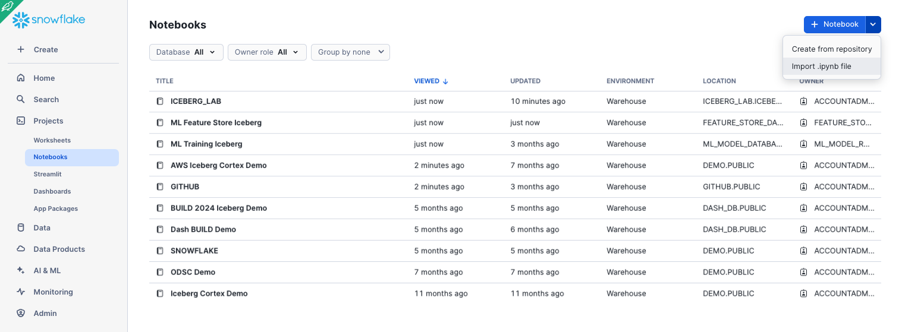


<!-- ------------------------ -->
## Create an Iceberg Table

### Create an External Volume

Before you create an Iceberg table, you must have an external volume. An external volume is a Snowflake object that stores information about your cloud storage locations and identity and access management (IAM) entities (for example, IAM roles). Snowflake uses an external volume to establish a connection with your cloud storage in order to access Iceberg metadata and Parquet data.

To create an external volume, complete the instructions for your cloud storage service:
- [Accessing Amazon S3 using external volumes](https://docs.snowflake.com/en/user-guide/tables-iceberg-configure-external-volume-s3)
- [Accessing Google Cloud Storage using external volumes](https://docs.snowflake.com/en/user-guide/tables-iceberg-configure-external-volume-gcs)
- [Accessing Microsoft Azure Storage using external volumes](https://docs.snowflake.com/en/user-guide/tables-iceberg-configure-external-volume-azure)

Prior to creating the external volume, be sure to use the `ACCOUNTADMIN` role.

```sql
USE ROLE accountadmin;
```

Name the external volume you create `iceberg_lab_vol`.

After the external volume is created, use the `ACCOUNTADMIN` role to grant usage to the `ICEBERG_LAB` role.

```sql
GRANT ALL ON EXTERNAL VOLUME iceberg_lab_vol TO ROLE iceberg_lab WITH GRANT OPTION;
```

### Create a Snowflake-managed Iceberg Table

Snowflake supports multiple Iceberg catalog options including Iceberg REST, Snowflake, AWS Glue. In this quickstart, we use Snowflake as the catalog to allow read and write operations to tables. More information about integrating catalogs can be found [here](https://docs.snowflake.com/en/user-guide/tables-iceberg-configure-catalog-integration).

Create an Iceberg Table referencing the external volume you just created. You can specify `BASE_LOCATION` to instruct Snowflake where to write table data and metadata, or leave empty to write data and metadata to the root location specified in the external volume definition.

```sql
USE ROLE iceberg_lab;
USE DATABASE iceberg_lab;
USE SCHEMA iceberg_lab;
CREATE OR REPLACE ICEBERG TABLE customer_iceberg (
    c_custkey INTEGER,
    c_name STRING,
    c_address STRING,
    c_nationkey INTEGER,
    c_phone STRING,
    c_acctbal INTEGER,
    c_mktsegment STRING,
    c_comment STRING
)  
    CATALOG='SNOWFLAKE'
    EXTERNAL_VOLUME='iceberg_lab_vol'
    BASE_LOCATION='iceberg_lab/iceberg_lab/customer_iceberg';
```

### Load Data

There are [multiple ways to load new data](https://docs.snowflake.com/en/user-guide/tables-iceberg-load) into Snowflake-managed Iceberg Tables including INSERT, [streaming](https://docs.snowflake.com/en/user-guide/data-load-snowpipe-streaming-iceberg), [Kafka Connector](https://docs.snowflake.com/en/user-guide/kafka-connector-iceberg), [COPY INTO](https://docs.snowflake.com/en/sql-reference/sql/copy-into-table), and [Snowpipe](https://docs.snowflake.com/en/user-guide/data-load-snowpipe-auto) including options. COPY INTO and Snowpipe provide [options](https://docs.snowflake.com/en/sql-reference/sql/copy-into-table#label-copy-into-table-usage-notes-iceberg-parquet) to register compatible Parquet files into Iceberg tables instead of a full scan or transformation.

For this quickstart, we will INSERT data from the sample tables in your Snowflake account to an Iceberg Table. This will write Parquet files and Iceberg metadata to your external volume.

```sql
INSERT INTO customer_iceberg
  SELECT * FROM snowflake_sample_data.tpch_sf1.customer;
```

If you check your cloud storage bucket, you should now see files that Snowflake has written as part of table creation. While Snowflake writes these files automatically, you can also use a [function](https://docs.snowflake.com/en/sql-reference/functions/system_get_iceberg_table_information) to generate table metadata files that capture any data manipulation language (DML) changes that have been made since the last time Iceberg metadata was generated.

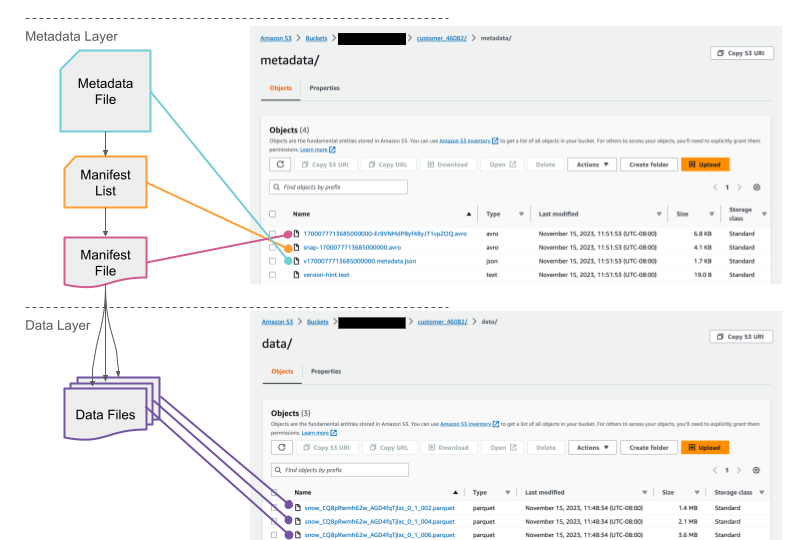

### Query and Time Travel

Iceberg Tables are treated much like other tables in Snowflake. For example, you can read different table types in a single query. This query is joining an Iceberg Table with a traditional Snowflake Table.

```sql
SELECT
    *
FROM customer_iceberg c
INNER JOIN snowflake_sample_data.tpch_sf1.nation n
    ON c.c_nationkey = n.n_nationkey;
```

You can also leverage Snowflake's built-in LLM functions to easily leverage AI in your queries as demonstrated [here](/en/developers/guides/cortex-ai-sentiment-iceberg/).

Benefits of the additional metadata that table formats like Iceberg and Snowflake’s provide are, for example, time travel.

Let’s first make a simple update to the table. Then, you can see that the row count has increased compared to the previous version of the table.

```sql
SET query_id = LAST_QUERY_ID();
INSERT INTO customer_iceberg
    SELECT
        *
    FROM snowflake_sample_data.tpch_sf1.customer
    LIMIT 5;


SELECT
    count(*) AS after_row_count,
    before_row_count
FROM customer_iceberg
JOIN (
        SELECT count(*) AS before_row_count
        FROM customer_iceberg AT(STATEMENT=> $query_id)
    )
    ON 1=1
GROUP BY 2;
```

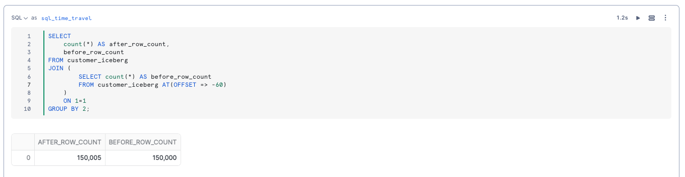

<!-- ------------------------ -->
## Governance on Iceberg Tables

Governance and access controls work on Iceberg Tables just like internal tables. As described in the overview section, all of these features require Enterprise or Business Critical Edition of Snowflake.

### Row-level Security

Suppose you need to control row-level access to an Iceberg Table for users having different roles. In this example, let's have a role that can see the US customers and one that only sees the non-US customers.

This can be done with a [row access policy](https://docs.snowflake.com/en/user-guide/security-row-using) on the Iceberg Table.

```sql
USE ROLE accountadmin;
CREATE OR REPLACE ROLE tpch_us;
SET USERNAME=CURRENT_USER();
GRANT ROLE tpch_us TO USER IDENTIFIER($USERNAME);
CREATE OR REPLACE ROLE tpch_intl;
GRANT ROLE tpch_intl TO USER IDENTIFIER($USERNAME);

USE ROLE iceberg_lab;
USE DATABASE iceberg_lab;
USE SCHEMA iceberg_lab;

CREATE ROW ACCESS POLICY rap_nation
AS (nation_key number) RETURNS BOOLEAN ->
  ('TPCH_US' = current_role() and nation_key = 24) OR
  ('TPCH_INTL' = current_role() and nation_key != 24)
;

ALTER ICEBERG TABLE customer_iceberg
ADD ROW ACCESS POLICY rap_nation ON (c_nationkey);

GRANT ALL ON DATABASE iceberg_lab TO ROLE tpch_intl;
GRANT ALL ON SCHEMA iceberg_lab.iceberg_lab TO ROLE tpch_intl;
GRANT ALL ON ICEBERG TABLE iceberg_lab.iceberg_lab.customer_iceberg TO ROLE tpch_intl;
GRANT ALL ON DATABASE iceberg_lab TO ROLE tpch_us;
GRANT ALL ON SCHEMA iceberg_lab.iceberg_lab TO ROLE tpch_us;
GRANT ALL ON ICEBERG TABLE iceberg_lab.iceberg_lab.customer_iceberg TO ROLE tpch_us;
GRANT USAGE ON EXTERNAL VOLUME iceberg_lab_vol TO ROLE tpch_intl;
GRANT USAGE ON EXTERNAL VOLUME iceberg_lab_vol TO ROLE tpch_us;
GRANT USAGE ON WAREHOUSE iceberg_lab TO ROLE tpch_us;
GRANT USAGE ON WAREHOUSE iceberg_lab TO ROLE tpch_intl;
```

There are two separate roles to grant to Snowflake users, which allow them to see a subset of customers, either international or us.

```sql
USE ROLE tpch_intl;
USE WAREHOUSE iceberg_lab;
SELECT
    count(*)
FROM iceberg_lab.iceberg_lab.customer_iceberg;
```

```sql
USE ROLE tpch_us;
USE WAREHOUSE iceberg_lab;
SELECT
    count(*)
FROM iceberg_lab.iceberg_lab.customer_iceberg;
```


### Column-level Security

We want the team of analysts to be able to query the customer table but not see their name(c_name), address (c_address), or phone number(c_phone). To do so, we need to grant them access to all the rows but mask those fields. 

We can do that with a [masking policy](https://docs.snowflake.com/en/user-guide/security-column-ddm-use).

```sql
USE ROLE accountadmin;
CREATE OR REPLACE ROLE tpch_analyst;
SET USERNAME=CURRENT_USER();
GRANT ROLE tpch_analyst TO USER IDENTIFIER($USERNAME);

USE ROLE iceberg_lab;
ALTER ROW ACCESS POLICY rap_nation
SET body ->
  ('TPCH_US' = current_role() and nation_key = 24) or
  ('TPCH_INTL' = current_role() and nation_key != 24) or
  ('TPCH_ANALYST' = current_role()) or 
  ('ICEBERG_LAB' = current_role())
;

GRANT ALL ON DATABASE iceberg_lab TO ROLE tpch_analyst;
GRANT ALL ON SCHEMA iceberg_lab.iceberg_lab TO ROLE tpch_analyst;
GRANT ALL ON TABLE iceberg_lab.iceberg_lab.customer_iceberg TO ROLE tpch_analyst;
GRANT USAGE ON WAREHOUSE iceberg_lab TO ROLE tpch_analyst;
GRANT USAGE ON EXTERNAL VOLUME iceberg_lab_vol TO ROLE tpch_analyst;
USE ROLE iceberg_lab;

CREATE OR REPLACE MASKING POLICY pii_mask AS (val string) RETURNS string ->
    CASE
        WHEN 'TPCH_ANALYST' = current_role() THEN '*********'
        ELSE val
    END;

ALTER ICEBERG TABLE customer_iceberg MODIFY COLUMN c_name SET MASKING POLICY pii_mask;
ALTER ICEBERG TABLE customer_iceberg MODIFY COLUMN c_address SET MASKING POLICY pii_mask;
ALTER ICEBERG TABLE customer_iceberg MODIFY COLUMN c_phone SET MASKING POLICY pii_mask;

USE ROLE tpch_analyst;
SELECT
    *
FROM customer_iceberg;
```

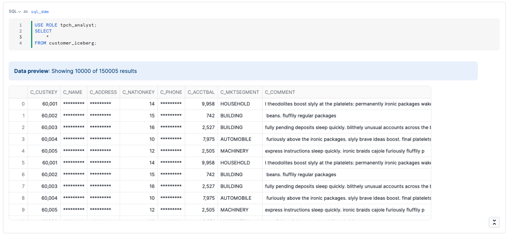

Other governance features can be applied to Iceberg Tables, including [object tagging](https://docs.snowflake.com/en/user-guide/object-tagging), and [tag-based masking](https://docs.snowflake.com/en/user-guide/tag-based-masking-policies).

### Monitor Governance in Snowsight

As a data administrator, you can use the built-in Dashboard and Tagged Objects interfaces to monitor and report on the usage of policies and tags with tables, views, and columns. This includes policies and tags applied to Iceberg Tables.

Using the `ACCOUNTADMIN` role, or an account role that is granted the `GOVERNANCE_VIEWER` and `OBJECT_VIEWER` database roles, click **Data » Governance** to navigate to these interfaces. You can see the policies applied to the Iceberg Table.


And if you notice certain tables are missing tags or policies, you can modify, create, and apply them directly from the interface.

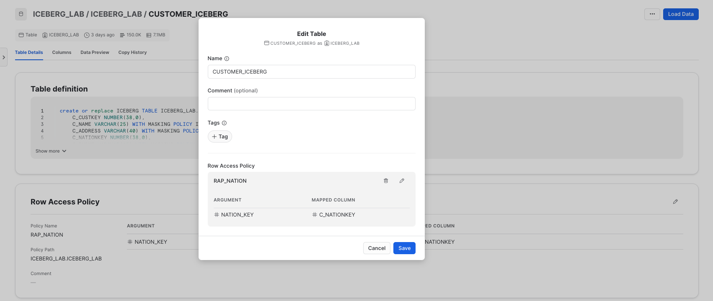

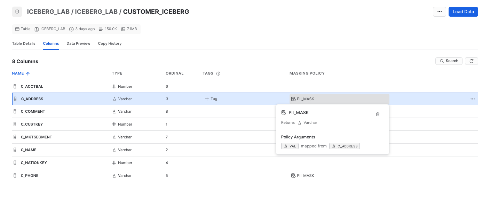

<!-- ------------------------ -->
## Transform Iceberg Tables

Raw data in Iceberg tables may require further cleaning, transformation, and aggregation for downstream consumption. Snowflake supports multiple options for building and orchestrating pipelines including:
- [Snowpark](https://docs.snowflake.com/en/developer-guide/snowpark/index): Build and run pipelines with Python, including [support for Iceberg](https://docs.snowflake.com/en/developer-guide/snowpark/reference/python/latest/snowpark/api/snowflake.snowpark.DataFrameWriter.save_as_table).
- [Dynamic Tables](https://docs.snowflake.com/en/user-guide/dynamic-tables-intro): An automated way to transform data, including [support for Iceberg](https://docs.snowflake.com/en/user-guide/dynamic-tables-create-iceberg).
- [Streams & Tasks](https://docs.snowflake.com/en/user-guide/data-pipelines-intro): Incorporate CDC and custom orchestration on top of Iceberg tables.

### Dynamic Tables
Creating and orchestrating a transformation pipeline can be as simple as a SQL query of the desired results, target refresh lag, and let Snowflake automatically handle CDC, incremental processing, and when to start refreshes based on target lag.

Dynamic Tables can be stored in Iceberg format. Create a Dynamic Iceberg Table as shown below.

```sql
USE ROLE iceberg_lab;
USE DATABASE iceberg_lab;
USE SCHEMA iceberg_lab;

CREATE OR REPLACE ICEBERG TABLE orders_iceberg 
    CATALOG = 'SNOWFLAKE'
    EXTERNAL_VOLUME = 'iceberg_lab_vol'
    BASE_LOCATION = 'iceberg_lab/iceberg_lab/orders_iceberg'
    AS
    SELECT * FROM SNOWFLAKE_SAMPLE_DATA.TPCH_SF1.ORDERS;

CREATE OR REPLACE ICEBERG TABLE nation_iceberg 
    CATALOG = 'SNOWFLAKE'
    EXTERNAL_VOLUME = 'iceberg_lab_vol'
    BASE_LOCATION = 'iceberg_lab/iceberg_lab/nation_iceberg'
    AS
    SELECT * FROM SNOWFLAKE_SAMPLE_DATA.TPCH_SF1.NATION;

CREATE OR REPLACE DYNAMIC ICEBERG TABLE nation_orders_iceberg
    TARGET_LAG = '1 minute'
    WAREHOUSE = ICEBERG_LAB
    CATALOG = 'SNOWFLAKE'
    EXTERNAL_VOLUME = 'iceberg_lab_vol'
    BASE_LOCATION = 'iceberg_lab/iceberg_lab/nation_orders_iceberg'
    AS
    SELECT
        n.n_regionkey AS regionkey,
        n.n_nationkey AS nationkey,
        n.n_name AS nation,
        c.c_custkey AS custkey,
        COUNT(o.o_orderkey) AS order_count,
        SUM(o.o_totalprice) AS total_price
    FROM ICEBERG_LAB.ICEBERG_LAB.ORDERS_ICEBERG o
    JOIN ICEBERG_LAB.ICEBERG_LAB.CUSTOMER_ICEBERG c
        ON o.o_custkey = c.c_custkey
    JOIN ICEBERG_LAB.ICEBERG_LAB.NATION_ICEBERG n
        ON c.c_nationkey = n.n_nationkey
    GROUP BY
        n.n_regionkey,
        n.n_nationkey,
        n.n_name,
        c.c_custkey
    ;
```

To monitor refresh history and examine upstream/downstream dependencies in a graph view, navigate to **Monitoring » Dynamic Tables**, and click on **Keep Session Running**. Then click on `NATION_ORDERS_ICEBERG` from the list.

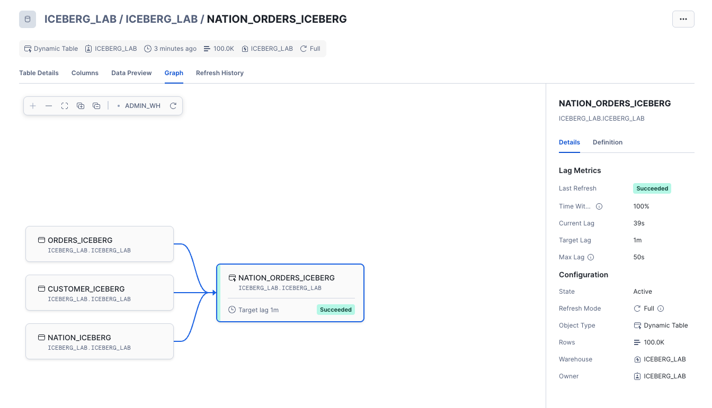

### Snowpark
Snowpark allows you to interact with Iceberg Tables using [DataFrames](https://docs.snowflake.com/en/developer-guide/snowpark/python/working-with-dataframes) that are lazily executed and can be used for data transformation and machine learning use cases. Let’s try this by first navigating back to your Snowflake notebook under **Projects » Notebooks » snowflake_notebook** , and in the list of cells on the right click on `py_snowpark`.

Snowflake Notebooks make it easy to switch between running SQL and Python. Run this cell which uses Python to write a DataFrame as an Iceberg table.

```python
from snowflake.snowpark.context import get_active_session
from snowflake.snowpark.functions import col, rank
from snowflake.snowpark.window import Window

session = get_active_session()

db = "iceberg_lab"
schema = "iceberg_lab"

# Load the input table
df = session.table("ICEBERG_LAB.ICEBERG_LAB.NATION_ORDERS_ICEBERG")

# Define a window partitioned by nation, ordered by total_price descending
nation_window = Window.partition_by("nation").order_by(col("total_price").desc())

# Rank customers within each nation
df_ranked = df.with_column("nation_rank", rank().over(nation_window))

# Flag top 3 customers per nation as VIPs
df_vips = df_ranked.with_column("is_vip", (col("nation_rank") <= 3))

# Show the results
df_vips = df_vips.select("nationkey", "custkey", "total_price", "nation_rank", "is_vip")

output_table = "customer_vips_iceberg"

iceberg_config = {
    "external_volume": "iceberg_lab_vol",
    "catalog": "snowflake",
    "base_location": f"{db}/{schema}/{output_table}",
    "storage_serialization_policy": "COMPATIBLE",
}

df_vips.show()
df_vips.write.mode("overwrite").save_as_table(f"{output_table}", iceberg_config=iceberg_config)
```

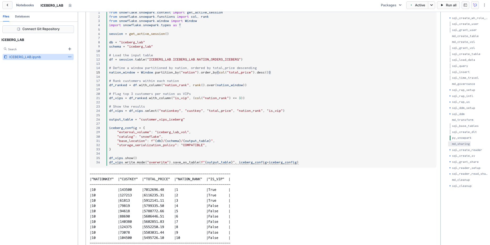

With this Iceberg table created based on other Iceberg tables, you can view the full lineage by clicking on the `ICEBERG_LAB.ICEBERG_LAB.CUSTOMER_VIP_ICEBERG` table in the **Databases** tab, then click on the **Lineage** tab.

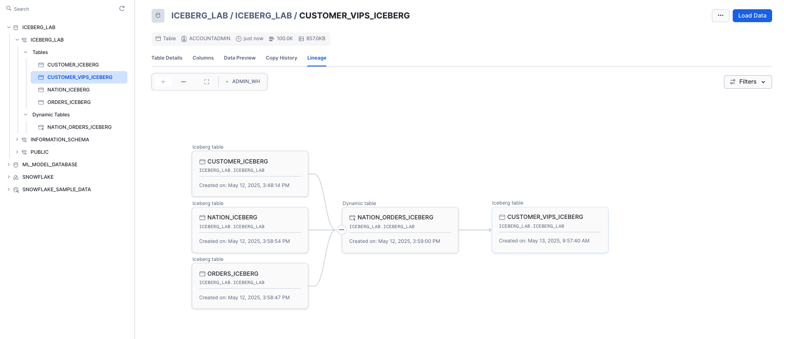

For a deeper dive on Snowpark for data engineering pipelines, try [this quickstart](/en/developers/guides/data-engineering-pipelines-with-snowpark-python/).

<!-- ------------------------ -->
## Sharing Iceberg Tables

Iceberg Tables can be securely shared with consumers either through their own Snowflake account or a provisioned Snowflake Reader account. The consumer can be an external entity or a different internal business unit that is required to have its own unique Snowflake account.

> 
> 
>  Cross-cloud and cross-region sharing of Iceberg Tables is not currently supported. The provider’s external volume, Snowflake account, and consumer’s Snowflake account must all be in the same cloud region.

With data sharing, including Iceberg Tables:
- There is only one copy of the data that’s stored in the data provider's cloud storage account.
- The latest snapshot available in the producer account is always live, real-time, and immediately available to consumers.
- Providers can establish revocable, fine-grained access to shares.
- Data sharing is simple and safe, especially compared to older data sharing methods, which were often manual and insecure, such as transferring large .csv files across the internet.

Suppose you have a partner who wants to analyze the data in your ICEBERG_LAB database on a near real-time basis. This partner also has their own Snowflake account in the same region as our account. Data sharing is an easy, secure solution to allow them to access this information.

### Creating a Reader Account

For the purposes of this lab, we’ll share data with a provisioned reader account. Return to your SQL worksheet, and grant the ICEBERG_LAB role the ability to create a reader account.

```sql
USE ROLE accountadmin;
GRANT CREATE ACCOUNT ON ACCOUNT TO ROLE iceberg_lab;
USE ROLE ICEBERG_LAB;
```

Exit your SQL worksheet and navigate to **Private Sharing**, then click the tab **Reader Accounts** near the top of your window, then click **+ New**. Use ICEBERG_LAB_READER as the Account Name, READER_ADMIN as the User Name, and provide a password. Then click **Create Account**. You’ll see the reader account now listed.

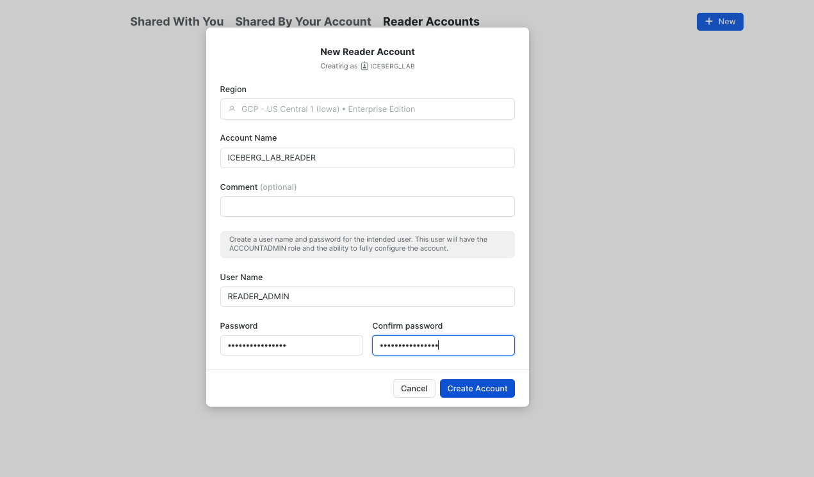

### Create a Secure View

Now create a secure view which is what will eventually be shared with the ICEBERG_LAB_READER account.

```sql
USE ROLE iceberg_lab;
CREATE OR REPLACE SECURE VIEW nation_orders_v AS
SELECT
    nation,
    SUM(order_count) as order_count,
    SUM(total_price) as total_price
FROM nation_orders_iceberg
GROUP BY nation;
```

### Create an Outbound Share

By default, ACCOUNTADMIN is the only role that can create shares. From your SQL worksheet, grant the ICEBERG_LAB role to create a share, then use this role.

```sql
USE ROLE accountadmin;
GRANT CREATE SHARE ON ACCOUNT TO ROLE iceberg_lab;
USE ROLE iceberg_lab;
```

Exit the SQL worksheet and navigate to **Data » Private Sharing**, then click on the **Shared by My Account** tab near the top of your window, then click the **Share** button in the top-right corner and select **Create a Direct Share**.

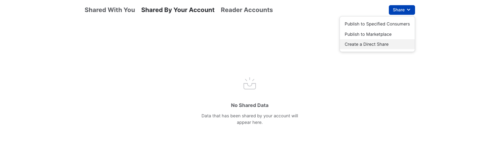

Click **+ Select Data** and navigate to the ICEBERG_LAB database and schema. Select the NATION_ORDERS_V view you created in the schema and click the **Done** button. Edit the default name to a more descriptive value that will help identify the share in the future (e.g. ICEBERG_LAB_NATION_ORDERS_SHARED_DATA). You can also add a comment.

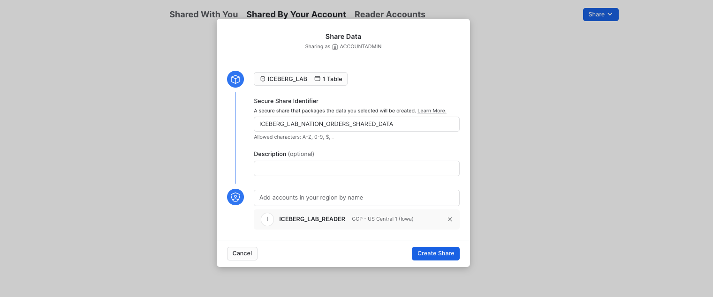

### Accessing Shared Data

In a separate browser tab, login to the reader account previously created. After logging in, as this is a new account, create a new SQL worksheet.

```sql
USE ROLE accountadmin;

CREATE OR REPLACE WAREHOUSE iceberg_lab_reader 
    WAREHOUSE_SIZE = XSMALL
    AUTO_SUSPEND = 1
    AUTO_RESUME = TRUE
    INITIALLY_SUSPENDED = TRUE;
```

Now let's view the shared data. Exit the worksheet, and in the pane on the left, click on on **Data » Private Sharing**. You will see ICEBERG_LAB_NATION_ORDERS_SHARED_DATA listed under Direct Shares. Select **Get Data** and name it READER_ICEBERG_LAB_NATION_ORDERS_SHARED_DATA. Make it available to the PUBLIC role, then click **Get Data**, then click **View Database**.

You can now query the shared data, which is a view on top of an Iceberg table. Run the queries below in a SQL worksheet to create a warehouse and see which countries had the most orders.

```sql
SELECT *
FROM reader_iceberg_lab_nation_orders_shared_data.iceberg_lab.nation_orders_v
ORDER BY order_count DESC;
```

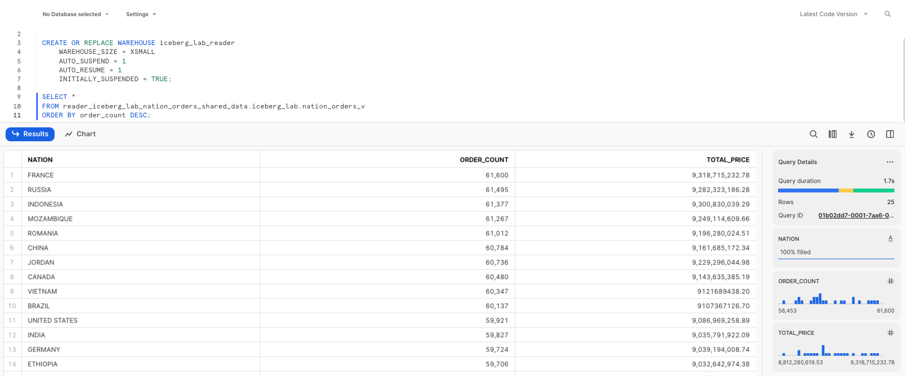

As changes are made to the Iceberg Table from the producer’s account, those changes are available nearly instantly in the reader account. No copying or transferring of data required! The single copy of data is stored in your cloud storage.

<!-- ------------------------ -->
## Read with Other Engines

Suppose other teams use use other engines such as Apache Spark or DuckDB to read the Snowflake-managed Iceberg tables. They can directly access data and metadata in object storage, all without using any Snowflake warehouses.

### Read with Apache Spark
From your terminal, run the following commands to activate the virtual environment you created in the setup, and open Jupyter notebooks.

Verify that you are running Java 11 from the output:

```sh
conda activate iceberg-lab
export PATH=/opt/anaconda3/envs/iceberg-lab/lib/jvm/bin:$PATH
java --version
```

Start Jupyter:

```sh
jupyter notebook
```

Download the notebook [iceberg_lab.ipynb provided here](https://github.com/Snowflake-Labs/sfguide-getting-started-with-iceberg-tables/blob/main/iceberg_lab.ipynb), then open from Jupyter. Update and run the cells that are applicable to the cloud in which your Snowflake account is located.

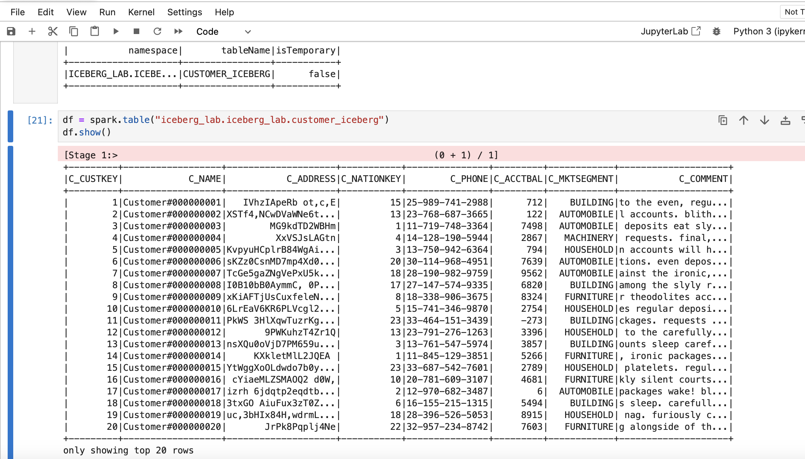

### Read with DuckDB
To complete this step you will need to have DuckDB installed. `python-duckdb` was included in the virtual environment created at the beginning of this quickstart. Otherwise if needed, [install DuckDB](https://duckdb.org/#quickinstall).

Download the notebook [duckdb.ipynb provided here](https://github.com/Snowflake-Labs/sfguide-getting-started-with-iceberg-tables/blob/main/duckdb.ipynb), then open from Jupyter. Update and run the cells that are applicable to the cloud in which your Snowflake account is located.

Import DuckDB and Pandas, and create an in-memory DuckDB database.
```python
import duckdb
import pandas as pd

conn = duckdb.connect()
```

Get your Iceberg metadata location by running the following query in Snowflake.

```sql
SELECT PARSE_JSON(SYSTEM$GET_ICEBERG_TABLE_INFORMATION('CUSTOMER_ICEBERG'))['metadataLocation']::varchar;
```

You will need to have credentials to access the blob storage where the metadata and data are located.

Example creation of a secret for Amazon S3 access:

```python
aws_access_key_id = '<your AWS access key ID>'
aws_secret_access_key = '<your AWS secret access key>'
aws_s3_region = '<your s3 region>'

conn.sql(f"""
    CREATE OR REPLACE SECRET s3_credentials (
        TYPE s3,
        KEY_ID '{aws_access_key_id}',
        SECRET '{aws_secret_access_key}',
        REGION '{aws_s3_region}'
        );
""")
CREATE SECRET (
    TYPE GCS,
    KEY_ID '<YOUR_HMAC_KEY>',
    SECRET '<YOUR_HMAC_SECRET>'
);
```

Example creation of a secret for Google Cloud Storage access:

```python
gcs_hmac_key_id = '<your HMAC key ID>'
gcs_hmac_secret = '<your HMAC secret>'
conn.sql(f"""
    CREATE OR REPLACE SECRET gcs_credentials (
        TYPE gcs,
        KEY_ID '{gcs_hmac_key_id}',
        SECRET '{gcs_hmac_secret}'
        );
""")
```

You can now query the table directly from DuckDB.

```sql
df = conn.sql(f"""
    SELECT *
    FROM iceberg_scan('{snapshot_path}');
""").df()

df.head()
```

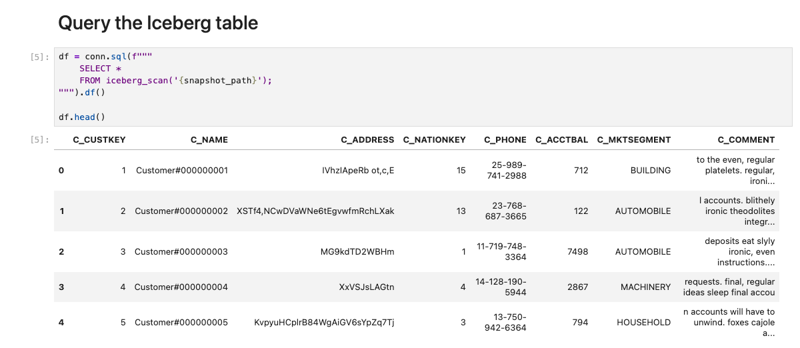

Now teams can use data stored in Snowflake using both Snowflake as well as DuckDB (as well as other tools supporing Iceberg). 

<!-- ------------------------ -->
## Cleanup

To delete all of the objects created in this guide, you can drop the user, role, database, and warehouse.

```sql
USE ROLE iceberg_lab;
DROP SHARE iceberg_lab_nation_orders_shared_data;
DROP DATABASE iceberg_lab;
USE ROLE accountadmin;
DROP EXTERNAL VOLUME iceberg_lab_vol;
DROP USER iceberg_lab;
DROP ROLE iceberg_lab;
DROP ROLE tpch_us;
DROP ROLE tpch_intl;
DROP ROLE tpch_analyst;
DROP WAREHOUSE iceberg_lab;
```

<!-- ------------------------ -->
## Conclusion

Congratulations! You've successfully created an open data lakehouse on Snowflake with Iceberg.

### What You Learned
- How to create a Snowflake-managed Iceberg Table
- How to apply governance policies on an Iceberg Table
- How Snowpark can be used for Iceberg Table pipelines
- How to share an Iceberg Table
- How to access a Snowflake-managed Iceberg Table from Apache Spark and DuckDB

### Related Resources
- [Snowflake Documentation for Iceberg Tables](https://docs.snowflake.com/en/user-guide/tables-iceberg)
- [Apache Iceberg Documentation](https://iceberg.apache.org/)
