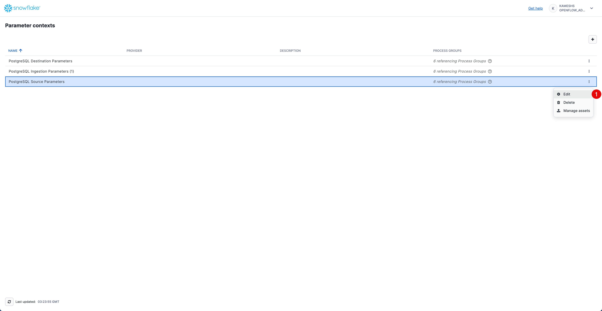
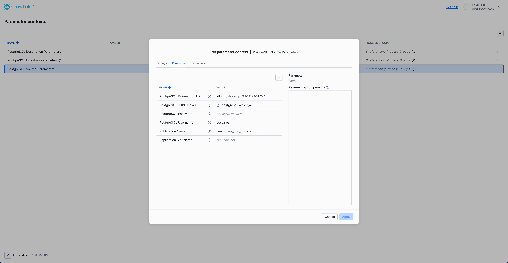
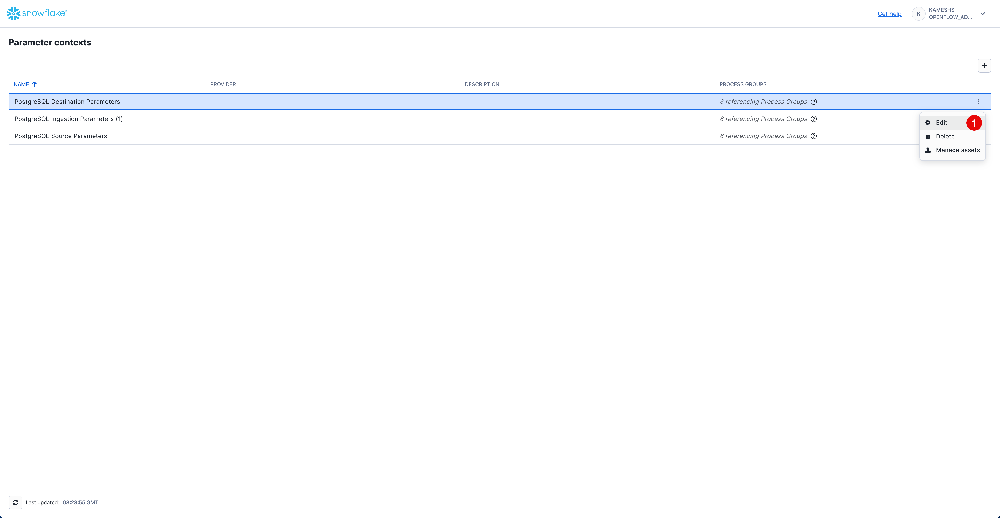
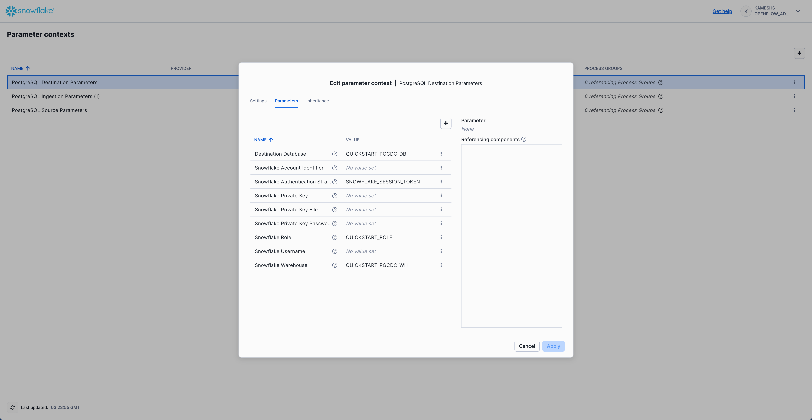
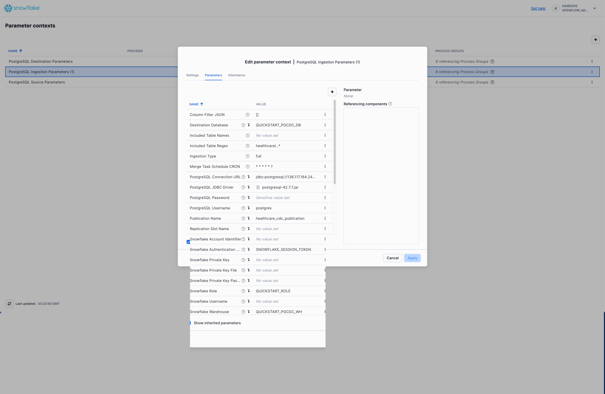
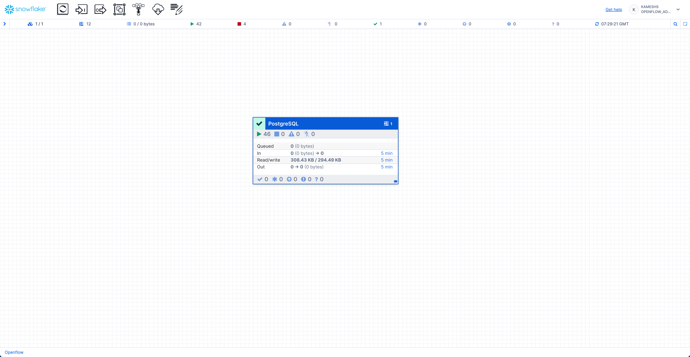
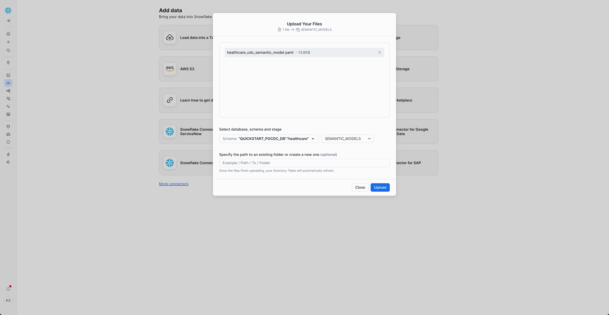
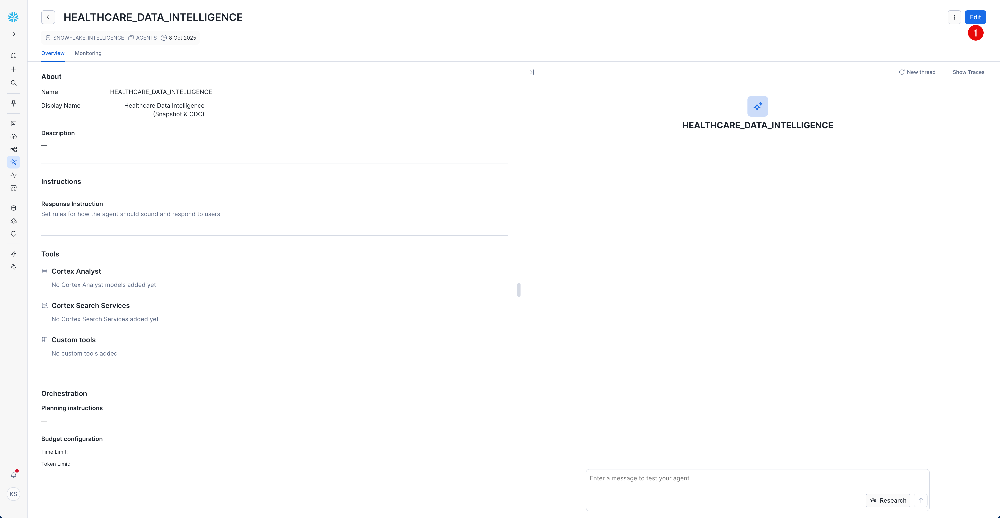
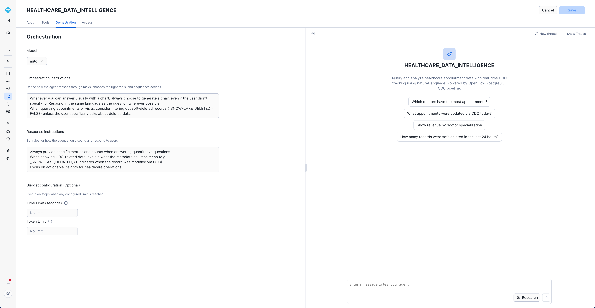

id: getting_started_with_Openflow_postgresql_cdc
summary: Getting Started with Openflow PostgreSQL Change Data Capture (CDC)
categories: featured,getting-started,data-engineering,cdc,Openflow,connectors
environments: web
status: Published
feedback link: <https://github.com/Snowflake-Labs/sfguides/issues>
tags: Getting Started, Openflow, PostgreSQL, CDC, Change Data Capture, Real-time Analytics
authors: Kamesh Sampath<kamesh.sampath@snowflake.com>

# Getting Started with Openflow PostgreSQL CDC
<!-- ------------------------ -->
## Overview

Duration: 5

This quickstart demonstrates how to build a real-time Change Data Capture (CDC) pipeline from PostgreSQL to Snowflake using Openflow. You'll learn how to capture both initial snapshots and incremental changes, enabling real-time analytics on transactional data.

We use a healthcare appointment management system as our demo dataset, but the same patterns apply to any database-based application including e-commerce, CRM, ERP, and other transactional systems.

> aside positive
> **Openflow Database CDC Connectors**: While this quickstart focuses on PostgreSQL, Openflow also supports CDC for other relational databases:
>
> - [PostgreSQL CDC Connector](https://docs.snowflake.com/en/user-guide/data-integration/openflow/connectors/postgres/about) (used in this quickstart)
> - [MySQL CDC Connector](https://docs.snowflake.com/en/user-guide/data-integration/openflow/connectors/mysql/about)
> - [SQL Server CDC Connector](https://docs.snowflake.com/en/user-guide/data-integration/openflow/connectors/sql-server/about)
>
> The concepts and workflow in this quickstart apply to all database CDC connectors.

### Healthcare Appointments Demo Dataset

You'll work with a realistic **Healthcare Appointment Management** system that includes:

- **100 synthetic patients** with diverse demographics
- **10 doctors** across 5 medical specializations
- **170 appointments** (150 historical + 20 upcoming)
- **120 visit records** with diagnoses and charges
- **Real-time CDC events** demonstrating INSERT, UPDATE operations

> aside positive
> **IMPORTANT - Demo Data Disclaimer:** All patient data, doctor information, and healthcare records in this demo are **entirely fictitious** and created for demonstration purposes only. No real PHI (Protected Health Information) is used.

By completing this guide, you will build an end-to-end CDC pipeline that captures changes from PostgreSQL in real-time and enables analytics in Snowflake.

Here is a summary of what you will learn in each step by following this quickstart:

- **Setup Environment**: Configure Snowflake database objects, PostgreSQL instance, and network access
- **Openflow Configuration**: Set up [Openflow](https://docs.snowflake.com/en/user-guide/data-integration/openflow/about) SPCS runtime
- **Add PostgreSQL CDC Connector**: Configure the [PostgreSQL CDC connector](https://docs.snowflake.com/en/user-guide/data-integration/openflow/connectors/postgres/about)
- **Initialize PostgreSQL Database**: Load healthcare schema and synthetic data
- **Verify Snapshot Load**: Confirm initial data capture in Snowflake
- **Generate Live CDC Events**: Simulate real-time appointment operations
- **Real-time Analytics**: Query live data and analyze CDC metadata
- **Monitor CDC Pipeline**: Track replication lag and data quality

### What is Openflow

[Openflow](https://docs.snowflake.com/en/user-guide/data-integration/openflow/about) is Snowflake's managed service for building and running data pipelines in [Snowpark Container Services (SPCS)](https://docs.snowflake.com/en/developer-guide/snowpark-container-services/overview). It provides pre-built connectors and processing capabilities that make it easy to ingest, transform, and analyze data from various sources.

**Key Benefits**:

- **Managed Infrastructure**: Fully managed container runtime environment in Snowflake
- **Pre-built Connectors**: Ready-to-use connectors for databases, SaaS applications, and cloud storage
- **Native Integration**: Runs within your Snowflake environment for security and governance
- **Scalable Processing**: Automatic scaling based on data volume and processing needs
- **No External Dependencies**: No need to manage external ETL tools or infrastructure

**Supported Database CDC Connectors**:

- **[PostgreSQL](https://docs.snowflake.com/en/user-guide/data-integration/openflow/connectors/postgres/about)**: Versions 11-17 (Standard, AWS RDS, Amazon Aurora, GCP Cloud SQL, Azure Database)
- **[MySQL](https://docs.snowflake.com/en/user-guide/data-integration/openflow/connectors/mysql/about)**: Versions 8.0, 8.4 (Standard, AWS RDS, Amazon Aurora, GCP Cloud SQL)
- **[SQL Server](https://docs.snowflake.com/en/user-guide/data-integration/openflow/connectors/sql-server/about)**: SQL Server 2017+ (Standard, AWS RDS, Azure SQL Database)

Learn more about [Openflow](https://docs.snowflake.com/en/user-guide/data-integration/openflow/about).

> aside positive
> **Deployment Model**: This quickstart uses **Snowflake Openflow SPCS deployment** (Snowflake-managed deployment running in Snowpark Container Services). Openflow is also available as a [BYOC (Bring Your Own Cloud) deployment](https://docs.snowflake.com/en/user-guide/data-integration/openflow/about-byoc) where Openflow runs in your own AWS account. Both deployment models support the same connectors and features.

### What is Change Data Capture (CDC)

Change Data Capture (CDC) is a design pattern that identifies and captures changes made to data in a database, then delivers those changes in real-time to a downstream system. Instead of periodically querying the entire database, CDC efficiently tracks only what changed.

**How PostgreSQL CDC Works**:

PostgreSQL CDC uses **logical replication**, which reads changes from the Write-Ahead Log (WAL). When data is modified in PostgreSQL:

1. Changes are written to the WAL (a transaction log)
2. A replication slot captures these changes
3. A publication defines which tables to track
4. Openflow reads from the replication slot and delivers changes to Snowflake

**CDC Benefits**:

- **Real-time Data**: Changes flow to Snowflake within seconds of occurring in PostgreSQL
- **Complete History**: Track all INSERT, UPDATE, DELETE operations with timestamps
- **Audit Trail**: Built-in CDC metadata for compliance, troubleshooting, and data lineage
- **Low Impact**: Minimal overhead on source database compared to batch ETL
- **Incremental Only**: After initial snapshot, only changes are transferred

**CDC vs Traditional Batch ETL**:

| Aspect | CDC | Batch ETL |
|--------|-----|-----------|
| **Latency** | Seconds | Hours/Days |
| **Data Freshness** | Real-time | Scheduled intervals |
| **Network Impact** | Changes only | Full table scans |
| **Database Load** | Minimal (log reading) | High (full queries) |
| **History** | All changes tracked | Point-in-time snapshots |

Learn more about [PostgreSQL CDC with Openflow](https://docs.snowflake.com/en/user-guide/data-integration/openflow/connectors/postgres/about).

### What You Will Learn

- How to configure PostgreSQL logical replication for CDC
- How to set up Openflow PostgreSQL CDC connector
- How to capture both snapshot and incremental changes
- How to analyze real-time data in Snowflake
- How to monitor CDC pipeline health and performance

### What You Will Build

- A real-time healthcare appointment tracking system
- Automated CDC pipeline from PostgreSQL to Snowflake
- Operational dashboards with live data
- Audit trail for all data changes

### Prerequisites

Before starting, ensure you have:

- **Snowflake Account**: Enterprise account with Openflow SPCS deployment enabled (AWS, Azure, or GCP regions)
- **Account Permissions**: ACCOUNTADMIN role or equivalent for initial setup
- **PostgreSQL Instance**: PostgreSQL 11+ with logical replication enabled
  - This quickstart was tested with **GCP Cloud SQL PostgreSQL 17**
  - Also supports AWS RDS, Amazon Aurora, Azure Database, or self-hosted PostgreSQL
  - See [supported PostgreSQL versions](https://docs.snowflake.com/en/user-guide/data-integration/openflow/connectors/postgres/about#supported-postgresql-versions)
- **Network Connectivity**: Ability to configure network access from Snowflake to PostgreSQL

> aside positive
> **IMPORTANT:**
>
> **Openflow Deployment**: This quickstart uses **Snowflake Openflow SPCS deployment** (Snowflake-managed). If you're using [Openflow BYOC deployment](https://docs.snowflake.com/en/user-guide/data-integration/openflow/about-byoc), the connector setup and concepts are the same, but runtime deployment steps will differ.
>
> **PostgreSQL Setup**: This quickstart was tested using **GCP Cloud SQL for PostgreSQL v17**, but the scripts are compatible with any PostgreSQL service (AWS RDS, Azure Database, self-hosted).
>
> **Required PostgreSQL Configuration**:
>
> - Logical replication enabled (`wal_level = logical`)
> - User with REPLICATION privileges
> - Network access from Snowflake SPCS

<!-- ------------------------ -->
## Setup Environment

Duration: 10

In this section, we'll set up both the Snowflake and PostgreSQL environments needed for the CDC pipeline.

### Clone the QuickStart Repository

First, clone the repository to get access to SQL scripts and setup files:

```bash
git clone https://github.com/Snowflake-Labs/sfguide-getting-started-openflow-postgresql-cdc.git
cd sfguide-getting-started-openflow-postgresql-cdc
```

**Repository Contents:**

- **`sql/0.snowflake_setup.sql`** - Snowflake environment setup (role, database, warehouse, network rules)
- **`sql/1.init_healthcare.sql`** - PostgreSQL schema and synthetic data initialization
- **`sql/2.verify_snapshot.sql`** - Snapshot load verification queries
- **`sql/3.live_appointments.sql`** - Live CDC event generation script
- **`sql/4.analytics_queries.sql`** - Real-time analytics query examples

### Alternative: Use Snowflake Workspaces with Git Integration

For executing SQL scripts directly in Snowsight without leaving your browser, you can import this repository into [Snowflake Workspaces](https://docs.snowflake.com/en/user-guide/ui-snowsight/workspaces-git):

1. Sign in to Snowsight and navigate to **Projects** → **Workspaces**
2. Select **From Git repository**
3. Paste the repository URL: `https://github.com/Snowflake-Labs/sfguide-getting-started-openflow-postgresql-cdc`
4. Configure your API integration and credentials
5. Execute SQL scripts directly in Snowsight

**Benefits of Workspaces**:

- Execute SQL scripts directly in Snowsight
- No need to clone repository locally
- Version control integration
- Collaborative development

Learn more about [integrating Workspaces with Git](https://docs.snowflake.com/en/user-guide/ui-snowsight/workspaces-git).

### Create Snowflake Objects

Now we'll set up all required Snowflake objects for the CDC pipeline. This includes creating a dedicated role, database, warehouse, and network access configuration.

#### What We're Creating

- **Role**: `QUICKSTART_ROLE` - Dedicated role for Openflow runtime
- **Database**: `QUICKSTART_PGCDC_DB` - Database for healthcare CDC data
- **Warehouse**: `QUICKSTART_PGCDC_WH` - Compute warehouse for data processing
- **Network Rule**: PostgreSQL connection endpoint
- **External Access Integration**: Allows SPCS to connect to PostgreSQL

#### Execute the Setup Script

Open [Workspaces](https://app.snowflake.com/sfdevrel/sfdevrel_enterprise/#/workspaces) in Snowsight, copy paste the `sql/0.snowflake_setup.sql` script and execute it.  

> aside positive
> **IMPORTANT:** Before running the script, update line 64 with your PostgreSQL endpoint:
>
> ```sql
> VALUE_LIST = ('YOUR-POSTGRES-HOST:5432');
> ```
>
> Replace `YOUR-POSTGRES-HOST` with:
>
> - **GCP Cloud SQL**: Your instance's public IP (e.g., `34.123.45.67`)
> - **AWS RDS**: Your RDS endpoint hostname
> - **Azure Database**: Your Azure PostgreSQL server name
> - **Self-hosted**: Your server hostname or IP address

The script will:

1. Create the `QUICKSTART_ROLE` role (or reuse if coming from SPCS quickstart)
2. Create `QUICKSTART_PGCDC_DB` database with two schemas:
   - `HEALTHCARE` - For CDC data tables
   - `NETWORKS` - For network rule definitions
3. Create `QUICKSTART_PGCDC_WH` warehouse (MEDIUM size, auto-suspend after 5 minutes)
4. Create network rule for PostgreSQL connectivity
5. Create external access integration `quickstart_pgcdc_access`
6. Grant appropriate permissions

#### Verify Snowflake Setup

After running the script, verify the setup.

#### Verify Schemas

```sql
USE ROLE QUICKSTART_ROLE;
SHOW SCHEMAS IN DATABASE QUICKSTART_PGCDC_DB;
```

Expected output:

```text
| created_on          | name                  | is_default | is_current | database_name      | owner            | comment | options | retention_time | owner_role_type |
|---------------------|-----------------------|------------|------------|--------------------|--------------------|---------|---------|----------------|-----------------|
| 2025-10-07 10:00:00 | HEALTHCARE            | N          | N          | QUICKSTART_PGCDC_DB | QUICKSTART_ROLE   |         |         | 1              | ROLE            |
| 2025-10-07 10:00:00 | INFORMATION_SCHEMA    | N          | N          | QUICKSTART_PGCDC_DB | ACCOUNTADMIN      |         |         | 1              | ROLE            |
| 2025-10-07 10:00:00 | NETWORKS              | N          | N          | QUICKSTART_PGCDC_DB | QUICKSTART_ROLE   |         |         | 1              | ROLE            |
| 2025-10-07 10:00:00 | PUBLIC                | Y          | N          | QUICKSTART_PGCDC_DB | QUICKSTART_ROLE   |         |         | 1              | ROLE            |
```

#### Verify Integration

```sql
SHOW INTEGRATIONS LIKE 'quickstart_pgcdc_access';
```

Expected output:

```text
| name                      | type              | category          | enabled | comment                                    | created_on          |
|---------------------------|-------------------|-------------------|---------|--------------------------------------------|--------------------|
| quickstart_pgcdc_access   | EXTERNAL_ACCESS   | SECURITY          | true    | OpenFlow SPCS runtime access for PostgreSQL CDC | 2025-10-07 10:00:00 |
```

#### Verify Network Rule

```sql
DESC NETWORK RULE QUICKSTART_PGCDC_DB.NETWORKS.postgres_network_rule;
```

Expected output:

```text
| name                     | type       | mode   | value_list                  | comment |
|--------------------------|------------|--------|-----------------------------|---------|
| postgres_network_rule    | HOST_PORT  | EGRESS | ['YOUR-POSTGRES-HOST:5432'] |         |
```

> aside negative
> **Note:** Tables in the `HEALTHCARE` schema will be automatically created by Openflow when connected with PostgreSQL CDC connector. You don't need to create them manually.

<!-- ------------------------ -->
## Setup PostgreSQL Database

Duration: 8

In this section, we'll configure PostgreSQL for CDC and load the healthcare demo data.

> aside positive
> **PostgreSQL Service**: This quickstart was tested using **GCP Cloud SQL for PostgreSQL v17**, but you can use any of the following:
>
> - **GCP Cloud SQL**: PostgreSQL 11-17
> - **AWS RDS**: PostgreSQL 11-17
> - **Amazon Aurora**: PostgreSQL 11-16
> - **Azure Database**: PostgreSQL 11-17
> - **Self-hosted**: PostgreSQL 11-17
>
> The SQL scripts provided are compatible with all PostgreSQL variants. Configuration steps may vary slightly depending on your PostgreSQL service.

### Setup PostgreSQL Client Environment

This section helps you configure the `psql` command-line tool for convenient access to your PostgreSQL database. All commands in this quickstart use `psql`, but you can use any PostgreSQL client you're comfortable with (pgAdmin, DBeaver, DataGrip, TablePlus, etc.).

> aside positive
> **Optional Step**: If you're using a graphical PostgreSQL client instead of `psql`, you can skip the environment variables and password file setup. Simply connect using your client's connection dialog and execute the SQL scripts directly.

#### Set Environment Variables (for psql CLI)

If using `psql`, set these environment variables to avoid repeating connection parameters:

```bash
export PGHOST='YOUR-POSTGRES-HOST'        # e.g., '34.123.45.67' for GCP Cloud SQL
export PGPORT='5432'
export PGDATABASE='postgres'
export PGUSER='postgres'
```

These variables will be referenced throughout the guide (e.g., `$PGHOST`, `$PGUSER`) for convenience when using `psql` commands.

#### Configure Password File (for psql CLI)

If using `psql`, create a `.pgpass` file to avoid entering your password repeatedly. This file securely stores your PostgreSQL credentials.

```bash
# Create .pgpass file (Unix/Linux/macOS)
echo "$PGHOST:$PGPORT:$PGDATABASE:$PGUSER:YOUR-PASSWORD" >> ~/.pgpass

# Set proper permissions (required for security)
chmod 0600 ~/.pgpass
```

> aside positive
> **Password File Format**: The `.pgpass` file format is `hostname:port:database:username:password`. You can use `*` as a wildcard for any field. Learn more about [PostgreSQL password files](https://www.postgresql.org/docs/current/libpq-pgpass.html).

#### Verify Connection

Test your PostgreSQL connection before proceeding (adjust the connection method based on your chosen client):

```bash
psql -c "SELECT version();"
```

Expected output:

```text
                                                   version                                                    
--------------------------------------------------------------------------------------------------------------
 PostgreSQL 17.x on x86_64-pc-linux-gnu, compiled by gcc (GCC) 9.3.0, 64-bit
(1 row)
```

If the connection fails, verify:

- Your PostgreSQL instance is running and accessible
- Network connectivity from your machine to PostgreSQL
- Firewall rules allow connections from your IP
- Credentials are correct

### Configure Logical Replication

PostgreSQL CDC requires logical replication to be enabled. This allows the connector to capture changes from the Write-Ahead Log (WAL).

#### Enable Logical Replication

- The postgres User needs to have roles REPLICATION or SUPERUSER

For managed PostgreSQL services, enable logical replication via the service console:

- **GCP Cloud SQL**: Set the `cloudsql.logical_decoding` and `cloudsql.enable_pglogical` flags to `on`
- **AWS RDS** or **AWS Aurora**: Set `rds.logical_replication = 1` and apply it to your instance
- **Azure Database**: Set `wal_level = logical` via the Azure portal or Azure CLI

For self-hosted PostgreSQL, edit `postgresql.conf`:

```ini
wal_level = logical
```

or

```sql
ALTER SYSTEM SET wal_level = logical;
```

Then restart PostgreSQL.

> aside positive
> **Important**: For detailed configuration instructions specific to your PostgreSQL service, see [Snowflake's PostgreSQL CDC Setup Guide - Configure wal_level](https://docs.snowflake.com/en/user-guide/data-integration/openflow/connectors/postgres/setup#configure-wal-level).

#### Verify Logical Replication

```bash
psql -c "SHOW wal_level;"
```

Expected output:

```text
 wal_level 
-----------
 logical
(1 row)
```

### Initialize Healthcare Database

Now we'll initialize the PostgreSQL database with the healthcare schema, synthetic data, and CDC configuration.

#### Execute the Initialization Script

The `sql/1.init_healthcare.sql` script will:

1. Grant replication privileges to the postgres user
2. Create the `healthcare` schema
3. Create tables: `patients`, `doctors`, `appointments`, `visits`
4. Load 100 synthetic patients, 10 doctors, 170 appointments, and 120 visit records
5. Create indexes for performance
6. Configure CDC publication for logical replication

#### Run the Script

```bash
psql -f sql/1.init_healthcare.sql
```

Or if using Workspaces or another client, copy and execute the contents of `sql/1.init_healthcare.sql`.

> aside positive
> **Script Duration**: The initialization script takes approximately 10-15 seconds to complete, as it creates the schema and loads synthetic data.

#### Verify PostgreSQL Setup

Before connecting Openflow, let's verify the entire PostgreSQL CDC configuration is correct.

#### Check Tables Exist

```bash
psql -c "\dt healthcare.*"
```

Expected output:

```text
              List of relations
   Schema   |     Name     | Type  |  Owner   
------------+--------------+-------+----------
 healthcare | appointments | table | postgres
 healthcare | doctors      | table | postgres
 healthcare | patients     | table | postgres
 healthcare | visits       | table | postgres
(4 rows)
```

#### Check Row Counts

```bash
psql -c "SELECT 
  (SELECT COUNT(*) FROM healthcare.patients) as patients,
  (SELECT COUNT(*) FROM healthcare.doctors) as doctors,
  (SELECT COUNT(*) FROM healthcare.appointments) as appointments,
  (SELECT COUNT(*) FROM healthcare.visits) as visits;"
```

Expected output:

```text
 patients | doctors | appointments | visits 
----------+---------+--------------+--------
      100 |      10 |          170 |    100
(1 row)
```

> aside positive
> **What's a Publication?** A PostgreSQL publication defines which tables are tracked for CDC. The Openflow connector subscribes to this publication to receive change events (INSERT, UPDATE, DELETE) in real-time.

#### Verify CDC Publication

```bash
psql -c "SELECT * FROM pg_publication WHERE pubname = 'healthcare_cdc_publication';"
```

Expected output:

```text
          pubname           | pubowner | puballtables | pubinsert | pubupdate | pubdelete | pubtruncate 
----------------------------+----------+--------------+-----------+-----------+-----------+-------------
 healthcare_cdc_publication |    16390 | t            | t         | t         | t         | t
(1 row)
```

#### Verify Published Tables

```bash
psql -c "SELECT schemaname, tablename FROM pg_publication_tables WHERE pubname = 'healthcare_cdc_publication';"
```

Expected output:

```text
 schemaname |  tablename   
------------+--------------
 healthcare | patients
 healthcare | doctors
 healthcare | appointments
 healthcare | visits
(4 rows)
```

#### Check CDC Configuration

```bash
psql -c "SELECT
    current_setting('wal_level') AS wal_level,
    current_setting('max_replication_slots') AS max_replication_slots,
    current_setting('max_wal_senders') AS max_wal_senders,
    (SELECT count(*) FROM pg_publication) AS publication_count,
    (SELECT count(*) FROM pg_replication_slots) AS active_slots;"
```

Expected output:

```text
 wal_level | max_replication_slots | max_wal_senders | publication_count | active_slots 
-----------+-----------------------+-----------------+-------------------+--------------
 logical   | 10                    | 10              | 1                 | 0
(1 row)
```

> aside positive
> **What to check:**
>
> - `wal_level` should be `logical`
> - `max_replication_slots` should be at least 1 (typically 10 or more)
> - `max_wal_senders` should be at least 1 (typically 10 or more)
> - `publication_count` should be 1 (our healthcare_cdc_publication)
> - `active_slots` will be 0 now, and will increase to 1 once Openflow connects

#### Verify Replication Privileges

```bash
psql -c "SELECT rolname, rolsuper, rolreplication FROM pg_roles WHERE rolname = '$PGUSER';"
```

Expected output:

```text
 rolname  | rolsuper | rolreplication 
----------+----------+----------------
 postgres | f        | t
(1 row)
```

> aside positive
> **Note:** The `rolsuper` value depends on your PostgreSQL setup. For managed services (GCP Cloud SQL, AWS RDS, Azure), it's typically `f` (false). For self-hosted installations where you're using the superuser account, it may be `t` (true). The critical column to verify is `rolreplication` which must be `t` (true).

The `rolreplication` column should be `t` (true). If it's `f` (false), grant replication privileges:

```bash
psql -c "ALTER USER $PGUSER WITH REPLICATION;"
```

> aside positive
> **Setup Complete!** Your PostgreSQL database is now fully configured for CDC with:
>
> - ✅ Logical replication enabled
> - ✅ Healthcare schema with 100 patients, 10 doctors, 170 appointments, 100 visits
> - ✅ CDC publication tracking all healthcare tables
> - ✅ Replication privileges granted
>
> You're ready to configure Openflow!

<!-- ------------------------ -->
## Openflow Configuration

Duration: 20

In this section, you'll set up the Openflow SPCS infrastructure needed to run the PostgreSQL CDC connector. This includes creating an Openflow deployment and configuring a runtime environment.

> aside positive
> **Prerequisites**: Before proceeding, ensure you've completed the Snowflake setup in the previous section. You should have the `QUICKSTART_ROLE`, `QUICKSTART_PGCDC_DB` database, and `QUICKSTART_PGCDC_WH` warehouse already created.

### Complete Openflow SPCS Setup

This CDC quickstart builds on the foundational Openflow SPCS setup. You'll need to complete the prerequisite steps from the companion quickstart guide first.

#### Create Openflow Deployment

Navigate to the [Getting Started with Openflow SPCS](https://quickstarts.snowflake.com/guide/getting_started_with_Openflow_spcs/index.html) quickstart and complete the following sections:

1. **Setup Core Snowflake** - Create `OPENFLOW_ADMIN` role and enable BCR Bundle 2025_06
2. **Create Deployment** - Set up your Openflow SPCS deployment (e.g., `QUICKSTART_DEPLOYMENT`)

> aside positive
> **IMPORTANT**: You only need to complete sections **up to and including "Create Deployment"**. Once your deployment is active, return to this guide to create a runtime specifically configured for PostgreSQL CDC.
>
> **Time Estimate**: Approximately 15 minutes to complete the prerequisite sections.

> aside positive
> **Using an Existing Deployment?** If you already have an Openflow deployment, you can skip the deployment creation step. Just make sure to select the correct deployment name when creating the runtime in the next step.

#### What You'll Have After Prerequisites

After completing the prerequisite sections, you'll have:

- ✅ `OPENFLOW_ADMIN` role with deployment privileges
- ✅ BCR Bundle 2025_06 enabled (required for CDC connectors)
- ✅ Active Openflow deployment (e.g., `QUICKSTART_DEPLOYMENT`)
- ✅ Network rules for Snowflake infrastructure

### Create Runtime for PostgreSQL CDC

Now that you have an active Openflow deployment, create a runtime environment specifically configured for the PostgreSQL CDC connector. All required resources were already created in the "Setup Environment" section, so we'll verify the setup and create the runtime.

> aside positive
> **What You Already Have**: From the "Setup Environment" section, you already created:
>
> - ✅ `QUICKSTART_ROLE` - Runtime role with appropriate privileges
> - ✅ `QUICKSTART_PGCDC_DB` - Database with `HEALTHCARE` and `NETWORKS` schemas
> - ✅ `QUICKSTART_PGCDC_WH` - Warehouse for data processing
> - ✅ `postgres_network_rule` - Network rule for PostgreSQL connectivity
> - ✅ `quickstart_pgcdc_access` - External access integration for PostgreSQL CDC

#### Verify External Access Integration

Verify the external access integration created in the "Setup Environment" section:

```sql
USE ROLE QUICKSTART_ROLE;

-- Verify integration exists and is enabled
SHOW INTEGRATIONS LIKE 'quickstart_pgcdc_access';
DESC INTEGRATION quickstart_pgcdc_access;
```

Expected output for `SHOW INTEGRATIONS`:

```text
| name                     | type              | category | enabled | comment                                              | created_on          |
|--------------------------|-------------------|----------|---------|------------------------------------------------------|---------------------|
| quickstart_pgcdc_access  | EXTERNAL_ACCESS   | SECURITY | true    | OpenFlow SPCS runtime access for PostgreSQL CDC      | 2025-10-07 10:00:00 |
```

> aside positive
> **What's an External Access Integration?** This allows your Openflow runtime to communicate with external services (your PostgreSQL database) from within Snowpark Container Services. The `postgres_network_rule` you created earlier defines which PostgreSQL endpoints are accessible.

#### Create Runtime via Snowsight

Follow these steps to create your runtime:

1. **Navigate to Openflow**: Go to **Work with data** → **Ingestion** → **Openflow**
2. **Switch to Runtimes Tab**: Click the **Runtimes** tab
3. **Ensure Correct Role**: Verify your role is set to `OPENFLOW_ADMIN` (check top-right corner of Snowsight)
4. **Click Create Runtime**: Click the **+ Runtime** button
5. **Configure Runtime**:
   - **Name**: `QUICKSTART_PGCDC_RUNTIME`
   - **Deployment**: Select `QUICKSTART_DEPLOYMENT` (or your deployment name)
   - **Runtime Role**: Select `QUICKSTART_ROLE`
   - **External Access Integration**: Select `quickstart_pgcdc_access`
6. **Click Create**: Complete the runtime creation


> aside positive
> **Runtime Creation Time**: Runtime creation typically takes 3-5 minutes. The status will progress from `CREATING` → `ACTIVE`.

#### Verify Runtime Status

Check that your runtime is active:

1. **Navigate to Runtimes Tab**: Go to **Work with data** → **Ingestion** → **Openflow** → **Runtimes**
2. **Check Status**: Look for `QUICKSTART_PGCDC_RUNTIME` with status **ACTIVE**


Expected status: **ACTIVE**

> aside positive
> **Troubleshooting**: If the runtime status shows `ERROR` or stays in `CREATING` for more than 10 minutes:
>
> - Verify the external access integration exists: `SHOW INTEGRATIONS LIKE 'quickstart_pgcdc_access';`
> - Check that `QUICKSTART_ROLE` has all required grants: `SHOW GRANTS TO ROLE QUICKSTART_ROLE;`
> - Ensure the compute pool has sufficient resources
> - Review the [Openflow SPCS troubleshooting guide](https://quickstarts.snowflake.com/guide/getting_started_with_Openflow_spcs/index.html#10)

#### Access the Runtime Canvas

Once your runtime is active, you can access the Openflow canvas to add and configure connectors:

**Click on the runtime name** (`QUICKSTART_PGCDC_RUNTIME`) to open the canvas where you can add the PostgreSQL CDC connector and build your data pipeline.

> aside positive
> **NOTE:** When you open the runtime canvas, you may see authorization prompts. Accept these prompts to allow the connector to access the runtime and required resources.


**TIP:** The canvas is where you'll configure the PostgreSQL CDC connector, manage data flows, and monitor pipeline execution. You're now ready to add your first connector!

> aside positive
> **REFERENCE DOCUMENTATION:**
>
> For detailed information, see [Create runtime](https://docs.snowflake.com/en/user-guide/data-integration/openflow/setup-openflow-spcs-create-runtime) in the official documentation.

<!-- ------------------------ -->
## Add PostgreSQL CDC Connector

Duration: 10

Now that your Openflow runtime is active, you'll add and configure the PostgreSQL CDC connector to start capturing changes from your healthcare database.

> aside positive
> **Snowflake Openflow UI**: Return to the Openflow tab in your browser where you opened the runtime canvas. If you closed it, navigate to **Work with data** → **Ingestion** → **Openflow** → **Runtimes** and click on `QUICKSTART_PGCDC_RUNTIME` to open the canvas.

### Add PostgreSQL CDC Connector to Runtime

Follow these steps to add the PostgreSQL CDC connector to your runtime:

1. **Access Connectors**: In the Openflow canvas, click the **hamburger menu** (☰) in the top-left corner
2. **Select PostgreSQL**: From the connectors list, find and select **PostgreSQL CDC**
3. **Add to Canvas**: The connector template will be added to your runtime canvas
4. **Connector Added**: You should see the PostgreSQL CDC connector flow on the canvas


> aside positive
> **What Just Happened?** You've installed a pre-built PostgreSQL CDC connector template that includes all the necessary processors for capturing changes from PostgreSQL and loading them into Snowflake. The connector consists of multiple components working together to perform snapshot load and incremental CDC.

<!-- ------------------------ -->
## Configure PostgreSQL CDC Connector

Duration: 10

The PostgreSQL CDC connector uses three parameter contexts to organize configuration. Parameter contexts in Openflow allow you to group related configuration parameters together, making it easier to manage and reuse configurations across different connectors and environments.

You'll configure these three parameter contexts in the following subsections:

1. **PostgreSQL Source Parameters** - PostgreSQL connection details and CDC-specific settings like publication and replication slot
2. **PostgreSQL Destination Parameters** - Snowflake table mapping and schema configuration
3. **PostgreSQL Ingestion Parameters** - Schema and columns that need to be loaded into Snowflake

To access parameter contexts:


> aside positive
> **SECURITY BEST PRACTICE:** For production environments, consider using a **SecretManagerParameterProvider** (such as `AwsSecretsManagerParameterProvider`) to securely manage sensitive credentials like passwords and connection strings. This approach stores secrets in a dedicated secrets manager instead of directly in the connector configuration, providing better security and easier credential rotation.

### Configure PostgreSQL Source Parameters

Configure the PostgreSQL database connection details and CDC-specific settings.

#### Download PostgreSQL JDBC Driver

Before configuring the parameters, download the PostgreSQL JDBC driver that will be used for the database connection.

Get the PostgreSQL JDBC driver from [https://jdbc.postgresql.org/download/](https://jdbc.postgresql.org/download/)

- This quickstart uses `postgresql-42.7.7.jar` (latest at time of writing)
- You can use the latest available version

Reference assets in Openflow allow you to upload JAR files, certificates, or other resources that connectors need to function. The JDBC driver enables the connector to communicate with PostgreSQL using the standard Java database connectivity interface.

#### Access PostgreSQL Source Parameters

From the Parameter contexts list, click the **three dots menu (⋮)** next to **PostgreSQL Source Parameters** and select **Edit**.



#### Configure Connection Parameters

Click on the **Parameters** tab and configure the following values:

| Parameter | Value | Description |
|-----------|-------|-------------|
| **PostgreSQL Connection URL** | `jdbc:postgresql://<YOUR-POSTGRES-HOST>:5432/postgres` | JDBC connection URL to your PostgreSQL instance. Replace `<YOUR-POSTGRES-HOST>` with your actual PostgreSQL host (e.g., `34.123.45.67` for GCP Cloud SQL) |
| **PostgreSQL JDBC Driver** | `postgresql-42.7.7.jar` | Reference to the PostgreSQL JDBC driver JAR (see upload instructions below) |
| **PostgreSQL Password** | `<YOUR-PASSWORD>` | Password for the PostgreSQL user (stored as sensitive value) |
| **PostgreSQL Username** | `postgres` | PostgreSQL username (or the user you configured with REPLICATION privileges) |
| **Publication Name** | `healthcare_cdc_publication` | Name of the PostgreSQL publication created in [1.init_healthcare.sql](https://github.com/Snowflake-Labs/sfguide-getting-started-openflow-postgresql-cdc/blob/main/sql/1.init_healthcare.sql#L348) |
| **Replication Slot Name** | Leave empty | Auto-generated with prefix `snowflake_connector_` |

> aside positive
> **Connection URL Format**: The PostgreSQL JDBC URL format is `jdbc:postgresql://HOST:PORT/DATABASE`.
>
> - For GCP Cloud SQL: Use the public IP address (e.g., `jdbc:postgresql://34.123.45.67:5432/postgres`)
> - For AWS RDS: Use the endpoint hostname (e.g., `jdbc:postgresql://mydb.abc123.us-east-1.rds.amazonaws.com:5432/postgres`)
> - For other services: Use your specific connection details

#### Upload JDBC Driver as Reference Asset

Follow the animation below to upload the downloaded JAR file and reference it in the **PostgreSQL JDBC Driver** parameter:


Your completed configuration should look like this:



Click **Apply** to save your PostgreSQL source parameters configuration.

### Configure PostgreSQL Destination Parameters

Configure the Snowflake destination connection where PostgreSQL data will be replicated.

> aside negative
> **IMPORTANT**: Ensure you have completed the [Create Snowflake Objects](#create-snowflake-objects) section before proceeding. The PostgreSQL CDC connector requires the database, warehouse, and role to be created in advance.

#### Access PostgreSQL Destination Parameters

From the Parameter contexts list, click the **three dots menu (⋮)** next to **PostgreSQL Destination Parameters** and select **Edit**.



#### Configure Destination Parameters

Click on the **Parameters** tab and configure the following values:

| Parameter | Value | Description |
|-----------|-------|-------------|
| **Destination Database** | `QUICKSTART_PGCDC_DB` | Snowflake database where tables will be created (defined in [0.snowflake_setup.sql#L23](https://github.com/Snowflake-Labs/sfguide-getting-started-openflow-postgresql-cdc/blob/main/sql/0.snowflake_setup.sql#L23)) |
| **Snowflake Account Identifier** | Leave empty | Not required when using session token authentication |
| **Snowflake Authentication Strategy** | `SNOWFLAKE_SESSION_TOKEN` | Uses the runtime's session for authentication (recommended for SPCS deployments) |
| **Snowflake Private Key** | Leave empty | Not required when using session token authentication |
| **Snowflake Private Key File** | Leave empty | Not required when using session token authentication |
| **Snowflake Private Key Password** | Leave empty | Not required when using session token authentication |
| **Snowflake Role** | `QUICKSTART_ROLE` | Runtime role with permissions to create tables and write data (defined in [0.snowflake_setup.sql#L20](https://github.com/Snowflake-Labs/sfguide-getting-started-openflow-postgresql-cdc/blob/main/sql/0.snowflake_setup.sql#L20)) |
| **Snowflake Username** | Leave empty | Not required when using session token authentication |
| **Snowflake Warehouse** | `QUICKSTART_PGCDC_WH` | Warehouse for data processing (defined in [0.snowflake_setup.sql#L26](https://github.com/Snowflake-Labs/sfguide-getting-started-openflow-postgresql-cdc/blob/main/sql/0.snowflake_setup.sql#L26)) |

Your completed configuration should look like this:



> aside positive
> **Session Token Authentication**: When using `SNOWFLAKE_SESSION_TOKEN`, the connector authenticates using the Openflow runtime's Snowflake session. This is the recommended approach for SPCS deployments as it eliminates the need to manage separate credentials.

Click **Apply** to save your PostgreSQL destination parameters configuration.

### Configure PostgreSQL Ingestion Parameters

Configure CDC ingestion settings and table filters. This parameter context inherits values from both **PostgreSQL Source Parameters** and **PostgreSQL Destination Parameters**.

#### Access PostgreSQL Ingestion Parameters

From the Parameter contexts list, click the **three dots menu (⋮)** next to **PostgreSQL Ingestion Parameters (1)** and select **Edit**.


#### Configure Ingestion Parameters

Click on the **Parameters** tab. By default, you'll see only the parameters specific to this context. To view all parameters (including inherited ones), check the **Show inherited parameters** checkbox at the bottom.


Configure the following key parameters:

| Parameter | Value | Description |
|-----------|-------|-------------|
| **Column Filter JSON** | `[]` | Empty array means all columns are included |
| **Included Table Names** | Leave empty | Use regex instead for flexible filtering |
| **Included Table Regex** | `healthcare.*` | Captures all tables in the `healthcare` schema (matches: `healthcare.patients`, `healthcare.doctors`, etc.) |
| **Ingestion Type** | `full` | Performs full snapshot followed by incremental CDC. Other option is "incremental" which only performs incremental CDC, existing data is not loaded. |
| **Merge Task Schedule CRON** | `* * * * * ?` | Runs merge tasks every second for near real-time updates |

**Inherited Parameters** (visible when "Show inherited parameters" is checked):

From **PostgreSQL Source Parameters**:

- PostgreSQL Connection URL
- PostgreSQL JDBC Driver
- PostgreSQL Username
- PostgreSQL Password
- Publication Name (`healthcare_cdc_publication` - created in [1.init_healthcare.sql#L348](https://github.com/Snowflake-Labs/sfguide-getting-started-openflow-postgresql-cdc/blob/main/sql/1.init_healthcare.sql#L348))
- Replication Slot Name (auto-generated)

From **PostgreSQL Destination Parameters**:

- Destination Database
- Snowflake Role
- Snowflake Warehouse
- Snowflake Authentication Strategy

Your completed configuration with inherited parameters should look like this:



> aside positive
> **Table Regex Pattern**: The regex `healthcare.*` uses PostgreSQL's pattern matching:
>
> - `healthcare` - matches the schema name
> - `.*` - matches any table name in that schema
>
> This will capture all four tables: `healthcare.patients`, `healthcare.doctors`, `healthcare.appointments`, and `healthcare.visits`.

> aside positive
> **Merge Task Schedule**: The CRON expression `* * * * * ?` means "every second". This provides near real-time CDC updates to Snowflake. For production workloads, you might adjust this based on your latency requirements and cost considerations.

Click **Apply** to save your PostgreSQL ingestion parameters configuration.

With all three parameter contexts configured, you're now ready to start the CDC pipeline!

<!-- ------------------------ -->
## Verify Snapshot Load

Duration: 5

With the connector configured, you're now ready to start the CDC pipeline and verify that the initial snapshot is loaded correctly.

### Enable Services and Start Connector

Before starting the connector, you need to enable the controller services that manage the CDC replication process.

Follow these steps to enable services and start the connector:

1. **Open Controller Services**: Right-click on the canvas and select "Configure"
2. **Enable Services**: Enable the two controller services (State Provider and Database Connection Pool)
3. **Start Process Groups**: Right-click on the process groups and start them
4. **Monitor Progress**: Watch the connector flow execute the snapshot load


> aside positive
> **What's Happening?** The connector performs two main operations:
>
> 1. **Snapshot Load**: Captures all existing data from PostgreSQL tables and loads it into Snowflake
> 2. **CDC Initialization**: Establishes the replication slot and begins listening for changes
>
> The snapshot typically takes 1-2 minutes for the demo dataset. For larger datasets, the duration will be proportional to the data volume.

Once the services are running, your connector status should show all components active:



### Verify Data in Snowflake

After the snapshot completes, verify that the data was loaded successfully in Snowflake.

> aside negative
> **IMPORTANT: Identifier Quoting Rule**
>
> PostgreSQL creates lowercase unquoted identifiers (e.g., `healthcare`, `appointments`, `patient_id`). When Openflow replicates these to Snowflake, they are preserved as **case-sensitive lowercase** names.
>
> **In Snowflake, you MUST quote these identifiers in lowercase**:
>
> - ✅ Correct: `USE SCHEMA "healthcare"; SELECT "patient_id", "status" FROM "appointments";`
> - ❌ Wrong: `USE SCHEMA healthcare; SELECT patient_id, status FROM appointments;`
> - ❌ Wrong: `SELECT PATIENT_ID, STATUS FROM APPOINTMENTS;`
>
> Why? Snowflake uppercases unquoted identifiers, so `appointments` becomes `APPOINTMENTS`, which won't match the actual table name `appointments` (lowercase). All queries in this quickstart follow this quoting convention.

#### Check Record Counts

Run the following query in Snowsight to verify all tables were created and populated:

```sql
USE ROLE QUICKSTART_ROLE;
USE DATABASE QUICKSTART_PGCDC_DB;
USE SCHEMA "healthcare";
USE WAREHOUSE QUICKSTART_PGCDC_WH;

SELECT 'patients' as table_name, COUNT(*) as record_count FROM "patients"
UNION ALL
SELECT 'doctors', COUNT(*) FROM "doctors"
UNION ALL
SELECT 'appointments', COUNT(*) FROM "appointments"
UNION ALL
SELECT 'visits', COUNT(*) FROM "visits"
ORDER BY table_name;
```

Expected output:

```text
+----------------+--------------+
| TABLE_NAME     | RECORD_COUNT |
+----------------+--------------+
| APPOINTMENTS   |          170 |
| DOCTORS        |           10 |
| PATIENTS       |          100 |
| VISITS         |          100 |
+----------------+--------------+
```

> aside positive
> Note: The initial snapshot loads 100 rows in `"visits"`. Additional visit records are generated during the Live CDC demo, so this count will increase after running the steps in "Generate Live CDC Events".

#### Verify CDC Metadata

Check that CDC metadata columns are present and confirm the snapshot was loaded:

```sql
SELECT 
    COUNT(*) as total_rows,
    MIN("_SNOWFLAKE_INSERTED_AT") as earliest_inserted,
    MAX("_SNOWFLAKE_INSERTED_AT") as latest_inserted,
    COUNT(DISTINCT "_SNOWFLAKE_INSERTED_AT") as unique_insert_timestamps
FROM "appointments";
```

Expected output (timestamps will vary):

```text
+------------+---------------------------+---------------------------+---------------------------+
| TOTAL_ROWS | EARLIEST_INSERTED         | LATEST_INSERTED           | UNIQUE_INSERT_TIMESTAMPS  |
+------------+---------------------------+---------------------------+---------------------------+
|        170 | 2025-10-08 10:15:33.000   | 2025-10-08 10:15:45.000   |                        10 |
+------------+---------------------------+---------------------------+---------------------------+
```

This confirms that all 170 appointments were successfully loaded during the snapshot phase.

> aside positive
> **CDC Metadata Columns**: Openflow automatically adds the following metadata columns to track changes:
>
> - `_SNOWFLAKE_INSERTED_AT` (TIMESTAMP): When the row was first inserted into Snowflake during the snapshot or initial CDC event
> - `_SNOWFLAKE_UPDATED_AT` (TIMESTAMP): When the row was last updated by CDC processing (remains NULL for snapshot-only rows)
> - `_SNOWFLAKE_DELETED` (BOOLEAN): Logical delete flag (FALSE for active rows, TRUE when a DELETE event is captured)
>
> During the Live CDC demo, you'll see `_SNOWFLAKE_UPDATED_AT` populated when records are modified, and `_SNOWFLAKE_DELETED` set to TRUE for deleted records.

#### Verify Appointment Status Distribution

Check the distribution of appointment statuses:

```sql
SELECT 
    "status",
    COUNT(*) as count,
    ROUND(COUNT(*) * 100.0 / SUM(COUNT(*)) OVER (), 2) as percentage
FROM "appointments"
GROUP BY "status"
ORDER BY count DESC;
```

Expected output:

```text
+-----------+-------+------------+
| STATUS    | COUNT | PERCENTAGE |
+-----------+-------+------------+
| completed |   100 |      58.82 |
| cancelled |    40 |      23.53 |
| scheduled |    15 |       8.82 |
| no_show   |    10 |       5.88 |
| confirmed |     5 |       2.94 |
+-----------+-------+------------+
```

#### Verify Doctor Workload

Check appointment distribution across doctors:

```sql
SELECT 
    d."first_name" || ' ' || d."last_name" as doctor_name,
    d."specialization",
    d."department",
    COUNT(a."appointment_id") as total_appointments,
    SUM(CASE WHEN a."status" = 'completed' THEN 1 ELSE 0 END) as completed_appointments,
    SUM(CASE WHEN a."status" IN ('scheduled', 'confirmed') THEN 1 ELSE 0 END) as upcoming_appointments
FROM "doctors" d
LEFT JOIN "appointments" a ON d."doctor_id" = a."doctor_id"
GROUP BY d."doctor_id", d."first_name", d."last_name", d."specialization", d."department"
ORDER BY total_appointments DESC
LIMIT 5;
```

This query shows the top 5 doctors by appointment volume, demonstrating that relational joins work correctly with the replicated data.

### Run Additional Verification Queries

For comprehensive verification, run the complete verification script from the companion GitHub repository:

📋 **Full Verification Script**: [2.verify_snapshot.sql](https://github.com/Snowflake-Labs/sfguide-getting-started-openflow-postgresql-cdc/blob/main/sql/2.verify_snapshot.sql)

The full script includes additional checks for:

- Data quality validation (NULL checks)
- Patient demographics analysis
- Revenue summaries by doctor
- Common diagnoses
- Follow-up and prescription statistics

You can run this script directly in Snowsight using [Workspaces with Git Integration](#alternative-use-snowflake-workspaces-with-git-integration) or by copying and pasting the SQL.

> aside positive
> **Snapshot Load Complete!** If all queries return expected results, your PostgreSQL tables are successfully replicated to Snowflake. The connector is now listening for changes and will automatically capture any INSERT, UPDATE, or DELETE operations in real-time.

<!-- ------------------------ -->
## Snowflake Intelligence

Duration: 15

Now that the snapshot is loaded, let's set up Snowflake Intelligence before generating CDC events. This allows you to establish a baseline understanding of your data, then observe changes in real-time after running the CDC demo.

> aside positive
> **Why Set Up Intelligence First?** By asking baseline questions about your snapshot data now, you'll be able to compare results after the CDC demo and see exactly how the data changed. This creates a powerful before/after experience for understanding CDC!

### What You'll Build

You'll create an AI agent that can answer questions like:

- "Show me doctor workload for today"
- "Which appointments were updated via CDC in the last hour?"
- "What's the revenue by specialization this month?"
- "How many records were soft-deleted today?"

The agent understands your healthcare schema AND the CDC metadata columns for tracking changes!

### Prerequisites

Before setting up Snowflake Intelligence, ensure you have:

- ✅ Completed snapshot load with Openflow pipeline running
- ✅ Appropriate Snowflake privileges (`CREATE AGENT` privilege)
- ✅ Default role and warehouse set in your Snowflake user profile

### Initial Setup

Create the required database and schema structure for Snowflake Intelligence:

```sql
-- Use ACCOUNTADMIN role for setup
USE ROLE ACCOUNTADMIN;

-- Create database for Snowflake Intelligence
CREATE DATABASE IF NOT EXISTS snowflake_intelligence;
GRANT USAGE ON DATABASE snowflake_intelligence TO ROLE PUBLIC;

-- Create agents schema
CREATE SCHEMA IF NOT EXISTS snowflake_intelligence.agents;
GRANT USAGE ON SCHEMA snowflake_intelligence.agents TO ROLE PUBLIC;

-- Grant agent creation privileges to your role
GRANT CREATE AGENT ON SCHEMA snowflake_intelligence.agents TO ROLE QUICKSTART_ROLE;
```

### Upload Semantic Model

The semantic model defines your healthcare schema for the AI agent. It includes table definitions, relationships, and CDC metadata columns.

#### Step 1: Create a Stage for the Semantic Model

```sql
USE ROLE QUICKSTART_ROLE;
USE DATABASE QUICKSTART_PGCDC_DB;
USE SCHEMA "healthcare";

-- Create stage for semantic model file
CREATE STAGE IF NOT EXISTS semantic_models
  DIRECTORY = (ENABLE = TRUE)
  COMMENT = 'Stage for Snowflake Intelligence semantic models';
```

> aside positive
> **NOTE:** Using a dedicated `semantic_models` stage keeps your semantic models organized and separate from data files.

#### Step 2: Upload the Semantic Model File

Download the semantic model from the repository:

📋 **Semantic Model**: [semantic-models/healthcare_cdc_semantic_model.yaml](https://github.com/Snowflake-Labs/sfguide-getting-started-openflow-postgresql-cdc/blob/main/semantic-models/healthcare_cdc_semantic_model.yaml)

Upload it to the stage using Snowsight:

1. Navigate directly to **Ingestion** --> **Add Data**: [Load files into a Stage](https://app.snowflake.com/_deeplink/#/data/databases/stages/load-files)
2. Select the database, schema, and stage:
   - **Database:** `QUICKSTART_PGCDC_DB`
   - **Schema:** `healthcare`
   - **Stage:** `semantic_models`
3. Click **+ Files** or drag and drop `healthcare_cdc_semantic_model.yaml`
4. Click **Upload**



Or use Snowflake CLI:

```bash
snow stage put semantic-models/healthcare_cdc_semantic_model.yaml @semantic_models \
  --database QUICKSTART_PGCDC_DB \
  --schema healthcare \
  --role QUICKSTART_ROLE \
  --overwrite
```

Verify the upload via [Database Explorer](https://app.snowflake.com/_deeplink/#/data/databases/QUICKSTART_PGCDC_DB/schemas/healthcare/stage/SEMANTIC_MODELS?utm_source=quickstart&utm_medium=quickstart&utm_campaign=-us-en-all&utm_content=app-getting-started-with-openflow-postgresql-cdc)

### Create the Agent

> aside positive
> **IMPORTANT:** Before creating the agent, ensure you are using the `QUICKSTART_ROLE` role in Snowsight. This ensures the agent is owned by the correct role and has proper access to resources. You can switch roles using the role selector in the top-right corner of Snowsight.

#### Access Agent Creation Interface

1. Sign in to Snowsight
2. **Switch to `QUICKSTART_ROLE`** using the role selector in the top-right corner
3. Navigate directly to Agents: [Create Snowflake Intelligence Agent](https://app.snowflake.com/_deeplink/#/agents?utm_source=quickstart&utm_medium=quickstart&utm_campaign=-us-en-all&utm_content=app-buidling-new-snowflake-intelligence-agents)
4. Select **"Create agent"**


**Platform Integration:**

- ☑️ Select **"Create this agent for Snowflake Intelligence"**

**Agent Details:**

- **Agent object name:** `HEALTHCARE_DATA_INTELLIGENCE`
- **Display name:** `Healthcare Data Intelligence (Snapshot & CDC)`

#### Configure Agent Basics

After creating the agent, configure its details:

1. **Click on the agent name** (`HEALTHCARE_DATA_INTELLIGENCE`) in the agent list to open it

   

2. **Click "Edit"** button to start editing the agent configuration

   

> aside positive
> **IMPORTANT:** As you configure each section below (About, Tools, Orchestration, Access), remember to click **"SAVE"** after completing all configurations to ensure your changes are preserved.

Now configure the agent basics in the "About" section:


- **Description:** `Query and analyze healthcare appointment data with real-time CDC tracking using natural language. Powered by OpenFlow PostgreSQL CDC pipeline.`

**Example Questions** (Add these to help users get started):

```text
"Show me the appointment status distribution"
```

```text
"Which doctors have the most appointments?"
```

```text
"What appointments were updated via CDC today?"
```

```text
"Show revenue by doctor specialization"
```

```text
"How many records were soft-deleted in the last 24 hours?"
```

### Configure Agent Tools

#### Add Semantic Model


1. Navigate to **"Tools"** tab
2. Find **"Semantic Models"** section
3. Click **"+ Add"** button

**Configure the Semantic Model:**

- **Name:** `HEALTHCARE_DATA_ANALYTICS`
- **Stage:** `@semantic_models`
- **File:** `healthcare_cdc_semantic_model.yaml`
- **Description:** `Healthcare appointment management with real-time snapshot and CDC data tracking`

> aside positive
> **TIP:** The semantic model includes definitions for all four tables (patients, doctors, appointments, visits) plus their relationships and CDC metadata columns (_Snowflake_INSERTED_AT,_Snowflake_UPDATED_AT, _Snowflake_DELETED).

### Configure Orchestration



1. Navigate to **"Orchestration"** tab
2. Set **Model:** `auto` (recommended - lets Snowflake choose the optimal model)

**Orchestration Instructions:**

```
Whenever you can answer visually with a chart, always choose to generate a chart even if the user didn't specify to. 
Respond in the same language as the question wherever possible.
When querying appointments or visits, consider filtering out soft-deleted records (_SNOWFLAKE_DELETED = FALSE) unless the user specifically asks about deleted data.
```

**Response Instructions:** (Optional)

```
Always provide specific metrics and counts when answering quantitative questions.
When showing CDC-related data, explain what the metadata columns mean (e.g., _SNOWFLAKE_UPDATED_AT indicates when the record was modified via CDC).
Focus on actionable insights for healthcare operations.
```

> aside positive
> **TIP:** Use `auto` (default) to let Snowflake automatically select the best available model for your region and query type. Supported models include Claude 4.0, Claude 3.7, Claude 3.5, and GPT 4.1.

### Set Access Controls


1. Navigate to **"Access"** tab
2. Click **"Add role"**
3. Select appropriate roles for your organization

**Example Role Configuration:**

- **Role:** `QUICKSTART_ROLE`
- **Permission:** `OWNERSHIP`

> aside positive
> **NOTE:** All queries use the user's credentials. Ensure users have appropriate access to the `QUICKSTART_PGCDC_DB."healthcare"` schema and underlying tables.

### Ask Baseline Questions (Snapshot Data)

Now that your agent is configured, let's ask baseline questions about the snapshot data to establish the initial state.

#### Getting Started with Queries

1. Access Snowflake Intelligence: [Open Snowflake Intelligence](https://ai.snowflake.com/)
2. Select your agent `Healthcare Data Intelligence (Snapshot & CDC)` from the dropdown

   

3. Set the role and warehouse for the agent to use:
   - **Role:** `QUICKSTART_ROLE`
   - **Warehouse:** `QUICKSTART_PGCDC_WH`

   

   > aside positive
   > **IMPORTANT:** The agent will use these credentials to query your data. Make sure the role has access to the `QUICKSTART_PGCDC_DB."healthcare"` schema and all tables.

4. Start with these baseline questions:

**Baseline Questions:**

```text
"How many total appointments do we have?"
```

**Expected:** ~170 appointments from snapshot load

```text
"Show me the appointment status distribution"
```

**Expected:** Breakdown showing completed (100), cancelled (40), scheduled (15), no_show (10), confirmed (5)

```text
"Which doctors have the most appointments?"
```

**Expected:** List of 10 doctors with appointment counts

```text
"What's the total revenue from all visits?"
```

**Expected:** Sum of charges from 100 visits (~$15,000-$20,000)

```text
"Show me appointments by specialization"
```

**Expected:** Breakdown by General Practice, Cardiology, Pediatrics, Orthopedics, etc.

```text
"Are there any records with CDC updates yet?"
```

**Expected:** "No, all records are from the initial snapshot load. The _Snowflake_UPDATED_AT column is NULL for all records."


> aside positive
> **Baseline Established!** You now have a clear picture of your snapshot data. Keep these numbers in mind - after running the CDC demo in the next section, you'll ask follow-up questions to see exactly what changed!

<!-- ------------------------ -->
## Generate Live CDC Events

Duration: 7

Now that the snapshot is loaded, let's generate live CDC events to see real-time replication in action. We'll simulate a busy morning at DemoClinic Healthcare with various database operations.

### What CDC Events Will Be Generated

The demo script will create:

- **INSERT**: New appointments booked by patients
- **UPDATE**: Appointment status changes (confirmed → checked_in → in_progress → completed)
- **UPDATE**: Visit records created for completed appointments
- **UPDATE**: Patient no-shows and cancellations
- **DELETE**: Cleanup of old cancelled appointments (to demonstrate soft deletes)
- **UPDATE**: Doctor availability changes

### Run CDC Demo Script

The easiest way to generate CDC events is to run the provided SQL script on your PostgreSQL database.

#### Option 1: Using psql Command Line

If you have the environment variables set from earlier, run:

```bash
psql -f sql/3.live_appointments.sql
```

Or with explicit connection:

```bash
psql -h YOUR_POSTGRES_HOST \
     -p 5432 \
     -U postgres \
     -d postgres \
     -f sql/3.live_appointments.sql
```

#### Option 2: Copy and Paste in pgAdmin or PostgreSQL Client

1. Open the script: [3.live_appointments.sql](https://github.com/Snowflake-Labs/sfguide-getting-started-openflow-postgresql-cdc/blob/main/sql/3.live_appointments.sql)
2. Copy the entire contents
3. Paste into your PostgreSQL client (pgAdmin, DBeaver, etc.)
4. Execute the script

The script will:

- Run for approximately **5 minutes** (with strategic pauses)
- Display progress messages with timestamps (8:00 AM → 12:45 PM simulation)
- Wait 60 seconds after major operations to align with CDC sync intervals
- Show a summary of changes at the end

> aside positive
> **Perfect Timing for CDC**: The script includes 60-second pauses after key operations to align with Openflow's 1-minute CDC sync interval. This lets you:
>
> - Switch to Snowflake between operations to observe changes appearing
> - See multiple CDC sync cycles in action
> - Understand the near real-time nature of CDC (not instant, but very fast!)
>
> The script displays "⏳ Waiting 60 seconds for CDC sync..." messages to indicate when it's a good time to check Snowflake.

#### Expected Output

You should see output like this:

```text
🕐 8:00 AM - New appointment requests coming in...
✅ 3 new appointments scheduled

🕐 8:15 AM - Front desk confirming today's appointments...
✅ Today's appointments confirmed

🕐 8:30 AM - Patients checking in for their appointments...
✅ 4 patients checked in

...

═══════════════════════════════════════════════════════════
📊 CDC Demo Summary - Changes Generated
═══════════════════════════════════════════════════════════

 activity                            | count 
-------------------------------------+-------
 New appointments created            |    10
 Appointments updated (status changes)|    20
 New visit records created           |     4
 Doctor records updated              |     1

✅ All CDC events have been generated!
```

### Verify Changes in Snowflake

While the script is running (or immediately after), switch to Snowflake to see the changes appear in real-time.

#### Check Updated Row Counts

Run this query to see the increased record counts:

```sql
USE ROLE QUICKSTART_ROLE;
USE DATABASE QUICKSTART_PGCDC_DB;
USE SCHEMA "healthcare";
USE WAREHOUSE QUICKSTART_PGCDC_WH;

SELECT 'patients' as table_name, COUNT(*) as record_count FROM "patients"
UNION ALL
SELECT 'doctors', COUNT(*) FROM "doctors"
UNION ALL
SELECT 'appointments', COUNT(*) FROM "appointments"
UNION ALL
SELECT 'visits', COUNT(*) FROM "visits"
ORDER BY table_name;
```

Expected output (compare to snapshot baseline of 170 appointments, 100 visits):

```text
+----------------+--------------+
| TABLE_NAME     | RECORD_COUNT |
+----------------+--------------+
| appointments   |          180 | -- +10 new appointments
| doctors        |           10 | -- unchanged
| patients       |          100 | -- unchanged
| visits         |          104 | -- +4 new visit records
+----------------+--------------+
```

#### Verify CDC Metadata Shows Updates

Check for updated records:

```sql
SELECT 
    COUNT(*) as total_records,
    SUM(CASE WHEN "_SNOWFLAKE_UPDATED_AT" IS NULL THEN 1 ELSE 0 END) as snapshot_only,
    SUM(CASE WHEN "_SNOWFLAKE_UPDATED_AT" IS NOT NULL THEN 1 ELSE 0 END) as updated_records,
    SUM(CASE WHEN "_SNOWFLAKE_DELETED" THEN 1 ELSE 0 END) as deleted_records
FROM "appointments";
```

Expected output:

```text
+----------------+---------------+-----------------+-----------------+
| TOTAL_RECORDS  | SNAPSHOT_ONLY | UPDATED_RECORDS | DELETED_RECORDS |
+----------------+---------------+-----------------+-----------------+
|           180  |           150 |              30 |               2 |
+----------------+---------------+-----------------+-----------------+
```

This shows:

- **150** appointments from original snapshot (not updated)
- **30** appointments that were either inserted or updated during CDC demo
- **2** deleted appointments (marked with `_SNOWFLAKE_DELETED = TRUE`)

#### Query the Journal Tables

Snowflake Openflow creates journal tables that track all CDC events. These tables are in the same schema with a `_JOURNAL` suffix:

```sql
-- View recent CDC events for appointments
SELECT 
    "_SNOWFLAKE_INSERTED_AT" as event_time,
    "_SNOWFLAKE_DELETED" as is_deleted,
    "appointment_id",
    "patient_id",
    "doctor_id",
    "status",
    "reason_for_visit",
    "appointment_date"
FROM "appointments_JOURNAL"
WHERE "_SNOWFLAKE_INSERTED_AT" >= DATEADD(minute, -10, CURRENT_TIMESTAMP)
ORDER BY "_SNOWFLAKE_INSERTED_AT" DESC
LIMIT 20;
```

This shows the complete audit trail of all changes captured by CDC!

#### View Deleted Records

Query appointments that were deleted (soft delete):

```sql
SELECT 
    "appointment_id",
    "patient_id",
    "status",
    "appointment_date",
    "reason_for_visit",
    "_SNOWFLAKE_INSERTED_AT",
    "_SNOWFLAKE_UPDATED_AT",
    "_SNOWFLAKE_DELETED"
FROM "appointments"
WHERE "_SNOWFLAKE_DELETED" = TRUE;
```

Expected output:

```text
+-----------------+------------+------------+------------------+-----------------------------+---------------------------+---------------------------+----------------------+
| APPOINTMENT_ID  | PATIENT_ID | STATUS     | APPOINTMENT_DATE | REASON_FOR_VISIT            | _SNOWFLAKE_INSERTED_AT    | _SNOWFLAKE_UPDATED_AT     | _SNOWFLAKE_DELETED   |
+-----------------+------------+------------+------------------+-----------------------------+---------------------------+---------------------------+----------------------+
|             123 |         45 | cancelled  | 2024-08-15       | Annual physical examination | 2025-10-08 10:15:33.000   | 2025-10-08 15:30:22.000   | TRUE                 |
|             156 |         78 | cancelled  | 2024-09-01       | Routine checkup             | 2025-10-08 10:15:40.000   | 2025-10-08 15:30:22.000   | TRUE                 |
+-----------------+------------+------------+------------------+-----------------------------+---------------------------+---------------------------+----------------------+
```

> aside positive
> **Soft Deletes**: Notice that deleted records are still queryable in Snowflake! The `_SNOWFLAKE_DELETED` flag marks them as deleted, but the data is preserved. This is crucial for:
>
> - Audit trails and compliance
> - Historical analysis
> - Data recovery if needed
>
> You can filter deleted records out of queries with `WHERE "_SNOWFLAKE_DELETED" = FALSE` or `WHERE NOT "_SNOWFLAKE_DELETED"`.

#### Compare Before and After Status Distribution

Re-run the status distribution query to see the changes:

```sql
SELECT 
    "status",
    COUNT(*) as count,
    ROUND(COUNT(*) * 100.0 / SUM(COUNT(*)) OVER (), 2) as percentage
FROM "appointments"
WHERE NOT "_SNOWFLAKE_DELETED"  -- Exclude deleted records
GROUP BY "status"
ORDER BY count DESC;
```

Compare this to the snapshot baseline - you should see increases in completed appointments and new visit records.

> aside positive
> **Real-time CDC in Action!** The changes you made in PostgreSQL appeared in Snowflake within seconds. This demonstrates the power of CDC for real-time data integration and analytics.

---

### Return to Snowflake Intelligence (Ask CDC Questions)

Now that CDC events have been processed, return to your Snowflake Intelligence agent and ask CDC-specific questions to see the changes!

1. Access Snowflake Intelligence: [Open Snowflake Intelligence](https://ai.snowflake.com/)
2. Select your agent `HEALTHCARE_DATA_INTELLIGENCE` from the dropdown
3. Ask these CDC-focused questions:

#### CDC Monitoring Questions

**Track Recent Changes:**

```text
"How many appointments were updated via CDC in the last hour?"
```

**Expected:** Count of records with `_SNOWFLAKE_UPDATED_AT` in the last hour (~30 records)

```text
"Show me all appointments that were modified today via CDC"
```

**Expected:** Table with appointment details and `_SNOWFLAKE_UPDATED_AT` timestamps

```text
"Which appointments were soft-deleted?"
```

**Expected:** 2 cancelled appointments that were removed (where `_SNOWFLAKE_DELETED = TRUE`)

#### Compare Before and After

**Compare to Your Baseline:**

```text
"What's the new appointment status distribution?"
```

**Expected:** Updated counts showing more completed appointments than the baseline

```text
"How many new visit records were created today?"
```

**Expected:** Visit count increase from baseline of 100 to 110 visits

```text
"Show me appointments that changed from scheduled to completed"
```

**Expected:** Appointments with status transitions during the CDC demo

#### Operational Analytics

**Real-time Operations:**

```text
"Which doctors completed the most visits today?"
```

**Expected:** Doctor rankings with today's completed visit counts

```text
"What's today's total revenue from visits?"
```

**Expected:** Sum of charges from visits created today (~$2,000-$3,000 from new visits)

```text
"Show me all urgent appointments added today"
```

**Expected:** Walk-in appointments with urgent status added during CDC demo

#### CDC Audit Trail

**Track Changes:**

```text
"Show me appointments with status changes in the last 2 hours?"
```

**Expected:** Appointments with `_SNOWFLAKE_UPDATED_AT` in last 2 hours

```text
"How many total records have been modified via CDC?"
```

**Expected:** Count where `_SNOWFLAKE_UPDATED_AT IS NOT NULL` (~30 records)

```text
"What percentage of appointments were updated via CDC vs snapshot only?"
```

**Expected:** Ratio showing ~85% snapshot, ~15% CDC-modified

#### Advanced CDC Questions

**Change Patterns:**

```text
"Show me the timeline of appointment status changes today"
```

**Expected:** Time-series of status transitions with timestamps

```text
"Which patient had the most appointment updates?"
```

**Expected:** Patient with multiple appointment modifications during the demo

```text
"Compare snapshot-only vs CDC-updated appointment counts"
```

**Expected:** Breakdown showing 170 snapshot, 30 CDC-modified

#### Business Insights

**Operational Metrics:**

```text
"What's the cancellation rate for today's appointments?"
```

**Expected:** Percentage of cancelled appointments

```text
"Show revenue by doctor for visits completed in the last hour"
```

**Expected:** Recent revenue attribution from new visits

```text
"How many appointments need follow-up visits?"
```

**Expected:** Count from visits where `follow_up_required = TRUE`

> aside positive
> **Pro Tip:** Snowflake Intelligence understands the CDC metadata columns and can differentiate between snapshot data and real-time changes. Try asking comparative questions like "Show me only the appointments that changed today" to see CDC-specific insights!

### Sample Conversation Flow

Here's an example conversation showing how to explore CDC data:

**You:** "How many total appointments do we have now?"
**Agent:** "There are 180 appointments total."

**You:** "How many were part of the original snapshot vs added/updated via CDC?"
**Agent:** "170 were from the snapshot, and 30 were added or updated via CDC (10 new + 20 updated)."

**You:** "Show me the appointments that were soft-deleted"
**Agent:** *(Shows table with 2 deleted appointments with timestamps)*

**You:** "What was the reason for these deletions?"
**Agent:** *(Shows they were old cancelled appointments from 60+ days ago)*

**You:** "Great! Now show me today's revenue trend"
**Agent:** *(Shows chart of revenue over time with the new visits)*

This demonstrates how natural language makes CDC data accessible to non-technical users!

### Alternative: SQL Queries

If you prefer SQL over natural language, you can also use the comprehensive analytics script with 20+ pre-built queries:

📋 **Analytics Script**: [4.analytics_queries.sql](https://github.com/Snowflake-Labs/sfguide-getting-started-openflow-postgresql-cdc/blob/main/sql/4.analytics_queries.sql)

**Example SQL Queries:**

**1. CDC Change Volume:**

```sql
SELECT 
    'appointments' as table_name,
    COUNT(*) as total_records,
    SUM(CASE WHEN "_SNOWFLAKE_UPDATED_AT" IS NULL THEN 1 ELSE 0 END) as snapshot_only,
    SUM(CASE WHEN "_SNOWFLAKE_UPDATED_AT" IS NOT NULL THEN 1 ELSE 0 END) as updated_via_cdc,
    SUM(CASE WHEN "_SNOWFLAKE_DELETED" THEN 1 ELSE 0 END) as soft_deleted
FROM "appointments";
```

**2. Recent CDC Events:**

```sql
SELECT 
    "appointment_id",
    "patient_id",
    "status",
    "appointment_date",
    "_SNOWFLAKE_UPDATED_AT",
    "_SNOWFLAKE_DELETED"
FROM "appointments"
WHERE "_SNOWFLAKE_UPDATED_AT" >= DATEADD(hour, -24, CURRENT_TIMESTAMP)
ORDER BY "_SNOWFLAKE_UPDATED_AT" DESC;
```

**3. Doctor Productivity with CDC Data:**

```sql
SELECT 
    d."first_name" || ' ' || d."last_name" as doctor_name,
    d."specialization",
    COUNT(a."appointment_id") as total_appointments,
    SUM(CASE WHEN a."status" = 'completed' THEN 1 ELSE 0 END) as completed
FROM "doctors" d
LEFT JOIN "appointments" a ON d."doctor_id" = a."doctor_id"
WHERE NOT a."_SNOWFLAKE_DELETED" OR a."_SNOWFLAKE_DELETED" IS NULL
GROUP BY d."doctor_id", d."first_name", d."last_name", d."specialization"
ORDER BY completed DESC;
```

> aside positive
> **Best of Both Worlds:** Use Snowflake Intelligence for ad-hoc exploration and business user queries, and SQL for repeatable reporting and dashboards!

<!-- ------------------------ -->
## Cleanup

Duration: 2

[CLEANUP INSTRUCTIONS - TO BE FILLED]

### Stop CDC Connector

[TO BE FILLED]

### Drop Snowflake Objects

[TO BE FILLED]

### Drop the Snowflake Intelligence Agent (Optional)

If you created an agent and no longer need it:

```sql
USE ROLE QUICKSTART_ROLE;
DROP AGENT IF EXISTS snowflake_intelligence.agents.HEALTHCARE_DATA_INTELLIGENCE;
```

<!-- ------------------------ -->
## Conclusion And Resources

Duration: 2

Congratulations! You've successfully built a real-time CDC pipeline from PostgreSQL to Snowflake using Openflow.

### What You Learned

- How to configure PostgreSQL logical replication for CDC
- How to set up Snowflake Intelligence with semantic models for natural language queries
- How to configure Openflow PostgreSQL CDC connector
- How to capture both snapshot and incremental changes
- How to analyze real-time data and CDC metadata with AI-powered insights
- How to use natural language to explore CDC changes

### Related Resources

**Openflow Documentation**:

- [Openflow Overview](https://docs.snowflake.com/en/user-guide/data-integration/openflow/about)
- [PostgreSQL CDC Connector](https://docs.snowflake.com/en/user-guide/data-integration/openflow/connectors/postgres/about)
- [MySQL CDC Connector](https://docs.snowflake.com/en/user-guide/data-integration/openflow/connectors/mysql/about)
- [SQL Server CDC Connector](https://docs.snowflake.com/en/user-guide/data-integration/openflow/connectors/sql-server/about)
- [Manage Openflow](https://docs.snowflake.com/en/user-guide/data-integration/openflow/manage)
- [Monitor Openflow](https://docs.snowflake.com/en/user-guide/data-integration/openflow/monitor)

**Snowflake Intelligence**:

- [Snowflake Intelligence Overview](https://docs.snowflake.com/en/user-guide/snowflake-cortex/snowflake-intelligence)
- [Semantic Models](https://docs.snowflake.com/en/user-guide/snowflake-cortex/semantic-model-spec)
- [Agents](https://docs.snowflake.com/en/user-guide/snowflake-cortex/agents)

**PostgreSQL Resources**:

- [PostgreSQL Logical Replication](https://www.postgresql.org/docs/current/logical-replication.html)
- [GCP Cloud SQL PostgreSQL](https://cloud.google.com/sql/docs/postgres/)

**Snowflake Platform**:

- [Snowpark Container Services](https://docs.snowflake.com/en/developer-guide/snowpark-container-services/overview)
- [External Access Integration](https://docs.snowflake.com/en/sql-reference/sql/create-external-access-integration)

### Next Steps

- Build dbt models on top of CDC data for downstream analytics
- Create Snowsight dashboards for real-time monitoring
- Implement SCD Type 2 patterns for historical tracking
- Add more tables to your CDC pipeline
- Expand your semantic model with additional business metrics

---

**Feedback**: Please provide feedback on this quickstart via [GitHub Issues](https://github.com/Snowflake-Labs/sfguides/issues)
