id: getting_started_with_Openflow_unstructured_data_pipeline
summary: Getting Started with Openflow Unstructured Data Pipeline using Google Drive and Snowflake Intelligence
categories: featured,getting-started,data-engineering,unstructured-data,ai
environments: web
status: Published
feedback link: <https://github.com/Snowflake-Labs/sfguide-getting-started-openflow-unstructured-data-pipeline/issues>
tags: Getting Started, Openflow, Google Drive, Unstructured Data, Snowflake Intelligence, Cortex Search
authors: Kamesh Sampath<kamesh.sampath@snowflake.com>

# Getting Started with Openflow Unstructured Data Pipeline
<!-- ------------------------ -->
## Overview

Duration: 5

This demo showcases how to transform Google Drive business documents into actionable strategic intelligence using Snowflake's unstructured data processing capabilities.

### Festival Operations Demo Dataset

You'll work with a realistic **Festival Operations** business document collection that includes:

- **15 business documents** across multiple formats (PDF, DOCX, PPTX, JPG)
- **4 strategic categories**: Strategic Planning, Operations Excellence, Compliance & Risk, Knowledge Management  
- **Real business scenarios**: $2.8M technology investments, market expansion strategies, regulatory compliance
- **Multi-format intelligence**: Demonstrating cross-format document search and analysis

> aside positive
> IMPORTANT - Demo Data Disclaimer: All business data, financial figures, and organizational information in this demo are **entirely fictitious** and created for demonstration purposes only. This includes financial figures, project timelines, employee data, and business scenarios.

By completing this guide, you will be able to build an end-to-end unstructured data pipeline that ingests documents from Google Drive, processes them through Openflow, and enables intelligent search and analysis using Snowflake Intelligence.

Here is a summary of what you will be able to learn in each step by following this quickstart:

- **Setup Environment**: Configure Snowflake environment and enable necessary services for unstructured data processing
- **Openflow Configuration**: Set up Openflow SPCS runtime and configure Google Drive connector for document ingestion
- **Data Pipeline**: Create automated pipelines to ingest and process various document formats (PDF, DOCX, PPTX, images, and text files)
- **Cortex Search Setup**: Configure Cortex Search service for semantic search across ingested documents
- **Snowflake Intelligence**: Create AI agents to enable natural language querying and business intelligence from unstructured documents

### What is Openflow

[Openflow](https://docs.snowflake.com/en/user-guide/data-integration/openflow/about) is Snowflake's managed service for building and running data pipelines in Snowpark Container Services (SPCS). It provides pre-built connectors and processing capabilities that make it easy to ingest, transform, and analyze data from various sources including unstructured documents.

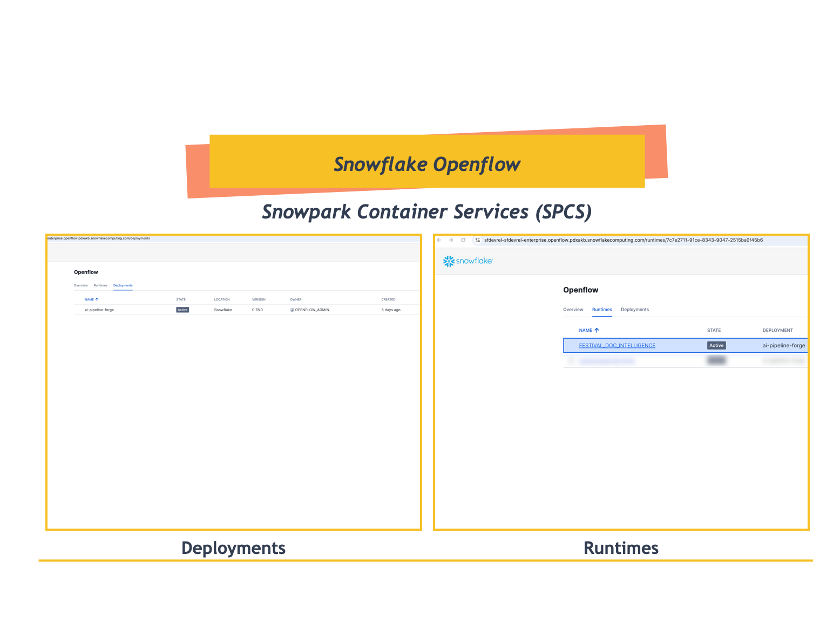

**Key Benefits**:

- **Managed Infrastructure**: Fully managed container runtime environment
- **Pre-built Connectors**: Ready-to-use connectors for popular data sources
- **Scalable Processing**: Automatic scaling based on data volume and processing needs
- **Security**: Built-in security and governance features

Learn more about [Openflow](https://docs.snowflake.com/en/user-guide/data-integration/openflow/about).

### What is Snowflake Intelligence

Snowflake Intelligence is an integrated AI capability that enables natural language interactions with your data. It combines large language models with your business context to provide intelligent search, analysis, and insights.

**Core Components**:

- **Cortex Search**: Semantic search across structured and unstructured data
- **AI Agents**: Natural language interfaces for business intelligence
- **Context Awareness**: Understanding of your data schema and business domain

This quickstart will focus on:

- Creating Cortex Search services for document content and metadata
- Building AI agents that can answer questions about your documents
- Enabling natural language queries across various document types

### What You Will Learn

- How to set up Openflow for unstructured data processing
- How to configure Google Drive connector for document ingestion
- How to process multiple document formats (PDF, DOCX, PPTX, images)
- How to create Cortex Search services for semantic search
- How to build Snowflake Intelligence agents for natural language querying
- How to analyze business documents for strategic insights

### What You Will Build

- An automated document ingestion pipeline from Google Drive
- A searchable knowledge base of business documents
- An AI-powered assistant for document analysis and insights

### Prerequisites

Before starting, ensure you have:

- **Snowflake Account**: Enterprise account with Openflow enabled (AWS or Azure Commercial Regions)
- **Account Permissions**: ACCOUNTADMIN role or equivalent for initial setup
- **Cortex Services**: Cortex Search and Snowflake Intelligence enabled in your account
- **Google Workspace**: Admin access to create and configure service accounts
- **Google Service Account (GSA)**: JSON key file with domain-wide delegation configured

> aside positive
> IMPORTANT:
>
> **Google Service Account Setup**: You'll need to create a Google Service Account (GSA) with appropriate permissions. Follow the official Google Cloud documentation to:
>
> 1. Create a Service Account in Google Cloud Console
> 2. Download the JSON key file
> 3. Enable domain-wide delegation for the service account
> 4. Grant necessary Google Drive API scopes
>
> For detailed instructions, see: [Creating and managing service accounts](https://cloud.google.com/iam/docs/service-accounts-create)
>
> **Required Google Drive API Scopes**:
>
> - `https://www.googleapis.com/auth/drive.readonly`
> - `https://www.googleapis.com/auth/drive.metadata.readonly`

<!-- ------------------------ -->
## Setup Environment

Duration: 10

### Create Database and Schema

Log into [Snowsight](https://docs.snowflake.com/en/user-guide/ui-snowsight.html#) using your credentials to create the necessary database objects.

> aside positive
> IMPORTANT:
>
> - If you use different names for objects created in this section, be sure to update scripts and configurations in the following sections accordingly.
>
> - For each SQL script block below, select all the statements in the block and execute them top to bottom.

In a new SQL worksheet, run the following SQL commands to create the [warehouse](https://docs.snowflake.com/en/sql-reference/sql/create-warehouse.html), [database](https://docs.snowflake.com/en/sql-reference/sql/create-database.html), [schema](https://docs.snowflake.com/en/sql-reference/sql/create-schema.html), and [role](https://docs.snowflake.com/en/sql-reference/sql/create-role.html).

```sql
-- Create role and warehouse
USE ROLE ACCOUNTADMIN;
CREATE ROLE IF NOT EXISTS FESTIVAL_DEMO_ROLE;
CREATE WAREHOUSE IF NOT EXISTS FESTIVAL_DEMO_S
  WAREHOUSE_SIZE = MEDIUM
  AUTO_SUSPEND = 300
  AUTO_RESUME = TRUE;
GRANT USAGE ON WAREHOUSE FESTIVAL_DEMO_S TO ROLE FESTIVAL_DEMO_ROLE;

-- Create database and grant ownership
CREATE DATABASE IF NOT EXISTS OPENFLOW_FESTIVAL_DEMO;
GRANT OWNERSHIP ON DATABASE OPENFLOW_FESTIVAL_DEMO TO ROLE FESTIVAL_DEMO_ROLE;

-- Grant role to current user
GRANT ROLE FESTIVAL_DEMO_ROLE TO ROLE IDENTIFIER(CURRENT_USER());

-- Switch to demo role and create schema
USE ROLE FESTIVAL_DEMO_ROLE;
USE DATABASE OPENFLOW_FESTIVAL_DEMO;
CREATE SCHEMA IF NOT EXISTS FESTIVAL_OPS;
```

> aside positive
> TIP: These commands are also available in `sql/setup.sql` in the repository for easy execution.

### Enable Required Services (Optional)

Cortex Search and Snowflake Intelligence are available by default in most regions.

> aside positive
> NOTE: If your Snowflake account is in **`us-west-2`**, Cortex services are already available and this step can be skipped.

**For accounts in other regions**, you may need to enable cross-region Cortex access:

```sql
-- Check current Cortex cross-region setting (requires ORGADMIN role)
SHOW PARAMETERS LIKE 'CORTEX_ENABLED_CROSS_REGION' IN ACCOUNT;

-- Enable cross-region Cortex access if needed (requires ORGADMIN role)
-- This allows your account to use Cortex services from us-west-2
ALTER ACCOUNT SET CORTEX_ENABLED_CROSS_REGION = 'AWS_US';

-- Verify the setting was applied
SHOW PARAMETERS LIKE 'CORTEX_ENABLED_CROSS_REGION' IN ACCOUNT;
```

> aside positive
> TIP: Contact your Snowflake administrator if you need assistance with ORGADMIN privileges or Cortex enablement.

### Setup External Access Integration

Configure external access for Google APIs to allow Openflow to connect to Google Drive.

First, create a schema for network configuration (or use an existing one):

```sql
-- Create schema for network rules
USE ROLE ACCOUNTADMIN;
USE DATABASE OPENFLOW_FESTIVAL_DEMO;
CREATE SCHEMA IF NOT EXISTS NETWORKS;
```

Now create the network rules and external access integration:

```sql
-- Create network rule for Google APIs
CREATE OR REPLACE NETWORK RULE google_network_rule
  MODE = EGRESS
  TYPE = HOST_PORT
  VALUE_LIST = (
    'admin.googleapis.com',
    'oauth2.googleapis.com',
    'www.googleapis.com',
    'google.com'
  );

-- Verify the network rule was created successfully
DESC NETWORK RULE google_network_rule;
```

#### Optional: Add network rule for your Google Workspace domain

If you need to access resources from your specific Google Workspace domain, create an additional network rule:

```sql
-- Create network rule for your Google Workspace domain
-- Replace 'your-domain.com' with your actual Google Workspace domain
CREATE OR REPLACE NETWORK RULE your_workspace_domain_network_rule
  MODE = EGRESS
  TYPE = HOST_PORT
  VALUE_LIST = ('your-domain.com');

-- Example: For a domain like kamesh.dev
-- CREATE OR REPLACE NETWORK RULE kameshs_dev_network_rule
--   MODE = EGRESS
--   TYPE = HOST_PORT
--   VALUE_LIST = ('kameshs.dev');

-- Verify the domain network rule was created successfully
DESC NETWORK RULE your_workspace_domain_network_rule;
```

#### Create the External Access Integration

Now combine the network rules into an external access integration:

```sql
-- Create external access integration with Google API access
-- If you created a workspace domain rule, add it to ALLOWED_NETWORK_RULES
CREATE OR REPLACE EXTERNAL ACCESS INTEGRATION festival_ops_access_integration
  ALLOWED_NETWORK_RULES = (
    OPENFLOW_FESTIVAL_DEMO.NETWORKS.google_network_rule
    -- Add your workspace domain rule if created:
    -- , OPENFLOW_FESTIVAL_DEMO.NETWORKS.your_workspace_domain_network_rule
  )
  ENABLED = TRUE
  COMMENT = 'Used for Openflow SPCS runtime to access Google Drive';

-- Verify the external access integration was created with correct settings
DESC EXTERNAL ACCESS INTEGRATION festival_ops_access_integration;
```

> aside positive
> TIP: If you created a workspace domain network rule, uncomment and add it to the `ALLOWED_NETWORK_RULES` list in the external access integration.

### Grant Permissions

Grant necessary permissions to the Openflow admin role:

```sql
-- Grant access to the external access integration
GRANT USAGE ON DATABASE OPENFLOW_FESTIVAL_DEMO TO ROLE OPENFLOW_ADMIN;
GRANT USAGE ON SCHEMA OPENFLOW_FESTIVAL_DEMO.NETWORKS TO ROLE OPENFLOW_ADMIN;
GRANT USAGE ON INTEGRATION festival_ops_access_integration TO ROLE OPENFLOW_ADMIN;

-- Verify grants
SHOW GRANTS TO ROLE OPENFLOW_ADMIN;
```

> aside positive
> NOTE:
>
> - The `OPENFLOW_ADMIN` role is created automatically during Openflow SPCS deployment setup
> - **No compute pools needed** - Openflow SPCS manages compute resources automatically  
> - **No manual stages or tables** - All document storage objects are automatically created by the Openflow connector
> - SQL snippets available in `sql/network.sql` in the repository

> aside positive
> IMPORTANT: Make note of the database, schema, and warehouse names as you'll need them for Openflow configuration.

<!-- ------------------------ -->
## Openflow Configuration

Duration: 15

> aside positive
> IMPORTANT: Before configuring connectors, ensure you have completed the **Openflow SPCS deployment setup**.
>
> Follow the official Snowflake documentation for detailed setup instructions:
> [Set up Openflow - Snowflake Deployment](https://docs.snowflake.com/en/user-guide/data-integration/openflow/setup-openflow-spcs)
>
> This includes:
>
> 1. **Setup core Snowflake** - Configure admin role, privileges, and network
> 2. **Create deployment** - Set up Openflow SPCS deployment with optional event table
> 3. **Create runtime role** - Configure role with external access integrations
> 4. **Create runtime** - Associated with the runtime role

### Access Openflow

1. In Snowsight, navigate to **Work with data** > **Ingestion** > **Openflow**
2. Access your existing Openflow deployment and runtime

### Configure Runtime for Festival Operations


Create or select your runtime with these settings:

- **Runtime Name**: `FESTIVAL_DOC_INTELLIGENCE`
- **External Access Integration**: `festival_ops_access_integration` (created in previous step)

> aside positive
> NOTE:
>
> - Openflow SPCS automatically manages compute resources. No manual compute pool configuration is required.
> - Database and schema configuration will be specified at the connector level when setting up the Google Drive connector.

### Add Google Drive Connector

Once the runtime is active, add the Google Drive connector (Overview tab in Openflow Home page):

1. Click **Add Connector** in your runtime
2. Search for "Google Drive" in the connector marketplace
3. Select the **Google Drive** connector

   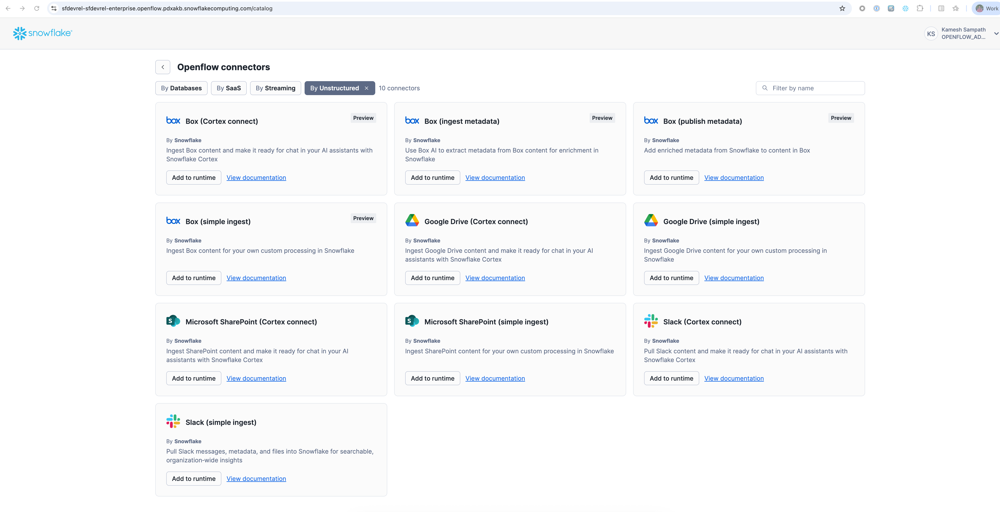

4. Click **Add to Runtime**

   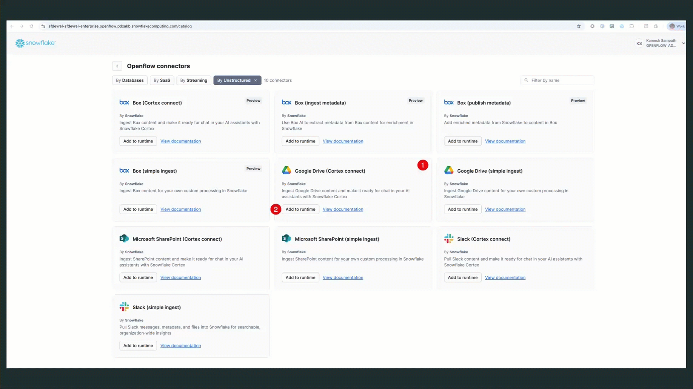

The connector will be automatically added to your canvas:

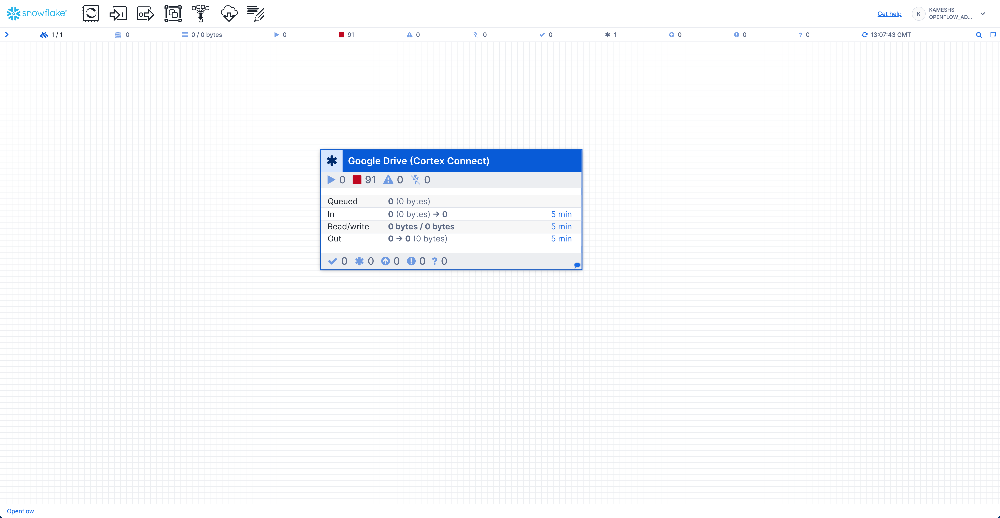

<!-- ------------------------ -->
## Configure Document Ingestion Pipeline

Duration: 10

Now configure the Google Drive connector with the following parameters:

### Configure Source Parameters

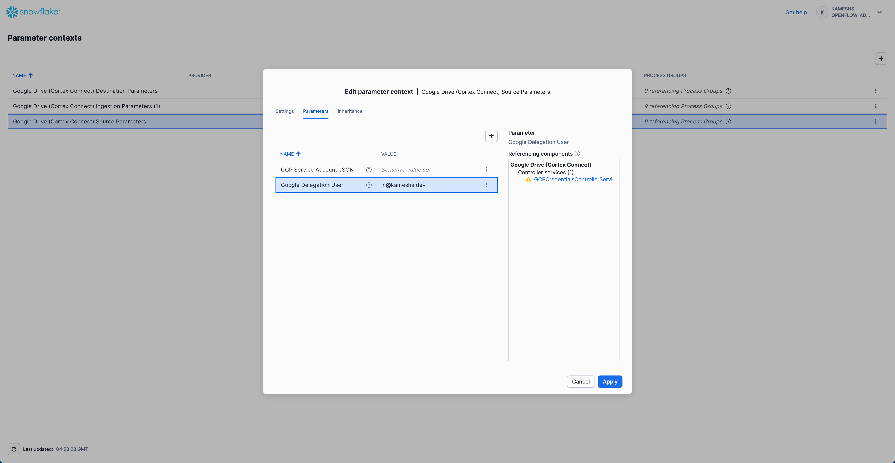

- **GCP Service Account JSON**: Upload your Google Service Account JSON key file
- **Google Delegation User**: `hi@kameshs.dev` (your Google Workspace user with drive access)

### Configure Destination Parameters

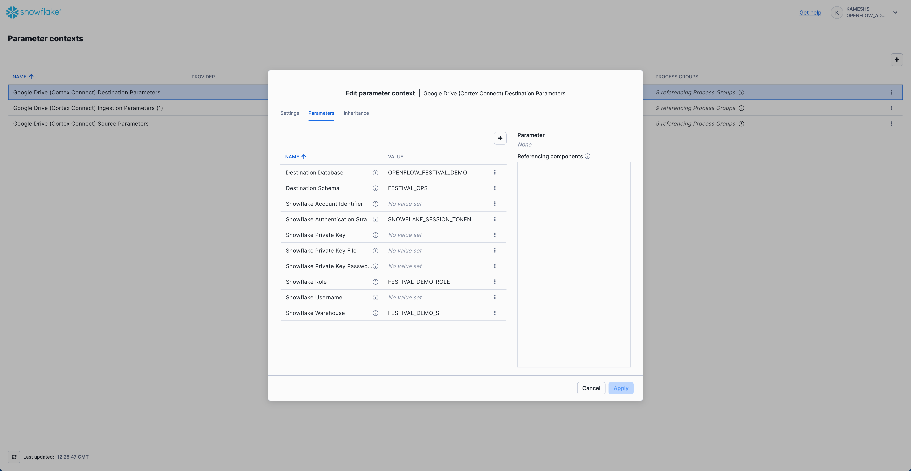

- **Destination Database**: `OPENFLOW_FESTIVAL_DEMO`
- **Destination Schema**: `FESTIVAL_OPS`
- **Snowflake Role**: `FESTIVAL_DEMO_ROLE`
- **Snowflake Warehouse**: `FESTIVAL_DEMO_S`
- **Snowflake Authentication Strategy**: `SNOWFLAKE_SESSION_TOKEN`

### Configure Ingestion Parameters

> aside positive
> NOTE: This section inherits parameters from "Configure Source Parameters" and "Configure Destination Parameters" sections above. Look for the downward arrow icon (↓) in the UI to identify inherited parameters.

Navigate to Parameter Contexts from Runtime Canvas:


Configure the Ingestion Parameters:

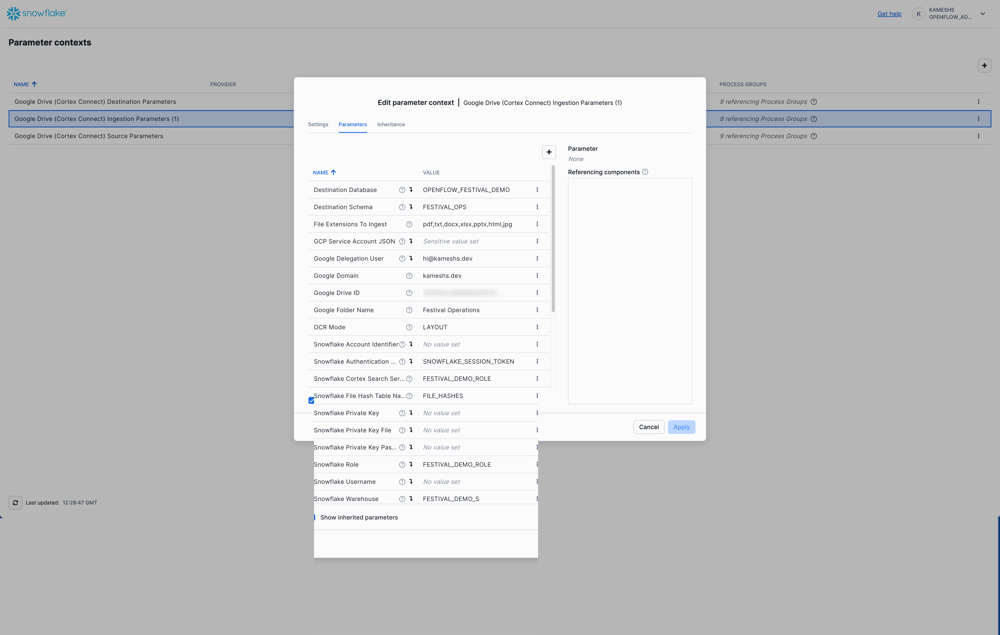

- **Google Folder Name**: `Festival Operations` (The folder path in your Google Shared Drive)
- **Google Domain**: `[YOUR WORKSPACE DOMAIN]`
- **Google Drive ID**: `[Your shared drive ID]`
- **GCP Service Account JSON**: Upload your Google Service Account JSON key file
- **Google Delegation User**: `[Your Google Workspace user with drive access]`
- **File Extensions To Ingest**: `pdf,txt,docx,xlsx,pptx,html,jpg`
- **OCR Mode**: `LAYOUT` (preserves document structure during text extraction)
- **Snowflake Cortex Search Service Role**: `FESTIVAL_DEMO_ROLE`

### Test and Run the Pipeline

After configuring all parameters, you need to enable and start the pipeline by right-clicking on the canvas:

1. Enable Controller Services: Right-click on the canvas and select **Enable all controller services**

   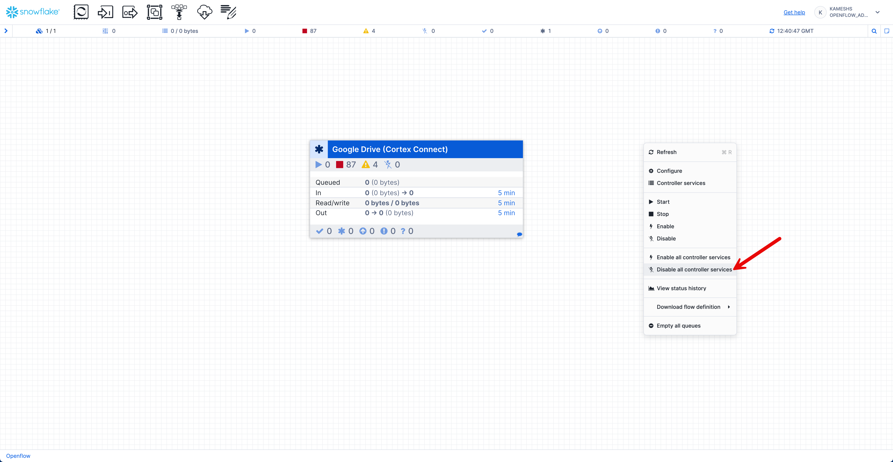

2. Start the Connector: Right-click on the canvas and select **Start** to begin the connector and all processors

   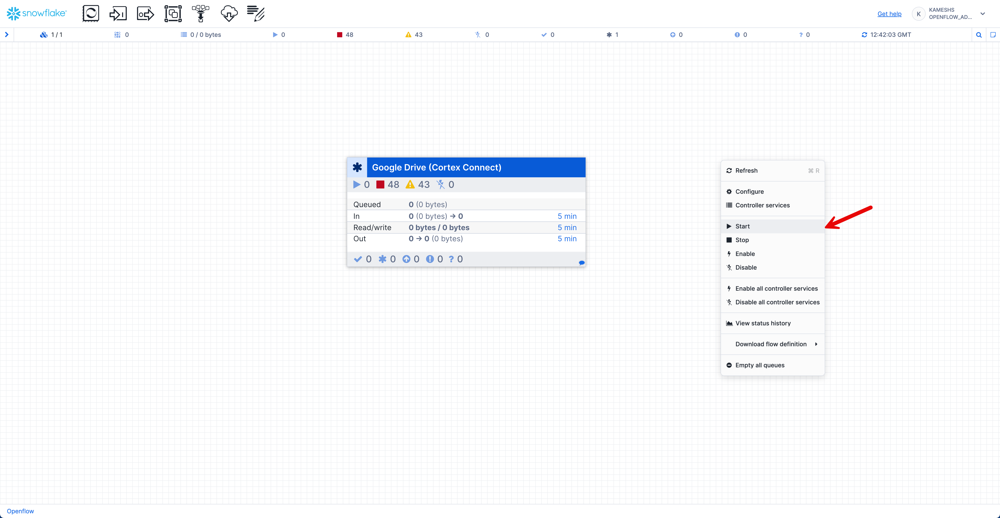

Once started, you should see the connector running with active processors:

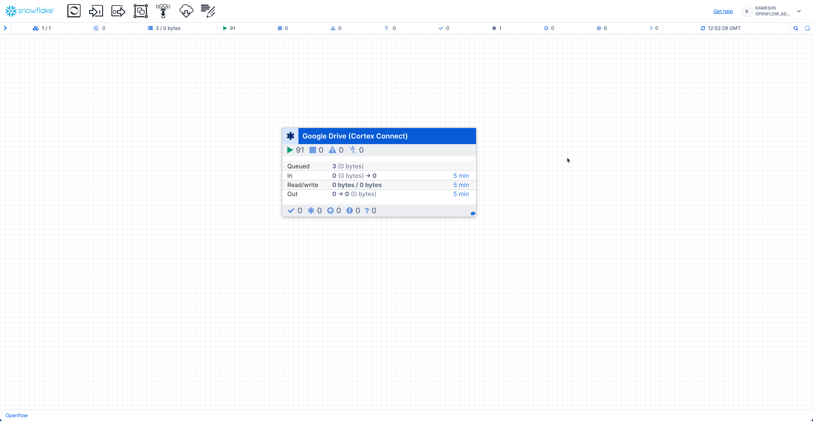

The pipeline will now:

- Connect to your Google Drive
- Scan for documents in the specified folder
- Extract content from various file formats
- Store documents and metadata in Snowflake tables
- Automatically create the Cortex Search service

<!-- ------------------------ -->
## Prepare Sample Documents

Duration: 5

Before running the pipeline, you need to prepare the Festival Operations sample documents in your Google Drive.

### Verify Document Collection

The repository includes **15 business documents** across multiple formats in the `sample-data/google-drive-docs/` directory:

```
sample-data/google-drive-docs/
├── Analysis/
│   └── Post-Event-Analysis-Summer-2024.pptx
├── Compliance/
│   └── Health-Safety-Policy.pdf
├── Executive Meetings/
│   └── Board-Meeting-Minutes-Q4-2024.docx
├── Financial Reports/
│   └── Q3-2024-Financial-Analysis.pdf
├── Operations/
│   ├── Venue-Setup-Operations-Manual-0.jpg
│   ├── Venue-Setup-Operations-Manual-1.jpg
│   ├── Venue-Setup-Operations-Manual-2.jpg
│   └── Venue-Setup-Operations-Manual-3.jpg
├── Projects/
│   └── Sound-System-Modernization-Project-Charter.docx
├── Strategic Planning/
│   ├── 2025-Festival-Expansion-Strategy-0.jpg
│   ├── 2025-Festival-Expansion-Strategy-1.jpg
│   ├── 2025-Festival-Expansion-Strategy-2.jpg
│   ├── 2025-Festival-Expansion-Strategy-3.jpg
│   └── 2025-Festival-Expansion-Strategy-4.jpg
├── Training/
│   └── Customer-Service-Training-Guide.pptx
└── Vendors/
    └── Audio-Equipment-Service-Agreement.pdf
```

**Document Formats**: PDF, DOCX, PPTX, JPG - demonstrating true multi-format document intelligence

> aside positive
> NOTE: The `.md` files in the repository are source templates. The demo uses the converted formats shown above.

### Google Drive Setup

Create a Google Shared Drive and upload the sample documents:

1. **Create Shared Drive**: In Google Drive web interface, create a new shared drive. This will be used as your **Google Drive ID** in the connector configuration.

2. **Create Festival Operations Folder**: Inside the shared drive, create a folder named "Festival Operations". This will be used as your **Google Folder Name** in the connector configuration.

3. **Create Folder Structure**: Inside the "Festival Operations" folder, create these subfolders matching the `sample-data/google-drive-docs/` structure:
   - Strategic Planning/
   - Operations/
   - Compliance/
   - Training/
   - Analysis/
   - Executive Meetings/
   - Financial Reports/
   - Projects/
   - Vendors/

4. **Upload Documents**: Drag and drop files from your local `sample-data/google-drive-docs/` directory into the corresponding folders

> aside positive
> TIP: Maintain the same folder structure in Google Drive as in `sample-data/google-drive-docs/` to organize documents by category. The connector's **Recursive** mode will scan all subfolders automatically.

### Verify Document Upload

After uploading, verify your Google Drive "Festival Operations" folder contains all 15 documents across multiple formats:

| Folder | Document | Format |
|--------|----------|--------|
| Strategic Planning | 2025-Festival-Expansion-Strategy (5 images) | JPG |
| Operations | Venue-Setup-Operations-Manual (4 images) | JPG |
| Projects | Sound-System-Modernization-Project-Charter | DOCX |
| Financial Reports | Q3-2024-Financial-Analysis | PDF |
| Compliance | Health-Safety-Policy | PDF |
| Vendors | Audio-Equipment-Service-Agreement | PDF |
| Analysis | Post-Event-Analysis-Summer-2024 | PPTX |
| Training | Customer-Service-Training-Guide | PPTX |

**Format Summary:**

- **9 JPG files** - Image-based documents (scanned expansion strategy and operations manual)
- **3 PDF files** - Financial analysis, policies, and vendor agreements
- **1 DOCX file** - Meeting minutes or project charter
- **2 PPTX files** - Analysis presentations and training materials
- **Total: 15 documents** demonstrating multi-format document intelligence

### Monitor Pipeline Execution

Once the Google Drive Connector starts, you can monitor the pipeline execution directly from the canvas. The processor group displays real-time statistics:

- **Queued** - Documents waiting to be processed (shows count and byte size)
- **In** - Documents currently being received from Google Drive
- **Read/Write** - Documents being read from or written to Snowflake stages and tables
- **Out** - Documents successfully processed and moved to the next stage


The animation demonstrates:

1. **Hover over the processor group** to see a detailed statistics tooltip with real-time metrics
2. **Click on the "Google Drive (Cortex Connect)" processor group** to drill down into the pipeline components
3. **View individual processors** including:
   - Google Drive source connector pulling documents
   - Document transformation processors
   - Snowflake destination processors writing to tables
   - Controller services managing the flow
4. **Navigate back to the canvas** to see the overall pipeline health
5. **Monitor byte throughput** for each stage (In, Read/Write, Out) shown in the statistics panel

> aside positive
> NOTE: Pipeline statistics automatically reset every 5 minutes, providing a rolling view of recent activity.

<!-- ------------------------ -->
## Data Pipeline Results

Duration: 5

### Verify Document Ingestion

Check that documents have been successfully ingested using the verification queries:

```sql
-- Switch to the correct role and database
USE ROLE FESTIVAL_DEMO_ROLE;
USE WAREHOUSE FESTIVAL_DEMO_S;
USE DATABASE OPENFLOW_FESTIVAL_DEMO;
USE SCHEMA FESTIVAL_OPS;

-- Show all tables created by Openflow connector
SHOW TABLES;

-- Show all stages created by Openflow connector
SHOW STAGES;
```

### Check Auto-Created Tables

The Openflow connector automatically creates several tables for document management:

```sql
-- Describe the auto-created tables
DESC TABLE docs_chunks;      -- Document content chunks
DESC TABLE docs_groups;      -- Document groupings
DESC TABLE docs_perms;       -- Document permissions
DESC TABLE doc_group_perms;  -- Group permissions
DESC TABLE file_hashes;      -- File tracking and metadata
DESC TABLE perms_groups;     -- Permission groups

-- View file tracking information
SELECT * FROM file_hashes;
```

### Explore Document Content

Query the document chunks to see ingested content:

```sql
-- View document chunks
SELECT * FROM docs_chunks LIMIT 10;

-- Get distinct document IDs and filenames
SELECT DISTINCT 
    METADATA:id::string as id, 
    METADATA:fullName::string as filename 
FROM docs_chunks;

-- Check specific document categories
SELECT COUNT(DOC_ID) 
FROM file_hashes 
WHERE LOWER(DOC_ID) LIKE '%strategy%';
```

### Comprehensive Document Verification

Verify all documents are ingested across demo categories:

```sql
-- Comprehensive document verification by demo category
SELECT 
    COUNT(*) as total_docs,

    -- Strategic Planning Documents (Expected: 7)
    COUNT(CASE WHEN 
        LOWER(DOC_ID) LIKE '%strategy%' OR 
        LOWER(DOC_ID) LIKE '%board%meeting%' OR 
        LOWER(DOC_ID) LIKE '%meeting%minutes%' OR
        LOWER(DOC_ID) LIKE '%financial%analysis%' OR
        LOWER(DOC_ID) LIKE '%q3%2024%financial%'
    THEN 1 END) as strategic_docs,

    -- Operations Excellence Documents (Expected: 5)
    COUNT(CASE WHEN 
        (LOWER(DOC_ID) LIKE '%operation%manual%' OR LOWER(DOC_ID) LIKE '%venue%setup%') OR
        (LOWER(DOC_ID) LIKE '%sound%system%' AND LOWER(DOC_ID) LIKE '%project%') OR
        (LOWER(DOC_ID) LIKE '%post%event%analysis%')
    THEN 1 END) as operations_docs,

    -- Compliance & Risk Documents (Expected: 3)
    COUNT(CASE WHEN 
        (LOWER(DOC_ID) LIKE '%health%safety%' OR LOWER(DOC_ID) LIKE '%safety%policy%') OR
        (LOWER(DOC_ID) LIKE '%service%agreement%' OR LOWER(DOC_ID) LIKE '%audio%equipment%') OR
        (LOWER(DOC_ID) LIKE '%post%event%analysis%')
    THEN 1 END) as compliance_docs,

    -- Knowledge Management Documents (Expected: 1)
    COUNT(CASE WHEN 
        LOWER(DOC_ID) LIKE '%training%guide%' OR 
        LOWER(DOC_ID) LIKE '%customer%service%training%'
    THEN 1 END) as training_docs,

    -- Document format breakdown
    COUNT(CASE WHEN LOWER(DOC_ID) LIKE '%.jpg' THEN 1 END) as jpg_files,
    COUNT(CASE WHEN LOWER(DOC_ID) LIKE '%.pdf' THEN 1 END) as pdf_files,
    COUNT(CASE WHEN LOWER(DOC_ID) LIKE '%.docx' THEN 1 END) as docx_files,
    COUNT(CASE WHEN LOWER(DOC_ID) LIKE '%.pptx' THEN 1 END) as pptx_files

FROM file_hashes;
```

**Expected Results:**

| TOTAL_DOCS | STRATEGIC_DOCS | OPERATIONS_DOCS | COMPLIANCE_DOCS | TRAINING_DOCS | JPG_FILES | PDF_FILES | DOCX_FILES | PPTX_FILES |
|------------|----------------|-----------------|-----------------|---------------|-----------|-----------|------------|------------|
| 15 | 7 | 5 | 3 | 1 | 9 | 3 | 1 | 2 |

### Check Document Stage

Verify the documents stage created by the connector:

```sql
-- List files in the documents stage
LS @documents;
```

> aside positive
> TIP: All verification queries are available in `sql/checks.sql` in the repository for easy execution.

### Expected Document Collection

The pipeline should have ingested the Festival Operations business document collection:

**Document Categories:**

- **Strategic Planning**: 2025 expansion strategies, board meeting minutes, Q3 2024 financial analysis
- **Operations Excellence**: Sound system modernization project ($2.8M), venue setup procedures, post-event analysis
- **Compliance & Risk**: Health and safety policies, vendor service agreements
- **Knowledge Management**: Customer service training materials, staff development programs

**Document Formats:**

- **PDF**: 3 documents (policies, financial reports, contracts)
- **DOCX**: 1 document (meeting minutes or project charter)
- **PPTX**: 2 documents (training presentations, analysis reports)
- **JPG**: 9 documents (strategic overviews, operational guides - exported from presentations)

**Total**: 15 business documents demonstrating multi-format document intelligence

> aside positive
> NOTE: All document counts and content are based on the Festival Operations demo dataset from `sample-data/google-drive-docs/`.

<!-- ------------------------ -->
## Cortex Search Setup

Duration: 5

### Automatic Cortex Search Service Creation

**Great news!** The Cortex Search service is **automatically created** by the Openflow Google Drive connector. No manual SQL required!

#### How It Works

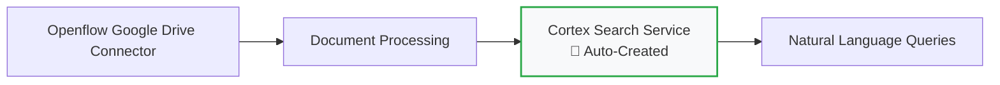

**Automatic Features:**

- ✅ **Arctic Embeddings**: Automatically configured with `snowflake-arctic-embed-m-v1.5`
- ✅ **Document Indexing**: All processed documents automatically indexed  
- ✅ **Semantic Search**: Ready for natural language queries immediately
- ✅ **Metadata Integration**: Document properties, authors, and collaboration data included

#### Verify Automatic Service Creation

```sql
-- Check for the auto-created service
SHOW CORTEX SEARCH SERVICES;

-- The service will be named: CORTEX_SEARCH_SERVICE (default name)
DESC CORTEX SEARCH SERVICE CORTEX_SEARCH_SERVICE;
```

### Test Semantic Search

Test the automatically created search service with Festival Operations queries:

```sql
-- Search for strategic planning documents
SELECT PARSE_JSON(
  SNOWFLAKE.CORTEX.SEARCH_PREVIEW(
      'CORTEX_SEARCH_SERVICE',
      '{"query": "2025 expansion plans target markets strategic planning", "limit": 5}'
  )
)['results'] as strategic_documents;

-- Search for technology modernization projects  
SELECT PARSE_JSON(
  SNOWFLAKE.CORTEX.SEARCH_PREVIEW(
      'CORTEX_SEARCH_SERVICE',
      '{"query": "technology modernization sound system upgrade budget 2.8M", "limit": 5}'
  )
)['results'] as technology_projects;

-- Search for health and safety policies
SELECT PARSE_JSON(
  SNOWFLAKE.CORTEX.SEARCH_PREVIEW(
      'CORTEX_SEARCH_SERVICE',
      '{"query": "health safety policies emergency protocols compliance", "limit": 5}'
  )
)['results'] as safety_policies;
```

### Additional Search Capabilities

The auto-created service includes both content and metadata search capabilities. You can search across:

- **Document content**: Full text search with semantic understanding
- **Metadata**: File names, authors, creation dates, document types
- **Multi-format support**: PDF, DOCX, PPTX, JPG documents

### Sample Questions by Category

Based on the Festival Operations dataset, here are sample questions organized by business function:

#### Strategic Planning & Executive Intelligence

```
What are our 2025 expansion plans and target markets?
```

```
Show me all financial analysis and revenue projections
```

```
What decisions were made in the latest board meeting?
```

```
Find all budget allocations and investment strategies
```

#### Operations Excellence & Technology

```
Find all technology modernization projects and their budgets
```

```
What is our $2.8M sound system upgrade timeline?
```

```
Show me all equipment management protocols
```

```
What post-event analysis recommendations exist?
```

#### Compliance & Risk Management

```
What health and safety policies are currently in effect?
```

```
Show me all vendor contracts and service agreements
```

```
Find emergency response procedures
```

```
What regulatory compliance requirements exist?
```

#### Knowledge Management & Training

```
Find all training materials and staff development programs
```

```
What customer service standards are documented?
```

```
Show me onboarding procedures for new staff
```

```
What training frameworks are currently in use?
```

#### Advanced Cross-Category Queries

```
What are our 2025 expansion plans across all document formats - show me visual charts, meeting decisions, and financial projections
```

```
Find all technology modernization projects with their business cases, budgets, and visual diagrams
```

```
What health and safety policies are in effect across all formats - show me formal policies, vendor agreements, and visual guides
```

> aside positive
> TIP: These sample questions are designed specifically for the Festival Operations dataset. Use them as templates and adapt the language to match your organization's terminology and business context.

<!-- ------------------------ -->
## Snowflake Intelligence

Duration: 15

Snowflake Intelligence enables you to create AI agents that can query and analyze your unstructured data using natural language. This section shows how to connect Snowflake Intelligence to the Cortex Search service created by your Openflow pipeline.

> aside positive
> IMPORTANT: All queries from Snowflake Intelligence use the user's credentials. Role-based access control and data-masking policies automatically apply to all agent interactions.

### Prerequisites

Before setting up Snowflake Intelligence, ensure you have:

- ✅ Completed Openflow pipeline setup with documents ingested
- ✅ Appropriate Snowflake privileges (`CREATE AGENT` privilege)
- ✅ Default role and warehouse set in your Snowflake user profile

### Initial Setup

Create the required database and schema structure:

```sql
-- Create database for Snowflake Intelligence
CREATE DATABASE IF NOT EXISTS snowflake_intelligence;
GRANT USAGE ON DATABASE snowflake_intelligence TO ROLE PUBLIC;

-- Create agents schema
CREATE SCHEMA IF NOT EXISTS snowflake_intelligence.agents;
GRANT USAGE ON SCHEMA snowflake_intelligence.agents TO ROLE PUBLIC;

-- Grant agent creation privileges to your role
GRANT CREATE AGENT ON SCHEMA snowflake_intelligence.agents TO ROLE FESTIVAL_DEMO_ROLE;
```

Verify your Cortex Search service is available:

```sql
-- Connect to your demo database
USE DATABASE OPENFLOW_FESTIVAL_DEMO;
USE SCHEMA FESTIVAL_OPS;

-- Verify your Cortex Search service exists
SHOW CORTEX SEARCH SERVICES IN SCHEMA FESTIVAL_OPS;

-- Test the search service
SELECT SNOWFLAKE.CORTEX.SEARCH(
    'CORTEX_SEARCH_SERVICE',
    'expansion strategy AND market analysis'
) as search_results;
```

### Create the Agent

#### Access Agent Creation Interface

1. Sign in to Snowsight
2. Navigate directly to Agents: [Create Snowflake Intelligence Agent](https://app.snowflake.com/_deeplink/#/agents/)
3. Select **"Create agent"**

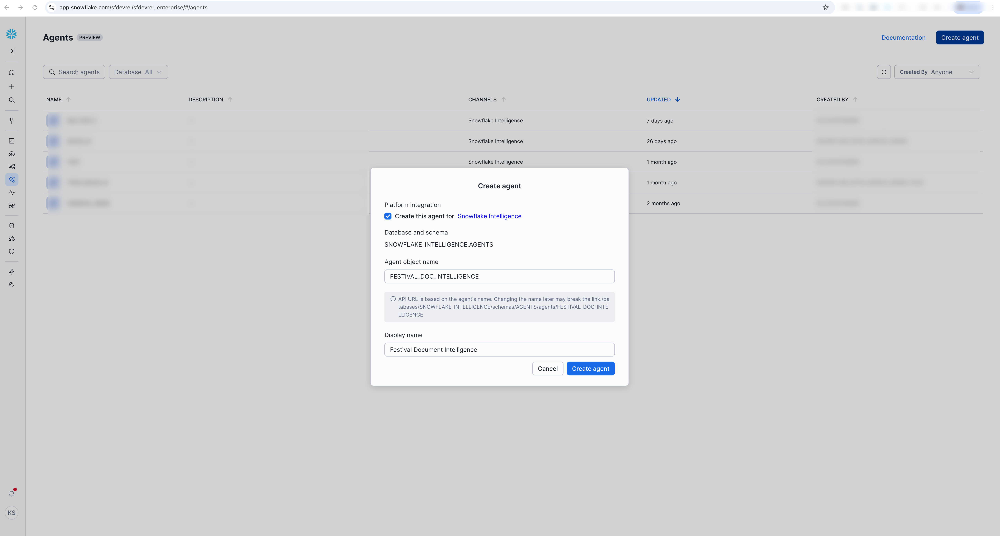

**Platform Integration:**

- ☑️ Select **"Create this agent for Snowflake Intelligence"**

#### Configure Agent Basics

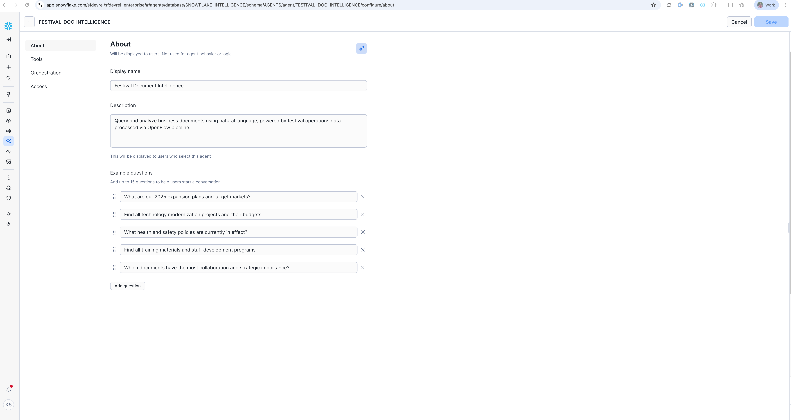

**Agent Details:**

- **Agent object name:** `FESTIVAL_DOC_INTELLIGENCE`
- **Display name:** `Festival Document Intelligence`
- **Description:** `Query and analyze business documents using natural language, powered by festival operations data processed via Openflow pipeline.`

**Example Questions** (Add these to help users get started):

```
What are our 2025 expansion plans and target markets?
```

```
Find all technology modernization projects and their budgets
```

```
What health and safety policies are currently in effect?
```

```
Find all training materials and staff development programs
```

```
Which documents have the most collaboration and strategic importance?
```

### Configure Agent Tools

#### Add Cortex Search Service

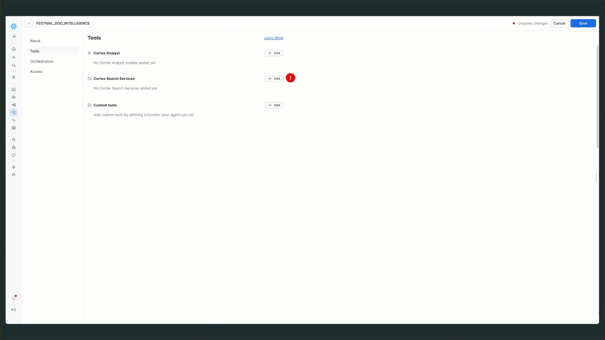

1. Navigate to **"Tools"** tab
2. Find **"Cortex Search Services"** section
3. Click **"+ Add"** button

**Configure the Search Service:**

- **Name:** `FESTIVAL_OPS_INTELLIGENCE`
- **Search Service:** `OPENFLOW_FESTIVAL_DEMO.FESTIVAL_OPS.CORTEX_SEARCH_SERVICE`
- **Description:** `Query and analyze business documents using natural language, powered by festival operations data processed via Openflow pipeline.`

> aside positive
> TIP: The search service name follows the pattern: `<DATABASE>.<SCHEMA>.<SERVICE_NAME>`

### Configure Orchestration

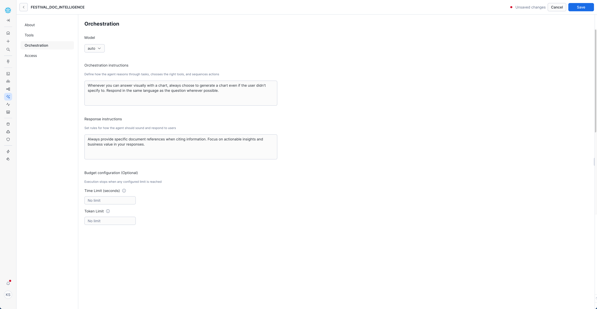

1. Navigate to **"Orchestration"** tab
2. Set **Model:** `auto` (recommended - lets Snowflake choose the optimal model)

**Orchestration Instructions:**

```
Whenever you can answer visually with a chart, always choose to generate a chart even if the user didn't specify to. Respond in the same language as the question wherever possible.
```

**Response Instructions:** (Optional)

```
Always provide specific document references when citing information. 
Focus on actionable insights and business value in your responses.
```

> aside positive
> TIP: Use `auto` (default) to let Snowflake automatically select the best available model for your region and query type. Supported models include Claude 4.0, Claude 3.7, Claude 3.5, and GPT 4.1.

### Set Access Controls

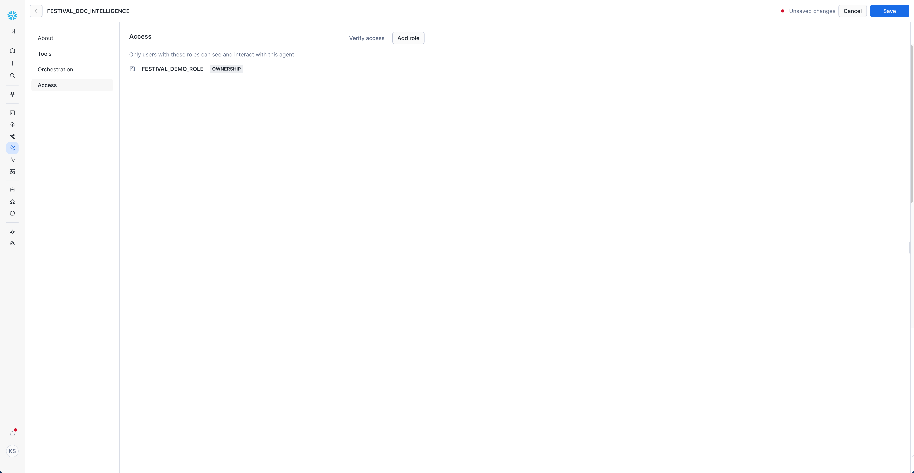

1. Navigate to **"Access"** tab
2. Click **"Add role"**
3. Select appropriate roles for your organization

**Example Role Configuration:**

- **Role:** `FESTIVAL_DEMO_ROLE`
- **Permission:** `OWNERSHIP`

> aside positive
> NOTE: All queries use the user's credentials. Ensure users have appropriate access to the Cortex Search service, source database/schema, and underlying data.

### Test Your Agent

#### Getting Started with Queries

1. Access Snowflake Intelligence: [Open Snowflake Intelligence](https://ai.snowflake.com/)
2. Select your agent `FESTIVAL_DOC_INTELLIGENCE` from the dropdown
3. Choose the Cortex Search service as your data source

**Start with the Example Questions** you configured - these are specifically tailored to your festival operations data.

#### Sample Questions by Category

**Strategic Planning**:

```
What are our 2025 expansion plans and target markets?
```

```
What strategic initiatives are mentioned in board meeting minutes?
```

**Operations Excellence**:

```
Find all technology modernization projects and their budgets
```

```
What are the key takeaways from the post-event analysis?
```

**Compliance & Risk**:

```
What health and safety policies are currently in effect?
```

```
What are the terms and conditions in our vendor service agreements?
```

**Knowledge Management**:

```
Find all training materials and staff development programs
```

```
What customer service training resources are available?
```

<!-- ------------------------ -->
## Advanced Use Cases

Duration: 10

### Multi-Document Analysis

Use the agent for complex analysis across multiple documents:

```text
"Compare our Q3 2024 financial performance with the strategic goals outlined in our 2025 expansion plan. What gaps exist and what actions are recommended?"
```

This type of query demonstrates the agent's ability to:

- Search across different document types
- Perform comparative analysis
- Identify discrepancies and gaps
- Provide strategic recommendations

### Trend Analysis

Identify patterns and trends across time-based documents:

```text
"What trends do you see in customer complaints and incident reports over the past year? What preventive measures have been implemented?"
```

### Knowledge Discovery

Find hidden insights and connections:

```text
"What vendor performance issues are mentioned across different documents, and how do they relate to our operational challenges?"
```

### Executive Briefing

Generate comprehensive briefings:

```text
"Prepare an executive summary of key issues and decisions from our Q4 2024 board meeting, including action items and their current status based on other documents."
```

### Compliance Monitoring

Automated compliance checking:

```text
"Review all our safety policies and incident reports to identify any compliance gaps or policy updates needed."
```

### Create Custom Views

Create database views for common agent queries:

```sql
-- View for quick document summaries
CREATE VIEW document_summaries AS
SELECT 
    dm.document_id,
    dm.file_name,
    dm.author,
    dm.content_type,
    dm.created_date,
    SUBSTR(d.content, 1, 500) as summary,
    LENGTH(d.content) as content_length
FROM document_metadata dm
JOIN documents d ON dm.document_id = d.document_id;

-- View for recent documents
CREATE VIEW recent_documents AS
SELECT *
FROM document_summaries
WHERE created_date >= DATEADD(month, -6, CURRENT_DATE())
ORDER BY created_date DESC;
```

Grant the agent access to these views for more efficient querying.

### Performance Optimization

Monitor and optimize agent performance:

```sql
-- Check search service performance
SHOW CORTEX SEARCH SERVICES;

-- Analyze query patterns
SELECT 
    service_name,
    query_count,
    avg_latency_ms
FROM INFORMATION_SCHEMA.CORTEX_SEARCH_USAGE
WHERE service_name IN ('document_search', 'metadata_search')
ORDER BY query_count DESC;
```

> aside positive
> OPTIMIZATION TIP: Regularly update your Cortex Search services as new documents are added to maintain search relevance and performance.

<!-- ------------------------ -->
## Cleanup

Duration: 2

When you're finished with the demo, follow these steps to clean up resources.

### Stop the Google Drive Connector

1. Navigate to your Openflow runtime canvas
2. Right-click on the **Google Drive (Cortex Connect)** processor group
3. Select **Stop** to halt document ingestion
4. Wait for the connector to fully stop (status indicator turns red)

> aside positive
> TIP: Stopping the connector preserves your configuration while preventing further document processing and associated compute costs.

### Drop the Snowflake Intelligence Agent (Optional)

If you created an agent and no longer need it:

```sql
-- Switch to the Snowflake Intelligence database
USE DATABASE snowflake_intelligence;
USE SCHEMA agents;

-- Drop the agent
DROP AGENT IF EXISTS FESTIVAL_DOC_INTELLIGENCE;
```

### Drop the Demo Database (Optional)

To completely remove all data and resources:

```sql
-- Switch to ACCOUNTADMIN role
USE ROLE ACCOUNTADMIN;

-- Drop the entire demo database (includes all tables, stages, and search services)
DROP DATABASE IF EXISTS OPENFLOW_FESTIVAL_DEMO;

-- Drop the demo warehouse
DROP WAREHOUSE IF EXISTS FESTIVAL_DEMO_S;

-- Drop the demo role
DROP ROLE IF EXISTS FESTIVAL_DEMO_ROLE;
```

> aside negative
> WARNING: Dropping the database will permanently delete all ingested documents, Cortex Search services, and pipeline configurations. Only perform this if you no longer need the demo.

<!-- ------------------------ -->
## Conclusion And Resources

Duration: 2

Congratulations! You've successfully built an end-to-end unstructured data pipeline using Openflow and Snowflake Intelligence. You can now:

- Automatically ingest documents from Google Drive
- Search across business documents using natural language
- Get intelligent insights from your document collection
- Build AI-powered assistants for business intelligence

### What You Accomplished

- **Data Ingestion**: Set up automated document ingestion from Google Drive using Openflow
- **Content Processing**: Processed multiple document formats including PDF, DOCX, PPTX, and images
- **Semantic Search**: Created Cortex Search services for intelligent document discovery
- **AI Agents**: Built Snowflake Intelligence agents for natural language document analysis
- **Business Intelligence**: Enabled strategic insights from unstructured business content

### Key Benefits Realized

- **Unified Knowledge Base**: All business documents searchable from a single interface
- **Natural Language Access**: No need for complex queries or technical knowledge
- **Automated Processing**: New documents automatically available for search and analysis
- **Strategic Insights**: AI-powered analysis reveals patterns and opportunities
- **Compliance Support**: Easy access to policies, procedures, and regulatory documents

### Next Steps

1. **Expand Document Sources**: Add connectors for SharePoint, Slack, or other business systems
2. **Enhance Search**: Create specialized search services for different document categories
3. **Advanced Analytics**: Build dashboards and reports based on document insights
4. **Integration**: Connect with existing business intelligence and workflow tools
5. **Governance**: Implement document retention policies and access controls

### Related Resources

- [Source Code and Sample Data](https://github.com/Snowflake-Labs/sfguide-getting-started-openflow-unstructured-data-pipeline)
- [Openflow Documentation](https://docs.snowflake.com/en/user-guide/data-integration/openflow/about)
- [Openflow SPCS Setup Guide](https://docs.snowflake.com/en/user-guide/data-integration/openflow/setup-openflow-spcs)
- [Cortex Search Documentation](https://docs.snowflake.com/en/user-guide/snowflake-cortex/cortex-search/cortex-search-overview)
- [Snowflake Intelligence Documentation](https://docs.snowflake.com/en/user-guide/snowflake-cortex/snowflake-intelligence)
- [Snowpark Container Services](https://docs.snowflake.com/en/developer-guide/snowpark-container-services/overview)
- [External Access Integration](https://docs.snowflake.com/en/developer-guide/external-network-access/creating-using-external-network-access)

### Community and Support

- [Snowflake Community](https://community.snowflake.com/)
- [Openflow GitHub Repository](https://github.com/Snowflake-Labs/sfguide-getting-started-openflow-unstructured-data-pipeline)
- [Snowflake Support Portal](https://community.snowflake.com/s/)

We would love your feedback on this QuickStart Guide! Please submit your feedback using the GitHub issues link at the top of this guide.
