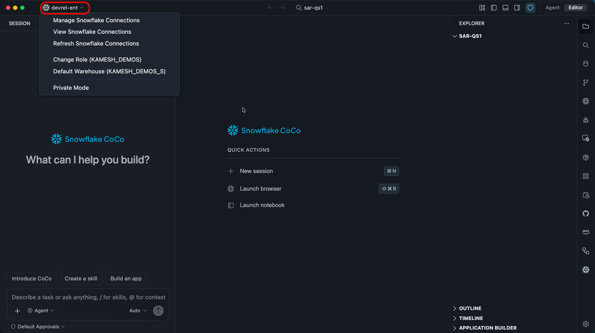
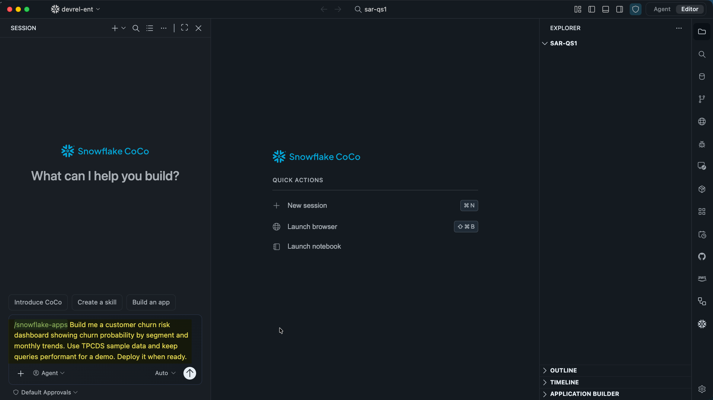
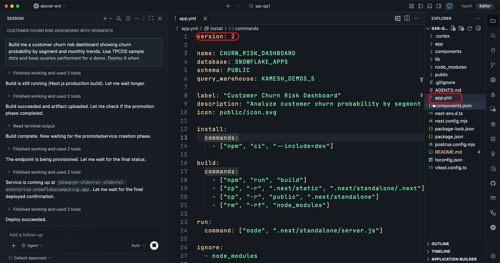
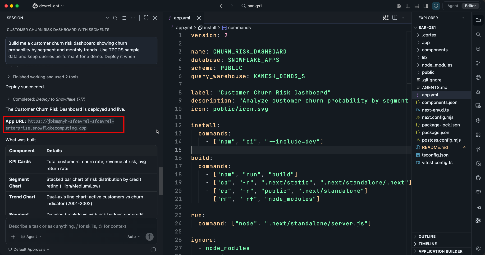
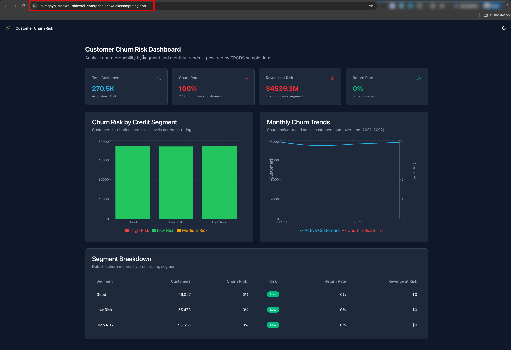
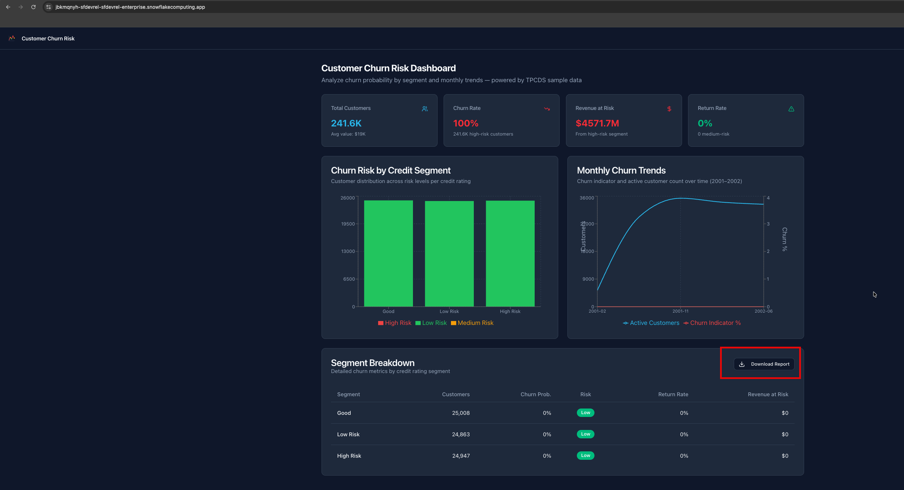

author: Kamesh Sampath
id: getting-started-snowflake-app-runtime
summary: Build and deploy your first runtime app in under 15 minutes using only a plain-English prompt in Cortex Code Desktop.
categories: snowflake-site:taxonomy/solution-center/certification/quickstart,snowflake-site:taxonomy/product/applications-and-collaboration,snowflake-site:taxonomy/snowflake-feature/build
environments: web
status: Published
language: en
duration: 15
feedback link: <https://github.com/Snowflake-Labs/sfguides/issues>

# Get Started with Snowflake App Runtime
<!-- ------------------------ -->
## Overview

Snowflake App Runtime lets you deploy data web apps directly on Snowflake. Your app runs as an **APPLICATION SERVICE** object — no Docker images to build, no container registry to manage, no CI/CD pipeline to configure. Describe what you want, deploy in one command.

In this quickstart you will use Cortex Code Desktop to build and deploy a **customer churn risk dashboard** from a single plain-English prompt. The app is a React/Next.js project that queries TPC-DS sample data already available in every Snowflake account, renders interactive charts, and runs entirely inside Snowflake.

### What You'll Learn

- How to go from a plain-English prompt to a live, deployed web application using Cortex Code Desktop
- The **describe -> scaffold -> deploy -> iterate** development loop
- How the generated `app.yml` manifest configures your app (version, database, schema, name, query_warehouse)
- How runtime apps access Snowflake data with zero credential management (OAuth tokens are injected at runtime)
- How to iteratively add features to a deployed app via follow-up prompts

### What You'll Build

A customer churn risk dashboard with:

- KPI cards: total customers, churn rate, revenue at risk, average return rate
- Segment chart: churn risk distribution by credit rating (High/Medium/Low)
- Trend chart: active customers vs churn indicator over time
- Segment table: detailed breakdown with risk badges per credit segment

All backed by `SNOWFLAKE_SAMPLE_DATA.TPCDS_SF10TCL` tables. Cortex Code automatically selects the right tables and optimizes queries for the large dataset.

### Prerequisites

- Familiarity with web applications (no frontend experience required — Cortex Code generates the code)

### What You'll Need

- A [Snowflake account](https://signup.snowflake.com/?utm_source=snowflake-devrel&utm_medium=developer-guides&utm_cta=developer-guides) with Snowflake App Runtime enabled and **ACCOUNTADMIN** (or a role with **CREATE APPLICATION SERVICE** privileges). Note: Snowflake App Runtime is not available on [trial accounts](https://docs.snowflake.com/en/user-guide/admin-trial-account).
- [Cortex Code Desktop](https://docs.snowflake.com/en/user-guide/cortex-code/cortex-code) installed and connected to your Snowflake account
- [Snowflake CLI](https://docs.snowflake.com/developer-guide/snowflake-cli/installation/installation) **v3.26.0** or later
- [Node.js](https://nodejs.org/) **20+** and **npm**

<!-- ------------------------ -->
## Environment Setup

Verify that the required tools are installed and your Snowflake account has access to the TPC-DS sample data.

### Verify Tools

Confirm Snowflake CLI version (must be 3.26.0 or later):

```bash
snow --version
```

Confirm Node.js version (must be 20 or later):

```bash
node --version
```

Confirm your Snowflake CLI connection is working (see [Managing Snowflake connections](https://docs.snowflake.com/en/developer-guide/snowflake-cli/connecting/configure-connections) if you need to set one up):

```bash
snow connection test
```

Open Cortex Code Desktop and confirm it is connected to your Snowflake account. You should see your account name in the status bar.



### Set Up Sample Data

TPC-DS sample data ships with most Snowflake accounts. Check whether it is already available:

```sql
SHOW DATABASES LIKE 'SNOWFLAKE_SAMPLE_DATA';
```

If the database does not exist, create it from the share and grant access:

```sql
-- Run as ACCOUNTADMIN
CREATE DATABASE SNOWFLAKE_SAMPLE_DATA FROM SHARE SFC_SAMPLES.SAMPLE_DATA;

GRANT IMPORTED PRIVILEGES ON DATABASE SNOWFLAKE_SAMPLE_DATA TO ROLE PUBLIC;
```

Verify the data is accessible:

```sql
SELECT COUNT(*) FROM SNOWFLAKE_SAMPLE_DATA.TPCDS_SF10TCL.CUSTOMER;
```

You should see approximately 65 million rows.

### Create a Working Directory

Create a directory for your project. Cortex Code will scaffold the app here.

```bash
mkdir churn-dashboard && cd churn-dashboard
```

Open this directory in Cortex Code Desktop.

<!-- ------------------------ -->
## Build the App with Cortex Code

This is the core of the quickstart. You will paste a single prompt into Cortex Code Desktop and watch it build the entire application.

### The Prompt

Copy and paste the following into the Cortex Code chat:

```text
/snowflake-apps Build me a customer churn risk dashboard showing churn probability by segment and monthly trends. Use TPCDS sample data and keep queries performant for a demo. Deploy it when ready.
```



### What Happens Next

> **NOTE:**
>
> The full build and deploy process typically takes a few minutes. While Cortex Code works through the steps below, you can follow along in the chat to see each phase as it happens.

Since the prompt includes "Deploy it when ready", Cortex Code works through the full lifecycle automatically — from data discovery to a live, deployed app. Here is what to expect:

**1. Data discovery**

Cortex Code queries `INFORMATION_SCHEMA.TABLES` to find the TPC-DS tables and their row counts. It inspects key table schemas (`CUSTOMER`, `CUSTOMER_DEMOGRAPHICS`, `STORE_SALES`, `STORE_RETURNS`) and decides on a query strategy — using `SAMPLE` clauses on the large fact tables to keep response times fast on the 10TB dataset.

**2. Project scaffold**

Cortex Code copies the Next.js runtime app starter template into your working directory and runs `npm install` to set up dependencies.

**3. Manifest and implementation**

Cortex Code generates the `app.yml` deployment manifest via `snow app setup`, then writes the full application in one pass:

- **API routes** — optimized SQL queries for KPIs, segment breakdowns, and trend data, using `SAMPLE BLOCK` on large fact tables
- **React frontend** — KPI cards, a segment chart, a trend chart, and a segment table with risk badges
- **Custom icon and branding** — replaces the template defaults

You can inspect the generated `app.yml` in the next section.



**4. Deploy**

Cortex Code runs `snow app deploy` automatically, monitors the build and promotion phases, and provides the live App URL when the service reaches **RUNNING** status.



### Test Locally (Optional)

To test locally before deploying, remove "Deploy it when ready." from the prompt. After implementation, you can run `npm run dev` and open [http://localhost:3000](http://localhost:3000) to verify the dashboard locally before deploying. The local dev server connects to Snowflake using your CLI credentials — the same code works in both environments.

<!-- ------------------------ -->
## Understanding app.yml

Take a moment to inspect the generated `app.yml` in your project root. This is the deployment manifest — it tells the Snowflake CLI everything it needs to build, package, and deploy your app.

With Snow CLI v3.26.0+, `snow app setup` generates `app.yml` — the single manifest for all runtime apps. No separate `snowflake.yml` needed.

> **Have an existing project that uses snowflake.yml?**
>
> `app.yml` is the manifest going forward. See [Migrate from snowflake.yml to app.yml](https://docs.snowflake.com/en/developer-guide/snowflake-app-runtime/migrate-to-app-yml) for the migration guide.

```yaml
version: 2                          # Required — tells the CLI to read this file
name: churn-dashboard               # APPLICATION SERVICE object name
database: SNOWFLAKE_APPS            # Must already exist
schema: PUBLIC                      # Must already exist
query_warehouse: COMPUTE_WH        # Warehouse for SQL queries at runtime

label: "Customer Churn Dashboard"
description: "Customer churn risk dashboard using TPC-DS sample data"
icon: "public/icon.svg"

ignore:                             # Excluded from upload
  - node_modules
  - .next
  - .git
```

The `install`, `build`, and `run` phases are also declared in `app.yml`. When omitted, they default to `npm ci`, `npm run build`, and `npm start` respectively.

### Key Fields

| Field | Purpose |
|-------|---------|
| **version: 2** | Required — the CLI ignores deployment keys without it |
| **name** | APPLICATION SERVICE object name. A fully qualified name (`DB.SCHEMA.NAME`) overrides `database` and `schema` |
| **database / schema** | Where the app object is created. Both must already exist |
| **query_warehouse** | Warehouse for SQL queries. Must already exist |
| **label / description / icon** | Presentation metadata visible in `SHOW APPLICATION SERVICES` and Snowsight |
| **ignore** | Glob patterns excluded from the upload |
| **auto_resume** | Resume the service on incoming requests (default: `true`) |
| **auto_suspend_secs** | Idle seconds before suspend (default: `0` = never, minimum: `300`) |

### Packaging and Deploys

There is no `artifacts` field in `app.yml`. The build output **is** the package — whole-project packaging (minus `ignore` patterns). If you need to reshape output, do it in `build.commands`.

Deploys are **declarative**: every `snow app deploy` applies the full manifest. A field you omit goes back to its default — including values previously set with `ALTER APPLICATION SERVICE`. Keep the manifest as your source of truth.

For the complete field reference, see [app.yml manifest for Snowflake App Runtime](https://docs.snowflake.com/en/developer-guide/snowflake-app-runtime/app-yml).

### Compute Options

By default, runtime apps deploy to SPCS (Snowpark Container Services). If your account supports serverless compute (CNG), you can add the following to your `app.yml`:

```yaml
compute_resource: SERVERLESS
```

> **NOTE:**
>
> Serverless provides sub-5-second cold start, automatic suspend on idle, and per-usage billing with no compute pool to manage. When `compute_resource` is omitted, the app uses SPCS with a managed compute pool.

<!-- ------------------------ -->
## Verify the Deployment

Cortex Code deploys the app automatically and outputs the live App URL in the chat. Open it in your browser to see your churn risk dashboard running inside Snowflake.



> **Note on sample data:** The dashboard queries TPC-DS data using `SAMPLE` clauses for performance. Exact numbers (customer counts, revenue figures) will vary between runs because each sample is random. The focus of this quickstart is the app structure and deployment flow, not the analytical accuracy of the churn model.

The endpoint URL does not change when you redeploy. The running service upgrades in place via `CREATE OR ALTER APPLICATION SERVICE` — no DNS changes, no downtime for your users.

To find the App URL manually, you can also query Snowflake directly:

```sql
SHOW APPLICATION SERVICES;
```

```sql
DESCRIBE APPLICATION SERVICE churn_risk_dashboard;
```

The `url` column in the output contains your app's live endpoint.

<!-- ------------------------ -->
## Iterate — Add a Feature

Runtime apps support iterative development through follow-up prompts. You do not need to start over to add features.

Paste this into Cortex Code:

```text
Add a Download Report button that exports the currently filtered churn data as a CSV file.
```

### What Happens

Cortex Code:

1. Adds a new API route that generates CSV from the current filter parameters
2. Adds a **Download Report** button to the dashboard UI
3. Redeploys the updated app automatically

After deployment, open the dashboard and verify the new button appears. Click **Download Report** — a CSV file with the filtered churn data should download.



This is the core development loop: **describe what you want -> Cortex Code implements -> redeploy -> verify**. Each iteration builds on the existing app without starting from scratch.

<!-- ------------------------ -->
## Cleanup

Remove the lab resources when you are done. Tell Cortex Code:

```text
Clean up everything you created for this app — drop the application service and any objects created during deploy.
```

Cortex Code will drop the APPLICATION SERVICE and related objects.

To clean up manually instead, run:

```sql
DROP APPLICATION SERVICE IF EXISTS churn_risk_dashboard;
```

```sql
-- Skip this if you deployed into an existing database like SNOWFLAKE_APPS
DROP DATABASE IF EXISTS <your_app_database>;
```

The sample data database (`SNOWFLAKE_SAMPLE_DATA`) is shared across your account — do not drop it unless you are sure no other workloads use it.

<!-- ------------------------ -->
## Conclusion And Resources

You built and deployed a full-stack web application on Snowflake in under 15 minutes — using only plain-English prompts.

### What You Learned

- How to use Cortex Code Desktop to scaffold, implement, and deploy a runtime app from a single prompt
- The describe -> scaffold -> deploy -> iterate development loop
- How the `app.yml` manifest configures database, schema, warehouse, and compute for your app
- How runtime apps access Snowflake data with zero credential management
- How to iteratively add features to a deployed app via follow-up prompts

### Builder Takeaways

1. **Snowflake App Runtime removes all infrastructure friction** — no Docker, no CI/CD, no container registry. Describe what you want, deploy with `snow app deploy`.
2. **Snowflake data access requires zero credentials** — OAuth tokens are injected automatically at runtime. No connection strings to manage.
3. **Live URLs are stable across redeploys** — the endpoint upgrades in place via `CREATE OR ALTER APPLICATION SERVICE`. No DNS changes for your users.
4. **Local development mirrors deployed behavior** — test with `npm run dev` before deploying. The same code works in both environments.

### Related Resources

- [Snowflake App Runtime documentation](https://docs.snowflake.com/en/developer-guide/snowflake-app-runtime)
- [Getting started with Snowflake App Runtime](https://docs.snowflake.com/en/developer-guide/snowflake-app-runtime/getting-started)
- [app.yml manifest reference](https://docs.snowflake.com/en/developer-guide/snowflake-app-runtime/app-yml)
- [Query Snowflake from your app](https://docs.snowflake.com/en/developer-guide/snowflake-app-runtime/query-snowflake)
- [Deploy targets](https://docs.snowflake.com/en/developer-guide/snowflake-app-runtime/deploy-targets)
- [Migrate from snowflake.yml to app.yml](https://docs.snowflake.com/en/developer-guide/snowflake-app-runtime/migrate-to-app-yml)
- [Developing secure runtime apps](https://docs.snowflake.com/en/developer-guide/snowflake-app-runtime/secure-development)
- [Account administrator setup](https://docs.snowflake.com/en/developer-guide/snowflake-app-runtime/account-admin-setup)
- [Cortex Code Desktop](https://docs.snowflake.com/en/user-guide/cortex-code/cortex-code)
- [Snowflake CLI command reference](https://docs.snowflake.com/en/developer-guide/snowflake-cli/command-reference/overview)
- [TPC-DS sample data](https://docs.snowflake.com/en/user-guide/sample-data-tpcds)
