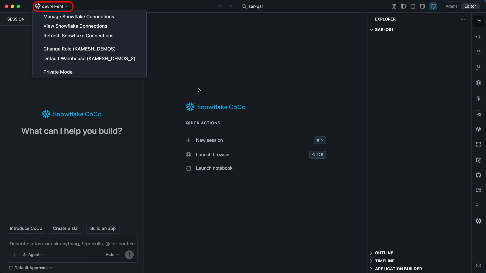
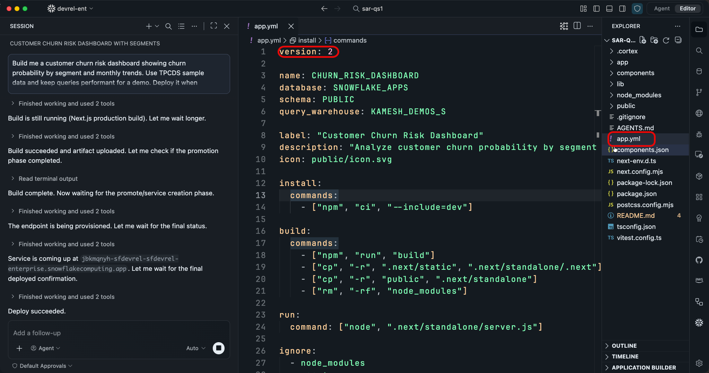
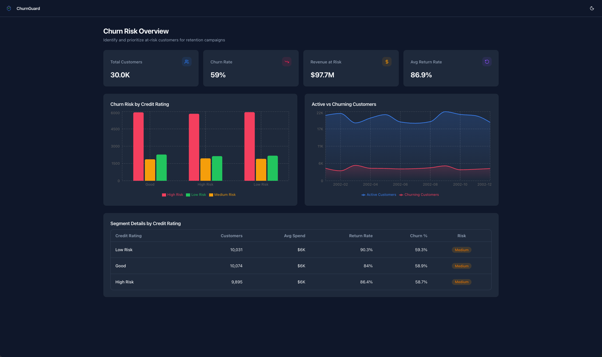
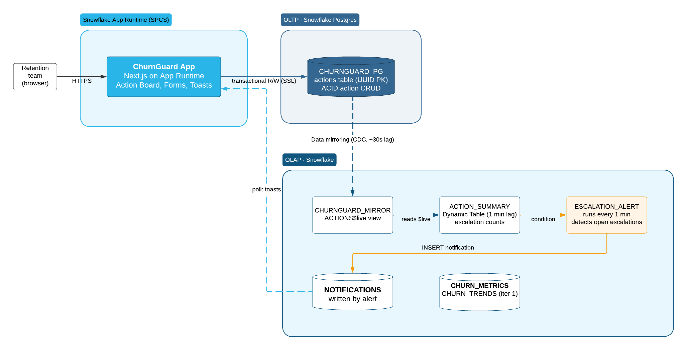
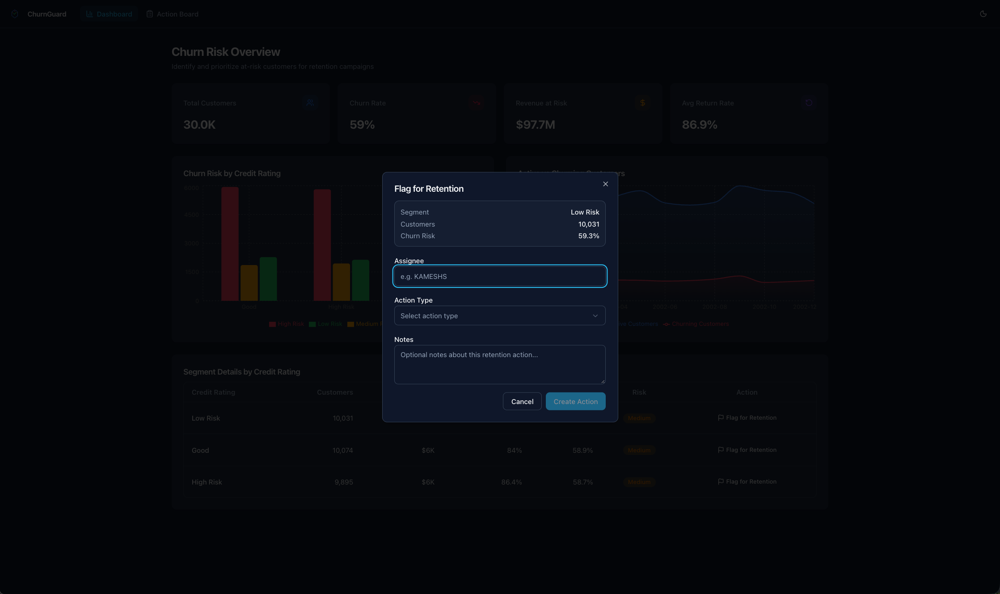
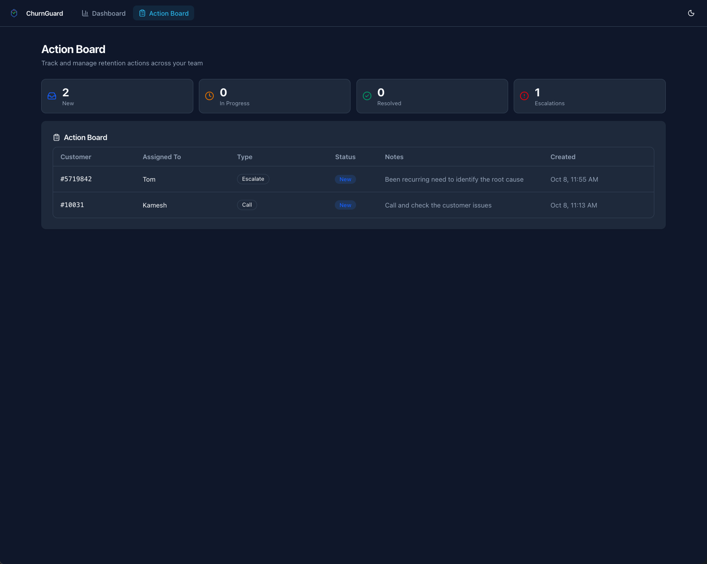

author: Kamesh Sampath
id: getting-started-snowflake-app-runtime
summary: Build and deploy three types of Snowflake App Runtime apps — from an interactive dashboard to a workflow app to an AI-powered agentic experience — using structured prompts in Cortex Code Desktop.
categories: snowflake-site:taxonomy/solution-center/certification/quickstart,snowflake-site:taxonomy/product/applications-and-collaboration,snowflake-site:taxonomy/snowflake-feature/build
environments: web
status: Published
language: en
duration: 45
feedback link: <https://github.com/Snowflake-Labs/sfguides/issues>

# Get Started with Snowflake App Runtime
<!-- ------------------------ -->
## Overview

Snowflake App Runtime lets you deploy full-stack web apps directly on Snowflake. Your app runs as an **APPLICATION SERVICE** object — no Docker images, no container registry, no CI/CD pipeline. Describe what you want, deploy in one command.

In this quickstart you will build **ChurnGuard**, a customer retention platform that evolves across three iterations. Each iteration maps to a core Snowflake App Runtime use case:

| Iteration | App Type | What You Build | Snowflake Features |
|-----------|----------|---------------|-------------------|
| **1 — Explorer** | Data Exploration | Churn risk dashboard with KPIs, segment charts, paginated customer details | Application Service, `querySnowflake`, `app.yml` manifest |
| **2 — Workflow** | Workflow App | Retention action forms, Action Board with KPI summaries, escalation alerts as toasts | Snowflake Postgres, Data Mirroring, Dynamic Tables, Alerts, External Access Integration |
| **3 — Agent** | AI App | Chat panel powered by a Cortex Agent that analyzes data AND creates actions | Cortex Agent, Cortex Analyst, Semantic View, custom tools |

> **Iterative by design:** Each iteration builds on the previous one. Session leaders can stop at any iteration — each produces a deployable, valuable app.

The progression tells a story:
- **See the data** (iteration 1 — read-only dashboard)
- **Act on the data** (iteration 2 — workflow with transactional writes to Snowflake Postgres; data mirrors to Snowflake for DT-powered alerts)
- **Let the agent act** (iteration 3 — Cortex Agent reasons and executes through conversation)

### Prompt Approach

Each iteration uses an [Intent-Driven Development (IDD)](https://blogs.kameshs.dev) structured prompt with five sections:

| Section | Purpose |
|---------|---------|
| **Goal** | Desired outcome |
| **Requirements** | What the app must do (intent statements, not steps) |
| **UI** | Look, feel, layout, and interaction patterns |
| **Constraints** | Scope, safety rules, what not to do |
| **Output** | What success looks like |

This structure tells Cortex Code *what* you want without dictating *how* to implement it.

### What You'll Learn

- The **describe → scaffold → deploy → iterate** development loop
- How runtime apps access Snowflake data with zero credential management
- Write-back patterns with Snowflake Postgres and parameterized queries
- Data mirroring for automatic CDC from Postgres to Snowflake
- Using dynamic tables and alerts to push intelligence into Snowflake so the app stays thin
- Connecting your app to Snowflake Postgres via secrets and External Access Integrations
- Embedding a Cortex Agent into a web app with custom tools
- How the `app.yml` manifest configures your app

### What You'll Need

- A [Snowflake account](https://signup.snowflake.com/?utm_source=snowflake-devrel&utm_medium=developer-guides&utm_cta=developer-guides) with Snowflake App Runtime enabled and **ACCOUNTADMIN** privileges. Note: Snowflake App Runtime is not available on [trial accounts](https://docs.snowflake.com/en/user-guide/admin-trial-account).
- [Cortex Code Desktop](https://docs.snowflake.com/en/user-guide/cortex-code/cortex-code) installed and connected to your Snowflake account
- [Snowflake CLI](https://docs.snowflake.com/developer-guide/snowflake-cli/installation/installation) **v3.26.0** or later
- [Node.js](https://nodejs.org/) **20+** and **npm**

<!-- ------------------------ -->
## Environment Setup

### Verify Tools

Confirm Snowflake CLI version (must be 3.26.0 or later):

```bash
snow --version
```

Confirm Node.js version (must be 20 or later):

```bash
node --version
```

### Clone the Repository

The quickstart repo contains setup scripts and IDD prompts for each iteration:

```bash
git clone https://github.com/Snowflake-Labs/sfguide-getting-started-snowflake-app-runtime.git
cd sfguide-getting-started-snowflake-app-runtime
```

### Add a Snowflake CLI Connection

Add a `quickstart` connection to your Snowflake CLI config (`~/.snowflake/config.toml`):

```toml
[connections.quickstart]
account = "<your_account>"
user = "<your_user>"
authenticator = "externalbrowser"    # or SNOWFLAKE_JWT, etc.
```

Test the connection:

```bash
snow connection test --connection quickstart
```

### Run Infrastructure Setup

The `scripts/setup.sql` script creates the quickstart database and ensures TPC-DS sample data is available:

```bash
snow sql -f scripts/setup.sql --connection quickstart
```

This creates the `SFQUICKSTART_CHURNGUARD` database and verifies `SNOWFLAKE_SAMPLE_DATA` is accessible. If TPC-DS data is not in your account, the script creates it from the Snowflake share. You can also get it from [Snowflake Marketplace](https://docs.snowflake.com/en/user-guide/sample-data-tpcds#getting-tpc-ds-data-from-snowflake-marketplace) by searching for "TPC-DS" and clicking **Get**.

The verification query should return approximately 65 million rows.

### Run RBAC Setup

The `scripts/grants.sql` file creates a dedicated role and grants access to the objects created by setup.sql. Open it, replace `<your_user>` with your Snowflake username, then run:

```bash
snow sql -f scripts/grants.sql --connection quickstart
```

This creates `SFQUICKSTART_CHURNGUARD_ROLE` with ownership of the quickstart database, grants for app deployment, warehouse access, sample data, and Cortex AI functions.

### Run Data Setup

The TPC-DS 10 TB dataset is too large to query interactively from a dashboard. The `scripts/setup-data.sql` script samples the data once and materializes two small tables — `CHURN_METRICS` (~30 K customer rows) and `CHURN_TRENDS` (monthly aggregates) — inside the quickstart database. Dashboard queries then hit these pre-computed tables and return in under a second.

```bash
snow sql -f scripts/setup-data.sql --connection quickstart
```

> **Note:** This script uses `TABLESAMPLE SYSTEM` (block-level sampling) to avoid full table scans on the 29 billion-row fact tables. The CTAS statements take 1–3 minutes on a Medium warehouse.

Verify the tables were created:

```bash
snow sql -q "SELECT 'CHURN_METRICS' AS tbl, COUNT(*) AS rows FROM SFQUICKSTART_CHURNGUARD.PUBLIC.CHURN_METRICS UNION ALL SELECT 'CHURN_TRENDS', COUNT(*) FROM SFQUICKSTART_CHURNGUARD.PUBLIC.CHURN_TRENDS" --connection quickstart --role SFQUICKSTART_CHURNGUARD_ROLE
```

You should see approximately 29 000 rows in `CHURN_METRICS` and 7–12 rows in `CHURN_TRENDS`.

### Prepare Your Working Directory

Checkout the iteration 1 branch:

```bash
git checkout iteration-1/data-exploration
```

The branch includes [`AGENTS.md`](https://github.com/Snowflake-Labs/sfguide-getting-started-snowflake-app-runtime/blob/iteration-1/data-exploration/AGENTS.md) which tells Cortex Code Desktop about your Snowflake environment — connection, role, database, and conventions. CoCo reads this file automatically from the project root.

Open the repo directory in Cortex Code Desktop. Confirm it is connected to your Snowflake account — you should see your account name in the status bar.



> **Note:** Each iteration builds on the previous. Complete iteration 1 before starting iteration 2.

<!-- ------------------------ -->
## Iteration 1: Build ChurnGuard Explorer

This is the core of the quickstart. You will paste a single IDD-structured prompt into Cortex Code Desktop and watch it build the entire application.

### The Prompt

Open [`prompts/01-build-explorer.md`](https://github.com/Snowflake-Labs/sfguide-getting-started-snowflake-app-runtime/blob/iteration-1/data-exploration/prompts/01-build-explorer.md) from the repo and paste the prompt into Cortex Code Desktop chat. It describes the dashboard goal, KPI cards, charts, customer details table, and UI preferences — all in IDD structure.

### What Happens Next

> **NOTE:**
>
> The full build and deploy process typically takes a few minutes. Follow along in the chat to see each phase.

Since the prompt includes deployment intent (via `AGENTS.md` configuration), Cortex Code works through the full lifecycle automatically:

**1. Project scaffold**

Cortex Code copies the Next.js runtime app starter template into your working directory and runs `npm install`.

**2. Manifest and implementation**

Cortex Code generates the `app.yml` deployment manifest via `snow app setup`, then writes the full application:

- **API routes** — simple aggregate queries against the pre-computed `CHURN_METRICS` and `CHURN_TRENDS` tables
- **React frontend** — KPI cards, segment chart, trend chart, and segment table with risk badges
- **Styling** — professional card-based layout per the [UI] specifications



**3. Deploy**

Cortex Code runs `snow app deploy` automatically, monitors the build and promotion phases, and provides the live App URL when the service reaches **RUNNING** status.


### Verify

Open the App URL in your browser to see your ChurnGuard Explorer dashboard.



> **Note on data:** The dashboard queries the pre-computed `CHURN_METRICS` and `CHURN_TRENDS` tables created by `setup-data.sql`. Because those tables use sampled TPC-DS data, exact numbers may vary if you re-run the setup script.

The endpoint URL does not change when you redeploy. The running service upgrades in place — no DNS changes, no downtime.

### Test Locally (Optional)

To test locally before deploying, you can run `npm run dev` and open [http://localhost:3000](http://localhost:3000). The local dev server connects to Snowflake using your CLI credentials.

<!-- ------------------------ -->
## Understanding app.yml

Inspect the generated `app.yml` in your project root. With Snow CLI v3.26.0+, `snow app setup` generates `app.yml` — the single manifest for all runtime apps.

> **Have an existing project that uses snowflake.yml?**
>
> `app.yml` is the manifest going forward. See [Migrate from snowflake.yml to app.yml](https://docs.snowflake.com/en/developer-guide/snowflake-app-runtime/migrate-to-app-yml).


For the complete reference, see [app.yml manifest for Snowflake App Runtime](https://docs.snowflake.com/en/developer-guide/snowflake-app-runtime/app-yml).

### Key Fields

| Field | Purpose |
|-------|---------|
| **version: 2** | Required — the CLI ignores deployment keys without it |
| **name** | APPLICATION SERVICE object name |
| **database / schema** | Where the app object is created. Both must already exist |
| **query_warehouse** | Warehouse for SQL queries at runtime |
| **label / description / icon** | Presentation metadata |
| **ignore** | Glob patterns excluded from the upload |
| **auto_resume** | Resume the service on incoming requests (default: `true`) |
| **auto_suspend_secs** | Idle seconds before suspend (default: `0` = never, minimum: `300`) |

Deploys are **declarative**: every `snow app deploy` applies the full manifest. Iteration 2 extends `app.yml` with `secrets:` and `external_access_integrations:` so the app can reach Snowflake Postgres; otherwise only the application code changes between iterations.

<!-- ------------------------ -->
## Iteration 2: Add Workflow Capabilities

In this iteration you turn ChurnGuard from a read-only dashboard into a workflow tool. Teams can flag high-risk customers, assign retention actions, and track resolution. The architecture splits OLTP and OLAP cleanly:



The app reads and writes only Postgres for actions, so the Action Board is always consistent. Mirroring, the dynamic table, and the alert form a separate Snowflake-side pipeline whose only output the app consumes is the `NOTIFICATIONS` table.

### Setup

Checkout the iteration 2 branch:

```bash
git checkout iteration-2/workflow-app
```

**Step 1 — Rerun grants** (includes Postgres, EAI, mirror, and alert privileges):

```bash
snow sql -f scripts/grants.sql --connection quickstart
```

**Step 2 — Create Postgres instance and data mirror.** Open [`prompts/02-postgres-setup.md`](https://github.com/Snowflake-Labs/sfguide-getting-started-snowflake-app-runtime/blob/iteration-2/workflow-app/prompts/02-postgres-setup.md) and paste the prompt into Cortex Code Desktop. This uses the `/snowflake-postgres` skill to:

- Create the `CHURNGUARD_PG` Postgres instance
- Create the `actions` table inside Postgres (with a primary key for mirroring)
- Store credentials as Snowflake SECRETs (`CHURNGUARD_PG_SECRET`, `CHURNGUARD_PG_HOST_SECRET`)
- Create a network rule, External Access Integration, and network policy (locked to SPCS egress IPs)
- Set up data mirroring to the `CHURNGUARD_MIRROR` database

> **Note:** The Postgres instance takes ~3-5 minutes to provision. The prompt handles waiting and verification.

**Step 3 — Create DT, notifications table, and alert:**

```bash
snow sql -f scripts/iteration-2-setup.sql --connection quickstart
```

This creates the `ACTION_SUMMARY` dynamic table (reads from the mirrored `$live` view), `NOTIFICATIONS` table, and `ESCALATION_ALERT`.

### The Prompt

Open [`prompts/02-add-workflow.md`](https://github.com/Snowflake-Labs/sfguide-getting-started-snowflake-app-runtime/blob/iteration-2/workflow-app/prompts/02-add-workflow.md) from the repo and paste the prompt into Cortex Code. It describes the workflow goal: flag customers for retention, write actions to Postgres with parameterized queries, read from Postgres for instant consistency, and display global toast notifications powered by Snowflake alerts.

### What Happens

Cortex Code modifies the existing app (it does not rebuild from scratch):

**1. Postgres connection**

A `lib/postgres.ts` module creates a connection pool using credentials from Snowflake SECRETs (mounted via `app.yml`). The connection uses SSL as required by Snowflake Postgres.

**2. API routes for writes**

New API routes use the Postgres pool with parameterized queries (`$1`, `$2`) to INSERT and UPDATE the actions table:

```typescript
const pool = getPgPool()
await pool.query(
  "INSERT INTO actions (customer_key, assigned_to, action_type, notes) VALUES ($1, $2, $3, $4)",
  [customerKey, assignedTo, actionType, notes]
);
```

Action list and KPI summaries are also read from Postgres for instant write-read consistency.

**3. Data mirroring to Snowflake**

Changes written to Postgres replicate automatically to Snowflake via data mirroring. The `ACTION_SUMMARY` dynamic table reads from the mirrored `$live` view — the app never queries the DT directly.

**4. Alert-driven notifications**

The `ESCALATION_ALERT` runs every minute in Snowflake. When it detects open escalations in the dynamic table, it writes a row to the `NOTIFICATIONS` table. The app polls this table and shows dismissible toast notifications — no email integration or webhook required.

**5. Manifest wiring**

The `app.yml` gains `secrets:` (PG credentials and host) and `external_access_integrations:` (network egress to Postgres) entries.

**6. Redeploy**

The app redeploys to the same URL. The upgrade is in-place — no downtime.

### Key Concepts

> **Snowflake Postgres**
>
> Snowflake Postgres is a fully managed PostgreSQL service inside Snowflake. It provides ACID transactions and sub-millisecond row-level writes — ideal for OLTP workloads that Snowflake's analytical tables aren't optimized for. See [Snowflake Postgres](https://docs.snowflake.com/en/user-guide/snowflake-postgres/about).

> **Data mirroring**
>
> Data mirroring continuously replicates Postgres data to Snowflake via automatic CDC. The `$live` view provides ~30-second freshness without waiting for the full refresh interval. This bridges OLTP writes with OLAP analytics — no ETL pipeline required. See [Data mirroring](https://docs.snowflake.com/en/user-guide/snowflake-postgres/postgres-data-mirroring).

> **External Access Integration**
>
> An EAI grants your app permission to make outbound network connections. It binds a network rule (which host:port to allow) with secrets (credentials). The `app.yml` references both the EAI and the secrets so the app can connect to Postgres at runtime. See [External network access](https://docs.snowflake.com/en/developer-guide/external-network-access/creating-using-external-network-access).

> **Dynamic tables**
>
> A dynamic table continuously materializes a query result. The `ACTION_SUMMARY` table computes action counts with a 1-minute target lag — the alert reads pre-computed values instead of scanning raw data. See [Dynamic tables](https://docs.snowflake.com/en/user-guide/dynamic-tables-about).

> **Snowflake alerts**
>
> An alert evaluates a condition on a schedule and executes a SQL action when the condition is true. `ESCALATION_ALERT` checks the dynamic table for open escalations and writes in-app notifications — pushing intelligence into Snowflake so the app stays thin. See [Alerts](https://docs.snowflake.com/en/user-guide/alerts).

> **Owner's rights**
>
> All queries run as the service's own identity (owner's rights). This is simpler and more reliable than caller's rights — no per-user grants needed. See [Query Snowflake](https://docs.snowflake.com/en/developer-guide/snowflake-app-runtime/query-snowflake).

### Verify

Open the app and test the full workflow:

1. Navigate to a high-risk customer in the customer details table
2. Click **Flag** and fill in the form — try "Escalate" as the action type
3. Switch to the **Action Board** page to see the new task and summary KPI cards (both read from Postgres — no sync delay)
4. Click the status badge to advance it through the workflow (New → In Progress → Resolved)
5. Wait ~1-2 minutes — data mirrors to Snowflake, the dynamic table refreshes, and the alert fires
6. A toast notification appears for the escalation
7. Dismiss the notification





<!-- ------------------------ -->
## Iteration 3: Embed a Cortex Agent

In this iteration the manual workflow from iteration 2 becomes agent-powered. Instead of clicking buttons to flag customers and create tasks, users converse with a Cortex Agent that can both analyze churn data and execute retention actions.

### Setup

Run the iteration 3 setup script to create the stored procedure that the agent will use as a custom tool:

```bash
snow sql -f scripts/iteration-3-setup.sql --connection quickstart
```

See [`scripts/iteration-3-setup.sql`](https://github.com/Snowflake-Labs/sfguide-getting-started-snowflake-app-runtime/blob/iteration-3/ai-app/scripts/iteration-3-setup.sql) for the full SQL. The `CREATE_RETENTION_ACTION` procedure inserts into the ACTIONS table and returns a confirmation message — the agent calls this when a user asks to create a retention action.

Checkout the iteration 3 branch:

```bash
git checkout iteration-3/ai-app
```

### The Prompt

Open [`prompts/03-add-agent.md`](https://github.com/Snowflake-Labs/sfguide-getting-started-snowflake-app-runtime/blob/iteration-3/ai-app/prompts/03-add-agent.md) from the repo and paste the prompt into Cortex Code. It describes embedding a Cortex Agent with a chat panel that can both analyze churn data (via Cortex Analyst) and create retention actions (via the stored procedure custom tool).

### What Happens

**1. Semantic view**

Cortex Code creates a semantic view over the churn data tables. This gives the Cortex Agent structured access to query customer, demographics, sales, and returns data through natural language.

**2. Cortex Agent**

Cortex Code creates a `CHURNGUARD_AGENT` object with:
- **Cortex Analyst tool** — the semantic view, so the agent can answer data questions by generating SQL
- **Custom tool** — the `CREATE_RETENTION_ACTION` stored procedure from iteration 2, so the agent can create retention tasks

**3. Chat panel UI**

The chat panel calls the agent via the `agent:run` REST API from a Next.js API route. The UI handles the ~30-second response time with a multi-phase loading experience:
- Animated thinking indicator while the agent reasons
- Step-by-step status updates as the agent calls tools
- Smooth transition to the formatted response

**4. Thread management**

Threads persist conversation context. The chat panel creates a thread on first message and reuses it for follow-ups, so the agent remembers what was discussed.

### Key Concepts

> **Cortex Agents**
>
> A Cortex Agent is a fully managed agentic platform. It reasons over requests, plans work, calls tools, and generates responses. See [Cortex Agents](https://docs.snowflake.com/en/user-guide/snowflake-cortex/cortex-agents).

> **Custom tools**
>
> Stored procedures and UDFs can be registered as agent tools. The agent decides when to call them based on the user's request. See [Create and manage agents](https://docs.snowflake.com/en/user-guide/snowflake-cortex/cortex-agents-manage).

> **agent:run REST API**
>
> Your app calls the agent through the REST API, using threads to maintain conversation context. See [Cortex Agents Run API](https://docs.snowflake.com/en/user-guide/snowflake-cortex/cortex-agents-run).

### Verify

Open the app and test the agent:

1. Open the chat panel
2. Ask: *"What are the highest risk customers in the Low credit segment?"*
3. The agent queries the data and returns results


4. Ask: *"Create retention tasks for the top 3 — call type for all of them"*
5. The agent calls the `CREATE_RETENTION_ACTION` tool and confirms


6. Switch to the **Action Board** — the new tasks appear, created by the agent

<!-- ------------------------ -->
## Cleanup

Remove all quickstart resources by running the cleanup script:

```bash
snow sql -f scripts/cleanup.sql --connection quickstart
```

This drops the APPLICATION SERVICE, the `SFQUICKSTART_CHURNGUARD` database (including all tables, procedures, agents, and semantic views), and the `SFQUICKSTART_CHURNGUARD_ROLE`.

The sample data database (`SNOWFLAKE_SAMPLE_DATA`) is shared across your account — do not drop it unless you are sure no other workloads use it.

To clean up manually:

```sql
USE ROLE ACCOUNTADMIN;
DROP APPLICATION SERVICE IF EXISTS SFQUICKSTART_CHURNGUARD.PUBLIC.CHURNGUARD;
DROP DATABASE IF EXISTS SFQUICKSTART_CHURNGUARD;
DROP ROLE IF EXISTS SFQUICKSTART_CHURNGUARD_ROLE;
```

<!-- ------------------------ -->
## Conclusion And Resources

You built a customer retention platform that evolved across three iterations — from a read-only dashboard to a workflow app to an AI-powered agentic experience.

### What You Learned

| Iteration | Key Takeaway |
|-----------|-------------|
| **1 — Explorer** | Snowflake App Runtime removes all infrastructure friction. Describe what you want, deploy with `snow app deploy`. |
| **2 — Workflow** | Snowflake Postgres for transactional writes; data mirroring bridges to DT + alerts. Secrets and EAI wire the connectivity. |
| **3 — Agent** | A Cortex Agent embedded in your app can both analyze data and execute actions. The app becomes agentic infrastructure. |

### The Development Loop

Every iteration followed the same pattern:

1. **Describe** what you want in an IDD-structured prompt
2. **Cortex Code** scaffolds or modifies the app
3. **Deploy** with `snow app deploy` — stable URL, zero downtime
4. **Verify** in the browser
5. **Iterate** with follow-up prompts

### Related Resources

- [Snowflake App Runtime documentation](https://docs.snowflake.com/en/developer-guide/snowflake-app-runtime)
- [Getting started with Snowflake App Runtime](https://docs.snowflake.com/en/developer-guide/snowflake-app-runtime/getting-started)
- [app.yml manifest reference](https://docs.snowflake.com/en/developer-guide/snowflake-app-runtime/app-yml)
- [Query Snowflake from your app](https://docs.snowflake.com/en/developer-guide/snowflake-app-runtime/query-snowflake)
- [Developing secure runtime apps](https://docs.snowflake.com/en/developer-guide/snowflake-app-runtime/secure-development)
- [Access control for Snowflake App Runtime](https://docs.snowflake.com/en/developer-guide/snowflake-app-runtime/access-control)
- [Snowflake Postgres](https://docs.snowflake.com/en/user-guide/snowflake-postgres/about)
- [Postgres data mirroring](https://docs.snowflake.com/en/user-guide/snowflake-postgres/postgres-data-mirroring)
- [Cortex Agents](https://docs.snowflake.com/en/user-guide/snowflake-cortex/cortex-agents)
- [Cortex Agents Run API](https://docs.snowflake.com/en/user-guide/snowflake-cortex/cortex-agents-run)
- [Snowflake-managed MCP server](https://docs.snowflake.com/en/user-guide/snowflake-cortex/cortex-agents-mcp)
- [Deploy targets](https://docs.snowflake.com/en/developer-guide/snowflake-app-runtime/deploy-targets)
- [Scale and suspend](https://docs.snowflake.com/en/developer-guide/snowflake-app-runtime/scale-and-suspend)
- [Cortex Code Desktop](https://docs.snowflake.com/en/user-guide/cortex-code/cortex-code)
- [Snowflake CLI command reference](https://docs.snowflake.com/en/developer-guide/snowflake-cli/command-reference/overview)
- [TPC-DS sample data](https://docs.snowflake.com/en/user-guide/sample-data-tpcds)
- [Intent-Driven Development (IDD)](https://blogs.kameshs.dev)
