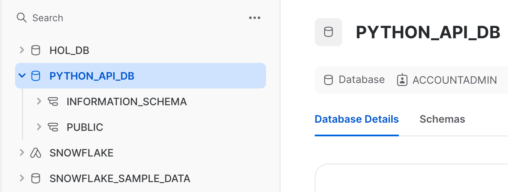
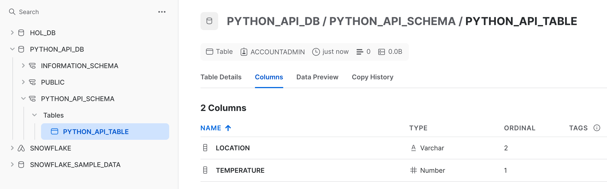
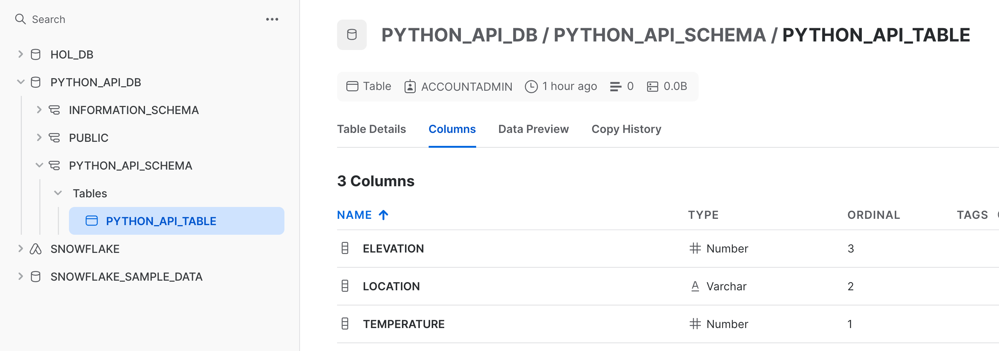
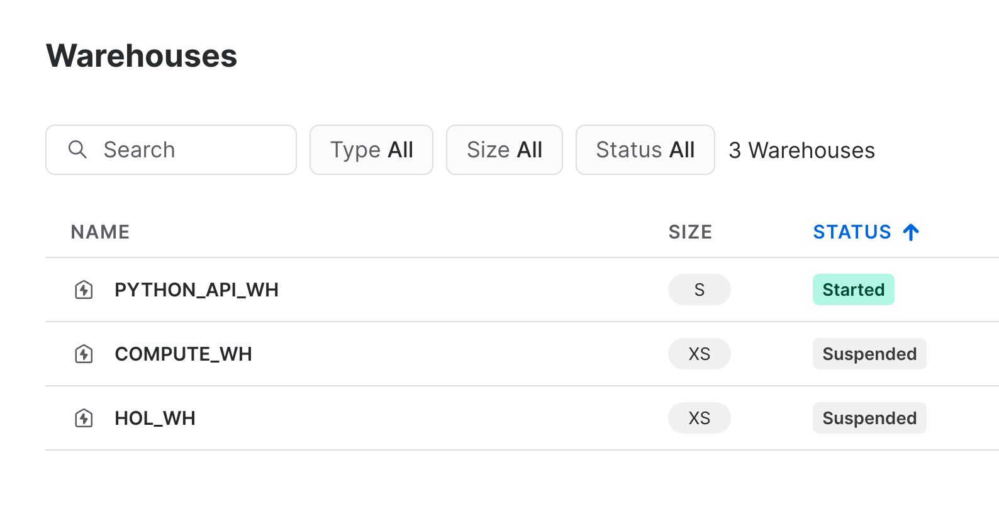
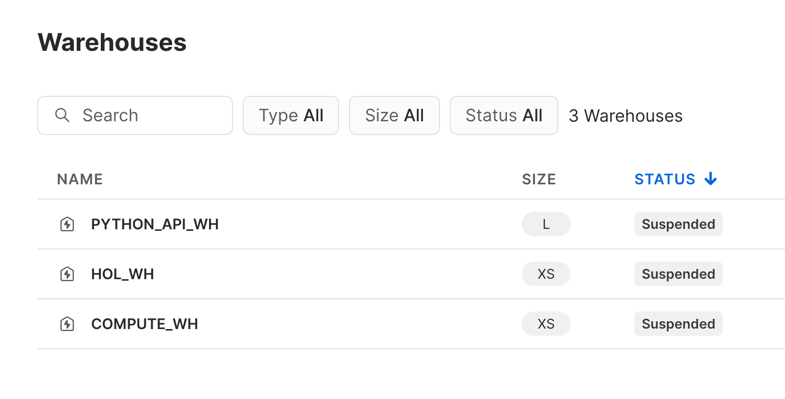
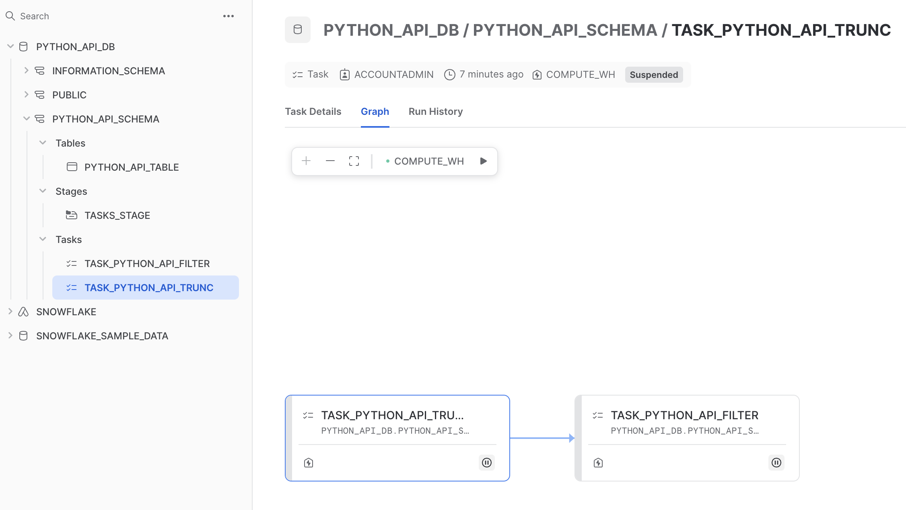
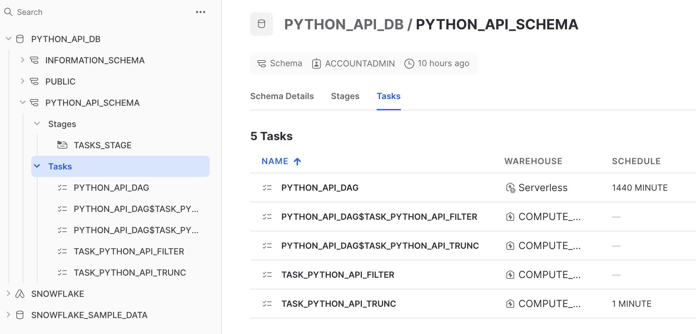
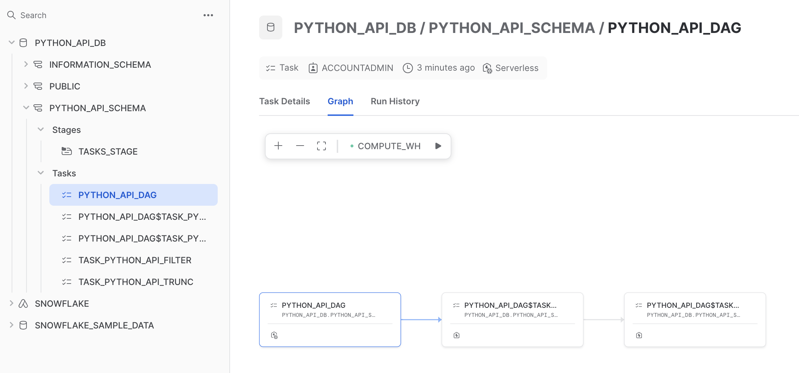
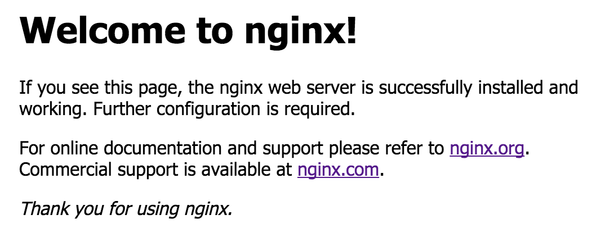

author: Gilberto Hernandez
id: getting-started-snowflake-python-api
summary: Learn how to get started with Snowflake's Python API to manage Snowflake objects and tasks.
categories: Getting-Started
environments: web
status: Published 
feedback link: https://github.com/Snowflake-Labs/sfguides/issues
tags: Getting Started, Data Science, Data Engineering, Twitter 

# Getting Started with the Snowflake Python API

<!-- ------------------------ -->
## Overview 
Duration: 1

The Snowflake Python API allows you to manage Snowflake using Python. Using the API, you're able to create, delete, and modify tables, schemas, warehouses, tasks, and much more, in many cases without needing to write SQL or use the Snowflake Connector for Python. In this Quickstart, you'll learn how to get started with the Snowflake Python API for object and task management with Snowflake.


### Prerequisites
- Familiarity with Python
- Familiarity with Jupyter Notebooks

### What You’ll Learn 
- How to install the Snowflake Python API library
- How to create a Root object to use the API
- How to create tables, schemas, and warehouses using the API
- How to create and manage tasks using the API
- How to use Snowpark Container Services with the Snowflake Python API

### What You’ll Need 
- A Snowflake account ([trial](https://signup.snowflake.com/), or otherwise)
- A code editor that supports Jupyter notebooks, or ability to run notebooks in your browser using `jupyter notebook`

### What You’ll Build 
- Multiple objects within Snowflake

<!-- ------------------------ -->
## Install the Snowflake Python API
Duration: 8

> aside negative
> 
> **Important**
> The Snowflake Python API is currently supported in Python versions 3.8, 3.9., and 3.10.

Before installing the Snowflake Python API, we'll start by activating a Python environment.

**Conda**

If you're using conda, you can create and activate a conda environment using the following commands:

```bash
conda create -n <env_name> python==3.10
```

```bash
conda activate <env_name>
```

**venv**

If you're using venv, you can create and activate a virtual environment using the following commands:

```bash
python3 -m venv '.venv'
```

```bash
source '.venv/bin/activate'
```

The Snowflake Python API is available via PyPi. Install it by running the following command:

```bash
pip install snowflake -U
```


<!-- ------------------------ -->
## Overview of the Snowflake Python API
Duration: 5

Let's quickly take a look at how the Snowflake Python API is organized:


| **Module**  | **Description**  |
|---|---|
| `snowflake.core`  | Defines an Iterator to represent a certain resource instances fetched from the Snowflake database  |
| `snowflake.core.paging`  |   |
| `snowflake.core.exceptions`  |   |
| `snowflake.core.database`  |  Manages Snowflake databases |
| `snowflake.core.schema`  | Manages Snowflake schemas  |
| `snowflake.core.task`  | Manages Snowflake Tasks  |
| `snowflake.core.task.context`  | Manage the context in a Snowflake Task  |
| `snowflake.core.task.dagv1`  | A set of higher-level APIs than the lower-level Task APIs in snowflake.core.task to more conveniently manage DAGs|
| `snowflake.core.compute_pool`  |  Manages Snowpark Container Compute Pools |
| `snowflake.core.image_repository`  | Manages Snowpark Container Image Repositories  |
| `snowflake.core.service`  | Manages Snowpark Container Services  |


`snowflake.core` represents the entry point to the core Snowflake Python APIs that manage Snowflake objects. To use the Snowflake Python API, you'll follow a common pattern:

1. Establish a session using Snowpark or a Python connector connection, representing your connection to Snowflake.

2. Import and instantiate the `Root` class from `snowflake.core`, and pass in the Snowpark session object as an argument. You'll use the resulting `Root` object to use the rest of the methods and types in the Snowflake Python API.

Here's an example of what this pattern typically looks like:

```py
from snowflake.snowpark import Session
from snowflake.core import Root

connection_params = {
    "account": "ACCOUNT-IDENTIFIER",
    "user": "USERNAME",
    "password": "PASSWORD"
}
session = Session.builder.configs(connection_params).create()
root = Root(session)
```

The `connection_params` dictionary shown above is included for the purposes of demonstration only, specifying only the required connection parameters. In practice, consider using a configuration file with named connections that can be passed into `Session.builder.configs()`. For more information, see [Connecting to Snowflake with the Snowflake Python API](https://docs.snowflake.com/en/LIMITEDACCESS/snowflake-python-api/snowflake-python-connecting-snowflake).

> aside negative
> 
> **NOTE**
> The Snowflake Python API can establish a connection to Snowflake via a Snowpark session or a Python connector connection. In the example above, we opt for a Snowpark session.

Let's get started!

<!-- ------------------------ -->
## Set up your development environment
Duration: 10

In this Quickstart, we'll walk through a Jupyter notebook to incrementally showcase the capabilities of the Snowflake Python API. Let's start by setting up your development environment so that you can run the notebook.

1. First, download the [
Quickstart: Getting Started with the Snowflake Python API](https://github.com/Snowflake-Labs/sf-samples/blob/main/samples/sfguide-getting-started-snowflake-python-api/getting_started_snowflake_python_api.ipynb) notebook from the accompanying repo for this Quickstart.

2. Next, open the notebook in a code editor that supports Jupyter notebooks (i.e., Visual Studio Code). 
Alternatively, open the notebook in your browser by starting a notebook server with `jupyter notebook` and navigating to the notebook in your browser. To do this, you'll need to ensure your environment can run a notebook (be sure to run `conda install notebook` in your terminal, then start the notebook server).

Now run the first cell within the notebook, the one containing the import statements.

```py
from snowflake.snowpark import Session
from snowflake.core import Root
from snowflake.core.database import Database
from snowflake.core.schema import Schema
from snowflake.core.table import Table, TableColumn, PrimaryKey
from snowflake.core.warehouse import Warehouse
```

> aside negative
> 
> **Note**
> Upon running this cell, you may be prompted to set your Python kernel. We activated a conda environment earlier, so we'll select conda as our Python kernel (i.e., something like `~/miniconda3/bin/python`).

In this cell, we import Snowpark and the core Snowflake Python APIs that manage Snowflake objects.

Next, configure the `connection_params` dictionary with your account credentials and run the cell.

```py
connection_params = {
    "account": "YOUR-ACCOUNT-IDENTIFIER",
    "user": "USERNAME",
    "password": "PASSWORD"
}
```

Create a Snowpark session and pass in your connection parameters to establish a connection to Snowflake.

```py
session = Session.builder.configs(connection_params).create()
```

Finally, create a `Root` object by passing in your `session` object to the `Root` constructor. Run the cell.

```py
root = Root(session)
```

And that's it! By running these four cells, we're now ready to use the Snowflake Python API.

<!-- ------------------------ -->
## Create a database, schema, and table
Duration: 5

Let's use our `root` object to create a database, schema, and table in your Snowflake account.

Create a database by running the following cell in the notebook:

```py
database = root.databases.create(Database(name="PYTHON_API_DB"), mode="orreplace")
```

This line of code creates a database in your account called `PYTHON_API_DB`, and is functionally equivalent to the SQL command `CREATE OR REPLACE DATABASE PYTHON_API_DB;`. This line of code follows a common pattern for managing objects in Snowflake. Let's examine this line of code in a bit more detail:

* `root.databases.create()` is used to create a database in Snowflake. It accepts two arguments, a `Database` object and a mode.

* We pass in a `Database` object with `Database(name="PYTHON_API_DB")`, and set the name of the database using the `name` argument. Recall that we imported `Database` on line 3 of the notebook.

* We specify the creation mode by passing in the `mode` argument. In this case, we set it to `orreplace`, but other valid values are `ifnotexists` (functionally equivalent to `CREATE IF NOT EXISTS` in SQL). If a mode is not specified, the default value will be `errorifexists`, which means an exception will be raised if the object already exists in Snowflake.

* We'll manage the database programmatically by storing a reference to the database in an object we created called `database`.

Navigate back to the databases section of your Snowflake account. If successful, you should see the **PYTHON_API_DB** database.



Next, create a schema and table in that schema by running the following cells:

```py
schema = database.schemas.create(Schema(name="PYTHON_API_SCHEMA"), mode="orreplace")
```

```py
table = schema.tables.create(Table(
        name="PYTHON_API_TABLE", 
        columns=[TableColumn("TEMPERATURE", "int", nullable=False), TableColumn("LOCATION", "string")],
    ), 
    mode="orreplace")
```

The code in both of these cells should look and feel familiar. They follow the pattern you saw in the cell that created the `PYTHON_API_DB` database. The first cell creates a schema in the database created earlier (note `.schemas.create()` is called on the `database` object from earlier). The next cell creates a table in that schema, with two columns and their data types specified - `TEMPERATURE` as `int` and `LOCATION` as `string`.

After running these two cells, navigate back to your Snowflake account and confirm that the objects were created.




<!-- ------------------------ -->
## Retrieve object data
Duration: 5

Let's cover a couple of ways to retrieve metadata about an object in Snowflake. Run the following cell:

```py
table_details = table.fetch()
```

`fetch()` returns a `TableModel` object. We can then call `.to_dict()` on the resulting object to view information about the object. Run the next cell:

```py
table_details.to_dict()
```

In the notebook, you should see a dictionary printed that contains metadata about the **PYTHON_API_TABLE**  table.

```py
{'name': 'PYTHON_API_TABLE',
 'kind': 'TABLE',
 'enable_schema_evolution': False,
 'change_tracking': False,
 'comment': '',
 'created_on': datetime.datetime(2023, 12, 1, 19, 37, 29, 766000, tzinfo=datetime.timezone(datetime.timedelta(days=-1, seconds=57600))),
 'database_name': 'PYTHON_API_DB',
 'schema_name': 'PYTHON_API_SCHEMA',
 'rows': 0,
 'bytes': 0,
 'owner': 'ACCOUNTADMIN',
 'automatic_clustering': False,
 'search_optimization': False,
 'owner_role_type': 'ROLE'}
```

Note, however, that some information about the table isn't included, namely column information. To include column information, we'll pass in the `deep` argument to the `fetch()` method and set it to `True`. Run the following cells:

```py
table_details_full = table.fetch(deep=True)
```

```py
table_details_full.to_dict()
```

Take a took at the dictionary:

```py
{'name': 'PYTHON_API_TABLE',
 'kind': 'TABLE',
 'enable_schema_evolution': False,
 'change_tracking': False,
 'comment': '',
 'created_on': datetime.datetime(2023, 12, 1, 19, 37, 29, 766000, tzinfo=datetime.timezone(datetime.timedelta(days=-1, seconds=57600))),
 'database_name': 'PYTHON_API_DB',
 'schema_name': 'PYTHON_API_SCHEMA',
 'rows': 0,
 'bytes': 0,
 'owner': 'ACCOUNTADMIN',
 'automatic_clustering': False,
 'search_optimization': False,
 'owner_role_type': 'ROLE'}
{'name': 'PYTHON_API_TABLE',
 'kind': 'TABLE',
 'enable_schema_evolution': False,
 'change_tracking': False,
 'columns': [{'name': 'TEMPERATURE',
   'datatype': 'NUMBER',
   'nullable': False,
   'identity': False},
  {'name': 'LOCATION',
   'datatype': 'TEXT',
   'nullable': True,
   'identity': False}],
 'constraints': [],
 'comment': '',
 'created_on': datetime.datetime(2023, 12, 4, 19, 22, 11, 576000, tzinfo=datetime.timezone(datetime.timedelta(days=-1, seconds=57600))),
 'database_name': 'PYTHON_API_DB',
 'schema_name': 'PYTHON_API_SCHEMA',
 'rows': 0,
 'bytes': 0,
 'owner': 'ACCOUNTADMIN',
 'automatic_clustering': False,
 'search_optimization': False,
 'owner_role_type': 'ROLE'}
```

Note how the dictionary now contains column information in `columns`, as well as constraints on the table (in this case, there are no constraints on the table, so the value of `constraints` is an empty array).

Object metadata is useful when building business logic in your application. For example, you could imagine building logic that executes depending on certain information about an object. `fetch()` would be helpful in retrieving object metadata in such scenarios.

<!-- ------------------------ -->
## Programmatically update a table
Duration: 5

Let's take a look at how you might programmatically add a column to a table. Let's add a new column to the **PYTHON_API_TABLE** table. Currently, it has two columns, `TEMPERATURE` and `LOCATION`.

Run the following cell:

```py
table_details_full.columns.append(TableColumn(name="ELEVATION", datatype="int", nullable=False, constraints=[PrimaryKey()]))
```

In this line of code, we define a new column (called `ELEVATION`), the column's data type, indicates that it is not nullable, and define it as the table's primary key. 

Note, however, that this line of code does not create the column (you can confirm this by navigating to Snowflake and inspecting the table after running the cell). Instead, this column definition is appended to the array that represents the table's columns in the TableModel. To view this array, take a look at the value of `columns` in the previous step.

To modify the table and add the column, run the next cell:

```py
table.create_or_update(table_details_full)
```

In this line, we call `create_or_update()` on the object representing **PYTHON_API_TABLE**  and pass in the  updated value of `table_details_full`. This line adds the `ELEVATION` column to **PYTHON_API_TABLE**. To quickly confirm, run the following cell:

```py
table.fetch(deep=True).to_dict()
```

This should be the output:

```py
{'name': 'PYTHON_API_TABLE',
 'kind': 'TABLE',
 'enable_schema_evolution': False,
 'change_tracking': False,
 'comment': '',
 'created_on': datetime.datetime(2023, 12, 1, 19, 37, 29, 766000, tzinfo=datetime.timezone(datetime.timedelta(days=-1, seconds=57600))),
 'database_name': 'PYTHON_API_DB',
 'schema_name': 'PYTHON_API_SCHEMA',
 'rows': 0,
 'bytes': 0,
 'owner': 'ACCOUNTADMIN',
 'automatic_clustering': False,
 'search_optimization': False,
 'owner_role_type': 'ROLE'}
{'name': 'PYTHON_API_TABLE',
 'kind': 'TABLE',
 'enable_schema_evolution': False,
 'change_tracking': False,
 'columns': [{'name': 'TEMPERATURE',
   'datatype': 'NUMBER',
   'nullable': False,
   'identity': False},
  {'name': 'LOCATION',
   'datatype': 'TEXT',
   'nullable': True,
   'identity': False}],
 'constraints': [],
 'comment': '',
 'created_on': datetime.datetime(2023, 12, 4, 19, 22, 11, 576000, tzinfo=datetime.timezone(datetime.timedelta(days=-1, seconds=57600))),
 'database_name': 'PYTHON_API_DB',
 'schema_name': 'PYTHON_API_SCHEMA',
 'rows': 0,
 'bytes': 0,
 'owner': 'ACCOUNTADMIN',
 'automatic_clustering': False,
 'search_optimization': False,
 'owner_role_type': 'ROLE'}
{'name': 'PYTHON_API_TABLE',
 'kind': 'TABLE',
 'enable_schema_evolution': False,
 'change_tracking': False,
 'columns': [{'name': 'TEMPERATURE',
   'datatype': 'NUMBER',
   'nullable': False,
   'identity': False},
  {'name': 'LOCATION',
   'datatype': 'TEXT',
   'nullable': True,
   'identity': False},
  {'name': 'ELEVATION',
   'datatype': 'NUMBER',
   'nullable': False,
   'identity': False}],
 'constraints': [{'name': 'SYS_CONSTRAINT_e9b4b75b-a336-4616-8d94-3266e5846562',
   'column_names': ['ELEVATION'],
   'constraint_type': 'PRIMARY KEY'}],
 'comment': '',
 'created_on': datetime.datetime(2023, 12, 4, 19, 22, 11, 576000, tzinfo=datetime.timezone(datetime.timedelta(days=-1, seconds=57600))),
 'database_name': 'PYTHON_API_DB',
 'schema_name': 'PYTHON_API_SCHEMA',
 'rows': 0,
 'bytes': 0,
 'owner': 'ACCOUNTADMIN',
 'automatic_clustering': False,
 'search_optimization': False,
 'owner_role_type': 'ROLE'}
```

Take a look at the value of `columns`, as well as the value of `constraints`, which now includes the `ELEVATION` column.

Finally, visually confirm by navigating to your Snowflake account and inspecting the table.




<!-- ------------------------ -->
## Create, suspend, and delete a warehouse
Duration: 5

You can also manage warehouses with the Snowflake Python API. Let's use the API to create, suspend, and delete a warehouse.

Run the following cell:

```py
warehouses = root.warehouses
```

Calling the `.warehouses` property on our `root` returns the collection of warehouses associated with our session. We'll manage warehouses in our session using the resulting `warehouses` object.

Run the next cell:

```py
python_api_wh = Warehouse(
    name="PYTHON_API_WH",
    warehouse_size="SMALL",
    auto_suspend=500,
)

warehouse = warehouses.create(python_api_wh)
```

In this cell, we define a new warehouse by instantiating `Warehouse` and specifying the warehouse's name, size, and auto suspend policy. The auto suspend timeout is in units of seconds. In this case, the warehouse will suspend after 8.33 minutes of inactivity. 

We then create the warehouse by calling `create()` on our warehouse collection. We store the reference in the resulting `warehouse_ref` object. Navigate to your Snowflake account and confirm that the warehouse was created.



To retrieve information about the warehouse, run the next cell:

```py
warehouse_details = warehouse.fetch()
warehouse_details.to_dict()
```

The code in this cell should look familiar, as it follows the same patterns we used to fetch table data in a previous step. The output should be:

```py
{'name': 'PYTHON_API_WH',
 'max_cluster_count': 1,
 'min_cluster_count': 1,
 'scaling_policy': 'STANDARD',
 'auto_suspend': 500,
 'auto_resume': 'false',
 'resource_monitor': 'null',
 'comment': '',
 'enable_query_acceleration': 'false',
 'query_acceleration_max_scale_factor': 8,
 'type': 'STANDARD',
 'size': 'Small',
 'tag': None}
```

If we had several warehouses in our session, we could use the API to iterate through them or to search for a specific warehouse. Run the next cell:

```py
warehouse_list = warehouses.iter(like="PYTHON_API_WH")
result = next(warehouse_list)
result.to_dict()
```

In this cell, we call `iter()` on the warehouse collection and pass in the `like` argument, which is used to return any warehouses that has a name matching the string we pass in. In this case, we passed in the name of the warehouse we defined earlier, but this argument is generally a case-insensitive string that functions as a filter, with support for SQL wildcard characters like `%` and `_`. You should see the following output after running the cell, which shows that we successfully returned a matching warehouse:

```py
{'name': 'PYTHON_API_WH',
 'max_cluster_count': 1,
 'min_cluster_count': 1,
 'scaling_policy': 'STANDARD',
 'auto_suspend': 500,
 'auto_resume': 'false',
 'resource_monitor': 'null',
 'comment': '',
 'enable_query_acceleration': 'false',
 'query_acceleration_max_scale_factor': 8,
 'type': 'STANDARD',
 'size': 'Small',
 'tag': None}
```

Let's programmatically modify the warehouse. Run the following cell, which changes the warehouse size to `LARGE`:

```py
warehouse.create_or_update(Warehouse(
    name="PYTHON_API_WH",
    warehouse_size="LARGE",
    auto_suspend=500,
))
```

Confirm that the warehouse size was indeed updated to `LARGE` by running the next cell:

```py
warehouse.fetch().size
```

Navigate to your Snowflake account and confirm the change in warehouse size.



Finally, delete the warehouse and close your Snowflake session by running the final cell:

```py
warehouse.delete()
session.close()
```

Navigate once again to your Snowflake account and confirm the deletion of the warehouse.


<!-- ------------------------ -->
## Managing tasks
Duration: 10

You can also manage tasks using the Snowflake Python API. Let's use the API to manage a couple of basic stored procedures using tasks.

First, create a stage within the **PYTHON_API_SCHEMA** called **TASKS_STAGE**. This stage will hold the stored procedures and any dependencies those procedures will need.

Next, in the notebook, run the following cell:

```python
def trunc(session: Session, from_table: str, to_table: str, count: int) -> str:
  session.table(from_table).limit(count).write.save_as_table(to_table)
  return "Truncated table successfully created!"

def filter_by_shipmode(session: Session, mode: str) -> str:
  session.table("snowflake_sample_data.tpch_sf100.lineitem").filter(col("L_SHIPMODE") == mode).limit(10).write.save_as_table("filter_table")
  return "Filter table successfully created!"

task1 = Task(
    "task_python_api_trunc",
    definition=StoredProcedureCall(trunc, stage_location="@PYTHON_API_DB.PYTHON_API_SCHEMA.TASKS_STAGE", packages=["snowflake-snowpark-python"]),
    warehouse="COMPUTE_WH",
    schedule=timedelta(minutes=1)
)

task2 = Task(
    "task_python_api_filter",
    definition=StoredProcedureCall(filter_by_shipmode, stage_location="@PYTHON_API_DB.PYTHON_API_SCHEMA.TASKS_STAGE", packages=["snowflake-snowpark-python"]),
    warehouse="COMPUTE_WH"
)

task2.predecessors = [task1.name]
```

This cell does a few things:

* Creates a couple of basic functions that will be run as stored procedures. `trunc()` creates a truncated version of an input table and `filter_by_shipmode()` creates a 10 row table created by filtering the **SNOWFLAKE_SAMPLE_DATA.TPCH_SF100.LINEITEM** by ship mode. The functions are intentionally basic in nature and are intended to be used for demonstration purposes.

* Defines two tasks, `task1` and `task2`, whose definitions are stored procedures that each refer to the functions created. We specify the stage that will hold the contents of the stored procedure, and also specify packages that are dependencies. Task 1 is the root task, so we specify a warehouse and a schedule (run every minute).

* Sets task 1 as a predecessor to task 2, which links the tasks, creating a DAG (albeit, a small one).

Note that this cell does not create the tasks – it only defines them. To create the tasks, run the next cell:

```python
tasks = root.databases["python_api_db"].schemas["python_api_schema"].tasks

trunc_task = tasks.create(task1, mode=CreateMode.or_replace)
filter_task = tasks.create(task2, mode=CreateMode.or_replace)
```

This cell creates the two tasks by first retrieving a TaskCollection object (`tasks`) and adding the two tasks to that object. Navigate back to your Snowflake account and confirm that the two tasks now exist.




When created, tasks are suspended by default. To start them, call `.resume()` on the task. Run the following cell in the notebook:

```python
trunc_task.resume()
```

Navigate to your Snowflake account and observe that the `trunc_task` task was started. You can check the status of the task by running the next cell:

```python
taskiter = tasks.iter()
for t in taskiter:
    print("Name: ", t.name, "| State: ", t.state)
```

You should see an output similar to the following:

```console
Name:  TASK_PYTHON_API_FILTER | State:  suspended
Name:  TASK_PYTHON_API_TRUNC | State:  started
```

Let's wrap things up by suspending the task, and then deleting both tasks. Run the following cell:

```python
trunc_task.suspend()
```

Navigate to your Snowflake account to confirm that the task is indeed suspended.

(Optional) Finally, delete both tasks by running the following cell:

```python
trunc_task.delete()
filter_task.delete()
```
<!-- ------------------------ -->
## Managing DAGs
Duration: 8

When the number of tasks that must be managed becomes very large, individually managing each task can be a challenge. The Snowflake Python API provides functionality to orchestrate tasks with a higher level DAG API. Let's take a look at how it can be used.

Run the following cell in the notebook:

```python
dag_name = "python_api_dag" 
dag = DAG(dag_name, schedule=timedelta(days=1))
with dag:
    dag_task1 = DAGTask("task_python_api_trunc", StoredProcedureCall(trunc, stage_location="@PYTHON_API_DB.PYTHON_API_SCHEMA.TASKS_STAGE", packages=["snowflake-snowpark-python"]), warehouse="COMPUTE_WH")
    dag_task2 = DAGTask("task_python_api_filter", StoredProcedureCall(filter_by_shipmode, stage_location="@PYTHON_API_DB.PYTHON_API_SCHEMA.TASKS_STAGE", packages=["snowflake-snowpark-python"]), warehouse="COMPUTE_WH")
    dag_task1 >> dag_task2
dag_op = DAGOperation(schema)
dag_op.deploy(dag, mode="orreplace") 
```

This cell does the following:

* Creates a DAG object by calling the `DAG` constructor, and specifying a DAG name and schedule.

* Defines DAG-specific tasks using the `DAGTask` constructor. Note that the constructor accepts the same arguments that were specified in an earlier cell (in the previous step) when using the `StoredProcedureCall` class.

* Specifies `dag_task1` as the root task and predecessor to `dag_task2`, with more convenient syntax.

* Deploys the DAG to the **PYTHON_API_SCHEMA** schema.

Navigate to your Snowflake account and confirm the creation of the DAG.





Start the DAG by starting the root task by running the following cell:

```python
dag_op.run(dag)
```

Optionally, navigate to your Snowflake account and confirm that **PYTHON_API_DAG$TASK_PYTHON_API_TRUNC** task was started. The call to the function will not succeed as we are not calling it with any of its required arguments. The purpose of this cell is simply to demonstrate how to programatically start the DAG.

Finally, delete the DAG by running the following cell:

```python
dag_op.delete(dag)
```
<!-- ------------------------ -->
## Managing Snowpark Container Services
Duration: 10

> aside negative
> 
> **Important**
> At the time of writing, Snowpark Container Services is in Public Preview in select AWS regions. To use Snowpark Container Services, your Snowflake account must be in one of the select AWS regions. For more information, refer to [Snowpark Container Services – Available Regions](https://docs.snowflake.com/en/developer-guide/snowpark-container-services/overview#available-regions).

Snowpark Container Services is a fully managed container offering designed to facilitate the deployment, management, and scaling of containerized applications within the Snowflake ecosystem. The service enables users to run containerized workloads directly within Snowflake. Let's take a look at how you can manage Snowpark Container Services with the Snowflake Python API.

For this section, we'll switch to a new notebook. The notebook contains **sample code** that runs an NGINX web server using Snowpark Container Services, all running in Snowflake. The notebook is provided for convenience and demonstrative purposes.

 Download and open the following notebook in your preferred code editor, or with `jupyter notebook`: [Snowpark Container Services – Python API](https://github.com/Snowflake-Labs/sf-samples/blob/main/samples/sfguide-getting-started-snowflake-python-api/snowpark_container_services_python_api.ipynb).
 
 In the first cell, we import the required libraries, create our connection to Snowflake, and instantiate our `Root` object. We also create objects to represent references to existing Snowflake objects in a Snowflake account. Our Snowpark Container Services will reside in the **PUBLIC** schema.

 ```python
 from pprint import pprint
from snowflake.core import Root
from snowflake.core.service import ServiceSpecInlineText
from snowflake.snowpark import Session

session = Session.builder.config("connection_name", "python_api").create()
api_root = Root(session)
database = api_root.databases["spcs_python_api_db"]
schema = database.schemas["public"]
 ```

When orchestrating Snowpark Container Services, there are a couple of patterns you'll typically follow:

* **Define a compute pool** – A compute pool represents a set of compute resources (virtual machine nodes). You can think of these compute resources as analogous (but not equivalent) to Snowflake virtual warehouses. The service (in this case, our NGINX service) will run in the compute pool. Compute-intensive services will require high-powered compute pools (i.e., many cores, many GPUs), while less intensive services can run in smaller compute pools (fewer cores). For more information, see [Snowpark Container Services: Working with compute pools](https://docs.snowflake.com/en/developer-guide/snowpark-container-services/working-with-compute-pool).

* **Define the service** – A service is how you run an application container. The services require, at minimum, a specification and a compute pool. A specification contains the information needed to run the application container, like the path to a container image, endpoints that the services will expose, and more. The specification is written in YML. The compute pool is what the service will run in. For more information, see [Snowpark Container Services: Working with services](https://docs.snowflake.com/en/developer-guide/snowpark-container-services/working-with-services).

Let's cover these patterns in the notebook. Take a look at the following cell:

```python
new_compute_pool_def = ComputePool(
    name="MyComputePool"
    instance_family="CPU_X64_XS",
    min_nodes=1,
    max_nodes=2,
)

new_compute_pool = api_root.compute_pools.create(new_compute_pool_def)
```

In this cell, we define a compute pool using the `ComputePool` constructor, and provide a name, instance family, and the min and max number of nodes. We then create the compute pool and pass in the compute pool definition. 

Here are some details behind the arguments passed into the constructor:

* `instance_family` – An instance family refers to the type of machine you want to provision for the nodes in the compute pool. Different machines have different amounts of compute resources in their compute pools. In this cell, we use `CPU_X64_XS`, which is the smallest available machine type. See [CREATE COMPUTE POOL: Required parameters](https://docs.snowflake.com/en/sql-reference/sql/create-compute-pool#required-parameters) for more detail.

* `min_nodes`, `max_nodes` – The lower and upper bounds for nodes in the compute pool. After creating a compute pool, Snowflake launches the minimum number of nodes. New nodes are created – up to the maximum specified – when the running nodes cannot take any additional workload. This is called **autoscaling**. For more information, see [Snowpark Container Services: Working with compute pools](https://docs.snowflake.com/en/developer-guide/snowpark-container-services/working-with-compute-pool).

It's time to build our service. Take a look at the next cell:

```python
image_repository = schema.image_repositories["MyImageRepository"]
```

In this cell, we retrieve the repository containing our container image. This repository is in the Snowflake account, listed as a stage in the **PUBLIC** schema. We'll need this reference to fetch container image information, which you can see referenced in the next cell:

```python
from textwrap import dedent
from io import BytesIO
from snowflake.core.service import Service
session.use_role("my_role")  # Perhaps this role has permission to create and run a service
specification = dedent(f"""\
            spec:
              containers:
              - name: web-server
                image: {image_repository.fetch().repository_url}/nginx:latest
              endpoints:
              - name: ui
                port: 80
                public: true
             """)

service_def = Service(
    name="MyService",
    compute_pool="MyComputePool",
    spec=ServiceSpecInlineText(specification),
    min_instances=1,
    max_instances=1,
)

nginx_service = schema.services.create(service_def)
```

This cell defines the service specification, the service, and creates the service for our NGINX web server. You should note a few things:

* `specification` – We define the specification using a Python f-string. The string is formatted as YML. It contains the name of the container, a path to the container image, and endpoints that the service will expose to be able to access the service publicly. Although the specification is defined inline, it could also been a reference to a **.yml** file in a stage.

* `service_def` – We define a service with the `Service` constructor, passing in a name for the service, the compute pool it should run in, a path to the specification, and the total number of instances for the service. Note that `ServiceSpecInlineText` is used when setting `spec` in this cell. This is because the specification was defined inline as an f-string. Multiple instances of the service could be run, but in this example we want only one instance of the service to run, which is set via `min_instances` and `max_instances`.

With the service created, the next cell will output the status of the service.

```python
pprint(nginx_service.get_service_status(timeout=5))
```

Sample output of the cell:

```console
{'auto_resume': True,
 'auto_suspend_secs': 3600,
 'instance_family': 'CPU_X64_XS',
 'max_nodes': 1,
 'min_nodes': 1,
 'name': 'MyService'}
```

It'll take a few minutes for the endpoints that are needed to access the service to be provisioned. The next cell isn't specific to Snowpark Container Services or the Snowflake Python API – it simply provides a handy way to inspect whether the endpoints are ready. Note that we fetch the endpoints by calling `.fetch().public_endpoints` on our service object.

```python
import json, time
while True:
    public_endpoints = nginx_service.fetch().public_endpoints
    try:
        endpoints = json.loads(public_endpoints)
    except json.JSONDecodeError:
        print(public_endpoints)
        time.sleep(15)
    else:
        break
```

Sample output of the cell:

```console
Endpoints provisioning in progress... check back in a few minutes
Endpoints provisioning in progress... check back in a few minutes
Endpoints provisioning in progress... check back in a few minutes
```

Once the endpoints are provisioned, the next cell will open the public endpoints in your browser. 

```python
print(f"Visiting {endpoints['ui']} in your browser. You may need to log in there.")
import webbrowser
webbrowser.open(f"https://{endpoints['ui']}")
```

Sample output of the cell:

```console
Visiting fekqoap7-orgname-sslpr.snowflakecomputing.app in your browser. You may need to log in there.
```

If successful, you'll see the NGINX success page in your browser when visiting the endpoint:



With just a few lines of Python, we were able to run an NGINX web server in Snowflake using Snowpark Container Services.

The next cells will suspend and delete the compute pool and the service:

```python
new_compute_pool_def.suspend()
nginx_service.suspend()
```

```python
new_compute_pool_def.delete()
nginx_service.delete()
```
<!-- ------------------------ -->
## Conclusion
Duration: 1

Congratulations! In this Quickstart, you learned the fundamentals for managing Snowflake objects, tasks, DAGs, and Snowpark Container Services using the Snowflake Python API.

### What we've covered

* Installing the Snowflake Python API
* Creating databases, schemas, and tables
* Retrieving object information
* Programmatically updating an object
* Creating, suspending, and deleting warehouses
* How to manage tasks and DAGs
* How to manage Snowpark Container Services

### Additional resources

* [Snowflake Documentation: Snowflake Python API](https://docs.snowflake.com/en/LIMITEDACCESS/snowflake-python-api/snowflake-python-overview)

* [Snowflake Python API Reference Documentation](https://docs.snowflake.com/en/LIMITEDACCESS/snowflake-python-api/reference/0.1.0/index.html)
